# Garbage Collection

C、C++ 等语言采用**手动**管理内存的方法，比如使用 `malloc` 和 `free` 进行指针的动态分配和释放。但手动管理容易导致内存泄漏（双重释放、释放后使用等）和类型安全问题，且这样的存储错误难以发现。

另一种是**自动**进行的内存管理。理想情况下，我们可以说任何不是动态活跃（不会在未来的计算中使用）的记录都是「**垃圾**」(garbage)，即已分配但不再使用的存储空间。但判断一个对象是否为垃圾是**不可判定的**(undecidable)，因此需要依赖一种保守近似：从程序变量出发，通过任何指针链都无法到达的堆分配记录是垃圾。

- 不可达 -> 垃圾
- 垃圾 -> 可能可达

一个对象 `x` 是**可达的**(reachable)当且仅当：

- 某个寄存器包含指向 `x` 的指针，或者
- 另一个可达对象 `y` 包含指向 `x` 的指针

**垃圾回收**(garbage collection, **GC**)是无需显式调用 `free`，回收已分配但不再使用的存储空间的过程。它不是由编译器执行的，而是由运行时系统（与编译代码链接的支持程序）完成的。

???+ example "例子"

    <div style="text-align: center">
        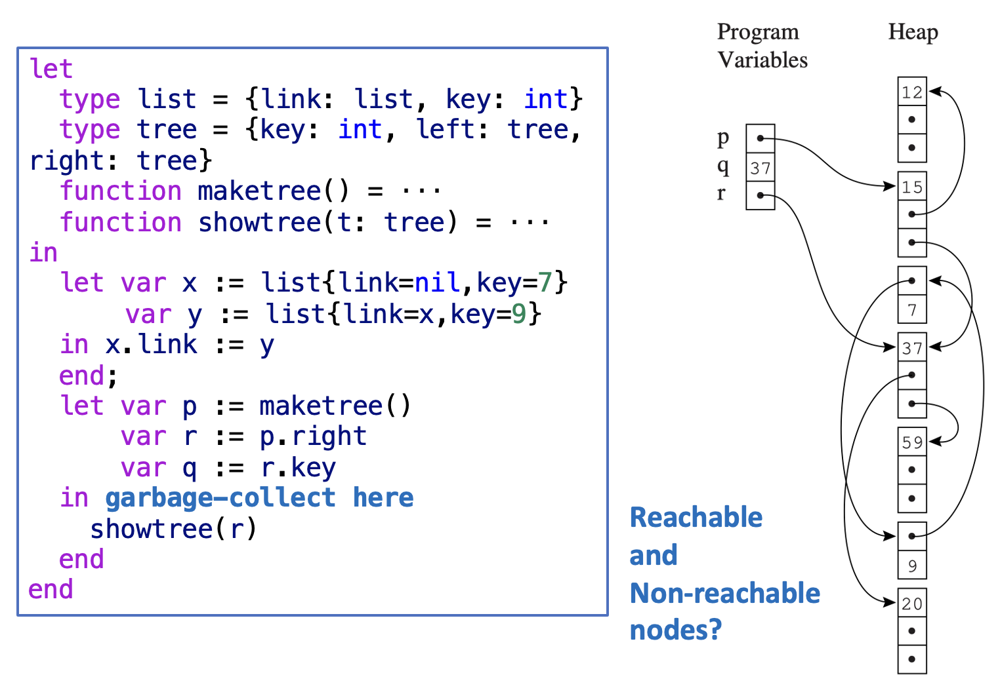
    </div>


## Mark-and-Sweep Collection

程序变量和堆分配记录构成一个**有向图**(directed graph)，这些变量是该图的**根**。如果一个节点存在一条有向边路径 r -> ... -> n（其中 r 是某个根），则该节点是可达的。

- 我们可借助 **DFS**（深度优先搜索）等图搜索算法可以**标记**(mark)所有可达节点

    $$
    \begin{aligned}
    &\textbf{function } \mathrm{DFS}(x)\\
    &\textbf{if } x \text{ is a pointer into the heap}\\
    &\qquad \textbf{if} \text{ record } x \text{ is not marked}\\
    &\qquad\qquad \text{mark } x\\
    &\qquad\qquad \textbf{for} \text{ each field } f_i \text{ of record } x\\
    &\qquad\qquad\qquad \mathrm{DFS}(x.f_i)
    \end{aligned}
    $$

    <div style="text-align: center">
        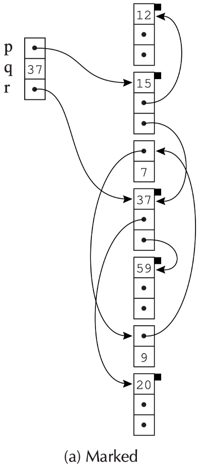
    </div>

- **清扫**(sweep)整个堆，查找未被标记的节点（即**垃圾**），通过链表（**空闲列表**(freelist)）将这些垃圾连接起来；另外还应取消所有已标记节点的标记，为下一次垃圾回收做准备

    <div style="text-align: center">
        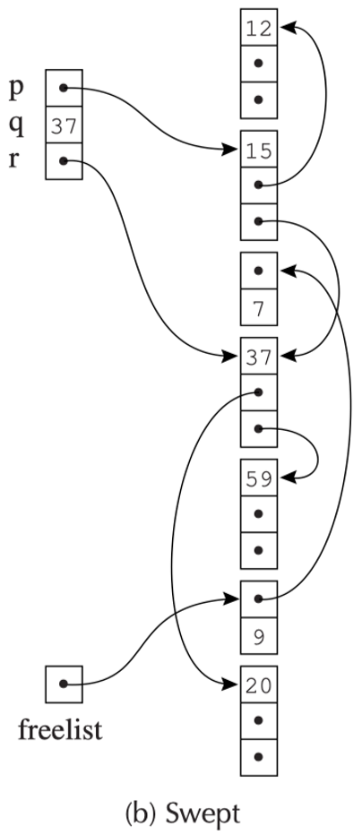
    </div>

完整的「标记-清扫回收」(mark-and-sweep collection)算法如下：

<div class="grid">

$$
\begin{aligned}
&\textit{Mark phase:} \\
&\mathbf{for}\ \text{each root } v \\
&\qquad \mathrm{DFS}(v)
\end{aligned}
$$

$$
\begin{aligned}
&\textit{Sweep phase:} \\
&p \leftarrow \text{first address in heap} \\
&\mathbf{while}\ p < \text{last address in heap} \\
&\qquad \mathbf{if}\ \text{record } p\ \text{is marked} \\
&\qquad\qquad \text{unmark } p \\
&\qquad \mathbf{else}\ \text{let } f_1\ \text{be the first field in } p \\
&\qquad\qquad p.f_1 \leftarrow \mathtt{freelist} \\
&\qquad\qquad \mathtt{freelist} \leftarrow p \\
&\qquad p \leftarrow p + (\text{size of record } p)
\end{aligned}
$$

</div>

- GC 之后，编译程序恢复执行
- 每当需要在堆上分配一个新记录时，它就从空闲列表中获取一个记录；如果列表为空，则通过另一次 GC 来补充

GC 的成本：

- 时间：
    - DFS：与它标记的节点数成正比
    - 清扫阶段：与堆的大小（H）成正比

- 空间：
    - 由于 DFS 算法是递归的，因此在最坏情况下，活动记录栈的长度可能会超过整个堆
    - 解决方案：使用**显式栈**代替递归，即使用 H 个词而不是 H 个活跃记录

        $$
        \begin{aligned}
        &\mathbf{function}\ \mathrm{DFS}(x) \\
        &\qquad \mathbf{if}\ x\ \text{is a pointer and record }x\text{ is not marked} \\
        &\qquad\qquad \text{mark }x \\
        &\qquad\qquad t \leftarrow 1 \\
        &\qquad\qquad \mathrm{stack}[t] \leftarrow x \\
        &\qquad\qquad \mathbf{while}\ t > 0\quad //\ \text{stack is non-empty} \\
        &\qquad\qquad\qquad x \leftarrow \mathrm{stack}[t];\ t \leftarrow t - 1 \\
        &\qquad\qquad\qquad \mathbf{for}\ \text{each field }f_i\text{ of record }x \\
        &\qquad\qquad\qquad\qquad \mathbf{if}\ x.f_i\text{ is a pointer and record }x.f_i\text{ is not marked} \\
        &\qquad\qquad\qquad\qquad\qquad \text{mark }x.f_i \\
        &\qquad\qquad\qquad\qquad\qquad t \leftarrow t + 1;\ \mathrm{stack}[t] \leftarrow x.f_i
        \end{aligned}
        $$


        - $t$：栈顶索引
        - $\text{stack}$：词列表


### Pointer Reversal

下面考虑不在算法中用到栈，这样可以在 DFS 算法中节省更多空间。

字段 $x.f_i$ 的内容被压入栈后，算法不会再访问原始位置 $x.f_i$。我们不想浪费空间，因此 $x.f_i$ 将被设置为指向到达 $x$ 的记录。当 $x.f_i$ 的相关操作完成后，我们可以通过 $x.f_i$ 返回并处理 $x$ 的剩余部分，这正是栈的含义（这样的操作被称为**指针反转**(pointer reversal)）。当栈弹出时，字段 $x.f_i$ 将恢复为原始值。

算法如下：

$$
\begin{aligned}
&\mathbf{function}\ \mathrm{DFS}(x) \\
&\mathbf{if}\ x\ \text{is a pointer and record }x\text{ is not marked} \\
&\qquad t \leftarrow \mathrm{nil} \\
&\qquad \text{mark }x;\ \mathrm{done}[x] \leftarrow 0 \\
&\qquad \mathbf{while}\ \mathrm{true} \\
&\qquad\qquad i \leftarrow \mathrm{done}[x] \\
&\qquad\qquad \mathbf{if}\ i < \#\text{ of fields in record }x \\
&\qquad\qquad\qquad y \leftarrow x.f_i \\
&\qquad\qquad\qquad \mathbf{if}\ y\ \text{is a pointer and record }y\text{ is not marked} \\
&\qquad\qquad\qquad\qquad x.f_i \leftarrow t;\ t \leftarrow x;\ x \leftarrow y \\
&\qquad\qquad\qquad\qquad \text{mark }x;\ \mathrm{done}[x] \leftarrow 0 \\
&\qquad\qquad\qquad \mathbf{else} \\
&\qquad\qquad\qquad\qquad \mathrm{done}[x] \leftarrow i + 1 \\
&\qquad\qquad \mathbf{else} \\
&\qquad\qquad\qquad y \leftarrow x;\ x \leftarrow t \\
&\qquad\qquad\qquad \mathbf{if}\ x = \mathrm{nil}\ \mathbf{then}\ \mathbf{return} \\
&\qquad\qquad\qquad i \leftarrow \mathrm{done}[x] \\
&\qquad\qquad\qquad t \leftarrow x.f_i;\ x.f_i \leftarrow y \\
&\qquad\qquad\qquad \mathrm{done}[x] \leftarrow i + 1
\end{aligned}
$$

- $\text{done}$：每个记录中已处理的字段数  
- $t$：栈顶  
- 如果 $i = \text{done}[x]$，则 $x.f_i$ 是下一个节点的“栈链接”
- 当弹出栈时，$x.f_i$ 恢复到其原始值

???+ example "例子"

    === "Step 1"

        <div style="text-align: center">
            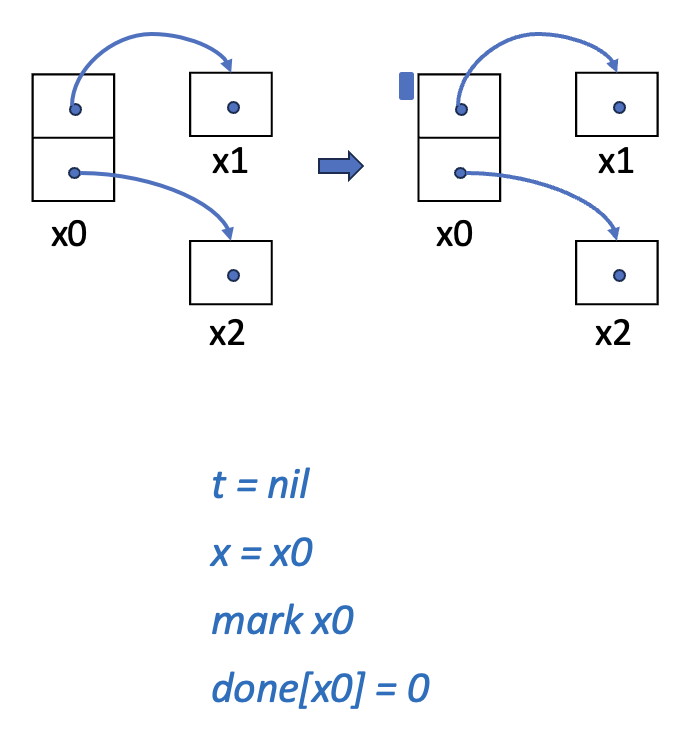
        </div>

    === "Step 2"

        <div style="text-align: center">
            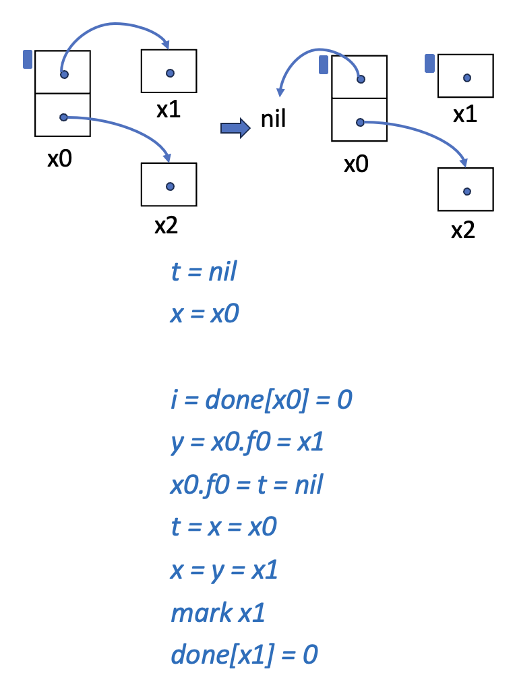
        </div>

    === "Step 3"

        <div style="text-align: center">
            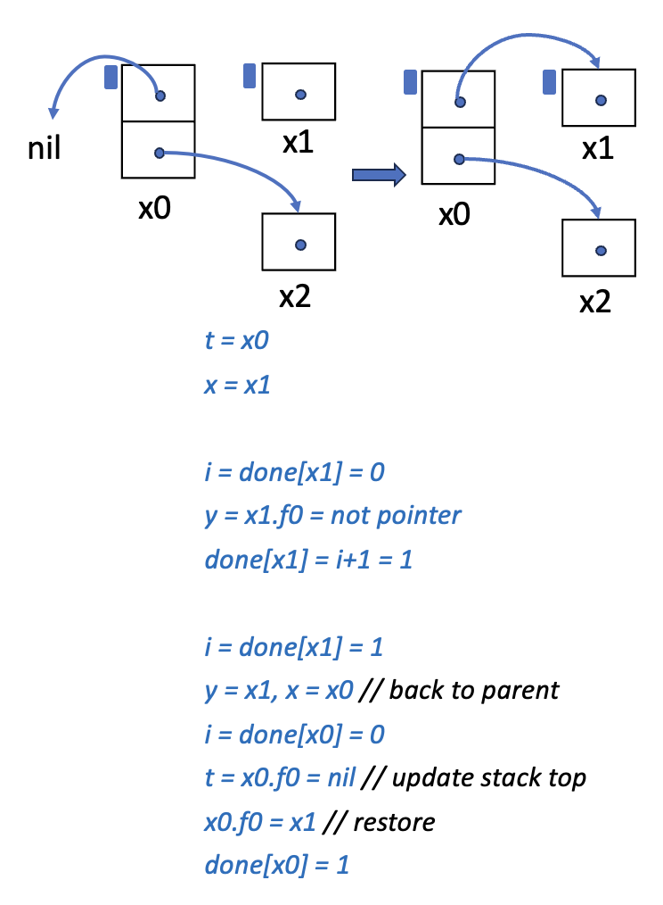
        </div>

    === "Step 4"

        <div style="text-align: center">
            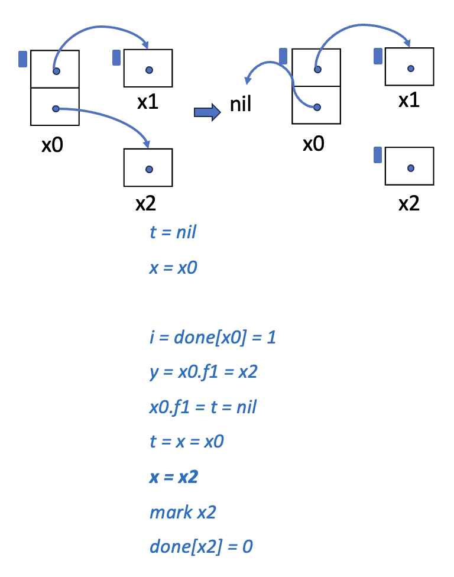
        </div>

    === "Step 5"

        <div style="text-align: center">
            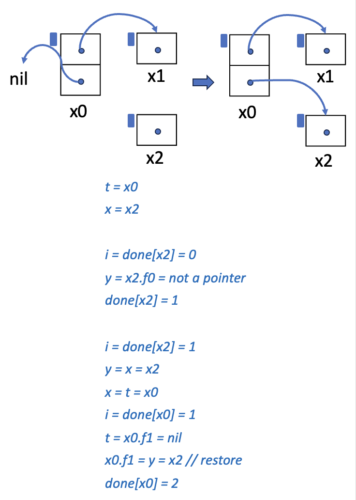
        </div>

    === "Step 6"

        <div style="text-align: center">
            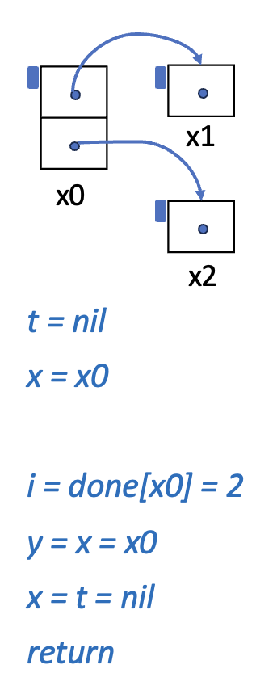
        </div>


### Fragmentation

- **外部碎片**(external fragmentation)：程序想要分配一个大小为 n 的记录，但有许多小于 n 的空闲记录，却没有大小合适的（图中白色块）

<div style="text-align: center">
    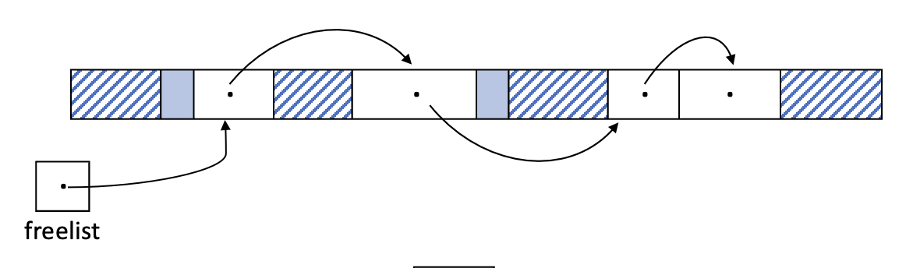
</div>

- **内部碎片**(internal fragmentation)：程序使用了一个过大的记录而未将其分割，导致未使用的内存位于记录内部而非外部（图中实心填充蓝色块）


## Reference Counts

标记-清扫回收是通过首先找出哪些对象是可达的来识别垃圾的。我们还可以通过追踪有多少指针指向记录来直接完成这一步。这时需要为每个记录保留一个**引用计数**(reference count)，即指向该记录的指针数量。

- 编译器会发出额外的指令，以便每当 $p$ 被存储到 $x.f_i$ 中时，$p$ 的引用计数就会增加，而 $x.f_i$ 先前指向的内容的引用计数就会减少
- 如果某个记录 $z$ 的引用计数达到零，那么 $z$ 会被放入空闲列表中，并且 $z$ 指向的所有其他记录的引用计数都会减少

<div style="text-align: center">
    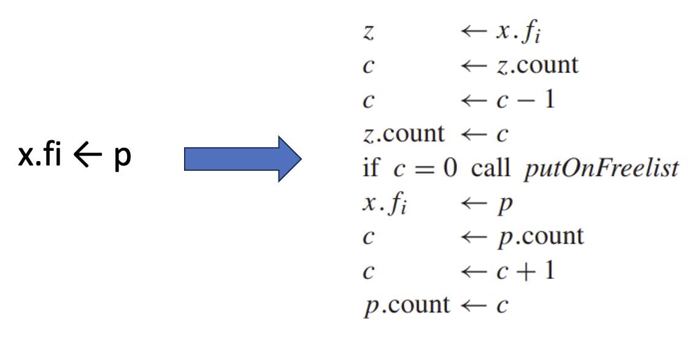
</div>

与其在将 $r$ 放入空闲列表时递减 $r.f_i$ 的计数，不如在从空闲列表移除 $r$ 时执行这种“递归”递减，原因为：

- 它将递归递减工作分解成**更小的片段**(shorter pieces)，从而使程序运行更流畅（这对交互式或实时程序尤为重要），例如：r.fi->p、p.fi->q
- 递归递减将仅在分配器中的一个位置执行

!!! bug "引用技术的问题"

    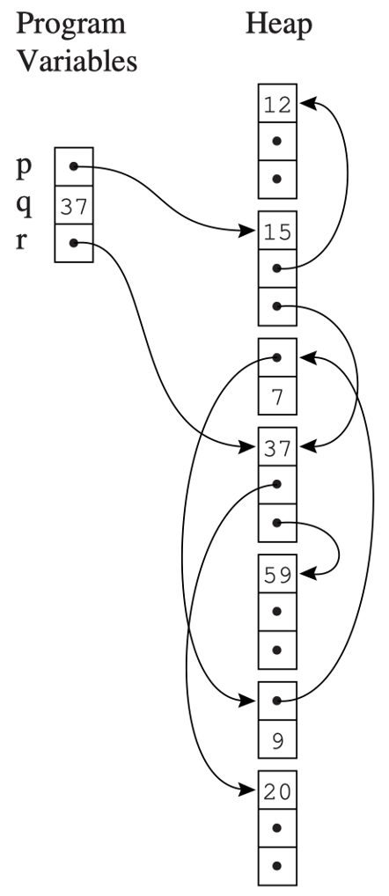{ align=right width=20% }

    - 循环的垃圾无法被回收
        - 引用循环是一组相互循环引用的对象，比如右图存储 7 的记录和存储 9 的记录  
        - 引用计数跟踪的是引用的数量，而不是可达引引用的数量。 
        - 在采用引用计数的语言/系统（Perl、Firefox 2 等）中存在的主要问题

    - 增加引用计数带来更高的成本

!!! abstract "总结"

    - 优点：实现简单
    - 缺点：
        - 无法回收所有不可达对象
        - 若发起大规模回收，可能速度较慢
        - 显著减慢赋值操作


## Copying Collection

**复制回收**(copying collection)的思路是：将内存分为两部分，并通过复制进行回收。

- 遍历有向图（即堆的可达部分，位于堆中称为「**从空间**」(from-space)的部分）
- 在堆的新区域（称为「**到空间**」(to-space)）中构建一个同构副本
    - 到空间中的副本是**紧凑的**(compact)：占用连续内存，无碎片化

- 使根节点指向到空间中的副本，之后整个从空间变得不可达

<div style="text-align: center">
    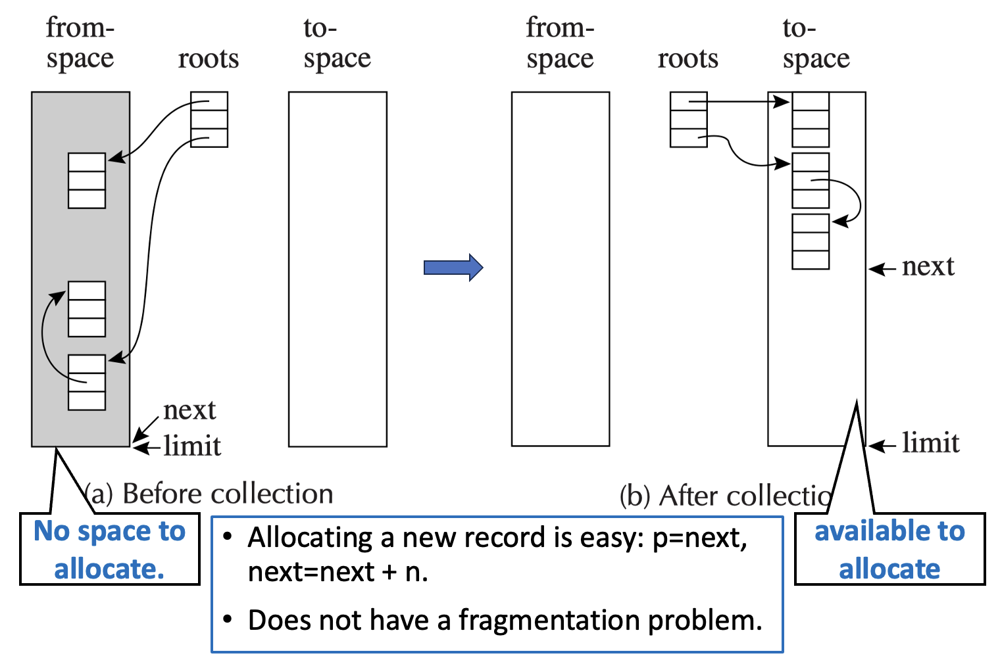
</div>

复制回收的步骤：

1. **初始化一个集合**(collection)：指针 next 被初始化为指向 to-space 的开头
2. **转发**(forwarding)：给定一个指向 from-space 的指针 p，使 p 指向 to-space

    $$
    \begin{aligned}
    &\mathbf{function}\ \mathrm{Forward}(p) \\
    &\qquad \mathbf{if}\ p\ \text{points to from-space} \\
    &\qquad\qquad \mathbf{then}\ \mathbf{if}\ p.f_1\ \text{points to to-space} \\
    &\qquad\qquad\qquad \mathbf{then}\ \mathbf{return}\ p.f_1 \\
    &\qquad\qquad\qquad \mathbf{else}\ \mathbf{for}\ \text{each field }f_i\text{ of }p \\
    &\qquad\qquad\qquad\qquad \mathrm{next}.f_i \leftarrow p.f_i \\
    &\qquad\qquad\qquad p.f_1 \leftarrow \mathrm{next} \\
    &\qquad\qquad\qquad \mathrm{next} \leftarrow \mathrm{next} + \text{size of record }p \\
    &\qquad\qquad\qquad \mathbf{return}\ p.f_1 \\
    &\qquad \mathbf{else}\ \mathbf{return}\ p
    \end{aligned}
    $$

3. **切尼算法**(Cheney's algorithm)：一种使用 BFS（广度优先搜索）遍历可达数据的集合算法

    $$
    \begin{aligned}
    &\mathit{scan} \leftarrow \mathit{next} \leftarrow \text{beginning of to-space} \\
    &\mathbf{for}\ \text{each root } r \\
    &\qquad r \leftarrow \mathrm{Forward}(r) \\
    &\mathbf{while}\ \mathit{scan} < \mathit{next} \\
    &\qquad \mathbf{for}\ \text{each field } f_i\ \text{of record at }\mathit{scan} \\
    &\qquad\qquad \mathit{scan}.f_i \leftarrow \mathrm{Forward}(\mathit{scan}.f_i) \\
    &\qquad \mathit{scan} \leftarrow \mathit{scan} + \text{size of record at }\mathit{scan}
    \end{aligned}
    $$

    - $next$：用于已复制的记录  
    - $scan$：用于字段已被复制的记录  
    - $scan$ 与 $next$ 之间的区域：广度优先搜索的队列

???+ example "例子"

    <div style="text-align: center">
        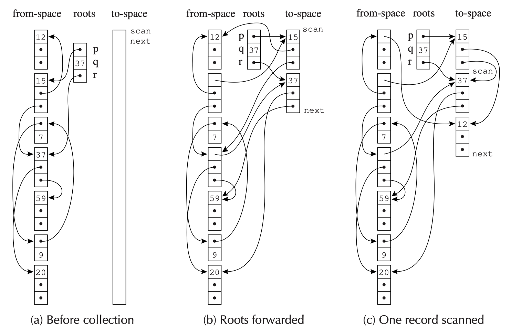
    </div>


### Locality of Reference

**广度优先复制**的指针数据结构具有**较差的引用局部性**：如果地址 a 处的记录指向地址 b 处的另一个记录，那么 a 和 b 很可能相隔很远。而在具有虚拟内存或内存缓存的计算机系统中，良好的引用局部性非常重要，因为假如程序获取地址 a 后，内存子系统可以很快会获取地址 a 附近的地址

**深度优先复制**提供了更好的局部性，但深度优先复制需要**指针反转**，这既不便利又速度缓慢。


### A Hybrid Algorithm

一种混合的、部分深度优先和部分广度优先的算法可以提供可接受的局部性。其基本思路是采用广度优先复制，但在复制对象时，检查是否有子对象可以复制到其附近。

<div class="grid">

$$
\begin{aligned}
&\mathbf{function}\ \mathrm{Forward}(p) \\
&\qquad \mathbf{if}\ p\ \text{points to from-space} \\
&\qquad\qquad \mathbf{then}\ \mathbf{if}\ p.f_1\ \text{points to to-space} \\
&\qquad\qquad\qquad \mathbf{then}\ \mathbf{return}\ p.f_1 \\
&\qquad\qquad\qquad \mathbf{else}\ \mathrm{Chase}(p);\ \mathbf{return}\ p.f_1 \\
&\qquad \mathbf{else}\ \mathbf{return}\ p
\end{aligned}
$$

$$
\begin{aligned}
&\mathbf{function}\ \mathrm{Chase}(p) \\
&\qquad \mathbf{repeat} \\
&\qquad\qquad q \leftarrow \mathrm{next} \\
&\qquad\qquad \mathrm{next} \leftarrow \mathrm{next} + \text{size of record } p \\
&\qquad\qquad r \leftarrow \mathrm{nil} \\
&\qquad\qquad \mathbf{for}\ \text{each field } f_i\ \text{of record } p \\
&\qquad\qquad\qquad q.f_i \leftarrow p.f_i \\
&\qquad\qquad\qquad \mathbf{if}\ q.f_i\ \text{points to from-space and} \\
&\qquad\qquad\qquad\qquad q.f_i.f_1\ \text{does not point to to-space} \\
&\qquad\qquad\qquad \mathbf{then}\ r \leftarrow q.f_i \\
&\qquad\qquad p.f_1 \leftarrow q \\
&\qquad\qquad p \leftarrow r \\
&\qquad \mathbf{until}\ p = \mathrm{nil}
\end{aligned}
$$

</div>


## Interface to the Compiler

具备垃圾回收能力的语言的编译器通过以下方式与垃圾回收器交互：

- 生成分配记录的代码  
- 描述每个垃圾回收周期的根位置  
- 描述堆上数据记录的布局  
- ~~生成实现读屏障或写屏障的指令（针对某些增量收集版本）~~


### Fast Allocation

由于创建堆记录的成本相当高，因此采用**复制收集**。

- 下一个空闲位置是 next，区域的末尾是 limit
- 分配空间是连续的空闲区域

分配一个大小为 N 的记录的步骤：

1. 调用分配函数
2. 检查 next + N < limit ? （如果检查失败，则调用 GC）
3. 将 next 移动到 result
4. 清除 M[next], M[next+1], ..., M[next + N - 1]
5. next <- next + N
6. 从分配函数返回

A. 将 result 移动到某个计算上有用的位置

B. 将有效值存储到记录中

（步骤 A 和 B 不是分配开销）

其中：

- 步骤 1 和 6 应该通过**内联展开**(inline expansion)分配函数来消除
- 步骤 3 通常可以通过与步骤 A 结合来省去
- 步骤 4 可以省略，改用步骤 B
- 步骤 2 和 5 不能消除，但它们可以在基本块中的多个分配之间共享；通过将 next 和 limit 保持在寄存器中，步骤 2 和 5 总计只需**三条指令**即可完成

结合这些技术，分配一个记录（以及随后对其进行 GC）的成本可以降低到**大约四条指令**。


### Describing Data Layouts

收集器必须能够操作程序声明的任何类型的记录，因此它必须能够确定每个记录中的字段数量，以及每个字段是否是指针。

对于静态类型语言（如 Tiger 或 Pascal）或面向对象语言（如 Java），让每个对象的第一个字指向一个特殊的**类型描述符**(type descriptor)或**类描述符**(class descriptor)记录，其中包含对象的**总大小**、每个**指针字段位置**的信息。它们由编译器根据静态类型信息（语义分析）生成。

- 静态类型语言：每条记录的开销为一个字
- 面向对象语言：没有因 GC 而产生的额外每对象开销，因为它们需要这个描述符指针来实现动态方法查找


### Pointer Map

编译器必须识别指向收集器的**指针映射**(pointer map)，即位于寄存器中还是活动记录中的所有包含指针的临时变量和局部变量。

因为活临时变量的集合可能在每条指令处发生变化，指针映射在程序的每个位置都不同，所以更简单的做法是仅在新一轮 GC 可以开始的位置描述指针映射。新一轮 GC 时机包括： 

- 对 alloc 函数的调用  
- 任何函数调用  
- 任何函数调用都可能调用一个函数，而该函数又可能调用 alloc

指针映射最好通过**返回地址**来索引，因为返回地址正是垃圾回收器在紧邻的下一个活动记录中会看到的内容。

- 为了找到所有根，回收器从栈顶开始向下扫描
- 每个返回地址对应一个指针映射条目，该条目描述了下一个栈帧
- 在每个栈帧中，回收器会标记（如果是复制回收，则转发）该帧中的指针
- 被调用者保存的寄存器需要特殊处理
    - 假设函数 f 调用了 g，而 g 又调用了 h。
    - g 的指针映射必须描述：在调用 h 时，它的哪些被调用者保存寄存器包含指针，哪些是从 f “继承”而来的


### Derived Pointers

有时，编译后的程序中的指针可能指向堆记录的中间，或指向记录的前后位置。

???+ example "例子"

    a[i-2000] 在内部会被计算为 M[a-2000+i]

    ```
    t1 <- a-2000
    t2 <- t1 + i
    t3 <- M[t2]
    ```

    - 如果 a[i-2000] 出现在循环中，编译器可能会选择将 t1 <- a – 2000 提升到循环外部，以避免每次迭代都重新计算
    - 如果该循环还包含一个 alloc，并且在 t1 活跃时发生了垃圾回收：t1 并未指向某个对象的起始位置，或者（更糟的是）指向了一个不相关的对象

我们称 t1 是从**基**(base)指针 a **派生**(derived)而来的，此时收集器会被 t1 混淆。

为处理这个问题，指针映射必须标识每个**派生指针**(derived pointer)，并告知其基指针。比如当收集器将 a 重定位到地址 a' 时，它必须调整 t1，使其指向地址 t1 + a' - a。只要 t1 存活，a 就必须保持存活。例如：

<div class="grid">

```sml
let
  var a := int array[100] of 0
in
  for i := 1930 to 1990
    do f(a[i-2000])
end
```

$$
\begin{aligned}
&r1 \leftarrow 100 \\
&r2 \leftarrow 0 \\
&\textit{call alloc} \\
&a \leftarrow r1 \\
&t1 \leftarrow a - 2000 \\
&i \leftarrow 1930 \\
&L1:\ r1 \leftarrow M[t1 + i] \\
&\textit{call }f \\
&L2:\ \mathbf{if}\ i \le 1990\ \mathbf{goto}\ L1
\end{aligned}
$$

</div>

- 临时变量 a 在赋值给 t1 后看起来已死亡
- 但随后，与返回地址 L2 相关联的指针映射将无法充分“解释” t1
- 因此，派生指针隐式地保持其基指针存活