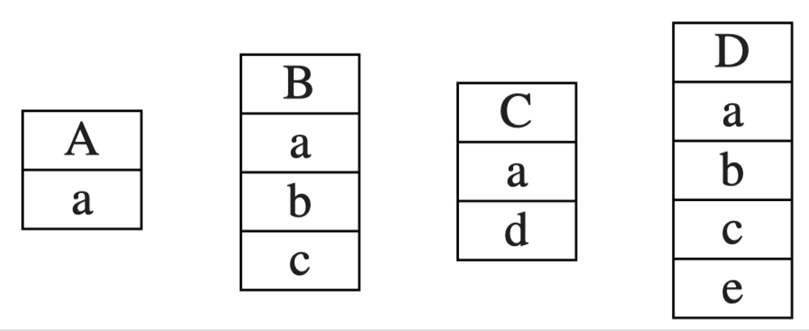
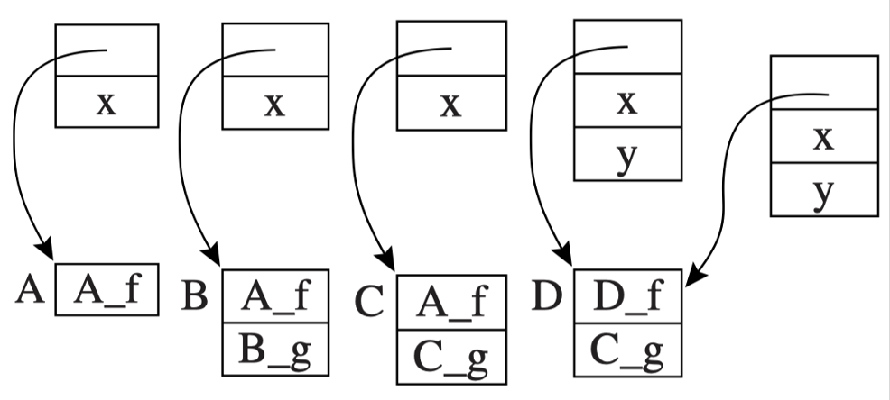
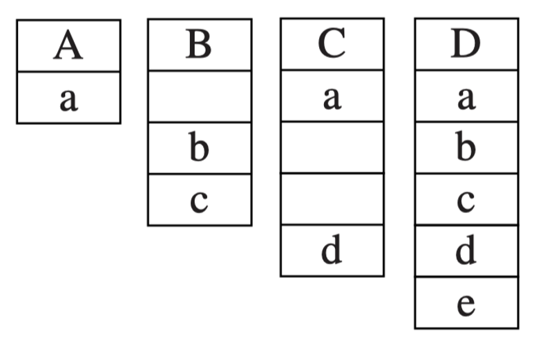
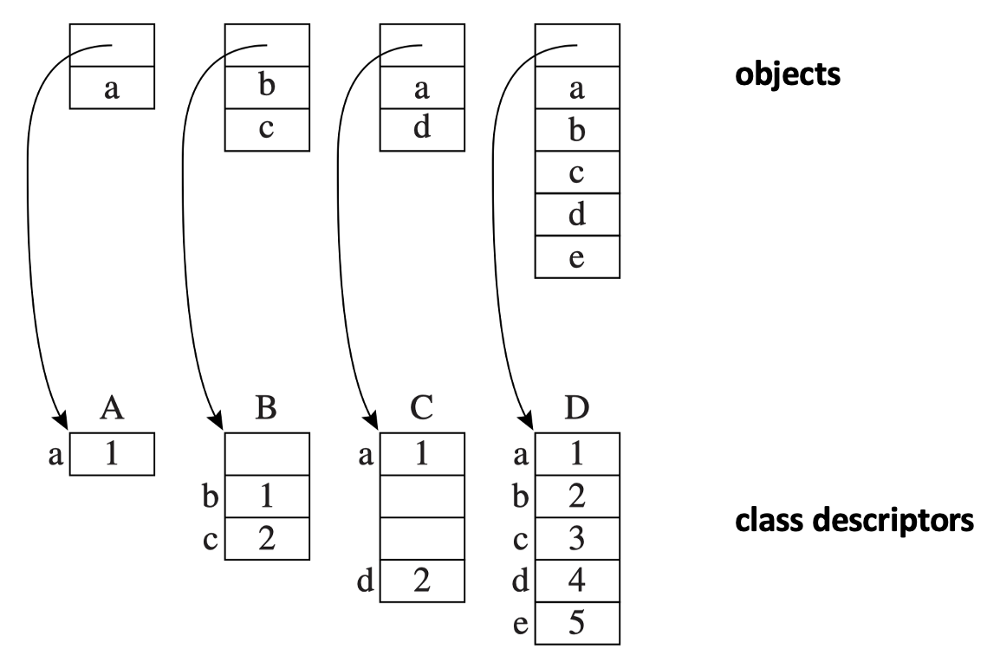
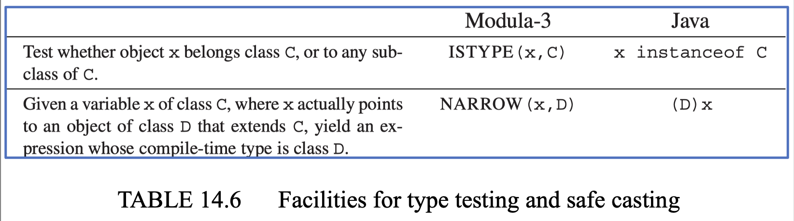

# Object-Oriented Languages

??? abstract "核心知识"

    说实话，笔者还不不太确定考试会不会考这个，等刷了一些历年卷后再补。本章很多知识在 OOP 和 Java 课反复介绍过，实在不太想整理hh

面向对象语言（OOP）的特征：

- 信息隐藏（**封装**(encapsulation)）
    - 一个模块可以提供某种类型的值，但该类型的表示方式只有该模块内部知晓
    - 客户端只能通过模块提供的**操作**来操纵这些值
    - 值 -> 对象，操作 -> 方法

- 扩展（**继承**(inheritance)）：如果某个程序上下文（例如函数或方法的形参）期望一个支持方法 `m1`、`m2`、`m3` 的对象，那么它也会接受一个支持 `m1`、`m2`、`m3`、`m4` 的对象


## Classes

使用新的声明语法扩展 Tiger 语言以创建类

```
dec -> classdec
classdec -> class class-id extends class-id { {classfield} }
classfield -> vardec
classfield -> method
method -> method id(tyfields) = exp
method -> method id(tyfields) : type-id = exp
```

- `class A extends class B { ... }`
    - 声明了一个新类 `B`，它继承自类 `A`
    - 必须在声明 `A` 的 `let` 表达式的作用域内
    - A 的所有字段和方法都隐式属于 `B`
    - `A` 的一些方法可以在 `B` 中被重写（即拥有新的声明），参数和返回类型必须一致，但字段不可被重写

- 存在一个预定义的类标识符 `Object`，它没有字段或方法
- 类 B 中的每个方法都有一个隐式的形参 `self`，其类型为 B
- 用于创建对象和调用方法的新表达式语法
    - `new B`：创建一个类型为 `B` 的新对象
    - `b.x`：对象 `b` 的字段 `x`
    - `b.f(x, y)`：调用 `b` 的 `f` 方法，显式实参为 `x` 和 `y`，并将 `b` 的值作为 `f` 的隐式 `self` 参数

    ```
    exp -> new class-id
        -> lvalue . id()
        -> lvalue . id(exp{, exp})
    ```

??? example "例子"

    ```java
    let start := 10
        class Vehicle extends Object {
            var position := start
            method move(int x) = (position := position +x)
        }
        class Truck extends Vehicle {
            method move(int x) =
                if x <= 55 
                then position := position + x
        }
        class Car extends Vehicle {
            var passengers :=0
            method await(v: Vehicle) =
                if(v.position < position)
                then v.move(position - v.position)
                else self.move(10)
        }
        var t := new Truck
        var c := new Car
        var v : Vehicle := c
    in
        c.passengers := 2; 
        c.move(60);
        v.move(70);
        c.await(t)
    end
    ```

    `v.position` 中的 `v` 属于 `Vehicle` 类。为了得到它，编译器必须生成代码，从 `v` 所指向的对象（记录）中获取 `position` 字段。

    简单的实现思路：
        
    - 从变量 `v` 的环境条目中获取 `Vehicle` 的类描述符
    - 从该类描述符中获取 `position` 的偏移量

    但在运行时，`v` 可能指向一个 `Car` 或 `Truck` 对象，此时 `position` 字段会位于何处？


## Single Inheritance of Data Fields

**单继承**(single-inheritance)语言：每个类仅继承一个父类。

在这种语言中，获取字段的方式是**加前缀**(prefixing)：

- 当 `B` 继承自 `A` 时，`B` 中从 `A` 继承的字段会在 `B` 记录的起始位置按其在 `A` 记录中的相同顺序布局
- `B` 中未从 `A` 继承的字段则紧随其后放置

???+ example "例子"

    ```java
    class A extends Object { var a := 0 } 
    class B extends A { var b := 0; var c := 0 } 
    class C extends A { var d := 0 } 
    class D extends B { var e := 0 }
    ```

    <div style="text-align: center">
        
    </div>

---
**方法**(method)实例的编译方式与函数非常相似：它被转换为机器码，驻留在指令空间中的特定地址。每个**类描述符**都包含一个指向其父类的**指针**，以及一个方法实例的**列表**。


- **静态方法**
    - 某些面向对象语言允许将方法声明为静态（不可被子类重写，在编译时确定）
    - 为了编译形如 `c.f()` 的方法调用，编译器：
        - 找出 `c` 的类（假设为类 `C`）
        - 在类 `C` 中搜索方法 `f`，假设未找到
        - 继续搜索类 `C` 的父类，假设为类 `B`，以此类推
        - 假设在某个祖先类 `A` 中找到静态方法 `f`，则编译器可将函数调用编译为标签 `A_f`

        ```java
        Class A extends Object {
            var x := 0
            static method f() }
        Class B extends A {
            method g() }
        Class C extends B {
            method g() }
        ```

- **动态方法**
    - 如果类 `A` 中的方法 `f` 是一个动态方法
        - `f` 可能在 `C` 的子类 `D` 中被重写
        - 因此在编译时无法判断 `c` 指向的是类 `D` 的对象（应调用 `D_f`）还是类 `C` 的对象（应调用 `A_f`）

        ```java
        Class A extends Object {
            var x := 0
            method f() }
        Class B extends A {
            method g() }
        Class C extends B {
            method g() }
        Class D extends C {
            var y := 0
            method f() }
        ```

    - 类描述符必须包含一个向量（方法表），其中每个（非静态）方法名对应一个方法实例
        - 当类 `B` 继承自 `A` 时，方法表以 `A` 已知的所有方法名的条目开头，然后继续包含 `B` 声明的新方法，就像具有继承关系的对象中字段的排列方式一样

    - 要执行 `c.f()`，其中 `f` 是一个动态方法，编译后的代码必须执行以下指令：
        1. 从对象 `c` 的偏移量 0 处获取类描述符 `d`
        2. 从 `d` 的（常量）`f` 偏移量处获取方法实例指针 `p`
        3. 跳转到地址 `p`，同时保存返回地址（即调用 `p`）

    <div style="text-align: center">
        
    </div>


## Multiple Inheritance

在允许类 `D` 继承多个父类 `A`、`B` 和 `C` 的语言中，查找字段偏移和方法实例更加困难，因为不可能将所有 `A` 字段放在 `D` 的开头，也不可能将所有 `B` 字段放在 `D` 的开头。


### Global Graph Coloring

一种方法是同时对所有类进行静态分析（使用**图着色算法**），为每个字段名找到某种偏移量，包含该字段的每条记录。

```java
class A extends Object { var a := 0 }
class B extends Object { var b:=0; var c:= 0 }
class C extends A { var d:=0 }
class D extends A,B,C { var e:=0 }
```

<div style="text-align: center">
    
</div>

- 节点：唯一字段名
- 边：两个字段共存于一个类中
- 颜色：偏移量 (0, 1, 2 ...)

这种方法的问题在于它会在对象中间留下**空槽**。解决方案是将每个对象的字段打包，并让类描述符指明每个字段的位置。

<div style="text-align: center">
    
</div>

此时类描述符拥有空槽位，而对象则没有。

可接受的是：#对象 >> #类描述符

但每次数据读取（或存储）需要三条指令，而非一条：

- 从对象中获取描述符指针
- 从描述符中获取字段偏移量值
- 在对象中的相应偏移位置读取（或存储）数据

---
在使用多重继承的语言中，依然可以用全局图着色方法查找方法实例。

- 方法名可以与字段名混合，形成一个大干扰图的节点
- 字段的描述符条目给出**对象内的位置**
- 方法的描述符条目给出**方法实例的机器码地址**

动态链接的问题是：全局着色只能在**链接时**(link-time)进行。但许多面向对象的系统具有在运行时加载新类的能力。链接时图着色对于允许**动态增量链接**的系统来说，会引发许多问题。


### Hashing

在每个类描述符中放置一个**哈希表**，将字段名称映射到偏移量，将方法名称映射到方法实例。这能很好地与独立编译和动态链接配合使用。

- `Ftab`：包含字段偏移量和方法实例
- `Ktab`：包含字段名称指针（用于碰撞检测）
- 要获取对象 `c` 的字段 `x`，编译器生成以下代码：  
    - 从对象 `c` 的偏移量 0 处获取类描述符 `d`
    - 从地址偏移量 `d + Ktab + hash_x` 处获取字段名称 `f`
    - 测试 `f` 是否等于 `ptrx`；如果是，则
        - 从 `d + Ftab + hashx` 处获取字段偏移量 `k`
        - 从 `c + k` 处获取字段的内容


## Testing Class Membership

某些面向对象语言允许程序在运行时测试对象是否属于某个类，例如：

<div style="text-align: center">
    
</div>

假设没有多重继承，实现 `x instanceof C` 的一个简单方法是在运行时生成以下循环的代码：

```c
    t1 <- x.descriptor
L1: if t1 = C goto true
    t1 <- t1.super
    if t1 = nil goto false
    goto L1  
```

> `t1.super` 为 `t1` 的父类
> 但这样会很慢

一种更快的方法是使用父类**显示表**(display)。假设**类嵌套深度**(class nesting depth)限制在一定常数内（例如 20），在每个类描述符中预留一个 20 字的块。假设类 `D` 的嵌套深度为 `j`（可在编译时获知），在 `D` 的描述符中：

- `display[j] = D`
- `display[j-1] = D.super`
- `display[j-2] = D.super.super`
- ...
- `display[0] = Object`
- `display[k] = nil`，其中 `k > j`

现在，如果 `x` 是 `D` 的实例，或是 `D` 的任何子类的实例，那么在 `x` 的类描述符中，`display[j] = D`。否则就不是。因此，`x instanceof D` 要求：

- 从对象 `x` 的偏移量 0 处获取类描述符 `d`
- 从 `d` 中获取第 `j` 个类指针槽位
- 与类描述符 `D` 进行比较


### Type Coercions

给定类型为 `C` 的变量 `c`

- 将 `c` 视为 `C` 的任意**超类型**(supertype)是合法且安全的，比如 `var b : B := c`，其中 `C` 继承自 `B`
- 反之则不成立。赋值 `c ← b` 仅当 `b` 确实是（在运行时）`C` 的实例时才安全，而情况并非总是如此，例如以下语句会带来无法预测的行为：

    ```
    b ← new B
    c ← b
    c.some_field_of_C_but_not_B
    ```

某些面向对象语言（如 Modula-3 和 Java）在从超类强制转换到子类时会伴随**运行时类型检查**(runtime type check)：如果运行时的值实际上不是该子类的实例（例如，除非 `b instanceof C`），则会引发异常。而 C++ 具有无需运行时检查的静态转换机制，因此不安全。


### Typecase

Module-3 具有**类型匹配**(typecase)机制，使得**先测试再缩窄**(test-then-narrow)的习惯用法更加优美高效。

```
TYPECASE expr
OF C1 (v1) => S1
 | C2 (v2) => S2
    .
    .
    .
 | Cn (vn) => Sn
ELSE S0
END
```

- 如果多个 `Ci` 匹配（例如，一个是另一个的超类），则只采用第一个匹配的子句
- 如果没有 `Ci` 匹配，则采用 `ELSE` 子句

Typecase 可以直接转换成一组 `else-if` 链，每个 `if` 执行以下操作：

- 类型检查
- 类型缩小
- 局部变量声明


## Private Fields and Methods

真正的面向对象语言能够保护对象的字段，防止被其他对象的方法直接操作。

- **私有字段**是指无法从对象外部声明的任何函数或方法中获取或更新的字段
- **私有方法**是指无法从对象外部调用的方法
- **私有性**(privacy)由编译器的**类型检查阶段**静态地强制执行
- 在类的符号表中，每个字段偏移量和方法偏移量旁都有一个**布尔标志**，指示该字段是否为私有