# Loop Optimizations

??? abstract "核心知识"

    - 基本概念：支配节点、支配树、自然循环、嵌套循环
    - 提取循环不变量到循环前导部分
    - 归纳变量：检测、强度减少/消除/重写程序
    - 数组边界检查
    - 循环展开

**循环**(loop)（依据《韦氏词典》定义）：一系列重复执行的指令，直至达到终止条件。

在控制流图中，循环是指一个包含头节点 h 的节点集合 S，并满足以下性质：

- 从 S 中的任意节点出发，均存在一条有向边路径通向 h
- 从 h 出发存在一条有向边路径可到达 S 中的任意节点
- 不存在从 S 外部任何节点指向 S 内部除 h 以外任何节点的边

**循环入口**节点是指前驱节点在循环外部的节点，而**循环出口**节点是指后继节点在循环外部的节点。循环只有一个入口，但可以有多个出口。

    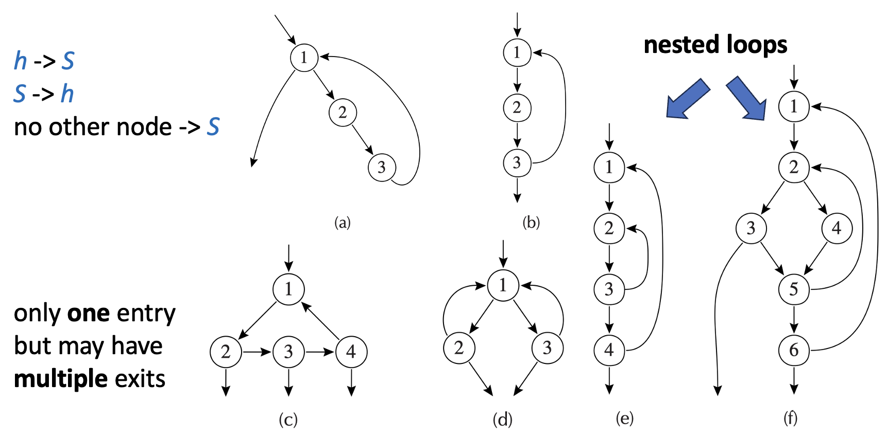

## Dominators

**支配节点**(dominator)：如果从 s0 到 n 的每条有向边路径都必须经过 d，则节点 d 支配节点 n。

- s0 是控制流图的起始节点
- 每个节点支配自身
- n 可以有多个支配节点

寻找支配节点的算法：

$$
\boxed{
D[s_0] = \{s_0\}
\qquad
D[n] = \{n\} \cup \left( \bigcap_{p \in \operatorname{pred}[n]} D[p] \right)
\ 
\text{for } n \ne s_0
}
$$

- 通过迭代求解这些方程
- 初始化 D[n]（对于 n != s0）为包含图中所有节点

!!! theorem "定理"

    在连通图中，假设 d 支配 n，且 e 支配 n。那么必然有 d 支配 e 或 e 支配 d。

每个节点 n（除了 s0）都有唯一的一个**直接支配节点**(immediate dominator) idom(n)，满足：

- idom(n) 不是节点 n 本身
- idom(n) 支配 n，且
- idom(n) 不支配 n 的任何其他支配节点

**支配树**(dominator tree)：绘制一个包含流图中所有节点的图，并且对于每个节点 n，有一条从 idom(n) 到 n 的边。

    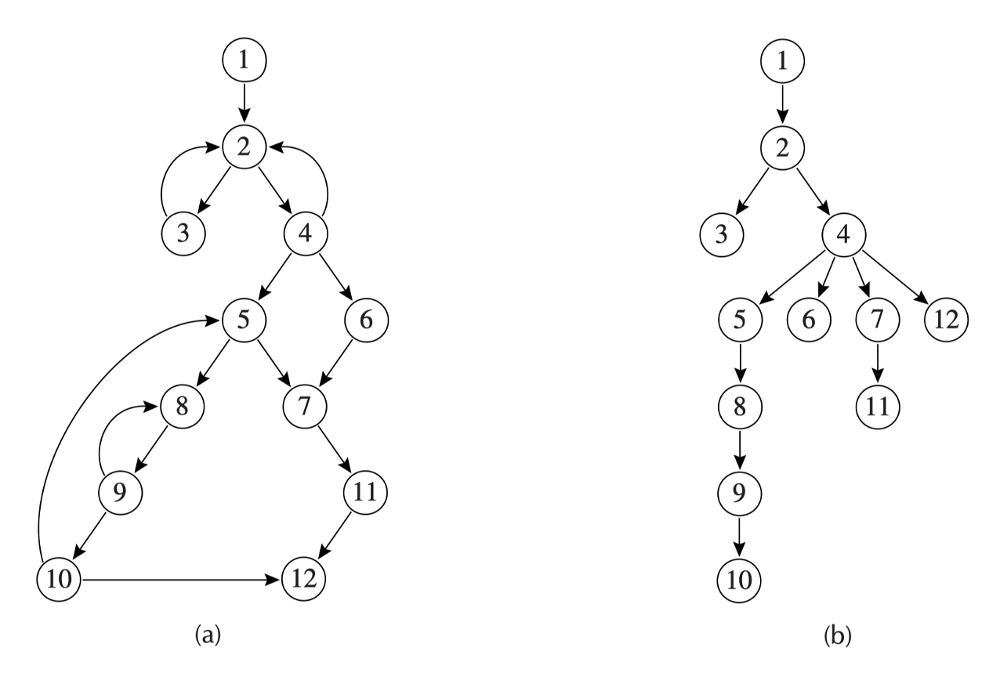

### Natural Loops

我们关心一个循环是否只有一个入口节点：如果是 => 在**每次迭代**开始时保持**某些初始条件** => 简化优化。这一机会促使了对自然循环定义的需求。

- **回边**(back edge)：流图中从节点 n 到支配 n 的节点 h 的一条边
- 回边 n -> h 的**自然循环**(natural loop)是节点 x 的集合，其中 h 支配 x，并且存在一条从 x 到 n 的不包含 h 的路径；该循环的头部将是 h

???+ example "例子"

    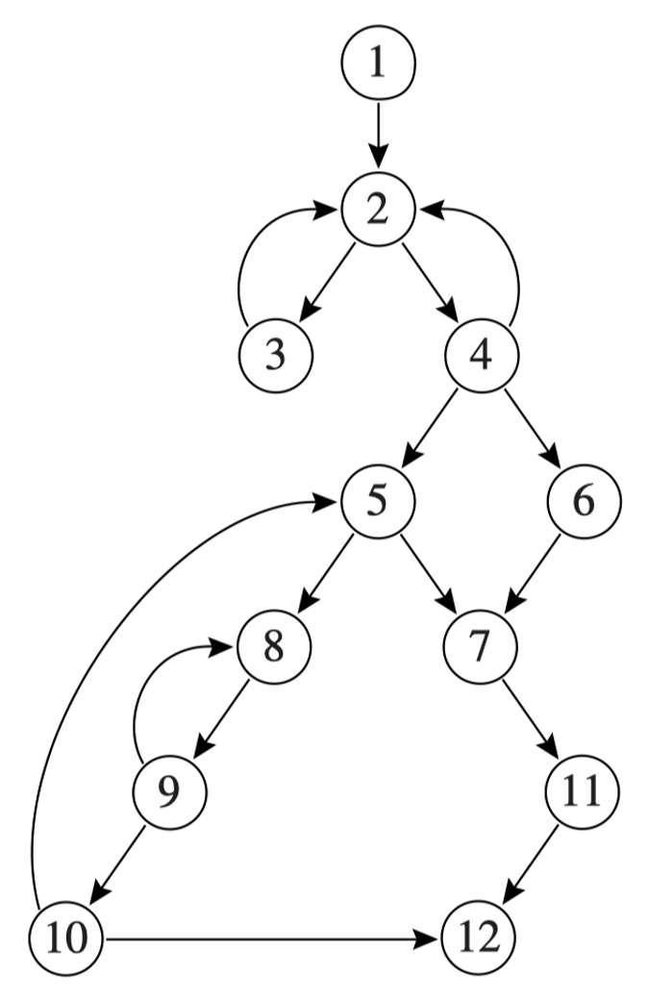{ align=right width=30% }

    - 回边 10 -> 5 的自然循环包括节点 5、8、9、10，并且内部嵌套了循环 8、9
    - 一个节点 h 可以是多个自然循环的头节点
        - 3->2 => {2, 3}
        - 4->2 => {2, 4}

    - {2, 3, 4} 形成一个循环，但不是自然循环

### Nested Loop

**嵌套循环**(nested loop)：如果 A 和 B 是循环，它们的头部分别为 a 和 b，且 a != b，b 在 A 中，那么 B 的节点是 A 的节点的真子集。我们称循环 B 嵌套在 A 中，或者说 B 是内层循环。

我们可以在程序中构建一个**循环嵌套树**(loop-nest tree)：

- 计算流图 G 的支配节点
- 构建支配树
- 找出所有自然循环，从而得到所有循环头节点
- 对于每个循环头 h，将 h 的所有自然循环合并成一个循环 loop[h]
- 构建循环头（以及隐含的循环）树，使得如果在 loop[h1] 中包含 h2，则 h1 在树中位于 h2 之上

???+ example "例子"

    

        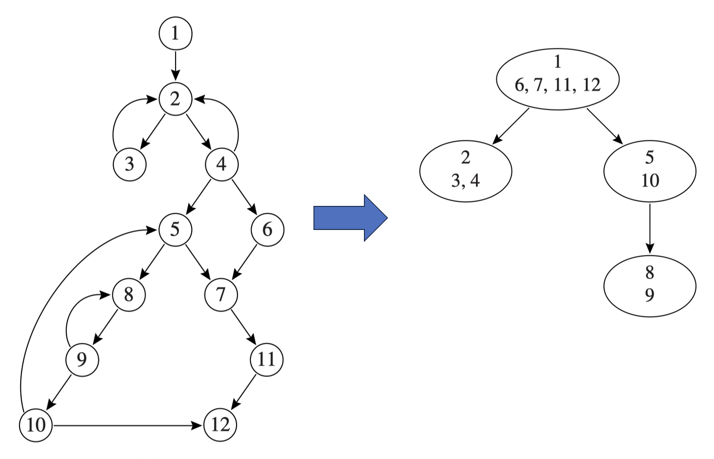
    

    我们可以说，整个过程体是一个位于循环嵌套树根部的伪循环。

许多循环优化会在循环执行前立即插入语句，即**循环不变量外提**(loop-invariant hoisting)：将语句从循环内移到循环前。

插入方法：

    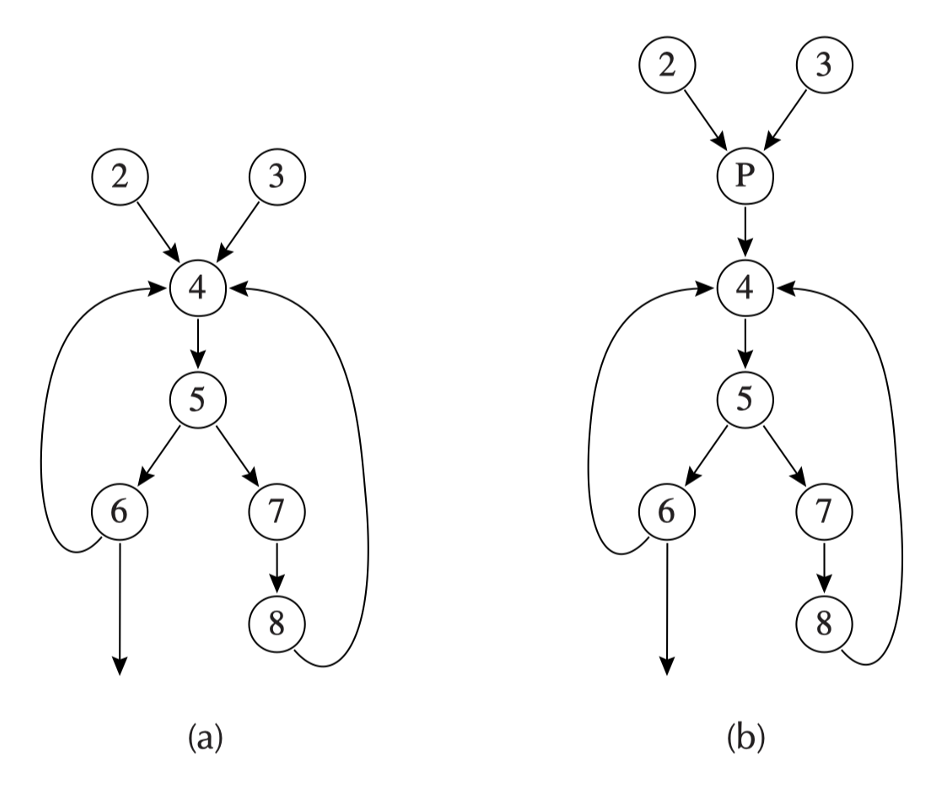

- 插入一个新的、初始为空的**前导**(preheader)节点 p
- 所有来自循环外节点 y 的 y -> h 被重定向到指向 p 的点

## Loop-Invariant Computations

若循环中包含语句 $t \leftarrow a \oplus b$，且 $a$ 和 $b$ 在每次循环中值均相同，则 $t$ 的值也会每次相同。此时我们希望将该计算提升至循环外。我们可通过**循环不变量计算**(loop-invariant computations)来判断 $a$ 是否每次循环都具有相同值。

定义 $d: t \leftarrow a_1 \oplus a_2$ 在循环 $L$ 中是**循环不变的**(loop-invariant)，如果对于每个操作数 $a_i$，

- $a_i$ 是一个常量
- 或者所有到达 $d$ 的 $a_i$ 的定义都在循环外部
- 或者只有一个 $a_i$ 的定义到达 $d$，并且该定义是循环不变的

    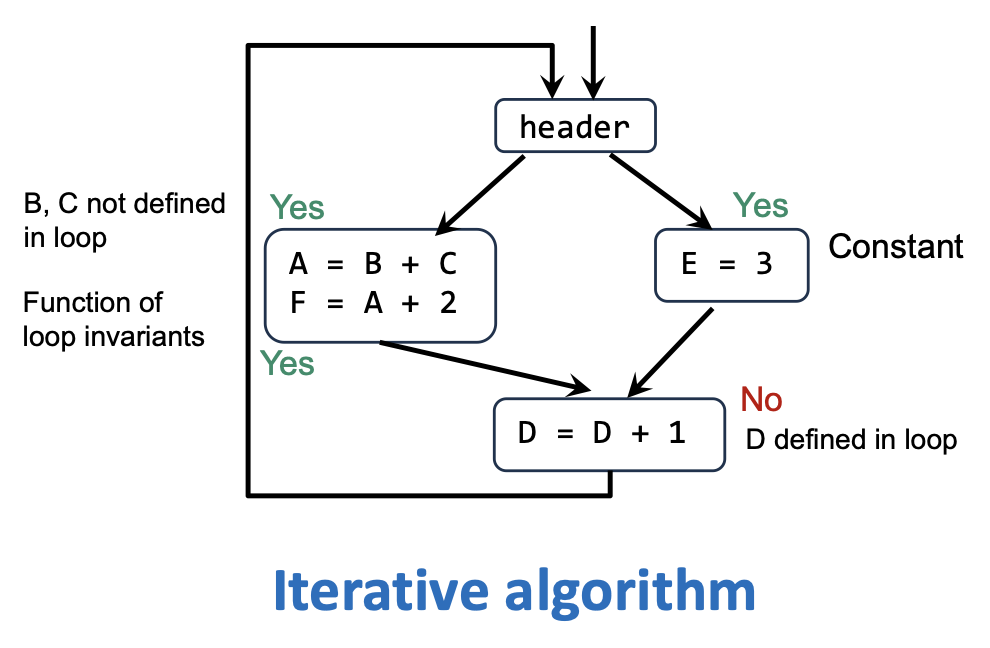

### Hoisting

将 $d: t \leftarrow a \oplus b$ 提升到循环前导的条件：

- $d$ 支配所有 $t$ 活跃输出的循环出口 => (b) ❌
- 循环中仅有一个 $t$ 的定义 => (c) ❌
- 且 $t$ 不是循环前导的传出变量(live-out) => (d) ❌

    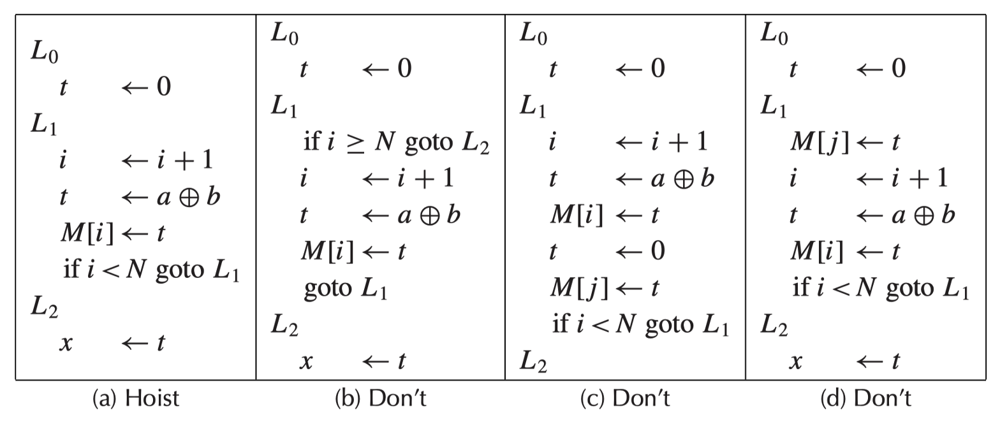

隐含的副作用：如果 $t \leftarrow a \oplus b$ 可能引发某种算术异常或产生其他副作用，则这些规则需要修改。

将 `while` 循环转换为 `repeat-until` 循环，因为“$d$ 支配所有 $t$ 为活跃输出的循环出口”往往阻止许多计算从 `while` 循环中提升。

    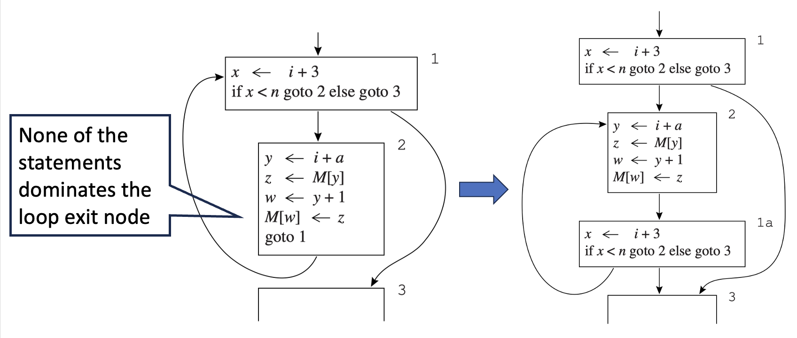

## Induction Variables

在某些循环中：

- 有一个变量 `i` 被递增或递减
- 有一个变量 `j = i * c + d`，其中 `c` 和 `d` 是循环不变的

我们可以在不引用 `i` 的情况下计算 `j` 的值：每当 `i` 递增 `a` 时，`j = j + a * c`。

???+ example "例子"

    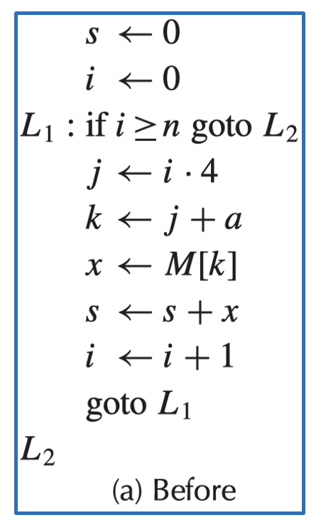{ align=left width=30% }

    - i 是**基本归纳变量**(basic induction variable)  
    - j 和 k 是 i 族中的**派生归纳变量**(derived induction variable)
    - j = aj + i * bj (aj=0, bj=4)  
        - (i, aj, bj) => (i, 0, 4)  

    - k ← j + a (a 是循环不变量)  
    - k = i * 4 + a = a + i * 4  
        - (i, a, 4)

**线性归纳变量**(linear induction variable)：一个归纳变量在循环的每次迭代中变化相同的（常量或循环不变量）量。

- 基本归纳变量 i 在不同迭代中增加的幅度不同，因此不是线性的
- 在某些迭代中，j = i * 4，而在其他迭代中，当 i 增加时，派生归纳变量 j 会（暂时）落后

???+ example "例子"

    

        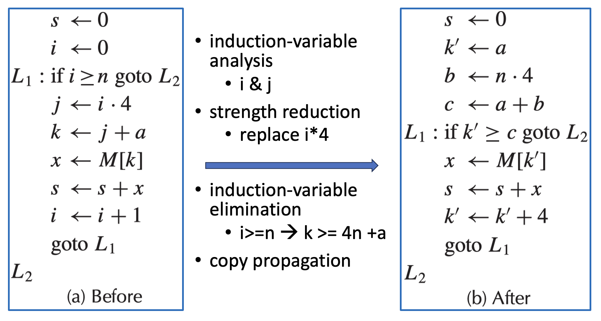
    

### Detection

- **基本归纳变量**：变量 i 是循环 L 中的一个基本归纳变量，其中 L 的头节点为 h，当且仅当 i 在 L 中的唯一定义形式为为 i <- i + c 或 i <- i − c，其中 c 是循环不变的。
- **派生归纳变量**：变量 k 是循环 L 中的一个派生归纳变量，如果满足以下条件：
    1. 在 L 中 k 只有一个定义，形式为 k <- j * c 或 k <- j + d，其中 j 是一个归纳变量，c 和 d 是循环不变的
    2. 如果 j 是 i 族中的派生归纳变量，则：
        - 能够到达 k 的 j 的唯一定义是在循环中的那个定义
        - 并且在 j 的定义和 k 的定义之间的任何路径上都没有 i 的定义

### Strength Reduction

乘法比加法开销更大，因此我们希望对每个形如 j <- i * c 的定义的派生归纳变量进行替换，改用加法实现。对于每个三元组为 (i, a, b) 的派生归纳变量 j，即 j <- a + i * b：

- 创建一个新变量 j'
- 在循环前导的末尾，将 j' 初始化为 j' <- a + i *
- 在每次赋值 i <- i + c 之后，添加赋值 j' <- j' + c * b，其中 c * b 是一个循环不变表达式，可在循环前导计算；如果 c 和 b 均为常量，则乘法可在编译时完成
- 将 j 的（唯一）赋值替换为 j <- j'（执行死代码消除）

???+ example "例子"

    

        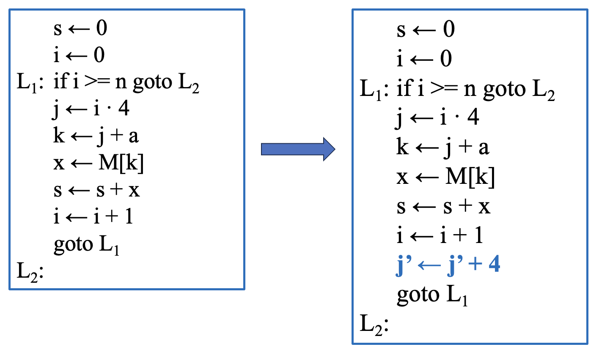
    

    - 创建一个新变量 j'
    - 在每次赋值 i <- i + c 之后，进行赋值 j' <- j' + c * b，其中 c * b 是一个循环不变表达式，可以在循环前头计算

    

        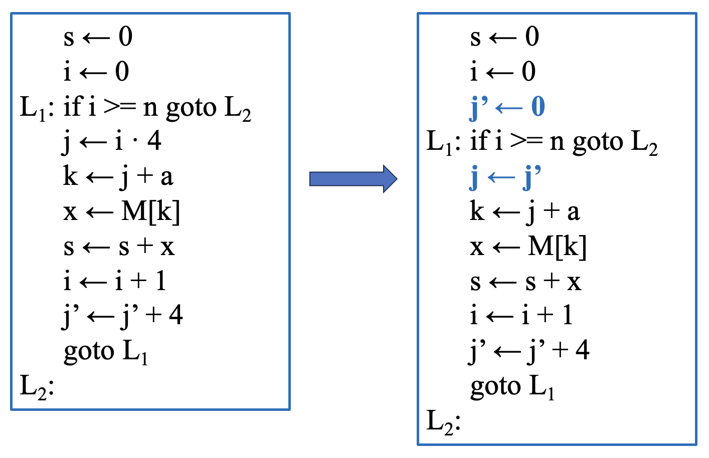
    

    - 将（唯一的）对 j 的赋值替换为 j <- j
    - 在循环前导的末尾，用 j' <- a + i * b 初始化 j'

    

        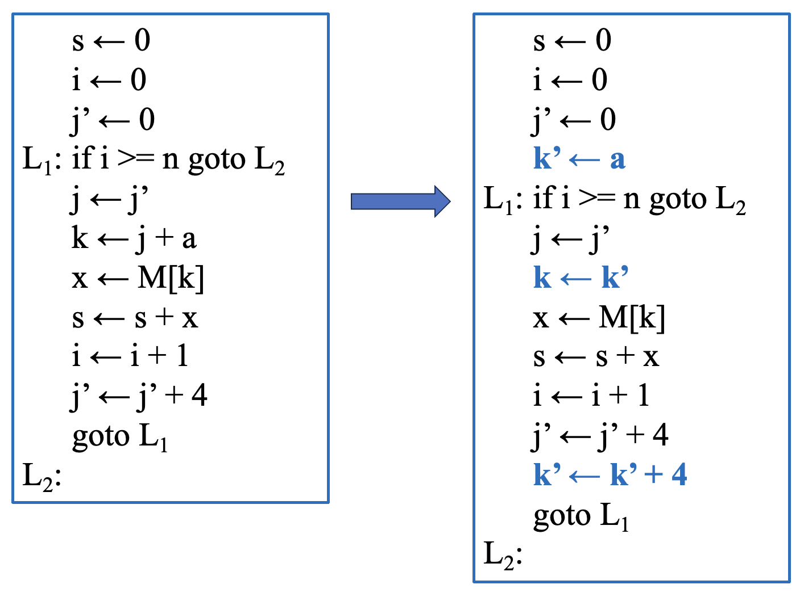
    

    - 对 k 进行强度降低(strength reduction)

### Elimination

经过强度降低后，部分归纳变量在循环中完全**未被使用**，另一些**仅用于**与循环不变量的**比较**。这样的归纳变量可以被删除。

如果一个变量在循环 L 的所有出口处均无效，并且其唯一用途是用于自身的定义，则该变量在循环 L 中是无用的。所有对无用变量的定义均可被删除。

??? example "例子"

    

        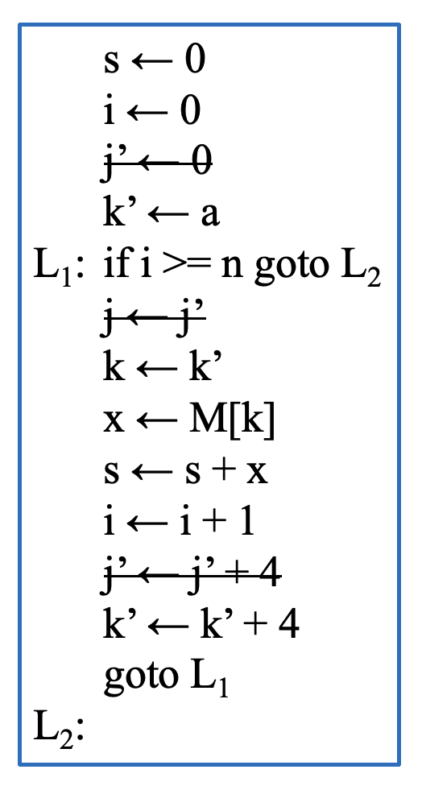
    

### Rewriting Comparison

变量 k 几乎是没用的，如果它仅用于与循环不变量的比较以及自身的定义中，并且同一族中存在另一个并非无用的归纳变量 c。而通过通过修改比较来使用相关的归纳变量，一个几乎无用的变量 => 一个无用的变量。

???+ example "例子"

    

        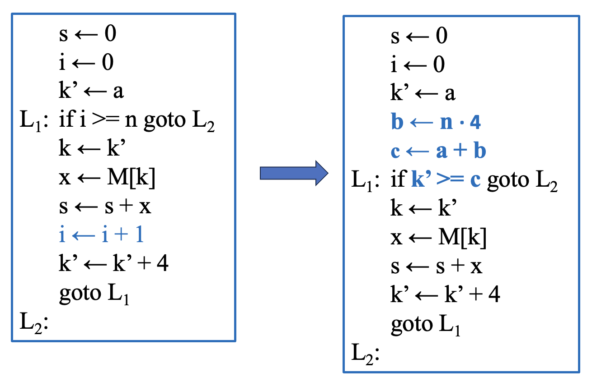
    

    - 几乎无用的变量：i
    - 相关归纳变量：k'
    - i >= n -> k' >= a + 4 * n
    - a + 4 * n 是循环不变量，应被提升
    - 删除 i

    

        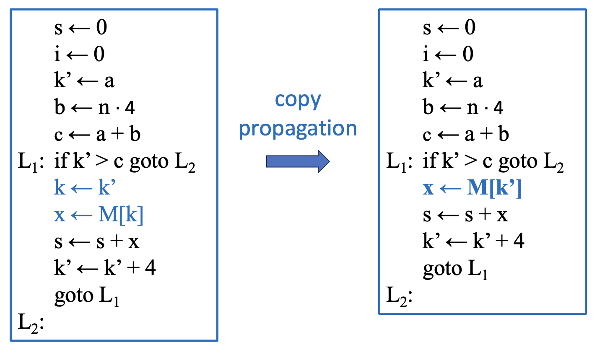
    

## Array-Bounds Checks

某些编程语言会在每次下标操作时自动插入**数组边界检查**(array-bounds checks)。我们希望编译器能移除一些冗余的检查，但移除所有冗余的边界检查在计算上是不可行的。

- 许多数组下标的形式是 a[i]，其中 i 是一个归纳变量；编译器通常能够充分理解以进行优化
- 数组的边界通常形式为 i >= 0 且 i < N
- 从循环 L 中消除边界检查的标准实际上相当复杂，具体请参考教材

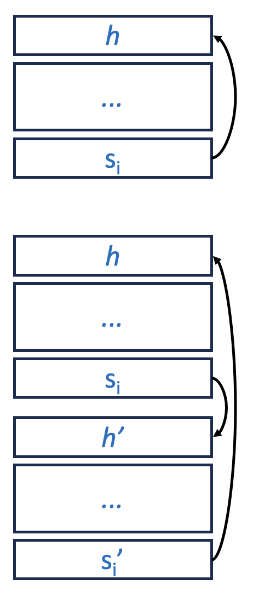{ align=right width=18% }

## Loop Unrolling

某些循环的循环体非常小，以至于大部分时间都花在递增循环计数器变量和测试循环退出条件上。

**展开**(unrolling)：将循环体的两个或更多副本连续排列。

给定一个循环 L，其头节点为 h，回边为 si -> h，我们可以按如下方式展开该循环：  

- 复制节点以创建一个循环 L'，其头节点为 h'，回边为 si' → h'  
- 将 L 中的所有回边从 si -> h 改为 si → h'  
- 将 L' 中的所有回边从 si' -> h' 改为 si' → h

???+ example "例子"

    

        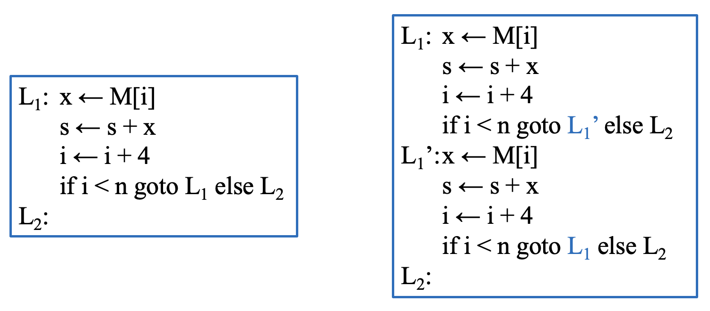
    

    没完成任何有用的工作，每一个“原始”迭代仍然有一个递增和一个条件分支。

我们需要一个归纳变量，使得每个增量 i <- i + Δ 支配循环的每个回边。

- 将增量与循环退出测试聚合起来，但只能处理偶数次迭代

    

        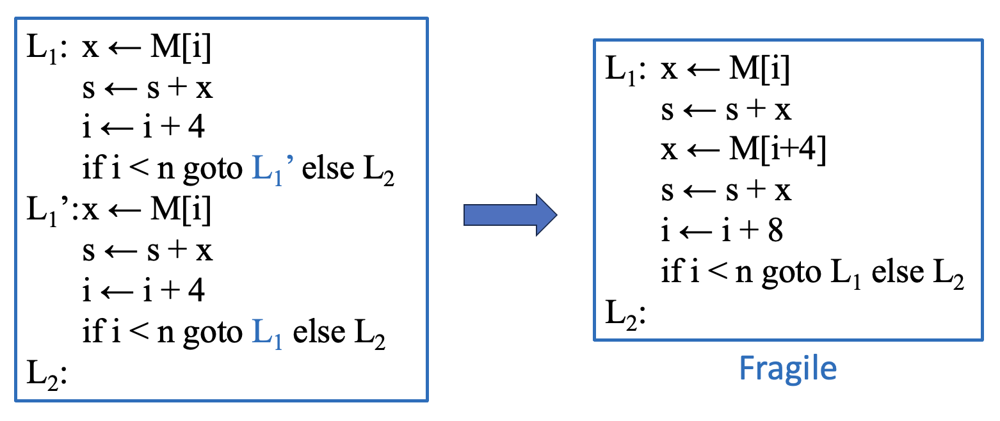
    

- 在**尾部**(epilogue)中执行奇数次迭代

    

        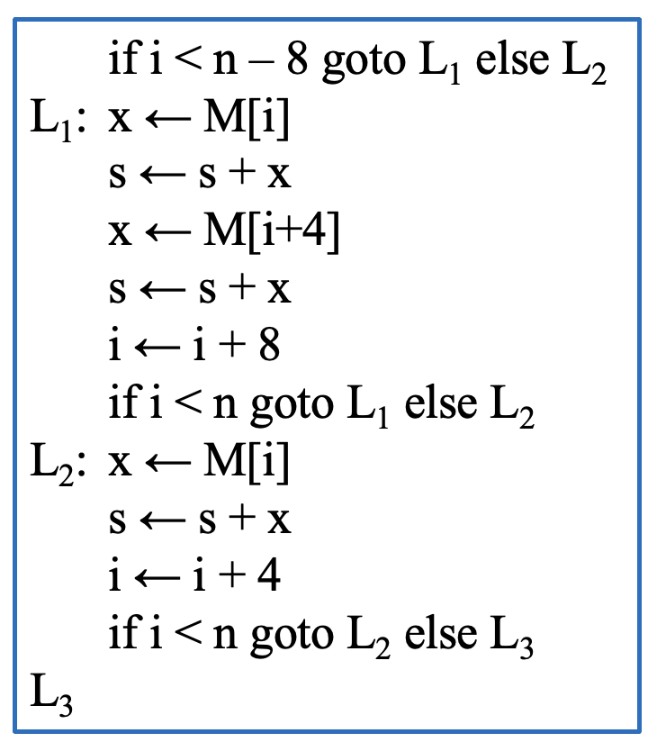
    
