# Lexical Analysis

???+ info "注"

    关于 RE、DFA 和 NFA 的介绍详见[《计算理论》笔记的第 2 章](../../math/toc/2.md)

??? abstract "核心知识"

    - 词元(token)的概念
    - 正则表达式（RE）如何识别词元
    - RE -> NFA -> DFA

??? info "工作流"

    <div align=center markdown>
    ```mermaid
    flowchart TD
        A["Description of lexical tokens <br> (in natural language or in mind)"]
        B["Regular Expression (static, declarative)"]
        C["NFA (simulatable, quasi-executable)"]
        D["Deterministic Finite Automata"]
        E["Lexer"]

        A -- "Manually" --> B
        B -- "Thompson's Construction" --> C
        C -- "Subset Construction, DFA Minimization" --> D
        D -- "Table-Driven Implementation" --> E
    ```
    </div>


## Lexical Token

**词法词元**(lexical token)：一种字符序列，作为编程语言语法的单位。**词法分析**(lexical analysis)正是输出由词元构成的流，作为语法分析器的输入。

>注：**保留字**(reversed words)在大多数语言中不能作为标识符使用，比如 `IF`, `VOID`, `RETURN` 等。

???+ example "例子"

    <div align=center markdown>
    
    | 类型 | 例子 |
    | :--- | :--- |
    | `ID` | foo n14 last |
    | `NUM` | 73 0 00 515 082 |
    | `REAL` | 66.1 .5 10. 1e67 5.5e-10 |
    | `IF` | if |
    | `COMMA` | , |
    | `NOTEQ` | != |
    | `LPAREN` | ( |
    | `RPAREN` | ) |
    
    </div>

**非词元**(non-tokens)的例子：

- 注释：`#!c /* I am a comment */`
- 预处理指令(preprocessor directive)：`#!c #include <stdio.h>`, `#!c #define NUMS 5, 6`
- 宏(macro)：`NUMS`
- 空格、制表符和换行符

一些预处理器会先这样处理源代码：

<div style="text-align: center">
    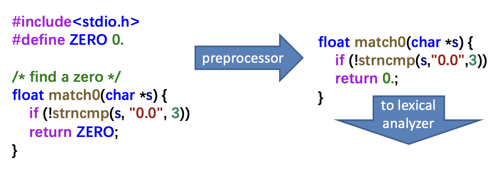
</div>

???+ example "例子"

    <div style="text-align: center">
        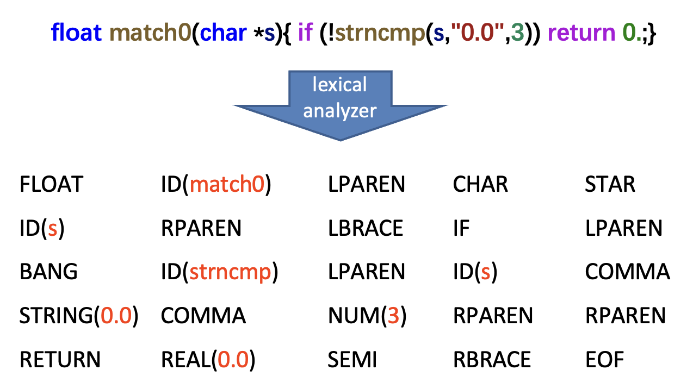
    </div>

    - 需标注每个词元的词元类型
    - 一些词元会被赋予**语义值**(semantic values)，比如标识符和字面量会带有**辅助信息**

<!-- 用英文描述编程语言的词法规则。比如下面介绍 C 或 Java 的标识符：

- 标识符是由字母和数字组成的**序列**；第一个字符必须是字母
- 下划线 `_` 也算作字母
- 大小写字母是不同的
- 如果输入流已被解析为一个给定字符数量以内的多个词元，则下一个词元将包含可能构成词元的**最长字符串**
- 空格、制表符、新行和注释会被**忽略**，**除非**它们用于分隔词元
- 需要一些空白来分隔相邻的标识符、关键字和常量 -->

???+ question "如何编写词法分析器？"

    - 对于一个临时的词法分析器，可以用任何合理的编程语言来实现
    - 而对于一个简单、通用目的和可读的词法分析器，需满足：
        - **正则表达式**：识别词法词元（易于理解，但难以实现）
        - **确定性有限自动机**：实现词法分析器（易于实现，但根据规范手动构建却很困难）
        - 所以我们将两者结合起来


## Regular Expression

- **语言**(language)：字符串集合（可能是无限集合）
- **字符串**(string)：符号的有限集合
- **符号**(symbol)：从有限字母表中获取

!!! note "注：**不要**为字符串**赋予任何意义**，我们**仅**根据字符串**是否在语言中**对其分类。"

**正则表达式**(regular expression, **RE**)通过有限的描述来指定一些（可能无穷多的）语言。每个 RE 代表一组字符串。RE 的归纳定义如下：

- $a$（符号）：代表自身的普通字符
    - 代表语言字母表中的符号
    - **正则表达式** $a$ 表示整个语言中只有一个**字符串** $a$

- $\varepsilon$（epsilon）：空字符串
    - 正则表达式 $\varepsilon$ 表示仅有一个空字符串的语言

- $M\ |\ N$（**交替**(alternation)）：$M$ 或 $N$，其中 $M$、$N$ 是 RE
    - 当某个字符串属于语言 $M$ 或语言 $N$ 时，它便属于语言 $M\ |\ N$

- $M \cdot N$（**拼接**(concatenation)）：$N$ 紧跟在 $M$ 后，其中 $M$、$N$ 是 RE
    - 当某个字符串是任意两个字符串 $\alpha, \beta$ 的拼接，其中 $\alpha$ 属于语言 $M$，$\beta$ 属于语言 $N$ 时，它便属于语言 $M \cdot N$

- $R^*$（**重复**(repetition)/**克莱尼闭包**(Kleene closure)）：将一个正则表达式 $R$ 拼接 0 次或多次（$R = \varepsilon\ |\ R\ |\ RR\ |\ RRR\ |\ RRRR \dots$）

上述五个符号/操作指定了与编程语言的词法词元对应的 ASCII 字符集。

在编写正则表达式时，有时会**省略拼接符号和 epsilon**。另外，我们假设有以下优先级关系：**克莱尼星号 > 拼接 > 交替**。

更多**缩写**(abbreviations)记号：

- $[abcd]$ == $(a\ |\ b\ |\ c\ |\ d)$
- $[b-g]$ == $[bcdefg]$
- $[b-gM-Qkr]$ == $[bcdefgMNOPQkr]$
- $M?$ == $(M | \varepsilon)$（出现零次或一次）
- $M+$ == $(M \cdot M^*)$（重复一次或多次）
- $.$（句号(period)）：一个除换行符外的任何字符
- $"a.+"$（引用(quotation)）：匹配引号中字符串本身

尽管这些扩展为我们带来方便，但它们并没有带来额外的描述能力，因为任何可以用这些缩写描述的字符串集合也可以仅通过基本运算符集来描述。

下面列出部分词元对应的 RE：

```c
if 						                { return IF; }
[a-z][a-z0-9]* 				            { return ID; } 
[0-9]+ 						            { return NUM; } 
([0-9]+"."[0-9]*)|([0-9]*"."[0-9]+)     { return REAL; }
("--"[a-z]*"\n")|(" "|"\n"|"\t")+ 		{ /* do nothing */ }
.						                { error(); } 
```

其中第 5 行有关注释和空白字符(white space)的识别不会报告给解析器，而是：

- 空白字符被丢弃，词法分析器继续处理
- **注释**以两个短横线开始，仅包含字母字符，并以换行结束
- 词法规范应该是**完整的**，在这种情况下，当任何其他情况匹配时会发生错误

上述规则存在一些歧义，比如

<div style="text-align: center">
    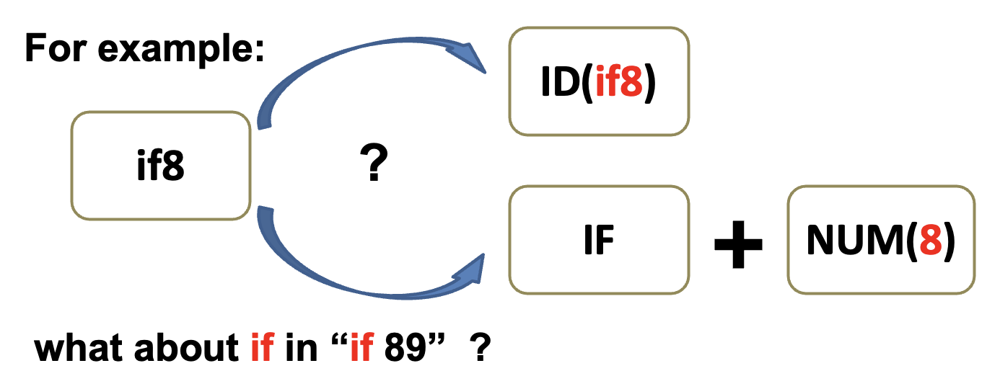
</div>

为此，Lex、JavaCC、SableCC 等其他类似的词法分析器生成器使用以下两条重要的消歧规则：

- **最长匹配**(longest match)：输入中可以匹配任何 RE 的最长初始子字符串被视为下一个词元
- **规则优先级**(rule priority)：
    - 对于特定的最长初始子字符串，**第一个**可以匹配的 **RE** 决定了它的词元类型
    - 这意味着 RE 规则的书写**顺序是有意义的**

>回到上个例子，`if8` 可根据最长匹配规则被匹配为标识符，而 `if` 可根据规则优先级被匹配为保留字。


## Finite Automata

有了方便指定词法词元的正则表达式后，我们还需要一种需要一种形式化表示(formalism)，作为使用有限自动机的计算机程序实现。

**有限自动机**(finite automata)是指：

- 一个有限**状态**(states)集合
- 并且里面的**边**(edge)从一个状态指向另一个状态，每条边都**用一个符号标记**
- 其中一个状态被指定为**起始状态**(start state)，并且还有某些状态被指定为**最终状态**(final states)
- 状态用圆圈表示，最终状态用**双圆圈**表示，而起始状态有一个指向它的箭头
- 一个**被多个字符标记**的边是多条并行边的简写形式

???+ example "例子"

    <div style="text-align: center">
        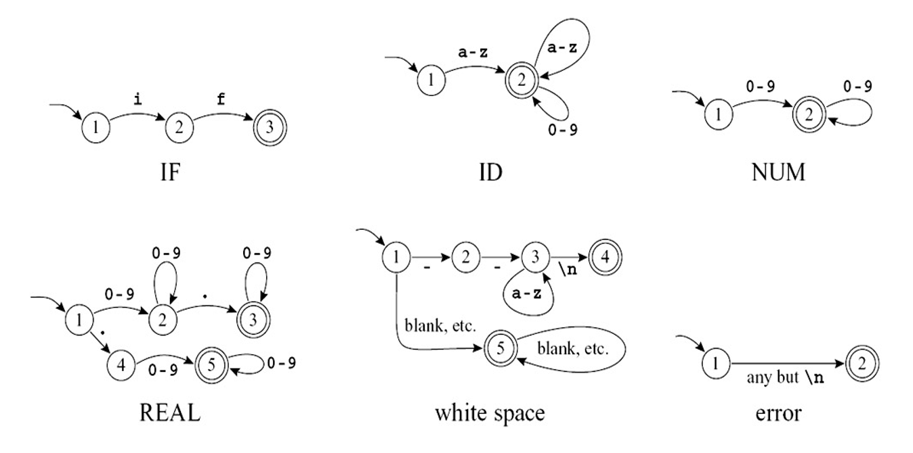
    </div>


### Deterministic Finite Automata

在**确定性有限自动机**(deterministic finite automata, **DFA**)中，从同一状态出发的两个边不会被标记相同的符号。DFA 按以下流程接受或拒绝字符串：

- 从起始状态开始，对于输入字符串中的每个字符，自动机沿着恰好**一条边**移动到下一个状态
- 这条边必须**被标记为输入字符**
- 在对一个 n 字符串进行 n 次转换后，如果自动机处于最终状态，则**接受**该字符串
- 如果它不在最终状态，或者在某个时刻无法沿着任何适当标记的边走下去，则**拒绝**该字符串

自动机识别的**语言**就是所有其接受的字符串的集合。

现在我们尝试将上面例子中列出的六个单独的自动机结合在一起，得到这样的自动机：

<div style="text-align: center">
    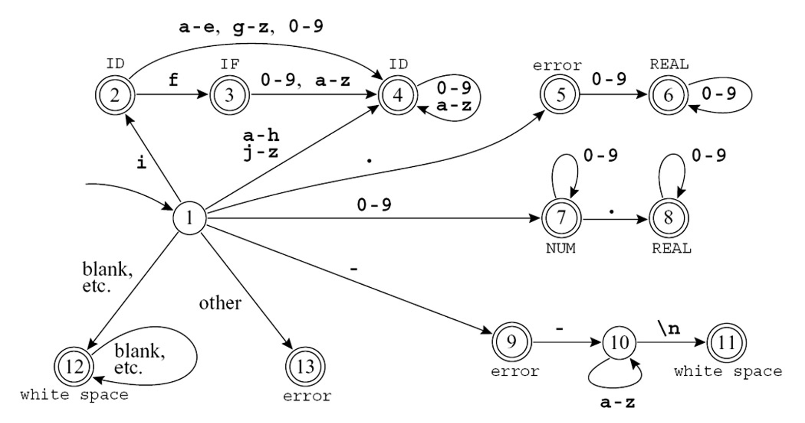
</div>

首先会想到的问题是如何确定运行的优先级。

- 状态 2 具有 IF 机器的状态 2 和 ID 机器的状态 2 的特征；由于后者是最终状态，因此组合状态必须是最终状态
- 状态 3 类似于 IF 机器的状态 3 和 ID 机器的状态 2
- 为了通过规则优先级消除两个最终状态的歧义，将状态 3 标记为 IF，因为我们希望这个符号被识别为保留字，而不是标识符


#### DFA -> Parser

接下来考虑如何将 DFA 转换到词法分析器。由于 DFA 是一种图，因此可以用矩阵表示状态的转移，即**转移矩阵**(transition matrix)。

- 它是一个二维数组（向量的向量），状态号和输入号作为下标
- 有一个「死(dead)」状态（**状态 0**），它在所有字符上自循环，我们用这个来编码边的缺失

对于先前的结合自动机，对应的转移矩阵如下：

```c
int edges[][] = { /* ... 0,1,2... -... e f g,h i, j... */
/* state 0 */    {0,0,...0,0,0...0...0,0,0,0,0,0...}, 
/* state 1 */    {0,0,...7,7,7...9...4,4,4,4,2,4...},
/* state 2 */    {0,0,...4,4,4...0...4,3,4,4,4,4...},
/* state 3 */    {0,0,...4,4,4...0...4,4,4,4,4,4...}, 
/* state 4 */    {0,0,...4,4,4...0...4,4,4,4,4,4...},
/* state 5 */    {0,0,...6,6,6...0...0,0,0,0,0,0...}, 
/* state 6 */    {0,0,...6,6,6...0...0,0,0,0,0,0...}, 
/* state 7 */    {0,0,...7,7,7...0...0,0,0,0,0,0...},
/* state 8 */    {0,0,...8,8,8...0...0,0,0,0,0,0...},
                        /* et cetera */
}
```

另外还要通过一个「**终态**(finality)」**数组**，将状态号映射到动作上，比如最终状态 2 映射到动作 `ID`。

现在我们要使用这张表来判断是接受还是拒绝一个字符串。

- 词法分析器的工作是找到**最长匹配**，我们可以用两个变量来表示最长匹配：
    - `Last-Final`：最近最终状态的状态号
    - `Input-Position-at-Last-Final`：到达最近最终状态时的输入字符

- 每进入一个最终状态时，词法分析器会更新这些变量
- 到达**死状态**(dead state)（没有输出转换的非最终状态）时，这些变量指示了匹配到哪个词元以及在哪里结束

???+ example "例子"

    <div style="text-align: center">
        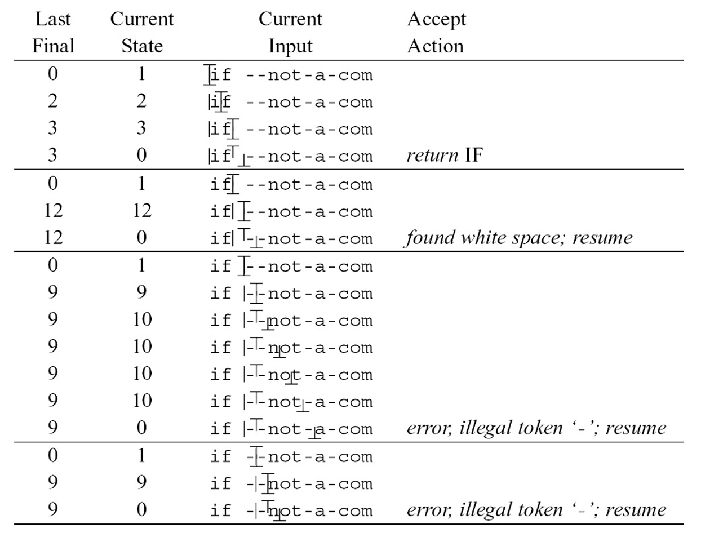
    </div>


### Nondeterministic Finite Automata

实现 DFA 容易，但从 RE 中手动构造 DFA 还是比较困难的。于是引入了**非确定性有限自动机**(nondeterministic finite automata, **NFA**)的概念。原本 RE -> DFA 的过程改为 RE -> NFA -> DFA。

NFA 的特点是：

- 必须从多条（标有相同符号的）边中选择一条以进入某个状态
- 有一种被 $\varepsilon$ 标记的特殊边

???+ example "例子"

    === "例1"

        <div style="text-align: center">
            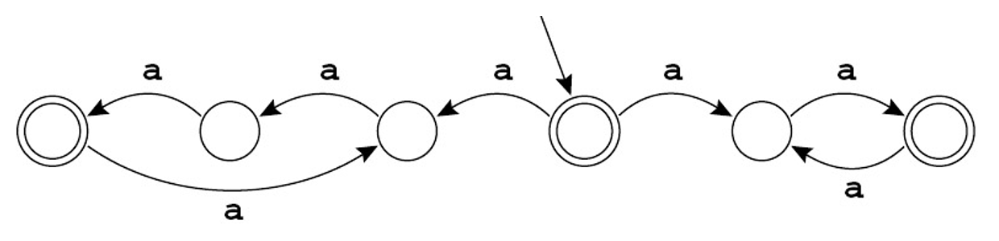
        </div>

        该自动机识别所有包含 2 个或 3 个 a 的倍数的字符串。

        - NFA 如何工作（在起始状态）？在字符 a 上，自动机可以向左或向右移动
            - 如果向左：字符串长度是三的倍数
            - 如果向右：字符串长度是偶数

        - 在第一次转移时，这台机器必须“猜”一条路走。若 NFA 能够识别某个字符串，则总是有一条路是猜对的

    === "例2"

        <div style="text-align: center">
            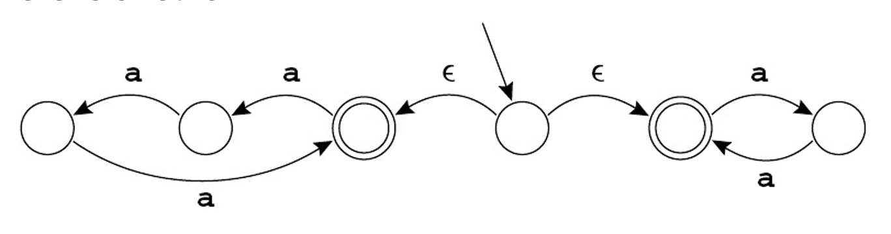
        </div>

        这个自动机和例 1 的那个等价。机器必须选择沿哪条 $\varepsilon$ 边（不使用来自输入的符号）走。


#### RE -> NFA

RE -> NFA 的**转换算法**：

- 将每个正则表达式转换为具有**尾部**（起始边）和**头部**（最终状态）的 NFA
- 与正则表达式类似，NFA 可以是原始的或由较小的 NFA 组成

下面是对应的转换规则：

<div style="text-align: center">
    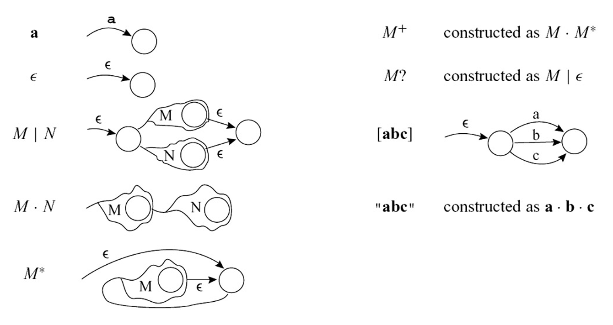
</div>

???+ example "例子"

    将 `IF`, `ID`, `NUM` 和 `error` 词元对应的 RE 转换为 NFA（合并了一些等价的 NFA 状态）：

    <div style="text-align: center">
        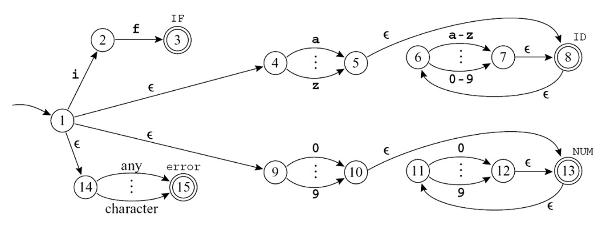
    </div>

    - **头部**状态被标记为具有不同词元类型的最终状态
    - 所有表达式的**尾部**连接到一个新的起始节点


#### NFA -> DFA

??? question "NFA -> DFA 的原因"

    尽管 NFA 对于正则表达式和我们来说很直观，但对计算机来说并非如此。
    
    - 在 NFA 中，机器必须选择从多条路中选择一条走，并且必须通过「猜」选择一条正确的路，这对计算机而言是一件相当困难的事
    - 计算机更喜欢像 DFA 这样的确定性程序

一个要点是避免猜测，一次尝试所有可能性。

??? example "例子"

    在输入字符串 `in` 上模拟 NFA：

    <div style="text-align: center">
        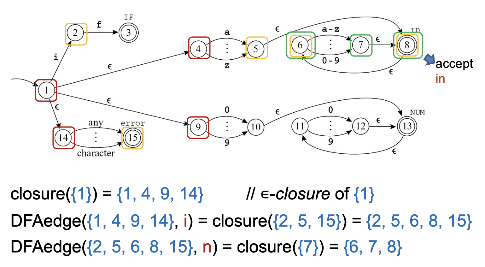
    </div>

    - 从状态 1 出发
  
        - 不去猜测应该采取哪个 $\varepsilon$-转移，NFA 可以一次选择所有可能
            - 满足的状态有 {1, 4, 9, 14} 
            - 也就是说，我们计算 {1} 的 **$\varepsilon$-闭包**

        - 没有其他状态可以在不消耗第一个字符的情况下到达

    - 在**字符 `i`** 上进行转移

        - 从状态 1 到达 2，从 4 到 5，以及从 14 到 15（9 无法继续转移），所以得到集合 {2, 5, 15}
        - 再次计算 $\varepsilon$-闭包：从 5 有一个到 8 的 $\varepsilon$-转移，8 到 6 也有一个，因此 NFA 位于状态 {2, 5, 6, 8, 15}

    - 在**字符 `n`** 上进行转移

        - 从状态 6 到 7，从其他状态出发均无合适转移
        - 而集合 {7} 的 $\varepsilon$-闭包是 {6, 7, 8}

$\varepsilon$-闭包的正式定义如下：

- $\mathbf{edge}(s, c)$：从状态 $s$ 出发，通过带标记 $c$ 的单个边可到达的所有 NFA 状态的集合
- $\mathbf{closure}(S)$ 从状态集合 $S$ 中的某个状态出发，在不消耗任何输入的情况下仅通过 $\varepsilon$-边到达的状态集合

数学上，$\mathbf{closure}(S)$ 是满足以下公式的最小集合 $T$：

$$
T = S \cup \left(\bigcup\limits_{s \in T} \mathbf{edge}(s, \varepsilon)\right)
$$

迭代计算 $T$ 的算法如下：

$$
\begin{aligned}
&T \leftarrow S \\
&\textbf{repeat} \ \ T' \leftarrow T \\
&\quad \quad T \leftarrow T' \cup \left(\bigcup_{s \in T'} \mathbf{edge}(s, \varepsilon)\right) \\
&\textbf{until} \ \ T = T'
\end{aligned}
$$

该算法一定会终止：

- $T$ 只能在终止之前增长
- NFA 中只有**有限数量的不同状态**；$T$ 最多可以是所有 NFA 状态的集合

模拟 NFA 的流程：

- 假设一组 NFA 状态 $d = \{s_i; s_k; s_l\}$
- 从 $d$ 开始并读取输入符号 $c$
- 到达一个新的 NFA 状态集，称为集合 $\mathbf{DFAedge}(d, c)$，即：

    $$
    \mathbf{DFAedge}(d, c) = \mathbf{closure}\left(\bigcup_{s \in d} \mathbf{edge}(s, c)\right)
    $$

接下来通过 DFAedge 编写更正式的 NFA 模拟算法。如果 NFA 的起始状态是 $s_1$，输入字符串是 $c_1, \dots, c_k$，那么算法为：

$$
\begin{aligned}
&d \leftarrow \mathbf{closure}(\{s_1\}) \\
&\textbf{for} \ i \leftarrow 1 \ \textbf{to} \ k \\
&\quad d \leftarrow \mathbf{DFAedge}(d, c_i)
\end{aligned}
$$

操作状态集合的成本很高，因为在源程序的每个字符上处理的成本高。因此可以提前进行状态集合的计算。

下面开始从 NFA 构建 DFA 的计算。观察发现：

- 每组 NFA 状态对应一个 DFA 状态
- 若 NFA 有 n 个状态，那么 DFA 最多有 2^n^ 的状态

DFA 构造算法如下：

- DFA 起始状态 $d_1$ 就是 $\mathbf{closure}(s_1)$
- 如果 $d_j = \mathbf{DFAedge}(d_i, c)$，则从 $d_i$ 到 $d_j$ 有一个标记为 $c$ 的边

完整的算法如下：

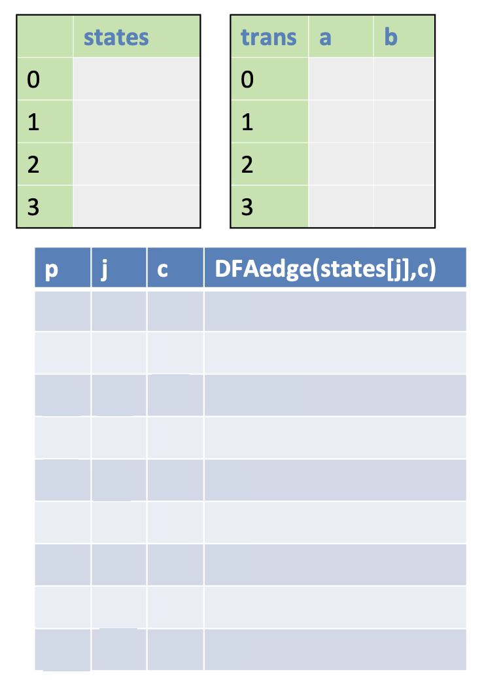{ align=right width=35% }

$$
\begin{aligned}
& \boxed{
\begin{aligned}
& \text{states}[0] \leftarrow \emptyset ; \quad \text{states}[1] \leftarrow \textbf{closure}(\{s_{1}\}) \\
& p \leftarrow 1 ; \quad j \leftarrow 0 \\
& \textbf{while } j \le p \\
& \quad \textbf{foreach } c \in \Sigma \\
& \quad \quad e \leftarrow \textbf{DFAedge}(\text{states}[j], c) \\
& \quad \quad \textbf{if } e = \text{states}[i] \text{ for some } i \le p \\
& \quad \quad \textbf{then } \text{trans}[j, c] \leftarrow i \\
& \quad \quad \textbf{else } p \leftarrow p + 1 \\
& \quad \quad \quad \text{states}[p] \leftarrow e \\
& \quad \quad \quad \text{trans}[j, c] \leftarrow p \\
& \quad j \leftarrow j + 1
\end{aligned}
}
\end{aligned}
$$

??? note "算法的解释"

    >来自[咸鱼暄前辈的笔记](https://xuan-insr.github.io/compile_principle/1%20Lexical%20Analysis/#242-%E5%B0%86-nfa-%E8%BD%AC%E6%8D%A2%E4%B8%BA-dfa)

    - DFA 的始态 `states[1]` 为 NFA 的始态的 $\varepsilon$ 闭包
    - 当 $j\leq p$ 时遍历字符集 $\Sigma$ 中的每个字符 `c` ，令 `e` 为 `states[j]` 经 `c` 可达的所有状态
    - 如果同形复现，即 `e` 与 $i\leq p$ 的某个 `states[i]` 相同，则将 `trans[j,c]` 赋值为 `i` ，即标记 `j` 经 `c` 到达 `i` 
    - 否则 `p++, states[p] = e, trans[j, c] = p`
    - `j++` ，研究下一个状态
    - 如果已经研究完最后一个状态，且没有新的状态，则转换结束
    - 只要 `states[x]` 中任何状态是 NFA 的终态，则 `states[x]` 即为 DFA 的终态

- 不访问 DFA 的不可达状态
    - 原则上，DFA 有 2^n^ 个状态
    - 但从起始状态出发，只有大约 n 个状态是可达的
    - 这样避免了 DFA 解释器的转移表大小呈指数级膨胀

- 如果在 NFA 中的 states[d] 里至少有一个 NFA 状态是最终状态，则状态 d 在 DFA 中便是最终状态
- 不仅要标记出最终状态，还必须说明识别了哪个词元
- **规则优先级**：由于 states[d] 中的一些成员在 NFA 中可能都是最终状态，所以用列表中 RE 首次出现的词元类型来标记 d
- 构造完 DFA 后可以丢弃 states 数组，但保留 trans 数组，用于词法分析

???+ example "例子"

    将之前的 NFA 转换为 DFA 的结果：

    <div style="text-align: center">
        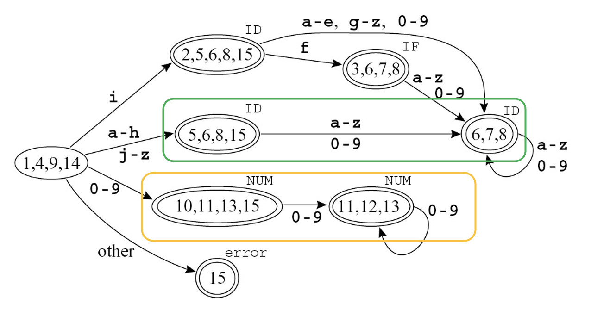
    </div>

    - 规则优先级：{3, 6, 7, 8} 被标记为 IF
    - 该自动机是次优的，也就是说它并非识别相同语言的最小自动机


### DFA Minimization

两个状态 $s_1$ 和 $s_2$ 是**等价的**(equivalent)，当前仅当从 $s_1$ 开始的状态接受字符串 $\sigma$ 是从 $s_2$ 开始的状态接受 $\sigma$ 的充要条件。

在一个有两个等价状态 $s_1, s_2$ 的自动机中，可通过将 $s_2$ 的所有入边指向 $s_1$，并删除 $s_2$ 来去重。

直接寻找所有等价状态很难，但寻找非等价状态是容易的。我们可以采用 DFA 最小化算法来解决：

1. 假设所有**最终状态**都是等价的，所有**非最终状态**也都是等价的，这是**两个原始组**
2. 移除非等价状态
    1. 分割一个组，**当前仅当对于所有输入符号 a，trans[s,a]=trans[t,a]**，两个状态 s 和 t 应在同一组；之后我们有一些新状态，需用新组替换原始组
    2. 考虑步骤 a 中的每个组
3. 重复步骤 2，直到没有组发生变化
4. 现在的组是最小 DFA 中的状态
    - 起始状态是包含以前起始状态的组
    - 增边是自然的，因为组内的状态通过某个输入符号会进入同一组


## Lex: A Lexical Analyzer Generator

Lex 是一个根据词法规范生成 C 程序的词法分析器生成器。

- 对于编程语言中的每种词元类型，**规范**内包含一个正则表达式和一个动作。该动作将词元类型传递给编译器的下一阶段
- **词法分析器生成器**(lexical-analyzer generator)是将 RE 翻译为 DFA 的自动生成器
- Lex 的输出是一个词法分析器，使用前面描述的算法解释 DFA，并在每次匹配时执行**动作片段**(action fragments)（即返回词元值的 C 语句）

更具体的是，Lex 的输入和输出分别为：

- 输入：包含正则表达式的文本文件，以及当每个表达式匹配时要采取的操作

    ```c title="a.l"
    { definitions }
        %%
        { rules }
        %%
        { auxiliary routines }
    ```

    - `definitions`：
        - 出现在第一个 `%%` 后面
        - 所有必须插入到任意函数外部的高级 C 代码应出现在该区域中，位于分隔符 `%{` 和 `%}` 之间（注意这些字符的顺序）
        - 词元类型名也必须在这里定义
    - `rules`：包含一些 RE，后面跟着匹配相应 RE 时要执行的 C 代码
    - `auxiliary routines`：仅在第二部分被调用，不在其他地方定义

- 输出：包含了一份定义一个名为 **yylex** 的过程的 C 源代码，该过程是一个 DFA 的基于表的实现，对应于输入文件的正则表达式，并且像 **getToken** 过程一样操作

??? example "例子"

    === "例1"

        ```c
        %{
        /* a Lex program that changes all numbers from decimal to hexadecimal notation, printing a summary statistic to stdeer
        */ 
        #include <stdlib.h>
        #include <stdio.h>
        int count = 0;
        %}
        digit [0-9]
        number {digit}+
        %%
        { number } { int n = atoi (yytext);
                    printf(“%x”, n);
                    if (n > 9) count++; }
        %%
        main() { 
            yylex();
            fprintf(stdeer, “number of replacements = %d”, count);
            return 0;
        }
        ```

    === "例2"

        <div style="text-align: center">
            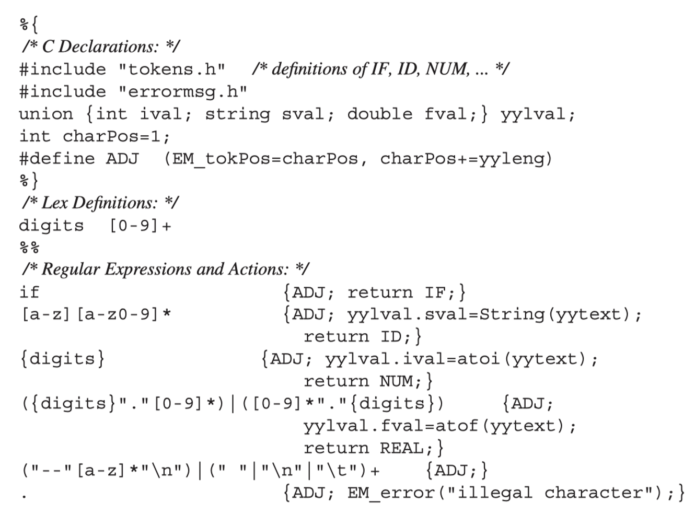
        </div>