# Parsing


??? abstract "核心知识"

    - CFG：推导、分析树、二义性
    - 自顶向下分析：递归下降分析 -> 预测分析
        - First, Follow, Nullable
        - 构建预测表
        - LL(1) 分析算法（使用栈）
        - LL(1) 重复条目问题 -> 消除左递归/提取左因子
    
    - 自底向上分析
        - LR(0) 分析
        - SLR 分析
        - LR(1) 分析
        - LALR(1) 分析

    - Yacc（了解即可）
    - 错误恢复应该不考

- **语法**(syntax)：词语组合成短语、从句或句子的方式
- **语法分析**(syntax analysis)：分析程序短语结构
    - **分析器**(parser)基于语法构建，并从词元流中提取出抽象语法

<div style="text-align: center">
    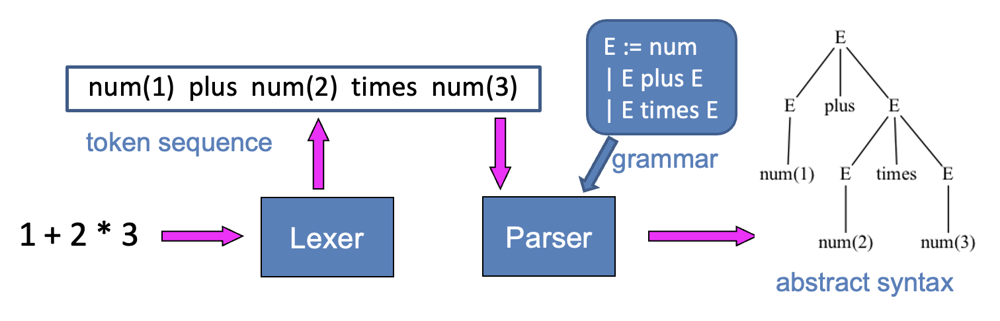
</div>

??? question "为何需要语法分析？"

    === "问题1"

        <div style="text-align: center">
            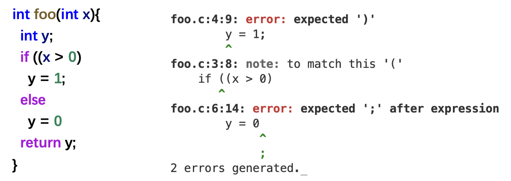
        </div>

        如图所示，这段程序虽然词法上没错，但有很多语法错误。

    === "问题2"

        <div style="text-align: center">
            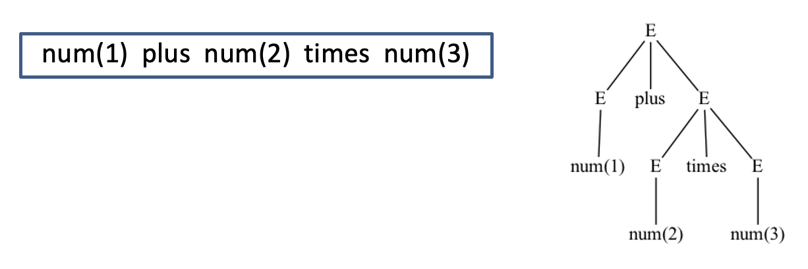
        </div>

        该表达式可以根据分析树而非词元流来正确求值。


## Context-Free Grammar

???+ info "注"

    关于 CFG 的介绍详见[《计算理论》笔记的第 3 章](../../math/toc/3.md)

并非所有词元串都是程序。分析器必须区分有效和无效的词元串。所以我们需要一种能描述有效词元串的语言和一种区分有效和无效的词元串的方法。

<div style="text-align: center">
    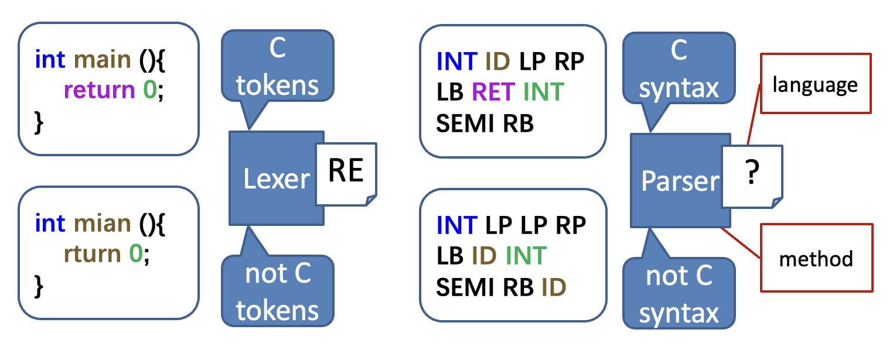
</div>

上一章介绍的正则语言是一种最弱的形式语言，它无法表达**递归**、括号匹配等复杂结构，但这些结构又是编程语言中常见的结构。因此我们引入一种更强大的形式语言，即**上下文无关文法**(context-free grammar, **CFG**)。它由以下部分构成：

- 一组**终结符**(terminals) $T$：来自字母表的符号，即词法**词元**
- 一组**非终结符**(non-terminals) $N$
- 一个**起始符号** $S \in N$
- 一组**产生式**(productions)（**规则**(rules)）：$X \rightarrow Y_1 Y_2 \dots Y_k$（表示用 $Y_1 Y_2 \dots Y_k$ 替换 $X$），其中 $X \in N, Y_i \in N \cup T \cup \{\varepsilon\}$

>注意产生式左侧只能有一个非终结符，这也正是「上下文无关」的含义：一个产生式中我们只关注其中一个非终结符的转换，不关心该非终结符前后的符号。

基于 CFG 推导字符串的步骤：

1. 从一个仅包含起始符号 $S$ 的字符串开始
2. 将字符串中的任意非终结符 $X$ 替换为某产生式 $X \rightarrow Y_1 \dots Y_k$ 的右侧部分
3. 重复步骤 2，直到字符串中只包含终结符

更形式化地，对于每一步：

<div style="text-align: center">
    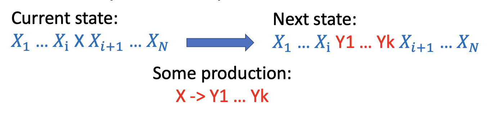
</div>

令 $G$ 为一个上下文无关文法，起始符号为 $S$。那么 $G$ 的语言 $L(G)$ 定义为：

$$
\{a_1 \dots a_n\ |\ \forall_i a_i \in T \wedge S \xrightarrow{*} a_1 \dots a_n\}
$$

- $\color{cornflowerblue}{*}$ 表示 0 步或多步推导：

    $$
    \begin{aligned}
    S \to \dots \to \dots \to \alpha_0 \to \color{cornflowerblue}{\alpha_1 \to} & \color{cornflowerblue}{\alpha_2 \to \dots \to \alpha_n} \\
    & \color{cornflowerblue}{\downarrow} \\
    \color{cornflowerblue}{\alpha_0} & \color{cornflowerblue}{\xrightarrow{*} \alpha_n}
    \end{aligned}
    $$

- 一旦生成，终结符将持续存在
- 在分析过程中，终结符是语言的**词法词元**

???+ example "例子"

    - T = {id, print, num, +, (, ), :=, “, ”}
    - N = {S, E, L}
    - S：起始符号
    - 9 条产生式：

        ```linenums="1"
        S -> S; S
        S -> id := E
        S -> print(L)
        E -> id
        E -> num
        E -> E + E
        E -> (S, E)
        L -> E
        L -> L, E
        ```

    属于该 CFG 的语言的字符串：

    ```
    id := num
    id := num + num
    print(num)
    id := id + (id := num + num, id)
    ...
    ```

    源代码可能是：

    ```
    a := 7;
    b := c + (d := 5 + 6, d);
    print(a, b)
    ```


### Derivations

现在，「寻找一种区分有效和无效词元串的方法」这一问题被转换为「确定字符串是否属于 CFG 的语言」。这里我们就要用到**推导**(derivation)：从起始符号 $S$ 开始，然后反复将任意非终结符替换为其右侧的任一产生式。

形式化地，如果存在产生式 $A \rightarrow a$ ，那么字符串 $xay$ 就是字符串 $xAy$ 的一个实例，我们称 $xAy \Rightarrow xay$ ，即 $xAy$ 经过一步推导出 $xay$ 。在 $\Rightarrow$ 上增加 $*$ 或 $+$ 表示经过零或多步、一或多步推导出。因此，一个字符串属于 $L(G)$，当且仅当可以从起始符号 $S$ 推导出该字符串。

???+ example "例子"

    现有 CFG：

    ```linenums="1"
    E -> E * E
    E -> E / E
    E -> E + E
    E -> E - E
    E -> id
    E -> num
    E -> (E)
    ```

    `id * id + id` 可以经如下推导得到：

    ```
    E
    E + E
    E * E + E
    id * E + E
    id * id + E
    id * id + id
    ```

    因此它满足上述语法

    可以通过树来表示推导：

    - 起始符号对应根节点
    - 对于产生式 $X \rightarrow Y_1 \dots Y_k$，为节点 $X$ 添加子节点 $Y_1, \dots, Y_k$

    <div style="text-align: center">
        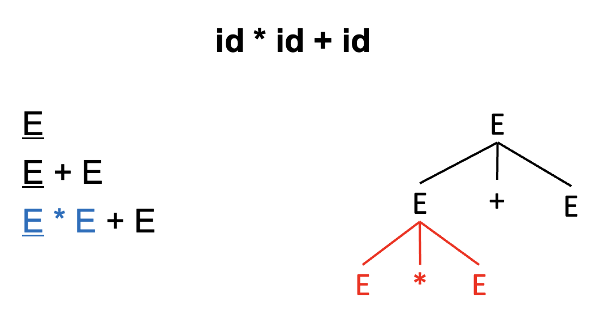
    </div>

上述例子是一种**最左推导**(left-most derivation)，即每一步都替换最左侧非终结符的推导。对应地也有**最右推导**(right-most derivation)的概念。（在不考虑二义性问题的情况下）两种推导能得到相同的分析树。

也存在某些推导既不是最左推导，也不是最右推导，比如 E * <u>E</u> + E（展开划线的非终结符）。


### Parse Tree

上面画的树被称为**分析树**(parse tree)。

- 叶节点为终结符
- 中间节点为非终结符
- **叶节点的中序遍历**便是原输入
- 但分析树能展示操作的关联性（这一关联性无法通过输入字符串看出）

要知道字符串 $s$ 是否属于 $L(G)$，需为 $s$ 构建一个分析树，这样便能自动证明 $s \in L(G)$。

**推导过程定义了分析树**，但同一棵分析树可能对应多种推导方式。因此最左推导和最右推导在语法分析器实现中至关重要。


### Ambiguity

???+ example "例子"

    <div style="text-align: center">
        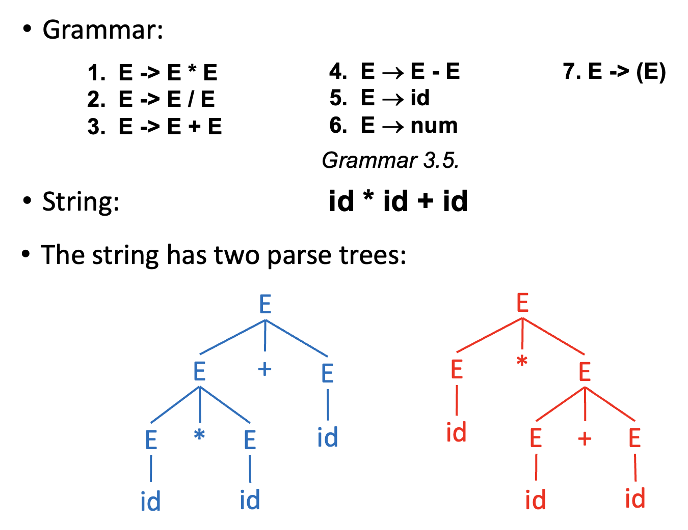
    </div>

如果一个语法能够通过多种不同的分析树推导出同一个字符串，那么它就是有**二义的**(ambiguous)。由于编译器是利用分析树来推导语义的，因此二义语法会阻碍编译的顺利进行（即导致程序的不良定义）。我们需要解决二义性问题！

最直接的方法是**将二义语法转换为非二义语法**。还是以上面的例子为例，我们需要：

- **优先级**(precedence)：比如 * 比 + 的优先级更高
- **左结合**(left-association)：每个运算符和左侧结合，比如 1 - 2 - 3 应视为 (1 - 2) - 3 而非 1 - (2 - 3)

具体来说，我们需引入新的非终结符，以强制某些产生式晚于其他产生式被使用。

???+ example "例子"

    === "例1"

        一些可能的消歧文法（来自[咸鱼暄前辈的笔记](https://xuan-insr.github.io/compile_principle/2%20Parsing%20%28I%29/#313-%E4%BA%8C%E4%B9%89%E6%80%A7--ambiguity)）：

        - `E -> T+E | T`, `T -> F*T | F`, `F -> id | (E)`：强制了 id 和 () 具有最高优先级（因为它们会被作为一个整体展开），* 次之，+ 优先级最低
        - `E -> E-T`, `T -> num`：使得 - 左结合

    === "例2"

        <div style="text-align: center">
            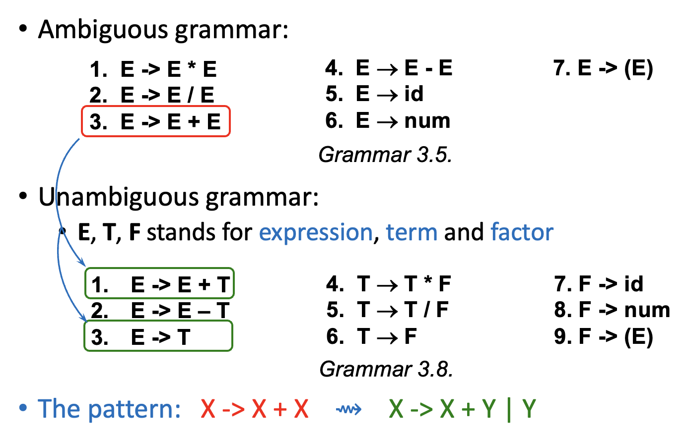
        </div>

        <div style="text-align: center">
            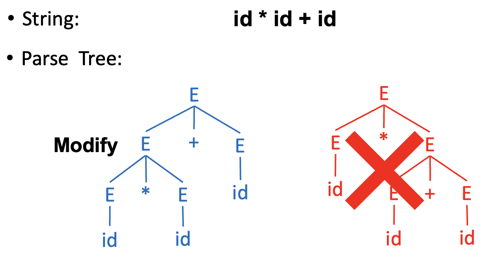
        </div>

>例 2 中用到了产生式的缩写：$X \rightarrow X + Y\ |\ Y$，等价于两条产生式 $X \rightarrow X + Y$ 和 $X \rightarrow Y$，也就是说只要产生式左侧符号一致，右侧可通过 $|$ 来合并。

???+ question "为什么需要强制优先级和左结合？"

    - **优先级**：具有较高优先级的运算符要么不出现，要么只能稍后推导
    - **左结合**：使用左递归（右侧的第一个符号与左侧的符号相同）

有些语言具有二义语法，但没有无二义语法，这类语言作为编程语言时可能会存在问题。

另外，没有一种通用的方法来解决 CFG 二义性问题，因为二义性本身并不保证能够在有限时间内被判定（更深层的原因读者可自行搜索相关资料了解）。

### EOF Maker

我们用符号 $\$$ 表示 EOF（文件结束(end of file)）。为了表明 $\$$ 必须出现在一个完整的 $S$-短语之后，我们添加一个新的起始符号 $S'$ 和一个新的产生式 $S' \rightarrow S\$$。

<div style="text-align: center">
    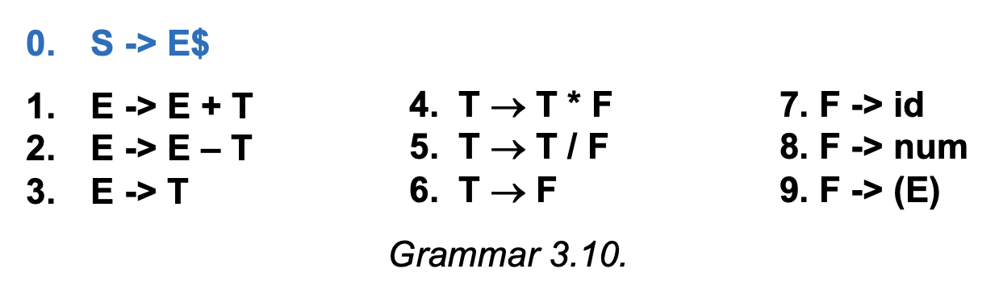
</div>


## Top-Down Parsing

在编译器中分析所有 CFG 的成本很高，因为用于分析所有 CFG 的算法开销很大（有时编译时间的三分之一就耗费在分析阶段上）。不过编译器开发者们已针对构建高效编程语言所需的特定类型的 CFG，开发出专门的分析算法：**递归下降分析**(recursive descent parsing)。

- 这是一种**自顶向下的分析**(top-down parsing)（分析树是**自顶向下**、从左到右构建的），其中的一个代表是**预测分析**
- 简单易实现，可手动编码完成
- 能处理多数但非全部 CFG 类型，比如适用于 **LL(1) 文法**（从左到右分析(left-to-right parse)（L），最左推导（L），向前看单符号(1 symbol lookahead)（1））

!!! note "思路"

    >来自[咸鱼暄前辈的笔记](https://xuan-insr.github.io/compile_principle/2%20Parsing%20%28I%29/#321-%E6%80%9D%E8%B7%AF)

    自顶向下，从左到右遍历分析树。对于分析树上遍历到的节点：

    - **终结符**：查看下一位输入是否与该终结符相同
        - 若相同，则接受该输入
        - 若不同，或者没有下一位输入，则说明出现了错误，则回溯到上一个非终结符
    - **非终结符**：
        - 尝试第一个从该非终结符引出的产生式，即将该产生式的右端作为该结点的子结点加入分析树，然后依次遍历子结点
        - 若回溯到了当前非终结符，则尝试下一个产生式
        - 若所有产生式都已经尝试完了，那么说明该非终结符是不应当出现的，回溯到上一个非终结符

    直到所有结点都被遍历完为止。若输入也已结束，说明成功匹配；否则继续回溯。

???+ example "例子"

    现有 CFG：

    ```linenums="1"
    S -> if E then S else S
    S -> begin S L
    S -> print E
    L -> end
    L -> ; S L
    E -> num = num
    ```

    对于字符串 begin print num = num end，自顶向下、从左到右构建分析树：

    <div style="text-align: center">
        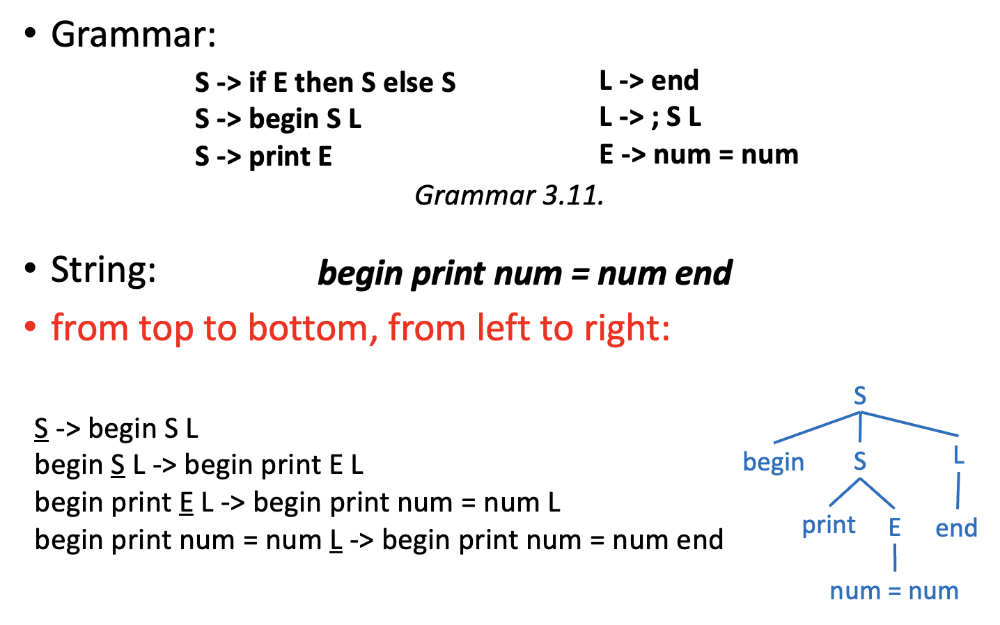
    </div>

接下来为该语法编写一个递归下降分析器。关键思路是：

- 每个非终结符对应一个递归函数 -> 调用此函数以匹配该非终结符
- 每条产生式成为函数中的一个子句

???+ example "一种实现的例子"

    === "Step 1"

        表示词元：

        ```c
        enum token {IF, THEN, ELSE, BEGIN, END, PRINT, SEMI, NUM, EQ};
        ```

    === "Step 2"

        构建从词法分析器读取标记的辅助函数：

        ```c
        // lexer
        extern enum token getToken(void);

        // get a token by calling the lexer
        enum token tok;
        void advance() { tok = getToken(); } 

        // consume the token and get the next one
        void eat(enum token t) {
            if (tok == t) 
                advance();
            else
                error();
        }
        ```

    === "Step 3"

        为每个非终结符构建函数：

        ```c
        void S(void) {
            switch (tok) { 
                case IF: 
                    eat(IF); 
                    E(); 
                    eat(THEN); 
                    S(); 
                    eat(ELSE); 
                    S(); 
                    break; 
                case BEGIN: 
                    eat(BEGIN); 
                    S(); 
                    L(); 
                    break; 
                case PRINT: 
                    eat(PRINT); 
                    E(); 
                    break; 
                default: 
                    error(); 
            }
        }
        void L(void) {
            switch(tok) {
                case END: 
                    eat(END); 
                    break;
                case SEMI: 
                    eat(SEMI); 
                    S(); 
                    L(); 
                    break;
                default: 
                    error(); 
            }
        } 
        void E(void) {
            eat(NUM); 
            eat(EQ); 
            eat(NUM); 
        }
        ```

???+ bug "问题"

    这只能处理特殊情况：对于语法中的每个非终结符，其产生式右侧的首符号 $Y_1$ 是不同的终结符。对于下面这种语法，上面的方法就不管用了。

    <div style="text-align: center">
        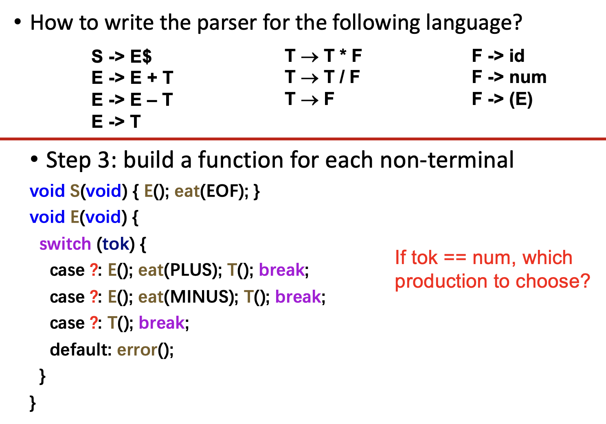
    </div>


### Predictive Parsing

**预测分析**(predictive parsing)是一种不带回溯的递归下降分析，通过向前查看输入符号来决定选择用哪个产生式。

???+ question "若 tok（某个终结符）== num，应选择哪个产生式？"

    1. 需知道在选择三个产生式时各自可能的第一个终结符是什么
    2. 若多个产生式的可能的第一个终结符都可能是 num，那就需要重写文法，以确保只有一个产生式可用


### First and Follow Sets

我们先来定义两个集合：

- $\text{FIRST}(\gamma)$：若 $\gamma \rightarrow^* t \beta$，则 $t \in \text{First}(\gamma)$（即 $\gamma$ 可以在推导的首位生成一个终结符 $t$）
    - 含义：作为由 $\gamma$ 推导出的字符串的开头的所有终结符的集合

- $\text{FOLLOW}(X)$：若 $S \rightarrow^* \beta Xt \delta$，则 $t \in \text{Follow}(X)$
    - 含义：紧跟在 $X$ 后的终结符的集合
        - 如果存在包含 $Xt$ 的任何推导，那么 $t \in \text{FOLLOW}(X)$
        - 这种情况可能在推导包含 $XYZt$（其中 $Y$ 和 $Z$ 都推导出空串 $\varepsilon$）时发生

考虑非终结符 $X$ 和产生式 $X \rightarrow \gamma$，第一个可能的终结符 $t$ 为：

- 任何来自 $\text{First}(\gamma)$ 的词元
- 任何来自 $\text{Follow}(X)$ 的词元若 $\gamma \rightarrow^* \varepsilon$

现在给出 $\text{FIRST}(X)$ 和 $\text{FOLLOW}(X)$ 的归纳定义：

!!! definition "$\text{FIRST}(X)$"

    - 基本情况：若 $X$ 为终结符，$\text{FIRST}(X) = \{X\}$
    - 归纳情况：若 $X$ 为非终结符且 $X \rightarrow Y_1 Y_2 \dots Y_k$，

        $$
        \begin{aligned}
        \text{FIRST}(X) & = \text{FIRST}(X) \cup \text{FIRST}(Y_1 Y_2 \dots Y_k) \\
        & = \text{FIRST}(X) \cup F_1 \cup F_2 \cup \dots \cup F_k
        \end{aligned}
        $$

        其中：
        
        - $F_1 = \text{FIRST}(Y_1)$
        - $F_2 = \begin{cases}\text{FIRST}(Y_2) & \text{if } Y_1 \rightarrow^* \varepsilon \\ \emptyset & \text{otherwise}\end{cases}$
        - ...
        - $F_k = \begin{cases}\text{FIRST}(Y_k) & \text{if } Y_1 Y_2 \dots Y_{k-1} \rightarrow^* \varepsilon \\ \emptyset & \text{otherwise}\end{cases}$

!!! definition "$\text{FOLLOW}(X)$"

    - 基本情况：一开始假设 $X$ 后没有东西，即 $\text{FOLLOW}(X) = \{\}$，或者说 $\$ \in \text{FOLLOW}(X)$
    - 归纳情况：
        - 对于任意字符串 $\alpha, \beta$，若 $Y \rightarrow \alpha X \beta$，那么 $\text{FOLLOW}(X) \supseteq \text{FIRST}(\beta)$
        - 对于任意字符串 $\alpha, \beta$，若 $Y \rightarrow \alpha X \beta$ 且 $\beta \rightarrow^* \varepsilon$，那么 $\text{FOLLOW}(X) \supseteq \text{FOLLOW}(Y)$
        >注意两种情况并非互斥，满足第二种情况也意味着满足第一种情况，不要漏掉！

另外再定义一个**可空集合**(nullable sets)：$\text{Nullable}(X) = \text{True if } X \rightarrow^* \varepsilon$。可通过类似 $\varepsilon$-闭包的**迭代**方法计算：

```py
for each symbol X:
    Nullable(X) = False
repeat
    for each production X -> Y1 Y2 ... Yk:
        if Nullable(Yi) = True for all 1 <= i <= k:
            Nullable(X) = True
until Nullable did not change in this iteration
```

???+ example "例子"

    === "First"

        <div style="text-align: center">
            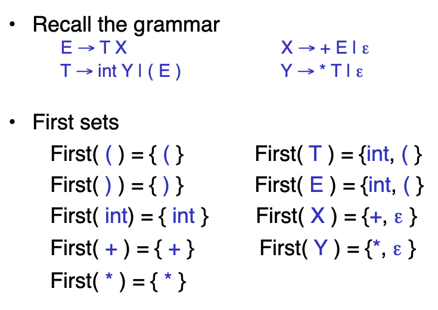
        </div>

    === "Follow"

        <div align=center markdown>

        {: style='width: 70%'}

        </div>

        仅考虑非终结符：

        <div style="text-align: center">
            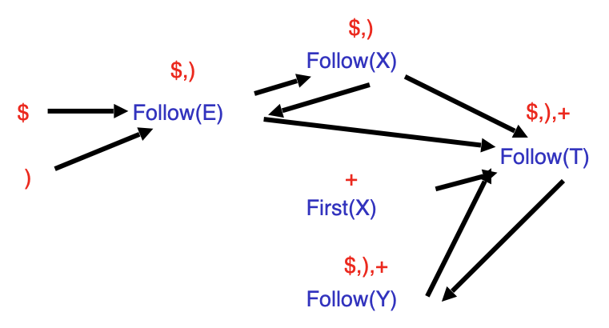
        </div>

        考虑所有符号：

        <div style="text-align: center">
            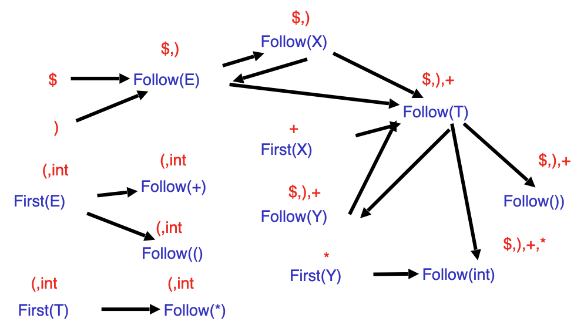
        </div>

        总结：

        <div style="text-align: center">
            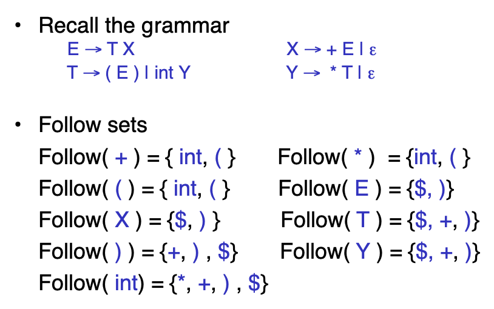
        </div>

完整的算法如下：

$$
\boxed{
\begin{aligned}
&\textbf{Initialize } \mathrm{FIRST} \text{ and } \mathrm{FOLLOW}
\text{ to all empty sets, and } \mathrm{nullable}
\text{ to all false.} \\[2mm]
&\textbf{for} \text{ each terminal symbol } Z \\
&\qquad \mathrm{FIRST}[Z] \leftarrow \{Z\} \\[2mm]
&\textbf{repeat} \\
&\qquad \textbf{for} \text{ each production } X \to Y_1Y_2 \cdots Y_k \\
&\qquad\qquad \textbf{for} \text{ each } i \text{ from } 1 \text{ to } k,
\text{ each } j \text{ from } i+1 \text{ to } k, \\
&\qquad\qquad\qquad \textbf{if} \text{ all the } Y_i \text{ are nullable} \\
&\qquad\qquad\qquad\qquad \textbf{then } \mathrm{nullable}[X] \leftarrow \mathrm{true} \\
&\qquad\qquad\qquad \textbf{if } Y_1 \cdots Y_{i-1} \text{ are all nullable} \color{cornflowerblue}{\qquad //\ \text{prefix}}\\
&\qquad\qquad\qquad\qquad \textbf{then } \mathrm{FIRST}[X]
\leftarrow \mathrm{FIRST}[X] \cup \mathrm{FIRST}[Y_i] \\
&\qquad\qquad\qquad \textbf{if } Y_{i+1} \cdots Y_k \text{ are all nullable} \color{cornflowerblue}{\qquad //\ \text{suffix}}\\
&\qquad\qquad\qquad\qquad \textbf{then } \mathrm{FOLLOW}[Y_i]
\leftarrow \mathrm{FOLLOW}[Y_i] \cup \mathrm{FOLLOW}[X] \\
&\qquad\qquad\qquad \textbf{if } Y_{i+1} \cdots Y_{j-1} \text{ are all nullable} \color{cornflowerblue}{\qquad //\ \text{substring}}\\
&\qquad\qquad\qquad\qquad \textbf{then } \mathrm{FOLLOW}[Y_i]
\leftarrow \mathrm{FOLLOW}[Y_i] \cup \mathrm{FIRST}[Y_j] \\
&\textbf{until } \mathrm{FIRST}, \mathrm{FOLLOW}, \text{ and } \mathrm{nullable}
\text{ did not change in this iteration.}
\end{aligned}
}
$$


### Predictive Parsing Tables

下一步就来**构建分析表**。考虑非终结符 $A$，产生式 $A \rightarrow \alpha$ 和词元 $t$

- 添加 $T[A, t] = \alpha$：若 $A \rightarrow \alpha \rightarrow^* t \beta$，$\alpha$ 能在第一个位置上推导出 $t$，即 $t \in \text{First}(\alpha)$
- 添加 $T[A, t] = \varepsilon$：若 $A \rightarrow \alpha \rightarrow^* \varepsilon$ 且 $S \rightarrow^* \gamma A t \delta$
    - 当栈顶为 $A$，输入为 $t$，且 $A$ 不能推导出 $t$ 时，此方法有用  
    - 在这种情况下，唯一的选择是消除 $A$（通过推导出 $\varepsilon$ 实现），但仅当 $t$ 能在至少一个推导中跟在 $A$ 之后时，此方法才有效  
    - 即 $t \in \text{Follow}(A)$


???+ example "例子"

    <div align=center markdown>

    {: style='width: 80%'}

    </div>

- 如果预测表中存在空的单元格，说明出现了语法错误
- 同一单元格不允许对应两个产生式

**LL(1) 文法**便是按上述方法得到的不包含重复条目的预测分析表。

- 第一个 L：**从左到右分析**(left-to-right parse)
- 第二个 L：**最左推导**(left-most derivation)
- 1：**向前查看一个符号**(1 symbol lookahead)

!!! note "LL(1) 文法的部分性质"

    - 无二义的
    - 无左递归的（具体见下面「[消除左递归](#eliminate-left-recursion)」一节）
    - 无左公因子的（具体见下面「[提取左因子](#left-factoring)」一节）

而在 LL(k) 分析表中，每列包括了长度为 k 的终结符序列。下面给出 LL(2) 的分析表：

|aa|ab|ba|bb|ac|ca|...|
|:-|:-|:-|:-|:-|:-|:-|
||||||||

>注：$\forall$ n >= 0，每个 LL(k) 文法都是 LL(k+n) 文法。


### Stack-Based Implementation

有了预测分析表后，我们用**栈**这一数据结构来存储正在生成的分析树。

- 栈内存储了尚未展开的非终结符以及尚未与输入匹配的终结符  
- **栈顶**：最左侧待处理的终结符或非终结符
- 到达错误状态时**拒绝**
- 输入结束且栈为空时**接受**

LL(1) 分析算法如下：

<div style="text-align: center">
    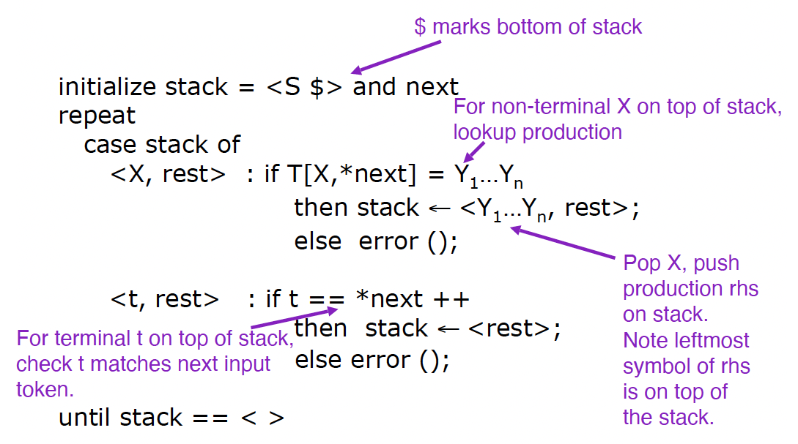
</div>

???+ example "例子"

    <div style="text-align: center">
        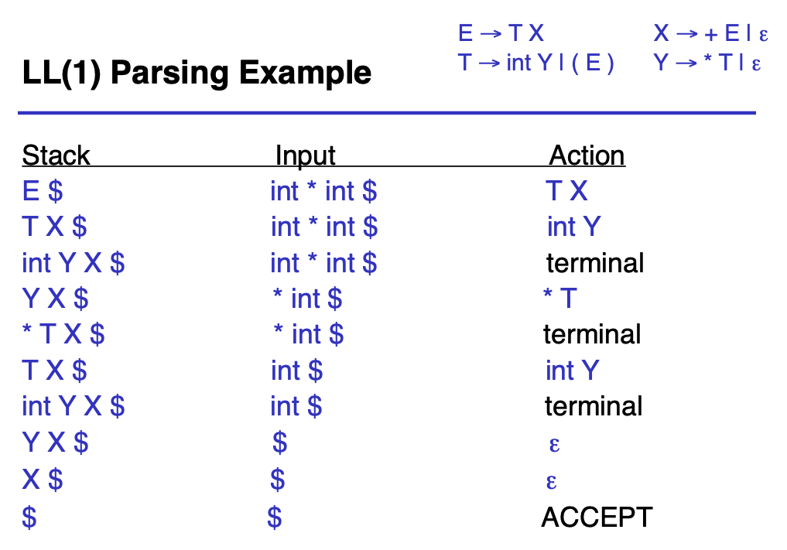
    </div>


### Eliminate Left-Recursion

假如同时存在形如这样的产生式 $E \rightarrow E + T, E \rightarrow T$，那么经过一个或多个产生式后，得到一个以 $E$ 开头的右端，即 $E \rightarrow^+ E \alpha$。这便是**左递归**(left recursion)现象，此时 LL(1) 分析表就会出现重复条目，因为：

- 若 $t \in \text{First}(T)$，那么 $t \in \text{First}(E + T)$
- 对于这样的 $t$，我们能选择任意两个产生式

消除左递归的方法是重写文法至**右递归**的形式，也就是将递归移到产生式的最右端，但依然和重写前的产生式等价。

???+ example "例子"

    <div style="text-align: center">
        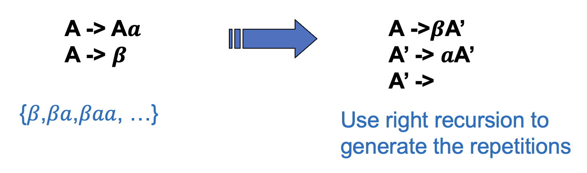
    </div>

更一般地，假如有产生式 $S \rightarrow S \alpha_1\ |\ \dots \|\ S \alpha_n\ |\ \beta_1\ |\ \dots \| \beta_m$，我们可以将其重写为：

$$
S \to \beta_1 S' \mid \cdots \mid \beta_m S' \\
S' \to \alpha_1 S' \mid \cdots \mid \alpha_n S' \mid \varepsilon
$$

另外，像

$$
\begin{aligned}
S & \rightarrow A \alpha\ |\ \delta \\
A & \rightarrow S \beta
\end{aligned}
$$

也是左递归的，因为 $S \rightarrow^+ S \beta \alpha$。更通用的消除左递归算法如下（来自龙书，不需要掌握）：

??? note "算法"

    $$
    \begin{aligned}
    &\text{arrange the nonterminals in some order } A_1, A_2, \cdots, A_n.\\
    &\mathbf{for}\ ( \text{each } i \text{ from } 1 \text{ to } n )\ \{\\
    &\qquad \mathbf{for}\ ( \text{each } j \text{ from } 1 \text{ to } i-1 )\ \{\\
    &\qquad\qquad \text{replace each production of the form }
    A_i \to A_j\gamma\\
    &\qquad\qquad \text{by the productions }
    A_i \to \delta_1\gamma
    \mid \delta_2\gamma
    \mid \cdots
    \mid \delta_k\gamma,\\
    &\qquad\qquad \text{where }
    A_j \to \delta_1
    \mid \delta_2
    \mid \cdots
    \mid \delta_k
    \text{ are all current } A_j\text{-productions}\\
    &\qquad \}\\
    &\qquad \text{eliminate the immediate left recursion among the } A_i\text{-productions}\\
    &\}
    \end{aligned}
    $$


### Left Factoring

如果同一非终结符的两个产生式的右端以相同符号开头，LL(1) 分析表也会包含重复条目。解决方法是**提取左因子**(left factoring)，即提取相同的开始符号，并将剩下的部分用一个新的非终结符来代替。

???+ example "例子"

    <div style="text-align: center">
        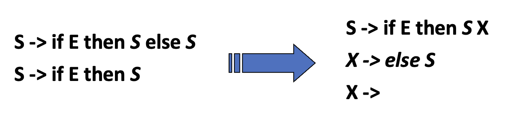
    </div>


### Error Recovery

遇到语法错误时的应对方法有：

- 抛出异常并停止分析

    ```c
    void T() { 
        switch (tok) { 
            case ID: 
            case NUM: 
            case LPAREN: F(); Tprime(); break; 
            default: error! 
        }
    } 
    ```

- 打印错误信息并从错误中恢复（删除、替换或插入词元）
    - 插入：
        - 假设拥有该词元并正常返回
        - 问题：可能无法终止

        ```c
        void T() {
            switch (tok) { 
                case ID: 
                case NUM: 
                case LPAREN: F(); Tprime(); break; 
                default: 
                    print("expected id, num, or left-paren"); 
            }
        }
        ```

    - 删除：
        - 更安全，因为当到达文件末尾时循环最终必须终止
        - 跳过一些词元，直到遇到 FOLLOW 集合中的某个词元

        ```c
        int Tprime_follow[] = { PLUS, RPAREN, EOF }; 
        void Tprime() { 
            switch (tok) { 
                case PLUS: break; 
                case TIMES: eat(TIMES); F(); Tprime(); break; 
                case RPAREN: break; 
                case EOF: break; 
                default: 
                    print("expected +, *, right-paren, or end-of-file"); 
                skipto(Tprime_follow); 
            }
        } 
        ```


## Bottom-Up Parsing

虽然 LL(k) 分析计算高效，且容易编写，但它的问题是：仅在能看到右侧的**前 k 个词元**的时候就必须**预测**使用哪个产生式。

<div style="text-align: center">
    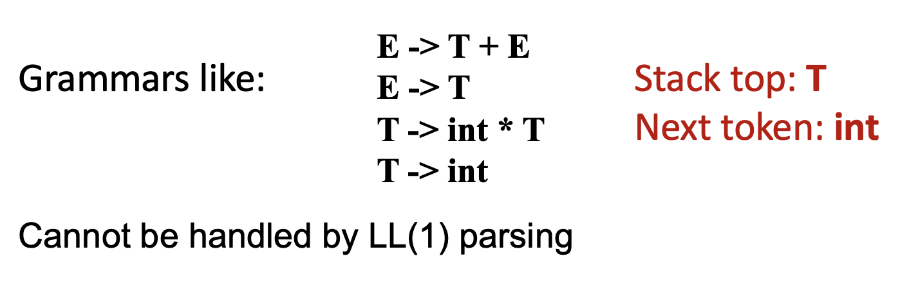
</div>

因此我们采用**自底向上的分析**(bottom-up parsing)。
>注：若没有特别说明，一般认为起始符号是第一条产生式左侧的符号。

- 自底向上：从语法分析树的底部向根部进行
- **从左到右**读取输入
- 可看作是**最右推导的逆过程**，将字符串归约为起始符号，若成功归约则表明分析成功
- **归约**(reduce)：用产生式的左边替换右边

具体有以下几类：

- **LR(k) 分析**（最主流的类型）
    - 又称**移进-归约分析**(shift-reduce parsing)
    - 比 LL(k) 分析更强大，能够将决策推迟到看到与所讨论的产生式整个右侧对应的输入词元之后
    - LR(k) 分别对应：从左到右的分析、最右推导、向前看 k 个词元

- **LALR**（向前(look-ahead) LR）**分析**：大多数现代编程语言编译器的基础工具，通过 Yacc 等工具实现

???+ example "例子"

    <div style="text-align: center">
        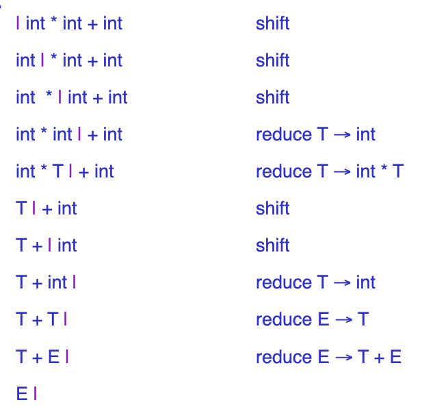
    </div>

    <div align=center markdown>

    {: style='width: 80%'}

    </div>


令 $\alpha \beta \omega$ 为分析中的字符串，假设下一个产生式为 $X \rightarrow \beta$，那么 $\omega$ 代表的字符串完全由终结符构成，因为 $\alpha X \omega \rightarrow \alpha \beta \omega$ 是最右推导的一个步骤。由此而生的思路是：将整个字符串划成两半，右子字符串是尚未分析过，而左子字符串包含终结符和非终结符，用 | 来区分两者（| 本身不是字符串的一部分）。

自底向上的分析主要采取两类行动：

- **移进**(shift)：将 | 向右移动一个位置，也就是说将一个终结符移到左串
    - 示例：ABC|<u>x</u>yz => ABC<u>x</u>|yz
- **归约**(reduce)：在左字符串的右端应用一个逆向的产生式
    - 示例：若有产生式 A -> xy，那么 Cb<u>xy</u>|ijk => Cb<u>A</u>|ijk

???+ example "例子"

<div style="text-align: center">
    
</div>

不难想到，左串部分可以通过**栈**(stack)来实现

- 栈顶为 |
- **移进**操作：将一个终结符压入栈  
- **归约**操作：从栈中弹出 0 个或多个符号（产生式右部），并将一个非终结符压入栈（产生式左部）

考虑归约的时机：仅当归约后的结果能归约成起始符号时才进行归约操作。为了形式化这一直觉，我们引入「**句柄**」(handle)的概念。句柄是可归约的字符串，同时还能进一步归约回起始符号（通过在特定位置使用特定的产生式）。所以我们只希望对句柄归约。有一个很重要的结论：**句柄只会出现在栈顶，不会出现在内部**。原因：

- 一开始栈为空，显然成立
- 在归约了一个句柄后
    - 最右侧的非终结符在栈顶
    - 下一个句柄必须在最右侧非终结符的右侧，因为这是最右推导
    - 通过一系列移进动作到达下一个句柄

所以句柄永远不会出现在最右非终结符的左侧。之后的语法分析算法就建立在识别句柄的基础之上。很遗憾的是，没有一种算法能够高效识别句柄，因此一般采用启发式算法来猜测哪些栈的内容是句柄。

检测句柄并不明显，因为在每一步中解析器只能看栈的内容，看不到完整输出从那里开始。先引入**可行前缀**(viable prefix)的概念：如果存在某个 $\omega$，使得 $\alpha|\omega$ 是移进-归约解析器的一个状态，则 $\alpha$ 是一个可行前缀。可行前缀不会超出句柄的右端，因此句柄的前缀就是可行前缀。只要解析器的栈上有可行前缀，就不会检测到解析错误。

???+ example "例子"

    <div style="text-align: center">
        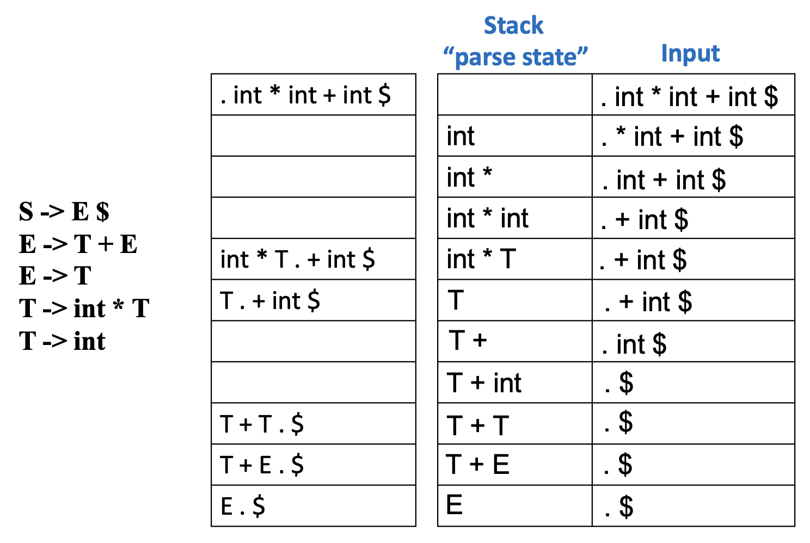
    </div>


### LR(0) Parsing

先从最简单的 LR 分析，即 **LR(0) 分析**开始讲解。

- **LR(0) 文法**是指仅通过查看栈就能进行分析的文法，无需任何向前查看即可做出移进/归约的决策
- 使用 **DFA** 做决策：总结分析状态，并根据文法枚举所有有效的分析状态及其之间的转换

回到刚才提到的可行前缀识别，目前的问题在于栈中只有产生式右部的片段。如果栈中有完整的右部，我们就可以归约。而这些片段始终是产生式右部的前缀。因此假设栈内有很多前缀：prefix~1~ prefix~2~ ... prefix~n-1~ prefix~n~，并令 prefix~i~ 为 X~i~ -> α~i~ 右部的前缀。

- prefix~i~ 最终会归约到 X~i~  
- α~i-1~ 的 prefix~i-1~ 缺失部分以 X~i~ 开头  
- 即存在某个 β 使得 X~i-1~ -> prefix~i-1~ X~i~ β

??? example "例子"

    已知文法：E -> T + E | T，T -> int * T | int | (E)。考虑字符串 (int * int)。假设来到移进-归约解析的一个状态 (int * | int)

    - 从栈顶开始：
        - "ε" 是 E -> T 的右部的一个前缀
        - "(" 是 T -> (E) 的右部的一个前缀
        - "ε" 是 E -> T 的右部的一个前缀
        - "int *" 是 T -> int * T 的右部的一个前缀

    - 栈内的项
        - T -> int * .T
        - E -> .T
        - T -> (.E)

综上，为了识别可行前缀，我们必须识别产生式的部分右部，它们最终可以归约为其前驱缺失后缀的一部分。

具体过程如下：

- 构建 NFA 来识别可行前缀：
    - 向文法 $G$ 添加起始产生式 $S' \rightarrow S \$$（对应起始状态）
    - NFA 的状态为 $G$ 的项
    - 起始状态为 $S' \rightarrow . S \$$，最终状态为 $S' \rightarrow S .\$$
    - 对于项 $E \rightarrow \alpha.X\beta$，添加转换 $E \rightarrow \alpha.X\beta \Rightarrow^X E \rightarrow \alpha X.\beta$
    - 对于项 $E \rightarrow \alpha.X\beta$ 和产生式 $X \rightarrow \gamma$，添加转换 $E \rightarrow \alpha.X\beta \Rightarrow^\varepsilon X \rightarrow .\gamma$

- NFA -> DFA
    - DFA 的状态是项的闭包
    - 可基于下面给出的 $\mathbf{Closure}$ 过程来构造

??? example "例子"

    先构建 NFA：

    <div align=center markdown>

    {: style='width: 80%'}

    </div>

    对应的 DFA：

    <div style="text-align: center">
        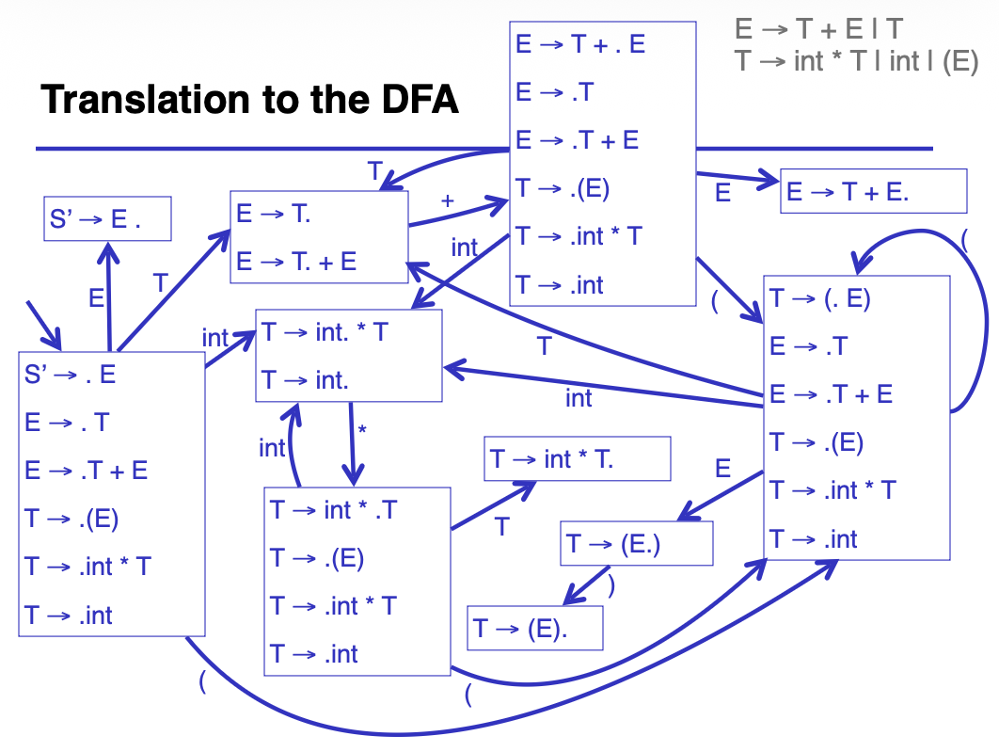
    </div>

- 利用到的算法如下：

    <div class="grid">

    $$
    \begin{aligned}
    &\mathbf{Closure}(I) ={} \\
    &\quad\textbf{repeat} \\
    &\quad\quad \textbf{for any item } A \to \alpha . X \beta \textbf{ in } I \\
    &\quad\quad\quad \textbf{for any production } X \to \gamma \\
    &\quad\quad\quad\quad I \leftarrow I \cup \{X \to .\gamma\} \\
    &\quad\textbf{until } I \text{ does not change} \\
    &\quad\textbf{return } I
    \\
    \\
    &\mathbf{Goto}(I, X) ={} \\
    &\quad\text{set } J \text{ to the empty set} \\
    &\quad\quad \textbf{for any item } A \to \alpha . X \beta \textbf{ in } I \\
    &\quad\quad\quad \text{add } A \to \alpha X . \beta \text{ to } J \\
    &\quad\quad \textbf{return } \mathrm{Closure}(J)
    \end{aligned}
    $$

    $$
    \begin{aligned}
    &\text{Initialize } T \text{ to } \{\mathbf{Closure}(\{S' \to .S\$\})\} \\
    &\text{Initialize } E \text{ to empty.} \\
    &\textbf{repeat} \\
    &\quad \textbf{for each state } I \textbf{ in } T \\
    &\quad\quad \textbf{for each item } A \to \alpha . X \beta \textbf{ in } I \\
    &\quad\quad\quad \text{let } J \text{ be } \mathbf{Goto}(I, X) \qquad //\ \text{new state} \\
    &\quad\quad\quad T \leftarrow T \cup \{J\} \qquad\qquad\ \ //\ \text{store state} \\
    &\quad\quad\quad E \leftarrow E \cup \{I \to J\} \qquad\  //\ \text{store edge} \\
    &\textbf{until } E \text{ and } T \text{ do not change}
    \end{aligned}
    $$

    </div>

    - $I$：项的集合
    - $T$：状态的集合
    - $X$：符号（终结符/非终结符）
    - $E$：边的集合

- 项 $X \rightarrow \beta . \gamma$ 对于可行前缀 $\alpha \beta$ 是有效的，若存在一个最右推导：$S' \rightarrow^* \alpha X \gamma \rightarrow \alpha \beta \gamma \omega$。在分析了 $\alpha \beta$ 之后，有效项是栈的可能栈顶。换句话说，DFA 在读取输入 $\alpha$ 时识别到可行前缀，并终止于包含项 $I$ 的状态 $s$，那么项 $I$ 对可行前缀 $\alpha$ 而言是有效的。
- 现在每扫描一个词元就得重新运行自动机，很浪费时间，而且大部分工作被重复执行，因此将栈的元素改为〈符号，DFA 状态〉的形式
    - 对于栈〈symbol~1~, state~1~〉...〈symbol~n~, state~n~〉，state~n~ 是在 symbol~1~...symbol~n~ 上的 DFA 的最终状态
    - 栈底为〈dummy, start〉，其中 dummy 为 dummy 符号，start 为 DFA 起始状态

- 构建分析表
    - 每行表示 DFA 的一个状态（通常用状态序号表示），每列表示一个终结符/非终结符（两者一般会分开来，不会混杂在一起）
    - 每个单元格表示可能采取的行动，包括：
        - **移进**(shift)：对于带有终结符 t 且从状态 i 到状态 n 的边：T[i, t] = sn（移进 n）
        - **跳转**(goto)：对于带有非终结符 X 且从状态 i 到状态 n 的边：T[i, X] = gn（跳转 n）
        - **归约**(reduce)：对于状态 i 中圆点位于末尾的产生式（例如 X → β.）：T[i, 每个终结符] = rk（归约 k），其中 k 是该产生式的索引
        - **接受**(accept)：对于每个包含 $S' → S . $ 的状态 i：T[i, $] = 接受

???+ example "例子"

    <div align=center markdown>

    {: style='width: 80%'}

    </div>
    
    <div align=center markdown>

    {: style='width: 80%'}

    </div>

    <div style="text-align: center">
        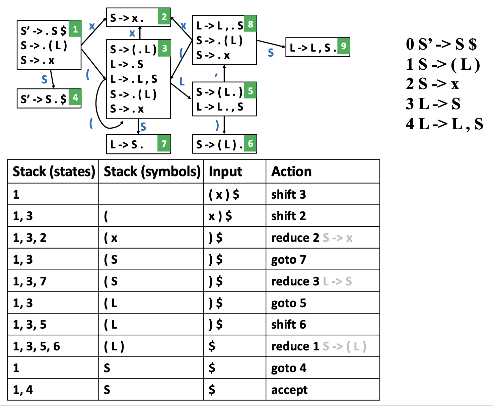
    </div>

    <div style="text-align: center">
        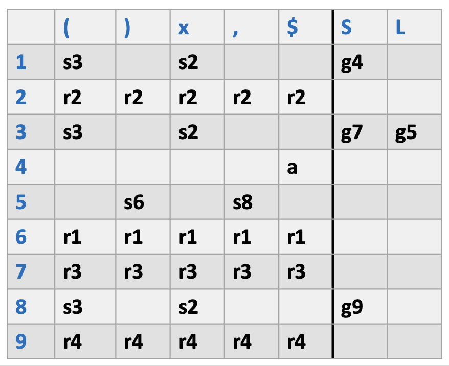
    </div>


### SLR Parsing

???+ bug "问题"

    <div style="text-align: center">
        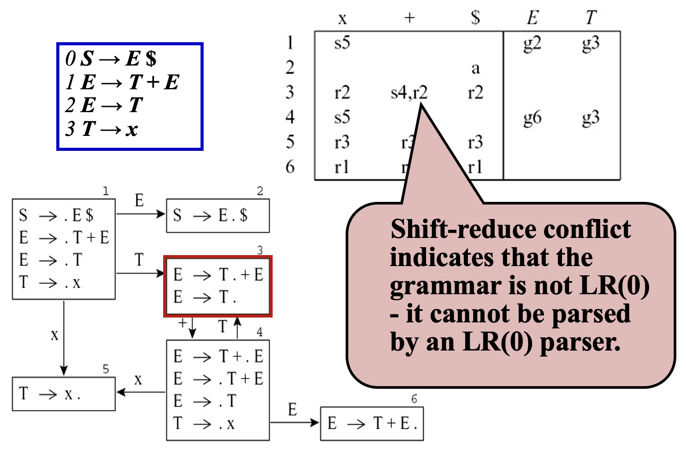
    </div>

    如图所示出现了移进和归约的冲突（分析表单元格内同时包含移进和归约两种行动），这表明该文法不属于 LR(0)，因而无法被 LR(0) 分析器分析。

解决方法是采用**简单 LR 分析**（**SLR 分析**）：仅当终结符 t 属于状态 i 中某一项的左侧（一个非终结符）的 **FOLLOW** 集合时，才将**归约**行动放入分析表 T[i, t] 中。

$$
\begin{aligned}
&R \leftarrow \{\} \\
&\textbf{for} \text{ each state } I \textbf{ in } T \\
&\qquad \textbf{for} \text{ each item } A \to \alpha . \textbf{ in } I \\
&\qquad\qquad \textbf{for} \text{ each token } X \textbf{ in } \mathrm{FOLLOW}(A) \\
&\qquad\qquad\qquad R \leftarrow R \cup \{(I, X, A \to \alpha)\}
\end{aligned}
$$

- $I$：行
- $X$：列
- $A \rightarrow \alpha$：产生式

???+ note "SLR 分析算法"

    ```c
    Let input = w$ be initial input
    Let j = 0
    Let DFA state 1 be the one with item S` → .S
    Let stack =〈dummy, 1〉  //〈symbol, state〉
    repeat
        case action[top_state(stack), input[j]] of
            shift k: push〈input[j++], k〉
            reduce X → α:
                pop |α| pairs,
                push〈X, goto[top_state(stack), X]〉
            accept: halt normally
            error: halt and report error
    ```

??? example "例子"

    >注：这里没有用到跳转行动，因此每扫过一个词元，就要重新从 DFA 起始状态开始。

    <div align=center markdown>

    {: style='width: 90%'}

    </div>

---
改良 SLR（不作要求）：可通过**优先级声明**(precedence declaration)进一步消除一些冲突。假如现在有文法 E → E + E | E * E | (E) | int。该文法的 DFA 包含有以下项的一个状态：E → E * E . 和 E → E . + E。这会带来移进-归约冲突。此时可通过声明 * 的优先级高于 + 来解决这个冲突，有利于归约。需要注意的是这样的声明并非真的规定优先级，而是提供一种处理冲突的规则。


### LR(1) Parsing

???+ bug "问题"

    显然 SLR 分析无法消除所有可能的冲突，比如发生冲突的终结符就在 Follow 集里。

    <div style="text-align: center">
        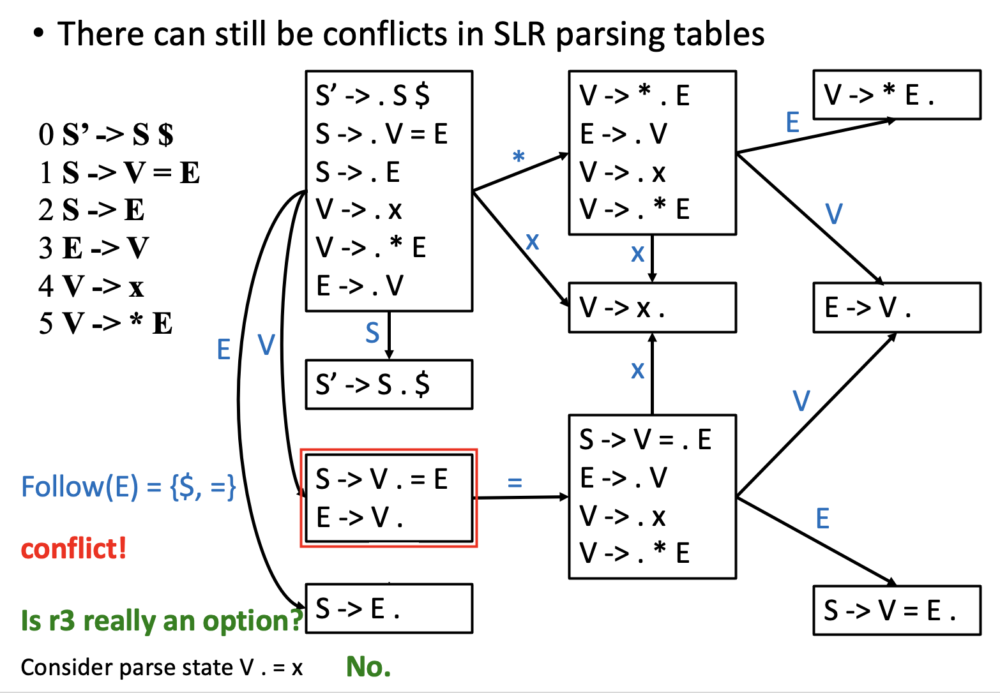
    </div>

于是我们采用更强大的 **LR(1) 分析**

- 核心思想：在 DFA 的状态中增加更多信息，从而解决冲突
- 一个 LR(1) 项由一条产生式、一个**右侧位置**（用点表示）和一个**向前看符号**(lookahead symbol)组成
    - $(A \rightarrow \alpha.\beta, x)$ 表示序列 $\alpha$ 位于（符号）栈顶，且输入头部是一个可从 $\beta x$ 推导出的字符串
    - 记录在**当前上下文**中该产生式**整个右侧**之后的词元
    - 下一个输入词元应属于 $\text{First}(\beta x)$（$\beta$ 可以为空）

算法如下：

- $\mathbf{Closure}$：

    $$
    \begin{aligned}
    &\mathbf{Closure}(I)=\\
    &\quad \mathbf{repeat}\\
    &\qquad \mathbf{for} \text{ any item}\ (A\to\alpha.X\beta,z)\ \mathbf{in}\ I\\
    &\qquad\qquad \mathbf{for} \text{ any production}\ X\to\gamma\\
    &\qquad\qquad\qquad \mathbf{for}\ \text{ any }w\in\mathbf{FIRST}(\beta z)\\
    &\qquad\qquad\qquad\qquad I\leftarrow I\cup\{(X\to.\gamma,w)\}\\
    &\quad \mathbf{until}\ I\ \text{does not change}\\
    &\mathbf{return}\ I
    \end{aligned}
    $$

    - 改变记号
    - 执行 $\varepsilon$-转换时，记录右侧的上下文（即 $w$）

- $\mathbf{Goto}$：

    $$
    \begin{aligned}
    &\mathbf{Goto}(I,X)=\\
    &\quad J\leftarrow\{\}\\
    &\quad \mathbf{for} \text{ any item}\ (A\to\alpha.X\beta,z)\ \mathbf{in}\ I\\
    &\qquad \text{add }(A\to\alpha X.\beta,z)\text{ to }J\\
    &\mathbf{return\ Closure}(J).
    \end{aligned}
    $$

    - 仅改变项的记号

- 归约行动：

    $$
    \begin{aligned}
    &R\leftarrow\{\}\\
    &\mathbf{for} \text{ each state}\ I\ \mathbf{in}\ T\\
    &\quad \mathbf{for} \text{ each item}\ (A\to\alpha.,z)\ \mathbf{in}\ I\\
    &\qquad R\leftarrow R\cup\{(I,z,A\to\alpha)\}
    \end{aligned}
    $$

    - 在项中添加 $z$ 并减少操作
    - 行动 $(I, z, A \rightarrow \alpha)$ 表示在状态 $I$ 下，当向前看符号为 $z$ 时，分析器将根据规则 $A \rightarrow \alpha$ 进行归约
    - $\text{Follow}(A)$ 中的某些词元在具有 $A \rightarrow \alpha$ 的状态中可能并不总是有效的
    - LR(1) 的向前看词元比 SLR 更为精确

???+ example "例子"

    <div style="text-align: center">
        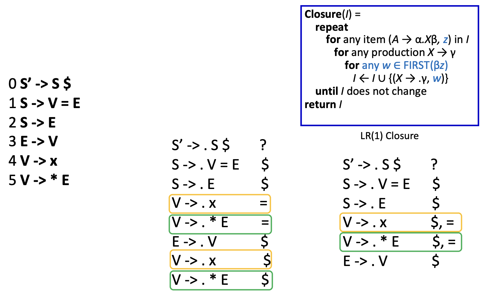
    </div>

    <div style="text-align: center">
        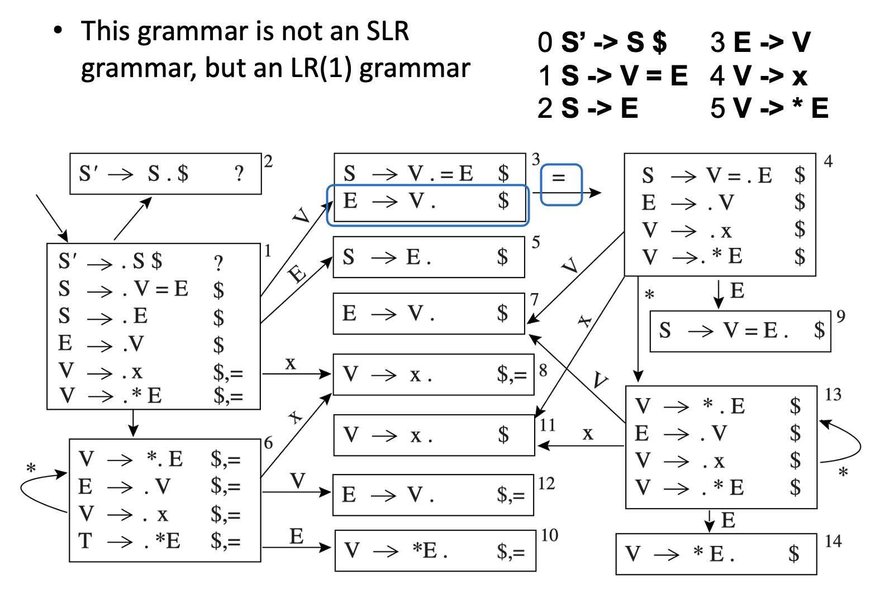
    </div>

    <div style="text-align: center">
        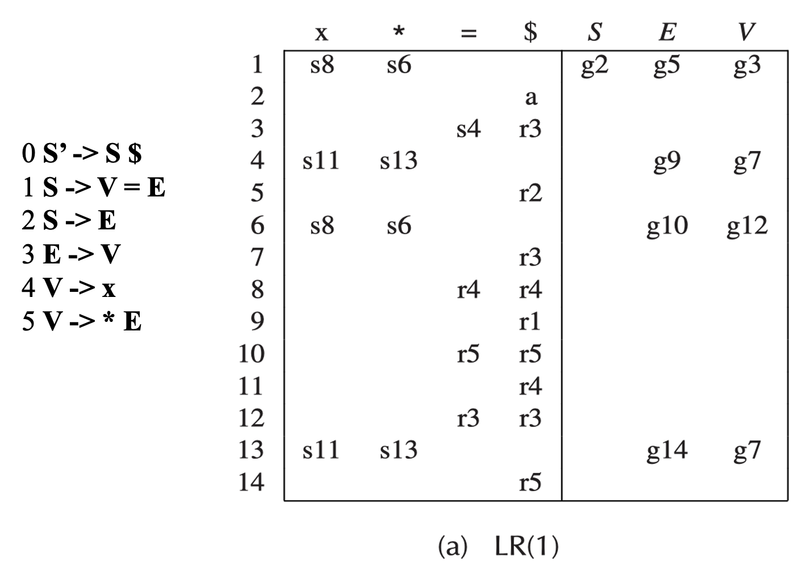
    </div>


### LALR(1) Parsing

LR(1) 分析的问题是表的大小可能会变得很大，状态数太多。改进方法是采用 **LALR(1) 分析**：通过合并 LR(1) DFA 中除向前看集合外，项相同的任意两个状态来构建分析表。因此相较于 LR(1) 分析表，LALR(1) 分析表占用更少的内存。

<div style="text-align: center">
    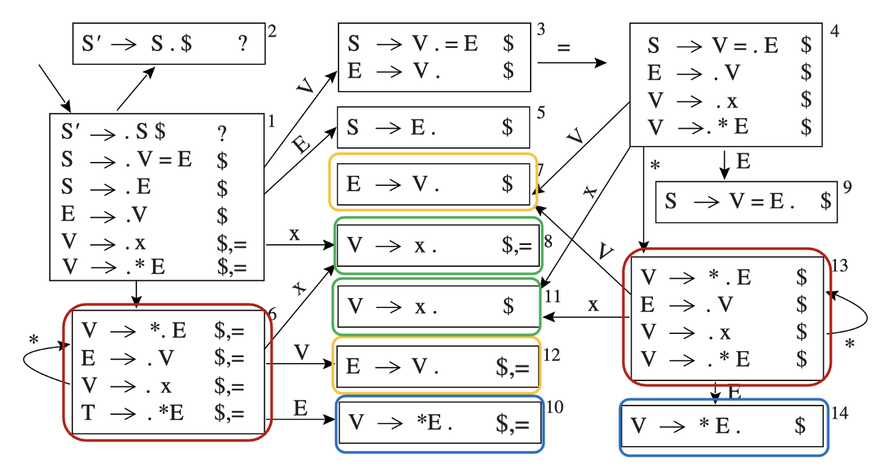
</div>

某些情况下，LALR(1) 分析表可能包含**归约-归约冲突**，而 LR(1) 表中则没有此类问题。

<div style="text-align: center">
    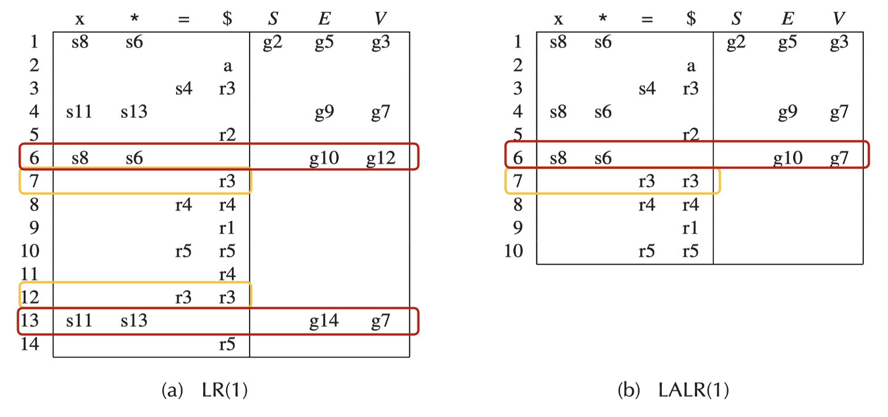
</div>


### LR Parsing of Ambiguous Grammars

???+ abstract "文法类层级"

    <div style="text-align: center">
        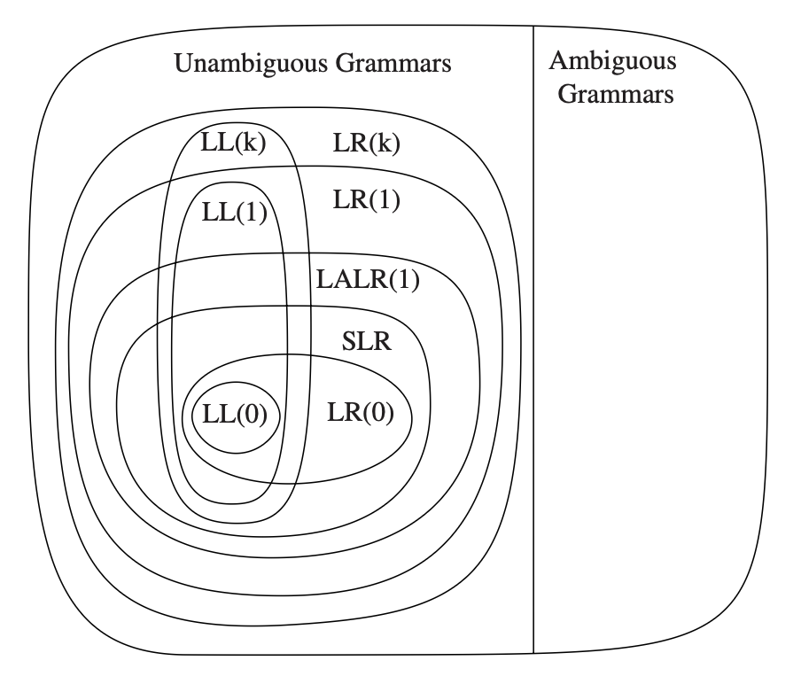
    </div>

大多数编程语言有以下语法：

$$
\begin{aligned}
S &\to \text{if } E \text{ then } S \text{ else } S \\
S &\to \text{if } E \text{ then } S \\
S &\to \text{other}
\end{aligned}
$$

对于 if a then if b then s1 else s2 可能有以下几种解释：

1. if a then { if b then s1 else s2 } 
2. if a then { if b then s1 } else s2 

在大多数编程语言中，else 必须与最近可能的 then 匹配，因此第一种解释是首选。但会遇到移进-归约冲突问题：

$$
\begin{aligned}
S &\to \text{if}\ E\ \text{then}\ S . && \text{else} \\
S &\to \text{if}\ E\ \text{then}\ S\ .\ \text{else}\ S && (\text{any})
\end{aligned}
$$

我们通过引入辅助非终结符 $M$（匹配）和 $U$（不匹配）来消除这种歧义。

$$
\begin{aligned}
S &\to M && M : \text{all then are matched} \\
S &\to U && U : \text{some then is unmatched} \\
M &\to \text{if } E \text{ then } M \text{ else } M \\
M &\to \text{other} \\
U &\to \text{if } E \text{ then } S && \text{This then is unmatched} \\
U &\to \text{if } E \text{ then } M \text{ else } U && \text{This then is matched}
\end{aligned}
$$

或者保持语法不变。在构建分析表时，应通过移进操作来解决此冲突（优先采用解释 1）。

!!! note "注意"

    大多数移进-归约冲突，以及可能所有的归约-归约冲突，都是语法定义不当的表现，应当通过消除歧义来解决。


## Using Parsing Generators

我们可以使用**分析器生成器**(parser generator)来自动生成分析器：

- 通用且稳健
- 但有时不如手写的分析器来的高效
- 尽管如此，对于懒惰的编译器编写者来说还是不错的选择hh

<div style="text-align: center">
    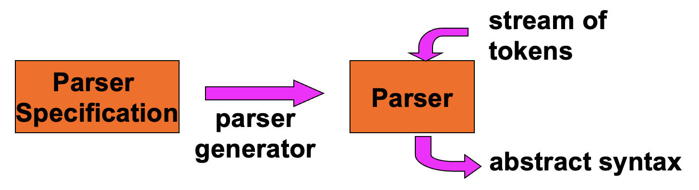
</div>

而 **Yacc**（yet another compiler-compiler，又一个编译器-编译器）是一个经典的 LALR 语法分析器生成器

- 输入：一个规范文件（通常带有后缀 `.y`），基本格式为：

    ```yacc
    {definitions}
    %%
    {rules}
    %%
    {auxiliary routines} 
    ```

- 输出：一个包含分析器 C 源代码的输出文件（通常带有后缀 `tab.c`（LALR 分析表））

???+ example "例子"

    假设提供以下 CFG：

    $$
    \begin{array}{l}
    \text{exp} \to \text{exp} \ \text{addop} \ \text{term} \mid \text{term} \\
    \text{addop} \to + \mid - \\
    \text{term} \to \text{term} \ \text{mulop} \ \text{factor} \mid \text{factor} \\
    \text{mulop} \to * \\
    \text{factor} \to ( \ \text{exp} \ ) \mid \text{number}
    \end{array}
    $$

    接下来使用 Yacc 实现这一分析器：

    ```c
    %{
    #include <stdio.h>
    #include <ctype.h>
    int yylex(void);
    int yyerror (char * s);
    %}
    
    %token NUMBER
    %%
    command: exp {printf("%d\n", $1);};
    exp: exp '+' term {$$ = $1 + $3;}
        | exp '-' term {$$ = $1 - $3;}
        | term {$$ = $1}
    ;
    term: term '*' factor {$$ = $1 * $3;}
        | factor {$$ = $1;}
    ;
    factor: NUMBER {$$ = $1;}
        | ‘(’ exp ‘)' {$$ = $2;}
    ;
    %%
    
    int main() {
        return yyparse();
    }

    int yylex(void) {
        int c;
        // eliminate blanks
        while ( (c=getchar()) == ' '); 
        if (isdigit(c)) {
            ungetc(c, stdin);
            scanf("%d", &yylval);
            return (NUMBER);
        }
        if (c == '\n')
            return 0; // stop the parse 
        return c;
    }

    int yyerror(char *s) { 
        fprintf (stderr, "%s\n",s ) ; 
        return 0;
    }
    ```

### Auxilary Routines

- `yyparse` 被声明为返回一个整数值，分析成功时返回 0，失败则返回 1
- `yyparse` 过程会调用词法分析器过程（`yylex`）
- Yacc 期望通过 `yylex` 返回空值 0 来标记输入结束
- `yylex` 返回一个词元类型或 0，而 `yylval` 存储语义值
- 当分析过程中遇到错误时，`yyerror` 会打印出错误信息


### Definition

识别词元的两种方式：

- 在语法规则中，单引号内的任何字符将被识别为自身，比如 `'+'`
- 符号标记可以在 Yacc 的 `%token` 声明中声明
    - `%token NUMBER`
    - `%start symbol`（定义起始符号）


### Rules

- 语法：`Rule { Action Code }`
- 在分析器使用该规则执行归约操作后，将执行行动代码
- 尽管行动代码通常位于每个语法规则选项的末尾，但也可以在选项内部编写**嵌入式的行动**
- 伪变量(pseudo variables)：`$$`、`$1`、`$3`
    - `yylex` 可以将词元的语义值存储在 `yylval`（全局变量）中；默认情况下，`yylval = 0`
    - 当识别出一个语法规则时，该规则中的每个符号都拥有一个语义值：
        - `$$`：表示规则左侧的值
        - `$i`：表示规则右侧的第 i 个符号的值
    
    - 这些值由 Yacc 保存在**值栈**的顶部

- `YYSTYPE`
    - 数据类型始终由 C 预处理器符号 `YYSTYPE` 在 Yacc 中定义，默认为：`#!c #define YYSTYPE int`
    - 不同语法规则/符号对应不同的值，处理方法为：
        - 直接在 Yacc 规范中使用 `%union` 声明联合体

            ```yacc
            %union { double val;
                      char op;} 
            ```

        - 在定义中或单独的包含文件中定义一个新的数据类型，并将 `YYSTYPE` 定义为该类型；必须在相关的操作代码中手动构建适当的值

            ```c
            #define YYSTYPE ASTNode
            ```

### `%union` & `%type`

- 所有**非终结符**通过用户提供的此类操作获取其值
- **词元**也可以被赋值，这是在词法分析器中使用 `yylval` 完成的
- 使用 `%union` 定义值类型
- 使用 `%type` 指定每个符号的值类型

???+ example "例子"

    ```yacc
    %token NUMBER
    %union { double val;
             char op;}
    %type <val> exp term NUMBER 
    %type <op> op
    %%
    command : exp { printf("%f\n",$1);}
    ;
    exp : exp op term { 
          switch ($2){
              case '+' : $$=$1+$3; break;
              case '-' : $$=$1-$3; break; 
          }
        }
        | term {$$ = $1;}
    ;
    op : '+' {$$ = $1;}
       | '-' {$$ = $1;}
    ;
    ```


### Embedded Actions

在分析过程中，有必要在完全识别语法规则选择之前执行一些代码，比如：

$$
\begin{aligned}
\text{decl} & \to \text{type} \ \text{var-list} \\
\text{type} & \to \text{int} \mid \text{float} \\
\text{var-list} & \to \text{var-list}, \ \text{id} \mid \text{id}
\end{aligned}
$$

所以需要记录每个 id 的“类型”，解决方法如下：

```yacc
decl: type {current_type=$1} var-list
    ;
type: INT {$$=INT_TYPE;}
    | FLOAT {$$=FLOAT_TYPE;}
    ;
var_list: var_list ',' ID {setType(tokenString, current_type);}
        | ID {setType(tokenString, current_type);}
        ;
```

语法：`list: item1 { do_item1($1); } item2 { do_item2($3); } item3`（注意是 `$3`）


### Conflicts

Yacc通过以下方式解决两类冲突：

- 移进-归约冲突：采用移进操作
- 归约-归约冲突：采用语法中较早出现的规则

<div style="text-align: center">
    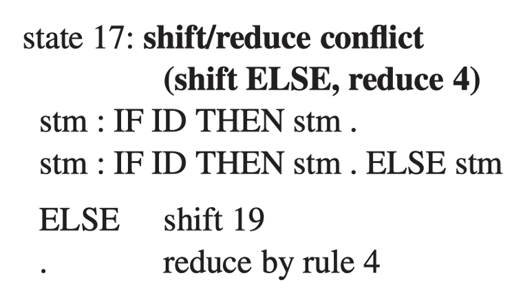
</div>

大多数移进-归约冲突以及所有归约-归约冲突都是严重问题，应通过**重写语法**来消除。


### Precedence Directives

<div style="text-align: center">
    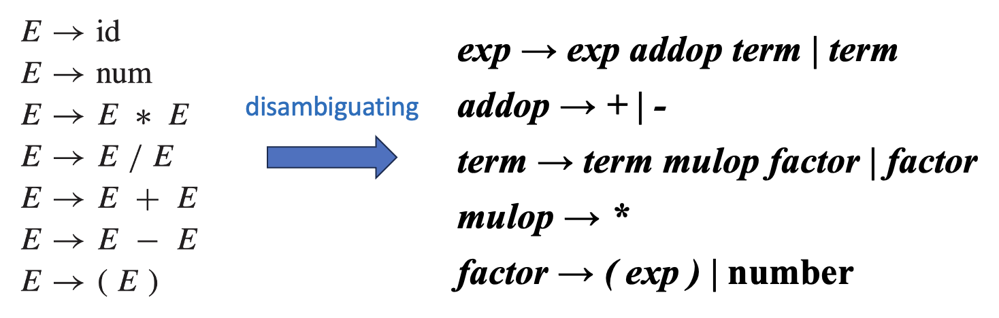
</div>

如上所示：左侧的语法自然但存在歧义（未定义优先级或左结合性），而右侧的语法无歧义却难以理解。那么是否存在既能保持**语法的自然性**，又能强制规定**运算符优先级与结合性**的方法呢？

对此，Yacc 提供了内置的**优先级指令**(precedence directives)（消歧规则）。

先来看左侧的语法：虽然自然但高度歧义，其 LR(1) 分析表中存在大量移进-归约冲突。我们根据运算符优先级和结合性来解决歧义：

- 选择移进（运算符优先级）

    $$
    \begin{aligned}
    \text{E} & \to \text{E} + \text{E} . & * \\
    \text{E} & \to \text{E} . * \text{E} & (\text{any})
    \end{aligned}
    $$

- 选择归约（左结合性）

    $$
    \begin{aligned}
    \text{E} & \to \text{E} + \text{E} . & * \\
    \text{E} & \to \text{E} . + \text{E} & (\text{any})
    \end{aligned}
    $$

>若不允许 `a != b != c`，则 `!=` 是**非结合的**(non-associative)。

在 Yacc 中是这样指定此类消歧规则的：

- 运算符 `PLUS` 和 `MINUS` 具有相同的优先级且为左结合
- 运算符 `TIMES` 和 `DIV` 的优先级高于 `PLUS` 和 `MINUS`，同样为左结合
- 运算符 `EXP` 为右结合
- 运算符 `EQ` 和 `NEQ` 的优先级最低，且无结合性

```yacc
%nonassoc EQ NEQ 
%left PLUS MINUS 
%left TIMES DIV 
%right EXP
```

- 优先级声明（`%left` 等）为词元赋予优先级
- 移位词元的优先级由该词元给出
- **规则的优先级**由该规则右侧出现的**最后一个词元（终结符）**给出
    1. 如果规则具有更高的优先级，则选择归约
    2. 如果标记和规则具有相同的优先级，则：
        - `%left` 优先归约
        - `%right` 优先移位
        - `%nonassoc` 产生错误行动

???+ example "例子"

    <div style="text-align: center">
        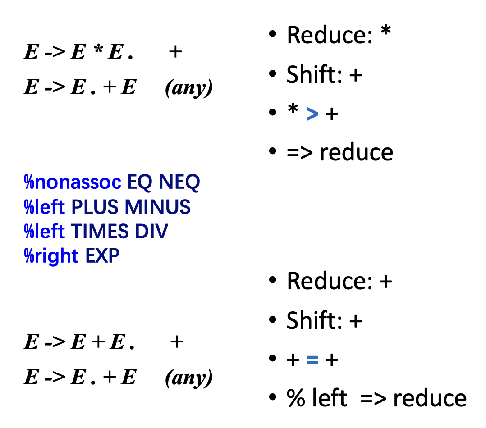
    </div>

对于算术表达式 -6 * 8，我们希望被分析为 (-6) \* 8。为此，需使用 `%prec` 指令为规则分配特定的优先级：

```yacc hl_lines="7"
%{ // declarations of yylex and yyerror 
%} 
%token INT PLUS MINUS TIMES UMINUS 
%start exp 
%left PLUS MINUS 
%left TIMES 
%left UMINUS 
%% 
exp : INT
| exp PLUS exp 
| exp MINUS exp
| exp TIMES exp
| MINUS exp %prec UMINUS 
```

- 标记 `UMINUS` 不会由词法分析器返回，它仅作为一个占位符存在
- 指令 `%prec UMINUS` 赋予规则 `exp : MINUS exp` 最高的优先级


### Syntax v.s. Semantics

考虑一种编程语言，其包含算术表达式如 `x + y`，以及布尔表达式如 `a&(b = c)`：

```yacc
%{ //declarations of yylex and yyerror 
%} 
%token ID ASSIGN PLUS MINUS AND EQUAL 
%start stm 
%left OR 
%left AND 
%left PLUS 
%%
stm : ID ASSIGN ae
| ID ASSIGN be
be : be OR be
| be AND be
| ae EQUAL ae
| ID 
ae : ae PLUS ae
| ID 
```

- 算术运算符的优先级高于布尔运算符
- 布尔表达式不能与算术表达式相加
- 存在算术变量和布尔变量

其中 `be : ID.` 和 `ae : ID.` 之间存在归约-归约冲突。解决方案是将此分析推迟到编译器的“语义阶段”，比如 `a + 5&b` => 语法正确


## Error Recovery

??? note "精简版介绍（来自 CS143）"

    编译器的一大目的是检测非法程序，并翻译合法的程序，因此错误处理至关重要。有以下几类不同的程序错误：

    | 错误类型 | 示例（C 语言）| 检测者 |
    |----------|---------------|---------|
    | 词法错误 | `... $ ...` | 词法分析器(lexer) |
    | 语法错误 | `... x *% ...` | 语法分析器(parser) |
    | 语义错误 | `... int x; y = x(3); ...` | 类型检查器(type checker) |
    | 正确性错误 | 通过编译的 C 程序 | 测试人员(tester) / 用户 |

    错误处理器应该：

    – 准确且清晰地报告错误  
    – 快速从错误中恢复  
    – 不减慢有效代码的编译

    但好的错误处理实现起来并不容易。由于本章介绍的是语法分析，所以下面就语法错误问题提供一些解决方案（需要注意的是这些方法并不为所有分析器生成器支持）：

    - **紧急模式**(panic mode)
        - 最简单、最常用的方法  
        - 当检测到错误时：  
            - 丢弃词元，直到找到具有明确作用的词元
            - 从该词元继续解析  
        
        - 这类词元称为**同步词元**(synchronizing tokens)，通常是语句或表达式终止符

        ??? example "例子"

            考虑以下错误的表达式：`(1 + + 2) + 3`。通过紧急模式恢复的具体做法是：向前跳至下一个整数，然后继续。在 Bison 中会使用特殊终结符 `error` 来描述要跳过的输入串。

            ```
            E -> int | E + E | ( E ) | error int | ( error )
            ```

    - **错误产生式**(error production)
        - 思路：在语法中指定已知的常见错误
        - 本质上将常见错误提升为替代语法
        - 示例：  
            - 通过写入 5 x 代替 5 * x  
            - 添加产生式 E -> ... | E E  
        
        - 缺点：使语法复杂化

    - **自动局部或全局纠正**(automatic local or global correction)
        - 思路：寻找一个正确的“附近”程序
            - 尝试插入和删除词元
            - 穷举搜索
        
        - 缺点：
            - 难以实现
            - 减慢了对正确程序的解析速度
            - “附近”并不一定是“预期的”程序
            - 大多数工具不支持

    ??? abstract "语法错误恢复的进步"

        - 过去
            - 缓慢的重编译周期（甚至一天一次）
            - 所以需尽量在一个周期内发现更多错误
            - 研究人员无法放下该课题

        - 现在
            - 快速的重编译周期
            - 用户倾向于在每个周期内纠正一个错误
            - 复杂的错误恢复机制不再那么必要
            - 紧急模式似乎够用了

开发者希望程序能报告所有错误，而非仅首个错误。于是下面介绍一些错误恢复相关的技术：

- **局部错误恢复**(local error recovery)
- **全局错误修复**(global error repair)


### Local Error Recovery

**局部错误恢复**机制通过**在被检测到错误的点**调整分析栈和输入，使得分析能够**继续**进行。其中 Yacc 使用的一种局部恢复机制是利用特殊词元 `error` 来控制恢复过程。

<div style="text-align: center">
    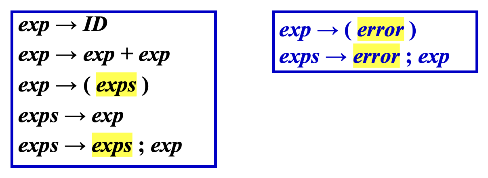
</div>

如果在表达式中间遇到语法错误，分析器应跳至**下一个分号或右括号**（同步词元(synchronizing tokens)）并继续分析。

???+ example "例子"

    <div style="text-align: center">
        
    </div>

分析器生成器对错误符号的处理：

- 错误被视为终结符，分析表中会为其录入移进行动，就像处理普通词元一样
- 当 LR 分析器遇到错误状态时，会采取以下行动：
    1. 弹出栈（如有必要），直到达到一个可以对错误词元执行**移进**行动的状态
    2. 移进该**错误**词元
    3. 丢弃输入符号（如有必要），直到当前向前看标记在某个状态下能触发**非错误的行动**
    4. 恢复正常分析流程

!!! warning "注意"

    在局部错误恢复过程中，从栈中弹出状态可能导致看似“不可能”的语义行动，特别是当这些行动包含副作用时。比如：

    ```yacc
    statements: statements exp SEMICOLON
            | statements error SEMICOLON
            | /* empty */
    exp : increment exp decrement
        | ID
    increment: LPAREN {nest=nest+1;}
    decrement: RPAREN {nest=nest-1;}
    ```

    1. 弹出栈直到遇到最后一个分号或输入开始
    2. 移位错误
    3. 丢弃输入标记直到看到分号

    nest - 1 从未执行。

    如果在分析了一些左括号后发现语法错误，那么错误回复后 nest > 0。解决方案是采用无副作用的语义行动（见下一章）。


### Global Error Repair

<div style="text-align: center">
    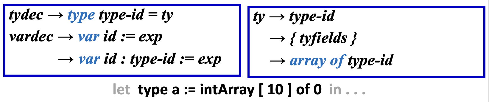
</div>

若采用局部错误恢复技术来修复上述错误，一种可能是会发现一个语法错误，其向前看符号为 `:=`

- 删除从类型到 0 的短语（允许其中包含错误）
- 或者将 `:=` 替换为 `=`，但会在 `'['` 标记处遇到另一个语法错误

**全局错误修复**则会寻找最小的插入和删除集合，即使这些操作不在 LL 或 LR 分析器首次报告错误的点上，也能将源字符串转变为语法正确的字符串。

其中一种经典技术是 **Burke-Fisher 错误修复**：在分析器报告错误的点之前不少于 K 个词元的每个位置，尝试所有可能的单词元插入、删除或替换。虽然有限，但较实用。

如何选择最佳的错误修复：

- 允许分析器在原报告错误点之后继续分析最远的修正
- 通常，如果某个修复能让分析器比最初卡住的位置多前进 R=4 个词元，就认为是足够好的

因此分析引擎必须能够回退 K 个标记并重新分析。

具体实现如下：

<div style="text-align: center">
    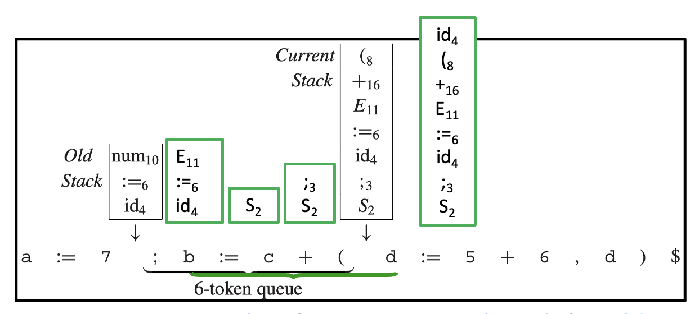
</div>

- 维护两个分析栈：当前栈与旧栈
- 保留一个包含 K 个词元的队列
- 每当移入新词元时：
    - 将其推入当前栈，并置于队列尾部
    - 移除队列头部元素，并将其移入旧栈

- 每次向旧栈或当前栈执行移入操作时，同时执行相应的归约行动
- 假设在当前词元处检测到语法错误：
    - 对于队列中任意位置可能进行的每个词元插入、删除或替换操作，Burke-Fisher 错误修复器会在（队列副本的）相应位置实施修改，随后尝试**从原有栈状态重新分析**
    - 通常而言，若能成功分析当前词元之后**三至四个词元**的内容，即可视为完全成功的修复

???+ recommend "优点"

    语法本身完全未作修改（无错误产生式），仅对负责解释分析表的分析引擎进行了调整。

- 语义行动
    - 移进和归约操作会反复尝试并被丢弃
    - 若程序员指定的与归约操作相关的语义行动具有**副作用**时的解决方案：在当前栈上执行归约时，**不执行**任何语义行动，而是等到相同的归约在**旧栈**上（永久性地）被执行时才执行

- 插入行动的语义值
    - 当需要插入诸如数字或标识符等标记时，它们的语义值从何而来
    - ML-Yacc 分析器生成器提供了一个 `%value` 指令

        ```yacc
        %value ID ("bogus") 
        %value INT (1) 
        %value STRING ("")
        ```

- 程序员指定的替换
    - 有时，特定的单词元插入或替换非常常用，应首先尝试（为分析器提供提示）
    - ML-Yacc 分析器生成器具有 `%change` 指令
    
        ```yacc
        %change EQ -> ASSIGN 
            | ASSIGN -> EQ 
            | SEMICOLON ELSE -> ELSE 
            | -> IN INT END
        ```
    
    - `IN INT END` -> 作用域结束符：自动关闭 `let` 的作用域

???+ example "例子"

    <div style="text-align: center">
        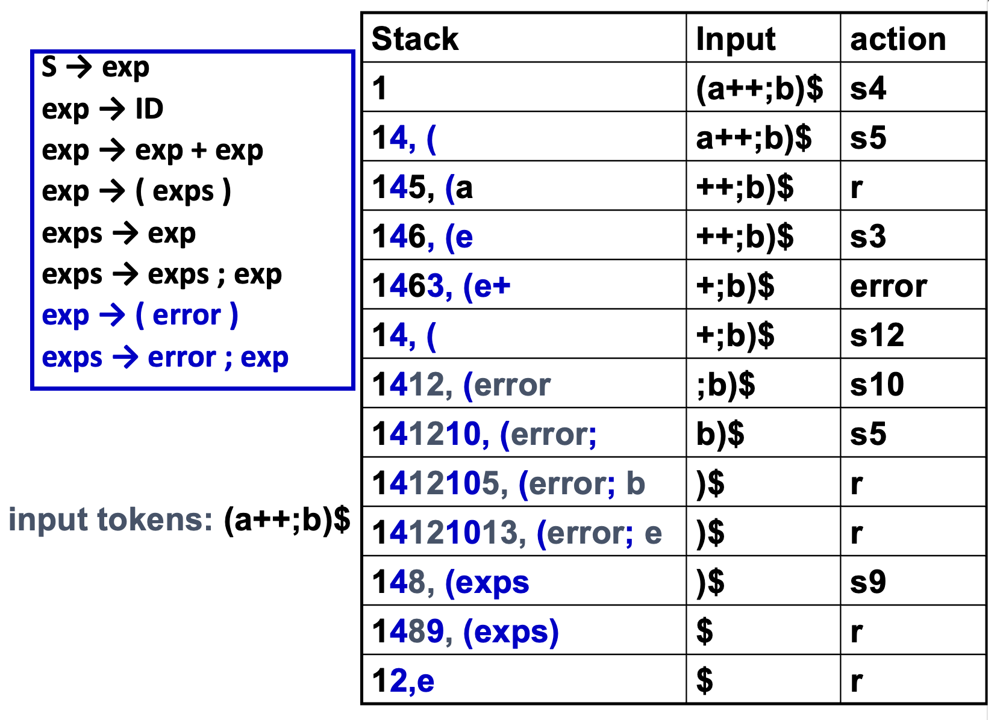
    </div>

    <div style="text-align: center">
        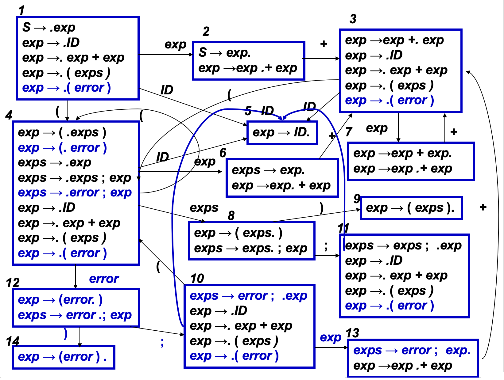
    </div>