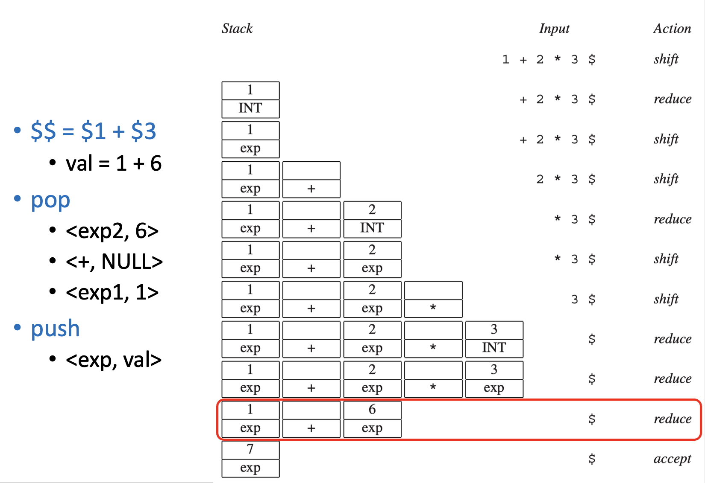
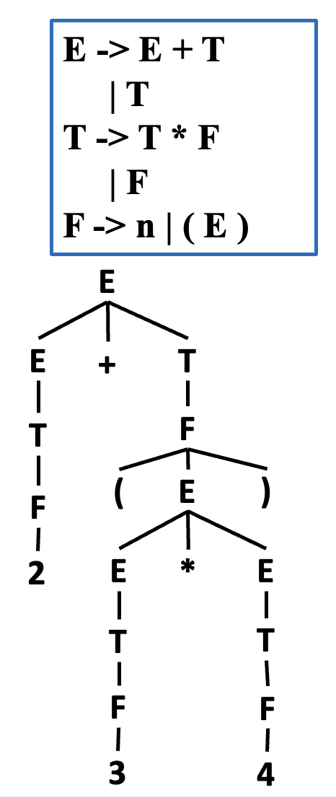
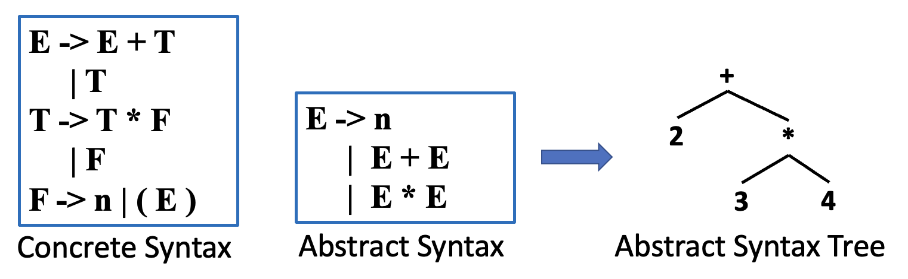
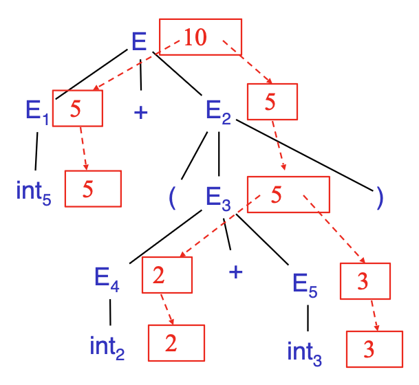
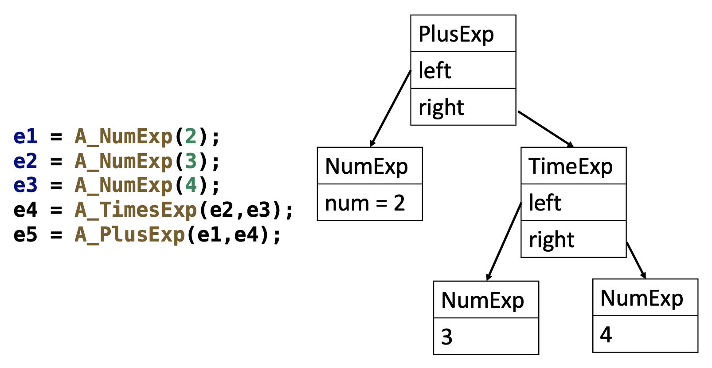
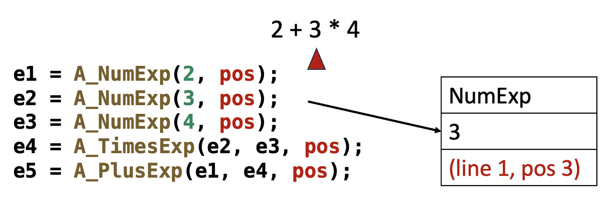
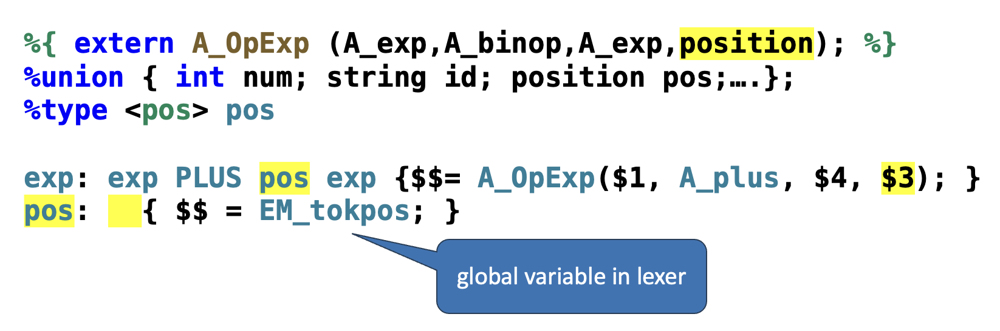

# Abstract Syntax

??? abstract "核心知识"

    - 语义行动
        - 递归下降
        - Yacc 生成的分析器
    
    - 具体分析树
    - 抽象语法树（AST）
    - 位置：lexer、parser

## Semantic Actions

编译器接下来要对由分析器认为合法的句子做以下事情：

- 构建抽象语法树
- 执行语义分析
- 生成中间表示（IR）

**语义行动**(semantic action)是在语法分析过程中，附加在产生式上的一段语义层面上的操作。相关实现有：

- **递归下降**(recursive descent)
- **Yacc 生成的分析器**


### Recursive Descent

假如有以下 CFG：

$$
\begin{aligned}
S &\rightarrow E\,\$ \\
E &\rightarrow T\,E' \\
E' &\rightarrow +\,T\,E' \\
E' &\rightarrow -\,T\,E' \\
E' &\rightarrow \varepsilon \\
T &\rightarrow F\,T' \\
T' &\rightarrow *\,F\,T' \\
T' &\rightarrow /\,F\,T' \\
T' &\rightarrow \varepsilon \\
F &\rightarrow \text{id} \\
F &\rightarrow \text{num} \\
F &\rightarrow (E)
\end{aligned}
$$

若想通过分析对输入字符串求值，代码实现如下：

```c hl_lines="8 11 13 16 18 22 24 30"
enum token {EOF, ID, NUM, PLUS, MINUS, ...};
union tokenval {string id; int num; ...};
enum token tok; 
union tokenval tokval;
// assume a lookup table mapping identifiers to integers
int lookup(string id) { ... } 
int F_follow[] = { PLUS, TIMES, RPAREN, EOF, -1 };
int F(void) {
    switch (tok) { 
        case ID: { 
            int i = lookup(tokval.id); 
            advance();
            return i;
        }
        case NUM: {
            int i = tokval.num;
            advance();
            return i;
        }
        case LPAREN: {
            eat(LPAREN);
            int i = E();
            eatOrSkipTo(RPAREN, F_follow);
            return i;
        }
        case EOF: 
        default: 
            printf("expected ID, NUM, or left-paren");
            skipto(F_follow); 
            return 0;
    }
}
```

在递归下降分析器中，语义行动是分析函数的**返回值**和/或**副作用**。

???+ example "副作用的例子"

    - `S -> id := num`：在查找表中记录 $\text{id} \mapsto \text{num}$
    - `S -> print(id)`：打印 $\text{id}$ 值

对于每个终结符和非终结符，为其关联一种**语义值类型**，这些值代表由该符号推导出的短语，而这种类型来源于编译器的实现语言。

??? example "例子"

    比如 $T \rightarrow T * F$ 对应的语义行动为：

    ```c
    int a = T();
    eat(TIMES);
    int b = F();
    return a * b;
    ```

    对应的代码实现：

    ```c
    int T(void) {
        switch (tok) { 
            case ID: 
            case NUM: 
            case LPAREN: 
                return Tprime(F()); 
            default: 
                print("expected ID, NUM, or left-paren"); 
                skipto(T_follow); 
                return 0; 
        }
    } 

    int Tprime(int a) {
        switch (tok) { 
            case TIMES: 
                eat(TIMES); 
                return Tprime(a * F()); 
            case PLUS: 
            case RPAREN: 
            case EOF: 
                return a; 
            default: ... 
        }
    } 
    ```


### Yacc-Generated Parsers

语法规则：

- `{ ... }`：语义行动
- `$i`：第 i 个右侧符号的语义值
- `$$`：左侧非终结符的语义值
- `%union`：语义值可能携带的不同类型声明
- `<variant>`：声明每个终结符或非终结符的类型

语义值的实现：

- Yacc 生成的分析器维护一个与状态栈并行的**语义值栈**
- 当分析器执行归约时，必须执行相应的 C 语言语义行动
- 从栈顶的前 k 个元素中获取获取规则 A -> Y1 ... Yk 中的 `$i`
- 当解析器从符号栈弹出 Yk ... Y1 并压入 A 时，它同时会从语义值栈中弹出 k 个值，并将通过执行 C 语言语义行动的代码获得的值压入栈中

???+ example "例子"

    <div style="text-align: center">
        
    </div>

---
每个终结符和非终结符都可以关联其自身的语义值类型。以 A -> B C D 为例：

- 语义行动必须返回一个值，该值的类型应与非终结符 A 所关联的类型一致
- 它可以从匹配的终结符 B、C、D 以及非终结符所关联的值中构建这个值

LR 分析器能以**确定且可预测**的顺序执行归约及相关的语义行动：即对分析树进行自底向上、从左到右的遍历。而（虚拟）分析树的遍历采用**后序**(postorder)遍历方式。


## Concrete Parse Tree

虽然可以在 Yacc 分析器的语义行动短语内编写一个完整的编译器，但这不仅难以阅读和维护，且必须得严格按照程序被分析的顺序进行分析。所以我们将语法（分析）问题与语义（类型检查和机器代码翻译）问题分离。一种解决方案是由分析器生成可供后续阶段遍历的分析树。

{ align=right width=20% }

**具体分析树**(concrete parse tree)：分析树为输入中的每个词元精确对应一个**叶节点**，并为分析过程中归约的每条语法规则对应一个**内部节点**。

- 它代表了源语言的具体语法
- 使用起来不太方便：
    - 对于后续阶段来说，存在冗余且无用的标记，比如 `.`, `(`, `)`
    - 内存占用过于依赖语法规则，语法规则改变 -> 解析树随之变化


## Abstract Syntax Trees

<div style="text-align: center">
    
</div>


而**抽象语法**为分析器与编译器的后续阶段之间提供了一个清晰的接口，但并非用于分析过程。分析器利用具体语法来构建抽象语法的分析树就叫做**抽象语法树**(abstract syntax tree)，它传达了源程序的**短语结构**，所有分析问题均已解决，但未进行任何语义解释。

- 每个文法符号都有一个**属性**(attribute)  
    - 对于终结符（词法词元），属性可由词法分析器计算  
    - 属性必须在依赖图中所有后继属性被计算之后才能计算
    - 当没有循环时，这样的顺序是存在的；显然循环定义的属性是不合法的
    - **合成属性**(synthesized attribute)
        - 由语法树中后代节点的属性计算得出  
        - E.val 是一个合成属性
        - 总是可以按自底向上的顺序计算
        - 仅包含合成属性的文法称为 **S-属性文法**，这也是最常见的情况

    - **继承属性**(inherited attribute)：从语法分析树中父节点和/或兄弟节点的属性计算得出
        - 示例：行计算器

- 每条产生式都可以有一个**语义行动**(semantic action)
    - 写作 $X \rightarrow Y_1 \dots Y_n\ \{\text{action}\}$
    - 该行动可以引用或计算符号的属性
    - 语义行动规定一组方程组
        - **声明式**(declarative)风格
            - 解析顺序未指定  
            - 由解析器自行确定  
        - **命令式**(imperative)风格  
            - 求值顺序固定  
            - 若行动操纵全局状态则至关重要

    - 语义行动除了用于构建 AST，也可用于许多其他方面，包括类型检查、代码生成、计算等
    - 该过程称为**语法制导翻译**(syntax-directed translation)，是对 CFG 的重要推广

    ??? example "例子"

        考虑文法：E -> int | E + E | ( E )

        - 对于每个符号 X，定义一个属性 X.val
            - 对于终结符，val 是关联的词法单元
            - 对于非终结符，val 是表达式的值（并根据子表达式的值计算得出）

        - 我们用行动来注释语法：

            ```
            E -> int      { E.val = int.val }
               | E1 + E2  { E.val = E1.val + E2.val }
               | ( E1 )   { E.val = E1.val }
            ```

        现在有字符串：5 + (2 + 3)，对应的 token 串为：int5 '+' '(' int2 '+' int3 ')'

        | 产生式 | 语义方程 |
        |----------------------|----------------------|
        | $E \rightarrow E_1 + E_2$ | $E.\mathrm{val}=E_1.\mathrm{val}+E_2.\mathrm{val}$ |
        | $E_1 \rightarrow \mathrm{int}_5$ | $E_1.\mathrm{val}=\mathrm{int}_5.\mathrm{val}=5$ |
        | $E_2 \rightarrow (E_3)$ | $E_2.\mathrm{val}=E_3.\mathrm{val}$ |
        | $E_3 \rightarrow E_4 + E_5$ | $E_3.\mathrm{val}=E_4.\mathrm{val}+E_5.\mathrm{val}$ |
        | $E_4 \rightarrow \mathrm{int}_2$ | $E_4.\mathrm{val}=\mathrm{int}_2.\mathrm{val}=2$ |
        | $E_5 \rightarrow \mathrm{int}_3$ | $E_5.\mathrm{val}=\mathrm{int}_3.\mathrm{val}=3$ |

        对应的依赖图：

        <div style="text-align: center">
            
        </div>

要在后续阶段使用 AST，编译器需要将 AST 表示为数据结构并进行操作。具体来说，需要为每个非终结符定义类型别名，为每个产生式设计联合（`#!c union`）变体。

```c
typedef struct A_exp_ *A_exp;
struct A_exp_ {
  enum {A_numExp, A_plusExp, A_timesExp} kind; 
  union {
    int num; 
    struct {A_exp left; A_exp right;} plus;
    struct {A_exp left; A_exp right;} times; 
  } u; 
};
A_exp A_NumExp(int num);
A_exp A_PlusExp(A_exp left, A_exp right);
A_exp A_TimesExp(A_exp left, A_exp right);

A_exp A_PlusExp(A_exp left, A_exp right) {
  A_exp e = checked_malloc(sizeof(*e));
  e->kind = A_plusExp;
  e->u.plus.left = left;
  e->u.plus.right = right;
  return e;
}
```

???+ example "例子"

    使用以下数据结构和具体语法构建 2 + 3 * 4 的 AST：

    <div style="text-align: center">
        
    </div>

Yacc 或递归下降分析器通过分析具体语法来构建 AST。

```c
%left PLUS
%left TIMES

%%
exp : NUM       		{$$=A_NumExp($1);}
    | exp PLUS exp  	{$$=A_PlusExp($1,$3);}
    | exp TIMES exp 	{$$=A_TimesExp($1,$3);}
```


## Positions

- 在单遍编译器(one-pass compiler)中，词法分析、语法分析和语义分析是同时进行的
- 如果存在必须向用户报告的**类型错误**，词法分析器的**当前位置**可以作为错误源位置的合理近似值
- 在单遍编译器中，词法分析器维护一个“当前位置”全局变量
- 对于使用 AST 数据结构的编译器：
    - 它不需要在一次遍历中完成所有解析和语义分析
    - 甚至在语义分析开始之前，词法器就已经到达文件末尾

- AST 的每个节点都必须记录其在源文件中的位置，具体来说，必须在抽象语法的数据结构中嵌入 `pos` 字段，这些字段用于指示生成这些抽象语法结构的字符在原始源文件中的具体位置

    ???+ example "例子"

        <div style="text-align: center">
            
        </div>

    - 词法分析器：必须将每个标记的**起始**和**结束位置**传递给语法分析器
    - 语法分析器：理想情况下，应维护一个与语义值栈并行的**位置栈**，使得每个符号的位置可供语义行动使用
        - Bison 可以实现这一点
        - 而 Yacc 则不能，不过有一种解决方案是定义一个非终结符 `pos`，其语义值为源位置（行号，或行号及行内位置），例如访问 `PLUS` 的位置：

            <div style="text-align: center">
                
            </div>
