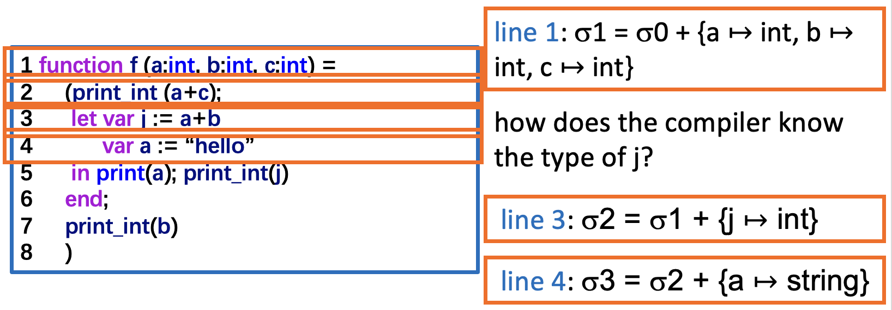
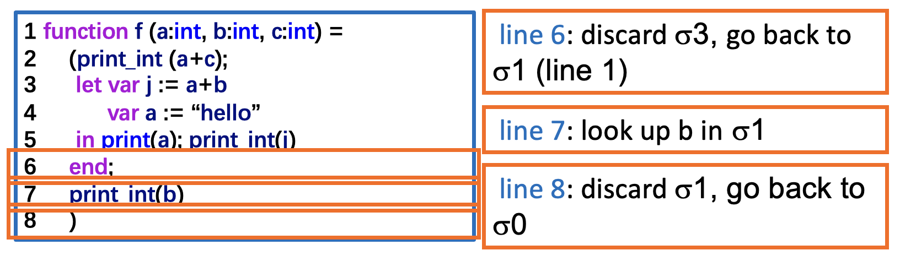
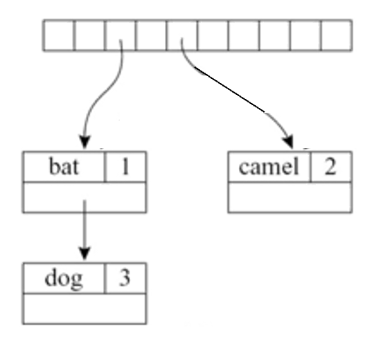
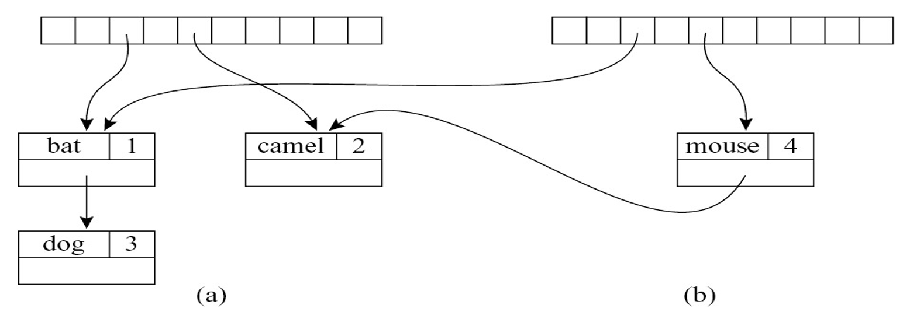
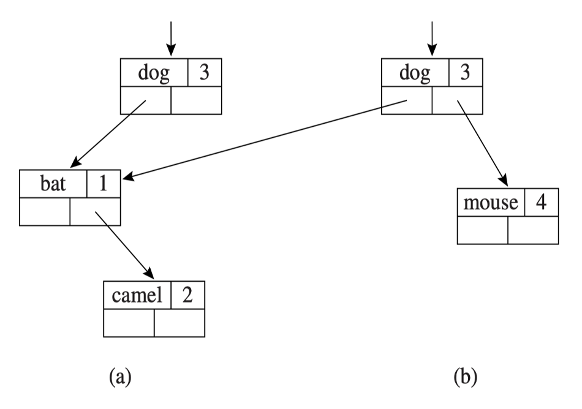
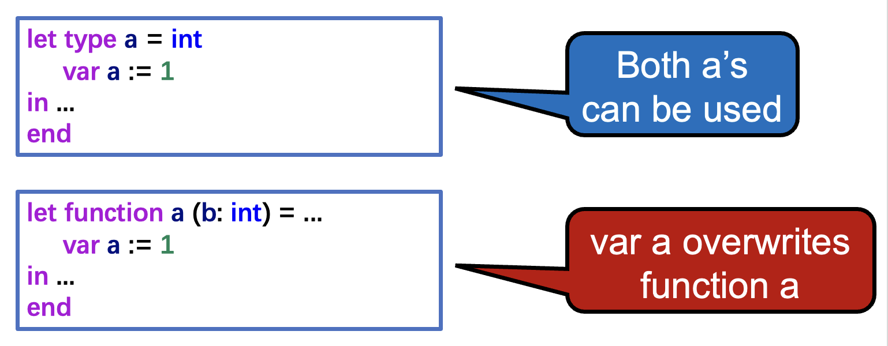
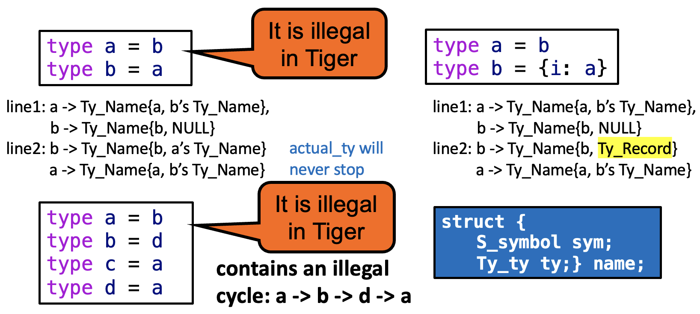

# Semantic Analysis

编译器的**语义分析**(semantic analysis)阶段包括：

- 将变量定义与其使用关联起来
- 检查每个表达式是否具有正确的类型
- 将抽象语法转换为适合生成机器代码的更简单表示形式


## Symbol Tables

语义分析阶段中的一个重要步骤是维护**符号表**(symbol tables)（也称为**环境**(environments)）。它将标识符映射到其**类型**(types)和**位置**(locations)上。

具体来说，环境是指一组由 $\mapsto$ 表示的**绑定**(bindings)，例如 $\sigma_0 = \{ g \mapsto \text{string}, a \mapsto \text{int} \}$。

- 右表中的绑定覆盖左表中的绑定，因此 X + Y != Y + X
- 程序中的每个局部变量都有一个**作用域**(scope)，在该作用域内它是可见的，即它是在该作用域中定义的；当语义分析到达每个作用域的末尾时，该作用域内的标识符绑定将被丢弃

???+ example "例子"

    <div style="text-align: center">
        
    </div>

    <div style="text-align: center">
        
    </div>

符号表的实现方式有（可任选其一）：

- **函数式风格**(functional style)
    - 保持 $\sigma_1$ 不变，同时创建 $\sigma_2$ 和 $\sigma_3$
    - 易于恢复 $\sigma_1$

- **命令式风格**(imperative style)
    - 修改 $\sigma_1$ 直到它变成 $\sigma_2$
    - 当 $\sigma_2$ 存在时，我们无法在 $\sigma_1$ 中查找内容
    - 当我们完成对 $\sigma_2$ 的操作后，可以撤销修改以恢复回 $\sigma_1$
        - 实现：一个全局环境 $\sigma$ + 一个撤销栈(undo stack)


### Multiple Symbol Tables

在某些语言中，可以同时存在多个活跃环境：程序中的每个模块、类或记录都有其自身的符号表 $\sigma$。

???+ example "例子"

    === "Java"

        <div class="grid" markdown>

        ```java
        package M;   
        class E {   
            static int a = 5;   
        }
        class N {   
            static int b = 10;   
            static int a = E.a + b;  
        }
        class D {   
            static int d = E.a + N.a;  
        }
        ```

        $$
        \begin{aligned}
        \sigma_1 &= \{\, a \mapsto \text{int} \,\} \\
        \sigma_2 &= \{\, E \mapsto \sigma_1 \,\} \\
        \sigma_3 &= \{\, b \mapsto \text{int},\ a \mapsto \text{int} \,\} \\
        \sigma_4 &= \{\, N \mapsto \sigma_3 \,\} \\
        \sigma_5 &= \{\, d \mapsto \text{int} \,\} \\
        \sigma_6 &= \{\, D \mapsto \sigma_5 \,\} \\
        \sigma_7 &= \sigma_2 + \sigma_4 + \sigma_6
        \end{aligned}
        $$

        </div>

        在 Java 中允许前向引用。因此，$E$、$N$ 和 $D$ 都在环境 $\sigma_7$ 中被编译。分析的结果是 $\{ M \mapsto \sigma_7 \}$。

    === "ML"

        <div class="grid" markdown>

        ```sml
        structure M = struct 
            structure E = struct 
                val a = 5; 
            end 
            structure N = struct 
                val b = 10 
                val a = E.a + b 
            end 
            structure D = struct 
                val d = E.a + N.a 
            end 
        end 
        ```

        $$
        \begin{aligned}
        \sigma_1 &= \{\, a \mapsto \text{int} \,\} \\
        \sigma_2 &= \{\, E \mapsto \sigma_1 \,\} \\
        \sigma_3 &= \{\, b \mapsto \text{int},\ a \mapsto \text{int} \,\} \\
        \sigma_4 &= \{\, N \mapsto \sigma_3 \,\} \\
        \sigma_5 &= \{\, d \mapsto \text{int} \,\} \\
        \sigma_6 &= \{\, D \mapsto \sigma_5 \,\} \\
        \sigma_7 &= \sigma_2 + \sigma_4 + \sigma_6
        \end{aligned}
        $$

        </div>

        $N$ 使用环境 $\sigma_0 + \sigma_2$ 编译。$D$ 使用环境 $\sigma_0 + \sigma_2 + \sigma_4$ 编译，因此分析结果也为 $\{M \mapsto \sigma_7\}$。


### Efficient Imperative Symbol Tables

由于大型程序可能包含成千上万个不同的标识符，符号表必须支持**高效查找**。很容易想到用**哈希表**来达到这一目的。

{ align=right width=30% }

- $\sigma' = \sigma + \{ a \mapsto \text{int} \}$
- 插入 `<a, int>` 到哈希表中

另外符号表还需要支持便捷的**删除**操作，因此哈希表采用**外链**(extenal chaining)形式，比如 `hash(a) -> <a, int> -> <a, string>`。

???+ code "代码实现"

    哈希函数为：

    $$
    h = \alpha^{n-1} c_1 + \alpha^{n-2} c_2 + \dots + \alpha c_{n-1} + c_n
    $$

    ```c
    struct bucket { string key; void *binding; struct bucket *next; };

    #define SIZE 109

    struct bucket *table[SIZE];

    unsigned int hash(char *s0) {
        unsigned int h = 0; char *s;
        for(s = s0; *s; s++)
            h = h * 65599 + *s; 
        return h; 
    }

    struct bucket *Bucket(string key, void *binding, struct bucket *next) {
        struct bucket *b = checked_malloc(sizeof(*b));
        b->key = key; b->binding = binding; b->next = next;
        return b; 
    }

    void insert(string key, void *binding) {
        int index = hash(key) % SIZE;
        table[index] = Bucket(key, binding, table[index]); 
    }

    void *lookup(string key) {
        int index = hash(key) % SIZE 
        struct bucket *b;
        for (b = table[index]; b; b = b->next) 
            if (0 == strcmp(b->key, key)) 
                return b->binding; 
        return NULL; 
    }

    void pop(string key) { 
        int index = hash(key) % SIZE
        table[index] = table[index].next; 
    } 
    ```

???+ example "例子"

    考虑当 $\sigma$ 中已包含 $a \mapsto \tau_1$ 时，执行 $\sigma + \{a \mapsto \tau_2\}$ 的情况。插入函数会将 $a \mapsto \tau_1$ 保留在桶中，而将 $a \mapsto \tau_2$ 置于列表更前的位置，即 `hash(a) -> <a, τ2> -> <a, τ1>`。

    当在作用域末尾执行 `pop(a)` 操作时，$\sigma$ 会恢复（插入和弹出以类似**栈**的方式工作），即 `hash(a) -> <a, τ1>`。


### Efficient Functional Symbol Tables

在函数式风格中，我们希望以某种方式计算 $\sigma' = \sigma + \{ a \mapsto \tau \}$，使得我们仍然可以使用 $\sigma$ 来查找标识符。我们可通过计算现有表与新绑定的「和」来创建一个**新表**。

???+ example "尝试用哈希表实现"

    - `m2 = m1 + {mouse ↦ 4}`
    - `m1 = {bat ↦ 1, camel ↦ 2, dog ↦ 3}`, 假设 `index(camel) = index(mouse) = 5`
    - `Hash(mouse) -> <mouse, 4>`: `m1` 被破坏掉
    - 复制数组，但共享所有旧桶，效率不高，且哈希表中的数组相当大

    <div style="text-align: center">
        
    </div>

我们可以通过**二叉搜索树**高效地对搜索树进行这种函数式添加。

- 如果在树的深度 $d$ 处添加一个新节点，必须创建 $d$ 个新节点，但无需复制整棵树
- 将节点从根节点复制到插入节点的父节点
- $m1$ 保持不变
- 查找元素：对于包含 $n$ 个节点的平衡树，时间复杂度为 $\log(n)$

<div style="text-align: center">
    
</div>


## Binding for the Tiger Compiler

### Symbols

对于命令式符号表的 `hash` 和 `lookup` 方法，必须检查字符串 `s` 的每个字符以进行哈希处理，并且每次都将 `s` 与第 `i` 个桶中的字符串进行比较，效率不是很高。改进方法是将字符串转换为**符号**(symbol)。符号模块具有以下重要特性：

- **提取整数哈希键**很快：直接使用符号指针本身作为整数哈希键（用于哈希表）
- **比较符号是否相等**很快：仅需指针或整数比较
- **比较两个符号的「大于」关系**（在某种任意排序下）很快（适用于二叉搜索树）

在编译器中，我们希望针对不同目的有**不同的绑定概念**——类型绑定用于类型，值绑定用于变量和函数。

???+ code "代码实现"

```c
typedef struct S_symbol_ *S_symbol;
S_symbol S_symbol (string);     // string -> symbol
string S_name(S_symbol);        // symbol -> string

typedef struct TAB_table_ *S_table;
S_table S_empty(void);     // create an empty symbol table
void S_enter(S_table t, S_symbol sym, void *value);  // enter binding
void *S_look(S_table t, S_symbol sym);  // look up symbol
void S_beginScope(S_table t);  // remember current table state
void S_endScope(S_table t);  // restore to most recent beginScope 
                             // that is not closed yet

static S_symbol mksymbol (string name , S_symbol next) {
    S_symbol s = checked_malloc(sizeof(*s));
    s->name = name; s->next = next;
    return s;
}

S_symbol S_symbol (string name) {
        int index = hash(name) % SIZE;
        S_symbol syms = hashtable[index].sym;
        for (sym = syms; sym; sym = sym->next)
            if (0 == strcmp(sym->name, name)) return sym;
        sym = mksymbol(name, syms);
        hashtable[index] = sym;
    return sym;
}

string S_name (S_symbol sym) {
    return sym->name;
}
```

Tiger 编译器在 C 中使用**破坏性更新环境**(destructive-update environments)。命令式表使用哈希表实现。

```c
// make a new S_Table
S_table S_empty(void) {
    return TAB_empty(); 
}

// insert a binding
void S_enter(S_table t, S_symbol sym, void *value){ 
    TAB_enter(t,sym,value);
} 

// look up a symbol
void *S_look(S_table t, S_symbol sym) { 
    return TAB_look(t,sym); 
}
```

对于破坏性更新环境：

- `S_beginScope`：记住表的当前状态
- `S_endScope`：将表恢复到最近一次尚未结束的 `beginScope` 时的状态

```c
static struct S_symbol_ marksym = { “<mark>”, 0 };

void S_beginScope(S_table t) { 
    S_enter(t, &marksym, NULL); 
}

void S_endScope(S_table t) {
    S_symbol s;
    do 
        s = TAB_pop(t); 
    while (s != &marksym);
}
```

**辅助栈**(auxiliary stack)：

- 展示符号被压入符号表的顺序
- 每当一个符号被弹出时，其桶中的头部绑定将被移除
- `beginScope`：将一个特殊标记推入栈中
- `endScope`：从栈中弹出符号，直到找到最顶部的标记
- 可通过一个全局变量 `top` 来集成到 `Binder` 中，该变量显示表中最近绑定的符号
- 压入操作：将 `top` 复制到 `Binder` 的 `prevtop` 字段中

```c hl_lines="10"
struct TAB_table_ {
    binder table[TABSIZE];
    void *top;
};

static binder Binder(void *key, void *value, binder next, void *prevtop) {
    binder b = checked_malloc(sizeof(*b));
    b->key = key; b->value = value; b->next = next; 
    b->prevtop = prevtop; 
    return b;
}
```


### Bindings

Tiger 有两个独立的命名空间（符号表）：

- **类型环境**（用于类型）
- **值环境**（用于函数和变量）

???+ example "例子"

    <div style="text-align: center">
        
    </div>

<div class="grid" markdown>

$$
\begin{aligned}
\text{tydec} &\rightarrow \textbf{type}\ \text{type-id} = \text{ty} \\
\text{ty} &\rightarrow \text{type-id} \\
            & \ \ \ \mid \{\, \text{tyfields} \,\} \\
            & \ \ \ \mid \textbf{array}\ \textbf{of}\ \text{type-id} \\
\text{tyfields} &\rightarrow \varepsilon \\
                  & \ \ \ \mid \text{id} : \text{type-id} \{\, ,\ \text{id} : \text{type-id} \,\}
\end{aligned}
$$

```c
typedef struct Ty_ty_ *Ty_ty;
struct Ty_ty_ {
    enum {Ty_record, Ty_nil, Ty_int, Ty_string,
            Ty_array, Ty_name, Ty_void} kind;
    union {
        Ty_fieldList record;
        Ty_ty array;
        struct {S_symbol sym; Ty_ty ty;} name;
    } u;   
};
```

</div>

- 内置（基本）类型：`int`、`string` 等
- 构造类型：使用其他类型（基本类型、记录或数组）的**记录**(records)和**数组**(arrays)
    - 对于数组和记录类型，`Ty_array` 或 `Ty_record` 对象还携带另一条隐式信息：该对象自身的地址
    - Tiger 语言的每个「**记录类型表达式**」都会创建一个新的（且不同的）记录类型

<!-- - `nil` -> `Ty_Nil`；`void` -> `Ty_Void`
- 当处理相互递归类型时：`Ty_Name(sym, NULL)`
    - 类型名称 `sym` 的占位符
    - `type list = {first: int, rest: list}`

```c
typedef struct Ty_ty_ *Ty_ty;
struct Ty_ty_ {
    enum {Ty_record, Ty_nil, Ty_int, Ty_string,
            Ty_array, Ty_name, Ty_void} kind;
    union {
        Ty_fieldList record;
        Ty_ty array;
        struct {S_symbol sym; Ty_ty ty;} name;
    } u;
};
``` -->


### Environments

由于有两个独立的命名空间，即两种从符号到绑定的映射环境（类型环境/值环境），那么如何区分哪个 a 是类型，哪个 a 是变量？答案是基于语法上下文。类型环境和值环境中的绑定分别为：

- 类型环境：`symbol` -> `Ty_ty`
- 值环境：
    - 变量：`symbol` -> `Ty_ty`
    - 函数：`symbol` -> `struct { Ty_tyList formals, Ty_ty result; }`

```c hl_lines="5-6 10-11"
typedef struct E_enventry_ *E_enventry;
struct E_enventry_ {
    enum {E_varEntry, E_funEntry} kind;
    union {
        struct {Ty_ty ty;} var;
        struct {Ty_tyList formals; Ty_ty result;} fun;
    } u;
};

E_enventry E_VarEntry(Ty_ty ty); 
E_enventry E_FunEntry(Ty_tyList formals, Ty_ty result);

S_table E_base_tenv(void);   // Ty_ty environment
S_table E_base_venv(void);   // E_enventry environment
```


## Type-checking Expressions

语义分析模块包含四个递归遍历语法树的函数：

```c
Struct expty transVar(S_table venv, S_table tenv, A_var v);
Struct expty transExp(S_table venv, S_table tenv, A_exp a);
Void transDec(S_table venv, S_table tenv, A_dec d);
Ty_ty transTY(S_table tenv, A_ty a);
```

类型检查器是抽象语法树的一个**递归函数**，即 `transExp`

- 参数：
    - 一个值环境 `venv`
    - 一个类型环境 `tenv`
    - 一个表达式 `a`

- 结果：包含翻译后的表达式及其 Tiger 语言类型：  

    ```c
    struct expty {Tr_exp exp; Ty_ty ty;};  
    ```

???+ example "例子"

对于 `a + b`，Tiger 对 `+` 表达式的非重载类型检查如下所示：

```c
struct expty transExp(S_table venv, S_table tenv, A_exp a) {
    switch(a->kind) {
    ...
    case A_opExp: {
        A_oper oper = a->u.op.oper;
        struct expty left =transExp(venv, tenv, a->u.op.left);
        struct expty right=transExp(venv, tenv, a->u.op.right); 
        if (oper == A_plusOp) {
        if (left.ty->kind != Ty_int)
            EM_error(a->u.op.left->pos, "integer required");
        if (right.ty->kind != Ty_int)
            EM_error(a->u.op.right->pos,"integer required");
        return expTy(NULL, Ty_Int()); 
        }...
    }
    } 
    assert(0); /* should have returned from some clause of the switch */
}
```

对变量、下标和字段的类型检查：

$$
\begin{aligned}
\text{lvalue} &\rightarrow \text{id} \\
                & \ \ \ \mid \text{lvalue} . \text{id} \\
                & \ \ \ \mid \text{lvalue} [\, \text{exp} \,]
\end{aligned}
$$

```c
struct expty transVar(S_table venv, S_table tenv, A_var v) {
    switch (v->kind) {
        case A_simpleVar: {
            E_enventry x = S_look(venv, v->u.simple);
            if (x && x->kind == E_varEntry)   // v is a defined var in value env
            return expTy(NULL, actual_ty(x->u.var.ty));   // skip placeholders
            else {
                EM_error(v->pos, “undefined variable %s”, S_name(v->u.simple));
                return expTy(NULL, Ty_Int());
            }
        }
        case A_fieldVar:
            ...
    }
}
```


## Type-checking Declarations

环境由声明构建和增强。在 Tiger 中，声明仅出现在 `let` 表达式中。

```c hl_lines="10"
struct expty transExp (S_table venv, S_table tenv, A_exp a) {
    switch(a->kind) {
        ...
        case A_letExp: {
            struct expty exp; 
            A_decList d; 
            S_beginScope(venv); S_beginScope(tenv);
            for (d = a->u.let.decs; d; d = d->tail)
                transDec(venv, tenv,d->head);
            exp = transExp(venv, tenv, a->u.let.body); 
            S_endScope(tenv); S_endScope(venv); 
            return exp;
        }
    } ...
}
```


### Variable Declarations

处理没有类型约束的变量声明：$var\ x := exp$

```c
void transDec(S_table venv, S_table tenv, A_dec d) {
    switch(d->kind) { 
        case A_varDec: { 
            struct expty e = transExp(venv, tenv, d->u.var.init);
            S_enter(venv, d->u.var.var, E_VarEntry(e.ty));
            // the type of x inherits from that of exp
        }
        ...
    }
    ...
}
```

处理带有类型约束的变量声明：$var\ x : type \text{-} id := exp$

- 需要检查约束条件与初始化表达式是否兼容
- 此外，类型为 `Ty_Nil` 的初始化表达式必须受 `Ty_Record` 类型的约束

$$
\begin{aligned}
tydec &\rightarrow \mathbf{type}\ \mathrm{type\text{-}id} = ty \\
ty &\rightarrow \mathrm{type\text{-}id} \\
   & \ \ \ \mid \{\, tyfields \,\} \\
   & \ \ \ \mid \mathbf{array}\ \mathbf{of}\ \mathrm{type\text{-}id} \\
tyfields &\rightarrow \varepsilon \\
         & \ \ \ \mid id : \mathrm{type\text{-}id} \{\, ,\ id : \mathrm{type\text{-}id} \,\}
\end{aligned}
$$


### Type Declarations

非递归类型声明：$type\ type\text{-}id = ty$

以下程序片段仅能处理长度为 1 的类型声明列表（即仅头部）：

```c
void transDec(S_table venv, S_table tenv, A_dec d) { 
    ...
    case A_typeDec: { 
        S_enter
        (tenv, d->u.type->head->name, transTy(d->u.type->head->ty)); 
    }
    ...
}
```

- `transTy`：将 `A_ty` 转换为 `Ty_ty`（递归）


### Function Declarations

$$
function\ id\ (tyfields) : type\text{-}id = exp
$$

```c
void transDec(S_table venv, S_table tenv, A_dec d) { 
    switch(d->kind) {
        ...
        case A_functionDec: {
            A_fundec f = d->u.function->head;
            Ty_ty resultTy = S_look(tenv, f->result); 
            Ty_tyList formalTys = makeFormalTyList(tenv, f->params); 
            S_enter(venv, f->name, E_FunEntry(formalTys,resultTy));
            S_beginScope(venv); 
            {A_fieldList l; Ty_tyList t;
            for(l = f->params, t = formalTys; l; l = l->tail, t = t->tail)
                S_enter(venv, l->head->name, E_VarEntry(t->head));
            } 
            transExp(venv, tenv, d->u.function->body); 
            S_endScope(venv); 
            break; 
        } 
        ...
    }
}
```

- 上述代码是一个非常精简的实现：
    - 仅处理单个函数的情况
    - 仅处理有返回值的函数
    - 不处理程序错误
    - 不检查函数体表达式的类型是否与声明的返回类型匹配

- `function f(a: ta, b: tb) : rt = body`
- `makeFormalTyList`：遍历形式参数列表并返回其类型的列表


### Recursive Declarations

$$
type\ list = \{first: int,\ rest: list\}
$$

在将列表添加到类型环境之前，我们要处理 `{first: int, rest: list}`。此时需从类型环境中查找列表——但这是未定义的类型！要想解决这个问题，先把所有的「头部」放在环境中（尽管它们没有主体）。

- 对于这个例子，头部就是 `type list =`
- 将头部加入到环境中：`S_enter(tenv, name, Ty_Name(name, NULL));`，其中 `name` 的定义：

    ```c
    struct {
        S_symbol sym;
        Ty_ty ty;
    } name;
    ```

现在，我们可以对类型声明的“主体”（即记录类型表达式 `{first: int, rest: list}`）调用 `transTy`。随后，`transTy` 返回的类型可以被赋值到 `Ty_Name` 结构体中的 `ty` 字段中。

在一组相互递归的类型声明中，每个循环都必须经过记录或数组声明。

???+ example "例子"

    <div style="text-align: center">
        
    </div>

类型检查器应检测非法循环。

对于**相互递归函数**(mutual recursive functions)（f 调用 g，g 调用 f），处理步骤如下：

- 第一遍：收集每个函数的头部信息（函数名、形式参数列表、返回类型），但保留函数体不变
- 第二遍：在增强后的环境中处理所有函数的函数体