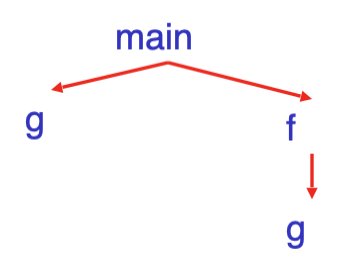
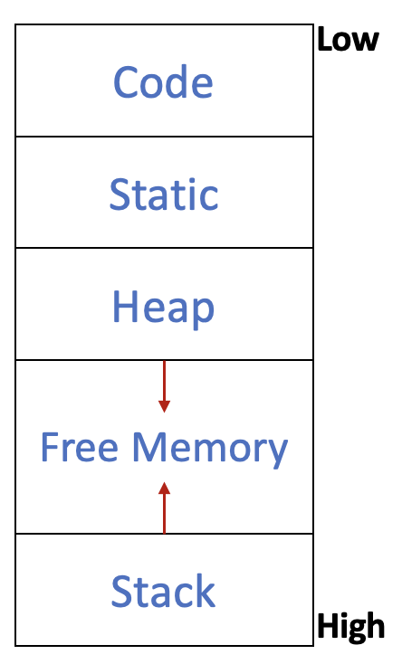
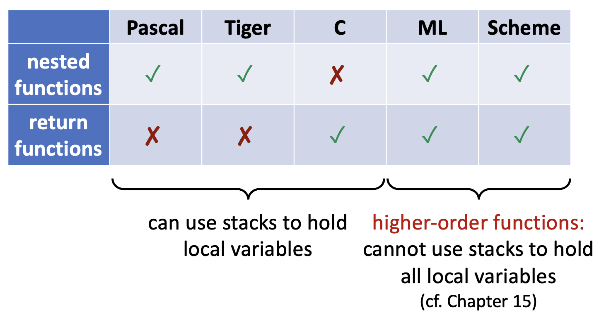
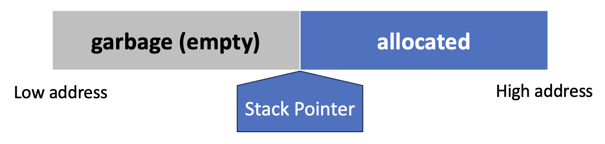
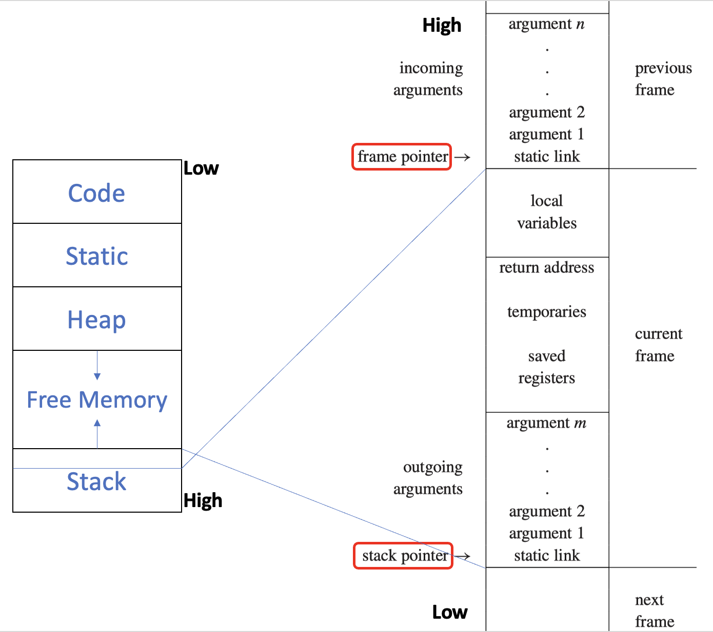
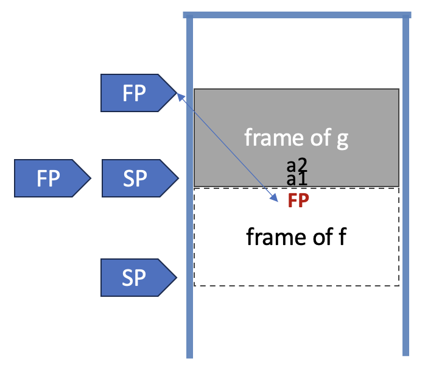
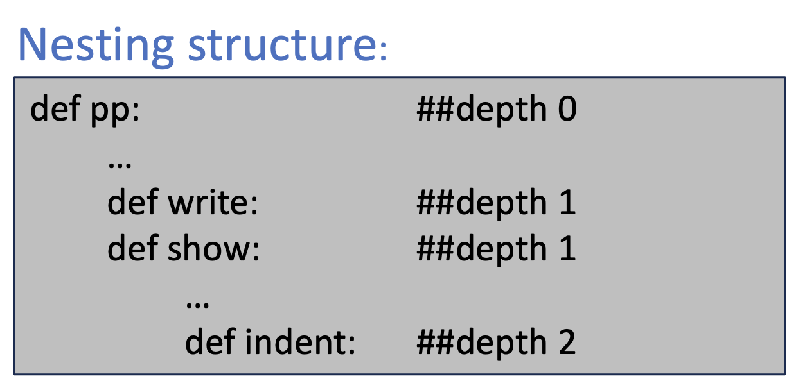
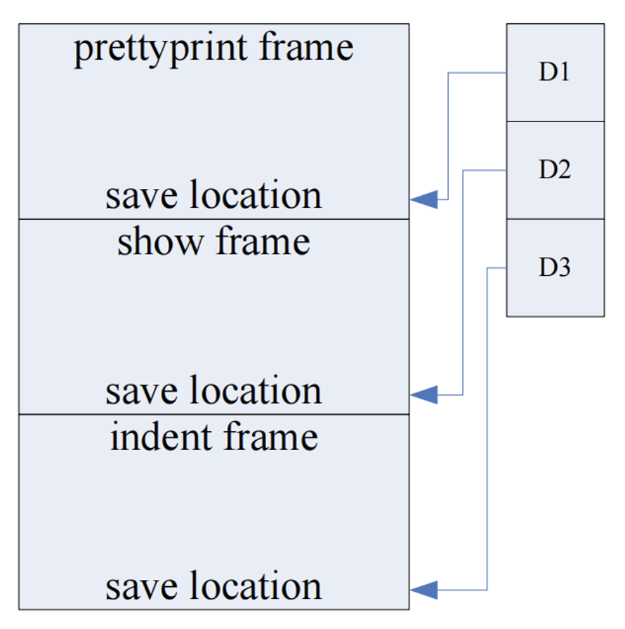
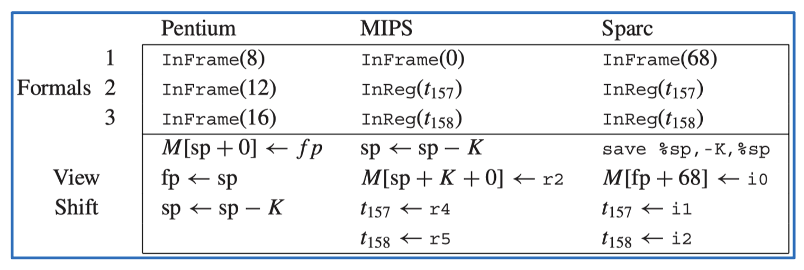
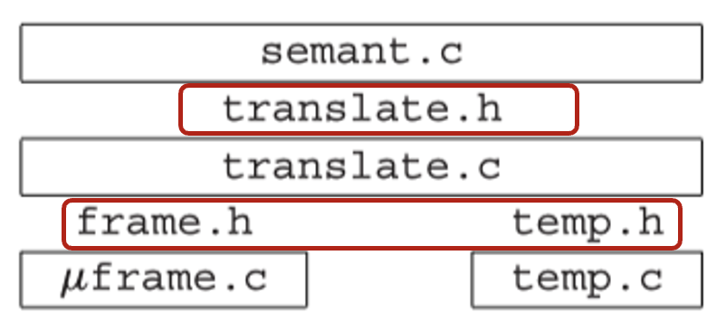

# Activation Records

??? abstract "核心知识"

    - 活动记录（**栈帧**）
        - 布局
        - 帧指针
        - 寄存器
        - 参数传递
        - 返回地址
        - 放在栈帧中的变量，变量逃逸
        - 静态链接/显示表

    - Tiger 中的实现（了解一下）

一开始程序的执行受操作系统控制。当程序被调用时，OS 为程序分配空间，接着代码就加载到这块空间（的低地址）上，然后 OS 跳转到入口点（即 `main` 函数）。剩下的空间用来存放该程序的全部数据。在这一过程中，编译器负责生成代码和编排数据区的使用。其中代码的生成需要满足正确性和速度两个目标。

对于执行，我们提出两个假设：

1. 执行是顺序的；控制以一种明确定义的顺序从程序中的一个点转移到另一个点
2. 当一个过程被调用时，控制最终会返回到紧接在调用之后的位置

过程 P 的**激活**(activation)即为 P 的调用(invocation)，其生命周期为执行 P 的所有步骤，包括 P 调用的过程的所有步骤。

变量 x 的**生命周期**(lifetime)是从 x 定义所在的执行部分。需要注意的是生命周期是动态（运行时）概念，而作用域是静态概念。

假设 2 要求当 P 调用 Q 时，Q 在 P 返回之前返回，此时过程激活的生命周期是正确嵌套的，因此激活生命周期可以表示为树形结构，即**激活树**(activation tree)。

???+ example "例子"

    <div class="grid">

    ```java
    class Main {
        g(): int { 1 };
        f(): int { g() };
        main(): int {{ g(); f(); }};
    }
    ```

    { width=70% }

    </div>

- 激活树依赖于运行时行为  
- 激活树可能因每个程序输入而异  
- 由于激活是正确嵌套的，因此可以用**栈**跟踪当前活动过程

{ align=right width=30% }

从编译器编写者的角度来看，执行的目标程序在其自身的**逻辑地址空间**中运行，其中的每个程序值都有一个位置。目标程序的运行时表示由**数据**和**程序**区域组成。内存的一种典型划分方式是（低地址 -> 高地址）：

- **代码区**(code)：可执行的目标代码
- **静态区**(static)：编译时即可确定大小和地址的数据对象，例如全局常量、编译器生成的数据（如用于垃圾回收（GC））
- **堆区**(heap)：在程序控制下进行分配和释放的数据（对于 C 语言而言，即通过 `#!c malloc` 和 `#!c free` 管理）
- **栈区**(stack)：**过程**调用期间生成的称为**活动记录**(activation records)的数据结构

过程（即函数）的调用与返回通常由一个称为**控制栈**(control stack)的运行时栈来管理。

- 每次调用一个过程时，其局部变量的存储空间会被压入栈中
- 当该过程终止时，这部分空间会从栈中弹出
- 过程的调用也被称为过程的活动
- 每个活跃的活动(live activation)在控制栈上都有一个**活动记录**（有时称为**帧**(frame)）

??? info "补充知识"

    === "高阶函数"

        在支持**嵌套函数**和**函数值变量**的语言中（**高阶函数**(high-order functions)），可能需要在函数返回后保留局部变量。此时局部变量需要比其所在函数调用更长的生命周期。这时不能用栈存储全部的局部变量。

        <div style="text-align: center">
            
        </div>

    === "内存对齐"

        - 大多数机器是 32 位或 64 位
        - 机器可以是字节（8 位）寻址或字（4 字节）寻址
        - 如果一个数据起始于字边界，则它就是字对齐的  
        - 大多数机器有一些对齐限制；若没有对齐好，性能上就会有损失

        ???+ example "例子"

            字符串 "Hello" 占用 5 个字符（不含结尾的 \0）。为使下一个数据字对齐，需在字符串后添加 3 个“填充”字符。填充部分不属于字符串，仅为未使用的内存。


## Stack Frame

我们通常只能通过栈顶来访问栈元素，然而：

- 局部变量可能以大批量的方式压入/弹出
- 局部变量并不总是在创建后立即初始化（在栈中）

因此我们希望继续访问栈深处的变量——我们将栈视为一个大数组，并用到一个指向某个位置的特殊寄存器，即**栈指针**。

<div style="text-align: center">
    
</div>

- 栈通常仅在函数入口处增长，足以容纳该函数的所有局部变量，并在函数退出前以相同量收缩
- 函数的**活动记录**或**栈帧**(stack frame)：栈上专用于该函数的局部变量、参数、返回地址及其他临时数据的区域
- 运行时栈通常从高内存地址开始，向低地址方向增长

一个典型的栈帧布局为：

- **传入参数**(incoming arguments)：由调用者传递
- 一些**局部变量**(local variables)位于帧中，其他局部变量保存在寄存器中
- **返回地址**(return address)：控制应返回到（调用函数内的）位置；由 `CALL` 指令创建
- **保存的寄存器**(saved registers)：为寄存器的其他用途腾出空间
- **传出参数**(outgoing arguments)：向其他函数传递参数
- **静态链接**(static links)

<div style="text-align: center">
    
</div>


### Frame Pointer

假设函数 `g(...)` 调用函数 `f(a1, ..., an)`，其中 `g` 为调用者，`f` 为被调用者。当 `g` 调用 `f` 时，栈指针指向 `g` 传递给 `f` 的第一个参数，`f` 分配一个大小为 `#framesize` 的帧。

{ align=right width=40% }

- 当进入 `f` 时：
    - 将旧的帧指针 `FP` 保存到内存中的帧内
    - `FP = SP`
    - `SP = SP - #framesize`

- 当退出 `f` 时：
    - `SP = FP`
    - 取回之前保存的旧 `FP`

如果函数 `f` 的帧大小可变，或者栈上的帧不总是连续的，这种安排会很有用。

若帧大小固定：`FP = SP + #framesize`，那么 `FP` 是一个“虚构”寄存器。


### Registers

机器拥有有限的**寄存器**(registers)（通常为 32 个）。但许多不同的过程和函数需要使用寄存器，因此可能会产生冲突。按函数调用前后负责保存寄存器的情况，我们可以将寄存器划分为以下两类：

- **调用者保存的寄存器**(caller-saved register)：在进入被调用函数前，调用者可能另外保存这些寄存器的值；被调用函数可以随意更改这些寄存器的值
- **被调用者保存的寄存器**(callee-saved register)：被调用函数若要更改这些寄存器的值，则要先保存原值，退出前恢复原值；从调用者视角看，这些寄存器的值没有变


### Parameter Passing

如果所有参数都仅通过栈传递，会导致不必要的内存流量并消耗更多时间。因此现代机器的**参数传递约定**(parameter-passing convention)规定：函数的前 `k` 个参数（通常 `k` = 4 或 6）通过**寄存器** `rp`, ..., `rp+k−1` 传递，其余参数则通过**内存**（**栈**）传递。

例如，`f(a1, ..., an)` 接收的参数位于 `r1, ..., rn` 中，随后调用 `h(z)`,此时 `f` 必须将 `z` 传入 `r1`。在调用 `h` 之前，`f` 需将 `r1` 的旧内容保存到其栈帧中

现在来看寄存器的使用如何节省时间：

- **叶过程**(leaf procedures)（不调用其他过程的程序）无需将传入参数写入内存中
- 某些优化编译器采用**跨过程寄存器分配**(interprocedural register allocation)策略，一次性分析整个程序中的所有函数，它们为不同过程分配不同的寄存器来接收参数并存储局部变量
- 在调用 `h(z)` 时，参数 `x` 已成为失效变量，此时 `f(x)` 可直接覆盖 `r1` 而无需保存该值
- 部分架构支持**寄存器窗口**(register windows)技术，使每次函数调用都能在不产生内存访问的情况下分配全新的寄存器组


### Return Address

假设函数 `g` 调用了函数 `f`。当 `f` 返回时，如果 `g` 中的调用指令位于地址 `a`，那么（通常）正确的返回位置是 `a+1`，即 `g` 中的下一条指令。这被称为**返回地址**(return address)。

在现代机器上，调用指令仅将返回地址放入指定的寄存器中。比如对于 MIPS 架构而言，这个寄存器是 `$ra`。

**非叶过程**(non-leaf procedure)需要将其写入栈（除非使用了跨过程的寄存器分配策略）；而**叶过程**则不需要这样做。


### Frame-Resident Variables

仅在以下必要情况下，值才会被写入内存（栈帧中）：

- 变量将通过**引用**(reference)传递，因此必须具有内存地址（例如 C++ 中的 `&`）
- 变量被当前过程内部**嵌套的过程**访问（对于跨过程的寄存器分配而言并非必需）
- 值的体积**过大**，无法存入单个寄存器
- 变量是**数组**，需要地址运算来提取其元素
- 保存变量的寄存器需用于**特定目的**，如**参数传递**（如上所述）
- **局部变量和临时值过多**，无法全部存入寄存器时，部分值会被“溢出”到栈帧中

变量**逃逸**(escape)的条件包括：某个变量的生命周期或可访问范围超出了它原本所在的作用域或栈帧。

- 通过**引用**传递
- 获取其**地址**（使用 C 语言的 `&` 运算符）
- 或从**嵌套函数**中访问

逃逸的变量必须写入内存。

???+ info "注"

    >来自 24-25 历年卷

    如果函数有**按引用传递的参数**，返回该参数的地址时**不会出现悬挂引用**的问题。

??? example "例子"

    >来自作业题 6.3

    === "题目"

        For each of the variables `a`, `b`, `c`, `d`, `e` in this C program, say whether the variable should be kept in memory or a register, and why.

        ```c
        int f(int a, int b)
        {
            int c[3], d, e;
            d = a + 1;
            e = g(c, &b);
            return e + c[1] + b;
        }
        ```

    === "解答"

        | 变量 | 放在内存中 | 放在寄存器中 | 理由 |
        | :-: | :-: | :-: | :- |
        | a |  | ✅ | 函数参数通过寄存器传递 |
        | b | ✅ |  | 按引用传递，由过程访问 |
        | c | ✅ |  | 数组，由过程访问 |
        | d |  | ✅ | 表达式的中间结果；在函数 g 调用后不再使用 |
        | e |  | ✅ | 函数结果 |


### Static Links

**块结构**(block structures)是指在允许嵌套函数声明的语言中（如 Pascal、ML 和 Tiger），内部函数可以使用外部函数中声明的变量。块结构的实现思路如下：

- 每当调用函数 `f` 时，可以向其传递一个指向静态的包含 `f` 的函数帧的指针，即**静态链接**(static link)
- **显示表**(display)：一个全局数组，在其第 `i` 个位置存放指向最近进入的、静态嵌套深度为 `i` 的过程帧的指针
- **lambda 提升**(lambda lifting)：当 `g` 调用 `f` 时，将 `g` 中实际被 `f`（或任何嵌套在 `f` 内部的函数）访问的每个变量作为额外参数传递给 `f`

```c
int g(int x) {
    int f(int y) {
        ...
    }
    return f(x) + 1;
}
```

每当函数 `f` 被调用时，会传递一个指向当前（**最近进入的**）函数 `g` 的活动记录的指针，而函数 `g` 在程序文本中**直接包围**了 `f`。

???+ example "例子"

    === "例1"

        === "代码"

            ```sml
            type tree = {key: string, left: tree, right: tree}

            function prettyprint(tree: tree) : string =
                let
                    var output := ""

                    function write(s: string) =
                    output := concat(output, s)

                    function show(n: int, t: tree) =
                    let
                        function indent(s: string) =
                        (
                            for i := 1 to n do write(" ");
                            output := concat(output, s);
                            write("\n")
                        )
                    in
                        if t = nil then
                        indent(".")
                        else (
                            indent(t.key);
                            show(n + 1, t.left);
                            show(n + 1, t.right)
                        )
                    end
                in
                    show(0, tree);
                    output
                end
            ```

        === "解释（GIF 动图）"

            <div style="text-align: center">
                
            </div>

        === "总结（GIF 动图）"

            <div style="text-align: center">
                
            </div>

            <div style="text-align: center">
                
            </div>

            每次过程调用或变量访问时，都需要一个由零个或多个**获取**(fetch)操作组成的链；该链的长度正是所涉及的两个函数之间静态嵌套深度的差值。

    === "例2"

        >来自作业题 6.7

        === "题目"

            A _display_ is a data structure that may be used as an alternative to static links for maintaining access to nonlocal variables. It is an array of frame pointers, indexed by static nesting depth. Element $D_i$ of the display always points to the most recently called function whose static nesting depth is $i$.

            The bookkeeping performed by a function $f$, whose static nesting depth is $i$, looks like:

            $\quad$ Copy $D_i$ to save location in stack frame

            $\quad$ Copy frame pointer to

            $\quad$ $D_i$ ... body of $f$ ...

            $\quad$ Copy save location back to $D_i$

            In Program 6.3, function `prettyprint` is at depth 1, `write` and `show` are at depth 2, and so on.

            ```pascal
            type tree = {key: string, left: tree, right: tree}

            function prettyprint(tree: tree) : string =
            let
                var output := ""

                function write(s: string) =
                    output := concat(output, s)

                function show(n: int, t: tree) =
                    let function indent(s: string) =
                        (for i := 1 to n
                        do write(" ");
                        output := concat(output, s); write("\n")) // l-14
                    in if t=nil then indent(".")
                        else (indent(t.key);
                            show(n+1, t.left);
                            show(n+1, t.right))
                    end

            in show(0, tree); output
            end
            ```

            1. Show the sequence of machine instructions required to fetch the variable `output` into a register at line 14 of Program 6.3, using static links.
            2. Show the machine instructions required if a display were used instead.

        === "解答"

            栈帧布局如下：

            <div style="text-align: center">
                
            </div>

            第 1 问：

            ```asm
            # 取出 show 函数的 save location
            MOV r1, M[FP + sl_offset]
            # 取出 prettyprint 函数的 save location
            MOV r2, M[r1 + sl_offset]
            # 获取 output 值
            MOV _output, M[r2 + out_offset]
            ```

            第 2 问：

            ```asm
            # 通过数组随机访问可以直接拿到 prettyprint 的 save location
            MOV r1, D[1]
            # 从该帧取出变量 output
            MOV r_output, M[r1 + out_offset]
            ```


## Frames in The Tiger Compiler

帧的接口：

```c
/* frame.h */
typedef struct F_frame_ *F_frame;
typedef struct F_access_ *F_access;
typedef struct F_accessList_ *F_accessList;
struct F_accessList_ {F_access head; F_accessList tail;};
F_frame F_newFrame(Temp_label name, U_boolList formals);
Temp_label F_name(F_frame f);
F_accessList F_formals(F_frame f);
F_access F_allocLocal(F_frame f, bool escape);
```

??? info "注"

    抽象接口 `frame.h` 由目标机器特定的模块实现，例如 `mipsframe.c`。

    ```c
    /* mipsframe.c */
    #include "frame.h"
    ...
    ```

- `F_frame` 类型保存了关于在此帧中分配的形式参数和局部变量的信息
    - `U_boolList formals`：哪些参数会逃逸
    - 调用：

        ```c
        F_newFrame(
            g, 
            U_BoolList(
                TRUE, 
                U_BoolList(
                    FALSE, 
                    U_BoolList(FALSE, NULL)
                )
            )
        )
        ```

- `F_access` 类型描述了可能位于栈帧或寄存器中的形参和局部变量
    - 一种抽象数据类型，`struct F_access_` 的内容仅在 `Frame` 模块内部可见
    - 例如 `InFrame(X)`、`InReg(t84)`

        ```c
        /* mipsframe.c */
        #include "frame.h"
        struct F_access_ {
            enum {inFrame, inReg} kind;
            union {
                int offset;    /* InFrame */
                Temp_temp reg; /* InReg */
            } u;
        };
        static F_access InFrame(int offset);
        static F_access InReg(Temp_temp reg);
        ```

- `F_formals` 接口函数提取一个包含 `k` 个「访问」的列表，这些访问指明了形参在运行时将被存放的位置（从被调用方视角来看）；调用方和被调用方对参数的观察方式可能不同。
    - 参数通过栈传递时：
        - 调用方：相对于**栈指针**的偏移量
        - 被调用方：相对于**帧指针**的偏移量
    
    - 参数通过寄存器传递时，例如：
        - 调用方：寄存器 6
        - 被调用方：寄存器 13

    - 这种「**视角转换**」(shift of view)依赖于目标机器的调用约定。
        - 它必须由 `Frame` 模块处理，从 `newFrame` 开始
        - 对于每个形参，`newFrame` 需要计算两件事：
            - 该参数在函数内部将如何被看待（是在寄存器中，还是在帧位置中）
            - 以及需要生成哪些指令来实现视角转换


### Representation of Frame Descriptions

实现模块 `Frame` 应确保 `F_frame` 类型的表示对 `Frame` 模块的任何客户端保密。`F_frame` 是一个数据结构，包含：

- 所有形式参数的位置
- 实现视图转换所需的指令
- 到目前为止已分配的局部变量的数量
- 函数机器码起始处的标签

假设函数 `g` 有三个参数，其中第一个参数逃逸。

<div style="text-align: center">
    
</div>

```c
function m(x:int, y:int) = (h(y,y); h(x,x))
```

<!-- 将r4和r5移动到t157和t158？ -->


### Local Variables

某些局部变量保存在栈帧中，而另一些则保存在寄存器中。为了分配一个新的局部变量，语义分析阶段会调用：

```c
F_access F_allocLocal(F_frame f, bool escape);
```

- 若 `escape = True`，`F_allocLocal` 返回一个 `InFrame` 访问方式
- 若 `escape = False`，`F_allocLocal` 可返回一个 `InReg` 访问方式

<div class="grid" markdown>

```sml
function f() =
    let var v := 6
    in (print(v);
        let var v := 7
        in print(v)
        end;
        print(v);
        let var v := 8
        in print(v)
        end;
        print(v))
    end
```

```c
void f() {
    int v = 6;
    print(v);
    {
        int v = 7;
        print(v);
    }
    print(v);
    {
        int v = 8;
        print(v);
    }
    print(v);
}
```

</div>

>输出结果：6 7 6 8 6

- 在处理过程中，每遇到一个变量声明，就会调用 `allocLocal` 在帧中分配一个临时或新的空间，并与名称 `v` 关联
- 每当遇到结束（或闭合大括号）时，与 `v` 的关联将被遗忘，但该空间仍保留在帧中
- 整个函数内声明的每个变量都有一个独立的临时或帧槽位
- 寄存器分配器将使用**尽可能少的寄存器**来表示临时变量，比如第二个和第三个 `v` 变量可以保存在同一个临时存储中
- 一个聪明的编译器还可能注意到两个驻留在帧中的变量可以被分配到同一个槽位中


### Calculating Escapes

调用 `allocLocal` 时，了解变量是否逃逸至关重要。`findEscape` 函数可用于查找逃逸变量，并将此信息记录在抽象语法的 `escape` 字段中。

`findEscape` 的实现：

- 遍历整个抽象语法树，寻找每个变量的逃逸使用情况
- 利用环境来记录特定变量是否发生逃逸

```c
/* escape.h */
void Esc_findEscape(A_exp exp);

/* escape.c */
static void traverseExp(S_table env, int depth, A_exp e);
static void traverseDec(S_table env, int depth, A_dec d);
static void traverseVar(S_table env, int depth, A_var v);
```

- 每当在静态函数嵌套深度 `d` 处发现变量或形参声明 `x` 时（比如将 `<a, EscapeEntry(d, &(x->u.var.escape))>` 录入环境）
- 当 `a` 在大于 `d` 的深度被使用时，设置 `x->u.var.escape = True`
- 其他情况（**显式获取变量地址**或存在**引用调用参数**）类似


### Temporaries and Labels

编译器的语义分析阶段需要为参数和局部变量选择**寄存器**，并为过程体选择**机器码地址**。但要想准确确定它们的位置还为时过早。

- **临时值**(temporary)：暂时保存在寄存器中的值
- **标签**(label)：某个机器语言位置，其确切地址尚未确定

我们分别用 `Temps` 和 `Labels` 表示局部变量和静态内存地址的抽象名称。

```c
/* temp.h */
typedef struct Temp_temp_ *Temp_temp;
Temp_temp Temp_newtemp(void);

typedef S_symbol Temp_label;
Temp_label Temp_newlabel(void);
Temp_label Temp_namedlabel(string name);
string Temp_labelstring(Temp_label s);

typedef struct Temp_tempList_ *Temp_tempList;
struct Temp_tempList_ {Temp_temp head; Temp_tempList tail;}
Temp_tempList Temp_TempList(Temp_temp head, Temp_tempList tail);
typedef struct Temp_labelList_ *Temp_labelList;
struct Temp_labelList_{Temp_label head; Temp_labelList tail;}
Temp_labelList Temp_LabelList(Temp_label head, Temp_labelList tail);
```


### Two Layers of Abstraction

`frame.h` 和 `temp.h` 接口提供了内存驻留变量和寄存器驻留变量的机器无关视图（我们无需关心变量具体存储在哪里）。而 `Translate` 模块通过处理**嵌套作用域**的概念（通过静态链接）对此进行了增强，并向 `Semant` 模块提供了 `translate.h` 接口。

<div style="text-align: center">
    
</div>

```c hl_lines="6 8"
/* translate.h */
typedef struct Tr_access_ *Tr_access;
typedef ... Tr_accessList ...
Tr_accessList Tr_AccessList(Tr_access head, Tr_accessList tail);
Tr_level Tr_outermost(void);
Tr_level Tr_newLevel(Tr_level parent, Temp_label name, U_boolList formals);
Tr_accessList Tr_formals(Tr_level level);
Tr_access Tr_allocLocal(Tr_level level, bool escape);
```

- 目标：处理嵌套作用域
- 原因：为了实现块结构以及计算逃逸变量
- 实现：
    - 创建嵌套层级：`transDec` 通过调用 `Tr_newLevel` 为每个函数创建一个新的嵌套层级
    - 为每个函数和每个变量关联一个嵌套层级：
        - 函数：将每个函数的嵌套层级保存在其 `FunEntry`（存储在环境中）中
        - 变量：当 `Semant` 在 `lev` 层处理局部变量声明时，它会调用 `Tr_allocLocal(lev, esc)` 在该层创建变量；`Semant` 在值环境中的每个 `VarEntry` 中记录 `Tr_access`

```c
/* new versions of VarEntry and FunEntry */
struct E_enventry_ {
    enum {E_varEntry, E_funEntry} kind;
    union {
        struct {Tr_access access; Ty_ty ty;} var;
        struct {
            Tr_level level; 
            Temp_label label;
            Ty_tyList formals; 
            Ty_ty result;
        } fun;
    } u;
};

E_enventry E_VarEntry(Tr_access access, Ty_ty ty);
E_enventry E_FunEntry(
    Tr_level level, Temp_label label, 
    Ty_tyList formals, Ty_ty result
);

/* inside translate.c */
struct Tr_access_ {
    Tr_level level; 
    F_access access;
};
```


### Managing Static Links

我们使用 `Translate` 模块来管理静态链接。

???+ question "为什么不用 `Frame` 模块来管理"

    - `Frame` 应当独立于正在编译的具体源语言
    - 许多源语言不支持嵌套函数声明

- `Translate` 知道每个帧包含一个静态链接，该静态链接通过寄存器传递给函数，并存储到帧中，就像参数一样
- 我们将尽可能地把静态链接视为一个参数
- 当 `Semant` 调用 `Tr_formals(level)` 时，它将获取原始参数的访问值


### Keeping Track of Levels

`Tr_outermost` 用于返回最外层的层级，即 Tiger 主程序嵌套所在的层级。所有“库”函数均在此最外层声明，该层不包含帧或形式参数列表。