# Translation to Intermediate Code

??? abstract "核心知识"

    - 三地址码（了解即可）
    - IR 树的一些接口
    - 生成 IR 树
        - 表达式
        - 普通变量
        - 左值
        - 数组变量、下标和字段选择
        - 算术运算
        - 条件/循环（while、for）语句
        - 函数调用
        - 声明和定义（变量/函数）

**中间表示**(intermediate representation, **IR**)是一种抽象的机器语言：

- 它表达了目标机器的操作，但不过多涉及具体的机器细节
- 它与源语言的细节无关

编译器中使用了多种不同的中间表示：

- 三地址码（TAC）
- 静态单赋值形式（SSA）
- 控制流图（CFG）
- 抽象语法树（AST）
- 表达式树（IR 树，由 Tiger 编译器使用）

如果直接将源语言翻译成真实的机器码，那将会隐藏模块化和可移植性。

<div style="text-align: center">
    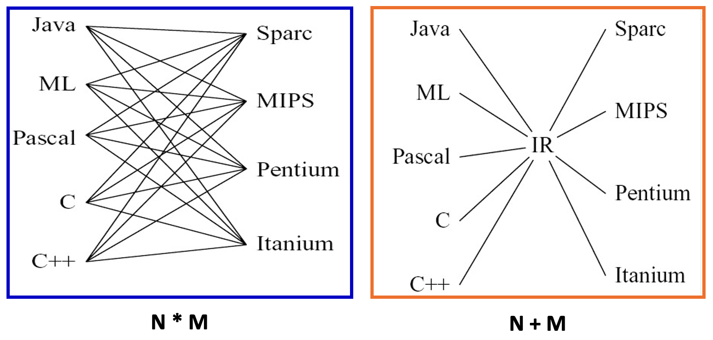
</div>


## Three-Address Code

**三地址码**(three-address code, **TAC**)指的是每条指令最多只用三个操作数地址的编码方式。

<div style="text-align: center">
    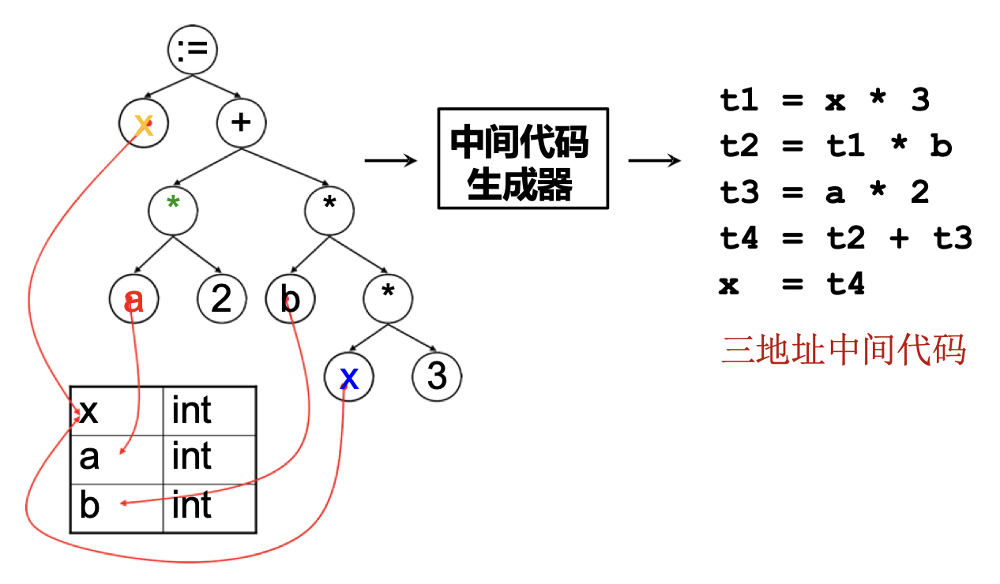
</div>

- 三地址码最基本的指令：`x = y op z`
- 针对编程语言中的不同结构，需要改变三地址码的形式，比如 `t2 = -t1`
- 三地址码**没有标准形式**，原因之一是需要发明新的形式来表达语言中的特殊特性

???+ example "例子"

    <div style="text-align: center">
        
    </div>

三地址码的实现：

- 整个三地址指令序列被实现为**数组**或**链表**
- 最常见的实现方式是将三地址码实现为**四元组**(quadruples)：
    - 一个字段表示**操作**
    - 三个字段表示**地址**

- 对于需要少于三个地址的指令，某些地址字段会被赋予空值（`null`）或「空」(empty)值

    <div class="grid" markdown>

    ```c
    t1 = x > 0
    if_false t1 goto L1
    fact = 1
    label L2
    ```

    ```c
    (gt, x, 0, t1)
    (if_f, t1, L1, _)
    (asn, 1, fact, _)
    (lab, L2, _, _)
    ```

    </div>

- 其他实现方式：三元组、间接三元组


## Intermediate Representation Tree

一个好的 IR 具备以下几个特性：

- 便于语义分析阶段**生成**
- 便于**翻译**成所有目标机器语言
- 每个结构必须具有清晰**简单的含义**，以便能够轻松指定和实现 IR **优化转换**

<div style="text-align: center">
    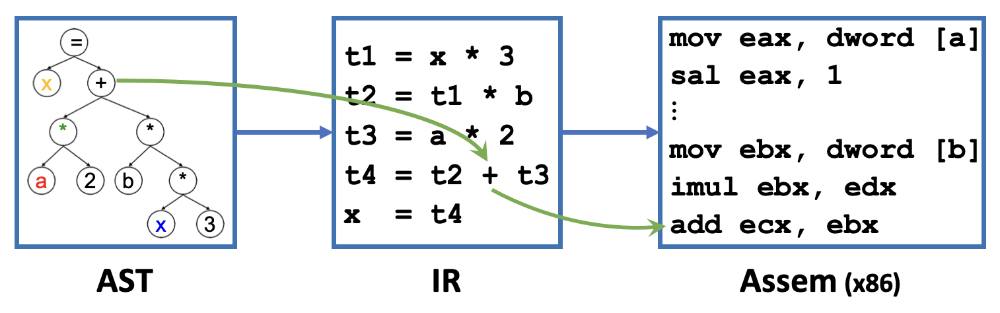
</div>

抽象语法可能包含具有**复杂效果**(complex effects, CE)的指令，机器语言也是如此，但它们的对应关系并不良好。IR 应当足够简单，以便能够拆分抽象语法的复杂指令，然后组合起来形成真正的机器指令。

<div style="text-align: center">
    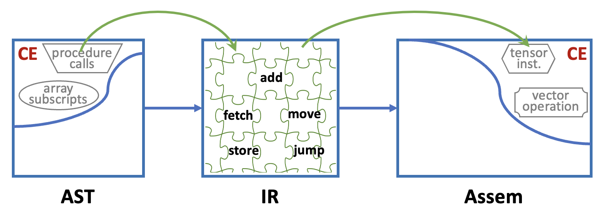
</div>

下面列出了 IR 树语言的一些接口：

???+ note "表达式（`T_exp`）"

    每个表达式都有返回值，可能有副作用。

    - `CONST(i)`：整数常量 `i`
    - `NAME(n)`：符号常量 `n`（汇编语言标签）
    - `TEMP(t)`：临时变量 `t`（类似于寄存器）
    - `BINOP(o, e1, e2)`：二元运算符 `o` 应用于操作数 `e1`、`e2`
        - 整数算术运算符：`PLUS`、`MINUS`、`MUL`、`DIV`
        - 整数按位逻辑运算符：`AND`、`OR`、`XOR`
        - 整数逻辑移位运算符：`LSHIFT`、`RSHIFT`
        - 整数算术右移：`ARSHIFT`
    - `MEM(e)`：从地址 `e` 开始的 `wordSize` 字节内存内容；当 `MEM` 用作 `MOVE` 的左子节点时，表示「**存储**」(store)，但在其他地方表示「**获取**」(fetch)
    - `CALL(f, l)`：过程调用，函数 `f` 应用于参数列表 `l`，从左到右求值
    - `ESEQ(s, e)`：先执行语句 `s`（副作用），再对表达式 `e` 求值得到结果

???+ note "语句（`T_stm`）"

    执行副作用和控制流，无返回值。

    - `MOVE(TEMP t, e)`：计算表达式 `e` 并将其结果移入临时变量 `t`
    - `MOVE(MEM(e1), e2)`：先计算 `e1`，得到地址 `a`；再计算 `e2`，并将结果存入从地址 `a` 开始的 `wordSize` 字节内存中
    - `EXP(e)`：执行表达式 `e`（仅产生副作用），丢弃计算结果
    - `JUMP(e, labs)`：将控制流跳转到地址 `e`；目标地址可以是字面标签（如 `NAME(lab)`），也可以是其他任意表达式返回的地址；参数 `labs` 指定了所有可能的跳转目标位置（用于数据流分析）
    - `CJUMP(o, e1, e2, t, f)`：依次计算表达式 `e1`、`e2`，得到值 `a`、`b`；然后使用关系运算符 `o` 比较 `a`、`b`：若结果为真则跳转到标签 `t`，否则跳转到标签 `f`
    - `SEQ(s1, s2)`：顺序执行语句 `s1` 后接语句 `s2`
    - `LABEL(n)`：定义名称 `n` 的常量值为当前机器代码的内存地址


## Translation into IR Trees

### Expressions

在语言中，抽象语法树（AST）表达式 `A_exp` 的表示有：

- **有返回值**的表达式：`Ex`（适用于 `T_exp` 指令）
- **无返回值**的表达式（例如某些过程调用或 `while` 表达式）：`Nx`（适用于 `T_stm` 指令）
- **布尔值**表达式（如 `a > b`）：`Cx`（**条件跳转**），由 `T_stm` 指令和一对目标标签组合而成

    ```c
    Tr_Cx(patchList trues, patchList falses, T_stm stm);
    ```

    <div style="text-align: center">
        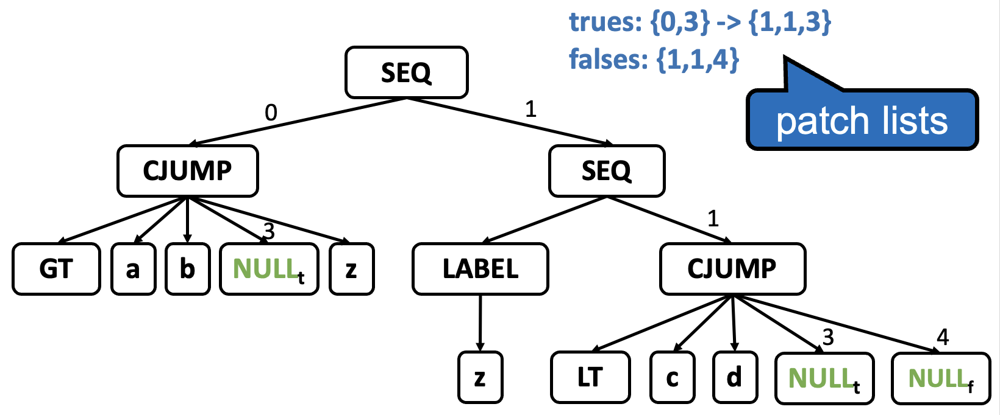
    </div>

    由于要等很久后才能知道条件为真和假时的目的地址，所以列出一个**位置列表**，其中包含当前填充为 `NULL` 的位置，这些位置需要在已知 `t` 时填充为 `t`；另外再列出所有需要填充为 `f` 的位置。

有时我们需要将一种表达式**转换**为另一种等价的表达式。比如在 Tiger 中，语句 `flag := (a>b | c<d)` 需要将 `Cx` 类型转换为 `Ex` 类型，有专门的方法来这种相互转换，比如 `toEx(Cx)`。针对不同类型的输出表达式使用不同的转换函数。

<div style="text-align: center">
    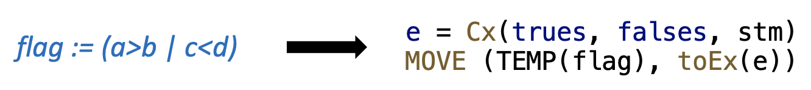
</div>

使用临时寄存器实现 `toEx(Cx)`：

<div style="text-align: center">
    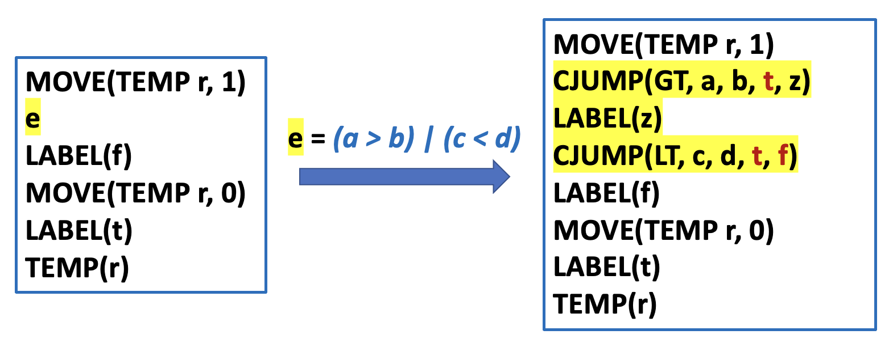
</div>


### Simple Variables

考虑翻译在当前过程的栈帧中声明的简单变量 `v`：

<div style="text-align: center">
    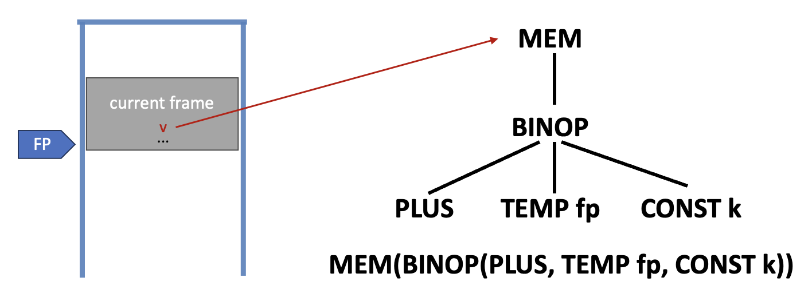
</div>

其中：

- `k`：`v` 在帧内的偏移量
- `TEMP fp`：帧指针寄存器
- 对于 Tiger 编译器，所有变量的大小相同（整数/指针）——即机器的自然字长

要翻译 `v`，就得知道**帧指针**(frame pointer)和**字长**(word size)。我们在 `Frame` 模块中添加一个帧指针寄存器 `FP` 和一个表示机器字长的常量。

```c
/* frame.h */
...
Temp_temp F_FP(void);
extern const int F_wordSize;
T_exp F_Exp(F_access acc, T_exp framePtr);
```

- **内存**变量：在 `InFrame(k)` 中访问 `a`：`F_Exp(a, T_Temp(F_FP()))` 返回 `MEM(BINOP(PLUS, TEMP FP, CONST(k)))`
- **寄存器**变量：在 `InReg(t832)` 中访问 `a` 则直接返回 `TEMP t832`

我们可将 `BINOP(PLUS, e1, e2)` 简写为 `+(e1, e2)` 

<div style="text-align: center">
    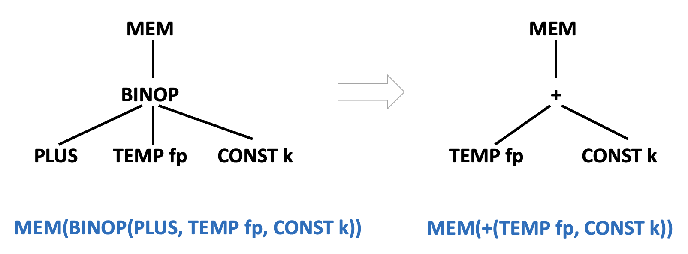
</div>


### Array Variables

不同的编程语言对数组变量的处理方式不同。

- Pascal：数组变量代表**数组内容**

    ```pascal
    var a,b : array[1..12] of integer; 
    begin 
        b :=a
    end.
    ```

- C：数组类似于**指针常量**

    ```c
    // illegal
    {
        int a[12], b[12]; 
        b = a;
    } 

    // legal
    { 
        int a[12], *b; 
        b = a;
    } 
    ```

- Tiger（如同 Java 和 ML）：数组变量表现为**指针**
    - 没有像 C 语言那样的命名数组常量
    - 新的数组值通过构造函数创建（并初始化）：`t_a[n] of i`
        - `t_a`：数组类型名称
        - `n`：元素数量
        - `i`：每个元素的初始值

    ```sml
    let
        type intArray = array of int
        var a := intArray[5] of 0
        var b := intArray[5] of 7
    in b := a
    end 
    ```

    <div style="text-align: center">
        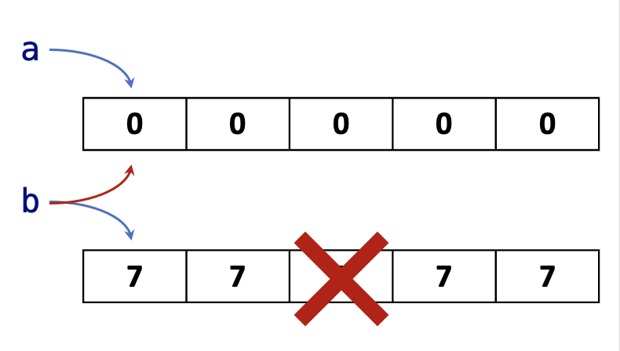
    </div>

Tiger 的**记录**值也是指针，也就是说记录的赋值是指针赋值，并不复制所有字段。这与 C 语言中的结构体赋值不同，它会复制结构体的所有字段。


### Structured L-Values

- **左值**(l-value)：可以出现在赋值语句左侧的表达式的计算结果
    - 比如 `x`、`p.y` 或 `a[i+2]`
    - 表示一个可被赋值的存储位置
    - 也可以出现在赋值语句的右侧

- **右值**(r-value)：只能出现在赋值语句右侧的表达式的计算结果
    - 比如 `a + 3` 或 `f(x)`
    - 不表示一个可赋值的存储位置

整型或指针值是**标量**，即只有一个组成部分（因此只需要 1 个字大小的空间）。

- 在 Tiger 语言中，所有**变量**和**左值**都是标量，且数组或记录变量实际上是指针（一种标量）
- 但在 C 或 Pascal 语言中，存在结构化的左值，比如 C 中的结构体、Pascal 中的数组和记录都不是标量

要将结构化左值翻译成 IR 树，需更新 `T_Mem`：

```sml
T_exp T_Mem(T_exp, int size);
MEM(+(TEMP fp, CONST kn), S)
```

>`S`：要获取或存储的对象的大小


### Subscripting and Field Selection

计算 `a[i]` 的地址：`(i − l) * s + a`

- `l`：索引范围的下界  
- `s`：每个数组元素的大小（以字节为单位）  
- `a`：数组元素的基地址  

如果 `a` 是全局变量，且其地址在编译时是常量，则可以在编译时完成减法运算 `a – l * s`。

类似地，要计算记录 `a` 中字段 `f` 的地址：`offset(f) + a`。

数组变量 `a` 是一个左值，同样地，数组下标表达式 `a[i]` 也是左值。要获取 `a[i]` 的地址，我们需要对 `a` 的地址进行算术运算，比如 `(i − l) * s + a`

<div style="text-align: center">
    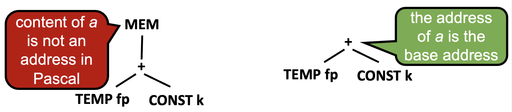
</div>

在 Pascal 编译器中，

- 如果我们将左值 `a` 翻译成类似左侧 IR 树的形式，就无法对 `a` 的地址进行算术运算；因此，我们应该将左值 `a` 翻译成表示其地址的树表达式，就像右侧 IR 树那样
- 这个左值 `a` 可能会发生什么
    - 某个特定元素可能被**下标化**(subscripted)，产生一个（更小的）左值，例如 `a[i]`；一个 `+` 节点会将 `(i − l) * s` 加到 `a` 上
    - 该左值（代表整个数组）可能在需要右值的上下文中使用，例如 `b = a`；此时，通过对其应用 `MEM` 运算符，将左值强制转换为右值

在 Tiger 语言中，所有记录和数组的值实际上都是指向记录和数组结构的**指针**。数组的**基地址**实际上是指针变量的内容，因此需要使用 `MEM`。`a[i]` 的 IR 树如下：

<div style="text-align: center">
    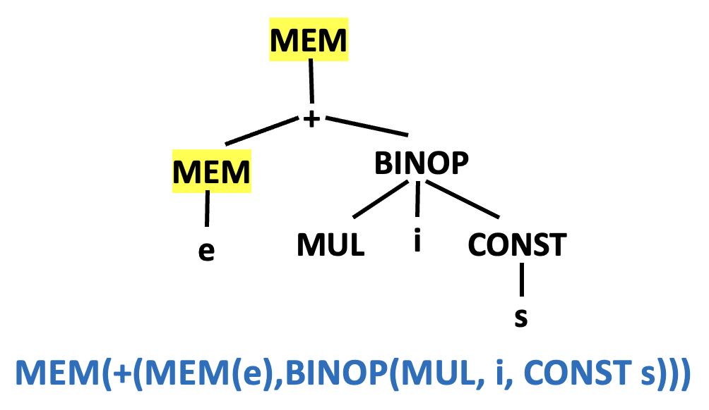
</div>

- MEM(e) 表示 `a`
- `s` 是字大小
- 假设 `l=0`

另外，左值应表示为地址（不含顶层 `MEM` 节点）

- 将左值转换为右值：从该地址取值
- 对左值赋值：向该地址存储

综上，在树形 IR 中，`MEM` 既表示存储（当用作 `MOVE` 的左子节点时），也表示取值（在其他情况下使用）。


### Arithmetic

- 每个整数算术运算符对应一个树运算符
- 树语言**没有一元算术运算符**
    - 整数的取反：通过从零减去实现；`-n` => `0 - n`
    - 按位取反：通过与全 1 进行 XOR 实现

- 浮点数的取反不能通过从零减去来实现，且许多浮点数表示允许存在负零
- 负零的相反数是正零，反之亦然
- 树语言对一元取反的支持并不完善


### Conditionals

比较运算符的结果将是一个 `Cx` 表达式：一个语句 `(T_stm) s`，它将跳转到任何真目标和假目标上。`Cx` 表示法的核心在于条件表达式可以轻松地与运算符 `&` 和 `|` 结合使用，例如 `a > b | c < d`。因此，像 `x < 5` 这样的表达式将被翻译成一个带有以下内容的 `Cx`：

```sml
stm = CJUMP(LT, x, CONST(5), NULLt, NULLf)
trues = {t}
falses = {f}
```

处理 `if` 表达式（`if e1 then e2 else e3`）的直接方法：

<div class="grid" markdown>

- `e1`：`Cx` 表达式；
- `e2` 和 `e3`：`Ex` 表达式
- 对 `e1` 应用 `toCx`
- 对 `e2` 和 `e3` 应用 `toEx`
- 为条件语句创建两个标签 `t` 和 `f`
- 分配一个临时变量 `r`
- 在标签 `t` 之后，将 `e2` 移动到 `r`
- 在标签 `f` 之后，将 `e3` 移动到 `r`
- 两个分支结束时都跳转到一个新创建的 `join` 标签，然后返回 `r`

```sml
toCx(e1)
LABEL t
r = toEx(e2)
JUMP join
LABEL f
r = toEx(e3)
JUMP join
...
LABEL join
TEMP r
...
```

</div>

- 如果 `e2` 和 `e3` 都是语句（不返回值的表达式），`toEx` 可以工作，但最好能特别识别这种情况
- 如果 `e2` 或 `e3` 是 `Cx` 表达式，`toEx` 会产生一堆混乱的跳转和标签
    - 示例：`if x < 5 then a > b else 0`
    - 简单的方式（视为 `Ex`）：

        <div style="text-align: center">
            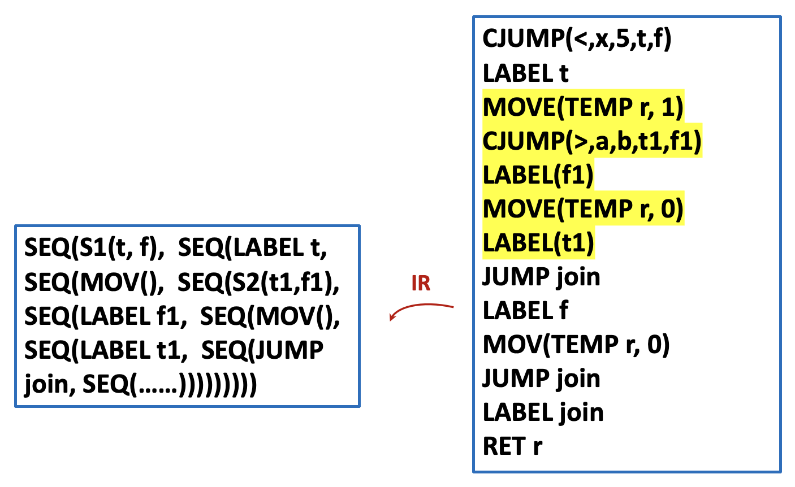
        </div>

    - 特别识别这个情况
        - `x < 5` 转换为 `Cx(s1)`
        - `a > b` 将被转换为 `Cx(s2)`

        <div style="text-align: center">
            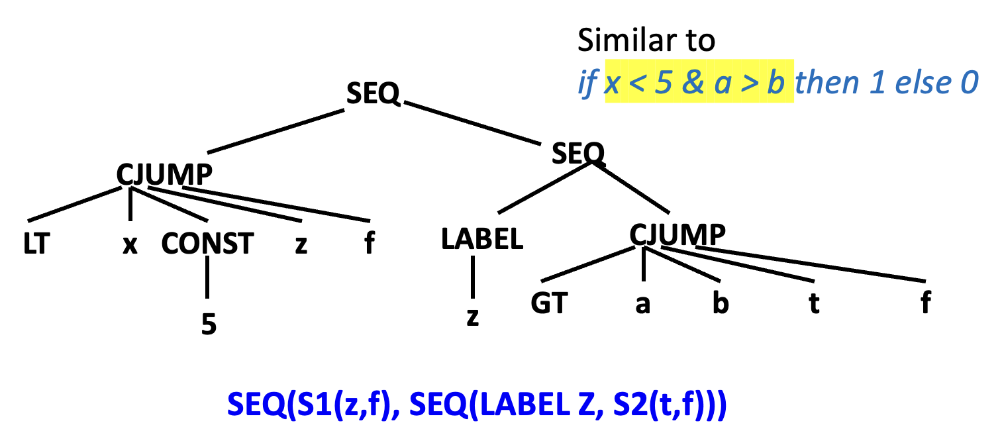
        </div>


### While Loops

`while` 循环的一般布局为：

```sml
test:
     if not(condition) goto done 
     body 
     goto test 
done: 
```

- 如果 `break` 语句出现在循环体内部（且未嵌套在任何内部 `while` 语句中），则翻译结果仅为跳转到 `done` 标签
- `break` 语句的翻译需要引入一个新的形参 `break`，该参数被设置为最近外层循环的 `done` 标签


### For Loops

翻译 `for` 语句的直接方法是将抽象语法重写为 `let` / `while` 表达式的抽象语法：

<div class="grid" markdown>

```sml
for i := lo to hi
do body
```

```sml
let var i := lo
    var limit := hi
in while i <= limit
   do (body; i := i+1)
end
```

</div>

上述代码有一个问题：当 `limit=maxint, i+1` 时会溢出。所以需要将代码改为：

```sml hl_lines="7"
if lo > hi goto done
i := lo
limit := hi
test:
    body
    if i >= limit goto done
    i := i+1
    goto test
done:
```


### Function Call

翻译函数调用 `f(a1, ..., an)` 很简单，只是需要将静态链接作为隐式的（即一般不会在 IR 指令中写出来）额外参数添加：

```sml
CALL(NAME lf, [sl, e1, e2, …, en])
```

- `lf`：`f` 的标签
- `sl`：静态链接


### Declarations

对于函数体内的每个变量声明，将在**帧**中预留额外的空间；而对于每个函数声明，将为函数体保留一个新的“片段”树代码。


#### Variable Definition

- `transDec` 函数更新 `let` 表达式主体的值环境和类型环境
- 变量的初始化会转换为一个树表达式，该表达式必须放置在 `let` 主体之前
- `transDec`：将初始化转换为赋值表达式
- 如果 `transDec` 应用于函数和类型声明，结果将是一个“无操作”表达式，例如 `Ex(CONST(0))`


#### Function Definition

函数被翻译为：

- **入口处理代码**(prologue)：
    - 用于**标记函数开始**的伪指令（在特定汇编语言中需要）
    - 函数名的**标签定义**
    - **调整栈指针**的指令（用于分配新帧）
    - **保存“逃逸”参数**（包括静态链接）到帧中的指令，以及将**非逃逸参数**移动到新的临时寄存器中的指令
    - 用于**保存**函数内使用的**任何被调用者保存寄存器**（包括返回地址寄存器）的存储指令

- **函数体**：表达式
- **出口处理代码**(epilogue)：
    - **移动返回值**（函数结果）到寄存器的指令  
    - 用于**恢复被调用者保存寄存器**的加载指令  
    - **重置栈指针**（以释放帧）的指令  
    - **返回**指令（跳转到返回地址）  
    - 根据需要使用的伪指令，用于**声明函数结束**

翻译阶段应为每个函数生成一个**片段**(fragment)，其中包含：

- 帧：包含关于局部变量和参数的机器特定信息的帧描述符
- 主体：`procEntryExit1` 返回的结果

```c
/* frame.h */
...
typedef struct F_frag_ * F_frag;
struct F_frag_ { 
  enum {F_stringFrag, F_procFrag} kind;
  union {
    struct {Temp_label label; string str;} stringg;
    struct {T_stm body; F_frame frame;} proc;
  } u;
};
F_frag F_StringFrag(Temp_label label, string str);
F_frag F_ProcFrag(T_stm body, F_frame frame);
typedef struct F_fragList_ *F_fragList;
struct F_fragList_ {F_frag head; F_fragList tail;};
F_fragList F_FragList(F_frag head, F_fragList tail);

/* translate.h */
...
void Tr_procEntryExit(Tr_level level, Tr_exp body, Tr_accessList formals);
F_fragList Tr_getResult(void);

```

???+ example "例题"

    >节选自作业题 7.2 

    === "题目"

        Translate each of these expressions into IR trees, but using the `Ex`, `Nx`, and `Cx` constructors as appropriate. In each case, just draw pictures of the trees; an `Ex` tree will be a Tree `exp`, an `Nx` tree will be a Tree `stm`, and a `Cx` tree will be `astm` with holes labeled _true_ and _false_ into which labels can later be placed.

        2. `output := concat(output,s)`, as it appears on line 8 of Program 6.3. The `concat` function is part of the standard library, and for purposes of computing its static link, assume it is at the same level of nesting as the prettyprint function.

            ```ts
            function concat (s1: string, s2: string) : string
            ```

        3. `b[i+1]:=0`
        5. `while a>0 do a := a-1`
        7. `if a then b else c`, where `a` is an integer variable (true if $eq.not$ 0).

    === "答案"

        === "2"

            <div style="text-align: center">
                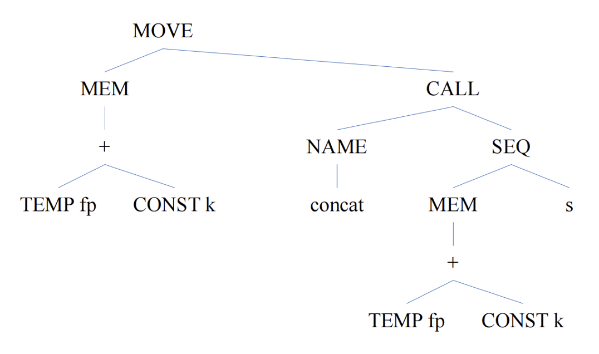
            </div>

        === "3"

            <div style="text-align: center">
                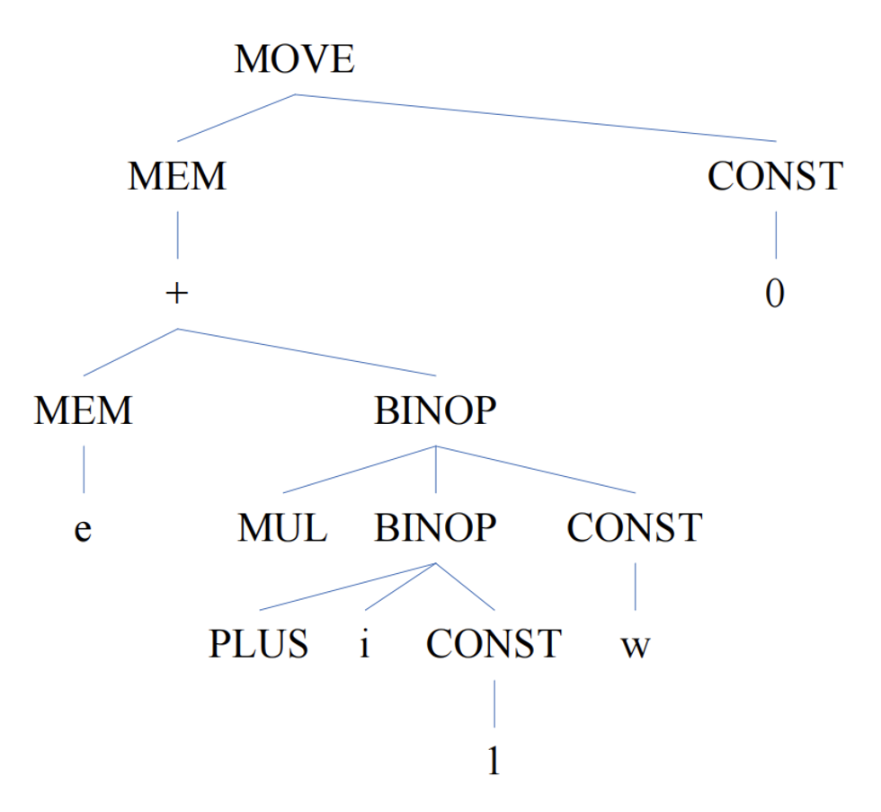
            </div>

        === "5"

            <div style="text-align: center">
                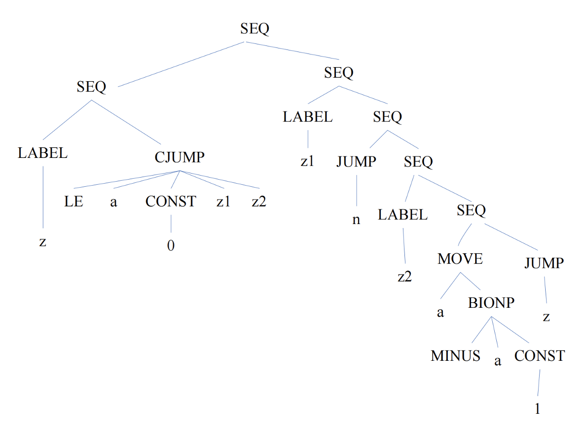
            </div>

        === "7"

            <div style="text-align: center">
                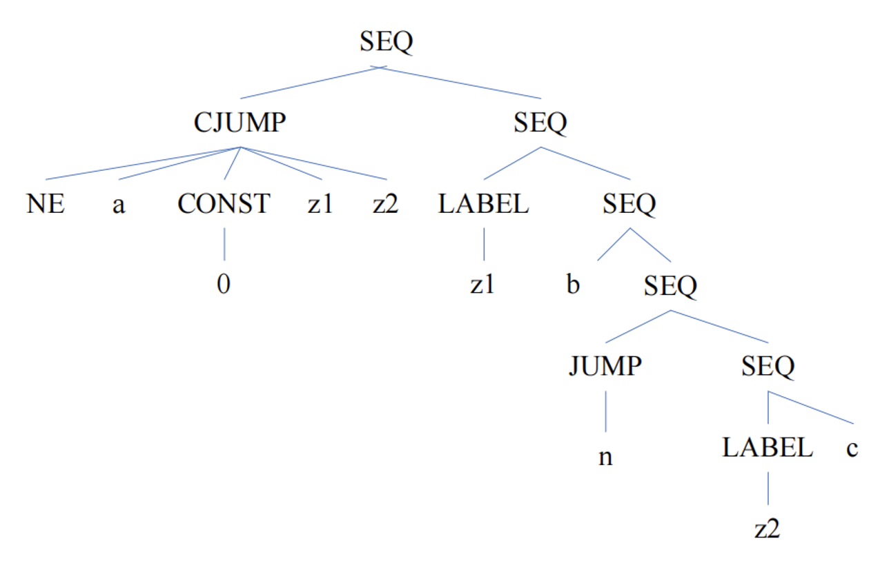
            </div>