# Basic Blocks and Traces

语义分析阶段生成的 IR 树必须被翻译成汇编语言或机器语言。

- 树语言的运算符经过精心选择，能够匹配大多数机器的能力，但它与机器语言并不完全对应，且会会干扰编译时的优化分析
- 树与机器语言程序之间的一些不匹配之处：
    - `CJUMP` 指令可以跳转到两个标签中的任意一个；而实际机器的条件跳转指令在条件为假时会顺序执行下一条指令
    - 表达式中的 `ESEQ` 节点使用起来不方便
        - 子树求值顺序不同会导致结果不同
        - 但能够以任意顺序求值表达式的子表达式是有用的

    - 表达式中的 `CALL` 节点也会导致同样的问题。
    - 当尝试将参数放入一组固定的形参寄存器时，其他 `CALL` 节点的参数表达式中的 `CALL` 节点会引发问题，例如：`CALL(f, [e1, CALL(g, [e2, ...])])`

解决方法是通过 3 个步骤对树做变换处理：

1. 将一棵树重写为**一系列规范树**，其中不包含 `SEQ` 或 `ESEQ` 节点

    <div style="text-align: center">
        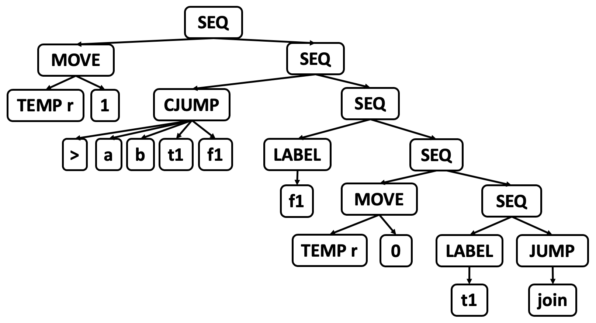
    </div>

2. 规范树列表被组织成**一组基本块**，这些基本块内部不包含任何跳转或标签

    <div style="text-align: center">
        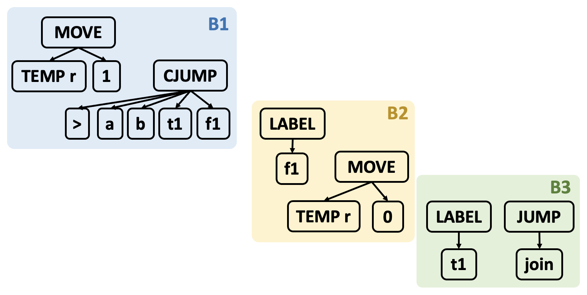
    </div>

3. 基本块被组织成**一组轨迹**，其中每个条件跳转指令（`CJUMP`）后紧跟其`false` 标签

    <div style="text-align: center">
        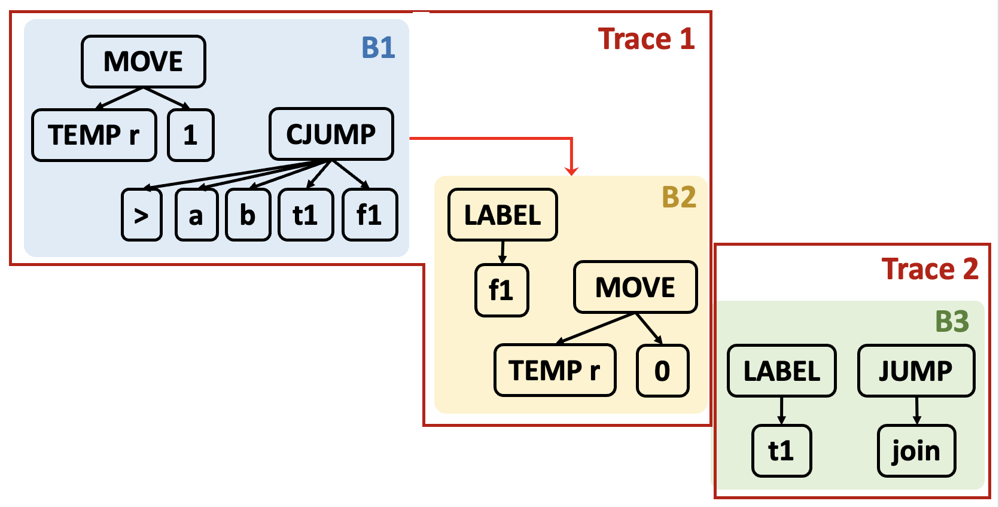
    </div>


## Canonical Trees

规范树具有以下属性：

- 无 `SEQ` 或 `ESEQ`
- 每个 `CALL` 的父节点必须是 `EXP(...)` 或 `MOVE(TEMP t, ...)`

属性 1：每棵规范树仅包含一个语句节点，即根节点；其他节点均为表达式节点

属性 1 与 属性 2：

- `CALL` 节点的父节点必须是规范树的根节点，且必须为 `EXP(..)` 或 `MOVE(TEMP t, ..)`
- 每棵规范树中只能有一个 `CALL` 节点，因为 `EXP(...)` 和 `MOVE(TEMP t, ...)` 只能包含一个 `CALL`

为执行第一阶段转换，我们需要

- 消除 `ESEQ`
- 将 `CALL` 移至顶层
- 消除 `SEQ`


### Eliminating ESEQs

`ESEQ(s, e)`：先执行语句 `s` 以产生副作用，再计算表达式 `e` 以获取结果。

思路：将 `ESEQ` 在树中不断向上提升，直到其父节点成为语句节点，从而可以转换为 `SEQ` 节点。

<div style="text-align: center">
    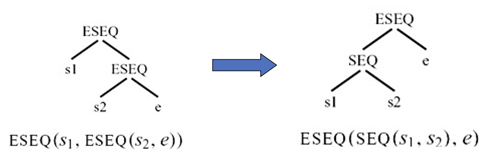
</div>

<div style="text-align: center">
    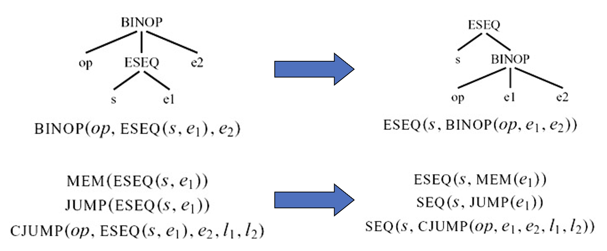
</div>

给定 `ESEQ(s, e)`：

- 提取 `s`
- 通过 `ESEQ` 或 `SEQ` 重写其父节点为 `s`

假设 `s = MOVE(MEM(x), y); e1 = MEM(x)`，为了保持求值顺序，我们必须将 `e1` 从带有 `s` 的 `BINOP` 中提取出来。具体做法为：

<div style="text-align: center">
    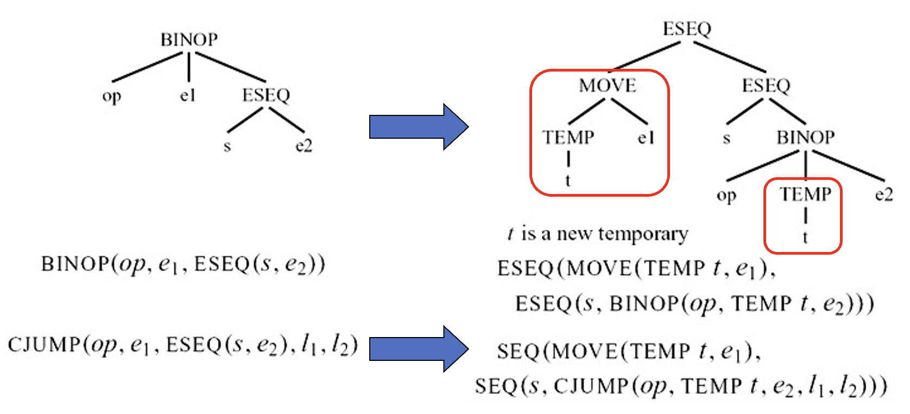
</div>

`s`, `e1` 可交换：如果 `s` 分配的临时变量和内存位置未被 `e1` 引用（且 `s` 和 `e1` 不同时执行外部 I/O）。

<div style="text-align: center">
    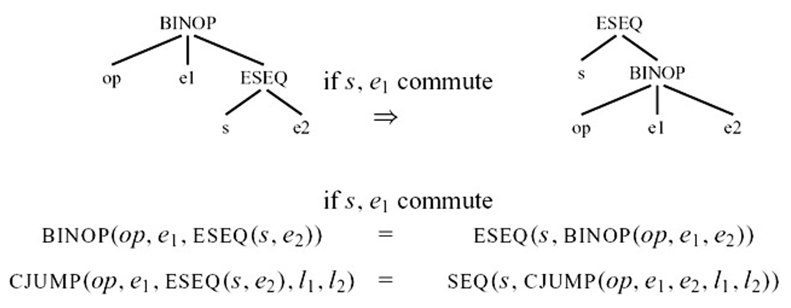
</div>

我们只能保守地近似判断语句是否可交换：`commute(s, e) = True` 表示 `s` 和 `e` 确定可交换，`False` 为不可交换。

- 常量（`CONST(i)`、`NAME(n)`）与任何语句可交换
- 空语句（例如 `EXP(CONST(i))`）与任何表达式可交换
- 其他情况均假定为不可交换

移除 `ESEQ(s, e)` 的转换：

- 提取 `s`
- 通过 `ESEQ`（如果其父节点是表达式）或 `SEQ`（如果其父节点是语句）重写其父节点

对于每种树语句或表达式，可以制定类似的规则，将 `ESEQ` 从语句或表达式中提取出来。给定一个 Tiger 程序（`T_stm`），我们可以递归地执行此转换，将所有的 `ESEQ` 在树中逐步提升，直到它们变成 `SEQ` 节点。

一般来说，对于每种树语句或表达式，我们都可以识别其子表达式，例如 `[e1, e2, ESEQ(s, e3)]`。重写是指提取语句中的“子表达式”，并更新语句或表达式的子表达式。

<div style="text-align: center">
    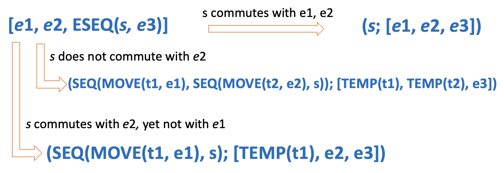
</div>

重写算法：

1. 为每种树语句或表达式制作一个子表达式提取方法：从子表达式中提取**语句**，并将每个子表达式转换为它的 **`ESEQ` 简化版**
2. 制作一个子表达式插入方法：使用每个**子表达式的 `ESEQ` 简化版**构建表达式或语句的新版本

???+ example "例子"

    处理 `CJUMP(<, CONST 343, MEM(ESEQ(sx, TEMP a), t, f))`

    - `CONST(343)`
        - => `s1 = EXP(CONST(0)), e1' = CONST(343)`
    - `MEM(ESEQ(sx, TEMP a))`：
        - 递归提升 `ESEQ`：`ESEQ(sx, MEM(TEMP a))`
        - => `s2 = sx, e2' = MEM(TEMP a)`
    - 更新子表达式：
        - 左 -> `e1' = CONST(343)`
        - 右 -> `e2' = MEM(TEMP a)`

    - 提取语句并返回：
        - `SEQ(s1,s2) = SEQ(EXP(CONST(0)), sx)`
        - 移除空语句 => `sx`
        - 由于 `commute(s2, e1') = True`，无需添加`MOVE`

    - 返回 `SEQ(sx, CJUMP(<, CONST 343, MEM(TEMP a), t, f))`


### Moving CALLs to Top Level

树语言允许将 `CALL` 节点用作子表达式。然而，每个函数将其结果返回到同一个专用的返回值寄存器 `TEMP(RV)` 中。

```
BINOP(PLUS, CALL(...), CALL(...))
```

第二个调用将在 `PLUS` 执行之前覆盖 `RV` 寄存器。解决方法是将每个返回值立即分配到一个新的临时寄存器中。

```
CALL(fun, args) -> 
    ESEQ(MOVE(TEMP t, CALL(fun, args)), TEMP t)
```

现在 `ESEQ` 消除器将把 `MOVE` 操作向上渗透到其包含的`BINOP`（等）表达式之外。


### Eliminating SEQs

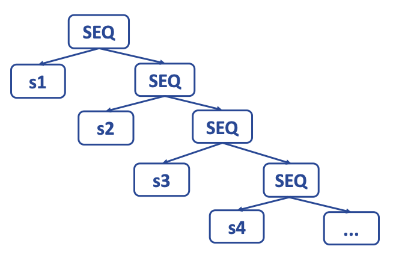{ align=right width=30% }

- 一旦整个函数体 `s0` 被处理完毕，结果会得到一个树状结构 `s0'`，其中所有的 `SEQ` 节点都靠近顶部
    - `SEQ(SEQ(SEQ(..., sx), sy), sz)`

- 线性化函数反复应用以下规则：`SEQ(SEQ(a, b), c) = SEQ(a, SEQ(b, c))`
- `s0'` 被线性化为如下形式的语句：`SEQ(s1, SEQ(s2, ..., SEQ(sn-1,sn)...))`，不提供任何结构化信息
- 我们可以将其视为一个简单的语句列表：`s1, s2, ..., sn-1, sn`，其中没有 `si` 包含 `SEQ` 或 `ESEQ` 节点


## Taming Conditional Branches

### Basic Blocks

- 在确定程序中跳转的目标位置时，我们正在分析程序的**控制流**
- **控制流**(control flow)是指程序中指令的执行顺序，不考虑寄存器和内存中的数据值，以及算术计算
- 在分析程序的控制流时，任何非跳转指令的行为都完全无关紧要，所以我们将任何**非分支指令**序列合并成一个**基本块**，并分析基本块之间的控制流
- **基本块**(basic block)：一段总是从开头进入、在末尾退出的语句序列
    - 第一条语句是 `LABEL`
    - 最后一条语句是 `JUMP` 或 `CJUMP`
    - 内部不包含其他 `LABEL`、`JUMP` 和 `CJUMP`

- 将长语句序列划分为基本块的算法如下：
    - 从头到尾扫描序列
    - 每当发现一个 `LABEL` 时，就开启一个新块（并结束前一个块）
    - 每当发现 `JUMP` 或 `CJUMP` 时，就结束一个块（并开启下一个块）
    - 如果某个块未以 `JUMP` 或 `CJUMP` 结尾，则在块末尾追加一条跳转到下一个块标签的 `JUMP` 指令
    - 如果某个块开头没有 `LABEL`，则生成一个新 `LABEL` 并置于开头

    <div style="text-align: center">
        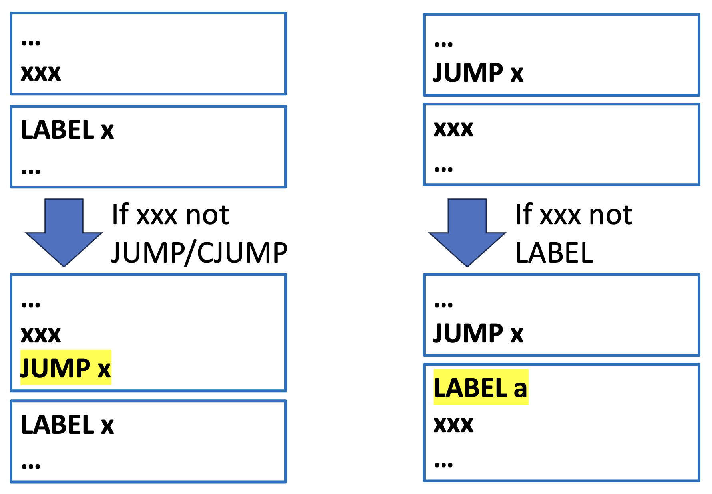
    </div>

???+ example "例子"

    <div style="text-align: center">
        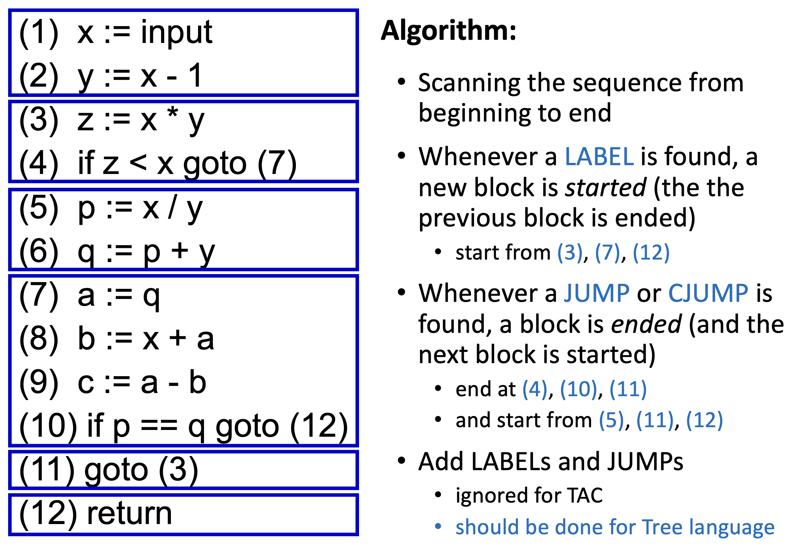
    </div>


### Traces

基本块可以按任意顺序排列，执行程序的结果仍然相同。

- 基于此，我们可以选择一种块排序方式，使得每个 `CJUMP` 后面紧跟着它的 `false` 标签
- 我们还可以安排让 `JUMP` 后紧跟着它们的目标标签，这样就能删除这些跳转，从而使编译后的程序运行得更快一些

**轨迹**(trace)是指在程序执行过程中可以连续执行的一系列语句，并且可以包含条件分支。

- 一个程序可以有许多不同的、重叠的轨迹
- 为了安排 `CJUMP` 和 `false` 标签，我们希望生成一组精确覆盖程序的轨迹：每个基本块必须恰好属于一个轨迹
- 我们希望覆盖集合中的轨迹数量尽可能少，以最小化从一个轨迹跳转到另一个轨迹所需的 `JUMP` 数量

寻找一个覆盖集的轨迹：

- 思路：从某个块开始，作为轨迹的开头，然后沿着一条可能的执行路径继续，即轨迹的剩余部分
- 假设块 `b1` 以跳转到 `b4` 结束，而 `b4` 又跳转到 `b6`，那么我们可以构建轨迹 `b1, b4, b6`

    <div style="text-align: center">
        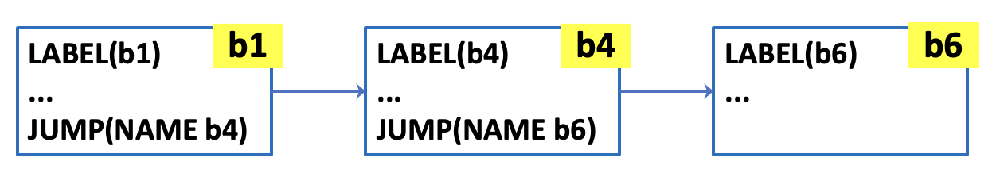
    </div>

- 假设 `b6` 以一个条件跳转 `CJUMP(cond, b7, b3)` 结束，我们将 `b3` 追加到当前轨迹中，并继续处理 `b3` 之后的轨迹部分；块 `b7` 将会被归入另一个轨迹中
    - 确保 `CJUMP(cond, lt, lf)` 后面紧跟着 `LABEL(lf)`

    <div style="text-align: center">
        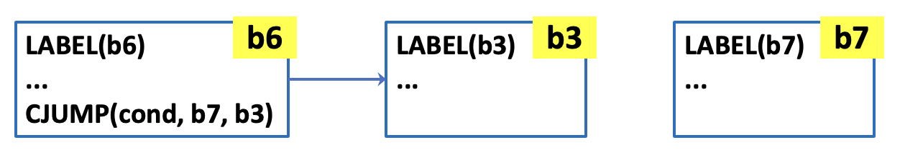
    </div>

<div style="text-align: center">
    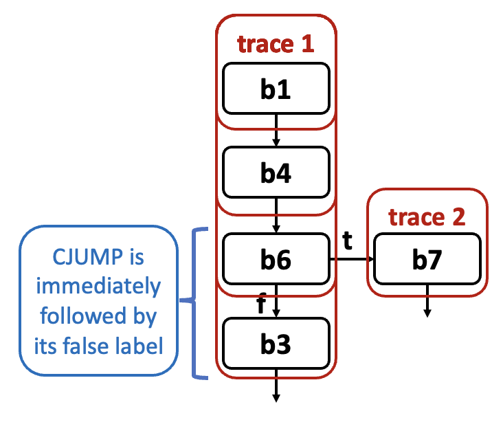
</div>

下面给出详细的轨迹生成算法（对控制流图进行 DFS）：

<div style="text-align: center">
    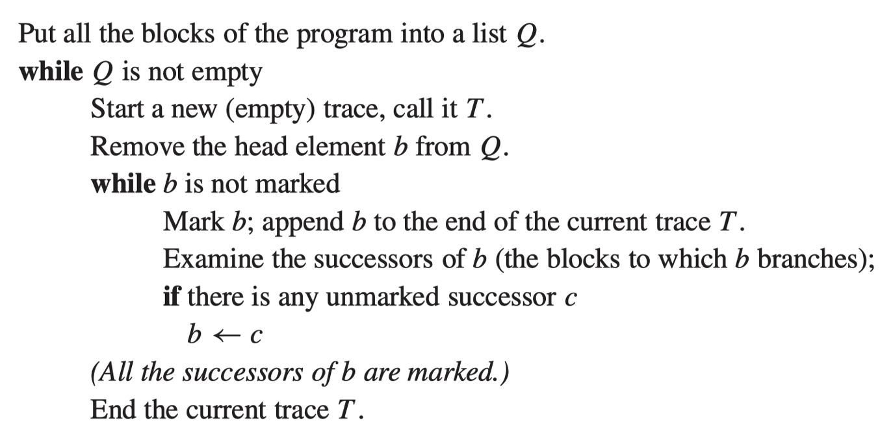
</div>

- 从某个块开始，沿着一系列跳转链前进
- 标记每个块并将其添加到当前轨迹中
- 最终到达一个其后继全部已被标记的块
- 结束当前轨迹，并选择一个未标记的块开始下一个轨迹

>注：通过上述算法生成的轨迹中，`CJUMP` 后可能不跟随其 `false` 标签

将有序的轨迹列表展平为一个长语句列表，然后进行一些微调：

- 对于任何紧跟 `false` 标签的 `CJUMP`，我们保留原样（这种情况会有很多）
- 对于任何紧跟 `true` 标签的 `CJUMP`，我们交换 `true` 标签和 `false` 标签，并取反条件
- 对于任何 `CJUMP(cond, a, b, lt, lf)` 后跟既不是 `true` 标签也不是 `false` 标签的情况，我们发明一个新的 `false` 标签 `lf'`，并将单个 `CJUMP` 语句重写为三个语句，以实现 `CJUMP` 紧跟 `false` 标签的条件

```
CJUMP(cond, a, b, lt, lf')
LABEL lf'
JUMP(NAME lf) 
```

任何**频繁执行的指令序列**（例如循环体）都应该占据自己的轨迹，这有助于**最小化无条件跳转的数量**和其他类型的优化，比如寄存器分配、指令调度等。

??? question "问题"

    === "题目"

        <div style="text-align: center">
            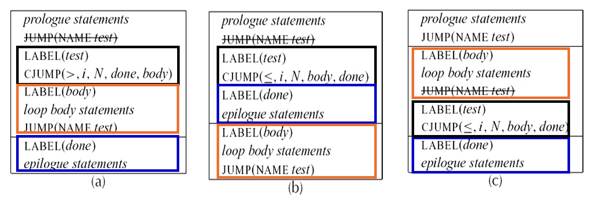
        </div>

        哪个更好？

    === "解答"