# Instruction Selection

??? abstract "核心知识"

    - 树模式
    - 全局/局部最优平铺
    - 指令选择算法
        - 最大匹配（局部最优，自顶向下）
        - 动态规划（全局最优，自底向上）
        - 树文法

    - CISC 机器
    - Tiger 编译器中的指令选择（了解即可）


## Overview

本讲的目标是将规范树转换为汇编语言。

<div style="text-align: center">
    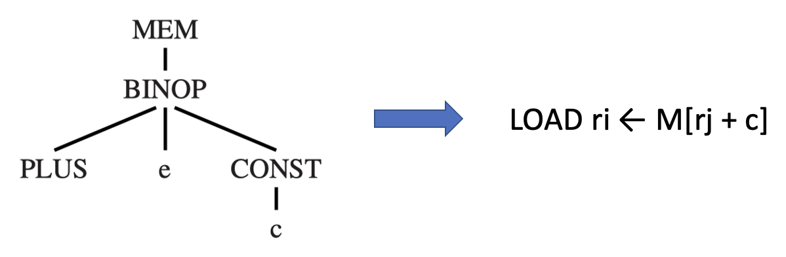
</div>

原因：

- 中间表示（树）语言在每个树节点中仅表达一个操作，比如取数、存储、加法、减法、条件跳转等
- 而真实的机器指令通常可以执行多个基本操作

**指令选择**(instruction selection)阶段：为给定的 IR 树寻找合适的机器指令来实现


### Tree Patterns

每条机器指令都可以表示为 IR 树的一个片段，称为**树模式**(tree pattern)。

<div style="text-align: center">
    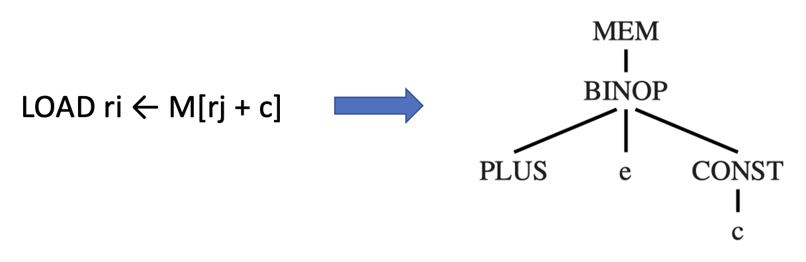
</div>

- **指令选择**：用一组最少的树模式覆盖整棵树的平铺过程
- **平铺**(tiling)：用互不重叠的树模式覆盖整棵树
- 为便于解释指令选择，我们设计了一个 Jouette 架构指令集
    
    >Jouette 在法语中意为“玩具”

    <div style="text-align: center">
        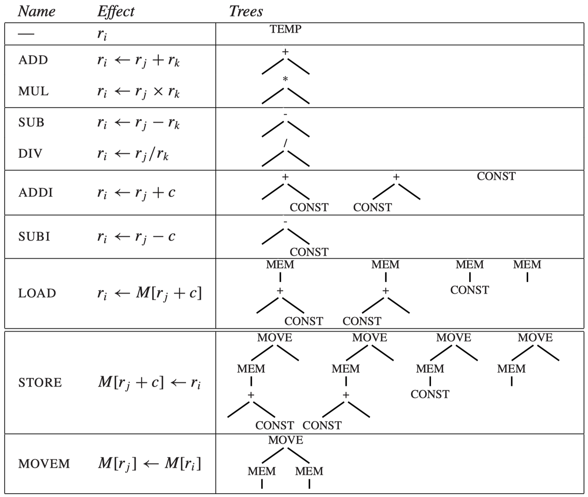
    </div>

    - `BINOP(PLUS, x, y) => +(x, y)`
    - `r0 = 0`
    - `c` 可以是 0
    - `CONST` 和 `TEMP` 节点的真实值并不总是展现出来

一些指令对应多个树模式，使用基于树的中间表示的指令选择的基本思想是**平铺** IR 树。其中**覆盖块**(tile)对应于合法机器指令的树模式集合。比如 `a[i] := x` 有以下两种平铺方式。

<div style="text-align: center">
    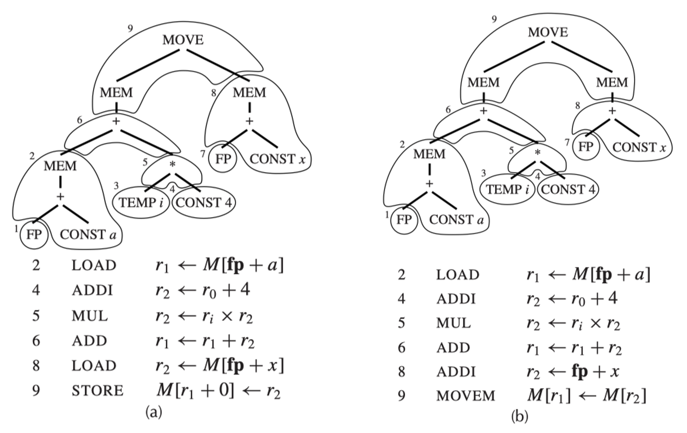
</div>

>覆盖块 1、3 和 7 不对应任何机器指令，因为它们只是寄存器（`TEMP`s）。

我们总是可以用小型平铺块来覆盖树，每个覆盖块只覆盖一个节点（除了 `MOVE`）。对于 `a[i] := x`，这样的覆盖看起来像：

<div style="text-align: center">
    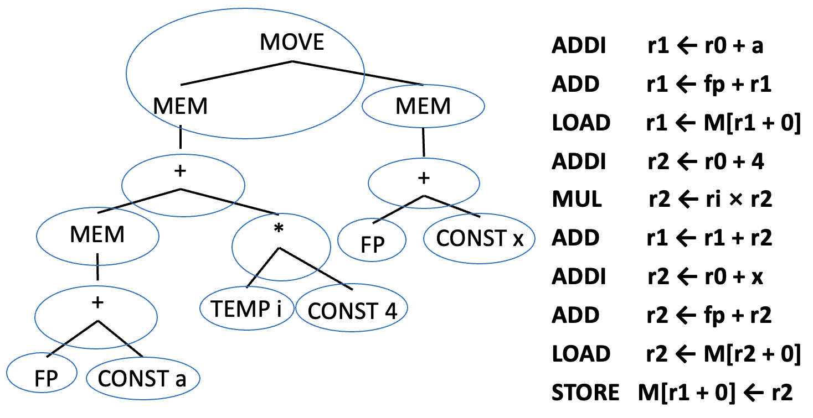
</div>


### Optimal and Optimum Tilings

- **最佳平铺**(best tiling)：
    - 成本最小的指令序列，即最短的指令序列  
    - 或者：如果指令执行时间不同，则总时间最小的成本最小序列

- （**全局**）**最优平铺**(optimum tiling)：平铺块的总和达到可能的最小值  
- （**局部**）**最优平铺**(optimal tiling)：不存在两个相邻平铺块可以合并成一个成本更低的平铺块
    - 如果某个树形模式可以拆分为多个平铺块，且这些平铺块的总成本更低，那么该模式应从平铺块目录(catalog)中移除

- 每个全局最优平铺都是局部最优的，但反之则不然

???+ example "例子"

    <div style="text-align: center">
        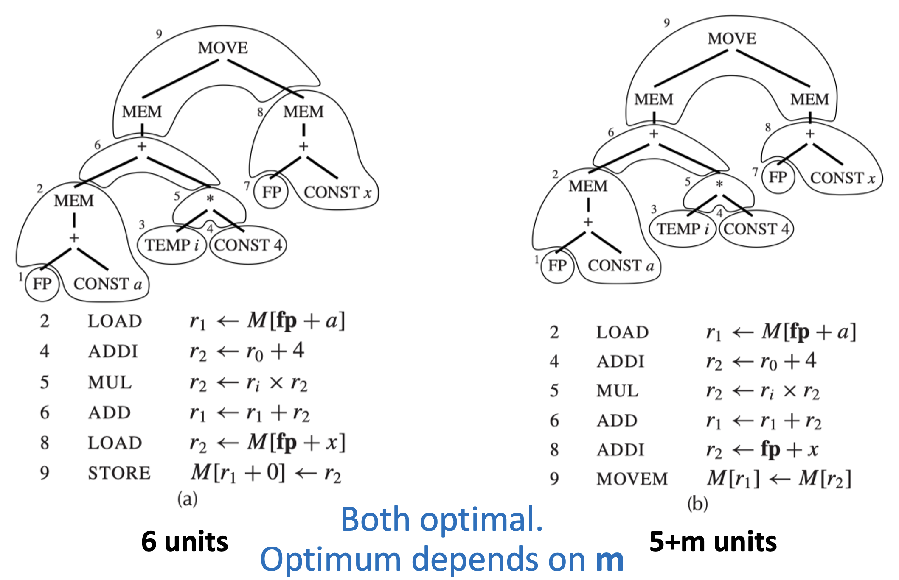
    </div>


## Algorithms for Instruction Selection

全局最佳平铺算法比局部最佳平铺算法简单。

- **CISC**：两者区别显而易见，有些指令能完成多个操作
- **RISC**：通常两者没有任何区别，因为覆盖块小，成本一致，因此对 RISC 来说简单的平铺算法就足够了


### Maximal Munch

**最大匹配**(maximal munch)是用于**局部最优**平铺的（贪心）算法。其主要思路为：

- 从树的根节点开始，找到能匹配的**最大覆盖块**（包含节点数最多的覆盖块）

    <div style="text-align: center">
        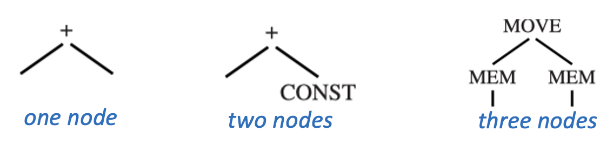
    </div>

- 用这个覆盖块覆盖根节点，可能还包括根节点附近的若干其他节点——留下若干子树
- 对每棵子树重复相同的算法
- 如果两个大小相等的覆盖块在根处匹配，则可从它们之间任选其一
- 该算法会按**相反顺序**来生成指令

实现过程为：

- 两个递归函数：`munchStm` 用于语句，`munchExp` 用于表达式
- 按照覆盖块偏好顺序进行解析（从最大的覆盖块开始）：

    <div style="text-align: center">
        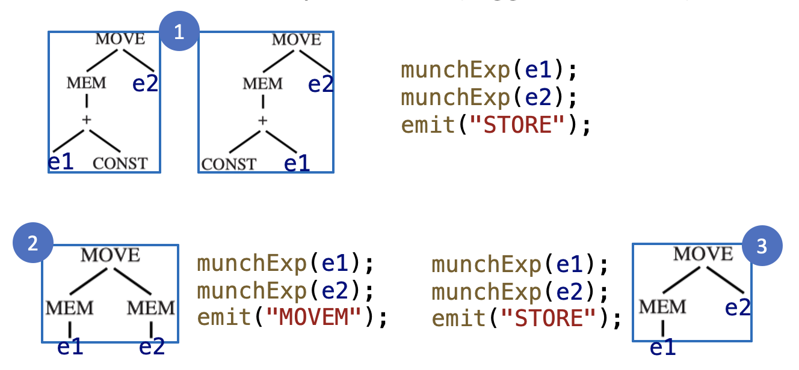
    </div>

    >指令的运算符之后再确定。

算法如下所示：

<div style="text-align: center">
    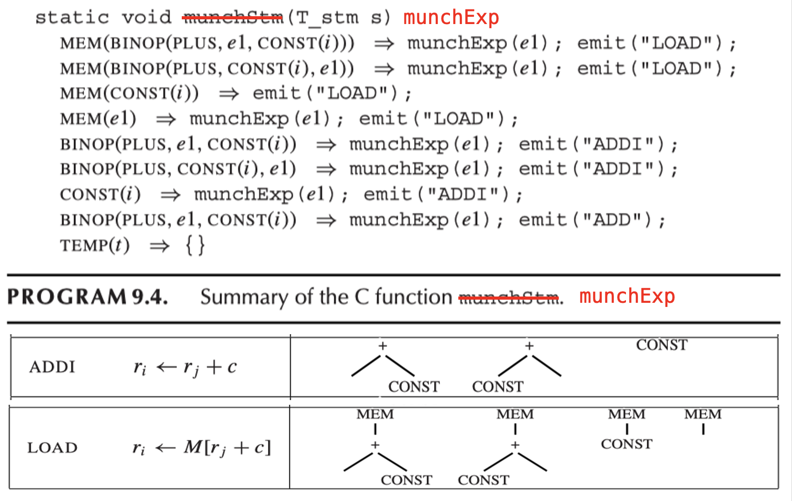
</div>


### Dynamic Programming

**动态规划**（DP）可以根据每个子问题的最优解找到**全局最优**解。

- **自底向上**（最大匹配是自顶向下的）
- 为树中的每个节点分配一个**成本**（能够铺满**以该节点为根的子树**的最佳指令序列的指令成本之和）

给定具有根节点 $n$ 的 IR 树

1. 递归地找到节点 $n$ 的所有子节点（以及孙子节点等）的成本
2. 将每个**树模式**（覆盖块类型）与节点 $n$ 进行匹配
3. 每个覆盖块有零个或多个叶子，这些是子树可以附加的位置
4. 对于在节点 $n$ 匹配的成本为 $c_t$ 的每个覆盖块 $t$，匹配覆盖块 $t$ 的成本是（$c_i$ 已经计算过）：

    $$
    c_t + \sum_{\text{all leaves } i \text{ of } t} c_i
    $$

5. 选择成本最小的树模式

???+ example "例子"

    === "Step 1"

        <div style="text-align: center">
            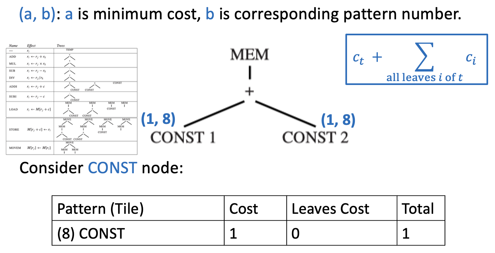
        </div>

    === "Step 2"

        <div style="text-align: center">
            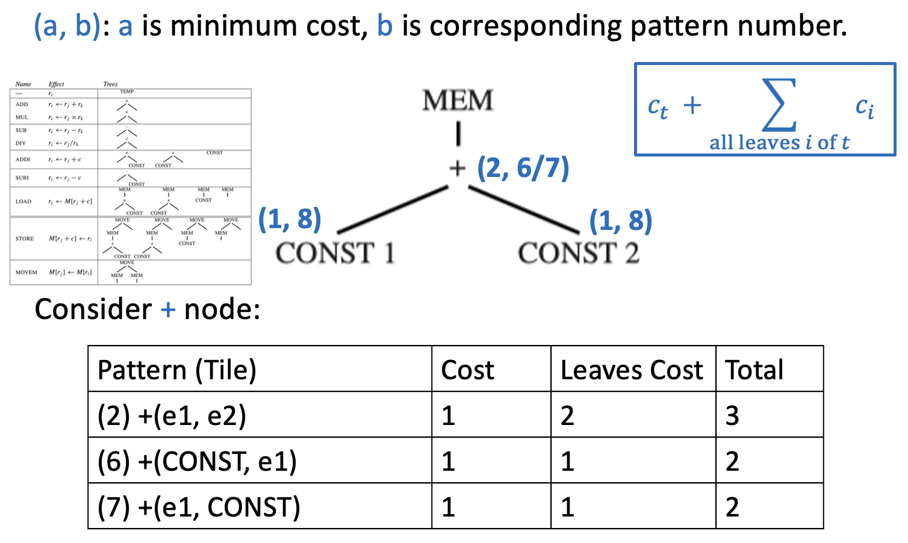
        </div>

    === "Step 3"

        <div style="text-align: center">
            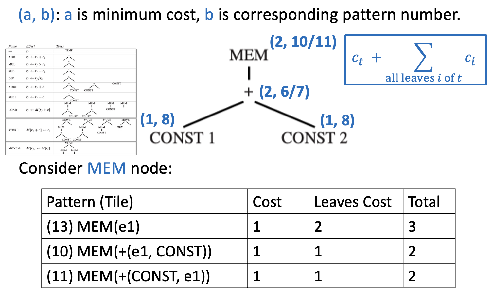
        </div>

一旦找到根节点（也就是整棵树的成本），**指令发射**(instruction emission)阶段便开始。算法如下（`Emission(node n)`）：

<div style="text-align: center">
    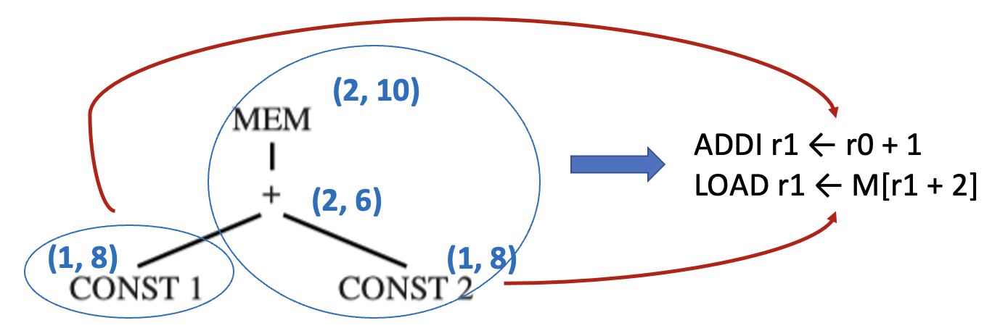
</div>

- 对于在节点 `n` 处匹配的覆盖块的每个叶子节点 `li`，执行 `Emission(li)`
- 发射在节点 `n` 处匹配的指令


### Tree Grammars

对于具有**复杂指令集**以及**多类寄存器和寻址模式**的机器，存在一种动态规划算法的有用推广。

<div style="text-align: center">
    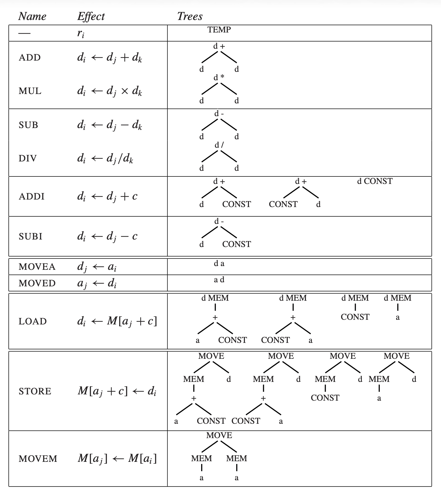
</div>

- 简化版的 Jouette：
    - $\sigma$ 寄存器用于寻址
    - $d$ 寄存器用于数据

- 每个覆盖块的根节点和叶节点必须标记为 $a$ 或 $d$
- DP 算法必须跟踪每个节点，将最小成本匹配作为 $a$ 寄存器和 $d$ 寄存器

使用 **CFG** 来描述覆盖块是很有用的，它包含非终结符：

- $s$：表示语句
- $a$：表示计算到 $a$ 寄存器中的表达式
- $d$：表示计算到 $d$ 寄存器中的表达式

`LOAD`、`MOVEA` 和 `MOVED` 指令的文法规则可能如下所示：

<div style="text-align: center">
    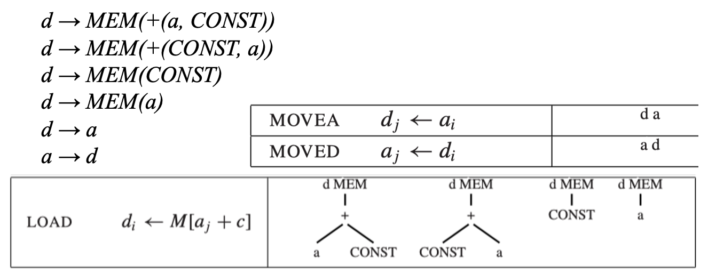
</div>

- 这样的语法很有歧义性，因为存在许多不同的指令序列来实现同一个表达式
- 第 3 章中描述的语法分析技术的实用价值有限
- 但 DP 算法的一种通用化扩展效果相当好，即为**文法中的每个非终结符**，在每个节点计算最小成本匹配


### Fast Matching

最大匹配和动态规划算法检查所有与节点匹配的覆盖块。

- 若覆盖块的每个非叶节点都标记了与树中相应节点相同的运算符（`MEM`、`CONST` 等），那么该覆盖块匹配
- 为了匹配树中节点 `n` 的覆盖块，可以在 `n` 的标签中使用 `case` 语句（即决策树）：

    ```py
    match(n) {
        switch (label(n)) {
            case MEM: ...
            case BINOP: ...
            case CONST: ...
        }
    }
    ```

- 目标：IR 树中的每个节点不会被检查两次


### Efficiency of Tiling Algorithms

假设：

- T：不同覆盖块的数量  
- K：平均每个匹配覆盖块包含 K 个非叶节点  
- K'：在给定子树中，为了确定哪些覆盖块匹配而需要检查的最大节点数
- T'：在每个树节点上匹配的平均不同模式（覆盖块）数量
- N：输入树中的节点数

MM 和 DP 的成本分别为：

- 最大匹配（MM）：与 (K' + T') * N / K 成正比  
- 动态规划（DP）：与 (K' + T') * N 成正比  

由于 K、K' 和 T' 均为常数，这些算法的运行时间都是**线性的**。


## CISC Machines

???+ abstract "RISC vs CISC"

    | RISC 机器 | CISC 机器 |
    |----------|----------|
    | 32 个寄存器 | 少量寄存器（16 个，或 8 个，或 6 个） |
    | 只有一类整数/指针寄存器 | 寄存器划分为不同的类别，某些操作只能在特定的寄存器上进行； |
    | 算术运算只能在寄存器之间进行 | 算术运算可以通过“寻址方式”访问寄存器或内存； |
    | “三地址”格式的指令 $r_1 \leftarrow r_2 \oplus r_3$ | “二地址”格式的指令 $r_1 \leftarrow r_1 \oplus r_2$； |
    | 只具有 $M[\text{寄存器}+\text{常数}]$ 寻址方式的加载和存储指令 | 具有多种不同的寻址方式； |
    | 每条指令长度固定为 32 位 | 可变长指令，由可变长操作码加上可变长的寻址方式组成； |
    | 每条指令只产生一个结果或效果 | 具有副作用的指令，例如“自动递增”寻址方式。 |

CISC 的问题和解决方案：

- **寄存器不足**：
    - 解决方案：自由生成 `TEMP` 节点，并假设寄存器分配器能做好工作
- **寄存器的分类**：
    - Pentium 上的乘法运算：左操作数必须是 `eax`，结果的高位放入 `edx`（低位放在 `eax` 中），但高位对于 Tiger 程序来说是无用的
    - 解决方案：显式移动操作数和结果
    - 示例：要实现 t1 <- t2 * t3：

        ```asm
        mov eax, t2    // eax <- t2
        mul t3         // eax <- eax * t3; edx <- garbage (useless to Tiger)
        mov t1, eax    // t1 <- eax
        ```

- **双地址指令**：
    - 目标寄存器必须与第一个源寄存器相同
    - 解决方案：添加额外的移动指令
    - 示例：要实现 t1 <- t2 + t3，我们希望寄存器分配器能够将 t1 和 t2 分配到同一个寄存器，从而删除 `move` 指令

        ```asm
        mov t1,t2      // t1 <- t2
        add t1, t3     // t1 <- t1 + t3
        ```

- **算术运算可以访问内存**：
    - 指令选择阶段会将每个 `TEMP` 节点转化为寄存器引用，而实际上许多这样的寄存器最终会成为内存位置
    - 解决方案：在操作之前将所有操作数取出到寄存器中，操作之后再将其存回内存
    - 示例：以下两个序列计算结果相同：

        <div class="grid" markdown>

        ```asm
        mov eax, [ebp - 8]
        add eax, ecx
        mov [ebp - 8], eax
        ```

        ```asm
        add [ebp - 8], ecx
        ```

        </div>

        - 右边的序列更简洁，但两个序列的速度同样快
        - 左边的序列有一个显著缺点：它会破坏寄存器 `eax` 中的值

- 几种**寻址模式**：
    - 一种能够完成六项任务的寻址模式通常需要执行六个步骤，这意味着速度并不快
    - 但有两个优点：
        - 占用更少的寄存器
        - 更短的指令编码

    - 经过一定处理后，基于树匹配的指令选择机制可以选出 CISC 的指令，但使用类似 RISC 的简单指令同样能达到相同的执行速度

- **可变长度指令**：
    - 对于编译器来说并不是问题
    - 一旦指令被选定，汇编器只需将指令编码输出，这是一个琐碎的任务

- 带有**副作用**的指令：
    - 问题：某些机器具有自增内存取指令，其效果为：

        ```
        r2 <- M[r1];  r1 <- r1 + 4
        ```

    - 难以使用树模式进行建模，因为它会**产生两个结果**
    - 有三种解决方案：
        - **忽略**自增指令，希望它们会消失
        - 在树模式匹配代码生成器的上下文中，以临**时**(ad hoc)**方式**尝试匹配特殊惯用法(idioms)
        - 完全采用不同的指令算法，一种基于 **DAG 模式**（参见龙书）而非树模式的算法


## Instruction Selection for the Tiger Compiler

在由指令模式平铺的树中，每个平铺的根节点将对应于寄存器中保存的某个中间结果。**寄存器分配**(register allocation)的任务是给这些节点分配寄存器编号。

- 很多方面与特定目标机器的指令集无关
- 应在指令选择之前或之后进行：
    - 在指令选择之前：甚至不知道哪些树节点需要寄存器来保存其结果，因为只有平铺的根节点（而非平铺内的其他标记节点）需要显式寄存器，因此无法准确完成
    - 因此我们将在指令选择**之后**进行寄存器分配


### Abstract Assembly Language Instructions

```c
typedef struct {Temp_labelList labels;} *AS_targets;

typedef struct { 
  enum {I_OPER, I_LABEL, I_MOVE} kind;
  union {
    struct {string assem; Temp_tempList dst, src; AS_targets jumps;} OPER;
    struct {string assem; Temp_label label;} LABEL;
    struct {string assem; Temp_tempList dst, src;} MOVE; 
  } u; 
} *AS_instr;

void AS_print(FILE *out, AS_instr i, Temp_map m);
```

- `OPER` 包含：
    - `assem`：一条汇编语言指令
    - `src`：操作数寄存器列表（可能为空）
    - `dst`：结果寄存器列表列表（可能为空）
    - `jumps`：可能跳转到的目标标签列表
    - 总是顺序执行到下一条指令的操作的 `jumps` 值为`NULL`

- `LABEL`：程序中跳转可以到达的一个点
    - `assem`：标签在汇编语言程序中的显示方式
    - `label`：使用了哪个标签符号

- `MOVE`：类似于 `OPER`，但必须仅执行数据传输
- `AS_print(f, i, m)`：将汇编指令 `i` 格式化为字符串并打印到文件 `f`
    - `m`：临时变量映射，指示每个临时变量的寄存器分配

- `Temp_map`：一个键为 `Temp_temps`、值为**字符串**的表
    - 一个映射可以覆盖另一个映射
    - 如果 `σ3 = layerMap(σ1, σ2)`，这意味着 `look(σ3, t)` 将首先尝试 `look(σ1, t)`，如果失败，则尝试 `look(σ2, t)`
    - 这些 `Temp_map` 操作的主要用户为**寄存器分配器**


### Machine-Independence

`AS_instr `类型与所选目标机汇编语言无关。下面使用 Jouette 汇编语言进行说明。

<div style="text-align: center">
    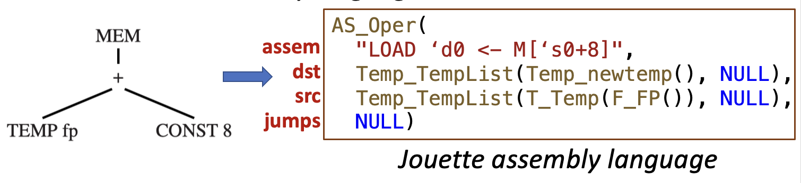
</div>

- 实际的 Jouette 汇编语言，在寄存器分配后可能如下所示：

    ```
    LOAD r1 <- M[r27+8]
    ```

- `Assem` 指令不了解寄存器分配，它将第一个源寄存器称为 `` `s0 ``，将目标寄存器称为 `` `d0 ``

另一个例子：

<div style="text-align: center">
    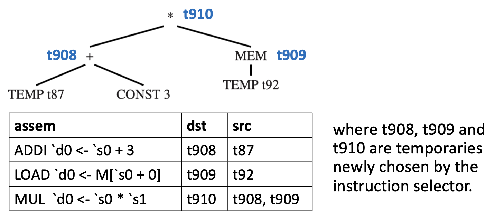
</div>

注册分配之后，汇编语言可能看起来像这样：

```
ADDI     r1 <- r12 + 3
LOAD     r2 <- M[r13+0]
MUL      r1 <- r1 * r2
```


### Two-Address Instructions

有些机器的算术指令有两个操作数，其中一个操作数既是源又是目标。例如，指令 `add t1, t2`，其效果为 `t1 <- t1 + t2`，可以描述为：

| assem          | dst | src   |
|----------------|-----|--------|
| ``add `d0, `s1`` | t1  | t1, t2 |

其中 `s0` 在汇编字符串中被隐式提及，但未显式提及。


### Producing Assembly Instructions

函数 `munchStm` 和 `munchExp` 将自底向上地地产生汇编指令，作为副作用。`munchExp` 返回保存结果的临时变量。

```c
static Temp_temp munchExp(T_exp e);

switch(e)   //switch tree tiles
  case MEM(BINOP(PLUS,e1,CONST (i))): { 
    Temp_temp r = Temp_newtemp(); //generate a new reg. name
    emit(AS_Oper(“LOAD ‘d0 <- M[‘s0+” + i + “]\n”, L(r,NULL), 
        L(munchExp(e1),NULL), NULL))
   //generate instruction text, dst reg. list, src reg. list

static void munchStm(T_stm s);

case MOVE(MEM(BINOP(PLUS,e1,CONST(i))),e2): //switch tiles
        emit(AS_Oper(“STORE M[‘s0+” + i + “] <- ‘s1\n”, NULL, 
            L(munchExp(e1), L(munchExp(e2), NULL)), NULL));
    //almost same as munchExp, but no new reg. 
```

```c
/* codegen.c */ 
...
static AS_instrList iList=NULL, last=NULL; 
static void emit(AS_instr inst) { 
  if (last!=NULL) 
    last = last->tail = AS_InstrList(inst,NULL); 
  else 
    last = iList = AS_InstrList(inst,NULL); 
}
```

`emit` 函数只是累积一个稍后返回的指令列表。


### Procedure Calls

- 过程调用：`EXP(CALL(f, args))`
- 函数调用：`MOVE(TEMP t, CALL(f, args))`

这些树可以匹配诸如这样的覆盖块：

```c
case EXP(CALL(e,args)) {
  Temp_temp r = munchExp(e); 
  Temp_tempList l = munchArgs(0,args);
  emit(AS_Oper(“CALL ‘s0\n”, calldefs, L(r,l), NULL));}
```

- `munchArgs` 生成代码，将所有参数移至正确位置（寄存器或内存中）
    - `munchArgs` 的整数参数 `i` 表示第 `i` 个参数
    - `munchArgs` 将对下一个参数递归调用 `i+1`，以此类推

- `CALL` 指令预期会破坏某些寄存器（调用者保存的寄存器、返回地址寄存器、返回值寄存器），这些被破坏的寄存器列表应作为 `CALL` 的目标列出
- 通常，任何具有写入其他寄存器副作用的指令都需要进行此处理


### Frame Pointer

在每次过程调用时，使用帧指针：

- 栈指针寄存器被复制到帧指针寄存器
- 栈指针按新帧的大小增加

虚拟帧指针

- 节省时间（无需复制指令）和空间（多一个寄存器可用于其他目的）
- 代码生成函数必须将对 `FP + k` 的任何引用替换为 `SP + k + fs`，其中 `fs` 是帧大小