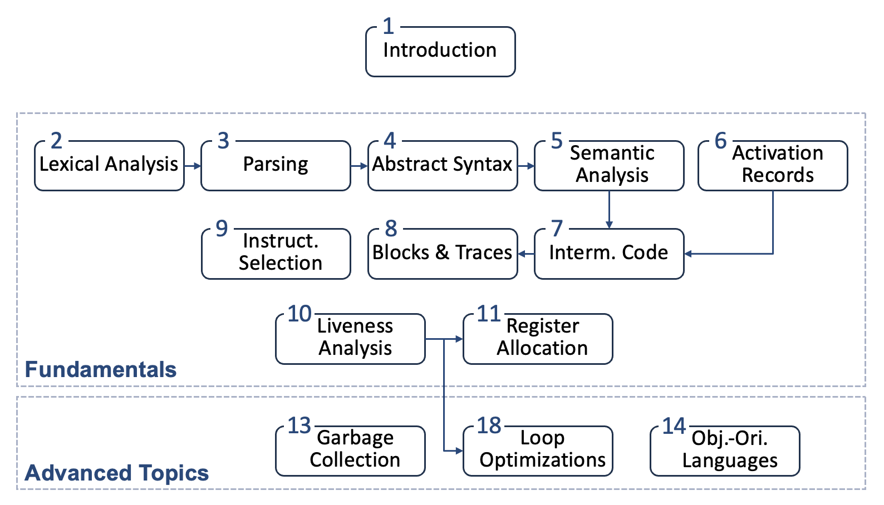

# 编译原理

!!! info "课程信息"

    - 学分：4.0
    - 教师：陈明帅
    - 教材：*Modern Compiler Implementation in C*, Andrew W. Appel（虎书）
        >之所以叫虎书，不仅因为书的封面有只老虎，还因为书里实现的小编译器就叫做 Tiger。

!!! abstract "目录"
    
    - Fundamentals
        - [x] [Introduction](1.md)
        - [x] [Lexical Analysis](2.md)
        - [x] [Parsing](3.md)
        - [x] [Abstract Syntax](4.md)
        - [x] [Semantic Analysis](5.md)
        - [x] [Activation Records](6.md)
        - [x] [Translation to Intermediate Code](7.md)
        - [x] [Basic Blocks and Traces](8.md)
        - [x] [Instruction Selection](9.md)
        - [x] [Liveness Analysis](10.md)
        - [x] [Register Allocation](11.md)
    - Advanced Topics
        - [x] [Garbage Collection](13.md)
        - [x] [Object-Oriented Languages](14.md)
        - [x] [Loop Optimizations](18.md)

    ??? abstract "各章内容关系图"

        

            
        

!!! recommend "参考资料"

    - cms 的课件
    - 教材：
        - 虎书
        - Engineering a Compiler
        - 龙书（CS143 参考教材）

    - [Stanford CS143](http://web.stanford.edu/class/cs143/)：笔记中稍微插入了一些课堂上没讲，但这里讲解较多的内容作为补充，但还是以虎书为主（当前还是从功利角度考虑）
    - 笔记：
        - [咸鱼暄前辈的笔记](https://xuan-insr.github.io/compile_principle/)：讲得很细👍；但由于讲解顺序更贴合 CS143 的授课顺序，更适合平时细嚼慢咽
        - [CubicY 前辈的速通笔记](https://cubicy.icu/compiler-construction-principles/)：建议期末复习时再看，便于抓重点
        - [Howjul 前辈的笔记](https://www.yuque.com/howjul/rt9ms6/qyhhptbubm5spvta)
        - [25cp-note](https://compiler-note-7908cb.pages.zjusct.io/)（不知道是谁写的，需校内网访问）
        - [Tian42Chen 前辈的笔记](https://github.com/Tian42chen/Transcription-Malfunctioned/blob/main/_Finalized_Notes/CP.pdf)

    - [今年的实验文档](https://compiler.pages.zjusct.io/sp26/#_6)
    - 学习经验：
        - [如何通过基于虎书的编译原理课程——从助教的视角](https://www.cc98.org/topic/5641876)（98 帖子，需内网访问）：很好的学习指引！