# The Microprocessor and its Architecture

## Internal Microprocessor Architecture

在编写程序或调查指令前，必须要知道微处理器的内部配置。在一个多核微处理器中，每个核包含了相同的编程模型，并且同时运行一个独立的任务或线程。编程模型可分为：

- 8086 到 Core2 的处理器都被视为**程序可见的**(program visible)
    - 寄存器用于编程中，并且由指令指明
- 其他寄存器都被视为**程序不可见的**(program invisible)
    - 在应用程序编程期间无法直接寻址
  
=== "IA-32 基础执行环境"

    

        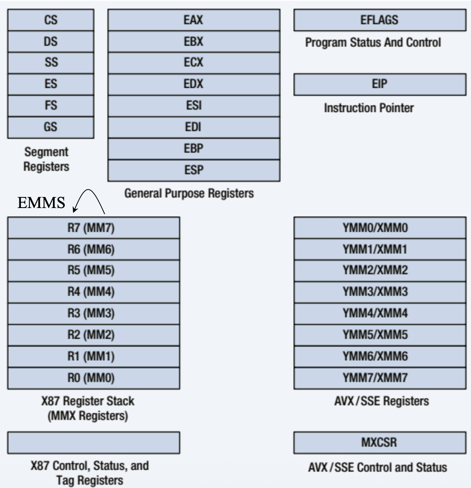
    

=== "64 位模式执行环境"

    

        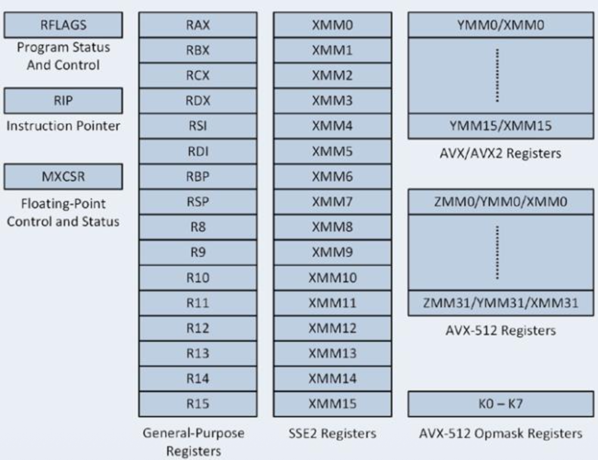
    

应用程序寄存器和栈：

    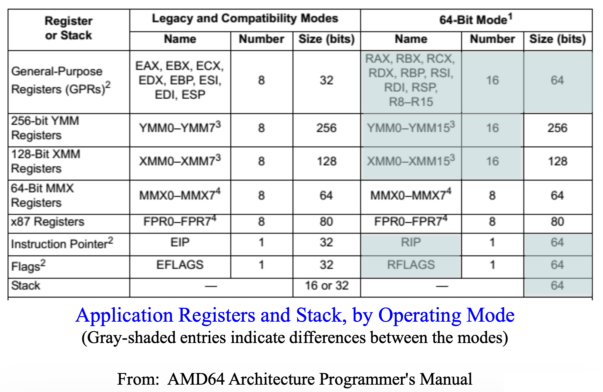

### General-Purpose Registers

??? abstract "总结"

    >注：如果是初学汇编语言的话，建议先往下阅读，最后复习的时候再来看这张表会更有感觉。

    

        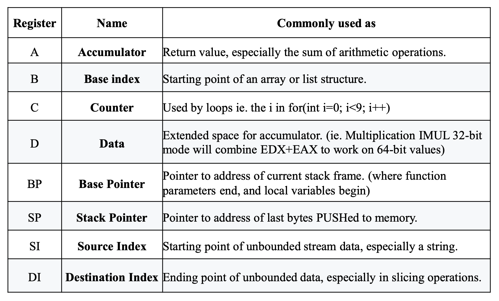
    

- **RAX**
    - 包括了一个 64 位的寄存器（`RAX`），一个 32 位的寄存器（`EAX`，又称为**累加器**(accumulator)），一个 16 位的寄存器（`AX`），两个 8 位的寄存器（`AH`, `AL`）

        <figure style=" width: 50%" markdown="span">
            
            
            <figcaption></figcaption>
        </figure>

    - 在汇编语言中，**部分寄存器**(partial registers)指的是仅代表更大寄存器一部分的寄存器。这一概念尤其在 x86 汇编中具有重要意义，其中某些寄存器可以根据架构以不同大小（8位、16位、32位和64位）进行访问
    - 累加器用于乘法、除法以及一些调整指令等指令

        

            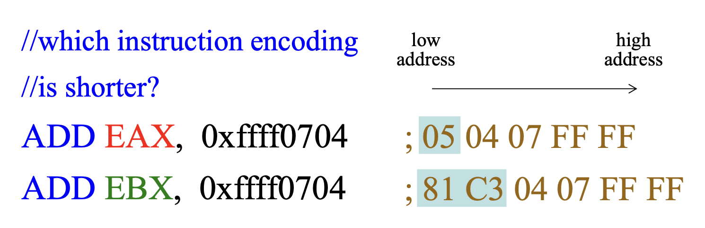
        

        - 在 `ADD` 指令中使用 `EAX` 相比使用其他寄存器少 1 字节，因此它具有更高的代码密度，并且更对高速缓存更友好(cache-friendly)

- **RBX**
    - 类似 `RAX`，可寻址为 `RBX`, `EBX`, `BX`, `BH`, `BL`
    - 在所有版本的微处理器中，`BX` 寄存器（**基址索引**(base index)）有时持有内存系统中某个位置的偏移地址
  
- **RCX**
    - 类似 `RAX`，可寻址为 `RCX`, `ECX`, `CX`, `CH`, `CL`
    - 一个（**计数**(count)）通用寄存器，也用于存放各种指令的计数值
  
- **RDX**
    - 类似 `RAX`，可寻址为 `RDX`, `EDX`, `DX`, `DH`, `DL`
    - 一个（**数据**(data)）通用寄存器
    - 包含乘法结果（**积**）的一部分，或除法前**被除数**的一部分

        

            
        

- **RBP**
    - 可寻址为 `RBP`, `EBP` 或 `BP`
    - 基指针，指向**当前栈帧(stack frame)的基址**

- **RSI**
    - 可寻址为 `RSI`, `ESI` 或 `SI`
    - （**源索引**(source index)）为字符串指令寻址源字符串数据

- **RDI**
    - 可寻址为 `RDI`, `EDI` 或 `DI`
    - （**目标索引**(destination index)）为字符串指令寻址目标字符串数据

- 低 8 位寄存器 `BPL`、`SPL`、`SIL` 和 `DIL` 仅在 64 位模式下可被寻址
- **R8 - R15** 在启用 64 位扩展的奔腾 4 和酷睿 2 处理器中出现。对于大多数指令，访问这些扩展通用寄存器需要一个 `REX` 前缀
- 在 64 位模式下，通用目的寄存器包括：
    - 16 个 8 位低字节寄存器：`AL`, `BL`, `CL`, `DL`, `SIL`, `DIL`, `BPL`, `SPL`, `R8B`-`R15B`
    - 4 个 8 位高字节寄存器：`AH`, `BH`, `CH`, `DH`，且仅当没有 **`REX` 前缀**时才可寻址
    - 16 个 16 位低字节寄存器：`AX`, `BX`, `CX`, `DX`, `DI`, `SI`, `BP`, `SP`, `R8W`-`R15W`
    - 16 个 32 位低字节寄存器：`EAX`, `EBX`, `ECX`, `EDX`, `EDI`, `ESI`, `EBP`, `ESP`, `R8D`-`R15D`
    - 16 个 64 位低字节寄存器：`RAX`, `RBX`, `RCX`, `RDX`, `RDI`, `RSI`, `RBP`, `RSP`, `R8`-`R15`
  
- 不难发现，大多数种类的 x86 寄存器可以通过多种粒度(multiple granularities)访问
- 注意：修改 32 位**部分寄存器**会将寄存器的其余部分（第 32-63 维）设置为0，但修改 8 位或 16 位部分寄存器不会影响寄存器的其余部分

    ???+ example "例子"

        

            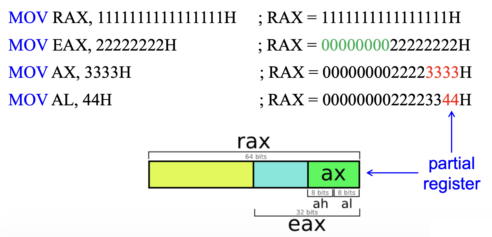
        

- Intel, AMD, VIA（威盛）CPU 都无法对部分寄存器重命名

    ???+ example "例子"

        

            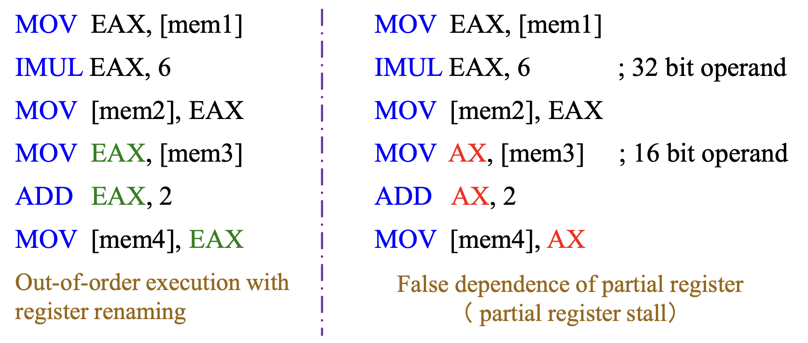
        

        - `#!asm MOV AX [mem3]` 指令必须等待 `#!asm IMUL` 指令完成
  
- 任何使用高 8 位寄存器 `AH`、`BH`、`CH`、`DH` 的操作都应避免，因为它可能导致错误的依赖性以及效率较低的代码

### Special-Purpose Registers

**特殊目的寄存器**(special-purpose registers)包括：RIP, RSP, RFLAGS，以及段寄存器 CS, DS, ES, SS, FS 和 GS。

- **RIP**：
    - 指向内存中下一段指令的地址
    - 定义为（**指令指针**(instruction pointer)）一个代码段(code segment)

- **RSP**：
    - 指向一个称为栈的内存区域
    - （**栈指针**(stack pointer)）通过此指针存储数据

- **RFLAGS**：表示微处理器的状态，并控制其操作
    - 下图展示了所有版本微处理器的标志寄存器：

        

            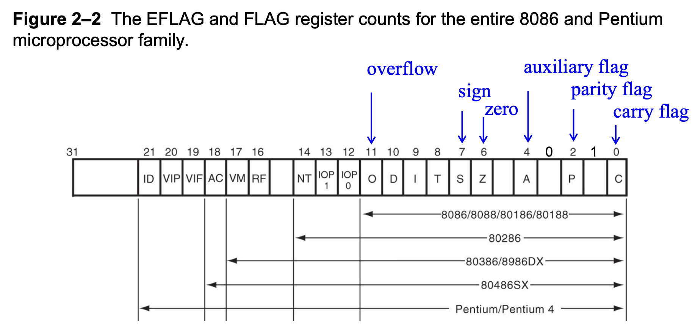
        

    - 从 8086/8088 到酷睿 2，标志位是向上兼容的
    - 最右侧的五位和溢出标志在大多数算术和逻辑运算中被改变
        - 但数据传输不会影响这些标志位
    - 实际上任何标志位都不会为数据传输和程序控制操作所改变
    - 一些标志也用于控制微处理器中的功能
    - 状态标志：
        - **C**（第 0 位）：进位标志，保存加法后的进位或减法后的借位
        - **Z**（第 6 位）：零标志，表示算术或逻辑运算的结果为零
        - **S**（第 7 位）：符号标志，保存了算术或逻辑指令执行后结果的算术符号
        - **O**（第 11 位）：溢出标志，用于有符号数进行加减运算
            - 溢出表示结果超出机器能表示的范围

        ??? example "例子"

            

                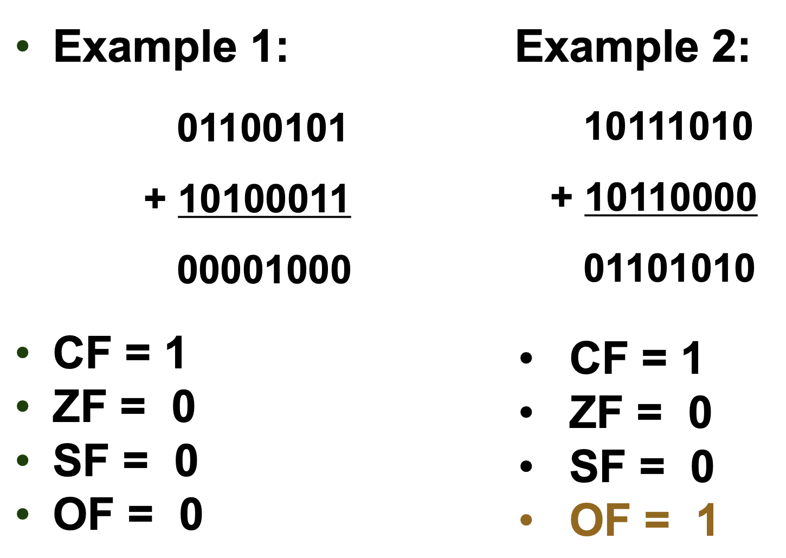
            

        - **P**（第 2 位）：如果结果的**最低有效字节**(least significant byte)包含偶数个 1，则设置奇偶标志；否则清除（偶校验 `PF` = 1；奇校验 `PF` = 0）。
  
        - **A**（第 4 位）：辅助进位位，保存加法后的进位（半进位(half-carry)）或 BCD 数运算后结果中第 3 和第 4 位之间的借位

            ??? example "例子"

                

                    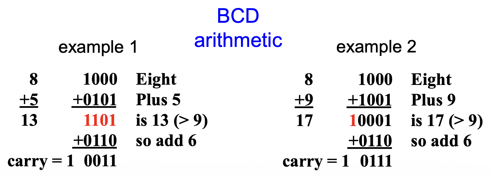
                

                

                    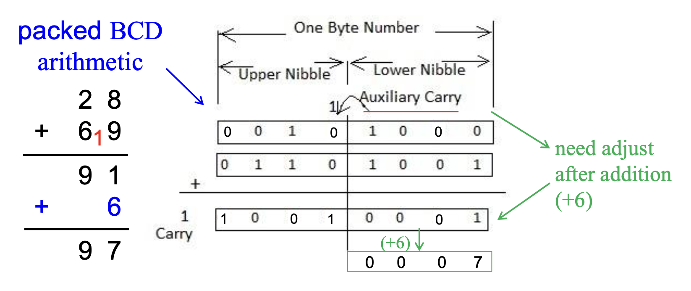
                

    - **D**（方向(direction)）：选择 `DI` 和/或 `SI` 寄存器的递增或递减模式

    - 系统标志：
        - **T**（陷阱(trap)）：陷阱标志通过片上调试(on-chip debugging)功能启用捕获
        - **I**（终端(interrupt)）：控制 INTR（中断请求）输入引脚的操作
        - **VM**（虚拟模式(virtual mode)）：在保护模式系统中选择虚拟模式操作
        - **IOPL**：用于保护模式操作中，为 I/O 设备选择特权级别
        - **NT**（嵌套任务(nested task)）：表示当前任务在保护模式操作中嵌套于另一个任务内
        - **AC**（对齐检查(alignment check)）：如果字或双字在非字或非双字边界上被寻址，则标志位激活
        - **RF**（继续(resume)）：用于调试，控制在下一条指令后恢复执行
        - **ID**（识别(identification)）：指示奔腾微处理器支持 `CPUID` 指令
            - `CPUID` 指令为系统提供有关奔腾微处理器的信息

        - **VIF**：奔腾 4 处理器的中断标志位的拷贝（**虚拟中断**(virtual interrupt)）
        - **VIP**（虚拟(virtual)）：提供关于奔腾处理器的虚拟模式中断（**中断挂起**(interrupt pending)）信息
            - 用于多任务环境中，以提供虚拟中断标志

???+ note "早期 IA-32 处理器的识别"

    - 在早期的 IA-32 处理器直至 486 之前的型号中，`CPUID` 指令不可用
    - `RFLAGS` 中的若干架构特性可用于识别处理器
    - 对于 32 位处理器，相比 8086 及 286 处理器，第 12 和 13 位（`IOPL`）、第 14 位（`NT`）以及第 15 位（保留）的设置有所不同
    - 通过检查这些位的设置（使用 `PUSHF`/`PUSHFD` 和 `POPF`/`POPFD` 指令），应用程序可以判断出该处理器是 8086、286 还是 32 位处理器

### Segment Registers

- **CS**（代码(code)）段存放微处理器使用的代码（程序(program)和过程(procedure)）
- **DS**（数据(data)）包含程序使用的大部分数据
    - 通过偏移地址或保存偏移地址的其他寄存器的内容来访问数据
- **ES**（附加(extra)）是一个额外的数据段，某些指令用它来存放目标数据
- **SS**（栈(stack)）定义了用于栈的内存区域
    - 栈入口点由栈段和栈指针寄存器决定
    - `BP` 寄存器也在栈段内寻址数据
- **FS** 和 **GS** 段是 80386 至酷睿 2 微处理器中可用的补充段寄存器
    - 允许程序访问两个额外的内存段
    - 这些段用于与操作系统相关的功能
    - Windows 利用这些段进行内部操作

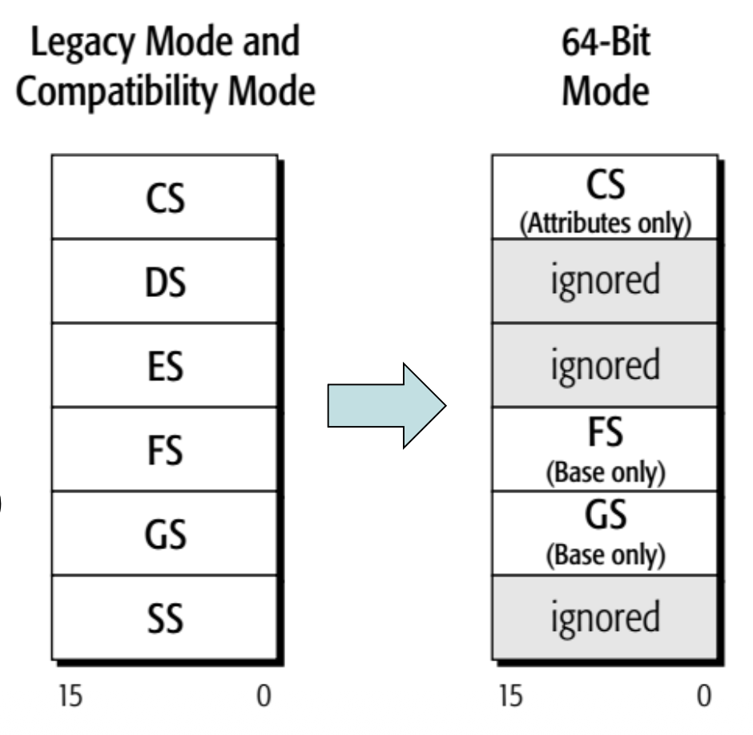{ align=right width=25% }

- 64 位模式
    - 此时处理器只能识别 `CS`, `FS`, `GS` 段
    - 软件可以使用 `FS` 和 `GS` 段基址寄存器作为地址计算的基址寄存器
    - 在64位模式下，假定所有其他数据段寄存器（`DS`、`ES` 和 `SS`）的基地址为 0

???+ abstract "系统寄存器"

    

        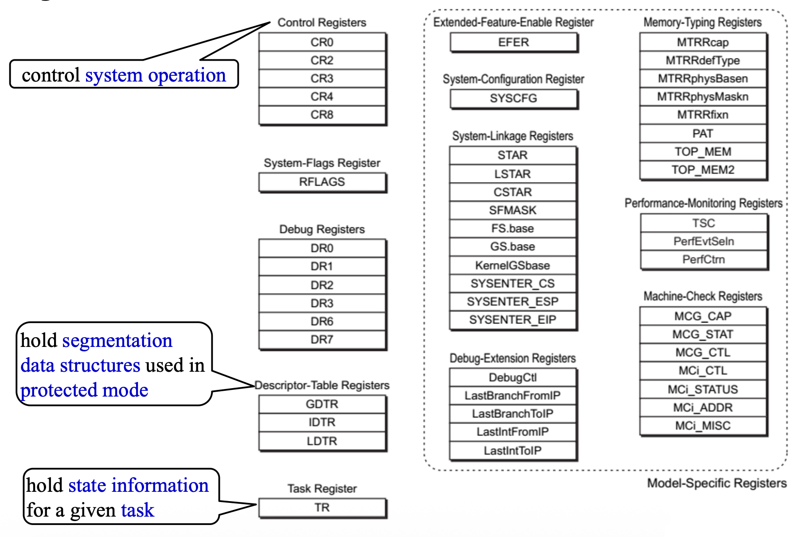
    

## Modes of Operations

??? abstract "操作模式汇总"

    

        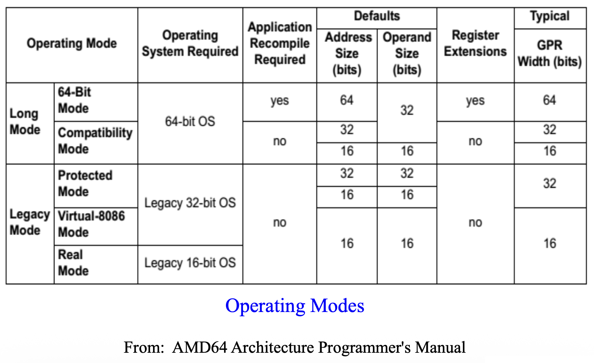
    

    以及 AMD64 架构下的操作模式：

    

        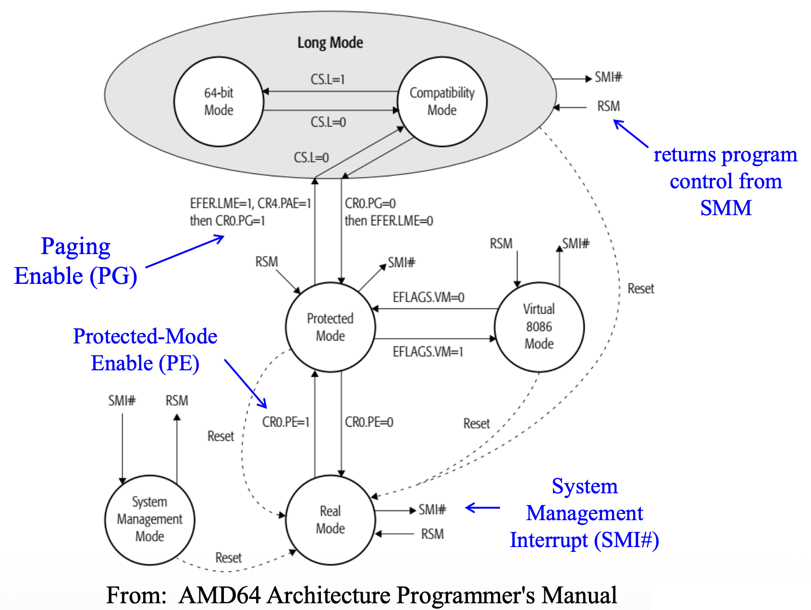
    

### Long Mode

- **长模式**(long mode)（Intel 称之为 **IA-32e**（"e"代表“扩展”））是**传统保护模式的扩展**
- 长模式包括两个子模式：**64 位模式**和**兼容模式**
    - **64 位模式**(64-bit mode)：支持 64 位架构的所有特性和寄存器扩展
    - **兼容模式**(compatibility mode)：支持与现有的 16 位和 32 位应用程序的二进制兼容性
        - 这些传统(legacy)应用程序无需重新编译即可在兼容模式下运行
        - 在兼容模式下运行的应用程序使用 32 位或 16 位寻址方式，并能访问前 4 GB的虚拟地址空间
        - 传统的 x86 指令前缀可在 16 位与 32 位的地址及操作数大小之间切换
  
- 长模式不支持传统的实模式或传统的虚拟-8086 模式

### Legacy Mode

**传统模式**(legacy mode)包含三个子模式：

- **保护模式**(protected mode)支持 **16 位和 32 位**程序，具备**内存分段**、**可选分页**及**权限检查**功能。运行于该模式的程序可访问高达 **4 GB 的内存空间**。
- **虚拟 8086 模式**(virtual-8086 mode)允许 16 位实模式程序作为任务在保护模式下运行。它采用简化的内存分段方式、可选分页以及有限的保护检查机制。此类程序最多能访问 **1 MB 的内存空间**。
- **实模式**(real mode)支持使用基于寄存器的内存分段的 16 位程序，但不提供分页或保护检查功能。在此模式下运行的程序可寻址至多 **1 MB 的内存空间**。

### System Management Mode

- **系统管理模式**(system management mode, SMM)是一种专为系统控制活动设计的操作模式，通常对常规系统软件透明
- 电源管理是系统管理模式的一种常见应用
- SMM 主要供平台**固件**(firmware)和专用低级**设备驱动程序**(device driver)使用

### Memory Management

#### Requirements

内存管理的实现需要满足以下需求：

- **重定位**(relocation)：
    - 程序员不知道程序在执行时将在内存中的哪个位置
    - 当程序正在执行时，它可能被交换到磁盘，并在不同的位置上返回到主存中（重新定位）
    - 内存引用必须在代码中转换为实际的物理内存地址
        - 程序不能直接访问物理地址，但可以使用逻辑地址间接访问物理地址

- **保护**(protection)：
    - 进程不应能在未经许可的情况下引用另一个进程中的内存位置
    - 在编译时无法检查绝对地址，必须在运行时进行检查
    - 内存保护要求必须由处理器（硬件）满足而不是由操作系统（软件）满足

- **共享**(sharing)：
    - 允许多个进程访问相同的内存部分
    - 最好允许每个进程访问相同的程序副本，而不是拥有它们自己的独立副本

#### Schemes

内存管理的两种方案：

- **分段**(segmentation)：

    

        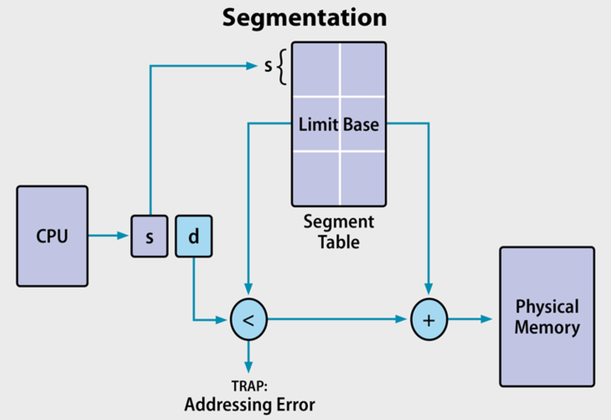
    

    ???+ example "例子"

        

            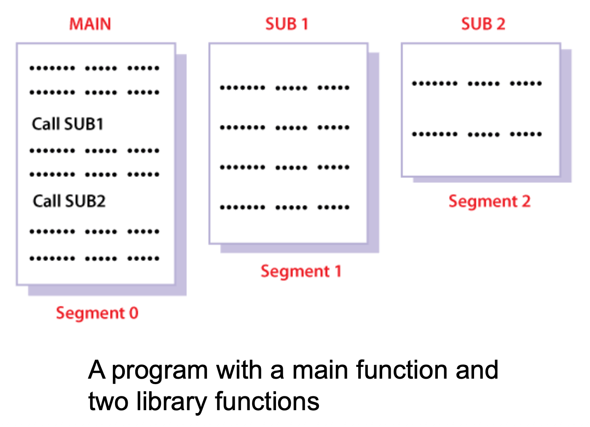
        

        

            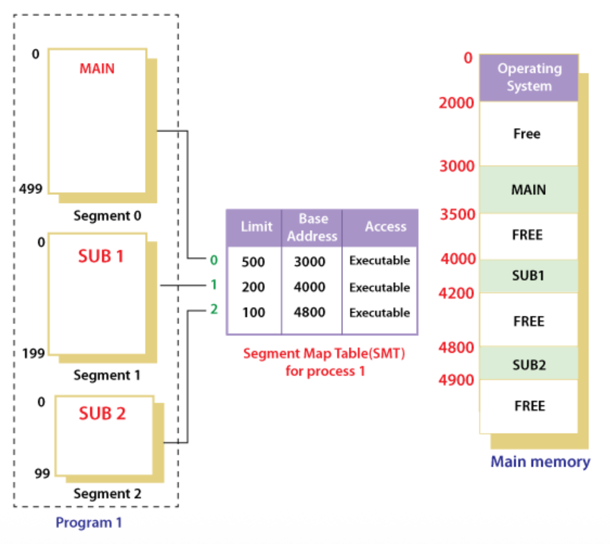
        

- **分页**(paging)：

    

        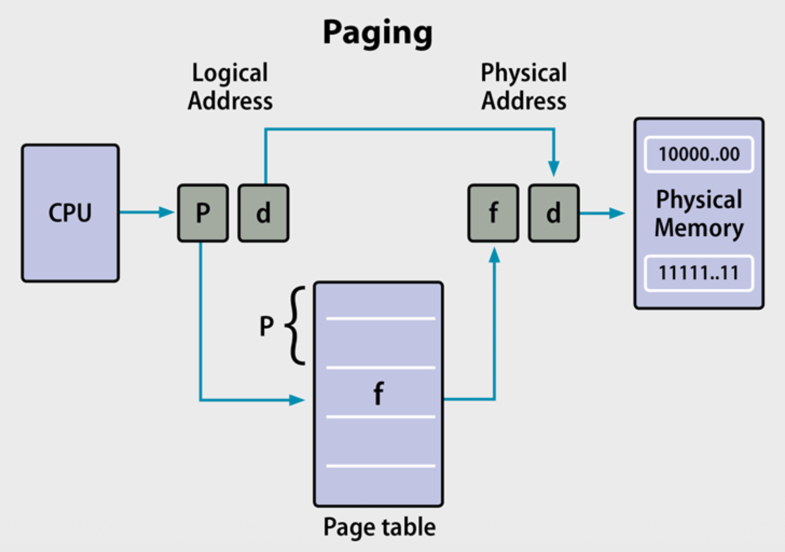
    

    ???+ example "例子"

        

            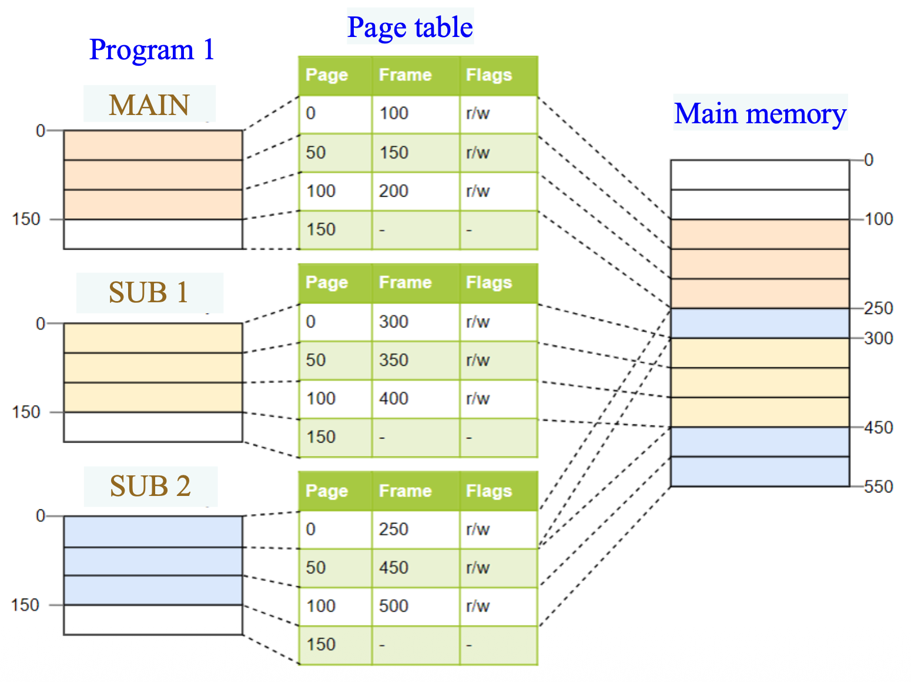
        

两种方案的关键区别在于：

- 大小  
   - **分段**：用户指定**可变大小**的段
   - **分页**：页面和帧采用**固定块大小**，硬件决定页面/帧的大小

- 碎片化  
   - **分段**会导致**外部碎片**
   - **分页**则导致**内部碎片**

- 表结构  
   - **分段**：段表包含段 ID 及信息，查找速度**快**于页表
   - **分页**：页表指导内存管理单元（MMU）定位页面及其状态，此过程较慢，但可通过 TLB 高速缓存加速

=== "传统模式下的内存管理"

    

        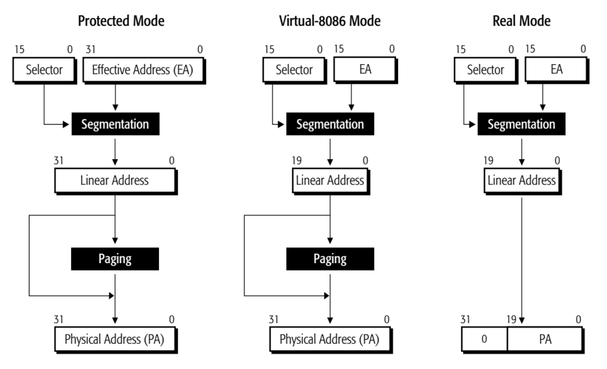
    

=== "长模式下的内存管理"

    

        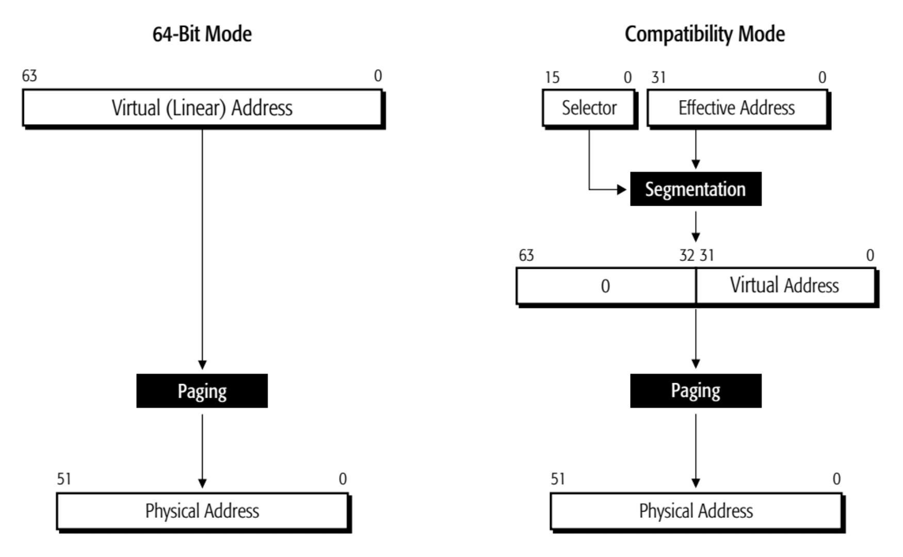
    

## Real Mode Memory Addressing

80286 及之前的处理器要么在实模式下运行，要么在保护模式下运行。其中**实模式操作**(real mode operation)仅允许寻址内存空间的前 1M 字节——即使在奔腾 4 或酷睿 2 微处理器中也是如此。这 1M 的内存叫做**实内存**(real memory)/**传统内存**(conventional memory)/**DOS 内存**系统。

### Segments and Offsets 

- 所有实模式内存地址必须由一个段地址加上一个偏移地址组成
    - **段地址**(segment address)定义了任何 64K 字节内存段的起始地址
    - **偏移地址**(offset address)选择 64K 字节内存段内的任何位置

- **线性地址**(linear address)通过以下方式生成：
    - 一个 16 位段寄存器（段地址），左移四位
    - 以及一个 16 位偏移（段偏移或有效地址）
    - 线性地址被表示为：
        $$
        \text{Linear Address} = \text{Segment Address} << 4 + \text{Effective Address (offset)}
        $$

    

        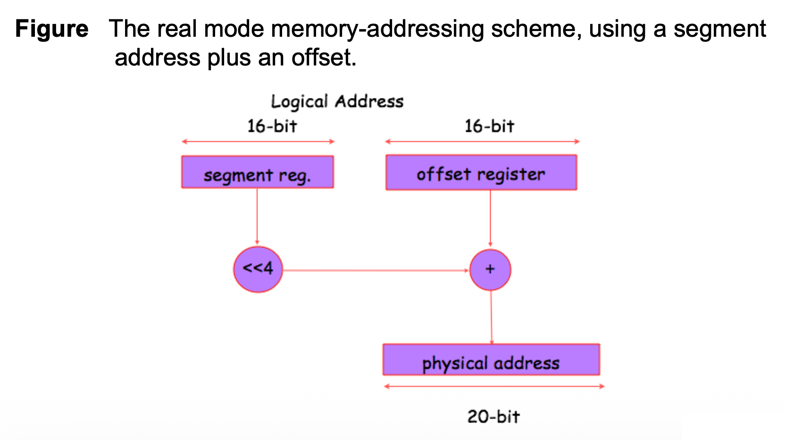
    

### Default Segment and Offset Registers

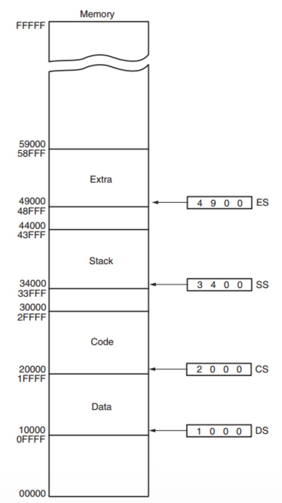{ align=right width=25% }

- 微处理器在寻址内存时遵循适用于段的一系列规则，这些规则确定了段与偏移寄存器的组合方式
- **代码段**(code segment)寄存器定义了代码段的起始位置
- **指令指针**(instruction pointer)定位代码段内的下一条指令
- 另一个默认组合是栈——栈数据通过堆栈段在由栈指针（`SP`/`ESP`）或指针（`BP`/`EBP`）指向的内存地址进行引用
- 右图展示了一个包含四个内存段的系统
    - 如果一个段不需要 64K 字节的内存，则内存段可以接触或重叠
    - 将段视为可移动的窗口，能够覆盖内存的任何区域以访问数据或代码
    - 一个程序可以拥有超过四个或六个段，但一次只能访问四个或六个段
  
---
- 由 DOS 置于内存中的程序被加载至 TPA（暂驻程序区），位于驱动程序及其他 TPA 程序之上的首个可用内存区域
- 该区域由 DOS 维护的一个**空闲指针**指示
- 程序的加载过程由 DOS 内部的**程序加载器**(program loader)自动处理

    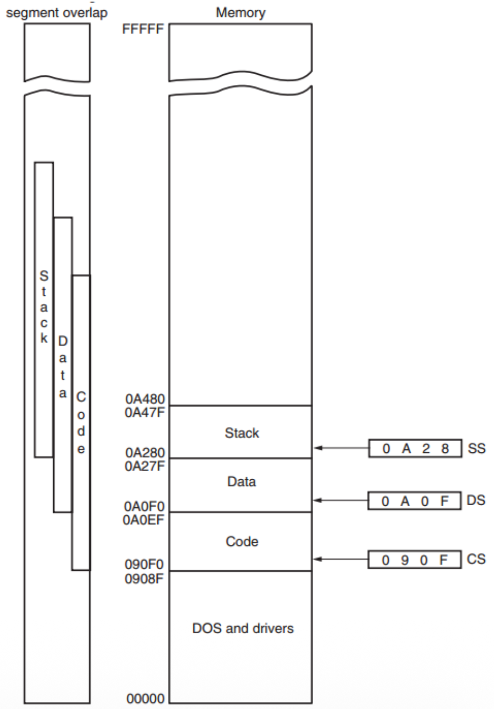

### Segment and Offset Addressing Scheme Allows Relocation

- **可重定位程序**(relocatable program)是指能够置于内存的任何区域，且无需修改即可执行的程序
- **可重定位数据**(relocatable data)是指可以存放在内存的任何区域，并给使用时无需对程序进行任何更改的数据

    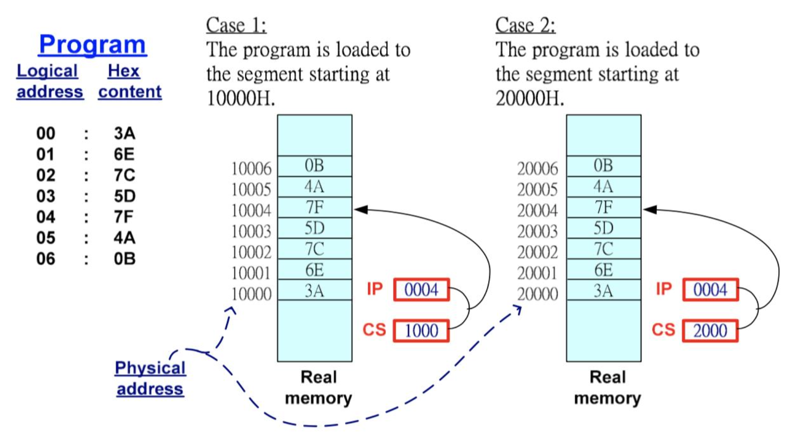

- 由于内存是通过偏移地址在段内寻址的，因此内存段可以被移动到内存系统中的任意位置而无需更改任何偏移地址
- 操作系统可以在运行时分配段地址
- Windows 程序编写时假设前 2G 内存可用于代码和数据

### Address Wrapping Problem

- 1 MB **地址回绕**(wrap-around)是 Intel 8086/8088/80186 CPU 的固有特性，但 80286（24位地址线）及后续型号不具备此功能
- 考虑以下两个例子：

    

        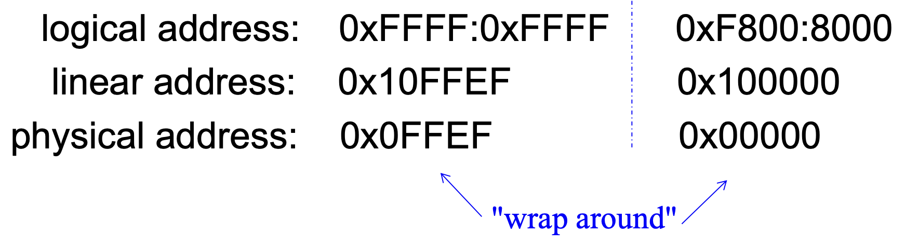
    

- 但一些商业软件却有意依赖环绕式寻址行为

## Intro to Protected Mode Memory Addressing

### Selectors and Descriptors

- 允许访问位于内存第一个 1M 字节以内及以上的数据和程序
- **保护模式**(protected mode)是 Windows 操作系统运行的环境
- 段寄存器中存放的是一个**选择器**(selector)，而非段地址，该选择器用于从（2个）描述符表中选择一个描述符（共 8192 个选择器）
- **描述符**(descriptor)描述了内存段的位置、长度和特权级别
    - 一种称为**门**(gate)的特殊类型描述符，用于提供软件例程的代码选择器和入口点

        

            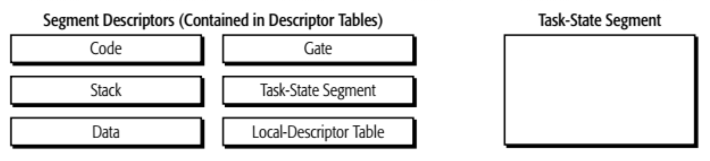
        

???+ example "例子：`#!asm MOV [BX], AX`"

    

        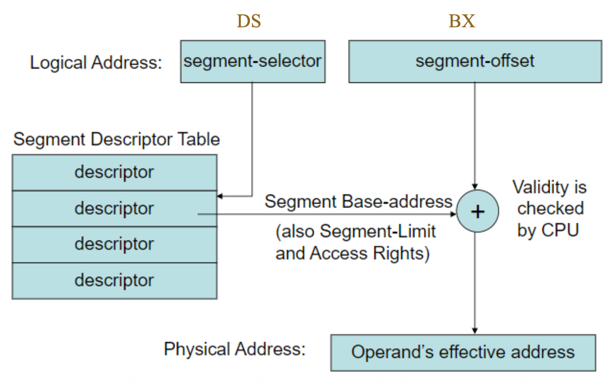
    

- **描述符表**(descriptor table)包含以下描述符：

    

        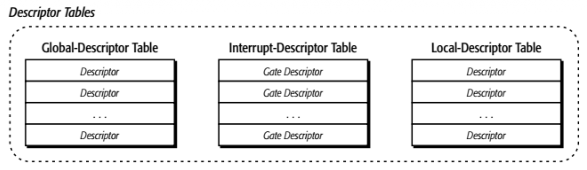
    

    - **全局描述符表**(global-descriptor table, GDT)包含所有程序可用的描述符（**必需**）
    - **局部描述符表**(local-descriptor table, LDT)包含单个程序使用的描述符（**可选**）
    - **中断描述符表**(interrupt-descriptor table)仅包含门描述符（**必需**）

- **全局描述符**包含适用于所有程序的段定义
- **局部描述符**通常特定于某个应用程序
- 全局描述符可称为**系统描述符**，而局部描述符则可称为**应用描述符**
- 全局描述符是必需的，而局部描述符是可选的
- 全局描述表(GDT)中的第一个条目称为**空描述符**(null descriptor)，其内容必须全为零且不可用于访问内存
    - 空描述符用于使未使用的段寄存器无效。通过用**空选择器**(null selector)初始化未使用的段寄存器，软件可以捕获对未使用段的引用
    - 当加载到数据段寄存器（`DS`、`ES`、`FS` 或 `GS`）时，空描述符不会产生异常；但当尝试使用该描述符访问内存的空选择器进行操作时会引发一般保护异常（#GP）

- **空选择器**还可作为标志，指示 64 位模式下存在嵌套中断处理程序或特权软件
- 下图展示了从 80286 到酷睿 2 处理器的描述符格式
    - 每个描述符长度为 8 字节
    - GDT 和 LDT 最大长度为 64K 字节
    - GDT 与 LDT 最多可容纳 8192 个条目

    

        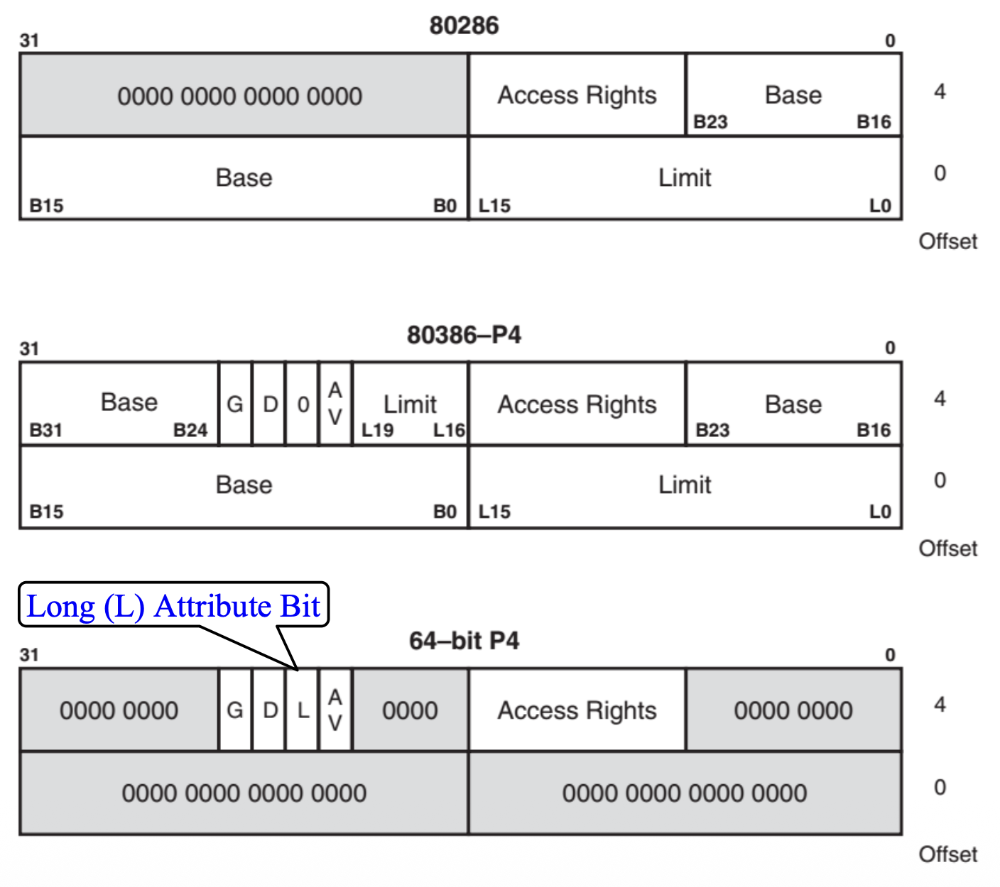
    

???+ question "思考"

    === "题目"

        在保护模式下，理论上一个 x86 处理器核心能跑多少进程？

    === "解答"

        - 在保护模式下，x86 使用描述符（GDT 和 LDT 中的条目）来管理对内存段访问
        - 每个进程至少需要一个代码段和一个数据段，即两个 GDT 条目
        - GDT 为 64K 字节，每个描述符为 8 字节
        - 64K / 8 / 2 = 4K = 4096 个进程

- 描述符的**基地址**指示了内存段的起始位置
    - 在保护模式下，段边界限制被移除
    - 段可以始于任何地址

- **段限制字段**(segment limit field)
    - 段限制包含该段内最后一个偏移地址
    - 处理器将两个段限制字段组合成一个 20 位的值
    - **粒度(granularity)（G）位**控制如何对段限制进行缩放，处理器以两种方式之一解释段限制（G=0/1）
    - 如果软件引用超出限制的地址，将发生一般保护异常（#GP）
  
- G 位（粒度位）
    - 决定了段限制字段的缩放比例
    - 当粒度标志清零时，段限制**以字节为单位**解释；当标志置位时，段限制**以 4KB 为单位**解释
    - 若 G=0，段大小 =（限制 + 1）B，限制范围从 0 到0FFFFFH（2^20 - 1 或 1MB - 1）
    - 若 G=1，段大小 =（限制 + 1）x 4KB，限制范围从 0FFFH（2^12 - 1 或 4KB - 1）到 0FFFFFFFFH（2^32 - 1 或 4GB - 1）

??? example "段限制的例子"

    === "例1"

        === "问题"

            对于基地址为 10000000H，限制字段为 001FFH，**G = 0** 的描述符，它的起始和结束位置是什么？

        === "解答"

            - 起始位置：10000000H
            - 结束位置：10000000H + 001FFH = 100001FFH

    === "例2"

        === "问题"

            对于基地址为 10000000H，限制字段为 001FFH，**G = 1** 的描述符，它的起始和结束位置是什么？

        === "解答"

            若 G = 1，结束 = 起始 +（段大小 - 1），其中段大小 =（限制字段(limit) + 1）x 4KB。于是（段大小 - 1） = (limit + 1) x 4K – 1 = (limit)000H + (4K – 1) = (limit)FFF H（也就是 limit 从第4个十六进制位开始）

            - 起始位置：10000000H
            - 结束位置：10000000H + 001FFFFFH = 101FFFFFH

- **访问权限字节**(access rights byte)控制对保护模式段的访问
    - 描述该段在系统中的功能，并允许完全控制该段
    - 若为数据段，则指定其增长方向

- 如果段的大小超出其限制范围，操作系统将被中断，表明一般保护错误发生
- 可以指定数据段是否可写入或为写保护状态

    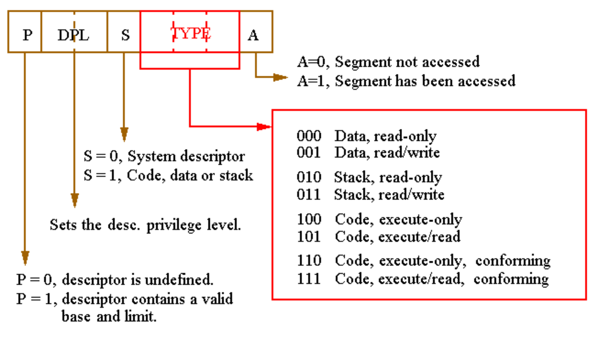

- S 位与类型字段(type field)共同指定了描述符的类型及其访问特性
- **描述符特权级别**(descriptor privilege-level, DPL)字段
    - DPL 字段表示段的描述符特权级别，其中 0 代表最高特权，3 代表最低特权，如下图所示：
  
        

            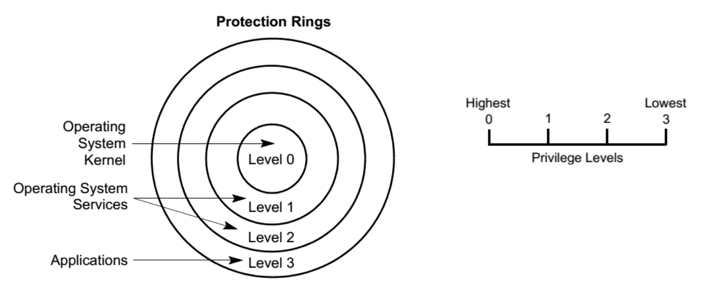
        

下图展示了包含选择器的段寄存器如何从全局描述符表中选择一个描述符。可以看到全局描述符表中的条目选择了内存系统中的一个段。

    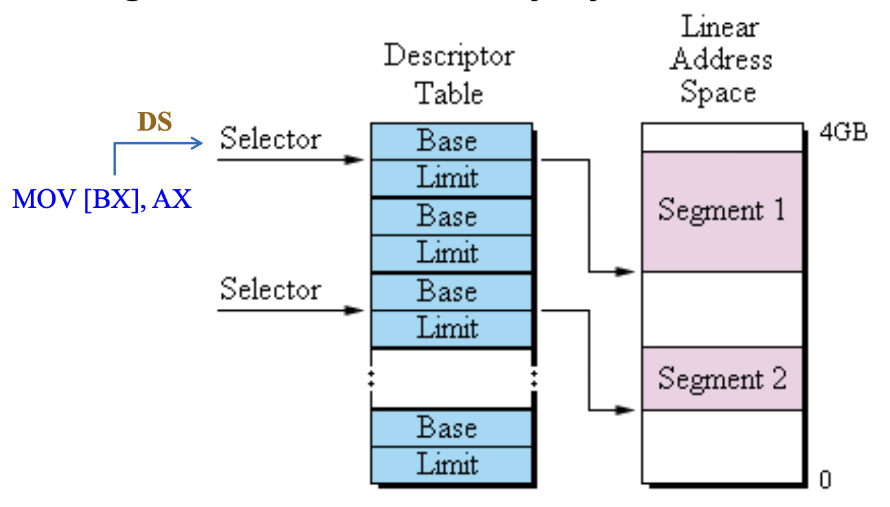

### Segment Selector Format

    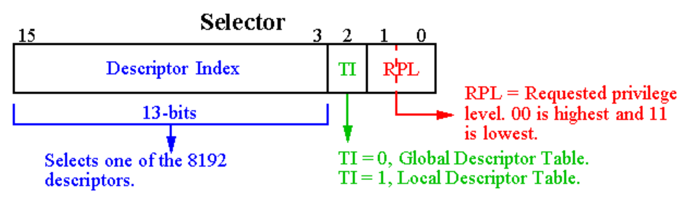

- 描述符通过段选择器从描述符表中选取
    - 段选择器包含一个 13 位的索引字段、一个表选择位以及请求特权级字段
- **TI 位**用于选择全局或局部描述符表
- **请求特权级别**(requestor privilege level, RPL)指定了内存段的访问权限级别

### Three Types of Privilege Levels

- **描述符特权级别**(descriptor privilege level, DPL)：操作系统分配给各个段的特权级别

    

        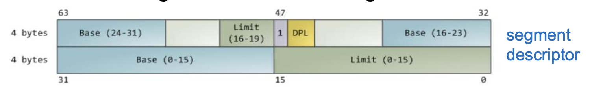
    

- **请求特权级别**(requestor privilege level, RPL)：反映了创建选择器的程序的特权级别

    

        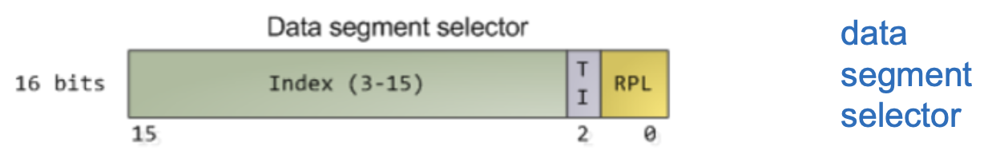
    

- **当前特权级别**(current privilege level, CPL)：`CS` 寄存器有一个由 **CPU** 维护的 2 位 CPL 字段，它**始终等于** CPU 当前的权限级别

    

        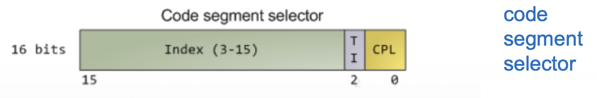
    

???+ note "数据访问特权检查"

    === "访问数据段"

        

            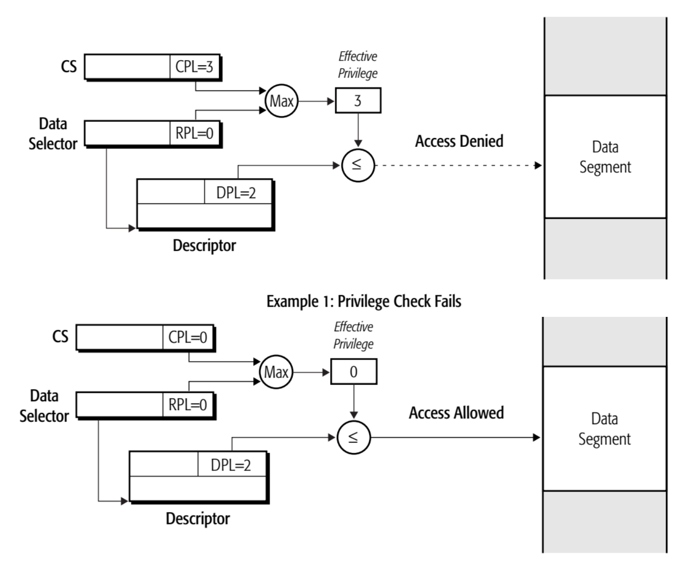
        

    === "访问栈段"

        

            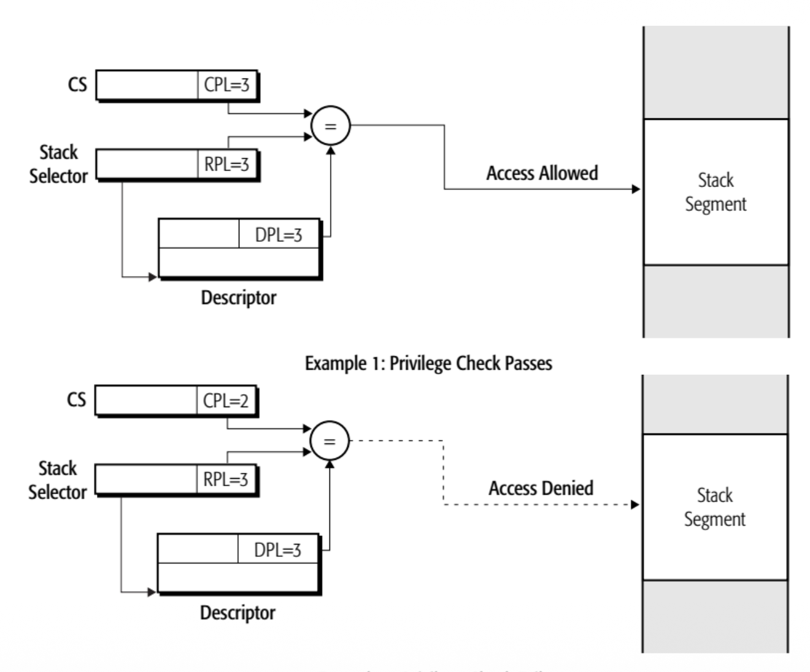
        

### Program-Invisible Registers

- 三种描述符表：GDT，LDT，IDT
- 四种程序员不可见的寄存器：
    - **GDTR**（全局描述符表寄存器） 与 **IDTR**（中断描述符表寄存器）：存放 GDT 和 IDT 的**基地址**及其限制，在进入保护模式前被加载
        - LDT 的位置是从全局描述符表中选择的，其中一个全局描述符被设置用来访问 LDT
    - **LDTR**（局部描述符表寄存器）与 **TR**（任务寄存器）：指向 GDT 中的特殊系统描述符（例如 LDTR 寄存器作为 GDT 的选择器）
        - 要访问 LDT，LDTR 被加载一个选择符，该选择符访问 GDT，并将 LDT 的地址、限制和访问权限加载到 `LDTR` 的缓存部分
        - TR 持有一个选择符，该选择符访问定义任务（一个过程或应用程序）的描述符
        - 允许多任务系统以简单有序的方式在任务之间切换
    - 其他不可见寄存器：充当描述符缓存

???+ note "保护模式内存寻址"

    

        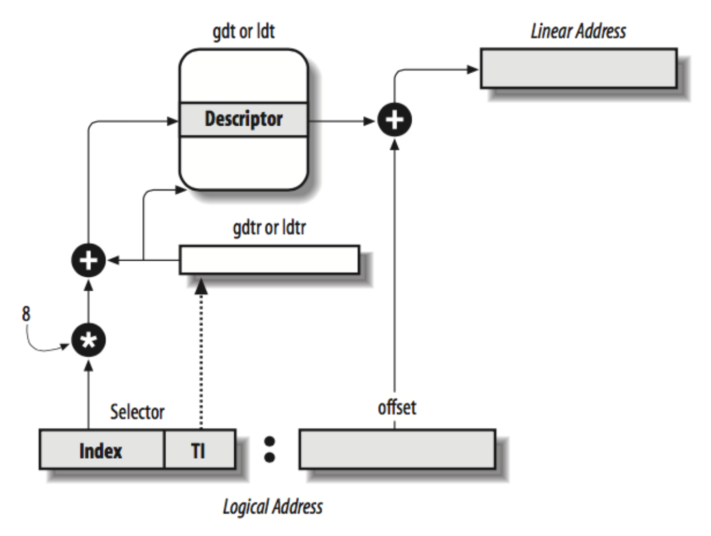
    

    要想使用 LDT 扩展单个任务的地址空间，可以让 LDTR 选择器在切换到新任务时可以加载一个新值。

    

        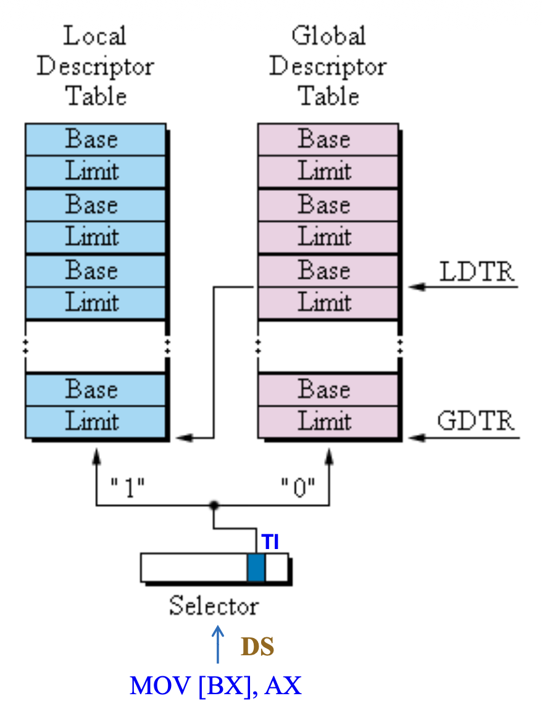
    

### Protected Mode Segmented-Memory Models

系统软件可利用分段机制支持两种基本的分段内存模型：多段式模型或平面内存模型。

- **多段式模型**(multi-segmented model)：将内存划分为不同部分，包括代码、数据和栈，每个部分可独立访问
- **平面内存模型**(flat-memory model)：采用线性寻址模式，代码、数据及栈均包含在一个连续的地址空间内，使得 CPU 能够直接寻址所有可用的内存位置

-   多段式模型：每个段寄存器有一个唯一的基地址和段大小

    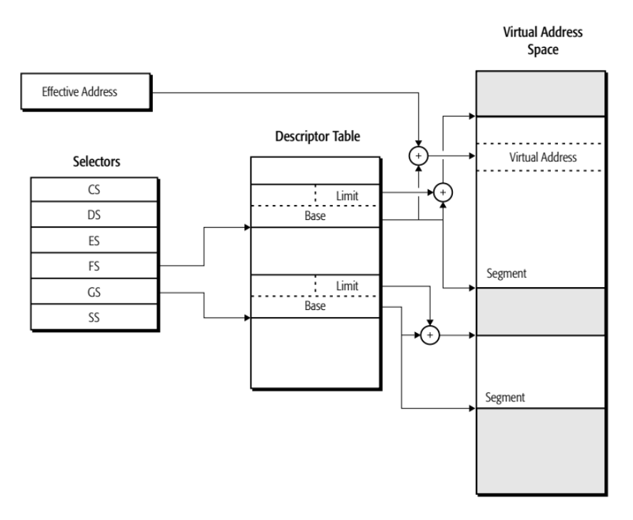

-   平面内存模型：段的基地址 = 0，且段的限制为 4KB

    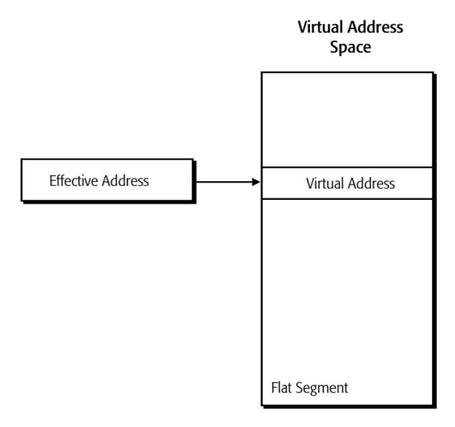

## Memory Paging

