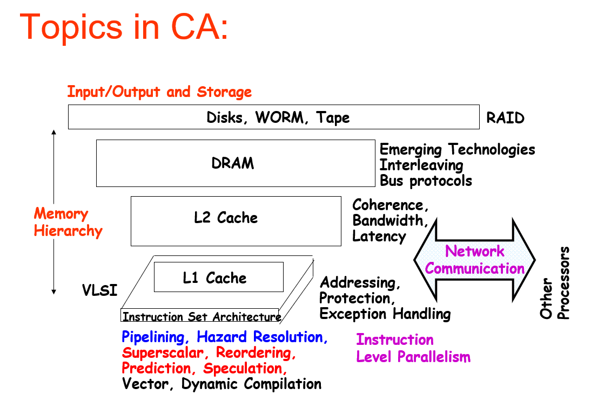
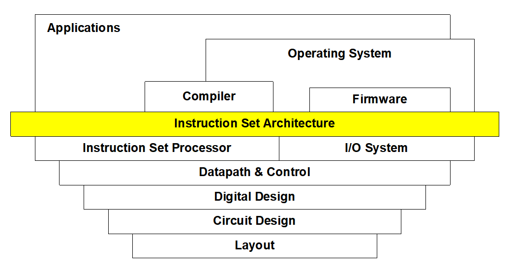
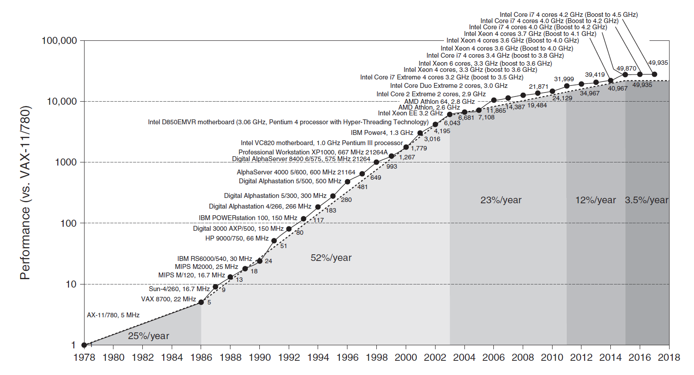
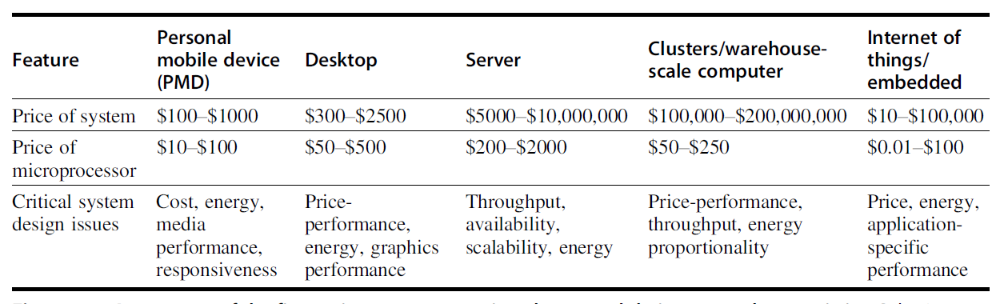
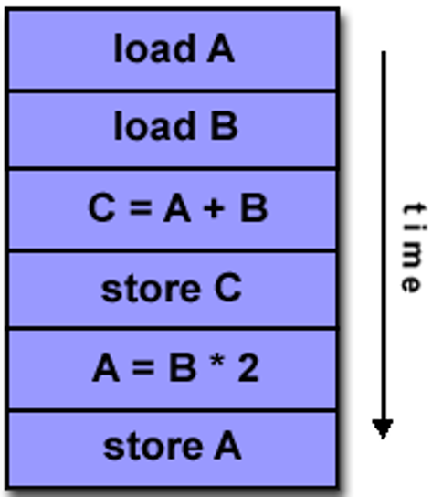
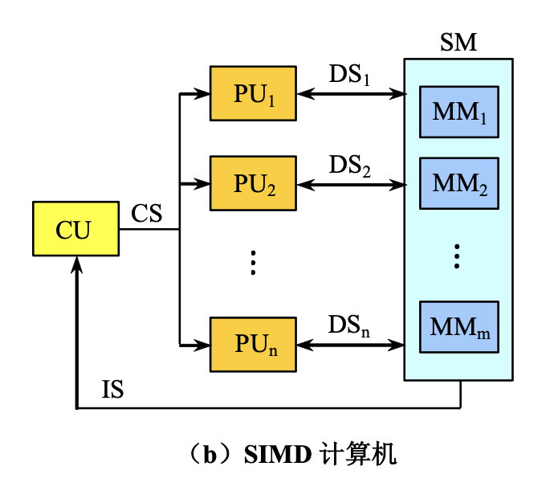
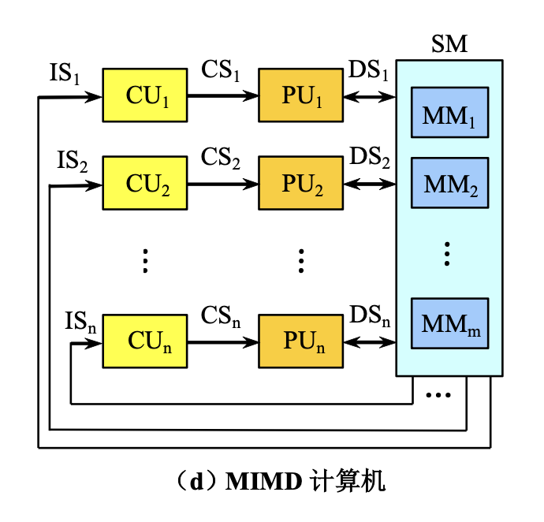
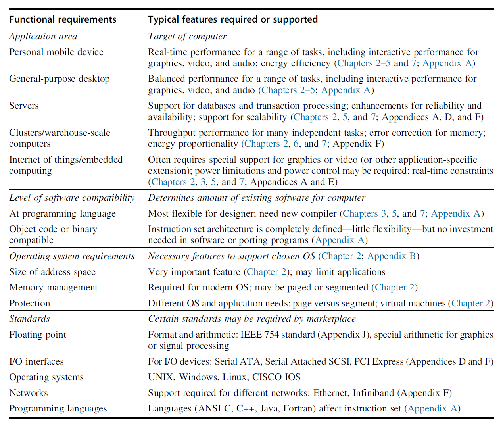
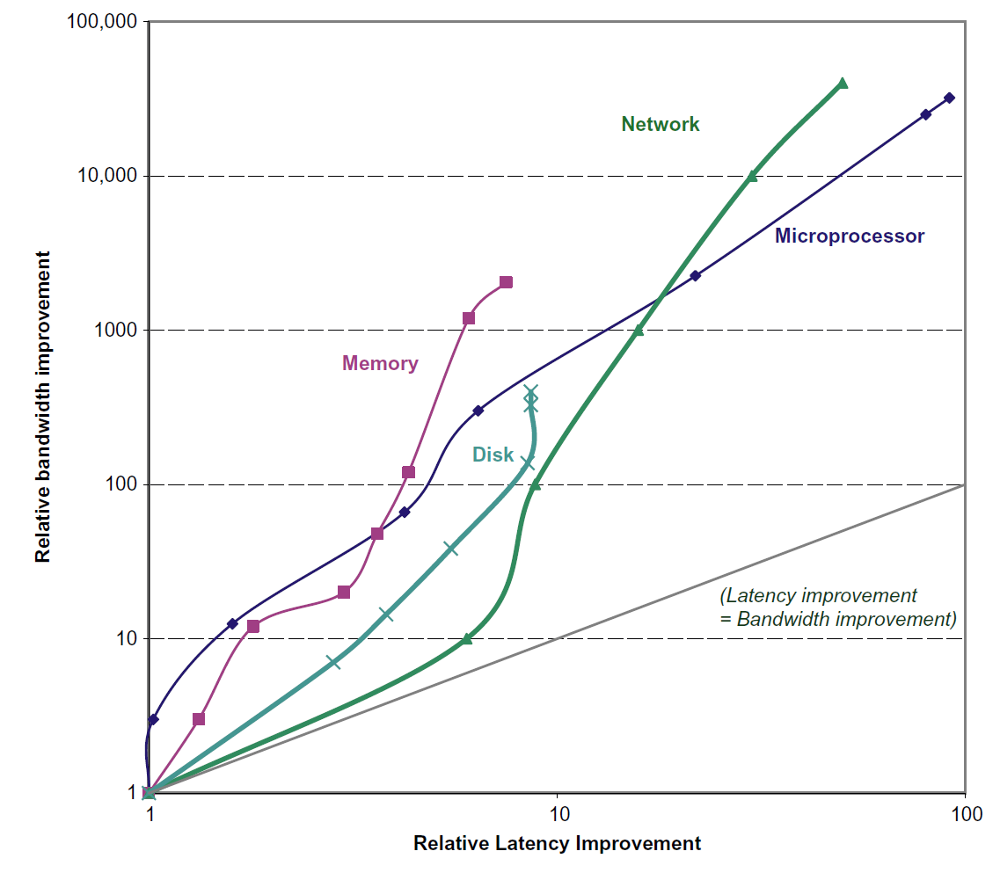

# Chap 1: Fundamentals of Quantitative Design and Analysis

!!! abstract "注"

    - 很多概念其实在计组课程中都涉及到过，但这里我还是稍微汇总了一下，就是有些乱x
    - 和计组的第一章一样，这里的大多数内容应该不会在考试中涉及到（~~因为作者是一样的~~），但要重点关注 [Computer Architecture](#computer-architecture) 和 [Quantitative Principles of Computer Design](#quantitative-principles-of-computer-design)

??? info "一些图片"

    

        
    

    计算机组成图：

    

        
    

??? info "一些背景知识"

    - RISC（reduced instruction set computer，精简指令集计算机）架构诞生于 1980s。基于 RISC 的机器通过流水线和缓存的使用来提升性能

    - 几十年来计算机处理器性能的提升图：

    

        
    
 

    - 计算机处理器性能的提升带来的影响
        - 对计算机用户而言极大提升了可用的能力
        - 产生新一类的计算机，比如智能手机、平板等
        - 基于多处理器的计算机在计算机设计中占据统治地位
        - 推动软件开发

    - 关于半导体的两大定律已经失效
        - **丹纳德缩放定律**(Dennard Scaling)：即便增加晶体管的数量，对于给定面积的硅，能量密度不变，因为晶体管变得更小了。因此晶体管可以在提升速度的同时保证耗能更少。但是在 2004 年，该定律就失效了，因为电流和电压无法一直小下去，毕竟要保持集成电路的运作
        - **摩尔定律**(Moore's Law)：芯片上的晶体管数量每年（1975 年修正为“每两年”）翻一倍

    - 导致近几年处理器性能增速放缓的原因：
        - 上述两大定律的失效导致晶体管的性能无法提升
        - 多处理器上无法改变的功率(power)负担
        - 将单个高功耗处理器替换为多个节能处理器
        - 多处理器实现阿姆达尔定律的局限

    - 因此，当前留给我们改善能量-性能-成本的唯一路径是**专业化**(specialization)：**领域特定架构**(domain-specific architecture)比常见的通用目的架构(general-purpose architecture)

    - “三堵墙”的挑战：**ILP 墙**、**内存墙**、**功率墙**

## Classes of Computers

计算机的分类：

    

- 物联网(Internet of Things, IoT)/嵌入式计算机
    - 物联网通过传感器(sensors)和执行器(actuators)收集有用的数据，并与物理世界互动
    - 需要考虑的因素
        - （软/硬）实时性能
        - 严格的资源限制
        - 有限的内存大小，低功耗
- 个人移动设备(personal mobile device, PMD)：一组具备多媒体用户界面的无线设备，能运行第三方软件，包括智能手机、平板
    - 需要考虑的因素：
        - 成本
        - 响应能力(responsiveness)和可预测性(predictability)：实时性能(real-time performance)、软实时(soft real-time)
- 台式(desktop)计算机
    - 第一类出现在市场的计算机，且仍然占据最大的市场
    - 需要考虑的因素：售价-性能
- 服务器(server)
    - 需要考虑的因素：可用性(availability)、可扩展性(scalability)、吞吐量(throughput)
- 集群(clusters)/仓储式(warehouse-scaling)计算机(WSCs)
    - 软件即服务(software as a service, SaaS)包括搜索、社交网络、媒体分享、多媒体游戏、在线购物等，它促进了集群的发展
    - 集群：通过局域网连接的一组台式计算机或服务器，表现得像一台单个更大的计算机
    - 与服务器的区别在于 WSCs 利用了冗余
    - 需要考虑的因素：售价-性能、功率

---
应用层面的两种并行：

- **数据级并行**(data-level parallelism, DLP)
- **任务级并行**(task-level parallelism, TLP)

硬件层面的四种并行：

- **指令级并行**(instruction-level parallelism, ILP)
- **向量架构、GPUs、多媒体指令集**
- **线程级并行**(threaad-level parallelism, TLP)
- **请求级并行**(request-level parallelism, RLP)

下面则根据指令和数据流的数量，对计算机架构进行分类（注意有些计算机可以同时属于多个类别）：

- **单指令流，单数据流(SISD)**：单处理器，利用 ILP（比如超标量(superscalar)、推测执行(speculative execution)等）

    

        
    

- **单指令流，多数据流(SIMD)**：多处理器，利用 DLP

    

        
    

- 多指令流，单数据流(MISD)：市场上没有这样的处理器
- **单指令流，单数据流(MIMD)**：目标为 TLP，利用了 TLP 和 RLP，更加灵活，应用范围更广，但是更贵

    

        
    

## Computer Architecture

**计算机架构**(computer architecture)：一门通过选择和联系硬件组件，构造能够满足功能、性能、成本和能耗要求的计算机的科学和艺术。

计算机架构包含以下三部分：

- **指令集架构**(instruction set architecture)
    - 常见的指令集架构(ISA)有 Intel x86, RISC-V 和 ARMv8
    - ISA 的七个维度：
        - ISA 的类别
            - 寄存器-内存 ISA：80x86
            - 加载-存储 ISA：只能通过加载和存储指令访问内存，比如 ARMv8、RISC-V
        - 内存地址：所有 ISA 都是字节地址；且有些架构（比如 ARMv8）要求对象必须对齐(align)，但有些并不强求，但是对齐可以提高访问速度
        - 寻址模式(addressing mode)
            - RISC-V 寻址模式包括寄存器、立即数(immediate)和偏移量(displacement)
            - 80x86 在此基础上增加了三个变体：无寄存器；两个寄存器；两个寄存器，但其中一个寄存器乘上常数
            - ARMv8 在 RISC-V 的基础上增加 PC 相对寻址
        - 操作数的类型和大小：整数有 8 位、16 位、32 位、64 位，浮点数有 32 位和 64 位。80x86 还支持 80 位
        - 运算：数据传送、算术逻辑、控制、浮点数
        - 控制流指令：包括条件分支、无条件跳转、过程调用和返回，都采用 PC 相对寻址
            - RISC-V 通过寄存器内容检测条件，而 80x86 和 ARMv8 则通过检测条件码(condition code)来判断条件
            - ARMv8 和 RISC-V 将返回地址保存在寄存器内，而 80x86 将返回地址放在栈（内存）内
        - 编码 ISA
            - ARMv8 和 RISC-V 的指令长度均为 32 位（定长）
            - 80x86 的指令是变长的，在 1-18 字节范围内

    !!! note "注"

        具体的 RISC-V 指令介绍见[计组 Chap 2](../co/2.md)。

- **组织/微架构**(microarchitecture)：计算机设计的高级层面，包括内存系统和连接、CPU 的设计等
- **硬件/系统设计**：计算机系统内所有的硬件组件，包括逻辑实现、电路实现和物理实现

??? info "一些最重要的功能需求"

    

        
    

## Trends in Technology

计算机的技术实现：

- 集成电路
- DRAM
- 闪存
- 磁盘
- 网络

上述技术实现性能体现在以下两个因素：

- **带宽**(bandwidth)/吞吐量(throughput)：一定时间内的工作总量
- **时延**(latency)/响应时间(response time)：从开始到完成事件所经过的时间

虽然这两个因素的提升在不同技术上有不同的表现，但是总的来说带宽的提升量高于时延。相关的一个经验法则是：带宽的提升量至少是时延提升量的平方倍。

    

晶体管(transistors)的性能提升更难分析。

- 特征尺寸(feature sizes)：晶体管在 x, y 维上的最小尺寸
- 特征尺寸越小，线路变得更短，但是电阻和电容变得更糟，因此时延会变得更长
- 此外还有功率耗散的问题

## Trends in Power and Energy in Integreted Circuits

作为一个系统设计师，可以从以下几个角度考虑性能、功率(power)和能耗(energy efficiency)

- 处理器所需的最大能耗
    - 如果处理器需要比功率供应系统更多的功率，就会导致电压下降，从而发生故障
- 维持的功率消耗
    - 使用**热力设计功率**(thermal design power, TDP)作为衡量指标
    - 功率供应一般要超过 TDP，冷却系统一般需要至少 TDP 大小的功率
- 能耗和能效(power efficiency)：现代处理器提供以下提升能效的方法：
    - 什么都不做：大多数处理器会选择关闭不活动的模块的时钟，以节省能耗和功率
    - 动态电压-频率缩放(dynamic voltage-frequency scaling, DVFS)：当计算机处于低活动状态时，减少时钟频率和电压，从而降低能耗和功率
    - 为典型情况专门设计：
        - 由于 PMDs 和笔记本经常处在闲置状态，因此存储器会提供低功率模式以减小能耗
        - 但是在该模式下就无法访问 DRAMs 或硬盘了，因此需要返回到活跃模式来实现读写
    - **超频**(overclocking)：
        - Intel 芯片提供涡轮模式(Turbo mode)：芯片判断可以在短时间内在确保安全的情况下处在更高的时钟频率，可能只在部分核上实现，直到温度开始上升为止
        - 虽然可以在 OS 上关闭涡轮模式，但是启用涡轮模式不会有任何通知，需要注意

---
计算微处理器的能耗和功率：

- 能耗：
    - 当脉冲为 0 -> 1 -> 0 或 1 -> 0 -> 1 的转变时，所需能耗的方程为：

    $$
    \text{Energy}_{\text{dynamic}} \propto \text{Capacitive load} \times \text{Voltage}^2
    $$

    - 当脉冲为 0 -> 1 或 1 -> 0 的转变时，所需能耗的方程为：

    $$
    \text{Energy}_{\text{dynamic}} \propto \dfrac{1}{2} \times \text{Capacitive load} \times \text{Voltage}^2
    $$

- 功率：与 CMOS 相关，下面以第2种脉冲转变为例

    $$
    \text{Power}_{\text{dynamic}} \propto \dfrac{1}{2} \times \text{Capacitive load} \times \text{Voltage}^2 \times \text{Frequency switched}
    $$

- 静态功率：与电流泄露相关

    $$
    \text{Power}_{\text{static}} \propto \text{Current}_{\text{static}} \times \text{Voltage}
    $$

可以看到：

- 减小时钟频率可以降低功率，但无法降低能耗
- 减小电压可以显著降低功率和能耗
- 即使晶体管处于闲置状态，更多的晶体管还是会导致更多的功率，并且会带来更严重的电流泄露，后者主要因为 SRAM 缓存需要功率来维持存储在内部的值（充电）

计算机架构性能增速的放缓有一部分归因于能耗的限制。

## Trends in Cost

影响计算机成本的几个主要因素：

- **时间**(time)：即便实现技术没有多大改进，制造计算机部件的成本也会随时间而降低
    - 学习曲线(learning curve)：随时间流逝，制造成本不断降低
    - 学习曲线可通过产出(yields)测量：通过检测流程的制造设备的占比
- **产量**(volume)：
    - 减少了通过学习曲线所需的时间
    - 降低了成本，因为购买力和制造效率得到提升
    - 降低了研发成本
- **商品化**(commoditization)：
    - 商品(commodity)：由多个供应商大量销售的产品，而且基本上是相同的

### Cost of an Integreted Circuit

集成电路的成本计算公式为：

$$
\text{Cost of integrated circuit} = \dfrac{\text{Cost of die + Cost of testing die + Cost of packaging and final test}}{\text{Final test yield}}
$$

其中晶片(die)的成本为：

$$
\text{Cost of die} = \dfrac{\text{Cost of wafer}}{\text{Dies per wafer} \times \text{Die yield}}
$$

而每个晶圆(wafer)上的晶片数量为：

$$
\text{Dies per wafer} = \dfrac{\pi \times (\text{Wafer diameter} / 2)^2}{\text{Die area}} - \dfrac{\pi \times \text{Wafer diameter}}{\sqrt{2 \times \text{Die area}}}
$$

上述公式只计算了晶圆上晶片的最大数量，而我们更希望知道晶圆上好的晶片的数量，即晶片产出(die yield)：

$$
\text{Die yield} = \text{Wafer yield} \times \dfrac{1}{(1 + \text{Defects per unit area} \times \text{Die area})^N}
$$

- 简洁起见，我们就假定晶圆产出(wafer yield)为 100%
- 每单位面积上的瑕疵(defects per unit area)较为随机，取值会在一定范围内变化
- $N$ 表示加工-复杂度因子(process-complexity factor)，用于测量制造难度

??? info "注"

    - 前面的分析关注的是制造适用于高产量的集成电路的晶片的可变成本，实际上，还有一部分固定成本——掩膜组(mask set)成本，对低产量的集成电路成本有显著影响
    - 鉴于 DRAM 和 SRAM 等商品的巨大价格压力，设计者将**冗余**作为提高产量的一种方式
    - 半导体公司提供 "穿梭运行"(shuttle runs)，以大幅降低微小测试芯片的成本：通过将许多小设计放在一个晶片上以摊销掩模成本来降低成本，然后再将晶片分成小块用于每个项目
        - 尽管穿梭运行有助于原型设计和调试运行，但它们不能解决小产量生产

## Dependability

基础设施供应商提供服务水平协议(service level agreements，SLA)或服务水平目标(service level objectives，SLO)来保证他们的网络或电力服务是可靠的。因此我们可以用 SLA 来判断系统处于运行还是停机状态。可以将服务状态分为：

1. **服务实现**(service accomplishment)：按照 SLA 的说明提供服务
2. **服务中断**(service interruption)：提供的协议与 SLA 说明的不同

状态 1 -> 2 的转变称为**故障**(failures)，2 -> 1 的转变称为**恢复**(restorations)。量化这些转变时，可以得到以下衡量计算机**可靠性**(dependability)的方法：

- **模块可靠性**(module reliability)：从一个参考的初始时刻开始，对连续的服务实现的衡量
    - 平均故障时间(mean time to failure, MTTF)：它的倒数即为故障率，可用 FIT(failure in time) 表示
    - 平均修复时间(mean time to repair, MTTR)
    - 平均故障间隔时间(mean time between MTBF) = MTTF + MTTR
- **模块可用性**(module availability)：对实现和中断两种状态交替的服务实现的衡量，计算公式为：

    $$
    \text{Module availability} = \dfrac{\text{MTTF}}{\text{MTTF + MTTR}}
    $$

解决故障的基本途径是利用**冗余**(redundancy)，包括：

- 时间上：重复运算，观察是否仍然是错误的
- 资源上：用其他部件替代故障的部件

## Measuring, Reporting and Summarizing Performance

衡量计算机性能的指标有：

- **执行时间**(execution time)
    - 最直接的定义是使用挂钟(wall-clock)时间/响应时间/耗时(elapsed time)：完成一项任务，包括存储器访问、内存访问、I/O 活动、操作系统开销等所需的时延
    - 在多编程(multiprogramming)中，还得考虑 CPU 时间：处理器计算所需时间，不包括等待 I/O 或运行其他程序的时间
    - 评估系统性能的另一个方法是比较在某一工作量(workload)（用户运行的程序和操作系统命令）下的执行时间
- 吞吐量

### Benchmarks

基准测试的最佳选择是测量在真实应用中的性能。尝试运行比真实应用小得多的程序就会调入性能测试的陷阱里，相应的例子有：

- 核(kernel)：只是真实应用中一些小而关键的片段
- 玩具程序(toy programs)：只有百行左右的入门级编程任务
- 综合基准测试(synthetic benchmark)：一些发明出来的假程序，用于匹配真实应用的轮廓和行为

另外的问题是在何种基准测试下运行：

- 使用基准测试特定的编译器标志(benchmark-specific compiler flag)：可以提升在基准测试下的性能，但是在很多程序中反而会降低性能
- 源代码的修改，有以下三种不同方法：
    - 不允许修改
    - 允许修改，但基本不太可能修改
    - 允许修改，只要修改后的版本能够产生相同的输出即可（领域特定架构采用此法）

**基准测试套件**(suites)：一种通过各种基准测试应用测量处理器性能的方法。它的优势在于一个基准测试的缺陷会因其他基准测试而缩小。

其中一个最成功的标准基准测试应用套件是 [SPEC](https://www.spec.org/)（标准性能评估公司, Standard Performance Evaluation Corporation），后面的章节中主要关注这种基准测试。

不同计算机类型的基准测试：

- 台式机：
    - 处理器密集型(processor-intensive)/图形密集型(graphics-intensive)基准测试
    - 整数/浮点数基准测试
- 服务器：
    - 面向处理器吞吐量的基准测试
    - SPECrate：用于测量请求级并行
    - 关于 I/O：文件服务器基准测试（SPECSFS）、Java 服务器基准测试
    - 事务处理(TP)基准测试：测量系统处理由数据库访问和更新构成的事务的能力
        - 事务处理委员会(Transaction Processing Council, TPC) 尝试建立现实且公正的 TP 基准测试

### Reporting Performance Results

- 报告性能测量的指导原则应该是具备**可重复性**(reproducibility)：列出其他实验者能够复现结果的一切条件。
- SPEC 基准测试报告需要计算机和编译器标志的详细描述、基本和优化的结果、以表格或图的形式展示实际的性能计时

### Summarizing Performance Results

- 总结性能测试结果的简单方法是：比较在基准测试组件的各项程序中执行时间的算术/加权平均值
- SPECRatio：参考计算机的执行时间 / 被测计算机的执行时间，有以下等式成立：

    $$
    \dfrac{\text{SPECRatio}_{\text{A}}}{\text{SPECRatio}_{\text{B}}} = \dfrac{\frac{\text{Execution time}_{\text{reference}}}{\text{Execution time}_{\text{A}}}}{\frac{\text{Execution time}_{\text{reference}}}{\text{Execution time}_{\text{B}}}} = \dfrac{\text{Execution time}_{\text{B}}}{\text{Execution time}_{\text{A}}} = \dfrac{\text{Performance}_{\text{A}}}{\text{Performance}_{\text{B}}}
    $$

- 由于 SPECRatio 是比率而非绝对执行时间，因此计算平均值时应采用几何平均值，即 $\text{Geometric mean} = \sqrt[n]{\prod\limits_{i=1}^n sample_i}$。使用几何平均值时确保两条重要的性质：
    - （时间）比率的几何平均值 = 几何平均值的比率
    - 几何平均值的比率 = 性能比率的集合平均值，因此与参考计算机的选择无关

## Quantitative Principles of Computer Design

- 利用**并行**
    - 系统层面的并行（数据集并行） -> 可扩展性(scalability)：能够扩展内存，以及处理器和存储设备的数量
    - 单个处理器（指令级并行）-> 流水线
    - 数字设计（数据级并行）
        - 组相联高速缓存
        - ALU 使用超前进位(carry lookahead)加法
- **局部性原则**(principle of locality)：程序倾向于重复使用最近用过的数据和指令，可分为：
    - **时间局部性**(temporal locality)：最近被访问过的项很有可能在不久之后会被再次访问
    - **空间局部性**(spatial locality)：地址相邻的项被引用的时间比较相近
- 专注于**一般情况**(common case)
    - 有助于计算机在能耗、资源分配、性能、可靠性等方面的改善
    - 通常而言，一般情况比不常见的情况更简单，执行速度更快
- **阿姆达尔定律**(Amadahl's Law)：通过使用某些更快的执行模式获得的性能提升会受制于快速模式在时间上的占比
    - 通常用加速比(speedup)来衡量性能提升量，公式为：

    $$
    \begin{align}
    \text{Speedup} & = \dfrac{\text{Performance for entire task using the enhancement when possible}}{\text{Performance for entire task without using the enhancement}} \notag \\
    & = \dfrac{\text{Execution time for entire task without using the enhancement}}{\text{Execution time for entire task using the enhancement when possible}} \notag
    \end{align}
    $$

    - 因此加速比取决于以下因素：
        - 被提升的部分在原来计算机中的计算时间占比
        - 使用增强模式后的提升量

    - 执行时间的公式：

    $$
    \text{Execution time}_{\text{new}} = \text{Execution time}_{\text{old}} \times \Big((1 - \text{Fraction}_{\text{enhanced}}) + \frac{\text{Fraction}_{\text{enhanced}}}{\text{Speedup}_{\text{enhanced}}}\Big)
    $$

    - 总体加速比 = 执行时间之比

    $$
    \begin{align}
    \text{Speedup}_{\text{overall}} & = \dfrac{\text{Execution time}_{\text{old}}}{\text{Execution time}_{\text{new}}} \notag \\
    & = \dfrac{1}{(1 - \text{Fraction}_{\text{enhanced}} + \frac{\text{Fraction}_{\text{enhanced}}}{\text{Speedup}_{\text{enhanced}}})} \notag
    \end{align}
    $$

    - 推论：如果只改善任务的一小部分，那么对整个任务的提升至多不超过（1 - 该部分在整个任务的占比）的倒数

- 处理器性能方程
    - CPU 时间的计算公式：

        $$
        \begin{align}
        \text{CPU time} & = \text{CPU clock cycles for a program} \times \text{Clock cycle time} \notag \\
        & = \dfrac{\text{CPU clock cycles for a program}}{\text{Clock rate}} \notag
        \end{align}
        $$

    - 每条指令的时钟周期数(clock cycles per instruction, CPI)，以及它的倒数 IPC

        $$
        \text{CPI} = \dfrac{\text{CPU clock cycles for a program}}{\text{Instruction count}}
        $$

    - 因此 CPU 时间计算公式可以改写为：

        $$
        \text{CPU time} = \text{Instruction count} \times \text{Cycles per instruction} \times \text{Clock cycle time}
        $$

        扩写为：

        $$
        \dfrac{\text{Instructions}}{\text{Program}} \times \dfrac{\text{Clock cycles}}{\text{Instruction}} \times \dfrac{\text{Seconds}}{\text{Clock cycle}} = \dfrac{\text{Seconds}}{\text{Program}} = \text{CPU time}
        $$

    - 然而，我们无法单独改变 CPU 时间计算公式内的一个参数，因为这些参数背后的技术实现是相互依赖的
        - 时钟周期：硬件技术和组织
        - CPI：组织和指令集架构
        - 指令数：指令集架构和编译器技术

    - 对于多条指令
        - CPU 时钟周期数：$\text{CPU clock cycles} = \sum\limits_{i=1}^n \text{IC}_i \times \text{CPI}_i$
        - CPU 时间：$\text{CPU time} = \Big(\sum\limits_{i=1}^n \text{IC}_i \times \text{CPI}_i \Big) \times \text{Clock cycle time}$
        - CPI：$\text{CPI} = \dfrac{\sum\limits_{i=1}^n \text{IC}_i \times \text{CPI}_i}{\text{Instruction count}} = \sum\limits_{i=1}^n \dfrac{\text{IC}_i}{\text{Instruction count}} \times \text{CPI}_i$

## Fallacies and Pitfalls

???+ bug "陷阱"

    - 所有的指数定律都将结束
        - 丹纳德缩放定律
        - 硬盘驱动器增速放缓
        - 摩尔定律
        - 平面逻辑晶体管的增速放缓

    - 多处理器是灵丹妙药(silver bullet)
        - 多处理器的发展受制于 ILP 墙和功率墙
        - 现在，如果程序员如果希望程序运行更快的话，要编写支持并行化的程序

    - 沦为阿姆达尔定律的牺牲品
        - 尽管很多计算机架构师知道阿姆达尔定律，但我们有时会在测量其使用情况之前，花费巨大的精力来优化某些功能

    - 单点故障(single point of failure)
        - 计算机的可靠性取决于最短的短板
        - 可通过冗余来避免因单点故障导致整个系统的崩溃

    - 错误(fault)检测降低可用性
        - 实际上，如果没有错误检测机制，发生错误后反而更影响计算机的性能

???+ bug "谬误"

    - 硬件在性能上的改善也能提升能效，或者至少不会提升能耗
    - 基准测试永远有效
    - 硬盘的额定平均故障时间为 120 万小时，即接近 140 年，所以磁盘实际上不会发生故障
        - 这种数据来自通过成千上万的硬盘测得的统计数据，显然是不合理的，这是一种营销手段罢了
        - 更有用的测量方法是计算**每年故障率**(annual failure rate)
    
    - 峰值性能反映了观测性能（指真实性能）
        - 峰值性能：计算机保证不会超过的性能等级，在不同程序上的变化很大，因此用于预测观测性能就不太可靠了