# Chap 2: Memory Hierarchy Design

!!! info "注"

    虽然本章的绝大多数内容在计组笔记中都讲过，而且讲得会比体系课程更细，但我还是想再重新写一遍笔记，因为当时学的还是有些云里雾里的，所以一些表述可能很啰嗦，甚至是错误的。我希望在这份笔记中能够将“存储器层级”这一概念讲得更加清晰连贯，以尽可能少的语言表述清楚我的一些理解和思考。

    即使读者在计组课程中已经完全掌握了这块内容，我还是不建议跳过，因为体系课程还介绍了一些更高级的内容，包括针对高速缓存性能的 10 个高级优化方法等等。

    不同于计组笔记，我会跳过那些 PPT 完全没有涉及到的内容，比如虚拟机等（~~这学期笔者实在太忙了~~）。

    本笔记同时包含教材 Appendix B 和 Chap 2 的内容。


## Introduction

??? abstract "词汇表"

    看看你还记得多少东西？

    <div style="text-align: center">
        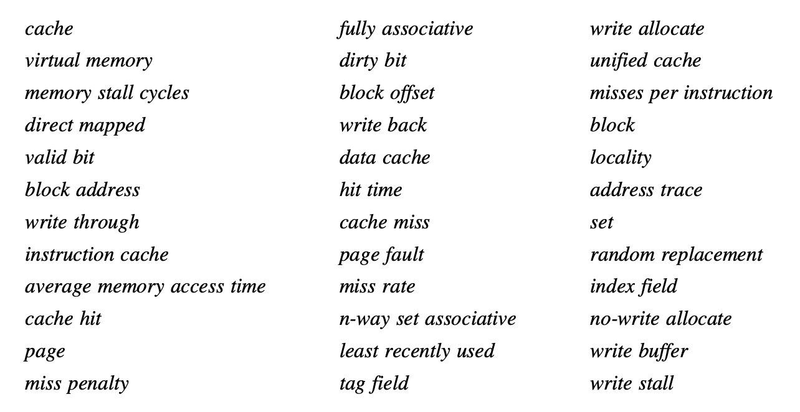
    </div>

简单回顾与存储器相关的一些基本概念：

- **高速缓存**(cache)：位于存储器层级中最高层的存储器，直接与处理器连接。
    - 也有类似缓冲区(buffer)的引申义
- 高速缓存**命中/失效**(hit/miss)：处理器在告诉缓存中找到/没有找到所需的数据
- **局部性原则**(principle of locality)分为
    - **时间**局部性(temporal locality)：最近被访问过的数据可能在不久之后会被再次访问
    - **空间**局部性(spatial locality)：被访问过的数据的邻近数据在不久之后很可能被访问
- **时延**(latency)：决定数据块中第一个字数据被检索的时间
- **带宽**(bandwidth)：决定数据块中其余内容被访问的时间
- **虚拟内存**(virtual memory)
    - **地址空间**(address space)
    - **页**(page)
    - **页错误**(page fault, palt)

??? info "不同计算机类型的存储器层级"

    <div style="text-align: center">
        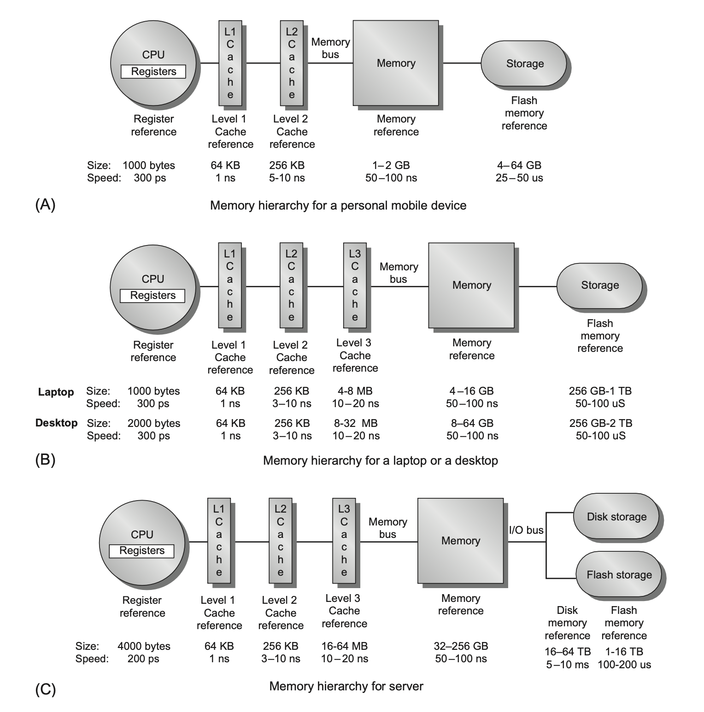
    </div>


### Four Memory Hierarchy Questions

在讨论“存储器层级”概念的时候，我们常常需要回答以下四个问题：

1. 如何放置数据块？（**数据块放置**(block placement)）
2. 怎么找到数据块？（**数据块识别**(block identification)）
3. 当失效发生时，哪个数据块需要被替代？（**数据块替换**(block replacement)）
4. 写入时会发生什么？（**写入策略**(write strategy)）


#### Block Placement

有以下几种存储器的组织方式：

- **直接映射**(direct mapped)：每个数据块在存储器中只有一块确定的位置，计算公式为：

    $$
    (Block\ address) \text{ MOD } (Numbers\ of\ blocks\ in\ memory)
    $$

- **全相联**(fully associative)：数据块可以放在存储器中的任意位置上
- **组相联**(set associative)：每个数据块被限制在存储器的某个**组**(set)中，而每个组包含了 n 个可放数据块的地方，数据块可以在组内的 n 个地方任意挑选（这样的组相联称为 **n 路组相联**(n-way set associative)）。组的位置的计算公式为：

    $$
    (Block\ address) \text{ MOD } (Numbers\ of\ sets\ in\ memory)
    $$

下图以高速缓存为例，展示了不同相联程度的高速缓存：

<div style="text-align: center">
    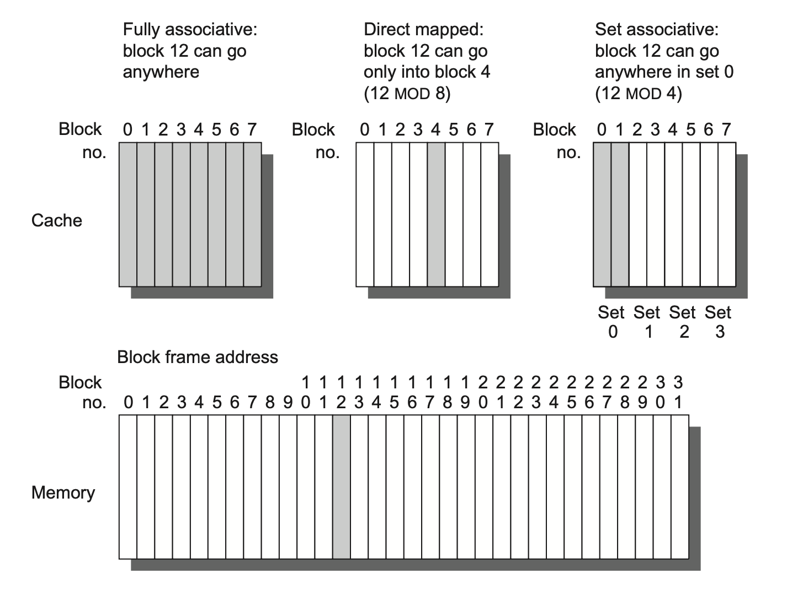
</div>

!!! info "注"

    大多数的处理器高速缓存采用的是直接映射、二路组相联和四路组相联。


#### Block Identification

每个高速缓存块都有一个唯一的地址，而这个地址被分为多个字段，用于实现数据块的识别，具体可以分为：

<div style="text-align: center">
    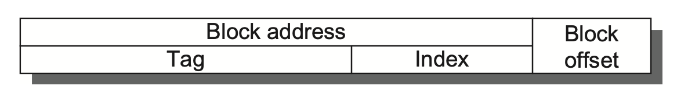
</div>

- **块地址**(block address)
    - **标签**(tag)：检查某个高速缓存块是否为处理器所需要的数据块（比对一下标签是否匹配），这个搜索过程一般是并行执行的
    - **索引**(index)：在组相联中用于选择具体的组
        - 如果是全相联的话，就没有索引位，因为没有组
    - 相联程度越高，标签位越多，而索引位越少
- **块偏移**(block offset)
- 此外还有一位**有效位**(valid bit)：用于表示某个高速缓存块是否持有有效地址。如果该位为0的话，表明地址无效，因此不能参与比较


#### Block Replacement

当失效发生时，控制器必须决定将哪个数据块作为被替换的块，用以存放处理器所需的数据。有以下几种可选的替换策略：

- 对于**直接映射**，由于每个数据块的位置是唯一的，所以无需选择，直接替换某个确定的数据块
- 对于**组相联**和**全相联**：
    - **随机**(random)：在某个组中随机挑选一个块
        - 最大的优点是实现简单
        - 一些系统会使用伪随机数来实现，这样也方便调试
    - **最近最少使用**(least recently used, LRU)：替换最久没使用过的数据块（借助了时间局部性的特征）
        - 缺点是实现复杂，所以可以使用某种 LRU 的近似实现，比如用一组 bit 来记录某个组内的数据块的访问情况ß
    - **先进先出**(first in, first out)：也是一种 LRU 的近似实现（因为 LRU 的实现较为复杂），替换最早存在的数据块


#### Write Strategy

大部分的处理器-高速缓存访问操作都是**读取**操作，而且处理器需要等待读取完毕才能继续执行，而无需等待写入操作，所以为了遵循 "Make common case fast" 这一思想，我们需要着重优化读取高速缓存的表现。然而，根据阿姆达尔定律，仅仅考虑读取的优化是不够的，我们还必须考虑**写入**操作的速度。

如果写入命中的话，通常会采取以下两种策略之一：

- **写穿**(write through)：写入的信息除了写入高速缓存的数据块外，还会写入下一级内存的数据块里
    - 优点：实现简单，简化数据一致性(data coherency)
    - 处理器必须等待写穿完成才能继续执行下一步，这种情况称为**写停顿**(write stall)。为了减少这种情况的发生，一种常见的优化方法是增加一个**写缓冲区**(write buffer)，允许处理器在数据写入缓冲区的同时继续执行后续任务，实现了处理器执行和内存更新这两项工作的重叠，节省时间。
- **写回**(write back)：信息只写入到高速缓存的数据块内，但是一旦某个高速缓存的数据块里将要被替代，那么将这个数据块原有的信息写入到下一级内存中
    - 此时高速缓存引入一个**脏位**(dirty bit)，作为记录某个数据块的修改情况的状态位。当脏位置1时，表明这个数据块是“脏”的（即被修改过了），此时就要将这个数据块的信息写入到下一级内存中
    - 优点：速度快（对高速缓存的多次写入的同时，可能只需对主存写入一次），使用更少的内存带宽（更适用于多核处理器），省电

对于 I/O 设备和多核处理器而言，它们希望同时有写回策略的速度和写穿策略的数据一致性。

如果写入失效的话，则会采取以下两种策略之一：

- **写分配**(write allocate)：当写入失效发生时，就会在高速缓存中分配一个数据块
    - 对应写回策略
- **非写分配**(no-write allocate)：不让写失效影响到高速缓存，而是直接修改下一级内存里的数据块
    - 对应写穿策略


??? example "例子"

    === "题目"

        <div style="text-align: center">
            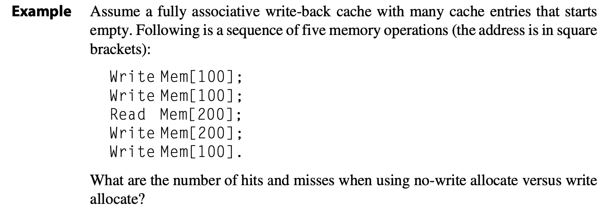
        </div>

    === "答案"

        <div style="text-align: center">
            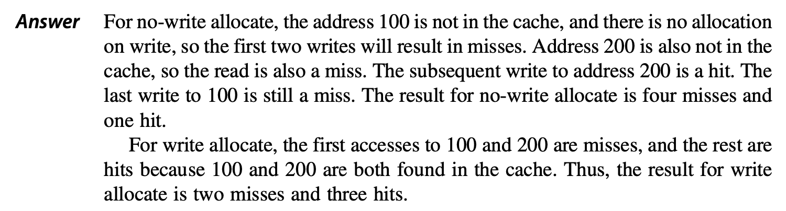
        </div>


## Cache

### Performance

我们可以将[上一章](1.md#quantitative-principles-of-computer-design)介绍的处理器执行时间的计算公式用于评估高速缓存的性能，不过需要额外加上**存储器停顿周期数**(memory stall cycles)：

$$
\text{CPU execution time} = (\text{CPU clock cycles} + \text{Memory stall cycles}) \times \text{Clock cycle time}
$$

而存储器停顿周期数由失效数和**失效损失**(miss penalty)共同决定：

$$
\begin{align}
\text{Memory stall cycles} & = \text{Numbers of misses} \times \text{Miss penalty} \notag \\
& = \text{IC} \times \dfrac{\text{Misses}}{\text{Instruction}} \times \text{Miss penalty} \notag \\
& = \text{IC} \times \dfrac{\text{Memory accesses}}{\text{Instruction}} \times \text{Miss rate} \times \text{Miss penalty} \notag
\end{align}
$$

- 其中最后一行式子更容易计算，因为这些量更容易被测量
- 失效损失实际上会随情况发生变化，但便于计算，我们就假定它是一个常数
- **失效率**(miss rate)：导致失效的高速缓存访问的比重
- 此外，失效损失和失效率在读和写的情况下会有所不同，所以如有必要可以分开讨论：

    $$
    \begin{align}
    \text{Miss stall clock cycles} = & \text{IC} \times \text{Reads per instruction} \times \text{Read miss rate} \times \text{Read miss penalty} \notag \\
    & + \text{IC} \times \text{Writes per instruction} \times \text{Write miss rate} \times \text{Write miss penalty} \notag
    \end{align}
    $$

    但还是为了便于讨论，之后不会做这种区分。

- 有时，使用**每条指令的失效次数**(misses per instruction)来衡量失效率，比原先用每次存储器访问的失效次数来衡量可能更好，因为这一指标和硬件实现无关。它们之间的关系为：

    $$
    \dfrac{\text{Misses}}{\text{Instruction}} = \dfrac{\text{Miss rate} \times \text{Memory accesses}}{\text{Instruction count}} = \text{Miss rate} \times \dfrac{\text{Memory accesses}}{\text{Instruction}}
    $$

    但这一指标的缺点在于它取决于架构实现。

---
如上所述，实际上无论是直接拿指令数，还是拿失效率作为衡量指标，都是有一些缺陷的，更好的测量方法是使用**平均存储器访问时间**(average memory access time, AMAT)作为指标，对应的计算公式为：

$$
\text{Average memory access time} = \text{Hit time} + \text{Miss rate} \times \text{Miss penalty}
$$

- 单位可以是绝对时间，也可以是周期数
- 这种方法实际上还是一种间接的测量方法

??? example "例子"

    AMAT 可用于衡量**分离高速缓存**(split cache)和**统一高速缓存**(unified cache)这两种不同组织的表现：

    === "题目"

        <div style="text-align: center">
            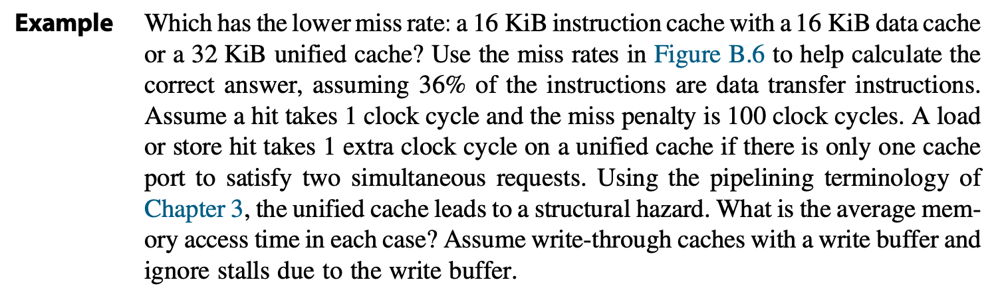
        </div>

    === "解答"

        <div style="text-align: center">
            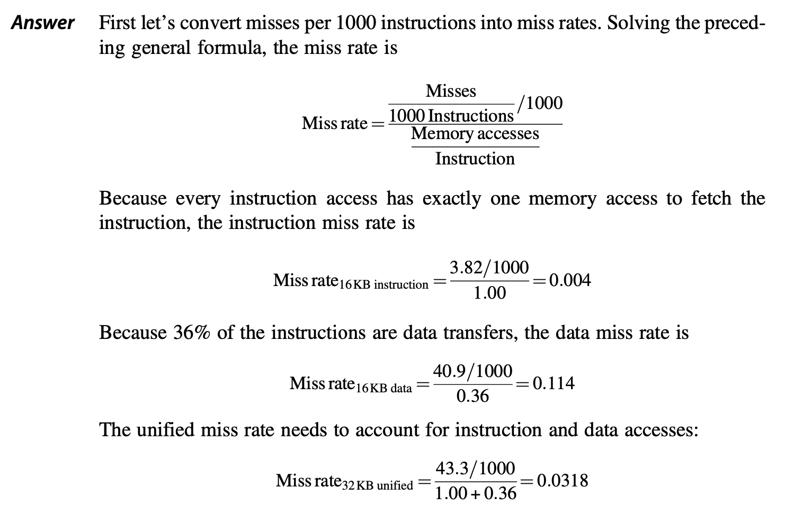
        </div>

        <div style="text-align: center">
            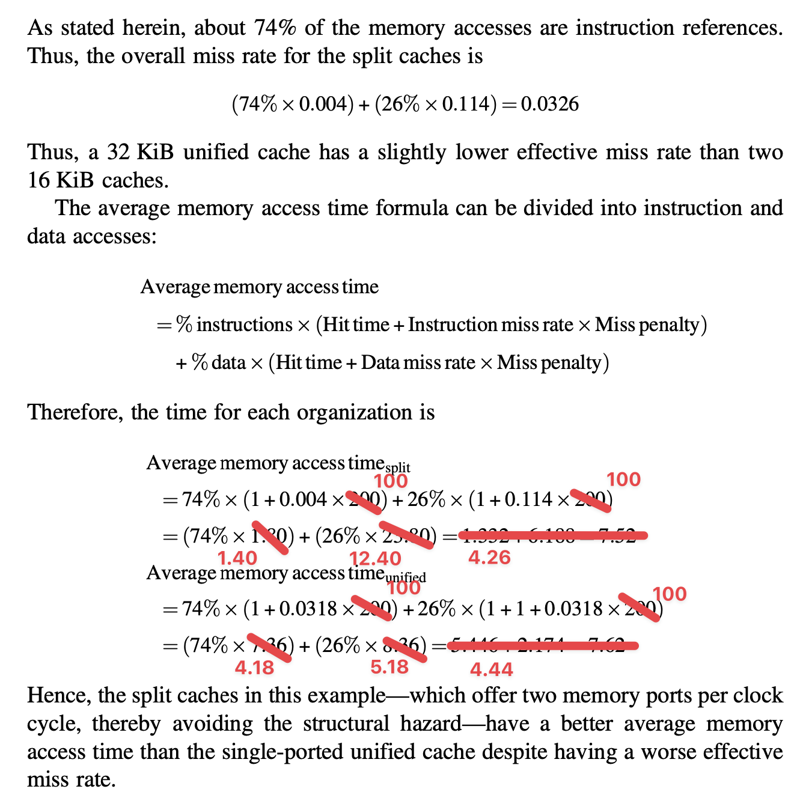
        </div>


#### Impact of Caches on Processor Performance

下面来探讨高速缓存的 AMAT 对处理器性能的影响。

- 虽然实际上可能有其他原因导致处理器的停顿，但为了便于讨论，我们假定只有存储器的停顿导致处理器的停顿
- 对于有序处理器而言，AMAT 确实能预测处理器的性能；但是对于乱序处理器（之后的章节会介绍）而言就没那么简单了
- 高速缓存的失效对于低 CPI 和高时钟频率的处理器而言有双重影响：
    - $\text{CPI}_{\text{execution}}$ 的值越低，高速缓存失效周期数的相对影响更大
    - 即使对于两个存储器层级相同的两台电脑而言，时钟频率更高的处理器在每次失效中会有更多的时钟周期数，因此存储器在 CPI 的占比会更高

??? example "例子"

    下面来看一下不同的高速缓存组织对处理器性能的影响：

    === "题目"

        <div style="text-align: center">
            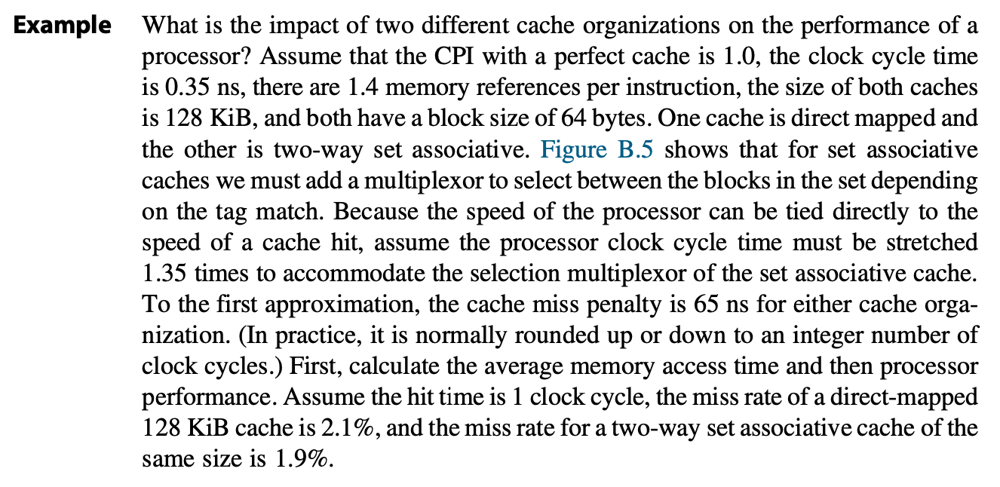
        </div>

    === "解答"

        <div style="text-align: center">
            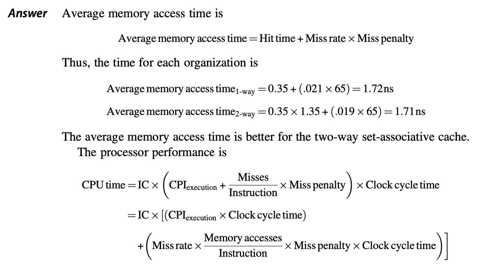
        </div>

        <div style="text-align: center">
            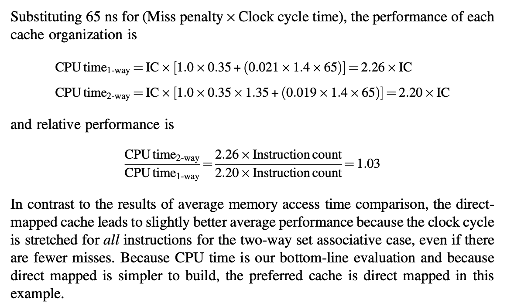
        </div>


#### Out-of-Order Execution Processors

对于乱序处理器而言，一件麻烦的事就是如何定义“失效损失”。下面我们仅将不重叠的时延作为失效损失来考虑，具体公式为：

$$
\dfrac{\text{Memory stall cycles}}{\text{Instruction}} = \dfrac{\text{Misses}}{\text{Instruction}} \times (\text{Total miss latency} - \text{Overlapped miss latency})
$$

我们需要考虑以下两点：

- 存储器时延的长度：在乱序处理器中，将什么东西考虑为存储器操作的开始和结束？
- 时延重叠的长度：什么是处理器内重叠的开始？

>我对乱序处理器这块部分实在不熟，所以不敢多写，之后有时间会再补点内容。

??? abstract "性能计算公式汇总"

    <div style="text-align: center">
        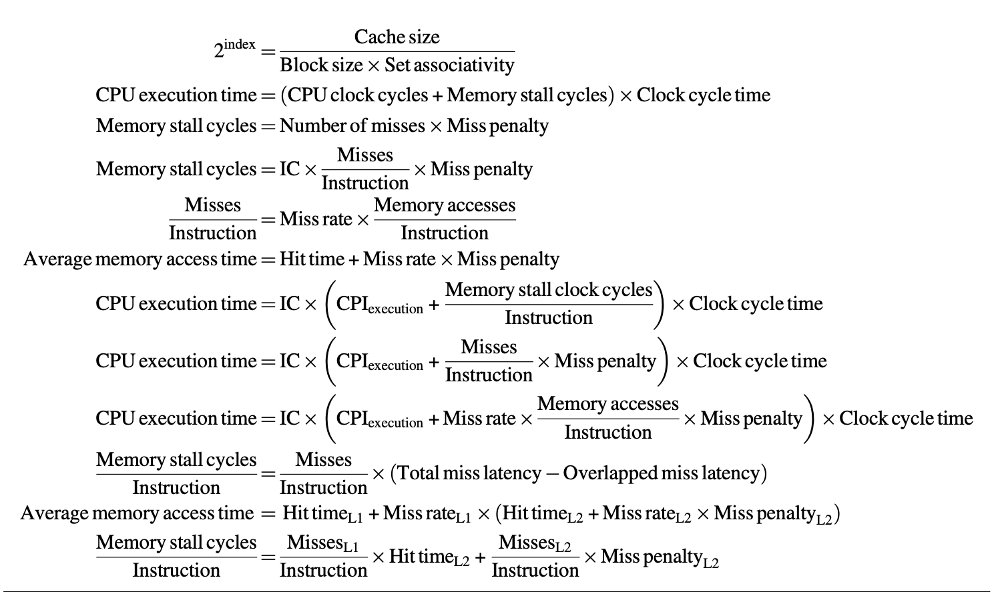
    </div>


### Basic Optimizations

根据 AMAT 的计算公式，我们可以得到以下三种提升高速缓存性能的方向，以及对应的优化方法：

- 降低**失效率**：更大的数据块，更大的高速缓存，更高的相联程度
- 降低**失效损失**：多级高速缓存，给予读取更高的优先级
- 降低**命中时间**：在索引（动词）高速缓存时避免地址的转换

在详细介绍这六种优化方法前，我们先为失效的情况分分类（称为 3C 模型）：

- **强制**(compulsory)（也称为冷启动失效(cold-start misses)/第一次引用失效(first-reference misses)）：最开始访问高速缓存的数据块时必定出现失效情况，此时对应的数据块必须先被带入到高速缓存中。
- **容量**(capacity)：在程序执行的过程中，高速缓存无法包含所有需要的数据块，于是不得不抛弃一些数据块，但之后可能又需要检索这些数据块，此时失效发生
- **冲突**(conflict)：对于组相联/直接映射而言，由于多个数据块映射到相同的组上，导致较早存入的数据被替换，使得后续访问时发生失效

??? info "注"

    其实还有第4个C——**一致性**(coherency)失效，它主要针对多核处理器的高速缓存。不过这个C不在本章的讨论范围内。

下面两张图分别展示了对于不同大小的高速缓存，3C模型在总失效率和失效率分布上的情况：

<div style="text-align: center">
    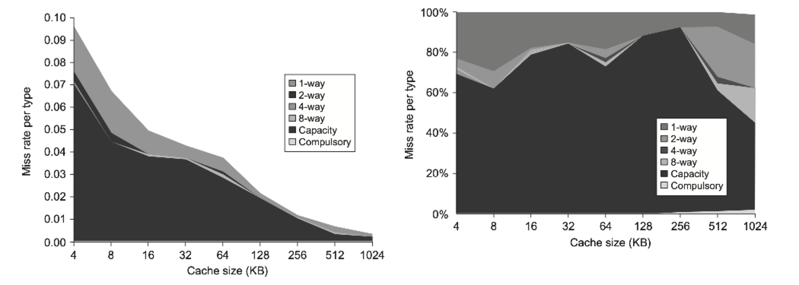
</div>

现在我们来思考一下如何解决这三类失效问题：

- 最容易解决的是**冲突失效**——采用全相联的置放方案就可以完全避免此类失效问题，但这种理论上很简单的做法花费的实际成本较大，且会降低时钟频率
- 对于**容量失效**，唯一能做的就是扩大高速缓存的容量，因为上级存储器容量过小的话会导致数据传输和置换时间的增加，从而带来存储器层级的**抖动**(thrash)问题
- 而对于强制失效，可以通过增大数据块容量来解决，但是这会导致其他失效的增加

3C 模型存在一些局限：

- 它只考虑了平均情况，而无法很好地解释个别的特殊情况
- 它同时忽视了替代的策略

所以，接下来我们将会看到：没有一种十全十美的优化方法，需要我们结合具体情况做好权衡。在正式介绍优化方法前，可以先瞄一眼下面这张总结图，留个总体的印象；等阅读完这六大优化方法后，再回过头来看这张图，这样有助于更好地理解这些优化方法带来的提升以及不足。

??? abstract "总结：六大基本的高速缓存优化方法"

    <div style="text-align: center">
        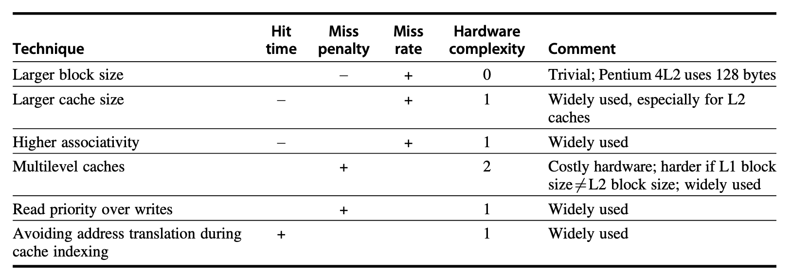
    </div>

    - `+`表示对该因素起到提升作用
    - `-`表示对该因素起到负面影响
    - 空白表示没有影响


#### Larger Block Size

**降低失效率**的最简单的方法是<u>增大数据块的大小</u>，它借助了空间局部性的优势，可以减少强制冲突的发生。

同时，更大的数据块还会提升失效损失，因为对于相同大小的高速缓存，数据块的数量会随之减少，从而导致冲突失效乃至容量失效的发生（当高速缓存较小时）。有时甚至还会出现失效损失的提升超过失效率的降低的情况，那么此时我们就不应该采取这种方法。

具体来说，数据块大小的选择需要同时考虑下级存储器的**时延**和**带宽**。

- 如果时延和带宽都很大的话，那么考虑使用更大的数据块，因为此时高速缓存在每次失效中可以得到更多的字节数据，而失效损失的提升相对较小
- 但如果时延和带宽都很小的话，则鼓励使用更小的数据块，因为更大的数据块只能节省很少的时间

下图展示了五种不同大小的高速缓存在不同大小的数据块下的失效率：

<div style="text-align: center">
    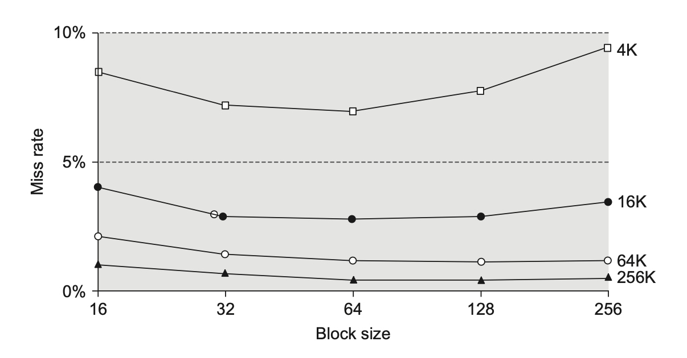
</div>

??? example "例子"

    === "题目"

        <div style="text-align: center">
            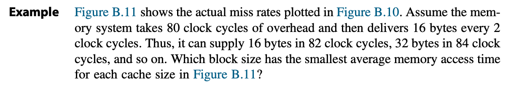
        </div>

        <div style="text-align: center">
            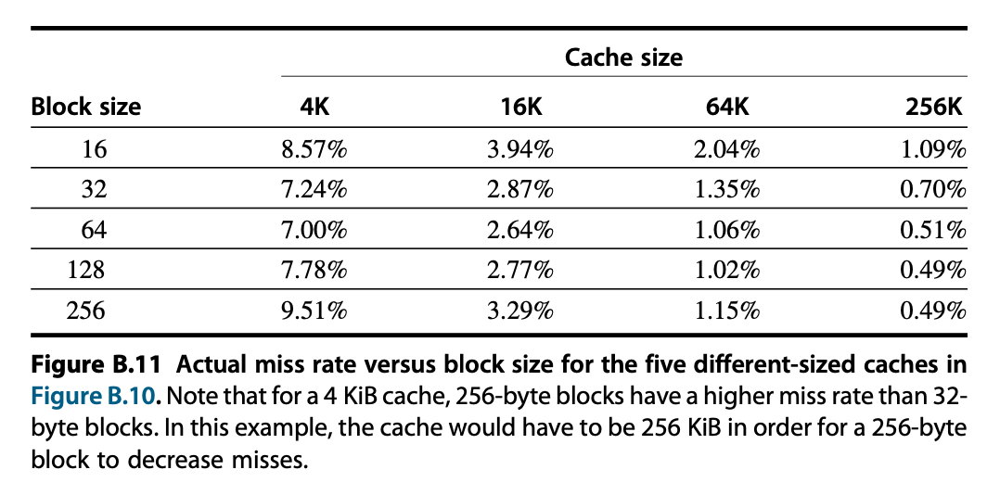
        </div>

    === "答案"

        <div style="text-align: center">
            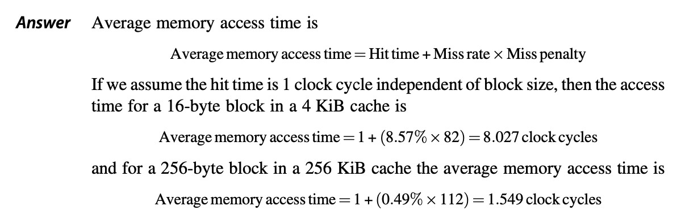
        </div>

        <div style="text-align: center">
            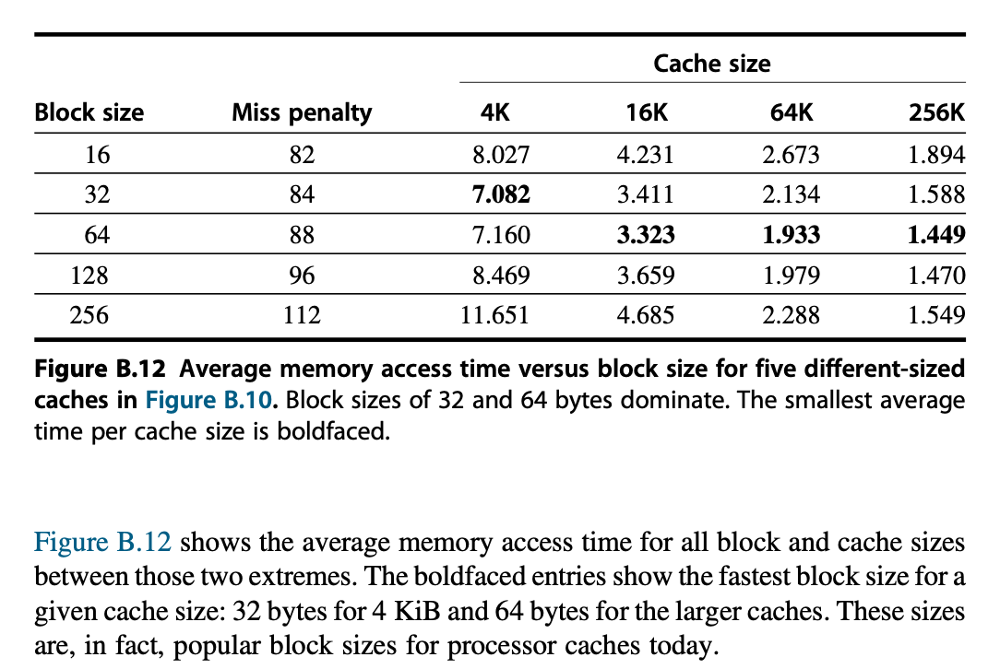
        </div>


#### Larger Caches

前面提到过，**降低容量失效**的一种方法是<u>增大高速缓存的大小</u>。但这样做的缺点是可能会带来更长的命中时间，以及消耗更高的成本和功率。

这种技术往往用于不在芯片上的高速缓存中。


#### Higher Associativity

在本节开篇介绍 3C 模型的时候，有两张关于 3C 模型与失效率相关的图表，里面也包含了和**相联程度**相关的内容。从这两张图表中，我们可以得到以下两条经验法则：

- 实际情况下，**八路组相联**降低失效的效果近乎等价于全相联的效果
- 2:1 高速缓存经验法则：（对于 128KiB 以下的高速缓存）对于大小为 N 的直接映射的高速缓存，它的失效率与大小为 N/2 的二路组相联的高速缓存的失效率相等

相联程度的提高虽然能够<u>降低失效率</u>，但代价是增大了命中时间。因此，对于高时钟频率的处理器而言，不建议提升相联程度；而在失效损失较大的情况下，则鼓励提升相联程度。

??? example "例子"

    === "题目"

        <div style="text-align: center">
            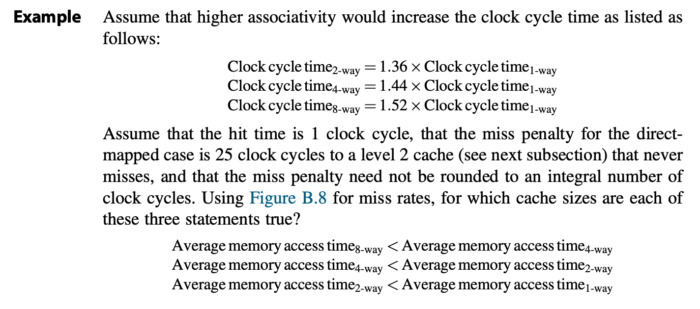
        </div>

    === "解答"

        <div style="text-align: center">
            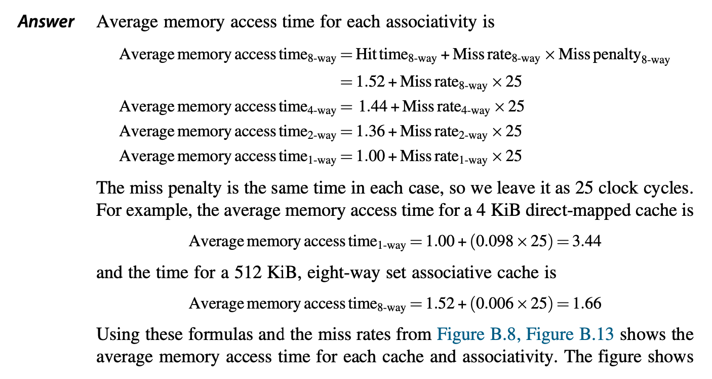
        </div>

        <div style="text-align: center">
            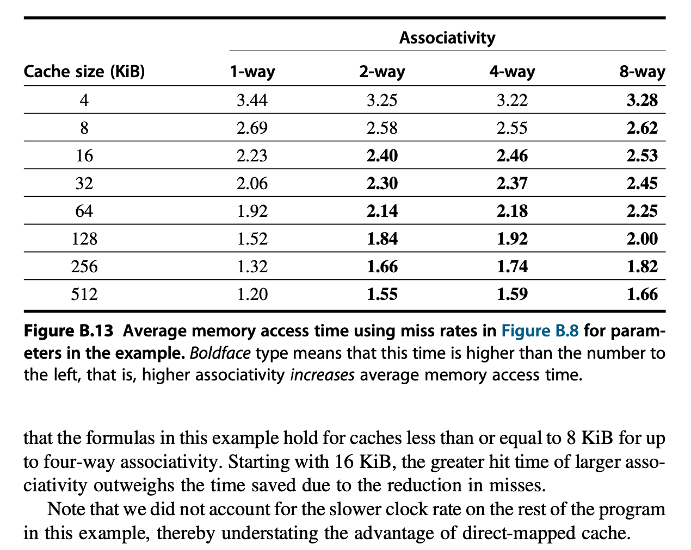
        </div>


#### Multilevel Caches

鉴于处理器和存储器之间的鸿沟，计算机架构师们会考虑这个问题：我们应该让高速缓存的速度变得**更快**，以跟上处理器的速度；还是应该让高速缓存变得**更大**，以克服处理器和内存之间不断变宽的鸿沟？那么鱼和熊掌是否可以兼得呢？——幸运的是，引入**多级高速缓存**(multilevel caches)的概念，我们可以兼得鱼和熊掌！

我们先考虑最简单的情况——两级高速缓存：

- 第一级高速缓存（以下简称 **L1**）可以足够小，以跟上处理器的时钟周期
    - 所以 L1 的速度将影响处理器的时钟频率
- 第二级高速缓存（以下简称 **L2**）可以足够大，以捕获更多对内存的访问
    - 所以 L2 的速度仅对 L1 的失效损失有影响
    - 如果 L2 不够大的话，反而会增加失效率

这样便能有效<u>减少失效损失</u>了。

引入多级高速缓存后，我们需要重新考虑 AMAT 的定义了——现在的计算公式变成了：

$$
\begin{align}
\text{Average memory access time} = & \text{Hit time}_{\text{L1}} + \text{Miss rate}_{\text{L1}} \notag \\
& \times (\text{Hit time}_{\text{L2}} + \text{Miss rate}_{\text{L2}} \times \text{Miss penalty}_{\text{L2}}) \notag 
\end{align}
$$

为了消除歧义，有必要在这里对“失效率”做进一步的阐述：

- **局部失效率**(local miss rate) = 在某个高速缓存的失效次数 / 在该高速缓存中总的存储器访问次数
    - L1 和 L2 的局部失效率分别为 $\text{Miss rate}_{\text{L1}}, \text{Miss rate}_{\text{L2}}$
- **全局失效率**(global miss rate) = 在某个高速缓存的失效次数 / 来自处理器的总的存储器访问次数
    - L1 和 L2 的全局失效率分别为 $\text{Miss rate}_{\text{L1}}, \text{Miss rate}_{\text{L1}} \times \text{Miss rate}_{\text{L2}}$

对于多级高速缓存而言，全局失效率是一种更合适的衡量指标。

如果不想考虑失效率的话，可以用每条指令的失效数作为衡量指标，计算公式为：

$$
\begin{align}
\text{Average memory stalls per instruction} = & \text{Misses per instruction}_{\text{L1}} \times \text{Hit time}_{\text{L2}} \notag \\
& + \text{Misses per instruction}_{\text{L2}} \times \text{Miss penalty}_{\text{L2}} \notag 
\end{align}
$$

!!! info "注"

    上述公式同时考虑到读取和写入操作，且假设 L1 采用写回策略。

下面这个例子能够展现这个指标相比 AMAT 的优越性：

??? example "例子"

    === "题目"

        <div style="text-align: center">
            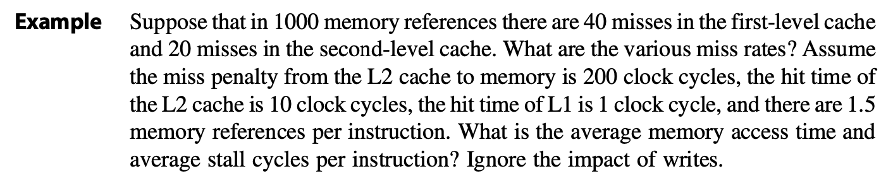
        </div>

    === "解答"

        <div style="text-align: center">
            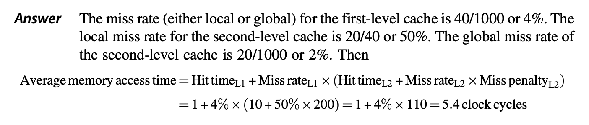
        </div>

        <div style="text-align: center">
            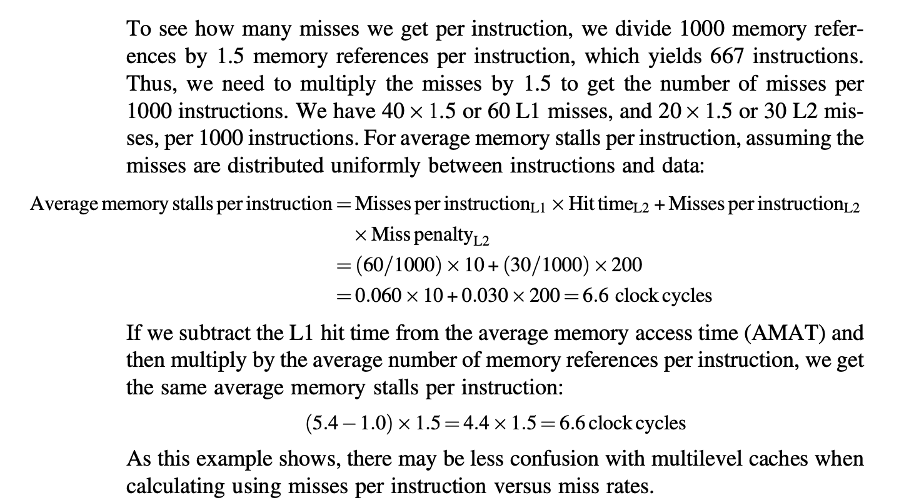
        </div>

---
下面两张图分别展示了 L2 的大小对失效率和相对执行时间的影响：

<div style="text-align: center">
    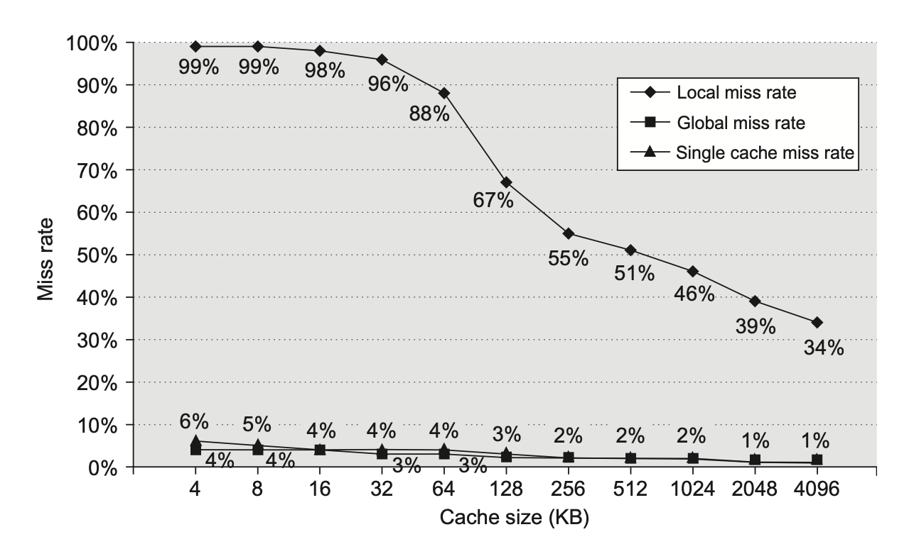
</div>

<div style="text-align: center">
    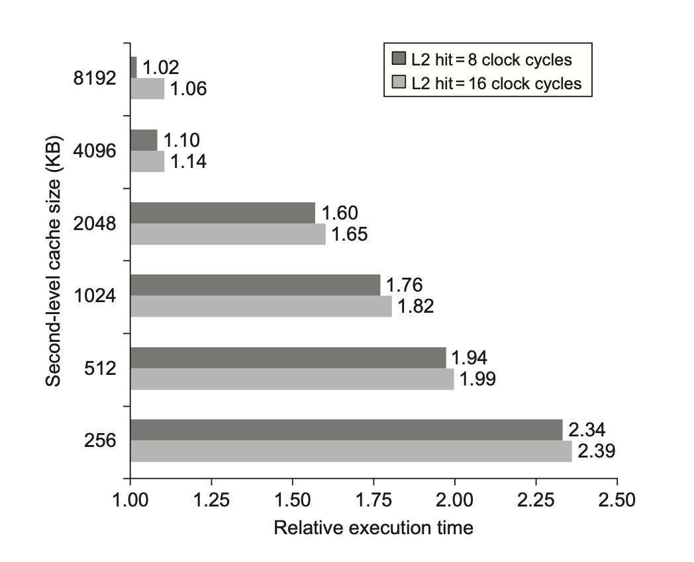
</div>

可以发现：

- 当 L2 足够大时，全局失效率与 L2 的失效率非常相似
- 局部失效率不是一个良好的二级高速缓存的衡量指标

---
此外，L2 的相联程度也会影响整个高速缓存的失效损失，具体见下面的例子：

??? example "例子"

    === "题目"

        <div style="text-align: center">
            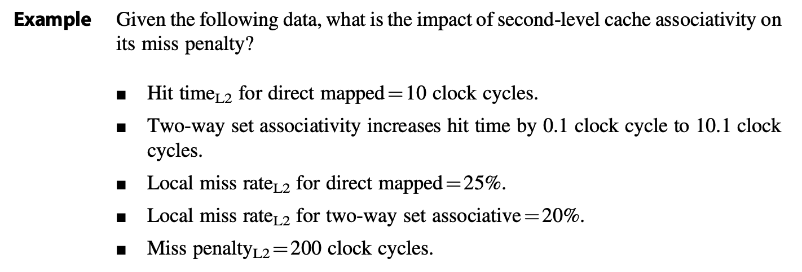
        </div>

    === "解答"

        <div style="text-align: center">
            
        </div>

        <div style="text-align: center">
            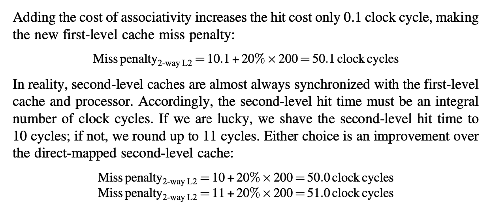
        </div>

---
最后需要考虑的问题是：L1 内的数据是否需要出现在 L2 内？由此引出了两种策略：

- **多级包含**(multilevel inclusion)：L1 的数据永远都会在 L2 出现，这样可以确保数据的一致性
    - 缺点是对于数据块大小不同的多级高速缓存中，需要做额外的处理工作，这样可能会略微提高 L1 的失效率。因此为了方便起见，很多高速缓存设计中会让各级的高速缓存保持相同大小的数据块。
- **多级排斥**(multilevel exclusion)：L1 的数据永远不会在 L2 出现
    - 这适用于 L2 仅比 L1 稍大一些的情况。
    - 当 L1 出现失效的情况时，交换 L1 和 L2 的数据，而非用 L2 的数据块替代 L1，以避免 L2 额外的空间浪费


#### Giving Priority to Read Misses over Writes

我们知道，在采用**写穿**策略的高速缓存中，最重要的提升手段是采用一个**写缓冲区**。但这个写缓冲区会进行较为复杂的内存访问操作，因为它可能会保留读取损失时位置的更新值。

??? example "例子"

    === "题目"

        <div style="text-align: center">
            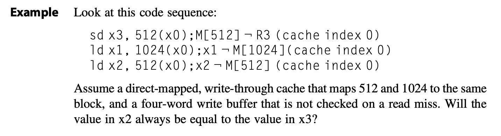
        </div>

    === "解答"

        <div style="text-align: center">
            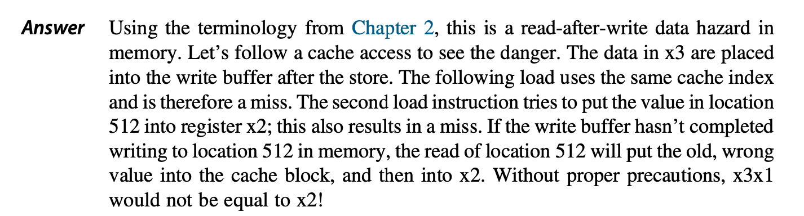
        </div>

要解决这一问题，最简单的方法是在遇到读取失效时等待，直到写缓冲区里没有东西为止——这种做法的效率显然不够高，因此更常见的做法是在读取失效时检查写缓冲区的内容，如果没有冲突且存储器系统可用的话，那么就让读取失效继续下去，这样便<u>让读取操作的优先级高于写入操作</u>。

对于写回策略，这种方法同样能够降低写入的成本。

>具体分析先放一下，我还需要时间理解一下...


#### Avoiding Address Translation During Indexing of the Cache

高速缓存需要完成从虚拟地址到物理地址的转换。

为了 "make common case fast"，高速缓存会用到虚拟地址，因为这样会提高命中率，而这样的高速缓存称为**虚拟高速缓存**(virtual caches)（对应传统意义上使用物理地址的**物理高速缓存**(physical caches)）。

在高速缓存中，我们需要区分两件事：索引高速缓存（即找到对应的组）和比较地址（的标签位）。那么，虚拟地址和物理地址更适合完成这两项任务中的哪一个呢？假如对于索引和标签，全部使用虚拟地址，这样就消除了转换所需的时间。看起来挺好的，但实际上没什么人会这样做，这是因为：

- 考虑到虚拟地址转换为物理地址时的页级**保护**机制
    - 通过在失效时拷贝 TLB 上的保护信息，并用一个字段来保存这个信息，并且在每次访问虚拟高速缓存时进行检查来克服这个问题
- 每当切换进程时，虚拟地址就会指向不同的物理地址，需要对高速缓存进行清除操作
    - 通过增加地址标签位的宽度，作为**进程标识符标签**(process-identifier tag, PID)使用来解决这个问题。如果操作系统为进程赋予这些标签的话，它只需要清除那些 PID（用于区分高速缓存中的数据是否用于该程序）被回收的标签，避免过多的清除操作，从而降低失效率：

    <div style="text-align: center">
        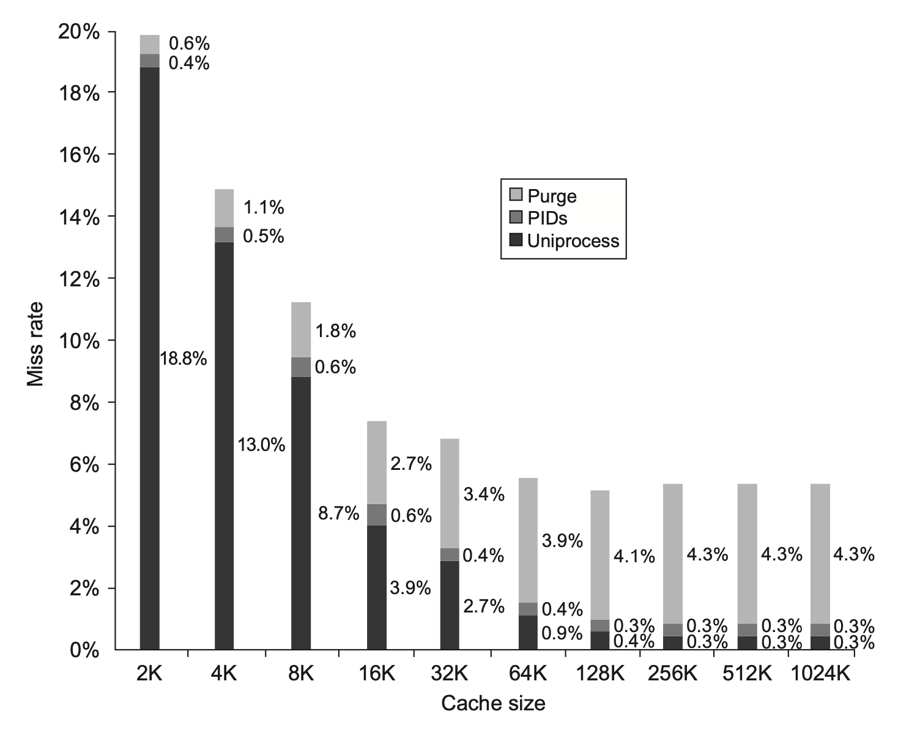
    </div>

- 操作系统和用户程序可能使用两个不同的虚拟地址来指代同一个物理地址
    - 这些重复的地址称为同义词(synonyms)或**别名**(aliases)
    - 硬件层面上，解决此问题的方法是**反别名**(antialiasing)：确保每个高速缓存数据块对应唯一的一个物理地址
    - 软件层面上，解决此问题的方法是强迫这些别名共享一些地址位，这种限制称为**页着色**(page coloring)，可以看作是组相联在虚拟内存中的应用。该方法能有效提升页偏移量，因为它保证了虚拟地址和物理地址最后的某些位是相同的

- I/O 设备

一种可以同时利用虚拟高速缓存和物理高速缓存优势的方法是：使用虚拟地址和物理地址中页偏移量相同的那部分来索引高速缓存，同时在使用该索引读取高速缓存的时候，转换地址的虚拟部分，并且用标签匹配物理地址。该方法实现了立即读取高速缓存的数据，并且仍然使用物理地址进行比较。这种方法称为**虚拟索引，物理标签**(virtually indexed, physically tagged)。

下图展示了从虚拟地址到 L2 高速缓存访问的存储器层级原理图：

<div style="text-align: center">
    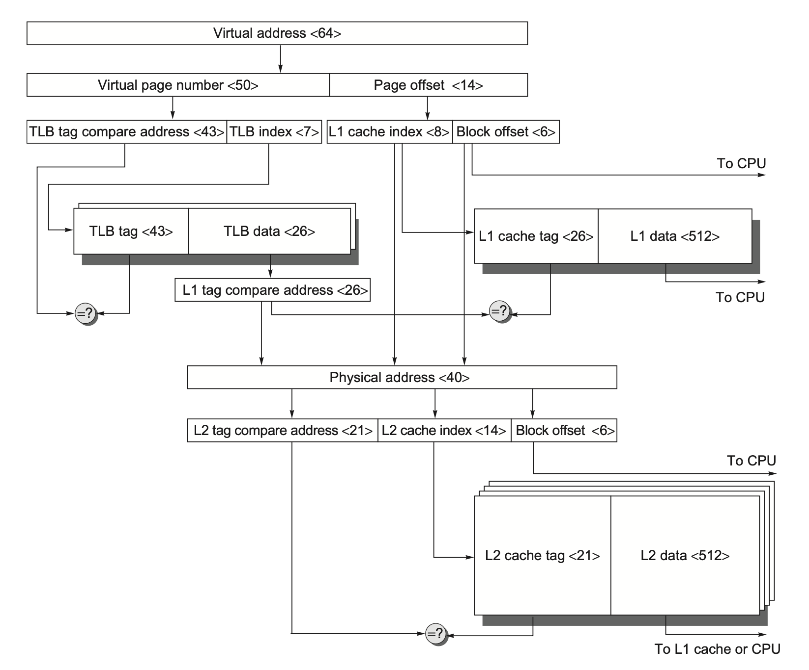
</div>

相联程度可以保留地址物理部分内的索引，并且仍然可以支持较大的高速缓存。


### Advanced Optimizations

在高级优化方法中，我们除了考虑 AMAT 公式中的三个因素外，还要考虑高速缓存的带宽和功耗问题。根据这5个因素，将下面即将介绍的优化方法分个类：

- **减少命中时间**：小而简单的一级高速缓存，路预测(way-prediction)。这两种方法还能降低功率。
- **增加高速缓存带宽**：流水线高速缓存(pipelined caches)，多分区高速缓存(multibanked caches)。这两种方法对功率的影响视具体情况而定
- **减少失效损失**：关键字优先，合并写缓冲区。这两种方法略微提升功率。
- **减少失效率**：编译器优化。任何在编译时的提升能够降低功率。
- **通过并行减少失效损失或失效率**：硬件预取，编译器预取。这两种方法都会提升功率，很可能是因为预取的数据没有被用到。

和介绍基本优化方法时一样，在开始之前也先放一张总结表格，可以先留个印象，学完后再回过头来看一遍，进一步加深印象。

??? abstract "总结：十大进阶的高速缓存优化方法"

    <div style="text-align: center">
        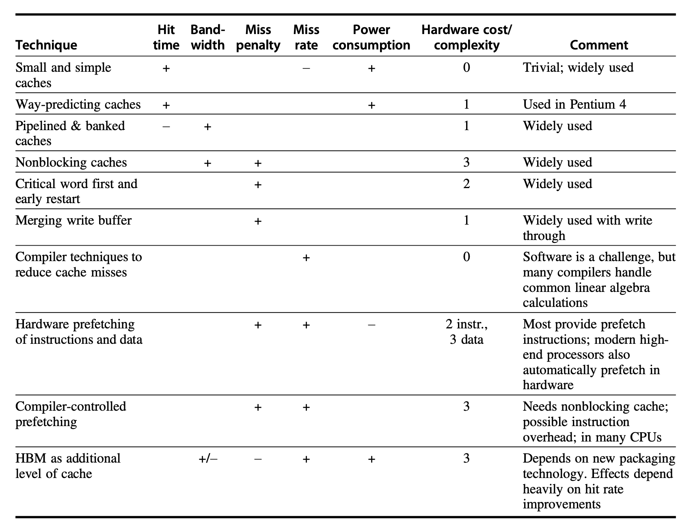
    </div>


#### Small and Simple First-Level Caches

<u>减小一级高速缓存（以下简称 L1）的大小，或者降低 L1 的相关程度</u>都有助于**减小命中时间和功耗**。

- 回顾高速缓存命中的过程
    1. 使用地址的索引部分找到待比较的组
    2. 使用地址的标签部分比较，检查是不是处理器所需要的数据
    3. 如果是的话，就通过 MUX 选择正确的数据项
- 所以，直接映射的高速缓存能够将 2-3 两步合并在一起（因为一个组里只有一个数据块），从而降低命中时间；而且因为访问内容更少，还能降低功率
- 相联程度对命中时间的影响：

    <div style="text-align: center">
        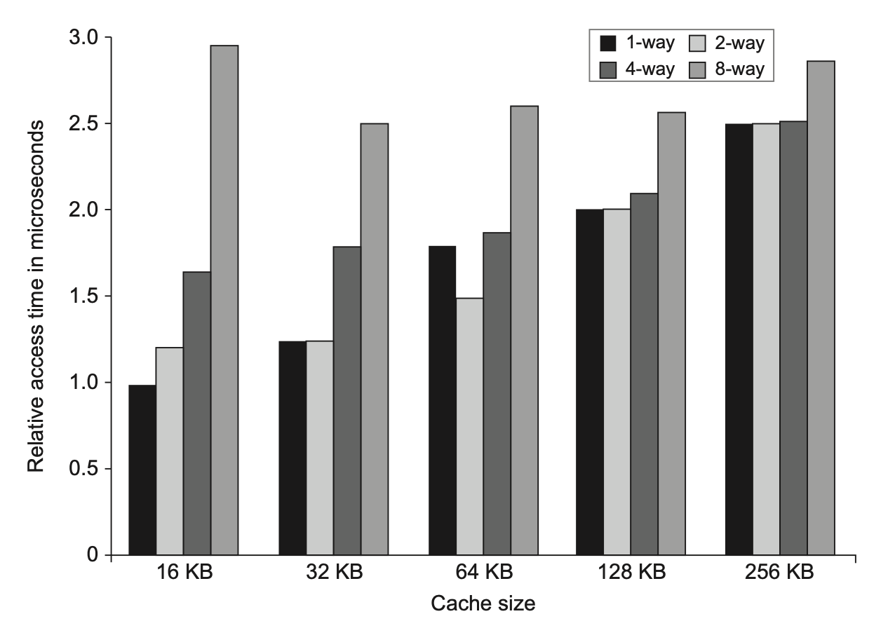
    </div>

??? example "例子"

    === "题目"

        <div style="text-align: center">
            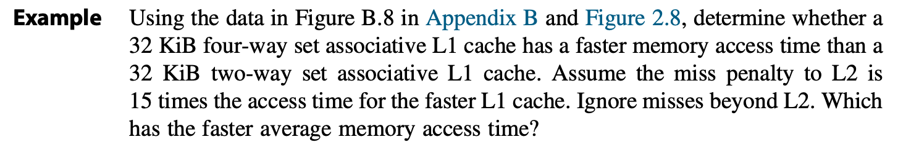
        </div>

    === "解答"

        <div style="text-align: center">
            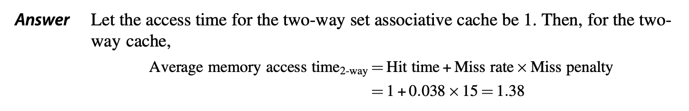
        </div>

        <div style="text-align: center">
            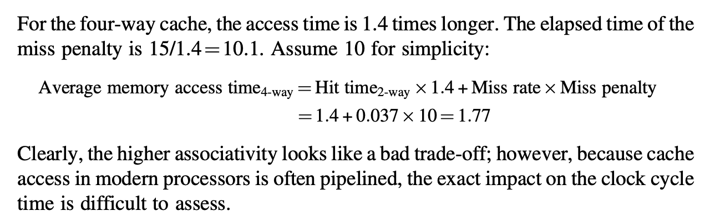
        </div>

- 相联程度对功耗的影响：

    <div style="text-align: center">
        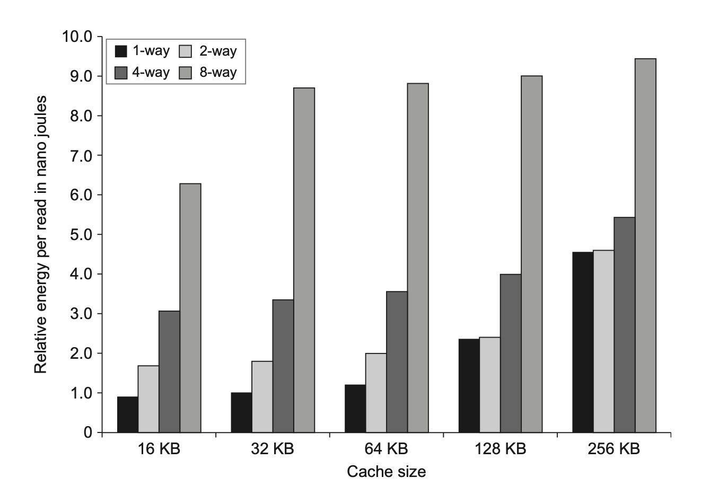
    </div>

- 最近的设计反而采用更高相联程度的高速缓存，这是因为：
    - 很多处理器至少需要 2 个时钟周期来访问高速缓存，因此更长的命中时间并没有带来很大影响
    - 为了减少 TLB 的延时，所有的 L1 都是虚拟索引的（有待进一步理解）
    - 多线程导致冲突失效的增加，因而需要更高的相联程度


#### Way Prediction

**路预测**(way-prediction)：在高速缓存中保留额外的位（称为数据块预测者位(block predictor bit)），用于预测下一次可能被访问的数据块。

- 如果预测正确，高速缓存的访问时延就是很快的命中时间
- 如果预测失败，那么就要尝试下一个数据块，改变预测者的内容，并且会有一个额外的时钟周期时延

模拟结果表明：二路组相联和四路组相联的路预测准确率分别超过 90% 和 80%，且指令高速缓存相比数据高速缓存表现更好。

这种方法的一大缺点是加大了使高速缓存访问流水线化的难度。


#### Pipelined Access and Multibanked Caches

<u>使高速缓存访问流水线化</u>以及<u>采用多个**分区**(banks)加宽高速缓存</u>都能**提升高速缓存的带宽**。这些优化方法主要针对的是 L1，因为它的访问带宽会限制指令的吞吐量。但多个分区的做法同样可以用于 L2 和 L3 高速缓存中，但主要作为功率管理技术。

- 使高速缓存访问流水线化：带来更高的时钟周期数，代价是提升了时延
    - 使**指令**高速缓存流水线化可以有效提升流水线 CPU 的阶段数量，但这样会导致更大的分支预测错误损失
    - 使**数据**高速缓存流水线化可以在发射加载指令和使用数据之间增加更多的时钟周期数
    - **指令**高速缓存的流水线化相比**数据**高速缓存更为简单
- 采用多个分区加宽高速缓存：高速缓存被分为独立的分区，每个分区支持独立的访问
    - 当访问在这些分区中平均分布时，这种方法的表现最好，因此如何将地址映射到分区会影响到存储器系统的行为
    - 一种简单的映射方法是按顺序将地址平均分配给每个分区，这样的方法称为**顺序交错**(sequential interleaving)

    <div style="text-align: center">
        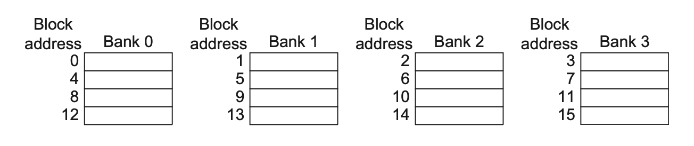
    </div>


#### Nonblocking Caches

乱序执行的流水线 CPU 不会在数据高速缓存失效时停顿，比如它在等待获取失效数据的同时还能继续从指令高速缓存中获取指令。而**非阻塞的高速缓存**(nonblocking caches)允许数据高速缓存在失效发生时继续提供命中，从而发挥出乱序流水线 CPU 的潜在优势。这种 "hit during miss" 的优化方法能够降低失效损失。

一种更复杂，但能进一步降低失效损失的方法是 "hit under multiple miss" 或 "miss under miss"：将多个失效重叠在一起。

??? example "例子"

    === "题目"

        <div style="text-align: center">
            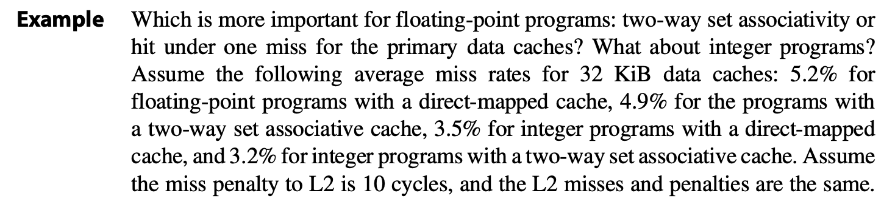
        </div>

    === "答案"

        <div style="text-align: center">
            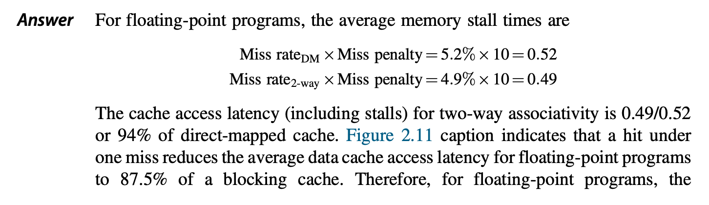
        </div>

        <div style="text-align: center">
            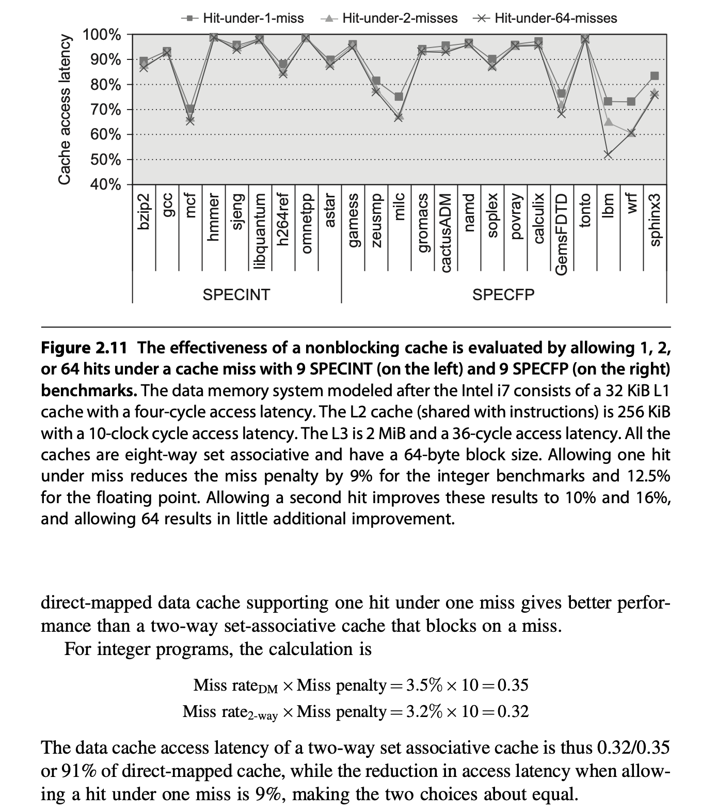
        </div>

高速缓存失效不会使处理器停顿的特点加大了评估非阻塞高速缓存性能的难度。有效的失效损失不是所有失效损失之和，而时使得处理器停顿的非重叠的时间。非阻塞高速缓存带来的好处取决于多个失效带来的失效损失、内存引用模式以及在**未完成的失效**(outstanding misses)发生时处理器执行的指令数。

乱序处理器能够隐藏在 L1 失效但在 L2 命中的失效损失，但是无法隐藏更低级的高速缓存失效。决定支持多少未完成的失效取决于以下因素：

- 失效流的时间和空间局部性，这决定了失效是否发起向下一级高速缓存或内存的访问
- 相应内存或高速缓存的带宽
- 为了允许最底层的高速缓存有更多的未完成的失效，要求最高层的高速缓存至少支持与最底层同样多的失效，因为失效是从最高层的高速缓存中发起的
- 存储器系统的时延

---
实现一个非阻塞高速缓存较为困难，原因有：

- 为命中和失效的竞争进行仲裁
    - 解决方案：给予命中更高的优先级，然后为冲突的失效排序
- 追踪未完成的失效，以弄清何时让加载和存储操作继续
    - 解决方案：使用**失效状态处理寄存器**(miss status handling register, MSHR)来记录信息。一个 MSHR 对应一个未完成的失效，记录与这个失效相关的一些信息。


#### Critical Word First and Early Start

- **关键字优先**(critical word first)：从内存中请求失效的字数据，一旦获取数据后便立即发送给处理器，并让处理器在填充数据块剩余字数据的同时继续执行指令。
- **早启动**(early start)：按正常顺序获取字数据，但一旦获取到所需的字数据，就将其发送给处理器并让处理器继续执行指令。

这两种优化方法仅在高速缓存数据块较大的情况下有明显的好处。它们带来的好处还取决于访问数据块中未获取的部分的可能性。

它们和非阻塞高速缓存一样，为计算失效损失带来了不小的麻烦。


#### Merging Write Buffer

- 写穿依赖于写缓冲区，即使是写回有时也会用到写缓冲区。
- 如果写缓冲区是空的，那么数据和完整的地址都会被写入到缓冲区中，并且从处理器的视角看写操作已完成，所以在写缓冲区准备将字数据写入内存时，处理器继续干活。
- 如果缓冲区包含一些被修改的数据块，那么就要检查一下地址，看这些新数据的地址是否与某个有效的写缓冲区项匹配，如果匹配的话，就将新数据并入到这个项里。这种优化方法称为**写合并**(write merging)。
- 但如果写缓冲区是满的，且没有任何地址匹配，那么高速缓存（和处理器）必须等待，直到写缓冲区有一个空的项。
- 这种优化方法能够更加高效地利用内存，因为一次写入多个字数据通常比一次写一个字数据的速度更快；并且也能减少停顿次数。
- 下图比较了未使用写合并的写缓冲区和使用写合并的写缓冲区：

<div style="text-align: center">
    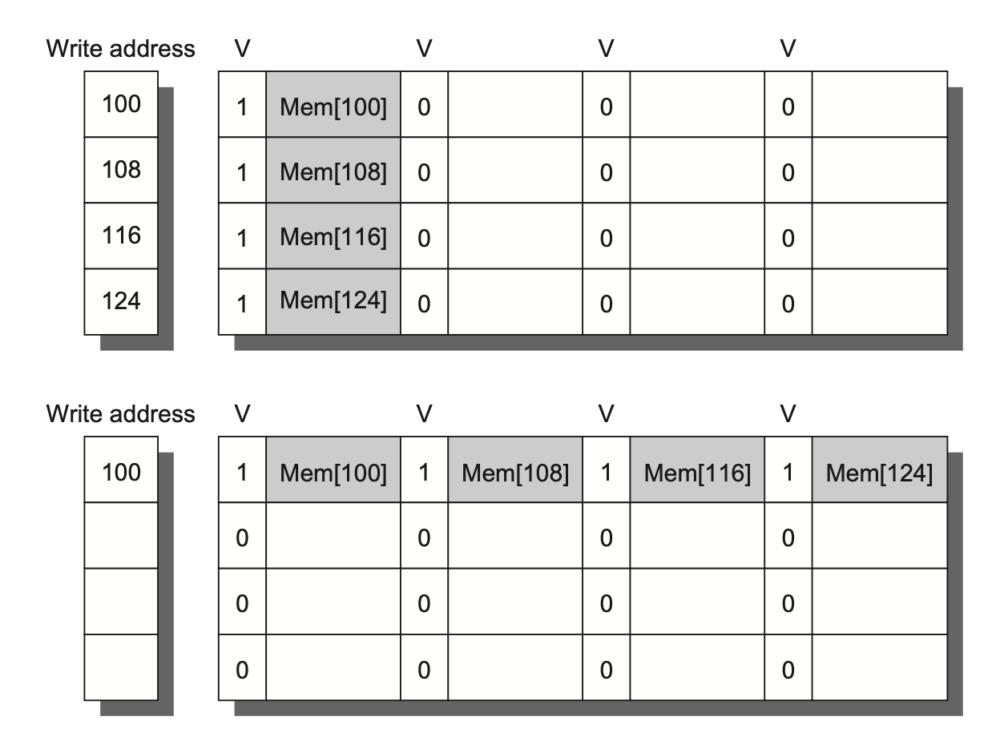
</div>


#### Compiler Optimizations

前面讲到的优化都是硬件层面的优化，我们当然也可以进行软件层面的优化。下面就来介绍如何通过**优化编译器**来减少失效率。

- **循环交换**(loop interchange)：有时通过交换内层循环和外层循环，使得访问数据的顺序更符合存储数据的顺序。这种方法通过改进空间局部性来减少失效率。

    ??? example "例子"

        假定有一个二位数组，规模为 [5000, 100]，且 x[i, j] 和 x[i, j+1] 两个元素是相邻的（行优先）。那么对于下面两个嵌套循环，更推荐使用第二个循环：

        ```c
        // loop 1
        for (j = 0; j < 100; j++)
            for (i = 0; i < 5000; i++)
                x[i][j] = 2 * x[i][j];

        // loop 2
        for (i = 0; i < 5000; i++)
            for (j = 0; j < 100; j++)   
                x[i][j] = 2 * x[i][j];
        ```

- **分块**(blocking)：将大的数组划分一块块小块(block)，通过分别解决每个小块来解决整个数组。该方法同时利用了空间和时间的局部性。下面通过一个矩阵乘法的例子来认识该方法带来的好处：

??? example "例子"

    给定两个规模均为 NxN 的矩阵 y, z，计算 x = y * z。

    代码如下：

    ```c
    for (i = 0; i < N; i++)
        for (j = 0; j < N; j++) {
            r = 0;
            for (k = 0; k < N; k++)
                r = r + y[i][k] * z[k][j];
            x[i][j] = r;
        }
    ```

    在最坏情况下，$N^3$ 次运算需要访问 $2N^3 + N^2$ 个内存字数据。

    下图展示了某个时间段内矩阵的运算情况，其中深灰色表示最近访问的元素，浅灰色表示之前访问的元素，白色表示尚未访问的元素。

    <div style="text-align: center">
        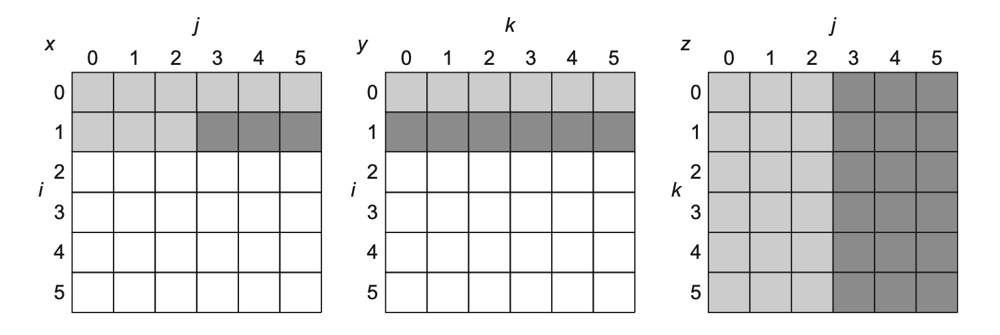
    </div>

    如果高速缓存空间有限，这样做显然是不行的。所以在计算前，需要将矩阵划分为 BxB 大小（B 称为**分块因子**(blocking factor)）的子矩阵，逐个计算子矩阵乘法的结果。此时所需的内存字数据个数为  $2N^3 / B + N^2$，节省了高速缓存的空间，从而减少容量失效的发生。代码为：

    ```c
    for (jj = 0; jj < N; jj += B)
        for (kk = 0; kk < N; kk += B)
            for (i = 0; i < N; i++)
                for (j = jj; j < min(jj + B, N); j++) {
                    r = 0;
                    for (k = kk; k < min(kk + B, N); k++)
                        r = r + y[i][k] * z[k][j];
                    x[i][j] += r;
                }
    ```

    下图展示了某个时间段内矩阵的运算情况：

    <div style="text-align: center">
        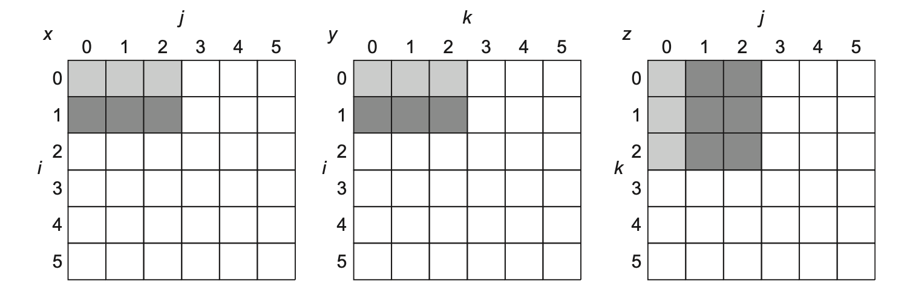
    </div>


#### Hardware Prefetching of Instructions and Data

另一种减小失效损失的方法是在处理器请求指令或数据之前，将这些指令或数据**预取**(prefetch)出来，放在高速缓存或其他外部缓冲区内。

- 指令预取往往是在高速缓存外进行的。通常，处理器在失效时会获取两个块，一个请求块，以及连续的下一个块。当请求块返回时，它会被放在指令高速缓存内，并且把预取块放在指令流缓冲区内。如果请求块出现在指令流缓冲区内，那么原来的高速缓存请求就会取消，这个块就会从流缓冲区中读出，并且发射下一个预取请求（？）
- 相同的方法可用于数据访问中
- 预取依赖对内存带宽的使用
- 如果预取干扰到失效，那么反而会降低性能


#### Compiler-Controlled Prefetching


#### Using HBM to Extend the Memory Hierarchy


## Virtual Memory

**虚拟内存**(virtual memory)将物理内存划分为块，并且将其分配到不同的进程中。下图展示了虚拟地址到物理地址的映射情况：

<div style="text-align: center">
    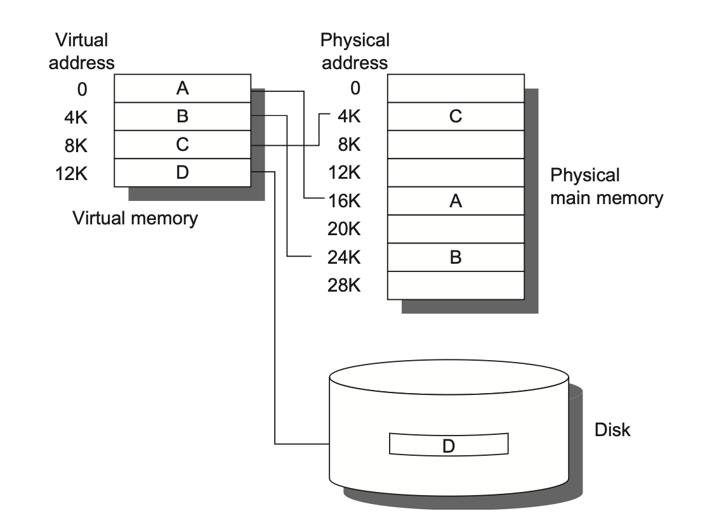
</div>


虚拟内存的作用包括：

- 共享受保护的内存空间
    - 虚拟内存采取一种**保护**机制，防止属于某个进程的内存块被其他进程访问
- 自动管理存储器层级
- 简化执行程序的加载：通过**重定位**(relocation)，允许相同的程序可以在物理内存中的任意位置运行
- 减少开始程序的时间：因为无需物理内存中所有的代码和数据

下面是虚拟内存中常见的一些概念，比如：

- **页**(page)/**段**(segment)（类比高速缓存的数据块）
    - **页**：定长的虚拟内存数据块，一般是 4KB 到 8KB 左右
        - 按页寻址：定长的地址被划分为页编号和页偏移量
        - 对编译器而言，这种地址空间更简单
    - **段**：变长的虚拟内存数据块，最大可以到 64KB 到 4GB 左右，最小可以只有 1B
        - 按段寻址：使用1个字来表示段编号，另1个字表示段偏移量

    <div style="text-align: center">
        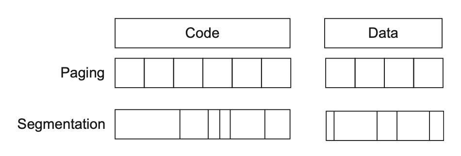
    </div>

    下图比较分页和分段两种方式的优劣：

    <div style="text-align: center">
        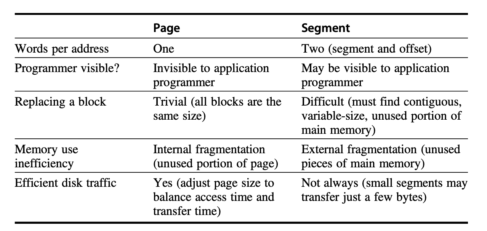
    </div>


- **页错误**(page fault)/**地址错误**(address fault)（类比高速缓存的失效）
- **虚拟地址**(virtual address)和**物理地址**(physical address)
- **内存映射**(memory mapping)/**地址转换**(address translation)
 
高速缓存与虚拟内存的不同之处有：

- 高速缓存失效的替换是由硬件控制的，而虚拟内存的替换是由操作系统控制的
- 处理器地址的大小决定了虚拟内存的大小，而高速缓存的大小与处理器地址的大小无关

<div style="text-align: center">
    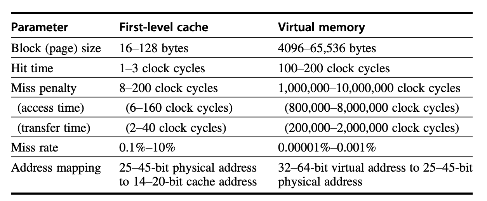
</div>


### Four Memory Hierarchy Questions Revisited

- 数据块放置：**全相联**
    - 理由：虚拟内存的失效损失相当相当大（数百万个时钟周期数），因此需要尽可能地降低失效率，而全相联的失效率最低。
- 数据块识别：通过页/段编号来索引对应的页/段
    - 通常使用**页表**(page table)这一数据结构来存储虚拟内存数据块的物理地址（段的话还要存储偏移量），作为虚拟地址转换为物理地址的参照依据。

        <div style="text-align: center">
            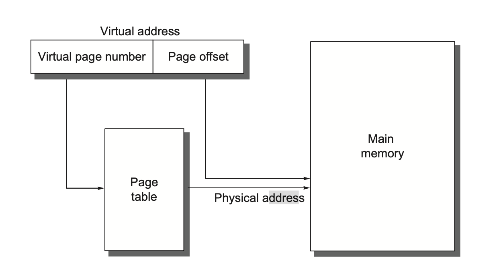
        </div>

    - 页表的大小就是虚拟地址空间中的页数量。有些计算机为了减小这一数据结构大小，会对虚拟地址采用**哈希函数**，使得其大小等于内存中物理页的数量，这种数据结构称为**逆页表**(inversed page table)。
    - 为了减少地址转换的时间，通常还会用到一种名为转换后备缓冲区(translation lookaside buffer, 以下简称 **TLB**)
- 数据块替换：**LRU**，具体会用到一个使用位/引用位(use/reference bit)。操作系统会周期性地清除使用位，随后又添上去，这样便可以记录一段时间内页的访问情况。
- 写入策略：**写回**
    - 理由：内存和处理器访问时间的巨大差异，所以不可能使用写穿策略
    - 虚拟内存系统用到1个**脏位**(dirty bit)，允许数据块在因从硬盘读取而被改变的时候写入到硬盘中（？）


### Techniques for Fast Address Translation

由于页表很大，所以一般被存在内存中，甚至有时候页表自己也要分页。而分页意味着逻辑上内存访问需要分两步走：首先需要找到物理地址，然后再根据物理地址找找到数据。为了避免额外的内存访问，我们可以借助局部性原则，将部分地址的翻译保留到一个特殊的缓存中，这样的缓存就是我们熟知的 **TLB**。

TLB 的结构类似高速缓存：它的标签位用于保存虚拟地址，而数据位用于保存物理页编号，保护字段，合法位，以及可能的使用位和脏位。

- 如果要改变页表中的物理页编号和保护信息，那么操作系统必须将 TLB 中的对应部分给清掉。
- 这里的“脏位”表示对应的页是不是“脏”的，而不是表示 TLB 中的地址翻译或数据缓存的特定的数据块是不是脏的。
- 操作系统通过改变页表中的值，以及使 TLB 中对应的项无效化来实现对这些位的重置

下图展示了在地址转换中，TLB 内发生的操作：

<div style="text-align: center">
    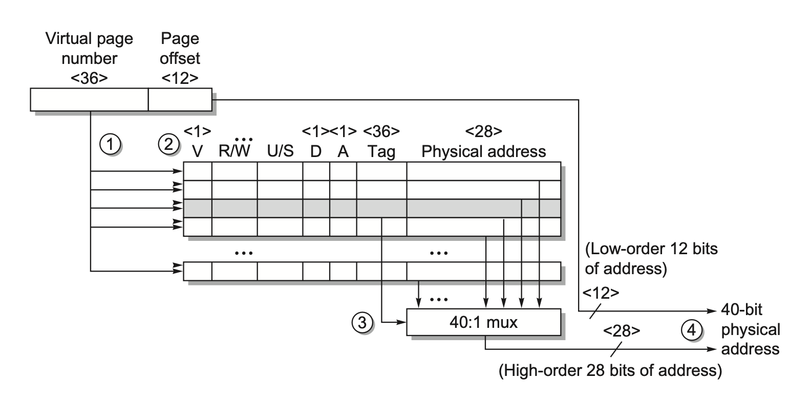
</div>


### Page Size

在以下情况，我们倾向于使用更大的页：

- 由于页表的大小和页的大小成反比，因此内存（或其他存储页表的资源）可以通过增大页的大小来节省空间
- 更大的页可以使用更大的高速缓存，以达到更快的命中时间
- 在二级存储器，或者在网络中传输更大的页，相比传输更小的页更有效
- 更大的页意味着更多的内存能被有效映射，因此减少了 TLB 失效的情况


而当需要保留存储空间，或者希望启动进程的速度更快时，我们更倾向于使用更小的页。


### Protection

- **多程序**(multiprogramming)：并发运行的程序共享一台计算机资源
- **进程**(process)：包括正在运行的程序，以及该程序运行的状态
- **时间共享**(time-sharing)：多程序的一种变体，同时为多个可交互的用户分享处理器和存储器资源，当作这些用户有自己的计算机
- **进程/上下文切换**(process/context switch)：任何时候从一个进程切换到另一个进程的行为
- 由于进程可能会被多次中断或切换，因此计算机（硬件）以及操作系统的设计者需要为维护正确的进程行为负责，具体来说：
    - 计算机设计者确保进程状态中处理器的那部分能够被保存和恢复
    - 操作系统设计者保证进程之间不会相互干扰——通过划分内存来确保不同的进程在同一时间内有自己的状态
- 每个进程都有自己的页表，指向不同的内存页，以保护进程
- **环级权限**(ring)：处理器的一种保护机制，分为用户、核(kernel)，以及可能更多的特权等级
- 除了保护机制外，计算机还需提供进程间的<u>共享代码和数据</u>，以允许进程间的通信或通过减少相同信息的拷贝来节省内存空间


## The Design of Memory Hierarchies


## Fallacies and Pitfalls

!!! bug "陷阱"

    - 地址空间过小
        - 地址的大小限制了程序的长度，因为程序的大小和程序所需数据的量必须不超过 $2^{\text{Address size}}$
        - 反例：PDP-11 的地址大小只有 16 位，而之后出产的 IBM 360 和 VAX 的地址大小分别为 24-31 位和 32 位，结果就是后面两台电脑明显比前者卖的更好
    - 忽视操作系统对存储器层级性能的影响
        - 大约 25% 的存储器停顿时间都是来自操作系统的干扰
    - 依赖操作系统来改变页的大小