# Chap 3: Instruction-Level Parallelism and Its Exploitation

## Introduction

本章我们来学习第一种并行技术：**指令级并行**(intruction-level parallelism, ILP)，它允许指令能够被并行计算。我们在计组中学过的流水线就是其中一种指令级并行技术。

有两类利用指令集并行的方法，在本章笔记中会对它们进行详细介绍：

- 基于**硬件**的**动态**并行
- 基于软件（**编译器**）的**静态**（编译时）并行

<u>大多数处理器采用的都是基于硬件的方法</u>，并且该方法主宰了台式机和服务器的市场。虽然有人在基于编译器的方法上做了不少努力，但这种方法目前还是仅限于领域特定的环境或者结构良好的且具备较大程度的数据级并行的科学应用中。

尽管 ILP 对处理器性能带来不少提升，但它受到程序和处理器自身的局限。因此后来人们开始在多核处理器，即**线程级并行**(thread-level parallelism)上做出努力。

流水线 CPU 的 CPI 计算公式为：Pipeline CPI = Ideal pipeline CPI + Structural stalls + Data hazard stalls + Control stalls。其中等号右侧第一项**理想流水线 CPI**是对实现中最大性能的衡量。通过降低等号右侧的每一项，我们能够降低总的流水线 CPI。下表展示了所有能够影响到流水线 CPI 的工艺：

<div style="text-align: center">
    
</div>

---
在学习 ILP 时，我们会遇到一个概念：**基本块**(basic block)，它是一段小规模的代码序列，既满足没有分支进入到它这里（除非它是入口）），也保证没有分支从它这里出去（除非它是出口）。为了获取足够大的性能提升，我们必须在多个基本块上利用 ILP。

最简单也最常用的提升 ILP 的方法是采用迭代循环，这类并行也被称为**循环级并行**(loop-level parallelism)。举个例子：下面给出两个有 1000 个元素的数组相加的例子：

```c
for (i = 0; i < 1000; i++)
    x[i] += y[i];
```

不难发现，虽然每个迭代的内部没有什么重叠好言，但是对于任意两个迭代而言，它们之间毫不相干，因此可以重叠在一起执行。之后，我们会介绍通过编译器或硬件来展开循环，实现循环的并行执行（当然也可以用下一章介绍的数据级并行来实现）。


### Dependences in Instructions

如果两条指令是并行的话，意味着它们能够在同一个流水线中同时执行，且不会造成任何停顿（假设流水线有足够多的资源，不会造成结构冒险问题）。但如果两条指令是有依赖关系的话，那么它们就不能并行了，必须按顺序执行。因此，在设计 ILP 时，我们必须要考虑指令之间是否存在**依赖关系**(dependence)。依赖关系一般分为**数据依赖**(data dependence)、**名称依赖**(name dependence)和**控制依赖**(control dependence)三种类型，下面将详细介绍。

>注：单条指令间的依赖关系（比如 `add x1, x1, x1`）不视为存在依赖。


#### Data Dependences

如果满足下列条件，那我们称指令 j 数据依赖于指令 i：

- 指令 i 的执行结果会被指令 j 用到
- 指令 j 数据依赖于指令 k，而指令 k 数据依赖于指令 i

第二个条件告诉我们：多条指令间可能存在一条依赖链，甚至这条链可以遍布于整个程序中。

???+ example "例子"

    考虑以下 RISC-V 代码序列：

    ```asm linenums="1"
    Loop:
        fld      f0, 0(x1)      // f0 = array element
        fadd.d   f4, f0, f2     // add scalar in f2
        fsd      f4, 0(x1)      // store result
        addi     x1, x1, -8     // decrement pointer 8 bytes
        bne      x1, x2, Loop   // branch x1 != x2
    ```

    这段代码中的数据依赖包括：2-3行的 `f0`、3-4行的 `f4` 和5-6行的 `x1`。

如果两条指令间存在数据依赖关系，则必须保留这两条指令的执行顺序，不得让它们同时执行。并且数据依赖关系表明指令间村子单个或多个**数据冒险**的问题，所以硬要同时执行这样的指令的话就会带来不小的麻烦。

我们需要辨别以下区别，这有助于我们理解如何利用好 ILP：

- **依赖**是**程序**的一种性质；
- 而对应的**流水线组织**的一条性质是：对于给定的依赖，是否会导致能够被检测出来的真正的冒险，并且该冒险是否会导致停顿。

一个数据依赖传达了3件事，这也正是数据依赖为 ILP 带来的限制：

- 冒险发生的概率
- 结果必须被计算出来的顺序
- 能够被利用到的并行的上限

当然，我们肯定希望能够克服上述限制——我们可以通过以下两种不同的方法来克服：

- 保持依赖，但避免冒险发生
    - 常见的具体做法是对代码进行合适的**调度**(scheduling)，可通过编译器或硬件实现
- 通过改变代码来消除依赖

数据流可以流过**寄存器**，也可以流过**内存**。对于前者，检测依赖比较直接，因为寄存器的名称是固定的（尽管有时会更复杂）；但对于后者就比较麻烦了，因为两个地址实际上指代相同的位置，但看起来是不同的。


#### Name Dependences

当两条指令使用相同的寄存器或内存位置（称为**名称**(name)），但这两条指令之间没有关于该名称的数据流时，我们认为发生了**名称依赖**(name dependences)。有以下两类名称依赖（假设指令j的程序顺序在指令i后面）：

- **反依赖**(antidependence)：指令 j 向指令 i 读取的寄存器或内存位置上进行写操作
- **输出依赖**(output dependence)：当指令 i 和 j 向同一个寄存器或内存位置上进行写操作

正如定义所言，由于具有名称依赖的两条指令之间不存在数据流，所以这种依赖不是真正的依赖，也就是说这样的指令可以并行执行或重新排序，只要改变这些指令使用的名称（寄存器或内存位置），让指令间不冲突就行了。

对于寄存器而言，这种重命名操作更加容易（称为**寄存器重命名**(register renaming)），可以用编译器或由硬件动态处理。


#### Data Hazards

回顾一下**冒险**(hazard)的概念：当指令间存在名称或数据依赖时，如果这样的指令足够接近，能够被重叠执行的话，那么就可能会改变访问和依赖相关的操作数的顺序，此时冒险就发生了。为了避免冒险的发生，在并行时必须保留那些会影响到程序执行结果的**程序顺序**(program order)，即按源程序顺序来执行指令的顺序。

对于**数据冒险**(data hazard)，我们根据指令的读写访问顺序，将其划分为以下几类（还是假设指令 j 的程序顺序在指令 i 的后面）：

- **RAW**(read after write)：j 尝试在 i 写入某个源操作数之前读取它，这样 j 就会得到旧的数据。这是最常见的一类冒险，且对应真正的**数据依赖**。
- **WAW**(write after write)：j 尝试在 i 写入某个操作数之前向它写入，这样导致写操作的执行顺序错误，该操作数的最终结果是 i 写入的结果而非 j。该冒险对应**输出依赖**，且仅存在于允许在多个阶段写入数据的流水线，或者允许指令在前一条指令停顿时继续执行的情况下。
- **WAR**(write after read)：j 尝试在 i 读取某个目的操作数之前先向它写入，这样 i 就会错误地得到了新的数据。该冒险对应**反依赖**，在大多数静态发射的流水线中不会发生。

>注：RAR 不会导致冒险出现，故不在讨论范围内。


#### Control Dependences

**控制依赖**(control dependence)决定了指令 i 关于分支指令的顺序。除了程序的第一个基本块外，所有指令都和某些分支之间存在控制依赖，并且这些控制依赖必须被保留下来，以保留程序顺序。考虑以下代码块：

```c
if p1 {
    S1;
}
if p2 {
    S2;
}
```

不难发现：`S1` 控制依赖于 `p1`，`S2` 控制依赖于 `p2` 而非 `p1`。

控制依赖带来以下约束：

- 关于某个分支控制依赖的指令不得被移动到分支之**前**，否则的话该指令就**不被**该分支所**控制**
- 不受某个分支控制依赖的指令不得被移动到分支之**后**，否则的话该指令就要被该分支所**控制**

事实上，我们不需要严格保留控制依赖，而只需要保留两个关键的性质：**异常行为**(exception behaviour)和**数据流**(data flow)。

- 保留**异常行为**意味着任何对指令执行顺序作出的改动，不能改变程序如何产生异常的。
    - 更松弛的版本是：对指令执行的重新排序不得导致程序中出现新的异常。
    - 之后介绍的**推测**(speculation)技术能够让我们忽视选取分支带来的异常，从而允许我们在保留数据依赖的情况下对指令进行重排。
- **数据流**是指令间产生结果或接受输入中的数据值的真实流动。分支让数据流变得动态，因为它们让数据源可以来自很多地方。通过保留控制仪阿里，就能够阻止对数据流的非法变化。
    - 之后介绍的**推测**还能用于这种情况：在减小控制依赖的影响时，还能维护数据流。

有时，违反了控制依赖不会影响到异常行为或数据流。

控制依赖可通过实现控制冒险检测（导致控制停顿的发生）来被保留。我们可通过一系列的硬件或让软件工艺来消除或减小控制停顿的发生次数。


## Basic Compiler Techniques: Loop Unrolling and Scheduling

现在介绍一种能够增强处理器 ILP 能力的简单的编译器技术，但对处理器的静态发射或静态调度而言是很关键的。

为了让流水线完全处在工作状态，我们需要找出那些不相关的，可以被重叠执行的指令。为了避免流水线停顿，执行某条依赖指令时必须将其和它依赖的指令拉开几个时钟周期（等于被依赖指令的流水线时延）的差距。编译器实现这些调度的能力取决于程序中可用的 ILP 量，以及流水线中函数单元的时延。

!!! info "一些约定"

    我们假设：

    - 采用标准的五级流水线
    - 函数单元完全被完全流水线化或被复制，这样能确保每个时钟周期下任何类型的操作都能被发射，且没有结构冲突发生

本节我们会介绍编译器是如何通过转变循环来增加可用 ILP 的量——来看下面的例子：

???+ example "例子"

    对于以下 C 代码：

    ```c
    for (i = 999; i >= 0; i--)
        x[i] += s;
    ```

    将其转化为 RISC-V 代码，且没有做过任何调度的结果如下所示：

    ```asm
    Loop:
        fld     f0, 0(x1)
        fadd.d  f4, f0, f2
        fsd     f4, 0(x1)
        addi    x1, x1, -8
        bne     x1, x2, Loop
    ```

    如果没有调度的话，执行一趟循环需要停顿 8 个时钟周期：

    <div style="text-align: center">
        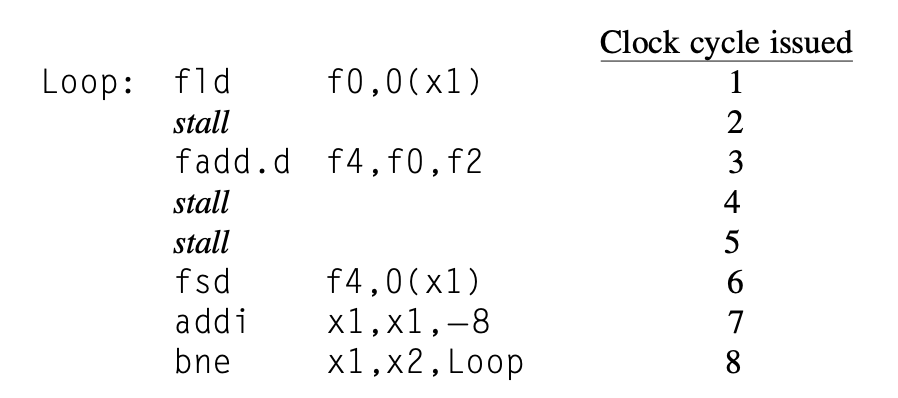
    </div>

    但如果进行调度后，就可以消除一个停顿：

    <div style="text-align: center">
        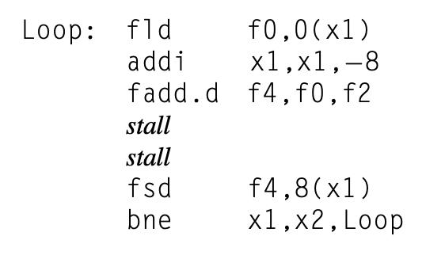
    </div>

    这里我们将 `addi` 指令移到了 `fld` 的下一条指令的位置上。

对于上述例子，事实上真正对数组操作的指令只有三条（`fld`、`fadd.d`、`fsd`）；对于剩下的两个停顿，以及 `addi` 和 `bne` 指令，我们希望能够消除掉，为此这里引入一种名为**循环展开**(loop unrolling)的方法，具体来说就是拷贝多份循环体，并调整循环终止相关的代码。此外，该方法还能提升调度，因为它消除了分支，所以能允许不同迭代下的指令被一起调度。此时，为了消除数据使用停顿的问题，我们通过在循环体内创建额外的独立指令，这时可能还需要用到更多不同的寄存器。

???+ example "例子"

    === "题目"
    
        接着上面的例子，使用循环展开，拷贝4份循环体。这里假设 `x1 - x2` 的值是 32 的倍数，这也意味着迭代次数为 4 的倍数。在确保不重用任何寄存器的情况下消除冗余的计算。

    === "解答"

        在展开的时候，我们合并了 `addi` 指令，并删掉了不必要的重复的 `bne` 指令。结果如下所示：

        <div style="text-align: center">
            
        </div>

        如果没有调度的话，上述改变不会对性能带来多少提升（每趟循环 6.5 个时钟周期）；但是再加上调度的话，就能够显著提升性能了（每趟循环 3.5 个时钟周期），结果如下所示：

        <div style="text-align: center">
            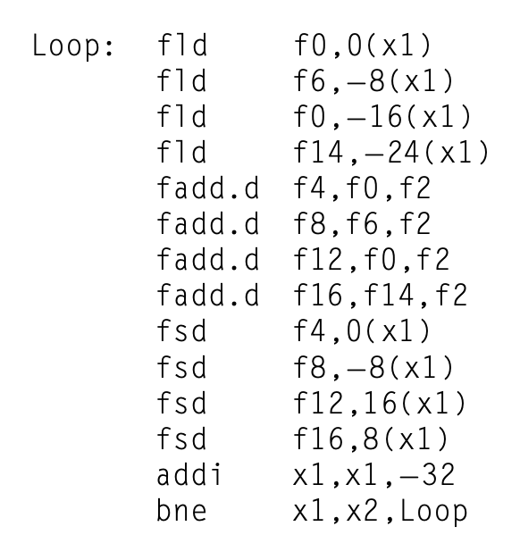
        </div>

循环展开通常在编译前就完成了，这样的话冗余的计算就能被优化器发现并消除了。

在真实的程序中，我们往往不清楚循环的上界。假设上界为n，并且我们想在循环展开时拷贝 k 份循环体。循环展开会生成一对连续的循环：第一个循环执行 (n mod k) 次，其循环体就是原始循环；第二个循环是被外层循环（需迭代 (n / k) 次）包裹的展开的循环体。对于更大的 n，大多数的执行时间花在了展开的循环体内。

循环展开通过消除指令开销，发现更多可通过调度来减少停顿的计算来提升性能，但代价是显著增加了代码规模。

在得到最终展开的代码前，我们必须做出以下判断和转换：

- 通过找到独立的循环迭代来确定循环展开是否有用
- 使用不同的寄存器，以避免因相同寄存器执行不同计算而带来的不必要的限制
- 消除额外的检验和分支指令，并桥正循环终止和迭代的代码
- 通过观察不同迭代下的加载和存储是否独立，来确定展开循环中的加载和存储能否可以互换。这一转换需要分析内存地址，并确定它们不是指向相同的地址
- 通过调度代码来保留依赖，确保产生的结果和原代码一致

循环展开的限制有：

- 每次展开摊还的开销量下降
- 代码规模限制
    - 更大的代码规模可能会带来更大的高速缓存失效率
    - **寄存器压力**(register pressure)：用来存放“活值”的寄存器变得更多，导致可用寄存器变少，尤其为多发射处理器带来困难
- 编译器限制


## Advanced Branch Prediction

因为分支可能会损害流水线的性能，所以需要采取一些措施降低影响。前面讲到的循环展开是一种方法，另一种方法是**预测分支**(branch prediction)。在计组笔记 [Chap 4](../co/4.md#control-hazards) 中介绍过简单的分支预测器(predictors)；但对于更深层的流水线以及多发射处理器，我们需要更精确的分支预测，所以下面将介绍一些用于提升动态预测精度的高级技术。


### Correlating Branch Predictors

我们之前介绍过一种2位预测期，它只能根据某个分支最近的行为来预测该分支的未来行为。事实上，我们也可以通过观察**其他**分支的最近行为来提升预测的精度。来看下面的例子：

???+ example "例子"

    这是一段有多分支的代码：

    ```c
    if (aa != 2)
        aa = 0;
    if (bb != 2)
        bb = 0;
    if (aa == bb) {
        // ...
    }
    ```

    对应的 RISC-V 代码为：

    ```asm
        addi x3, x1, -2
        bnez x3, L1         // branch b1
        add x1, x0, x0      // aa = 0
    L1:
        addi x3, x2, 02
        bnez x3, L2         // branch b2
        add x2, x0, x0      // bb = 0
    L2:
        sub x3, x1, x2      // x3 = aa - bb
        beqz x3, L3         // branch b3
    ```

    可以发现分支 `b3` 的行为和分支 `b1`、`b2` 相关。如果预测器只能观察一个分支的行为的话，那么该预测器就会失效。

我们称能够利用其他分支的行为来预测的预测器为**相关预测器**(correlating predictors)或**两级预测器**(two-level predictors)。相关预测器会添加和最近分支的行为相关的信息，来决定如何预测给定的分支。一个 $(m, n)$ 预测器能够预测最近 $m$ 个分支的行为，来选择 $2^m$ 个分支预测器，每个都是对应单个分支的 $n$ 位预测器。这类预测器能够在仅增加少量硬件的基础上，就能产生比2位预测器更高的预测率。相关预测器的结构大致如下所示：

<div style="text-align: center">
    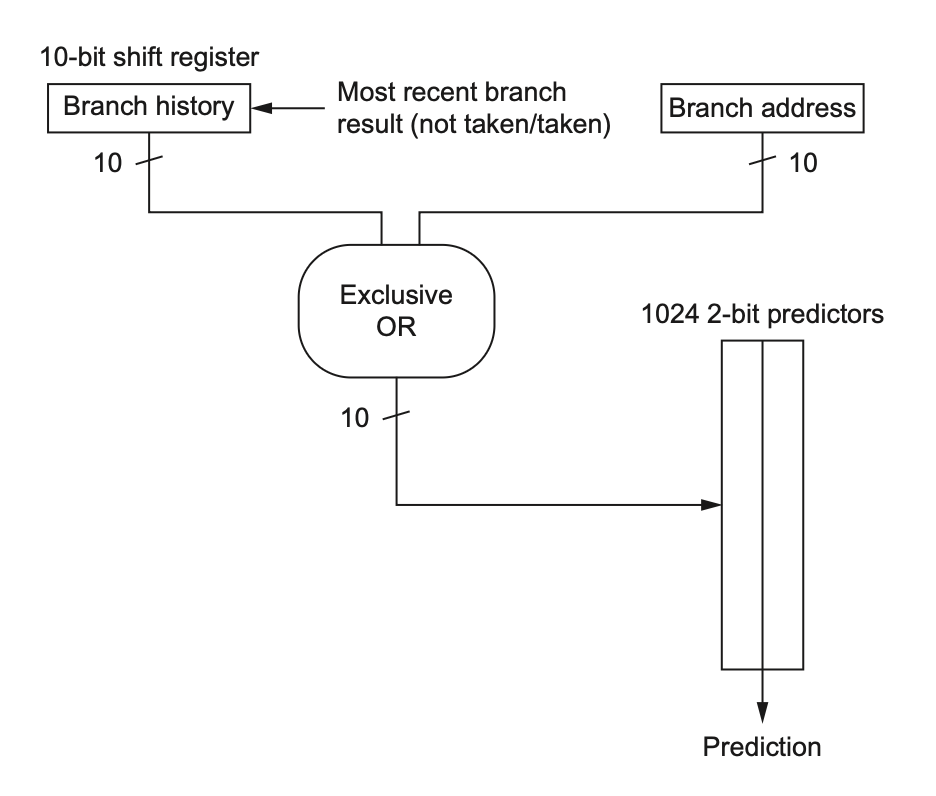
</div>

$(m, n)$ 预测器的总位数为：

$$
2^m \times n \times \text{Number of prediction entries selected by the branch address}
$$

而硬件之所以简单，是因为关于最近 $m$ 条分支的全局历史能够被一个 $m$ 位移位寄存器记录下来，每一位表示对应分支是否被采用。然后分支预测缓冲器通过对分支地址的地位和 $m$ 位全局历史的拼接来被索引。通过拼接（或简单的哈希函数）来结合局部和全局信息，我们能够位一个预测器表索引，得到比2位预测器更快的预测。而这种能够结合局部分支信息和全局分支历史的预测器也被称为**合金预测器**(alloyed predictors)或**混合预测器**(hybrid predictors)。


### Tournament Predictors

**锦标赛预测器**(tournament predictors)同样用到了多种预测器（全局 + 局部），但它通过一个选择器从这些预测器中选一个最好的来用（实际上是另一种合金预测器或混合预测器）。其大致结构如下所示：

<div style="text-align: center">
    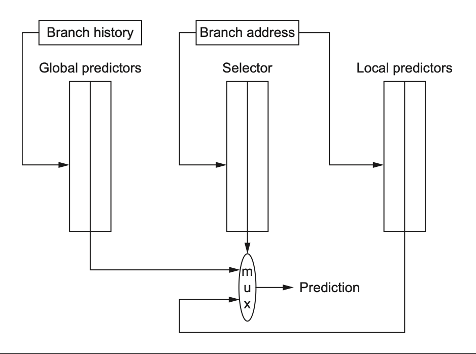
</div>

- **全局预测器**(global predictors)使用最近的分支历史来索引预测器
- **局部预测器**(local predictors)使用分支地址作为索引

锦标赛预测器在中等规模（8K-32K bits）下能够取得更好的精度，切能够有效利用大量的预测位。它会在每个分枝上用一个2位的渗透计数器，基于哪个预测器在最近带来更有效的预测，来选择两者中的一个。在原来的2位预测器中，这个渗透预测器在选择更好的预测器前会有两次错误的预测。

锦标赛预测器的优势是能够在特定分支上挑选正确预测器的能力，对于整数的基准测试而言相当关键。

下图比较了已经介绍过的3类预测器的误预测率：

<div style="text-align: center">
    
</div>


### Tagged Hybrid Predictors

有一类表现更好的预测器，它参照了一种叫做 PPM（prediction by partial matching，根据部分匹配预测）的类似分支预测算法的算法，使用了一系列用不同长度的历史索引的全局预测器——这类预测器称为**带标签的混合预测器**(tagged hybrid predictors)，其大致结构如下所示：

<div style="text-align: center">
    
</div>

可以看到，它有5个预测表：$P(0), P(1), \dots, P(4)$。它使用 PC 的哈希值和最近 $i$ 条分支（被保存在移位寄存器里）来访问 $P(i)$ 。除了不同的历史长度外，另一个特点是在表 $P(1), \dots, P(4)$ 上使用标签。一般情况下 4-8 位的小标签就能取得最佳效果了。仅当标签和分支地址和全局分支历史的哈希值匹配时，才会用到 $P(1), \dots, P(4)$ 内的预测。$P(0 \dots n)$ 例的每个预测器可以是一个标准的2位预测器。在实际上，3位计数器的效果会略微优于2位计数器。

给定分支的预测来自于标签匹配的，且分支历史最长的预测器上。$P(0)$ 总是能够匹配，因为它没有标签，因此如果其余表都没有匹配的话，那么它就提供默认的预测了。预测器里还会用到2位的使用字段(use field)，用于表明预测是否在最近被用到过，因此它可能是更精确的。所有的使用字段会被周期性地复位，以清除旧的预测。

这类预测器的缺点是实现上过于复杂，且可能会更慢（因为检查多个标签，选择预测结果需要时间）。尽管如此，对于分支误预测损失较大的多阶流水线处理器而言，这类预测器的优点显然会盖过缺点。

而更大的预测器会带来其他问题，比如如何初始化预测器——如果是随机的话，那么需要花费相当多的执行时间。所以有些预测器会用一个合法位，来表明预测器里的元素是否被置位，或处于“未使用状态”。


## Dynamic Scheduling

先简单回顾静态调度(static scheduling)的概念：静态调度的流水线处理器在获取指令后会发射该指令，除非发现该指令存在数据依赖且无法通过前递(forwarding)来隐藏该指令，此时冒险检测硬件会暂停流水线，直到依赖清除后在获取新的指令。

本节我们将介绍**动态调度**(dynamic scheduling)：硬件重排指令的执行，以减少停顿，同时维护了（即不会改变）数据流和异常行为。它的优点有：

- 可以让在某个流水线上被编译的代码在其他流水线上也能高效运行，消除了多份二进制文件以及重新编译的需求
- 能够处理在编译时没有被发现的依赖，比如内存引用或数据依赖分支，或者采用现代的动态链接或分派
- 能让处理器容忍无法预测的时延，比如对于高速缓存失效，可通过在等待失效解决时执行其他代码来实现这一点

下一节还会介绍一种叫做推测(speculation)的技术，它建立在动态调度的基础上，能够为处理器带来额外的性能优势，但代价是增加了硬件的复杂程度。

---
简单流水线技术的一大限制是采用**有序**(in-order)指令发射和执行，即指令按照程序顺序发射，如果有指令停顿了，后面的指令不得继续。因此，如果两条很接近的指令间存在依赖，那么就会导致冒险发生，因而产生停顿；如果有多个函数单元的话，那这些单元在停顿期间就处于空闲状态了。对于下面的指令序列：

```asm
fdiv.d  f0, f2, f4
fadd.d  f10, f0, f8
fsub.d  f12, f8, f14
```

前两条指令存在依赖关系，因而产生停顿。第三条指令和前两条没有依赖关系，但也不得不跟着一起停顿。所以我们希望在停顿发生时还能继续执行第三条指令。为了做到这一点，我们将发射过程分为两部分：检查任何的结构冒险，以及等待数据冒险的消失。因此我们仍然使用有序的指令发射，但我们希望当处理器的操作数空闲时就能执行指令，这样的流水线做的就是**乱序执行**(out-of-order execution)。

乱序执行会引入 **WAR** 和 **WAW** 冒险的可能，这在原来的流水线中是没有的，不过这两类冒险都可以用寄存器重命名来避免。比如下面的例子：

???+ example "例子"

    对于以下指令序列：

    ```asm
    fdiv.d  f0, f2, f4
    fmul.d  f6, f0, f8
    fadd.d  f0, f10, f14
    ```

    - 第2、3条指令间存在反依赖，所以若第3条指令先于前一条指令执行的话，就会违背该依赖，导致 WAR 冒险的发生
    - 第1、3条指令间存在输出依赖，所以若第3条指令先于第1条指令执行的话，就会违背该依赖，导致 WAW 冒险的发生

乱序执行还会为处理**异常**带来麻烦。动态调度处理器会通过延后通知某条指令异常，直到处理器知道该指令是下一条要被执行的指令时，来保留异常行为。此外，动态调度处理器还会产生**不精确**(imprecise)的异常：该“异常”产生时，观察处理器的状态，指令好像并没有按严格的程序顺序来执行——这不是真正的异常。发生这种“异常”的原因有：

- 流水线可能**已经执行完**程序**后面**的指令
- 流水线可能**还没有执行**程序**前面**的指令

不精确的异常会加大异常发生后重新执行的难度，所以之后在介绍推测技术时会介绍一种解决方案：在带有推测的处理器上提供精确的异常。

为了实现乱序执行，我们将流水线的 ID（译码）阶段划分为两个子阶段：

1. **发射**(issue)：对指令译码，检查结构冒险（**顺序发射**）
2. **读取操作数**(read operands)：等待，直到没有数据冒险，然后读取操作数（**乱序执行**）

我们需要区分指令何时**开始执行**，以及何时**完成执行**；而在这两个时间点之间，我们认为指令**正在执行**。并且我们假设处理器有多个函数单元，以实现多指令的同时执行。

有以下实现动态调度的技术：

- **记分板**(scoreboarding)：当有足够资源以及没有数据依赖的情况下，允许指令乱序执行的技术。
- **托马苏洛算法**(Tomasulo's algorithm)：相比记分板更为精密的技术，它能够通过动态地为寄存器重命名来处理反依赖和输出依赖的问题；此外它还可以被扩展，用于处理推测。下面将详细介绍该技术。


### Tomasulo's Algorithm

!!! info "注"

    我们主要关注该算法在 RISC-V 指令集，以及在浮点数单元(float-point unit)和加载-存储单元(load-store unit)上的表现。

在使用托马苏洛算法的动态调度处理器中，

- RAW 冒险可通过在操作数空闲时就执行指令来避免
- WAR 和 WAW 冒险可通过**寄存器重命名**(register renaming)来消除。

其中寄存器重命名通过重命名所有的目标寄存器，包括等待先前指令读/写的寄存器来实现，这样的话乱序写操作就不会影响到任何依赖于操作数先前值的指令。如果有足够多可用的寄存器的话，编译器就会实现这种重命名。

???+ example "例子"

    这是原来的指令序列，里面有 WAR 和 WAW 的问题：

    ```asm
    fdiv.d  f0, f2, f4
    fadd.d  f6, f0, f8
    fsd     f6, 0(x1)
    fsub.d  f8, f10, f14
    fmul.d  f6, f10, f8
    ```

    其中第2、4条指令和第3、5条指令之间存在反依赖（对应 WAR 冒险），而第2、5条指令之间存在输出依赖（对应 WAW 冒险）。这三个冒险都可以通过寄存器重命名（用到了两个临时寄存器 `S`、`T`）来消除，如下所示：

    ```asm
    fdiv.d  f0, f2, f4
    fadd.d  S, f0, f8
    fsd     S, 0(x1)
    fsub.d  T, f10, f14
    fmul.d  f6, f10, T
    ```

在托马苏洛算法中，寄存器重命名由**保留站**(reservation station)，它作为正在等待发射且和函数单元相关的指令的缓冲区。这里的基本思路是：当操作数可用时，保留站获取并缓存该操作数，消除了从寄存器中获取操作数的需要。此外，正在等待的指令会指定为自己提供输入的保留站。在指令发射时，用于正在等待的操作数的寄存器标识符被重命名为保留站的名称，从而实现寄存器重命名。

保留站的使用带来的重要性质有：

- 冒险检测和执行控制是被分配好的：在每个函数单元内，保留站保存的信息用于确定指令何时在该单元开始执行
- 执行结果会从缓存它们的保留站中直接传到函数单元，而无需经过寄存器。这种旁路(bypassing)操作通过一根**公共数据总线**(common data bus, CDB)来实现，它允许为所有单元同时加载正在等待的操作数

下图展示了基于托马苏洛算法的处理器的基本结构：

<div style="text-align: center">
    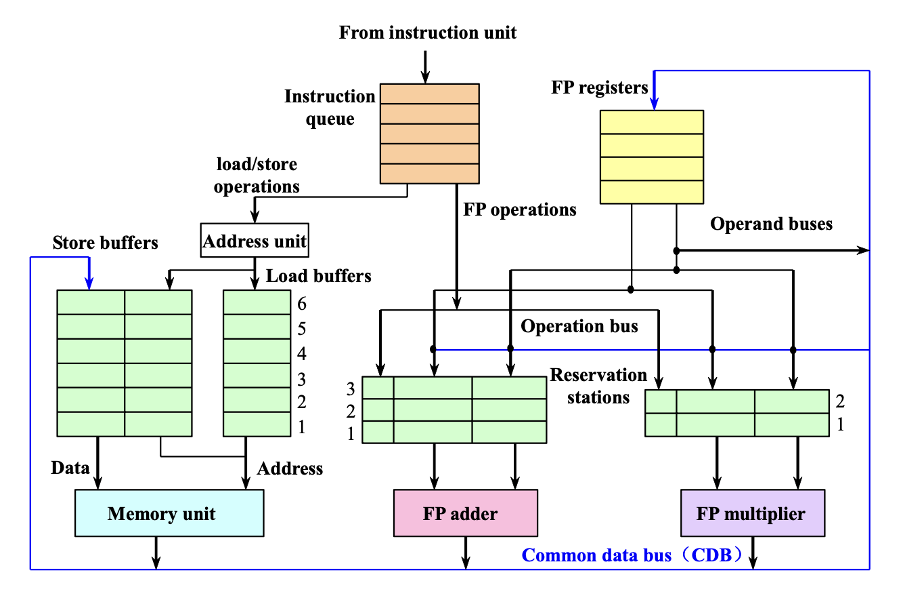
</div>

- 里面包含了浮点数单元和加载-存储单元
- 每个保留站保存了一个被发射的，且正等待在函数单元内被执行的指令
- 如果该指令的操作数值已经被计算出来的话，那么该值也会被一起保存；否则保留站会保存那些提供操作数值的保留站的名称
- 加载缓冲区和存储缓冲区分别保留了来自或前往内存的数据或地址，表现上和保留站类似
- 浮点数寄存器被一对来自函数单元的总线，以及一根来自存储缓冲区的总线连接
- 所有来自函数单元和内存的结果会被送到公共数据总线上，该总线除了不经过加载缓冲区外，会经过其他所有部件
- 所有的保留站都有一个标签字段，为流水线控制所用

在上述处理器中，一条指令会经过以下三步：

1. **发射**(issue)（有时会称为**分派**(dispatch)）：
    - 从指令队列（FIFO 顺序，以维持正确的数据流）的队首中获取下一条指令
    - 如果该指令匹配到的保留站是空的，那么将该指令及其操作数（如果当前已在寄存器内的话）发射到该保留站内
    - 如果没有空的保留站，那么就存在结构冒险，指令发射停止，直到某个保留站空间被释放
    - 如果操作数不在寄存器内，那么追踪会产生操作数值的那个函数单元
    - 这一步会进行寄存器重命名（寄存器的名称将会被丢掉），消除了 WAR 和 WAW 冒险
2. **执行**(execute)：
    - 如果一个或多个操作数不可用的话，那么监控公共数据总线，等待操作数被计算出来
    - 当某个操作数可用时，它将会被放到任何等待它的保留站内
    - 当某个操作的所有操作数都可用时，该操作就会在对应的函数单元内被执行
    - 通过延时到所有操作数都可用时再执行指令，RAW 冒险得以避免
    - 有时多条指令可能在相同的时钟周期下准备就绪，且要用同一个函数单元，此时该单元不得不从中做出选择，比如浮点数单元是随机挑选的，而加载-存储单元则更加复杂
    - 加载和存储需要两步执行过程：
        - 当基寄存器可用时，计算有效地址，然后将其放在加载或存储缓冲区内
        - 对于加载，当内存单元可用时，加载会立马执行；对于存储，在值被送到内存单元前，会一直等待执行
    - 为了保留异常行为，直到在程序顺序中先于指令的分支完成执行后，才允许后面的指令被执行
    - 如果处理器记录了异常的发生，但没有发起异常，那么该指令会被执行而不停顿，直到它进入“写入结果”阶段
    - 这个阶段还会涉及到推测，放在下一节介绍
3. **写入结果**(write result)：
    - 当结果可用时，将其写入 CDB 中，然后再写到寄存器以及任何等待该结果的保留站中（广播(broadcast)）
    - 存储操作一直缓存在存储缓冲区内，直到值被存储，且存储地址可用，此时结果被写入空余的内存单元上

用于检测和消除冒险的数据结构被附加在保留站、寄存器堆以及加载和存储缓冲区上，它们的信息有略微的区别。这些标签是用于重命名的虚拟寄存器的名称。在上面的处理器中，标签位是4位的，指代5个保留站以及5个加载缓冲区中的1个，这样就需要10个寄存器，用以描述哪个保留站能够产生源操作数结果的指令。由于保留站的数量多于真正的寄存器的数量，因此 WAW 和 WAR 冒险可通过使用保留站编码重命名结果来被消除。

CDB 和保留站从总线中对结果的检索实现了在静态调度流水线中用到的前递（或旁路）机制，但相比起来动态调度方法还会引入一个时钟周期的时延。

每个保留站有7个字段：

- Op：在源操作数 S1 和 S2 上的操作
- Qj, Qk：产生对应源操作数的保留站。值为0表示源操作数已经在 Vj 或 Vk 上可用
- Vj, Vk：源操作数的值。注意对每个操作数而言，Q 字段或 V 字段中只有一个是有效的。对于加载，Vk 字段用于保留偏移字段
- A：保留加载或存储的内存地址计算信息。最开始指令的立即数字段会存在这里；经过地址计算后，有效地址会存在这里
- Busy：表明保留站以及对应的函数单元是否被占据

寄存器堆有一个字段 Qi，表示保留站的数量，这些保留站包括了结果需要存储到寄存器内的操作。

加载和存储缓冲区有一个字段 A，保留了有效地址的结果。

托马苏洛算法的两大优势是：

- 冒险检测单元的分布，该优势来自于分布的保留站和 CDB 的使用。如果多条指令等待相同的结果，且每条指令的其他操作数均以准备就绪，那么通过 CDB 对结果的广播，指令得以同时释放
- 消除因 WAW 和 WAR 冒险导致的停顿，该优势通过保留站重命名寄存器，以及在保留站存储可用操作数来实现的。

托马苏洛算法的具体步骤如下所示：

<div style="text-align: center">
    
</div>

下面是一些采用托马苏洛算法的例子：

??? example "例子"

    === "例1"

        === "题目"

            展示执行以下指令序列时，当第一条指令完成写入结果阶段后的信息表格：

            ```asm
            fld     f6, 32(x2)
            fld     f2, 44(x3)
            fmul.d  f0, f2, f4
            fsub.d  f8, f2, f6
            fdiv.d  f0, f0, f6
            fadd.d  f6, f8, f2
            ```

        === "解答"

            <div style="text-align: center">
                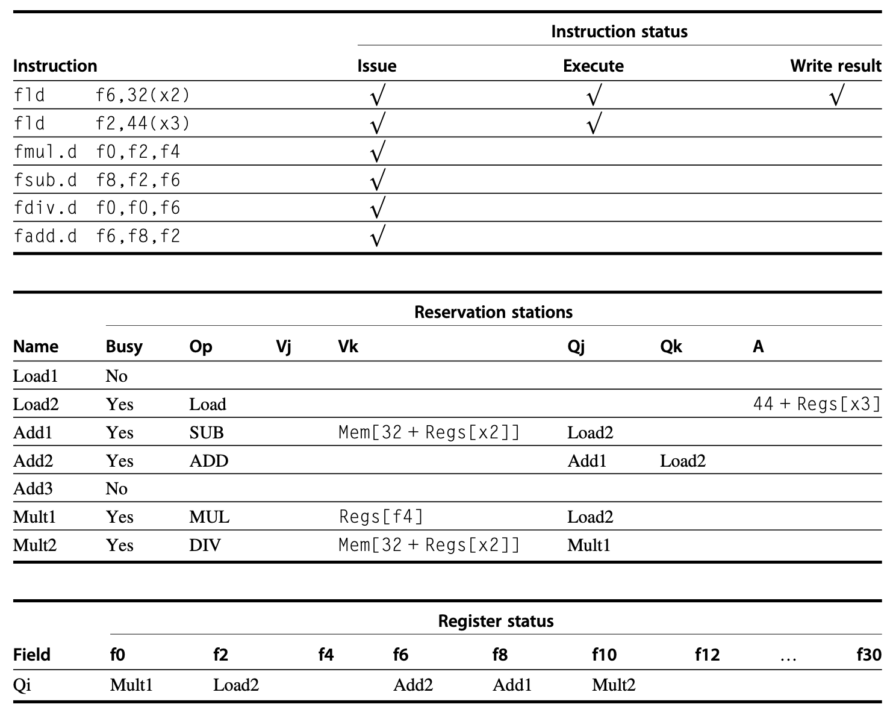
            </div>

            - Add1 表示来自第一个加法单元的结果的标签，以此类推
            - 第一张表是信息状态表，这张表只是帮助我们理解算法，实际上存在于保留站内

    === "例2"

        === "题目"

            采用和例1相同的指令序列，展示当 `fmul.d` 指令准备写入结果时状态表的信息。

        === "解答"

            <div style="text-align: center">
                
            </div>

    === "例3"

        考虑下面的和循环相关的指令序列：

        ```asm
        Loop:
            fld      f0, 0(x1)
            fmul.d   f4, f0, f2
            fsd      f4, 0(x1)
            addi     x1, x1, -8
            bne      x1, x2, Loop
        ```

        假设我们发射了两次连续迭代下的全部指令，但是没有运算是完成的，下图展示了此时的保留站、寄存器状态表以及加载和存储缓冲区内的信息：

        <div style="text-align: center">
            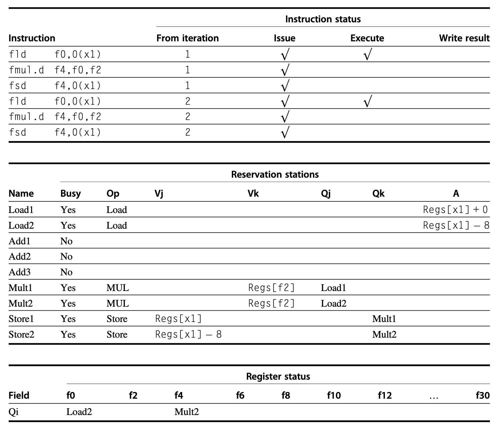
        </div>

---
如果访问不同的地址的话，那么加载和存储就可以放心地被乱序执行，但如果访问相同地址的话，以下情况中的其中一种就会发生：

- 在程序顺序中，若加载在存储的前面，交换两者就会发生 WAR 冒险
- 在程序顺序中，若存储在加载的前面，交换两者就会发生 RAW 冒险
- 交换两个访问相同地址的存储指令会发生 WAW 冒险

为了检测这样的冒险，处理器必须计算和先前内存指令相关的数据内存地址。对于加载而言，先计算它的有效地址，如果发现和存储缓冲区中的任何一项匹配上的话，那就不要将这条加载指令送到加载缓冲区里，直到那条冲突的存储指令执行完毕。对存储的处理也是类似的，除了它要同时检查加载和存储缓冲区里的内容。

---
带托马苏洛算法的动态调度处理器的主要缺点是实现复杂，需要很多硬件：每个保留站必须包含一个相关的缓冲区，该缓冲区具备很快的运行速度以及复杂的控制逻辑。此外，性能还会受到单个 CDB 的限制。

托马苏洛算法诞生之后的很多年里都没有被用到过，直到 1990 年代才开始在多发射处理器中使用。


## Hardware-Based Speculation

当我们想要更大程度的 ILP 时，维持控制依赖将成为增长的负担。尽管前面介绍过的分支预测能够减小其带来的影响，但还是无法满足我们的需求，尤其是对多发射处理器。因此接下来将会介绍**推测**(speculation)技术。使用推测后，处理器获取、发射并执行指令时，就好像分支预测始终是正确的一样；当然也需要有能够处理推测错误的机制。而本节扩展动态调度的思路，带各位了解**硬件推测**(hardware speculation)的原理。

硬件推测的三个关键思想为：

- **动态分支预测**，用于选择需要执行的指令
- **推测**，允许控制依赖前的指令得以执行
- **动态调度**，处理对不同基本块的调度

硬件推测遵循预测的数据值流来选择何时执行指令。这种执行程序的方法称为**数据流执行**(data execution)：当操作数可用时，运算立即执行。

当指令不再是推测指令时，才允许该指令更新寄存器堆或内存，我们称这个步骤为**指令提交**(instruction commit)。

实现推测背后的关键思想是允许指令乱序执行，但强迫它们**按顺序**提交，以阻止任何不可更改的行为。所以在使用推测技术时，需要将完成执行的过程和指令提交分开来；并且需要额外的硬件缓冲区来保留已执行完毕的，但未提交的指令结果。这种缓冲区称为**重排缓冲区**(reorder buffer, ROB)，它和保留站一样提供了额外的寄存器。由于 ROB 和存储缓冲区类似，所以之后就将存储缓冲区并到 ROB 里面了。

下图展示了实现推测技术后的，并采用托马苏洛算法的处理器的结构：

<div style="text-align: center">
    
</div>

ROB 里的每一项包含了4个字段：

- 指令类型：表明该指令是分支指令（无目标结果），存储指令（目标为内存地址），还是寄存器操作（ALU 运算和加载指令，目标为寄存器）
- 目标字段：提供指令结果应该被写入的寄存器编号（ALU 运算和加载指令）或内存地址（存储指令）
- 值字段：保留指令结果的值，直到指令提交
- 准备字段：表明指令是否执行完毕，此时值已经准备好了

尽管保留站重命名的功能被 ROB 取代，但保留站还会提供一个用于缓存从发射到开始执行前的操作。因为每条指令在提交前必须在 ROB 上有个位置，因此我们用 ROB 每项的编号来为结果打标签，而这个标签必须能被保留站追踪到。

现在，指令的执行分为四步：

1. **发射**：
    - 从指令队列获取指令
    - 若存在一个空的保留站以及一个空的 ROB 项，则发射该指令
    - 如果操作数在寄存器或 ROB 上可用的话，那么将操作数也送到保留站内
    - 更新控制项，表明缓冲区在使用了
    - 为结果分配的 ROB 的项数也要送到保留站内，这样的话当结果被放在 CDB 上时，可以用这个数字来为该结果打标签
    - 如果保留站或 ROB 满了，那么停止发射指令，直到有空余项为止
2. **执行**：
    - 如果一个或多个操作数不可用的话，那么监控 CDB，等待操作数被计算出来
    - 当某个操作的所有操作数都可用时，那就执行该操作
    - 这一阶段可能需要多个时钟周期
3. **写入结果**：
    - 当结果可用时，将其（以及 ROB 标签）写入 CDB，然后从 CDB 写到 ROB 以及其他等待该结果的保留站内
    - 对于存储指令，如果存储值可用，那么将其写入到 ROB 项的值字段内；若不可用，那么监控 CDB 直到该值被广播
4. **提交**(commit)：有以下三种情况
    - 正常提交（当指令到达 ROB 头，且对应值在缓冲区内时）：处理器用指令执行结果更新寄存器，并移除 ROB 内的指令
    - 提交存储指令：和前一种情况类似，只是更新的东西变成了内存而非寄存器
    - 错误预测的分支指令（即推测错误）：清除 ROB 里的内容，重新开始分支指令后的正确指令

??? example "例子"

    === "例1"

        === "题目"

            假设浮点数函数单元的时延为：

            - 加法：2个时钟周期
            - 乘法：6个时钟周期
            - 除法：12个时钟周期

            对于以下指令序列，请展示当 `fmul.d` 指令准备提交时的状态表：

            ```asm
            fld     f6, 32(x2)
            fld     f2, 44(x3)
            fmul.d  f0, f2, f4
            fsub.d  f8, f2, f6
            fdiv.d  f0, f0, f6
            fadd.d  f6, f8, f2
            ```

        === "答案"

            <div style="text-align: center">
                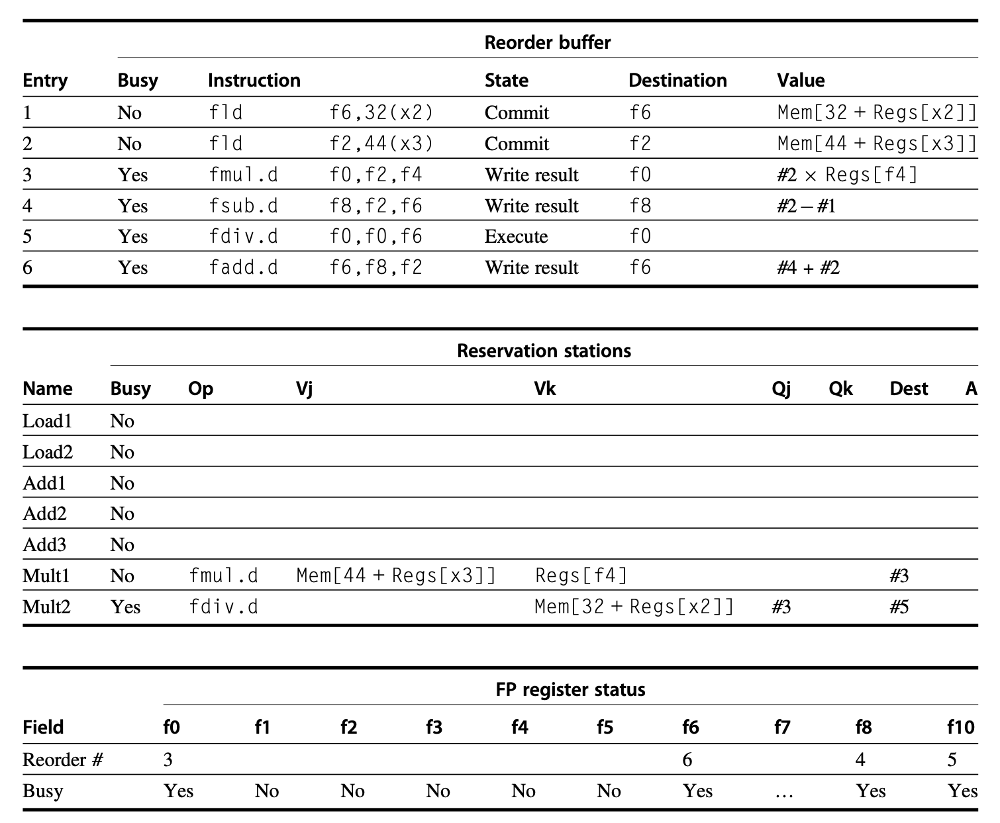
            </div>

    === "例2"

        考虑在之前的例子中分析过的指令序列：

        ```asm
        Loop:
            fld      f0, 0(x1)
            fmul.d   f4, f0, f2
            fsd      f4, 0(x1)
            addi     x1, x1, -8
            bne      x1, x2, Loop
        ```

        假设我们发射了两次连续迭代下的全部指令，且第一次迭代的 `fld` 和 `fmul.d` 指令已提交，且其他指令也已完成执行。此时的状态表如下所示：

        <div style="text-align: center">
            
        </div>

因为直到指令提交前，都不会向寄存器和内存写入数据，所以当发现分支预测错误时，处理器能够轻松地撤回推测行为（或恢复）：清空缓冲区，获取其他指令。在推测处理器中，性能对分支预测更加敏感，因为错误预测的影响会更大，因此处理分支的各方面，包括预测精度、误预测检测的时延和误预测恢复时间都相当重要。

处理器仅在准备提交时才会识别并处理异常。如果推测指令发起异常，那么该异常会被记录到 ROB 里。如果发生了分支误预测且指令还没被执行，那么异常就会随 ROB 里的其他内容被清除掉。但如果指令已经进入到 ROB 头，那饿我们知道该指令不再是可推测的，且异常真的发生了，此时应尽快处理异常。

下面展示了推测处理器的具体运行步骤：

<div style="text-align: center">
    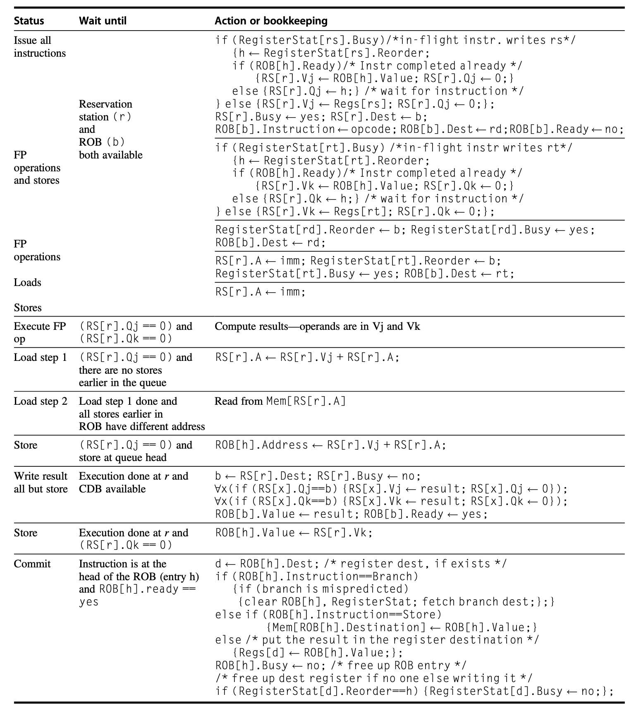
</div>

尽管上面对推测处理器的解释都是基于浮点数的，但这项技术同样适用于整数的寄存器和函数单元上，而且实际上推测可能在整数程序上更有用。此外，我们还可以将这项技术扩展到多发射处理器上，这点将在下一节中介绍。


## Multiple Issue

前面讲到的技术都是通过消除数据、控制停顿来提升 CPI 的。为了进一步提升性能，我们希望 CPI 降到 1 以下，这意味着需要在一个时钟周期内发射多条指令。所以本节我们就来讨论一下**多发射处理器**(multi-issue processor)的设计，它包含以下几类：

- 静态调度超标量(superscalar)处理器
- VLIW（very long instruction word，超长指令字）处理器
- 动态调度超标量处理器

其中超标量处理器在每个时钟周期内发射的指令数会变化，且静态调度采用顺序执行，而动态调度采用乱序执行。而 VLIW 处理器在每个时钟周期内发射固定量的指令，并被格式化为一个大指令，或者一个固定的带有并行的指令包。另外，VLIW 处理器是由编译器静态调度的。

由于静态调度超标量处理器通常只发射两条指令（每时钟周期），发射的不多，因此下面我们主要考虑后面两种技术，先来看 VLIW。

??? abstract "总结：5类实现多发射处理器的基本方法"

    <div style="text-align: center">
        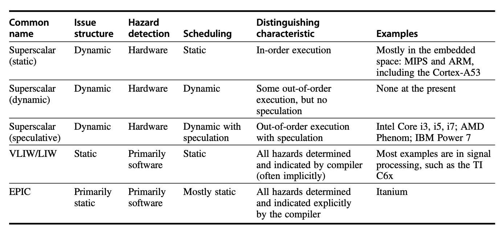
    </div>


### Using Static Scheduling

VLIW 采用多个独立的函数单元，将多个运算打包成一个非常长的指令，或者让指令包里的指令满足相同的约束。由于这两种方法没有本质区别，所以下面仅考虑前者。由于 VLIW 的优势随着发射率的提升而增加，因此我们考虑更宽发射的处理器，而成本的增加也是这类处理器的一大限制因素。具体来说，我们假设让指令包含 5 个运算：1 个整数运算、2 个浮点数运算和 2 个内存引用运算。

为了让函数单元保持工作状态，需要让代码有足够多的并行，这点可通过前面介绍过的循环展开和代码调度来实现。如果展开得到的是直线代码（没有跳转），那么可以用到作用于单个基本块上的**局部调度**(local scheduling)技术；如果发现并行要在分支间调度代码，那么必须要用更为复杂的**全局调度**(global scheduling)算法。

???+ example "例子"

    === "题目"

        假设我们有一个满足上述假设的 VLIW 处理器，请展示该处理器对循环 `x[i] += s` 进行展开后的结果。

    === "解答"

        <div style="text-align: center">
            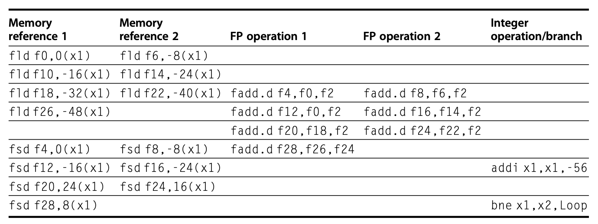
        </div>

VLIW 模型存在一些技术上和逻辑上的问题

- 技术问题：
    - 代码规模的增加，有以下解决方案：
        - 软件调度可以做到在不会大量增加代码规模的情况下展开循环
        - 采取更聪明的编码方式
        - 压缩内存里的指令，当需要将指令读到高速缓存时再解压
    - 锁步(lockstep)操作的局限：任何函数单元流水线的停顿会导致整个处理器的停顿，因为所有的函数单元必须保持同步
        - 在最近的处理器中，函数单元的运作更加独立，且编译器用于在发射时避免冒险，而硬件检查允许指令的不同步执行
- 逻辑问题：二进制代码的兼容性不足，这使得在不同实现之间的迁移变得困难
    - 在严格的 VLIW 方法中，代码序列同时利用到指令集定义和详细的流水线结构（包括函数单元及其时延），所以不同的函数单元以及时延需要不同版本的代码


### Using Dynamic Scheduling and Speculation

现在我们将动态调度、多发射和推测这三项技术结合起来，就可以得到一个和现代微处理器很像的微架构。为了便于后续讨论，我们仅考虑每时钟周期内发射两条指令的发射率。下图展示了带推测的多发射处理器的基本组织：

<div style="text-align: center">
    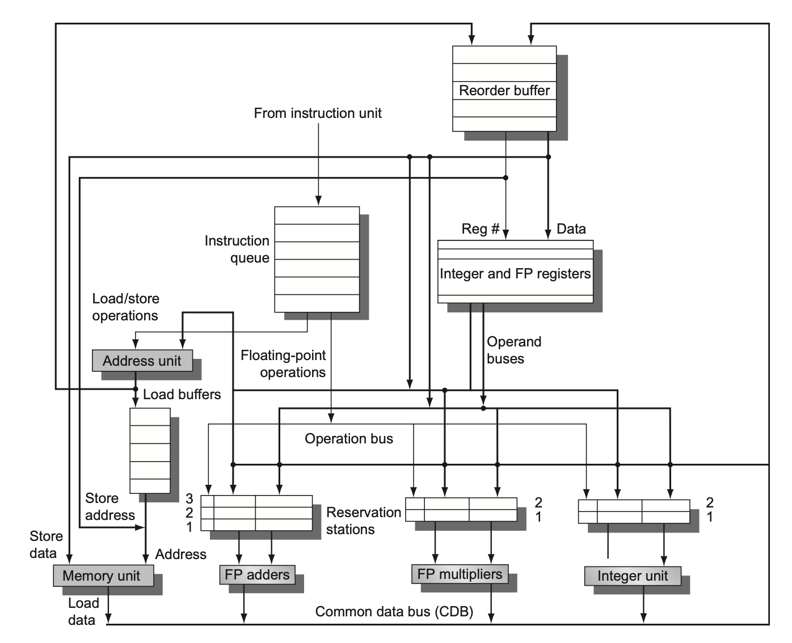
</div>

在动态调度的处理器中，同一时钟周期内发射多条指令是很复杂的，一个很简单的原因是：多条发射的指令之间可能存在依赖关系。所以必须要为并行的指令更新流水线控制表，否则的话表格的内容就不对了或者依赖可能丢失了。

有两种不同的实现方法，但都是基于同一个观察：关键在于分配保留站和更新流水线控制表。

- 让上述步骤在半个时钟周期内完成，这样两条指令就能在一个时钟周期内被处理好
    - 但这种方法很难扩展到更多的指令发射
- 建立立即处理两条或多条指令（包括指令间任何可能的依赖）的必要逻辑

在动态调度超标量处理器中，发射步骤是其中最基本的瓶颈之一，下面展示了发射的具体逻辑（~~我还没仔细看过，但已经不想看了~~）：

<div style="text-align: center">
    
</div>

我们可以泛化上述细节，得到每时钟周期发射 n 条指令的基本策略：

1. 为每个可能在下一个发射包中指令分配一个保留站和重排缓冲区。这一步可以在指令类型被确定前完成，具体来说可以用 n 个可用的 ROB 项按顺序为指令包里的指令预分配空间，并确保有足够多可用的保留站来发射整个包
2. 分析发射包内所有指令的依赖关系
3. 如果发射包内的某条指令依赖于发射包内前面的指令，那么使用被分配的 ROB 编码来更新依赖指令的保留站。否则的话就使用现有的保留站和 ROB 来更新正在发射的指令的保留站

而上述过程仅需一个时钟周期就能完成，因此相当复杂。

??? example "例子"

=== "题目"

    考虑执行以下循环，它正对一个数组内的元素进行递增操作。代码在一个双发射处理器上执行，请比较没有推测和有推测时运行前3次迭代的结果。

    ```asm
    Loop:
        ld    x2, 0(x1)
        addi  x2, x2, 1
        sd    x2, 0(x1)
        addi  x1, x1, 8
        bne   x2, x3, Loop
    ```

=== "解答"

    === "没有推测"

        <div style="text-align: center">
            
        </div>

    === "有推测"

        <div style="text-align: center">
            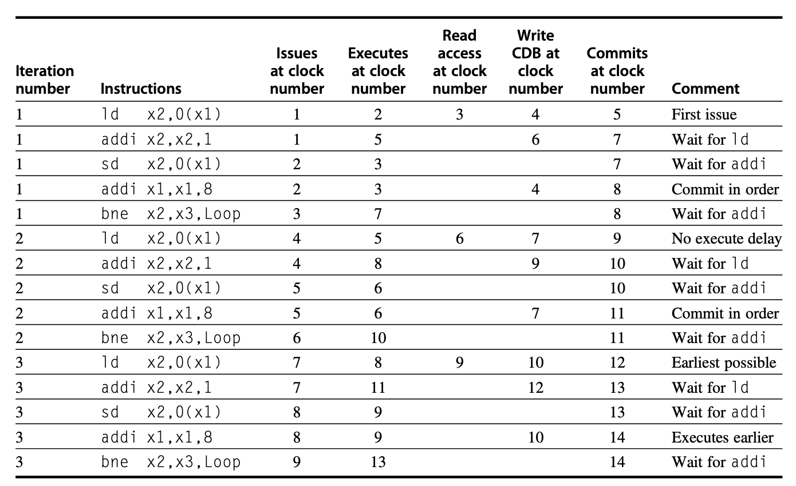
        </div>

    显然，推测技术对性能有不小的提升。


## Advanced Techniques for Instruction Delivery and Speculation

### Increasing Instruction Fetch Bandwidth

在高性能的流水线中，尤其是在多发射的情况下，仅靠分支预测还是不透的，还要能够传递一个高带宽的指令流（在最近的处理器中，每个时钟周期内需要传递4-8条指令）。一个多发射处理器要求每时钟周期内获取指令的平均数量至少和平均吞吐量一样大。而获取指令不仅需要指令高速缓存有足够宽的通路，最困难的事要处理分支，下面将介绍应对分支的一些方法。

#### Branch-Target Buffers

如果某条指令是一个分支指令，且我们已经知道下一个 PC 值了，那么分支的损失就减为0了。我们称用于存储分支后下一条指令的预测地址的分支预测缓存为**分支-目标缓冲区**(branch-target buffers)，其大致结构如下所示：

<div style="text-align: center">
    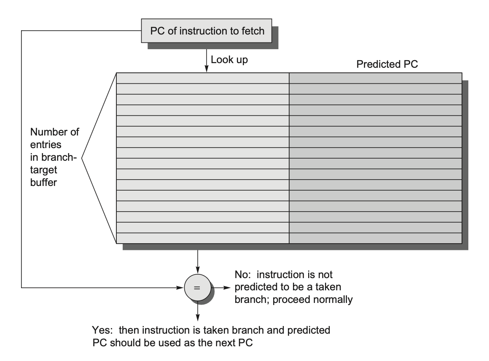
</div>

由于分支-目标缓冲区预测了下一条指令的地址，并且在译码指令前需要将其发送出去，因此我们必须知道取得的指令是否被预测为一个要跳转的分支。如果取得的指令的 PC 值和预测缓冲区的地址撇披上的话，那么对应的被预测的 PC 被用作下一个 PC。此外，我们仅需在分支-目标缓冲区内存储预测要跳转的分支就行了，因为不跳转的分支应该只获取下一条顺序指令就行了。

下面展示了分支-目标缓冲区在处理指令时的步骤：

<div style="text-align: center">
    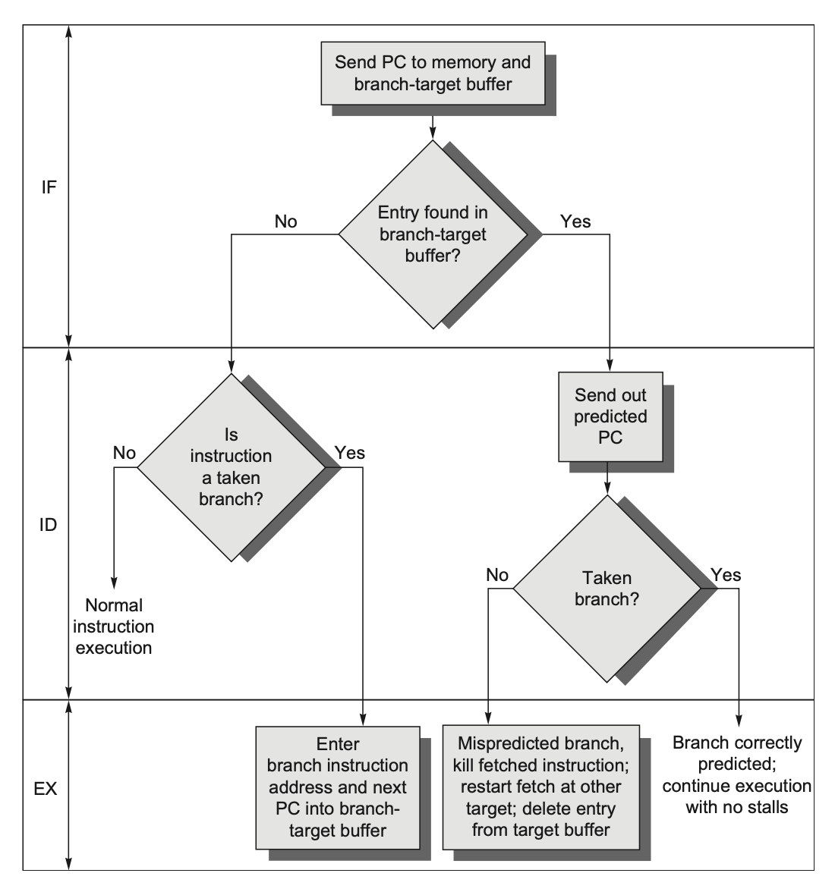
</div>

而下表展示了分支预测时的各种情况：

<div style="text-align: center">
    
</div>

??? example "例子"

    === "题目"

        确定分支-目标缓冲区的总的分支损失，假设损失情况同上表，并且遵循以下假设：

        - 预测精度为 90%（缓冲区内的指令）
        - 缓冲区的命中率为 90%（预测分支跳转）

    === "解答"

        <div style="text-align: center">
            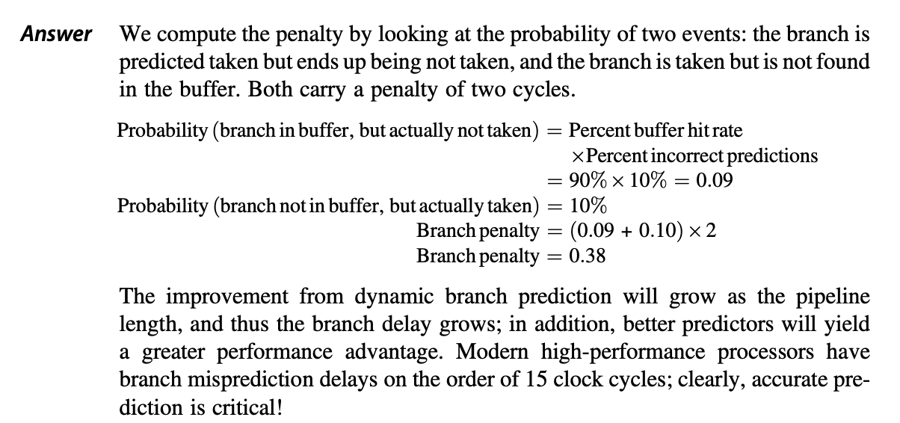
        </div>


### Specialized Branch Predictors

我们面对的下一个挑战是预测**间接跳转**(indirect jump)，即目标地址在运行时变化的跳转。使用高级语言编写的程序会生成这种跳转，以进行间接的过程调用和 case 语句中。尽管过程返回能够用分支-目标缓冲区预测，但如果过程被多处调用，且一处地方的调用可能发生在不同的时间内，那么预测的精度就很低了。

为了克服这种问题，一些设计会采用一块较小的返回地址缓冲区，在栈上进行操作。这个结构会为最近的返回地址缓存，当调用过程时将返回地址压入栈内，返回时则将其弹出。如果这个缓存足够大的话，那么它能够完美预测返回地址。下图展示了不同大小的返回缓冲区下的性能：

<div style="text-align: center">
    
</div>

在大型服务器应用中，间接跳转也可能来自各种函数调用和控制传输，而预测这样的分支目标可不像过程返回那么简单，因此一些处理器会选择增加专门的预测器来实现所有的间接跳转。

---
为了满足多发射处理器的需求，很多设计者选择实现一种**集成指令获取单元**(integrated instruction fetch units)，作为向流水线提供指令的单独的自动单元。该单元会集成以下功能：

- 集成分支预测：分支预测器会作为指令获取单元的一部分，并持续预测分支，以驱动流水线的 IF 阶段
- 集成预获取：为了在单个时钟周期内传递多条指令，指令获取单元可能需要提前获取指令。该单元会自动管理指令预获取，将其集成到分支预测中
- 指令内存访问和缓冲区：指令获取单元通过预获取来隐藏高速缓存块交叉（？）带来的成本。此外该单元还提供了缓冲区，用于为发射阶段提供指令


### Implementation Issues and Extensions of Speculation

#### Speculation Support: Register Renaming v.s. Reorder Buffers

一种替代 ROB 的方案是使用一组更大规模的寄存器组，并结合寄存器重命名技术，该方法还建立在托马苏洛算法的基础上。在托马苏洛算法中，在执行的任意时间点上，**架构可见的寄存器**(architecturally visible registers)的值被包含在寄存器组和保留站内。如果使用推测技术的话，那么寄存器之可能还会临时位于 ROB 内。

在指令发射的过程中，重命名进程会将架构寄存器的名称映射到物理寄存器的编号上，为其分配一个新的未使用的寄存器作为目标。通过该方法，WAW 和 WAR 冒险能够被避免，且推测恢复也能够被处理，因为保存指令目标的物理寄存器在指令提交前，尚未成为架构寄存器。**重命名映射**(renaming map)是一种简单的数据结构，提供了与指定架构寄存器当前对应的物理寄存器编号，这是由托马苏洛算法中寄存器状态表执行的功能。

相比 ROB 方法，重命名方法的优势在于它稍微简化了指令的提交，因为它记录了架构寄存器编号和物理寄存器编号之间的不再是推测的映射关系，并且释放了存储架构寄存器旧值的物理寄存器。但是寄存器重命名让释放寄存器变得更复杂——物理寄存器对应一个架构寄存器，直到架构寄存器被重写，而这会导致重命名表指向任何地方。所以如果物理寄存器并不作为源，且没有被分配到对应的架构寄存器，那么该寄存器需要被重新声明和分配。而更简单的做法是让处理器等待其他指令写入相同的架构寄存器提交，这种做法为最近的大多数超标量处理器使用。

虽然架构处理器在一直变化，但大多数情况下我们无需担心这个问题。但像操作系统这样的进程则必须知道特定架构寄存器内的东西。

通过寄存器重命名实现指令多发射和通过 ROB 实现指令多发射的方法类似：

1. 发射逻辑需要保留足够多的物理寄存器，用于完整的发射包。
2. 发射逻辑需要确定发射包内存在的依赖关系。如果依赖关系不存在的话，那么寄存器重命名结构用于确定物理寄存器，保存现在或将来指令依赖结果。当发射包内不存在依赖关系时，来自先前发射包内的结果以及寄存器重命名表就会有正确的寄存器编号。
3. 如果一条指令依赖于包内先于该指令的某条指令，那么需要用一个预保留的寄存器来更新该发射指令的信息。


#### The Challenge of More Issues per Clock

只有当采用了精确的分支预测和推测时，我们才会考虑增大发射率，否则的话会因为要解决分支问题而很难扩大发射率。而增大发射率会使发射阶段以及提交阶段（实际上是发射的对偶）更加复杂。下面展示了在一个时钟周期内发射6条指令的情况：

<div style="text-align: center">
    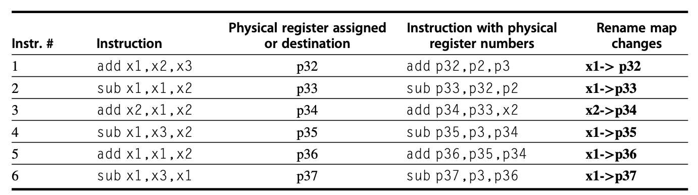
</div>

在一个时钟周期内，这些指令的依赖关系必须被检测出来，必须为其赋予物理寄存器，并且指令必须用物理寄存器编码被重写。不难看出，这里的工作量可不小，这也就是为什么在过去几十年里发射率的提升十分缓慢。


#### How Much to Speculate

推测带来的一大好处是能够隐藏那些导致流水线停顿的事件，比如高速缓存失效。但推测的缺点是小号时间和能量，并且错误推测的恢复会降低性能。另外，为了从推测中获取更高的指令执行率，处理器必须有额外的资源，这就需要更多的芯片面积和电源。最后，如果推测导致异常发生的话（而且不用推测就不会发生异常），那么会带来显著的性能损失。

为了维持推测的优势，大多数带推测的流水线仅允许低成本的异常事件在推测模式下被处理，如果发生了高成本的异常事件，那么处理器会一直等待，直到在处理事件前，导致事件发生的指令不再是推测出来的为止。尽管这会降低某些某些程序的性能，但它避免了在其他程序上的显著的性能损失。


#### Speculating Through Multiple Branches

同时在多条分支上推测会为以下情况带来好处：

- 非常高的分支频率
- 显著的分支集群
- 函数单元的长时延


#### Challenge of Energy Efficiency

相信大多数人的第一感觉是：使用推测会降低能效(energy efficiency)，因为如果推测错误的话，它就会通过以下方式来消耗过多的能量：

- 推测出来的指令结果没有用，处理器做了无用功，浪费能量
- 撤销推测，恢复处理器到继续执行合适地址上的指令，这会消耗额外的能量

然而，如果推测降低的执行时间能够超过它带来的平均功耗的话，那么总的能量消耗反而是降低的。


#### Address Aliasing Prediction

**地址别名预测**(address aliasing prediction)是一种用于预测两条存储指令，或者一条存储指令和一条加载指令是否访问的是相同的地址的技术。如果访问的是不同的地址，那么两者可以安全地交换；否则的话指令就必须按顺序访问内存地址（期间可能需要等待一些时间）。因为我们不需要预测具体的地址值，只要知道两个值是否冲突即可，因此可通过一个小的预测器就能实现精确预测。地址预测依赖推测处理器在误预测后的恢复能力。

地址别名预测还是**值预测**(value prediction)的一种简单而限制的形式，它尝试预测指令生成的值，如果足够准确的话，就能够消除数据流限制，以达到更高的 ILP 率。


## Cross-Cutting Issues

### Hardware v.s. Software Speculation

下面来比较硬件推测和软件推测之间的优劣：

- 为了扩展推测，推测必须有消除内存访问歧义的能力。在基于硬件的方法中，这种能力在编译时很难实现；但是通过硬件，能够在运行时动态实现，可以在运行时将加载指令移到存储指令前面。如果该方法使用不当的话，恢复的开销反而会盖过带来的好处。
- 对于大多数整数程序而言，基于硬件的推测在控制流不可预测时，以及基于硬件的分支预测先于基于软件的分支预测完成时表现更好。
- 基于硬件的推测能够维护一个完全精确的异常模型，即便对于推测指令而言也是如此。最近基于软件的方法也能做到这一点。
- 基于编译器的方法具备能够观察更长的代码序列的能力，从而可能得到比纯用硬件实现更好的代码调度。
- 基于硬件且没有动态调度的推测不要求不同的代码序列对同一架构上的不同实现取得良好的性能表现（？看不懂）
- 基于硬件的推测的主要缺点还是过于复杂，需要额外的硬件资源

有些设计者会尝试将这两种方法结合起来，但有时反而会造成不太好的结果。


### Speculative Execution and the Memory System

支持推测执行和条件指令的寄存器可能会产生非法的地址，从而影响到处理器的性能，这在没有推测执行的处理器中是不会发生的。因此，内存系统必须识别出推测执行的指令和条件执行的指令，镇压住对应的异常。而且，我们不能让这样的指令导致高速缓存的停顿或失效，因此处理器必须和非阻塞的高速缓存匹配。


## Fallacies and Pitfalls

!!! failure "谬误"

    - 如果我们能够保持工艺一致的话，那么预测相同指令集架构下的两个不同版本的性能和功耗是比较容易的一件事。
    - 有着更低 CPI 或更快时钟频率的处理器总是跑得更快。
        - 即使采用了相同的 ISA，在不同的环境下设计出来的处理器在性能和能耗上的表现也有不小差异


!!! bug "陷阱"

    - 有时更大、更简单会带来更好的表现。
    - 有时更聪明的设计相比更大、更简单的设计更好。
    - 只要我们用到正确的技术，那么总是有大量可用的 ILP。