# Chap 4: Data-Level Parallelism in Vector, SIMD, and GPU Architectures

在本章中，我们将学习一些常见的**数据级并行**(data-level parallelism)的技术。其中最知名的当数 **SIMD**(single instruction multiple data，单指令多数据)，它被广泛应用于面向矩阵计算的科学计算、面向媒体的图像和音频处理以及机器学习算法等领域。相比 MIMD 而言，SIMD 的能效更高，因而也很适合用在个人移动设备以及服务器中；但相比而言 SIMD 最大的优势在于程序员仍能继续按照串行方式思考代码，但同时底层能通过并行实现加速运算。

本章主要介绍的内容分为三大块，它们都是 SIMD 的变体：

- **向量架构**(vector architecture)
- **多媒体 SIMD 指令集扩展**(multimedia SIMD instruction set extensions)
- **图形处理器**(graphic processing units, GPUs)

其中后两者和向量架构有着千丝万缕的关系，所以我们先来学习向量架构的原理和实现。


## Vector Architecture

**向量架构**的大致原理可以概括为：获取分散在内存中的数据元素集，将它们放在一个较大的顺序寄存器堆内，在寄存器堆上对数据进行操作，最后将结果分散放回到内存中。

- 单条指令作用在多个向量数据上，导致在独立的数据元素上有多个寄存器-寄存器运算
- 作为由编译器控制的缓冲区，这些寄存器堆能够隐藏内存时延，并且能够利用好内存带宽
- **功率墙**(power wall)使得架构师看重那些能够以不达到无序超标量处理器那么高的成本为代价，就能获取高性能的架构，而向量架构正符合这样的要求——仅需在一个简单的标量处理器上用到**向量指令**(vector instructions)，就能够提升性能。


### RV64V Extension

!!! info "注"

    这里的 "RV64V" 指的是 [RISC-V 基本指令](../co/2.md) + 向量指令扩展。

下图展示的是一个结构较为简单的向量处理器，它仅包含最基本的组件：

<div style="text-align: center">
    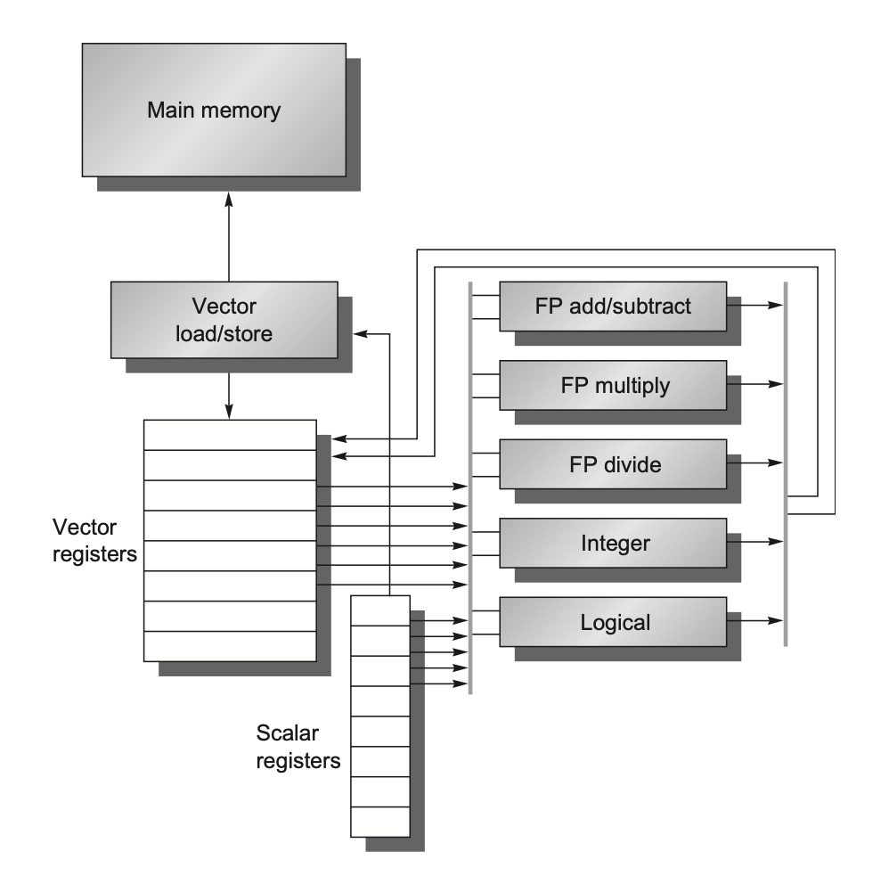
</div>

- **向量寄存器**(vector registers)：
    - RV64V 有 32 个向量寄存器，每个向量寄存器的大小为 64 位，保存一个向量
    - 向量寄存器堆需要提供足够量的端口，以供给向量函数单元；这些端口允许不同向量寄存器的向量运算间的高度重叠
    - 至少有 16 个读端口和 8 个写端口，它们通过一堆纵横开关和函数单元的输入和输出相连
    - 提升寄存器堆带宽的一个方法是使用多个分区(multiple banks)
- **向量函数单元**(vector functional units)：
    - 所有单元都是完全流水线化的，并且每个时钟周期都可以开始一条新的指令
    - 控制单元用于检测冒险，包括函数单元的结构冒险和寄存器访问的数据冒险
    - 如上图所示，这里仅提供 5 个函数单元，但本节我们仅关注浮点数单元
- **向量加载/存储单元**(vector load/store unit)：
    - 这些单元同样是完全流水线化的，这样能保证在初始时延后，每个时钟周期的带宽为一个字
    - 它们也能用于处理标量的加载和存储
- **标量寄存器组**(a set of scalar registers)：
    - 它们主要提供数据和计算好的地址
    - 在 RV64G 中，有 31 个通用目的寄存器，以及 32 个浮点数寄存器

向量架构中的向量能够容纳不同大小的数据——假如某个向量寄存器有 32 个 64 位的元素，那么它也能容纳 128 个 16 位的元素，或者 256 个 8 位的元素。RV64V 支持的数据大小为：

- 整数：8, 16, 32, 64 位
- 浮点数：16, 32, 64 位

??? abstract "RV64V 向量指令"

    <div style="text-align: center">
        
    </div>

    - 这里假设默认所有的指令都以向量作为输入，但也存在指令将一个标量寄存器（`xi` 或 `fi`）作为操作数。
    - 因此 RV64V 用后缀区分这些情况，由汇编器根据操作数提供合适的指令后缀。
        - `.vv` 表示操作数均为向量
        - `.vs` 表示第二个操作数为标量
        - `.sv` 表示第一个操作数为标量
    - 上述指令忽略了数据类型和大小。而 RV64V 将数据类型和大小与向量寄存器关联起来，而不是让指令提供相应的信息。因此在执行向量指令前，由程序配置正在使用的向量寄存器，以指明数据类型和大小。
    - `vld` 和 `vst` 分别表示向量加载(vector load)和向量存储(vector store)，它们会加载或存储整个向量数据。其中第一个操作数是要被加载或存储的向量寄存器，第二个操作数是一个 RV64G 通用目的寄存器，表示向量在内存中的起始地址。

RV64V 之所以采用这样的**动态寄存器类型**(dynamic register typing)，是因为

- 传统向量架构若要支持如此多样的数据类型组合，需要大量指令支撑，那上面的指令列表就要有数页篇幅了！
- 能够让程序禁用那些没用到的向量寄存器，从而为向量寄存器分配到全部的向量内存，用于存储长向量
    - 假如向量内存为 1024 B，且有 4 个向量寄存器是被启用的，且数据类型为 64 位浮点数，那么处理器能够为每个向量分配至多 256B 的空间（或者 32 个元素），这个值被称为**最大向量长度**(maximum vector length, mvl)，软件无法对其进行修改
    - 这样带来的问题是：更大的状态意味着更慢的上下文交换(context switch)时间。不过有一个不错的副作用是程序可以禁用没用到的寄存器，因此无需再上下文交换时保存和恢复这些寄存器
- 可依赖寄存器的配置来实现不同大小操作数的隐式转换，无需通过额外的指令进行显式转换

有些向量可能很大，仅用一个向量寄存器不够，需要多个寄存器。这时会用到以下寄存器

- `vl`：向量长度寄存器，用于向量长度不等于 mvl 的时候
- `vctype`：向量类型寄存器，记录寄存器类型
- `pi`：谓词寄存器，用于包含 IF 语句的循环

通过这些向量指令，系统能够以多种方式执行对向量的操作，包括同时计算多个元素。这样的灵活性使得向量设计使用慢而宽的执行单元，在低功率的情况下获得更高的性能。此外，向量指令集中各元素的独立性使得功能单元的扩展无需像超标量处理器那样执行额外的高成本依赖检查。

下面来比对一下相同循环下，RV64G 和 RV64V 需要用到的指令：

???+ example "例子"

    === "题目"

        <div style="text-align: center">
            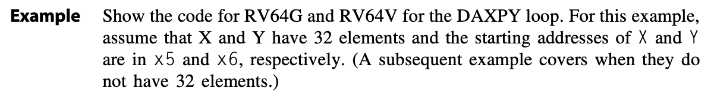
        </div>

        >注：这里的 DAXPY 指的是形如 Y = a * X + Y 的运算，其中 X, Y 为向量，a 为标量，开头的 D 表示双精度浮点数

    === "答案"

        <div style="text-align: center">
            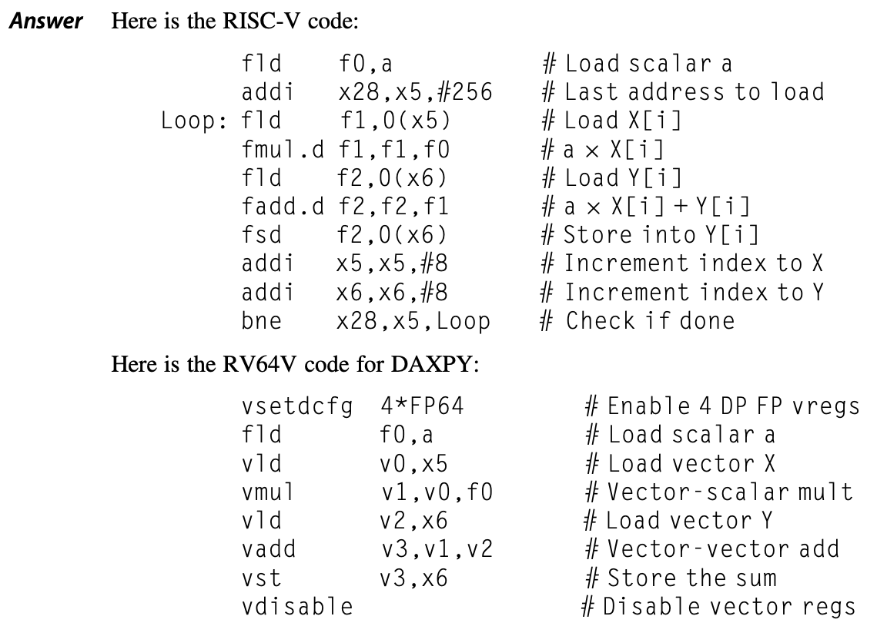
        </div>

        两段代码最主要的区别在于向量处理器大大减少了指令的带宽，仅需 8 条指令就完成了 RV64G 要用 258 条指令完成的任务。

编译器产生向量指令序列时，代码会在向量模式中运行很多时间，这样的代码被认为是**向量化的**(vectorized)。当迭代之间没有依赖时，循环代码就可以被向量化，这称为**循环携带依赖**(loop-carried loop)。

RV64G 和 RV64V 的另一个区别是流水线互锁(interlock)发生的频率。由于存在数据依赖，RV64G 指令会有很多停顿；但在向量处理器中，每个向量指令仅需为向量的第一个元素停顿，之后的元素就会很丝滑地流过流水线，因此这样的元素依赖运算被称为**链**(chaining)。

??? example "例子"

    === "题目"

        <div style="text-align: center">
            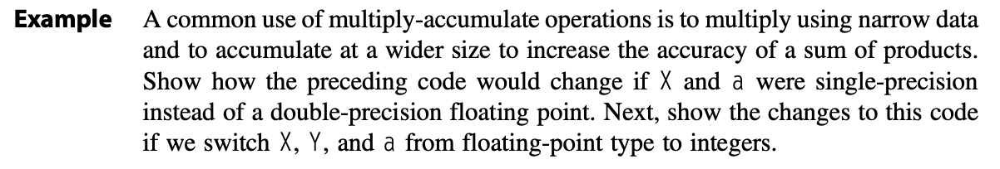
        </div>

        >省流：对于和上个例子同样的任务，分别给出 RV64V 的单精度浮点数和整数版本的指令序列

    === "答案"

        === "单精度浮点数"

            <div style="text-align: center">
                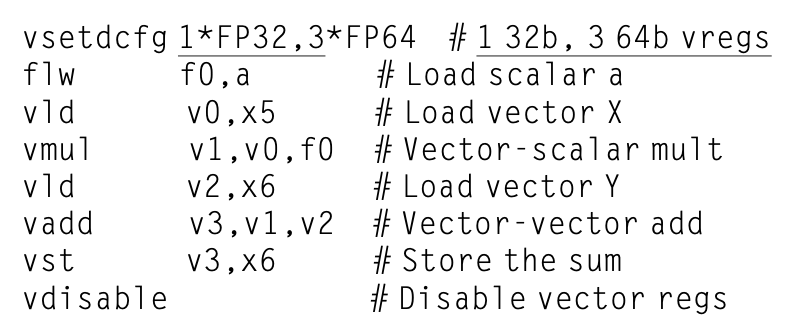
            </div>

        === "整数"

            <div style="text-align: center">
                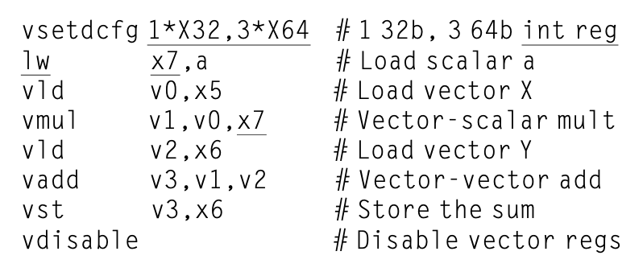
            </div>


### Vector Execution Time

向量运算序列的执行时间取决于以下因素：

- 操作数向量的长度
- 运算间的结构冒险
- 数据冒险

如果我们能够知道向量长度和**初始化速率**(initiation rate)（即向量单元接收运算符并产生结果的速率）的话，我们就能计算单条向量指令的计算时间。

所有现代的向量计算机都具备带有多个并行流水线（称为**通道**(lane)）的向量函数单元，能够在每个时钟周期中产生两个及以上的结果，但也存在一些没有完全流水线化的函数单元。为了方便讨论，

- 我们的 RV64V 实现只有一个通道，其单条指令的初始化速率为每时钟周期一个元素，因此单条向量指令的执行时间（以时钟周期数为单位）近似为向量长度。
- **指令组**(convoy)：一组可以一起执行的向量指令。
    - 要求这些指令不能包含任何结构冒险，如果存在的话需要将它们序列化，放在不同指令组中执行。
    - 我们还假设指令组内的指令必须在其他指令开始执行前完成执行。
    - 链(chaining)的存在允许同一指令组中存在 RAW 依赖冒险，因为向量运算能够在源操作数变得可用时马上开始执行——链上的第一个函数单元的结果会被“前递”到第二个函数单元上。实际上，我们通过允许处理器在相同时间内读写特定向量寄存器来实现链的思想。
    - 最近的实现中用到灵活链(flexible chaining)，它允许向量指令和其他活跃的向量指令链接起来（假设没有结构冒险）。

- **时钟间隔**(chime)：执行一个指令组所需的时间。
    - 因此 m 个指令组就要执行 m 个时钟间隔；假如向量长度为 n，那么共计 m * n 个时钟周期数。
    - 因为这种计算方式忽略了一些处理器特定的开销（很多取决于向量长度），以及在单时钟周期内初始化多条向量指令的局限，因此这种近似的测量法在长向量上更准确
    - 此外，该方法忽略的最重要的开销是向量**启动时间**(start-up time)，即在流水线完全充满前的时延，取决于向量函数单元的流水线时延

??? example "例子"

    === "题目"

        <div style="text-align: center">
            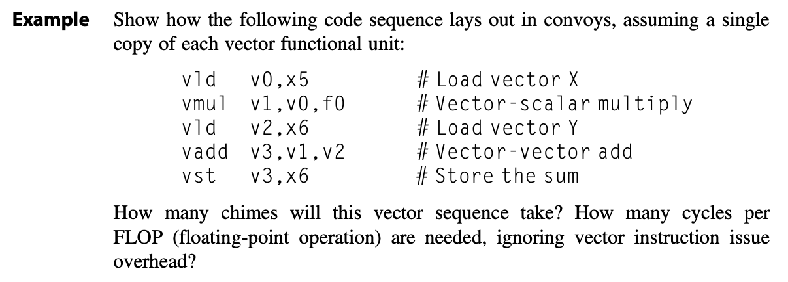
        </div>

    === "解答"

        <div style="text-align: center">
            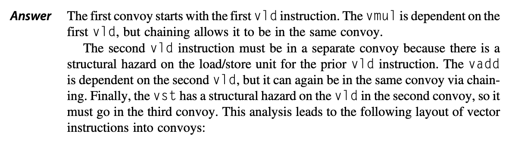
        </div>

        <div style="text-align: center">
            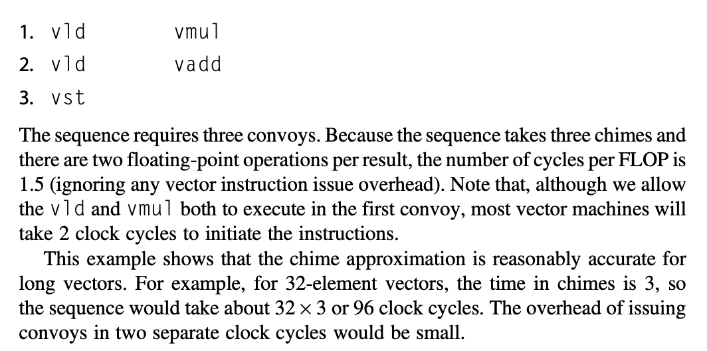
        </div>


### Optimizations

下面给出一些用于提升性能或增加一些在向量架构上能够运行的程序类型的优化方法：

- **多通道**(multiple lane)：让向量处理器能够在单个时钟周期内处理向量中的多个元素
- **向量长度寄存器**(vector-length registers)：应对向量长度不等于最大向量长度的情况（大多数情况）
- **谓词寄存器**(predicate registers)：高效处理条件语句，使得更多的代码能够被向量化
- **内存分区**(memory banks)：为向量处理器提供足够的内存带宽
- **步幅**(stride)：处理多维矩阵
- **聚集-分散**(gather-scatter)：处理稀疏矩阵
- **程序向量架构**(programming vector architecture)


#### Multiple Lanes

向量指令集的一个关键优势是能让软件仅通过一条较短的指令（包含多个独立运算，编码长度同传统的标量指令），就能向硬件传递大量的并行工作。而向量指令的并行语义使得通过高度**流水线化**(pipelined)或**并行**(parallel)的函数单元来执行这些元素运算的实现成为可能。下图展示的是通过多个并行函数单元提升向量加法指令性能的示意图：

<div style="text-align: center">
    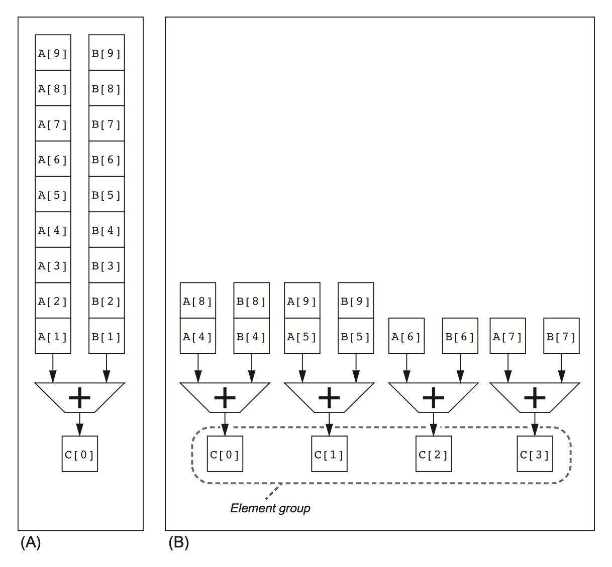
</div>

RV64V 指令集的一个性质是：所有的向量算术指令仅允许向量寄存器中的 N 个元素和另一个向量寄存器中的 N 个元素进行运算，从而简化了并行向量单元的设计——这些单元被结构化为多并行**通道**(lanes)，通道的增加能够提升向量单元的吞吐量峰值。下图展示的是 4 通道向量单元：

<div style="text-align: center">
    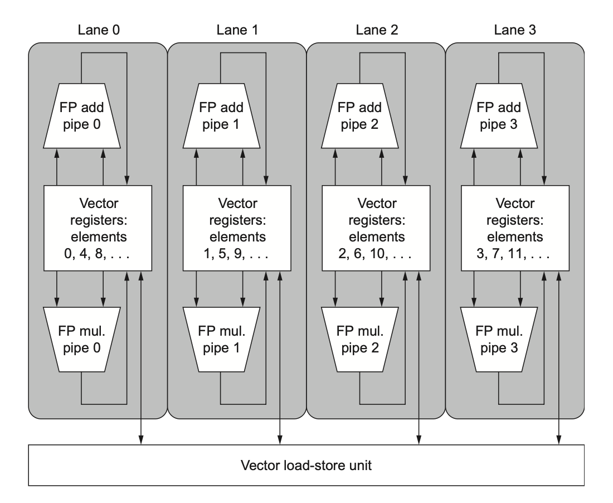
</div>

- 要发挥出多通道的优势，应用程序和架构都要支持长向量，否则执行太快导致很容易耗尽指令带宽，从而需要 ILP 来供应足够的向量指令。
- 每个通道包含了一部分向量寄存器堆，以及来自每个向量函数单元的一个执行流水线。
- 每个向量函数单元执行向量指令的速率为：在每个使用多流水线的通道中，每个时钟周期处理一个**元素组**(element group)（在流水线中一起移动的一组元素）。
- 第一个通道保存所有向量寄存器中的第一个元素（0号），以此类推。这种分配使得通道中的算术流水线可以在不和其他通道发生通信的情况下完成计算，从而减少了线路以及额外的寄存器堆端口带来的成本。
- 此外，多通道的设计可以在仅增加少量控制复杂度，且无需修改现有机器码的情况下提升向量性能；并且允许设计者们在不牺牲性能峰值的情况下权衡好晶片面积、时钟速率、电压和功率之间的关系。


#### Vector-Length Registers

!!! bug "问题"

    通常向量的长度不会和最大向量长度（mvl）匹配的上，并且有时我们无法在编译时知道向量的长度。比如对于下面的代码：

    ```c
    for (i = 0; i < n; ++i)
        Y[i] += a * X[i];
    ```

    其中向量长度取决于 `n`，而 `n` 很可能是未知的，要到运行时才知道。

要解决这一问题，RV64V 提供的方案是增加一个**向量长度寄存器** `vl`，它控制任何向量运算的长度，其值不超过 mvl。这个参数意味着向量寄存器的长度在之后增长的时候无需改动指令集。

但如果 `n` 在编译时未知，且它的值可能会超过 mvl 的话，那就需要用到**条带挖掘**(strip mining)技术了，它能够生成向量运算长度不超过 mvl 的代码。

- 具体来说，一个循环处理任何数量为 mvl 倍数的迭代，另一个循环处理剩余的迭代，并且数量要小于 mvl。
- RISC-V 提供了更好的解决方案：`setvl` 指令将一个小于 mvl 的值和循环变量 n 写入到 `vl`（或其他寄存器）中。
    - 如果循环迭代数量超过 n，那么循环最快能一次计算 mvl 个值，因此 `setvl`将 `vl` 设置为 mvl。
    - 若 n 小于 mvl，则应在循环的最后这次迭代中仅对末尾的 n 个元素进行计算，故 `setvl`将 `vl` 设为 n。
    - `setvl` 还会写入另一个标量寄存器，以协助后续的循环管理。

??? example "例子：对于任意值 n，计算 DAXPY 的 RV64V 代码"

    <div style="text-align: center">
        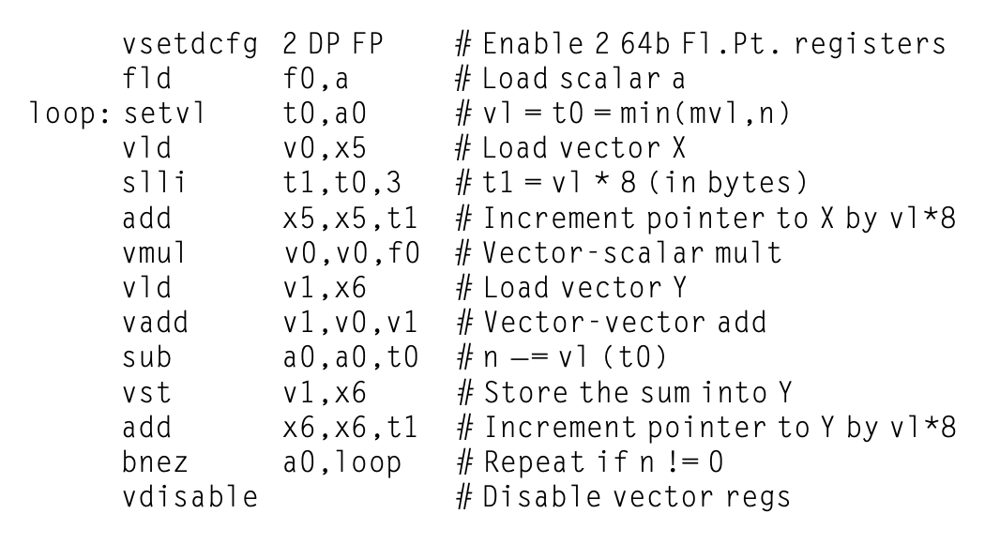
    </div>


#### Predicate Registers

如果程序中有包含 IF 语句的循环的话，就不能以（上述介绍过的）向量模式运行程序，因为 IF 语句引入了控制依赖。考虑以下代码：

```c
for (i = 0; i < 64; ++i)
    if (X[i] != 0)
        X[i] -= Y[i];
```

该循环就不能被向量化；但如果内层循环能够在迭代为 `X[i] != 0` 时被运行的话，那么这个减法操作就能被向量化了。

我们称这种扩展能力为**向量掩码控制**(vector-mask control)，而编译器设计者则将其称为 **IF-转换**(IF-conversion)。在 RV64V 中，**谓词寄存器**保存掩码，并且为每个在向量指令中的元素运算提供条件执行。这些寄存器使用布尔向量来控制向量指令的执行。当谓词寄存器 `p0` 被设置时，所有向量指令仅操作对应项在谓词寄存器里的值为1的向量元素，对应值为 0 的元素就不会发生改变。类似向量寄存器，谓词寄存器也能被启用和禁用，在启用时里面的值均被初始化为1，意味着之后的向量指令会对所有元素进行操作。

???+ example "例子"

    对于上述代码，转换为以下 RISV-V 指令：

    <div style="text-align: center">
        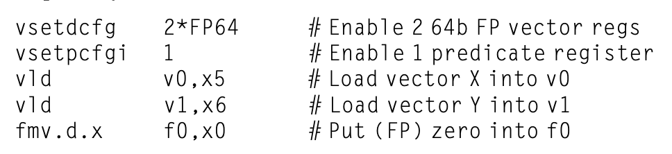
    </div>

    <div style="text-align: center">
        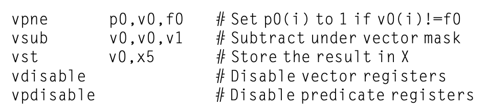
    </div>

尽管引入额外的寄存器会带来额外开销，但是它能够消除分支以及关联的控制依赖，使得条件指令执行更快（即使寄存器有时会做无用功）。


#### Memory Banks

向量加载/存储单元的行为相比算术函数单元会复杂得多——它们的初始化速率不一定是1个时钟周期，因为内存分区的停顿会减少有效的吞吐量；并且启动损失会比一般的函数单元高很多。为了维持理论上的初始化速率，内存系统必须能够产出或接收大量数据，具体做法是将访问分散在多个独立的内存分区中。

- 很多向量计算机支持单个时钟周期内的多次加载和存储，且内存分区周期时间通常几倍于处理器周期时间。为支持多个同步访问，内存系统需要多个分区，并能够独立控制分区地址。
- 多数向量处理器支持不按顺序的加载或存储字数据的能力，因而需要独立分区寻址的支持，简单的内存交错无法做到这一点。
- 多数向量计算机支持多处理器共享相同的内存系统，因此每个处理器将会产生自己单独的地址流。


#### Stride

向量中相邻元素在内存中的位置不一定是按顺序的，考虑以下矩阵乘法的代码：

```c
for (i = 0; i < 100; ++i)
    for (j = 0; j < 100; ++j) {
        A[i][j] = 0.0;
        for (k = 0; k < 100; ++k) 
            A[i][j] += B[i][k] * D[k][j];
    }
```

我们能够向量化 B 的每行以及 D 的每列之间的乘法运算，并将 `k` 作为索引变量，对内层循环进行条带挖掘。然而，为数组分配内存时，数组会被线性化，这意味着同一行或同一列的元素在内存中不一定是相邻的。以上述 C 代码为例，由于 C 语言是行主序(row-major order)的，所以在迭代中被访问 D 的元素之间间隔了 800 个字节（每行 100 个元素 * 8 字节）。因此，我们需要一种能够获取不在内存中相邻的向量元素的技术。

- **步幅**(stride)：将待收集到单个向量寄存器中的元素之间的间隔距离。
    - 上述例子中，矩阵 D 的步幅为 100 个双精度字，B 的步幅为 1 个双精度字；如果是列主序的话，两者正好互换。
- 当向量被加载到向量寄存器时，这个向量看起来就像有逻辑上相邻的元素。因此向量处理器通过具备步幅能力的向量加载和存储运算，能够处理**非单元步幅**(nonunit stride)（步幅 > 1），而这种能够访问非顺序内存位置并将其重塑为紧密结构的能力正是向量架构的一大优点。
- 由于步幅可能和向量长度一样在编译时是未知的，因此我们可以将向量步幅放在一个通用目的寄存器内，然后 RV64V 指令 `vlds`(load vector with stride) 将向量放在向量寄存器内；对于存储，也有对应的 `vsts`(store vector with stride) 指令。
- 当多个访问在单个分区中发生竞争时，内存分区冲突就发生了，因此要停顿一个访问。当满足以下关系时，我们认为分区冲突发生：

    $$
    \dfrac{\text{Numbers of banks}}{\text{Least common multiple (Stride, Number of banks)}} < \text{Bank busy time}
    $$


#### Gather-Scatter

在稀疏矩阵中，向量元素通常以紧凑的形式被存储着，然后需要间接访问。假设有一个简化的稀疏结构，对应的代码如下：

```c
for (i = 0; i < n; ++i)
    A[K[i]] += C[M[i]];
```

这段代码实现了在数组 A 和 C 上的稀疏向量求和，用到了索引向量 K 和 M 来指定 A 和 C 中的非零元素，其中 A 和 C 必须有相同数量（n）的非零元素，K 和 M 也得大小相同。

支持稀疏矩阵的基本机制是使用索引向量的**聚集-分散运算**(gather-scatter operations)。该运算的目标是支持稀疏矩阵在压缩表示法和正常表示法之间的移动。

- **聚集**(gather)运算接收一个**索引向量**(index vector)，并通过将基地址与索引向量中给出的偏移量相加，来获取对应地址处的元素所组成的向量。结果为在一个向量寄存器中的稠密向量。
- 在完成对稠密向量中元素的操作后，稀疏向量可以通过**分散**(scatter)存储，以扩展形式保存这些元素，同时使用相同的索引向量。
- RV64V 提供的对应指令为 `vldi`(load vector indexed or gather) 和 `vsti`(store vector indexed or scatter)。下面将上述代码转换为 RISC-V 指令序列：

    <div style="text-align: center">
        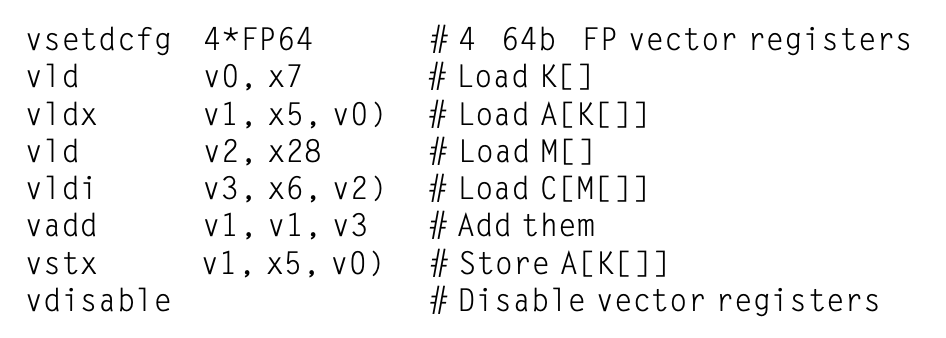
    </div>

    - 简单的向量编译器不会自动向量化上述源代码，因为编译器不清楚 `K` 的元素是否是唯一值（这样的话就没有依赖存在），所以需要程序员发出指示，告诉编译器以向量模式运行上述循环是安全的。

- 尽管索引加载和存储能被流水线化，但它们会比没有索引的版本更慢些，因为内存分区无法在指令开始时得知，并且寄存器堆也必须提供向量单元通道之间的通信，以支持聚集和分散。
- 聚集和分散中的每个元素都有独立的地址，所以不能将它们按组处理，并且在内存系统中会有多处冲突。因此即使在有高速缓存的系统中，单独的访问还是会导致显著的时延。


#### Programming Vector Architecture

向量架构的一个优势在于编译器能在编译时告诉程序员某段代码是否能够被向量化，通常会为不能向量化的代码给出提示。这能让领域专家知道如何通过修改代码，或者告诉编译器代码没有问题来提升性能。正是这种编译器和程序员之间的对话，简化了向量计算机上的编程。

然而，影响程序以向量模式运行的主要因素是程序自身：循环是否有真实的数据依赖，或者它们能否被重构从而避免这种依赖。算法的选择，以及编码的方式都会影响到这个因素。


## SIMD Instruction Set Extensions for Multimedia

SIMD 多媒体扩展起源于一个简单的发现：许多媒体应用程序处理的数据类型宽度，比 32 位处理器原本优化的数据类型更窄。下表总结了典型的多媒体 SIMD 指令：

<div style="text-align: center">
    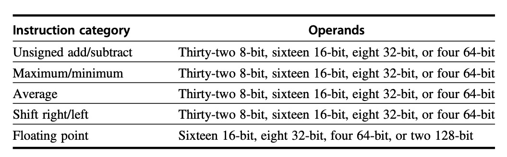
</div>

类似向量指令，SIMD 指令指明相同的对向量数据的操作；不同之处在于 SIMD 倾向于指明更少的操作数，因而使用更小的寄存器堆。

此外，SIMD 扩展还忽略了以下三样东西：

- 向量长度寄存器：因为多媒体 SIMD 扩展固定了数据操作数的个数，导致产生了数以百计的指令（x86 架构的 [MMX](https://en.wikipedia.org/wiki/MMX_(instruction_set)), [SSE](https://en.wikipedia.org/wiki/Streaming_SIMD_Extensions) 和 [AVX](https://en.wikipedia.org/wiki/Advanced_Vector_Extensions) 扩展）
- 步幅或聚集/分散数据传输指令：到目前为止，多媒体 SIMD 还没有提供向量架构上的更精确的寻址模式，即步幅访问和聚集-分散访问
- 掩码（谓词）寄存器：尽管正在改变，多媒体 SIMD 通常不提供用于支持元素条件执行的掩码寄存器

这些省略导致编译器难以生成 SIMD 代码，并增加了用 SIMD 汇编语言编写程序的难度。

既然有多媒体 SIMD 扩展有上述缺点，那么它为什么还是那么流行呢？其原因在于：

- 将它们添加到标准算术单元中的初始成本很低，且易于实现
- 与向量架构相比，它们所需的额外处理器状态极少，这对于上下文交换时间而言很关键
- 向量架构需要很多内存带宽，而很多计算机无法满足这样的要求
- SIMD 不必处理来自虚拟内存的问题
- 容易引入有助于新媒体标准的指令，例如执行排列的指令或消耗比向量能产生的更多或更少操作数的指令

??? example "例子"

    === "题目"

        <div style="text-align: center">
            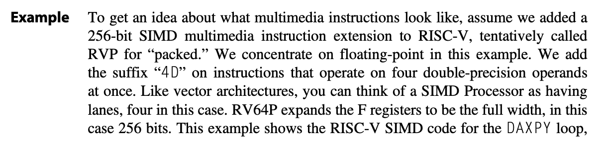
        </div>

        <div style="text-align: center">
            
        </div>

    === "答案"

        <div style="text-align: center">
            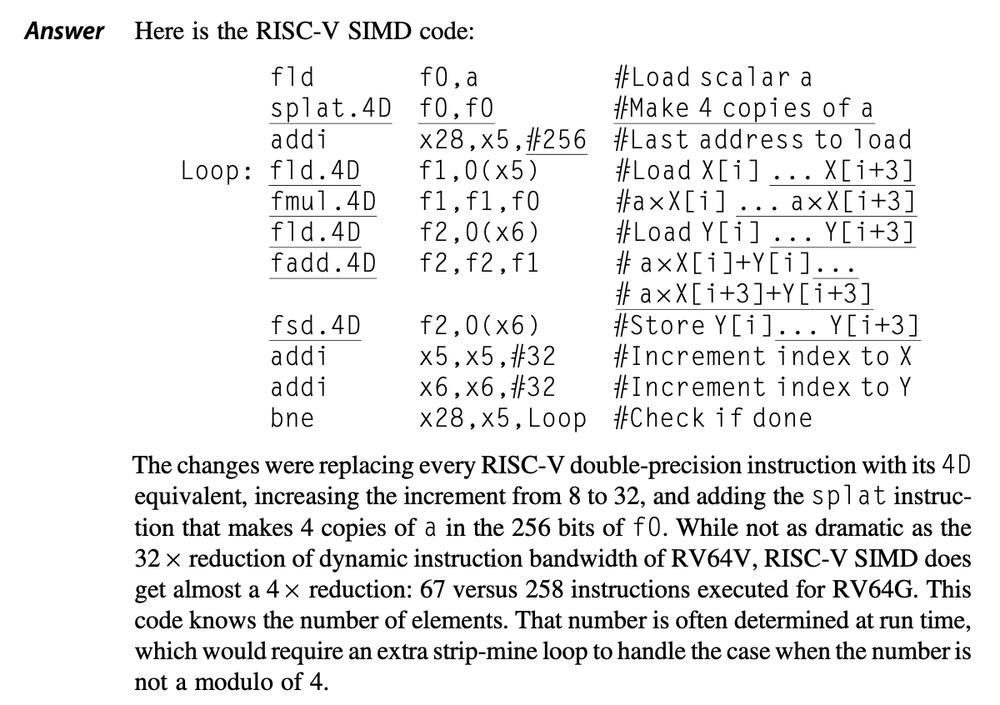
        </div>

鉴于多媒体 SIMD 扩展的临时性质，使用这些指令的最简单的方式是使用库函数或编写汇编语言代码。而现在的高级编译器能够自动生成 SIMD 指令，但程序员必须确保将内存中的所有数据和 SIMD 单元的宽度对齐，避免让编译器为可向量化的代码生成标量指令。


### Roofline Visual Performance Model

一种直观的比较 SIMD 架构变体的潜在浮点性能的可视化方法是**屋顶线模型**(Roofline model)。它用二维图形表示浮点数性能、内存性能以及算术强度之间的关系。

- **算术强度**(arithmetic intensity)是指每访问一字节内存所执行的浮点运算次数的比率，可通过计算“程序中浮点运算总次数 / 在程序执行时传输到主存中的数据字节数”得到。下图展示了不同场景下的相对算术强度：

    <div style="text-align: center">
        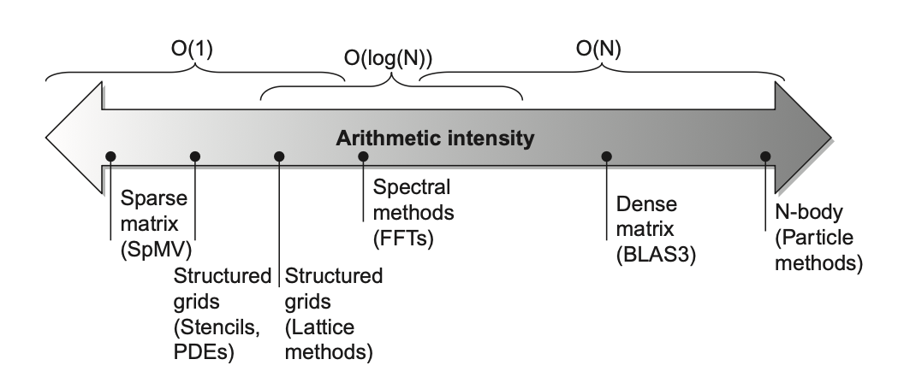
    </div>

- 峰值浮点性能可通过硬件规格确定
- 本案例研究中的许多内核无法适应芯片上的高速缓存，因此峰值内存性能由高速缓存背后的内存系统定义，可通过运行 Stream 基准测试得到
    - 注意，我们需要峰值内存带宽对处理器而言也是有效的，而不是仅在 DRAM 的引脚上

下图展示了用屋顶线模型比对两个处理器的性能：

<div style="text-align: center">
    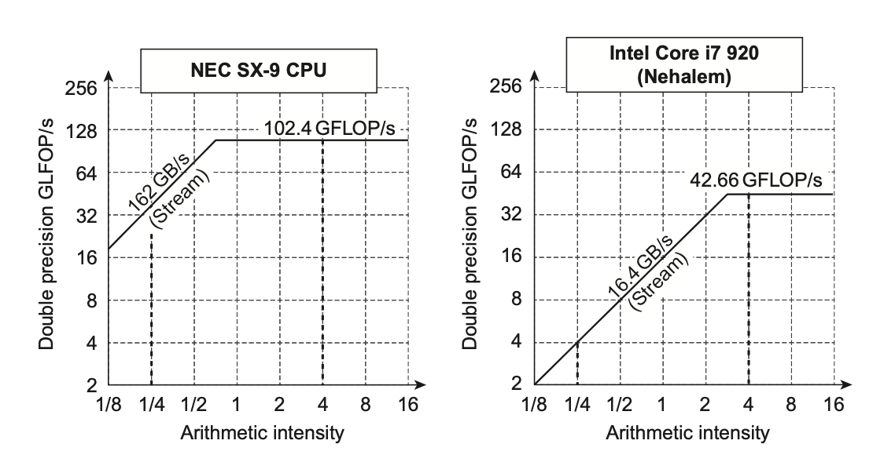
</div>

>注意横轴和纵轴是按对数确定尺度的。

我们可以用以下公式来表述屋顶线模型中的曲线：

$$
\begin{align}
\text{Atttainable GFLOPs/s} = & \min(\text{Peak Memory BW} \notag \\
& \times \text{Arithmetic Intensity}, \text{Peak Floating} - \text{Point Perf.}) \notag
\end{align}
$$

考虑模型中对角线和水平线的汇聚点：

- 如果它在很右侧的位置上，那么只有少数具备高算术强度的内核才能达到计算机的最大性能
- 如果它在很左侧的位置上，那么几乎所有内核都能达到最大性能

向量处理器相比其他 SIMD 处理器而言，同时具备较高的内存带宽，以及靠左的汇聚点。


## Graphics Processing Units

!!! info "注"

    - **图形处理器**(graphics processing units, GPUs)的祖先是图形加速器(graphics accelerators)
    - 本节我们仅讨论 GPU 在计算方面的用途


### Programming in GPU

GPU 程序员的挑战不仅在于获取 GPU 的良好性能，还在于协调好在系统处理器，GPU 以及在系统内存和 GPU 内存之间的数据传输这三者的调度。此外，GPU 具备各种并行，包括多线程、MIMD、SIMD，甚至还有 ILP。

英伟达(NVINDA)开发了一种类 C 的语言和编程环境，通过应对上述挑战（异构计算(heterogeneous computing)和多面并行(multifaceted parallelism)）以提升 GPU 程序员的生产力——这个系统被称为 [**CUDA**](https://en.wikipedia.org/wiki/CUDA) (Compute Unified Device Architecture)。CUDA 能够生成用于系统处理器的 C/C++ 代码，以及用于 GPU（CUDA 中的 D）的 C/C++ 方言。

>注：[OpenCL](https://en.wikipedia.org/wiki/OpenCL) 是一种和 CUDA 类似的语言，但是由多家公司共同开发的，具备跨平台的特点。

- 英伟达将上述各类并行统一称为 **CUDA 线程**(CUDA Thread)，作为表示最底层并行的编程原语，这使得编译器和硬件能够将数以千计的 CUDA 线程放在一起，以利用 GPU 内的各种并行。因此英伟达将 CUDA 编程模型归类为单指令，多线程(SIMT)。
- 而这些被分进一个个块内一起执行的一组线程称为**线程块**(Thread Block)。
- 在这些线程块上执行运算的处理器被称为**多线程 SIMD 处理器**(multithreaded SIMD Processor)。
- 为区分来自 GPU 和系统处理器的函数，CUDA 使用 `__device__` 或 `__global__` 表示前者，`__host__` 表示后者。
- 以 `__device__` 声明的 CUDA 变量被分配到 GPU 的内存，这样的内存可被所有多线程 SIMD 处理器访问到。
- 运行在 GPU 上的函数 `name` 的扩展函数调用语法为：`name <<<dimGrid.dimBlock>>>( ...parameter list... )`，其中 `dimGrid` 和 `dimBlock` 分别指明代码（线程块）和块（线程）上的维度。
- 除了块的标识符（`blockIdx`）和块内每个线程的标识符（`threadIdx`）外，CUDA 为每个块的线程个数提供了关键字 `blockDim`。

??? example "例子"

    === "C 代码"

        ```c
        // Invoke DAXPY
        daxpy(n, 2,0, x, y);
        // DAXPY in C
        void daxpy(int n, double a, double *x, double *y) {
            for (int i = 0; i < n; ++i)
                y[i] = a * x[i] + y[i];
        }
        ```

    === "对应的 CUDA 版本"

        ```c
        // Invoke DAXPY with 256 threads per Thread Block
        __host__
        int nblocks = (n + 255) / 256;
        daxpy<<<nblocks, 256>>>(n, 2,0, x, y);
        // DAXPY in CUDA
        __global__
        void daxpy(int n, double a, double *x, double *y) {
            int i = blockIdx.x * blockDim.x + threadIdx.x;
            if (i < n)
                y[i] += a * x[i];
        }
        ```

由 GPU 硬件负责处理并行执行和线程管理，而非由应用程序或操作系统。为简化硬件调度，CUDA 要求线程块能够独立地并以任意顺序执行。不同的线程块之间不得直接通信，尽管它们能够通过全局内存的原子内存操作来协调。

想要提升性能的程序员在用 CUDA 编写代码时会将 GPU 硬件牢记在心，尽管这会影响到生产力，但这样做对这类程序员来说是值得的。


### NVINDA GPU Computational Structures

有一个很麻烦的地方在于：GPU 有自己的一套术语，和我们熟知的 CPU 术语有不少出入，并且不少词汇会给我们带来误导性的理解。为了能正确理解 GPU 的术语，下面给了一张表格，展示了本章会提到的 GPU 术语，并提供了对应的 CPU 术语和解释。

??? abstract "一些 GPU 术语"

    <div style="text-align: center">
        
    </div>

- **网格**(grid)是一种在 GPU 上，由一组线程块构成的代码（对应术语为向量化循环(vectorized loop)）。网格和线程块是在 GPU 上实现的编程抽象，帮助程序员组织 CUDA 代码。下图展示了网格和线程块之间的关系：

    <div style="text-align: center">
        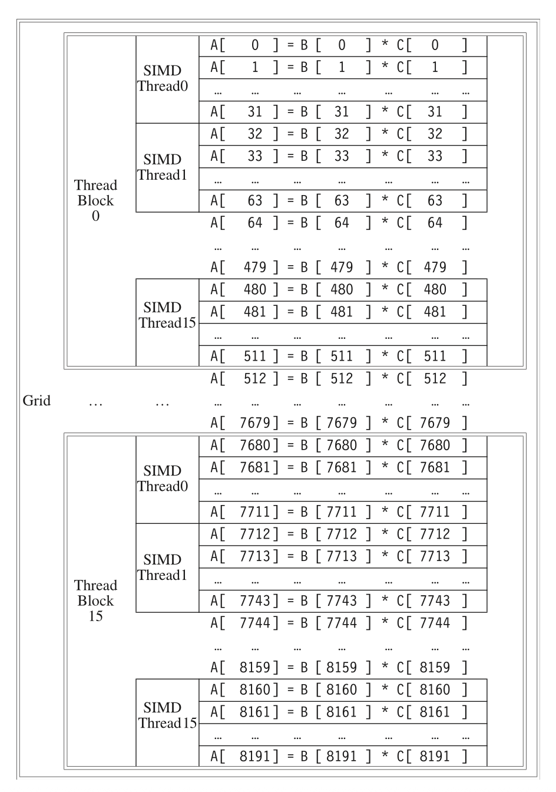
    </div>

- 下图展示了一个简化的多线程 SIMD 处理器框图：

    <div style="text-align: center">
        
    </div>

    可以看到，它和向量处理器很像，但它有多个并行的函数单元，而不是少数高度流水线化的函数单元。

- **线程块调度器**(Thread Block Scheduler)将线程块分配给多线程 SIMD 处理器上
    - 为了在具有不同多线程 SIMD 处理器数量的 GPU 模型之间提供透明的可扩展性，线程块调度器将线程块分配给多线程 SIMD 处理器
- 综上，GPU 本质上是一个由多线程 SIMD 处理器构成的多处理器
- 深入一层细节来看，硬件所创建、管理、调度并执行的核心对象是一条 **SIMD 指令线程**(thread of SIMD instructions)。这些指令线程有自己的 PC，并在一个多线程 SIMD 上运行（所以这些线程是相互独立的）。
- **SIMD 线程调度器**(SIMD Thread Scheduler)知道哪个 SIMD 指令线程已经准备好运行，并将这样的线程发送给一个即将在多线程 SIMD 处理器上运行的分派单元，不必按顺序获取线程中的下一条指令。
    - 调度器包含了一个记分板(scoreboard)，用于追踪至多 64 个 SIMD 指令线程，以观察哪些线程是准备好的。由于高速缓存和 TLB 的命中和失效，内存指令的时延是可变的，因此要求记分板确定这些指令何时完成。
    - 下图展示了调度器随时间变化，以不同顺序获取 SIMD 线程指令的过程：

        <div style="text-align: center">
            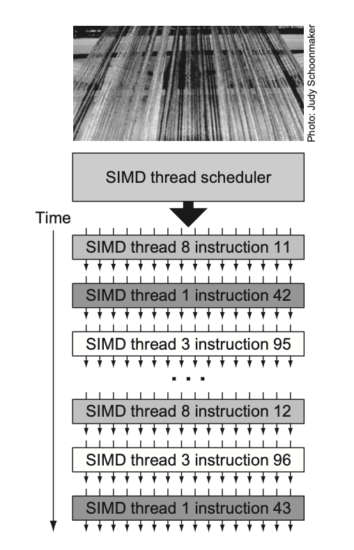
        </div>

>因此 GPU 硬件有两级硬件调度器：线程块调度器和 SIMD 线程调度器。

- 由于线程包含了多条 SIMD 指令，SIMD 处理器必须有能够执行运算的多个函数单元，我们称之为 **SIMD 通道**(SIMD Lanes)。
    - 通道数量可以达到线程块内的线程数

- GPU 架构师的假设是：GPU 应用程序有很多 SIMD 指令线程，而多线程既可以隐藏对 DRAM 的时延，又可以增加多线程 SIMD 处理器的利用率。
- 寄存器使用和最大线程数之间需要权衡：每线程更少的寄存器意味着更多的线程，也就是说不是所有的 SIMD 线程需要有最大寄存器数。
- 为了能执行很多 SIMD 指令线程，当 SIMD 线程存在且 SIMD 指令线程被创建或释放时，每个线程被动态分配到在每个 SIMD 处理器上的一组物理寄存器。虽然这种可变性会带来分段(fragementation)问题，以及让一些寄存器变得不可用，但实际上大多数线程块对于给定的网格使用相同数量的寄存器。这种灵活性需要硬件具备路由(routing)、仲裁(arbitration)和分区(banking)的能力。


### NVINDA GPU Instruction Set Architecture

不同于其他系统处理器，英伟达编译器的指令集目标是一种对硬件指令集（对程序员而言是不可见的）的抽象——**PTX**(Parallel Thread Execution，并行线程执行)提供了用于编译器的一个稳定的指令集，且在不同代 GPU 上具备兼容性。

- PTX 指令描述了在单个 CUDA 线程上的运算，并且通常和硬件指令进行一对一映射；但一条 PTX 指令可扩展至多个机器指令，反之亦然。
- PTX 采用无限数量的写一次寄存器
    - 编译器必须运行一个寄存器分配过程，将 PTX 寄存器映射到一个固定数量的，在真实设备中可用的读写硬件寄存器。
    - 优化器随后运行，以减少寄存器的使用，从而消除无效代码，将指令合并折叠，并计算分支可能分叉的位置以及分叉路径可能重新汇合的地点。
- PTX 指令格式为：`opcode.type d, a, b, c;`，其中 `d` 是目标操作数（除了在存储指令外都是寄存器），`a`, `b`, `c` 都是源操作数（32位/64位寄存器或者常数值），而运算类型如下所示：

    <div style="text-align: center">
        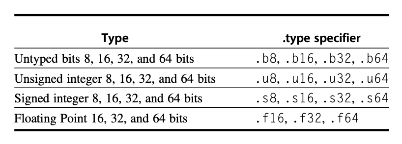
    </div>

??? abstract "一些基本的 PTX 指令集"

    <div style="text-align: center">
        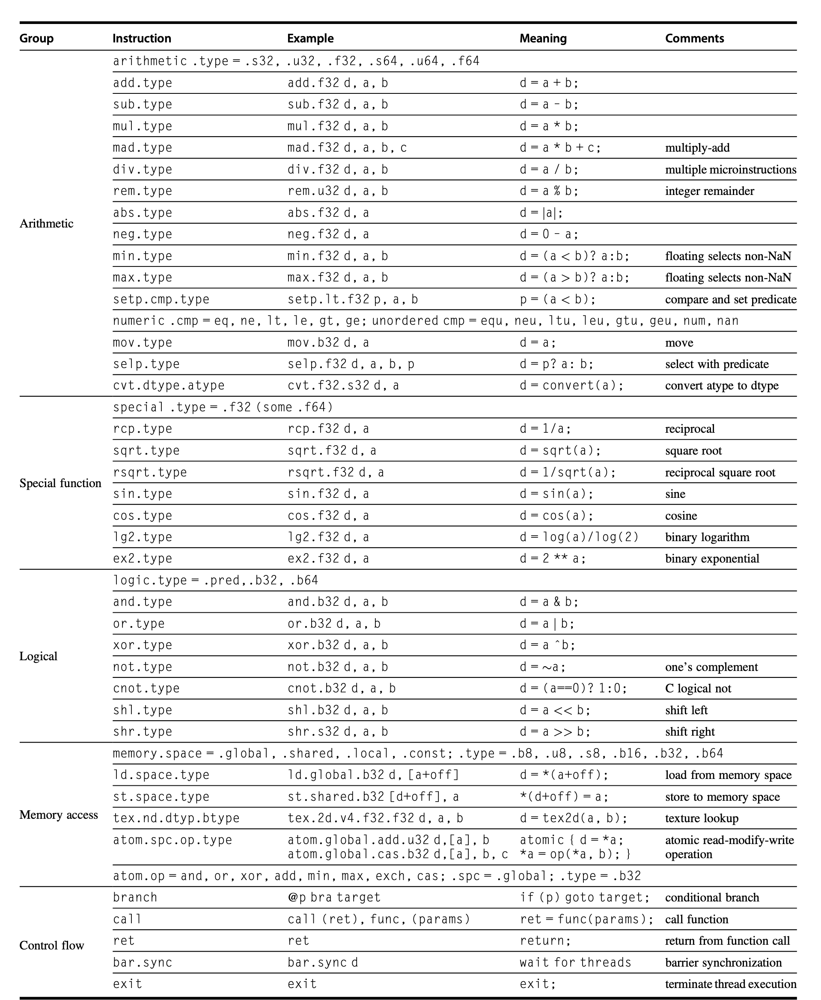
    </div>

- 所有指令均可通过 1 位谓词寄存器进行条件执行，这些寄存器可通过设置谓词指令（`setp`）来设定
- 控制流指令为：
    - 函数：`call`, `return`
    - 线程：`exit`, `branch`
    - 线程块内线程的屏障同步(barrier synchronization)：`bar.sync`
- 编译器或 PTX 程序员将虚拟寄存器声明为 32 位或 64 位类型或无类型值，比如 `R0`, `R1`, ... 是 32 位值，而 `RD0`, `RD1`, ... 是 64 位值。
- GPU 没有提供单独的用于顺序数据传输、步幅数据传输或聚集-分散数据传输的指令——所有的数据传输都是聚集-分散的！
    - 为了重新获得顺序数据传输的高效性，GPU 采用一种特殊的**地址合并**(Address Coalescing)硬件，以识别出 SIMD 指令线程内的 SIMD 通道何时共同发出连续的地址。该硬件随后通知**内存接口单元**(Memory Interface Unit)来发起 32 个顺序字的块传输请求。
    - 为了采用上述改进措施，GPU 程序员必须确保相邻的 CUDA 线程同时访问邻近的地址，这样它们能够合并成一个或少量内存或高速缓存块。

??? example "例子：用 PTX 指令实现 DAXPY"

    <div style="text-align: center">
        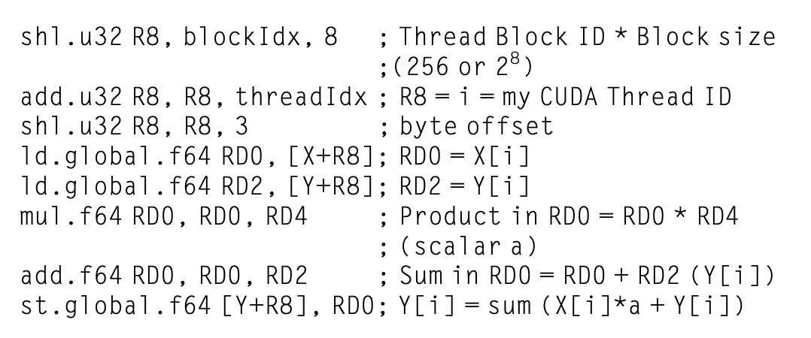
    </div>


### Conditional Branching in GPUs

??? info "太复杂了，暂时藏起来🙈"

    在 IF 语句的处理上，GPU 相比向量架构会更依赖于硬件支持——除了谓词寄存器外，还会用到内部掩码、分支同步栈以及指令标记器，来管理分支发散成多条执行通路和通路汇集的时间。

    在 PTX 汇编器级别中，一个 CUDA 线程的控制流由以下内容描述：PTX 指令的分支、调用、返回和退出，以及每个指令的线程通道断言（由程序员使用线程通道的 1 位谓词寄存器指定）。PTX 汇编器分析 PTX 分支图，并将其优化为最快的 GPU 硬件指令序列。这些指令可以在分支上自己做决定，无需被锁住。

    在 GPU 硬件指令级别中，控制流包括了分支、跳转、索引跳转、调用、索引调用、返回、退出，以及管理分支同步栈的特殊指令。GPU 为每个 SIMD 线程提供一个栈，一个栈元素包含一个标识令牌(identifier token)，一个目标指令地址以及一个目标线程活跃掩码(thread-active mask)。还有一些 GPU 特殊指令，用于为 SIMD 线程压入栈元素；还有一些特殊指令及指令标记，能够弹出栈元素或将栈回退至指定元素，并依据目标线程活跃掩码跳转至目标指令地址。GPU硬件指令还有一个每条通道独立的谓词（启用/禁用）功能，通过为每个通道分配 1 位谓词寄存器来实现。


### NVINDA GPU Memory Structures

下图展示了英伟达 GPU 的内存结构：

<div style="text-align: center">
    
</div>

- 在多线程 SIMD 处理器上，每个 SIMD 通道被给予一块不在芯片上的 DRAM 的私有区域，称为**私有内存**(private memory)
    - 用于存放栈帧(stack frame)、溢出寄存器和无法被寄存器容纳的私有变量
    - SIMD 通道之间不会共享私有内存
    - GPU 将私有内存缓存在 L1 和 L2 高速缓存中，以辅助寄存器溢出和加速函数调用
- 而在芯片上的，位于每个多线程 SIMD 处理器中的内存称为**局部内存**(local memory)
    - 该内存具有低时延，高带宽的特征，程序员可以拿它来存储需要被同一线程或相同线程块内的不同线程复用的数据
    - 它的容量不大，一般只有 48 KB
    - 不会保存线程块的状态
    - 可被多线程 SIMD 处理器的多个 SIMD 通道共享，但无法在多个多线程 SIMD 处理器间共享
    - 当多线程 SIMD 处理器创建线程块时，会为这些块动态分配局部内存，并在所有线程块内的线程退出时释放内存
- **GPU 内存**(GPU Memory)：在芯片外的，被整个 GPU 和所有线程块共享的内存
    - 系统处理器（称为主机）能够对 GPU 内存进行读写操作，而局部内存和私有内存对主机而言是不可用的

- GPU 不依赖于大缓存，而是采用较小的流式缓存，且因其工作集可能高达数百 MB，故依赖大量并行的 SIMD 指令线程来掩盖访问 DRAM 时的高延迟。考虑到使用多线程来隐藏 DRAM 延迟，系统处理器中原本用于大容量 L2 和 L3 高速缓存的芯片面积，被转而投入到计算资源以及大量寄存器的配置上，这些寄存器用于维持众多 SIMD 指令线程的状态。
- 不过最近的 GPU 和向量处理器用高速缓存来降低时延。
- 为提升内存带宽并降低开销，PTX 数据传输指令与内存控制器合作，当地址落在相同的块上时，将来自 SIMD 线程的单独的并行线程请求合并成单个的内存块请求。这些限制被放在 GPU 程序上。


### Vector Architectures v.s. GPUs

下表展示了 GPU 和向量架构中对应的术语：

??? abstract "表格"

    <div style="text-align: center">
        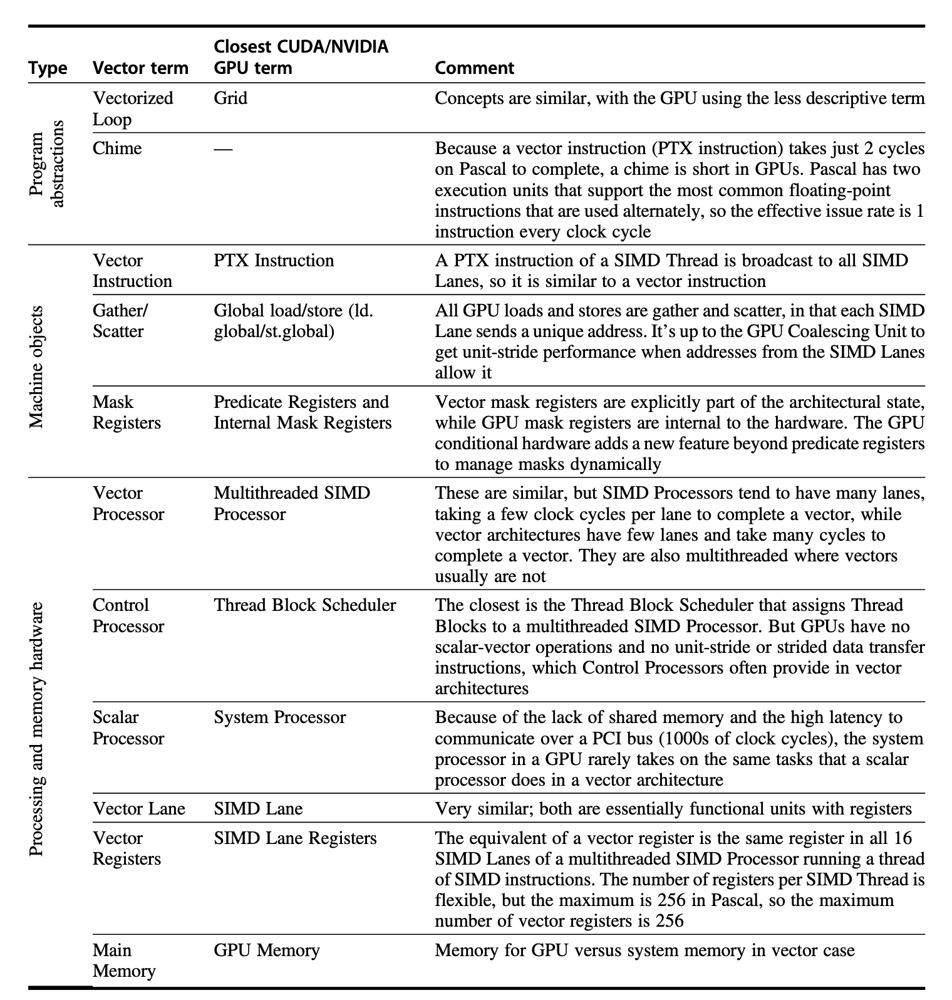
    </div>

下图为 4 通道的向量处理器（左边）和 GPU 上 4 SIMD 通道的多线程 SIMD 处理器（右边）：

<div style="text-align: center">
    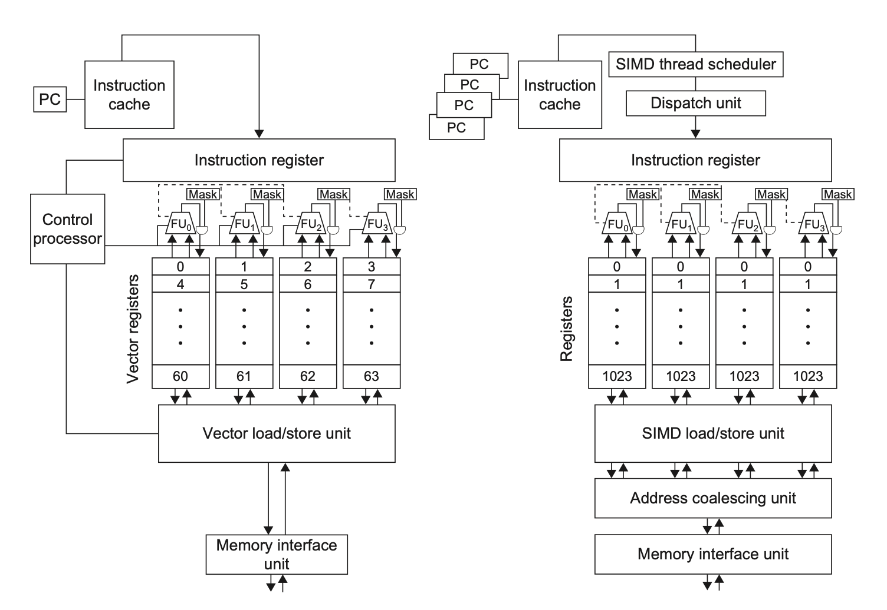
</div>


### Multimedia SIMD Computers v.s. GPUs

下表比对了多媒体 SIMD 扩展和 GPU 之间的异同：

<div style="text-align: center">
    
</div>


## Detecting and Enhancing Loop-Level Parallelism

对循环级并行的分析集中在后续迭代的数据访问是否依赖于产生于先前迭代的数据值。这样的依赖被称为**循环携带依赖**(loop-carried dependence)。

因为寻找循环级并行包括了识别诸如循环、数组引用和归纳变量计算等结构，相比在机器码级别上，编译器能够在（或接近）源级别上很容易完成这一分析。下面来看更复杂的例子：

??? example "例子"

    === "例1"

        === "题目"

            考虑以下循环：

            ```c
            for (i = 0; i < 100; ++i) {
                A[i+1] = A[i] + C[i];    // S1
                B[i+1] = B[i] + A[i+1];  // S2
            }
            ```

            假设 `A`, `B`, `C` 是不同且不重叠的数组，循环中语句 `S1`, `S2` 之间有哪些数据依赖存在呢？

        === "解答"

            有两个不同的数据依赖：

            - 当前迭代下的 `S1`（`A[i]`）会用到先前迭代下的 `S1` 计算得到的值（`A[i+1]`）；`S2` 也存在这一依赖（`B[i]` 和 `B[i+1]`）。该依赖是循环携带的，迫使循环中连续的迭代按顺序执行。
            - `S2` 使用相同迭代下 `S1` 计算得到的值 `A[i+1]`。该依赖并非循环携带的，所以如果仅存在这一依赖的话，循环中的多个迭代还是可以并行执行的（比如使用前面提到过的循环展开等方法）。

    === "例2"

        === "题目"

            考虑以下循环：

            ```c
            for (i = 0; i < 100; ++i) {
                A[i] += B[i];    // S1
                B[i+1] = C[i] + D[i+1];  // S2
            }
            ```

            `S1`, `S2` 之间的依赖是什么？循环是否能并行，如果不能的话，那么怎么才能让它并行呢？

        === "解答"

            因为 `S1` 用到上一次迭代中 `S2` 的计算结果，所以两条语句间有循环携带依赖。尽管如此，循环还是能够并行执行的，因为这里的依赖不是循环的，即没有语句是依赖于自身的，并且 `S1` 依赖 `S2`，但 `S2` 没有依赖 `S1`。但要想并行的话，还必须在转换代码时遵循部分排序并暴露并行性。转换后的代码如下所示：

            ```c
            A[0] += B[0];
            for (i = 0; i < 99; ++i) {
                B[i+1] = C[i] + D[i];
                A[i+1] += B[i+1];
            }
            B[100] = C[99] + D[99];
            ```

- 我们的分析需要从找到所有循环携带的依赖关系开始。这种依赖信息是**不精确的**(inexact)，从某种意义上说，它告诉我们这种依赖**可能**存在。
- 通常，数据依赖分析仅能判断一个引用可能依赖于另一个；要确定两个引用必须指向完全相同地址，则需更复杂的分析。
- 循环携带依赖经常构成了**递推关系**(recurrence)


### Finding Dependences

### Eliminating Dependent Computations

## Cross-Cutting Issues

### Energy and DLP

### Banked Memory and Graphics Memory

### Strided Accesses and TLB Misses

## Fallacies and Pitfalls