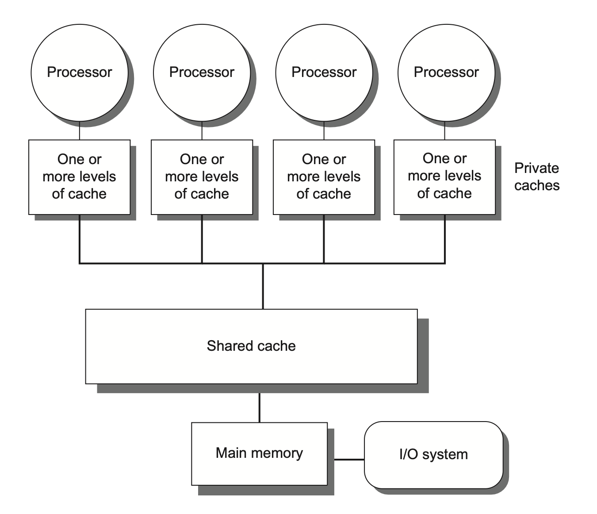

# Chap 5: Thread-Level Parallelism

## Introduction

前面提到过，由于 ILP 工艺进步的放缓，单处理器(uniprocessor)的发展逐渐走向尾声。因此多处理器的重要性日渐提升，这主要体现在以下几方面：

- ILP 的低效——功率和硅成本的增长要高于性能的提升
- 高端服务器在云计算和 SaaS 的重要性提升
- 得益于互联网上的大量数据，数据密集型应用不断增长
- 多处理器的并行能力为大数据集（数据并行）、“自然世界”并行（科学和工程代码）以及在大量并行的独立请求带来很大帮助
- ...

在本章，我们主要探索的是**线程级并行**(thread-level parallelism, **TLP**)；而 TLP 利用到了 **MIMD**(multiple instructions, multiple data)。

**多处理器**(multiprocessor)由一组紧密耦合的处理器构成，这些处理器受操作系统控制，并通过一个共享的地址空间来共享内存（不一定只有一块物理内存）。多处理器通过以下两个不同的软件模型来利用 TLP：

- **并行处理**(parallel processing)：一组在单任务上协作的紧密耦合的线程的执行
- **请求级并行**(request-level parallelism)：来自一名或多名用户的多个相对独立的进程的执行
    - 运行在多个处理器上的单一应用程序会利用请求级并行，例如数据库响应查询，或者通过多个独立运行的应用程序（后者通常被称为**多道程序设计**(multiprogramming)）

多处理器既包含具有多个核心的单芯片系统，即所谓的**多核**(multicore)，也涵盖由多个芯片组成的计算机，其中每个芯片通常也是一个多核单元。

之后我们还会探讨**多线程**(multithreading)技术——这是一种支持在单个多发射处理器上以交错方式执行多个线程的技术。许多多核处理器同样包含对多线程的支持。

## Multiprocessor Architecture: Issues and Approach

要充分利用具有 n 个处理器的 MIMD 多处理器，通常需要至少 n 个线程或进程来执行；而当今大多数多核芯片都支持多线程技术，这一数量会增至 2 到 4 倍。单个进程内的独立线程通常由**程序员**显式指定，或由**操作系统**根据多个独立请求动态创建。另一种极端情况是，一个线程可能仅包含循环的数十次迭代——这是**并行编译器**循环中的数据并行性而自动生成的。尽管分配给线程的计算量（称为**粒度大小**(grain size)）对于高效利用 TLP 至关重要，但与 ILP 的本质区别在于：TLP 是由**软件系统**或**程序员**在高层抽象中识别出的、由数百至数百万条可并行执行的指令构成的代码段。

线程也可为 DLP 所利用，但其开销通常高于 SIMD 处理器或 GPU。必须确保粒度足够大，才能高效利用其并行性。

现有的共享内存的多处理器，根据其内存组织的不同划分为以下两大类：

- **对称（共享内存）多处理器**(symmetric (shared-memory) multiprocessors, **SMP**)（或**集中式**(centralized)**共享内存多处理器**）
    - 具有小到中等数量的核心，通常为 32 个或更少
    - 对于这种核心数量较少的多处理器，里面的这些处理器可以共享一个所有处理器都有平等访问权的单一集中式内存，因此称为“对称”
    - 大多数现有的多核都属于 SMP
    - SMP 有时也被称为**统一内存访问**(uniform memory access, UMA)多处理器，这是因为所有处理器对内存的访问延迟是均等的，即便内存被划分为多个分区亦是如此
    - 某些多核处理器对最外层高速缓存的访问是非均匀的，这种结构被称为**非均匀高速缓存访问**(nonuniform cache access, NUCA)，因此即便它们拥有单一主内存，也并非真正的 SMP
    - 下图展示了集中式共享内存多处理器的基本结构：

        

            
        

- **分布式共享内存**(distributed shared memory, **DSM**)
    - 在由**多个多核芯片**构成的多处理器系统中，每个多核芯片通常配备**独立的内存单元**，因此这类系统的内存采用**分布式**组织而非集中式组织
    - 许多分布式内存设计能实现对**本地**内存的快速访问，而**远程**内存访问速度则显著下降
    - 在此类架构中，程序员和软件系统需明确区分本地与远程内存访问操作，但通常无需关注各远程存储节点间的具体分布情况
    - 为支持更多的处理器数量，内存必须是分布组织而非集中组织；否则内存系统将以增大访问延迟的代价来满足更多处理器的带宽需求
    - 由于上述问题，SMP 随处理器数量的增加会逐渐丧失优势，因此绝大多数超大规模多处理器系统都采用了分布式内存组织
    - 下图展示了分布式共享内存多处理器的基本结构：

        

            
        

    

## Centralized Shared-Memory Architectures

## Performance of Symmetric Shared-Memory Multiprocessors

## Distributed Shared-Memory and Directory-Based Coherence

## Synchronization

## Models of Memory Consistency

## Cross-Cutting Issues

## Fallacies and Pitfalls