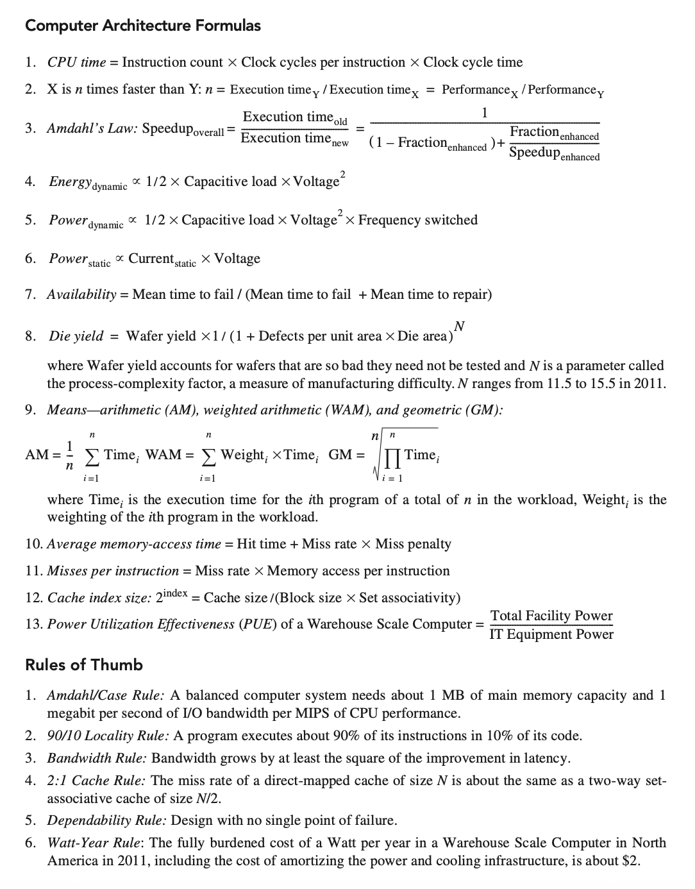

# 计算机体系结构

!!! info "课程信息"

    - 学分：3.5
    - 教师：何水兵
    - 教材：*Computer Architecture, A Quantitative Approach*, Sixth Edition

!!! abstract "目录"

    最近对着 cr 老师的 PPT 复习，可能还会补充或修改写东西...（~~如果不从应试角度看，cr 的 PPT 吊打 jxh 的~~）

    - [x] [Chap 1: Fundamentals of Quantitative Design and Analysis](1.md)
    - [x] 建议回顾《计算机组成》课程中的[流水线 CPU 部分](../co/4.md#pipelining)
    - [x] [Chap 2: Memory Hierarchy Design](2.md)
        - 【6.2 更新】参考 jxh 女士那版 PPT，补充了很多内容，补上了之前的坑
    - [x] [Chap 3: Instruction-Level Parallelism and Its Exploitation](3.md)
        - 【6.3 更新】补上了之前漏掉的“记分板”一节，并结合 PPT 增加或修改了一些内容
    - [x] [Chap 4: Data-Level Parallelism in Vector, SIMD, and GPU Architectures](4.md)
    - [x] [Chap 5: Thread-Level Parallelism](5.md)

    【6.18 更新】根据 cr 老师 PPT 稍微修改了笔记

    

    

    

    
A4 Cheatsheet

    
5.7 MB / 2 P / 2025-06-18

    

    <a class="down-button" target="_blank" href="https://courses.noughtq.top/CA-D2CX/CA_A4_NoughtQ.pdf" markdown="1">:fontawesome-solid-download: 下载</a>
    

??? info "一些有用的公式（来自教材）"

    

        
    

!!! recommend "参考资料"

    - jxh 和 cr 老师的 PPT
    - [HobbbitQia 的笔记](https://note.hobbitqia.cc/CA/)
    - 2024-2025 春夏朋辈辅学 by hyf 学长
    - 知乎博主[@骑鹤下江南](https://www.zhihu.com/people/njugao-53)的[“计算机体系结构”专栏](https://www.zhihu.com/column/c_1486713134764802048)