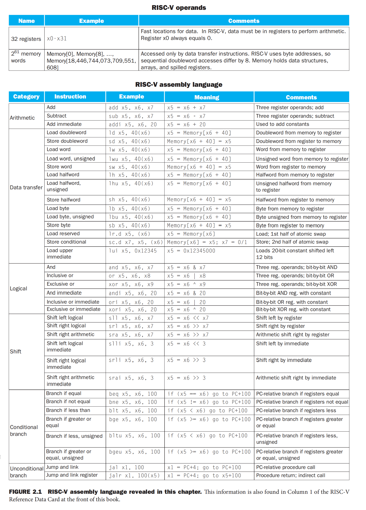
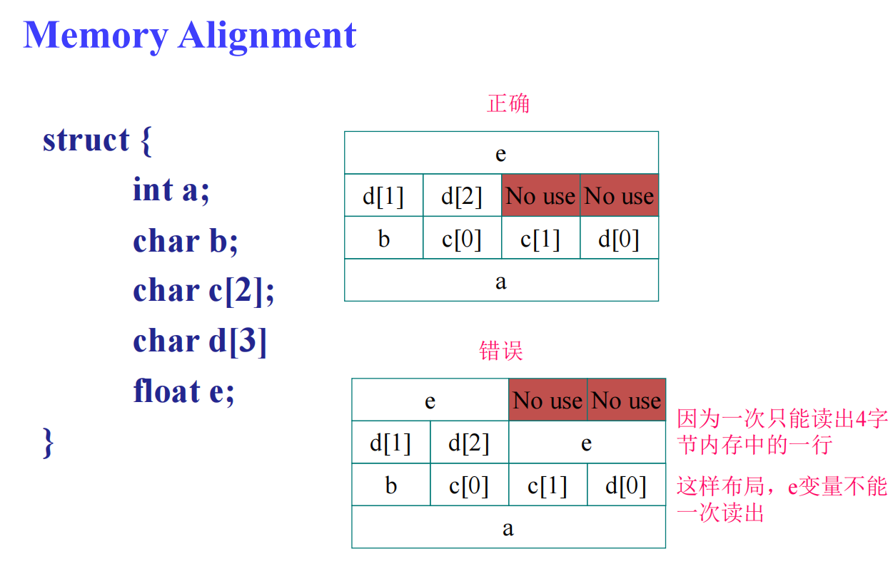
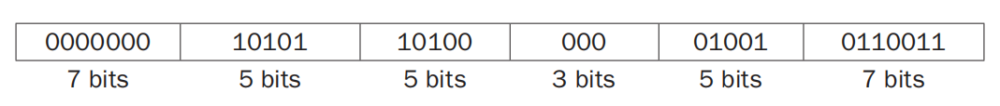
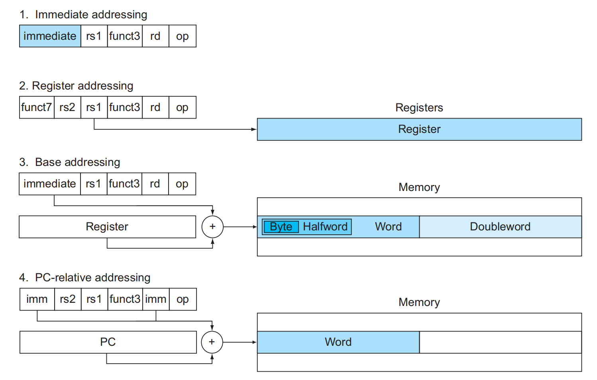
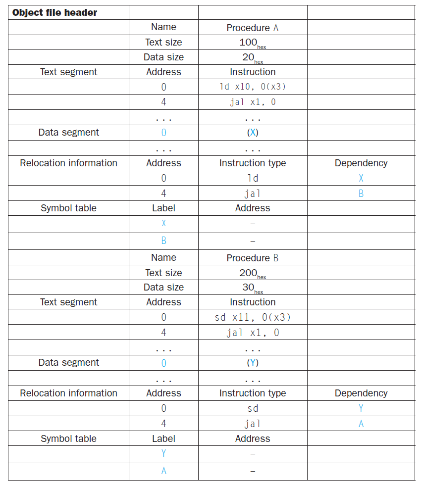

# Chap 2: Language of the Machine

??? abstract "核心知识"

    - 六大指令类型的表示、基本功能、对应的机器
        - R型指令：算术逻辑运算
        - I型指令：与立即数相关的算术逻辑运算、加载操作、`jalr`指令
        - S型指令：存储操作
        - SB型指令：条件分支操作
        - UJ型指令：无条件分支操作（`jal`指令）
        - U型指令：`lui`指令
    - 寻址模式
    - 过程
        - 栈
        - 嵌套过程（递归）
    - 手写汇编程序
    - 同步（仅做了解）
    - 代码处理的过程（仅做了解）

## Basics

**指令集架构**(instruction set architecture, **ISA**)：对计算机硬件电路操作的一种抽象。它定义了计算机处理器可以执行的所
有指令，以及如何处理这些指令。一个完整的ISA主要包含以下几个部分：

- 指令的种类
- 指令的执行方式
- 指令的操作数

指令集主要分为两类：

- **精简**指令集计算机(reduced instruction set computer, RISC)：例如ARM, MIPS, **RISC-V** 等
    - 这类指令集对指令数目和寻址方式都做了精简，使其实现更容易，指令并行执行程度更好，编译器的效率更高
    - 在计组课程乃至很多后续课程（操作系统、计算机体系结构）中，我们都将采用RISC-V，在该指令集基础上实现硬件、编写软件
- **复杂**指令集计算机(complex instruction set computer, CISC)：例如x86（对x86感兴趣的读者可以看看我的[汇编语言笔记](../../lang/asm/index.md)）


**存储程序**(stored-program)概念包含了以下两个重要原则：

- 用数字表示指令
- 程序就像数据一样存储在内存中，能够被读取或写入

<div style="text-align: center">
    
</div>

---
:star:设计原则：

- Simplicity favors regularity
    - 规整(regularity)使实现更为简单
    - 简约(simplicity)保证在低能耗的情况下获取高性能
- Smaller is faster
- Good design demands good compromises
- Make common case fast(from the Eight Great Idea)


## Registers

**寄存器**(registers)：CPU内用来暂存指令、数据和地址的内部存储器。在RISC-V架构中，一共有32个寄存器，且每个寄存器的大小为64bit。

- 在RISC-V中，64bit被称为**双字**(doubleword)，32bit被称为**字**(word)
- 之所以寄存器的个数不多，是因为过多的寄存器会增加电子信号的传播距离，从而导致时钟周期的延长
- 寄存器的命名规则：`xn`，其中`n`为整数，取值范围为`0-31`
- 可以将寄存器简单理解为CPU的**全局变量**
- 每种寄存器的用途：

    <div style="text-align: center">
        
    </div>

    - 临时寄存器的别名为`tn`，保留寄存器的别名为`sn`，其中`n`为整数

- 由于寄存器的大小和数量有限，因此对于更复杂的数据结构（比如数组和结构体等），寄存器无法直接保存它们的内容。因此小规模的数据会放在寄存器内，而更大规模的数据则会存储在计算机的**内存**(memory)中。

    ???+ note "寄存器与内存之间的区别"

        - 寄存器存储空间小，内存存储空间大
        - 各种操作和运算只能在寄存器内完成（如果需要对内存数据进行操作，那么要先通过寄存器和内存间的[数据传输](#data-transfer)，将内存数据传到寄存器中（加载）后再在寄存器中完成操作，如有需要还要通过该数据传输将寄存器的结果传回给内存（存储））
        - 寄存器有着更快的运行速度和更高的吞吐量，使得访问寄存器内的数据更加迅速和方便，且访问寄存器的能耗更低（~~所以寄存器会更贵一点~~）

- 将不常用的（或之后再用的）变量从寄存器移到内存的过程被称为**溢出寄存器**(spilling register)

## Instructions

??? abstract "本章将会介绍的RISC-V中各种操作数和指令"

    <div style="text-align: center">
        
    </div>

在RISC-V汇编语言中，用`//`表示注释，用法与C++的相同。

!!! warning "注意"

    请**不要忽视**本章笔记注释部分的内容！

### Arithmetic Operations

- 加法
    - `add`：寄存器1 + 寄存器2

    ```asm
    add reg1, reg2, reg3    // (in C) reg1 = reg2 + reg3
    ```

    - `addi`(add immediate)：寄存器 + 常量

    ```asm
    addi reg1, reg2, const  // (in C) reg1 = reg2 + const
    ```

- 减法

    - `sub`：寄存器1 - 寄存器2

    ```asm
    sub reg1, reg2, reg3    // (in C) reg1 = reg2 - reg3
    ```

    - 注意：没有`subi`，可以通过`addi`一个负常数来实现减法运算

### Logical Operations

下表展示了RISC-V中关于逻辑运算的指令（与C、Java对比）：

<div style="text-align: center">
    
</div>

- 移位(shifts)
    - 前面两个操作为**逻辑左移/右移**（无符号数）
        - 左移$i$位相当于乘以$2^i$
        - 逻辑右移时最左边补0（**零扩充**）
        - 不带`i`的指令表示根据寄存器的值确定移动位数，带`i`的指令表示用立即数确定移动位数，比如：
        ```asm
        slli x11, x19, 4    // reg x11 = reg x19 << 4 bits
        ```

    - 第三种移位操作为**算术右移**（符号数），最左边补符号位（**符号扩充**）

- AND、OR、XOR：与、或、异或，它们的格式一致：

    ```asm
    and|or|xor  reg1, reg2, reg3
    // reg reg1 = reg reg2 &(, |, ^) reg reg3
    ```

    - RISC-V中没有NOT指令，因为它可以通过异或表示出来：任何数与111...111异或的结果即为该数取反后的结果
    - AND、OR、XOR也有立即数版本的指令，分别为：`andi`、`ori`和`xori`


### Data Transfer

由于对数据的各种操作只能在寄存器内完成，而无法在内存中完成，因此通常需要在寄存器和内存之间来回传递数据，而完成这一传递操作的指令被称为**数据传输指令**(data transfer instructions)。要想访问内存中的某个字或双字，我们需要知道它们的**地址**(address)，而这样的地址在内存（可以看作一个很大的一维数组）中作为索引使用（从0开始）。下图展示的是RISC-V架构下的内存结构：

<div style="text-align: center">
    
</div>

- RISC-V的每个地址对应一个字节，且内存存储的数据是双字宽度的，因此内存地址是8的倍数。
- RISC-V在使用地址时采用**小端序**(little-endian)：数据的低位在低位地址，高位在高位地址。

    ??? info "补充：小端序vs大端序"

        <div style="text-align: center">
            
        </div>

- RISC-V不要求内存数据对齐(alignment)

    ??? info "补充：内存对齐"

        <div style="text-align: center">
            
        </div>


数据传输指令分为**加载**(load)指令和**存储**(store)指令两大类：

- 加载指令：将内存的数据拷贝到寄存器内

    - 格式：
    ```asm
    load reg, offset(mem_base_addr)
    // load: load instruction, be cautious that there's no actual 
    //       instruction called "load", which is just a placeholder
    // reg: register
    // mem_base_addr: a register containing the base address of memory, 
    //                also called base register
    // offset: constant
    ```

    - 内存数据的实际地址 = `mem_base_addr + offset`
    - 等价于C语言：`reg = mem_base_addr[offset / width];`，其中`width`表示加载数据的字节宽度，不同的指令会有不同的字节宽度
    - 加载的数据都是从寄存器的**低位**开始存放
    - 如果寄存器还有剩余位（高位），符号数采用符号扩充填补空余的高位，而无符号数采用零扩充填补
    - 指令：
        - `ld`(load doubleword)：加载双字数据（最常用），`width = 8`
        - `lw`(load word)：加载单字数据，`width = 4`
            - `lwu`：无符号数版本
        - `lh`(load halfword)：加载半字（16位）数据（比如1个Unicode字符），`width = 2`
            - `lhu`：无符号数版本
        - `lb`(load byte)：加载1字节数据（比如1个ASCII字符），`width = 1`
            - `lbu`：无符号数版本

- 存储指令：将寄存器的数据拷贝到内存中

    - 格式（与`ld`基本一致）：
    ```asm
    store reg, offset(mem_base_addr)
    // store: store instruction, be cautious that there's no actual 
    //       instruction called "store", which is just a placeholder
    // reg: register
    // mem_base_addr: a register containing the base address of memory, 
    //                also called base register
    // offset: constant
    ```

    - 等价于C语言：`mem_base_addr[offset / width] = reg;`，其中`width`表示存储数据的字节宽度，不同的指令会有不同的字节宽度
    - 指令会从寄存器的**低位**开始读取数据并将其存入内存中
    - 指令：
        - `sd`(store doubleword)：存储双字数据（最常用），`width = 8`
        - `sw`(store word)：存储单字数据，`width = 4`
        - `sh`(store halfword)：存储半字（16位）数据（比如1个Unicode字符），`width = 2`
        - `sb`(store byte)：存储1字节数据（比如1个ASCII字符），`width = 1`

??? example "例题"

    === "例1"

        === "问题"

            用RISC-V汇编语言实现下面的C语言赋值语句：

            ```c
            A[12] = h + A[8]
            ```

            其中变量`h`的值存储在寄存器`x21`内，数组`A`的基地址(base address)存储在寄存器`x22`内。

        === "答案"

            ```asm
            ld   x9, 64(x22)  // Temporary reg x9 gets A[8]
            add  x9, x21, x9  // Temporary reg x9 gets h + A[8]
            sd   x9, 96(x22)  // Stores h + A[8] back into A[12]
            ```
    
    === "例2"

        === "问题"

            C语言的`strcpy()`函数的实现如下所示：

            ```c
            void strcpy(char x[], char y[]) {
                size_t i;
                i = 0;
                // copy and test byte
                while ((x[i] = y[i]) != '\0')
                    i += 1;
            }
            ```


            将其转化为RISC-V的形式，其中数组`x[]`和`y[]`的基地址分别存储在寄存器`x10`和`x11`内。

            !!! tip "提示"

                由于这部分内容涉及到[栈](#stack)的知识，推荐在学完栈之后再来看这道题。

        === "答案"

            ```asm
            strcpy:
                // adjust stack for 1 more item
                addi sp, sp, -8
                // save x19
                sd   x19, 0(sp)
                
                // i = 0 + 0
                add x19, x0, x0

            L1:
                // address of y[i] in x5
                add  x5, x19, x11
                // x6 = y[i]
                lbu  x6, 0(x5)
                
                // address of x[i] in x7
                add  x7, x19, x10
                /// x[i] = y[i]
                sb   x6, 0(x7)

                // if y[i] == 0(the end of string), then exit
                beq  x6, x0, L2

                // i = i + 1
                addi x19, x19, 1
                // go to L1
                jal  x0, L1

            L2:
                // restore old x19
                ld   x19, 0(sp)
                // pop 1 doubleword off stack
                addi sp, sp, 8
                // return
                jalr x0, 0(x1)
            ```


### Making Decision

计算机与计算器的一大不同之处在于计算机具备决策的能力：它能够执行分支（条件）语句、循环语句等。在RISC-V汇编语言中，有以下几类决策指令：

- **条件分支**(conditional branch)：先比较两个寄存器的值，根据比较结果决定是否跳转到指定地址的指令上，还是继续执行下条指令
    - 格式：
        ```asm
        // Form 1
        inst rs1, rs2, L1
        // rs1, rs2: registers
        // L1: label, representing the branch address

        // Form 2
        inst rs1, rs2, imm
        // rs1, rs2: registers
        // imm: immediate number, beware that (PC + imm) represents the branch address     
        ```

    - 可以看到，条件分支（实际上也包括无条件分支）有两种表示跳转地址的形式：`L1`和`imm`
        - `L1`表示标签，若发生跳转，则会跳转到`L1`标签所在的指令上。而在编译时，编译器会先计算当前指令与`L1`对应指令的跳转距离`imm`（立即数，即下一种形式），根据这个跳转距离执行跳转操作
        - `imm`表示立即数，它表示的是跳转距离/偏移量，而实际的跳转地址为`PC + imm`
            - `PC`表示当前正在执行的指令的地址，因此下条指令的地址为`PC + 4`
            - 注意：由于每个指令的宽度为4字节，因此`imm / 4`才是**当前指令与目标指令之间的指令数**

    - 指令：
        - `beq`(branch if equal)：如果寄存器`rs1`和`rs2`的值**相等**，那么跳转至指定地址的指令
        - `bne`(branch if not equal)：如果寄存器`rs1`和`rs2`的值**不相等**，那么跳转至指定地址的指令
        - `blt`(branch if less than)：如果寄存器`rs1`的值**小于**`rs2`的值，那么跳转至指定地址的指令
            - `bltu`：`blt`的无符号版本
        - `bge`(branch if greater than or equal)：如果寄存器`rs1`的值**大于等于**`rs2`的值，那么跳转至指定地址的指令
            - `bgeu`：`bge`的无符号版本
        
        >注：没有小于等于或大于之类的指令，因为它们只需要上面的指令便能实现，无需额外的指令。

- **无条件分支**(unconditional branch)：条件恒为真的条件分支，因此一定会跳转到指定指令上
    - 格式：
        ```asm
        // jal
        // Form 1
        jal reg, L1
        // reg: register storing the return address, usually is x1(= PC + 4)
        // L1: label, representing the branch address

        // Form 2
        jal reg, imm
        // reg: register storing the return address, usually is x1(= PC + 4)
        // imm: immediate number, beware that (PC + imm) represents the branch address

        // jalr
        jalr reg, imm(base_reg)
        // reg: register storing the return address, usually is x0
        // base_reg: register storing the base part of branch address
        // the form is similar to load and store instructions
        // the branch address is imm + base_reg
        ```

    - 指令：
        - `jal`(jump and link)
            - 该指令由**调用者**(caller)使用：
                - jump：跳转到目标地址（`ProcedureAddress`）
                - link：将下条指令的地址（`PC + 4`，作为**返回地址**）保存到目标寄存器（`x1`）中，以确保过程结束后能够返回到正确的地址上

            - 该指令也可用于一般的**无条件分支**中：`jal x0, Label`，由于`x0 = 0`，因此该指令只有跳转至`Label`所在的语句的功能，而不会返回执行下一条指令
            - 如果跳转地址（立即数）过大，超过了20位，那么可以先用`lui`指令将高20位数字放入临时寄存器中，然后再用`jalr`指令，跳转到地址 `剩余的低位数字(临时寄存器)` 上

        - `jalr`(jump and link register)
            - 该指令由**被调用者**(callee)使用
            - 类似`jal`，但是跳转地址为`imm + (address of base_reg)`
            - 通常将寄存器`x0`作为目标寄存器。个人对这一设计的理解为：过程返回到调用程序后，该过程就会被抛弃掉，不再使用，因此无需保留它的返回地址
            - 可用于case/switch语句中

???+ example "例题"

    === "例1：if-then-else条件分支"

        === "问题"

            将下列C语句转化为RISC-V汇编代码：

            ```c
            if (i == j)
                f = g + h;
            else 
                f = g - h;
            ```

            其中`f`、`g`、`h`、`i`、`j`这五个变量分别存储在`x19`-`x23`这五个寄存器内。

        === "答案"

            ```asm
                // go to Else if i != j
                bne x22, x23, Else
                // f = g + h(skipped if i != j)
                add x19, x20, x21
                // if 0 == 0, go to Exit(unconditional branch)
                beq x0, x0, Exit    // jal Exit
            Else:
                // f = g - h(skipped if i == j)
                sub x19, x20, x21
            Exit:
            ```

    === "例2：while循环"

        === "问题"

            将下列C语句转化为RISC-V汇编代码：

            ```c
            while (save[i] == k)
                i += 1;
            ```

            其中变量`i`、`k`分别存储在寄存器`x22`、`x24`内，数组`save`的基地址存储在寄存器`x25`内。

        === "答案"

            ```asm
            Loop:
                // Temp reg x10 = i * 8
                slli x10, x22, 3
                // x10 = address of save[i]
                add  x10, x10, x25
                // Temp reg x9 = save[i]
                ld   x9, 0(x10)
                // go to Exit if save[i] == k
                bne  x9, x24, Exit
                // i = i + 1
                addi x22, x22, 1
                // go to Loop
                beq  x0, x0, Loop
            Exit:
            ```

    === "例3：case/switch语句"

        === "思路"

            使用一张表格（称为**分支地址表**(branch address table)）存放可选指令序列的地址，程序根据分支比较的结果，通过表格索引执行指定的指令序列。

            <div style="text-align: center">
                
            </div>


        === "题目"

            用RISC-V的分支地址表实现下面的C语言`switch`语句：

            ```c
            switch (k) {
                case 0: f = i + j; break;
                case 1: f = g + h; break;
                case 2: f = g - h; break;
                case 3: f = i - j; break;
            }
            ```

            假设变量`f-k`分别对应寄存器`x20-x25`，寄存器`x5`的值为4。

        === "答案"

            <div style="text-align: center">
                
            </div>


!!! note "基本块(basic block)"

    **基本块**是一个没有内嵌分支（除了在末尾）且没有分支目标/标签（除非在开头）的指令序列。设定基本块的概念有以下好处：

    - 编译器通过识别出基本块来进行编译的优化
    - 高级处理器能够加速基本块的执行


## Instruction Representations

- **机器语言**(machine language)：指令的数字形式
- **机器码**(machine code)：一条数字形式的指令
- 为了书写的方便，通常会用十六进制来“压缩”这么一长串的二进制数字
- RISC-V的所有指令的长度都是**32位**，即一个字。每条指令由一块块子位串构成，而这样的子位串被称为**字段**(field)。比如对于一条加法指令`add x9, x20, x21`，我们可以表示成以下形式：

<div style="text-align: center">
    
</div>

我们为字段赋予了一些名称，每个字段有不同的功能：

- `opcode`：指令要做的运算，用于区分各种**指令格式**(instruction format)
- `funct3`：额外的`opcode`字段，用于区分属于同一指令格式的不同指令
- `funct7`：额外的`opcode`字段，用于区分属于同一指令格式的不同指令
- `rd`：寄存器**目标操作数**，保存运算的结果
- `rs1`：第一个寄存器**源操作数**
- `rs2`：第二个寄存器**源操作数**
- `immediate`：立即数，即常数（可能会被拆成多个分散的字段）
    - 立即数以二进制**补码**的形式被存储，所以在翻译机器码的时候要留心！
    - 由于一条指令是32位，所以立即数不能超过32位

指令格式：

<div style="text-align: center">
    
</div>

- **R-type**：算术逻辑运算（`inst rd, rs1, rs2`）
- **I-type**：立即数版本的算术逻辑运算、加载操作、`jalr`指令（`inst rd, rs1, imm`或`inst rd, imm(rs1)`）
    - 移位运算：由于寄存器的大小为64位，也就是说最多移动64位，因此`immediate`字段只有低6位存储移位的步数，而高6位存储额外的`opcode`字段（`funct6`）
    - 介绍处理器的时候，我们会发现，12位的立即数会通过符号扩充，扩展至64位，以便在ALU进行计算

- **S-type**：存储操作（`inst rs2, imm(rs1)`，~~看起来不太符合前面对`rs1`和`rs2`的定义~~）
- **SB-type**：条件分支（`inst rs1, rs2, imm[12:1]`）
    - 可以看到，指令里一共有`imm[12:1]`的立即数字段，缺了个`imm[0]`，这是为了让尽可能多的位表示立即数，因而规定`imm[0] = 0`。因此立即数能够表示的范围为-4096\~4094(-1000\~0FFE)，且都是偶数。
    - 虽然在编写指令时可以写下完整的立即数，但在编译时编译器会自动忽视最低位，因而要确保`imm`是偶数；不小心写成奇数的话，`imm[0]`仍然被视为0

    ??? example "例子"

        接着"[Making Decision](#making-decision)"一节的例2，我们将汇编代码展开成机器码表示：

        <div style="text-align: center">
            
        </div>

        这里有2条分支指令：

        - `bne`：它的跳转地址为`Exit`标签位置上（地址为80024），而该指令的地址为80012，因此偏移量为80024 - 80012 = 12，立即数为 12 / 2 = 6
        - `beq`：它的跳转地址为`Loop`标签位置上（地址为80000），而该指令的地址为80020，因此偏移量为80000 - 80020 = -20，立即数为 -20 / 2 = -10

        >注意：这里完整的偏移值应该是`fun7`和`rd/offset`字段拼接而成的

- **UJ-type**：无条件分支（`jal`）（`inst rd, imm[20:1]`）
    - `rd`用于存放链接地址（即**返回地址**）
    - 与SB-type指令类似，指令里一共有`imm[20:1]`的立即数字段，缺了个`imm[0]`，因为默认`imm[0] = 0`，因此立即数能够表示的范围为-2\^20\~2\^20-2(-100000\~0FFFFE)，且都是偶数
    - 虽然在编写指令时可以写下完整的立即数，但在编译时编译器会自动忽视最低位，因而要确保`imm`是偶数；不小心写成奇数的话，`imm[0]`仍然被视为0
    - 注意：与`jal`对应的无条件分支指令`jalr`是**I型指令**
    - 虽然大部分的条件分支指令的跳转地址都比较近，但是仍会存在一些跳转距离很远，超过12位地址的指令。由于无条件分支指令允许更长的指令，因此编译器会用插入一条无条件跳转指令来提升分支跳转的最大距离，同时需要对原分支条件进行取反，以便触发之后的无条件跳转操作，具体见下面的例子：

    ??? example "例子"

        ```asm
        beq x10, x0, L1
        ```

        如果`L1`地址过远，这条指令会被替换成以下指令：

        ```asm
            bne x10, x0, L2
            jal x0, L1
        L2:
        ```

- **U-type**：高位立即数相关的操作（`lui`）（`inst rd, imm[31:12]`）
    - 如果所需的立即数超过了12位，那么就要用`lui`指令来处理了，它的格式为：`lui rd, imm`，其中`imm`表示实际的立即数（32位）的**高20位**
    - 该指令会将其放入寄存器`rd`中间的第12位到第31位，而寄存器的低12位进行零扩展，高32位进行符号扩展
    - 具体操作：先用`lui`指令将高20位赋给寄存器，之后用`addi`指令将剩余的12位加到寄存器中，这样就可以将一个32位的立即数赋值给寄存器了~


    ??? example "例题"

        === "例1"

            === "题目"

                如何将下列的64位立即数放入寄存器`x19`内？

                <div style="text-align: center">
                    
                </div>

            === "答案"

                - 先取这个立即数上第12位到第31位的数字，用指令`lui`将这些数字放入寄存器`x19`上的第12位到第31位
                ```asm
                lui x19, 976  // 976 = 0000 0000 0011 1101 0000
                ```

                - 然后将立即数的低12位加到寄存器上，这样便大功完成了
                ```asm
                addi x19, x19, 1280  // 1280 = 00000101 00000000
                ```

        === "例2"

            === "题目"

                请编写一段RISC-V汇编代码，将数字0x12345678ABCDEF存储在寄存器`x10`中。

            === "答案"

                ```asm
                lui x10, 0x12345        // Load upper 20 bits (0x12345) into x10, shifting it left by 12 bits
                addi x10, x10, 0x678    // Add lower 12 bits (0x678) to x10
                slli x10, x10, 24       // Shift left by 24 bits
                lui x11, 0xABCDE        // Load upper 20 bits (0xABCDE) into x11
                srli x11, x11, 8        // Shift right by 8 bits
                addi x11, x11, 0xF      // Add lower 12 bits (0xF) to x11
                or x10, x10, x11        // Combine the upper and lower parts into x10
                ```


## Addressing 

### Addressing Mode

**寻址模式**(addressing mode)：指令集架构中访问内存或寄存器的方式。在RISC-V中一共有以下四种寻址模式：

<div style="text-align: center">
    
</div>

- **立即数寻址**(immediate addressing)：操作数为指令内的立即数（大多数I型指令）
- **寄存器寻址**(register addressing)：操作数为寄存器（R型指令）
- **基址或偏移寻址**(base or displacement addressing)：操作数位于指定的内存位置上，该位置是寄存器和立即数之和（加载/存储指令、包括`jalr`指令）
- **PC相对寻址**(PC-relative addressing)：分支地址为PC和分支偏移量（立即数的2倍）之和（SB型指令和UJ型指令）

$$
\begin{align}
\text{Target address} & = \text{PC} + \text{Branch offset} \notag \\
& =  \text{PC} + \text{immediate} \times 2 \notag
\end{align}
$$

### Decoding Machine Language

如果想将机器语言用RISC-V汇编语言翻译，可能需要参考下面这张RISC-V指令编码表：

???+ note "RISC-V指令编码表"

    <div style="text-align: center">
        
    </div>

??? example "例题"

    === "例1"

        === "题目"

            这个机器码对应的汇编指令是什么呢？

            $00578833_{\text{hex}}$

        === "答案"

            <div style="text-align: center">
                
            </div>

    === "例2"

        === "题目"

            这个机器码对应的汇编指令是什么呢？

            $E2952023_{\text{hex}}$      

        === "答案"

            `sw x9, -480(x10)`

            这道题易错点很多：

            - 立即数以二进制补码的形式被存储
            - 立即数是12位的，存储在两个不同的字段中
            - 考虑`rs1`和`rs2`哪个是用来放基址的


## Procedures

**过程**(procedure)：相当于高级编程语言的函数或子程序(subroutine)，能根据传入的参数执行一些特定任务，可以便于程序员理解代码的功能和重用这些代码。

在执行一个过程的时候，程序将会遵循以下步骤：

1. 将参数放在过程可以访问得到的地方（寄存器）
2. 将控制权转交给过程（通过`jal`指令实现）
3. 获取过程所需的存储资源
4. 执行目标任务
5. 将结果值放在调用程序访问得到的地方
6. 将控制权还给原程序（通过`jalr`指令实现）

在调用过程的时候，程序会用到以下寄存器：

- `x10-x17`：8个用于传递参数或返回值的**参数寄存器**(parameter register)
    - 通常同一个参数寄存器会同时作为参数和返回值使用，这点和高级编程语言很不一样，需要格外留心！
- `x1`（或称为`ra`）：1个用于过程返回的**返回地址寄存器**(return value register)

**程序计数器**(program counter)：一类用于保存**当前正在执行的指令**的地址的寄存器（更合理的名称应为指令地址寄存器(instruction address register)，但因为历史原因还是习惯叫做前者，简称**PC**）。

- 由于一条指令占4字节大小，因此`PC + 4 * n`表示当前指令后的第`n`条指令（`n`可正可负，负数表示向前数第`n`条指令）

通常还要用到以下**过程调用指令**(procedure call instructions)：`jal`和`jalr`，具体使用方法见[前面的小节](#making-decision)


### Stack

在设计一个过程时需要注意：任何在**调用者**(caller)中使用的寄存器，若同时也在该过程中使用，那么在过程正式开始前必须它们原来有的值暂时**保存**起来(save)，过程结束后，在返回到调用者前再**还原**(restore)回来——这一过程就是前面提到过的[溢出寄存器](#registers)，而用于存储这些寄存器“溢出”的值的数据结构称为**栈**(stack)（它本质上是一块内存）。

- **栈指针**(stack pointer)`sp`（即寄存器`x2`）用于存储栈中最近被分配的内存地址（栈顶位置）
- 由于一些历史原因，规定栈的高位地址在上，低位地址在下，因此要把这个栈看作是一个倒放的容器：栈底在上方，栈顶在下面，要从下方的开口将数据压入
- 栈的两个常用操作是**压入**(push)和**弹出**(pop)，分别表示向栈内添加元素和移除元素
    - push：如果要压入`n`个数据，先`addi sp, sp, -8*n`，再逐一`sd`各个寄存器的值（`offset`的顺序为`8*(n-1)`、`8*(n-2)`、...、`0`）
    - pop：如果要弹出`n`个数据，先逐一`ld`恢复寄存器的值（`offset`的顺序为`0`、`8`、...、`8*(n-1)`，与push相反），再`addi sp, sp, 8*n`

<figure style=" width: 30%" markdown="span">
    
    
    <figcaption></figcaption>
</figure>

??? example "例题"

    === "问题"

        将下面的C语言函数改写成RISC-V汇编语言的过程

        ```c
        long long int leaf_example(long long int g, long long int h, long long int i, long long int j) {
            long long int f;

            f = (g + h) - (i + j);
            return f;
        }
        ```

        其中，参数变量`g`、`h`、`i`、`j`对应寄存器`x10-x13`，`f`对应`x20`。

    === "答案"

        ```asm
        leaf_example:
            // adjust stack to make room for 3 items
            addi sp, sp, -24
            // save register x5, x6 and x20 for use afterwards
            sd   x5, 16(sp)
            sd   x6,  8(sp)
            sd   x20, 0(sp)

            // register x5 contains g + h
            add x5, x10, x11
            // register x6 contains i + j
            add x6, x12, x13
            // f = x5 - x6, which is (g + h) - (i + j)
            sub x20, x5, x6

            // returns f(x10 = x20 + 0)
            addi x10, x20, 0

            // restore register x20, x6 and x5 for caller
            ld   x20, 0(sp)
            ld   x6,  8(sp)
            ld   x5, 16(sp)
            // adjust stack to delete 3 items
            addi sp, sp, 24

            // branch back to calling routine
            jalr x0, 0(x1)
        ```

        图示（分别展示了过程调用前、中、后的时候栈的情况）：


        <div style="text-align: center">
            
        </div>


然而，并不是所有的寄存器都会为调用者所用，对于这些不用的寄存器而言，压栈和出栈的操作就显得多余了。根据这一特征，RISC-V将32个寄存器分为两类：

- **临时寄存器**(temporary registers)：要么是仅在过程（被调用者）中使用的寄存器（作为过程的**局部变量**），要么是作为参数或返回值的寄存器（有专门的用途）。它们的共同点为都是服务于被调用者的寄存器，因此无需存入栈内。
    - 因此如果要将寄存器作为临时变量使用，优先用这种寄存器
- **保留寄存器**(saved registers)：要么是有特殊功能的寄存器（比如`x1`作为返回地址，`x2`作为栈顶指针等），要么是被指定保留的寄存器。它们都有可能会为调用者所用，因此如果在过程（被调用者）中使用了这些寄存器，则在使用前一定要先压入栈内进行保存，过程结束后、返回前需要及时恢复原值。

下表罗列了这两类寄存器：

<div style="text-align: center">
    
</div>

### Nested Procedures

**叶子过程**(leaf procedure)：不调用其他过程的过程。

假设某个程序调用过程A，过程A又调用过程B。我们知道只有一个寄存器`x1`用于保存返回地址，所以A和B都需要用到`x1`，那么该如何解决这一冲突呢？解决方法是利用前面提到的栈：

- 在调用过程B之前先将`x1`的值压入栈内，这样就保存了A的返回地址。现在`x1`就可以用来存储过程B的返回地址
- 过程A返回前，从栈中取回`x1`原来的值（A的返回地址），这样过程A便可以顺利返回了

??? example "例题"

    === "例1：阶乘"

        === "问题"

            将下面用C语言写的递归程序（计算阶乘）用RISC-V汇编语言改写。

            ```c
            long long int fact(long long int n) {
                if (n < 1) 
                    return 1;
                else 
                    return n * fact(n - 1);
            }
            ```

        === "答案"

            ```asm
            fact:
                // adjust stack for 2 items
                addi sp, sp, -16
                // save the return address
                sd   x1,  8(sp)
                // save the argument n
                sd   x10, 0(sp)

                // x5 = n - 1
                addi x5, x10, -1
                // if (n - 1) >= 0, go to L1
                bge  x5, x0, L1

                // return 1
                addi x10, x0, 1
                // pop 2 items off stack
                addi sp, sp, 16
                // return to caller
                jalr x0, 0(x1)

            L1: 
                // n >= 1: argument gets (n - 1)
                addi x10, x10, -1
                // call fact with (n - 1)
                jal  x1, fact

                // return from jal: move result of fact(n - 1) to x6
                addi x6, x10, 0
                // restore argument n
                ld   x10, 0(sp)
                // restore the return address
                ld   x1,  8(sp)
                // adjust stack pointer to pop 2 items
                addi sp, sp, 16

                // return n * fact(n - 1)
                mul  x10, x10, x6
                // return to the caller
                jalr x0, 0(x1)
            ```

            ??? question "思考"

                === "问题"

                    为什么`fact`标签下的出栈操作中只改变了`sp`的值，而没有先进行加载操作来恢复寄存器的值呢？

                === "答案"

                    - `fact`标签下的出栈操作仅针对`x10 < 1`的情况，此时直接令`x10 = 1`并返回它的值就行了；而且此时返回地址`x1`未发生变化，因此用不到栈里的值。
                    - 对于`x10 >= 1`的情况，则由`L1`标签下的指令序列处理；且返回地址发生了变化，这种情况下出栈前就需要恢复寄存器里的值，用于阶乘计算。

    === "例2：斐波那契数"

        === "题目"

            <div style="text-align: center">
                
            </div>

        === "答案"

            <div style="text-align: center">
                
            </div>          

有些递归过程可以被改写成等价的迭代版本，且迭代版的效率会更高。比如对于在过程末尾进行递归调用（即**尾调用**(tail call)）的过程，在C语言中会被自动转化为对应的迭代形式。

??? example "例子"

    对于以下C语言函数：

    ```c
    long long int sum(long long int n, long long int acc) {
        if (n > 0)
            return sum(n - 1, acc + n);
        else
            return acc;
    }
    ```

    转化为RISC-V汇编语言为：

    ```asm
    sum:
        // go to sum_exit if n <= 0
        ble x10, x0, sum_exit
        // add n to acc
        add x11, x11, x10
        // subtract 1 from n
        addi x10, x10, -1
        // jump to sum
        jal x0, sum
    sum_exit:
        // return value acc
        addi x12, x11, 0
        // return to caller
        jalr x0, 0(x1)
    ```

    可以看到，在RISC-V中该过程会转化为迭代的形式

### Space Allocation

- **过程帧**(procedure frame)/**活动记录**(activation record)：栈内的一段空间，里面存储了过程所需的寄存器和变量（就是存在栈内的元素）。
- 寄存器`x8`（或者称为`fp`）是一个**帧指针**(frame pointer)，它指向过程帧内第一个双字。
    - 栈指针会随着过程的进行而不断变化，因此在过程的不同阶段访问同一个变量或寄存器时，用到的偏移量会不断变化，从而带来理解上的不便
    - 而帧指针在过程中为局部变量提供一个稳定的基址寄存器（可以将其理解为**栈底指针**）

    <div style="text-align: center">
        
    </div>

- Linux系统上RISC-V的内存分配示意图：

    <div style="text-align: center">
        
    </div>

    - 最底下的内存是保留(reserved)空间（不可访问）
    - 第二层的内存用于存放RISC-V的机器码，称为**文本段**(text segment)
    - 第三层的内存称为**静态数据段**(static data segment)，用于放置立即数和其他静态变量
        - 寄存器`x3`（或者称为`gp`）是一个**全局指针**(global pointer)，用于指向这些静态数据
    - 最上层同时存放栈和动态数据（比如链表等），其中存放动态数据的数据结构称为**堆**(heap)。注意到栈和堆位于这块内存的两端，分别自顶向下和自底向上增长
        - C语言中使用`malloc()`在堆中分配空间，使用`free()`释放堆内的空间
            - 如果过晚释放空间，就会造成内存泄露问题
            - 如果过早释放空间，就会造成[悬空指针](https://en.wikipedia.org/wiki/Dangling_pointer)(dangling pointers)（类似野指针）问题。


## C -> RISC-V 

### A C Sort example

在前面的学习中，我们只展示了汇编语言的代码片段，而没有展示过一个功能完备的完整的汇编代码。下面，我们将用RISC-V汇编语言翻译一个用C语言写的冒泡排序函数。

???+ note "注"

    在此之前，可以先了解一下将C语言翻译成汇编语言的大致步骤：

    1. 为程序的每个变量分配相应的寄存器
    2. 为过程的主体部分书写代码
    3. 在过程调用期间保留要用的寄存器

先来翻译子过程`swap`（交换数组中相邻的两个元素）：

=== "C代码"

    ```c
    void swap(long long int v[], size_t k) {
        long long int temp;
        temp = v[k];
        v[k] = v[k+1];
        v[k+1] = temp;
    }
    ```

=== "RISC-V汇编代码"

    ```asm hl_lines="4-7"
    swap:
        slli x6, x11, 3      // reg x6 = k * 8
        add  x6, x10, x6     // reg x6 = v + (k * 8)
        ld   x5, 0(x6)       // reg x5 (temp) = v[k]
        ld   x7, 8(x6)       // reg x7 = v[k + 1]
        sd   x7, 0(x6)       // v[k] = reg x7
        sd   x5, 8(x6)       // v[k+1] = reg x5 (tmp)
        jalr x0, 0(x1)       // return to calling routine
    ```

    高亮部分起到了交换相邻数组元素的作用，十分巧妙~

再来翻译过程`sort`

=== "C代码"

    ```c
    void sort(long long int v[], size_t int n) {
        size_t i, j;
        for (i = 0; i < n; i++) {
            for (j = i - 1; j >= 0 && v[j] > v[j + 1]; j--) {
                swap(v, j);
            }
        }
    }
    ```

=== "RISC-V汇编代码"

    ```asm
    // Saving registers
    sort:
        addi sp, sp, -40      // make room on stack for 5 registers
        sd   x1, 32(sp)       // save return address on stack
        sd   x22, 24(sp)      // save x22 on stack
        sd   x21, 16(sp)      // save x21 on stack
        sd   x20, 8(sp)       // save x20 on stack
        sd   x19, 0(sp)       // save x19 on stack

    // Procedure body
    // Move parameters
        mv   x21, x10         // copy parameter x10 into x21
        mv   x22, x11         // copy parameter x11 into x22

    // Outer loop
        li   x19, 0           // i = 0
    for1tst: 
        bge  x19, x22, exit1  // go to exit1 if i >= n

    // Inner loop
        addi x20, x19, -1     // j = i - 1
    for2tst:
        blt  x20, x0, exit2   // go to exit2 if j < 0
        slli x5, x20, 3       // x5 = j * 8
        add  x5, x21, x5      // x5 = v + (j * 8)
        ld   x6, 0(x5)        // x6 = v[j]
        ld   x7, 8(x5)        // x7 = v[j + 1]
        ble  x6, x7, exit2    // go to exit2 if x6 <= x7

    // Pass parameters and call
        mv   x10, x21         // first swap parameter is v
        mv   x11, x20         // second swap parameter is j
        jal  x1, swap         // call swap

    // Inner loop
        addi x20, x20, -1     // j for2tst
        j for2tst             // go yo for2tst

    // Outer loop
    exit2: 
        addi x19, x19, 1      // i++
        j for1tst             // go to for1tst

    // Restoring registers
    exit:
        ld   x19, 0(sp)       // restore x19 from stack
        ld   x20, 8(sp)       // restore x20 from stack
        ld   x21, 16(sp)      // restore x21 from stack
        ld   x22, 24(sp)      // restore x22 from stack
        ld   x1, 32(sp)       // restore return address from stack
        addi sp, sp, 40       // restore stack pointer

    // Procedure return
        jalr x0, 0(x1)        // return to calling routine
    ```

    >个人认为该过程可以减少栈的使用以提高效率——不用`x19-x22`这几个寄存器，而是使用一些临时寄存器。


### Arrays vs Pointers

也许各位在修读C语言课程的时候就听老师说过：用指针访问数组元素比用索引访问数组元素更快一些——事实也确实如此。下面我们就通过分析一个具体的例子，来探究其中的原因。

!!! example "例子"

    下面我们用C语言编写了一个`clear()`函数，它将数组中所有元素置为0，以达到清空效果。这里同时给出了数组索引访问和指针访问两种版本：

    ```c
    void clear1(long long int array[], size_t int size) {
        size_t i;
        for (i = 0; i < size; i++)
            array[i] = 0;
    }

    void clear2(long long int *array, size_t int size) {
        long long int *p;
        for (p = array; p < &array[size]; p++) 
            *p = 0;
    }
    ```

    它们对应的RISC-V汇编代码分别为：

    === "Array"

        ```asm
            li   x5, 0            // i = 0
        loop1:                    
            slli x6, x5, 3        // x6 = i * 8
            add  x7, x10, x6      // x7 = address of array[i]
            sd   x0, 0(x7)        // array[i] = 0
            addi x5, x5, 1        // i++
            blt  x5, x11, loop1   // if (i < size) go to loop1
        ```

    === "Pointer"

        ```asm
            mv   x5, x10          // p = address of array[0]
            slli x6, x11, 3       // x6 = size * 8
            add  x7, x10, x6      // x7 = address of array[size]
        loop2:                    
            sd   x0, 0(x5)        // Memory[p] = 0
            addi x5, x5, 8        // p += 8
            bltu x5, x7, loop2    // if (p < &array[size]) go to loop2
        ```

    观察上面的汇编代码后，我们可以对比和总结一下数组索引访问和指针访问的特点：

    - 数组索引
        - 需要根据数组基地址、当前索引和元素大小计算出数组元素的地址，而且每趟循环都需要更新和重新计算，有些麻烦
        - 虽然从理论上来说效率不高，但实际上编译器已经为我们做了一定的优化，比如用移位运算替代乘法运算，避免在循环内进行数组地址计算等

    - 指针
        - 它直接指向内存地址（可以看到，在循环开始前就已经算好了），无需多余的计算步骤


## Fallacies and Pitfalls

!!! failure "误区"

    - 更多强大的指令会带来更高的性能
        - 虽然更强大的指令意味着执行相同功能所需指令数更少，但同时也意味着这些指令会更加复杂，难以实现，这样反而影响所有指令的效率
    - 直接用汇编语言编写的程序性能更高
        - 在现代的处理器中，编译器可能比人脑更擅长将高级语言代码转换为性能更优的汇编语言代码
        - 而且，对于人类来说，因为汇编代码量较大，所以会带来更多犯错的机会，且编写效率实在不高
    - 指令集的向后兼容意味着无需改变现有的指令集
        - 以x86为例，虽然它做到了向后兼容，但它的指令数还是呈上升趋势

!!! bug "陷阱"

    - 忘记了计算机是用字节表示地址，因此连续的字或双字地址的间距不是1，分别是4和8
    - 使用指向在定义过程外（~~该过程已经结束嘞~~）的自动变量的指针
        - 典型例子：某个过程返回一个指向局部数组的指针，但这个过程在返回后就没了，包括这个局部数组，因此这个指针指向一个没有任何意义的地方，如果动用这个指针，很可能会让整个程序崩溃


## Supplements

!!! info "注"

    这里存放一些对考试来说不那么重要的内容（~~所以如果来不及复习的话可忽略这块部分~~）

    然而，如果时间充裕的话，我建议阅读以下内容：

    - 同步（就是下面的小节）
    - **伪指令**（在"Program Translation"一节的第1个例子那边）

### Synchoronization

假设两个处理器$P_1, P_2$在同一片内存空间中工作，并且它们的工作顺序为：$P_1$写入数据后，$P_2$再读取数据。如果$P_1$和$P_2$没有处理好**同步**(synchoronization)，那么就会产生**数据竞争**(data race)的问题（结果取决于$P_1$和$P_2$的访问顺序，而这个访问顺序是不确定的，因而这个结果也是不确定的）。

解决这一问题的方法是**原子读取/写入**(atomic read/write)内存操作，它能确保读取和写入同一块内存空间的操作之间不会有任何其他访问这块内存空间的行为。有些处理器有专门实现原子操作的指令，比如原子交换(atomic swap/exchange)（实现寄存器和内存数据的交换）等。而RISC-V也提供了一个原子操作的指令对(instruction pair)`lr.d`和`sc.d`：

- `lr.d`(load-reserved doubleword)：
    - 格式：
    ```asm
    lr.d rd, (rs1)
    ```

    - 功能：将存储在寄存器`rs1`的内存地址上的数据加载到寄存器`rd`上，同时保留这块内存地址，除`sc.d`的其他指令不应该访问这块地址

- `sc.d`(store-conditional doubleword)：
    - 格式：

    ```asm
    sc.d rd, rs1, (rs2)
    ```

    - 功能：
        - 将寄存器`rs1`上的数据放入存储在寄存器`rs2`的内存地址上
        - 并且由寄存器`rd`指示该指令是否成功：若成功，则`rd = 0`，否则`rd`为一个非零值（表示有其他指令访问过这块内存空间）

??? example "例子"

    === "例1：原子交换"

        ```asm
        again: 
            lr.d x10, (x20)       // load reserved
            sc.d x11, x23, (x20)  // store conditional
            bne x11, x0, again    // branch if store fails
            addi x23, x10, 0      // put loaded value in x23
        ```

    === "例2：加锁&解锁"

        ```asm
        // Lock:
                addi x12, x0, 1       // copy locked value
        again:
                lr.d x10, (x20)       // load-reserved to read lock
                bne  x10, x0, again   // check if it is 0 yet
                sc.d x11, x12, (x20)  // attempt to store new value
                bne  x11, x0, again   // branch if store fails
        // Unlock:
                sd x0, 0(x20)         // free lock by writing 0
        ```

### Program Translation

下图展示了将一个C语言的程序（源代码）转化为存储在内存中的一个文件的过程：

<div style="text-align: center">
    
</div>

这个过程一共涉及到以下装置：

- **编译器**(compiler)：高级编程语言 -> 汇编语言
    - 有的编译器兼具汇编器的功能
- **汇编器**(assembler)：汇编语言 -> 机器码
    - **伪指令**(pseudo-instruction)：可以理解为汇编指令的扩展（或者缩写），表面上看很像一条指令，而实际上并不存在这种指令，但汇编器会将其自动转化为实际存在的指令

    ???+ example "例子"

        - `mv rd, rs`：赋值，等价指令为`addi rd, rs, 0`
        - `neg rd, rs2`：取符号，等价指令为`sub rd, x0, rs2`
        - `not rd, rs1`：按位取反，等价指令为`xori rd, rs1, -1`
        - `li reg, imm`：加载立即数，等价指令为：`addi reg, x0, imm`
        - `ble`：小于等于时跳转（注意真正的不等条件跳转指令只有`blt`和`bge`指令）
        - `beqz rs, imm`：等于0时跳转，等价指令为`beq rs, x0, imm`
        - `j imm`：`jal`的缩写，等价指令为`jal x0, imm`
        - `nop`：空操作，等价指令为`addi x0, x0, 0`

    - 用**符号表**(symbol table)存储标签名称和内存地址的对应关系，便于将标签转化为实际的地址
    - 基本的功能：汇编语言 -> 机器码，即汇编程序 -> **目标文件**(object file)。在UNIX系统中，目标文件包含以下内容：
        - 目标文件头(object file header)：描述目标文件中其他区域的大小和位置
        - 文本段(text segment)：包含机器码
        - 静态数据段(static data segment)：包含程序生命周期中分配的数据（在UNIX中这个区域同时存放静态和动态数据）
        - 重定位信息(relocation information)：根据程序被加载至内存的绝对地址来区分指令和数据
        - 符号表(symbol table)
        - 调试信息(debugging information)：简要描述模块的编译情况，使调试器能够将机器指令和C源文件关联起来，且能够读取其中的数据结构

- **链接器**(linker)
    - 对于多文件的编译，采取的做法是先编译、汇编单个的文件，然后将这些机器语言程序链接起来，这样可以尽可能减少重编译和重汇编的情况
    - 工作流程：
        - 将代码和数据模块以符号化的形式存在内存中
        - 弄清数据和指令标志对应的地址
        - 补充好内部和外部的引用
    - 经链接器加工后，最终生成一个可执行文件(executable file)，它与目标文件的区别在于后者存在不确定(unresolved)的引用

    ??? example "例子"

        === "题目"

            推断下面两个目标文件（给出了目标文件头，以Name开头）经链接器链接后得到的可执行文件头是什么？

            <div style="text-align: center">
                
            </div>

        === "答案"

            <div style="text-align: center">
                
            </div>

- **加载器**(loader)：将可执行文件放入内存或磁盘中，工作流程为：
    - 读取可执行文件头，得到文本段和数据段的大小
    - 创建一个指向足够容纳文本和数据的空间的地址
    - 将可执行文件的指令和数据拷贝到内存中
    - 将主程序的参数（如果有的话）放入栈中
    - 对寄存器进行初始化操作，并将栈指针指向第一个空闲的位置上
    - 跳转到启动例程，将参数拷贝到参数寄存器中，并调用程序的主例程。让主例程返回时，启动例程中止整个程序，附带`exit`系统调用

#### Dynamically Linked Libraries

前面介绍的链接方法属于静态链接，虽然它能快速调用库函数，但它具有以下缺陷：不能及时更新库函数，且会一次性加载所有库函数（即使很多库函数没被用到）。因此通常会更多地使用**动态链接库**(dynamically linked libraries, DLL)，它可以在程序**运行时**被链接到程序里。

- 在原始版本的DLL中，程序和库都需要保留额外的信息，用于定位非局部的过程；加载器会运行一个动态的链接器，使用这些额外的信息找到合适的库并更新所有的外部引用
    - 这种DLL的缺点是它仍然会一次性加载所有库函数。
- 一种改进方法是使用**懒过程链接**(lazy procedure linkage)版本的DLL，它能保证只有当程序调用库函数时，对应的库才会被链接到程序里。下图展示了这种版本的DLL：

<div style="text-align: center">
    
</div>

总而言之，DDL具备以下特征：

- 需要可重定位的过程代码
- 能够避免由静态链接获取所有库函数带来的占用存储空间过大的问题
- 能够自动获取最新版本的库


#### Starting a Java Program

<div style="text-align: center">
    
</div>


### RISC-V

RISC-V指令集被分为**基础架构**(base architecture)和一些**扩展**(extensions)，它们都是用单个英文字母命名的，如下所示：

<div style="text-align: center">
    
</div>

下表展示的是我们还没有讲到过的，属于基础架构的指令：

<div style="text-align: center">
    
</div>


- `slt rd, rs1, rs2`(set if less than)：如果`rs1 < rs2`，`rd = 1`，否则`rd = 0`
- `slti rd, rs1, imm`(set if less than, immediate)：如果`rs1 < imm`，`rd = 1`，否则`rd = 0`


这里简单介绍一下扩展指令集的内容：

- M：与乘除法相关的指令
- A：原子运算，包括前面提到过的`lr.d`和`sc.d`指令，以及它们的32位版本`lr.w`和`sc.w`等
- F：单精度浮点运算相关指令
- D：双精度浮点运算相关指令
- C：压缩的指令，只有16位宽（第5章会涉及到）

### MIPS

MIPS指令集架构有两种版本：MIPS-32和MIPS-64，分别对应32位和64位地址。下面给出了MIPS和RISC-V的一些共同点：

- 32位指令
- 32个通用寄存器，其中一个寄存器（`x0`）的值始终为0
- 只能通过加载和存储指令来访问内存数据
- 没有能够批量加载/存储多个寄存器的指令
- 寻址模式适用于各种大小的数据

RISC-V和MIPS的不同之处有：

- 条件分支（除了相等和不等）：
    - RISC-V仅仅比较两个寄存器的大小，而RISC-V还会用一个寄存器存储比较结果（1或0，对应真值）
    - MIPS只有“小于”分支指令，该指令有符号数（`slt`）和无符号数（`sltu`）版本

比较RISC-V和MIPS的指令格式：

<div style="text-align: center">
    
</div>

拓展阅读：[wiki](https://en.wikipedia.org/wiki/MIPS_architecture)

### x86

!!! warning "注意"

    由于x86有很多很多的版本，这里我们主要介绍的是80386指令集。

8086指令集仅支持字节（8位）和字（16位，注意RISC-V的字是32位）类型的数据，而80386增加了32位地址和数据（双字，注意RISC-V的双字是64位）。

x86指令与RISC-V的不同之处在于：

- x86指令的算术和逻辑指令中，有一个操作数同时充当源和目标；而RISC-V（以及MIPS）会将源寄存器和目标寄存器区分开来
- x86指令的其中一个操作数可以是内存，下面的表格展示了x86中所有可能的操作数搭配

<div style="text-align: center">
    
</div>

80386指令集有14个寄存器，如下所示：

<div style="text-align: center">
    
</div>

x86的寻址模式：

<div style="text-align: center">
    
</div>


x86的整数指令有以下几类：

- 数据传送指令
- 算术和逻辑指令
- 控制流
- 字符串指令

分别对应的常见指令有：

<div style="text-align: center">
    
</div>

下面展示了典型的x86指令格式：

<div style="text-align: center">
    
</div>

- 很明显，x86指令是不等长的（~~这也是x86的雷点之一~~）
- 每条指令的开头（左侧）指明了指令要做的操作
- 有些指令存在一个`Postbyte`字段，它用来指明寻址模式

拓展阅读：

- [wiki](https://en.wikipedia.org/wiki/X86)
- 我的[汇编语言笔记](../../lang/asm/index.md)（基于更古老的8086，但也会带点80386相关内容）

