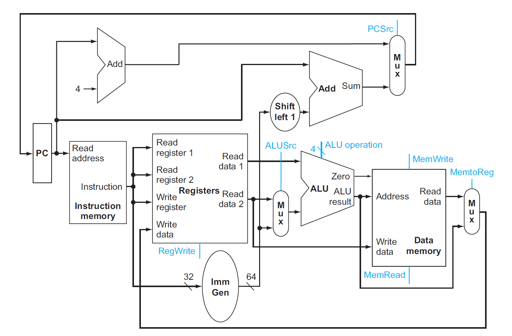
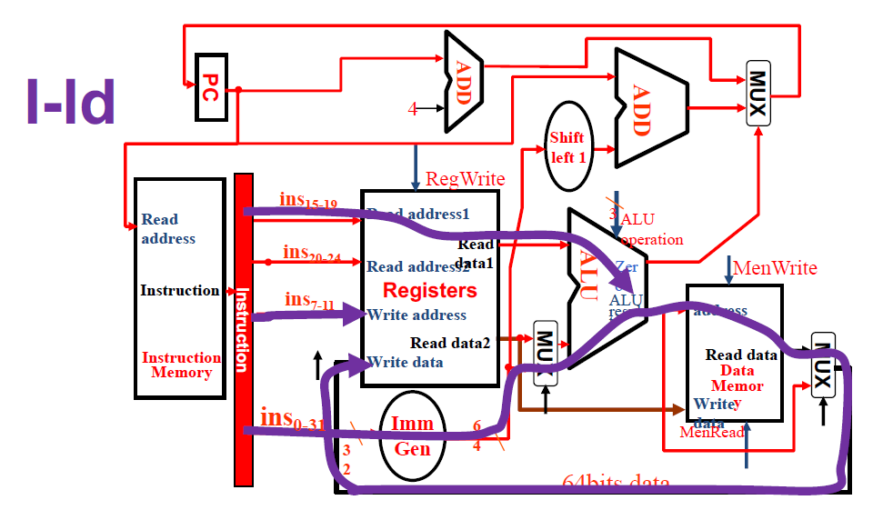
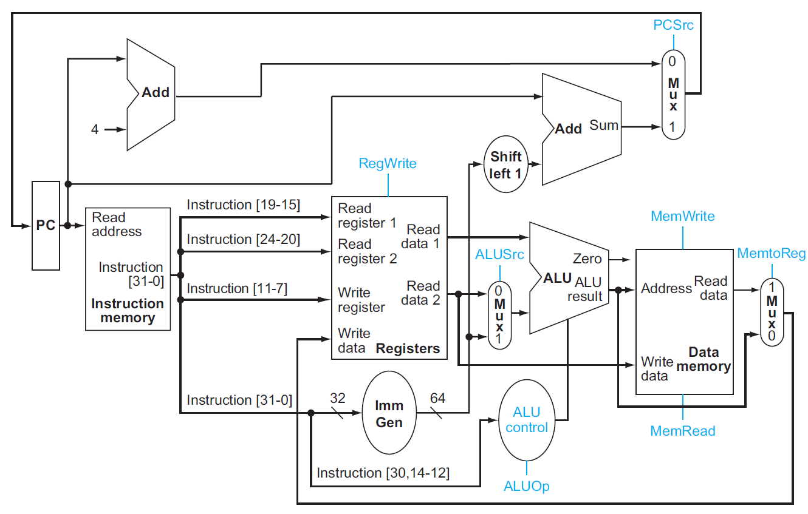
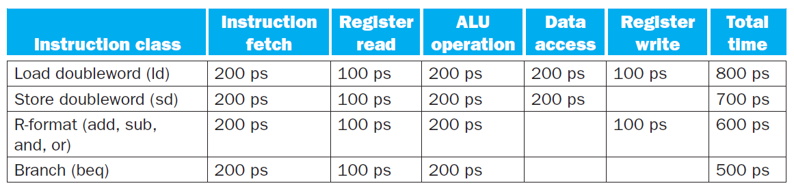
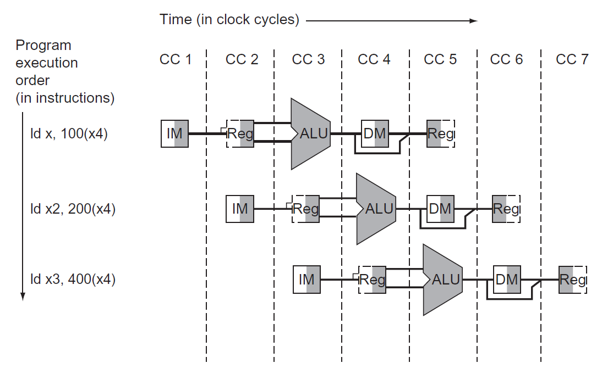
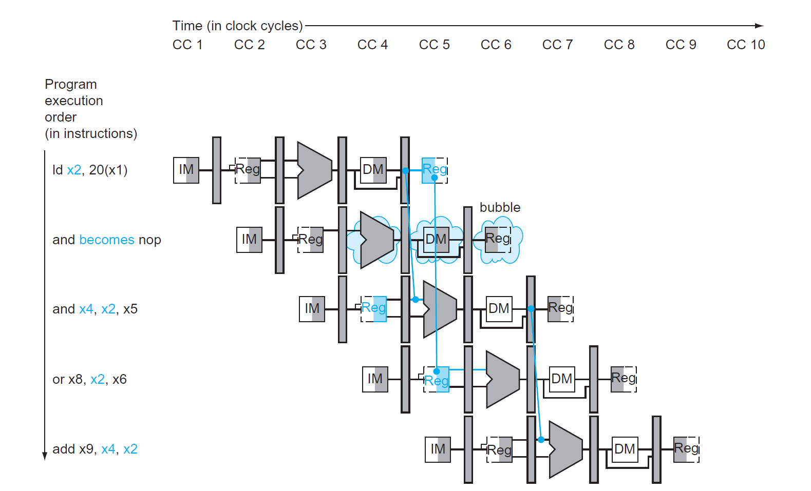

# Chap 4: The Processor

??? abstract "核心知识"

    - 单周期CPU
        - 数据通路
        - 控制单元：ALU控制、主控制

    - 流水线CPU
        - 五个阶段：IF、ID、EX、MEM、WB
        - 数据通路（四个流水线寄存器）、控制器
        - 流水线冒险
            - 结构冒险
            - 数据冒险：前递、停顿
            - 控制冒险：静态/动态预测
        
    - 异常&中断
    - 指令集并行：静态/动态多发射

!!! info "前置知识"

    如果忘记以下知识，可以点击链接回顾一下：

    - [组合逻辑电路](../dld/3.md)
    - [时序逻辑电路](../dld/4.md)

## Single-Cycle

在第1章和第2章的学习中，我们已经知道：计算机的性能由以下因素衡量：

- **指令数**(instruction count)：取决于指令集架构(ISA)和编译器（[第2章](2.md)已介绍）
- **时钟周期**(clock cycle time)和**每条指令周期数(CPI)**：取决于CPU（第4章，也就是接下来要讲的内容）

**单周期(single-cycle)CPU**：一个时钟周期内仅执行一条指令的CPU。

CPU主要由两部分构成——**数据通路**(datapath)和**控制单元**(control unit)，下面按顺序介绍这两者。

### Datapath

#### Overview

RISC-V指令集架构下的最最简单的CPU应该要实现以下核心指令：

- **内存引用指令**(memory-reference instructions)：`ld`、`sd`...
- **算术逻辑指令**(arithmetic-logical instructions)/R型指令：`add`、`sub`、`and`、`or`...
- **条件分支指令**(conditional branch instructions)：`beq`...

>注：实验课上还需要实现更多的指令，包括与立即数相关的I型指令，以及无条件分支指令

下面简单介绍一下如何实现这些指令：

- 最开始的两步是相同的：
    - **取指(IF)**：根据PC（程序计数器）值（即当前指令的地址），从指令内存中获取当前周期下需要执行的指令
    - **译码(ID)**：根据指令的字段识别指令类型，并从单个或多个寄存器内读取数据（load指令只需读取一个寄存器即可），也可以不读取数据（比如`jal`指令）
- 后面的步骤则因指令类型而异：
    - **执行(EX)**：所有指令都会用到ALU，但是有不同的目的：
        - 内存引用指令：地址计算（利用加法）
        - 算术逻辑指令：执行算术逻辑运算
        - 条件分支指令：判断两数的大小关系，同时计算候选的跳转地址（利用减法）
        - 无条件分支指令：计算跳转地址（但不是在ALU上完成的）
    - **访存(MEM)/写回(WB)**：ALU完成任务后，后续操作的区别会更大：
        - 内存引用指令：
            - 加载指令：读取数据（访存 + 写回）
            - 存储指令：写下数据（访存）
        - 算术逻辑指令：将ALU的计算结果写入寄存器中（写回）
        - 条件分支指令：既没有访存也没有写回
        - 无条件分支指令：一般情况下，返回地址会被写入寄存器`x1`里（写回）；若不用返回地址，也可以将返回地址传给`x0`

>注：综上，绝大多数指令只需四步即可完成，只有加载相关的指令需要五步。

下图是一个极简版本的单周期CPU的数据通路原理图：

<div style="text-align: center">
    
</div>

图上标出了一些线路的汇合点：

- 左上角：PC的来源有两个：PC + 4（靠左的Add）或者是由指令指定的地址（靠右的Add）
- 中间：写回寄存器的数据也有两个来源：ALU的运算结果，或来自内存的值
- 下面的ALU：第二个输入也有两个来源：寄存器或立即数

显然，一个输入端不可能同时接受两个来源的数据，因此需要由一个[**多路选择器**](../dld/3.md#multiplexer)(multiplexor, MUX)，根据来自控制单元的控制信号（从指令中获取）去选择其中一个来源。下图展示了添加控制单元后的原理图：

<div style="text-align: center">
    
</div>

- 前面提到的3个双来源输入都用到了MUX
- 对于条件分支指令`beq`，只有当ALU（减法）结果为0（表明两数相等），且控制单元的信号`Branch = 1`时，PC的值为指定的跳转地址
- 根据数逻的知识，我们可以将图中出现的元件归个类：
    - 组合元件(combinational elements)：ALU、MUX等
    - 状态（时序）元件(state elements)：内存、寄存器等

???+ info "一些约定"

    - 如不做特殊说明，笔记中所涉及到的时序电路均属于**上升沿触发**的时序电路
    - 一些术语：
        - **有效**(asserted)：高电平
        - **无效**(deasserted)：低电平
        - 总线(bus)
    - 框图相关：
        - 用蓝色绘制控制单元和对应的线路

#### Elements

接下来，我们逐一讲解数据通路的各个组成部分（称为数据通路元件(datapath elements)）

- 取指：

    <div style="text-align: center">
        
    </div>

    - 指令内存：用于存储程序的指令，并根据PC地址提供对应的指令
    - 程序计数器(program counter, PC)：保存当前正在执行的指令地址，本质上是一个32位的寄存器
    - 加法器：递增PC(+4)，使其获得下一条指令的地址

- 译码（访问寄存器的部分）+执行（ALU部分）：

    <div style="text-align: center">
        
    </div>

    - **寄存器堆**(register file)（左图）：存储了所有的寄存器，通过指定具体的寄存器编号(register numbers)来控制对应寄存器的读写
        - 寄存器编号为5位，因为一共只有$2^5 = 32$个寄存器
        - 多数指令需要两个可读的（源）寄存器（`rs1`、`rs2`）和一个可写的（目标）寄存器（`rd`）
        - **读取**数据时只需输入寄存器**编号**即可获取数据
        - 而**写入**数据时除了需要输出寄存器的**编号**外，还要写入的**数据**和一个**控制信号** `RegWrite`，且只有在`RegWrite = 1`时才可以进行写操作
            - 之所以这样做，是为了避免因随意写入数据而破坏了原数据的危险；而读取寄存器堆不会影响到内部的值，因此无需控制信号

    - 64位的ALU（右图）
        - 如果ALU结果为0，输出端`Zero = 1`，否则`Zero = 0`（一般用于条件分支指令，这里标灰色表示R型指令用不到）
        - 有1个4位的ALU运算的控制输入，用于选择不同的ALU运算

- 访存：

    <div style="text-align: center">
        
    </div>

    - 数据内存：
        - 内存同时具备读（`ld`）和写（`sd`）的控制输入，分别为`MemRead`和`MemWrite`
            - 内存的读取需要控制信号的原因是：并不是所有指令都会有访存操作，而且访存耗时较长，所以那些用不到内存值的指令就不应该读取内存数据，因此需要控制信号来关闭这扇门；而所有指令都要从寄存器堆里读取数据，因此寄存器堆的读取无需控制信号
    - 立即数生成单元（右图）：从32位指令中提取出与立即数相关的位，将这些位按正确的顺序拼接起来，同时对其**符号扩展**至64位，以便进入64位的ALU进行运算

- 执行的剩余部分（以`beq`指令为例）

    <div style="text-align: center">
        
    </div>

    - 用到的元件：
        - 寄存器堆：包含两个寄存器，表示被比较的两个数
        - 立即数生成器：表示跳转地址偏移量
        - 两个ALU：其中一个仅做加法运算（`Add`），用于计算跳转目标地址
    - 一些细节问题：
        - 跳转地址的基(base)地址(PC值)即为当前的分支指令的地址，跳转地址 = 基地址 + 偏移量
        - 注意：立即数并没有表示偏移量的最低位，因为实际的地址偏移量中最低位恒为0，因此偏移量 = 立即数 << 1（图上有一个左移的元件） 
    - ALU的`Zero`输出表示两数的比较结果


#### Composition

现在，我们将前面得到的数据通路元件组装起来！

<div style="text-align: center">
    
</div>

- 这里标出了所有的控制信号（共7个，11位），但是没有画出控制单元，因为现在我们只关心数据通路的结构

???+ note ":star2:各类指令在数据通路中如何执行"

    虽然PPT上画的有点丑，但还算比较清楚，值得一看。

    === "R型指令"

        <div style="text-align: center">
            
        </div>

    === "I型指令（`ld`）"

        <div style="text-align: center">
            
        </div>

    === "S型指令"

        <div style="text-align: center">
            
        </div>

    === "SB型指令"

        <div style="text-align: center">
            
        </div>

    === "J型指令"

        <div style="text-align: center">
            
        </div>

    ??? example "配套题目"

        === "题目"

            <div style="text-align: center">
                
            </div>
            
            一些解释：

            - Register Read：寄存器（仅针对PC寄存器）读取时间，具体是指在时钟上升沿之后，到被读取的数据出现在寄存器输出端之间的一段时间
            - Register Setup：寄存器（PC寄存器和寄存器堆）建立时间，具体是指在时钟上升沿之前，寄存器输入数据保持稳定所需的时间

        === "解答"

            === "R型指令"

                $$
                \text{Latency}_R = \underbrace{30 + 250}_{\text{IF}} + \underbrace{150}_{\text{ID}} + \underbrace{25 + 200}_{\text{EX}} + \underbrace{25 + 20}_{\text{WB}} = 700 ps
                $$

                <figure style=" width: 80%" markdown="span">
                    
                    
                    <figcaption></figcaption>
                </figure>

            === "`ld`指令"

                $$
                \text{Latency}_{ld} = \underbrace{30 + 250}_{\text{IF}} + \underbrace{150}_{\text{ID}} + \underbrace{25 + 200}_{\text{EX}} + \underbrace{250}_{\text{MEM}} + \underbrace{25 + 20}_{\text{WB}} = 950 ps
                $$

                <figure style=" width: 80%" markdown="span">
                    
                    
                    <figcaption></figcaption>
                </figure>

            === "`sd`指令"

                $$
                \text{Latency}_{sd} = \underbrace{30 + 250}_{\text{IF}} + \underbrace{150}_{\text{ID}} + \underbrace{25 + 200}_{\text{EX}} + \underbrace{250}_{\text{MEM}} = 905 ps
                $$

                <figure style=" width: 80%" markdown="span">
                    
                    
                    <figcaption></figcaption>
                </figure>

            === "`beq`指令"

                $$
                \text{Latency}_{beq} =\underbrace{30 + 250}_{\text{IF}} + \underbrace{150}_{\text{ID}} + \underbrace{25 + 200}_{\text{EX}} + \underbrace{5 + 25 + 20}_{\text{decide the next inst}} = 705 ps
                $$

                <figure style=" width: 80%" markdown="span">
                    
                    
                    <figcaption></figcaption>
                </figure>

                ??? question "思考"

                    也许读者会想：CPU在执行任何类型的指令时都会经过最上面的那个通路（即对指令的选择，下一条指令or指定的指令），然而除了`beq`指令外，我并没有标出这条通路上的耗时。这是因为对于这些指令，我们更关心CPU在访存或（和）写回时所花的时间，并且在本题中，写回的时间与上面那条指令通路所花时间都是45ps，所以我就没有特地标出来；而在`beq`指令中，我们更关心CPU在这条指令通路的耗时，所以需要特地标出来。

            === "I型指令"

                $$
                \text{Latency}_I = \underbrace{30 + 250}_{\text{IF}} + \underbrace{150}_{\text{ID}} + \underbrace{25 + 200}_{\text{EX}} + \underbrace{25 + 20}_{\text{WB}} = 700 ps
                $$

                <figure style=" width: 80%" markdown="span">
                    
                    
                    <figcaption></figcaption>
                </figure>

            ---
            最小时钟周期 = 上述指令中的最大时延 = 950ps。


### Control Unit

#### The ALU Control

在所有的控制信号中，最重要的是ALU的控制信号（即上图的`ALU operation`），因为不管何种指令都需要用到这个元件，而且不同的指令会利用它达到不同的目的。

ALU控制信号一共有4位：

- 其中2位分别来自指令中的`funct3`和`funct7`字段，用于区分相同指令格式下的不同指令
- 另外2位则来自一个称为`ALUOp`的字段，它来自主控制单元(main control unit)，用于区分指令格式：
    - `00`：加载/存储指令
    - `01`：条件分支指令
    - `10`：R型指令

下表展示了ALU控制信号及对应的操作：

<div style="text-align: center">
    
</div>

#### Main Control Unit

接下来，我们还要处理剩余的6个控制信号。在此之前，建议回顾Chap 2介绍的各种[指令格式](2.md#Instruction-Representations)。下面的数据通路图将指令的各个字段标注在相应的位置上：

<div style="text-align: center">
    
</div>

>正因为我们设计的指令格式相当规整（不同的指令也具备相似的格式），因此这有效降低了设计电路的成本，很好地体现了"**Simplicity favors regularity**"的理念。

下表展示了剩下的6个控制信号的作用：

<div style="text-align: center">
    
</div>

- `RegWrite`、`MemRead`、`MemWrite`：它们在低电平的时候均无作用，高电平时会允许寄存器/内存的读写
- `ALUSrc`：决定ALU的第2个操作数——低电平时ALU获取第2个寄存器的值，高电平时ALU获取立即数
- `PCSrc`：低电平时PC将会读取下条指令的地址（`PC + 4`），高电平时PC将会读取跳转地址
- `MemtoReg`：低电平时将ALU的结果返回给目标寄存器，高电平时将内存中的数据传给目标寄存器

最后，我们将所有的控制信号交给主控制单元管理，一个完整的简易版单周期CPU的硬件框图如下所示：

<div style="text-align: center">
    
</div>

对应的控制信号表（输入`I[6:0]`为Opcode的前7位）：

<div style="text-align: center">
    
</div>

- 我在原表的基础上补了个`jump`控制信号，以及`jal`指令和I型指令
- 由于出现了第3种写回寄存器的情况，因此`MemtoReg`的输入信号扩展至2位，原来的0和1用00和01代替

逻辑电路图：

<div style="text-align: center">
    
</div>


#### Operation of the Datapath

>图中的灰色部分表示没有用到的连线和元件。

=== "R型指令（以`add x1, x2, x3`为例）"

    <div style="text-align: center">
        
    </div>

    执行指令的步骤：

    1. IF：从指令内存中获取指令，并递增PC
    2. ID：从寄存器堆读取寄存器`x2`和`x3`，同时主控制单元设置好对应的控制信号
    3. EX：ALU根据操作码确定运算类型，然后对上步中读取的数据进行计算
    4. WB：将ALU的计算结果写入目标寄存器`x1`

=== "内存访问指令（以`ld x1, offset(x2)`为例）"

    <div style="text-align: center">
        
    </div>

    执行指令的步骤：

    1. IF：从指令内存中获取指令，并递增PC
    2. ID：从寄存器堆读取寄存器`x2`
    3. EX：ALU计算寄存器`x2`的数据和符号扩展后的12位立即数之和，该结果作为访存地址
    4. MEM：根据地址获取对应的内存数据
    5. WB：将该数据写入寄存器堆内（`x1`）

=== "条件分支指令（以`bqe x1, x2, offset`为例）"

    <div style="text-align: center">
        
    </div>

    执行指令的步骤：

    1. IF：从指令内存中获取指令，并递增PC
    2. ID：从寄存器堆读取寄存器`x1`和`x2`
    3. EX：ALU将读取的两个数据相减；同时将PC的值与左移1位之后的立即数相加，得到分支目标地址
    4. 通过ALU的`Zero`信号来决定如何更新PC

#### Conclusion

在设计控制单元时，我们并没有用主控制单元来直接控制所有需要控制的元件，而是采取用ALU控制（`ALUOp`）来控制ALU，再由主控制单元改变`ALUOp`的值的方法——这样的设计风格称为**多级控制**(multiple levels of control)，它的优势在于：

- 减小主控制单元的规模 -> 减少成本
- 某个控制单元的故障并不会影响其他控制单元的运行 -> 减小控制单元的时延(latency) -> 提高效率

!!! bug "单周期CPU的问题"

    - 每个时钟周期内只能执行一条指令
    - 执行每条指令所需的时钟周期一样长，因而<u>CPU中的最长通路（耗时最久的指令）决定了时钟周期的长度</u>

    因此单周期CPU的效率很低。改进方法下面即将介绍的**流水线**(pipelining)的思想。


## Pipelining

### Overview

**流水线**(pipeline)是一种使多条指令能够被重叠（同时）执行的技术，类似工厂里的组装线。在正式介绍流水线CPU之前，不妨先看看下面的类比，对流水线的概念有一个大致的印象。

??? example "类比（洗衣服）"

    假设要洗一堆脏衣服，我们将这件事分为四个步骤：用洗衣机洗、用烘干机烘干、折叠衣物、放入衣柜，并且为了方便后续解释，假定这四个步骤所花的时间是一样的。现在有四堆脏衣服要洗，如果一个时间段只完成一个步骤，那么整个过程如下所示（耗时：16）：

    <div style="text-align: center">
        
    </div> 

    但如果我们采用流水线的思想来洗这四堆衣物，那么整个过程所花的时间就会显著缩短（耗时：7）：

    <div style="text-align: center">
        
    </div> 

- 从上面的例子中可以看到，在单个周期内，我们可以并行执行多个任务。<u>因此，流水线虽然没有缩短单步所花的时间（即**时延**(latency)），但是它增加了每个周期内能够执行的任务（即增大了**吞吐量**(throughput)），从而缩短完成整个任务的总时间。</u>
- 但并不是所有周期都是满负载的，不难发现开头和结尾部分的阶段仅执行部分任务。在任务数特别大的情况下可以忽视这一点。

!!! warning "注意"

    流水线CPU的时钟周期 = 耗时最长的**阶段**(stage)所花的时间

    - 因此对于k级流水线CPU而言，执行n条指令所需周期数为 n + k - 1

在RISC-V的流水线CPU中，单个RISC-V指令划分为5个阶段（前面已经提到过），包括：

- **IF（取指）**：从内存中获取指令
- **ID（译码）**：读取寄存器，对指令进行译码
- **EX（执行）**：执行（算术/逻辑）运算或计算地址
- **MEM（访存）**：从数据内存中访问操作数
- **WB（写回）**：将结果写回寄存器中


用图形符号表示这五个阶段：

<div style="text-align: center">
    
</div> 

- 图形的左半边阴影表示写入，右半边阴影表示读取，全阴影表示两者皆有，无阴影表示实际上不经过该阶段
- 之所以如此规定，是因为我们假定：在一个时钟周期内，元件的前半个周期可以进行**写**操作，后半个周期可以进行**读**操作

本章讨论的流水线CPU均为这种**五级流水线CPU**，即单个时钟周期内至多能并行执行五个阶段的CPU。

??? example "例子：比较单周期和流水线的性能"

    假如规定内存访问、ALU操作所花的时间为200ps，寄存器读写所花时间为100ps，且规定单周期CPU单个周期内只执行一条指令。各种指令的执行时间如下所示：

    <div style="text-align: center">
        
    </div> 

    现需要执行以下指令：

    ```asm
    ld x1, 100(x4)
    ld x2, 200(x4)
    ld x3, 400(x4)
    ```

    那么单周期CPU和流水线CPU执行这段指令所花的时间如下所示：

    <div style="text-align: center">
        
    </div> 

    - 对于单周期CPU，因为周期的时长取决于执行时间最长的**指令**所花的时间，因此它的周期为800ps。执行3个`ld`指令所花时间为3 * 800 = 2400ps
        - 而其他指令的执行时长都低于800ps，所以这违背了"Make the common case fast"的设计原则
    - 对于流水线CPU，它将`ld`指令的执行分为五个阶段，它的周期时长则取决于执行时间最长的**阶段**所花的时间。因此即使内存读写时间为100ps，但它也还是要执行200ps。执行3个`ld`指令所花的时间为7 * 200 = 1400ps 

对于流水线和单周期CPU执行指令的总时间，我们有以下公式：

$$
\text{Time between instructions}_{\text{pipelined}} = \dfrac{\text{Time between instructions}_{\text{nonpipelined}}}{\text{Number of pipe stages}}
$$

然而这个公式仅在理想条件下（每个阶段花费相同的时间，大量的指令数等）较为准确，否则计算结果与实际情况之间有不小的偏差。

- 比如上面的例子中只执行了3条指令，单周期和流水线CPU的执行时间之比并不等于阶段数
- 然而当执行大量（比如1,000,000条）指令时，执行时间之比就近似等于阶段数。

RISC-V指令集架构很好地适配了流水线CPU的设计：

- 所有的指令都是等长的（32位），这便于取指和译码
- 指令格式少而规整，比如在不同指令中，源寄存器和目的寄存器字段位于同一位置上
- 只有加载和存储指令涉及到内存操作数


### Graphical Representation

在介绍流水线CPU的过程中，经常会用到以下两种图示法来表示：

- 多时钟周期流水线图(multiple-clock-cycle pipeline diagrams)
    - 优势：对流水线指令的大致概况，使人一目了然
    - 电子元件表示法

    <div style="text-align: center">
        
    </div> 

    - 传统的文字表示法

    <div style="text-align: center">
        
    </div> 

- 单时钟周期流水线图(single-clock-cycle pipeline diagrams)
    - 优势：展现更多的实现细节，便于理解指令的执行原理

    <div style="text-align: center">
        
    </div> 


### Pipelined Datapath

根据指令执行的五个阶段，用虚线将单周期CPU的数据通路划分为五个部分：

<div style="text-align: center">
    
</div>

不难发现，大多数指令在原理图的执行顺序为从左到右，但也有一些例外：

- 最后的写回阶段中，将内存的数据写入寄存器的线路方向是从右往左的（可能会导致**数据冒险**）
- PC寄存器的输入数据（`PC + 4`和指定分支地址）是从右往左传递给PC左边的MUX的（可能会导致**控制冒险**）

来看下面这个例子：

<div style="text-align: center">
    
</div>

这里要连续执行三个`ld`指令。可以看到对于每条指令，指令内存只用了一次（取指阶段），因为指令内存还要供后面的指令使用，但是指令剩余阶段的执行需要知道指令的内容，所以需要用寄存器来保存尚在执行的指令。这样的寄存器称为**流水线寄存器**(pipeline registers)，它们位于各阶段之间的中间位置，用于保存指令执行各阶段产生的中间数据，供下一阶段使用。一共有4类这样的寄存器，分别称为IF/ID, ID/EX, EX/MEM, MEM/WB，如下图所示：

<div style="text-align: center">
    
</div>

下面将在这个流水线数据通路上演示加载指令和存储指令的执行过程，以便更好地理解整个数据通路的原理

!!! example "例子"

    === "加载指令"

        === "取指"

            <div style="text-align: center">
                
            </div>

            - 将PC寄存器内的**指令地址**传送给流水线寄存器IF/ID，以供下一条指令使用（比如`beq`指令）
            - 此外还要传递**指令内容**，因为此时CPU还不清楚指令的具体内容，因此需要及时保存

        === "译码"

            <div style="text-align: center">
                
            </div> 

            除了继续传递指令地址外，还要将源寄存器的数据和立即数传给ID/EX，因为它们在之后的阶段中要用到

        === "执行"

            <div style="text-align: center">
                
            </div> 

            - 需要将计算好的内存地址放入流水线寄存器EX/MEM

        === "访存"

            <div style="text-align: center">
                
            </div> 

            从EX/MEM读取内存地址，将对应的内存数据写入流水线寄存器MEM/WB内

        === "写回"

            <div style="text-align: center">
                
            </div> 

            从MEM/WB内读取数据，将其写入寄存器堆


    === "存储指令"

        === "取指&译码"

            前两步和加载指令基本一致，故略过（虽然在指令格式上有细微的差别，但在逻辑原理图中无法体现）

        === "执行"

            <div style="text-align: center">
                
            </div> 

            EX/MEM除了要保存计算出来的地址外，还要保存需要被写入内存的数据

        === "访存"

            <div style="text-align: center">
                
            </div> 

            将EX/MEM存储的数据写入同样存储在EX/MEM的内存地址对应的位置上。此阶段无需使用MEM/WB寄存器

        === "写回"

            <div style="text-align: center">
                
            </div> 

            存储指令无需写回这一步，因此无事发生。但这是个五级流水线CPU，每条指令必须经历五个阶段，即五个时钟周期，所以即使啥也不做也要等这一段时钟周期结束才算完成

这个版本的数据通路有一个bug：在加载指令的最后阶段，我们需要将内存数据写回给哪个寄存器呢？是的，我们忘记保存了目标寄存器的编号。下面给出修正过的数据通路原理图，其中蓝色部分为用于保存目标寄存器编号的部分。

<div style="text-align: center">
    
</div> 

### Pipelined Control

先将单周期CPU的控制信号加入进来，得到以下原理图：

<div style="text-align: center">
    
</div> 

- 由于在每个时钟周期内，PC寄存器和流水线寄存器都要进行写操作，所以它们不需要用一个单独的写入信号来控制
- 考虑流水线CPU的每个阶段所涉及到的控制信号
    - IF：无
    - ID：无
    - EX：`ALUSrc`、`ALUOp`，分别用于决定ALU的第二个操作数（`rs2` or `imm`）和控制ALU运算类型
    - MEM：`Branch`（包括`PCSrc`）、`MemRead`、`MemWrite`，分别对应`beq`指令、加载指令和存储指令
    - WB：`MemtoReg`、`RegWrite`，分别决定写回寄存器的数据来源以及是否允许向寄存器写入数据

- 实际上,无论是功能还是取值，这些控制信号和单周期的CPU没有什么区别，下面总结了一张流水线CPU的控制信号表：

<div style="text-align: center">
    
</div> 

- 同样地，这些控制信号也需要用流水线寄存器来保存和传递，确保当前执行的指令接收正确的控制信号

<div style="text-align: center">
    
</div> 

最后，我们给出更加完整的流水线CPU的原理图，包括了完整的数据通路和控制器（不考虑任何的流水线冒险问题）

<div style="text-align: center">
    
</div> 


### Pipeline Hazards

在流水线CPU的运行中，可能会遇到无法继续执行下条指令的情况，这称为**流水线冒险**(pipeline hazards)。有以下几类不同的冒险类型：

- **结构冒险**(structural hazard)：因硬件不支持某些指令的组合（比如在同一时段访问同一资源（寄存器/内存）的两条指令）而无法继续执行指令
    - 举例：多条加载/存储指令在同一个时钟周期对同一内存进行访问，可能产生数据竞争问题
    - 解决方法：需要在IF阶段停止执行后面的指令；且最好划分多个单独的内存块，以避免多条指令访问同一内存块的情况
- **数据冒险**(data hazard)：因指令尚未得到所需的数据而不得不停下来(stall)，直到获取数据后才能继续执行（出现这类冒险的频率较高）
    - 原因：指令之间存在依赖关系，比如后面的指令依赖前面指令的计算结果等
    - 解决方案：添加额外的硬件，称为**前递**(forwarding)或**旁路**(bypassing)（下图用蓝色连线表示），用于从内部资源中检索指令所缺失的数据

        <div style="text-align: center">
            
        </div> 

        - 注意：只有当目标阶段比源阶段发生的更晚，或位于同一时刻时，这种前递才是合法的（即这根蓝色连线从左上到右下，或是一根竖直的线）
        - 具体的实现可见[下面的小节](#forwarding)
        
    - 上面的图给出的是两个R型指令的执行，只要加一个前递就能保证指令的连续执行。但是如果先执行加载指令，后执行依赖于该加载指令数据的指令，即使加了一个前递，CPU还是不得不暂停一个时钟周期，这种情况称为**加载相关的数据冒险**(load-use data hazard)，如下图所示：

        <div style="text-align: center">
            
        </div>

        - 这种暂停的操作则称为**流水线停顿**(pipeline stall)（或者叫做**冒泡**(bubble)），上图中用蓝色的气泡图表示
        - 具体的实现可见[下面的小节](#stalling)
        - 虽然这种停顿能够解决此类数据冒险，但这么一停顿肯定会损失一些时间，所以如果可以的话，应尽量避免停顿。一种做法是：由硬件检测此类数据冒险是否发生，若发生的话由软件重新为指令序列排序，使其尽可能地减少停顿

        ??? example "例子"

            将以下C语言转化为RISC-V汇编语句：

            ```c
            a = b + e;
            c = b + f;
            ```

            很自然地，我们得到以下汇编代码：

            ```asm hl_lines="2-3 5-6"
            ld  x1, 0(x31)
            ld  x2, 8(x31)
            add x3, x1, x2
            sd  x3, 24(x31)
            ld  x4, 16(x31)
            add x5, x1, x4
            sd  x5, 32(x31)
            ```

            高亮的指令便是数据冒险发生的地方，为了减少停顿，需要调整这些指令的顺序，在这里我们只需要将第3个`ld`指令提到前面来就行了（想想其中的原因）：

            ```asm hl_lines="3"
            ld  x1, 0(x31)
            ld  x1, 0(x31)
            ld  x4, 16(x31)
            add x3, x1, x2
            sd  x3, 24(x31)
            add x5, x1, x4
            sd  x5, 32(x31)
            ```       

            ??? tip "提示"

                <div style="text-align: center">
                    
                </div>            

- **控制冒险/分支冒险**(control hazard/branch hazard)：取到的指令并不是CPU所需要的，即指令地址的流向并不在CPU的预期内（~~好奇怪的表述~~）
    - 举例：由于`beq`指令在ID阶段结束不知道跳转地址是什么，因此在下个时钟周期不能执行下一条指令，需要等`beq`指令译码完成后再执行
    - 有两种可能的解决方案：
        - **停顿**：让`beq`指令与下一条指令之间有一个固定的停顿（多等1个时钟周期）。这样虽然是稳扎稳打的做法，但是效率太低了。

            <div style="text-align: center">
                
            </div>


        - **分支预测**(branch prediction)：预先假设每次执行`beq`指令后，都会继续执行下一条指令（`PC + 4`），而不是跳转到指定指令（这是一种**静态预测**(static prediction)方法，称为always not taken）
            - 如果预测正确，就无需停顿，可以连续地执行指令了（上图）
            - 而预测失败的话就要撤回那个错误的下条指令，这需要额外的一个时钟周期，其效果与停顿一样（下图）
            - 由于既能解决控制冒险，也保证了速度，因而这种方法被实际应用于RISC-V中

            <div style="text-align: center">
                
            </div>

            - 还有一种优化的方法——**动态预测**(dynamic prediction)，比如为每个分支指令分别保存历史记录，当下次执行分支指令时会根据上一次的执行情况选择是否跳转到指定地址，若预测失败则需要撤回该指令，并更新历史记录。这种方法考虑到了不同分支指令的执行情况，从而做出更明智的预测。

        - 延迟决策(delayed decision)：用于MIPS指令，这里就不作介绍了


### Data Hazards

在[前面](#pipeline-hazards)我们大致介绍过数据冒险的问题及其解决方案：**前递**(forward)和**停顿**(stall)，本节将会从逻辑设计的角度上来介绍如何具体实现这些方法。

#### Forwarding

给定以下指令段：

```asm
sub x2, x1, x3
and x12, x2, x5
or  x13, x6, x2
add x14, x2, x2
sd  x15, 100(x2)
```

可以看到，后面四条指令的输入均依赖于第一条指令的输出结果`x2`，所以很容易产生了数据冒险的问题，下面的多周期流水线图可以更清楚地显示这个问题：

<div style="text-align: center">
    
</div> 

可以看到，左边两根蓝线的方向是不对的，我们不可能将未来得到的数据传给过去要用到该数据的指令，所以`and`和`or`指令得到的是之前的`x2`（其值为10），而`add`和`sd`指令得到的`x2`是更新过的（其值为-20）。

为了解决这个问题，首先要做的是**依赖检测**(dependency detection)：确定何时发生数据冒险问题。下面用符号化的语言归纳了两大类数据冒险的情况：

- EX/MEM.RegisterRd = ID/EX.RegisterRs1(or ID/EX.RegisterRs2)
- MEM/WB.RegisterRd = ID/EX.RegisterRs1(or ID/EX.RegisterRs2)

其中等号的左右两边对应的是不同的指令，且等号右边对应的指令依赖于左边对应指令的结果。如果满足上述情况，等号左半边的寄存器的数据应当**前递**给等号右半边的寄存器。

对于上例，

- `sub`和`and`指令间的数据冒险属于第一类（EX/MEM.RegisterRd = ID/EX.RegisterRs1）
- 而`sub`和`or`指令间的数据冒险属于第二类（MEM/WB.RegisterRd = ID/EX.RegisterRs2）

下图展示了正确实现前递的流水线图：

<div style="text-align: center">
    
</div> 

上面的判断方法还存在一些小瑕疵：

- 首先，并不是所有的指令都包含写入寄存器的操作，所以需要提前检测`RegWrite`信号是否为1，若是则继续进一步的判断；否则就直接pass掉，不用担心数据冒险的问题
- 其次，如果某个指令的目标寄存器是`x0`的话，那么我们不希望将可能的非0结果（比如`addi x0, x1, 2`）前递给下面的指令，避免带来不必要的麻烦，所以在依赖检测前还得进行这一步的判断

综上，我们进一步修正依赖检测的判断条件，并且将数据冒险细分为**执行阶段(EX)冒险**和**访存阶段(MEM)冒险**两类，得到以下语句：

```cpp hl_lines="12-13 18-19"
// EX hazard
if (EX/MEM.RegWrite and (EX/MEM.RegisterRd != 0)
    and (EX/MEM.RegisterRd == ID/EX.RegisterRs1))
        ForwardA = 10

if (EX/MEM.RegWrite and (EX/MEM.RegisterRd != 0)
    and (EX/MEM.RegisterRd == ID/EX.RegisterRs2))
        ForwardB = 10

// MEM hazard
if (MEM/WB.RegWrite and (MEM/WB.RegisterRd != 0)
    and not(EX/MEM.RegWrite and (EX/MEM.RegisterRd != 0)
        and (EX/MEM.RegisterRd == ID/EX.RegisterRs1))
    and (MEM/WB.RegisterRd == ID/EX.RegisterRs1))
        ForwardA = 01

if (MEM/WB.RegWrite and (MEM/WB.RegisterRd != 0)
    and not(EX/MEM.RegWrite and (EX/MEM.RegisterRd != 0)
        and (EX/MEM.RegisterRd == ID/EX.RegisterRs2))
    and (MEM/WB.RegisterRd == ID/EX.RegisterRs2))
        ForwardB = 01
```

- 高亮部分的语句理解起来可能不是那么直观：这是为了避免MEM/WB.RegisterRd, EX/MEM.RegisterRd和ID/EX.RegisterRs1(2)三者一起发生冲突，造成新的数据冒险问题
- 这里设置了两个前递信号：`ForwardA`和`ForwardB`，它们实质上是MUX的控制信号，而这两个MUX分别用来决定参加ALU运算的两个操作数。下表展示的是不同MUX控制信号对应的功能：

<div style="text-align: center">
    
</div> 

- 默认`ForwardA = 00`, `ForwardB = 00`

理论部分分析完毕，接下来我们将前递的功能添加到流水线CPU中（用一个**前递单元**(forwarding unit)来表示），如下所示：

<div style="text-align: center">
    
</div> 


#### Stalling

虽然前递能够解决大多数情况下的数据冒险问题，但还是无法克服与加载指令相关的数据冒险问题。前面提到过此类问题的解决方法是**停顿**(stall)一个时钟周期，那么何时需要停顿呢？所以需要在原来的CPU中再加入一个**冒险检测单元**(hazard detection unit)，用于发现合适的停顿时机。与上面的分析类似，这里也给出相应的处理语句：

```cpp
if (ID/EX.MemRead and        // MemRead represents load instruction
    ((ID/EX.RegisterRd = IF/ID.RegisterRs1) or (ID/EX.RegisterRd = IF/ID.RegisterRs2)))
    stall the pipeline       // the load instruction is stalled in the ID stage
```

要想停止流水线的运行，需要做到：

- 停止IF：不能改变PC寄存器的值（读取重复的指令），所以要为PC寄存器添加写信号PCWrite
- 停止ID：不能改变IF/ID流水线寄存器的值（读取重复的值）所以要为该寄存器添加写信号IF/IDWrite
- 停顿的那段时间，虽然CPU仍然在运行，但实际上没有改变任何状态，这种情况称为**空操作**(nops)。为了保证所有元件状态不变，还需要<u>确保所有的控制信号均为0</u><span class="heimu">（事实上，只有RegWrite和MemWrite一定要设为0，其他的控制信号是don't care的）</span>

下面展示添加了**冒险检测单元**(hazard detection unit)后的流水线CPU原理图，可以看到冒险检测单元的三个输出对应了上面的三个处理：

<div style="text-align: center">
    
</div> 

这样的流水线CPU就可以解决由加载指令带来的数据冒险问题了~

??? example "例子"

    对于以下指令段：

    ```asm
    ld  x2, 20(x1)
    and x4, x2, x5
    or  x8, x2, x6
    add x9, x4, x2
    sub x1, x6, x7
    ```

    如果只用前递来解决数据冒险的话，效果是这样的：

    <div style="text-align: center">
        
    </div> 

    可以看到，`ld`和`and`指令间存在数据冒险问题。如果加入了冒险检测单元的话，就能在执行加载指令时及时停顿整个流水线，从而避免了加载指令带来的数据冒险问题，最终效果如下所示：

    <div style="text-align: center">
        
    </div> 

??? example "例题"

    === "问题"

        <div style="text-align: center">
            
            
        </div> 

    === "解答"

        <div style="text-align: center">
            
        </div> 


### Control Hazards

>注：相比数据冒险，控制/分支冒险发生的频率更少。

在前面“[Pipeline Hazards](#pipeline-hazards)”一节提到过`beq`指令要在ID阶段结束后才知道跳转地址，但由于在EX阶段结束后知道操作数的比较结果，因此实际上一直到MEM阶段结束后才能决定是否跳转，这一过程如下所示：

<div style="text-align: center">
    
</div> 

- 可以看到，在MEM阶段结束后，CPU才能确定该`beq`指令需要跳转，但此时已经多执行了3条指令，因此需要将这3条指令从CPU中全部清除
- 所以实际上是经过一系列的调整改进后，`beq`才会在ID阶段知道要跳转的地方，之后会介绍如何实现这一改进

#### Static Branch Prediction

[前面](#pipeline-hazards)提到过**静态分支预测**(static branch prediction)中"always not taken"（不跳转）的大致原理。当然也有"always taken"的预测，虽然这种预测的表现更好（因为统计数据显示，多数条件分支指令会发生跳转），但是这类预测实现起来更加复杂，因此通常还是采用"**always not taken**"的预测。

>如果不发生跳转的概率为50%，且抛弃指令的成本较低，则这种优化方法能减少解决控制冒险的一半成本。

抛弃指令的具体做法为：除了将控制信号置0外，还要**清除**(flush)前3个阶段的指令（此时分支指令进行到MEM阶段）。然而这种做法使得跳转分支的成本过高，为了降低成本，就需要将条件分支的执行提到前面来。具体来说需要做到两件事：

- **提前计算分支跳转地址**(easy)
    - 实际上，PC值和立即数字段已经存储在IF/ID寄存器内，所以只需要<u>将分支地址的计算移到ID阶段</u>即可，即在ID阶段添一个专门的分支加法器
    - 虽然这个加法器可能会在任何指令执行到ID阶段时会进行加法运算，但是只有在条件分支指令时会用到它的计算结果
- **提前进行分支跳转决策**(hard)
    - 要提前进行寄存器值的比较，需要额外的前递和冒险检测装置
    - 在ID阶段新增一个**相等检验单元**(equality test unit)，用于比较两个寄存器的值，其判断结果会存在ID/EX寄存器中
    - 在下一个周期上，冒险检测单元会获取ID/EX的值（实现前递），发现有一个`beq`指令，且需要跳转分支，因此会先清除当前时钟周期内IF阶段的指令，并取得跳转后的指令（只需清除一条指令即可，成本降低了不少）
        - 通过IF.Flush控制信号实现清除
        - 此时的ID阶段执行空操作(nop)
    - 如果条件分支指令前有一条ALU指令，则条件分支指令需要停顿一个周期；如果前面是一条加载指令，则需要停顿两个周期

??? example "例子"

    对于以下指令：

    ```asm hl_lines="2"
    36 sub x10, x4, x8
    40 beq x1, x3, 16    // PC-relative branch to 40 + 16 * 2 = 72
    44 and x12, x2, x5
    48 or  x13, x2, x6
    52 add x14, x4, x2
    56 sub x15, x6, x7
    ...
    72 ld  x4, 50(x7)
    ```

    下面给出在第3和第4个时钟周期内逻辑原理图，重点关注与`beq`指令相关的操作（用红框标出来了）：

    === "第3个时钟周期"

        <div style="text-align: center">
            
        </div> 

    === "第4个时钟周期"

        <div style="text-align: center">
            
        </div> 


#### Dynamic Branch Prediction

虽然上述的静态分支预测足以应付五级流水线的控制冒险问题，但是对于更高级数，或更高要求的处理器，这种预测的失败成本还是太大，于是引入了**动态分支预测**(dynamic branch prediction)——在程序执行过程中，根据上一条条件分支指令的运行结果来预测分支是否跳转。

实现动态分支预测需要借助**分支预测缓存**(branch prediction buffer)（或**分支历史表**(branch history table)），它是一块由分支指令的低位地址来索引的很小的内存，包含1位或多位关于分支跳转的信息。

- 对于最简单的1位缓存，可以仅用0和1区别上次的分支指令是否发生跳转。如果预测失败，则需要翻转这个比特。然而缺陷是即使几乎所有的分支指令都发生跳转（比如循环语句：循环前未执行过跳转指令，循环的最后没发生跳转），这种方法还是会有两次错误预测（一次在开头，一次在结尾）
- 2位缓存能够提高预测精度，虽然它需要2次预测错误才会改变预测值，但是对于执行一连串跳转情况一致的指令时这种方法的优势更大，下面给出对应的有限状态机图：

<div style="text-align: center">
    
</div> 

- 其他更强大的预测器：
    - 相关预测器(correlating predictor)：结合特定分支指令的局部预测和近几条分支指令的全局预测来进行预测
    - 锦标赛预测器(tournament branch predictor)：对于每个分支指令进行多种预测，用一个选择器来决定用哪种预测

---
在解决控制冒险问题后，我们得到最终版本的五级流水线处理器的原理图：

<div style="text-align: center">
    
</div> 


## Exceptions

控制是处理器设计中最难处理的部分，其中一项控制要完成的任务是实现**异常**(exception)和**中断**(interrupt)。这两个词往往会被混为一谈，均指除分支指令外改变指令流的意外事件；但在教材中这两者是有所区分的，下表展示它们的区别和各自对应的事件：

<div style="text-align: center">
    
</div> 

- 异常一般是由程序或系统内部引起的，且是同步的
- 中断一般是由外部设备引起的，且是异步的

下面仅考虑**未定义指令**(undefined instruction)和**硬件故障**(hardware malfunction)这两种事件，其余事件的处理放在第5章讲解。这里给出了解决异常的步骤：

- 保存发生异常的指令地址，并将控制权交给操作系统
    - 第一步用到了两个寄存器（这类寄存器称为**控制和状态寄存器**(CSR)）：
        - **SEPC**(supervisor exception program counter, 超级用户异常程序计数器)：一个用于保存受影响的指令地址的64位寄存器
        - **SCAUSE**(supervisor exception cause register, 超级用户异常原因寄存器)：记录异常原因的64位寄存器（尽管大多数位没有用到），这里假设用2位记录未定义指令事件，用12位表示硬件故障事件
    - 第二步的实现：跳转到操作系统的**处理程序**(handler)上，假设处理程序的地址为$\mathtt{0000\ 0000\ 1C09\ 0000}_{\text{hex}}$
        - 不同的异常处理程序可能需要不同的权限

- **中断向量**(interrupt vectors)：依据不同异常原因得到的处理程序的地址，该地址会被加到向量表基寄存器(vector table base register)上：

    <div style="text-align: center">
        
    </div> 

处理程序可以执行以下行为：

- 如果可以重启的话，则采取纠错措施，并使用SEPC保存的地址返回到原程序
- 否则的话执行中止程序，通过SEPC、SCAUSE内的信息报告错误

在流水线处理器中，可以将异常看作另一种控制冒险的类型。假设执行指令`add x1, x2, x1`时，在EX阶段发生了硬件故障，具体的处理措施如下：

- 阻止`x1`被异常破坏
- 确保前面的指令仍然能够正常执行
- 清除(flush)这条`add`指令以及后面的指令，需要在ID和EX阶段加入清除信号（IF的清除信号已经加好了）
- 将这条异常的指令地址保存在SEPC上，并用SCAUSE记录异常原因
- 将控制权交给处理程序，具体来说，将地址$\mathtt{0000\ 0000\ 1C09\ 0000}_{\text{hex}}$赋给PC，让处理器跳转到这个地址上

这里给出了添加异常处理后的流水线处理器的原理图：

<div style="text-align: center">
    
</div> 

??? example "例子"

    给定以下指令段：

    ```asm
    40 sub x11, x2, x4
    44 and x12, x2, x5
    48 or  x13, x2, x6
    4C add x1, x2, x1
    50 sub x15, x6, x7
    54 ld  x16, 100(x7)
    ```

    假设异常发生后会执行以下指令：

    ```asm
    1C090000 sd x26, 1000(x10)
    1C090004 sd x27, 1008(x10)
    ```

    下面两张图展示了执行`add`指令时发生硬件故障时，处理器应对异常的措施：

    <div style="text-align: center">
        
    </div> 

    <div style="text-align: center">
        
    </div> 

    - 在第6个时钟周期中，假设异常在`add`指令的EX阶段中被检测出来，此时地址$\mathtt{0000\ 0000\ 1C09\ 0000}_{\text{hex}}$被放入PC寄存器中
    - 在第7个时钟周期中，`add`指令和之后的指令被清除（但`add`指令地址被保存），且与异常处理相关的第一条指令进入IF阶段

---
在单个时钟周期中，因为流水线可以执行多条指令，因此有可能发生**多重异常**(multiple exception)。解决方法是：给这些异常排个优先级，决定先解决哪个异常。在RISC-V中，由硬件为异常排序，最早执行的指令先被处理。

---
上面给出的是一种“精确”的异常处理，而“不精确”的异常处理方法是：

- 停止流水线的运行，并保存当前状态（包括异常原因）
- 让处理程序识别发生异常的指令，以及需要完成或清除的指令（可能需要手工完成）

这种处理方法的缺陷：

- 简化了硬件设计，而软件（处理程序）设计就更加复杂了
- 对于复杂的多发射无序流水线而言，这种异常处理就不太靠谱了

>相关资料：[x86中的中断](../../lang/asm/5.md#_7)（处理方法是类似的）


## Instruction-level Parallelism

>注：这一知识点并不是计组的重点内容，在《计算机体系结构》课程中将会更详细地介绍这部分的知识。

**流水线**利用指令的并行处理来提升处理器的执行速度，这种并行方式被称为**指令级并行**(instruction-level parallelism)。除了用流水线来实现指令级并行，本节将会介绍另一种方法——**多发射**(multiple issue)，即通过复制多个处理器元件，实现在一个时钟周期内发射多条指令。

- 多发射使得处理器的CPI小于1，为了便于衡量多发射处理器的性能，我们引入CPI的倒数**IPC**(instructions per clock cycle)作为衡量指标
    - 发射n条指令的处理器的CPI为1/n，或者说IPC = n
- 多发射的局限：指令间的依赖问题，哪些指令可以并行处理
- **发射槽**(issue slot)：指令发射时所处的位置
- 分类：
    - **静态多发射**(static multiple issue)：在执行前由**编译器**（软件）决定如何实现多发射，如何检测和避免各类冒险问题等
    - **动态多发射**(dynamic multiple issue)：在执行过程中由**处理器**（硬件）决定如何实现多发射，通过一些高级工艺来处理各类冒险问题，而编译器负责对指令重新排序

---
**猜测**(speculation)：编译器或处理器“猜测(guess)”指令的结果，以消除该指令和其他指令的依赖关系。

举例：

- 猜测分支指令的结果，使得分支指令后面的指令得以提前执行
- 猜测加载指令前面的存储指令的访存地址与加载指令的不同，则可以让加载指令先于存储指令执行

猜测的具体实现：

- 编译器：
    - 通过猜测为指令重新排序，实现上述例子中的指令移动
    - 插入额外的指令，用于检查猜测的精确性，并且提供了一个处理错误猜测的修复例程
- 处理器：
    - 在运行时通过某些工艺实现指令的重排
    - 用缓存存储猜测结果
        - 如果猜测成功，则允许缓存的内容写入寄存器或内存，从而完成指令的执行
        - 如果猜测失败，则清除缓存内容，并且重新执行正确的指令序列

猜测带来的问题：某些指令的猜测可能会引入以前没有的异常。解决方法为：

- 编译器：添加一种特殊的猜测支持，它允许忽视这样的异常，直到能肯定这些异常确实会发生为止
- 处理器：将异常放入缓存中，直到能够肯定导致这种异常出现的指令不再可猜测且即将完成，此时真正的异常将会出现，由处理程序应对这个异常


### Static Multiple-Issue Processors

在静态多发射处理器中，由**编译器**全权负责指令的打包和冒险的处理。我们可以将同时发射的这些指令看作一个包含多种操作的大型指令，这称为**发射包**(issue packet)，或者称为**超长指令字**(very long instruction word, VLIW)。

编译器必须移除部分或全部的冒险问题，具体做法为：

- 将指令重新排序后再打包
- 尽可能地消除发射包内的依赖关系，虽然有些包内还是存在依赖关系
- 如有必要，用`nop`填充指令

我们先来构造一个简单的双发射RISC-V处理器：

- 规定其中一条指令属于ALU或分支指令，另一条指令属于加载或存储指令
- 为了简化译码和指令发射，假定指令必须两两成对，并且对齐64位；如果存在没用到的指令，则用`nop`替代这条指令，以保证指令总是成对处理的
- 用到额外的寄存器堆端口，并新增一个ALU

下图展示了这种静态双发射处理器的运行流程：

<div style="text-align: center">
    
</div> 

而相应的数据通路如下所示：

<div style="text-align: center">
    
</div> 

双发射处理器的问题：如果发射包内的其中一条指令是加载指令，由于加载指令存在**使用时延**(use latency)，所以如果有指令用到加载得到的数据，则需要停顿一个时钟周期，这样的话会拖累与加载指令配对的另一条指令，因为本来无需等待的这条指令现在被迫停下来。

??? example "例子"

    用静态双发射处理器执行下面的循环：

    ```asm
    Loop:
        ld   x31, 0(x20)       // x31 = array of element
        add  x31, x31, x21     // add scalar in x21
        sd   x31, 0(x20)       // store result
        addi x20, x20, -8      // decrement pointer
        blt  x22, x20, Loop    // compare to loop limit
                               // branch if x20 > x22
    ```                        

    为了减少停顿的出现，还需对这些指令重新排序：

    - 前3条指令均出现`x31`，后2条指令均出现`x20`，因此存在两组依赖关系，所以在排序时应尽可能地避免
    - 下表展示了重新安排后的指令执行顺序：

    <div style="text-align: center">
        
    </div> 

    - 此时的CPI = 4 / 5 = 0.8，低于理论上的0.5，所以效率不是很高

一种提高执行循环的效率编译器的技术是**循环展开**(loop unrolling)：复制多份不同迭代下的循环体指令。

??? example "对上个例子的改进"

    对于前面给出的循环代码，我们可以先复制4份循环体的指令，然后重新安排这些指令，并去除没用的指令，这样下来我们保留了4份`ld`、`add`和`sd`指令，而仅保留1份的`addi`和`blt`指令。下图展示了新的指令执行安排：

    <div style="text-align: center">
        
    </div> 

    - 在展开过程中，我们还用到了别的寄存器（`x28`、`x29`、`x30`），这种做法叫作**寄存器重命名**(register renaming)，用于消除**反依赖**(antidependence)，同时保留了真正的依赖关系
    
    - 反依赖，又称名义依赖(name dependence)，指的是由于名称复用而导致的排序（比如4个循环中都用到了`x31`），并不是真正意义上的依赖关系（即多个`x31`只是“障眼法”，只要用别的寄存器代替它，就能消除这种表面上的依赖关系了）

    - 寄存器重命名后，还是需要对指令的顺序进行适当的调整，以达到更好的执行效果
    - CPI = 14 / 8 = 1.75，所以循环展开提升了1倍多的性能
    - 循环展开的成本更高了，因为要用额外的寄存器实现寄存器重命名，以及代码量的增加


### Dynamic Multiple-Issue Processors

**动态多发射处理器**又称**超标量**(superscalar)处理器，

- 由处理器来决定一个时钟周期内发生多少条指令，这样可以避免结构和数据冒险问题
- 虽然编译器仍然会参与动态多发射的过程，但不同于静态多发射处理器的地方在于：由处理器保证代码的正确执行，无论代码是否被刻意安排过
- 编译的代码总是能够正确运行，与发射速率和流水线结构无关

很多动态多发射处理器都会用到**动态流水线调度**(dynamic pipeline scheduling)：由处理器选择要执行的指令，以尝试避免冒险和停顿的出现。因为这样会导致指令的执行顺序和获取顺序不同，因而称这种执行方式为**无序执行**(out-of-order execution)。

??? example "例子"

    ```asm
    ld   x31, 0(x21)
    add  x1, x31, x2
    sub  x23, x23, x3
    andi x5, x23, x20
    ```

    这里的`sub`指令可以随时执行；而`add`和`ld`指令之间存在依赖关系，`add`指令需要获取`ld`指令的数据，从而产生停顿。这时可以让`sub`提前执行，充分利用了停顿的时间。

下图展示了动态调度流水线的结构图：

<div style="text-align: center">
    
</div> 

这种流水线也能够实现寄存器重命名的效果，具体流程为（~~直接翻译教材~~）：

- 当一条指令发射时，该指令会被复制到某个**功能单元**(functional unit)的**保留区**(reservation station)（一块保留操作数或操作的缓存）中。在寄存器堆或**重排缓存**(reorder buffer)（一块保留动态调度处理器结果的缓存，直到能够安全地将结果存储到寄存器或内存为止）内的任何空闲操作数也都会被复制到保留区中。指令将会一直存在保留区中，直到所有的操作数和功能单元处于空闲状态。对于正在发射的指令，操作数的寄存器拷贝不再需要，其值可被覆写。
- 如果操作数不在寄存器堆或重排缓存中，那一定是在等待功能单元生成这个操作数，该功能单元的名字将会被追踪。当该单元生成结果后，该结果的拷贝会绕过寄存器，被直接放入保留区中。

虽然前面说动态调度是一种无序执行，但是为了让程序看起来像是按顺序执行指令的，因此需要保证IF和ID阶段按顺序执行，并记录顺序，以便让**提交单元**(commit unit)（决定是否能够安全释放运算的结果给寄存器或内存的装置）将结果按顺序写给寄存器或内存。这种提交方式称为**有序提交**(in-order commit)。

所以在动态调度流水线中，流水线的首尾两端是有序执行指令的，但中间部分是可以按照任意顺序执行指令的。

关于猜测：

- 分支指令：预测分支结果，继续发射后面的指令，但是要等到分支结果出来后才能将后面的指令继续提交
- 加载指令：预测加载地址，允许加载指令和存储指令的顺序变换，使用提交单元避免错误预测

??? question "一些思考"

    === "问题1：为何使用动态调度？"

        那么就要说说静态多发射的弊端了：

        - 不是所有的停顿都是可以预测的
        - 如果处理器使用动态分支预测来猜测分支结果，处理器就无法在编译时知道指令的精确顺序，因为它依赖于预测的和实际的分支行为
        - 由于流水线的时延和发射宽度根据具体实现的不同而有所变化，因此编译代码序列的最佳方式也会随之改变

    === "问题2：多发射总是有效的吗？"

        不一定，发射速率不是越快越好，因为很少有应用能够保持一个时钟周期内发射多于两个指令，原因有：

        - 在流水线内，最主要的性能瓶颈来自无法消除的依赖关系，因而降低了指令间的并行和发射速率
            - 比如使用指针创造别名，这会带来更多的依赖关系；但如果用数组的话就没有这种依赖关系
            - 又比如我们很难在编译时或运行时精确预测分支结果，这也带来了限制
        
        - 内存层级的缺失也会限制流水线运行的能力，比如内存的实验和有限带宽等


### Energy Efficiency and Advanced Pipelining

指令集并行的缺陷在于能效问题，因为要提升性能，就需要用到更多的晶体管，但这样通常会降低能效，与我们在第1章中提到的“[能耗墙](1.md#limits-of-processors)”发生冲突。下表展示了不同处理器的流水线复杂度、核的数量以及能耗的对比表格：

<div style="text-align: center">
    
</div> 

启示：多个更简单的核可能给处理器带来更高的能效。


## Fallacies and Pitfalls

!!! failure "谬误"

    - ~~流水线很简单~~（~~简单nm~~）
        - 大致思路很简单（洗衣服的那个类比），但细节上的理解就困难了（比如处理各类冒险问题等）

    - 流水线思想的实现与工艺无关
        - 实际上，更多的晶体管将会带来更高级的工艺
        - 流水线相关的ISA设计需要考虑工艺的发展趋势


!!! bug "陷阱"

    不良的ISA设计将会对流水线运行产生不利影响

    - 复杂的指令集、复杂的寻址模式、延迟分支都会影响流水线的运行效率