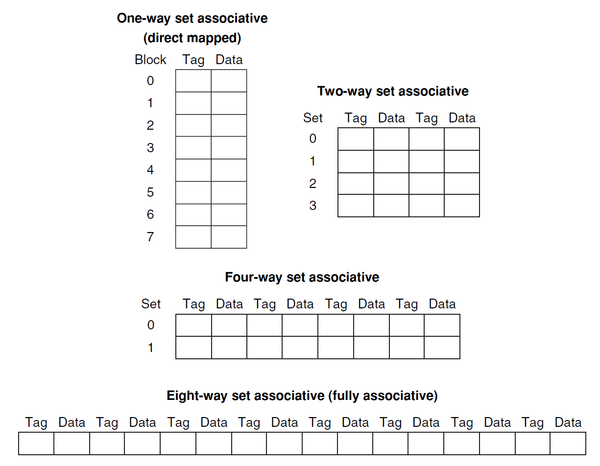
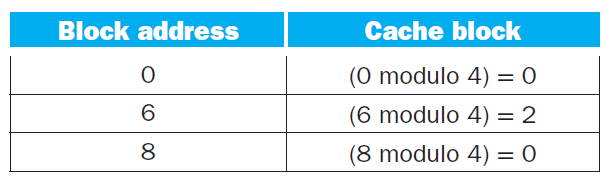
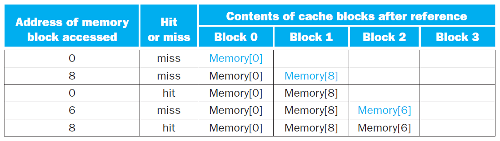
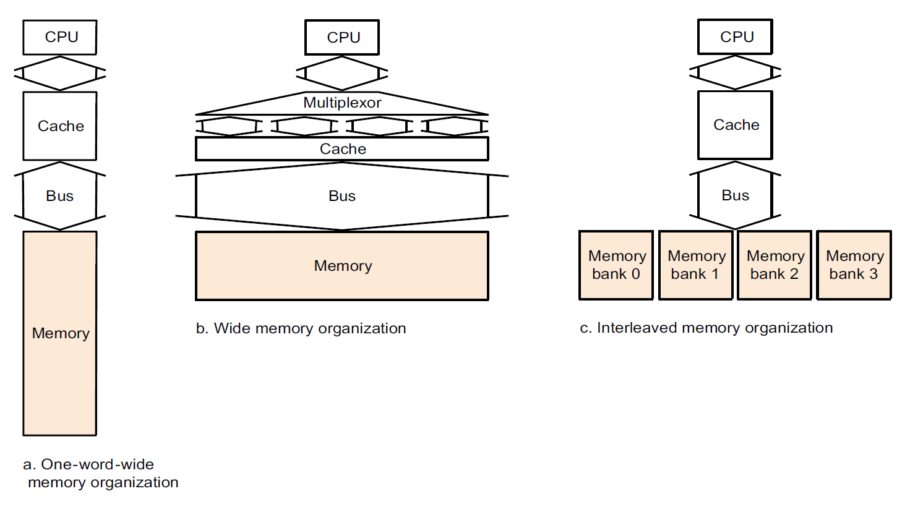
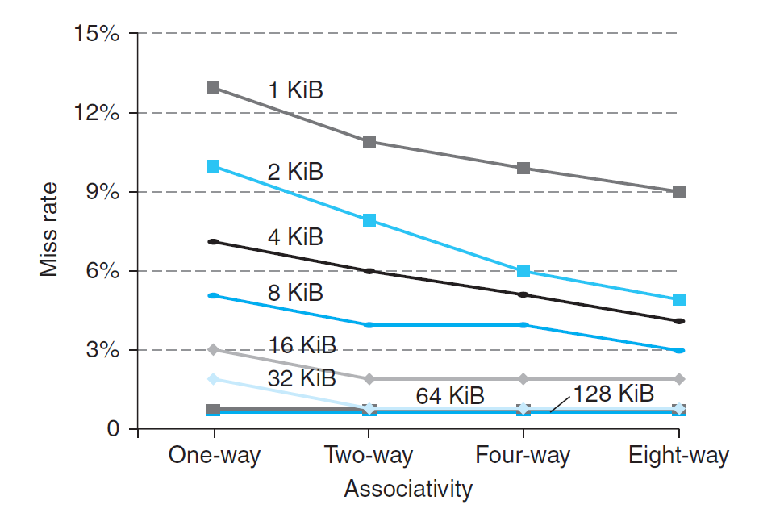
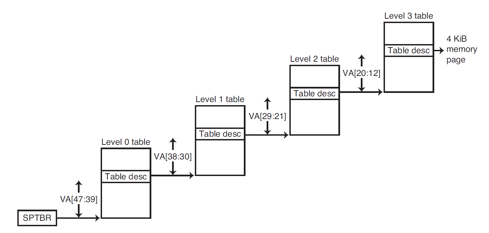
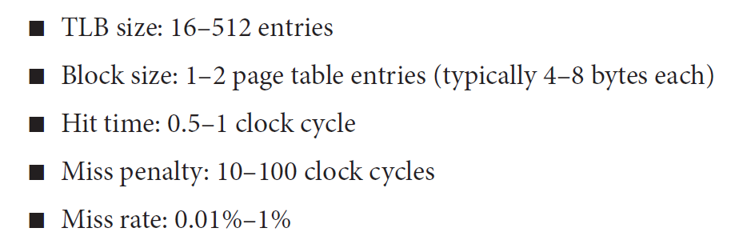
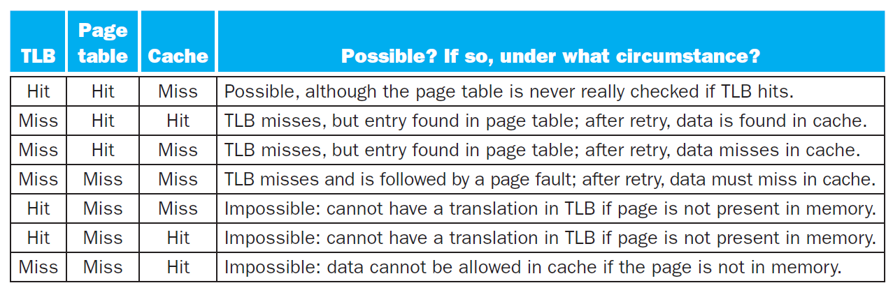

# Chap 5: Memory Hierarchy

??? abstract "核心知识"

    - 存储器工艺：SRAM、DRAM、闪存、硬盘（可能会有计算题）
    - 内存层级的基础知识：
        - 局部性原则
        - 命中&失效
    - 高速缓存(caches)
        - 内存地址：标签、索引、偏移量、合法位...
        - 读/写的命中/失效处理策略
        - 性能计算
        - 置放方案：直接映射、全相联、组相联
        - 多级高速缓存
        - 控制器（仅做了解）
    - 虚拟内存(virtual memories)
        - 页表与页错误
        - 多级页表
        - TLB
        - 综合高速缓存&虚拟内存的分析
        - 保护（仅做了解）
    - 其他
        - 衡量存储器可靠性的方式
        - RAID
        - 衡量失效的3C模型

## Memory Technologies

内存中常用的四大工艺：

- [**SRAM**](https://en.wikipedia.org/wiki/Static_random-access_memory)（静态随机访问存储器）：
    - 它只有一个访问端口，具备读和写的能力
    - 尽管读和写的访问时间不同，访问任何数据所需的时间是固定的
    - 由于无需刷新(refresh)，因此访问时间接近于处理器的周期时间
    - 通常，它用6-8个晶体管表示一个位，用于防止读取对存储信息的干扰
    - 耗电少
    - 应用：**高速缓存**(cache)

- [**DRAM**](https://en.wikipedia.org/wiki/Dynamic_random-access_memory)（动态随机访问存储器）：
    - 1位数据以电荷的形式被存储在1个电容中
        - 因此需要周期性地对电容**刷新**(refresh)以长时间保存电荷，具体做法就是读取并且写回该数据
        - 为了减少刷新对访问时间的占用，DRAM通过两级译码结构实现一次性刷新一整行的数据（这种行结构也有助于提升性能）
    - 用1个晶体管对数据（电荷）进行访问（读/写）（晶体管用比SRAM少，因此更便宜）
    - DRAM内部被划分为多个**存储体**(memory bank)，每个存储体都有一些**行缓冲器**(row buffer)，这样可以实现对同一地址的同步访问
        - 假如有n个存储体，在一个访问时间内便能轮换访问n个存储体，使得带宽提升了n倍，这种轮换访问方法被称为**地址交错**(address interleaving)

        <div style="text-align: center">
            
        </div>

    - 各种类型：
        - SDRAM（同步DRAM）：通过一个时钟来消除同步内存和寄存器所需的时间
        - DDR(double data rate) SDRAM：能在时钟的上升沿和下降沿中进行数据传输，从而提升了一倍的带宽(bandwidth)
        - 双内联内存模块(dual inline memory module)

    - 应用：**主存**(main memory)

??? info "补充知识：[带宽](https://en.wikipedia.org/wiki/Bandwidth_(signal_processing))(bandwidth)"

    “带宽”一词早在数逻课程中就出现过了，但直到我复习计组的时候，对这个概念的认识还是相当模糊。这块地方应该是计组课程中首次出现“带宽”一词的地方，所以我在这里稍微解释一下什么是带宽。带宽在不同领域中有着不同的定义，如下列表格所示：

    |领域|定义|单位|说明|
    |:-|:-|:-|:-|
    |信号处理|信号占据的频率范围|赫兹(Hz)|表示信号的频谱宽度|
    |模拟通信|信道所支持的频率范围|赫兹(Hz)|限制信号的传输能力|
    |数字通信|信道支持的最大数据传输速率|bit/s|表示通信系统的性能|
    |计算机网络|链接支持的最大数据传输速率|bit/s|常称为“网络带宽”|

    计组笔记中出现的“带宽”指的是表格中第三类带宽。


    
- [**闪存**](https://en.wikipedia.org/wiki/Flash_memory)(flash memory)：
    - 它是一种电子可擦除、可编程只读存储器(EEPROM)
    - 类型：
        - 或非闪(NOR flash)：
            - 随机读/写访问
            - 应用：嵌入式系统的指令内存
        
        - 与非闪(NAND flash)：
            - 相比前者更加密集（即单位面积内的比特数更多）且成本更低，但访问更慢
            - 应用：USB keys、媒体存储...
            
    - 在大概千次访问后，闪存位会被磨损掉
        - 因此闪存不适合作为RAM或磁盘的直接替代品
        - 减缓磨损的方法——**磨损均衡**(wear leveling)：将数据重新映射到不常用的存储块上

- [**磁盘**](https://en.wikipedia.org/wiki/Hard_disk_drive)(disk memory)：
    - 磁盘由一组绕轴旋转的金属盘片(platter)构成，盘片上覆有磁记录材料，通过一个读写头(read-write head)来读写信息，整个驱动器被密封在磁盘内部

    <div style="text-align: center">
        
    </div>

    - 组成部分：
        - 迹(track)：磁盘表面上的同心圆
        - **区**(sector)：构成迹的某个片段，是能够被读写的最小单位的信息，包括：区ID、数据以及纠错码(ECC)
        - 柱面(cylinder)：读写头下所有的迹（形成一个柱面）

    - （考试题）**访问**磁盘某个区的时间由以下几部分构成：
        - **寻找(seek)时间**：定位读写头到要被访问的迹
        - **旋转时延**(rotation latency)：将要访问的区旋转至读写头下所需的时间，通常<u>假设为旋转时间的一半</u>
        - **数据传输**(data transfer) = 区的数量 / 传输速率(transfer rate)
        - **控制器开销**(controller overhead)

    ??? example "例子"

        一道计算题，不难，主要理解一下概念：

        <div style="text-align: center">
            
        </div>


## Introduction

**内存层级**(memory hierarchy)：一种多级的存储结构，规定：越靠近处理器的内存，它的访问时间更短、存储空间更小、成本更高。

<div style="text-align: center">
    
</div>


- 更靠近处理器的内存层级是离处理器更远的内存层级的一个子集，且所有的数据实际被存储在最底层的内存中
- 在一个时间段内，数据只能在相邻的两个内存层级之间进行传输（复制），因此在同一时间内我们仅关注相邻的两级内存结构


内存层级设计的重要思想：**局部性原则**(principle of locality)，它由以下两部分组成：

- **时间局部性**(temporal locality)：如果内存的某个项目被用到过，那么在**短时间内**它很有可能被再次使用
    - 举例：循环中的指令很可能会被重复访问

- **空间局部性**(spatial locality)：如果内存的某个项目被用到过，**与它地址邻近的项目**很可能在不久后也会被使用
    - 举例：按顺序访问数组元素


一些基本概念：

- 块/行(block/line)：在两级内存结构中的最小信息单元（下图标出的蓝色方块），一个块可能包含多个字数据

<div style="text-align: center">
    
</div>

- **命中**(hit)：处理器所需的数据位于上层内存中
    - **命中率**(hit rate)：能够在上层内存中找到数据的比率
    - **命中时间**(hit time)：访问上层内存所需的时间，包括判断是否命中或失效所需的时间

- **失效**(miss)：处理器所需的数据不在上层内存中，此时需要访问下层内存并检索所需数据
    - **失效率**(miss rate)（= 1 - 命中率）：未能在上层内存中找到数据的比率
    - **失效损失**(miss penalty)：从下层内存中获取所需数据块的时间，包括以下操作：访问数据块、将数据从下层传输到上层、将数据插入上层内存的合适位置、将数据块继续传给处理器

设计内存层级时，需要考虑的两个重要问题是内存访问**速度**(speed)以及内存空间**大小**(size)，因此我们有了**高速缓存**(cache)和**虚拟内存**(virtual memory)的概念。本章重点要探讨的内容便是这两者，先来学习高速缓存吧！


## Caches

### Basics

**高速缓存**(cache)：介于处理器和主存之间的内存层级，也可以指代任何借助局部访问优势的存储器。但本章内容所涉及到的「高速缓存」均指<u>处理器内部的高速缓存</u>。

先考虑一种很简单的高速缓存，以及一个很简单的情况：假如处理器请求一个单字数据$X_n$，高速缓存的内容发生了如下的变化：

<div style="text-align: center">
    
</div>

由于原来高速缓存内只有数据$X_1, X_2, \dots, X_{n-1}$，$X_n$不在高速缓存内，所以出现了失效的情况，需要从更底层的内存中获取该数据，并且放在高速缓存中。

那么我们如何得知数据是否在高速缓存中，且如何找到该数据呢？最简单的方法是让每个字数据基于内存地址的部分位（即**索引**(index)）进行定位，这能够确保每个字数据占据唯一的一块空间，这种高速缓存结构称为**直接映射高速缓存**(direct-mapped cache)。可以用下面的公式计算字数据在高速缓存中的位置：

$$
\text{Cache Location} = \text{(Block address) modulo (Number of blocks in the cache)}
$$

>一般情况下，高速缓存块的个数是2的幂，那么这个模除运算就可以转化为对数运算$\log_2$。

由于可能存在不同字数据占据相同高速缓存块的情况，所以需要用**标签**(tag)来区分数据。因为底层内存的空间更大，因此通常会用数据在底层内存的**低位地址**来表示在高速缓存中的地址，即**索引**；而**高位地址**就作为区分相同高速缓存块下不同数据的**标签**，如下图所示：

<div style="text-align: center">
    
</div>

上面的图片中，高速缓存块数为8，而内存块数为32，因此字数据内存地址的低3位对应它在高速缓存中的索引，而高2位则作为区分同一高速缓存块下的不同数据的标签。

另外，我们还需要用一个称为**合法位**(valid bit)的字段来指示高速缓存块内是否有合法的数据，若有则置1，否则置0。


??? example "例子"

    === "例1"

        我们对一个块数为8，初始是空的高速缓存进行九次访问：

        <div style="text-align: center">
            
        </div>

        下图展示了在访问过程中高速缓存内容的变化：

        <div style="text-align: center">
            
        </div>

        不难发现，第8次访问（$\mathtt{18 = 10010}_{\text{two}}$）与第2次访问（$\mathtt{26 = 11010}_{\text{two}}$）存在冲突，因为它们占据相同的高速缓存块。这种情况下，最近访问的数据将会占据该高速缓存块的位置（即覆写高速缓存块内已有的数据），这体现了**时间局部性**的思想。

    === "例2"

        强烈建议自己先做一遍，做完后再看答案，这样对直接映射高速缓存的理解很有帮助。

        === "题目"

            <div style="text-align: center">
                
            </div>

        === "答案"

            <div style="text-align: center">
                
            </div>

下图展示了内存地址（假定为64位）与高速缓存位置之间的关系：

<div style="text-align: center">
    
</div>

正如前面提到过的，我们可以将内存地址分为以下几部分：

- **标签字段**：区分同一高速缓存索引下的不同数据
- **高速缓存索引**：高速缓存块的地址
- 由于一个地址表示一个字节，并且在高速缓存中的数据是以**字**（4字节）为单位的，因此地址的低2位作为字节偏移量，通常会被忽略
    - 上图所示的高速缓存的每个块仅存放1个字

!!! note "计算直接映射高速缓存的空间大小"

    给定以下条件：

    - 64位的内存地址
    - 共有$2^n$个高速缓存块，因此用$n$位地址来表示索引
    - 每个高速缓存块可容纳$2^m$个字数据（即$2^{m+2}$字节的数据），因此用$m$位地址来表示字

    那么剩下用于表示标签字段的位数为：$64 - (n + m + 2)$

    高速缓存空间大小的计算公式为：

    $$
    \begin{align}
    &\ 2^n \times (\text{block size} + \text{tag size} + \text{valid field size}) \notag \\
    = &\ 2^n \times (2^m \times 32 + (64 - n - m - 2) + 1) \notag \\
    = &\ 2^n \times (2^m \times 32 + 63 - n - m) \notag \quad (\text{unit: bit})
    \end{align}
    $$

    对于上面给出的高速缓存，它有$2^{10}$个高速缓存块（有10位索引位），每个高速缓存块仅有$2^{2 - 2}$个字数据，因此它的标签位有52位。

!!! info "高速缓存的名称"

    在一般的命名传统中，我们仅用高速缓存存储的字数据大小来表示高速缓存。对于上面的高速缓存，由于它一共可容纳2^10 * 1 = 1024个字数据，即4096字节的数据，因此可以称其为4 KiB高速缓存。

??? example "例题"

    === "例1"

        === "题目"

            若一个高速缓存可容纳16 KiB的数据，且每个高速缓存块可容纳四个字数据（假定使用64位地址），那么该高速缓存所需的空间大小是多少呢？（单位：位）

        === "解答"

            - 先计算高速缓存块的个数：由题意高速缓存可容纳4096个字，又因每个块可装四个字，因此一共有1024个块
            - 标签位数为：64 - 10 - 2 - 2 = 50
            - 所以总的空间大小为：

            $$
            2^{10} \times (4 \times 32 + 50 + 1) = 2^{10} \times 179 = 179 \text{ Kibibits} = 22.4\text{ KiB}
            $$

    === "例2"

        === "题目"

            给定一个高速缓存，它有64块，每块空间为16字节，请问内存字节地址为1200的数据所映射到的块的编号为多少？

        === "解答"

            - 每个高速缓存块仅容纳一个字数据
            - 该数据是内存中第 1200 / 16 = 75 个字数据
            - 对应块编号 75 % 64 = 11
            - 实际上，内存地址在1200-1215之间的数据都会映射到这个高速缓存块上

    === "例3"

        对于直接映射高速缓存，采用不同的地址映射方式：

        <div style="text-align: center">
            
        </div>

        - 该方法是可行的，因为地址高10位与次高10位的异或的结果仍然是一个10位的数，而索引一共也就10位，因此这种映射方式是OK的
        - 但这种映射方式可能会带来更多的冲突，也就意味着更多的失效，解决方法是扩展标签位

??? example "现实中的例子：The Intrinsity FastMATH处理器的高速缓存"

    <div style="text-align: center">
        
    </div>

    !!! info "注"

        由于这个例子中，每个高速缓存块可以存放16个字的数据，所以为了区分不同的字，这类缓存从byte offset那几位中额外划分出block offset（感觉更好的叫法是word offset）。从本质上说，block offset就是byte offset的高位，是byte offset的一部分。


### Handling Cache Hits and Misses

访问缓存的过程中既有命中的可能，也有失效的不幸。下面介绍应对命中和失效的方法：

- 读：
    - **命中**：OK，无需额外动作。
    - **失效**：可分为两类——**指令失效**(instruction miss)和**数据失效**(data miss)。下面以指令失效为例，介绍具体的应对操作（数据失效的处理与之类似）：
        1. 向内存发送原来的PC值（即PC - 4）
        2. 向主存读取数据，并等待完成访问
        3. 将读到的数据放入高速缓存的正确位置上，并设置好状态（内存地址的高位写入标签字段、合法位置1等）
        4. 重新执行PC - 4所对应的指令，此时处理器应当成功从高速缓存中获取正确的指令

- 写：
    - **命中**：常用的两种策略，分别是：
        - **写穿**(write-through)：在更新高速缓存数据的同时也要更新底层内存对应的数据，这样能始终**保证两者的一致性**
            - 这种方法简单粗暴，但是执行起来太慢了，因为每次向高速缓存写入数据就要同时改变主存的数据，要知道访问主存的速度是很慢的，而且此时CPU不得不停下来等待访问操作的完成
            - 补救措施：添加一个**写缓冲器**(write buffer)，它类似于一个队列，暂时保存那些需要写入主存的数据，此时向高速缓存写入数据后只需对写缓冲器进行写操作即可，处理器仍可以继续执行
                - 若缓冲器的内容被填满的话，处理器就不得不停下来，先让缓冲器向主存写入数据、腾出一点空间后，它才能继续执行
                - 然而，如果向主存写入数据的速度慢于处理器产生写操作的速度，那么无论多大的缓冲器都没有用

        - **写回**(write-back)：执行写操作仅改变高速缓存内的数据；当高速缓存块要被覆盖时才将原数据写入底层的内存中
            - 此时需要一个额外的**脏位**(dirty bit)来记录高速缓存块是否被更改过（即高速缓存块的数据是否与内存数据一致），写回策略将以此为依据进行
            - 相比上一种方法，它的性能更高，且消耗带宽更小；但实现起来更复杂，并且使高速缓存和内存的内容不一致

    - **失效**：将整个数据块读到高速缓存中，然后写入原来要写的字数据。可采用的策略有：
        - **写分配**(write allocate)：即像读失效一样先把数据块拿到<u>高速缓存</u>里再写入。
            - **写回**策略只能使用此法来应对失效问题
        - **写围绕**(write around)：直接将原本要写的数据接入<u>主存</u>中
            - **写穿**策略使用此法来应对失效问题

---
衡量失效的3C模型：

- **强制失效**(compulsory misses)（或称为冷启动失效(cold-start misses)）：首次访问不存在于高速缓存的数据块（**初始化**时高速缓存为空，自然就失效了）
- **容量失效**(capacity misses)：在**全相联**的置放方案中，高速缓存无法保存所有数据块，因此可能出现检索已被替代的高速缓存块的情况
- **冲突失效**(conflict/collision misses)：在**组相联**与**直接映射**的置放方案中，可能会遇到多个块在同一个集内竞争的情况

>这些[置放方案](#placements)将在后面介绍，现在不必深究。

下图展示了这三种失效在整个失效中的比例：

<div style="text-align: center">
    
</div>

三种失效对应的解决方案，以及解决方案可能带来的负面影响：

<div style="text-align: center">
    
</div>


??? example "例题"

    [多级高速缓存](#multi-level-caches)的例2。

???+ abstract "总结"

    <div style="text-align: center">
        
    </div>


### Performance Measurement

!!! warning "注意"

    我们仅考虑最最简单的模型，实际情况很难用下面的公式来刻画！

在第1章中，我们已经知道处理器的性能与处理器的执行时间呈反比，并且给出了CPU时间的计算公式。现在将高速缓存给考虑进去——因为**失效问题**，高速缓存可能会引入额外的周期数，因此需要对原公式进行修改，得到以下公式：

$$
\begin{align}
\text{CPU time} & = (\text{CPU execution clock cycles} + \text{Memory-stall clock cycles}) \notag \\
& \times \text{Clock cycle time} \notag
\end{align}
$$

失效问题可以来自读操作，也可来自写操作：

$$
\text{Memory-stall clock cycles} = \text{Read-stall cycles} + \text{Write-stall cycles}
$$

**读**操作部分计算相对简单：

$$
\text{Read-stall cycles} = \dfrac{\text{Reads}}{\text{Program}} \times \text{Read miss rate} \times \text{Read miss penalty}
$$

**写**操作就比较复杂了，方便起见，我们假定使用「写穿」(write-through)策略。此时停顿的原因可分为两类：

- 写失效：要求我们在继续写操作前先获取该高速缓存块
- 写缓冲器停顿：缓冲器内容已满，需要向主存倒入一些数据以腾出空间

用公式表示为：

$$
\begin{align}
\text{Write-stall cycles} & = \Big(\dfrac{\text{Writes}}{\text{Program}} \times \text{Write miss rate} \times \text{Write miss penalty}\Big) \notag \\
& + \text{Write buffer stalls} \notag
\end{align}
$$

- 我们很难用具体公式描述写缓冲器的停顿，因为它不仅与写操作的频率相关，还和写操作的接近程度(proximity)相关（~~什么鬼~~）
- 然而，如果提供了足够深度的写缓冲器，且内存接受写操作的速度快于处理器生成写操作的速度，那么写缓冲器的停顿就变得很小，可以忽略不计

在大多数采取「写穿」策略的高速缓存中，读和写的失效损失大致相等。假如不计写缓冲器停顿时间，那么可以同时考虑读和写操作，即：

$$
\text{Memory-stall clock cycles} = \dfrac{\text{Memory accesses}}{\text{Program}} \times \text{Miss rate} \times \text{Miss penalty}
$$

??? example "例题"

    === "例1"

        === "题目"

            假设有一个高速缓存，它有以下特征：
            
            - 指令高速缓存的失效率为2%，数据高速缓存的失效率为4%
            - 若处理器在没有任何内存停顿的情况下，CPI = 2
            - 对于所有的失效，失效损失为100个时钟周期
            - 加载和失效指令的频率为36%

            那么一个带有不发生任何停顿的完美高速缓存的处理器比带此类高速缓存的处理器快了多少倍？

        === "解答"

            令$I$为指令数，则：

            $$
            \begin{align}
            \text{Instruction miss cycles} & = I \times 2\% \times 100 = 2.00 \times I \notag \\
            \text{Data miss cycles} & = I \times 36\% \times 4\% \times 100 = 1.44 \times I \notag \\
            \text{Memory-stall cycles} & = 2.00 I + 1.44 I = 3.44 I \notag
            \end{align}
            $$

            因此算入内存停顿后，$\text{CPI} = 2 + 3.44 = 5.44$，与未停顿的$\text{CPI}$算个比值，得到$\dfrac{5.44}{2} = 2.72$，即完美处理器性能是一般处理器的2.72倍。

    === "例2"

        见[多级高速缓存](#multi-level-caches)的例3，包含了对二级高速缓存的性能计算，推荐做一做。

???+ warning "注意"

    如果只提升CPU的速度（比如提高CPU的时钟频率，降低周期数等等），而没有对内存系统进行相应的提升，那么反而会拉长CPU的执行时间，即降低CPU的性能。比如降低CPU的CPI值（无停顿），由于内存的停顿周期数不变，那么内存的停顿对实际CPI的影响占比就会增大，这意味着在相同的执行时间内，这类“改进后”的CPU反而遭遇更多的内存停顿，因而性能不佳。

??? info "补充知识：无序处理器的性能衡量"

    >仅做了解即可

    对于此类处理器，会用“每条指令的失效情况”来衡量处理器的性能，公式为：

    $$
    \dfrac{\text{Memory-stall cycles}}{\text{Instruction}} = \dfrac{\text{Misses}}{\text{Instruction}} \times (\text{Total miss latency} - \text{Overlapped miss latency})
    $$

    其中重叠的失效时延(overlapped miss latency)很难直接计算出来。

硬件设计师们还会用**平均内存访问时间**(average memory access time, AMAT)这一指标来衡量高速缓存性能，因为它能同时反映命中和失效的情况，公式如下：

$$
\text{AMAT} = \text{Time for a hit} + \text{Miss rate} \times \text{Miss penalty}
$$

接下来，我们从两方面对高速缓存的性能进行改进，之后会逐一介绍这些内容：

- 降低失效率：适当增加高速缓存块的大小、采取不同相联程度的置放方案
- 降低失效损失：多级高速缓存

### Performance Improvement

#### Block Size

**适当地增加缓存块的空间大小**可以降低失效率，因为更大的空间意味着可以容纳更多的数据，那么失效的可能性自然就降下来了（体现了空间局部性）。

然而，如果高速缓存块的空间过大，对于固定空间大小的高速缓存，那么该高速缓存的块数就会减小，那么就会产生更多的<u>数据竞争</u>问题，因此此时失效率反而会升高。下图便展示了这一结果，其中不同曲线表示不同的高速缓存大小：

<div style="text-align: center">
    
</div>

事实上，增大高速缓存块的空间还会增加访问时间，从而导致**更长的命中时间**(hit time)和**失效损失**(miss penalty)。

综上所述，若高速缓存块过大，最终反而会带来高速缓存性能的损失，因此需要做好权衡。

??? info "补充"

    下面给出一些减缓因增大高速缓存块而带来的失效损失增大的方法：

    - 早重启(early restart)：当所需字数据还未返回时，令处理器继续执行后面的操作，而不是等下去。这种方法更适用于指令高速缓存中，但在数据高速缓存中表现效果不太好
    - 需求字优先/关键字优先(requested/critical word first)：对内存进行组织，使得处理器请求的字数据得以优先进行传输，随后再传输其他不是那么重要的数据。该方法比早重启略快一些，但也有与前者同样的限制


#### Placements

在前面已经介绍过**直接映射**这一类简单的置放方案：一个数据块对应于高速缓存的**唯一**位置。这一方法简单粗暴，因此问题也不少：<u>容易发生冲突、空间利用率低</u>，所以需要使用容量足够大的高速缓存。

下面将介绍其余两种置放方案：

- **全相联**(fully-associative)：一个数据块可以放在高速缓存的**任意**位置上
    - 它的优势在于选择空间的增大，使得高速缓存失效发生的次数减少
    - 要想在这种高速缓存里查找指定的数据，需要对**所有高速缓存块**进行遍历，因此<u>查找效率较低，带来了更长的访问时间</u>
    - 较为实际的做法是用比较器(comparator)进行并行查找，提高查找速度，但显然会引入更大的硬件开销

- **组相联**(set-associative)：一个数据块可以放在固定大小（$\ge 2$块）范围内的任意位置上
    - 若数据块可放在$n$个位置中的任意一个，则称该高速缓存为$n$路(n-way)组相联高速缓存
    - $n$路组相联高速缓存可分为多个组，每个组由$n$个高速缓存块构成，高速缓存块的数据可被组内任意的元素替代
    - 内存中的数据块根据内存地址的**索引**位，映射到高速缓存中**唯一的某个组**
    - 内存块在高速缓存中的大致位置（位于哪个组）的计算：

    $$
    (\text{Block number}) \text{ modulo } (\text{Number of } sets \text{ in the cache})
    $$

    - 要想找到内存块在高速缓存中的精确位置，需要查找它**所在组内所有元素的所有标签**

下面这张图展示了这三类高速缓存置放方案的区别：

<div style="text-align: center">
    
</div>

事实上，我们可以把直接映射和全相联两种方式看作组相联的两种特殊情况。以带有8个高速缓存块的高速缓存为例，直接映射是一种单路(one-way)组相联，而全相联是一种8路组相联，如下图所示：

<div style="text-align: center">
    
</div>

??? example "例题"

    === "题目"

        假设有一个具有4个单字高速缓存块的高速缓存，分别计算在采用以下三种不同置放方案后，根据以下给出的访问内存地址序列：0, 8, 0, 6, 8，计算高速缓存的失效次数。

        - 全相联
        - 2路组相联
        - 直接映射

    === "解答"

        === "直接映射"

            <div style="text-align: center">
                
            </div>

            <div style="text-align: center">
                
            </div>

            失效次数：5

        === "2路组相联"

            <div style="text-align: center">
                
            </div>

            <div style="text-align: center">
                
            </div>

            >注：这里采用了LRU的替换策略（后面会介绍的）

            失效次数：4

        === "全相联"

            <div style="text-align: center">
                
            </div>

            失效次数：3


下面考虑如何在组相联高速缓存中寻找高速缓存块。与直接映射高速缓存一样，我们将内存地址划分为以下几个字段：

<div style="text-align: center">
    
</div>

- **标签**(tag)：用于区分同一组内的不同高速缓存块，处理器通过比较所需内存地址与高速缓存的标签来判断是否命中
    - 需要通过比较器实现并行查找，对于n路组相联高速缓存，需要有n个比较器，以及一个n-1多路选择器
- **索引**(index)：用于区分不同的组
    - 对于全相联高速缓存，它没有索引位，因为它只有一个组
    - $n$位索引表示$2^n$个组
- 字节偏移量(byte offset)：表示单个高速缓存块的大小，偏移位数为$x$表示有$2^x$字节 = $2^{x-2}$字

??? example "例题"

    === "题目"

        给定一个块数为4096的高速缓存，每个块的大小为4字，并且内存采用64位地址。请计算在直接映射、两路组相联、四路组相联以及全相联的置放方案下高速缓存的组数以及总的标签位数。

    === "解答"

        - 每个块的大小为16字节，因此偏移量为4，那么标签位和索引位的位数之和为 64 - 4 = 60
        - 直接映射：组数 = 块数，因此索引位数为$\log_2(4096) = 12$，那么总的标签位数为 (60 - 12) * 4096 = 197Kb
        - 两路组相联：组数 = 块数 - $\log_2(2)$，总的标签位数为 (60 - 12 + 1) * 2048 * 2 = 401Kb
        - 四路组相联：组数 = 块数 - $\log_2(4)$，总的标签位数为 (60 - 12 + 2) * 1024 * 4 = 205Kb
        - 全相联：60 * 4096 * 1 = 246Kb

下面展示一个4路组相联高速缓存的原理图：

<div style="text-align: center">
    
</div>

不难发现，访问一个相联高速缓存需要先选择某个组，然后在组内进行查找，这带来了因比较和选择而产生的延时成本，因此在选择置放方案时需要权衡好**失效(miss)成本**和**相联(associativity)成本**。

??? info "对比相同大小缓存采用不同置放方案的原理图"

    === "直接映射"

        <div style="text-align: center">
            
        </div>

    === "组相联"

        <div style="text-align: center">
            
        </div>


    === "全相联"

        <div style="text-align: center">
            
        </div>

---
在高速缓存中访问某个数据时，可能存在失效（冲突）的情况，即该数据的对应高速缓存块已经放了别的数据。不同的置放方案会有不同的**替换策略**(replacements)：

- 直接映射：由于数据在高速缓存中的位置是唯一的，所以新访问的数据就直接替代原来高速缓存块内的数据
- 全相联：由于可以随机访问高速缓存的任一位置，因此每个高速缓存块的原始数据都有被新数据替代的可能（**随机**替换）
    - 该方法易于实现，且能使数据均匀分布在高速缓存中
    - 当然它也不太聪明，可能会踢掉即将要被访问的数据
- 组相联：新来的数据可能替代它所在组内的任何高速缓存块中的数据
    - 通常采取**最早使用**(least recently used, **LRU**)策略，即那些很久没有被访问过的数据会优先被新数据替代掉
    - 实现这一策略需要跟踪组内高速缓存块数据的使用情况，因此需要额外的位。对于2路组相联高速缓存来说只需额外保留1位即可，但对于更多分路的组相联，实现该策略就想对比较困难了。
    - 其他方法：先进先出(FIFO)，从组中选择最先进入高速缓存的块作为被替换的块


下表展示了一个高速缓存块大小为16字的64KiB高速缓存中，不同置放方案下的数据失效率的对比情况：

<div style="text-align: center">
    
</div>

??? example "例题"

    === "例1"

        一道综合性较强的例题。

        === "题目"

            <div style="text-align: center">
                
            </div>

            !!! warning "注意"

                题目开头说这些地址都是**字**地址，也就是说一个地址代表的是一个字（4字节），不是一个字节，因此需要注意地址中表示偏移量的那几位。

        === "答案"

            === "1"

                <figure style=" width: 70%" markdown="span">
                    
                    
                    <figcaption></figcaption>
                </figure>

            === "2"

                <div style="text-align: center">
                    
                </div>

            === "3"

                <figure style=" width: 70%" markdown="span">
                    
                    
                    <figcaption></figcaption>
                </figure>

            === "4"

                <div style="text-align: center">
                    
                </div>

            === "5"

                <figure style=" width: 70%" markdown="span">
                    
                    
                    <figcaption></figcaption>
                </figure>

            === "6"

                <div style="text-align: center">
                    
                </div>

            === "7"

                <div style="text-align: center">
                    
                </div>

            === "8"

                <div style="text-align: center">
                    
                </div>

    === "例2"

        === "题目"

            <div style="text-align: center">
                
            </div>

            原题有些问题，给了两个地址序列，这里我仅考虑上面那个序列，下面的序列被我删掉了。

        === "答案"

            太累了，一下子更了很多题目，有时间再更，~~没时间的话那就鸽掉吧~~

            注意网传的答案可能是错的！


#### Memory Organizations

下面给出三种不同的内存组织，并分析它们各自的性能：

<div style="text-align: center">
    
</div>

=== "单字宽的内存组织"

    对于块的大小为四字的高速缓存，这类内存的带宽仅有约$\dfrac{1}{4}$，也就是说只有1个字是有用的，另外3个字都作废了，因此这种内存组织不切实际。

    <div style="text-align: center">
        
    </div>

=== "更宽的内存组织"

    <div style="text-align: center">
        
    </div>


=== "**交错的**(interleaved)内存组织"

    <div style="text-align: center">
        
    </div>

    因此，这类内存组织的效果在这三者中是最优的。


#### Multi-level Caches

为了便于分析，下面以二级高速缓存为例：

增加一个二级高速缓存(DRAM)：

- 原来的高速缓存为一级高速缓存(SRAM)
- 如果一级高速缓存失效，且能够在二级高速缓存找到数据，那么失效损失就是访问二级高速缓存的时间了
- 这个时间比访问主存小了很多，从而达到减少失效损失的目的
- 然而，如果二级高速缓存也找不到数据，那还是得访问主存，此时的失效损失还是很大

在一个二级结构的高速缓存中：

- 一级高速缓存专注于**最小化命中时间**，这样便可以实现更短的时钟周期或流水线阶段
    - 因此这级高速缓存的空间更小，每个高速缓存块的空间也更小，因此命中时间和失效损失会变小
- 二级高速缓存专注于**减少失效损失**
    - 相对来说空间会更大，且采用更高度的相联置放，以降低失效率
    - 如果二级高速缓存失效的话，那么一级高速缓存也失效了

???+ info "补充：多级高速缓存的不同失效率"

    在多级高速缓存中，对失效问题的考虑会更复杂些，比如失效率会分为以下两类：

    - 全局(global)失效率：所有层级的高速缓存均失效（此时不得不访问主存了）的几率
    - 局部(local)失效率：各层级高速缓存内失效的几率

??? example "例题"

    === "例1"

        === "题目"

            - 有一块CPI为1.0，时钟频率为4GHz的处理器
            - 访问主存的时间为100ns
            - 一级高速缓存的每条指令失效率为2%
            - 如果加上一块访问时间为5ns，且能将失效率降至0.5%的二级高速缓存，处理器将会变得多快？

        === "解答"

            - 主存的失效损失：$\dfrac{100\text{ns}}{0.25 \text{ns}/\text{clock cycle}} = 400 \text{ clock cycles}$
            - 只有一级高速缓存的处理器的$\text{Total CPI} = 1.0 + \underbrace{2\% \times 400}_{\text{Memory Stall}} = 9$
            - 二级高速缓存的失效损失：$\dfrac{5\text{ns}}{0.25 \text{ns}/\text{clock cycle}} = 20 \text{ clock cycles}$
            - 加上二级高速缓存的处理器的$\text{Total CPI} = 1.0 + \underbrace{2\% \times (\underbrace{20 + 0.5\% \times 400}_{\text{Second Cache Stall}})}_{\text{Primary Cache Stall}} = 1.44$
            - 所以加了二级高速缓存后，性能提升了$\dfrac{9}{1.44} = 6.25$倍！

    === "例2"

        === "题目"

            <div style="text-align: center">
                
            </div>

            >这道题除了考多级高速缓存外，还考了写命中和写失效的几种策略

        === "解答"

            <div style="text-align: center">
                
            </div>

    === "例3"

        === "题目"

            <div style="text-align: center">
                
            </div>

            !!! info "注"

                - 这道题除了考多级高速缓存外，还考了高速缓存的性能测量，有一定的计算量。
                - 这里修改了第二个表格中L2 Miss Rate，改成了5%（原来为95%），因为L2的失误率应该比L1的低，这里可能是一个typo。

        === "答案"

            1. clock rate（时钟频率） = 1 / cycle time（时钟周期），时钟周期已给出，直接算就行了

                - P1: 1.52GHz
                - P2: 1.11GHz

            2. AMAT = hit time + miss rate * miss penalty

                - 注意题目要求的是周期数，不是时间。我们将一个命中时间视为一个时钟周期，因此命中的周期数为1
                - 失效的周期数 = 失效损失 / 命中时间，注意对结果**向上取整**，不足一个周期要按一个周期算，保持每个周期的完整性
                - 周期数：P1: $\lceil \dfrac{70}{0.66} \rceil = 107$，P2: $\lceil \dfrac{70}{0.9} \rceil = 78$
                - P1: 1 + 0.08 * 107 = 9.56
                - P2: 1 + 0.06 * 78 = 5.68

            3. CPI = base CPI(1.0) + inst-access-miss-CPI + data-access-miss-CPI

                - P1: 1 + 0.36 * 0.08 * 107 + 0.08 * 107 = 12.64
                - P2: 1 + 0.36 * 0.06 * 78 + 0.06 * 78 = 7.36

                哪一个处理器更快？我们需要比较执行时间 = 时钟周期 * 周期数 = 时钟周期 * 指令数 * CPI，两个处理器的指令数是相同的，所以就看时钟周期与CPI的乘积

                - P1: 0.66ns * 12.64 = 8.34 ns/inst
                - P2: 0.9ns * 7.36 = 6.62 ns/inst

                所以P2更快

            4. AMAT = L1 hit time + L1 miss rate * (L2 hit time + L2 miss rate * L2 miss penalty)

                注意还是应该要以周期数为单位，所以先算周期数

                cycles for L2 hit = $\lceil \dfrac{5.62}{0.66} \rceil = 9$

                AMAT = 1 + 0.08 * (9 + 0.05 * 107) = 2.15，显然加了L2后P1的表现更好

            5. 计算方法和要用的数据前面都列出来了，所以就直接给答案了

                P1: 1 + 0.36 * 0.08 * (9 + 0.05 * 107) + 0.08 * (9 + 0.05 * 107) = 2.56

            6. 设L2的miss rate为$x$，可以得到以下方程（比较AMAT的大小即可）：

                $$
                1 + 0.08 \times (9 + 107x) \le 9.56
                $$

                解得$x \le 91.58\%$，即只要失误率小于$91.58\%$即可

            7. 比较对象从P1变成了P2，那么就不能直接比较AMAT了，而是比较执行时间
            
                - 即让$\text{CPI}_\text{P1_new} \times 0.66 \le 6.62$（参考第3小问）
                - 还是设L2的miss rate为$x$，那么
                
                    $$
                    \begin{align}
                    & \text{CPI}_\text{P1_new} \notag \\
                    = & 1 + 0.36 \times 0.08 \times (9 + 107x) + 0.08 \times (9 + 107x) \notag \\
                    \le \dfrac{6.62}{0.66}
                    \end{align}
                    $$

                - 解得$x \le 69.27\%$，即失误率要小于$69.27\%$


#### Software Optimization

下面我们以矩阵乘法的计算为例，介绍一下如何从软件层面来利用内存层级，从而提升执行程序的性能。

先给出原始的矩阵乘法代码（只给出内层循环部分）：

```c
for (int j = 0; j < n; ++j) {
    double cij = C[i + j * n]; // cij = c[i][j]
    for (int k = 0; k < n; k++)
        cij += A[i + k * n] * B[k + j * n] // cij += A[i][k] * B[k][j]
    c[i + j * n] = cij;
}
```

我们当然希望能够将三张完整的矩阵都放在高速缓存里，这样访问速度就很快了。然而，万一矩阵很大很大，高速缓存里放不下，那么就需要将矩阵划分为块(block)，一块块地计算矩阵乘法。下面给出这种「块算法」的代码：

```c
#define BLOCKSIZE 32

void do_block(int n, int si, int sj, int sk, double * A, double * B, double * C) {
    for (int i = si; i < si + BLOCKSIZE; ++i)
        for (int j = sj; j < sj + BLOCKSIZE; ++j) {
            double cij = C[i + j * n];
            for (int k = sk; k < sk + BLOCKSIZE; k++) 
                cij += A[i + k * n] * B[k + j * n];
            C[i + j * n] = cij;
        }
}

void dgemm(int n, double * A, double * B, double * C) {
    for (int sj = 0; sj < n; sj += BLOCKSIZE)
        for (int si = 0; si < n; si += BLOCKSIZE)
            for (int sk = 0; sk < n; sk += BLOCKSIZE)
                do_block(n, si, sj, sk, A, B, C);
}
```

- 这种块算法利用了局部性原则：矩阵A利用了空间局部性，矩阵B利用了时间局部性
- 在gcc的优化器(optimizer)中，`dgemm()`函数对`do_block()`函数的调用会被替换为对应的代码（称为内联(inlining)）
- 优化前后的效果比较：

<div style="text-align: center">
    
</div>


### Summary

???+ abstarct "总结：设计高速缓存时需要考虑的四个问题"

    === "**置放方案**"

        - 三种方式：
            - 直接映射(direct mapped)：每个内存块仅对应高速缓存的一个位置（地址 MOD 块数）
            - 全相联(fully associative)：内存块可放在高速缓存中的任意位置
            - 组相联(set associative)：
                - 每个内存块仅对应高速缓存的一个组（地址 MOD 组数）
                - 但可以放在组内的任意位置
                - n路(n-way)组相联：每组包含n个高速缓存块
            

            <div style="text-align: center">
                
            </div>

        - 相联程度越高，失效率就越低。但随着高速缓存空间的增大，这一效果会越不明显，因为大高速缓存的失效率本来就很低

            <div style="text-align: center">
                
            </div>

        - 但更高的相联程度会带来更大的成本和更慢的访问时间

    === "**识别方式**"

        <div style="text-align: center">
            
        </div>

        - 需要同时考虑失效和实现相联所需的成本
        - 缓存（物理）地址的构成：
            - 合法位
            - 标签：处理器检查高速缓存时将所需内存的地址（部分位）与标签位进行比较，若两者相等，表明高速缓存命中，即所需数据在高速缓存内
            - 索引：
                - 直接映射：表示高速缓存块的序号
                - 组相联：表示组的序号
                - 全相连：没有索引
            - （字节）偏移量

    ===  "**替换策略**"

        在组相联与全相联中，常需要决定哪个块要被替代
        
        - **随机**：在待选块中随机挑选一个，可能需要硬件辅助
        - **最早使用**(LRU)：最久未被访问过的块会被替代
            - 这种方法的成本过于昂贵，因此实际上使用近似实现的方式（只用1个位记录）
            - 对于更高的相联度，更大的高速缓存，随机法与LRU在表现上没有多大差别，而且随机法的实现更为简单
            - 但是在虚拟内存中往往使用近似LRU法

    === "**写的方法**"

        - 写穿：同时向高速缓存块和该块对应下级内存的位置上写入数据（高速缓存采用该方案）
            - 优点：简单、成本低、容易实现
        - 写回：当高速缓存块需要被替换时，才会将之前修改过的数据写入下级内存中（虚拟内存采用该方案）
            - 优点：仅取决于高速缓存速率，只需写一次，对高带宽的高效使用（一次写入整个块）


### Cache Controller

>这部分PPT上没有，但是选做实验中要用到这部分知识

这里我们只介绍一类简单高速缓存的控制器，首先规定一下何为“简单”的高速缓存：

- 直接映射
- 写回策略
- 块大小为四字（16字节）
- 高速缓存大小为16KiB，因此共有1024个块
- 32位地址
- 每个块额外加一个合法位

对于这样的高速缓存，它的控制器本质上是一个**有限状态机**(finite-state machine)。它是一个顺序逻辑函数，由一组输入、一组输出、一个生成下一状态的函数和一个输出函数（这些函数均根据当前状态和输入进行计算）构成（实际上这是摩尔(Moore)型状态机）。下面是有限状态机的图示：

<div style="text-align: center">
    
</div>

高速缓存控制器的状态图如下所示：

<div style="text-align: center">
    
</div>

四种状态的简介：

>注：Ready信号用于表示高速缓存操作是否已经完成

- 空闲(idle)：等待来自处理器的合法的读/写请求，若得到请求则进入下一状态（比较标签）
- 比较标签(compare tag)：检测读/写是否命中/失效
    - 若高速缓存块的数据合法，且标签位成功匹配，说明成功**命中**，并将Cache Ready信号置1。如果是写操作，还需将脏位置1。然后回到空闲状态。
    - 若发生失效，首先更新高速缓存标签，然后根据脏位决定下一状态：若脏位为1，进入写回状态；否则进入分配状态
- 写回(write-back)：根据标签和索引将高速缓存块的数据写入内存中，然后等待Ready信号。当完成对内存的写入时，进入分配状态
- 分配(allocate)：从内存中获取新的数据块，然后等待Ready信号。当完成对内存的读取时，有限状态机会回到比较标签的状态

这个有限状态机还可以再扩展，以提升性能：

- 增加更多的状态
- 增加一个写缓冲器


## Virtual Memories

**虚拟内存**(virtual memory)：使主存“高速缓存“一样的一种技术。我们需要虚拟内存的原因有：

- 允许程序之间高效且安全的内存共享:+1:
    - 保护了虚拟机，虚拟机在运行时会动态改变共享内存
    - 用到了局部性原则
- 将程序的负载分为主存内有限的小块空间
- 允许单用户程序使用超过基础内存大小的空间:+1:
    - 以前，若一个程序所需空间过大，需要由程序员使用各种技巧使得程序能够被容纳下，所以相当地麻烦

相关术语：

- **地址空间**(address space)：一块单独的内存地址范围，这块空间只能被某个特定程序访问。虚拟内存所做的就是将程序的地址空间转译至物理地址
    - **地址转译/映射**(address translation/mapping)：将虚拟地址映射到被访问内存的物理地址的过程

    <div style="text-align: center">
        
    </div>

    - **虚拟地址**(virtual address)：关联虚拟空间（应该就是地址空间）位置的地址，它会被转译为被访问内存的物理地址(physical address)上
        - 虚拟地址被划分为**虚拟页编号**(virtual page number)和**页偏移量**(page offset)，其中虚拟页编号会被转译为物理页编号；而页偏移量保持不变，它表示的是页的大小

        <div style="text-align: center">
            
        </div>

        - 在RISC-V中，64位的地址中高16位不会被用到，因此虚拟地址只有48位；同时假设物理内存有1TiB大，因此物理地址有40位。一般情况下虚拟地址的位数都会比物理地址的大

- **保护**(protection)：一种确保共享处理器、内存或I/O设备的多个进程互不干扰（比如一个进程读/写另一个进程的数据等）的机制
    - 该机制隔离了某个程序的地址空间与其他虚拟机的物理地址
    - 同时也隔离了用户与操作系统

- **页**(page)：虚拟内存块
    - **页错误**(page fault)：访问不在主存中的页
        
- **重定位**(relocation)：将程序所用的虚拟地址映射到不同的物理地址上（在这些物理地址被用于访问内存之前），这样就可以在内存的任意位置上加载程序了
    - 在重定位的时候会将程序看作一组固定大小的页

由于一次页错误就会带来极大的时钟数损失，因此在设计虚拟内存系统时需要注意以下几点：

- **页的大小**要足够大，以便尝试摊还较高的访问时间
- 合理的内存**组织**（比如全相联置放法）能够降低页错误率
- 可以使用**软件**来解决页错误问题
- 在虚拟内存中使用**写回**(write-back)策略（写穿耗时太长）
    - 与高速缓存类似，我们在页表中会额外使用一个**脏位**(dirty bit)来追踪某个页是否在被读入内存后被覆写，置位表示被覆写，这种被覆写的页被称为**脏页**(dirty page)

### Page Table and Page Faults

由于页错误的损失大的吓人，所以在虚拟内存中采用的置放方案是**全相联**(fully-associative)，但全相联的问题在于：由于所有数据都是任意放置的，因此需要在整个内存中进行寻找，这显然是不现实的。解决方案是使用一张**页表**(page table)，它记录了虚拟内存系统中虚拟地址与物理地址之间的映射关系，存在内存中，<u>使用虚拟页编号作为索引，而表中的每一项就是虚拟页对应的物理页编号（如果这个页在内存中的话）</u>。

- 为了找到页表，还需额外使用一个**页表寄存器**(page table register)来指示页表的起始位置（假设页表是固定且连续的）
- 虚拟机的状态(state)由页表、程序计数器和寄存器三者共同决定，状态也被称作进程(process)，如果它正在被处理器处理，那么认为它是活跃(active)，否则认为它是不活跃的(inactive)

下图展示了加上页表寄存器和页表后的地址转译过程：

<div style="text-align: center">
    
</div>

- 页表中的每一项都添加了一个**合法位**(valid bit)，功能与高速缓存中的类似：
    - 若其值为0，表明该页不在主存中，那么就会发生页错误了
    - 若其值为1，表明该页在主存中，那么该项就包含了物理页编号了
- 由于页表包含了所有可能的虚拟页的映射关系，因此无需标签位，而索引位就是虚拟页编号

---
当**页错误**发生时，通过异常机制（第4章介绍过，但这里的具体实现有所不同）让操作系统获取控制权，它会在内存层级的下一级中寻找这个页，并决定这个页的置放位置。由于我们无法提前知道这个页会被放在内存中的哪个位置，因此需要在内存中保留一些空间用于放置这样的页，这个空间被称为**交换空间**(swap space)。它同时也创建了一个记录每个虚拟页的存储情况的数据结构，该数据结构可以是页表的某个部分，也可以是一个类似页表的辅助数据结构。

下图所示的页表中，除了用于保存物理地址的页之外，那些空闲的页（灰色的块）会被标记并在磁盘（二级内存）中保留它们的空间（交换空间），以便不时之需：

<div style="text-align: center">
    
</div>

操作系统同时也创建了一个用于跟踪每个物理页使用进程或虚拟地址的情况的数据结构。当页错误发生时，如果主存中的每个页都被使用，那么操作系统必须选择其中一个要被替换的页，此时采取的策略是**LRU**（least recently used, 最早使用），即替换很久没有被访问过的页（将这个被替换的页放入二级内存的交换空间中）。

由于采取精确的LRU策略过于复杂（需要记录每个页的使用情况），因此大多数的操作系统采用的是**近似的LRU策略**，而RISC-V额外引入一个**引用位**(reference/use/access bit)，用于记录页的访问情况，操作系统会周期性地清零和设置该位，这样就能在一个特定时间段内确定页的访问情况。

>页表看起来就像一个虚构的高速缓存——长得与高速缓存非常相似，但本质上是一块内存空间。

### Virtual Memory for Large Virtual Addresses

由于RISC-V的虚拟地址是48位，每个页的大小为4KiB，因此一张页表就要0.5TiB的空间，而每个进程都需要一张页表，如果直接存储这些页表是不现实的，所以需要采用一些技术来减小页表的存储空间，下面介绍这些技术：

- 保留一个限制寄存器，用于限制每个给定进程的页的大小（设置一个阈值），若虚拟页编号大于寄存器的阈值时，则在页表中新开一个条目。这个技术需要确保地址空间是单向扩展的

- 将页表分为两个单独的小页表（每个页表有单独的限制），一张页表从高地址向下扩展（对应堆结构），另一张页表从低地址向上扩展（对应栈结构）
    - 这样将地址空间划分为两段，此时高位地址用于决定使用哪个段。每个段的限制寄存器制定了当前段的大小
    - 然而，应用程序还会认为是一个完整的段
    - 缺点：在非连续、稀疏的地址空间上表现不佳

- 对虚拟地址使用散列函数，这样得到的结构称为**逆页表**(inverted page table)，由于不再使用索引，因此查找起来就比较复杂

- 将每个页表当作一个页存放起来
- 使用**多级页表**能够有效减少页表所需存储空间（RISC-V的做法！）

    <div style="text-align: center">
        
    </div>

    这里我们使用了四级页表，每个页表负责9位地址（虚拟页编号占36位），从高位地址开始寻找。如果在某个页表中找到了的话（即合法位为1），那么继续到下一级页表中寻找，直至最后一个页表。

    - 这种方法允许虚拟地址是稀疏的，非连续的
    - 缺点：地址转译的过程会变得更复杂

??? example "例题"

    === "题目"

        <div style="text-align: center">
            
        </div>

    === "答案"

        === "1"

            - 每个页的大小为8KB = $2^{13}$bit，因此虚拟地址的偏移量占13位，剩余19位作为虚拟页编号，那么这个页表就有$2^{19}$个页
            - 每个进程都有1个页表，那么总的页表大小为：$5 \times 2^{19} \times 4\text{B} = 10\ \text{MB}$

        === "2"

            - 由题意，一级页表有256个页，那么一级页表占用了19位虚拟页标号的高8位，剩余11位分给二级页表
            - 对于单个二级页表，它有$2^{11}$个页，每个页的大小为4B，那么所有二级页表的最大大小为：$5 \times 2^8 \times 2^{11} \times 4\text{B} = 10\text{MB}$，最小大小即最大大小的一半，即$5\text{MB}$
            - 一级页表的最大大小为：$5 \times 2^8 \times 6B = 7680\text{B}$，最小大小即最大大小的一半，即$3840\text{B}$

        === "3"

            <div style="text-align: center">
                
            </div>


### TLB

**转译-旁路缓冲器**(translation-lookaside buffer, **TLB**)：一块用于追踪最近使用过的地址映射的**高速缓存**，以尝试避免直接访问页表（页表是存在内存中的，访问耗时较长）。它利用了局部性原则，由于直接保存了物理地址，因此无需再次转译，从而实现加速访问。下图展示了添加TLB后的访问内存过程：

<div style="text-align: center">
    
</div>

- 其中TLB中的每个项的标签位保存了虚拟页编号，而数据位保存了物理页编号，同时也保留了页表中的几个状态位（合法位、引用位、脏位等）
- TLB也可以在多级页表中使用，此时TLB只记录物理地址和来自最后一级页表的标签

- 如果访问TLB时出现**失效**(miss)，那么还需要进一步判断这是否是一个页错误，因此接下来要访问（最后一级）页表。如果在页表中都没找到，那么页错误就发生了。显然TLB失效比页错误发生地更频繁些
    - 解决流程：使用异常机制——中断当前活跃的进程，将控制权转移给操作系统，之后继续执行被中断的进程
        - 使用寄存器SEPC保存被中断的指令，以便之后继续执行
        - TLB失效或页错误需要在当前时钟周期结束时及时声明，这样的话下一个时钟周期就会执行异常进程而非后面的正常指令，及时防止可能得写入操作带来的破坏
        - 有时操作系统会遇到处理多个异常的情况，如果不做特殊处理，后来的异常就会覆盖先前异常的状态，从而无法返回到对应的发生页错误的指令。因此需要对异常进行**启用**(enable)或**禁用**(disable)，当处理一个异常时，应当禁用其他所有的异常，并用SEPC和SCAUSE寄存器保存状态，以便回到原来的指令。这时再启用其他的异常处理就不会造成破坏了。
        - 操作系统具体要做的事：
            - 使用虚拟地址查找页表，在二级内存（硬盘）中找到对应的页的位置
            - 选择要被替代的物理页，如果此页的脏位置1，那么还需要先将它里面的内容写入二级内存中
            - 将从二级内存中读到的页写入这个被选中的物理页内
    - 上述是针对指令访问的问题，对于**数据访问**，页错误的异常将会更加难处理，因为这类页错误会发生在指令执行期间，并且在处理好异常之前指令无法继续执行下去，即使处理好之后该指令也得重新开始

- TLB的大致规格

    <div style="text-align: center">
        
    </div>

- 小规模的TLB采用全相联，大规模的TLB相联程度会小一些

??? example "例子：The Instrinsity FastMATH TLB"

    <div style="text-align: center">
        
    </div>

    读/写穿操作的流程图：

    <div style="text-align: center">
        
    </div>


### Integration of Virtual Memory, TLBs and Caches

现在来看完整的内存层级，包括了虚拟内存、TLB和高速缓存。需要注意的内容有：

- 高速缓存不能保存主存中没有的页，若出现这种情况，需要清除高速缓存中的对应内容，同时修改页表和TLB，以维持正常的内存层级。此时若想在高速缓存中访问此页，就会出现页错误
- 失效问题可能会发生在三个部件中：TLB、页表和高速缓存
    - 根据上面例子给出的内存层级，有以下几种不同失效情况的组合：

    <div style="text-align: center">
        
    </div>

    注意：
    
    - 后面三种情况是不存在的
    - 上表假设在高速缓存访问地址前，所有的内存地址被转译为物理地址，所以高速缓存使用的是物理的索引和物理的标签

??? example "例题"

    === "题目"

        <div style="text-align: center">
            
        </div>

    === "答案"

        === "1"

            每个页的大小为$4B = 2^{12}bit$，因此地址的低12位表示偏移量，高4位表示标签位，无索引位（因为是全相联）

            <div style="text-align: center">
                
            </div>

        === "2"

            每个页的大小为$16B = 2^{14}bit$，因此地址的低14位表示偏移量，高2位表示标签位，无索引位（因为是全相联）

            <div style="text-align: center">
                
            </div>

        === "3"

            每个页的大小为$4B = 2^{12}bit$，因此地址的低12位表示偏移量，中间1位表示索引位（4个条目，2路组相联），高3位表示标签位

            <div style="text-align: center">
                
            </div>

        === "4"

            每个页的大小为$4B = 2^{12}bit$，因此地址的低12位表示偏移量，中间2位表示索引位（4个条目，直接映射），高2位表示标签位

            <div style="text-align: center">
                
            </div>

        === "5"

            <div style="text-align: center">
                
            </div>

??? info "补充知识"

    - 虚拟地址高速缓存(virtually addressed cache)：一种使用虚拟地址（因此也使用虚拟索引和虚拟标签）的高速缓存
        - 别名(aliasing)：发生于虚拟内存中，两个虚拟地址使用相同物理页的情况

### Protection

为了使操作系统能够实现对虚拟内存系统的保护，硬件必须提供至少以下三种基本的能力：

- 提供至少两种模式，对应于**用户进程**和**操作系统进程**（后者也称为超级管理员(supervisor)进程或核(kernel)进程）
- 提供一种处理器状态，使得用户进程只读不写，该状态可以用一个用户/超级管理员模式位来表示，表示处理器处于用户模式还是管理员模式。要实现写操作，需要使用一些只有在管理员模式下才能使用的特殊指令
- 提供一种能够在用户和管理员模式之间切换的机制。
    - 用户 -> 管理员：**系统调用**(system call)，它是一种异常(exception)，通过特殊指令（比如RISC-V中的`ecall`）将控制权转移给超级用户者模式下的代码空间
    - 管理员 -> 用户
        - 寄存器SEPC用于保存调用系统调用时的PC值
        - `sret`(supervisor exception return)指令用于重置为用户模式，并回到SEPC所保存PC值所在的指令

有以下几种保护类型：

- **写入**保护：阻止某个进程向另一个进程或操作系统的地址空间写入数据（比如TLB用到写访问位来保护页）。

- **读取**保护：进程不应随便读取别的进程的数据。
    - 如果操作系统能够确保页表组织良好，使得独立的虚拟页映射到不相交的物理页，那么就可以确保一个进程不会读到另一个进程上
    - 将页表放入受保护的地址空间，使得只有操作系统能够修改页表，而用户无权修改


## Fallacies and Pitfalls

!!! bug "陷阱"

    - 写代码或编译器生成代码时，忽略了内存系统的行为
        - 如果程序员在设计算法时考虑了内存系统，那么有可能可以让程序性能翻一倍
    - 在模拟高速缓存时，忘记了地址或高速缓存块大小是按字节计数的
        - 做关于高速缓存的计算题时一定要注意这个问题
    - 对于共享高速缓存，其相联度小于共享该高速缓存时用到的核(core)或线程(thread)的数量
        - 一个用到$2^n$个处理器的并行程序至少要有$2^n$路相联的高速缓存，否则就会出现一些神秘的bug
    - 使用平均内存访问时间来评估一个乱序处理器的内存层级
    - 通过在未分段的地址空间上方增加一个段来扩展地址空间
    - 在某个未按虚拟化设计的指令集架构上实现一个虚拟机监控器


!!! failure "谬误"

    - 磁盘失败率与它的规格相匹配
    - 操作系统是调度磁盘访问的最佳方法
        - 有时候直接在磁盘上调度性能更佳

## Supplements

!!! warning "注意"

    这些内容在教材中均出现过，但不是重点内容，有些甚至在课上没有提到过，所以我都丢到了最后。但是我建议小伙伴们在复习的时候阅读以下内容，因为它们在课件或历年卷中出现过：

    - [Dependable Memory Hierarchy](#dependable-memory-hierarchy)
    - [RAID](#raid)
    - 3C模型的介绍放在“高速缓存”的读/写的命中/失效那块地方了

### Dependable Memory Hierarchy

系统传递给用户的服务(service)具有两种状态：

1. **服务实现**(service accomplishment)：传递的服务与指定的服务相同
2. **服务中断**(service interrupt)：传递的服务与指定的服务不同

从状态1到状态2的过程称为**失败**(failures)，从状态2到状态1的过程称为**恢复**(restorations)。失败可以分为永久性的(permenant)和间歇性的(intermittent)，其中前者较好诊断出来，而后者由于会在两个状态间振荡，因此不太好诊断。由此，我们引出了两个相关的术语：

- **可靠性**(reliability)：测量连续的服务实现，或者说失败时间
    - 衡量服务实现的指标：**平均无故障时间**(mean time to failure, **MTTF**)、**一年失败率**(annual failure rate, **AFR**)（1年内所有设备失败的比例）
    - 衡量服务失败的指标：**平均修复时间**(mean time to repair, **MTTR**)、**平均故障间隔时间**(mean time between failures, **MTBF**)
    - MTBF = MTTF + MTTR
- **可用性**(availability)：测量服务实现和中断状态交替的情况
    - 公式：$\text{Availability} = \dfrac{\text{MTTF}}{\text{MTTF + MTTR}}$
    - 我们希望可用性保持在相当高的水平：

    <div style="text-align: center">
        
    </div>

    - 提升可用性的方法
        - 错误(fault)：系统中某个部件(component)的失败
        - 降低MTTR：提供用于错误侦测、诊断和修复的工具
        - 提升MTTF：
            - 错误回避(fault avoidance)：通过构建避免错误发生
            - 错误容忍(fault tolerance)：使用冗余来允许对服务的接受，尽管发生错误
            - 错误预报(fault forecasting)：预测错误的存在和创建，允许部件在失败前被替换


### RAID

**RAID**：独立/廉价硬盘冗余阵列(Redundant Arrays of Inexpensive/Independent Disks)

- 用硬盘阵列取代一个容量更大的硬盘
- 文件会分散存储在多个硬盘（形成一个阵列）内
- 通过冗余(redundancy)得到更高的数据可用性（即使某个硬盘坏了，我们还可以从别的硬盘中获取文件）
- 冗余的代价：
    - 容量损失：存储冗余信息
    - 带宽损失：更新冗余信息

有以下几种不同类型的RAID：

<div style="text-align: center">
    
</div>

<div style="text-align: center">
    
</div>     


下面将逐一介绍和分析这些RAID的特性和表现：

=== "RAID 0"

    不使用冗余

    - 虽然数据分散在硬盘阵列里，但是未采用冗余来应对硬盘故障
    - 但是该方法对于大量的访问而言提升了表现，因为只需对磁盘操作一次

=== "RAID 1"

    硬盘镜像/投影(disk mirroring/shadowing)

    - 每个磁盘都有一份对应的完整拷贝，称为**镜像**(mirror)，因而该方法具备很高的可用性
    - 该方法牺牲了写操作的带宽：一次逻辑写操作 = 两次物理写操作；但是读操作可能得到优化
    - 由于是“完整拷贝”，所以它需要额外100%的容量开销，因而成为最昂贵的方法

    <div style="text-align: center">
        
    </div>   

=== "RAID 2"

    ~~课件上说这种方法“没意思”，所以就跳过了~~

=== "RAID 3"

    位交错奇偶校验硬盘(bit-interleaved parity disk)

    <div style="text-align: center">
        
    </div>           

    - 我们让某几个硬盘共用一个冗余的硬盘P，P的数据的每一位等于“这些硬盘对应位之和 mod 2”（即奇偶位(parity)）
    - 如果某个硬盘出现故障，可以用“硬盘P - 其他正常的硬盘的数据之和”来还原因故障遗失的信息
    - 然而，硬盘的每个区都有一个错误检测字段，而该方法并没有利用到这一点


=== "RAID 4"

    块交错奇偶校验(bit-interleaved parity)

    <div style="text-align: center">
        
    </div>  

    - 该方法允许同步、独立地读取不同硬盘的数据
    - 对于小范围读操作而言，该方法表现不错
    - 采用小范围写算法：1次逻辑写 = 2次物理读 + 2次物理写（每次写操作都会涉及到奇偶校验硬盘P），成本较高。具体过程如下所示：

    <div style="text-align: center">
        
    </div>

        
=== "RAID 5"

    高I/O速率交错奇偶校验(high I/O rate interleaved parity)

    <div style="text-align: center">
        
    </div> 

    - 交错的奇偶校验块
    - 独立的读写操作 

=== "RAID 6"

    P+Q冗余：当单次错误纠正仍然无法满足要求时，可以从数据中再次计算得到奇偶校验位，以进行额外的信息检查。


### Error Codes

!!! info "注"

    这里的内容体现了“**通过冗余提高可靠性**”的思想。

- 汉明距离(Hamming distance)：任意两个纠错码之间的最小的不同位数
- **错误检测码**(error detection code)：一种能够发现数据的错误，但不一定能够找到精确位置（即不能纠错）的编码
- 奇偶校验码：记录原数据`1`的个数，若为奇数，则奇偶校验码为1，否则为0。原来的N位数据扩展到N+1位，存放这个额外位
    - 问题：它只能检测奇数个位的错误，而无法检测偶数个位的错误，因此不能实现纠错效果

- **汉明纠错码**(Hamming error correction code, **ECC**)，它的汉明距离为3，计算步骤为：
    - 低位放左边，高位放右边，记最左边为第1位
    - 令2的幂次位（第1、2、4、8...位）为奇偶校验位，其他位作为数据位
    - 对于第$2^i$位上的奇偶位，它负责位置编号满足第$i$位为1的数据位（比如第4位上的奇偶位会检查2,3,6,7,10,11等位）
    - 将所有奇偶位拼起来（右边低位），它可以直接反映哪一位上的数据有误（比如拼起来为1010，表示第10位（第6个数据位）上的数据有误），从而可以实现纠错

    <div style="text-align: center">
        
    </div>

    ??? example "例题"

        === "题目"

            <div style="text-align: center">
                
            </div>

        === "答案"

            <div style="text-align: center">
                
            </div>

- 改进——单位纠正/双位检测(single error correcting/double error detecting, **SEC/DED**)：额外增加1个奇偶位，用于检测数据上所有位的错误，这样可以在实现单位纠错的基础上，实现双位检测错误的功能~
    - 记原来的奇偶位组为H，新增的奇偶位为p，分类讨论：
        - H有偶数个1，且p=0：没有错误发生
        - H有奇数个1，且p=1：可纠正的单位错误发生
        - H有偶数个1，且p=1：数据位没有错，但奇偶位p发生错误，需要纠正
        - H有奇数个1，且p=0：发生两位错误

>扩展：[循环冗余校验(CRC)](https://en.wikipedia.org/wiki/Cyclic_redundancy_check)、[里德-所罗门码](https://en.wikipedia.org/wiki/Reed%E2%80%93Solomon_error_correction)


### Virtual Machine

这里讨论的**虚拟机**(virtual machine)是能够在指令集架构层级下提供一个完整的系统级环境的虚拟机，所以也称为（操作）系统虚拟机((operating) system virtual machine)。关于虚拟机的术语有：

- **虚拟机监控器**(virtual machine monitor/hypervisor)：支持虚拟机的软件，是虚拟机的核心部分，决定如何将虚拟资源映射到物理资源上
    - 基本需求：
        - 至少有两种处理器模式：系统和用户（默认情况下处于用户模式）
        - 特权指令子集只能在系统模式下被使用，这些指令用于控制系统资源
            - 很多指令集架构（包括x86、MIPS、ARMv7等）在设计之初并未考虑到虚拟化(virtualization)的问题，因此虚拟机无法支持这些ISA下的所有指令
- **宿主机**(host)：底层的硬件平台
- **客户机**(guest)：共享的资源
    - 客户机软件表现得好像运行在本地硬件上（除了性能相关的行为，以及多台虚拟机共享固定资源的限制外）
    - 客户机软件不应直接改变真实系统资源

虚拟机的意义：

- 提升保护：
- 管理软件：能够使用过去的、现在的、未来的OS
- 管理硬件：

### Cache Coherence

- **一致性**(coherence)：什么值应该被读取
    - **高速缓存一致性问题**(cache coherence problem)：两个不同的处理器在内存的同一位置中获得两个不同的值，如下图的例子所示：

    <div style="text-align: center">
        
    </div>


- **连续性**(cosistency)：何时写入值会被读取
    - 本节不会介绍这部分内容

如果满足以下要求，称内存系统是一致的：

- 处理器P读取在位置X上的值，随后P又向位置X写入值，在P读取和写入的间隔中没有其他处理器对X进行写入，那样内存总是能够返回P写入的值。
- 处理器P读取在位置X上的值，随后另一个处理器向X写入值，若读和写的间隔足够长，且没有第三个处理器在这段时间内对X进行写入，那么内存返回的就是那个写入值。
- 向相同位置写入数据是**串行的**(serialized)，即不同处理器对相同位置的写入被视为具有相同的顺序。比如处理器B在处理器A写入数据之后马上在同一位置上写入另一数据，那么其他处理器在该位置上读到的数据还是A写入的数据。


在高速缓存一致的多处理器中，高速缓存会对共享的数据提供迁移和复制这两类操作：

- **迁移**(migration)：数据项可以以一种透明的方式，被移动到一块局部高速缓存内并被其使用，这样能够减少访问（分配到较远地方的）共享数据的时延，并且减少对共享内存的带宽要求
- **复制**(replication)：当共享数据被同步读取时，高速缓存将会将数据项拷贝到局部高速缓存中，这样也能减少访问时延，同时降低读取共享数据时的竞争问题

因此，对于这样的处理器，保证高速缓存的一致性相当重要，所以有了**高速缓存一致性协议**(cache coherence protocols)以确保一致性。最常用的协议是**监听协议**(snooping protocols)：每个高速缓存都有一份对某个物理内存数据块及其共享状态(status)的拷贝。所有的高速缓存可通过一些广播介质(broadcast protocol)（总线或网络等）被访问到，由它们的控制器监听者(controller monitor/snoop)来判断它们是否有总线或开关访问所需要的拷贝。

- 此外还会用到一种**写无效协议**(write invalidate protocol)，确保某个处理器在写入某个数据项之前，对该数据项具有独一无二的访问权，此时其他处理器在写操作时对应高速缓存内的拷贝就是无效内容了。

??? example "例子"

    <div style="text-align: center">
        
    </div>

    关注表格的3、4两行：一个处理器(B)读取数据后，另一个处理器(A)随后马上向同一位置写入数据。由于写操作是一种独一无二的访问，其他任何处理器内保存同一位置内存数据的高速缓存块全部失效，所以可以看到在写操作之后，处理器B高速缓存内的数据被清除掉了。那么当下一次处理器B再读取数据时，就会发生高速缓存失效，因而需要重新到内存中读取新的数据了。

高速缓存块的大小也会影响高速缓存的一致性，比如每个块的大小为8字，虽然只写入1字，但是处理器会读取整个块的内容，因此这样会带来更大的一致性带宽需求。此外，过大的高速缓存块还会带来**假共享**(false sharing)问题：两个不相关的共享变量位于相同的高速缓存块上，即便不同处理器在访问不同的变量，这个完整的块会在处理器之间发生交换（？）。

