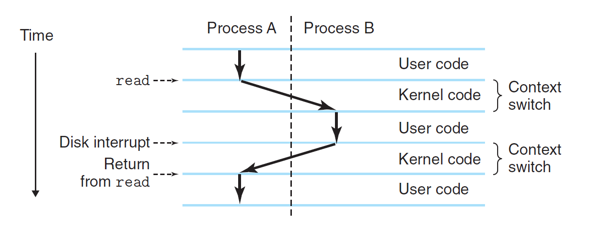
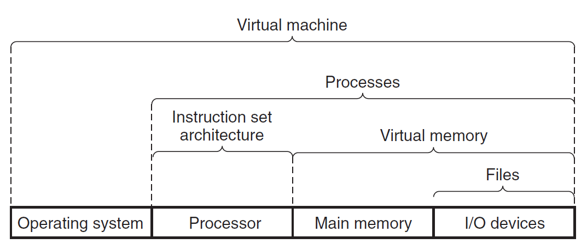

# Chap 1: A Tour of Computer Systems

**计算机系统**(computer system)：由硬件和系统软件构成的，以运行应用程序。

本章是对计算机系统主干部分的梳理，后续章节的内容就是对以下概念的挖掘和深入。


## Information

一个程序起源于一份**源程序/源文件**(source program/file)，程序员用编辑器创建源程序，并保存在一个文本文件中。

计算机的文件可以分为：

- **文本文件**(text files)：仅由 ASCII 字符（也可以采用 Unicode 等编码方式）构成的文件
- **二进制文件**(binary files)：除文本文件外的所有文件
    - 如果尝试用文本编辑器打开二进制文件，会得到一串乱码(gibberish)

实际上，计算机系统内的所有信息（包括硬盘文件，存储在内存中的程序和用户数据，在网络中传输的数据等）都由一串二进制**位**(bit)表示。我们用信息所处的**上下文**(context)来区分不同的数据对象。

作为程序员，我们应该要理解数字在机器中的表示。


## Programs

为了让 C 源程序能够被运行，需要将 C 语句转化为低层级的机器语言指令，这些指令被打包在**可执行目标程序/文件**中。而这一转变过程称为**编译系统**(compilation system)，如下图所示：

<div style="text-align: center">
    
</div>

编译系统分为以下四个阶段：

- **预处理**(preprocessing)：**预处理器**(preprocessor)（cpp）根据以 `#` 字符开头的指示符(directives)（比如 `#!c #include <stdio.h>`）修改原始的 C 程序，最后得到另一个通常以 `.i` 为后缀名的 C 程序。
- **编译**(compilation)：**编译器**(compiler)（cc1）将 `.i` 文本文件转化为 `.s` 文本文件，里面包含汇编语言程序(assembly-language program)，其中主要的汇编指令实际上是机器语言指令的文本形式。由于不同的高级语言程序通过不同的编译器可以得到相同的汇编语言输出，因此汇编语言相当有用。 
- **汇编**(assembly)：**汇编器**(assembler)（ss）将 `.s` 文件转化为机器指令，将其打包成**可重定位的目标程序**(relocatable object program)，最后存储在 `.o` 后缀的目标文件中（二进制文件）。
- **链接**(linking)：**链接器**(linker)（ld）将来自 C 标准库中的预编译目标文件与通过汇编得到的目标文件合并起来，最终得到可被系统执行的目标文件。

在 UNIX 系统上，由编译器 GCC 实现上述过程：

```sh
$ gcc -o hello hello.c
```

了解编译系统的工作原理，有助于：

- 优化程序性能
- 理解链接时错误
- 避免安全漏洞（比如缓冲区溢出错误）


## Instructions Reading and Interpretation

在理解程序如何在计算机系统运行前，先来认识一下系统的硬件组织：

<div style="text-align: center">
    
</div>

- **总线**(buses)：遍布整个系统的电子管道，用于来回传输系统组件之间的信息。
    - 字(word)：总线内按固定大小被传输的字节块，现在大多数机器的字大小为 4 字节（32 位机）或 8 字节（64 位机）

- **I/O 设备**(I/O devices)：计算机系统与外部世界的连接。
    - 上图列出 4 种 I/O 设备：键盘、鼠标（作为用户输入）、显示器（作为用户输出）、硬盘驱动器（长期存储数据和程序）
    - 每个 I/O 设备通过**控制器**(controller)或**适配器**(adapter)与 I/O 总线相连。
        - 控制器：位于设备或系统主板的芯片
        - 适配器：插在主板卡槽上的卡片

- **主存**(main memory)：一种临时的存储设备，存储正在处理器中执行的程序和被其处理的数据，由一组 **DRAM**(dynamic random access memory，动态随机访问存储器)构成
    - 逻辑上，我们将内存视为一个线性的字节数组，每个字节都有一个唯一的地址（数组索引，从0开始）

- **处理器**(processor) / **中央处理器**(central processing unit, CPU)：解释（或执行）存储在主存中的指令的引擎。
    - 它有一个字大小的存储设备——**程序计数器**(program counter, PC)，指向位于主存的（正在执行的）机器语言指令（或者说存储指令的地址）
    - 从系统通电开始到断点这段时间之内，处理器会重复执行被 PC 指着的指令，并更新 PC 使其指向下一条指令
    - **指令集架构**(instruction set architecture)：在该模型下，指令按严格的序列被执行，并且执行指令包括了一系列的步骤
    - 执行指令的一系列操作（比如加载(load)、存储(store)、运算(operate)、跳转(jump)等）往往会在主存、**寄存器堆**(register file)、**算术逻辑单元**(arithmetic/logic unit, ALU)这些设备之间打转
        - 寄存器堆：一个小型的存储设备，包含一组字大小的寄存器，每个寄存器都有唯一的名称
        - ALU：计算新的数据或地址


---
要想在 UNIX 系统中运行可执行文件，只需将文件名输入到 **shell**（一个命令行解释器，能够打印提示(prompt)、等待用户输入并执行指令）中并运行即可：

```sh
$ ./hello
hello, world
$ 
```

下面来了解一下运行该程序后，系统的底层硬件发生了什么：

- 从键盘中读取 `hello` 命令

    <div style="text-align: center">
        
    </div>

- 将可执行文件从硬盘加载到主存中（这里用到了一种叫做**直接内存访问**(direct memory access, DMA)的技术）

    <div style="text-align: center">
        
    </div>

- 将输出字符串从内存写到显示器上

    <div style="text-align: center">
        
    </div>


## Caches

从上面的例子中可以看出：系统会在传输信息上花费大量时间，因此系统设计者需要实现的一大目标是使数据的拷贝操作运行得尽可能快。但受物理限制，更大的存储设备速度更慢，且更快的设备成本更高。因此，尽管这些年来半导体技术持续进步，但是**处理器-内存差距**(processor-memory gap)持续拉大。而**高速缓存**(caches)的出现正是为了解决这一问题——它作为存储处理器未来可能用到的信息的临时存储区，下图展示了典型系统中的高速缓存：

<div style="text-align: center">
    
</div>

- 高速缓存通常分为 L1 和 L2 两级
    - L1 高速缓存：存储量较少，但访问速度媲美寄存器
    - L2 高速缓存：春储量更大，速度更慢，通过特殊的总线与处理器连接
- 高速缓存对应的底层硬件技术是 **SRAM**(static random access memory，静态随机访问存储器)
- 有些更厉害的系统会采用三级高速缓存
- 高速缓存中的一大重要思想是**局部性**(locality)：程序访问局部区域内的数据和代码的趋势


## Memory Hierarchy

计算机系统内的存储设备按照**存储器层级**(memory heirarchy)组织，如下图所示：

<div style="text-align: center">
    
</div>

存储器层级的主要思想是：在某一级上的存储器可以作为底下更低层级的存储器的「高速缓存」。


## Operating System

在运行程序时，程序不会直接访问任何一个设备，而是依赖**操作系统**(operating system)提供的服务。我们可以将操作系统视为夹在应用程序和硬件之间的一层软件。应用程序操纵硬件时都必须经过操作系统。

<div style="text-align: center">
    
</div>

操作系统的两大基本目标：

- 保护硬件，以免被失控的应用程序误用
- 为应用提供简单而统一的机制来操纵复杂而差异较大的底层硬件设备

操作系统通过以下几种基本抽象(abstraction)来实现上述目标：

<div style="text-align: center">
    
</div>

- **进程**(process)：处理器、主存和 I/O 设备的抽象
    - 多个进程能在同一个系统上**并发**(concurrently)（一个进程内的指令与别的进程的指令交错放置）运行，并且每个进程看起来好像独占硬件设备
    - 多核(multicore)处理器能同时执行多个程序
    - **上下文切换**(context switching)：处理器切换执行进程的一种机制，使得单个的 CPU 看起来也能够并发执行多个进程
        - **上下文**(context)：操作系统追踪的进程的状态信息，包括 PC 的当前值、寄存器堆、主存的内容等
        - 具体过程：保存当前进程的上下文 -> 恢复新进程的上下文 -> 将控制权交给新进程
    
        <div style="text-align: center">
            
        </div>

        - 运行程序时，shell 通过唤起称为**系统调用**(system call)的特殊函数（将控制权交给操作系统）来执行请求
        - 进程之间的转变通过操作系统**核**(kernel)来实现。核是操作系统代码的一部分，位于内存中；实际上是代码和数据结构的组合，系统用它来管理所有的进程

    - **线程**(thread)：位于进程中的执行单元，运行在进程的上下文中，与其他位于同一进程的线程共享相同的代码和全局数据。相比多进程而言，多线程更易于共享数据，常用于网络服务器的并发，以及提升程序运行的速度

- **虚拟内存**(virtual memory)：主存和硬盘 I/O 设备的抽象
    - **虚拟地址空间**(virtual address space)：进程看待内存的统一方式，由一组定义良好的区域构成，每块区域都有专门的用途。下图展示了 Linux 系统下的虚拟地址空间：

        <div style="text-align: center">
            
        </div>

        - **程序代码和数据**：对于所有的进程，代码起始于相同的定长地址，随后跟上的数据与 C 语言全局变量相关。这些代码和数据根据可执行目标文件的内容直接初始化
        - **堆**(heap)：调用 C 标准库下的 `malloc` 或 `free` 函数，可以使堆的大小在运行时动态变化
        - **共享库**(shared libraries)：存储像 C 标准库或其他库中的代码或数据，涉及到**动态链接**(dynamic linking)概念
        - **栈**(stack)：编译器用来实现函数调用的地方。调用函数时，栈大小变大；函数返回时，栈空间缩小
        - **核虚拟内存**(kernel virtual memory)：地址空间中为核保留的区域，应用程序不得直接访问这块区域

- **文件**(file)：I/O 设备的抽象，本质上就是一串字节序列
    - 所有的 I/O 设备都可视为一个文件，系统的输入输出通过 Unix I/O，按照读写文件的方式执行
    - 这样做的好处是：对于样式各异的 I/O 设备，应用程序能以统一的视角看待这些设备，方便操纵


## Networks

在前面的介绍中，我们将系统看作是一个孤立的软硬件组合。实际上，现代系统之间经常通过**网络**(network)相互连接。在单个的系统中，我们可以将网络看作一个 I/O 设备。

与网络相关的应用：电子邮件(email)、即时通信(instant message)、万维网(World Wide Web)、文件传输协议(FTP)、远程登录(telnet)。

下图展示了使用 telnet 远程执行 `hello` 程序的过程：

<div style="text-align: center">
    
</div>


## Important Themes

### Amdahl's Law

**阿姆达尔定律**(Amdahl's Law)：提升系统的一部分对整个系统性能提升的效果取决于该部分在整个系统中的占比，以及该部分提升的大小。

令 $T_{\text{old}}$ 为执行某个应用程序时系统所需时间，$\alpha$ 为待提升的系统某部分的占比，$k$ 表示性能提升因子，则提升后的系统执行时间为：

$$
T_{\text{new}} = T_{\text{old}} [(1 - \alpha) + \alpha / k]
$$

令 $S = \dfrac{T_{\text{old}}}{T_{\text{new}}}$ 为提升比(speedup)，则：

$$
S = \dfrac{1}{(1 - \alpha) + \alpha / k}
$$

令 $k \rightarrow \infty$，可以得到：$S_{\infty} = \dfrac{1}{1 - \alpha}$

启示：

- 整个系统的提升比显著小于系统某部分的提升比
- 想要显著提升整个系统的性能，我们需要提升系统中占比较大的那部分
- 阿姆达尔定律可用于其他领域，比如如何提升你的 GPA（悲）


### Concurrency and Parallelism

计算机系统中有两个十分相近的概念：**并发**(concurrency)和**并行**(parallelism)。

- 并发：执行多个同步(simultaneous)活动的系统
- 并行：利用并发使系统运行更快。在计算机系统中，有多层级的并行抽象：
    - **线程级并发**

        <div style="text-align: center">
            
        </div>

        - 在**单处理器系统**(uniprocessor system)中，通过[上下文切换](#operating-system)，单个进程得以拥有多个控制流，这使得多用户可访问一个 Web 服务器，或者单用户并发执行多任务
        - **多处理器系统**(mutliprocessor system)：由受单个操作系统核控制的多个处理器构成的系统，包括：
            - **多核处理器**(multi-core processors)：对于一个四核处理器，它的组织结构如下所示：

            <div style="text-align: center">
                
            </div>

            - **超线程**(hyperthreading)（有时称为同步多线程(simultaneous multi-threading)）：允许单个 CPU 执行多个控制流
                - 它包含一些 CPU 硬件的多个拷贝，比如程序计数器和寄存器堆；也有单份的拷贝，比如做浮点算术运算的单元
                - 它能使 CPU 充分利用处理资源(processing resources)，比如：若一个线程正在等待数据被加载到高速缓存的话，则 CPU 能够继续执行不同的线程

            - 从两个角度看待多处理器对系统的提升：
                - 减少执行多任务时模拟并发的需求
                - 运行单个应用程序时会更快，但仅当程序能以多线程的方式被表述时，才能有效地以并行方式执行

    - **指令级并行**：同时执行多条指令，涉及到的概念有：
        - **流水线**(pipelining)：将指令划分为多个步骤，并将处理器硬件按一系列的阶段组织起来，每个阶段执行指令中的某一步，且每个阶段处理不同指令的不同部分，从而做到并行执行
        - **超标量**(superscalar)处理器：能够把执行速度维持在每个时钟周期 1 条指令以上的处理器

    - **单指令，多数据(SIMD, single-instruction, multiple-data)并行**
        - 常用于提升处理图像、音频、视频数据的应用程序


### Abstractions in Computer System

在计算机科学中，**抽象**(abstractions)是最重要的概念之一。

下图展示了一些有关计算机系统的抽象：

<div style="text-align: center">
    
</div>

这里稍微介绍一下之前没有讲过的**虚拟机**(virtual machine)：它是对整个计算机的抽象，包括了操作系统、处理器和程序，使得同一台计算机能够在多种或不同版本下的操作系统中运行程序。


## Asides

- C 语言
    - 可用于系统级编程
    - 成功之处：
        - 贴近 Unix 操作系统
        - 小而简单的语言
        - 为实用目的而设计
    - 不足：
        - C 指针的使用很麻烦，且很容易因此产生编程错误
        - 缺乏一些有用的抽象，比如类、对象和异常等

- [GNU 项目](https://www.gnu.org/)
    - [自由软件运动](https://en.wikipedia.org/wiki/Free_software_movement)的领导者
    - 产品：[EMACS](https://www.gnu.org/software/emacs/)、[GCC](https://www.gnu.org/software/gcc/)、[GDB](https://www.sourceware.org/gdb/) 等等

- [Unix](https://en.wikipedia.org/wiki/Unix)、[Posix](https://en.wikipedia.org/wiki/POSIX) 和标准 Unix 规范
- [Linux](https://en.wikipedia.org/wiki/Linux)