# Chap 2: Representing and Manipulating Information

!!! info "注"

    本章介绍的知识偏向数学理论，若想深入了解与硬件相关的内容，推荐阅读我的[计组笔记 Chap 3](../co/2.md)。

    这里不会记录过于基础的知识，比如各种进制的表示和转化之类的...

本章会介绍三种最重要的表示数字的方法：**无符号数**(unsigned)、**补码**(two's complement)（对应符号数）和**浮点数**(floating-point)，其中前两者都是整数的表示法。深入了解这些数字表示法，有助于我们在编写的代码在不同机器、操作系统或编译器上能够正确运行，而不会因为数值方面的问题产生 bug，甚至安全漏洞（比如各种溢出）。


## Information Storage

前一章介绍过，信息以**字节**(byte)为基本单位（最小的可被处理的内存单元，注意不是位(bit)），存储在内存中。计算机程序将内存视为一个很大的字节数组，称为虚拟内存；每个字节对应一个唯一的编号，称为地址；这一组地址就成为虚拟地址空间。

而在之后的章节中，我们会了解到编译器和运行中的程序是怎样将内存空间分为更多的可管理单元，以存储不同的**程序对象**(program objects)，即程序数据、指令和控制信息。以 C 语言的指针为例，指针的值为所指程序对象的首字节地址，并且通过类型(type)来决定如何读取程序对象的值。

!!! warning "注意"

    本笔记默认读者了解进制转换相关的知识，这里不再介绍这块内容。


### Data Sizes

每台计算机都规定了一个**字长**(word size)，表示名义上指针数据的大小。由字长决定的最重要的计算机系统参数是<u>虚拟地址空间的最大大小</u>——对于字长为 $w$ bit 的机器，程序最多能访问 $2^w$ 个字节。近几年，最常见的机器字长为 32 位（现在已经很少了）或 64 位，前者仅能表示 4GB 大小的虚拟地址空间，而后者可以表示 16EB 的巨大空间。大多数 64 位的机器能够运行由 32 位机器编译的程序（向后兼容）。对于 GCC 编译器，使用命令行参数 `-m32` 和 `-m64` 可以分别指定以 32 位或 64 位机器编译 C 程序。

C 语言支持多种整数和浮点数类型，如下表所示：

<div style="text-align: center">
    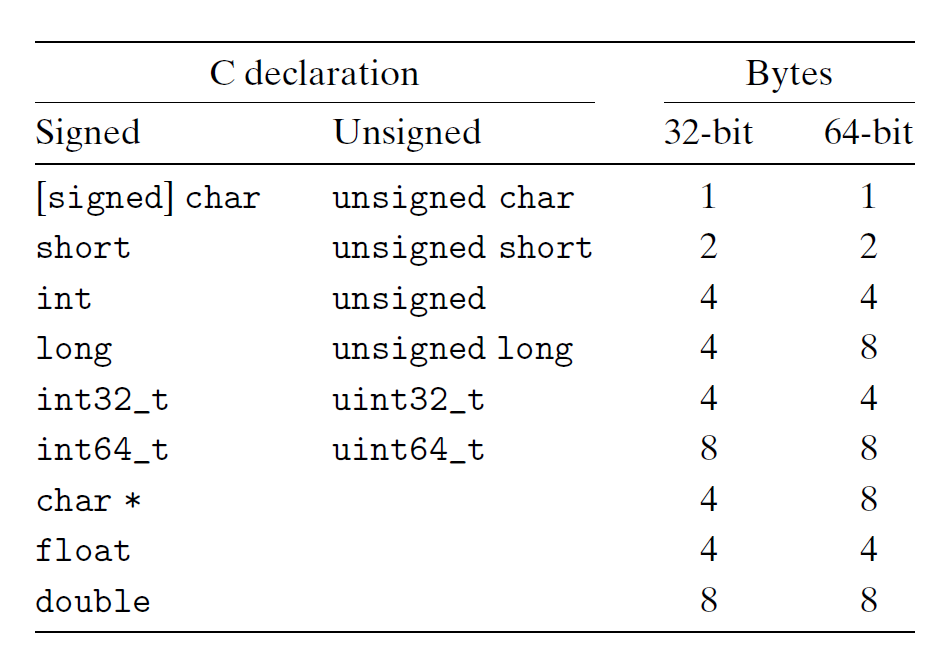
</div>

虽然大多数类型在 32 位或 64 位机器上所代表的字节数是一样的，但还是有部分数据类型的大小随机器字长而发生变化，比如 `long` 和 `char *`（以及所有的指针类型）等，因为 C 标准只为类型划定下界（即最少能表示多少字节），并未确定上界。为了避免数据类型对机器的依赖，以提高程序的可移植性(portability)，ISO C99 引入了一类定长的数据类型，比如 `int32_t`、`int64_t` 等，分别表示 4 字节和 8 字节。

绝大多数数据类型默认编码为符号类型，仅 `char` 除外。虽然大多数编译器会视 `char` 为符号类型，但如有必要，还是建议显式声明 `signed char`，毕竟没有百分百的保证。


### Addressing and Byte Ordering

对于由多个字节构成的程序对象，我们需要确定两件事：对象的地址是什么，即如何寻址；以及其字节在内存中的排列顺序。

- **寻址**(addressing)：多字节对象是一个连续的字节序列，它的地址即为对象内字节的最小地址（即首字节地址）
- **字节顺序**(byte ordering)：分为小端序和大端序
    - **小端序**(little endian)：低位字节在低地址上，高位字节在高地址上。大多数与 Intel 兼容的机器、Android 和 IOS 这两个操作系统采用小端序
    - **大端序**(big endian)：低位字节在高地址上，高位字节在低地址上。大多数来自 IBM 和 Oracle 的机器采用大端序

    <div style="text-align: center">
        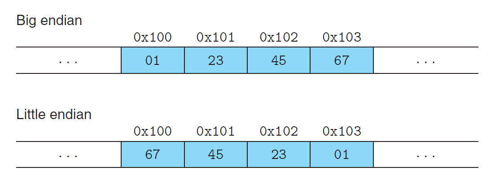
    </div>

    - ARM 微处理器同时支持小端序和大端序
    - 对于大多数的应用程序员而言，机器内的字节顺序是“隐形的”。但有时字节顺序将会带来问题（主要来自系统级编程）：
        - 通过网络在不同的机器上进行数据通信：如果一个机器是大端序的，另一个机器是小端序的，且不对数据做任何处理，那么这两台机器因按不同顺序解读字节，从而带来问题。因此，网络应用会按网络标准对数据做一步中间转换，然后再将数据发送给其他机器或者接收数据
        - 查看表示整数数据的字节序列：假如我们通过**反汇编器**(disassmbler)将可执行文件的机器码转化为 x86-64 汇编指令：

            ```
            4004d3: 01 05 43 0b 20 00        add    %eax, 0x200b43(%rip)
            ```

            这条指令对应的机器码的后四个字节 `43 0b 20 00` 对应指令中的 `0x200b43`，而这台机器用小端序表示字节顺序，因此那四个字节为 `00 20 0b 43`，这样就与指令上的数字对应上了

        - 不用正常的类型系统编写程序：比如在 C 语言中使用 `typedef` 为类型定义别名

    - 下面给出用于检查机器大小端序的 C 语言程序，可以在自己的机器上跑跑看：

        ??? code "代码实现"

            ```c title="show-bytes.c"
            #include <stdio.h>

            typedef unsigned char *byte_pointer;

            void show_bytes(byte_pointer start, size_t len) {
                size_t i;
                for (i = 0; i < len; i++)
                    printf(" %.2x", start[i]);
                printf("\n");
            }

            void show_int(int x) {
                show_bytes((byte_pointer) &x, sizeof(int));
            }

            void show_float(float x) {
                show_bytes((byte_pointer) &x, sizeof(float));
            }

            void show_pointer(void *x) {
                show_bytes((byte_pointer) &x, sizeof(void *));
            }

            void test_show_bytes(int val) {
                int ival = val;
                float fval = (float) ival;
                int *pval = &ival;
                show_int(ival);
                show_float(fval);
                show_pointer(pval);
            }

            int main() {
                test_show_bytes(12345);
                return 0;
            }
            ```

            运行结果（Windows 11 64位机器上）：

            ```sh
            $ .\show-bytes
             39 30 00 00
             00 e4 40 46
             1c fe 3f 03 46 00 00 00
            ```


### Code Representation

不同的机器类型采用不同且不兼容的指令和编码。即使是相同的处理器，在不同的操作系统上也会有不同的编码习惯，因此在二进制层面上是不兼容的。总而言之，二进制代码很少能够在不同的机器和操作系统之间兼容。


### Boolean Algebra

具体内容可见我的[数逻笔记 Chap 2](../dld/2.md)和[离散数学笔记 Chap 1](../../math/dm/1.md)对应部分，这里只讲一些这些笔记里可能没有涉及到的知识或者一些细节问题。

- 掩码(mask)：一种由从一个字内挑选出来的一组位构成的位模式
    - 如果掩码为 `0xFF`，配合 `&` 运算可以获取数据中最低位的字节
    - 如果掩码为 `~0`，配合 `&` 与运算可以获取数据中的所有字节
- 虽然逻辑运算也有类似按位运算的与、或等操作，但它的一大不同之处在于“短路”运算——如果逻辑表达式的结果能通过前面的参数判断出来，那么就无需判断甚至计算后面的参数了
- 按位右移分为逻辑(logical)右移和算术(arithmetic)右移，分别对应无符号数和符号数，并分别采用零扩展和符号扩展的方式在左边填充
- 如果分不清各种运算符的优先级，那就狠狠地加括号吧


## Integer Representations

下面列出与整数数据和算术运算相关的术语，便于参考，之后的章节就默认读者已经认识这些术语。

<div style="text-align: center">
    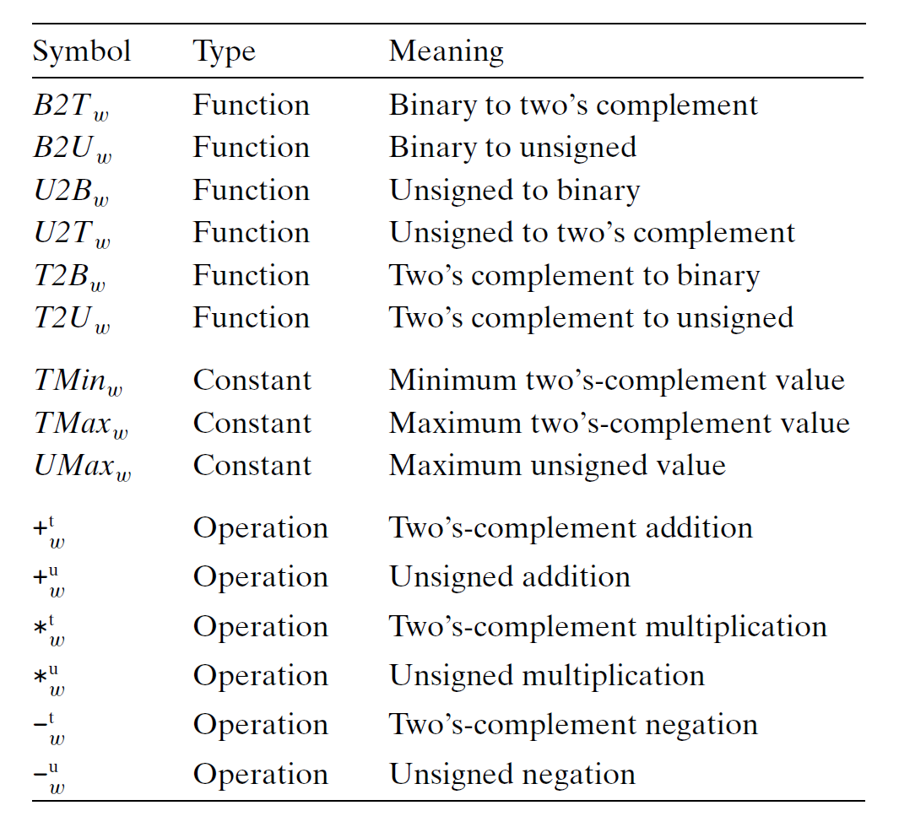
</div>


### Integral Data Types

下表展示了 C 语言支持的所有整数类型以及相应的取值范围(typical range)。可以看到取值范围都是“不对称的”——负数个数多于正数。

<div style="text-align: center">
    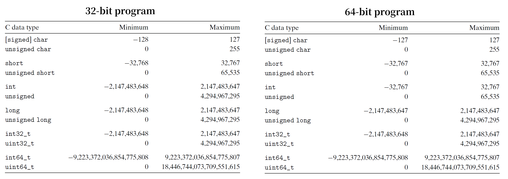
</div>

但实际上，C 标准要求的范围(guaranteed range)则如下所示：

<div style="text-align: center">
    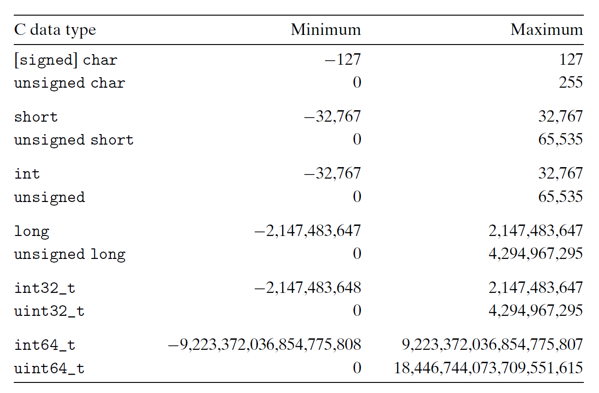
</div>

除了定长的数据类型外，其余数据类型的范围变得更小，但是做到了“对称”。


### Unsigned Encodings

!!! note "无符号数编码的定义"

    对于位向量 $\vec{x} = [x_{w-1}, x_{w-2}, \dots, x_0]$，对应的二进制 -> 无符号数的函数为：

    $$
    B2U_w(\vec{x}) \doteq \sum\limits_{i=0}^{w-1}x_i 2^i
    $$

对于 $w$ 位二进制数，最大的无符号数 $UMax_w \doteq 2^w - 1$，对应的位向量为 $[11 \dots 1]$。因此函数 $B2U_w$ 可写作映射：

$$
B2U_w: \{0, 1\}^w \rightarrow \{0, \dots, UMax_w\}
$$

!!! note "无符号数编码的唯一性(uniqueness)"

    函数 $B2U_w$ 是一个**双射**(bijection)。

因此，$B2U_w$ 有一个反函数 $U2B_w$，可以将一个范围在$0 \sim 2^w - 1$内的无符号数映射到唯一的一个 $w$ 位位向量上。


### Two's Complement Encodings

对于符号数，计算机中最常用的编码是**补码**(two's complement)，用最高位表示**符号位**(sign bit)。

!!! note "补码编码的定义"

    对于位向量 $\vec{x} = [x_{w-1}, x_{w-2}, \dots, x_0]$，对应的二进制 -> 补码的函数为：

    $$
    B2T_w(\vec{x}) \doteq -x_{w-1} 2^{w-1} + \sum\limits_{i=0}^{w-2}x_i 2^i
    $$

- 最小的可表示值 $TMin_w \doteq -2^{w-1}$，对应位向量 $[10 \dots 0]$
- 最大的可表示值 $TMax_w \doteq 2^{w-1} - 1$，对应位向量 $[01 \dots 1]$

因此函数 $B2T_w$ 可写作映射：

$$
B2T_w: \{0, 1\}^w \rightarrow \{TMin_w, \dots, TMax_w\}
$$


!!! note "补码编码的唯一性"

    函数 $B2T_w$ 是一个**双射**(bijection)。


### Signed vs. Unsigned

现在将具体值（都是2的幂）代入 $w$，获得 $UMax, TMin, TMax$ 等值，结果如下所示：

<div style="text-align: center">
    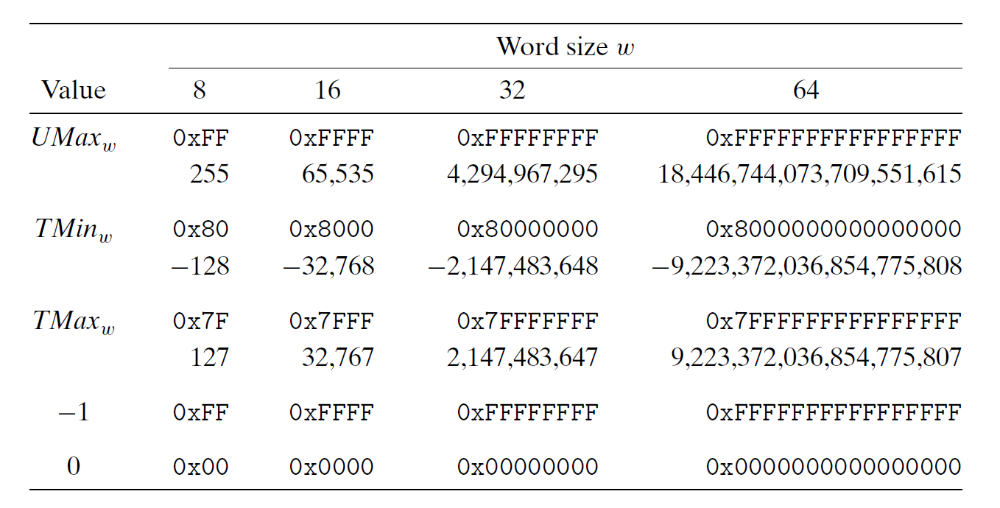
</div>

通过观察发现：

- $|TMin| = |TMax| + 1$
- $UMax = 2TMax + 1$
- -1 的补码形式的二进制表示与 $UMax$ 的二进制表示一致
- 在任何编码形式下，0的二进制形式都是全0的字符串


#### Conversions

**相同位数**的无符号数与符号数之间的转换都遵循一个规则：<u>数值可能会变，但位表示肯定不变</u>。我们用以下函数表示这种转换：

- 补码 -> 无符号数：$T2U_w(x) \doteq B2U_w(T2B_w(x))$
- 无符号数 -> 补码：$U2T_w(x) \doteq B2T_w(U2B_w(x))$

!!! note "补码 -> 无符号数"

    对于 $x \in [TMin_w, TMax_w]$，有：

    $$
    T2U_w(x) = \begin{cases}x + 2^w, & x < 0 \\ x, & x \ge 0\end{cases}
    $$

    成立

    <div style="text-align: center">
        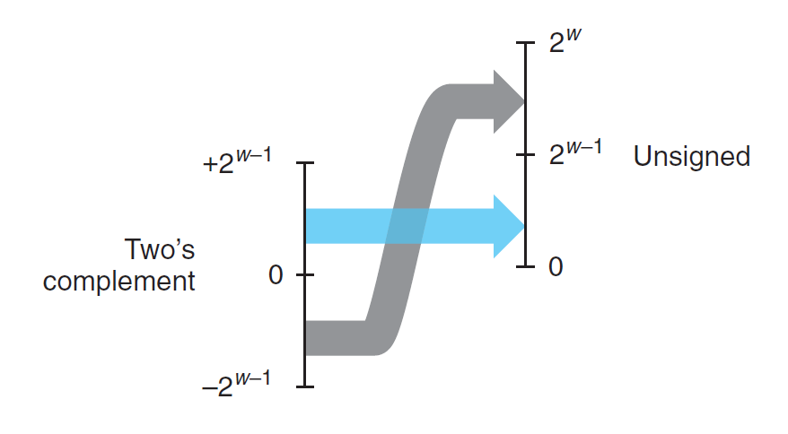
    </div>

!!! note "无符号数 -> 补码"

    对于 $u \in [0, UMax_w]$，有：

    $$
    U2T_w(x) = \begin{cases}u, & u \le TMax_w \\ u - 2^w, & u \ge TMax_w\end{cases}
    $$

    成立

    <div style="text-align: center">
        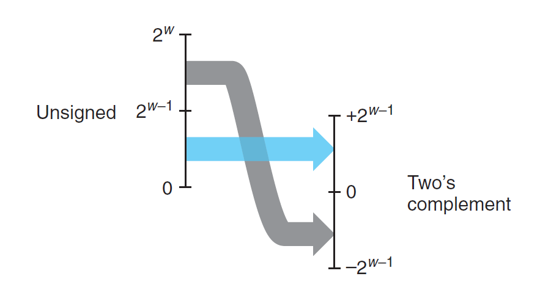
    </div>


#### Signed and Unsigned in C

前面提到过，C 语言的大多数数字默认为符号数。如果想要声明无符号数，有以下几种方法：

- 显式：
    - 无符号数常量：以 `U` 或 `u` 为后缀
    - 强制类型转换：使用 `(unsigned) var`，令 `var` 为无符号数
- 隐式：
    - 将数字赋值给无符号数
    - 格式化输出时使用 `%u` 说明符
    - 如果是符号数与无符号数之间的运算，那么符号数就会被隐式转化为无符号数

鉴于以上 C 语言规则，下面给出一些数字的比较结果，其中一些结果会出乎读者的意料（用 * 表示，但都可以用隐式转换的第三条规则解释）：

<div style="text-align: center">
    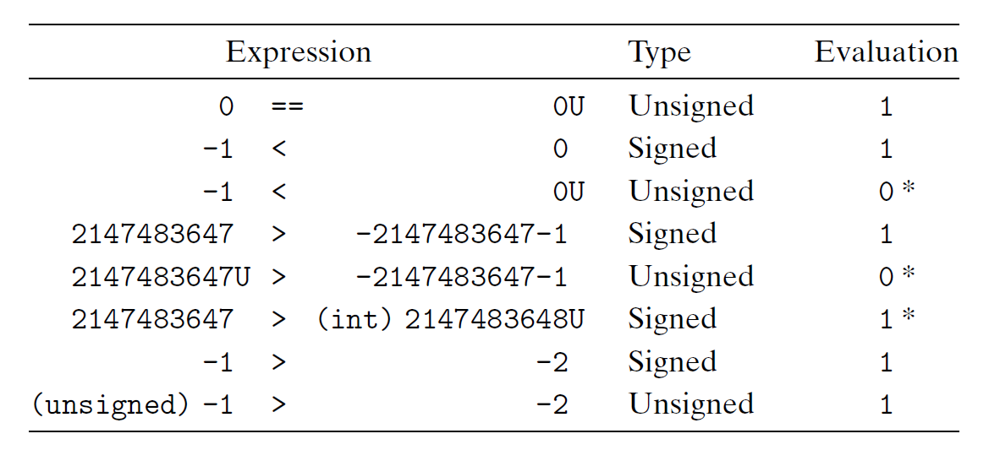
</div>

!!! recommend "一些建议"

    - 永远也不要使用无符号类型，避免因隐式的类型转换而产生的 bug，而且很多时候无符号数并不重要（事实上，只有少数语言具备无符号类型）
    - 但是对于系统编程（内存地址）和数学计算（模运算、多精度运算等）而言，无符号数又是很有用的
    - 总之，在整数运算中，确保所有的操作数都是无符号数或者符号数


### Numbers Expansion and Truncation

整数之间除了有符号数与无符号数之间的转换外，还有不同位长的整数之间的转换，包括**扩展**(expansion)和**截断**(trunctation)两类操作。

!!! info "注"

    在 C 语言中，通过强制类型转换来同时改变整数类型的大小（位宽）和类型（符号数/无符号数）时，会先改变大小，再改变类型。比如 `short` -> `unsigned`，等价操作为 `(unsigned) (int) short`。


#### Expansion

!!! note "无符号数的**零扩展**(zero expansion)"

    定义位宽为$w$的位向量 $\vec{u} = [u_{w-1}, u_{w-2}, \dots, u_0]$，以及位宽为$w'$的位向量 $\vec{u'} = [0, \dots, 0, u_{w-1}, u_{w-2}, \dots, u_0]$，其中 $w' > w$，那么 $B2U_w(\vec{u}) = B2U_{w'}(\vec{u'})$。


!!! note "补码的**符号扩展**(sign expansion)"

    定义位宽为$w$的位向量 $\vec{x} = [\underbrace{x_{w-1}}, x_{w-2}, \dots, x_0]$，以及位宽为$w'$的位向量 $\vec{x'} = [\underbrace{x_{w-1}, \dots, x_{w-1}, x_{w-1}}, x_{w-2}, \dots, x_0]$，其中 $w' > w$，那么 $B2T_w(\vec{x}) = B2T_{w'}(\vec{x'})$。


#### Trunctation

!!! note "无符号数的截断"

    定义位宽为$w$的位向量 $\vec{x} = [x_{w-1}, x_{w-2}, \dots, x_0]$，并令位向量 $\vec{x'} = [x_{k-1}, x_{k-2}, \dots, x_0]$ 为 $\vec{x}$ 截断至 $k$ 位的结果。令 $x = B2U_w(\vec{x}), x' = B2U_w(\vec{x'})$，那么 $x' = x \text{ mod } 2^k$。


!!! note "补码的截断"

    定义位宽为$w$的位向量 $\vec{x} = [x_{w-1}, x_{w-2}, \dots, x_0]$，并令位向量 $\vec{x'} = [x_{k-1}, x_{k-2}, \dots, x_0]$ 为 $\vec{x}$ 截断至 $k$ 位的结果。令 $x = B2U_w(\vec{x}), x' = B2T_w(\vec{x'})$，那么 $x' = U2T_k(x \text{ mod } 2^k)$。


## Integer Arithmetic

### Unsigned Arithmetic

对于 $w$ 位的无符号数加法，其结果有可能超过 $w$ 位，达到 $w + 1$ 位，这种情况称为**溢出**(overflow)。

!!! note "无符号数加法 $+_w^u$"

    对于$x, y \in [0, 2^w)$，有：

    $$
    x +_w^u y = \begin{cases}x + y, & x + y < 2^w \quad \text{Normal} \\ x + y - 2^w, & 2^w \le x + y < 2^{w+1} \quad \text{Overflow}\end{cases}
    $$

    成立

    <div style="text-align: center">
        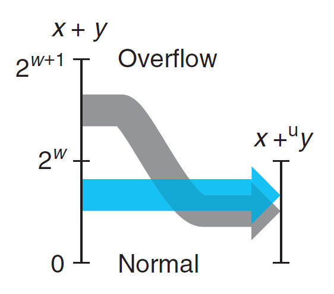
    </div>

C 程序在执行过程中不会因为溢出而报错，但有时我们希望能够发现溢出的情况，这时可以根据下面的原理来判断。

!!! note "检测无符号数加法的溢出"

    对于 $x, y \in [0, UMax_w]$，令 $s \doteq x +_w^u y$，那么当且仅当 $s < x$ 或 $s < y$ 时，计算 $s$ 时溢出。

可以看到，无符号数加法本质上是模除加法(modular addition)，这种运算构成了一种称为**阿贝尔群**(abelian group)的数学结构，该结构具备以下特征：

- 满足交换律(commutative)和结合律(associative)
- 有单位元素0
- 每个元素都有一个**加法逆元**(additive inverse)，即对于任何值$x$，都有某个值 $-_w^u x$，使得 $-_w^u x +_w^u x = 0$。加法逆元运算可按以下原理描述：

!!! note "无符号数求反(negation)"

    对任意数 $x \in [0, 2^w)$，它的 $w$ 位无符号数逆元 $-_w^u x$ 为：

    $$
    -_w^u x = \begin{cases}x, & x = 0 \\ 2^w - x, & x > 0\end{cases}
    $$


### Two's Complement Arithmetic

!!! note "补码加法 $+_w^t$"

    对于$x, y \in [-2^{w-1}, 2^{w-1} - 1]$，有：

    $$
    \begin{align}
    x +_w^t y & = \begin{cases}x + y - 2^w, & 2^{w-1} < x + y \quad \text{Positive overflow} \\ x + y, & -2^{w-1} \le x + y < 2^{w-1} \quad \text{Normal} \\ x + y + 2^w, & x + y < -2^{w-1} \quad \text{Negative overflow}\end{cases} \notag \\
    & = U2T_w(T2U_w(x) +_w^u T2U_w(y)) \notag \\
    & = U2T_w[(x + y) \text{ mod } 2^w] \notag
    \end{align}
    $$

    成立

    <div style="text-align: center">
        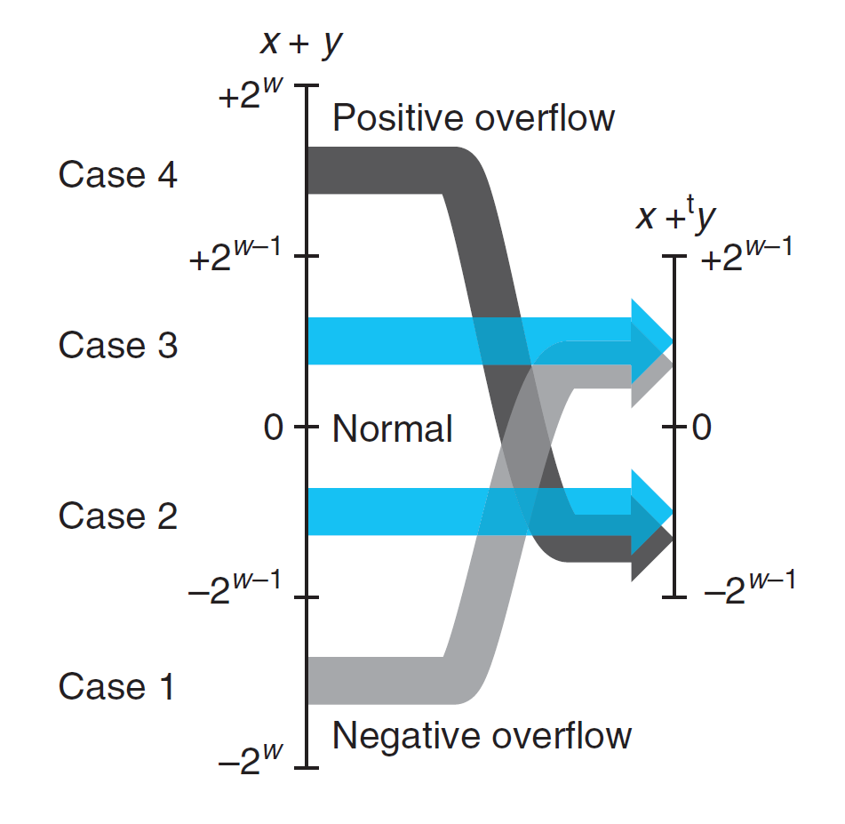
    </div>

可以看到，补码加法的溢出分为两类：

- **正溢出**(positive overflow)：$x + y > TMax_w$
- **负溢出**(negative overflow)：$x + y < TMin_w$

!!! note "检测补码加法的溢出"

    对于 $x, y \in [TMin_w, TMax_w]$，令 $s \doteq x +_w^t y$，那么
    
    - 当且仅当 $x > 0, y > 0$ 但 $s \le 0$ 时，计算 $s$ 时正溢出；
    - 当且仅当 $x < 0, y < 0$ 但 $s \ge 0$ 时，计算 $s$ 时负溢出。

!!! note "补码求反(negation)"

    对任意数 $x \in [TMin_w, TMax_w]$，它的 $w$ 位补码逆元 $-_w^t x$ 为：

    $$
    -_w^u x = \begin{cases}TMin_w, & x = TMin_w \\ - x, & x > TMin_w\end{cases}
    $$


### Multiplication

!!! note "无符号数乘法 $*_w^u$"

    对于 $x, y \in [0, UMax_w]$，有：

    $$
    x *_w^u y = (x \cdot y) \text{ mod } 2^w
    $$

    成立

!!! note "补码乘法 $*_w^t$"

    对于 $x, y \in [TMin_w, TMax_w]$，有：

    $$
    x *_w^t y = U2T_w((x \cdot y) \text{ mod } 2^w)
    $$

    成立

!!! note "无符号数和补码乘法的位级等价性"

    令 $\vec{x}, \vec{y}$ 为 $w$ 位的位向量。定义整数 $x, y$ 为这些位向量的补码形式：$x = B2T_w(\vec{x}), y = B2T_w(\vec{y})$。定义非负数 $x', y'$ 为这些位向量的补码形式：$x' = B2U_w(\vec{x}), y' = B2U_w(\vec{y})$。那么：

    $$
    T2B_w(x *_w^t y) = U2B(x' *_w^u y')
    $$

---
在计算机中，乘法运算是一种计算速度很慢的运算，因此编译器会将常数乘法替换为移位和加法运算的组合来实现优化。先介绍最简单的“乘以2的幂”的情况：

!!! note "乘以2的幂"

    令 $x$ 为无符号整数，它的二进制表示为 $[x_{w-1}, x_{w-2}, \dots, x_0]$。那么对于任意 $k \ge 0$，无符号数 $x \cdot 2^k$ 的 $w + k$ 位的二进制表示为 $[x_{w-1}, x_{w-2}, \dots, \underbrace{0, \dots, 0}_{k \text{ zeros}}]$。

!!! note "与2的幂相乘的无符号数乘法"

    C 变量 `x`, `k` 分别表示无符号数 $x, k$，满足 $0 \le k < w$，那么 C 表达式 `x << k` 产生值 $x *_w^u 2^k$。

!!! note "与2的幂相乘的补码乘法"

    C 变量 `x`, `k` 分别表示补码 $x$ 和无符号数 $k$，满足 $0 \le k < w$，那么 C 表达式 `x << k` 产生值 $x *_w^t 2^k$。

现在要做对任意常数 $K$ 的乘法，即计算 $x * K$。假如 $K$ 的二进制表示为：

$$
[(0 \dots 0)\ (1 \dots 1)\ (0 \dots 0) \dots (1 \dots 1)]
$$

考虑二进制表示中某一串连续的1，从第$n$位到第$m$位（$n \ge m$），那么我们可以通过以下方法计算 $x * K$：

- 法1：`(x << n) + (x << (n - 1)) + ... + (x << m)`
- 法2：`(x << (n + 1)) - (x << m)`

具体采取哪种方法取决于机器。


### Division

在计算机中，除法运算比乘法更慢，而且无法精确地除以任何常数$K$，但是可以右移位运算来实现除以2的运算。

!!! note "除以2的幂的无符号数除法"

    C 变量 `x`, `k` 分别表示无符号数 $x, k$，满足 $0 \le k < w$，那么 C 表达式 `x >> k` 产生值 $\lfloor x / 2^k \rfloor$。

    >这里的右移位是**逻辑移位**，左边用0填充

!!! note "除以2的幂的补码除法，向下舍入"

    C 变量 `x`, `k` 分别表示补码 $x$ 和无符号数 $k$，满足 $0 \le k < w$，那么 C 表达式 `x >> k` 产生值 $\lfloor x / 2^k \rfloor$。

    >这里的右移位是**算术移位**，左边用符号位填充

然而，对于负数而言，上述的补码除法采用的舍入(round)是不正确的，因此需要按以下方法纠正：

!!! note "除以2的幂的补码除法，向上舍入"

    C 变量 `x`, `k` 分别表示补码 $x$ 和无符号数 $k$，满足 $0 \le k < w$，那么 C 表达式 `(x + (1 << k) - 1) >> k` 产生值 $\lceil x / 2^k \rceil$。

总结一下：由于 C 语言没有算术右移，因此需要自己编写合适的表达式：`#!c (x < 0 ? x + (1 << k) - 1 : x) >> k`


## Floating Point

本节的大多数内容已经在我的[计组笔记 Chap 2](../co/3.md#floating-point-numbers) 中介绍过了，这里就主要讲一些那份笔记里涉及较少或根本没涉及的内容。


### IEEE Floating-Point Representation

IEEE 754 标准规定了浮点数 $V = (-1)^S \times M \times 2^E$ 的表示法，分为单精度和双精度，具体格式如下所示： 

<div style="text-align: center">
    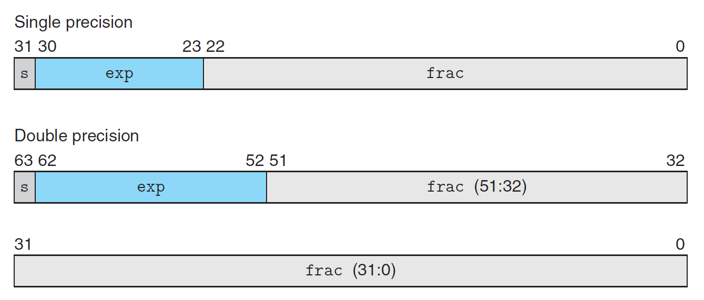
</div>

根据指数位的不同，浮点数值的表示可以分为以下3种情况：

<div style="text-align: center">
    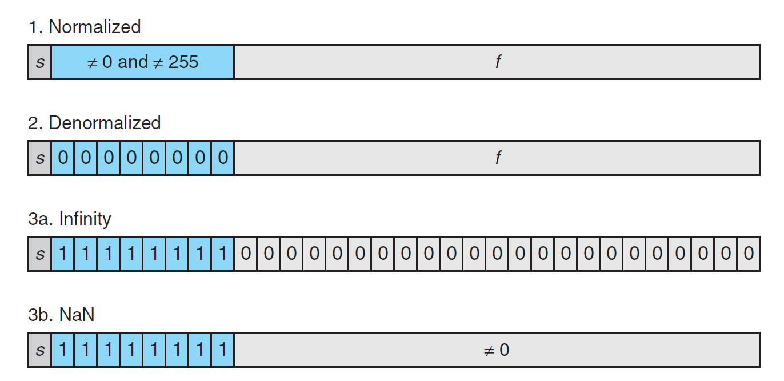
</div>

- **规范化(normalized)值**：这是最常见的情况——当指数位不是全0或全1时即为规范化值。
    - 指数值 $E = e - Bias$，其中 $e$ 为 $e_{k-1} \dots e_1 e_0$ 的无符号数表示，$Bias$ 为偏移值 $2^{k-1} - 1$（单精度为 127，双精度为 1023），因此对于单精度，$E \in [-126, +127]$；对于双精度，$E \in [-1022. 1023]$
    - 尾数值 $f \in [0, 1)$，对应的二进制表示为 $0.f_{n-1} \dots f_1 f_0$。而有效值 $M = 1 + f \in[1, 2)$，因此在二进制表示法中，小数点前的1被隐藏起来了，这称为 "**implied leading 1**"
- **非规范化(denormalized)值**：当指数位全为0时，表示的数为非规范化值
    - 指数值 $E = 1 - Bias$；有效值 $M = f$，即没有用到 "implied leading 1"
    - 非规范化值的作用：
        - 提供了能够表示 0 的方法：因为规范化形式下，$M \ge 1$，因而无法表示 0。实际上，当二进制位全为0时，表示的就是 +0.0；而当符号位为1，其余位为0时，表示的是 -0.0。有时这两种"0"表示的含义不同
        - 用于表示非常接近 0.0 的数字，这样的性质称为**逐渐下溢**(gradual underflow)
- **特殊值**：当指数位全为1时
    - 无穷：当尾数位全为0时，符号位 $s = 0/1$ 对应 $+\infty/-\infty$，用于表示溢出（比如两个非常大的数相乘，或除以0等）
    - NaN(not a number)：当小数位不全为0时，用于表示无法用实数或无穷表示的数（比如复数、无穷相关的计算等），或者表示未初始化的数据

下面来观察一下非负浮点数的一些特殊值：

<div style="text-align: center">
    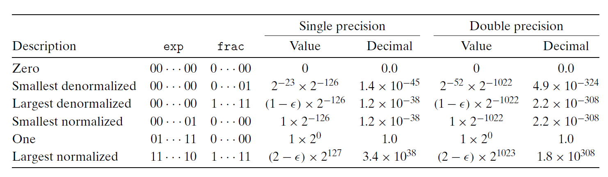
</div>

- 最小的正非规范化值 $V = 2^{-n-2^k-1} + 2$
- 最大的非规范化值 $V = (1 - 2^{-n}) \times 2^{-2^{k-1}+2}$
- 最小的正规范化值 $V = 2^{-2^{k-1}+2}$
- 最大的规范化值 $V = (1 - 2^{-n-1}) \times 2^{2^{k-1}}$


### Rounding

受限于二进制表示的范围和精度，浮点数只能近似表示实数。但对于一个实数值 $x$，我们希望找到一个最接近 $x$，且能以浮点数形式表示的值 $x'$，这样的操作称为**舍入**(rounding)。IEEE 浮点数格式定义了以下四种不同的**舍入模式**(rounding modes)：

- **舍入到偶数**(round-to-even/round-to-nearest)：默认的舍入模式。会尝试舍入到最近的数，如果向上或向下舍入误差相等，那么会舍入到最近的偶数
    - 如果只是向上或向下舍入，那么对于大量的数据，它们的平均值会逐渐偏离真实的平均值（过大或过小），而舍入到偶数的策略能尽可能避免舍入的统计偏差
- **舍入到零**(round-toward-zero)：对于正数向下舍入，对于负数向上舍入（使得近似值尽可能接近0），也就是说舍入得到的值 $\hat{x}$ 满足 $|\hat{x}| \le |x|$
- **向下舍入**(round-down)：舍入得到的值 $x^-$ 满足 $x^- \le x$
- **向上舍入**(round-up)：舍入得到的值 $x^+$ 满足 $x \le x^+$

???+ example "例子"

    <div style="text-align: center">
        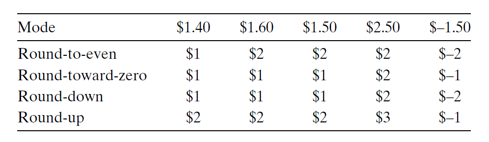
    </div>


### Operations

- 对于任意的实数值运算 $\odot$，在浮点数 $x, y$ 上的运算结果可以表示为 $Round(x \odot y)$
- 如果表达式中有参数为特殊值（比如 $-0, \infty, NaN$ 等），IEEE 标准将尝试让结果变得合理（比如 $1 /\mathord{+}0 = +\infty, 1 /\mathord{-}0 = -\infty$
- 浮点数加法：$x +^f y = Round(x + y)$
    - 运算满足交换律，但不满足结合律（因为精度和运算顺序的不同会影响计算结果）
        - 有些编译器可能在优化代码的过程中改变计算顺序，这样可能导致浮点数运算的结果与预期不一致，需要注意一下
    - 大多数值都有逆元，即 $x +^f \mathord{-}x = 0$，除了无穷和$NaN$（对于任意 $x$，$NaN +^f x = NaN$）
    - 运算满足单调性(monotonicity)，即对于任意浮点数值$a, b, x$（除了$NaN$），若 $a \ge b$，则 $x +^f a \ge x +^f b$（这一点无符号数加法和补码加法均不满足）
- 浮点数乘法：$x *^f y = Round(x \times y)$
    - 运算满足交换律，但不满足结合律（理由同上），也不满足分配律
    - 有乘法单位(identity) 1.0
    - 运算满足单调性，即对于任意浮点数值$a, b, c$（除了$NaN$），满足：$\begin{cases}a \ge b \quad \text{and} \quad c \ge 0 \Rightarrow a *^f c \ge b *^f c \\ a \ge b \quad \text{and} \quad c \le 0 \Rightarrow a *^f c \le b *^f c\end{cases}$
    - 当 $a \ne NaN$ 时，满足 $a *^f a \ge 0$


### Floating Point in C

- C 提供了 `float` 和 `double` 两类浮点数数据类型，对于支持 IEEE 754 标准的机器上，它们分别对应单精度和双精度浮点数
- 默认采用“舍入到偶数”的舍入模式
- 由于 C 标准并不要求机器必须遵循 IEEE 754 标准，因此没有改变舍入模式或得到特殊值（$-0, \infty, NaN$）的方法
    - 对于 GCC 编译器，用 `INFINITY` 表示 $+\infty$，用 `NAN` 表示 $NaN$

下面介绍 C 语言中同一个值在 `int`、`float`、`double` 类型之间转换的规则：

- `int` -> `float`：不会溢出，但可能有舍入
- `int`/`float` -> `double`：数值会被保留（因为范围和精度都变大了）
- `double` -> `float`：值可能会溢出（范围缩小），且可能有舍入（精度减小）
- `float`/`double` -> `int`：值会舍入到整数，且可能会溢出（此时得到的值称为**整数不确定**(integer indefinite)值）


## Asides

- C 语言的发展史
    - 标准：ANSI C -> ISO C90 -> ISO C99 -> ISO C11 -> ISO C18 -> ISO C23
    - GCC 编译器允许指定不同的标准进行编译：

    |C 版本|GCC 命令行选项|
    |:-|:-|
    |GNU 89|`-std=gnu89`|
    |ANSI, ISO C90|`-ansi`, `-std=c89`|
    |ISO C99|`-std=c99`|
    |ISO C11|`-std=c11`|

- C 语言中定长的整数类型由 `stdint.h` 标准库引入，提供了形如 `intN_t` 和 `uintN_t` 的类型，其中 `N` 表明位数，可取值有8, 16, 32, 64
    - 最小值和最大值则有宏定义 `INTN_MIN`、`INTN_MAX`、`UINTN_MAX`，它们均来自标准库 `limits.h`
    - 在格式化输出中，这些类型的说明符有 `PRId32`（表示 `int32_t`）、`PRIu64`（表示 `uint64_t`）等

- 无符号数的其他表示法
    - **反码**(one's complement)：$B2O_w(\vec{x}) \doteq -x_{w-1}(2^{w-1} - 1) + \sum\limits_{i=0}^{w-2} x_i 2^i$
    - **原码**(sign magnitude)：$B2S_w(\vec{x}) \doteq (-1)^{x_{w-1}} \cdot \Big(\sum\limits_{i=0}^{w-2} x_i 2^i\Big)$

    之所以不用这些表示法，有一个重要的原因在于它们能够同时表示 +0（[00...0]）和 -0（[11...1]）

- 补码求反的位级表示法：
    - 法1：按位取反 + 1
    - 法2：找到最右边的1，对这个1（不包括）左边的所有位取反