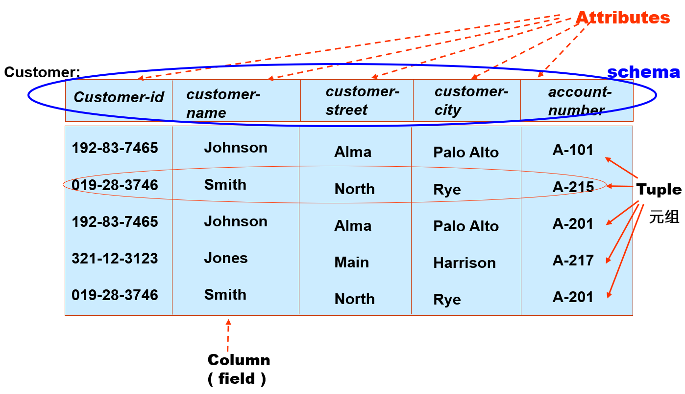
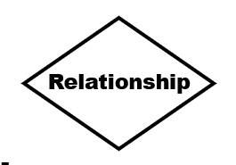
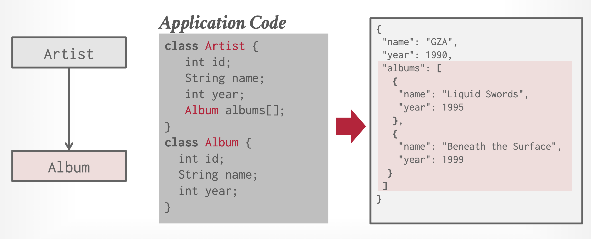
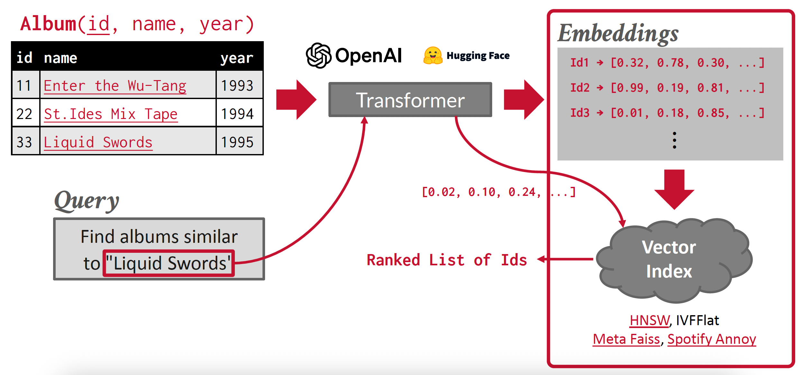
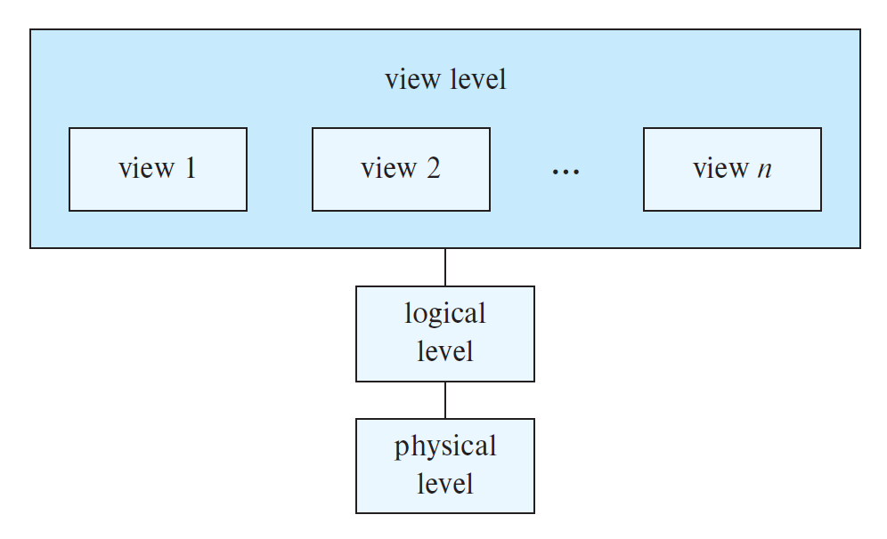
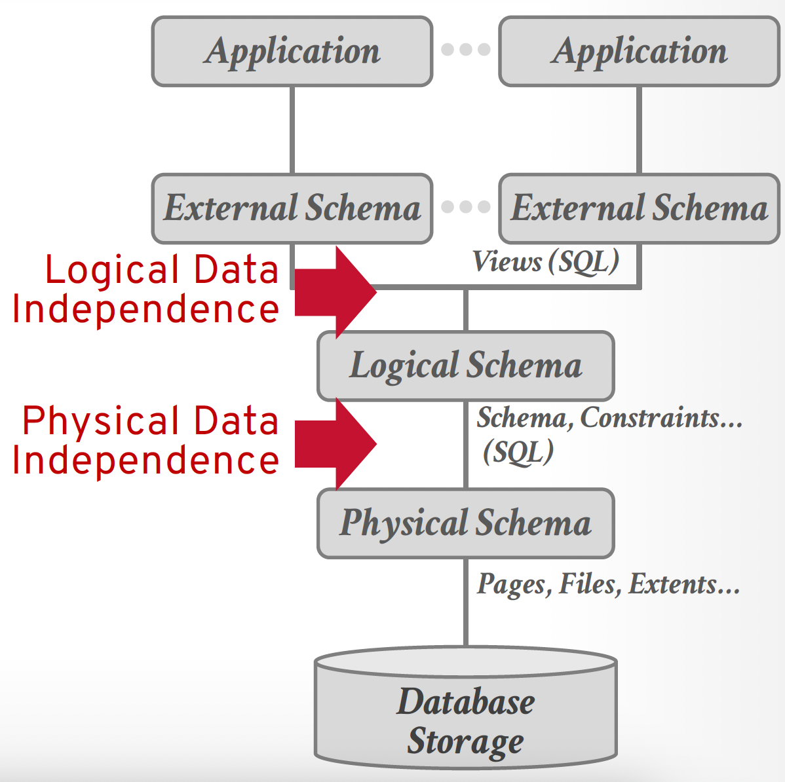
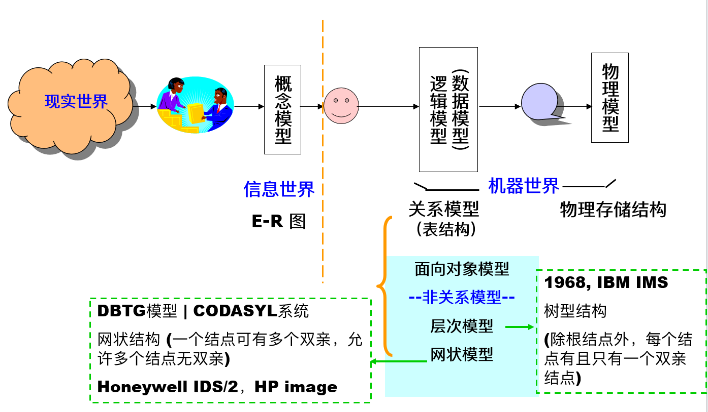
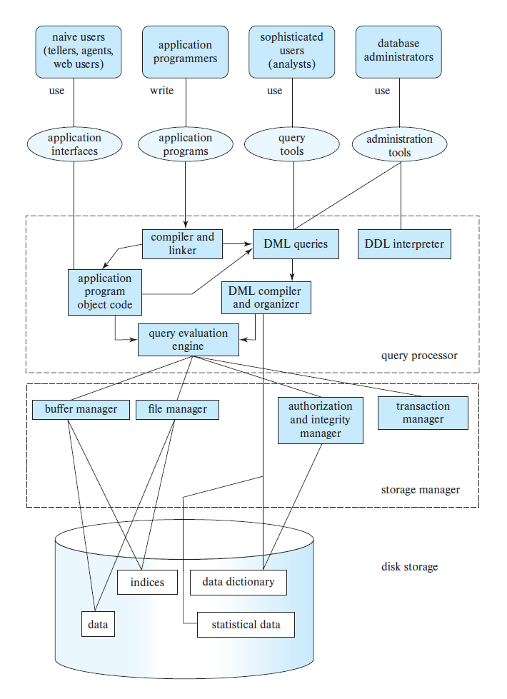

# Lec 1: Introduction

???+ abstract "（并非）核心知识"

    >感觉都是些很细碎，不太好提炼，且不太有可能成为关键考点的知识。建议过一眼熟悉一下就行。

**数据库**(database)：一个相互关联的，用于对现实世界问题建模的有组织的数据集合。

**数据库管理系统**(database management system, DBMS)：一种允许应用存储和分析数据库信息的软件。通用的 DBMS 根据某些数据模型，支持对数据库的定义、创建、查询、更新和管理。

>但我们平时经常把这两个概念给搞混淆了...

## Database-System Applications

对于数据库应用而言，其核心不是执行计算的程序，而是数据本身。

数据库系统用于管理具有以下特征的数据：

- 价值高
- （相对而言）体量很大
- 允许被多个用户和程序访问，且通常是同时的

**抽象**(abstraction)这一概念在数据库管理中（而且在其他领域也）非常重要，它能让我们在不了解设备或系统的底层细节的情况下，能够使用这些复杂的设备或系统。数据库系统提供了简洁、抽象的视图，使得用户和应用程序员无需注意关于数据存储和组织的底层细节。

尽管用户界面隐藏了访问数据库的细节，且很多人甚至没有注意到他们在与数据库打交道，但是访问数据库这件事已经成为我们日常生活的重要部分。

有以下两类数据库工作负载：

- **在线事务处理**(online transaction processing)：
    - 其特点是快速、短时运行的运算，重复的运算，以及一次只操作单一实体的简单查询。
    - 通常处理的写操作比读操作多，并且每次只读取/更新少量数据。
    - 例子——网上购物：用户可以将商品添加到购物车并完成购买，但这些操作仅影响他们的账户。

- **在线分析处理**(online analytics processing)：
    - 其特点是长时间运行、复杂的查询（通常涉及计算聚合）以及对数据库大部分内容的读取。
    - 数据库系统通常会分析和从 OLTP 端收集的现有数据中衍生出新数据。
    - 例子——个性化网上购物广告：在线购物网站会分析用户购物车和购买记录中的所有数据，然后为不同用户选择不同的广告展示。

## Purpose of Database System

数据库系统的使用目的，很大程度上是为了克服计算机操作系统自带的**文件处理系统**(file-processing system)的缺陷。文件处理系统用于存储位于各种文件（比如 CSV 文件）的永久记录，需要用不同的应用程序提取其中的记录，或向合适的文件添加记录，这为保持信息的组织性带来了一定阻碍，理由如下：

- **数据的冗余(redundancy)和不一致性(incosistency)**：
    - 不同的文件有不同的结构，程序可能用好几种编程语言编写
    - 相同的信息可能被复制在不同的地方
    - 冗余会带来更多的存储和访问成本
    - 数据不一致性：相同数据的不同拷贝不一致
- **访问数据的困难**：无法满足个性化的数据查询需求，如果要访问具有特定特征的数据，需要专门编写程序，或者手工从所有数据中筛选符合条件的数据，但这两种方法都无法令人满意
- **数据隔离(isolation)**：数据可能散落在不同的文件内，且文件可能具备不同的格式
- **完整性(integrity)问题**：存储在数据库的数据值必须满足特定类型的一致性限制，但是文件系统很难维护这样的限制
- **原子性(atomicity)问题**：
    - 当故障发生时，数据必须恢复到故障发生前的状态
- **并发访问异常(concurrent-access anomalies)**：
- **安全问题**：
    - 并不是所有用户都有权限访问数据库内的所有数据
    - 文件系统很难确保数据库的安全性约束

而数据库系统正能解决上述所有的问题，因此逐渐发展起来，现在被广泛使用。

## View of Data

### Data Models

**数据模型**(data model)：用于描述数据、数据关系、数据语义以及一致性限制的概念工具。有以下几类数据模型：

- **关系模型**(relational model)：一组用于表示数据和数据之间的关系的表格。
    - 每个表格都有多个列，每列都有唯一的名称
    - 表格又称为**关系**(relation)
    - 这是最为广泛使用的数据模型

    ??? example "例子"

        

            
        

- **实体-联系模型**(entity-relationship/E-R model)
    - 实体(entity)（对象）：用一些属性(attributes)来描述实体

        

            
        

    - 联系(relationship)：

        

            
        

    ??? example "例子"

        

            
        

- 其他：
    - 用于简单的应用/缓存：
        - 键值
    - 用于 [NoSQL](https://en.wikipedia.org/wiki/NoSQL) 中：
        - 图
        - 文档数据模型：一个记录文档的集合，包含了具名字段/值对(pair)的层级
            - 字段值可以是标量，也可以是数组，甚至可以是另外的文档
            - 现代实现普遍使用 JSON，一些旧的系统会用 XML 或自定义的对象表示
            - 这一模型通过将数据库和对象的紧密耦合，避免了“[关系-对象阻抗不匹配](https://en.wikipedia.org/wiki/Object%E2%80%93relational_impedance_mismatch)”的问题

            ??? example "例子"

                

                    
                

        - 宽列/列组
    - 用于机器学习/科学中：
        - 数组（向量/矩阵/张量）
        - 向量数据模型：一个一维数组，用于最近邻居查找（精确或近似）
            - 用于基于 Transformer 训练的模型（比如 ChatGPT）生成的嵌入体的语义搜索
            - 也用于现代 ML 工具和 API 的本地集成（比如 LangChain, OpenAI）

            ??? example "例子"

                

                    
                

    - 过时或很少用的：
        - 层级
        - 网状
        - 语义

数据模型的一大重要功能在于：不仅对于一般的数据库用户，甚至对于数据库应用的开发者也隐藏了底层的实现细节。

### Data Abstraction

开发者通过以下几层**数据抽象**(data abstraction)来简化用户与数据库系统的交互：

- **物理层**(physical level)：描述记录的存储方式（复杂的底层数据结构）
    - 将表格以记录序列的形式存储在文件中，不同的属性、不同的记录用特殊字符（比如用逗号和换行符）隔开
    - 使用索引以支持高效的记录检索
    - 此外还定义了用于高效访问数据的算法
- **逻辑层**(logical level)：描述存储于数据库内的数据内容，以及数据之间的联系
    - 位于逻辑层的用户（比如数据库管理员）无需关注物理层的复杂性，这称为**物理数据独立性**(physical data independence)
- **视图层**(view level)：最高层的抽象，位于该层的用户仅能访问部分数据库的内容
    - 该层的目的在于简化用户与系统的交互，并提供了多个视图
    - 此外还提供了安全机制，以阻止用户访问数据库的某些部分

    

---
**数据独立性**(data independence)：将用户或应用和低级的数据表示隔离开来。

- 用户只需关注高级应用逻辑即可
- DBMS 会根据操作环境、数据库内容和工作量来优化布局
- 如果上述因素发生改变的话，DBMS 会对数据库重新优化

    

### Instances and Schemas

- **实例**(instances)：在特定的时间内，存储在数据库中的一组信息。
- **模式**(schemas)：一种使用数据模型对特定数据集合的描述，这样就定义了数据模型下的数据结构。

模式和实例之间的关系类似编程语言中的变量声明和变量值。

数据库的模式可以分为以下几类：

- **物理模式**(physical schema)：描述在物理层上的数据库设计
- **逻辑模式**(logical schema)：描述在逻辑层上的数据库设计
    - 对于应用程序而言，该模式是最为重要的，因为程序员需要通过该模式来构建程序
    - 一般来说，逻辑模式更改的频率不高，但是对于新建的数据库应用而言，可能需要更加灵活的逻辑模式（比如单个关系内的不同记录可能有不同的属性）
- **子模式**(subschema)：描述数据库内的不同视图

## Database Languages

数据库语言的组成部分有：

- **数据定义语言**(data-definition language, DDL)：表格、索引、视图和其他对象的模式定义。
    - 该语言还要指明数据的存储结构、访问方法和一致性约束(consistency constraints)
    - 完整性约束包括：
        - **域约束**(domain constraints)：域的取值和它对应的属性类型相关
        - **参照完整性**(referential integrity)：出现在某个关系中的一组属性的值，也会出现在另一个关系的对应属性中
            - 对数据库的修改可能会破坏参照完整性
        - **授权**(authorization)：权限可以分为以下几类，不同用户获得的权限可以是这些权限的组合：
            - 读取(read)授权：只读，不可修改
            - 插入(insert)授权：可插入数据，但不可修改现有数据
            - 更新(update)授权：可以修改数据，但不可以删除数据
            - 删除(delete)授权：允许删除数据

    - 处理完 DDL 后得到的输出会存在一个称为**数据字典**(data dictionary)的特殊文件内（可看作特殊的表格，只允许数据库自身访问和更新里面的内容），里面包含了**元数据**(metadata)（即“数据的数据”），包括：数据库模式、数据存储结构、访问模式和约束、统计信息、授权(authorization)

- **数据操纵语言**(data-manipulation language, DML)：允许用户访问和操纵那些被合适的数据模型组织过的数据，包括检索、插入、删除、修改等操作，分为以下两类：
    - **过程型**(procedural) DMLs：用户指明所需数据以及获取数据的方法，比如 C、Pascal、Java 等语言
        - 对应的数学表示为[**关系代数**](2.md#relational-algebra)(relational algebra)
    - **声明型/非过程型**(declarative/nonprocedural) DMLs：用户只需指明数据，无需指出如何获取数据，相比过程性 DMLs 更易于使用，比如 SQL、Prolog 等语言
        - 对应的数学表示为**关系演算**(relational calculus)
- **数据控制语言**(data-control language, DCL)：用于安全、访问控制目的。

### SQL

- **查询**(query)：请求信息检索的语句。
- **查询语言**(query language)：DML 中包含信息检索的那部分
- **SQL**（structured query language，结构化查询语言）：使用最广泛的查询语言
    - SQL 提供了丰富的 DDL，允许定义带有各种数据类型和完整性约束的表格
    - SQL 是非过程的查询语言，查询将一张或多张表格作为输入，输出一张表格

### Database Access from Application Programs

像 SQL 这样的非过程型查询语言并不具备与通用图灵机一样强大的能力，因为它无法进行一般编程语言能够做到的计算，也不支持用户输入、输出显示和网络通信等行为。因此这样的计算和行为必须用**宿主语言**(host language)编写（比如 C/C++、Java、Python 等），并依靠**嵌入式的 SQL 查询**来访问数据库内的数据。**应用程序**(application program)就是通过这种方式来和数据库交互的程序。

一般来说，应用程序通过 API 来向数据库发送 DML 和 DDL 语句并检索数据。下面列出两种常见的 API：

- ODBC（open database connectivity, 开放数据库互连）：定义了 C 和其他语言的 API
- JDBC（Java database connectivity, Java 数据库互连）：定义了 Java 对应的接口

下面这张图片很好地概括了上述内容：

    

## Data Design

数据库设计步骤：

- **需求分析**(requirement analysis)：需要什么数据、应用和操作
- **概念设计**(conceptual design)：用 E-R 模型或类似的高级数据模型，以及一些算法来对数据进行高层级的描述
- **逻辑设计**(logical design)：将高层的概念模式映射到数据库系统所用到的数据模型的实现中
- **模式改善**(schema refinement)（规范化(normalization)）：检查关系模式中的冗余和关系异常
- **物理设计**(physical design)：索引(indexing)、聚类(clustering)和数据库调优(tuning)
- **创建和初始化数据库、安全设计**(create and initialize database & security design)
    - 加载初始数据并测试
    - 识别不同的用户组及其角色

    

## Data Engine

数据库的功能组件可以分为：

- **存储管理器**(storage manager)：为存储在数据库的底层数据、应用程序和提交到系统的查询之间提供接口
    - 需要与文件系统打交道，将各种 DML 语句翻译为底层的文件系统命令，并负责存储、检索和更新数据库内的数据
    - 组成部分：
        - **授权和完整性管理器**(authorization and integrity manager)
        - **事务管理器**(transaction manager)：维护一致性和并发事务执行
        - **文件管理器**(file manager)：管理硬盘存储空间分配
        - **缓冲区管理器**(buffer manager)：将数据从硬盘拿到主存中，并决定将哪些数据放在缓存中

    - 存储管理器实现了如下数据结构，作为物理系统的实现：
        - **数据文件**：存储数据库自身
        - **数据字典**：存储数据库结构的元数据，尤其是数据库的模式
        - **索引**：提供对数据项的快速访问

- **查询处理器**(query processor)：包括以下组成部分
    - **DDL 解释器**(interpreter)：解释 DDL 语句，并将定义记录在数据字典中
    - **DML 编译器**(compiler)：将用查询语言表述的 DML 语句翻译为由底层指令构成的评估计划(evaluation plan)，此外还支持**查询优化**（选择成本最低的评估计划）
    - **查询评估引擎**(query evaluation engine)：执行由 DML 编译器生成的底层指令

    

        
    

- **事务管理组件**(transaction management component)
    - **事务**(transaction)：用于在数据库应用中执行单个逻辑功能的一组操作
    - 事务的要求——**ACID**：**原子性**(atomicity)、**一致性**(consistency)、**隔离性**(isolation)、**持久性**(durability)
    - 事务管理组件的组成部分：
        - **恢复管理器**(recovery manager)：通过备份或恢复子系统，来确保数据库在系统或事务故障时，能够保持数据库的一致（正确）状态
        - **并发控制管理器**(concurrency-control manager)用于控制并发事务之间的互动

## Database and Application Architecture

??? note "数据库系统架构图"

    

        
    

- 上述架构适用于共享内存，并使用多个 CPU 并行处理的服务器架构
- 为了应对更大规模的数据，以及更高的处理速度，可以采用**并行数据库**(parallel database)或**分布式数据库**(distributed database)

下面考虑使用数据库作为后端的应用架构，可以分为：

- **两级架构**(two-tier architecture)：应用程序位于客户端机器内，通过查询语言语句调用位于服务器上的数据库系统
- **三级架构**(three-tier architecture)：
    - 客户端仅作为前端（浏览器或移动应用等），并不包含任何直接的数据库调用，与**应用服务器**通信
    - 应用服务器可以与数据库系统通信，以访问数据。应用的商业逻辑(business logic)也嵌在应用服务器上
    - 相比两级架构具备更好的安全性和性能

## Database Users and Administrators

不同的用户接口类型对应以下不同类型的用户：

- **普通(naive)用户**：通过预先定义的用户接口（比如 web 或移动应用）与数据库系统交互
- **应用程序员**：编写应用程序，通过多种工具开发用户接口
- **富有经验的用户**：并不通过编写程序与系统交互，而是使用数据库查询语言，或者使用数据分析软件等工具来构建请求
- **数据库管理员**(database administrator, DBA)：具备对数据库和程序的中央控制权的特殊用户。
    - DBA 具备该数据库的最高特权
    - DBA 需要协调好数据库系统的所有活动
    - DBA 控制数据库所有用户的权限(authority)
    - DBA 需要对企业信息资源和需求有较好的了解
    - DBA 的责任：
        - 模式、存储结构和访问方法的定义
        - 模式和物理组织的调整
        - 对数据访问的授权
        - 日常维护：监控性能、响应要求的改变、数据库的安全（周期性备份(backup)数据库、故障时恢复）、留够硬盘空间

## Supplements

??? info "DBMS 的历史进程"

    - 文件访问系统（1950s-1960s）
    - 网状(network)/层次(hierarchy) DBMS（1960s-1970s）
    - 关系型数据库系统(RDBMS)（1970s-）
    - 面向对象的数据库系统(OODBMS)
    - 面向关系的数据库系统(ORDBMS)
    - 面向应用的数据库系统：空间、时间、多媒体、网络(Web)数据库
    - 数据仓库(data warehousing)、联机分析处理(online analytical processing)、数据挖掘系统(data mining system)

??? info "数据库市场"

    - [国外数据库引擎排行](https://db-engines.com/en/ranking)
    - [国内数据库引擎排行](https://www.modb.pro/dbRank)
