# Lec 10: Indexing

<!-- head 元素一定要放在一级标题下面，不然标题就显示不出来了 -->
<head>
    <script src="https://cdnjs.cloudflare.com/ajax/libs/KaTeX/0.16.7/katex.min.js"
            integrity="sha512-EKW5YvKU3hpyyOcN6jQnAxO/L8gts+YdYV6Yymtl8pk9YlYFtqJgihORuRoBXK8/cOIlappdU6Ms8KdK6yBCgA=="
            crossorigin="anonymous" referrerpolicy="no-referrer">
    </script>
    <link rel="stylesheet" href="https://cdn.jsdelivr.net/npm/pseudocode@latest/build/pseudocode.min.css">
    <script src="https://cdn.jsdelivr.net/npm/pseudocode@latest/build/pseudocode.min.js">
    </script>
</head>

数据库系统中的**索引**(indices)在数据库的高效查询上起到十分关键的作用，否则的话每次查询都要读取涉及到的关系内的全部内容，这样就会产生过多的开销。我们会用到以下两类基本的索引：

- **顺序索引**(ordered indices)：基于排序后的值
- **哈希索引**(hash indices)：基于值在一些桶(buckets)里的均匀分布，值被分配到的桶是由哈希函数决定的

我们先回介绍顺序索引用到的一些技术，这些技术没有最好的，各自都有适用的地方。可以用以下指标来衡量这些方法：

- **访问类型**：包括寻找带有指定属性，或者指定属性值范围的记录
- **访问时间**：寻找单个或多个数据项所需的时间
- **插入时间**：包括寻找新数据插入的正确位置，以及更新索引结构所需的时间
- **删除时间**：包括寻找要被删除的数据项，以及更新索引结构所需的时间
- **空间开销**：索引结构占据的额外空间，假如该空间不大的话，那么值得用这点空间换取性能的提升

单个或多个用于查找文件内记录的属性被称为**搜索键**(search key)，每一个索引对应一个特定的搜索键。


## Ordered Indices

**顺序索引**(ordered indices)按排好的顺序存储搜索键的值，并和每个被记录包含的搜索键关联起来。而这些记录也有可能是按顺序排序的。如果是由搜索键定义文件内的顺序的话，那么称对应的索引为**聚集索引**(clustering index)或**一级索引**(primary index)，而对应的文件被称为**索引顺序文件**(index-sequential files)。通常，聚集索引的搜索键是一个主键（但也可能不是）。而对于搜索键顺序和文件内顺序不同的索引，我们称之为**非聚集索引**(nonclustering index)或**二级索引**(secondary index)。


### Dense and Sparse Indices

一个**索引项**(index entry)或**索引记录**(index record)是由搜索键值，以及指向具有和搜索键值相同值的一条或多条记录构成的。而这个指针包含了硬盘块的标识符，以及硬盘块内的偏移量，用于识别块内的具体记录。

顺序索引可分为以下两类：

- **稠密索引**(dense index)：对于文件内的每个搜索键值都有对应的索引项
    - 在稠密聚集索引里，索引记录包含了搜索键值和指向第一条带有该搜索键值的记录的指针，而其余具有相同搜索键值的记录就按顺序排在这第一条记录的后面
    - 在稠密非聚集索引里，索引必须将全部指向带有相同搜索键值的记录的指针存储在列表里

    <div style="text-align: center">
        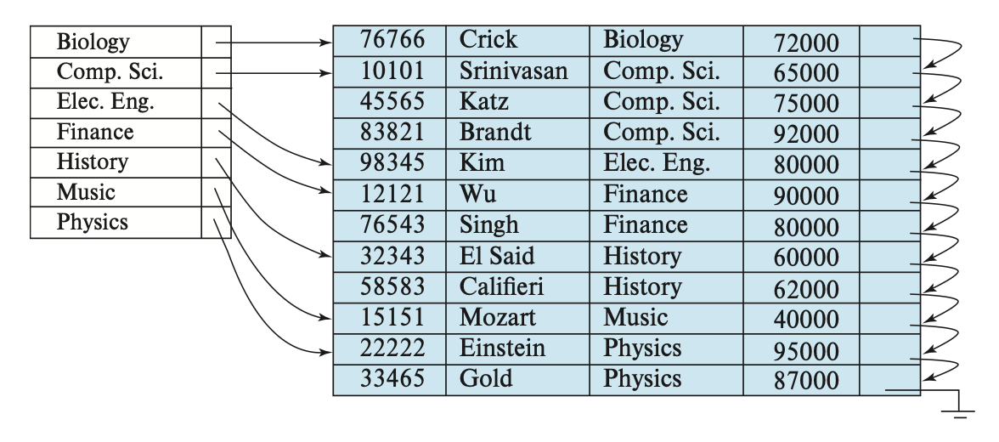
    </div>

- **稀疏索引**(sparse index)：文件内只有部分搜索键值有对应的索引项
    - 此时只允许聚集索引
    - 每个索引项包含了搜索键值和指向第一条带有该搜索键值的记录的指针
    - 为了找到记录，就要找到小于等于我们要找的搜索键值中最大的搜索键值对应的索引项。然后从这条记录出发，顺着指针在文件中寻找，直到找到想要的记录

    <div style="text-align: center">
        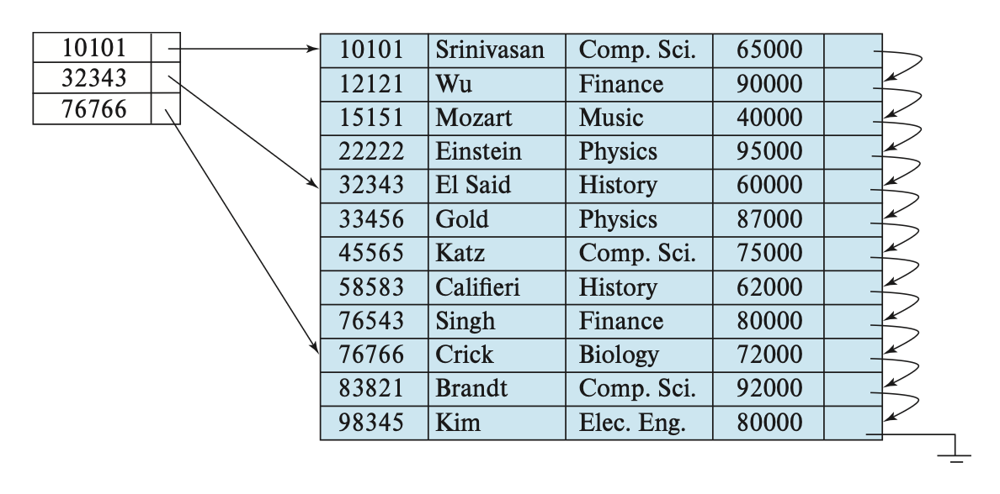
    </div>

这种设计中，处理数据库请求的主要成本是将数据块从硬盘带到主存所需的时间。如果索引小到能够放入主存的话，那么搜索的时间就会降低不少。


### Multilevel Indices

当索引很大的时候，查找索引的过程就特别耗时间。为了解决这个问题，我们可以将索引看作文件中的记录，然后为这个索引构建一个稀疏索引。其中原来的索引称为内部索引，而新构建的索引称为外部索引，如下所示：

<div style="text-align: center">
    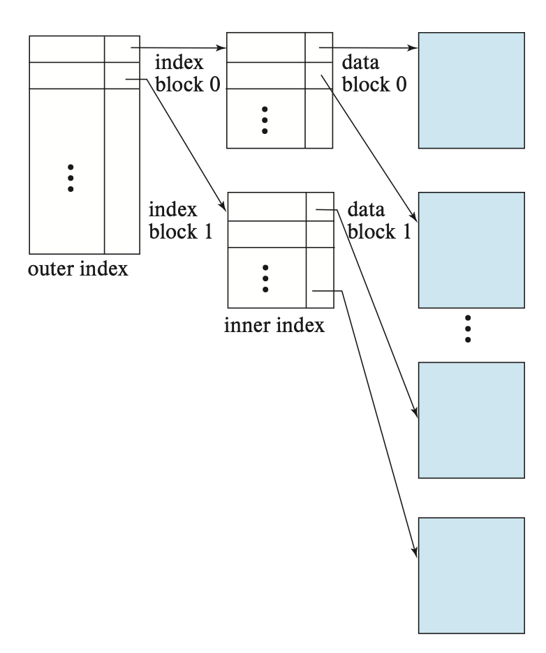
</div>

要找到某条记录，我们现在外层索引上使用二分查找，找到不超过该记录的搜索键值的最大搜索键值对应的记录，对应有一个指向内部索引块的指针。然后在这个内部索引块内找到不超过该记录的搜索键值的最大搜索键值对应的记录，对应有一个指向文件块的指针，这个文件块包含了我们想要寻找的记录。

当索引变得很大很大时，我们可以使用更多级的索引，这称为**多级索引**(multilevel indices)。相比只用二分查找而言，在多级索引上寻找记录能够显著减少 I/O 操作。


### Index Update

#### Insertion

- 首先，系统通过搜索键找到插入记录的地方
- 然后根据不同类型的索引采取不同操作
    - 稠密索引：
        - 如果搜索键值不出现在索引里，那么系统将在合适的位置上插入一个带有该搜索键的新索引
        - 否则的话，
            - 如果索引项存储了指向所有带有相同搜索键的记录的指针，那么系统将在索引项中添加一个指向新记录的指针
            - 否则的话，索引只存储指向第一个带有该搜索键的记录的指针，此时系统将新记录插入到和它搜索键值相同的记录后面
    - 稀疏索引：
        - 假设索引为每个块存储一个项。如果系统创建了新的块，那么就将新的块中得到的搜索键值放入索引中
        - 如果新记录的搜索键值在块内是最小的话，那么系统就讲索引的入口更新到该块上；如果不是的话就不做改动


#### Deletion

删除过程和插入类似：

- 首先，系统要找到要被删除的记录
- 然后根据不同类型的索引采取不同操作
    - 稠密索引：
        - 如果被删除的记录是搜索键值对应的唯一的记录，那么系统将删除掉对应的索引项
        - 否则的话，
            - 如果索引项存储了指向所有带有相同搜索键的记录的指针，那么系统将删除指向被删除记录的指针
            - 否则的话，索引只存储指向第一个带有该搜索键的记录的指针，此时系统将更新索引项，让它指向下一条记录
    - 稀疏索引：
        - 假设索引为每个块存储一个项。如果系统创建了新的块，那么就将新的块中得到的搜索键值放入索引中
        - 否则的话，
            - 如果被删除的记录是该搜索键对应的唯一记录，那么系统将对应的索引记录替换为下一个搜索键值的索引记录。如果下一个搜索键值有索引系那个的话，那么就直接删除，不用被替换
            - 否则的话，指向该记录的搜索键值对应的索引记录会被删除，直接指向下一个有相同搜索键值的记录

---
上述插入和删除的操作同样适用于多级索引中。


### Secondary Indices

前面介绍的二级索引只考虑稀疏索引的情况，事实上二级索引也可以是稠密索引，此时索引的项能够对应全部的搜索键值，并且有指向所有记录的指针。

在候选键上的二级索引好像一个稠密的聚集索引，但区别在于被索引中的连续值指向的一组记录并不是按顺序存储的。

如果一个关系中有多条记录的搜索键值是相同的，那么这样的搜索键称为**非唯一搜索键**(nonunique search key)。

一种在非唯一搜索键上实现二级索引的方法是：二级索引的指针不直接指向记录，而是让每个指针指向一个桶，这个桶里包含了指向文件的指针。下图展示了这样的结构：

<div style="text-align: center">
    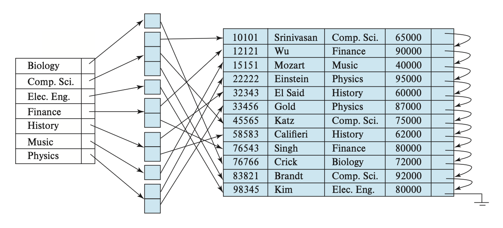
</div>

这种方法有一些缺陷：

- 索引访问时间变得更长
- 如果搜索键的重复不多的话，那么会有很多空间被浪费掉

由于二级搜索键的顺序和物理搜索键的顺序不同，所以如果尝试按二级搜索键的顺序扫描文件，那么读取每条记录就好像读取硬盘中的每个块，速度相当慢。

前面介绍的插入和删除过程同样适用于二级索引。

总的来说，二级索引改善了使用除聚集索引的搜索键之外的键进行查询时的表现，但是会为数据库的修改带来额外开销。


## B+ Tree Index Files

索引顺序文件组织的主要缺点是：随着文件规模的增长，索引查找和数据顺序扫描的性能会下降。尽管可通过对文件的重新组织来解决这一问题，但是频繁的重复组织是不能被接受的。因此，我们转而采用 **B+ 树**这一被广泛使用的索引结构，它能够保证在插入和删除数据的情况下仍然能维持效率。尽管 B+ 树会带来额外的插入和删除操作，以及额外空间的开销，但由于能够避免文件的重新组织，因而这点开销是可以被接受的。


### Structure

- B+ 树是一种**平衡树**(balanced tree)，即从根节点出发到叶子节点的所有路径都是等长的。正是这种平衡性质，才让 B+ 树在查找、插入和删除上具有不错的表现
- 下图展示了 B+ 树某个节点的内容，其中有 $n-1$ 个搜索键值 $K_1, K_2, \dots, K_{n-1}$，以及 $n$ 个指针 $P_1, P_2, \dots, P_n$，且搜索键值是排好序的，即对于 $i < j$，有 $K_i < K_j$ 成立

    <div style="text-align: center">
        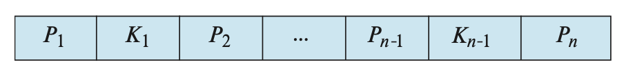
    </div>

- 先考虑**叶子节点**(leaf node)的结构：对于 $i = 1, \dots, n - 1$，$P_i$ 指向搜索键值为 $K_i$ 的文件记录；而 $P_n$ 指向下一个叶子节点，以实现高效的顺序文件处理。叶子节点至少有 $\lceil \dfrac{n-1}{2} \rceil$ 个值。
    - 对于叶子节点 $L_i, L_j\ (i < j)$（即 $L_i$ 在 $L_j$ 的左边），$L_i$ 内的每一个搜索键值 $v_i$ 均比 $L_j$ 内的每一个搜索键值 $v_j$ 小

    <div style="text-align: center">
        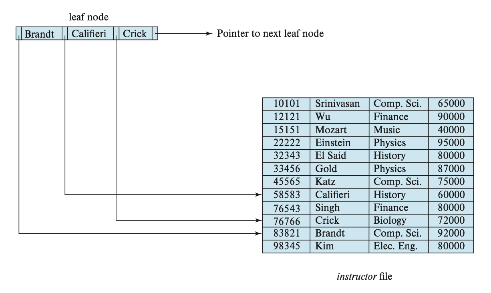
    </div>

- 而 B+ 树的**非叶子节点**(nonleaf nodes)（有时也称为**内部节点**(internal nodes)）构成了叶子节点的多级（稀疏）索引   
    - 非叶子节点的结构和叶子节点的类似，只是它的指针指向的都是树里的节点
    - 每个非叶子节点（不包括根节点）的孩子数量的范围为 $[\lceil \dfrac{n}{2} \rceil, n]$，而根节点孩子数量的范围为 $[2, n]$
    - 节点的指针数称为**扇出**(fanout)
    - 假如某个节点包含 $m (m \le n)$ 个指针，指针 $P_i$ 指向搜索键值比 $K_i$ 小而且不小于 $K_{i-1}$ 的子树；指针 $P_m$ 指向搜索键值不小于 $K_{m-1}$ 的子树；指针 $P_1$ 指向搜索键值比 $K_1$ 小的子树

??? example "例子：B+ 数索引结构"

    $n = 4$ 时的 B+ 树：

    <div style="text-align: center">
        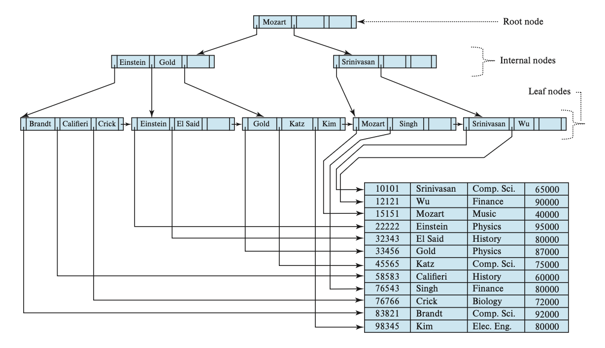
    </div>

    $n = 6$ 时的 B+ 树：

    <div style="text-align: center">
        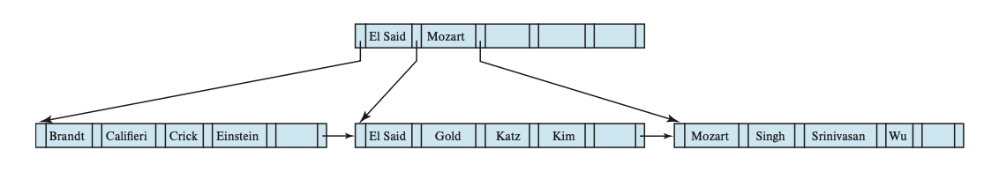
    </div>

前面假设的都是搜索键不重复的情况。如果有重复的搜索键，那么就需要调整一下结构的定义：

- 比如将 $i < j$ 时 $K_i < K_j$ 的条件改为 $K_i \le K_j$ 这样就可以让叶子节点存储重复值了。但这样做会让内部节点也有重复的搜索键值，使得插入和删除操作变得极复杂又昂贵
- 另一种方法是为每个搜索键值用一组记录指针，但这种方法过于复杂，且使访问变得更加低效
- 其实大多数数据库的做法是再拿出一个主键 $A_p$ 和搜索键属性 $a_i$ 并起来，形成一个唯一的复合搜索键 $(a_i, A_p)$


### Quries

下面是在 B+ 树的查询算法：

<pre class="pseudocode" lineNumber="true">
\begin{algorithm}
\caption{Querying a B+ Tree}
\begin{algorithmic}
\PROCEDURE{find}{$v$}
    \STATE
    \COMMENT{Assume no duplicate keys, and returns pointer to the record with}
    \STATE
    \COMMENT{search key value $v$ if such a record exists, and null otherwise}
    \STATE Set $C$ = root node
    \WHILE{($C$ is not a leaf node)}
        \STATE Let $i$ = smallest number such that $v \le C.K_i$
        \IF{there is no such number $i$}
            \STATE $P_m$ = last non-null pointer in the node
            \STATE Set $C = C.P_m$
        \ELIF{($v = C.K_i$)}
            \STATE Set $C = C.K_i$
        \ELSE
            \STATE Set $C = C.P_i$       
            \COMMENT{$v < C.K_i$}
        \ENDIF
    \ENDWHILE
    \STATE
    \COMMENT{$C$ is a leaf node}
    \IF{for some $i$, $K_i = v$}
        \RETURN $P_i$
    \ELSE
        \RETURN null   
        \COMMENT{No record with key value $v$ exists}
    \ENDIF
\ENDPROCEDURE
\end{algorithmic}
\end{algorithm}
</pre>

>个人感觉还是比较好理解的，所以就不做解释了。

此外，我们还能在 B+ 树上查找特定范围 $[lb, ub]$ 内的搜索键值对应的记录，这样的查询称为**范围查询**(range queries)，对应的算法如下所示：

<pre class="pseudocode" lineNumber="true">
\begin{algorithm}
\caption{Range query on B+ tree}
\begin{algorithmic}
\PROCEDURE{findRange}{$lb, ub$}
    \STATE
    \COMMENT{Returns all records with search key value $V$ such that $lb \le V \le ub$}
    \STATE Set resultSet = {}
    \STATE Set $C$ = root node
    \WHILE{($C$ is not a leaf node)}
        \STATE Let $i$ = smallest number such that $lb \le C.K_i$
        \IF{there is no such number $i$}
            \STATE $P_m$ = last non-null pointer in the node
            \STATE Set $C = C.P_m$
        \ELIF{($lb = C.K_i$)}
            \STATE Set $C = C.K_i$
        \ELSE
            \STATE Set $C = C.P_i$       
            \COMMENT{$lb < C.K_i$}
        \ENDIF
    \ENDWHILE
    \STATE
    \COMMENT{$C$ is a leaf node}
    \STATE Let $i$ be the least value such that $K_i \ge lb$
    \IF{there is no such $i$}
        \STATE Set $i$ = 1 + number of keys in $C$
        \COMMENT{To force move to next leaf}
    \ENDIF
    \STATE Set done = \FALSE
    \WHILE{(not done)}
        \STATE Let $n$ = number of keys in $C$
        \IF{($i \le n$ \AND $C.K_i \le ub$)}
            \STATE Add $C.P_i$ to resultSet
            \STATE Set i = i + 1
        \ELIF{($i \le n$ \AND $C.K_i > ub$)}
            \STATE done = \TRUE
        \ELIF{($i > n$ \AND $C.P_{n+1}$ is not null)}
            \STATE Set $C = C.P_{n+1}$, and i = 1
            \COMMENT{Move to next leaf}
        \ELSE
            \STATE Set done = \TRUE
            \COMMENT{No more leaves to the right}
        \ENDIF
    \ENDWHILE
    \RETURN resultSet
\ENDPROCEDURE
\end{algorithmic}
\end{algorithm}
</pre>

该算法首先执行类似 $find(lb)$ 的操作，找到起始的叶子节点；然后遍历叶子节点，将那些搜索键值在范围内的记录收集起来，直到发现搜索键值大于 $ub$ 时，或者已经没有可遍历的记录时停止；最后返回收集起来的记录 $resultSet$。

现在我们来考虑一下查询 B+ 数索引的成本：

- 可以发现，如果一共有 $N$ 个记录的话，那么 B+ 树的路径长度不超过 $\lceil \log_{\lceil n/2 \rceil} N\rceil$
- 一般情况下，节点大小和硬盘块的大小是一致的（大概在 4KB 左右）
- 相比一般的树状结构而言，B+ 树的每个节点都很大，所以 B+ 树长得又胖又矮
- 在遍历到最底层的叶子节点时，要查询唯一的搜索键值的话就需要一次额外的随机 I/O 访问
- 范围查询需要额外的成本，因为在到达叶子节点后，还要再检索范围内指针。假如要检索 $M$ 个指针，那么需要访问至多 $\lceil M / (n/2) \rceil + 1$ 个叶子节点。而且，对于二级索引而言，在最坏情况下会带来 $M$ 次的随机 I/O 操作

对于非唯一搜索键，如果想要检索给定搜索键值 $v$ 下的全部记录，那么可以利用过程 $findRange(lb, ub)$，其中 $lb = (v, -\infty), ub = (v, \infty)$，而 $-\infty, \infty$ 分别指代最小和最大的主键值 $A_p$。


### Updates

我们可以将更新记录的过程拆解为：删除旧记录，之后再插入更新后的记录。

在 B+ 树中，插入和删除会更加麻烦，因为要在插入或删除后保留 B+ 树的平衡性，可能因插入后节点过大需要**分裂**(split)开来，也有可能因删除后节点过小需要和其他节点**合并**(coalesce/merge)。这里先暂且不去考虑这些问题，让我们先来大致了解插入和删除的思路：

- **插入**：使用 $find()$ 函数找到插入的叶子节点的位置，然后将搜索键值插入，并确保叶子节点内的搜索键仍然有序
- **删除**：也使用 $find()$ 函数找到要被删除的搜索键值。若存在多个相同的搜索键值，则需要将它们全部找出来并删掉。删掉后还要将被删掉的搜索键值右边的项全部向左移，确保项之间没有空缺

下面详细介绍插入和删除的原理，以及算法。


#### Insertion

为了方便理解，先来看一个简单的例子。

??? example "例子"

    这是原来的 B+ 树：

    <div style="text-align: center">
        
    </div>

    插入 Adam 后的 B+ 树：

    <div style="text-align: center">
        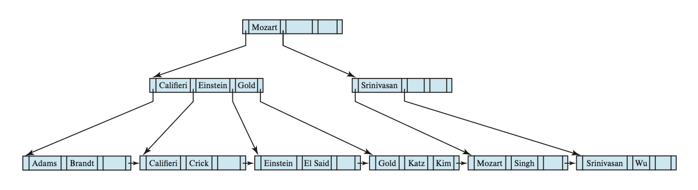
    </div>

    继续插入 Lamport 后的 B+ 树：

    <div style="text-align: center">
        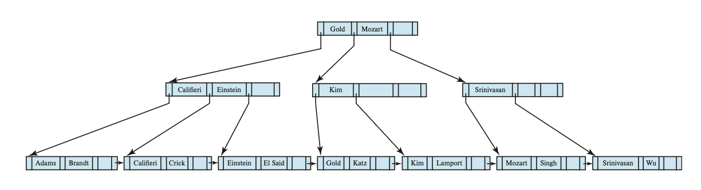
    </div>

插入操作的算法如下所示：

<pre class="pseudocode" lineNumber="true">
\begin{algorithm}
\caption{Insertion of entry in a B+ tree}
\begin{algorithmic}
\PROCEDURE{insert}{$value\ K, pointer\ P$}
    \IF{(tree is empty)}
        \STATE create an empty leaf node $L$, which is also the root
    \ELSE
        \STATE Find the leaf node $L$ that should contain key value $K$
    \ENDIF
    \IF{($L$ has less than $n-1$ key values)}
        \STATE insert\_in\_leaf($L, K, P$)
    \ELSE
        \STATE Create node $L'$
        \STATE Copy $L.P_1, \dots, L.K_{n-1}$ to a block of memory $T$ that can
        \STATE $\quad \quad$ hold $n$ (pointer, key-value) pairs
        \STATE insert\_in\_leaf($T, K, P$)
        \STATE Set $L'.P_n = L.P_n$; Set $L.P_n = L'$
        \STATE Erase $L.P_1$ through $L.K_{n-1}$ from $L$
        \STATE Copy $T.P_1$ through $L.K_{n-1}$ from $L$
        \STATE Copy $T.P_{\lceil n / 2\rceil + 1}$ through $T.K_n$ from $T$ into $L'$ starting at $L'.P_1$
        \STATE Let $K'$ be the smallest key-value in $L'$
        \STATE insert\_in\_parent($L, K', L'$)
    \ENDIF
\ENDPROCEDURE
\end{algorithmic}
\end{algorithm}
</pre>

如果插入操作会导致节点分裂的话，那就要自底向上递归处理分裂的问题，直到没有节点分裂，或者创建了新的根节点为止。

该过程还用到了两个子过程 $insert\_in\_leaf$ 和 $insert\_in\_parent$，算法如下： 

<pre class="pseudocode" lineNumber="true">
\begin{algorithm}
\caption{Subsidiary procedures for insertion of entry in a B+ tree}
\begin{algorithmic}
\PROCEDURE{insertInLeaf}{$node\ L, value\ K, pointer\ P$}
    \STATE
    \COMMENT{Cannot use underlines in procedure names in pseudocode.js}
    \IF{($K < L.K_1$)}
        \STATE insert $P, K$ into $L$ just before $L.P_1$
    \ELSE
        \STATE Let $K_i$ be the highest value in $L$ that is less than or equal to $K$
        \STATE Insert $P, K$ into $L$ just after $L.K_i$
    \ENDIF
\ENDPROCEDURE
\STATE $\quad$
\STATE $\quad$
\PROCEDURE{insertInParent}{$node\ L, value\ K', node\ N'$}
    \STATE
    \COMMENT{Cannot use underlines in procedure names in pseudocode.js}
    \IF{($N$ is the root of the tree)}
        \STATE Create a new node $R$ containing $N, K, N'$
        \COMMENT{$N, N'$ are pointers}
        \STATE Make $R$ the root of the tree
        \RETURN
    \ENDIF
    \STATE Let $P = parent(N)$
    \IF{($P$ has less than $n$ pointers)}
        \STATE Insert ($K', N'$) in $P$ just after $N$
    \ELSE
        \COMMENT{Split $P$}
        \STATE Copy $P$ to a block of memory $T$ that can hold $P$ and $(K', N')$
        \STATE Insert ($K', N'$) into $T$ just after $N$
        \STATE Erase all entries from $P$; Create node $P'$
        \STATE Copy $T.P_1, \dots, T.P_{\lceil (n+1) / 2 \rceil}$ into $P$
        \STATE Let $K'' = T.K_{\lceil (n+1) / 2 \rceil}$
        \STATE Copy $T.K_{\lceil (n+1) / 2 \rceil} \dots T.P_{n+1}$ into $P'$
        \STATE insert\_in\_parent($P, K'', P'$)
    \ENDIF
\ENDPROCEDURE
\end{algorithmic}
\end{algorithm}
</pre>


#### Deletion

同样为了便于理解，先来看这个例子：

??? example "例子"

    这是原来的 B+ 树：

    <div style="text-align: center">
        
    </div>

    删掉 Srinivasan 后的 B+ 树：

    <div style="text-align: center">
        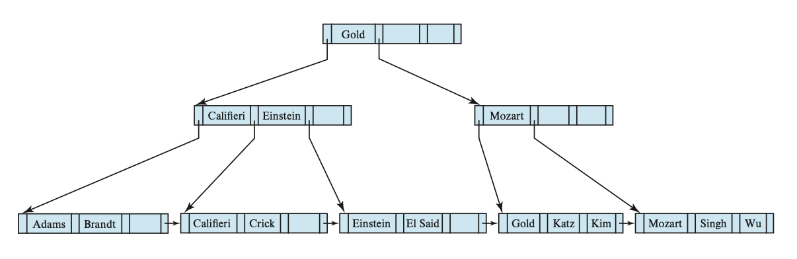
    </div>

    继续删掉 Singh 和 Wu 后的 B+ 树：

    <div style="text-align: center">
        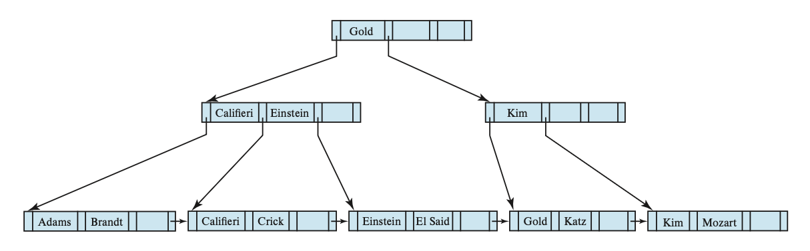
    </div>

    继续删掉 Gold 后的 B+ 树：

    <div style="text-align: center">
        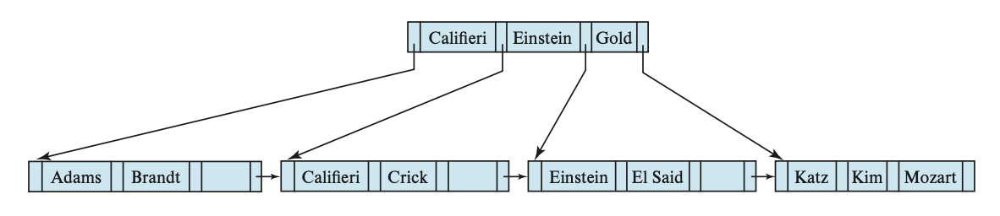
    </div>


下面展示了删除操作的算法：

<pre class="pseudocode" lineNumber="true">
\begin{algorithm}
\caption{Deletion of entry from a B+ tree}
\begin{algorithmic}
\PROCEDURE{delete}{$value\ K, pointer\ P$}
    \STATE find the leaf node $L$ that contains $(K, P)$
    \STATE delete\_entry($L, K, P$)
\ENDPROCEDURE
\STATE $\quad$
\STATE $\quad$
\PROCEDURE{deleteEntry}{$node\ N, value\ K', pointer\ P$}
    \STATE delete($K, P$) from $N$
    \IF{($N$ is the root \AND $N$ has only one remaining child)}
        \STATE make the child of $N$ the new root of the tree and delete $N$
    \ELIF{($N$ has too few values/pointers)}
        \STATE Let $N'$ be the previous or next child of $parent(N)$
        \STATE Let $K'$ be the value between pointers $N$ and $N'$ in $parent(N)$
        \IF{(entries in $N$ and $N'$ can fit in a single node)}
            \STATE
            \COMMENT{Coalesce nodes}
            \IF{($N$ is predecessor of $N'$)}
                \STATE swap\_variables($N, N'$)
            \ENDIF
            \IF{($N$ is not a leaf)}
                \STATE append $K'$ and all pointers and values in $N$ to $N'$
            \ELSE
                \STATE append all $(K_i, P_i)$ pairs in $N$ to $N'$; set $N'.P_n = N.P_n$
            \ENDIF
            \STATE delete\_entry($parent(N), K', N$); delete node $N$
        \ELSE
            \STATE
            \COMMENT{Redistribution: borrow an entry from $N'$}
            \IF{($N'$ is a predecessor of $N$)}
                \IF{($N$ is a nonleaf node)}
                    \STATE let $m$ be such that $N'.P_m$ is the last pointer in $N'$
                    \STATE remove $(N'.K_{m-1}, N'.P_m)$ from $N'$
                    \STATE insert $(N'.P_m, K')$ as the first pointer and value in $N$,
                    \STATE $\quad \quad$ by shifting other pointers and values right
                    \STATE replace $K'$ in $parent(N)$ by $N'.K_{m-1}$
                \ELSE
                    \STATE let $m$ be such that $(N'.P_m, N'.K_m)$ is the last pointer/value
                    \STATE $\quad \quad$ pair in $N'$
                    \STATE remove $(N'.P_m, N'.K_m)$ from $N'$
                    \STATE insert $(N'.P_m, N'.K_m)$ as the first pointer and value in $N$,
                    \STATE $\quad \quad$ by shifting other pointers and values right
                    \STATE replace $K'$ in $parent(N)$ by $N'.K_m$
                \ENDIF
            \ELSE
                \STATE ... symmetric to the $\mathbf{if}$ case ...
            \ENDIF
        \ENDIF
    \ENDIF
\ENDPROCEDURE
\end{algorithmic}
\end{algorithm}
</pre>


### Complexity

尽管 B+ 树的插入和删除操作较为复杂，但是他们仅需相对较少的 I/P 操作，并且在最坏情况下 I/P 操作的数量和 $\log_{\lceil n/2 \rceil} N$（即 B+ 树的高度）成正比（其中 $n$ 为节点内的最大指针数，而 $N$ 为被索引的记录数）。

虽然 B+ 树仅能保证节点中至少有一半是满的（根据定义），但如果搜索键值是随机被插入进来的话，那么平均每个节点有 2/3 的内容是被填满的；如果是按顺序插入的话，那么还是只有一半是满的。


### Nonunique Search Keys

事实上，前面我们假设了搜索键值都是唯一的。而对于非唯一的搜索键，我们也了解了一种通过创建复合搜索键来使搜索键变得唯一的方法。通过修改 B+ 树的结构，能够让 B+ 树支持重复搜索键的查找、插入和删除操作，具体来说有以下几种方法：

- 每个搜索键值仅存储一次，并为每个搜索键值保留一个记录指针的桶（或列表），以处理非唯一的搜索键。这种方法能够有效利用空间，但是它使得 B+ 树的实现更为复杂，因为桶是变长的，且随叶子节点的变大而变大；而且如果将桶放在不同的硬盘块里，那么还会产生额外的 I/O 操作时间。
- 对每个记录只存储一次搜索键值。该方法能让分裂叶子节点操作保持不变。但它让分裂和查找中间节点的操作变得相当复杂，因为两个叶子可能会包含相同的搜索键值；且会带来更高的空间开销。

而这两种方法的共同缺点是：影响了记录删除的效率，在最坏情况下删除的复杂度与记录数呈线性关系。而在搜索键是唯一的情况下时，记录删除在最坏情况下的复杂度与记录数呈对数关系。

因此，在大多数数据库系统中，B+ 树实现仅用于处理唯一的搜索键，且会通过自动增加记录 id 或别的属性来使搜索键变得唯一。


## B+ Tree Extension

### B+ Tree File Organization

前面介绍过索引顺序文件组织的主要缺点：随文件规模增长，性能不断降低。因此，我们将 B+ 树直接作用在文件上来解决这一问题。具体来说，就是将文件中的真实记录存储在 B+ 树的叶子节点上，我们称这样的文件组织为 **B+ 树文件组织**。由于记录通常比指针大，因此能被存储在叶子节点内的记录的最大数量比非叶子节点的指针数量更少；可即便如此，我们仍然要求叶子节点有一半内容是满的。一种 B+ 树文件组织如下所示：

<div style="text-align: center">
    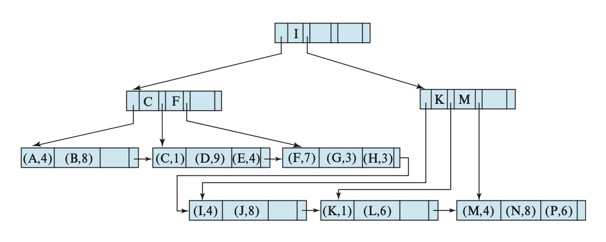
</div>

B+ 树文件组织的插入和删除操作和前面介绍过的方法无异，故不再赘述。

在使用 B+ 树文件组织时，空间利用尤为重要，因为一条记录占据的空间远比一个搜索键或指针来的大。我们可以通过在分裂或合并时的重分配(redistribution)操作中<u>考虑更多的兄弟节点</u>来提升空间的利用，这种方法在叶子节点和非叶子节点上均可行。总的来说，如果在重分配时考虑到 $m$ 个节点（$m - 1$ 个兄弟节点），那么每个节点确保获得至少 $\lfloor (m-1)n / m\rfloor$ 个项。然而，考虑更多节点会让更新成本变得更高。

注意到无论是在 B+ 树索引结构还是文件组织中，相邻的叶子节点有可能位于硬盘的不同位置上。尽管在一组新的记录上建立 B+ 树时考虑到为相邻的叶子节点分配连续的硬盘块，但是在多次插入和删除操作后，这里的有序性就会被打破，从而导致硬盘访问时间的增加。因此可能需要通过重构来恢复这个有序性。

B+ 树文件组织可以用于存储大对象（比如 SQL 的 clobs 和 blobs），具体做法是将大对象拆分为多个小记录，这些记录按顺序编号，作为 B+ 树上的搜索键。


### Secondary Indices and Record Relocation

对于 B+ 树这样的文件组织，有时会遇到即使没有更新记录内容，也会导致记录位置被改变的情况。比如 B+ 树的某个叶子节点发生分裂了，那么就会有一些记录被移动到新的节点上，这时所有存储指向这些被移动过的记录的指针的二级索引就要被更新，即使它们对应的记录内容没有发生改变，而这会带来较大的开销。

为了解决这一问题，在二级索引中，我们不再存储指向这些被索引记录的指针，而是存储一级索引的搜索键属性（就是说上层的索引不要存最底层的记录，只要存下一层的索引就行了）。虽然这样会让访问成本更高（需要额外的步骤），但是这能减少文件重组织的成本。


### Indexing Strings

为字符串属性创建 B+ 树索引会有一些问题，下面列出这些问题以及对应的解决方案：

- 字符串可能是变长的
    - 解决方案：（没看懂课本的做法，貌似还是正常的分裂和合并？）
- 字符串可能会很长，导致节点的低扇出，从而让 B+ 树变得很高
    - 解决方案：通过**前缀压缩**(prefix compression)（仅存储搜索键值的前缀部分，但足以区分搜索键值）提升扇出


### Bulk Loading of B+ Tree Indices

**批量加载**(bulk loading)是指一次向索引插入多个项的操作。一种实现方法是：

- 创建一个包含关系中的索引项的临时文件
- 然后按搜索键为文件内容排序（后面会介绍一些高效的排序算法）
    - 这样做的好处是：如果按排好的顺序插入项的话，那么这些项也是连续进入某个节点的，那么只需要向该节点写入一次即可。
    - 如果 B+ 树是空的话，那么所有节点仅需一次写入即可。具体来说，可通过**自底向上**(bottom-up)的 B+ 树构造实现更快的构造。大多数数据库系统都会用到排序和自底向上构造的技术。
- 扫描排好序的文件，将项插入到索引中


### B Tree Index Files

**B 树索引**和 B+ 树索引类似，但主要的区别是 B 树消除了搜索键值的存储冗余，也就是说每个搜索键值在 B 树中仅出现一次（如果搜索键值是唯一的话）。因此，在 B 树的非叶子节点上，每个搜索键都要用一个额外的指针指向文件记录或者装有关联搜索键的桶。下图就是一个 B 树索引的例子：

<div style="text-align: center">
    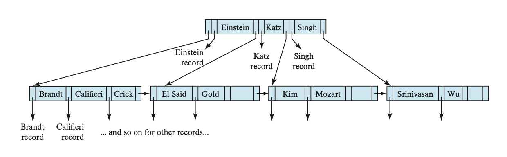
</div>

下面两张图分别展示了 B 树的叶子节点（图 a）和非叶子节点（图 b）的结构：

<div style="text-align: center">
    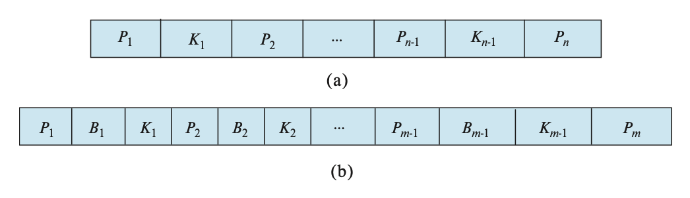
</div>

在非叶子节点中，$P_i$ 表示树指针，$B_i$ 表示桶或文件记录指针。在一般的 B 树中，叶子节点里有 $n-1$ 个键，非叶子节点里有 $m-1$ 个键，其中 $m < n$。

在 B 树上进行查找时，有时我们可能在到达叶子节点前就找到了想要找的值。但是由于非叶子节点上的搜索键数量相比 B+ 树更少，即有更少的扇出，所以 B 树会比（存储相同内容的） B+ 树更高。总的来说 B 树上的查找时间和搜索键数量的对数呈正比。

B 树的删除操作更为复杂，因为被删除的项还可能会出现在非叶子节点上。具体来说，如果搜索键 $K_i$ 被删掉的话，那么出现在 $P_{i+1}$ 所指向的子树中最小的搜索键必须被移动到原来被 $K_i$ 占据的地方。相对而言，插入操作只是变得略微复杂些。

对于更大规模的索引，B 树的空间优势没法显现出来。因此大多数的数据库系统还是采用 B+ 树。


### Indexing on Flash Storage

前面的介绍中，我们都是假设数据被存储在硬盘中——现在我们来看一下将索引用于闪存或 SSD 的情况。

- B+ 树的节点大小和闪存页的大小相匹配
- 前面介绍过的批量加载和自底向上构建的方法仍然适用于 SSD 中，且仍然能发挥不错的效果。对于后者，它还能减少页的写操作（之前介绍过，闪存的写操作比较复杂），从而能显著提升性能
- 为了降低闪存的擦除次数，一种方法是为 B+ 树的内部节点添加缓冲区，用于临时记录更新情况，之后将更新操作下传到更低层的节点上；另一种方法是创建多棵树，并将它们合并起来


### Indexing in Main Memory

当然也可以对在内存中的数据进行索引！

- 如果 B+ 书的节点小到能够放在一个高速缓存行里，那么会为在内存中的数据带来更好的性能，因为这样的 B+ 树能让索引操作遇到的高速缓存失效的情况更少


## Hash Indices

**哈希**(hashing)是一种在内存中建立索引的常用技术，这样的索引可能被临时用于连接操作或作为主存数据库的永久结构。哈希也能够用于组织文件内的记录，尽管实际上用的不多。下面我们仅关注在内存中的哈希索引。

在哈希中，我们用**桶**(bucket)来指代一个存储单条或多条记录的存储单元，它一般是一个关于索引项或记录（用于**哈希文件组织**(hash file organization)中）的链表。形式上，我们用 $K$ 表示所有搜索键值的集合，$B$ 表示所有桶地址的集合，那么**哈希函数**(hash function) $h$ 就是一个从 $K$ 到 $B$ 的一个函数。这个桶集合实际上是一个指针数组，每个指针存储的是链表（桶）的头。

要想插入一条搜索键值为 $K_i$ 的记录，我们先计算 $h(K_i)$，得到该记录对应的桶地址，然后我们将这条记录的索引项驾到偏移量为 $i$ 的列表上。这种方法称为**溢出链**(overflow chaining)，有时也称为**闭寻址**(closed addressing)。也有一种开寻址的方法，但不适合用于数据库的索引中，因为开寻址不支持高效的删除操作。

哈希索引支持对搜索键的相等性**查询**（比一比哈希函数值就行了），但不支持范围查询（而 B+ 树均支持）。而**删除**操作相当直接：用哈希函数找到对应的桶后，删除桶里的指定记录就行了。

对于插入操作，如果桶没有足够多的空间的话，那么就发生了**桶溢出**(bucket overflow)的问题，这时就要用**溢出桶**(overflow buckets)来解决这一问题。具体来说：如果记录必须要被插入到桶 $b$，而 $b$ 是满的话，那么系统将为 $b$ 提供一个溢出桶，然后将记录插入到这个溢出桶里。如果溢出桶也满的话，那么系统就会再提供一个溢出桶，以此类推。这些溢出桶用一个链表连接起来，称为溢出链(overflow chaining)，如下所示：

<div style="text-align: center">
    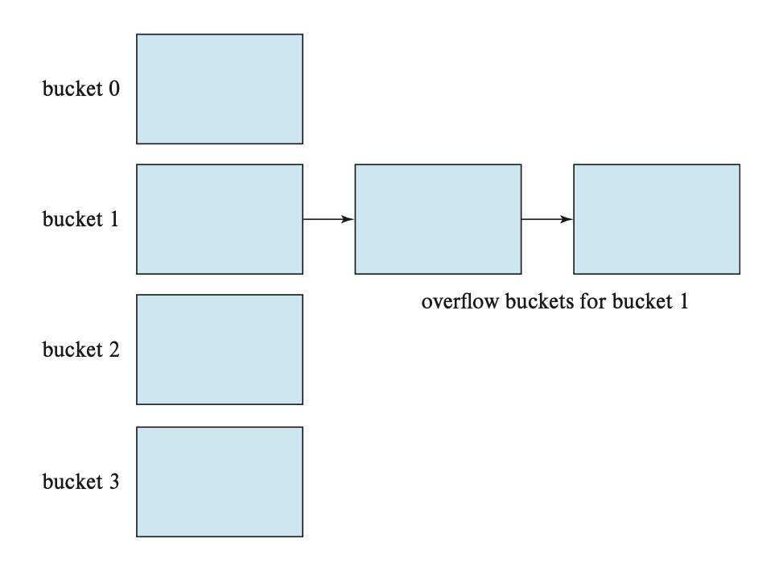
</div>

如果我们能够提前知道需要被索引的记录数量的话，那么我们就能分配足够大的桶，从而避免了桶溢出的问题。

当多个记录对应的搜索键值相等时，就会导致记录（在所有桶的）分布的不均匀（或称为**偏斜**(skew)），这很有可能是因为我们选择的哈希函数不够好。因此在选择哈希函数时要注意这个问题，以减小偏斜的发生。

为了减小桶溢出的概率，我们让桶的数量为 $\dfrac{n_r}{f_r} \cdot (1 + d)$，其中 $n_r$ 为记录总数，$f_r$ 为每个桶的记录数量，$d$ 是一个任意数值，通常设为 0.2 左右。此时桶内 20% 的空间是空的，虽然看起来有些浪费空间，但它能够减少桶溢出的发生。

前面介绍的哈希索引都是固定桶数的，这种哈希称为**静态哈希**(static hashing)，它有一个问题：我们需要知道有多少记录被存储在索引里，否则的话桶的容量可能不太够用。为了解决这个问题，当记录量大到一定程度时就要重构哈希索引，增加桶的数量，但这样做会耗费不少时间。像这种能够让桶的数量增长的哈希称为**动态哈希**(dynamic hashing)，**线性哈希**(linear hashing)和**可扩展哈希**(extendable hashing)都属于此类。


## Multiple-Key Access

前面讲到的搜索键大多是由单个属性构成的，而对于由多个属性构成的搜索键，我们称为**复合搜索键**(composite search keys)。假如对属性 $A_1, \dots, A_n$ 索引，那么搜索键值可以被表示为 $(a_1, \dots, a_n)$ 的元组形式。此时搜索键值的顺序遵循**词典序**(lexicographic ordering)（[离散数学](../../math/dm/9.md#lexicographic-order)里讲到过，这里不再赘述）。

对于某些查询，使用复合搜索键构成的索引能够提升查询效率。比如对于以下查询：

```sql
SELECT ID
FROM instructor
WHERE dept_name = 'Finance' AND salary = 80000;
```

我们创建复合搜索键 $(dept_name, salary)$，并在其基础上建立起有序索引（比如 B+ 树索引），从而实现高效的查找。

实际上，上述复合搜索键还适用一个为相等条件，一个为范围条件的查询，以及单属性的查询，比如：

```sql
SELECT ID
FROM instructor
WHERE dept_name = 'Finance' AND salary 《 80000;

SELECT ID
FROM instructor
WHERE dept_name = 'Finance';
```

但这种搜索键不适用于两个属性均为范围条件的查询，比如：

```sql
SELECT ID
FROM instructor
WHERE dept_name < 'Finance' AND salary < 80000;
```

因为满足条件的这些记录可能位于不同的硬盘块内，而文件内的记录是有序的，因此会带来很多的 I/O 操作。

---
**覆盖索引**(covering indices)：存储某些属性（并非搜索键属性）以及指向记录的指针的索引。使用这种索引能够减小搜索键的规模，从而为非叶子节点带来更大的删除，降低索引树的高度。


## Indices in SQL

- 虽然 SQL 标准里没有指明任何和索引相关的语法，但大多数的数据库支持用 SQL 命令创建和删除索引，语法格式大致如下：

    ```sql
    CREATE INDEX <index-name> ON <relation-name> (<attribute-list>);
    DROP INDEX <index-name>;
    ```

- 如果想要将候选键作为搜索键的话，可以用 `CREATE UNIQUE INDEX` 来实现。
- 当用户发起的查询能够从索引中获利的话，那么 SQL 查询处理器会自动使用该索引。
- 对那些在查询语句中作为选择条件或连接条件的属性而言，索引会很有帮助，因为它能够显著减少查询的成本。
- 然而，如果创建太多的索引的话，就会降低更新的处理，因为更新操作也会涉及到所有受影响的索引，所以在创建索引前要先想好是否有必要用到这个索引。
- 如果某个关系有主键的话，那么大多数数据库系统会自动根据主键创建索引，如果不这么做的话，当插入元组的时候，整个关系都要被扫描一遍，以确保主键约束是满足的。
- 通常，为外键属性创建索引是一个好主意，因为大多数的连接操作都是在外键索引和主键索引属性上进行的，对这种情况而言查询的效率会因为索引而变得更高。


## Write-Optimized Index Structure

B+ 树索引结构的一大缺点是随机的写操作对性能带来了负面影响。在 SSD 上，虽然随机 I/O 操作相当快，但写操作的成本还是很大。因此，我们接下来会介绍一些写优化的索引结构，来处理高写入/插入率带来的工作量。


### LSM Trees

**LSM 树**，全称**日志结构合并树**(log-structured merge tree)，是由多棵 B+ 树构成的，包括一棵在内存里的树 $L_0$，以及在硬盘里的树 $L_1, L_2, \dots, L_k$ 构成的，其中 $k$ 称为层级。下图展示了 $k=3$ 时的 LSM 树：

<div style="text-align: center">
    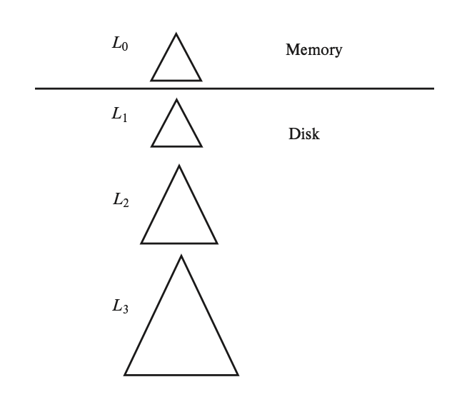
</div>

- 索引的查找过程为：先对每棵树进行单独的查找操作，然后合并查找结果。
- 向 LSM 树插入一条记录时，
    - 首先将该记录插入到在内存中的 $L_0$（系统为其分配了相当大的内存空间）。如果内存空间已满的话，那么就要将数据从内存移到硬盘里的 B+ 树上。
    - 具体来说，如果 $L_1$ 是空的话，那么就将整个 $L_0$ 写入到 $L_1$ 上；否则的话，按键的升序扫描 $L_0$ 的叶子层级，然后将里面的项和 $L_1$ 的叶子层级里的项合并起来（同样需要扫描）。然后用自底向上的构建方法，根据合并后的项来创建新的 B+ 树，用这棵新的树替代旧的 $L_1$。
    - 上述方法的好处是能确保新树的叶子节点是顺序定位的，以避免随机 I/O 操作；同时确保叶子是满的，减少了空间开销。
    - 但拷贝树需要不小的成本，所以这里介绍一些降低成本的方法：
        - 使用多级树，其中树 $L_{i+1}$ 的最大容量是 $L_i$ 的 $k$ 倍，因此每个记录之多被写入 $k$ 次。级数和 $\log_k (I/M)$ 成正比，其中 $I$ 是总项数，$M$ 是 $L_0$ 的项数
        - 除了 $L_0$ 外，每级树都有至多 $b$ 棵树（原来只有1棵树），这种变体称为**按步合并索引**(stepped-merge index)，它能够显著降低插入成本，但增加了查询成本
- 删除操作中除了找到并删除索引项外，还要插入一个**删除项**(deletion entry)，用于表明哪个索引项被删掉了。插入删除项的过程和插入一个普通索引项的过程是相同的。
    - 所以查找操作就要多出一步了：如果某些项存在删除项，那么在查找指定搜索键时需要同时找到原来的索引项以及删除项。如果发现删除项的话，那么就不返回原来的索引项。
- 更新操作和删除类似，也要插入一个更新项。更新在合并操作中完成。


### Buffer Trees

**缓冲区树**是在 B+ 树的基础上，让每个内部节点（包括根节点）都有一个关联的缓冲区。节点的结构如下所示：

<div style="text-align: center">
    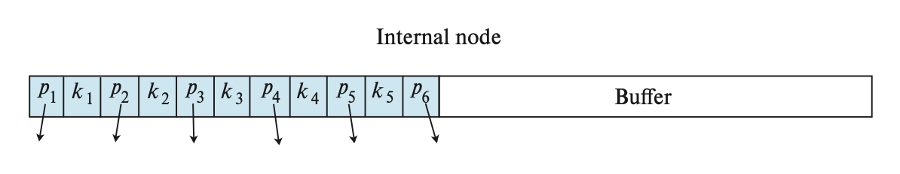
</div>

- 插入：
    - 在插入索引记录时，不是先遍历叶子节点，而是先将其插入到根节点的缓冲区中
    - 如果缓冲区满了的话，那么缓冲区内的每个索引记录被推向下一级合适的孩子节点的缓冲区内，以此类推
    - 在被向下推之前，所有在缓冲区内的记录都是按搜索键排好序的
    - 如果下一级节点是叶子节点的话，那么索引记录就按正常方法插入到叶子节点中就行了
    - 如果叶子节点满了的话就执行分裂操作，此时有可能会让内部节点分裂，对应的缓冲区同样需要分裂
- 查找：
    - 相比普通的 B+ 树查找，多了这样一步：在遍历内部节点时，检查一下结点的缓冲区内是否有要查找的搜索键值
    - 范围查找同样适用
- 删除和更新：
    - 和 LSM 树类似，也要插入删除项和更新项
    - 也可以使用一般的 B+ 树算法，但这样会带来更大的 I/O 成本

在最坏情况下，缓冲区树在 I/O 运算次数的上界会比 LSM 树更低。且对于读操作而言，缓冲区树会比 LSM 树快不少。然而对于写操作而言，缓冲区树的表现更差，因为它要求更多的随机 I/O，因此花费更多的寻道时间。因此当写操作更多时，优先使用 LSM 树；当读操作更多时，优先使用缓冲区树。


## Bitmap Indices

**位图索引**(bitmap indices)是一类适用于对多个键的简单查询的索引。在使用位图索引前，需要为关系中的每条记录标号（从0开始）。如果记录的大小固定，且被分配在某个文件内的连续块上，这一操作还是很容易的，此时记录编号就可以被转换为块编号。

**位图**(bitmap)就是一组位，对于关系 $r$ 的属性 $A$，位图索引包含了 $A$ 可取的每个值，而位的数量对应记录的数量。对于某个值 $v_j$ 的位图，如果编号为 $i$ 的记录的属性值为 $v_j$，那么该位图的第 $i$ 位置1，否则置0。

下面就是一个位图索引的例子：

???+ example "例子"

    <div style="text-align: center">
        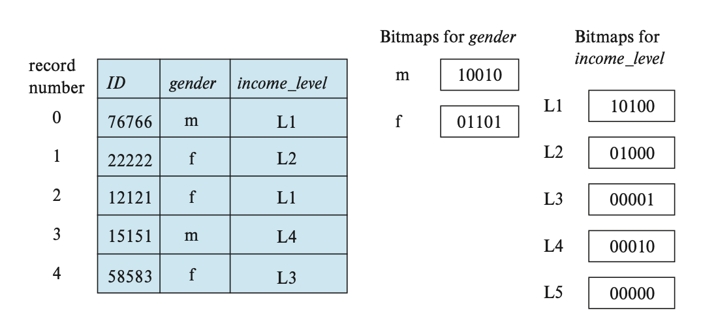
    </div>

    对于以下查询：

    ```sql
    SELECT *
    FROM instructor_info
    WHERE gender = 'f' AND income_level = 'L2';
    ```

    我们找到 $gender$ 属性值为 f，以及 $income\_level$ 属性值为 L2 的位图，然后对这两个位图进行**交**(intersection)运算（实际上是一个逻辑与的运算）。根据上图，$gender = $f (01101)，$income_level = $L2 (01000)，交运算后的位图是 01000，也就是说，编号为1的记录就是我们要查询的记录。


<script>
    pseudocode.renderClass("pseudocode");
</script>