# Lec 11: Query Processing

??? abstract "核心知识"

    - 查询成本计算
    - 搜索
        - 顺序扫描
        - 索引扫描
    - 排序：外部排序-归并算法
    - 连接运算
        - 嵌套循环连接
        - 块嵌套循环连接
        - 索引嵌套循环连接
        - 合并连接
        - 哈希连接
    - 其他运算（仅作了解）
    - 表达式求值
        - 物化
        - 流水线

<!-- head 元素一定要放在一级标题下面，不然标题就显示不出来了 -->
<head>
    
    <link rel="stylesheet" href="https://cdn.jsdelivr.net/npm/pseudocode@latest/build/pseudocode.min.css">
    
</head>

**查询处理**(query processing)：从数据库中提取数据的一系列活动，包括：

- **解析**(parsing)和**翻译**(translation)
    - 像 SQL 这种高级语言适合我们人类使用，但不便于系统理解；而扩展版的关系代数可以被系统解读。
    - 所以查询处理的第一步就是要将查询语句翻译为系统能够理解的内部形式，这一工作由编译器中的解析器(parser)完成，它会执行一些像检查查询语句的语法，将查询语句中出现的关系名和数据库中时机存在的关系名匹配上的操作等等。
    - 系统会为查询构建一棵解析树，该解析树随后被翻译为关系代数表达式。
    - 如果查询以视图的形式被表示的话，那么所有的视图都会被翻译为定义视图的关系代数表达式。
- **优化**(optimization)：系统负责构建最小化查询求值成本的查询求值计划，具体内容将在[下一讲](12.md)介绍。
    - 查询优化器必须提前知道每步操作的成本，由于精确的成本值很难计算，因此只会算一个估计的大概值
- **求值**(evaluation)
    - 要对查询求值，除了提供关系代数表达式外，还要用一些指出如何执行求值操作的指令来进行标注(annotate)（指出要用到的算法等等）。被指令标注的关系代数运算被称为**求值原语**(evaluation primitive)，而由这些原语组成的序列被称为**查询执行/求值计划**(query-execution/evaluation plan)，如下图所示：

    

        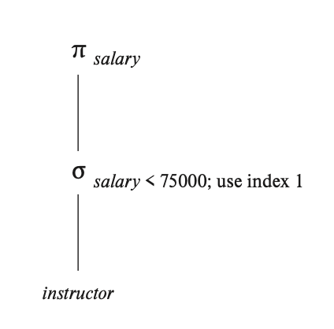
    

    - **查询执行引擎**(query-execution engine)负责生成并执行查询求值计划，以及返回查询结果

上述文字只是总结了代表性的查询处理操作，不是所有的数据库都严格遵守上述步骤执行的。

下图展示了完整的查询处理流程：

    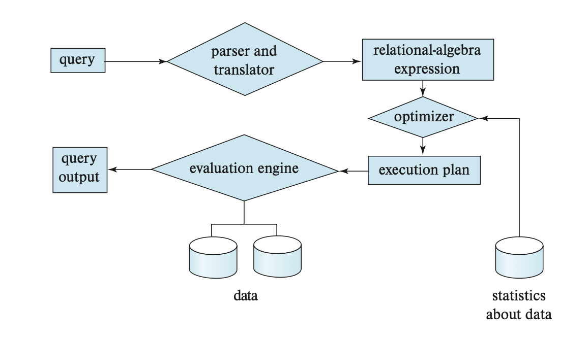

## Measures of Query Costs

- 查询求值的成本包括磁盘访问、执行查询的 CPU 时间、以及在并行或分布式数据库系统中的通信时间等
- 对于大型数据库而言，I/O 成本是最主要的成本
- 而对于在内存或 SSD 里的数据库而言，主要成本则是 CPU 成本
- 在估计查询求值计划的成本时，我们用**块传输个数**(number of blocks transfer)和**随机 I/O 访问次数**(number of random I/O accesses)（对应磁盘寻道次数）这两个因素来衡量。我们用 $t_T, t_S$ 分别表示传输一个数据块的平均时间和平均块访问时间（磁盘寻道时间 + 旋转时延）。所以，假如某个运算需要传输 $b$ 个数据块和 $S$ 次随机 I/O 访问，那么所需时间为 $b \cdot t_T + S \cdot t_S$
- 虽然 SSD 不用考虑寻道时间，但是它发起 I/O 运算时也需要一定时间，因此我们将发起 I/O 请求到数据的第一个字节返回这段时间设为 $t_S$
- 尽管我们可以在成本计算时考虑得更细，区分数据块读取和写入的成本，但为了简洁，我们就忽视这个细节问题了
- 算法的成本取决于主存缓冲区的大小。在最好情况下，缓冲区容得下所有数据，此时无需再次访问磁盘了；在最坏情况下，缓冲区只容得下部分数据块
- 虽然前面假设最开始数据都是从磁盘中读取的，但也有存在需要被访问的数据已经在内存缓冲区的情况。对于 B+ 树索引，大多数数据库系统会假设所有的内部节点都在内存缓冲区里，并假设对索引的一次遍历仅需一次对叶子结点的随机 I/O 成本
- 查询求值计划的**响应时间**(response time)，即执行计划所需的时间很难被评估，理由如下：
    - 响应时间取决于查询开始执行时缓冲区的内容，而这一信息在查询优化阶段中无法获取，即便能够获取也难以精确估计
    - 在多磁盘的系统中，响应时间还取决于访问在磁盘间的分布情况，在不清楚数据在磁盘中布局的情况下，这一信息也很难评估
    - 但在以额外资源消耗为代价的情况下，我们可以得到更好的响应时间，所以优化器会尝试减少查询计划中总的**资源消耗**(resource consumption)

## Selection Operations

### Selections Using File Scans and Indices

在查询处理中，**文件扫描**(file scans)是访问数据的最底层操作，是一种定位和检索满足选择条件的搜索算法。

在一个选择运算中，最简单的算法是**线性搜索**(linear search)（标记为 A1）：系统扫描每个文件块，检验所有的记录，看它们是否满足选择条件。

- 在访问文件的第一个块时需要一次初始的寻道；且对于存储不连续的块而言需要额外的寻道，但在这里我们忽略这一影响
- 该算法适用于任何文件；而其他算法虽然不适用于所有情况，但一旦适用的话一定会比线性搜索更快

下图展示了线性搜索，以及之后介绍的一些算法的估计成本：

    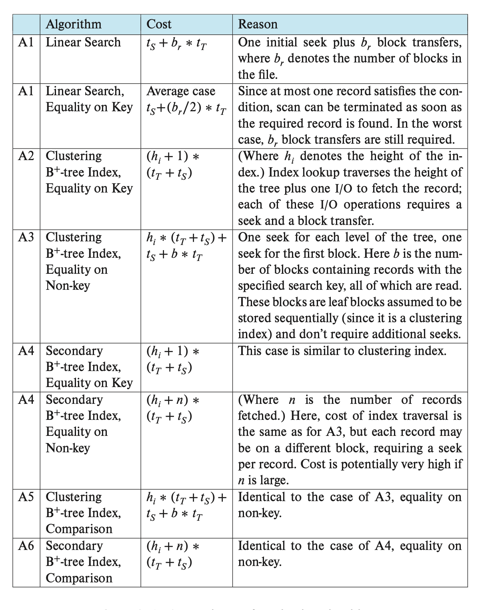

??? info "补充：各种顺序扫描优化技术"

    这些都是之前提到过的方法：

    - 压缩(compression)：能让我们在一次获取中检索更多的元组，比如 [RLE](https://en.wikipedia.org/wiki/Run-length_encoding)
    - 预取(prefetching)：提前获取一些页，这样 DBMS 就无需在访问每个页时阻塞存储器 I/O 操作
    - 缓存池旁路(buffer pool bypass)：扫描运算符将它从磁盘获取的页直接存储在本地内存中，而不是缓冲池，以避免“顺序洪水”问题
    - 并行化(parallelization)：使用并行多线程/进程执行扫描操作
    - 晚物化(late materialization)：DSM（分解存储模型）DBMS 能够延迟元组的拼接操作，直至查询计划的上层阶段。这种设计使得每个运算符仅需向下一运算符传递必要的最小信息量（例如记录 ID、列中记录的偏移位置）。该特性仅在列式存储系统中具有实际应用价值。
    - 堆聚集(heap clustering)：元组按照聚集索引指定的顺序存储在堆页面中
    - 结果缓存/物化视图(result caching/materialzation view)：存储频繁出现的子查询/查询的结果
    - 编码具化/编译(code specification/compliation)：提前预编译函数，以便在实际需要时更快地获取结果

    ---
    再介绍两个新方法：

    - **近似查询**(approximate queries)（有损数据跳过(lossy data skipping)）：对整个表中的抽样子集执行查询以生成近似结果，通常用于在允许一定误差的情况下计算聚合数据，从而获得接近准确的答案。

    - **区域映射**(zone map)（无损数据跳过(lossless data skipping)）：预计算页中每个元组属性的聚合值，这样 DBMS 可以通过首先检查其区域映射来决定是否需要访问某个页。

        - 各页的区域映射存储于独立的页中，且每个区域映射页通常包含多个条目，因此这种方法能够减少顺序扫描过程中需要检查的页面总数
        - 在云数据库系统中，由于网络数据传输成本较高，区域映射显得尤为重要

        

            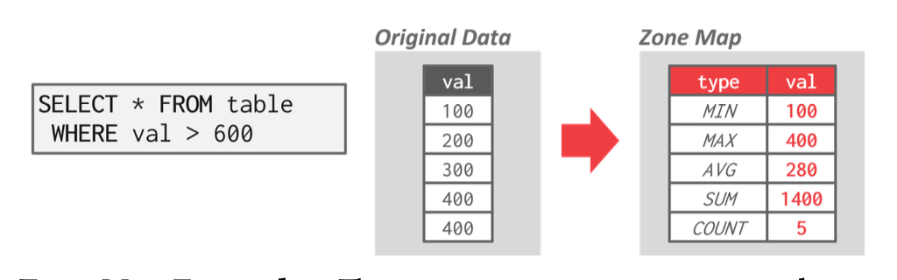
        
      

使用索引的搜索算法被称为**索引扫描**(index scan)，这一类算法包括：

- A2（聚集索引，键上的相等条件）：使用索引检索满足对应相等条件的单个记录
- A3（聚集索引，非键属性的相等条件）：和前一种情况的区别是需要获取多个记录，而这些记录必须在文件中被连续存储，因为文件是按搜索键排序的
- A4（二级索引，相等条件）：分为两种情况
    - 键上的相等条件：和 A2 类似
    - 非键属性的相等条件：每个记录可能位于不同的块内，导致每检索一条记录需要一次 I/O 操作，而 I/O 操作包含一次寻道和一次块传输。在最坏情况下，成本为 $(h_i + n) \cdot (t_S + t_T)$，其中 $n$ 为获取的记录数，$h_i$ 为 B+ 树的高度，且假设每个记录都位于不同的磁盘块，且这些磁盘块是随机排序的

对于上述算法，如果采用 B+ 树的文件组织的话，还可以节省一次访问，因为所有的记录都存储在树的叶子层级上。而此时二级索引存储的不是直接指向记录的指针，而是存储作为 B+ 树文件组织搜索键的属性值，但这样会让访问记录的成本更高。

??? example "例子"

    === "题目"

        

            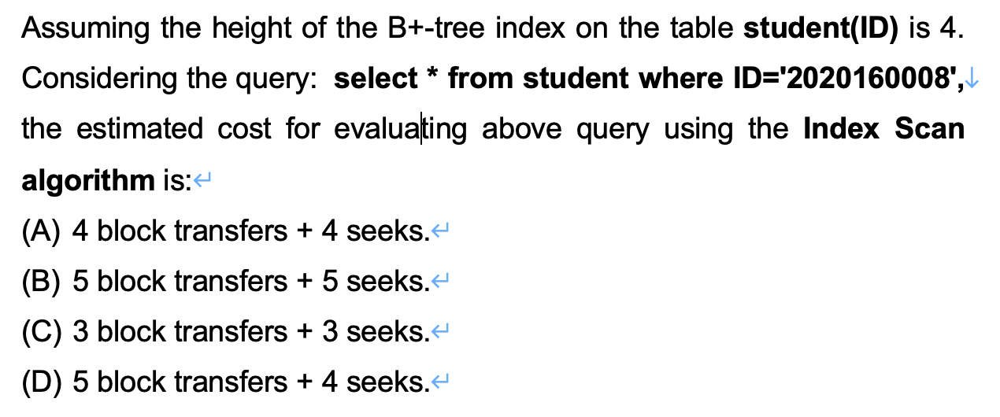
        
 

    === "解答"

        B

        根据 A2 算法的 Reason 计算就行了。

### Selections Involving Comparisons

有以下算法可以处理形如 $\sigma_{A \le v}(r)$ 的选择：

- A5（聚集索引，比较条件）
    - 对于形如 $A > v$ 或 $A \ge v$ 的比较，可以先找到 $v$ 的索引，以找到第一个满足条件的元组；然后从该元组出发进行文件扫描，直到文件末尾结束
    - 而对于形如 $A < v$ 或 $A \le v$ 的比较，则不需要先进行索引查找，而是先从文件开头进行文件扫描，直到发现第一个满足 $A = v$ 或 $A > v$ 的索引。而在这种情况下，索引显得不是特别有用
- A6（二级索引，比较条件）：正如前面所说，该方法访问单个记录的成本太高，因此很少被使用，除非选择的记录很少

如果能够提前知道匹配元组的个数的话，那么查询优化器就能基于成本估计来选择是使用二级索引，还是线性扫描。但对于在编译时不能知道精确的个数的情况，PostgreSQL 采用了一种称为**位图索引扫描**(bitmap index scan)的混合算法，这里就不展开介绍了。

### Implementation of Complex Selections

目前我们只考虑了形如 $A\ op\ B$ 的简单选择条件，其中 $op$ 是比较运算符。现在来考虑更复杂的选择谓词：

- **合取**(conjunction)：$\sigma_{\theta_1 \wedge \theta_2 \wedge \dots \wedge \theta_n}(r)$
- **析取**(disjunction)：$\sigma_{\theta_1 \vee \theta_2 \vee \dots \vee \theta_n}(r)$
- **否定**(negation)：$\sigma_{\neg \theta}(r)$

相应的算法有：

- A7（使用单索引的合取选择）：
    - 先确定对于某个简单条件而言，某个属性是否存在一条**访问路径**(access path)（即是否存在对应的索引结构）。如果有的话就可以用 A2-A6 里面的算法来检索满足条件的记录。接下来在内存缓冲区中检验被检索到的记录是否满足其余简单条件，以完成整个运算。
    - 为了节省成本，对于每个简单条件 $\theta_i$，我们从 A1-A6 中挑选出 $\sigma_{\theta_i}(r)$ 成本最低的算法。
- A8（使用复合索引的合取选择）：如果选择条件涉及到多个属性的相等比较，且有这些属性构成的复合索引的话，那么索引就能被直接搜索到。这时我们就用 A2-A4 里面的算法。
- A9（使用标识符交集的合取选择）：
    - 所有记录标识符(record indentifier)（或记录指针）的交集为一组指向满足合取条件的元组的指针
    - 该算法的成本包括单独的索引扫描，以及检索记录的成本。可通过对指针排序来降低成本
- A10（使用标识符并集的析取选择）：类似 A9，就不展开讲解了(doge)。

## Sorting

在数据库系统中，排序扮演着重要的角色，原因有：

- SQL 查询可以指定是否要对输出结果排序（`ORDER BY`）
- 对于查询处理而言，如果输入关系是排好序的话，那么一些关系运算（`GROUP BY`、`JOIN`、`DISTINCT` 等）就能被高效实现

我们可以通过构建一个基于搜索键的索引，然后根据索引读取关系实现对关系的排序。但这么做只是对关系进行**逻辑**层面的排序，而我们希望的是对关系进行**物理**层面上的排序。如果主存能够容得下所有数据的话，那我们可以直接用在算法课上学到的[排序算法](../../algorithms/fds/7.md)（比如快排）实现排序；但如果容不下的话，则需要更高级的方法，下面我们就主要针对这种情况进行讨论。

### External Sort-Merge Algorithm

>注：此事在 ADS [最后一课](../../algorithms/ads/15.md)中亦有记载，可作为参考资料比对着看。

当主存容不下所有数据时，我们用到的排序算法称为**外部排序**(external sorting)，而最常用的一种外部排序技术是**外部排序-归并**(external sort-merge)算法。我们令 $M$ 为主存缓冲区可用于排序的块数，那么该排序的执行步骤为：

1. 第一阶段：创建一组排好序的**顺串**(run)。每个顺串内部是排好序的，但仅包含关系中的部分记录。其中涉及到的算法如下：

    <pre class="pseudocode" lineNumber="true">
    \begin{algorithm}
    \caption{Creating a set of runs}
    \begin{algorithmic}
    \STATE $i = 0$;
    \REPEAT
        \STATE read $M$ blocks of the relation, or the rest of the relation whichever is smaller;
        \STATE sort the in-memory part of the relation;
        \STATE write the sorted data to run file $R_i$;
        \STATE $i = i + 1$;
    \UNTIL{the end of the relation}
    \end{algorithmic}
    \end{algorithm}
    </pre>

    - 对于排好序的顺串，我们有**早物化**(early materialization)（将整个元组存储在页内）和**晚物化**(late materialization)（仅将记录 ID 存储在页内）两种策略

        

            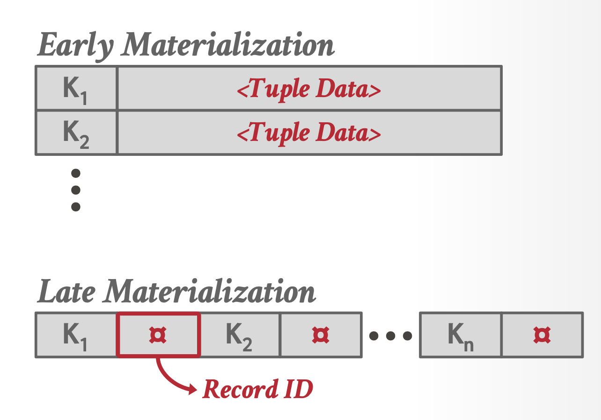
        

2. 第二阶段：**合并**这些顺串。我们目前先假设总顺串数 $N < M$，这样我们能够为每个顺串分配一个块，并且有剩余空间用于保存输出数据块。其中涉及到的算法如下：

    <pre class="pseudocode" lineNumber="true">
    \begin{algorithm}
    \caption{Merging runs}
    \begin{algorithmic}
    \STATE read one block of each of the $N$ files $R_i$ into a buffer block in memory;
    \REPEAT
        \STATE choose the first tuple (in sort order) among all buffer blocks;
        \STATE write the tuple to the output, and delete it from the buffer block;
        \IF{the buffer block of any run $R_i$ is empty \AND \NOT end-of-file($R_i$)}
            \STATE read the next block of $R_i$ into the buffer block;
        \ENDIF
    \UNTIL{all input buffer blocks are empty}
    \end{algorithmic}
    \end{algorithm}
    </pre>

合并阶段的输出是一个排好序的关系。输出文件需要被缓存，以减少磁盘写操作的次数。这个合并操作实际上是一种用于内存的标准归并排序算法中的二路合并操作的泛化。假如合并的是 $N$ 个顺串的话，这个操作就是 **N 路合并**(N-way merge)了

但在一般情况下，如果关系的大小超过内存容量的话，那么在第一步中可能会产生不低于 $M$ 个顺串，因此在合并过程中可能没法为每个顺串分配内存块。此时合并操作需要分为多**趟**(pass)运行，且每趟合并至多将 $M-1$ 个顺串作为输入。

第一趟的运算过程为：

- 合并前 $M-1$ 个顺串，得到一个用于下一趟的新的顺串
- 接着合并后 $M-1$ 个顺串，以此类推，知道所有初始的顺串都被处理过

此时顺串的数量缩减为原来的 $\dfrac{1}{M-1}$。如果这个数量还是不低于 $M$ 的话，那就需要另一趟的处理了，如此重复，直到趟数小于 $M$ 为止。而最后一趟的结果就是最终排好序的输出。下图展示的便是在外部排序中使用归并排序的过程，这里假设一个元组对应一个数据块（$f_r = 1$），且假设内存至多保存3个数据块，其中2个用于输入，1个用于输出：

    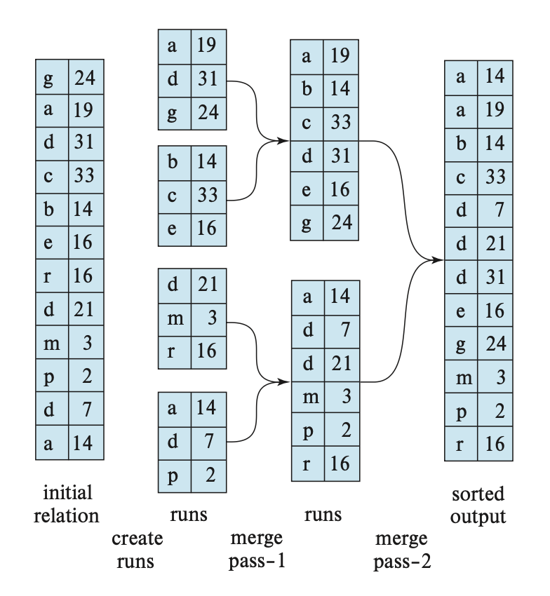

??? example "例子：计算趟数"

    

        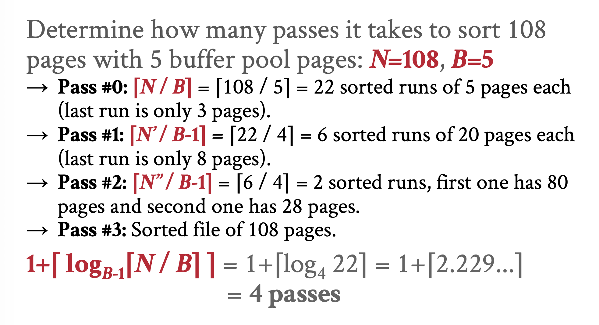
    

### Cost Analysis

- 先计算磁盘访问成本：
    - 令 $b_r$ 为包含关系 $r$ 元组的块数。第一阶段需要对每个块进行一次读操作和一次写操作，因此共计 $2b_r$ 次块传输
    - 初始的顺串数为 $\lceil \dfrac{b_r}{M} \rceil$
    - 合并时，一次从数据块中读取一个顺串会带来大量的寻道操作，为降低寻道次数，我们为每个输入顺串和输出顺串分配 $b_b$ 个更大的缓存块，因此每一趟可以合并 $\lfloor \dfrac{M}{b_b} - 1 \rfloor$ 个顺串，也就是说每次合并后的顺串数降低到原来的 $\lfloor \dfrac{M}{b_b} - 1 \rfloor$
    - 总的合并趟数为 $\lceil \log_{\lfloor \frac{M}{b_b} - 1 \rfloor} (\dfrac{b_r}{M}) \rceil$
    - 每一趟都要对每个数据块进行一次读操作和一次写操作，除了以下两种情况
        - 最后一趟得到的输出无需写入磁盘
        - 有些顺串可能在某一趟中既不被读取也不被写入，在这里我们忽略这个特殊情况
    - 总的块传输次数为：$b_r(2\lceil \log_{\lfloor \frac{M}{b_b} - 1 \rfloor} (\dfrac{b_r}{M}) \rceil + 1)$

- 再计算磁盘寻道成本：
    - 顺串生成时需要为每个趟进行读和写的操作
    - 每趟合并需要分别大约 $\lceil \dfrac{b_r}{b_b} \rceil$ 次用于读取和写入数据的寻道，即共计 $2 \lceil \dfrac{b_r}{b_b} \rceil$ 次寻道（除了最后一趟）
    - 总的寻道数为：$2 \lceil \dfrac{b_r}{M} \rceil + \lceil \dfrac{b_r}{b_b} \rceil (2\lceil \log_{\lfloor \frac{M}{b_b} - 1 \rfloor} (\dfrac{b_r}{M}) \rceil - 1)$

??? example "例子"

    === "题目"

        

            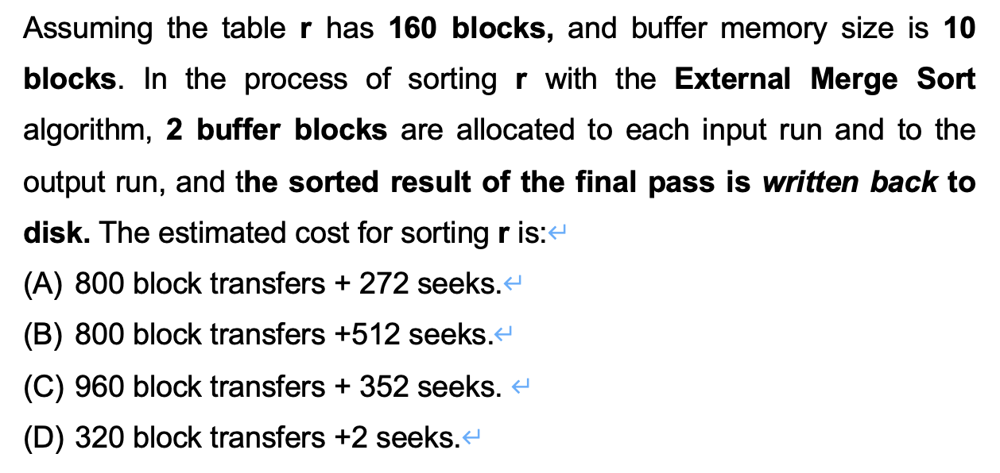
        

    === "解答"

        答案：C（之前误以为 Gemini 生成的答案是错的，不好意思orz（~~2次反转~~））

        直接拿上面的公式代就行了：

        - 趟数 = $\lceil \log_{\lfloor \frac{M}{b_b} - 1 \rfloor} (\dfrac{b_r}{M}) \rceil = \lceil \log_{\lfloor \frac{10}{2} - 1 \rfloor} (\dfrac{160}{10}) \rceil = 2$ 

        !!! warning "注意"

            题目强调了 "the sorted result of the final pass is written back to disk"，所以还要考虑将所有记录写入磁盘所需的块传输次数和寻道次数，而上面给出的公式没有考虑到这一块，需要补上（用红字表示）。

        - 块传输次数 = $b_r (2 \text{pass} + 1) \textcolor{red}{+ b_r} = 160 \times (2 \times 2 + 1) \textcolor{red}{+ 160} = 960$
        - 寻道次数 = $2 \lceil \dfrac{b_r}{M} \rceil + \lceil \dfrac{b_r}{b_b} \rceil (2 \text{pass} - 1 \textcolor{red}{+ 1}) = 2 \lceil \dfrac{160}{10} \rceil + \lceil \dfrac{160}{2} \rceil (2 \times 2 - 1 \textcolor{red}{+ 1}) = 352$

??? info "补充：比较运算的优化"

    - **编码具化**(code specialization)：不提供作为指向排序算法指针的比较函数，而是创建一个针对特定键类型的硬编码排序版本
    - **后缀截断**(suffix truncation)：首先比较长 `VARCHAR` 键的二进制前缀，而非较慢的字符串比较；若前缀相同，则回退至较慢的比较方式

??? info "使用 B+ 树排序"

    在某些情况下，DBMS 利用现有的 B+ 树索引辅助排序可能比采用外部归并排序算法更为高效。部分 DBMS 支持通过前缀键扫描实现排序功能。具体可分为以下情况：

    - **聚集 B+ 树**：当索引为聚集索引时，DBMS 只需遍历 B+ 树即可完成排序。由于数据实际存储的顺序与索引顺序一致，I/O 访问将会是顺序的。这种方式无需额外计算开销，其性能始终优于外部归并排序。

        

            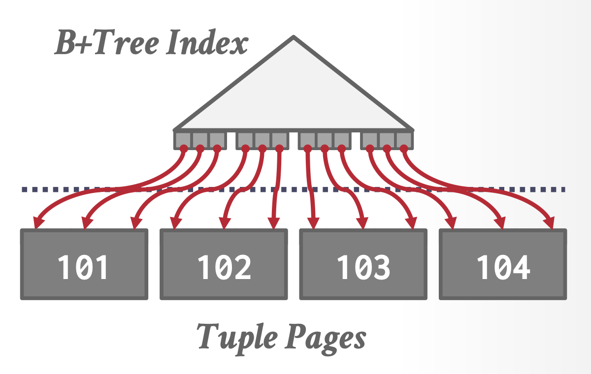
        

    - **非聚集 B+ 树**：若使用非聚集索引进行遍历，则通常效率更低，因为每条记录可能分散在不同数据页中，几乎每次记录访问都会触发磁盘读取操作。
        - 唯一的例外是 Top-N 查询（当 N 值相对于表总元组数足够小时），此时该方法可能有一定优势。

        

            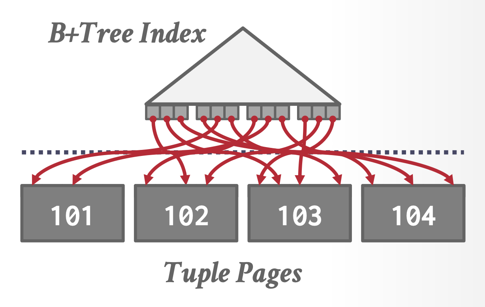
        

??? info "补充：Top-N 堆排序"

    如果查询中包含带有 `LIMIT` 的 `ORDER BY` 子句，那么为了找出前 N 个元素，DBMS 只需扫描一次数据，同时维护一个包含当前所见前 N 个元素的堆（优先队列）。堆排序的理想情况是当这前 N 个元素能被内存容纳时，DBMS 就能直接在内存中对其操作了。

    

        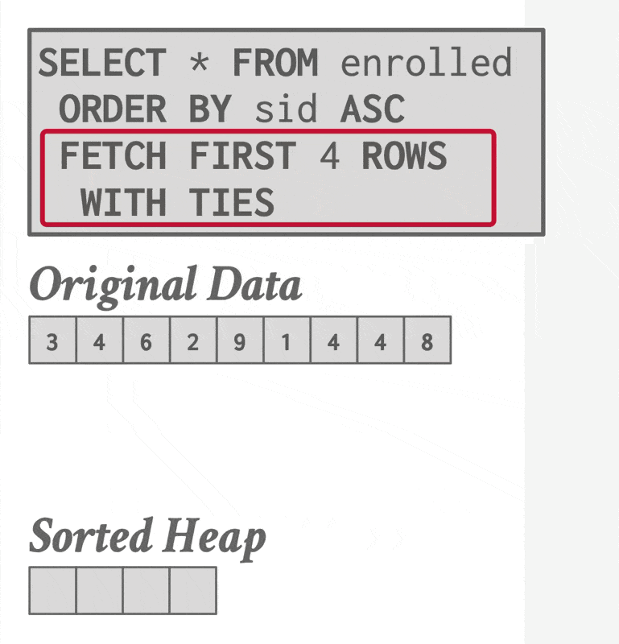
    

## Join Operations

下面我们来认识一些用于计算关系连接的算法，并分析这些算法的成本。

!!! info "注"

    我们约定：
    
    - 用**相等连接**(equi-joins)来指代形如 $r \bowtie_{r.A = s.B} s$ 的连接，其中 $A, B$ 分别是 $r, s$ 的属性
    - $R \cap S$ 表示两个关系模式的共同属性

### Nested-Loop Join

**嵌套循环连接**(nested-loop join)的算法（计算 theta 连接 $r \bowtie_\theta s$）如下所示：

<pre class="pseudocode" lineNumber="true">
\begin{algorithm}
\caption{Nested-loop join}
\begin{algorithmic}
\FORALL{tuple $t_r$ in $r$}
    \FORALL{tuple $t_s$ in $s$}
        \STATE test pair $(t_r, t_s)$ to see if they satisfy the join condition $\theta$
        \STATE if they do, add $t_r \cdot t_s$ to the result;
    \ENDFOR
\ENDFOR
\end{algorithmic}
\end{algorithm}
</pre>

- 其中关系 $r$ 被称为**外层关系**(outer relation)，$s$ 被称为**内层关系**(inner relation)。该算法里面用到了符号 $t_r \cdot t_s$，表示 $t_r, t_s$ 两个元组根据相同属性值拼接后构成的元组。
- 该算法不要求用到索引，且适用于任何连接条件
- 我们可以将该算法扩展至计算自然连接——只要在  theta 连接后的结果的基础上去除 $t_r \cdot t_s$ 的重复属性即可
- 该算法成本较高，因为需要检验两个关系中的每一个元组对，总共有 $n_r \cdot n_s$ 个元组对（其中 $n_r, n_s$ 分别表示 $r, s$ 的元组数）
- 在最坏情况下，缓冲区只能为每个关系保存一个块，因此需要 $n_r \cdot b_s + b_r$ 次块传输（$b_r, b_s$ 分别表示包含 $r, s$ 元组的块数）和 $n_r + b_r$ 次寻道
- 在最好情况下，内存能够同时存放两个关系，因此仅需 $b_r + b_s$ 次块传输和 2 次寻道
- 如果内存仅能保存一个完整的关系，那么最好让内层关系 $s$ 放在内存中，因为这样内层关系只需读一次就行了。此时的成本和最好情况下的一致

### Block Nested-Loop Join

如果缓冲区太小，无法容得下任何一个完整的关系，那我们可以通过按块读取关系，而不是按元组读取关系来节省块的访问次数。这里我们用到的是**块嵌套循环连接**(block nested-loop join)算法，如下所示：

<pre class="pseudocode" lineNumber="true">
\begin{algorithm}
\caption{Block nested-loop join}
\begin{algorithmic}
\FORALL{block $B_r$ in $r$}
    \FORALL{block $B_s$ in $s$}
        \FORALL{tuple $t_r$ in $B_r$}
            \FORALL{tuple $t_s$ in $B_s$}
                \STATE test pair $(t_r, t_s)$ to see if they satisfy the join operation
                \STATE if they do, add $t_r \cdot t_s$ to the result;
            \ENDFOR
        \ENDFOR
    \ENDFOR
\ENDFOR
\end{algorithmic}
\end{algorithm}
</pre>

- 在最坏情况下，对于外层关系的每个块，只能读取一个内层关系的块，因此需要 $b_r \cdot b_s + b_r$ 次块传输，以及 $2 \cdot b_r$ 次寻道。不难发现，**将更小的关系作为外层关系**会使运算更为高效
- 在最好情况下，当内层关系可被内存容纳时，此时仅需 $b_r + b_s$ 次块传输和 2 次寻道

---
嵌套循环和块嵌套循环的性能还能通过以下方法进一步提升：

- 如果自然连接或相等连接中的连接属性构成了内层关系的键，那么对于每个外层关系的元组，当发现第一个匹配的元组时，内层循环能够马上就终止
- 在块嵌套循环中，我们用内存能够容纳（且为内层关系和输出预留足够空间）的最大的数据块。换句话说，假设有 $M$ 个内存块，那么我们每次从外层关系读取 $M - 2$ 个数据块（对于剩下2个内存块，一个用于输入，一个用于输出）。这样能够降低扫描内部关系的次数（从 $b_r$ 降到 $\lceil \dfrac{b_r}{M-2} \rceil$，并且此时的成本为 $\lceil \dfrac{b_r}{M-2} \rceil \cdot b_s + b_r$ 次块传输和 $2 \lceil \dfrac{b_r}{M-2} \rceil$ 寻道
- 我们可以交替地前后扫描循环，这样可以对磁盘块进行排序，使得留在缓冲区的数据能够被再次使用，从而降低磁盘访问次数
- 如果内层循环连接属性上的索引可用的话，那么可以用更高效的索引查找来替代文件扫描，下面就来介绍这种方法

### Indexed Nested-Loop Join

上述用索引查找替代文件扫描的连接方法被称为**索引嵌套循环连接**(indexed nested-loop join)。大致算法如下：

<pre class="pseudocode" lineNumber="true">
\begin{algorithm}
\caption{Indexed nested-loop join}
\begin{algorithmic}
\FORALL{tuple $r$ in $R$}
    \FORALL{tuple $s$ in Index($r_i = s_j$)}
        \IF{$r$ and $s$ match}
            \STATE add $r \cdot s$ to the result
        \ENDIF
    \ENDFOR
\ENDFOR
\end{algorithmic}
\end{algorithm}
</pre>

该方法的成本为：

- 对于外层关系 $r$ 的每一个元组，都要对 $s$ 的索引进行一次查找，并检索到相关的元组
- 在最坏情况下，缓冲区的空间仅能容纳 $r$ 的一个块以及索引的一个块，那么读取 $r$ 需要 $b_r$ 次 I/O 操作（包括一次寻道和一次块传输）。所以此时连接的成本为 $b_r(t_T + t_S) + n_r \cdot c$，其中 $c$ 时使用连接条件对 $s$ 的单个选择所需的成本

??? example "例子"

    

        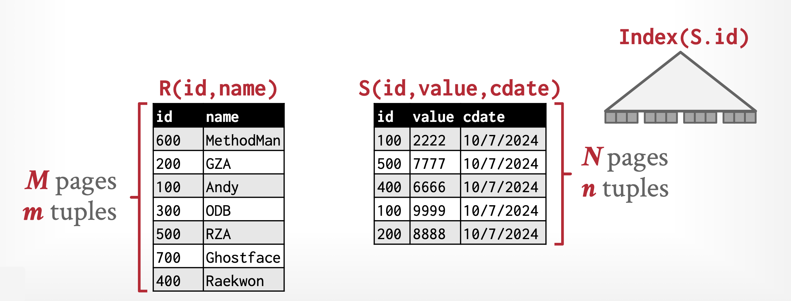
    

### Merge Join

#### Algorithm

**合并连接**(merge-join)的算法如下：

<pre class="pseudocode" lineNumber="true">
\begin{algorithm}
\caption{Merge join}
\begin{algorithmic}
    \STATE $pr$ := address of first tuple of $r$;
    \STATE $ps$ := address of first tuple of $s$;
    \WHILE{($ps \ne$ null \AND $pr \ne$ null)}
        \STATE $t_s$ := tuple to which $ps$ points;
        \STATE $S_s$ := $\{t_s\}$;
        \STATE set $ps$ to point to next tuple of $s$;
        \STATE $done := false$;
        \WHILE{(\NOT $done$ \AND $ps \ne$ null)}
            \STATE $t_s'$ := tuple to which $ps$ points;
            \IF{($t_s'[JoinAttrs] = t_s[JoinAttrs]$)}
                \STATE $S_s := S_s \cup \{t_s'\}$
                \STATE set $ps$ point to next tuple of s;
            \ELSE
                \STATE $done := true$;
            \ENDIF
        \ENDWHILE
        \STATE $t_r$ := tuple to which $pr$ points;
        \WHILE{($pr \ne null$ \AND $t_r[JoinAttrs] < t_s[JoinAttrs]$)}
            \STATE set $pr$ to point to next tuple of $r$;
            \STATE $t_r$ := tuple to which $pr$ points;
        \ENDWHILE
        \WHILE{($pr \ne null$ \AND $t_r[JoinAttrs] = t_s[JoinAttrs]$)}
            \FORALL{$t_s$ in $S_s$}
                \STATE add $t_s \bowtie t_r$ to result;
            \ENDFOR
            \STATE set $pr$ to point to next tuple of $r$;
            \STATE $t_r :=$ tuple to which $pr$ points;
        \ENDWHILE
    \ENDWHILE
\end{algorithmic}
\end{algorithm}
</pre>

其中，$JoinAttrs$ 指代 $R \cap S$。

??? example "例子（动画演示）"

    

        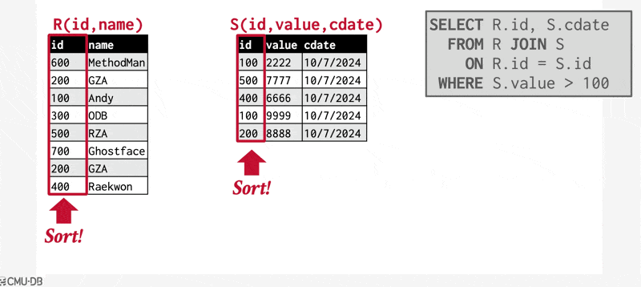
    

该算法要求 $S_s$ 中的元组能够被主存容纳。如果 $S_s$ 的大小超过可用内存的大小的话，那么可以采用块嵌套循环连接，匹配连接属性值相同的，分别来自 $r, s$ 的两个块。

如果输入关系 $r, s$ 没有基于连接属性进行排序的话，那么就需要先对它们进行排序（可采用[上一节](#sorting)介绍的算法实现）。

#### Cost Analysis

一旦关系是排好序的（这里指的是物理层面上的），那么相同连接属性值的元组的顺序是连续的，因此每个元组只需读取一次，从而每个块也只需读取一次。那么块传输数量为 $b_r + b_s$。

假设为每个关系分配了 $b_b$ 个缓存块，那么磁盘寻道次数为 $\lceil \dfrac{b_r}{b_b} \rceil + \lceil \dfrac{b_s}{b_b} \rceil$。由于相比块传输，寻道成本更高，因此我们应尽可能为每个关系分配多个缓存块。

如果输入关系 $r, s$ 还没有排好序，那我们还得考虑排序的成本。并且如果内存无法完全容纳 $S_s$ 的话，还会带来额外的一点点成本。

??? question "合并连接何时有用？"

    - 其中一个表格已经按照连接属性排好序了
    - 要求输出必须按照连接属性排序

#### Hybrid Merge Join

如果连接属性上有二级索引的话，那我们可对未排好序的元组执行一种合并连接的变体。该算法通过索引对记录进行扫描，这样的检索顺序就是排好序的。但该方法有一个显著的缺陷：由于记录可能分散在各个文件块内，因此每次元组访问都会带来一次磁盘块访问，成本相当高。

为避免这种成本，我们采用一种**混合合并连接**(hybrid merge-join)的技术，将索引和合并连接结合起来。基于上述假设（并假设二级索引用到 B+ 树），我们根据二级 B+ 树索引的叶子项来合并排好序的关系，得到的结果文件包含了来自排好序的关系的元组，以及该元组在未排好序的关系中的地址。然后该结果文件会根据这些地址进行排序，这样就能以物理存储顺序高效检索对应的元组，从而完成连接操作。

### Hash Join

在**哈希连接**(hash-join)中，我们用哈希函数 $h$ 来分区两个关系中的元组，具体来说是将连接属性具有相同哈希值的元组放在一个集合内。我们假设：

- $h$ 是一个将 $JoinAttrs$ 值映射到 $\{0, 1, \dots, n_h\}$ 的哈希函数，其中 $JoinAttrs$ 是 $r, s$ 在自然连接中的共同属性
- $r_0, r_1, \dots, r_{n_h}$ 表示对 $r$ 元组的分区，每个分区初始均为空，且每个元组 $t_r \in r$ 被放在分区 $r_i$ 内，其中 $i = h(t_r[JoinAttrs])$
- $s_0, s_1, \dots, s_{n_h}$ 表示对 $s$ 元组的分区，每个分区初始均为空，且每个元组 $t_s \in s$ 被放在分区 $s_i$ 内，其中 $i = h(t_s[JoinAttrs])$

下图展示了在关系上的哈希分区：

    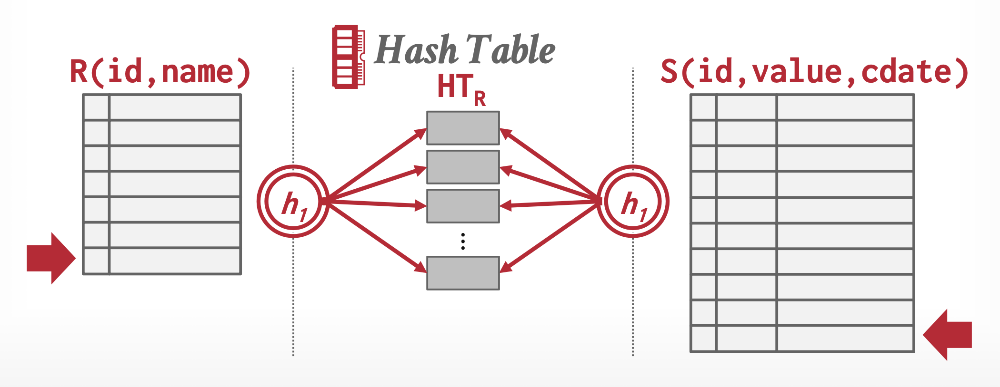

#### Basics

哈希连接的基本思想是：假设来自 $r$ 的元组和来自 $s$ 的元组满足连接条件，也就是说它们有相同的连接属性值。如果这个值通过哈希函数映射到值 $i$，那么来自 $r$ 的元组被归入到分区 $r_i$，来自 $s$ 的元组被归入到分区 $s_i$。所以 $r_i$ 中的元组仅需和 $s_i$ 中的元组进行比较，无需考虑其他分区下的元组。

哈希连接的算法如下所示：

<pre class="pseudocode" lineNumber="true">
\begin{algorithm}
\caption{Hash join}
\begin{algorithmic}
    \STATE
    \COMMENT{Partition $s$}
    \FORALL{tuple $t_s$ in $s$}
        \STATE $i := h(t_s[JoinAttrs])$;
        \STATE $H_{s_i} := H_{s_i} \cup \{t_s\}$;
    \ENDFOR
    \STATE
    \COMMENT{Partition $r$}
    \FORALL{tuple $t_r$ in $r$}
        \STATE $i := h(t_r[JoinAttrs])$;
        \STATE $H_{r_i} := H_{r_i} \cup \{t_r\}$;
    \ENDFOR
    \STATE
    \COMMENT{Perform join on each partition}
    \FOR{$i := 0$ to $n_h$}
        \STATE read $H_{s_i}$ and build an in-memory hash index on it;
        \FORALL{tuple $t_r$ in $H_{r_i}$}
            \STATE probe the hash index on $H_{s_i}$ to locate all tuples $t_s$
            \STATE $\quad$ such that $t_s[JoinAttrs] = t_r[JoinAttrs]$;
            \FORALL{matching tuple $t_s$ in $H_{s_i}$} 
                \STATE add $t_r \bowtie t_s$ to the result;
            \ENDFOR
        \ENDFOR
    \ENDFOR
\end{algorithmic}
\end{algorithm}
</pre>

- 分区好关系后，就要对每个分区对 $i\ (i = 0, \dots, n_h)$ 执行单独的索引嵌套循环连接。具体来说，
    - 首先要为每个 $s_i$ **构建**(build)一个哈希索引：
    - 然后从 $r_i$ 中**探测**(probe)（即查找）对应的元组：
    
    因此关系 $s, r$ 分别叫做**构建输入**和**探测输入**。

- $s_i$ 的哈希索引的构建是在内存中进行的，所以无需到磁盘中访问元组。注意用于构建哈希索引的哈希函数必须和用于分区的哈希函数不同，但也仅作用在连接属性上。在索引嵌套循环连接中，系统使用哈希索引来检索与探测输入中的记录匹配的记录。
- 构建和探测阶段都仅需一趟即可
- $n_h$ 的大小必须足够大，使得对于每个 $i$，在构建关系的分区 $s_i$ 的元组和该分区的哈希索引能够被内存容纳。但没必要让探测关系的分区被内存完全容纳。所以我们**让更小的那个关系作为构建关系**。
- 如果构建关系包含 $b_s$ 个块，每个分区的大小不超过 $M$，那么分区数量 $n_h$ 至少为 $\lceil \dfrac{b_s}{M} \rceil$
    - 但在内存大小（假如最多存放 $M$ 个数据块）不够的情况下，那么分区数量至多为 $M - 1$（还有留1个块作为输入缓冲区）

#### Recursive Partitioning

但如果 $n_h \ge $ 块数的话，关系就无法在一趟内被分区完毕，因为没有足够多的缓存块。因而分区过程需要花多趟完成——在每一趟中，只要能为输出留够缓存的话，就分区出尽可能多的分区。从某趟中得到的每个桶会在下一趟中被单独读取和分区，以创建更小的分区。注意每一趟用到的哈希函数是不同的。系统将会重复进行分区操作，直到构建输入的每个分区都能被内存容纳得下为止。这样的分区过程称为**递归分区**(recursive partitioning)。

当 $M > n_h + 1$，即 $M > \dfrac{b_s}{M} + 1$（可简化（近似）为 $M > \sqrt{b_s}$）时，该关系就无需进行递归分区了。

??? example "例子"

    === "题目"

        

            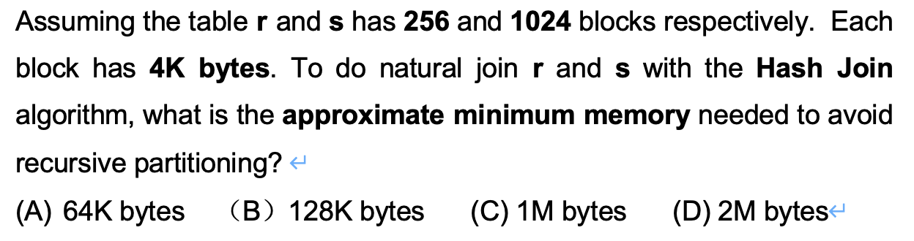
        

    === "解答"

        答案：A

        取较小的那个关系 $S$ 作为构建关系，块数 $b_s = 256$，所以 $M_{\min} = 4KB \times \sqrt{256} = 64KB$

下图展示了递归分区的过程：

    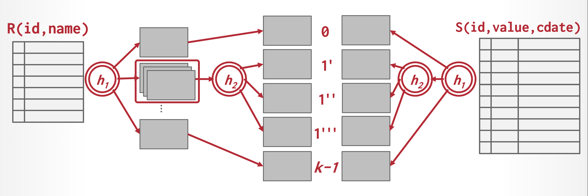

#### Handling of Overflows

在构建关系 $s$ 的分区 $i$ 中，如果 $s_i$ 的哈希索引大小大于内存容量的话，那么就发生了**哈希表溢出**(hash-table overflow)的问题。该问题的内在原因可能是构建关系的很多元组具有相同的连接属性值，或者哈希函数不具备很好的随机性和均匀性(uniformity)，这样就会导致一些分区包含超过均值的元组数，而另一些分区则低于均值——我们认为这样的分区是**偏斜的**(skew)。

我们可通过增加分区数量，使得每个分区的大小小于内存容量来应对少量的偏斜问题。而那个增加的量称为**任意数值**(fudge factor)，通常在 20% 左右。

但即便这样也不一定能够解决溢出问题，此时可通过以下方法来处理：

- **溢出解决**(overflow resolution)：如果在构建阶段时检测到哈希索引的溢出，那么就将对应的分区（$s_i, r_i$ 均适用）通过不同的哈希函数，分区得到更小的分区
- **溢出避免**(overflow avoidance)：小心地执行分区操作，使得在构建阶段中不会出现溢出问题。具体来说，在一开始就将构建关系 $s$ 分区为很多较小的分区，然后将一些结合后能够为内存容纳的分区进行结合。探测关系也可以按类似方法操作

然而，这两种方法还是没法应对更为极端的情况，此时我们可以尝试用其他的连接技术，比如块嵌套循环连接等。

#### Cost Analysis

!!! info "注"

    这里假设没有哈希表溢出的问题出现。

假如**不用递归分区**的话，

- 对两个关系 $r, s$ 的分区需要一次读和一次写操作，因此共计 $2(b_r + b_s)$ 次块传输。而构建和探测阶段需要读取每个分区一次，因此需要另外 $b_r + b_s$ 次块传输。而分区所占据的块数可能略多于 $b_r + b_s$，因此会出现一些内容仅部分占满的数据块。对于每个关系，访问这样的数据块至多会带来 $2n_h$ 的开销。因而总的**块传输**为 $3(b_r + b_s) + 4n_h$ 次，其中 $4n_h$ 通常比前一项小很多，可以忽略不计。
- 假如为输入和输出缓冲区分配了 $b_b$ 个块，那么分区需要 $2(\lceil \dfrac{b_r}{b_b} \rceil + \lceil \dfrac{b_s}{b_b} \rceil)$ 次寻道。而在构建和探测阶段中，对于每个关系的 $n_h$ 个分区，各仅需一次寻道。因此总计 $2(\lceil \dfrac{b_r}{b_b} \rceil + \lceil \dfrac{b_s}{b_b} \rceil) + 2n_h$ 次**寻道**。

但假如用到**递归分区**的话，

- 每一趟分区会将分区的数量减少到原来的 $\lceil \dfrac{M}{b_b} - 1 \rceil$，且预计趟数为 $\lceil \log_{\lfloor \frac{M}{b_b} - 1 \rfloor}\dfrac{b_s}{M} \rceil$
- 在每一趟中，$s$ 中的每个块都要被读和写一次，因此在分区 $s$ 时的块传输次数为 $2b_s \lceil \log_{\lfloor \frac{M}{b_b} - 1 \rfloor}\dfrac{b_s}{M} \rceil$。分区 $r$ 时所需的块传输次数和分区 $s$ 时的基本一致，因此总的**块传输**次数为：$2(b_r + b_s) \lceil \log_{\lfloor \frac{M}{b_b} - 1 \rfloor}\dfrac{b_s}{M} \rceil + b_r + b_s$。
- 我们忽略在构建和探测阶段需要的少量寻道，总的**寻道**次数为 $2(\lceil \dfrac{b_r}{b_b} \rceil + \lceil \dfrac{b_s}{b_b} \rceil) \lceil \log_{\lfloor \frac{M}{b_b} - 1 \rfloor}\dfrac{b_s}{M} \rceil$。

如果主存容量足够大，可以放得下整个构建输入的话，那么 $n_h = 0$，无需对关系进行分区。此时仅需 $b_r + b_s$ 次块传输和 2 次寻道。

当外层关系较小时，索引嵌套循环连接的成本会比哈希连接更低。但如果用的是二级索引的话，那么情况就会反转。所以，要是能够在查询优化时知道外层关系的元组个数的话，就能够使用最佳的连接算法了；但有时可能只有在运行时才能确定这个量——一些系统允许在运行时动态选择算法。

??? example "例子"

    === "例1"

        === "题目"

            

                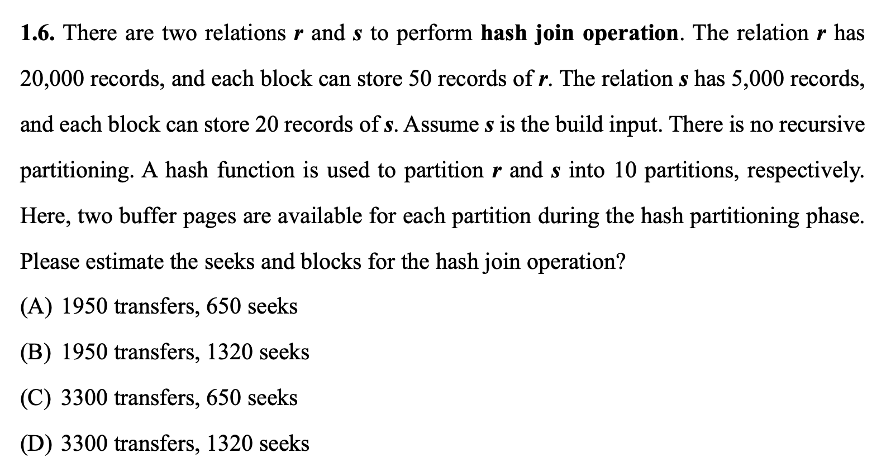
            
            

        === "解答"

            A

            直接套上面公式，其中 $b_r = 20000 / 50 = 400, b_s = 5000 / 20 = 250, b_b = 2$（$n_h = 10$ 但由于这个量很小就不用考虑进去）。

    === "例2"

        === "题目"

            

                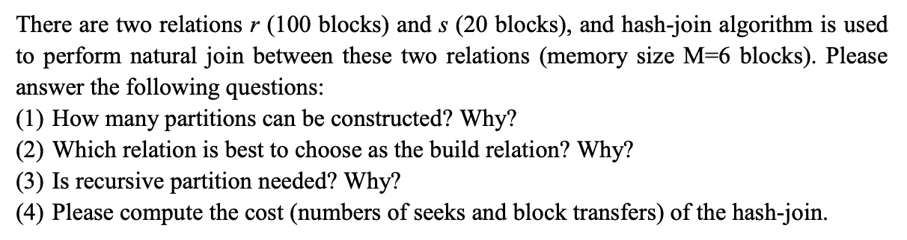
            

        === "解答"

            

                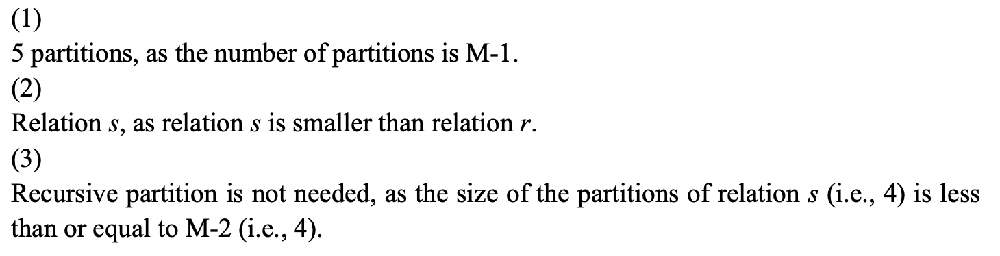
            

            

                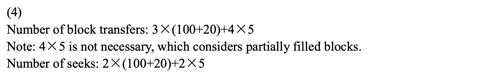
            

### Complex Joins

我们来考虑连接条件更为复杂的连接运算——连接条件包括条件之间的合取和析取。我们可以结合前面介绍的一些用于复杂选择的[算法](#implementation-of-complex-selections)和连接技术来应对这种情况。

- 对于包含合取条件的连接：$r \bowtie_{\theta_1 \wedge \theta_2 \wedge \dots \wedge \theta_n} s$，我们可以先计算其中某个简单连接条件下的连接 $r \bowtie_{\theta_i} s$，然后看这个中间结果里的元组是否满足剩余的条件 $\theta_1 \wedge \dots \wedge \theta_{i-1} \wedge \theta_{i+1} \wedge \dots \wedge \theta_n$
- 对于包含析取条件的连接：$r \bowtie_{\theta_1 \vee \theta_2 \vee \dots \vee \theta_n} s$，可通过计算单个连接 $r \bowtie_{\theta_i} s$ 的记录的并集来完成计算：$(r \bowtie_{\theta_1} s) \cup (r \bowtie_{\theta_2} s) \cup \dots \cup (r \bowtie_{\theta_n} s)$

???+ abstract "总结：比较各种连接算法的成本"

    

        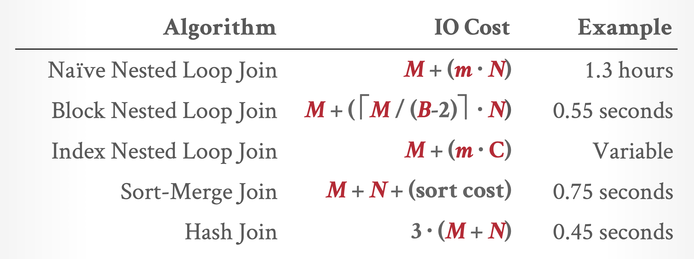
    

    其中 $M, N$ 分别指代关系 $R, S$ 的数据块个数，$m, n$ 分别指代关系 $R, S$ 的元组数，$C$ 指代常数。这里的 I/O cost 对应的是数据传输次数

## Other Operations

### Duplicate Elimination

要想消除重复项，我们可以先对关系进行**排序**。排序之后，相同的元组就会出现在相邻的位置上，但只保留其中一份拷贝。

- 在**外部排序归并**算法中，我们可以在创建顺串时，且在将顺串写入磁盘前发现并移除重复项，从而减少块传输次数。剩下来的重复项能够在合并阶段被消除，这样最终排好序的顺串就不会包含重复项了。所以在最坏情况下消除重复项的成本和在最坏情况下对关系排序的成本一样。
- 在**哈希连接**算法中，我们也可以用哈希来去重。在为每个分区构建哈希索引时，我们仅插入那些不存在的元组，否则就丢掉这个元组。当分区的所有元组都被处理过后，就讲它的哈希索引写入到结果中。所以此时去重的成本和处理构建关系的成本一样。

由于去重成本相对较高，因此 SQL 需要用户发起显式的去重请求（使用 `UNIQUE` 关键字），否则的话默认保留重复项。

### Projection

整个关系进行（广义）投影操作，就要对每个元组进行投影。这样很容易出现重复项，需要去重，方法就在上面👆。

### Set Operations

- 集合运算包括并、交、差。对于这些运算，仅需对两个排好序的关系进行一次扫描即可，因此块传输次数为 $b_r + b_s$。
- 在最坏情况下，如果每个关系仅有一个块缓冲区的话，那么还需要 $b_r + b_s$ 次寻道。所以可通过分配额外的缓存块来降低寻道次数。
- 如果关系没有排好序的话，那么还要考虑**排序**的成本。
- 也可以用**哈希**来实现集合运算：先对两个关系分别进行分区，且要使用相同的哈希函数，然后分情况讨论
    - $r \cup s$
        - 为 $r_i$ 构建在内存上的哈希索引
        - 当 $s_i$ 中的元组没有出现时，就向哈希索引加入该元组
        - 将哈希索引的元组加到结果中
    - $r \cap s$
        - 为 $r_i$ 构建在内存上的哈希索引
        - 对于 $s_i$ 的每个元组，探测哈希索引，如果该元组出现在哈希索引中的话，就输出该元组
    - $r - s$
        - 为 $r_i$ 构建在内存上的哈希索引
        - 对于 $s_i$ 的每个元组，当它在哈希索引中出现时，就从哈希索引中删除该元组
        - 将哈希索引的元组加到结果中

### Outer Join

有两种实现外连接运算的方法：

- 先计算 $r \bowtie s$，然后加上 $r$⟕$_\theta s$ 和  $r$⟖$_\theta s$ 中额外出现的元组，这样就够成了完整的 $r$⟗$_\theta s$
    - 计算 $r$⟕$_\theta s$ 的话，可以先算 $r \bowtie_\theta s$，将结果临时存放在关系 $q_1$ 内；然后计算 $r - \Pi_R(q_1)$ 获取那些没有参与到 theta 连接的 $r$ 的元组，对这些元组用 null 值填充后加入到 $q_1$ 中，得到最终结果
    - 由于 $r$⟖$_\theta s$ 等价于 $s$⟕$_\theta r$，所以计算步骤同上，不再赘述

- 修改原有的连接算法。
    - 将嵌套循环连接算法进行扩展，用来计算左外连接：对于外层关系中没有和任何内层关系中的元组匹配的元组，用 null 值对其填充后将其写入到输出中。然而该方法很难扩展到全外连接
    - 可以通过扩展合并连接和哈希连接来计算外连接
        - 在合并连接算法中，实现外连接所需的成本和实现对应的一般连接的成本基本一致，唯一的区别是结果的规模不同

### Aggregation

- 聚合运算的实现和去重类似，同样可以使用排序或哈希（相比排序更适用于无需考虑顺序的情况），但是要基于用于分组的属性
- 实现聚合运算的成本和对聚合函数进行去重操作的成本一致
- 在聚合运算分组的同时，就要为分好的每个组进行处理
    - 对于 `SUM`、`MIN` 和 `MAX`，当同一组内发现两个元组时，当在同一分组中发现两个元组时，系统会将它们替换为一个单独的元组，该元组分别包含被聚合列的 `SUM`、`MIN` 和 `MAX`
    - 对于 `COUNT` 运算，它会为每个已找到元组的组维护一个运行时的计数值
    - 对于 `AVG` 运算，则通过即时计算总和与计数值来实现，最终将总和除以计数以得出平均值

    

        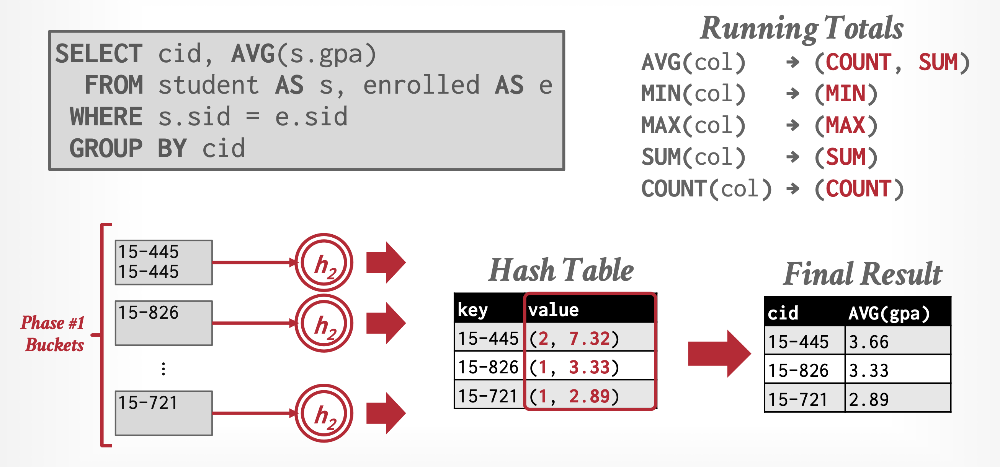
    

如果内存能容纳整个结果的话，那么基于排序或哈希的实现就无需将任何元组写入磁盘。当读取这些元组时，它们可以被插入到已排序的树结构或散列索引中。当我们使用即时聚合技术时，每个分组只需存储一个元组。因此，排序树结构或哈希索引能够完全保存在内存中，此时聚合操作仅需 $b_r$ 次块传输以及 1 次寻道，而非原本所需的 $3b_r$ 次传输，以及最坏情况下可能高达 $2b_r$ 次的寻道。

## Evaluation of Expressions

前面我们考虑的都是单步的关系运算，接下来我们来学习如何对包含多步运算的表达式进行求值，具体有以下两种方法：

- **物化**(materialization)：按照合适的顺序，一次对一个运算求值。每次求值的结果需要被物化(materialized)为一个临时关系，用于之后的求值。该方法的缺点就是构造的临时关系必须要被写入磁盘里
- **流水线**(pipelining)：同时对多个运算求值，某个运算的结果将马上传递给下一个运算，无需将结果存在临时关系里

下面来详细介绍这两种方法。

??? info "补充：处理模型(processing model)"

    DBMS **处理模型**定义了系统如何执行查询计划。它指定了查询计划评估的方向以及操作员之间传递的数据类型。不同的处理模型有不同的权衡，适用于不同的工作负载([OLTP](https://en.wikipedia.org/wiki/Online_transaction_processing) v.s. [OLAP](https://en.wikipedia.org/wiki/Online_analytical_processing))。

    每个处理模型由两种执行路径组成：
    
    - **控制流**(control flow)：决定了数据库管理系统如何调用运算符
    - **数据流**(data flow)：决定了运算符如何发送结果，可以是整个元组或列的子集

    有以下几种处理模型：

    - **迭代器模型**(iterator model)（最常见）
    - **物化模型**(materialization model)（少见）
    - **向量化/批量模型**(vectorized/batch model)（常见）

### Materialization

最易于直观理解如何对一个表达式求值的方式是观察该表达式在**运算符树**(operator tree)上的图画表示。比如对于表达式 $\Pi_{name}(\sigma_{building="Watson"}(department) \bowtie instructor)$，它的运算符树如下所示：

    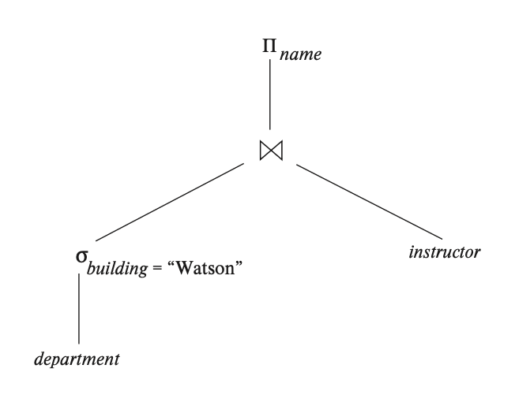

假如要应用物化方法的话，我们从这棵树最底层的运算出发进行求值，具体可用前面介绍过的算法来执行运算，然后将结果存储在临时关系里。接着就拿这个临时关系，或者（可能需要）原来存储在数据库里的关系，继续执行上一层的运算。重复这一步骤，直到完成对根节点的运算为止，此时得到整个表达式的最终结果。上述的求值过程称为**物化求值**(materialized evaluation)。

??? example "例子"

    

        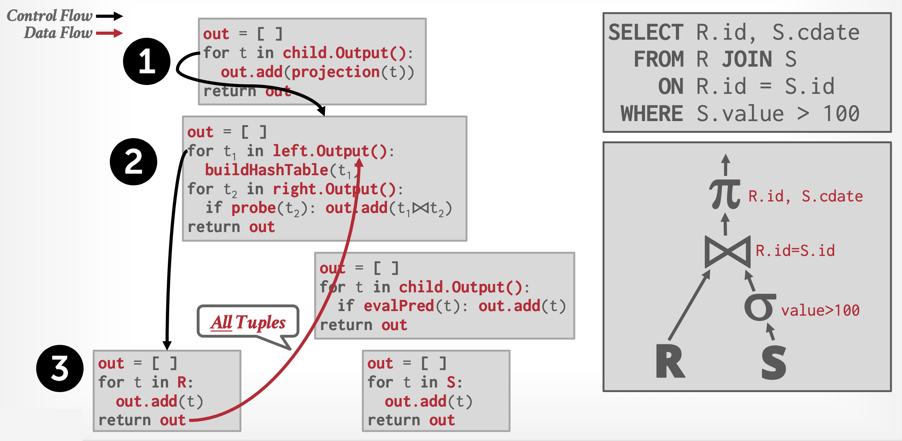
    

    

        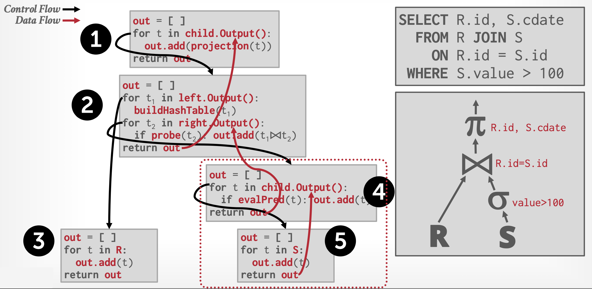
    

物化求值的成本不仅包括所有运算的成本总和，还得考虑将中间结果写入磁盘所需的成本。我们假设中间结果的记录被存放在一个缓冲区内，那么当缓冲区满了的时候，就要将其写到磁盘里。写入磁盘的块数 $b_r \approx \dfrac{n_r}{f_r}$，其中 $n_r, f_r$ 分别为结果关系 $r$ 中的元组数和**块因数**(blocking factor)（即一个块内可以存放的元组数）。而磁盘寻道次数为 $\lceil \dfrac{b_r}{b_b} \rceil$，其中 $b_b$ 为输出缓冲区的大小。

如果能用**双缓冲区**(double buffering)（使用两个缓存区，一个继续执行算法的同时，另一个将数据写入到磁盘中，从而做到 CPU 活动和 I/O 活动的并行）的话，能够使算法更加高效地执行。而寻道次数则可通过为输出缓存区分配额外的块来降低。

    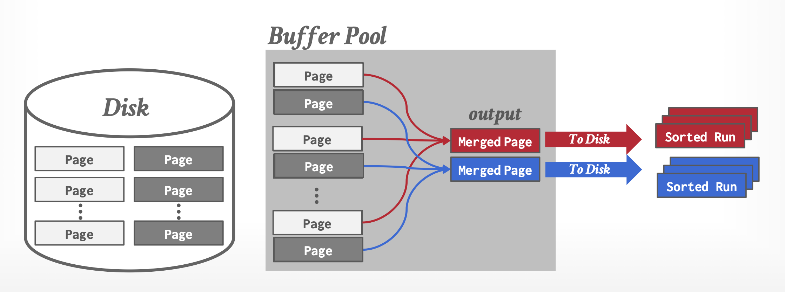

物化求值更适合 OLTP 工作负载，因为这种查询通常一次只访问少量元组，因此检索元组所需的函数调用较少。但它不适用于具有大量中间结果的 OLAP 查询，因为 DBMS 要将中间结果（往往规模较大）溢出到磁盘中。

### Pipelining

使用流水线的求值过程称为**流水线求值**(pipelined evaluation)。

    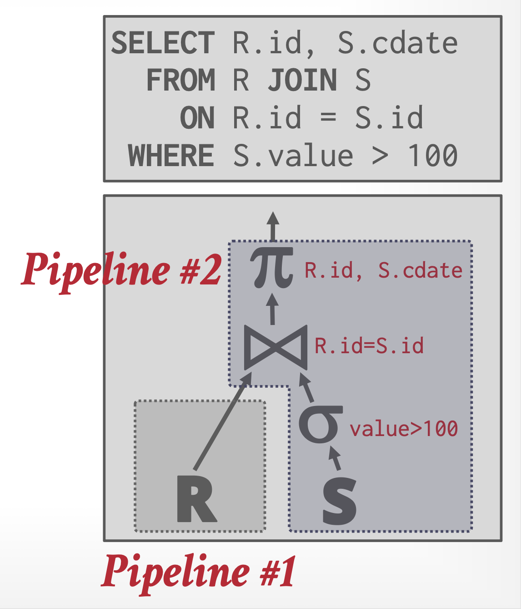

为运算创建流水线带来的好处有：

- 消除了从临时关系中读取和写入所需的成本，从而减少查询求值的成本
- 如果查询求值计划中的根运算符与其输入以流水线方式结合，那么能够快速生成查询结果

#### Implementation

流水线的执行方式有：

- **需求驱动型流水线**(demand-driven pipeline)（迭代器模型）：
    - 系统会反复向流水线顶端的操作请求元组
    - 每当一个操作接收到元组请求时，它会计算出下一个（或下一批）待返回的元组并将其返回
    - 若该操作的输入未采用流水线方式，则可根据输入关系计算待返回的后续元组，同时系统会记录已返回的数据状态
    - 若存在流水线式的输入，则该操作还会向其流水线输入端发起元组请求
    - 利用从流水线输入端获取的元组数据，该操作将计算出输出结果并向上传递给父级操作

- **生产者驱动型流水线**(producer-driven pipeline)：
    - 操作不会等待请求来生成元组，而是主动积极地生成元组
    - 每个操作被建模为系统内的独立进程或线程，它从其流水线输入中获取元组流，并为输出生成相应的元组流

它们的具体实现方式如下：

- 需求驱动型流水线：
    - 每个操作都能以一个**迭代器**(iterator)的形式实现，该迭代器提供以下功能：`open()`、`next()` 和 `close()`
    - 在调用 `open()` 之后，每次调用 `next()` 将返回该操作的下一个输出元组。操作的实现会相应地对其输入调用 `open()` 和`next()`，以便在需要时获取其输入元组。函数 `close()` 用于告知迭代器不再需要更多元组
    - 迭代器在执行过程中保持其**状态**(state)不变，使得连续的 `next()` 请求能够接收到连续的结果元组

    ??? example "例子"

        

            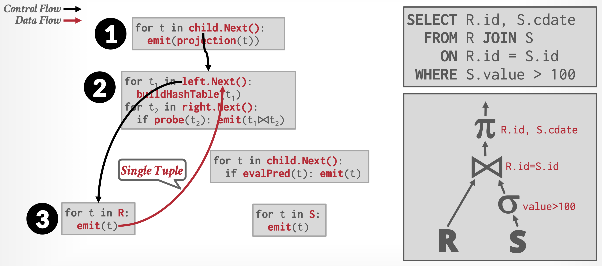
        

        

            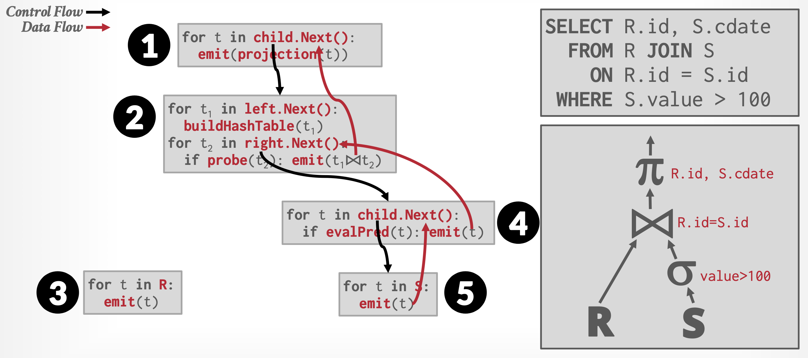
        

        

            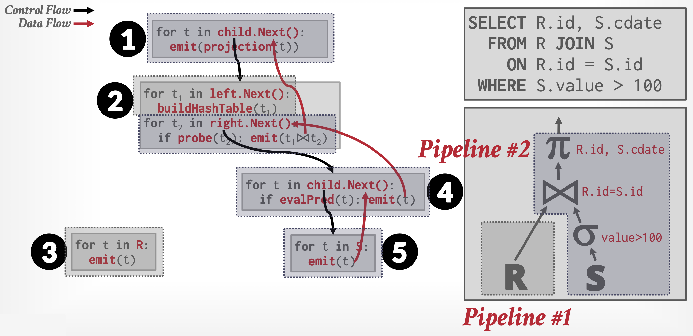
        

    ??? note "补充：向量化模型"

        和迭代器模型类似，但是每个运算符返回的不是一个元组，而是一批(batch)元组（单列或多列），也就是说运算符的内部循环一次处理多个元组。一批元组的大小取决于硬件或查询需求。

        ??? example "例子"

            

                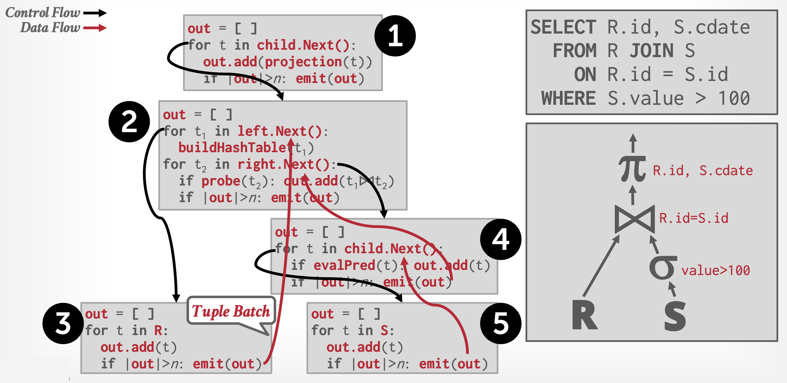
            

        该方法非常适合需要扫描大量元组的 OLAP 查询，因为调用 `next` 函数的次数更少；并且它能让运算符使用[向量化（SIMD）指令](../ca/4.md#vector-architecture)来处理批量元组。

- 生产者驱动型流水线：
    - 系统会为每对相邻的操作创建一个缓冲区，用于暂存从一个操作传递至下一个操作的元组，对应不同操作的进程或线程并发执行
    - 位于流水线底层的每个操作持续生成输出元组并将其存入输出缓冲区，直至缓冲区填满
    - 而流水线其他层级的操作则从下层获取输入元组后生成输出元组，直到其输出缓冲区满载
    - 每当操作从流水线输入中消耗一个元组时，便会将该元组从其输入缓冲区移除
    - 无论哪种情况，一旦输出缓冲区满了，该操作将暂停并等待父级操作从缓冲区内提取元组以腾出空间。此时该操作将继续生成新元组直至缓冲区再次填满。此过程循环往复，直至所有输出元组全部生成完毕

    ??? example "例子"

        

            
        

!!! abstract "比较"

    - 使用生产者驱动型流水线可以想象为从下往上**推动**数据通过操作树，而使用需求驱动型流水线可以想象为从顶部**拉取**数据通过操作树
    - 在生产者驱动型流水线中，元组是**积极**生成的，而在需求驱动型流水线中，它们是按需、**惰性**生成的
    - 需求驱动型流水线比生产者驱动型流水线更常用，因为它更容易实现。然而，在生产者驱动型流水线中，在并行处理系统中非常有用，因为它在现代 CPU 上更有效率，相对而言减少了函数调用的次数，因而这类流水线越来越多地用于为高性能查询评估生成机器代码的系统

#### Evaluation Algorithms

- 查询计划标注被流水线化的边，这些边被称为**流水线化的边**(pipelined edges)。而非流水线化的边被称为**阻塞边**(blocking edges)或**物化边**(materialized edges)。
- 由于一个计划可以有多个流水线化的边，通过流水线化的边连接的两个操作必须**并发**执行，其中一个消耗元组，而另一个生成元组。
- 查询计划可以被分区为众多子树，每个子树只有流水线化的边，而子树之间的边是非流水线化的边。这些子树被称为**流水线阶段**(pipeline stage)。查询处理器一次执行一个流水线阶段，并发执行单个流水线阶段中的所有操作。

- 一些操作（如排序）本质上是**阻塞操作**(blocking operations)：它们在检查完输入元组前可能无法输出任何结果。
    - 然而阻塞操作可以在生成元组时消耗元组，并且可以在生成时将元组输出给它们的消费者。
    - 这样的操作实际上在两个或更多阶段执行，阻塞实际上发生在操作的两个阶段之间。
    - 例如，**外部排序合并**包括顺串生成与合并操作。
        - 顺串生成时可接受由排序输入生成的元组，因此可以与排序输入并行处理。
        - 而在合并的时候，可以在生成元组的同时将其发送给消费者，因此可以与排序操作的消费者并行处理。
        - 但合并步骤只能在顺串生成步骤完成后才能开始。因此可以将排序合并运算符建模为两个通过非流水线化的边连接的子运算符，但每个子运算符可以通过流水线化的边分别连接到它们的输入和输出。

    - 其他操作（如连接）本身不是阻塞的，但其评估算法可能是阻塞的。例如，**索引嵌套循环连接**算法可以在获取外部关系元组时输出结果元组。因此，它在外部（左侧）关系上并行处理；然而，它在索引（右侧）输入上是阻塞的，因为索引必须在索引嵌套循环连接算法执行之前完全构建。
    - **哈希连接**算法的两个输入都是阻塞操作，因为它要求在输出任何元组之前，其输入必须完全被检索和分区。然而，哈希连接对每个输入都进行分区，然后执行多个构建-探测步骤，每个分区一次。
        - 每个输入的**分区**步骤可以接受由输入生成的元组，因此可以与输入一起流水线化。
        - **构建-探测**步骤可以在生成元组时将其输出到消费者，因此可以与消费者一起流水线化。
        - 但是，两个分区步骤通过非流水线化的边与构建-探测步骤连接，因为构建-探测只能在两个输入的分区完成后才能开始。

- 下面给出两张图：左图展示了一个连接两个关系 r, s 的查询，然后对结果进行聚合；右图展示了使用哈希连接和内存哈希聚合的查询流水线计划。

    

        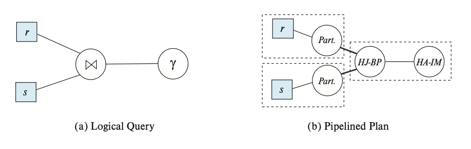
    

    - 其中流水线化的边用一般的线表示，而阻塞边用粗线表示，流水线阶段被包含在虚线框中。
    - **哈希连接**被拆分为三个子运算符：
        - 其中缩写为 Part. 的子运算符分别对 r, s 进行分区。
        - 缩写为 HJ-BP 的运算符执行哈希连接的构建和探测阶段。
    - HA-IM 运算符是**内存哈希聚合运算符**。
    - 从分区运算符到 HJ-BP 运算符的边是阻塞边，因为 HJ-BP 运算符只能在分区运算符完成执行后才能开始执行。
    - 从关系（假设使用关系扫描运算符进行扫描）到分区运算符的边，以及 HJ-BP 运算符到 HA-IM 运算符的边是流水线化的。
    - 结果流水线阶段被包含在虚线框中。

- 一般来说，对于物化的边，需要考虑将数据写入磁盘的成本，并且消费者操作符的成本应该包括从磁盘读取数据的成本。然而，当一个物化的边位于单个子操作符之间时，物化成本已经被算在运算符成本里了，所以无需再次计算该成本。
- 在某些应用中，在其输入和输出上都是流水线的连接算法是可取的。例如两个输入在连接属性上都是排序的，并且连接条件是等值连接，则可以使用归并连接，其输入和输出都可以流水线化。
- 然而在更一般的情况下，两个输入很可能尚未排序。这时可以采用一种称为**双流水线化连接**(double-pipelined join)技术，如下所示：

    <pre class="pseudocode" lineNumber="true">
    \begin{algorithm}
    \caption{Double-pipelined join algorithm}
    \begin{algorithmic}
        \STATE $done_r$ := \FALSE;
        \STATE $done_s$ := \FALSE;
        \STATE $r$ := $\emptyset$;
        \STATE $s$ := $\emptyset$;
        \STATE $result$ := $\emptyset$;
        \WHILE{\NOT $done_r$ \OR \NOT $done_s$}
            \IF{queue is empty}
                \STATE wait until queue is not empty;
            \ENDIF
            \STATE $t$ := top entry in queue;
            \IF{$t = End_r$}
                \STATE $done_r$ := \TRUE;
            \ELIF{$t = End_s$}
                \STATE $done_s$ := \TRUE;
            \ELIF{$t$ is from input $r$}
                \STATE $r$ := $r \cup \{t\}$;
                \STATE $result$ := $result \cup (\{t\} \bowtie s)$;
            \ELSE
                \COMMENT{$t$ is from input $s$}
                \STATE $s$ := $s \cup \{t\}$;
                \STATE $result$ := $result \cup (r \bowtie \{t\})$;
            \ENDIF
        \ENDWHILE
    \end{algorithmic}
    \end{algorithm}
    </pre>

    - 该算法假设两个输入关系 r, s 的输入元组都是流水线化的。
    - 为两个关系提供的元组在队列中排队等待处理；在 r, s 的所有元组生成后，插入队列的特殊条目（分别称为 $End_r$ 和 $End_s$）作为文件结束标记。
    - 为了有效求值，应在关系 r, s 上构建适当的索引。添加元组时，索引必须保持最新。
        - 使用哈希索引时，该算法被称为**双流水线化哈希连接**(double-pipelined hash-join)技术。
    - 该算法还假设内存容得下两个输入。即便这些输入太大，也可以正常使用该算法，直到可用内存被填满。
        - 此时到达该点的 r, s 元组可以分别视为在分区 r0, s0 中。随后到达的 r, s 元组分别被分配到 r1, s1 分区，写入磁盘，并且不添加到内存索引中。
        - 但在写入磁盘前，分配给 r1, s1 的元组分别用于探测 s0, r0。因此，r1, s0 以及 s1, r0 的连接也是以流水线化的方式执行的。
        - 在 r, s 完全处理完毕后，必须执行 r1 元组与 s1 元组的连接。

