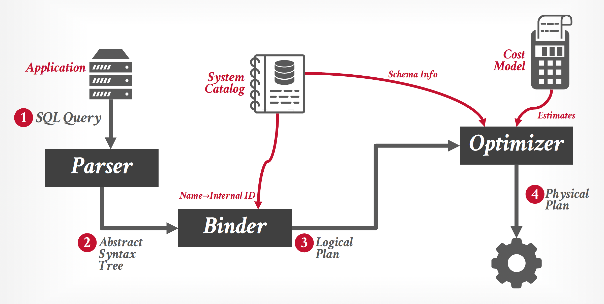
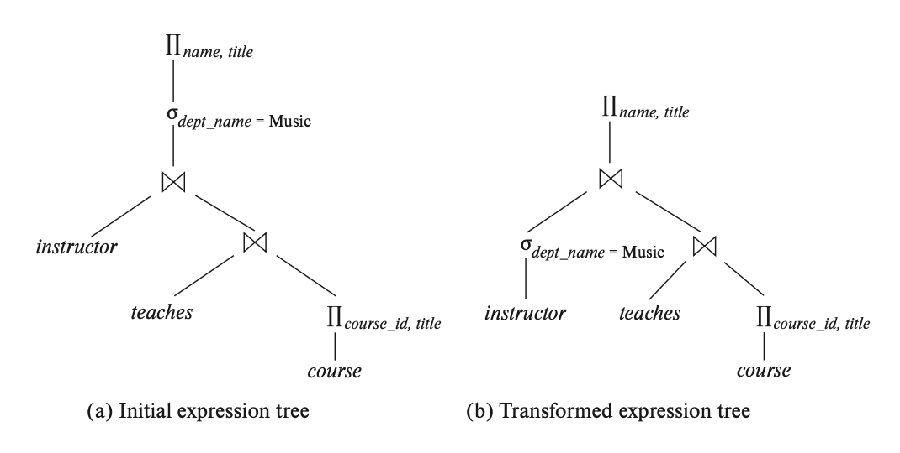
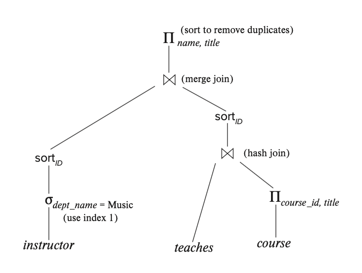
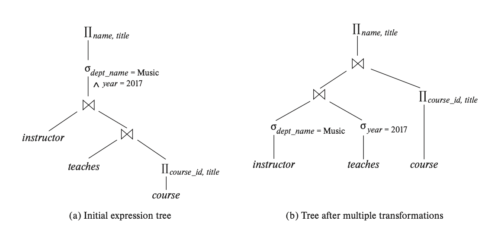
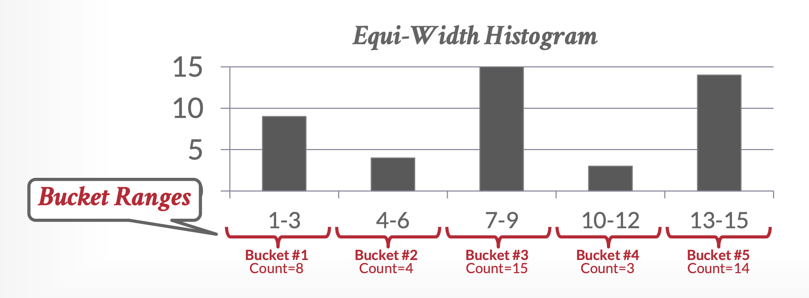
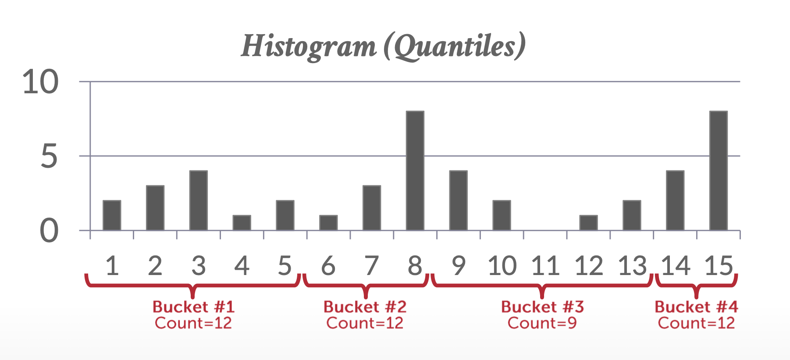
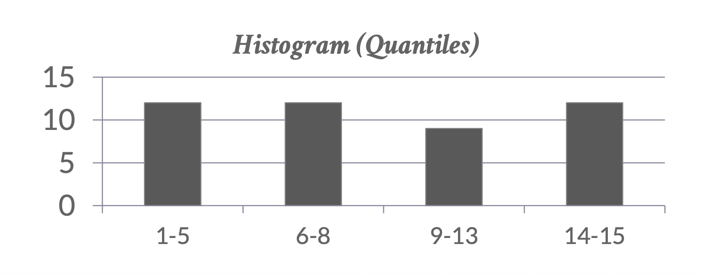
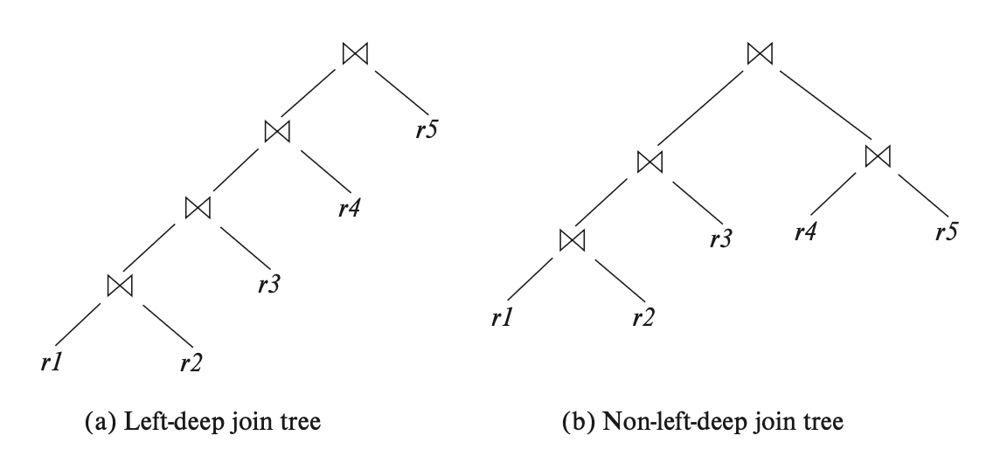

# Lec 12: Query Optimization

<!-- head 元素一定要放在一级标题下面，不然标题就显示不出来了 -->
<head>
    <script src="https://cdnjs.cloudflare.com/ajax/libs/KaTeX/0.16.7/katex.min.js"
            integrity="sha512-EKW5YvKU3hpyyOcN6jQnAxO/L8gts+YdYV6Yymtl8pk9YlYFtqJgihORuRoBXK8/cOIlappdU6Ms8KdK6yBCgA=="
            crossorigin="anonymous" referrerpolicy="no-referrer">
    </script>
    <link rel="stylesheet" href="https://cdn.jsdelivr.net/npm/pseudocode@latest/build/pseudocode.min.css">
    <script src="https://cdn.jsdelivr.net/npm/pseudocode@latest/build/pseudocode.min.js">
    </script>
</head>

由于 SQL 是一种声明式语言，查询仅告知 DBMS 需要计算什么内容，而非如何进行计算。因此，DBMS 必须将 SQL 语句转化为可执行的查询计划。然而，执行查询计划中每个操作符（如连接算法）存在多种实现方式，不同计划的性能表现也会有所差异。而数据库优化器(optimizer)的核心任务就是为每个给定查询选择最优的执行方案。

??? info "优化器在整个架构中的位置"

    <div style="text-align: center">
        
    </div>

- **查询优化**(query optimization)：从众多能够处理给定查询的策略中，选择最有效的查询求值计划的过程（尤其体现在查询很复杂的情况下）。这一优化是由系统负责的，它会尝试构建查询求值成本最小的查询求值计划。

- 查询计划可分为**逻辑计划**(logical plans)和**物理计划**(physical plans)
    - 优化器负责将**逻辑代数表达式**(logical algebra expression)映射至最优的等效物理代数表达式。逻辑计划大致对应于查询中的关系代数表达式。
    - **物理运算符**通过为查询计划中的不同操作定义具体的访问路径，从而确定执行策略。物理计划的制定可能会受到所处理数据的物理格式影响（例如排序状态、压缩方式等）。
    - 需要注意的是，并非在所有情况下都存在从逻辑计划到物理计划的一对一映射关系。

??? example "例子"

    考虑以下查询（用关系代数表达式表示）：

    $$
    \Pi_{name, title}(\sigma_{dept\_name = "\text{Music}"}(instructor \bowtie (teaches \bowtie \Pi_{course\_id, title}(course))))
    $$

    下面是一个等价的表达式，但后者中间结果的规模更小，因而成本更低：

    $$
    \Pi_{name, title}((\sigma_{dept\_name = "\text{Music}"}(instructor)) \bowtie (teaches \bowtie \Pi_{course\_id, title}(course)))
    $$

    比较两者对应的运算符树（左侧为第一个表达式，右侧为第二个表达式）：

    <div style="text-align: center">
        
    </div>

    因为转换后的表达式中，$instructor$ 在和后面两个关系的连接结果进行连接前先做了一步选择运算，这样参与连接的元组数就会减少，从而降低运算成本了。


求值计划精确定义了每个运算用到的算法，以及如何协调不同运算的执行。下图展示了上例中转换后表达式的求值计划：

<div style="text-align: center">
    
</div>

- 可以看到，求值计划中用到了一些不同的算法，对于连接操作而言，这里同时涉及到了哈希连接和合并连接
- 我们假设求值计划图的所有边都是流水线化的(pipelined)（除非注明是物化的(materialized)），所以生产者的输出会直接传给消费者，无需对硬盘进行读/写操作（物化则需要这样）
- 得到一个求值计划的步骤为：
    1. 生成一个和给定表达式逻辑等价的表达式
    2. 用另外的方式标注结果表达式，以生成其他查询求值计划
    3. 估计每个求值计划的成本，选择估计出来成本最少的那个

    上述三个步骤在查询优化器中是相互交错的。一旦得到求值计划后，其成本就可以通过关系的统计信息估计出来。

下面我们主要来介绍查询优化的两大策略：

- **静态规则**(static rules)/**启发式方法**(heuristics)：启发式方法将查询的部分与已知模式相匹配，从而组成一个计划。
    - 这些规则通过转换查询来消除低效的地方
    - 尽管这些规则可能需要查阅系统目录(catelog)以了解数据结构，但永远不需要检查数据本身
- **基于成本的搜索**(cost-based search)：读取数据并估计执行等效计划的成本；由成本模型选择成本最低的计划


## Transformation of Relational Expressions

在合法的数据库实例上，如果两个关系代数表达式能够产生相同的元组集（**不考虑元组的顺序**），那么我们认为这两个表达式是**等价的**(equivalent)。

而在 SQL 中，由于输入和输出实际上是元组的**多重集**（可以包含重复元组），所以对应的定义为：在合法的数据库实例上，如果两个关系代数表达式能够产生相同的元组多重集，那么它们就是**等价的**。


### Equivalence Rules

下面介绍一些在关系代数表达式上的**等价规则**(equivalence rules)：

??? info "符号约定"

    我们使用 $\theta, \theta_1, \theta_2$ 之类的符号表示谓词，$L_1, L_2, L_3$ 之类的符号表示属性列表，$E, E_1, E_2$ 之类的符号表示关系代数表达式。

1. **合取**(conjunctive)选择运算能够被解构为单独的选择运算序列：$\sigma_{\theta_1 \wedge \theta_2}(E) \equiv \sigma_{\theta_1}(\sigma_{\theta_2}(E))$
2. 选择运算满足**交换律**(commutative)：$\sigma_{\theta_1}(\sigma_{\theta_2}(E)) \equiv \sigma_{\theta_2}(\sigma_{\theta_1}(E))$
3. 在一个投影运算的序列中，只有最后一个（最外层的）投影运算是有效的，其他的都会被忽略掉：

    $$
    \Pi_{L_1} (\Pi_{L_2}(\dots (\Pi_{L_n}(E)) \dots)) \equiv \Pi_{L_1}(E)
    $$

    其中 $L_1 \subseteq L_2 \subseteq \dots \subseteq L_n$。

4. 选择运算可以被表示为笛卡尔积和 theta 连接（条件连接）
    - $\sigma_\theta (E_1 \times E_2) \equiv E_1 \bowtie_{\theta} E_2$（这正是 theta 连接的定义）
    - $\sigma_{\theta_1}(E_1 \bowtie_{\theta_2} E_2) \equiv E_1 \bowtie_{\theta_1 \wedge \theta_2} E_2$
5. theta 连接满足**交换律**：$E_1 \bowtie_\theta E_2 \equiv E_2 \bowtie_\theta E_1$
    - 由于**自然连接**是 theta 连接的特殊情况，所以自然连接也满足交换律
    - 不过这两个等价表达式结果的属性顺序不太一样。大多数情况下我们不会关心这个顺序（除了显示结果等少数情况）。如果要确保顺序的一致性，可以用投影运算对属性进行重排。
6. 关于连接运算的**结合律**(associative)：
    - 自然连接：$(E_1 \bowtie E_2) \bowtie E_3 \equiv E_1 \bowtie (E_2 \bowtie E_3)$
    - theta 连接：$(E_1 \bowtie_{\theta_1} E_2) \bowtie_{\theta_2 \wedge \theta_3} E_3 \equiv E_1 \bowtie_{\theta_1 \wedge \theta_3} (E_2 \bowtie_{\theta_2} E_3)$，其中 $\theta_2$ 仅包含来自 $E_2, E_3$ 的属性。
        - 表达式中的三个条件均可为空，因此**笛卡尔积**也满足结合律

    >连接运算的交换律和结合律对查询优化的连接重排相当重要！

7. 当满足以下两个条件时，选择运算可被分配到 theta 连接运算中：
    - 选择条件 $\theta_1$ 的所有属性仅包含来自连接运算的其中一个表达式（比如 $E_1$）的属性

        $$
        \sigma_{\theta_1} (E_1 \bowtie_{\theta} E_2) \equiv (\sigma_{\theta_1}(E_1)) \bowtie_\theta E_2
        $$

    - 选择条件 $\theta_1$ 仅包含 $E_1$ 的属性，$\theta_2$ 仅包含 $E_2$ 的属性

        $$
        \sigma_{\theta_1 \wedge \theta_2} (E_1 \bowtie_{\theta} E_2) \equiv (\sigma_{\theta_1}(E_1)) \bowtie_\theta (\sigma_{\theta_2}(E_2))
        $$

8. 当满足以下两个条件时，投影运算可被分配到 theta 连接运算中：
    - 令 $L_1, L_2$ 为分别来自 $E_1, E_2$ 的属性集，假设连接条件 $\theta$ 仅包含来自 $L_1 \cup L_2$ 的属性，那么：

        $$
        \Pi_{L_1 \cup L_2}(E_1 \bowtie_\theta E_2) \equiv (\Pi_{L_1}(E_1)) \bowtie_\theta (\Pi_{L_2}(E_2))
        $$

    - 令 $L_1, L_2$ 为分别来自 $E_1, E_2$ 的属性集；$L_3$ 为包含在连接条件 $\theta$ 中，但不在 $L_1$ 中的 $E_1$ 的属性；$L_4$ 为包含在连接条件 $\theta$ 中，但不在 $L_2$ 中的 $E_2$ 的属性。那么：

        $$
        \Pi_{L_1 \cup L_2}(E_1 \bowtie_\theta E_2) \equiv \Pi_{L_1 \cup L_2}((\Pi_{L_1 \cup L_3}(E_1)) \bowtie_\theta (\Pi_{L_2 \cup L_4}(E_2)))
        $$ 

    - 外连接运算 ⟕, ⟖, ⟗ 也具备相似的等价性质

9. 集合运算中的**并**和**交**满足**交换律**，但**差**并不满足
    - $E_1 \cup E_2 \equiv E_2 \cup E_1$
    - $E_1 \cap E_2 \equiv E_2 \cap E_1$

10. 集合并和交运算也满足**结合律**
    - $(E_1 \cup E_2) \cup E_3 \equiv E_1 \cup (E_2 \cup E_3)$
    - $(E_1 \cap E_2) \cap E_3 \equiv E_1 \cap (E_2 \cap E_3)$

11. **选择**运算可分配在集合并、交和差运算上
    - $\sigma_\theta(E_1 \cup E_2) \equiv \sigma_\theta(E_1) \cup \sigma_\theta(E_2)$
    - $\sigma_\theta(E_1 \cap E_2) \equiv \sigma_\theta(E_1) \cap \sigma_\theta(E_2)$
    - $\sigma_\theta(E_1 - E_2) \equiv \sigma_\theta(E_1) - \sigma_\theta(E_2)$
    - $\sigma_\theta(E_1 \cap E_2) \equiv \sigma_\theta(E_1) \cap E_2$
    - $\sigma_\theta(E_1 - E_2) \equiv \sigma_\theta(E_1) - E_2$

12. **投影**运算可分配在集合并运算上：$\Pi_L(E_1 \cup E_2) \equiv (\Pi_L(E_1) \cup (\Pi_L(E_2)))$
13. 当满足以下条件时，选择运算可分配在**聚合**运算上：令 $G$ 为分组属性的集合，$A$ 为聚合表达式的集合，当 $\theta$ 仅包含 $G$ 中的属性时，该等价关系成立：$\sigma_\theta(_G {\large \gamma}_A (E)) \equiv\ _G {\large \gamma}_A(\sigma_\theta(E))$
14. 关于连接运算的**交换律**：
    - 全外连接满足交换律：$E_1$⟗$E_2 \equiv E_2$⟗$E_1$
    - 左外连接和右外连接不满足交换律，但两者可以互换：$E_1$⟕$E_2 \equiv E_2$⟖$E_1$

15. 当满足某些条件时，选择运算可分配在左外连接和右外连接上。具体来说，当选择条件 $\theta_1$ 仅包含连接运算中其中一个表达式（假设为 $E_1$）的属性时，以下等价关系成立：
    - $\sigma_{\theta_1}(E_1$⟕$_\theta E_2) \equiv (\sigma_{\theta_1} (E_1))$⟕$_\theta E_2$
    - $\sigma_{\theta_1} (E_2$⟖$_\theta E_1) \equiv (E_2$⟖$_\theta (\sigma_{\theta_1}(E_1))$

16. 在某些条件下，外连接能被内连接替代：若 $\theta_1$ 在 $E_2$ 属性为 null 的时候，求值结果为 false 或 unknown，则以下等价关系成立：
    - $\sigma_{\theta_1}(E_1$⟕$_\theta E_2) \equiv \sigma_{\theta_1} (E_1 \bowtie_\theta E_2)$
    - $\sigma_{\theta_2}(E_1$⟖$_\theta E_1) \equiv \sigma_{\theta_1} (E_2 \bowtie_\theta E_1)$

    满足上述性质的谓词 $\theta_1$ 是对 $E_2$ 的 **null 拒绝**。

??? example "例子"

    回顾本章的第一个[例子](#lec-12-query-optimization)，该表达式的转换用到了上述等价规则中的第7条的第1小点。

    ---
    再来看另一个例子：

    $$
    \begin{align}
    \Pi_{name, title}(& \sigma_{dept\_name = "\text{Music}" \wedge year = 2017} \notag \\
    & (instructor \bowtie (teaches \bowtie \Pi_{course\_id, title}(course)))) \notag
    \end{align}
    $$

    === "运用第6条规则第1小点"

        $$
        \begin{align}
        \Pi_{name, title}(& \sigma_{dept\_name = "\text{Music}" \wedge year = 2017} \notag \\
        & ((instructor \bowtie teaches) \bowtie \Pi_{course\_id, title}(course))) \notag
        \end{align}
        $$ 

    === "运用第7条规则第1小点"

        $$
        \begin{align}
        \Pi_{name, title}((& \sigma_{dept\_name = "\text{Music}" \wedge year = 2017} \notag \\
        & (instructor \bowtie teaches)) \bowtie \Pi_{course\_id, title}(course)) \notag
        \end{align}
        $$ 

    === "运用第7条规则第2小点"

        $$
        \begin{align}
        \Pi_{name, title}((& \sigma_{dept\_name = "\text{Music}"} (instructor)\notag \\
        & \bowtie \sigma_{year = 2017}(teaches)) \bowtie \Pi_{course\_id, title}(course)) \notag
        \end{align}
        $$ 

    经过3次转换后，对应的运算符树的变化如下所示：

    <div style="text-align: center">
        
    </div>

    可以看到，这些转换能有效降低表达式的计算成本。

对于一组规则，如果其中没有规则能够通过其他规则得到的话，那么这个规则集是**最小的**(minimal)。如果我们采用的是非最小等价规则集的话，那就可以得到多种生成表达式的方式，因此查询优化器会采用最小等价规则集。


### Join Ordering

一个好的连接运算顺序对于减少临时结果大小而言是相当重要的，因此大多数查询优化器会着重关注连接运算的顺序。

可以通过前面介绍的和连接运算相关的等价规则来适当地调整连接运算的顺序。


### Enumeration of Equivalent Expressions

下面的过程能够枚举出全部的等价表达式：

<pre class="pseudocode" lineNumber="true">
\begin{algorithm}
\caption{Procedure to generate all equivalent expressions}
\begin{algorithmic}
\PROCEDURE{genAllEquivalent}{$E$}
\STATE $EQ = \{E\}$
\REPEAT
    \STATE Match each expression $E_i$ in $EQ$ with each equivalence rule $R_j$
    \IF{any subexpression $e_i$ of $E_i$ matches one side of $R_j$}
        \STATE Create a new expression $E'$ which is identical to $E_i$, except that
        \STATE $\quad e_i$ is transformed to match the other side in $EQ$
        \STATE Add $E'$ to $EQ$ if it is not already present in $EQ$
    \ENDIF
\UNTIL{no new expression can be added to $EQ$}
\ENDPROCEDURE
\end{algorithmic}
\end{algorithm}
</pre>

整个过程在空间上和时间上的成本都是相当地高，所以优化器通过以下思路来降低成本：

- 空间：允许表达式指向共享子表达式的表示技术可以显著减少空间需求（？）
- 时间：如果优化器考虑评估成本估算的话，它可能可以避免检查某些表达式，从而可以显著减少优化所需的时间


## Estimating Statistics of Expression Results

- 一个运算的成本取决于输入的大小以及其他的统计信息
- 由于是估计(estimation)，所以给出的结果并不准确，但通常而言估计出来的成本就是或者接近实际的最低成本


### Catelog Information

数据库系统目录存储以下关于数据库关系的统计信息：

- $n_r$：关系 $r$ 的元组数量
- $b_r$：关系 $r$ 中包含元组的块数
- $l_r$：关系 $r$ 中一个元组的字节大小
- $f_r$：关系 $r$ 的块因数(blocking factor)，即一个块内能够存放的元组数
- $V(A, r)$：出现在关系 $r$ 的属性 $A$ 中的唯一值个数，大小和 $\Pi_A(r)$ 一致；如果 $A$ 是 $r$ 的一个键的话，那么 $V(A, r)$ 的值就是 $n_r$
    - 该统计量也可以维护一组属性 $\mathcal{A}$：$V(\mathcal{A}, r)$ 的大小为 $\Pi_\mathcal{A}(r)$
- 目录中也记录了和索引相关的统计量，这里就不详细展开了

如果想要维护准确的统计量，那么每当关系被修改时就要更新统计量，但这样做带来的开销是巨大的。相反，大多数数据库系统会在系统负载较小的那段时间里更新统计量，所以统计量不是那么准确。然而，如果在两次统计量更新之间的关系更新次数不是很多的话，那么这个统计量就足够精确了，能为我们提供一个较好的成本估计。

上述统计信息是简化过的，实际上优化器通常会维护更多的统计信息，以提升求值计划的成本估计的精度。比如大多数数据库会将每个属性值的分布存储在**直方图**(histogram)里。直方图中，属性值被划分为多个范围，每个范围和落在该范围的属性值对应的元组关联。下图就是一个直方图的例子：

<div style="text-align: center">
    
</div>

像上图所示的直方图是一种**等宽直方图**(equi-width histogram)，因为每个范围都是等宽的。相对的也有**等深直方图**(equi-depth histogram)的概念：它调整了各个范围的边界，使得每个范围都有相同数量的值，因此这类直方图仅存储范围的边界分区，无需存储每个范围的值的个数（而等宽直方图需要存储总的元组数）。

<div style="text-align: center">
    
</div>

<div style="text-align: center">
    
</div>

综上，等深直方图相比等宽直方图能提供更好的估计，并使用更少的空间（直接存在系统目录中），因此更推荐使用。

如果没有直方图信息的话，优化器只能假设所有值是均匀分布的，也就是说每个范围都有相同数量的值；对应的成本估计的精度可想而知。

在很多数据库应用中，某些值会相比其他值会频繁出现，因此很多数据库会存储前 n 个最常用的值，以及这些值出现的次数，以达到更好的估计效果。


### Selection Size Estimation

选择操作结果的大小评估主要取决于选择谓词，所以下面根据不同的谓词情况来讨论：

- $\sigma_{A = a}(r)$：
    - 假如 $a$ 是频繁出现的值，那么就可以直接用这个值（因为这样的值肯定被保存下来了）
    - 假如没有直方图的话，我们就只能假设值是均匀分布的，那么选择结果的估计大小为 $\dfrac{n_r}{V(A, r)}$ 个元组。虽然这种假设很不现实，但是它在大多数情况下是一种合理的近似手段，并且表述简单。
    - 如果有关于属性 $A$ 的直方图，那么公式 $\dfrac{n_r}{V(A, r)}$ 中的 $n_r$ 就可以用直方图中的频率计数替代，而 $V(A, r)$ 则用该范围内的唯一值个数替代
- $\sigma_{A \le v}(r)$：假设属性的最低值 $\min(A, r)$ 和 $\max(A, r)$ 都存储在目录中，并且值是均匀分布的，那么可以分情况估计记录个数：
    - 0（$v < \min(A, r)$）
    - $n_r$（$v \ge \max(A, r)$）
    - $n_r \cdot \dfrac{v - \min(A, r)}{\max(A, r) - \min(A, r)}$（$\min(A, r) \le v < \max(A, r)$）

    !!! info "注"

        有时在查询优化的时候，值 $v$ 仍然是不可用的，此时我们需假设大概有一半记录（$\dfrac{n_r}{2}$）是满足比较条件的。虽然很不精确，但这是权宜之计。

- 复杂选择：
    - **合取**（$\sigma_{\theta_1 \wedge \theta_2 \wedge \dots \wedge \theta_n}(r)$）：假设这 n 个条件是相互独立的，那么该选择操作结果的元组个数为 $n_r \cdot \dfrac{s_1 \cdot s_2 \cdot \dots \cdot s_n}{n_r^n}$
    - **析取**（$\sigma_{\theta_1 \vee \theta_2 \vee \dots \vee \theta_n}(r)$）：结果元组个数为：

        $$
        n_r \cdot \Big[ 1 - (1 - \dfrac{s_1}{n_r}) \cdot (1 - \dfrac{s_2}{n_r}) \cdot \dots \cdot (1 - \dfrac{s_n}{n_r}) \Big]
        $$

    - **否定**（$\sigma_{\neg \theta}(r)$）：结果元组个数为 1 - $\sigma_\theta(r)$ 结果元组个数


### Join Size Estimation

先来看笛卡尔积：笛卡尔积 $r \times s$ 包含了 $n_r \cdot n_s$ 个元组，且每个元组占据 $l_r + l_s$ 的字节。

相对来说，自然连接的结果大小估计就复杂些，我们将会分情况讨论：

- $R \cap S = \emptyset$：此时 $r \bowtie s = r \times s$
- $R \cap S = R$ 的键：$s$ 的某个元组至多连接 $r$ 的一个元组，因此 $r \bowtie s$ 的元组数不超过 $s$ 的元组数
    - $R \cap S = S$ 的键的情况是与之对称的
    - 当 $R \cap S = S$ 参照 $R$ 的外键时，$r \bowtie s$ 的元组数就是 $s$ 的元组数
- $R \cap S$ 不是任何关系的键：我们假设每个值出现的概率是相等的。考虑 $r$ 的某个元组 $t$，并且令 $R \cap S = \{A\}$，我们估计 $r \bowtie s$ 中关于 $t$ 的元组数为 $\dfrac{n_s}{V(A, s)}$，那么对于 $r$ 的所有元组而言，$r \bowtie s$ 的元组数为 $\dfrac{n_r \cdot n_s}{V(A, s)}$。
    - 如果我们交换上述分析时 $r, s$ 的角色，那么估计出来的元组数为 $\dfrac{n_r \cdot n_s}{V(A, r)}$。如果 $V(A, r) \ne V(A, s)$ 的话，这两个估计值就是不同的，这就说明存在一些没有参加到连接运算的元组，那么估计值中更小的那个更准确些。
    - 如果 $V(A, r)$ 和 $V(A, s)$ 的共同值太少的话，这个估计值就明显过高，但在现实世界中这种情况不太可能发生。
    - 上述估计是基于每个值等可能出现的假设，所以还有很多无视该假设的更精确的方法，比如使用直方图等。

对于 theta 连接 $r \bowtie_\theta s$，我们可以先把它改写为 $\sigma_\theta(r \times s)$，然后使用估计笛卡尔积和选择运算结果大小的方法（前面都讲到过了）来计算。


### Size Estimation for Other Operations

- **投影**：$\Pi_A(r)$ 的估计值就是 $V(A, r)$
- **聚合**：$_G {\large \gamma}_A(r)$ 的大小就是 $V(G, r)$
- **集合运算**：
    - 假如集合运算的两个输入来自相同的关系，那我们就可以根据等价规则重写集合运算为析取、合取或否定，比如将 $\sigma_{\theta_1}(r) \cup \sigma_{\theta_2}(r)$ 改写为 $\sigma_{\theta_1 \vee \theta_2}(r)$
    - 否则的话，$r \cup s$ 的估计大小为 $r, s$ 的大小之和，$r \cap s$ 的估计大小为 $r, s$ 大小的最小值，$r - s$ 的估计大小为 $r$ 的大小。显然这种估计是不准确的，且它们都是准确值的上界。
- **外连接**：
    - $r$⟕$s$：$r \bowtie s$ 的大小 + $r$ 的大小
    - $r$⟖$s$：和上一种情况对称
    - $r$⟗$s$：$r \bowtie s$ 的大小 + $r$ 的大小 + $s$ 的大小

    显然这种估计是不准确的，且它们都是准确值的上界。


### Estimation of Number of Distinct Values

**选择**运算结果中，属性 $A$ 唯一值的个数 $V(A, \sigma_\theta(r))$ 能通过以下方式估计得到：

- 如果选择条件 $\theta$ 要求 $A$ 获取一个具体值（比如 $A = 3$），那么 $V(A, \sigma_\theta(r)) = 1$
- 如果选择条件 $\theta$ 要求 $A$ 获取从一组具体值中选1个，那么 $V(A, \sigma_\theta(r)) = $具体值的个数
- 如果选择条件 $\theta$ 的形式诸如 $A\ op\ v$，其中 $op$ 为比较运算符，那么$V(A, \sigma_\theta(r)) = V(A, r) \cdot s$，其中 $s$ 是选择运算的可选择性(selectivity)（？）
- 对于其他情况，假设属性 $A$ 值的分布和和选择条件的指定值的分布是独立的，那么估计值为 $\min(V(A, r), n_{\sigma_\theta(r)})$

---
**连接**运算结果中，属性 $A$ 唯一值的个数 $V(A, r \bowtie s)$ 能通过以下方式估计得到：

- 假如 $A$ 中的所有属性来自 $r$，那么 $V(A, r \bowtie s)$ 的估计值为 $\min(V(A, r), n_{r \bowtie s})$；假如 $A$ 中的所有属性来自 $s$，那么 $V(A, r \bowtie s)$ 的估计值为 $\min(V(A, s), n_{r \bowtie s})$
- 假如 $A$ 包含来自 $r$ 的属性 $A1$ 和包含来自 $s$ 的属性 $A2$，那么估计值为：

    $$
    \min(V(A1, r) \cdot V(A2 - A1, s), V(A1 - A2, r) \cdot V(A2, s), n_{r \bowtie s})
    $$

    >注：有些属性可能同时属于 $A1$ 和 $A2$


## Choice of Evaluation Plans

**基于成本的优化器**(cost-based optimizer)探索和给定查询等价的查询求值计划的空间，并从中挑选估计成本最小的那个。如果仅靠前面介绍的等价规则，那么整个过程会相当复杂，所以下面我们会考虑其他相对更加高效的方法。


### Cost-Based Join-Order Selection

我们先来看如何为查询选择最优的连接顺序。对于连接运算 $r_1 \bowtie r_2 \bowtie \dots \bowtie r_n$，总共有 $\dfrac{(2(n-1))!}{(n-1)!}$ 种不同的连接顺序，不难看出这个量会变得特别大，因此想要枚举所有连接顺序是不切实际的。但是通过一些观察，可以发现这其中有不少顺序是可以完全被忽略的。我们接下来会采用一种**动态规划**(dynamic-programming)算法来寻找最优的连接顺序：

<pre class="pseudocode" lineNumber="true">
\begin{algorithm}
\caption{Dynamic-proramming algorithm for join-order optimization}
\begin{algorithmic}
\PROCEDURE{FindBestPlan}{$S$}
\IF{($bestplan[S].cost \ne \infty$)}
    \COMMENT{$bestplan[S]$ already computed}
    \RETURN $bestplan[S]$
\ENDIF
\IF{($S$ contains only 1 relation)}
    \STATE set $bestplan[S].plan$ and $bestplan[S].cost$ based on the best way of
    \STATE $\quad$ accessing $S$ using selection conditions (if any) on $S$.
\ELSE
    \FORALL{non-empty subset $S1$ of $S$ such that $S1 \ne S$}
        \STATE $P1$ = FindBestPlan($S1$)
        \STATE $P2$ = FindBestPlan($S - S1$)
        \FORALL{algorithm $A$ for joining the results of $P1$ and $P2$}
            \STATE 
            \COMMENT{For indexed-nested loops join, the outer relation could be $P1$ or $P2$.}
            \STATE
            \COMMENT{Similarly for hash-join, the build relation could be $P1$ or $P2$.}
            \STATE
            \COMMENT{We assume the alternatives are considered as separate algorithms.}
            \STATE
            \COMMENT{We assume cost of $A$ does not include cost of reading the inputs.}
            \IF{algorithm $A$ is indexed nested loops}
                \STATE Let $P_o$ and $P_i$ denote the outer and inner inputs of $A$
                \IF{$P_i$ has a single relation $r_i$, and $r_i$ has an index on the join attributes}
                    \STATE plan = "execute $P_o.plan$; join results of $P_o$ and $r_i$ using $A$",
                    \STATE $\quad \quad$ with any selection condition on $P_i$ performed as
                    \STATE $\quad \quad$ part of the join condition
                    \STATE cost = $P_o.cost$ + cost of $A$
                \ELSE
                    \COMMENT{Cannot use indexed nested loops join}
                    \STATE cost = $\infty$
                \ENDIF
            \ELSE
                \STATE plan = "execute $P1.plan$; execute $P2.plan$;
                \STATE $\quad \quad$ join results of $P1$ and $P2$ using $A$"
                \STATE cost = $P1.cost + P2.cost + $ cost of $A$
            \ENDIF
            \IF{cost < $bestplan[S].cost$}
                \STATE $bestplan[S].cost = $cost
                \STATE $bestplan[S].plan = $plan
            \ENDIF
        \ENDFOR
    \ENDFOR
\ENDIF
\RETURN $bestplan[S]$
\ENDPROCEDURE
\end{algorithmic}
\end{algorithm}
</pre>

- 该过程将求值计划存储在关联数组 $bestplan$ 中，每个元素包含两个部分：$S$ 的最佳计划的成本，以及计划自身。$bestplan[S].cost$ 的值初始化为 $\infty$
- 过程首先会检查计算给定关系组 $S$ 的连接运算的最佳计划是否已经算出来了，如果是的话就直接返回算好的计划
- 如果 $S$ 只有 1 个关系，那么访问 $S$ 的最佳方式被记录在 $bestplan$ 中。这里可能会用到索引，进行索引扫描，或者扫描整个关系。若 $S$ 中存在任何选择条件，除索引扫描保证之外的其他选择条件，则会在执行计划中添加一个选择运算，以确保满足所有针对 $S$ 的选择要求。
- 如果 $S$ 包含多个关系，那么过程会尝试各种将 $S$ 划分为两个不相交集的方式。对于每个划分，过程会递归寻找每个子集的最佳计划，然后考虑所有可行的用于连接两个子集结果的算法。
    - 需要注意的是，由于**索引嵌套循环连接**可能选择输入 $P1$ 或 $P2$ 中的任意一个作为内部输入，我们将这两种备选方案视为两种不同的算法。
    - 同样地，**哈希连接**中构建表与探测表的选择也促使我们将这两种情况区分为两种独立的算法来处理。

- 上述算法的时间复杂度为 $O(3^n)$
- 在计算连接成本时，我们可以利用上一章介绍的连接公式，对其稍作一些修改就可用于计算成本了，同时我们不去考虑读取输入所需的成本。

如果某种元组的特定排序顺序可能对后续操作有用，则称其为**兴趣排序顺序**(interesting sort order)。优势，仅为给定的 n 个关系的每个子集寻找最优连接顺序是不够的。相反，我们必须为每个子集，为该子集连接结果的兴趣排序顺序，找出其对应的最优连接顺序。那么对于上述算法，可以用 $[S, o]$ 来索引 $bestplan$ 数组，其中 $S$ 是关系集合，$o$ 是兴趣排序顺序，此时上述算法就会将兴趣排序顺序纳入考虑范围内。

上述算法实际上会两次考虑将集合 $S$ 划分为两个不相交子集的所有可能方式，因为这两个子集中的每一个都可以扮演 $S1$ 的角色。虽然重复考虑划分不会影响正确性，但会浪费时间。因此可按如下方式优化：在 $S1$ 中找出字母顺序最小的关系 $r_i$，在 $S−S1$ 中找出字母顺序最小的关系 $r_j$，仅当 $r_i < r_j$ 时才执行循环。这样做可以确保每种划分只被考虑一次。

另外上述算法考虑到全部可能的连接顺序，包括那些包括笛卡尔积的。所以可以将连接条件纳入考虑范围内，并修改代码使得得到的划分不会带来笛卡尔积。


### Cost-Based Optimization with Equivalence Rules

并不是所有的查询都能通过得到最佳连接顺序来优化，比如聚合、外连接、嵌套查询等，但我们能用等价规则来处理这些运算。由于前面介绍过的枚举等价规则的算法成本过高，因此下面将介绍一些使该算法更高效的技巧：

- 运用表达式的空间高效表示，在应用等价规则时避免产生多份子表达式的拷贝
- 运用针对同一表达式重复推导的高效检测技术
- 基于**记忆化**(memoization)的动态规划形式：当子表达式首次被优化时，存储其最优查询求值计划；后续请求优化相同的子表达式时，就直接返回之前保存的计划
- 通过跟踪任何子表达式在任意时间点生成的最低成本计划，避免生成所有可能的等价计划，并剪枝掉任何比迄今为止找到的最低成本计划更昂贵的计划


### Heuristics in Optimization

基于成本的优化方法的一个缺点在于优化运算自身的成本较高。尽管可以采用一些聪明的算法来降低成本，但求值计划的数量可能会很大，带来很多计算的成本。因此优化器会采用一种**启发法**(heuristics)来降低优化成本。一些启发式的规则为：

- 尽早执行查询运算：
    - 然而，对于表达式 $\sigma_\theta (r \bowtie s)$，如果 $r$ 相比 $s$ 小得多，$s$ 的连接属性上有索引，但 $\theta$ 的属性没有索引，那么这种策略就不太好了，因为显然这种情况下，用索引会更好
- 尽早执行投影运算：
    - 一般来说执行选择操作先于投影操作会更好，因为相比投影运算，选择运算能够减少的关系大小更多，且选择操作能够利用索引
- 基于连接顺序枚举的优化器通常使用启发式转换，来处理除连接之外的构造，并将基于成本的连接顺序选择算法应用于仅涉及连接和选择的子表达式上。
- 很多查询优化器不考虑所有的连接顺序，而是将搜索限制在特定的连接顺序上，比如 System R 优化器仅考虑连接中右操作数是初始关系 $r_1, \dots, r_n$ 中其中一个的连接顺序，这种连接顺序称为**左深连接顺序**(left-deep join order)，这种顺序对流水线求值而言较为方便。
    - 下图比较了左深连接树和非左深连接树的区别：

        <div style="text-align: center">
            
        </div>

    - 考虑所有左深连接顺序的时间复杂度为 $O(n!)$，相比考虑全部连接顺序会快很多；如果结合动态规划算法的话，时间复杂度可降至 $O(n2^n)$
- Oracle 的启发式方法：
    - 对于一个 n 路连接，它考虑 n 个评估计划，每个计划使用一个左深连接顺序，从 n 个关系中不同的一个开始
    - 启发式方法通过重复选择“最佳”关系，基于可用的访问路径排名来构建每 n 个评估计划的连接顺序
    - 对于每个连接，根据可用的访问路径选择嵌套循环或排序合并连接
    - 最后，启发式方法基于最小化没有在内部关系上可用索引的嵌套循环连接的数量以及排序合并连接的数量，从 n 个评估计划中选择一个
- 某些系统采用的一种混合查询优化方法：针对查询的某些部分，应用启发式计划选择策略；而对其他部分则基于生成备选访问方案进行成本驱动的选择
- 对于复合 SQL 查询（用到 $\cup, \cap, -$），优化器分别处理每个部分，将求值计划结合起来，构成完整的求值计划
- 大多数优化器允许为查询优化指定成本预算，当超过**优化成本预算**(optimization cost budget)时，将终止寻找最优计划的搜索过程，并返回当前找到的最佳计划。
    - 我们可以动态设置预算：例如，若已找到一个低成本查询计划，则可能基于"当现有最佳计划已足够节省成本时，无需耗费大量时间继续优化"的前提调低预算；反之，若当前最优方案代价高昂，则值得投入更多时间进行深度优化，这样可能可以显著降低执行的耗时。
    - 为充分发挥这一机制的优势，优化器通常先采用廉价的启发式方法快速生成初始方案，再根据该启发式方案的基准值设定预算范围，启动完整的基于成本的优化流程
- 许多应用程序会重复执行相同的查询，但每次使用不同的常量值。多数查询优化器会在首次提交查询时（无论当时提供的常量值为何）对查询进行一次优化，并将生成的执行计划缓存起来，作为一种启发式的优化策略。当后续再次执行该查询时（即使使用了新的常量值），系统会直接复用缓存的执行计划（仅替换其中的常量值）。虽然新常量值对应的最优执行方案可能与初始值的方案存在差异，但这种启发式方法仍选择复用缓存计划。这种对查询计划的缓存与复用机制被称为**计划缓存**(plan caching)。


### Optimizing Nested Subqueries

SQL 会将 `WHERE` 子句内的嵌套子查询视为接受参数并返回单个值或一组值的函数，而这些参数是来自外层查询，用于嵌套子查询的变量（称为**相关变量**(correlation variables)）

SQL 通过计算在外层的 `FROM` 子句中关系的笛卡尔积，随后检验笛卡尔积中每个元组是否满足 `WHERE` 谓词来对整个查询求值。

通过将嵌套子查询作为函数调用来为嵌套子查询求值的技术被称为**相关求值**(correlated evaluation)。该方法不够高效，因为它会带来大量的随机硬盘 I/O 运算。因此如有可能，SQL 优化器会尝试将嵌套子查询转换为连接运算；高效的连接算法能够避免昂贵的随机 I/O 操作。

为了正确反应 SQL 语义，结果中的重复元组数不能因重写而被改变——**半连接**(semijoin)（$r \ltimes_\theta s$）为此提供了解决方案：

- 多重集版本：如果元组 $r_i$ 在 $r$ 中出现 $n$ 次，且至少存在一个来自 $s$ 的元组 $s_j$ 满足 $r_i, s_j$ 共同满足谓词 $\theta$，那么 $r_i$ 在半连接结果中出现 $n$ 次
- 集合版本：等价于 $\Pi_R (r \bowtie_\theta s)$

对应的有**反半连接**(anti-semijoin)（或称反连接）（$r \overline{\ltimes}_\theta s$）的概念，它适用于 `NOT EXISTS` 查询。它的（多重集）定义为：如果元组 $r_i$ 在 $r$ 中出现 $n$ 次，且不存在来自 $s$ 的元组 $s_j$ 满足 $r_i, s_j$ 共同满足谓词 $\theta$，那么 $r_i$ 在半连接结果中出现 $n$ 次；否则 $r_i$ 不会出现在结果中。

一般来说，对于形如以下的嵌套子查询：

```sql
SELECT A
FROM r1, r2, ..., rn
WHERE P1 AND EXISTS (
    SELECT *
    FROM s1, s2, ..., sm
    WHERE P21 AND P22
);
```

>其中 `P21` 是在子查询中仅参照关系 si 的谓词，`P22` 是在外查询中仅参照关系 ri 的谓词。

可以被转换为以下连接运算：

$$
\Pi_A((\sigma_{P_1}(r_1 \times r_2 \times \dots \times r_n)) \ltimes_{P_2^2} \sigma_{P_2^1}(s_1 \times s_2 \times \dots \times s_m))
$$

- 这种用连接、半连接或反半连接替代嵌套查询的过程称为**去相关**(decorrelation)。只要对原有的连接算法稍作修改，就能用在半连接和反半连接的实现上。
- 如果嵌套子查询中用到聚合运算的话，这种去相关的方法就失效了。
- 此外，对于是否进行去相关操作，理想情况下应根据成本来决定，即取决于去关联操作是否能降低查询成本。
- 部分查询优化器采用扩展的关系代数结构来表示嵌套子查询，并将嵌套子查询转换为半连接、反半连接等操作的转换过程表述为等价规则。
- 最好还是不要使用复杂的嵌套子查询，因为我们无法保证查询优化器会成功将嵌套子查询转换为能够被高效求值的形式。


## Materialized Views

**物化视图**(materialized view)是一种内容被计算和存储的视图。它构成了冗余数据，因为其内容可以从视图定义和数据库的其他内容中推断出来。在许多情况下，相比执行定义视图的查询来计算视图的内容，读取物化视图的内容的成本会少很多。


### View Maintenance

物化视图的一个问题是当视图定义中用到的数据发生改变时，物化视图必须保持更新，这项任务被称为**视图维护**(view maintenance)。有以下几种维护方案：

- 手写代码 -> 不合理
- 为视图定义中的关系的插入、删除和更新操作定义触发器；或者用更简单粗暴的方法——每次更新后完全重新计算物化视图
- 仅修改物化视图中受影响的部分 -> **递增视图维护**(incremental view maintenance)
- 多数数据库系统执行**即时视图维护**(immediate view maintenance)：当更新发生时立马执行递增视图维护，作为更新事务的一部分
- 部分数据库系统则采用**延后视图维护**(deferred view maintenance)：视图的维护会被推迟，比如收集一天的更新，在晚上才对视图更新。该方法虽然能够降低更新事务的开销，但可能会导致视图和底层关系的不一致性


### Incremental View Maintenance

#### Join Operations

考虑物化视图 $v = r \bowtie s$

- 假如向 $r$ 插入了一些元组（记作 $i_r$），那么 $v^{new} = v^{old} \cup (i_r \bowtie s)$
- 假如删除了 $r$ 的一些元组（记作 $d_r$），那么 $v^{new} = v^{old} - (d_r \bowtie s)$


#### Selection and Projection Operations

考虑物化视图 $v = \sigma_\theta (r)$

- 假如向 $r$ 插入了一些元组（记作 $i_r$），那么 $v^{new} = v^{old} \cup \sigma_\theta (i_r)$
- 假如删除了 $r$ 的一些元组（记作 $d_r$），那么 $v^{new} = v^{old} - \sigma_\theta (d_r)$

---
处理投影运算相对更加困难，因为插入或删除一些元组后的结果可能有重复项。所以对于投影 $\Pi_A(r)$ 中的每个元组，我们需要为其保留一个计数。

- 假如删除了 $r$ 的一些元组（记作 $d_r$），令 $t.A$ 为 $t$ 在属性 $A$ 上的投影，我们在物化视图中找到 $(t.A)$，然后让对应计数 - 1，如果归0的话则删除该元组
- 假如向 $r$ 插入了一些元组（记作 $i_r$），若 $t.A$ 已经在物化视图中，则让对应计数 + 1，否则的话将 $(t.A)$ 插入到物化视图中，并为其对应的计数置1


#### Aggregation Operations

- `COUNT`：考虑物化视图 $v = _G {\large \gamma}_{count(B)}(r)$
    - 假如向 $r$ 插入了一些元组（记作 $i_r$），先在物化视图中寻找分组 $t.G$，如果不存在的话就将 $(t.G, 1)$ 插入到物化视图中；如果存在的话则该分组对应的计数 + 1
    - 假如删除了 $r$ 的一些元组（记作 $d_r$），先在物化视图中寻找分组 $t.G$，将该分组对应的计数 - 1；如果减至0的话就从物化视图中删掉 $t.G$
- `SUM`：考虑物化视图 $v = _G {\large \gamma}_{sum(B)}(r)$
    - 假如向 $r$ 插入了一些元组（记作 $i_r$），先在物化视图中寻找分组 $t.G$，如果不存在的话就将 $(t.G, t.B)$ 插入到物化视图中，并为其关联一个计数（其值为1）；如果存在的话则将 $t.B$ 加入到聚合值中，并让该分组对应的计数 + 1
    - 假如删除了 $r$ 的一些元组（记作 $d_r$），先在物化视图中寻找分组 $t.G$，将 $t.B$ 从聚合值中减去，并将该分组对应的计数 - 1；如果计数减至0的话就从物化视图中删掉 $t.G$
- `AVG`：考虑物化视图 $v = _G {\large \gamma}_{avg(B)}(r)$
    - 在一次插入或删除后直接更新平均值是不可行的，因为它不仅取决于旧的平均值及其插入/删除的元组，还取决于每个分组中的元组数
    - 因此要维护 `SUM` 和 `COUNT` 的聚合值，通过 `SUM` 值 / `COUNT` 值来计算平均值
- `MIN`, `MAX`：考虑物化视图 $v = _G {\large \gamma}_{min(B)}(r)$（`MAX` 同理，这里就不展开了）
    - 处理插入比较直接，和处理 `SUM` 的类似
    - 但删除操作的成本可能会更高
    - 一种好的思路是创建一个在 $(G, B)$ 上的有序索引，有助于我们高效寻找到分组中的最小值


#### Other Operations

- 集合交运算：考虑物化视图 $v = r \cap s$
    - 向 $r$ 中插入元组：如果该元组也在 $s$ 中的话则插入到视图中
    - 从 $r$ 中删除元组：如果该元组存在于交集中，则将其从交集中删除
- 外连接：处理方式和连接运算类似，但还要做一些额外工作
    - 从 $r$ 中删除元组：还要处理那些 $s$ 中不再和 $r$ 里面的元组匹配的元组
    - 向 $r$ 中插入元组：还要处理那些之前 $s$ 中和 $r$ 里面的元组不匹配的元组


#### Expressions

上面考虑的只是单步的运算。要想处理完整的表达式，我们可以先为每个子表达式计算结果的递增变化，继而得到完整的递增更新。


### Query Optimizations and Materialized Views

在物化视图中，我们可以对查询进行以下优化：

- 使用物化视图重写查询
- 用视图定义替代物化视图的使用


<script>
    pseudocode.renderClass("pseudocode");
</script>