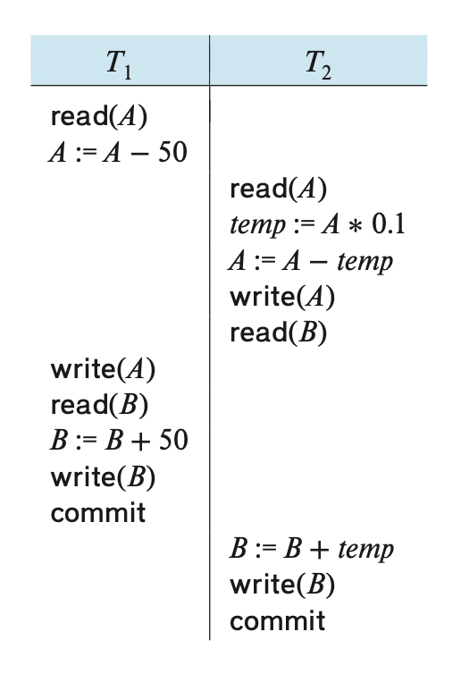
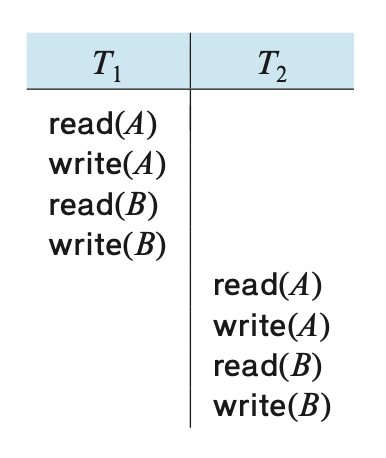
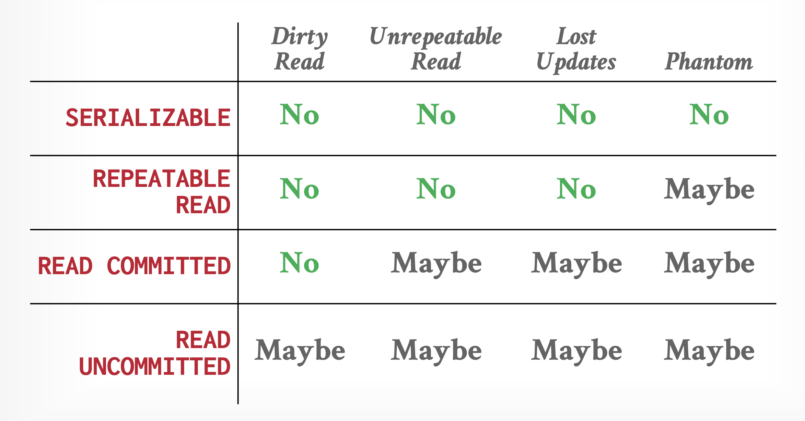

# Lec 13: Transactions

??? abstract "核心知识"

    - 事务的 ACID 性质
    - 事务的 5 个状态
    - 调度
    - 可串行性
        - 冲突可串行性
    - 可恢复性：可恢复 + 无级联调度
    - 隔离等级

    >~~有点想吐槽教材的节标题，感觉词不达意啊~~

**事务**(transaction)：在共享数据库上执行的单个或多个操作序列，是一种实现某种更高层次功能的基本单位

- 通常，事务由用户程序发起，而程序一般会用高级数据操纵语言（比如 SQL 等）或者带有嵌入数据库访问（JDBC 或 ODBC）的编程语言
- 事务被形如 `BEGIN TRANSACTION` 和 `END TRANSACTION` 的语句分隔
- 事务的四大性质——**ACID**，分别对应着：
    - **原子性**(atomicity)：事务中的所有语句要么全部能作用在数据上，要么没有一条是发挥作用的。
        - 所以事务是不可分割的单元
        - 如果执行事务的过程中发生任何故障，任何因该事务而发生的数据库改变必须被撤销
    - **一致性**(consistency)：如果每个事务都是一致的，并且数据库在事务开始时处于一致状态，那么可以保证事务完成时数据库仍保持一致。数据若满足所有验证规则（如约束、级联和触发器），则被视为一致。
    - **隔离性**(isolation)：即便多个事务并发执行，系统也能保证：对于每一对事务 $T_i, T_j$，看起来就好像 $T_j$ 先于 $T_i$ 开始前完成，或者 $T_j$ 在 $T_i$ 完成后开始。因此某个事务不会关心，也不会干扰和它并发执行的其他事务。
        - 隔离性的要求可能会会降低系统的性能
    - **持久性**(durability)：事务成功结束（提交(commit)）后，对数据库的改变应该持续存在，即便发生了系统故障。


## A Simple Transaction Model

本章主要探讨的是最简单的事务模型，所以我们约定：

- 唯一针对数据的运算为算术运算
- 数据项应仅包含单个数据值
- 事务通过以下两种操作实现对数据的访问：
    - `read(X)`：将数据项 `X` 从数据库传输到位于主存缓存中的变量（也称为 `X`），该变量属于执行读操作的事务。
    - `write(X)`：将执行写操作的事务对应的主存缓存中的变量 `X` 写到数据库的数据项 `X` 中。
        - 在实际的数据库系统中，写操作不必直接更新硬盘中的数据，可能会将更新结果临时存储一段时间，之后再执行。

令事务 `Ti` 为从账户 A 中转账 $50 至账户 B，那么该事务的定义为：

```c
Ti: read(A);
    A := A - 50;
    write(A);
    read(B);
    B := B + 50;
    write(B);
```

下面从 ACID 这4个角度来分析事务：

- 原子性：
    - **不一致状态**(inconsistent state)：不再真实反映数据库中应该被捕获的状态的系统状态。我们必须确保这样的一致性对数据库系统是不可见的。
    - 为确保原子性，数据库系统会追踪任何数据的过去值，并记录在**日志**(log)中。如果事务没能完成执行，数据库系统就能从日志中恢复过去值，这样就好像事务从来没有执行过。具体来说，事务的原子性可通过以下方法保证：
        - **记日志**(logging)：
            - DBMS 记录所有操作，以便在事务中止时能够撤销这些操作
            - 它同时在内存和硬盘上维护撤销记录
            - 出于审计与效率的考虑，几乎所有现代系统都采用日志机制
        - **创建影子页**(shadow paging)：
            - DBMS 会为事务修改的页创建副本，而事务则对这些副本进行更改；只有当事务提交时，这些页面的改动才会对外可见
            - 这种方法在运行时通常比基于日志的 DBMS 速度更慢
            - 然而，其优势在于：若仅采用单线程操作，则无需记录日志，因此当事务修改数据库时写入磁盘的数据量更少；这也使得恢复过程变得简单——只需删除所有未提交事务所涉及的页面即可
            - 但总体而言，由于人们更看重运行时的性能表现而非恢复效率的提升，所以实践中很少采用这种方案

    - 数据库系统负责维护原子性，具体来说是由数据库的**恢复系统**(recovery system)来处理的，其细节将在[最后一讲](15.md)介绍。

- 一致性：
    - 从高层次来看，一致性意味着数据库所代表的“世界”在逻辑上是正确的。应用程序对数据提出的所有问题（即查询）都将返回逻辑上正确的结果。存在两种关于一致性的概念：
        - **数据库一致性**：数据库精确地反映了其所建模的现实世界实体，并遵循**完整性约束**。（例如，一个人的年龄不可能为负数）。此外，未来的事务应当能够看到数据库中过去已提交事务所产生的效果。
        - **事务一致性**：如果在事务开始之前数据库是一致的，它也会在之后保持一致。确保事务一致性是**应用程序**的责任。

- 持久性：
    - 要保证持久性，需要做到：
        - 由事务实现的更新在事务结束前被写到硬盘上
        - 由事务实现的关于更新的信息也要被写到硬盘上，并且这个信息应该足以使数据库在遇到故障重启后能够重构更新
    - 还是由数据库的恢复系统负责维护持久性
- 隔离性：
    - 并发执行多个事务可能会导致这些事务操作的交错，这是我们不想看到的
    - 一种解决方法是干脆让这些事务串行执行，但这样的话相比并发执行性能太拉胯了，所以实际的解决方案还是确保并发执行，但能够确保并发执行事务的结果和等价的按照时间顺序执行事务的结果是一样的
    - 由数据库系统中的**并发控制系统**(cocurrent-control system)负责维护隔离性，具体内容将在下一讲介绍

??? info "并发控制和恢复在 DBMS 中的范围"

    <div style="text-align: center">
        
    </div>


## Storage Sturcture

在前面章节中，我们介绍过数据库的[物理存储结构](9.md)，其中一种分类是**易失性存储器**和**非易失性存储器**，这里我们再引入第三种存储器——**稳定存储器**(stable storage)。存储在这个存储器内的信息**永远**（~~当然只是理论上的~~）不会丢失。

虽然实际上不能造出这样的存储器，但我们会通过一些技术来近似实现：将信息复制到多个非易失性存储器中，这些存储器有着独立的故障模式。这种存储器对于事务的持久性和原子性而言是相当重要的。

在一些情况下，单份拷贝绰绰有余；但在数据相当贵重，事务相当要紧的情况下，就需要有多份拷贝了。


## States of Transactions

对于那些没能成功完成执行的事务，我们需要**中止**(abort)它。要想保证原子性，中止的事务不得影响到数据库的状态，因此任何由中止事务导致的对数据库的改变必须撤销，这种操作被称为**回滚**(roll back)。而回滚操作是基于日志信息实现的。

如果事务成功完成执行的话，那么我们该事务是能被**提交**的(commited)。能提交的事务会转变数据库至新的一致性状态，这一状态即便在系统故障发生时也能持续存在。一旦事务被提交，我们就不能通过中止来撤销其带来的影响。唯一的做法是执行**补偿事务**(compensating transaction)（比如某个事务从账户中扣20块钱，那么补偿事务就是补偿该账户20块钱），由用户负责，但这种方法并不总是有效。

在一个简单的抽象事务模型中，一个事务必须处在以下状态中的其中一个：

- **活跃**(active)：初始状态，当事务正在执行时会保持该状态
- **部分提交**(partially committed)：当最后一条语句被执行完后
- **失败**(failed)：当发现无法正常继续执行时
- **中止**(aborted)：当事务已被回滚，且数据库将状态恢复至该事务执行前的状态
- **提交**(committed)：事务成功结束执行后

基于上述状态，我们可以得到以下关于事务的状态图：

<div style="text-align: center">
    
</div>

- 即使执行完事务的所有语句后，该事务还是有中止的可能，因为目前实际输出临时存储在主存中，因此硬件故障可能会阻止事务的成功完成
- 当事务进入中止状态时，系统有两种选择：
    - **重启**(restart)事务：仅当事务中止是由某些不在事务内部逻辑中出现的硬件或软件错误导致时，可以考虑重新执行该事务，此时该事务被视为新的事务
    - **杀死**(kill)事务：当事务发生内部的逻辑错误，需要重写应用程序，或输入不良，或没有在数据库中找到想要的数据时，那就杀死事务吧

我们必须小心处理**可观察的外部写**(ovservable external writes)操作，比如写在用户屏幕，或以邮件形式发送。这样的写操作一旦发生就无法被擦除了。大多数系统仅允许在事务进入提交状态时才能执行这样的写操作。一种具体实现方法是将任何关于外部写操作的值临时放在数据库中的一个特殊关系中，仅当事务进入提交状态后才执行真正的写操作。如果系统事务在进入提交状态后，但在外部写操作完成前发生故障的话，那么系统在重启后就会继续执行外部写操作。但这种实现方式并不适用于所有情况（具体例子可见教材$P_{807}$）。


## Serializability

我们之所以要求并发执行事务，是因为**并发**(concurrency)有以下优点：

- **提升吞吐量(throughput)和资源利用(resource utilization)**：
    - 利用 CPU 和 I/O 系统的并行(parallelism)，我们可以并行运行多条事务
    - 吞吐量：给定时间内执行的事务数。显然并发执行会提升吞吐量
    - 此外并发执行还能提升处理器和硬盘的利用率，也就是说处理器和硬盘的空闲时间更少
- **减少等待时间**：
    - 如果串行执行事务，则可能会带来不可预测的延迟
    - 并发执行不仅能够减少不可预测的延迟，还能降低平均响应时间，即在提交事务后完成事务的平均时间

假设我们有两个事务 `T1` 和 `T2`，它们的定义如下：

```c
T1: read(A);
    A := A - 50;
    write(A);
    read(B);
    B := B + 50;
    write(B);

T2: read(A);
    temp := A * 0.1;
    A := A - temp;
    write(A);
    read(B);
    B := B + temp;
    write(B);
```

假如先让 `T1` 执行，后让 `T2` 执行，对应的执行序列如下：

<div style="text-align: center">
    
</div>

- 执行序列中的指令按时间顺序从上到下排布
- 在执行序列中，我们为每个事务的末尾加了一个 `commit` 操作，表示事务进入到了提交状态。

颠倒两个事务的执行顺序后，对应的执行序列如下：

<div style="text-align: center">
    
</div>

像这样的执行序列被称为**调度**(schedules)，表示指令在系统中执行的时间顺序。一组事务的调度必须由所有来自这些事务中的指令构成，并且必须保留指令在各自事务中的出现顺序。上述的调度都是**串行的**(serial)，因为不同事务的运算没有发生交错。假如有 n 个事务，那么就存在 n! 个不同的合法串行调度。

当数据库系统并行执行事务时，操作系统可能短时间内执行某个事务后，通过上下文切换去花些时间执行第二个执行事务，然后又切换回来，以此类推。所以多个事务共享 CPU 时间。一般来说，我们不太可能在 CPU 切换到另一个事务前精准预测事务被执行的指令数。

下面是针对上述两个事务的一个正确的并行调度：

<div style="text-align: center">
    
</div>

但并不是所有的并行调度都能得到正确的状态，考虑以下并行调度：

<div style="text-align: center">
    
</div>

该调度得到的最终状态是不一致的，因为可以发现账户 A, B 的金额之和比原来的多出 $50。如果仅让操作系统控制并发执行的话，那么很多可能的调度都会出现不一致的状态。因此需要数据库系统来确保执行调度仍能保留数据库的一致状态。

---
我们可以通过以下方式确保数据库在并发执行时的一致性：确保任意被执行的调度和该调度在没有并发执行时具有相同的效果。我们称这样的调度为**可串行化的**(serializable)调度。

显然串行调度是可串行化，但我们不太容易确定并行调度是否可串行，因为事务是一种程序，很难精准确定事务执行的操作，以及多个事务间操作的互动。因此为了方便讨论，我们仅考虑先前提到的两类运算：`read` 和 `write`。我们还约定：对于数据项 `Q`，在 `read(Q)` 和 `write(Q)` 之间，事务可以对位于事务局部缓冲区的 `Q` 的拷贝执行任意操作序列，因此事务中最重要的操作就是 `read` 和 `write` 指令。

假设有一个调度 `S`，它有两条连续的指令 `I`, `J`，分别对应事务 `Ti`, `Tj`（`i != j`）。如果 `I`, `J` 引用不同的数据项，那么可以交换这两条指令，不会影响调度结果；但如果 `I`, `J` 引用相同数据项 `Q` 的话，那么两者的顺序就比较重要了——考虑4种情况：

- `I = read(Q), J = read(Q)`：`I`, `J` 的顺序不重要，谁先读谁后读不要紧
- `I = read(Q), J = write(Q)`：若 `I` 先于 `J`，则 `Ti` 读取的不是 `Tj` 写下的值；若 `J` 先于 `I`，则 `Ti` 读取的j就是 `Tj` 写下的值，因此有必要考虑两者的顺序
- `I = write(Q), J = read(Q)`：类似前一种情况
- `I = write(Q), J = write(Q)`：虽然两条指令的顺序不会影响各自的事务，但会影响到下一次 `read(Q)` 的结果

综上，对于 `I`, `J`，如果它们是来自不同事务中针对相同数据项的操作，且至少有一个指令是 `write` 操作，那么我们认为 `I`, `J` 之间发生**冲突**(conflict)：

- **读-写冲突（不可重复的读取(unrepeatable read)）**：事务多次读取相同对象，得到的是不同的值

    <div style="text-align: center">
        
    </div>

- **写-读冲突（脏读取(dirty read)）**：在事务提交其更改之前，事务看到了另一个事务的写效果。

    <div style="text-align: center">
        
    </div>

- **写-写冲突（丢失更新(lost update)）**：事务覆写了另一个并发事务未提交的数据

    <div style="text-align: center">
        
    </div>

如果 `I`, `J` 没有发生冲突的话，那么交换两者后得到的调度 `S'` 和原来的调度 `S` 是等价的。

??? example "例子"

    === "原来的调度"

        <div style="text-align: center">
            
        </div>

    === "交换其中一对指令后"

        <div style="text-align: center">
            
        </div>

        这里交换了 `T1` 的 `read(B)` 和 `T2` 的 `write(A)` 的顺序，因为两条指令访问的是不同的数据，所以不会发生冲突。

    === "交换更多的指令，得到了串行调度"

        <div style="text-align: center">
            
        </div> 

如果调度 `S` 可通过交换一系列没有发生冲突的指令得到调度 `S'`；或者说 `S` 和 `S'` 涉及相同事务的相同操作，并且每对冲突操作在两个调度中的顺序一致，那么我们认为 `S`, `S'` 是**冲突等价的**(conflict equivalent)。特别地，如果调度 `S` 冲突等价于一个串行调度，那么称 `S` 是**冲突可串行化的**(conflict serializable)。

可能存在两个调度有相同输出，但两者并不是冲突等价的情况。

---
下面介绍一种简单而高效的用于确定调度的冲突可串行性的方法：我们为调度 `S` 绘制**优先图**(precedence graph)（或依赖图(dependency graph)） $G = (V, E)$，其中 $V$ 为顶点集（顶点代表事务），$E$ 为边集。而每条边 $T_i \rightarrow T_j$ 表示以下三种条件中的任意一条：

- $T_i$ 在 $T_j$ 执行 `read(Q)` 前执行 `write(Q)`
- $T_i$ 在 $T_j$ 执行 `write(Q)` 前执行 `read(Q)`
- $T_i$ 在 $T_j$ 执行 `write(Q)` 前执行 `write(Q)`

如果 $T_i \rightarrow T_j$ 存在于优先图中，那么在任何和 `S` 等价的串行调度 `S'` 中，$T_i$ 必须出现在 $T_j$ 前面。

如果优先图中出现**环**(cycle)，说明该调度不是冲突可串行化的。

??? example "例子"

    === "例1"

        <div style="text-align: center">
            
        </div> 

    === "例2"

        <div style="text-align: center">
            
        </div> 


事务的**可串行性顺序**(serializability order)是和优先图的[偏序](../../math/dm/9.md#partial-orderings)(partial order)一致的线性顺序。寻找该顺序的过程称为[**拓扑排序**](../../algorithms/fds/9.md#topological-sort)(topological sort)。下面同时展示了三张图，其中上面那张表示的是优先图，下面两张表示的是可能的2种拓扑排序：

<div style="text-align: center">
    
</div>

---
由于冲突等价的定义在某些情况下过于严格，所以我们可能会寻求一些更松弛的调度等价。比如有一种称为**视图等价**(view equivalence)的定义，但由于计算过于复杂，因此实际上不会用到它。关于它详细的介绍将放在下一讲阐释。

??? info "各种类型的调度"

    <div style="text-align: center">
        
    </div>


## Recoverability of Transactions

现在我们来考虑如何解决并发执行中事务故障带来的影响。下面将从事务恢复的角度来确定何种调度是可接受的。


### Recoverable Schedules

考虑以下调度：

<div style="text-align: center">
    
</div>

由于事务 $T_6$ 没有包含 `commit` 或 `abort` 操作，因此我们称这样的调度为**部分调度**(partial schedule)。

假如 $T_6$ 在提交发生前故障，由于 $T_7$ **依赖于**(dependent) $T_6$（$T_7$ 读取 $T_6$ 的写入值），所以此时 $T_7$ 必须中止。然而 $T_7$ 已经被提交了，无法中止，所以我们遇到了无法正确从 $T_6$ 故障中恢复的情况。像这样的调度称为**不可恢复的调度**(unrecoverable schedule)。而对于**可恢复的调度**(recoverable schedule)，它的定义为：对于每一对事务 $T_i, T_j$，$T_j$ 读取先前由 $T_i$ 写入的数据，$T_i$ 的提交发生在 $T_j$ 的提交之前。


### Cascadeless Schedules

即便调度是可恢复的，要想正确地从故障中恢复事务 $T_i$，我们可能需要回滚多个事务，这种情况发生于有其他事务读取被 $T_i$ 写入的数据的时候。像这种单个事务故障导致一系列事务回滚的现象被称为**级联回滚**(cascading rollback)。比如对于下面的调度，如果 $T_8$ 发生故障，就需要级联回滚了：

<div style="text-align: center">
    
</div>

我们不希望遇到级联回滚，因为这会带来很大的撤销工作量。我们称没有级联回滚发生的调度为**无级联调度**(cascadeless schedule)，具体定义为：对于每一对事务 $T_i, T_j$，$T_j$ 读取 $T_i$ 先前写入的数据项，而 $T_i$ 的提交先于 $T_j$ 这一读操作。所以显然，所有无级联调度都是可恢复的。


## Transcation Isolation Levels

如果让每个事务严格遵循可串行性的话，那么并发的程度就不会很高。在这种情况下，我们会采用更弱的一致性等级（当然这样做会为程序员确保数据库的正确性带来额外负担）。

SQL 标准提供了以下**隔离等级**(isolation level)：

- **可串行化**(serializable)：通常能确保可串行化执行，但有些数据库系统在实现这个隔离等级时，会允许一些不可串行化的执行
    - **冲突可串行化**属于这一类的隔离等级
- **可重复读取**(repeatable read)：仅允许读取已提交的数据，并且要求某个事务对同一数据的两次读取之间，不允许其他事务对其更新
- **读取提交**(read committed)：仅允许读取已提交的数据，但不要求可重复读取
- **读取未提交**(read uncommitted)：允许读取未提交的数据；它是最低级的隔离等级

<div style="text-align: center">
    
</div>

另外，所有隔离等级都不允许**脏写**(dirty write)操作，即不允许某个事务对已经被另一个还未提交或中止的事务写入的数据项进行写操作。

许多数据库系统**默认**运行在**读取提交**等级上，但我们也可以手动设置隔离等级。

为了提升系统性能，一些应用设计者可能会想采纳更低的隔离等级，但这样做可能有些冒险，可能会导致不一致的问题出现，因此需要权衡好其中的利弊。

??? info "各家 DBMS 的隔离等级"

    <div style="text-align: center">
        
    </div>


## Implementation of Control Concurrency

下面简单介绍一些最重要的并发控制机制，其细节将留在下一讲详细介绍。


### Locking

这里的锁机制类似数据库缓冲区的锁，但用法不太一样——事务会锁住那些它会访问的数据项，而锁住的时间应该足够长，以确保可串行性；但又不能过长，否则会过分损害系统性能。

<div style="text-align: center">
    
</div>

下一讲主要介绍一种简单而常用的[**两阶段锁协议**](14.md#the-two-phase-locking-protocol)(two-phase locking protocol)。顾名思义，这种机制需要事务包含2个阶段：第一阶段时获取锁，但不能释放任何锁；第二阶段时释放锁，但不能获取任何锁。

我们可以进一步改进该机制——采用两种锁：

- **共享**(shared)锁：许多事务可以同时在同一数据项上有共享锁
- **独占**(exclusive)锁：仅当其他事务不在某个数据项上有任何锁（无论是共享锁还是独占锁）时，某个事务才能对该数据项有独占锁


### Timestamps

在事务开始时为每个事务赋予一个**时间戳**(timestamp)。对于某个数据项，系统会保留两类时间戳：

- 读时间戳：保留所有读取该数据项的事务中最大（最近）的时间戳
- 写时间戳：保留写入数据项当前值的事务的时间戳

时间戳用于确保当事务访问冲突时，仍然按事务时间戳的顺序访问每个数据项；如果无法避免冲突的话，导致冲突的事务就会中止，并以新的时间戳重新开始。


### Multiple Versions and Snapshot Isolation

通过维护数据项的多个版本，事务能够读取旧版本的数据项，而不是读取由未提交的事务或应该按序列化顺序稍后执行的事务所写入的新版本。

这里介绍其中一种被广泛应用的多版本并发控制技术——[**快照隔离**](14.md#snapshot-isolation)(snapshot isolation)：

- 每个事务在开始后，都有一个关于数据库的版本或**快照**(snapshot)
- 事务从私有版本中读取数据，因此和其他事务的更新隔离开来
- 如果事务更新了数据库，那么这个更新仅存在于自己的版本中，不会在真实的数据库中。关于更新的信息会被保存下来，以便在事务提交后将更新应用到数据库中

快照隔离能确保读取数据时无需等待。只读的事务不会被中止，只有那些修改数据的事务有较小被中止的可能。由于大多数事务都是只读的，因此快照隔离通常是一种主要的性能提升手段。

但快照隔离的问题是：它提供了太多的隔离了。在快照隔离中，存在没有事务看见对方更新的情况，而这种事不会发生在串行执行中，并且可能会导致数据库状态的不一致。