# Lec 14: Concurrency Control

>为什么有这么多字啊💀

事务的一大性质是隔离性(isolation)。但如果多个事务并发执行的话，隔离性可能就不再被保留。因此系统必须控制并发事务之间的互动，而实现这种控制的一系列机制被称为**并发控制**(concurrency control)。下面将介绍各种并发控制的方案。


## Lock-Based Protocol

### Locks

一种确保隔离性的方法是要求被访问的数据项遵循一种相互排斥的规则：当某个事务访问数据项时，其他事务就不得修改这个数据项。实现这种要求的最常用的方法是仅允许对于数据项有**锁**(lock)的事务访问该数据项。一般会提供多种锁模式，我们目前只关注这两种：

- **共享**(shared)：若事务 $T_i$ 获得一个对于数据项 $Q$ 的**共享锁**(shared-mode lock)（记作 $S$），那么 $T_i$ 可以读取 $Q$，但不能向 $Q$ 写入。
- **排他**(exclusive)：：若事务 $T_i$ 获得一个对于数据项 $Q$ 的**排他锁**(exclusive-mode lock)（记作 $X$），那么 $T_i$ 可以读取并写入 $Q$。

当事务访问数据项时，它会向并发控制管理器发起合适的**请求**(request)；只有当并发控制管理器向事务**授予**(grant)锁时，该事务才能继续后面的操作。而发起请求到继续后面操作的这段时间并不重要，所以我们可以假设事务被给予锁的时间就在继续后续操作之前。

这两种锁模式允许多个事务读取同一个数据项，但也给出了一次仅允许一个事务进行写访问的限制。我们可以用一个**兼容性函数**(compatibility function)来描述这一特征：假如有两个任意的锁模式 $A, B$，如果在数据项 $Q$ 已经有锁模式 $B$ 的情况下，事务 $T_i$ 仍然能够被立即授予对于该数据项的锁模式 $A$，那么称模式 $A$ 和模式 $B$ 是**兼容的**(compatible)。兼容性函数 `comp(A, B)` 可以用以下表格描述（值为 true 表明是兼容的）：

<div style="text-align: center">
    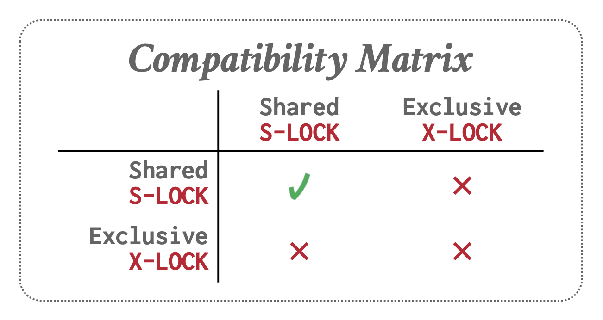
</div>

可以看到，只有共享模式是相互兼容的，而一旦涉及到排他模式就是不兼容的。

接下来定义一些和锁相关的指令：

- `lock-S(Q)`：向数据项 $Q$ 发起共享锁请求
- `lock-X(Q)`：向数据项 $Q$ 发起排他锁请求
- `unlock(Q)`：解锁数据项 $Q$
    - 该指令不一定要放在事务的最后执行

要想访问数据项，事务 $T_i$ 必须先锁住该数据项。如果该数据项已被其他事务锁住的话，并发控制管理器就不会向 $T_i$ 授予锁，$T_i$ 一直处于**等待**状态，直到所有不兼容的锁都被释放为止。

需要注意的是，只要事务保持对数据项的访问，那么它就必须保持对该数据项的锁。并且即便完成对数据项的最后一次访问时，事务也不能立马解锁，因为这样可能无法确保可串行性。

对于一组并发执行的事务，如果没有事务能够继续执行后续操作的话，那么我们就认为发生了**死锁**(deadlock)，此时必须得回滚其中一个事务，使得其他事务得以继续执行。相比没有用锁导致的不一致状态(inconsistent states)问题，用锁导致的死锁可能相对更好一些，因为该问题可通过回滚事务处理，但不一致状态就没法被数据库系统处理。

???+ example "例子"

    <div style="text-align: center">
        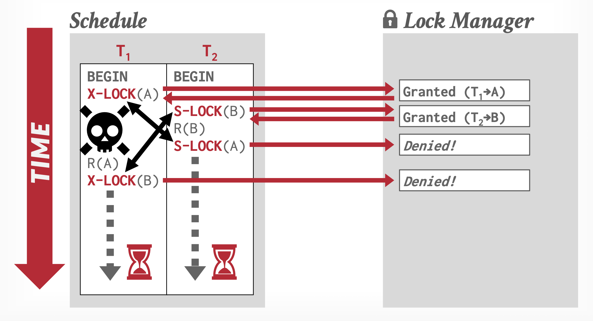
    </div>

事务的上锁和解锁操作需要遵循一套规则，称为**锁协议**(locking protocol)。稍后会介绍一些仅允许冲突可串行调度的锁协议，不过在此之前先要了解一些术语：令 $\{T_0, T_1, \dots, T_n\}$ 为一组参与调度 $S$ 的事务，

- 如果存在数据项 $Q$，事务 $T_i$ 对其有锁模式 $A$，随后的事务 $T_j$ 对其有锁模式 $B$，且 `comp(A, B)` = false，那么称 $T_i$ **先于**(precedes) $T_j$，记作 $T_i \rightarrow T_j$
    - 指令之间的冲突对应锁模式的不兼容性
- 若调度 $S$ 中的事务遵循锁协议中的规则，则 $S$ 在该锁协议下是**合法的**(legal)
- 当且仅当所有在锁协议下的合法调度是冲突可串行的时候，我们认为该锁协议确保冲突可串行性


### Granting of Locks

有时可能存在这样的情况：有一个对同一数据项发起共享锁的事务序列，每个事务给予锁后过一会儿便释放该锁，这样的话事务 $T_i$ 就永远没法获得对该数据项的排他锁，所以 $T_i$ 就没法进行下去，也就是说 $T_i$ 处于饥饿(starve)状态。

为避免这种情况，当满足以下条件时，并发控制管理器就可以向事务 $T_i$ 授予对数据项 $Q$ 的锁（模式为 $M$）：

- 没有其他事务持有和 $M$ 冲突的针对 $Q$ 的锁模式
- 没有先于 $T_i$ 发起请求的事务等待在 $Q$ 上加锁

这样，事务的加锁请求就不会被后发起的加锁请求阻断。


### The Two-Phase Locking Protocol

一种确保（冲突）可串行性的协议是**两阶段锁协议**(two-phase locking protocol)，该协议要求每个事务分两个阶段发起加锁和解锁请求：

- **增长阶段**(growing phase)：事务可能会**获得**锁（也有可能要**延后**一段时间再获得锁），但不会释放任何锁
- **收缩阶段**(shrinking phase)：事务可能会**释放**锁（也可能对原有锁进行**降级**），但不会获得任何新的锁

因此，某个事务锁的数量随时间的变化如下所示：

<div style="text-align: center">
    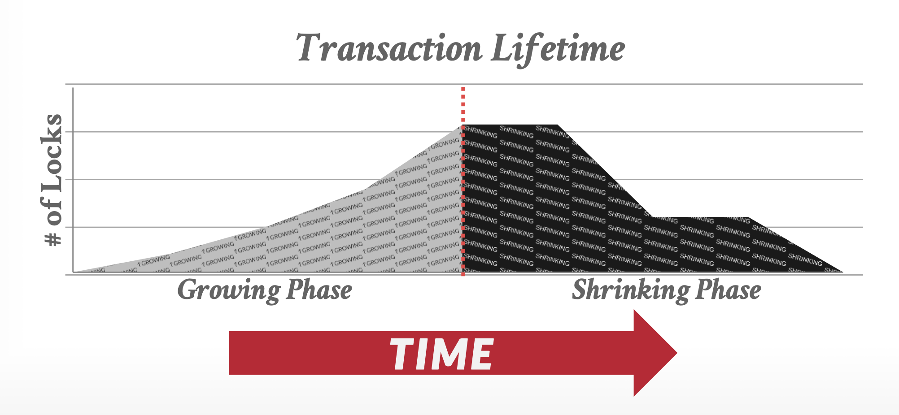
</div>

在调度中，某个事务获取最后一个锁（在增长阶段的末尾）的节点被称为该事务的**锁点**(lock point)。调度中的事务可以按照锁点序排序，而这样的顺序正是可串行的顺序。

??? example "例子"

    <div style="text-align: center">
        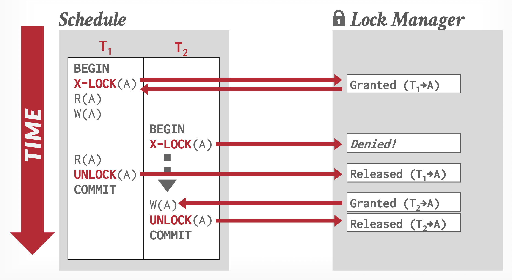
    </div>


该协议不保证不会出现死锁问题，而且可能会出现[**级联回滚**](13.md#cascadeless-schedules)(cascading rollback)的问题。

??? example "例子"

    <div style="text-align: center">
        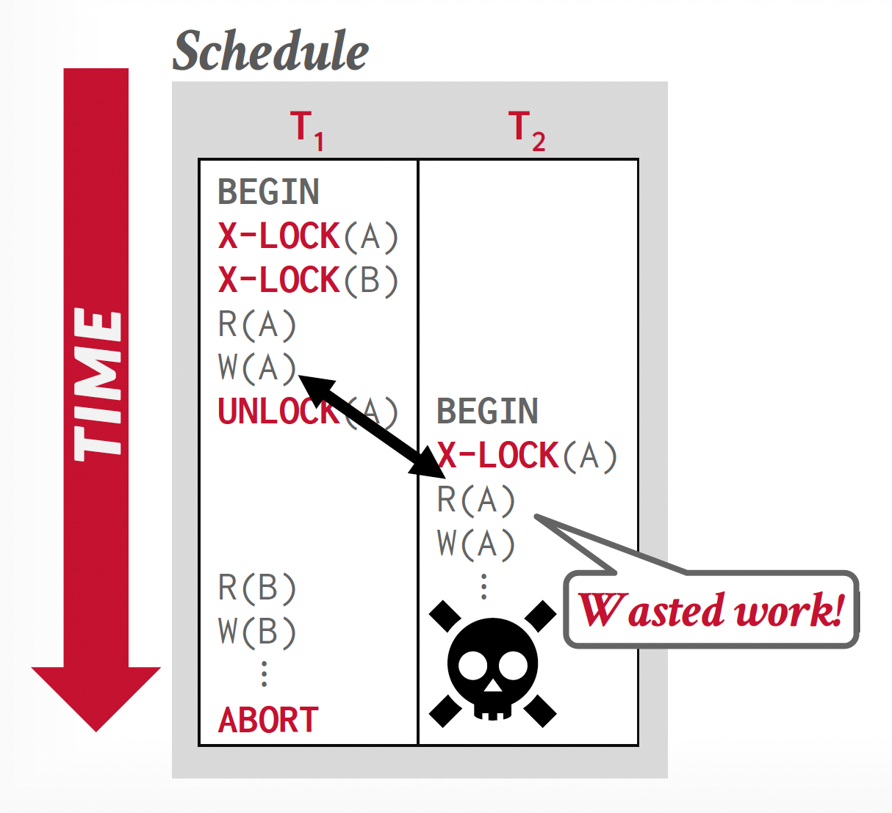
    </div>

为避免该问题发生，我们对原来的协议稍作修改，得到**严格两阶段锁协议**(strict two-phase locking protocol)。该协议在原有协议的基础上，要求事务所有的排他锁必须被保留，直到该事务被提交为止。另一种变体是**强严格两阶段锁协议**(rigorous two-phase locking protocol)，它要求保留所有锁，直至事务被提交。因此在这种协议下，事务可按照提交顺序被串行化。这两种变体被广泛使用。

在强严格两阶段锁协议下，某个事务锁的数量随时间的变化如下所示：

<div style="text-align: center">
    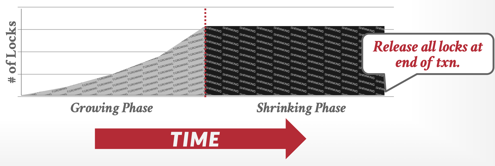
</div>

??? example "例子"

    === "没有用到两阶段锁协议"

        <div style="text-align: center">
            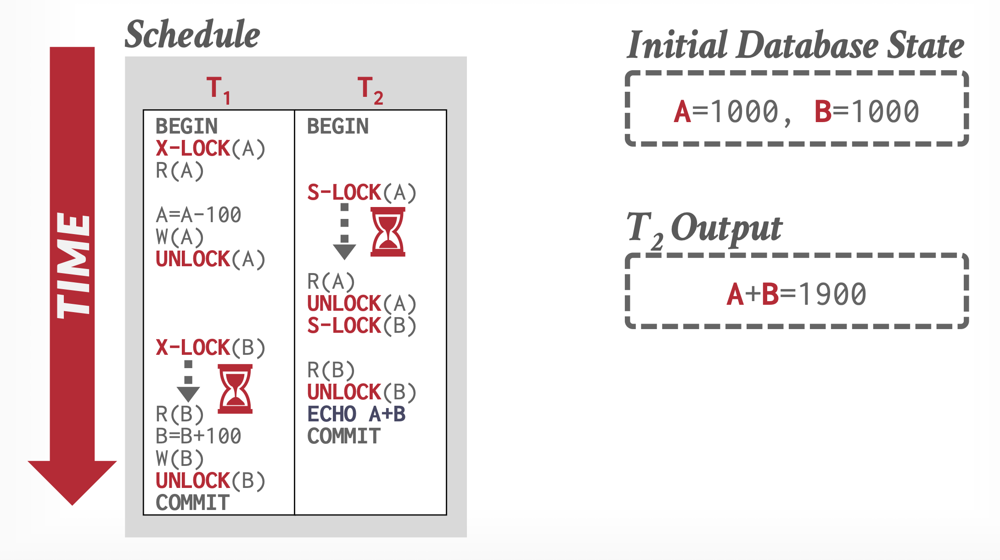
        </div>

    === "两阶段锁协议"

        <div style="text-align: center">
            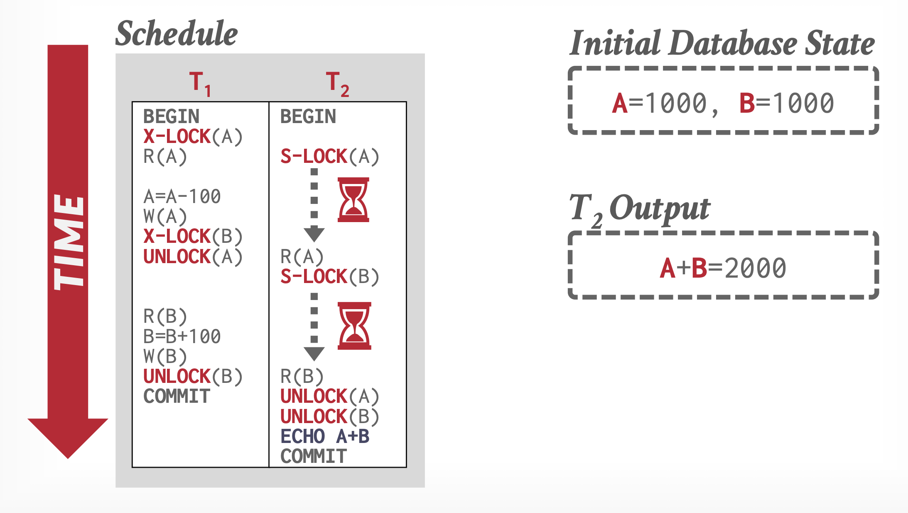
        </div>

    === "强严格两阶段锁协议"

        <div style="text-align: center">
            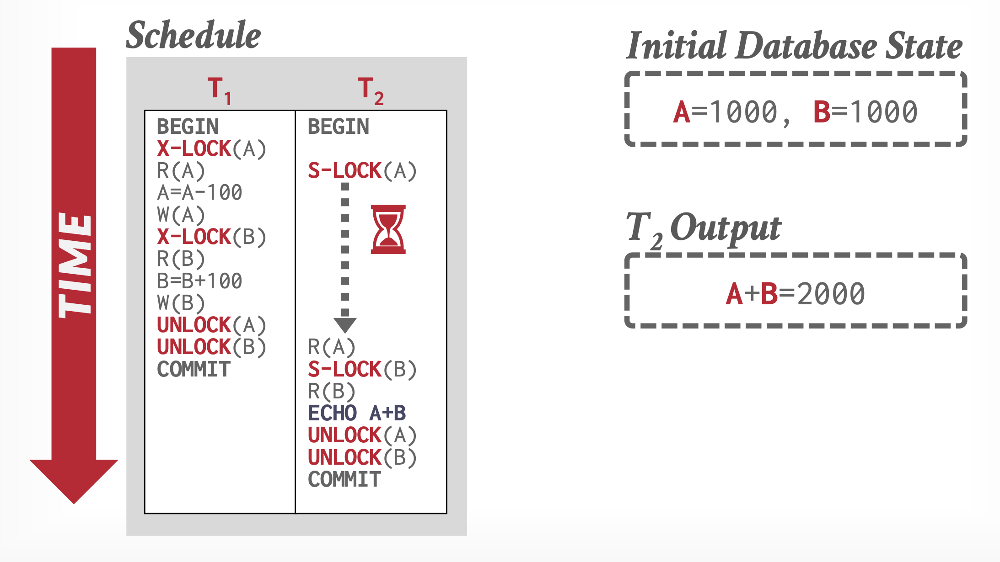
        </div>

??? info "到目前为止，我们认识到的各种调度"

    <div style="text-align: center">
        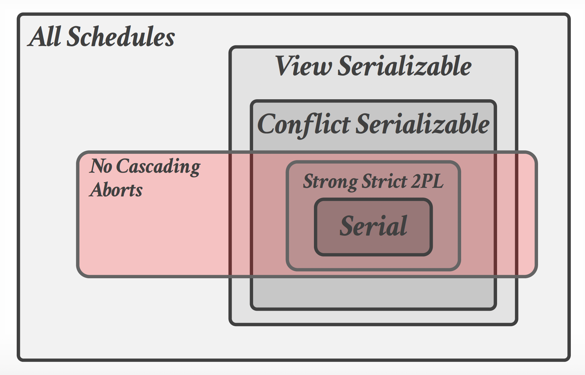
    </div>

---
为了提高并发程度，我们在基础的两阶段锁协议上增加一种**锁转换**(lock conversion)机制，它支持：

- **升级**(upgrade)：从共享锁到排他锁的转换，仅发生在增长阶段
- **降级**(downgrade)：从排他锁到共享锁的转换，仅发生在收缩阶段

需要注意的是，当数据项 $Q$ 被其他事务以共享模式锁住时，尝试升级对 $Q$ 的锁的事务会被要求强制等待。

类似基础的两阶段锁协议，带有锁转换的两阶段锁仅生成冲突可串行的调度，并且事务可按锁点被串行化

---
下面介绍一种简单但被广泛使用的，用来在事务中自动生成合适的加锁和解锁指令的方案（基于读/写请求）：

- 当事务 $T_i$ 发起 `read(Q)` 操作时，系统在该操作后发起 `lock-S(Q)` 指令
- 当事务 $T_i$ 发起 `write(Q)` 操作时，系统检查 $T_i$ 是否已经有 $Q$ 上的共享锁：
    - 如果有的话，系统在 `write(Q)` 之后发起 `upgrade(Q)` 指令
    - 否则系统在 `write(Q)` 之后发起 `lock-X(Q)` 指令
- 在事务提交或中止后，该事务获得的所有锁都会被解锁


### Implementation of Locking

**锁管理器**(lock manager)可通过一个接收来自事务信息，并通过发送信息来回应的进程实现。具体来说：

- 用锁授予信息，或者请求事务回滚的信息（当死锁发生时）来回应锁请求信息
- 对于解锁信息仅需承认即可，但可能要向其他正在等待的事务发送锁授予信息

锁管理器使用以下数据结构：

- 对于当前每个被锁住的数据项，维护一个记录链表，每个项为一次请求，遵循请求到达的顺序
- 使用哈希表（这里称为**锁表**(lock table)，用到了溢出链），在数据项名称上索引，以寻找数据相对应的链表。锁表的示意图如下：

    <div style="text-align: center">
        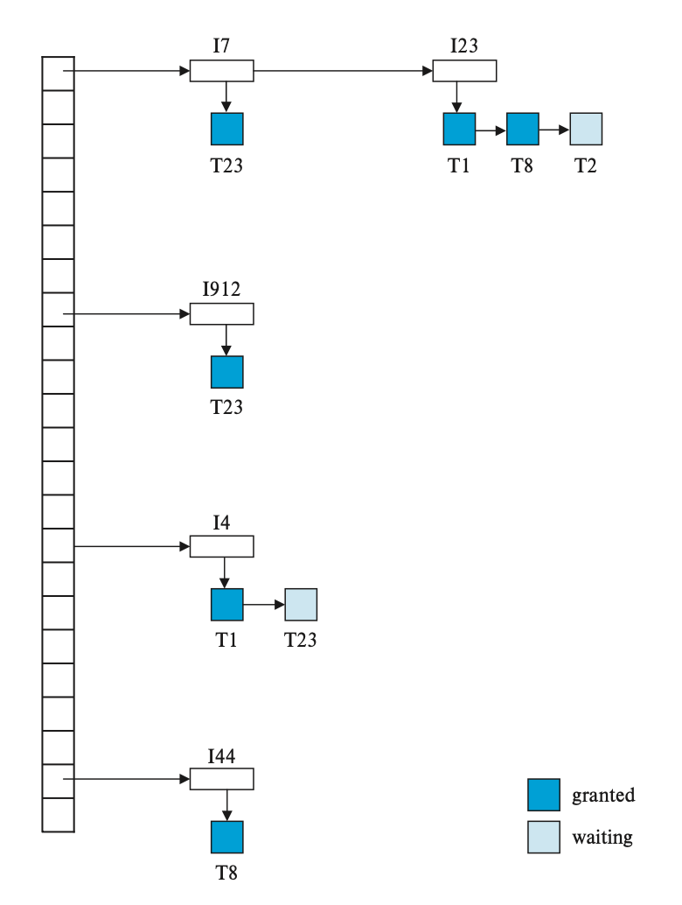
    </div>

- 锁表还维护了关于事务标识符的索引

锁管理器进程按以下方式发起请求：

- 当锁请求信息到达时，如果数据项对应的链表存在的话，那么将记录添加在链表末尾；否则创建一个新的，包含该请求记录的链表。
    - 当数据项没有被上锁时，锁管理器就会授予锁请求；但如果上锁的话，仅当请求的锁和当前的锁兼容时，锁管理器才会授予请求，否则该请求必须等待。
- 当收到解锁信息时，锁管理器删除对应该事务的链表中的数据项记录。然后它会测试紧随其后的记录（如果有的话），以查看该请求现在是否可以授予；如果可以，锁管理器授予该请求。之后按相同方式继续处理后续记录，以此类推。
- 如果事务中止，那么锁管理器删除由该事务发起的任何正在等待的请求。一旦数据库系统采取合适的行动来撤销事务时，锁管理器将释放被中止事务保留的所有锁。

这种方式能够避免事务出现饥饿的问题。


### Graph-Based Protocols

除了两阶段协议外，还有其他类型的协议，但它们就需要一些额外的信息，这些信息可以用各种模型描述。其中最简单的模型要求我们预先知道数据项被访问的顺序。要提前知道这样的信息，需要为所有数据项 $D = \{d_1, d_2, \dots, d_n\}$ 加一个[偏序](../../math/dm/9.md#partial-orderings)(paritial order) $\rightarrow$。如果 $d_i \rightarrow d_j$，那么任何访问 $d_i, d_j$ 的事务必须先访问 $d_i$，后访问 $d_j$。这种偏序可以通过数据的逻辑组织或物理组织实现，或者仅用于并发控制目的。

偏序表明我们可以将 $D$ 看作一个有向无环图，我们称其为**数据库图**(database graph)。为了简洁，我们将这种图限制在[有根树](../../math/dm/11.md#rooted-trees)(rooted tree)的形式；对应的协议称为**树协议**(tree protocol)。该协议唯一用到的加锁指令是 `lock-X`。每个事务 $T_i$ 至多对数据项加锁一次，且必须遵循以下规则：

- $T_i$ 的第一个锁必须作用在所有数据项上
- 随后，仅当数据项 $Q$ 的父亲被 $T_i$ 锁住时，$Q$ 才能被 $T_i$ 锁住
- 可以在任何时间解锁数据项
- 由 $T_i$ 加锁或解锁的数据项不能再次被 $T_i$ 加锁

所有在树协议下合法的调度都是冲突可串行的。

下图展示的是树结构的数据库图：

<div style="text-align: center">
    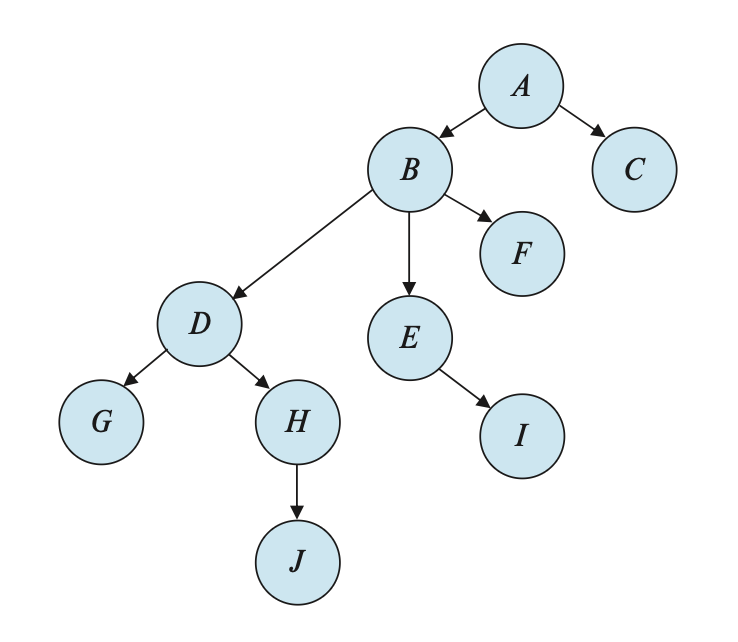
</div>

下面的四个事务就是针对图中的数据项进行操作的（仅展示加锁和解锁指令）：

<div style="text-align: center">
    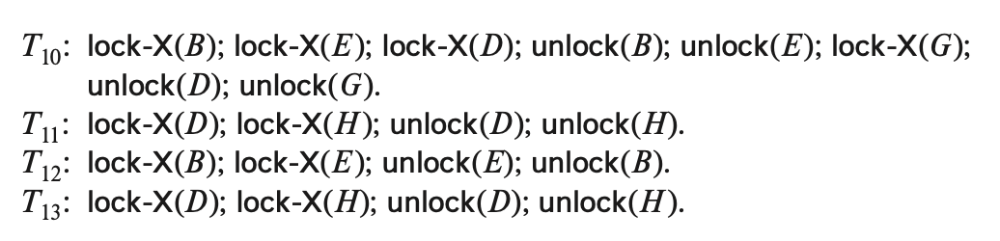
</div>

一种可行的调度如下：

<div style="text-align: center">
    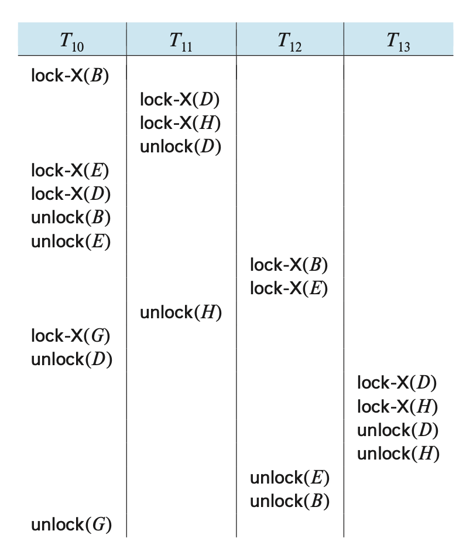
</div>

- 可以发现，在执行过程中，$T_{10}$在两个不相交的子树上维护锁
- 该调度是冲突可串行的，但无法确保可恢复性和无级联性

为了让树协议具备这两个性质，可以在其基础上稍加修改：不允许释放排他锁，直到事务结束为止。但这样做会降低并发程度。另一种提升并发程度，但只能保证可恢复性的办法是：

- 对于每个存在的未提交写入操作的数据项，我们会记录是哪个事务最后一次对该数据项进行了写操作
- 每当一个事务 $T_i$ 读取某个未被提交的数据项时，我们就会记录下 $T_i$ 对最后一次写入该数据项的事务的**提交依赖关系**(commit dependency)
- 此后，在所有被 $T_i$ 所依赖的事务完成提交之前，$T_i$ 都不允许进行提交
- 如果其中任何一个相关事务发生中止，那么 $T_i$ 也必须随之被中止

树协议的优点是它能确保不会发生死锁，那么也就无需回滚；另一个优点是能够更早执行解锁操作，因而缩短等待时间，提升并发程度。但它的缺点在于加锁开销的提升，并且可能会带来额外的等待时间，以及潜在的并发程度下降问题。

事实上，存在遵循两阶段锁协议，但不遵循树协议的调度，反之亦然。


## Deadlock Handling

假如存在一组等待事务 $\{T_0, T_1, \dots, T_n\}$，使得 $T_0$ 等待 $T_1$ 加锁的数据，$T_1$ 等待 $T_2$ 加锁的数据，...，$T_{n-1}$ 等待 $T_n$ 加锁的数据，$T_n$ 等待 $T_0$ 加锁的数据。那么我们认为这些事务进入死锁(deadlock)状态。

下面介绍两种处理死锁问题的主要方法：

- **死锁阻止**(prevention)：确保系统不会进入死锁状态
- **死锁检测和恢复**(detection and recovery)：允许系统进入死锁状态，但之后尝试从死锁状态恢复

如果死锁会带来相对较高的损失，那么可以采用死锁阻止；否则的话可以采用更加高效的死锁检测和恢复。


### Deadlock Prevention

有以下阻止死锁的方法：

- 通过为锁请求排序或要求一次性获取所有锁，确保没有循环等待的情况出现
    - 最简单的方案是要求每个事务在开始执行前锁住它要用到的所有数据项。但这种方法的缺点是难以预测需要被加锁的数据项，以及数据项的低利用率
    - 强制为数据项排序，并要求事务仅对与顺序一致的序列锁定数据项
    - 上述方法的一种变体是采用数据项的全序和两阶段锁。一旦事务锁住特定数据项后，它就不能对顺序中先于该数据项的数据项请求加锁。该方法最大的好处是易于实现

- 类似死锁恢复，当事务的等待可能会导致死锁时，回滚该事务而不是继续等待
    - 具体通过**抢夺**(preemption)来实现：当事务 $T_j$ 向已被 $T_i$ 加锁的数据项请求锁时，通过回滚 $T_i$，将 $T_i$ 的锁抢走，然后向 $T_j$ 授予锁
    - 为了控制抢占操作，我们需要为每个刚开始的事务赋予**时间戳**(timestamp)（基于计数器或系统时钟）。系统仅用时间戳来决定事务是否需要等待或回滚。如果事务要回滚，那么在重启该事务时要保留**旧的**时间戳。下面给出两种使用时间戳的不同方案：
        - **等待-死亡**(wait-die)（非抢夺技术）：当事务 $T_i$ 向已被 $T_j$ 加锁的数据项请求锁时，仅当 $T_i$ 的时间戳小于 $T_j$（$T_i$ 比 $T_j$ 更老）的时候，$T_i$ 可以等待，否则需要回滚 $T_i$
        - **受伤-等待**(wound-wait)（抢夺技术）：当事务 $T_i$ 向已被 $T_j$ 加锁的数据项请求锁时，仅当 $T_i$ 的时间戳大于 $T_j$（$T_i$ 比 $T_j$ 更新）的时候，$T_i$ 可以等待，否则需要回滚 $T_j$（$T_j$ 被 $T_i$ “击伤(wound)”）

        <div style="text-align: center">
            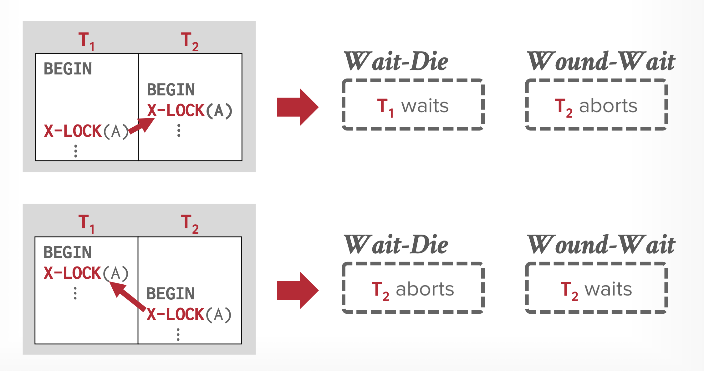
        </div>

        这两种方法的共同问题是会带来不必要的回滚。

- 基于**锁超时**(lock timeout)的方法：请求锁的事务至多等待一定量的时间。如果在这段时间内还没向事务授予锁，那么该事务被认为是超时了，需要回滚并重新开始。
    - 该方法易于实现，且当事务内容不多，并且长时间等待会可能会导致死锁时较为有效
    - 但我们很难决定多久被认为是超时的：等待太久会带来不必要的延迟，等待太少会带来不必要的回滚，从而导致资源浪费。并且该方法可能会让事务进入饥饿状态。因此该方法应用有限。


### Deadlock Detection and Recovery

如果系统采用的协议无法确保死锁不出现，那么就必须得采取死锁检测和恢复方案了。具体来说，系统需要：

- 维护关于当前分配给事务的数据项的信息，以及任何未完成的数据项请求
- 提供一种检测算法，它采用这些信息，以确定系统是否进入死锁状态
    - 我们还得考虑何时调用该算法——这取决于两个因素：死锁发生的频率，以及受死锁影响的事务数量
- 当检测算法确定死锁存在时，要从死锁中恢复过来，具体分为以下三步：
    - **受害者的选择**：对于给定的一组事务，我们必须确定要回滚哪个事务以打破死锁。一般我们会选择回滚成本最小的事务，但这个最小成本很难准确定义。回滚的成本需要考虑以下因素：
        - 事务计算所需的时间
        - 事务使用的数据项的个数
        - 还需要多少数据项来完成事务
        - 回滚包含的事务数
    - **回滚**：
        - 最简单的方案是**完全回滚**(total rollback)：中止事务并重新启动
        - 但相对而言，**部分回滚**(partial rollback)效率更高，仅回滚能够打破死锁的事务。但该方法要求系统维护额外的有关所有正在运行的事务状态的信息，具体来说事务执行的锁请求/授予，以及更新序列需要被记录下来。
    - **饥饿**：有可能出现总是将相同事务作为“受害者”的情况，这样的话该事务就永远没法完成任务，因而存在饥饿问题。所以我们必须确保事务被选为“受害者”的次数不超过指定次数。最常见的解决方案是在成本因子中包含回滚次数。

---
死锁的情况可用一种称为**等待图**(wait-for graph)的有向图 $G = (V, E)$ 表示，

- 其中顶点表示系统中的事务，边表示一个有序对 $T_i \rightarrow T_j$，表明事务 $T_i$ 正在等待事务 $T_j$ 释放其所需数据项的锁。
- 当事务 $T_i$ 向正被 $T_j$ 加锁的数据项发起加锁请求时，将 $T_i \rightarrow T_j$ 插入到图中；当 $T_j$ 不再持有该数据项的锁时，将这条边删掉。
- 当且仅当等待图中存在环时，系统中就出现了死锁。为了检测死锁，系统需要维护等待图，周期性地调用在图中搜索环的算法

??? example "例子"

    <div style="text-align: center">
        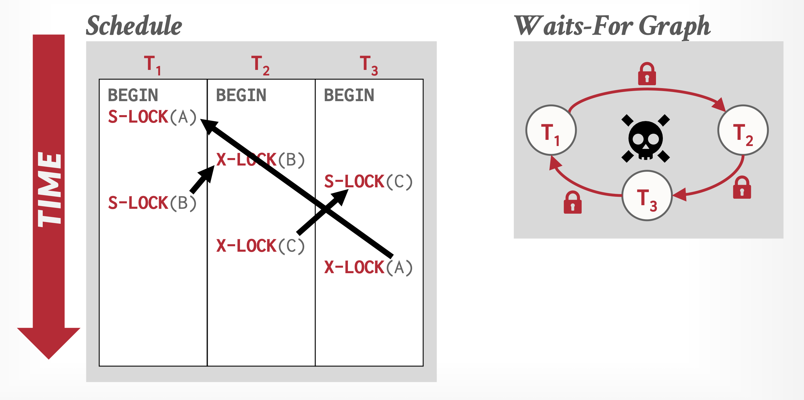
    </div>


## Multiple Granulartiy

在前面介绍的并发控制方案中，我们都是将单个的数据项作为同步执行单元。但有时将多个数据项放在同一个组，将其视为同一个同步单元可能会带来更好的效果。例如:

- 假设一个事务 $T_i$ 需要访问整个关系表，而采用的锁协议是对元组加锁，那么 $T_i$ 必须锁定该关系表中的每一个元组。显然，获取大量此类锁非常耗时；更糟糕的是，锁表可能会变得极其庞大以致无法容纳在内存中。
- 若 $T_i$ 能通过单一锁请求直接锁定整个关系表则更为高效。反之，若事务 $T_j$ 仅需访问少量元组时，就不应强制其锁定整张关系表，否则将丧失并发性优势。

因此，我们需要一种机制，能够让系统定义多个层级的**粒度**(granularity)：也就是说让数据项的大小可变；并定义一种数据粒度层级，其中小粒度会被包含在大粒度里面。这样的层级可以用一棵树表示，如下所示：

<div style="text-align: center">
    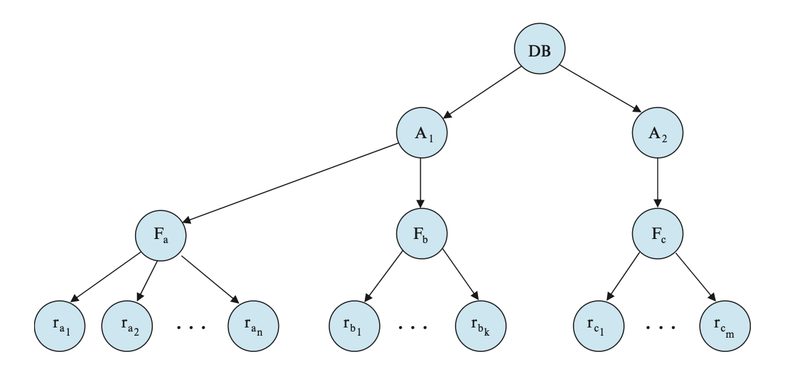
</div>

- 不同于树协议中独立的节点，多粒度树的非叶子节点表示的是和它后代关联的数据
- 树中最高层的节点表示整个数据库
- 第二层节点表示的是**区域**(areas)，可以看到数据库由多个区域构成
- 每个区域内有多份**文件**(files)，反映在树上就是文件节点作为区域节点的后代；注意文件不得横跨多个区域
- 每个文件下有多条**记录**(records)，作为文件节点的后代；类似地，记录不得存在于多个文件内
- 每个节点可以被单独加锁。当事务锁住某个节点时（无论用共享锁还是排他锁），事务也会**隐式**地对其全部后代加锁
- 假如事务 $T_j$ 要对记录 $r_b$ 加锁，那么该事务要从这棵树的根节点开始遍历。如果发现路径上有节点采用了和 $T_j$ 锁不兼容的锁，那么 $T_j$ 的加锁操作就要被延后了

??? info "另一种粒度层级（个人感觉更通顺）"

    <div style="text-align: center">
        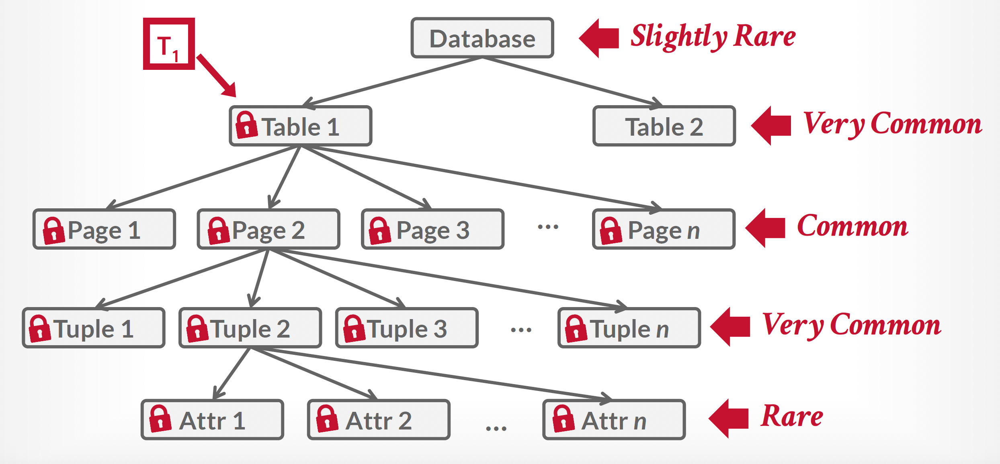
    </div>

假如事务 $T_k$ 要对整个数据库加锁，但由于另一个事务 $T_i$ 已经对某个子树加锁，因此在加锁前需要确定是否能够加锁。遍历整棵树固然能够解决这一问题，但这种简单粗暴的方法效率太低，我们无法接受。因此，我们采用一种更高效的做法，称为**意向锁模式**(intention lock modes)：如果一个节点被加上意向锁，那么它的后代也会被**显式**地上锁。因此事务就无需遍历整棵树——如果想要锁住节点 $Q$，那么在此之前只需遍历从根节点到 $Q$ 这条路径即可。

意向锁可以和共享锁关联，也可以和排他锁关联，因此我们得到更多的锁模式：

- **意向-共享模式**(intention-shared(IS) mode)：对节点后代进行显式加上共享锁
- **意向-排他模式**(intention-exclusion(IX) mode)：对节点后代进行显式加上共享锁或排他锁
- **共享-意向-排他模式**(shared and intention-exclusive(SIX) mode)：该节点下子树的根节点被显式加上共享锁，而更低层的节点被显式加上排他锁

算上一般的共享锁和排他锁，我们可以得到以下兼容函数：

<div style="text-align: center">
    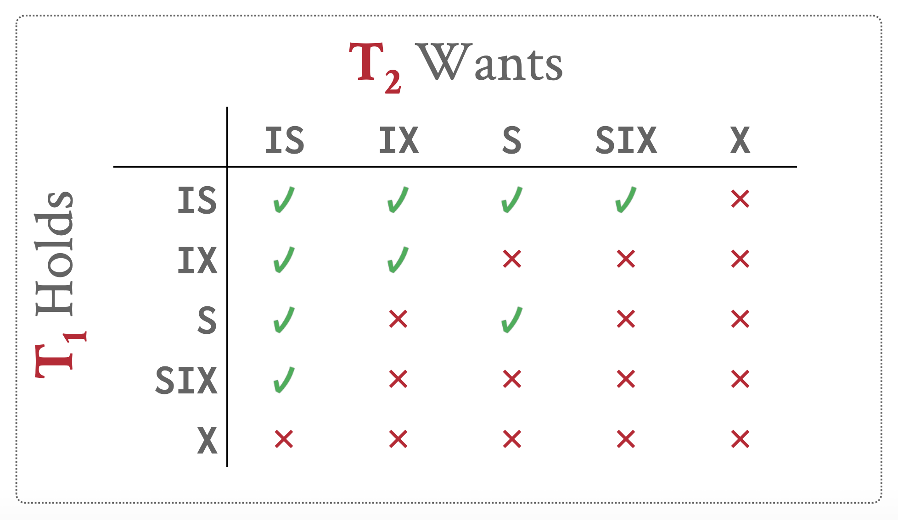
</div>

在多粒度概念的基础上，我们可以得到**多粒度锁协议**(multiple-granularity locking protocol)。该协议利用上述5种锁来确保可串行性。它要求事务 $T_i$ 在对某个节点 $Q$ 加锁前必须遵循以下规则：

- $T_i$ 必须遵循上面给出的兼容函数
- $T_i$ 必须先对树的根节点加锁（可用任意锁模式）
- 仅当 $T_i$ 已经对 $Q$ 的父亲节点加上 IX 或 IS 锁时，$T_i$ 可对 $Q$ 加上 S 或 IS 锁
- 仅当 $T_i$ 已经对 $Q$ 的父亲节点加上 IX 或 SIX 锁时，$T_i$ 可对 $Q$ 加上 X, SIX 或 IX 锁
- 仅当 $T_i$ 在先前没有解锁过时，$T_i$ 才可以对节点加锁
- 仅当 $T_i$ 没有对 $Q$ 的任何孩子加锁时，$T_i$ 才可以解锁 $Q$

可以看到，多粒度协议要求获取锁的顺序是**自顶向下**(top-down/root-to-leaf)，而释放锁的顺序是**自底向上**(bottom-up/leaf-to-root)。并且死锁可能会发生。

该协议的好处是增强并发程度，并减少了锁开销。它尤其适用于以下场景：仅访问部分数据项的短事务，以及从单个或多个文件中生成报告的长事务。

??? example "例子"

    <div style="text-align: center">
        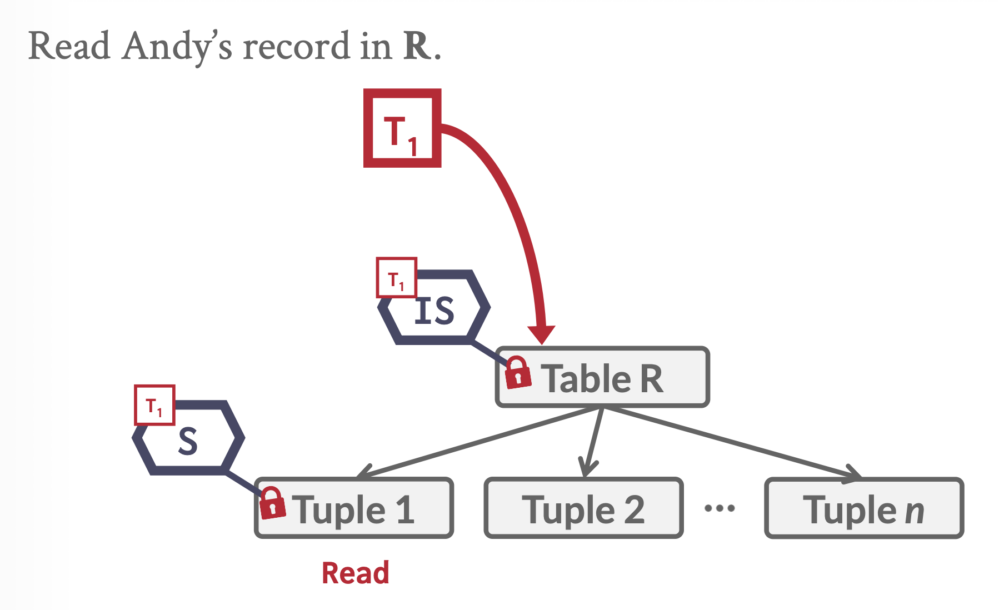
    </div>

    <div style="text-align: center">
        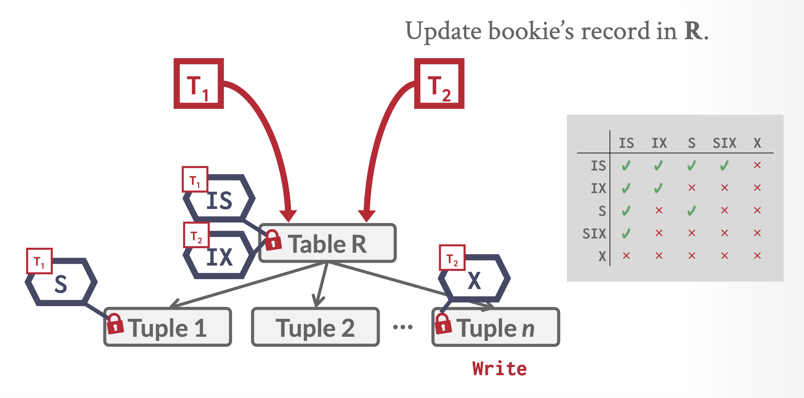
    </div>

SQL 查询需要的锁数量通常可通过关系扫描操作的结果来估算。例如，关系扫描会在关系级别获取一个锁，而索引扫描则可能在关系级别获得意向锁，并在元组级别施加常规锁。若某事务获取了大量元组锁，可能导致锁表过度填充。针对这种情况，锁管理器可执行**锁升级**(lock escalation)机制——用单个更高层级的锁替代多个低层级锁；在上述示例中，单个关系级锁即可取代大量元组级锁定。


## Operations

到目前为止，我们只关注了 `read` 和 `write` 操作。现在我们增加一些额外的操作：

- `delete(Q)`：从数据库中删除数据项 $Q$
- `insert(Q)`：向数据库插入一个新数据项 $Q$，并为 $Q$ 赋予一个初始值


### Deletion

为了理解 `delete` 指令是如何影响并发控制的，我们必须确定 `delete` 何时和其他指令发生冲突。令 $I_i, I_j$ 分别为事务 $T_i, T_j$ 的指令，而这两个事务以连续顺序出现在调度 $S$ 中；并且令 $I_i$ = `delete(Q)`。接下来就 $I_j$ 来分类讨论：

- $I_j$ = `read(Q)`：$I_i, I_j$ 冲突。如果 $I_i$ 出现在 $I_j$ 前面，$T_j$ 就会有逻辑错误；如果 $I_j$ 出现在 $I_i$ 前面，$T_j$ 就能成功执行 `read` 操作。
- $I_j$ = `write(Q)`：$I_i, I_j$ 冲突。如果 $I_i$ 出现在 $I_j$ 前面，$T_j$ 就会有逻辑错误；如果 $I_j$ 出现在 $I_i$ 前面，$T_j$ 就能成功执行 `write` 操作。
- $I_j$ = `delete(Q)`：$I_i, I_j$ 冲突。如果 $I_i$ 出现在 $I_j$ 前面，$T_j$ 就会有逻辑错误；如果 $I_j$ 出现在 $I_i$ 前面，$T_i$ 就会有逻辑错误。
- $I_j$ = `insert(Q)`：$I_i, I_j$ 冲突。假设数据项 $Q$ 在 $I_i, I_j$ 执行前不存在。那么如果 $I_i$ 出现在 $I_j$ 前面，$T_j$ 就会有逻辑错误；如果 $I_j$ 出现在 $I_i$ 前面，就没有有逻辑错误。同样地，如果数据项 $Q$ 在 $I_i, I_j$ 执行前存在的话，当 $I_j$ 出现在 $I_i$ 前面时就会发生逻辑错误，反之则不会。

下面总结一下：

- 在[两阶段锁协议](#the-two-phase-locking-protocol)中，在删除某个数据项前，需要为该数据项加上排他锁
- 在[时间戳顺序协议](#timestamp-based-protocols)中，必须执行类似检验 `write` 的测试。假设 $T_i$ 发起 `delete(Q)` 指令：
    - 若 TS($T_i$) < R-timestamp($Q$)，那么 $Q$ 的值已经被另一个满足 TS($T_j$) > TS($T_i$) 的事务 $T_j$ 读取。因此 `delete` 操作被拒绝，$T_i$ 被回滚
    - 若 TS($T_i$) < W-timestamp($Q$)，那么另一个满足 TS($T_j$) > TS($T_i$) 的事务 $T_j$ 已经写入 $Q$。因此 `delete` 操作被拒绝，$T_i$ 被回滚
    - 否则执行 `delete` 操作


### Insertion

前面已经说过，`insert(Q)` 操作和 `delete(Q)` 操作冲突；此外，`insert(Q)` 也和 `read(Q)` 和 `write(Q)` 冲突，因为 `read` 和 `write` 没法执行于一个不存在的数据项上。

- 在两阶段锁协议中，如果 $T_i$ 执行 `insert(Q)` 操作，那么 $T_i$ 要为新创建的数据项 $Q$ 加上排他锁
- 在时间戳顺序协议中，如果 $T_i$ 执行 `insert(Q)` 操作，那么 R-timestamp(Q) 和 W-timestamp(Q) 被设为 TS($T_i$)


### Predicate Reads and the Phantom Phenomenon

**幽灵现象**(phantom phenomenon)（或者称作**幻读**）：当一个事务在执行过程中，多次执行相同的查询（**谓词读取**(predicate read)），但由于其他并发事务插入或删除了符合查询条件的新记录，导致后一次查询的结果集与前一次查询的结果集不同，就好像出现了“幽灵”一样，这些新出现的或消失的记录就是“幽灵”。

<div style="text-align: center">
    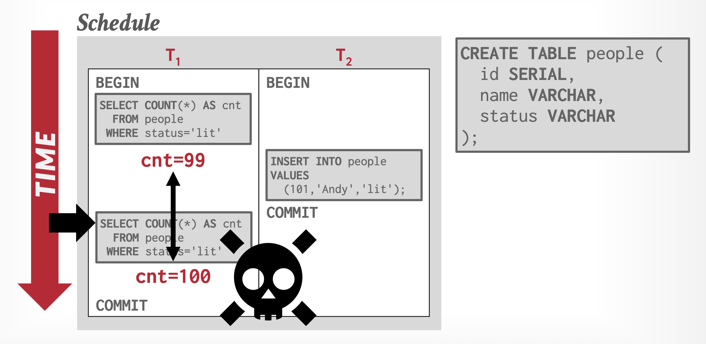
</div>

有以下几种解决方法：

- **再执行扫描**(re-execute scan)：DBMS 会记录该事务执行的所有查询的 `WHERE` 子句；事务在提交时可能会重新执行查询以检查结果是否不同，能够发现由于新增或删除的记录而遗漏的变更，以确保结果保持一致性。
- **谓词锁**(predicate locking)：根据查询谓词获取锁，确保满足谓词的任何数据不会被其他事务修改，但这种方法用的很少。

    <div style="text-align: center">
        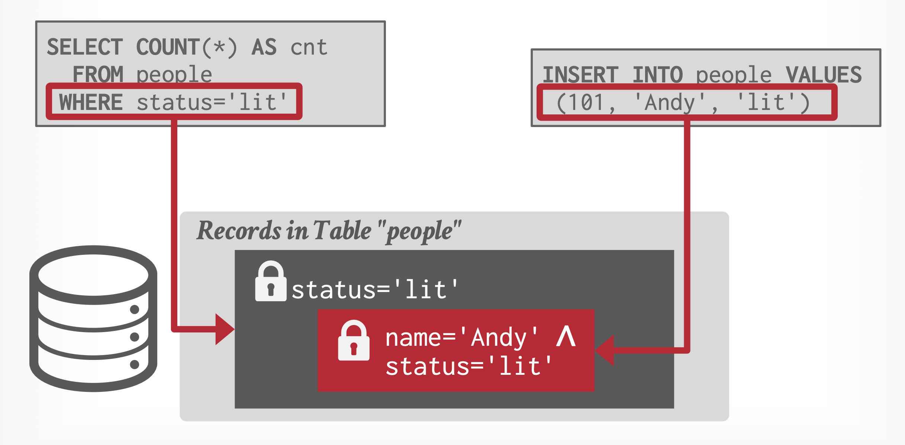
    </div>

- **索引锁**(index-locking)：
    - 避免对整个索引加锁：任何向关系插入元组的事务必须向对应索引插入信息；通过在索引上施加锁协议来消除幽灵现象
    - **索引锁协议**(index-locking protocol)的具体操作为：
        - 每个关系必须至少有一个索引
        - 仅当通过关系中的一个或多个索引找到指定元组时，事务 $T_i$ 才能访问这些元组。在索引锁协议中，关系扫描被视为对索引中所有叶子节点进行扫描
        - 执行查找的事务 $T_i$ 必须对要访问的索引中的所有节点加上共享锁
        - 事务 $T_i$ 在对关系 $r$ 中的元组 $t_i$ 执行插入、删除或更新操作时，必须同时更新 $r$ 上的所有索引。该事务需要获取所有受插入、删除或更新操作影响的索引叶子节点的排他锁。具体而言：
            - 插入/删除：受影响的叶子节点是指那些（在插入后）将包含该元组搜索键值或（在删除前）曾包含该元组搜索键值的节点
            - 更新：受影响的叶子节点包括两类——修改前含有旧搜索键值的节点，以及修改后将包含新搜索键值的节点
        - 对于元组，锁的获取和平常一样
        - 必须遵守两阶段锁协议的规则

    - 索引锁的具体方案有：
        - **键值锁**(key-value locks)：索引中单个键值对的锁定，包括不存在值的虚拟键

            <div style="text-align: center">
                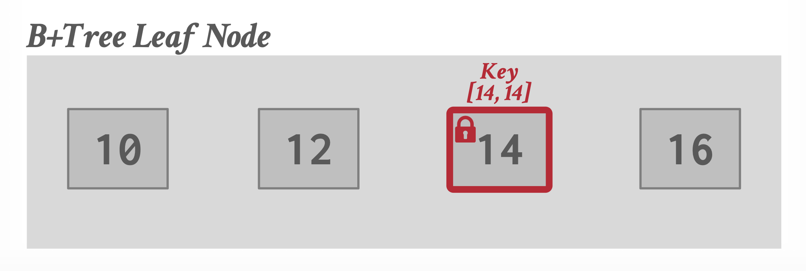
            </div>

        - **间隙锁**(gap locks)：键值对之后的间隙上的锁，防止在这些间隙中插入

            <div style="text-align: center">
                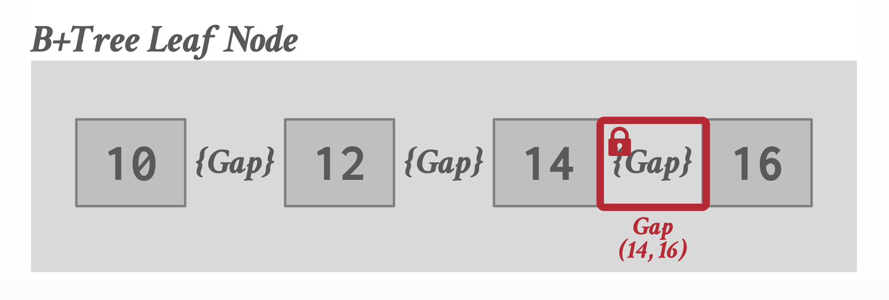
            </div>

        - **键-范围锁**(key-range locks)：锁定一个键范围，从现有键到下一个键

            <div style="text-align: center">
                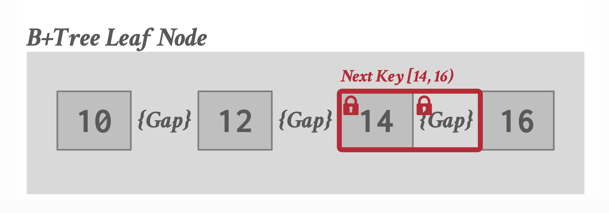
            </div>

        - **层级锁**(hierarchical locks)：允许事务以不同模式持有更广泛的键范围锁，降低锁管理器的开销

            <div style="text-align: center">
                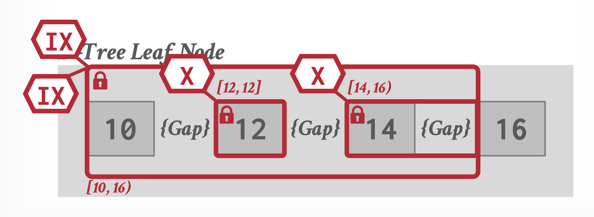
            </div>

    - 需要注意的是，索引锁协议没有解决索引中内部节点的并发控制。
    - 对索引叶子节点的加锁能够阻止任何对节点的更新操作，即便实际上这个更新操作不会和谓词冲突。
    

---
并发控制的另一种方法是在查询中的谓词上获取共享锁，随后必须检查对该关系的插入和删除操作是否满足该谓词；若满足，则存在锁冲突，此时插入或删除操作不得不等待，直至谓词锁释放。对于更新操作，需同时检查元组的初始值与最终值是否符合该谓词条件。这些产生冲突的插入、删除及更新操作会影响由该谓词选定的元组集合，因此不允许它们与持有（共享）谓词锁的查询并发执行。我们将此协议称为**谓词锁**(predicate locking)；由于实现成本高于索引锁定协议且未能带来显著额外优势，实践中并不会采用这种技术。


## Timestamp-Based Protocols

### Timestamps

对系统中的每个事务 $T_i$，我们为其关联一个唯一的固定时间戳，记作 TS($T_i$)。该时间戳由数据库系统在事务 $T_i$ 开始执行前分配得到。如果事务 $T_j$ 后于 $T_i$ 执行，那么 TS($T_i$) < TS($T_j$)。具体有两种实现方式：

- 使用**系统时钟**(system clock)值作为时间戳，也就是说事务的时间戳等于事务进入系统时的时钟值
- 使用**逻辑计数器**(logical counter)，该计数器在分配新的时间戳后会递增；也就是说事务的时间戳等于事务进入系统时的计数器值

事务的时间戳决定了可串行性顺序。因此，如果 TS($T_i$) < TS($T_j$)，那么系统必须确保得到的调度等价于 $T_i$ 出现在 $T_j$ 之前的串行调度。为做到这点，我们为每个数据项 $Q$ 关联两个时间戳值：

- **W-timestamp**($Q$)：任何成功执行 `write(Q)` 的事务中最大的时间戳
- **R-timestamp**($Q$)：任何成功执行 `read(Q)` 的事务中最大的时间戳

当新的 `read(Q)` 或 `write(Q)` 指令被执行时，这些时间戳就要更新了。


### The Timestamp-Ordering Protocol

**时间戳顺序协议**(timestamp-ordering protocol)确保任何冲突的 `read` 和 `write` 操作按照时间戳顺序执行，具体操作为：

- 假设 $T_i$ 发射 `read(Q)` 指令：
    - 如果 TS($T_i$) < W-timestamp($Q$)，那么 $T_i$ 需要读取 $Q$ 中已被覆写的值。因此，`read` 操作被拒绝，$T_i$ 被回滚
    - 如果 TS($T_i$) >= W-timestamp($Q$)，那么执行 `read` 操作，并且 R-timestamp($Q$) 被设为 R-timestamp($Q$) 和 TS($T_i$) 中的最大值
- 假设 $T_i$ 发射 `write(Q)` 指令：
    - 如果 TS($T_i$) < R-timestamp($Q$)，那么 $T_i$ 需要读取，那么 $T_i$ 试图生成的 $Q$ 值在此之前已被读取，系统原先假定该值永远不会被产生。因此，`write` 操作被拒绝，$T_i$ 被回滚
    - 如果 TS($T_i$) < W-timestamp($Q$)，那么 $T_i$ 尝试写入写入一个过时的 $Q$ 值。因此，`write` 操作被拒绝，$T_i$ 被回滚
    - 否则系统执行 `write` 操作，并将 W-timestamp($Q$) 的值设为 TS($T_i$)

如果事务 $T_i$ 被回滚，那么系统需要为该事务赋予新的时间戳，并重新启动该事务。

在双阶段锁协议下可行的调度，在时间戳协议下可能不可行，反之亦然。

时间戳顺序协议确保冲突可串行性，因为系统能够按照时间戳顺序处理冲突的操作。

该协议还确保不会出现死锁，因为没有事务会等待。然而，对于长事务，如果一系列冲突的短事务导致长事务的重复启动，那么就会出现饥饿问题。遇到这种情况，就需要暂时阻止那些冲突的事务，直至该事务能够顺利完成。

虽然该协议得到的调度时不可恢复的，但是我们可通过扩展该协议来使调度变得可恢复，具体有以下途径：

- 通过将所有写操作集中在事务结束时执行，可以确保可恢复性和无级联性。这些写操作必须满足以下原子性要求：在写操作进行过程中，任何事务都不得访问已被写入的数据项。
- 通过采用一种有限形式的锁定机制，可以确保可恢复性和无级联性。在这种机制下，对未提交数据项的读取操作会被推迟，直到更新该数据项的事务提交为止。
- 仅通过追踪未提交的写入操作，并确保事务 $T_i$ 只有在所有被其读取数据的事务提交之后才能提交，即可单独保障可恢复性。提交依赖机制正可用于实现这一目标。

如果该协议仅作用在元组上，那么该协议很容易会遇到[幽灵问题](#predicate-reads-and-the-phantom-phenomenon)。为避免该问题，就要将该协议作用在事务读取的整个数据上，包括关系元数据和索引数据。时间戳排序协议将每个索引节点视为一个数据项，并关联读写时间戳，同时对这些数据项也应用时间戳排序测试。这一扩展版的时间戳排序协议能够避免幽灵问题，并确保即使在谓词读取的情况下也能实现可串行化。


### Thomas' Write Rule

下面介绍一种能够提高潜在并发程度的时间戳顺序协议的改版——**托马斯写规则**(Thomas' write rule)：在特定情况下，我们可以忽略过时的写操作；对于读操作，协议规则保持不变。下面我们仅考虑 `write(Q)` 的情况：

- 如果 TS($T_i$) < R-timestamp($Q$)，那么 $T_i$ 需要读取，那么 $T_i$ 试图生成的 $Q$ 值在此之前已被读取，系统原先假定该值永远不会被产生。因此，`write` 操作被拒绝，$T_i$ 被回滚
- 如果 TS($T_i$) < W-timestamp($Q$)，那么 $T_i$ 尝试写入写入一个过时的 $Q$ 值。因此，`write` 操作可以被忽略
- 否则系统执行 `write` 操作，并将 W-timestamp($Q$) 的值设为 TS($T_i$)

和时间戳顺序协议相比，唯一的变化在于第二条规则。

通过忽略写操作，托马斯写规则允许那些虽然不具备冲突可串行化性质，但实际结果正确的调度，它们符合**视图可串行化**(view serializable)调度的定义（见下面的补充）。托马斯写规则实质上是通过删除事务中已过时的写操作来利用视图可串行性。这种对事务的修改能够生成在其他协议下无法实现的、具有可串行性的调度。

??? info "补充：视图可串行性(view serialzability)"

    现有两个调度 $S, S'$，且它们包含的事务是一样的。如果满足以下条件，我们称这两个调度是**视图等价的**(view equivalent)：

    - 对于每个数据项 $Q$，如果事务 $T_i$ 在调度 $S$ 中读取 $Q$ 的初始值，那么 $S'$ 中的 $T_i$ 也要读取 $Q$ 的初始值
    - 对于每个数据项 $Q$，如果在 $S$ 中的事务 $T_i$ 执行 `read(Q)`，并且读取值来自事务 $T_j$ 执行的 `write(Q)` 操作，那么在 $S'$ 中的事务 $T_i$ 的`read(Q)` 也要读取值来自事务 $T_j$ 执行的相同的 `write(Q)` 操作
    - 对于每个数据项 $Q$，$S$ 中执行最后的 `write(Q)` 的任何事务必须在 $S'$ 中执行最后的 `write(Q)`

    如果调度 $S$ 视图等价于一个串行调度，那么称 $S$ 是**视图可串行化的**(view serializable)。

    ??? example "例子"

        <div style="text-align: center">
            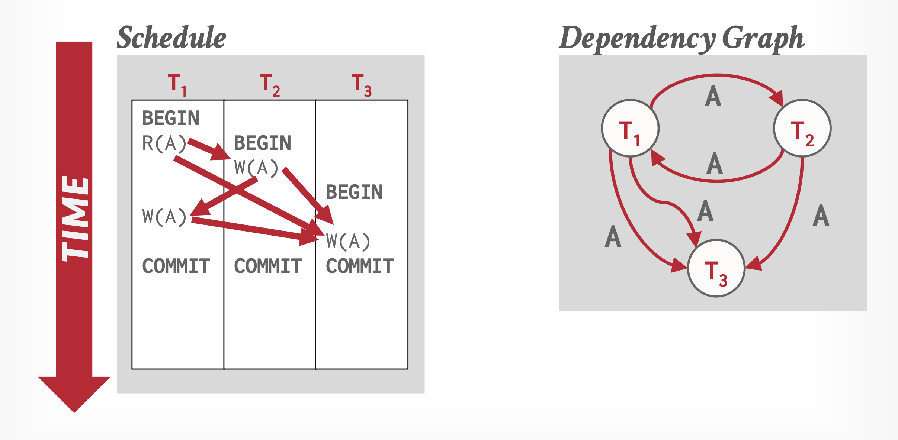
        </div>

        <div style="text-align: center">
            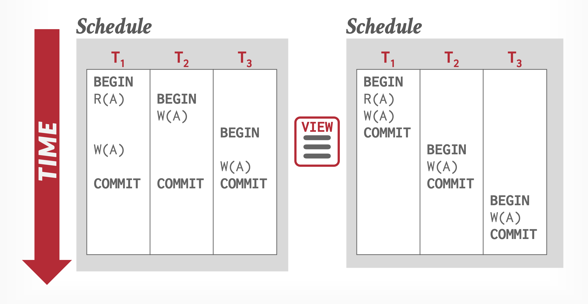
        </div>

    所有冲突可串行的调度都是视图可串行的，但是视图可串行的调度不一定是冲突可串行的。当视图可串行的调度出现**盲写**(blind writes)（事务在执行盲写时，并不知道它正在写入的数据项当前的值是什么，它“盲目地”覆盖了之前的值）时，该调度就不是冲突可串行的。


## Validation-Based Protocols

当大多数事务都是只读事务时，事务之间的冲突率就很低，因此如果这些事务不遵循并发控制方案（会带来执行开销和可能的延迟），也可以保证系统状态一致。所以我们有希望用其他替代方案来减少并发控制带来的开销，但难就难在我们无法预先知道事务之间是否有冲突。为了知道这一信息，我们需要一个能够**监控**系统的方案。

**验证协议**(validation protocol)正是这样的方案：它要求每个事务的执行分为2-3个不同的阶段，具体取决于事务的类型（只读/更新）。这些阶段为：

1. **读阶段**(read phase)：在该阶段，系统执行事务 $T_i$。它读取各种数据项，并将其存储到 $T_i$ 的局部变量（或者认为是一块私有的工作空间）中。$T_i$ 在局部变量上执行 `write` 操作，不会更新实际的数据库内容。
2. **验证阶段**(validation phase)：对 $T_i$ 进行验证测试（下面会详细介绍），用于确定 $T_i$ 是否能够在不破坏可串行性的情况下进入到写阶段。如果事务没能通过验证测试，那么系统就会中止该事务。
3. **写阶段**(write phase)：如果 $T_i$ 成功通过验证测试，那么保留 $T_i$ 执行的 `write` 操作结果的局部变量就会被拷贝到数据库中。只读事务忽略该阶段。

??? example "例子"

    <div style="text-align: center">
        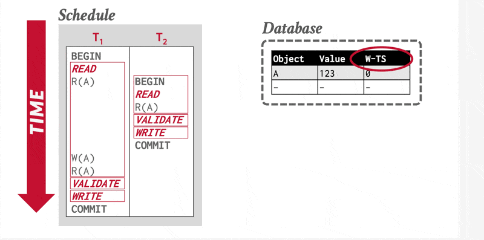
    </div>

每个事务必须经历上述阶段。但是这些阶段在并发执行的事务中可以相互交错。

要执行验证测试，我们要知道事务的各阶段何时发生，因此我们将三个不同的时间戳关联到事务 $T_i$ 上：

- **StartTS**($T_i$)：$T_i$：$T_i$ 开始执行的时间
- **ValidationTS**($T_i$)：$T_i$ 结束读阶段并且开始验证阶段的时间
- **FinishTS**($T_i$)：$T_i$ 结束写阶段的时间

我们使用 ValidationTS($T_i$)，通过时间戳顺序协议来确定可串行性顺序（因此 TS($T_i$) = ValidationTS($T_i$)）。**验证测试**(validation test)要求事务 $T_i$ 对于任意满足 TS($T_k$) < TS($T_i$) 的事务 $T_k$ 必须满足以下其中一个条件：

- FinishTS($T_k$) < StartTS($T_i$)。因为 $T_k$ 先于 $T_i$ 开始前完成执行，那么可串行顺序能被成功保留。

    <div style="text-align: center">
        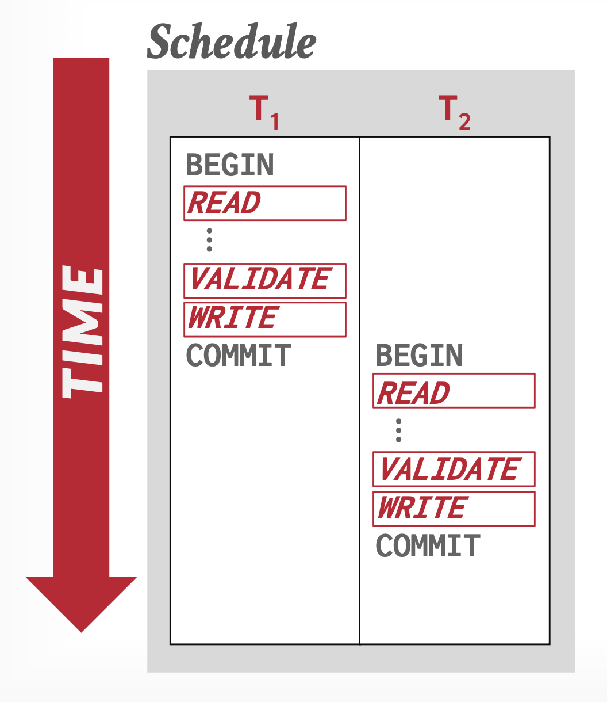
    </div>

- 被 $T_k$ 写入的数据项集不和 $T_i$ 读取的数据项集相交（WriteSet($T_k$) $\cap$ ReadSet($T_i$) = $\emptyset$），且 $T_k$ 在 $T_i$ 开始验证阶段前完成写阶段（即 StartTS($T_i$) < FinishTS($T_K$) < ValidationTS($T_i$)）。这一条件确保 $T_k, T_i$ 的写操作不重叠。因为 $T_k$ 的写操作不影响 $T_i$ 的读操作，且 $T_i$ 不影响 $T_k$ 的读操作，那么可串行顺序能被成功保留。

    ??? example "例子"

        === "例1"

            <div style="text-align: center">
                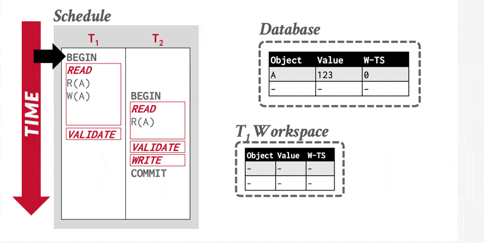
            </div>

        === "例2"

            <div style="text-align: center">
                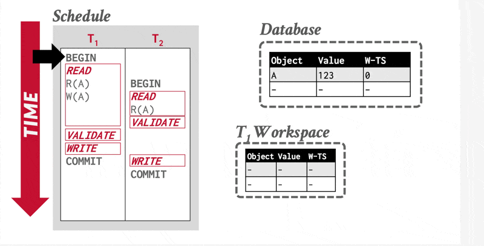
            </div>

- $T_k$ 先于 $T_i$ 完成读阶段，且 $T_k$ 写入的数据不和 $T_i$ 读取或写入的数据相交（WriteSet($T_k$) $\cap$ ReadSet($T_i$) = $\emptyset$ 并且 WriteSet($T_k$) $\cap$ WriteSet($T_i$) = $\emptyset$）

    ??? example "例子"

        <div style="text-align: center">
            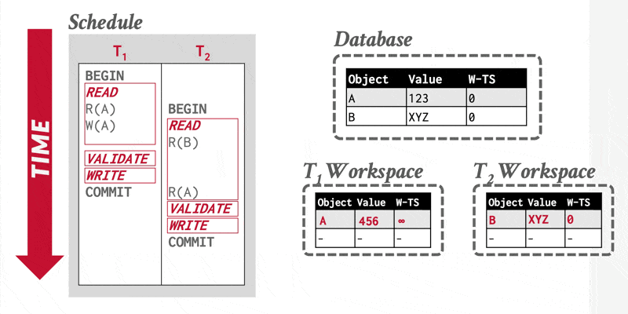
        </div>


上述验证方法被称为**前向验证**(forward validation)，因为它检查正在提交的事务是否和其他**未提交**事务的读写数据集有重叠。

<div style="text-align: center">
    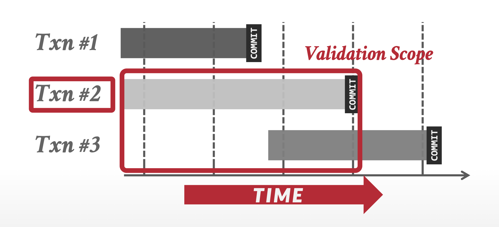
</div>

对应的，我们也有**后向验证**(backward validation)的方法，要求检查正在提交的事务是否和其他**已提交**事务的读写数据集有重叠。

<div style="text-align: center">
    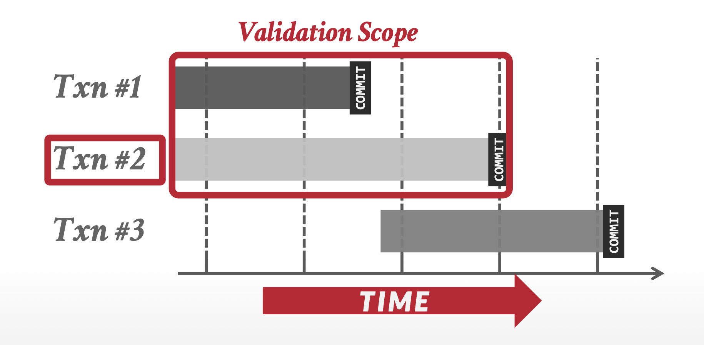
</div>

验证方案能够自动防止级联回滚的发生，因为实际写入操作仅在发起写入的事务提交之后执行。然而，由于一系列冲突的短事务可能导致长事务反复重启，存在长事务陷入饥饿状态的风险。为避免这种情况，必须暂时阻塞与之冲突的其他事务，以确保长事务能够顺利完成。

另外，验证条件导致事务 $T$ 仅需针对那些在 $T$ 开始之后完成，且进一步在 $T$ 之前被序列化的事务集合 $T_i$ 进行重新验证。对于在 $T$ 开始前已完成的事务，可以在验证测试中予以忽略。同样地，那些序列化顺序排在 $T$ 之后（即其 ValidationTS($T_i$) > ValidationTS($T$)）的事务 $T_i$ 也可被忽略；因为当事务 $T_i$ 接受验证时，若 $T$ 的完成时间晚于 $T_i$ 的开始时间，它自会与 $T$ 进行比对验证。

这种验证方案被称为**乐观并发控制方案**(optimistic concurrency-control scheme)，因为 DBMS 假定事务发生冲突的概率很低（大多数事务都是只读的，或者事务访问的数据是不相交的），大多数情况下能够顺利完成并在最后阶段通过验证，即便失败了也要到最后再处理。时间戳协议也属于乐观策略（教材中的说法不对）。相比之下，**锁协议**则属于**悲观**策略——一旦检测到冲突，即便存在调度可能实现冲突可串行化的机会，这些方法也会强制事务等待或回滚。


## Multiversion Schemes

前面讲到的并发控制方案都是通过延迟操作或中止事务来确保可串行性的，但这些操作都需要不小的成本。如果系统能为单个的**逻辑**对象保留多个**物理**版本，那么就可以避免这一问题——**多版本并发控制**(multiversion concurrency-control, MVCC)方案正是这么做的：每次 `write(Q)` 操作都会为 $Q$ 创建一个新**版本**(version)；当事务发起 `read(Q)` 操作时，并发控制管理器选择 $Q$ 的某个版本读取，这个选择要确保可串行性，并且还要考虑到性能问题。

MVCC 的基本概念或优势在于**写操作不会阻塞读操作，读操作也不会阻塞写操作**。这意味着一个事务在修改对象时，其他事务仍可读取该对象的旧版本。若多个写操作针对同一对象，则仍可能相互阻塞，因为与数据库对象相关的版本上依然存在锁机制。

??? example "例子"

    === "例1"

        <div style="text-align: center">
            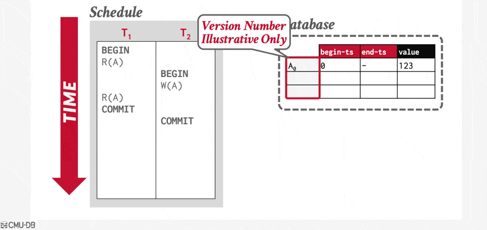
        </div>

    === "例2"

        <div style="text-align: center">
            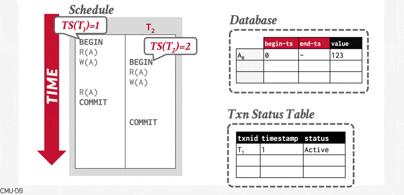
        </div>


### Multiversion Timestamp Ordering

我们能将时间戳顺序协议扩展到多版本控制：事务时间戳的定义和原来一致，但是对于每个数据项 $Q$，它关联到多个版本 $<Q_1, Q_2,  dots, Q_m>$，且每个版本 $Q_k$ 包含三个数据字段：

- **内容**：版本 $Q_k$ 的值
- **W-timestamp**($Q_k$)：事务创建版本 $Q_k$ 的时间戳
- **R-timestamp**($Q_k$)：任何事物成功读取版本 $Q_k$ 的最大时间戳

事务 $T_i$ 通过发起 `write(Q)` 操作来创建数据项 $Q$ 的新版本 $Q_k$，其中内容字段保留 $T_i$ 写入的值，并且系统为 $T_i$ 初始化 W-timestamp 和 R-timestamp 为 TS($T_i$)。当事务 $T_j$ 读取 $Q_k$ 的内容，且 R-timestamp($Q_k$) < TS($T_j$) 时，更新 $Q_k$ 的 R-timestamp 值。

**多版本时间戳顺序方案**(multiversion timestamp-ordering scheme)能确保可串行性，具体操作为：假设事务 $T_i$ 发出 `read(Q)` 或 `write(Q)`；令 $Q_k$ 为 $Q$ 中写时间戳最大且小于等于 TS($T_i$) 的版本。

- 如果 $T_i$ 发出 `read(Q)`，那么返回值为 $Q_k$ 值。
- 如果 $T_i$ 发出 `write(Q)`，且 TS($T_i$) < R-timestamp($Q_k$)，那么系统回滚 $T_i$；如果 TS($T_i$) = W-timestamp($Q_k$)，系统覆写 $Q_k$ 的内容；否则（TS($T_i$) > R-timestamp($Q_k$)）创建 $Q$ 的新版本。

$Q$ 的版本 $Q_i$（其 W-timestamp 记作 $t$）的**有效区间**(valid interval)定义如下：

- 如果 $Q_i$ 是 $Q$ 的最新版本，那么区间为 $[t, \infty]$
- 否则令 $Q$ 的下一版本有时间戳 $s$，那么区间为 $[t, s)$

不再需要的版本将按照以下规则进行移除：假设数据项存在两个版本 $Q_k$ 和 $Q_j$，且这两个版本的写时间戳均小于系统中最早活跃事务的时间戳。那么，在这两个版本中较旧的那个（$Q_k$ 或 $Q_j$）将不会被再次使用，因此可以被删除。

这种协议有一个不错的性质是读取请求永远不会失败，且永远不需要等待。但它也有两个不好的性质：

- 读取数据项的同时爱要求更新 R-timestamp 字段，导致需要两次磁盘访问（而不是原来的一次）
- 事务之间的冲突需要通过回滚解决（而不是靠等待解决），因此会带来更高的成本

另外，该方案不确保可恢复性和无级联性，但这些可通过扩展（类似基础版的时间戳顺序协议扩展）来实现。


### Multiversion Two-Phase Locking

**多版本两阶段锁协议**(multiversion two-phase locking protocol)尝试结合多版本并发控制和两阶段锁的优点。该协议为只读事务和更新事务采取不同操作：

- **更新事务**
    - 执行强严格两阶段加锁（保留所有的锁，直至事务结束）。因此事务可按提交顺序被串行化。
    - 每个版本的数据项都有单个的时间戳，它本质上是一个计数器（叫做 `ts-counter`），在提交处理中会递增。
    - 当事务读取数据项时，它会获得该数据项的共享锁，并读取该数据项的最新版本。
    - 当事务想要写入数据项时，它会先获得该数据项的排他锁，然后创建数据项的一个新版本。写操作将在新版本上执行，并且新版本的时间戳被初始化为 $\infty$（一个超过所有时间戳的很大的值）。
    - 当事务完成操作时，它会执行提交处理。规定一次仅允许一个更新事务处理提交。具体步骤为：首先，$T_i$ 为每个它创建的版本时间戳设置值为 `ts-counter` + 1；然后 `ts-couner`++，并提交事务。
- **只读事务**：事务在 $T_i$ 成功提交之前看到的是 `ts-counter` 的旧值。因此，在 $T_i$ 提交后开始的只读事务才能看到 $T_i$ 更新的值。但无论在提交前后，事务都无需等待锁。

该协议能确保调度的可恢复性和无级联性。

版本的删除方式类似于多版本时间戳排序：假设一个数据项存在两个版本 $Q_k$ 和 $Q_j$，且这两个版本的时间戳都小于或等于系统中最早只读事务的时间戳。那么，在这两个版本 $Q_k$ 和 $Q_j$ 中较旧的那个将不再被使用，因此可以被删除。


### MVCC Design Decision

在设计 MVCC 时，我们需要考虑：

- **并发控制协议**(concurrency control protocol)
- **版本存储**(version storage)
- **垃圾回收**(garbage collection, GC)
- **索引管理**(index management)
- **删除**(deletion)


#### Version Storage

DBMS 利用元组的指针字段为每个逻辑元组创建**版本链**(version chain)。这本质上是一个按时间戳排序的版本链表，让 DBMS 能够在运行时找到对特定事务可见的版本。索引始终指向链的"头部"，根据实现方式不同，该头部可能是最新或最旧的版本。线程会遍历链条直至定位到正确的版本。不同的存储方案决定了每个版本的存储内容及位置。

具体有以下三种版本存储方法：

- **仅追加存储**(append-only storage)：
    - 逻辑元组的所有物理版本均存储在同一表空间中
    - 版本在表中是被混合存放的，每次更新仅向表内追加该元组的新版本并更新版本链

        <div style="text-align: center">
            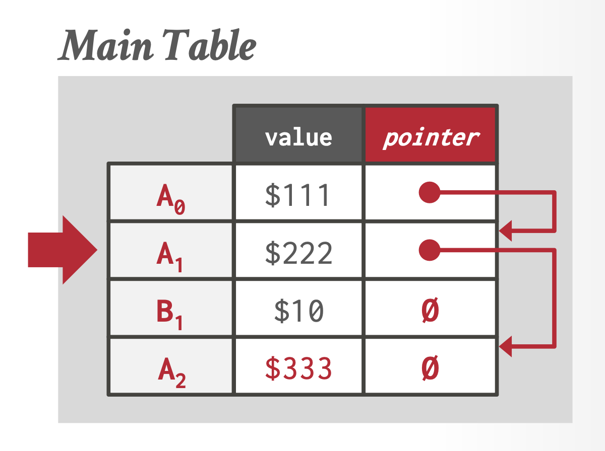
        </div>

    - 可采取的两种排序方式有：
        - **从旧到新**(O2N)排序：查询需遍历整个链条
        - **从新到旧**(N2O)排序：则每个新版本都需更新索引指针，但无需遍历整个链。因此通常该方法是更好的方案，因为多数事务仅关注最新版本

- **时间旅行存储**(time-travel storage)：
    - DBMS 维护一个名为**时间旅行表**(time-travel table)的独立表格，用于存储元组的旧版本
    - 每次更新时，系统会将元组的旧版本复制到时间旅行表中，并用新数据覆盖主表中的对应元组
    - 主表中元组的指针指向时间旅行表里的历史版本

    ??? example "例子"

        <div style="text-align: center">
            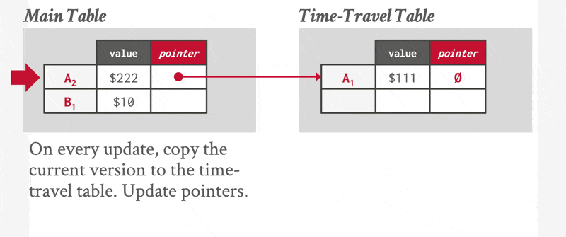
        </div>


- **增量存储**(delta storage)：
    - 类似时间旅行存储，但 DBMS 并不保存所有的历史元组，而是仅存储**增量或变更部分**于所谓的**增量存储段**(delta storage segment)中
    - 事务可通过逆向遍历这些增量并逐一应用来重建旧版本数据
    - 这种方式相比时间旅行存储实现了更快的写入速度，但读取速度较慢

    ??? example "例子"

        <div style="text-align: center">
            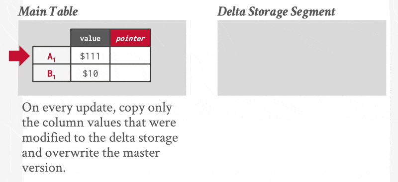
        </div>


#### Garbage Collection

DBMS 需要随时间推移从数据库中移除**可回收的**(reclaimable)物理版本。当一个版本不被任何活跃事务“可见”，或是由已中止的事务创建时，该版本即为可回收状态。我们可以执行**元组**级别或**事务**级别的**垃圾回收**(garbage collection, GC)操作。

- **元组**级别：DBMS 通过直接检查元组来定位旧版本数据，具体实现方式有两种：
    - **后台清理**(background vacuuming)：由独立线程周期性地扫描表并标记可回收的版本
        - 此方法适用于任何版本存储方案
        - 一个简单的优化是维护"脏页位图"，用于记录自上次扫描以来被修改过的页面，从而让清理线程跳过未变化的页面

        ??? example "例子"

            <div style="text-align: center">
                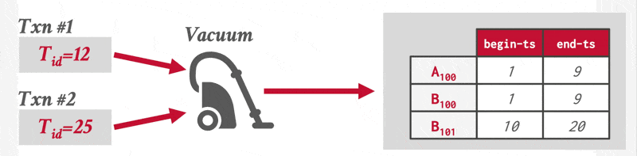
            </div>

    - **协同清理**(cooperative cleaning)：工作线程在遍历版本链时识别可回收的版本
        - 此方法仅适用于 O2N 版本链结构
        - 若数据未被访问，则永远不会被清理

        ??? example "例子"

            <div style="text-align: center">
                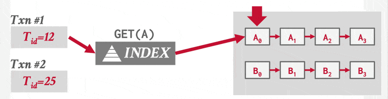
            </div>

- **事务**级别：每个事务负责追踪自身的旧版本数据，因此数据库管理系统无需扫描元组。各事务独立维护其读写集合。当事务完成时，垃圾收集器可据此识别待回收的元组。数据库管理系统会判定已完结事务所创建的所有版本何时不再可见。

    ??? example "例子"

        <div style="text-align: center">
            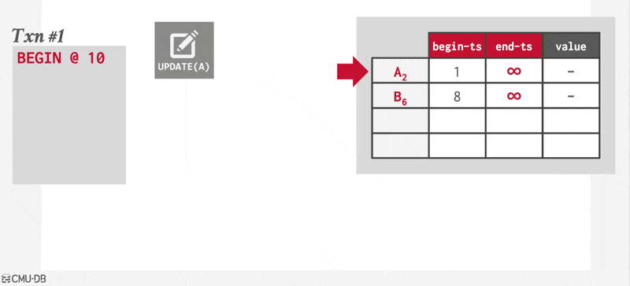
        </div>


#### Index Management

所有**主键索引**始终指向版本链头。DBMS 需要更新主键索引的频率取决于系统在更新元组时是否创建新版本。如果事务更新主键属性，则视其为先 `DELETE` 后 `INSERT`。

管理**二级索引**更复杂，有以下处理方法：

- **逻辑指针**：DBMS 为每个元组使用一个固定不变的标识符；这需要一个额外的间接层，将逻辑 ID 映射到元组的物理位置上，这样对元组的更新只需修改间接层中的映射关系即可。

    <div style="text-align: center">
        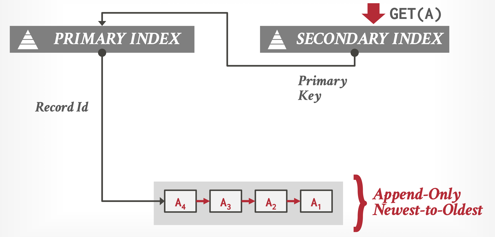
    </div>

- **物理指针**：DBMS 通过物理地址定位版本链头部；当版本链头部更新时，要求同步更新所有索引，因此成本可能会非常高。

    <div style="text-align: center">
        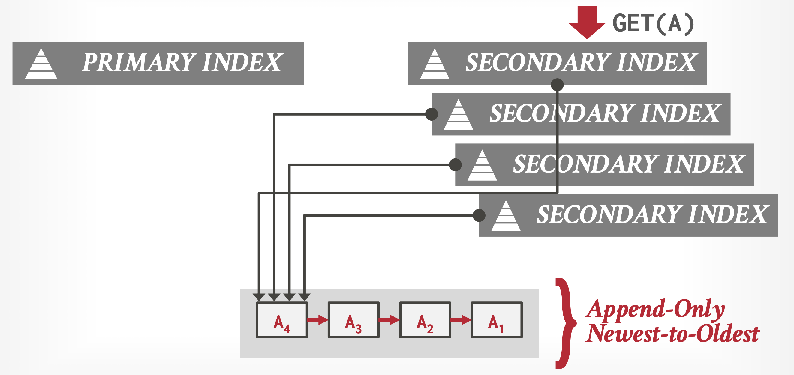
    </div>

---
MVCC DBMS 的索引（通常）不会将元组的版本信息与其键一同存储。相反，每个索引都必须支持来自不同快照的**重复键**(duplicate key)，因为相同的键可能在不同快照中指向不同的逻辑元组。

工作线程在一次查询中可能获取多条记录项，随后必须通过指针追踪才能定位到其对应的正确物理版本。

??? example "例子"

    <div style="text-align: center">
        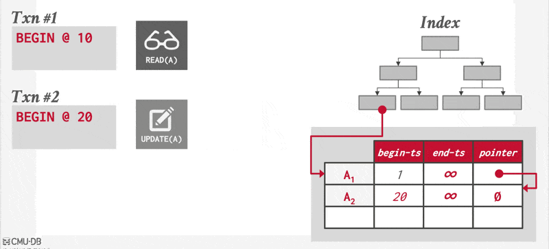
    </div>


#### Deletion

DBMS 仅在逻辑删除元组的所有版本均不可见时，才从数据库中物理删除该元组。若某元组已被标记为删除，则其最新版本之后不会产生新版本。这意味着不存在写-写冲突，遵循"先写入者胜出"原则。

有以下两种表示某个元组在特定时间点已被逻辑删除的实现方法：

- **删除标志**(deleted flag)：维护一个标志，用于表示逻辑元组在最新物理版本后已被删除，该标志可置于元组头部或作为独立列存在
- **墓碑元组**(tombstone tuple)：创建空物理版本来标记逻辑元组已删除；为墓碑元组设立独立存储池，仅在版本链指针中设置特殊位模式以降低存储开销

??? info "各家数据库的 MVCC 实现"

    <div style="text-align: center">
        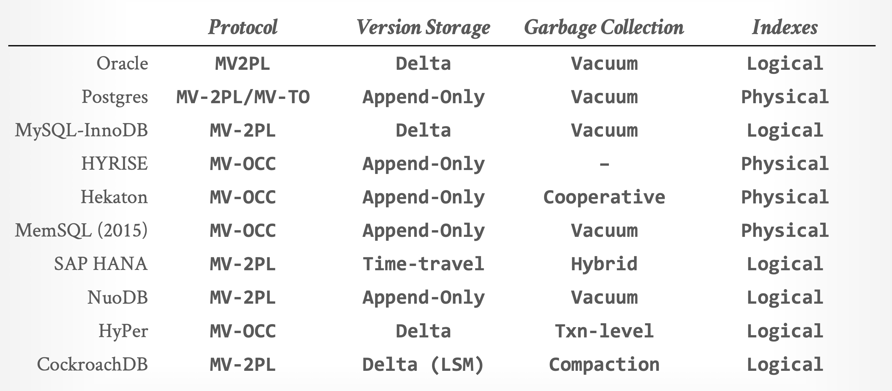
    </div>


## Snapshot Isolation

接下来介绍一种很流行的并发控制方案——**快照隔离**(snapshot isolation)。在事务开始执行时，它为该事务提供了数据库的“快照”。随后，该事务在此快照上进行操作，完全独立于其他并发事务。快照中的数据仅包含已提交事务所写入的值。这种隔离方式对**只读事务**而言极为理想，因为它们既无需等待，也永远不会被并发管理器中止。

不过在这种方案下，**更新**数据库的事务可能会与其他同样执行更新的操作产生冲突。所以，在允许事务提交之前，必须对其执行的更新进行有效性验证。所有更新内容会暂存于该事务的私有工作区中，直至通过验证后才会被正式写入数据库。

当允许事务 $T$ **提交**时，$T$ 向已提交状态的转换，以及由 $T$ 执行的所有更新写入数据库的操作，必须用一个原子动作(atomic action)完成。这样，为其他事务创建的任何快照要么包含事务 $T$ 的全部更新，要么完全不包含其中任何更新。


### Multiversioning in Snapshot Isolation

要实现快照隔离，事务会被给予两个时间戳：

- StartTS($T_i$)：事务 $T_i$ 开始的时间
- CommitTS($T_i$)：事务 $T_i$ 请求验证的时间

虽然这两个时间戳可以用系统时钟表示，但一般用的是计数器。当事务进入验证阶段时，计数器就会递增。

快照隔离基于多版本机制，每个更新数据项的事务都会为该数据项创建一个新版本。各版本仅携带 1 个时间戳——写入时间戳。由事务 $T_i$ 生成的版本，其时间戳设定为 CommitTS($T_i$)。

当事务 $T_i$ 读取一个数据项时，系统会返回时间戳 <= StartTS($T_i$) 的最新数据版本。因此，$T_i$ 不会看到任何在其启动后提交的事务所做的更新，但能获取所有在它开始前已提交事务的更新。这种机制使得 $T_i$ 实质上获得了其启动时刻的数据库快照。


### Validation Steps for Update Transactions

决定是否允许一个更新事务提交需要谨慎处理——两个并发运行的事务可能会同时更新同一数据项。由于这两个事务各自使用独立的私有快照进行操作，彼此都无法看到对方的更新结果。若两者均被允许写入数据库，先前的更新将被后续的覆盖，从而导致**丢失更新**(lost update)现象——这是必须避免的问题。

快照隔离给出了两种解决方案：**先提交者胜**(first committer wins)与**先更新者胜**(first updater wins)。这两种机制的核心原理都是通过检测事务与其他并发事务之间的冲突来实现的。

我们明确一下并发的概念：如果一个事务 $T_j$ 在给定事务 $T_i$ 开始执行，直至其验证阶段启动的期间内处于活跃状态或部分提交状态，则称 $T_j$ 与 $T_i$ 是**并发的**。形式化的表述为：当且仅当满足以下任一条件时，$T_j$ 与 $T_i$ 并发：

- StartTS($T_j$) <= StartTS($T_i$) <= CommitTS($T_j$)，或
- StartTS($T_i$) <= StartTS($T_j$) <= CommitTS($T_i$)

下面详细讨论快照隔离的两种机制：

- **先提交者胜**：当事务 $T_i$ 开始验证时，在其北分配到 CommitTS 后，将执行以下操作作为验证的一部分（为简化说明，我们假设同一时间仅有一个交易进行验证）：
    - 进行一项测试，以检查是否存在与事务 $T$ 并发执行的任何其他事务，已经对 $T$ 计划写入的某些数据项进行了更新并写入了数据库。具体通过以下方式实现：对于事务 $T_i$ 中打算写入的每一个数据项 $d$，检查是否存在一个版本的数据项 $d$，其时间戳位于 StartTS($T_i$) 和 CommitTS($T_i$) 之间。
    - 如果找到这样的数据项，就中止 $T_i$；
    - 否则（没有找到数据项）就提交 $T$，它的更新将会写入到数据库中。
    
    之所以该机制称为“先提交者胜”，是因为如果事务发生冲突时，按照上述规则，首先接受测试的事务将成功写入其更新，而后续的事务则被迫中止。

- **先更新者胜**：系统使用一种仅适用于更新的锁定机制（读取不受此影响，因为它们不获取锁）——当事务 $T_i$ 尝试更新一个数据项时，它请求对该数据项的**写入锁**(write lock)。如果其他并发事务未持有对该数据项的锁，那么在该事务获取锁之后采取以下步骤：
    - 如果数据项被任何其他并发事务更新的话，则中止 $T_i$
    - 否则 $T_i$ 继续执行，包括（可能的）提交
    
    但有并发事务 $T_j$ 已经对该数据项上了写入锁的话，那么 $T_i$ 就不能继续执行下去，且要遵循以下规则：$T_i$ 等待 $T_j$ 中止或提交。
    
    - 如果 $T_j$ 中止，那么它的锁就会释放，$T_i$ 就能获得锁。获取锁之后，系统会按照前文所述方式检查是否存在并发事务的更新操作：若检测到其他事务已修改该数据项，则中止当前事务 $T_i$；反之，则允许其继续执行。
    - 如果 $T_j$ 提交，那么 $T_i$ 必须中止。

    之所以该机制称为“先更新者胜”，是因为如果事务发生冲突，第一个获得锁的事务将被允许提交并执行其更新。之后尝试更新的其他事务将会中止，除非先前的更新者因其他原因而中止。


### Serializability Issues and Solutions

快照隔离在实际应用中很受欢迎，因为事务能够在读取大量数据的同时不会干扰到更短的更新事务（而两阶段锁协议中，长时间的只读事务会阻碍更新事务的进行）。

值得注意的是，数据库提供的完整性约束不会在快照中被检查，因此可能有两个并发事务插入相同主键值的元组，或者有事务插入一个从参照表中被并发删除的外键值。这个问题的处理方式是：检查数据库当前状态下的这些约束，而不是在快照上，这作为提交时的验证部分。

更严重的一个问题是：快照隔离不保证可串行性。但实际上，可串行性问题发生概率相对较少，因为：

- 数据库必须在提交时而非快照状态下检查完整性约束，这一机制有助于避免数据不一致问题。当两个事务在快照隔离外试图创建相同主键时，数据库系统会检测到这种主键冲突并回滚其中一个事务。
    - 研究表明，在快照隔离环境下，执行主流事务处理基准测试 [TPC-C](https://www.tpc.org/tpcc/) 时，主键约束能确保所有事务不会出现不可串行性问题。但这类情况还是偶有发生，而一旦出现的话就必须妥善处理。
- 在许多易受可串行化问题影响的应用场景中（例如**写偏斜**(write skew)的情况），某些数据项上的事务会在其他数据项上产生冲突，从而确保这类事务无法并发执行；因此在快照隔离机制下，此类事务的执行仍能保持可串行化特性。

??? example "一个关于写偏斜的例子"

    如果事务是可串行化的，按顺序执行两个事务后的结果为：

    <div style="text-align: center">
        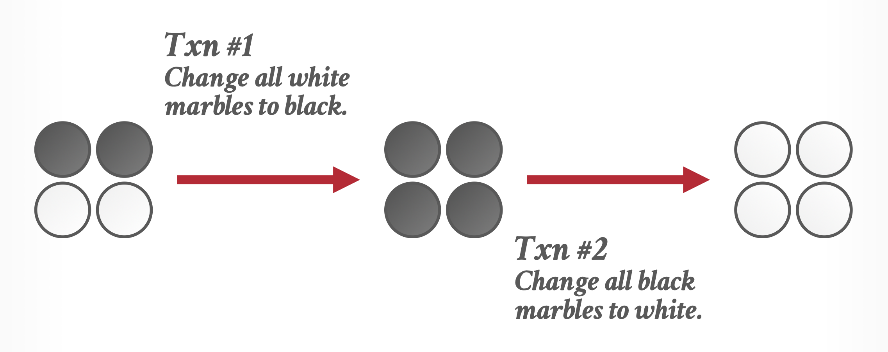
    </div>

    但快照隔离可能会导致以下写偏斜问题的发生，导致结果不负预期（就是上面的结果）：

    <div style="text-align: center">
        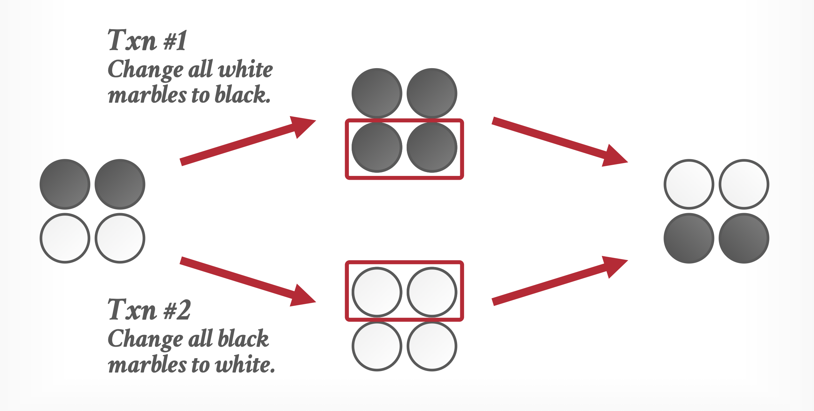
    </div>


虽然“发生概率相对较少”，但是不可串行性的情况仍有发生的概率。对于许多应用而言，快照隔离导致的非串行化执行的影响并不十分严重。事实上，快照隔离允许长时间运行的读事务不阻塞更新操作的优势，对众多此类应用来说足以抵消偶尔出现的这类小问题。

但在其他场景下（比如金融领域），不可串行性可能是不可接受的。不过我们有以下解决方案：

- 如果数据库系统支持，那么可以使用一种称为**可串行化快照隔离**(serializable snapshot isolation, SSI)的改进版本。该技术在原有快照隔离基础上进行了扩展，从而确保可串行性。
    - 该机制背后的直观原理如下：假设我们追踪事务间的所有冲突（即写-写、读-写和写-读冲突）。当事务 $T_1$ 和 $T_2$ 对同一元组存在操作冲突，且 $T_1$ 的操作先于 $T_2$ 时，我们可以构建一个从 $T_1$ 指向 $T_2$ 的有向边构成的事务优先图。确保可串行性的一种方法是检测事务优先图中的环路，若发现环路则回滚相应事务。
    - 快照隔离导致可串行性丧失的关键原因在于：它未能追踪读写冲突——即当事务 $T_1$ 写入某对象的一个版本后，事务 $T_2$ 随后读取了该对象的更早版本。这种冲突可通过从 $T_2$ 指向 $T_1$ 的读写冲突边来表示。
    - 研究表明，在所有快照隔离允许非可串行化调度的情况下，必然存在一个事务同时具备传入读写冲突边和传出读写冲突边（冲突图中其他所有环状情况均已被快照隔离规则捕获）。因此，可串行化快照隔离的实现会追踪并发事务间所有**读写冲突**，以检测是否存在同时拥有传入与传出读写冲突边的事务。一旦发现这种情况，系统将回滚涉及该读写冲突的其中一个事务。尽管这种检查可能导致部分不必要的回滚操作，但其开销远低于追踪全部冲突并检测环路的方案。
- 部分系统允许不同事务运行在不同隔离级别下，这一特性可用于规避前文所述的可串行性问题。
- 某些支持快照隔离的系统为 SQL 程序员提供了一种通过 SQL 中的 `FOR UPDATE` 子句创建人为冲突的方法，以保证可串行性。

    ???+ example "例子"

        ```sql
        SELECT *
        FROM instructor
        WHERE ID = 22222
        FOR UPDATE
        ```

    - 添加 `FOR UPDATE` 子句会使系统在并发控制时，将读取的数据视为已被更新。


## Weak Levels of Consistency in Practice

在上一章，我们讨论过 SQL 标准制定的[隔离等级](13.md#transcation-isolation-levels)，包括可串行、可重复读取、读取提交和读取未提交。本节将先简要概述一些比可串行化的一致性级别更弱的相关术语，并将其与 SQL 标准级别相联系；之后探讨涉及用户交互事务的并发控制问题。


### Degree-Two Consistency

**两级一致性**(degree-two consitency)目的是避免级联中止，而不必确保可串行性。二级一致性的锁协议采用与两阶段锁定协议相同的两种锁模式：共享（S）和排他（X）。事务在访问数据项时必须持有适当的锁定模式，但不需要分为两个阶段。

与两阶段锁的情况不同，共享锁可以在任何时候释放和获取；但排他锁在事务提交或中止之前不能被释放。该协议不保证可串行性。实际上，一个事务对同一个数据项进行两次读取，但可能会得到不同的结果。

读取操作不可重复，但由于排他锁会一直保持到事务提交，任何事务都无法读取未提交的值。因此，二级一致性是**读取提交**隔离级别的一种特定实现。

值得注意的是，在二级一致性下，扫描索引的事务可能会看到记录的两个版本，甚至可能两个版本都看不到。


### Cursor Stability

**游标稳定性**(cursor stability)是一种二级一致性形式，专门为通过游标遍历关系元组的程序设计。它不会锁定整个关系，而是确保：

- 在迭代中正在被处理的元组以共享模式被加锁；一旦处理好该元组，这个锁就会被释放
- 任何可修改的元组以排他模式被锁住，直到事务被提交

这些规则确保了二级一致性得以实现，但并未采用两阶段方式进行锁定，因此无法保证可串行性。在实际应用中，游标稳定性经常用于被频繁访问的关系上，以此作为提升并发性和系统性能的手段。使用游标稳定性的应用程序必须通过编码方式确保数据库的一致性，即便存在不可串行性调度的可能性。因此，游标稳定性的应用仅限于具有简单一致性约束的特殊场景中。

在数据库支持的情况下，快照隔离是比二级一致性和游标稳定性更优的选择，因为它能提供相当甚至更高的并发度，同时降低非可串行化执行的风险。


### Concurrency Control Across User Interactions

对于有用户交互的事务，无论是两阶段锁、时间戳协议或验证，还是快照隔离，它们都无法给出完美的解决方案。相比这些方法而言，一种更好的并发控制方案是将涉及用户交互的事务拆分为两个或多个事务，确保没有事务跨越用户交互环节。该方案还利用了存储在元组中的版本号，以避免更新丢失。每个关系的模式通过增加一个额外的 **version_number** 属性（初始值为0）进行修改。当事务首次读取其打算更新的元组时，会记录该元组的版本号。

- 读取操作作为数据库上的独立事务执行，因此获取的任何锁都会立即释放
- 更新操作先在本地完成，并在提交处理阶段将更改复制到数据库中，这一过程遵循以下按原子性执行的步骤：
    - 对于每个被更新的元组，事务检查当前版本号是否和元组第一次被事务读取时的版本号相同
        - 如果匹配上的话，那么就在数据库上更新该元组，并且版本号递增1
        - 如果没有匹配上，则中止该事务，并回滚其执行的所有更新
    
    - 如果所有被更新的元组都通过了版本号检查，那么提交该事务。值得注意的是，使用**时间戳**替代版本号完全不会对该方案造成任何影响。

上述方案和快照隔离十分相似：版本号检查实现了快照隔离中采用的**先提交者胜**的规则，该方案也适用于事务活跃时间很长的情况。但与快照隔离不同的是，事务执行的读取操作可能不对应数据库的某个快照；且不同于基于验证的协议，该事务执行的读取操作不会经过验证。

我们将上述方案称为**无读验证的乐观并发控制**(optimistic concurrency control without read validation)。它提供了一种较弱的可串行化保证，也就是说无法确保真正的可串行性。该方案的一个变体是：在提交时，除了验证写操作外，还可以通过版本号对读取操作进行校验，以确保事务读取的元组在初始读取后未被更新；此方案等效于我们先前讨论过的那个[乐观并发控制机制](#validation-based-protocols)。

该方案已被广泛用于处理涉及用户交互的事务。其一大亮点是易于实现：作为提交处理环节的验证与更新步骤将以单一数据库事务的形式执行，借助数据库自身的并发控制机制确保提交处理的原子性。


## Advanced Topics in Concurrency Control

（累了，暂时不想整理了...）

### Online Index Creation

### Concurrency in Index Structures

### Concurrency Control in Main-Memory Databases

### Long Duration Transactions

### Concurrency Control with Operations

### Real-Time Transaction Systems