# Lec 15: Recovery System

??? abstract "核心知识"

    - 基于日志的恢复
        - 日志记录
        - 提交
            - 组提交
        - 回滚：
            - 撤销
            - 重做
        - 检查点
            - 模糊检查点
        - 缓存管理：窃取 + 非强制策略
    - 恢复 + 并发控制
        - 锁的早释放
        - 逻辑运算的撤销
    - ARIES
        - 数据结构：LSN、生理日志、脏页表、模糊检查点
        - 算法：分析 -> 重做 -> 撤销

**恢复算法**(recovery algorithms)是指一些确保数据库一致性、事务原子性和持久性的技术，即使在发生故障时也能保障数据安全。当系统崩溃时，所有已提交的但尚未写入磁盘的内存数据都面临着丢失的风险，这显然和用户的预期相悖——他们认为成功提交的数据变更应当永久被保存。恢复算法的核心作用正是防止崩溃后出现信息丢失的情况。每一种恢复算法都包含以下两部分：

- 在正常事务处理过程中采取的行动，确保有足够用于恢复的信息
- 在故障后采取的行动，以恢复数据库的内容，确保数据库的一致性、原子性以及持久性

## Failure Classification

先来认识一些常见的故障种类：

- **事务故障**(transaction failure)：分为以下两类：
    - **逻辑**错误(logical error)：事务因一些内部条件（比如不良输入、数据找不到、溢出、资源超过限制等）而无法继续正常执行
    - **系统**错误(system error)：系统进入了非预期的状态（比如死锁），因此事务无法继续正常执行；但稍后可以重新执行该事务
- **系统崩溃**(system crash)：硬件/数据库软件/操作系统的问题导致易失性存储器内容的损失，并使得事务进程停止；而非易失性存储器的内容不受影响（这样的假设称为故障-停止假设(fail-stop assumption)）。
- **磁盘故障**(disk failure)：因磁盘头崩溃或在数据传输时的故障，磁盘块的内容丢失了；此时就要用其他磁盘或者第三方媒介的归档备份来恢复内容。

## Storage

### Stable-Storage Implementation

为实现稳定的存储器，我们要复制多份所需的信息，以独立的故障模式存放到不同的非易失性存储媒介中；并以一种受控的方式更新信息，确保数据传输中的发生的故障不会破坏所需的信息。

前面提到过的 [RAID](8.md#raid) 系统看似很适合干这个活，但它不是完美的解决方案——它无法抵抗外界的灾害比如火灾、洪水等等。因此，很多系统会采取档案备份的措施（比如将数据存在磁带这种介质中）。但这种方法无法连续备份数据，因此最新的数据还是会在灾害发生时丢失。所以就有了另一种方法——**远程备份**(remote backup)，即通过计算机网络将稳定存储器中的数据拷贝保存到另一个远一点的地方。

在内存和磁盘之间传输数据时会得到以下结果之一：

- **成功完成**(successful completion)：被传输的信息成功抵达目的地
- **部分故障**(partial failure)：在传输过程中发生故障，因而目标块的信息不正确
- **完全故障**(total failure)：在传输过程中，故障发生得足够早，因此目标块的内容保持完好

当**数据传输故障**(data-transfer failure)发生时，系统应该能够检测到故障，并且调用恢复过程来恢复数据块至一致状态。要做到这一点，系统必须为每个逻辑数据库块保留两份物理块。

- 在镜像磁盘方案中，两个块在相同地点
- 在远程备份方案中，一个块在本地，另一个块在远程站点

输出操作的执行步骤为：

1. 将信息写到第一个物理块上
2. 当第一个写操作成功完成时，将相同的信息写到第二个物理块上
3. 只有当第二个写操作成功完成时，输出才算完成

若系统在写入数据块时发生故障，两个拷贝之间可能出现不一致的情况。在恢复的时候，系统需逐一检查每个数据块的两个拷贝：

- 若两者内容一致且没有检测到错误，则无需进一步操作
- 若发现某一拷贝存在错误，系统将用另一拷贝的内容替换该损坏块
- 若两拷贝均没有检测到的错误但内容存在差异，系统可任意选择一个拷贝，来替换另一个拷贝的内容

无论采用哪种方式，恢复过程都能确保稳定存储的写入操作要么完全成功（即更新所有拷贝），要么保持原状，不发生任何改变。

恢复过程中需对比每一对对应块的要求成本较大，因此通过利用少量非易失性 RAM 来跟踪正在进行的块写入操作，可以大幅降低这一开销——在恢复时，仅需比较那些写入未完成的区块即可。

我们可以扩展上述恢复过程，使用任意数量的稳定存储块拷贝。尽管这样做能将故障概率降至比 2 个拷贝更低的水平，但通常用 2 个拷贝就足够了。

### Data Access

磁盘和主存间的数据块移动可通过以下两个操作发起：

- `input(B)`：将物理块 B 传输到主存
- `output(B)`：将缓存块 B 传输到磁盘，并替换掉合适的磁盘块

    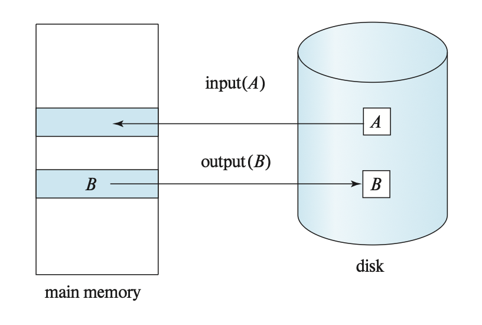

上一讲提到过，每个事务 $T_i$ 都有一个私有工作区，用于存放 $T_i$ 访问和更新的数据项拷贝。

- 系统在事务启动时创建一个工作区
- 当事务提交或中止时，系统会将其移除

存放在事务 $T_i$ 工作区的每个数据项 $X$ 都记作 $x_i$。事务 $T_i$ 通过在其工作区与系统缓冲区之间传输数据来与数据库系统交互。我们通过以下两个操作实现数据传输：

- `read(X)`：将数据项 X 的值分配给局部变量 $x_i$ 上，该过程可分为以下步骤：
    - 如果 X 所在的数据块 $B_X$ 不在主存中，那么发起 `input(B_X)`
    - 将缓存块中的 X 的值分配给 $x_i$
- `write(X)`：将局部变量 $x_i$ 的值分配给在缓存块中的数据项 X，该过程可分为以下步骤：
    - 如果 X 所在的数据块 $B_X$ 不在主存中，那么发起 `input(B_X)`
    - 将 $x_i$ 的值分配给缓存块 $B_X$ 中的 X

缓存块最终会被写入磁盘中，因为缓冲区管理器需要将内存空间用于其他地方，或者数据库系统希望将缓存块的变更同步到磁盘上。当数据库系统发出 `output(B)` 指令时，我们称其对缓冲区 B 执行了**强制写**(force-output)操作。

当事务首次需要访问数据项 X 时，必须执行 `read(X)` 操作，随后该事务对 X 的所有更新都在 $x_i$ 上完成。在执行过程中的任意时刻，事务都可以执行 `write(X)`，将变更反映到数据库中的 `X` 中；而最终对 $x_i$ 的写入完成后则必须执行 `write(X)`。

对于存储 X 的缓冲区块 $B_X$ 而言，其输出操作 `output(B_X)` 无需在 `write(X)` 执行后立即生效，因为该块可能还包含其他正在被访问的数据项，因此实际输出可以延后进行。需要注意的是：若系统在 `write(X)` 执行后、`output(B_X)` 执行前发生崩溃，则 X 的新值永远不会写入磁盘从而导致丢失。但实际上数据库系统会采取额外措施，确保已提交事务所执行的更新即使遭遇系统崩溃也不会丢失。

## Log-Based Recovery

为确保事务 $T_i$ 的**原子性**，我们希望要么将 $T_i$ 中所有对数据库的修改作用在数据库中，要么不作任何改动。为实现这一目标，

- 首先需将描述修改的信息输出至稳定的存储介质，而不要直接修改数据库本身。这些信息能帮助我们确保已提交事务执行的所有修改都体现在数据库中。
- 此外，我们还需要保存和被修改数据项的旧值相关的信息，因为当执行该修改的事务失败（中止）时，该信息可帮助我们撤销失败事务所造成的更改。

最常用的手段是使用**日志**来记录这类信息，利用这种方式的恢复方案被称为**基于日志的恢复**(log-based recovery)。

### Log Records

**日志**(logs)是由一系列的**日志记录**(log records)构成的，记录所有数据库的更新活动。存在多种日志记录，其中**更新日志记录**(update log record)描述了单个的数据库写操作，并且包含以下字段：

- **事务标识符**(transcation identifier)：执行写操作事务的唯一标识符
- **数据项标识符**(data-item identifier)：被写入数据项的唯一标识符，通常是数据项在磁盘中的位置，包括数据项所在块的标识符，以及块内的偏移量
- **旧值**(old value)：在写操作之前数据项的值
- **新值**(new value)：在写操作之后数据项的值

我们用 $<T_i, X_j, V_1, V_2>$ 来表示一条更新日志记录，这4个字母分别对应上述4个字段。还有以下记录事务处理中的“重大”事件的特殊日志记录：

- $<T_i \text{ start}>$：事务 $T_i$ **开始**
- $<T_i \text{ commit}>$：事务 $T_i$ **提交**
- $<T_i \text{ abort}>$：事务 $T_i$ **中止**

每当事务执行写操作时，在修改数据库之前，必须为该写操作创建日志记录，并将其添加到日志中。一旦存在日志记录，若条件允许的话，就可以将修改输出到数据库中。此外，系统还需具备**撤销**(undo)已输出至数据库的修改的能力，这可利用日志记录中的旧值字段实现的回滚操作来完成。

由于日志对于系统和磁盘故障的恢复相当重要，它们必须被放在稳定存储器中。现在我们就假设每个日志记录在创建后，就马上被放在位于稳定存储器中的日志的末尾。之后我们将探讨何时可以安全地松弛这一要求，以减少日志记录带来的开销。

因为日志包含了所有数据库活动的完整记录，所以存储在日志中的数据量可能会变得非常庞大。之后我们也会说明何时可以安全地删除（没有用的）日志信息。

---
对于不同的实现方式，日志记录的内容也会有所区分。我们对日志方案作出以下分类：

- **物理日志**(physical logging)：记录对数据库中特定位置进行的字节级更改
    - 例子：`git diff`
- **逻辑日志**(logical logging)：
    - 记录事务执行的高级操作
    - 不限于单个页
    - 每条日志记录需写入的数据量少于物理日志，因为单条记录可跨多页更新多个元组
    - 但在非确定性并发控制方案中存在并发事务时，逻辑日志难以实现故障恢复
    - 此外由于必须重新执行每个事务，恢复耗时更长
    - 例子：事务调用的 `UPDATE`、`DELETE`、`INSERT` 语句
- **生理日志**(physiological logging)：
    - 这是一种混合式方法，其日志记录针对单个页，但不规定页的数据组织形式
    - 也就是说，通过页中的槽位号(slot number)识别元组，而不具体指明修改发生在页的哪个位置
    - 因此 DBMS 可在日志记录写入磁盘后重新组织页结构
    - 这是 DBMS 中最为常用的实现方式

### Database Modification

为了理解日志记录在恢复过程中所起的作用，我们需要剖析事务修改数据项时所经历的具体步骤：

1. 事务在主存中的私有空间中执行一些计算
2. 事务修改主存磁盘缓冲区中持有数据项的数据块
3. 数据库系统执行 `output` 操作，将数据块写到磁盘中

如果事务对磁盘缓冲区或磁盘本身执行了更新操作，我们认为该事务**修改了数据库**（而对主存私有部分的更新则不计入数据库修改）。

- 若事务在提交前未对数据库进行任何修改，则称其采用了**延迟修改**(deferred-modification)技术
    - 延迟修改需承担额外的开销：事务须为所有更新的数据项维护本地拷贝；并且，若事务要读取已更新的数据项，必须从其本地拷贝获取值。
- 若事务在活动期间即发生数据库修改，则称其采用了**立即修改**(immediate-modification)技术

恢复算法必须考虑多种因素，包括：

- 事务可能已经提交了，但其对数据库的部分修改仅存在于主存的磁盘缓冲区中，而未写入磁盘上的数据库
- 事务在活动状态时可能已经修改了数据库，但随后因为故障可能需要中止

由于所有数据库修改前都必须先创建日志记录，系统保留了数据项的旧值和的新值，这使得系统能够根据需要执行撤销和重做操作：

- **撤销**(undo)：将日志中指定的数据项设置为该记录所包含的**旧值**
- **重做**(redo)：将日志中指定的数据项设置为该记录所包含的**新值**

### Concurrency Control and Recovery

若并发控制方案允许一个已被事务 $T_1$ 修改的数据项 $X$，在 $T_1$ 提交前又被另一事务 $T_2$ 进一步修改，那么通过恢复 $X$ 的旧值（即 $T_1$ 更新前的值）来撤销 $T_1$ 的影响时，也会连带撤销 $T_2$ 的修改效果。为避免此类情况的发生，恢复算法通常要求：一旦某数据项被某事务修改，在该事务提交或中止前，其他事务均不得再修改该数据项。

这一要求可通过获取被更新数据项的**独占锁**，并将其保持至事务提交来实现。换言之，采用**严格两阶段锁**即可满足这一要求。**快照隔离**与**基于验证的并发控制**技术同样会在验证阶段获取独占锁，并持有这些锁直至事务提交；因此上述需求在这些并发控制协议中也能得到满足。之后会讨论在某些情况下如何放宽该要求。

当采用快照隔离或验证机制进行并发控制时，事务所做的数据库更新会**延迟**到其部分提交时才执行；这种延迟修改技术与这类并发控制方案天然契合。但需注意：

- 某些快照隔离的实现虽然采用的是立即修改方式，却能按需提供逻辑快照：当事务需要读取被并发事务更新的数据项时，系统会创建该数据项（已更新版本）的拷贝并在拷贝上回滚其他并发事务所做的更改
- 同理，虽然立即修改更适合和两阶段锁机制搭配使用，但也可以用延迟变更

### Transaction Commit

当事务提交时，DBMS 首先将 $<T_i \text{ commit}>$ 记录写入内存中的日志缓冲区。然后，DBMS 将所有日志记录（包括事务的 $<T_i \text{ commit}>$ 记录）刷洗到磁盘中。请注意，日志的刷洗操作是顺序的、同步的磁盘写入。每个日志页可以有多个日志记录。

当事务的**提交日志记录**（即该事务的最后一条日志记录）被输出到稳定存储器时，我们称该事务**已提交**(committed)。因此，日志中包含足够信息来确保即使系统崩溃，也能重做该事务的所有更新操作。

一旦 $<T_i \text{ commit}>$ 记录安全地存储到磁盘上，DBMS 会向应用程序返回事务已提交的确认。随后某个时刻，系统将写入一条特殊的 TXN-END 日志记录，标志着该事务在系统中彻底完成，且不会再有其相关的日志记录产生。此类 TXN-END 记录仅用于内部簿记管理，无需立即刷入到磁盘中。

??? example "例子"

    

        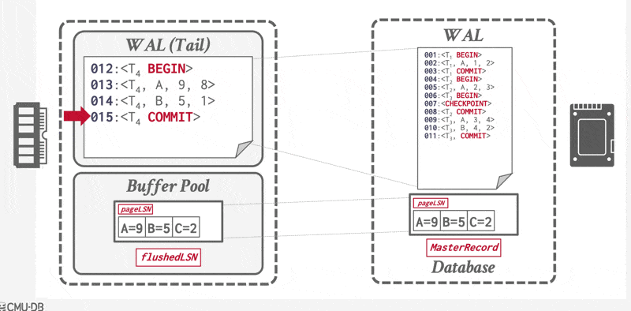
    

若系统在 $<T_i \text{ commit}>$ 日志记录写入至稳定存储器前发生崩溃，则事务 $T_i$ 将被回滚。由此可见，包含提交日志记录的数据块输出是导致事务成功提交的**原子性**操作。

在大多数基于日志的恢复技术中，当事务提交时，被该事务修改的数据项所在的块不必立即输出到稳定存储设备上，而是可以稍后再进行输出。

#### Group Commit

提交事务要求其日志记录被强制写入到磁盘中。若为每个事务单独执行日志清除操作，那么每次提交都会产生很大的日志写入开销。因此，我们采用**组提交**(group-commit)的技术，以提升事务的提交速率：

- 系统不再在单个事务完成后立即强制写入日志，而是等待多个事务完成，或自上次事务执行完毕经过一定时间间隔后，将处于等待状态的事务组批量提交。此时稳定存储器上的日志块将包含多个事务的记录
- 通过合理设置**组大小**和**最大等待时间**，系统既能确保写入稳定存储的块数据满载，又不会导致事务过度延迟
- 平均而言，该技术能够减少每个已提交事务所对应的输出操作次数
- 对闪存而言，组提交还能显著降低同一页面的重复写入次数次数，进而减少昂贵的擦除操作（需注意闪存系统会将逻辑页面重映射至预擦除物理页面以避免即时擦除延迟）
- 尽管组提交以略微延迟更新型事务为代价降低了日志开销，但在高频率提交场景下，总体延迟反而会下降；但低频率时这种方法可能得不偿失

除了在数据库层面进行的优化外，程序员还可以采取一些措施来提升事务提交性能。例如通过**将批量插入合并为单个事务执行**，性能可获得显著提升——多个插入操作对应的日志记录会被集中写入同一页面中，从而使每秒可处理的插入数量成比例增长。

??? example "例子"

    

        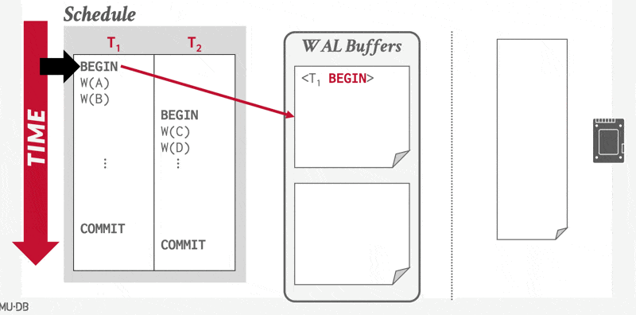
    

### Using the Log to Redo and Undo Transactions

下面我们来大致了解一下如何用日志来恢复崩溃的系统和回滚事务。有以下两个恢复过程：

- `redo(T_i)`：将事务 $T_i$ 更新过的所有数据项的值设置为**新值**。
    - `redo` 执行更新的顺序很重要；在从系统崩溃中恢复时，如果对特定数据项的更新顺序与最初应用的顺序不同，该数据项的最终状态就会有错误的值。
    - 大多数恢复算法，都不对每个事务单独执行 `redo`，而是对日志进行单次扫描。在此过程中，每当遇到日志记录时，都会执行 `redo` 操作。这种方法不仅保留了更新顺序，并且更高效（因为日志只需要读取一次，而不用为每个事务读一遍日志）。
- `undo(T_i)`：该过程将所有由事务 $T_i$ 更新的数据项的值恢复到**旧值**。
    - 该操作不仅将数据项恢复到旧值，而且还要写入日志记录，以记录作为撤销过程中一部分执行的更新。
        - 这些日志记录是特殊的**仅重做**(redo-only)日志记录，因为它们不需要包含更新数据项的旧值
        - 请注意，在撤销过程中使用此类日志记录时，“旧值”实际上是正在回滚的事务写入的值，“新值”是撤销操作正在恢复的原始值
        - 与重做过程一样，撤销操作执行的顺序很重要
    - 当事务 $T_i$ 的撤销操作完成时，它写入一个 $<T_i \text{ abort}>$ 日志记录，指示撤销已完成。
        - 如果事务在正常处理过程中回滚或从系统崩溃中恢复，且未找到事务 $T_i$ 的提交或中止记录，则仅执行一次 `undo(Ti)` 过程；因此，每个事务最终都会在日志中有一个提交或中止记录

系统发生崩溃后会查阅日志，来确定哪些事务需要重做、哪些需要撤销，从而确保原子性：

- 当事务 $T_i$ 的日志记录包含 $<T_i \text{ start}>$ 但未包含 $<T_i \text{ commit}>$ 或 $<T_i \text{ abort}>$ 时，该事务需被**撤销**。
- 当事务 $T_i$ 的日志记录同时存在 $<T_i \text{ start}>$ 以及 $<T_i \text{ commit}>$ 或 $<T_i \text{ abort}>$ 时，该事务需被**重做**。
    - 其运作机制在于：当 $<T_i \text{ abort}>$ 存在于日志时，由撤销操作写入的仅重做的记录也必然存在。因此最终执行效果仍是对 $T_i$ 修改的撤销。这种微小的冗余设计简化了恢复算法并提升了整体恢复速度。

### Transaction Rollback

首先考虑在正常运行期间（即非系统崩溃恢复时）的事务**回滚**（即**撤销**操作）。事务 $T_i$ 的回滚操作按以下步骤执行：

1. **反向扫描日志**，对于发现的每个形式为 $<T_i, X_j, V_1, V_2>$ 的 $T_i$ 的日志记录：
   - 将值 $V_1$ 写回数据项 $X_j$
   - 同时向日志写入一条特殊的仅重做记录 $<T_i, X_j, V_1>$，其中 $V_1$ 是回滚过程中要恢复到数据项 $X_j$ 的值。这类日志记录有时称为**补偿日志记录**(compensation log records)。此类记录不需要包含撤销信息，因为我们永远不需要撤销这类逆向操作。

2. 当扫描到 $<T_i \text{ start}>$ 日志记录时停止反向扫描，并向日志写入一条 $<T_i \text{ abort}>$ 记录。

这样，无论是事务本身执行的更新操作，还是代表事务执行的操作（包括将数据项恢复旧值的所有操作），现在都已完整记录在日志中。

### Checkpoints

关于系统崩溃后查阅日志这件事，最直接的方式便是搜索整个日志来获取用于恢复的信息。但这种做法存在两大难点：

- 搜索过程耗时大
- 根据我们的算法，判定需重做的事务中，绝大多数其实早已将更新写入数据库里了。尽管重新执行这些操作不会造成什么损害，但会导致恢复时间的延长。

为降低此类开销，我们引入了**检查点**(checkpoints)机制。以下描述一种简单的检查点方案：

- 在检查点操作执行期间禁止任何数据更新
    - 停止任何新事务的的开始
    - 等待所有活跃事务执行完毕
- 执行检查点时将所有修改过的缓冲区块（脏页）输出到磁盘中

后面我们将讨论如何通过放宽这两项要求来改进检查点和恢复流程，从而获得更大灵活性。

而检查点的具体执行步骤如下：

1. 将当前驻留在主存中的所有日志记录输出到稳定存储器中
2. 将所有修改过的缓冲区块（**脏页**(dirty pages)）输出至磁盘中
    - 也就是说，即便这个事务还没有提交，在检查点之前对数据的修改也会作用在数据库上
3. 向稳定存储器输出一个格式为 $<\text{checkpoint } L>$ 的日志记录，其中 $L$ 是在检查点时刻上的**活跃事务表**

??? info "活跃事务表"

    **活动事务表**(active transcation list, **ATT**)表示在 DBMS 中正在运行的事务的状态。在 DBMS 完成该事务的提交/中止过程后，事务的条目将被删除。对于每个事务条目，ATT 包含以下信息：

    - transactionId：唯一的事务标识符
    - status：事务当前的“模式”（运行中(R)、提交中(C)、撤销候选(U)）。
    - lastLSN：事务写入的最新的 LSN

    注意，ATT 包含除 TXN-END 日志记录外的每个事务，包括已提交或中止的事务。

日志中存在的 $<\text{checkpoint } L>$ 记录能让系统简化恢复过程：考虑一个在检查点之前完成的事务 $T_i$，对于此类事务，$<T_i \text{ commit}>$（或 $<T_i \text{ abort}>$）会出现在日志的 $<\text{checkpoint}>$ 记录之前。由 $T_i$ 执行的所有数据库修改必然已在检查点前写入数据库，或是作为检查点本身的一部分完成。因此，在恢复阶段无需对 $T_i$ 执行重做操作。

当系统发生崩溃后，系统会扫描日志以定位到最近的 $<\text{checkpoint } L>$ 记录——具体可通过从日志末尾向前搜索，直至找到首个 $<\text{checkpoint } L>$ 记录来实现。

重做与撤销操作仅需应用于集合 $L$ 中的事务，以及所有在 $<\text{checkpoint } L>$ 记录写入日志后开始执行的事务。我们将该事务集合记为 $T$：

- 对于 $T$ 中所有在日志中**没有** $<T_i \text{ commit}>$ 或 $<T_i \text{ abort}>$ 记录的事务 $T_k$，执行 `undo(T_k)`
- 对于 $T$ 中所有在日志中**存在** $<T_i \text{ commit}>$ 或 $<T_i \text{ abort}>$ 记录的事务 $T_k$，执行 `redo(T_k)`

??? example "例子"

    

        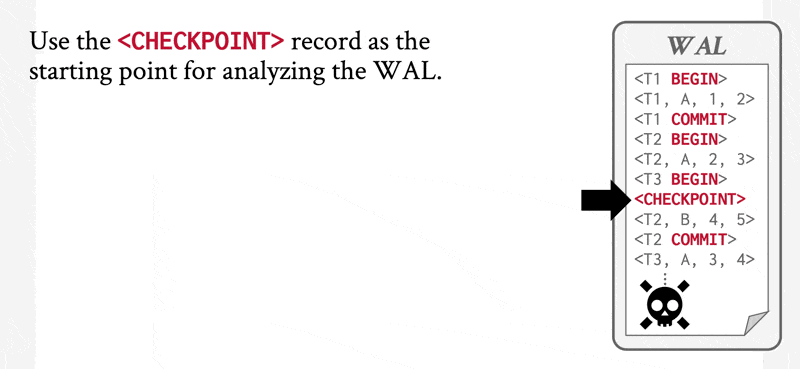
    

注意：我们只需检查日志中自上一个检查点记录开始的部分，以找出事务集 $T$，并确定 $T$ 中每个事务的日志里是否出现了提交或中止记录。

考虑检查点日志记录中的事务集合 $L$。对于 $L$ 中的每个事务 $T_i$，若该事务未提交，则可能需要撤销该事务在检查点日志记录之前的所有相关日志记录。然而，一旦检查点完成，早于 $L$ 中所有 $<T_i \text{ start}>$ 日志记录的最早时间点的所有历史日志均不再需要。当数据库系统需要回收这些记录占用的空间时，可随时清除此类日志。

要求事务在检查点过程中不得对缓冲块或日志执行任何更新操作可能不太合理，因为这意味着检查点进行期间必须暂停事务处理。因此我们引入**模糊检查点**(fuzzy checkpoints)：即使在缓冲块正被写出的情况下，事务仍可继续执行更新操作。下面马上介绍！

#### Fuzzy Checkpointing

??? info "引入：稍微更好一点的检查点方案"

    与之前的检查点方案类似，不同之处在于 DBMS 无需等待活跃事务执行完毕。系统需要记录的是检查点开始时的内部状态：

    - 暂停所有新事务的启动
    - 在创建检查点时冻结现有事务

    该过程需记录起始时刻的内部系统状态，因此要包含两个核心组件：追踪运行中事务的**活跃事务表**(active transaction table, ATT)，以及记录所有尚未写入磁盘的被修改页的**脏页表**(dirty page table, DPT)。

    在设立检查点时，这些表会捕获数据库的当前状态。在执行恢复操作时（例如采用 [ARIES](#aries) 协议），这些表格为数据库恢复到崩溃前的一致性状态起到辅助作用。

    ??? example "例子"

        

            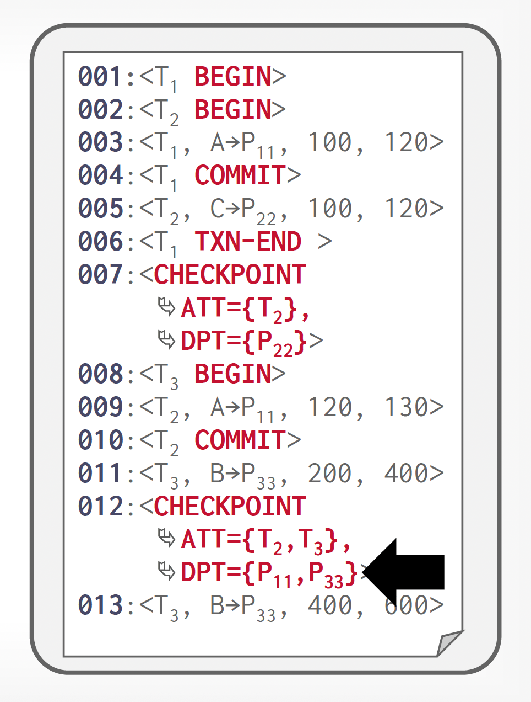
        

为避免前面提到执行中断问题，我们可以在原有的检查点技术上进行改进：允许在写入检查点记录后、但修改过的缓冲区块尚未写入磁盘前就恢复更新操作。这样得到的检查点称为**模糊检查点**(fuzzy checkpoints)。

由于只有在检查点记录写入后，数据页才会被输出到磁盘中，因此系统可能在所有页都写入之前就崩溃了。所以磁盘上的检查点可能是**不完整的**。处理不完整检查点的一种方法如下：将最后一个完成的检查点记录在日志中的位置存储在磁盘上的一个固定位置，即最后检查点。系统在写入检查点记录时不会更新此信息。相反，在写入检查点记录之前，它创建一个包含所有已修改缓存块的列表。只有当列表中的所有缓冲区块都已输出到磁盘后，才会更新最后检查点信息。

即使在模糊检查点中，缓存块在输出到磁盘时也不应该被更新，尽管其他缓存块可以同时更新。必须遵循写提前日志协议，以确保与块相关的（撤销）日志记录在块输出之前位于稳定存储器中。

??? example "例子"

    

        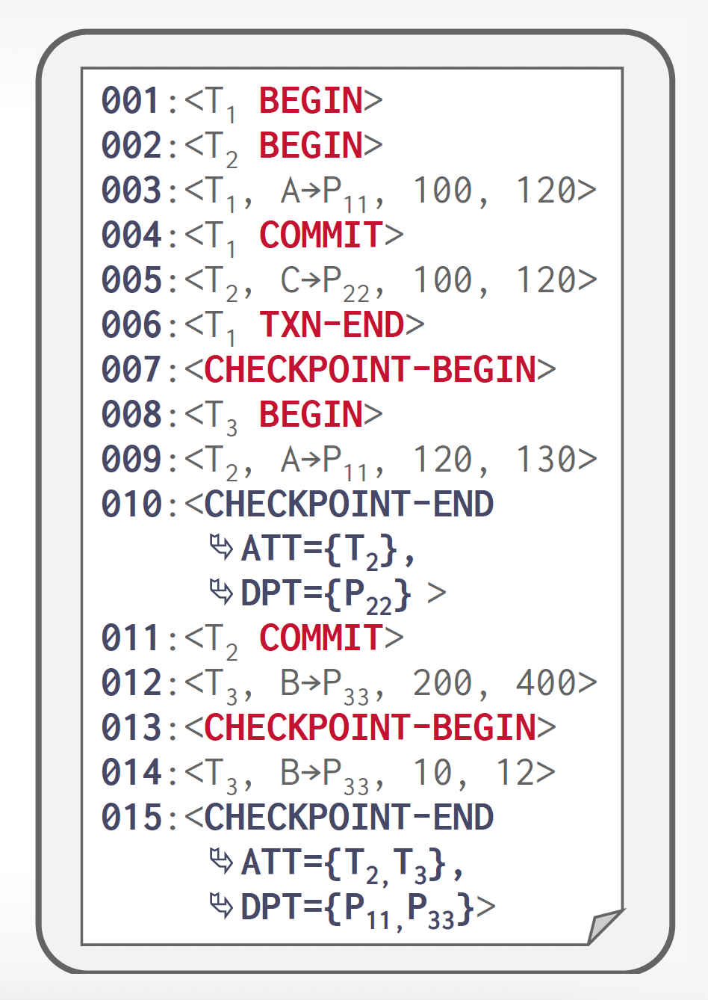
    

### Recovery After a System Crash

恢复操作在数据库系统崩溃后重启时分为两个阶段进行：

1. 在**重做阶段**(redo phase)中，系统通过从最后一个检查点开始正向扫描日志，重新执行所有事务的更新操作。被重做的日志记录包括：系统崩溃前已回滚的事务日志记录，以及系统崩溃发生时尚未提交的事务日志记录。

    该阶段还需确定所有在崩溃时未完成的事务（这些事务必须被回滚）。这类未完成的事务要么在检查点时处于活动状态（因此会出现在检查点记录的事务列表中），要么是在之后启动的；此外，它们的日志中既没有 $<T_i \text{ abort}>$ 也没有 $<T_i \text{ commit}>$ 记录。

    具体步骤如下：

    1. 待回滚事务列表（或者称为**撤销列表**(撤销列表)）初始化为 $<\text{checkpoint } L>$ 日志记录中的列表 $L$
    2. 遇到常规格式 $<T_i, X_j, V_1, V_2>$ 或仅重做格式 $<T_i, X_j, V_2>$ 的日志记录时，执行**重做**操作——将值 $V_2$ 写入数据项 $X_j$
    3. 发现 $<T_i \text{ start}>$ 格式的日志记录时，将 $T_i$ 加入到撤销列表中
    4. 发现 $<T_i \text{ commit}>$ 或 $<T_i \text{ abort}>$ 格式的日志记录时，将 $T_i$ 移出撤销列表

    重做阶段结束时，撤销列表内包含了所有未完成的事务清单。

2. 在**撤销阶段**(undo phase)，系统会回滚撤销列表中的所有事务。通过从末尾反向扫描日志实现回滚：
    1. 当发现属于撤销列表中某事务的日志记录时，执行**撤销**操作（处理方式与故障事务回滚时的处理相同）
    2. 当发现撤销列表中某事务 $T_i$ 的 $<T_i \text{ start}>$ 记录时：向日志写入一条 $<T_i \text{ abort}>$ 记录并将 $T_i$ 移出撤销列表
    3. 当撤销列表为空时，撤销阶段终止——此时系统已为初始存在于撤销列表的所有事务找到对应的 $<T_i \text{ start}>$。
    
    在恢复的撤销阶段终止后，正常的事务处理可以继续了。

重做阶段会回放自最近检查点记录以来的每一条日志记录，即重复执行检查点之后的所有更新操作，这些操作既包含未完成事务的操作，也包含为回滚失败事务所执行的操作。系统严格按照原始执行顺序重新执行这些操作，因此该过程被称为**历史重演**(repeating history)。尽管看似冗余，但这种做法能大幅简化恢复机制的设计。

### Buffer Management

#### Log-Record Buffering

到目前为止，我们一直假设每条日志记录在创建时都会被立即写入到稳定存储器中。这一假设给系统执行带来了很大的开销，因为稳定存储器通常以数据块为单位进行写入，而大多数情况下单条日志记录远小于一个数据块。因此每条日志记录的输出实际上会引发物理层面上更大量的写操作。

因此，我们希望实现多条日志记录的批量输出。为此系统先将日志记录暂存于主存的日志缓冲区中，待积攒到一定数量后，通过单次写操作批量提交至稳定存储器中。这个过程必须确保稳定存储器中的日志顺序与它们被写入缓冲区的顺序完全一致。

采用**日志缓存**机制意味着某些记录可能在易失性主存中驻留较长时间才会被写到稳定存储器中。若此时系统崩溃，这些日志记录将会丢失。因此，这就要求我们在恢复技术上附加一些新的约束条件来保证事务的原子性：

- 事务 $T_i$ 只有在 $<T_i \text{ commit}>$ 日志记录成功写入到稳定存储器后才会进入提交状态  
- 在 $<T_i \text{ commit}>$ 日志记录被输出到稳定存储器之前，所有与事务 $T_i$ 相关的日志记录必须已经输出到稳定存储器中
- 在主存中的数据块输出到数据库之前，与该数据块中数据相关的所有日志记录必须已经输出到稳定存储器中——这一规则被称为**写提前日志**(write-ahead logging, WAL)规则
    - 省流版：**先写日志，再写数据**

??? example "例子"

    

        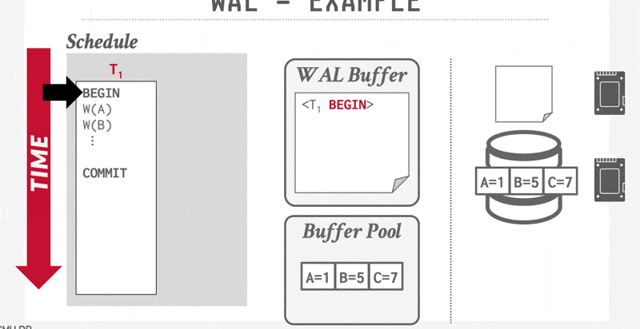
    

这三条规定明确了某些日志记录**必须**输出到稳定存储器的情形。**提前**输出日志记录不会引发问题。因此，系统认为有必要将日志记录输出到稳定存储器时，如果主存中有足够的日志记录来填满一个块，它就会输出整块日志记录；若不足以填满块，则将所有主存中的日志记录合并为部分填充的块并输出至稳定存储器中。

将缓冲的日志写入磁盘的操作有时被称为**日志强制**(log force)。

#### Buffer Pool Management Policies

DBMS 需要保证：

- 一旦 DBMS 提交了事务，该事务的改变一定要持久存在
- 如果事务被中止，那么该事务的任何改变都不得存在于数据库中

为此，DBMS 会从以下两个角度考虑缓存池的管理策略：

- **窃取策略**(steal policy)规定了 DBMS 是否允许未提交的事务覆盖非易失性存储器（磁盘）中对象的最新已提交值。
    - 分为 STEAL 和 NO-STEAL
- **强制策略**(force policy)规定了 DBMS 是否要求事务在允许提交之前，必须将所有更新内容写入非易失性存储器（磁盘）中。
    - 分为 FORCE 和 NO-FORCE

最简单的缓存池管理策略称为 **NO-STEAL + FORCE**。在该策略下，

- DBMS **无需撤销**已中止事务的更改，因为这些更改并未写入磁盘
- 同时它也**无需重做**已提交事务的更改，因为所有变更都确保在提交时写入磁盘

??? example "例子"

    

        
    

该策略的局限在于：事务所需修改的所有数据必须能够完全被内存容纳。若无法满足此条件，则该事务将无法执行，因为 DBMS 不允许在事务提交前将脏页写入磁盘。此外，更频繁的写操作也可能加速 SSD 等存储设备的磨损。

??? info "补充知识：影子页"

    **影子页**(shadow paging)技术是对 NO-STEAL + FORCE 方案的一种改进：DBMS 在写入时复制页，因而得到两个独立的数据库版本：

    - 主版本(master)：仅包含来自提交事务的改变
    - 影子版本(shadow)：还包含未提交事务改变的临时数据库

    更新仅在影子副本中进行。当事务提交时，影子副本会以原子方式切换成为新的主版本。旧的主版本最终会被垃圾回收机制清理。

    具体实现为：
    
    - DBMS 将数据库的页组织成树状结构，其中根节点为单个磁盘页
    - 该树存在两个副本：主版本与影子版本；根节点始终指向当前的主版本
    - 执行事务时，只改变影子版本的内容
    - 当一个事务准备提交时，DBMS 必须应用其更新；为此只需覆写根节点，使其指向数据库的影子版本，从而实现主版本与影子版本的切换
    - 在覆写根节点之前，该事务的所有更新都不属于磁盘驻留数据库的组成部分；而一旦完成根节点覆写，该事务的全部更新便成为磁盘驻留数据库的一部分
    - 这种对根节点的覆写操作能以原子方式完成

    ??? example "例子"

        

            
        

    对应的恢复措施为：

    - 撤销：移除影子页，保留主版本和数据库根指针
    - 重做：无需重做

    !!! bug "缺点"
    
        - 复制整个页表的开销很大。
            - 实际上，只需复制树中通向更新叶节点的路径，没有必要复制整棵树。
        - 影子页的提交开销也很高：提交操作需要刷新页表、根页面及每个被修改的页面。
            - 这种方法会导致大量随机非连续页面的写入操作，同时引发数据碎片化问题，因为潜在关联的数据可能分散在不同页面间。
            - 该机制还需垃圾回收功能：当数据更新时，指向旧页面的引用会失效，必须更新这些引用以确保没有页面指向未更新的陈旧数据
        - 仅支持单次单写事务或批量事务处理。

前面介绍到的 WAL 采用的缓存池策略是 STEAL + NO-FORCE。

下图从窃取和强制这两个维度来总结这些策略的特点：

    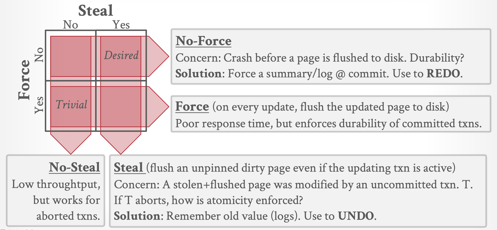

    

实际上，几乎所有的 DBMS 采用的都是 STEAL + NO-FORCE 策略。

---
当需要将块 $B_1$ 输出到磁盘时，所有涉及 $B_1$ 中数据的日志记录必须在 $B_1$ 被输出前写入稳定存储器中。关键是在块输出过程中，不能存在对该块的写操作，否则可能违反写提前日志规则。通过以下特殊锁机制可确保无进行中的写操作：

- 事务执行数据项写入前，必须获取该数据项所在块的**独占锁**，更新完成后立即释放锁。
- 块输出时按如下顺序操作：
    - 获取块的独占锁，以确保没有事务正在写入该块
    - 将所有关联 $B_1$ 的日志记录输出至稳定存储器中
    - 将 $B_1$ 块输出到磁盘中
    - 完成块输出后立即释放锁

缓存块的锁与事务并发控制的锁没有关系，所以通过非两阶段方式来释放这些锁不会影响事务的可串行性。这种短期持有的锁通常称为**锁存**(latches)。

在检查点进行期间，缓存块的锁还可用于确保缓存块不被更新且不生成日志记录。这一限制可通过在执行检查点操作前，获取所有缓存块的独占锁及日志的独占锁来实现。这些锁可在检查点操作完成后立即释放。

数据库系统通常设有一个持续循环遍历缓存块的过程，将已修改的缓存块写回磁盘。在输出这些块时，必须遵循上述锁协议。通过持续输出被修改的块，缓冲区内的**脏块**（即在缓冲区中被修改但尚未写回磁盘的块）的数量得以最小化。如此一来，检查点期间需要输出的块数量也相应减少；此外，当需要从缓冲区中驱逐一个块时，很可能会有一个非脏块可供驱逐，这使得输入得以立即进行，无需等待输出完成。

#### Operating System Role in Buffer Management

可通过以下两种方法之一来管理数据库的缓冲区：

- 数据库系统预留部分主存作为其自行管理的缓冲区（而非由操作系统管理）。
    - 这种方法的缺点在于限制了主存使用的灵活性。因为缓冲区必须保持足够小，以确保其他应用程序有足够的主存来满足自身需求。然而即使其他应用程序未运行，数据库也无法利用全部可用的内存。同理，非数据库应用程序也不能使用为数据库缓冲区保留的那部分主存（即便该缓冲区的某些页面当前未被使用）。

- 当数据库系统在操作系统提供的**虚拟内存**中实现其缓冲区时，由于操作系统知晓系统中所有进程的内存需求，理论上应由它决定哪些缓存块必须强制写入磁盘及执行时机。但为确保写提前日志的要求，操作系统不应直接写出数据库缓冲页，而应请求数据库系统执行强制输出操作。此时数据库系统会先将相关日志记录写入到稳定存储器中，再将缓存块强制输出到数据库中。
    - 遗憾的是，几乎所有当代的操作系统都完全掌控着虚拟内存的管理权。它们会在磁盘上预留**交换空间**(swap space)来存储当前不在主存的虚拟内存页。若操作系统决定写出 $B_x$ 块时，该块只会被输出至磁盘的交换空间——这使得数据库系统无法干预缓存块的输出过程。
    - 因此，若数据库缓冲区位于虚拟内存中，则数据库文件与虚拟内存缓冲区间的数据传输必须由数据库系统管理，该系统强制执行写提前日志要求。
    - 这种方式可能导致数据额外写入到磁盘中。如果操作系统将区块 $B_x$ 写出，该区块并不会直接输出至数据库文件中，而是被写入操作系统虚拟内存的交换空间。当数据库系统需要写出 $B_x$ 时，操作系统可能需先从交换空间读入 $B_x$。如此一来，原本只需一次的 $B_x$ 输出操作，就可能演变为两次输出，外加一次额外的输入操作。

虽然这两种方案都存在缺陷，但我们还是得选择其中一种来实现。

## Early Lock Release and Logical Undo Operations

在处理事务过程中，使用的任何索引均可视为普通数据，但为了提高并发性，可采用 B+ 树并发控制算法，以非两阶段方式实现锁的提前释放。这一思想也可以扩展至恢复算法中，下面就来详细介绍具体实现。

### Logical Operations

**插**入和**删除**操作是一类需要逻辑回滚操作的典型代表，因为它们会提前释放锁——我们将这类操作称为**逻辑操作**(logical operations)。这种提前释放锁的行为不仅对索引至关重要，对于其他被频繁访问和更新的系统数据结构也同样重要。若在此类数据结构上执行操作后未及时释放锁，事务将趋向于串行化执行，进而影响系统性能。

操作在执行时获取**低级锁**(lower-level locks)，但在完成时释放它们；然而，相应的事务必须以两阶段方式保留**高级锁**(high-level locks)，以防止并发事务执行冲突操作。

这种早期锁释放允许在相同页上执行第二个插入。然而，每个事务必须获取要插入或删除的键值的锁，并以两阶段方式保留它，以防止并发事务在相同的键值上执行冲突的读取、插入或删除操作。

一旦释放了低级锁，就不能通过使用更新数据项的旧值来撤销操作，而必须通过执行补偿操作来撤销——这种操作称为**逻辑撤销操作**(logical undo operation)。在操作期间获取的低级锁足以执行随后的逻辑撤销，其原因见下一小节。

### Logical Undo Log Records

为了实现逻辑撤销操作，在执行修改索引的操作前，事务会创建一条形如 $<T_i, O_j, \text{operation-begin}>$ 的日志记录，其中$O_j$ 是该操作实例的唯一标识符。系统执行操作过程中，会以常规方式为所有的更新生成更新日志记录。因此每个操作引发的更新仍按惯例记录旧值和新值信息。

当操作完成时，系统将写入格式为 $<T_i, O_j, \text{operation-end}, U>$ 的操作结束日志记录，其中 $U$ 表示撤销信息（人话：在撤销阶段要做的**补偿操作**）。比如：若该操作为 B+ 树插入条目，则撤销信息 $U$ 需指明待执行的删除动作、目标 B+ 树及待删除条目。这类记录操作信息的日志方式称为**逻辑日志**(logical logging)；而记录旧值与新值的传统方式称为**物理日志**(physical logging)，对应记录即物理日志记录。

需注意上述方案中，逻辑日志仅用于**撤销**而非重做；重做完全依赖物理日志实现。这是因为系统故障后的数据库状态可能仅反映部分操作的更新，此时 B+ 树等数据结构处于不一致状态：既无法执行逻辑重做，也无法进行逻辑撤销。要实施逻辑重做/撤销，必须确保磁盘上的数据库状态满足**操作一致性**(operation consistent)，即不应有任何操作的局部影响。但正如后续所述，恢复方案的重做阶段通过物理重做处理，结合物理日志记录的回滚处理，能确保被逻辑回滚操作访问的数据库部分在执行前达到操作一致状态。

若连续多次执行某操作与执行一次该操作的结果相同，则我们认为该操作是**幂等的**(idempotent)。向 B+ 树插入条目这类操作可能不具备幂等性，因此恢复算法必须确保不会重复执行已完成的操作。相反地，**物理日志记录**具有幂等性：无论记录的更新被执行一次还是多次，对应数据项都将保持相同值。

### Transaction Rollback with Logical Undo

在回滚事务 $T_i$ 时，系统会逆向扫描日志记录，并按以下方式处理与 $T_i$ 对应的日志条目：

1. 扫描过程中遇到的物理日志记录按前述规则处理（之后说明的跳过情况除外）。未完成的逻辑操作通过该操作生成的物理日志记录进行撤销。
2. 已完成的逻辑操作（由 $\text{operation-end}$ 标识的记录）采用不同回滚方式：当系统发现 $<T_i, O_j, \text{operation-end}, U>$ 日志记录时，执行以下特殊操作：
    - 利用该记录的撤销信息 $U$ 回滚整个操作。系统会像首次执行该操作时那样，将回滚过程中执行的更新操作记入日志。完成操作回滚后，数据库系统不会生成 $<T_i, O_j, \text{operation-end}, U>$ 记录，而是生成 $<T_i, O_j, \text{operation-abort}>$ 记录。
    - 随着日志逆向扫描的继续，系统会跳过事务 $T_i$ 的所有日志记录，直至找到 $<T_i, O_j, \text{operation-begin}>$ 为止。定位到 $\text{operation-begin}$ 记录后，再恢复正常的事务 $T_i$ 日志处理流程。

    系统在回滚过程中为更新操作记录的是物理撤销信息，而非仅使用重做补偿日志记录。这是因为在逻辑撤销的过程中可能会崩溃，系统在恢复时必须完成该逻辑撤销；为此，重启恢复将利用物理撤销信息，先消除先前未完成撤销的部分影响，再重新执行逻辑撤销。

    还需注意：当回滚过程中发现操作结束的日志记录时，跳过物理日志记录，以确保一旦操作完成就不再使用物理日志中的旧值进行回滚。

3. 若系统发现一条记录 $<T_i, O_j, \text{operation-abort}>$，它将跳过所有先前的记录（包括 $O_j$ 的操作结束记录），直至找到 $<T_i, O_j, \text{operation-begin}>$ 记录。
    - 仅当正在回滚的事务先前已部分回滚时，才会出现 $operation-abort$ 日志记录。需注意逻辑操作可能不具备幂等性，因此必须避免对同一逻辑撤销操作重复执行。这些前置日志记录的跳过机制确保了在先前回滚过程中，发生崩溃且事务已部分回滚的情况下，不会对同一操作进行多次回滚。

4. 当找到 $<T_i, \text{ start}>$ 日志记录时，即表示该事务回滚已完成，此时系统会在日志中追加一条 $<T_i, \text{ abort}>$ 记录。

## ARIES

最经典的数据库恢复算法是 [**ARIES**](https://en.wikipedia.org/wiki/Algorithms_for_Recovery_and_Isolation_Exploiting_Semantics)（全称 Algorithms for Recovery and Isolation Exploiting Semantics，利用语义的恢复和隔离算法）。它运用多项新技术来缩短恢复耗时，并降低检查点操作的开销。其独到之处在于能规避对已执行日志操作的冗余重做，同时精简日志记录量。

ARIES 采用以下技术：

- 使用**日志序列号**(log sequence number, LSN)来标识日志记录，并将 LSN 存储在数据库页中，以确定哪些操作已应用于数据库页上。
- 支持**生理重做**(physiological redo)操作，这种操作在物理层面上表现为受影响页面被实际标识，但在页面内部可以具有逻辑性。
- 采用**脏页表**(dirty page table)机制以减少恢复过程中不必要的重做操作。
- 实施[**模糊检查点**](#fuzzy-checkpointing)(fuzzy checkpoints)方案，仅需记录脏页信息及相关元数据，无需在检查点时强制写入脏页内容。该系统通过后台持续清除脏页的方式替代了检查点期间的集中写入操作。

下面将详细介绍 ARIES 的工作机制。

### Data Structures

ARIES 中的每条日志记录都有一个唯一的 **LSN**。这个编号看起来仅仅是一个逻辑标识符，实际上也能用于定位磁盘上的日志记录。通常，ARIES 会将日志分割成多个日志文件，每个文件都有各自的文件编号。当某个日志文件增长到一定限制时，ARIES 会将后续的日志记录追加至新的日志文件中；新文件的编号比前一个文件高1。因此，LSN 由**文件编号**和该文件内的**偏移量**组成。

每个页还维护着一个称为 **PageLSN** 的标识符：

- 每当页面上发生更新操作（无论是物理还是生理操作）时，该操作会将其对应日志记录的 LSN 存储在该页面的 PageLSN 字段中
- 在恢复的重做阶段，任何 LSN 小于或等于页的 PageLSN 值的日志记录都不应再对该页面执行操作——因为这些操作的影响已体现在当前页上
- 结合稍后将介绍的、将 PageLSN 作为检查点组成部分的记录方案后，ARIES 甚至能避免读取那些已反映磁盘上所有相关操作的页数据，从而显著缩短恢复时间
- PageLSN 对于确保在生理重做操作存在时的幂等性至关重要，因为对于已经应用过生理重做的页，再次执行该操作可能导致页的内容发生错误变更

此外，DBMS 还会记录目前已刷写到磁盘的最大的日志序列号，记作 **flushedLSN**。每当 DBMS 将日志缓冲区写入磁盘时，内存中的 flushedLSN 就会随之更新。

当正在更新某个页时，不应将其刷新至磁盘中，因为无法基于磁盘上的页的部分更新状态重新执行生理操作。因此，ARIES 采用缓存页上的锁存(latch)来防止正在更新的缓存页被写入磁盘中。该系统仅在更新完成且相关日志记录写入日志后，才会释放缓存页锁存。

每条日志记录还包含同一事务中前一条日志记录的 LSN，该值存储在 **PrevLSN** 字段中，这样无需读取整个日志，就可逆向获取事务的所有日志记录。

在 ARIES 系统中，事务回滚期间会生成特殊的仅重做日志记录——**补偿日志记录**(compensation log records, CLR)，其作用等同于前面介绍的恢复方案中的仅重做日志记录。此外，CLR 还承担了方案中操作中止日志记录的职能：这类记录增设了 **UndoNextLSN** 字段，用于在事务回滚时标记下一个待撤销操作的 LSN。此字段功能等同于前面介绍的恢复方案中操作中止日志记录的操作标识符，用于跳过已回滚的日志记录。

??? example "例子"

    利用 CLR 实现事务中止：

    

        
    

**DirtyPageTable**（**脏页表**，下面简记为 DPT）记录了数据库缓冲区中被修改过的页列表。针对每个页，表中存储 PageLSN 及 **RecLSN** 字段（用于识别已应用到磁盘页版本的日志记录）。当某个页首次在缓存池中被修改并加入到 DPT 时，RecLSN 值被设为当前日志末尾；而每当页面被刷写到磁盘后，该页便从 DPT 中移除。

**检查点日志记录**(checkpoint-log record)包括了 DPT 和活跃事务列表。对于每个事务，检查点日志记录还会标注 LastLSN。磁盘上的固定位置同样会标注最近一次（完整）检查点日志记录的 LSN。

下表列出一些常见的 LSN 以及它们各自的作用：

|名称|位置|定义|
|:-|:-|:-|
|flushedLSN|内存|磁盘日志中的最后的 LSN|
|pageLSN|page_x|page_x 的最新更新|
|recLSN|脏页表|自上一次刷洗后 page_x 中的最旧更新|
|lastLSN|活跃事务表|事务 T_i 中最新的记录|
|MasterRecord|磁盘|最新检查点的 LSN|

下图展示了这些 LSN 在 WAL 日志记录中的分布：

    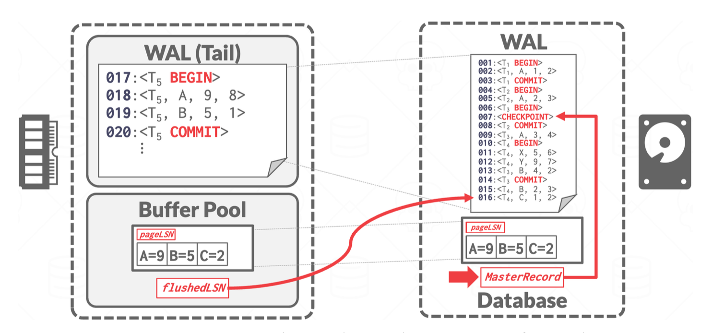

### Recovery Algorithm

恢复算法分为三个阶段：

- **分析阶段**(analysis pass)：确定需要撤销哪些事务、崩溃时哪些页是脏的，以及重做阶段应从哪个 LSN 开始。
- **重做阶段**(redo pass)：从分析确定的起始点开始，执行重做操作，重现历史记录，使数据库恢复到崩溃前的状态。
- **撤销阶段**(undo pass)：回滚所有在崩溃时未完成的事务。

    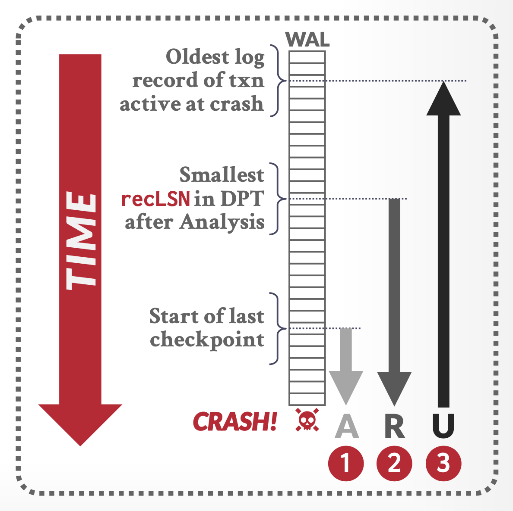

下面具体介绍每个阶段。

#### Analysis Pass

- 为重做阶段做准备：
    - 分析阶段会找到最后一个完整的检查点日志记录，并从该记录中读取 DPT。
    - 随后将 **RedoLSN** 设置为 DPT 中所有页的 <u>RecLSN 中的最小值</u>。
    - 若不存在脏页，则将 RedoLSN 设为检查点日志记录的 LSN；重做过程从 RedoLSN 开始扫描日志（早于此点的所有日志记录均已应用到磁盘上的数据库页面）。
        - 不过笔者认为教材的说法不够准确——没有必要在重做阶段扫描检查点，因此 RedoLSN 应该设置为<u>检查点日志记录的下一条日志记录的 LSN</u>
    - 当发现针对某页的**更新**操作日志时，分析阶段会同步更新 DPT：若该页面未在 DPT 中登记，则将其加入，并设置该页面的 RecLSN 为当前日志记录的 LSN 值。
- 为撤销阶段做准备：
    - 将**撤销列表**初始化为检查点日志记录中的事务列表，同时从检查点记录中读取撤销列表内每个事务的最后一条日志记录的 LSN。然后从检查点**正向**扫描：
        - 每当发现不属于撤销列表的事务日志记录时，就将该事务加入撤销列表；
        - 当遇到事务结束（**提交**而非中止）的日志记录时，则将该事务从撤销列表中**移除**。
    - 最终留在撤销列表中的所有事务都必须在后续的撤销过程中回滚。
    - 分析阶段还会跟踪撤销列表中各事务的最后一条记录，供撤销阶段使用。
- 该阶段**不会**读取内存缓冲区的内容。

??? example "例子"

    

        
    

#### Redo Pass

重做阶段通过重放所有尚未反映在磁盘页的操作来重复历史。该阶段从 **RedoLSN** 开始**正向**扫描日志，每当发现更新日志记录时，会执行以下操作：

- 若目标页不在 DPT 中，或该更新日志记录的 LSN 小于 DPT 中对应页面的 RecLSN 值，则跳过此日志记录；
- 否则重做阶段会从磁盘读取该页，若其 PageLSN 小于当前日志记录的 LSN，则重新执行该日志记录。

需注意：只要任一条件不满足，就意味着该日志记录的修改效果已体现在页上；反之则说明修改效果尚未反映到页上。由于 ARIES 允许非幂等的生理日志记录存在，若某条日志记录的修改已作用于页面，就不应再次重做。当第一个条件不满足时，甚至无需从磁盘中获取页面来检查其 PageLSN 值。

#### Undo Pass

撤销阶段会执行一次日志的**逆向**扫描，对撤销列表中的所有事务进行**回滚**操作。此阶段仅检查撤销列表中事务的日志记录；分析阶段记录的最后一个 LSN 用于定位每个待撤销事务的最后一条日志记录。

每当发现更新日志记录时，无论该记录是正常处理中的事务回滚还是重启恢复期间的撤销操作，都将依据该记录执行撤销动作。撤销阶段会生成包含所执行（必须是生理性）撤销操作的 CLR，并将该 CLR 的 **UndoNextLSN** 值设为原更新日志记录的 **PrevLSN** 值。

- 若遇到 CLR，其 UndoNextLSN 字段即指明该事务下一条待撤消日志记录的 LSN——这意味着后续的该事务日志记录已被回滚完毕。
- 对于非 CLR 类型的其他日志记录，则通过其 PrevLSN 字段确定下一条需撤消的记录位置。

在每次中断后继续处理时，系统会选择所有处于撤消列表内的事务中最大的“下条待处理 LSN”作为下一步的操作对象。

最后，被撤销的事务都要被**中止**，所以需要插入和中止相关的 CLR（比如 $<T_i\ \text{abort}>$）。

??? example "例子"

    === "例1"

        

            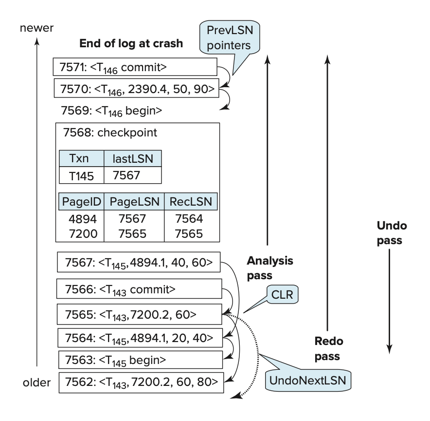
        

    === "例2"

        

            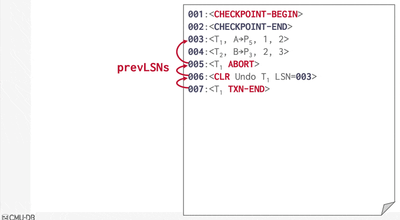
        

    === "例3"

        === "题目"

            

                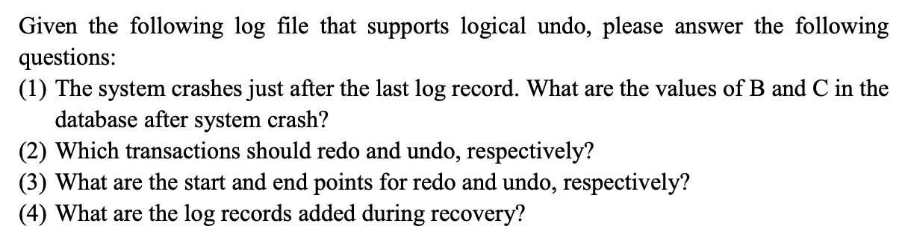
            

            

                
            

        === "解答"

            

                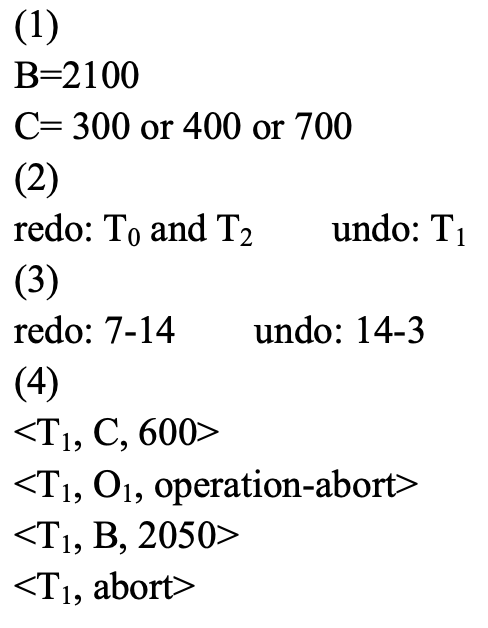
            

    === "例4"

        === "题目"

            >貌似是来自历年卷的题目？

            

                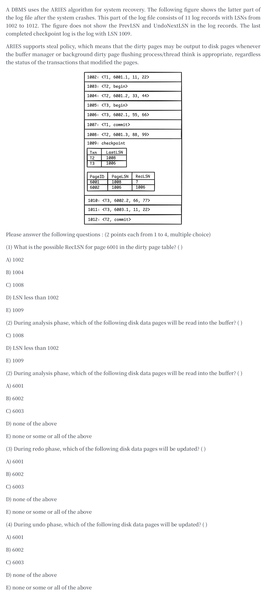
            

        === "解答"

            没有标准答案，我得到的答案是：

            1. A
            2. D
            3. E(AB)
            4. E(BC)

    === "例5"

        === "题目"

            

                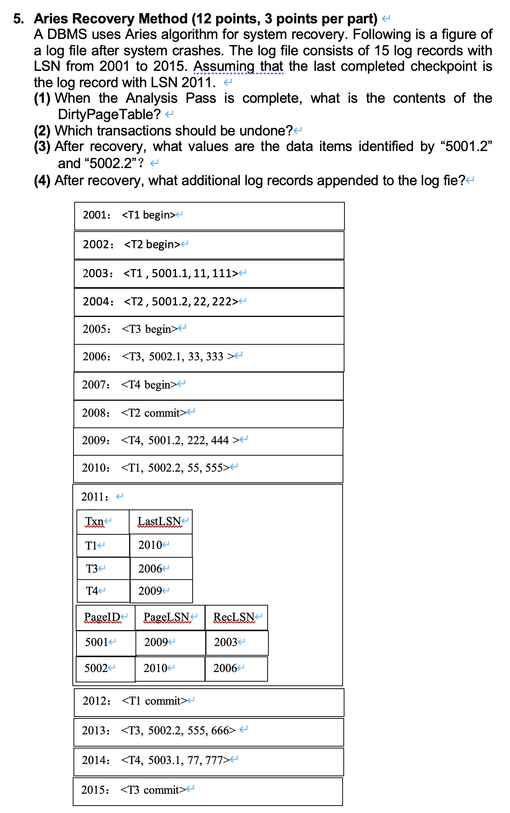
            

        === "解答" 

            答案由 Gemini 2.5 pro 生成。

            

                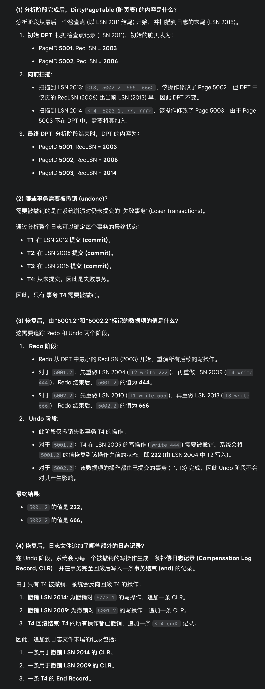
            

### Other Features

ARIES 还有以下功能：

- **嵌套顶层操作**(nested top actions)：
    - ARIES 允许记录那些即便事务回滚也不应撤销的操作。例如，若一个事务为关系分配了一个页，即使该事务被回滚，页的分配也不应撤销，因为其他事务可能已在该页上存储了记录。此类不应撤销的操作被称为**嵌套顶层操作**。
    - 这类操作可建模为其撤销动作为空的操作。
    - 在 ARIES 中，通过创建一个虚拟的 CLR 来实现此类操作，其 UndoNextLSN 的设置使得事务回滚时跳过由该操作生成的日志记录。

- **恢复独立性**(recovery independence)：某些页可以独立于其他页进行恢复，这样即使其他页正在恢复中，这些页仍可使用。如果磁盘上的部分页发生故障，可以在不中断其他页上事务处理的情况下单独恢复它们。

- **保存点**(savepoints)：事务可以记录保存点，并且能够部分回滚至某个保存点。
    - 这对于死锁处理尤为有用，因为事务可以回滚到允许释放所需锁的位置，然后从该点重新开始。
    - 程序员还可以利用保存点来部分撤销一个事务，随后继续执行；这种方法适用于处理在事务执行过程中检测到的某些特定类型的错误。

- **粒度锁定**(fine-grained locking)：ARIES 恢复算法可与索引并发控制算法配合使用，这些算法允许在索引上进行元组级锁定而非页级锁定，从而显著提升并发性能。

- **恢复优化**(recovery optimizations)：
    - 可利用 DPT 在重做阶段预取页。
    - 此外还可以支持乱序重做：对于正从磁盘读取的页，可暂缓执行重做操作，待页加载完成后再行处理；与此同时，系统仍可持续处理其他日志记录。

## Supplements

!!! warning "注意"

    以下为在教材中出现，但是不作为考点的内容，复习时可直接略过。

### Failure with Loss of Non-Volatile Storage

迄今为止，我们仅讨论了故障导致易失性存储器信息丢失的情况。尽管导致非易失性存储器数据丢失的故障极为罕见，但我们仍需做好应对准备，所以本节就来探讨这个问题。

一种简单的应对方案是定期将数据库全部内容**转储**(dump)至稳定存储器。当发生导致物理数据库的数据块损毁的故障时，系统可利用最近一次的转储拷贝，将数据库恢复到之前某个一致状态。完成这个操作后，再通过日志使数据库系统达到最新的一致状态。

还有一种严格的数据库转储方法，要求转储期间不得存在活跃的事务，其执行流程类似检查点机制：

1. 将所有驻留在内存的日志记录输出到稳定存储器中
2. 将所有缓存块写入到磁盘中
3. 将数据库内容复制到稳定存储器中
4. 向稳定存储器输出一条 $<\text{dump}>$ 日志记录

其中步骤1、2、4与检查点机制的三个步骤相对应。当整个非易失性存储器失效时，系统首先利用最新的转储拷贝重建磁盘数据库，随后检索日志，并重做自该次转储以来的所有操作（注意此时无需执行撤销操作）。若遇到的是局部的非易失性存储器故障（如单个或少量数据块损坏），则只需还原受损块并在这些块上执行重做操作。

数据库内容的转储也被称为**归档转储**(archival dump)，因为我们可以将转储文件存档，并在之后利用它们来检查数据库的旧状态。

大多数数据库系统还支持 SQL 转储功能，该功能将 SQL 数据定义语言语句和插入语句写入文件，后续可通过重新执行这些语句来重建数据库。此类转储在将数据迁移至不同数据库实例或不同版本的数据库软件时尤为实用，因为在其他实例或版本中，物理存储位置和布局可能存在差异。

上述转储流程的高成本体现在：

- 整个数据库必须复制到稳定存储器中，导致大量的数据传输
- 由于转储过程中需暂停事务处理，会造成 CPU 计算资源的闲置

因此，一种改进方案是**模糊转储方案**(fuzzy dump schemes)，允许事务在转储进行时仍保持活跃状态（类似模糊检查点技术）。

### High Availability of Using Remote Backup System

现在的应用程序需要一种能够在系统故障或灾难发生时仍能运行的事务处理系统。此类系统必须提供**高可用性**(high availability)，即系统不可用的时间必须非常短。

我们可以通过在一个称为**主站点**(primary site)的地点执行事务处理，并在**远程备份**(remote backup)站点复制主站点的所有数据来实现高可用性。远程备份站点有时也被称为**辅助站点**(secondary site)。远程站点必须与主站点保持同步，因为主站点会进行更新。通过将主站点的所有日志记录发送到远程备份站点来实现同步。远程备份站点必须与主站点在物理上分开，这样主站点发生的灾难就不会损害到远程备份站点了。下图展示的就是一个远程备份系统的架构：

    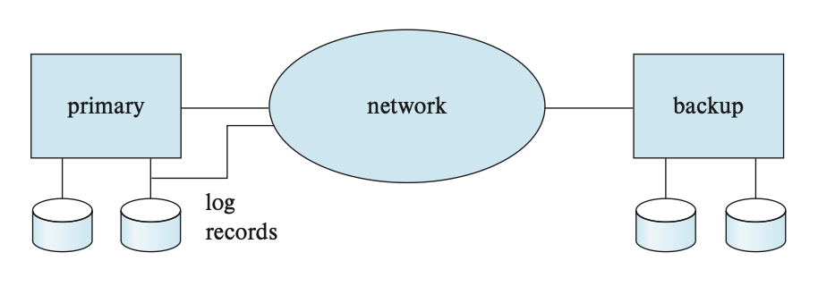

当主站点发生故障时，远程备份站点将接管处理工作。在此之前，它会利用从主站点获取的（可能已过时的）数据副本，以及接收到的日志记录进行恢复操作。实际上，远程备份站点执行的是原本应由主站点在恢复时完成的恢复动作。只需稍作修改的标准恢复算法即可应用于远程备份站点的恢复过程。一旦完成恢复，远程备份站点便开始处理事务。相比单点系统，这种架构显著提高了可用性——即使主站点的所有数据全部丢失，系统仍能恢复正常运行。

在设计远程备份系统时必须解决以下几个关键问题：

- **故障检测**(detection of failure)：
    - 通信线路的故障可能会欺骗远程备份系统，使其误以为主系统发生故障
    - 为了避免这个问题，我们维护了主系统和远程备份之间的多个独立通信链路，这些链路具有独立的故障模式

- **传输控制**(transfer of control)：
    - 当主站点失效时，备份站点会接管处理任务并成为新的主站点，此时查询请求必须发送至新主站点
    - 控制权转移的决策可以手动执行，也可以通过数据库系统供应商提供的软件自动完成
    - 为实现自动切换，许多系统会将原主站点的 IP 地址分配给新主站点；此时现有数据库连接将中断，但当应用程序尝试重新建立连接时，实际上会连接到新主站点
    - 另一些系统则采用**高可用性代理**(high availability proxy)机器：应用客户端不直接连接数据库，而是通过代理进行连接——该代理会将应用请求透明路由至当前的主节
    - 当原主站点恢复后，新主站点既可扮演远程备份角色，也可继续接管
    - 无论哪种情况，原主站点都必须获取其故障期间备份站点执行的所有更新日志记录，具体通过本地应用这些日志更新实现同步；之后原主站点可以作为远程备份节点运行
    - 若需交还控制权，新主站点（即原备份站点）可模拟故障状态触发旧主站的接管流程
    
- **恢复时间**(time to recover)：
    - 若远程备份站点的日志增长过大，恢复过程将耗时漫长
    - 因此远程备份站点可定期处理已接收的重做日志记录，并执行检查点操作，以删掉很旧的那部分日志，从而缩短远程备份接管的延迟时间
    - 采用**热备配置**(hot-spare configuration)可使备用站点的接管几乎瞬间完成
        - 在此配置下，远程备份站点会持续处理到达的重做日志记录，并在本地应用这些更新
        - 一旦检测到主站点故障，备用站点通过回滚未完成事务来完成恢复，随后即可立即处理新事务

- **提交时间**(time to commit)：
    - 为确保已提交事务的更新具有持久性，事务在其日志记录送达备份站点之前不得声明为已提交
    - 这一延迟可能导致事务提交等待时间延长，因此部分系统允许采用较低级别的持久性保障。持久性级别可分类如下：
        - **一级安全**(one-safe)：当事务的提交日志记录写入主站点的稳定存储器后就立即提交
            - 问题：当备份站点接管处理时，已提交事务的更新可能尚未同步至备份站点，导致这些更新看似丢失。待主站点恢复后，由于丢失的更新可能与备份站点后续执行的更新产生冲突，无法直接合并数据差异，此时可能需要人工干预才能使数据库恢复一致状态。

        - **二级非常安全**(two-very-safe)：仅当事务的提交日志记录同时写入主站点和备份站点的稳定存储器后才允许提交
            - 该机制的缺陷是：若主站点和备份站点中的任意一站不可用，就无法继续处理事务了。尽管数据丢失概率大幅降低，但实际可用性反而低于单点部署方案。
        
        - **二级安全**(two-safe)：当主站点和备份站点都处于活动状态时，与“二级非常安全”机制相同；若仅有主站点活跃时，则允许事务在日志记录写入主站点的稳定存储器后立即提交。
            - 此方案在提供比"二级非常安全"更高可用性的同时，规避了"一级安全"可能面临的事务丢失问题。虽然其提交速度慢于"一级安全"，但整体收益通常远超性能代价。

---
尽管备份服务器无法执行更新事务，但多数数据库系统允许在备用站点处理只读查询。通过将部分只读事务分流至备份站点执行，可有效减轻主站点的负载。借助快照隔离技术，备份站点能为读取操作提供事务级一致视图，同时确保来自主站点的更新操作始终不会被阻塞。