# Lec 2: Relational Model

## Structure of Relational Databases

- **关系型数据库**(relational database)：一组由单个或多个基于关系模型的**关系**构成的容器
- **关系模型**(relational model)
    - 特点：简单而优雅
    - 主要优势：简单的数据表示，容易表达复杂的查询（得益于 SQL）

- **关系**(relations)：有行有列的**表格**。关系的数学定义为：对于给定的集合 $D_1, D_2, \dots, D_n(D_i = a_{ij}|_{j=1 \dots k})$，**关系**$r$ 为笛卡尔积 $D_1 \times D_2 \times \dots \times D_n$ 的子集。
    - 笛卡尔积可以用一张二维表表示
    - 关系是一个由 n 元组(n-tuples) $(a_{1j}, a_{2j}, \dots, a_{nj})$ 构成的集合，其中 $a_{ij} \in D_i$
    - **属性**(attributes)
        - 关系内的每个属性都有一个名称
        - 每个属性的允许值的集合被称为属性的**域**(domain)
        - 属性值（通常）要求具备**原子性**(atomic)，即不可分割(indivisible)（满足第一范式(1st NF)）
            - 多值(mutlivalued)属性、复合(composite)属性到不具备原子性

        - 特殊值 **null** 是所有域的成员，它使得很多运算的定义变得复杂，因此在实践中我们希望尽可能地消除它

    - 关系是**无序的**(unordered)
        - 元组的顺序没有意义，可按任意顺序被存储
        - 同一个关系内，不能存在重复的元组

- **联系**(relationship)：多个**实体**之间的关联

## Database Schema

关系的两大概念：

- **关系模式**(relation schema)：描述关系的结构，包含了一系列的属性及其对应的域
    - 假如有属性 $A_1, A_2, \dots, A_n$，那么 $R = (A_1, A_2, \dots, A_n)$ 就是关系模式，而 $r(R)$ 就是在关系模式 $R$ 上的一个关系
    - 关系模式基本上不太会变化
- **关系实例**(relation instance)：在某个时刻上，对关系内的数据的快照(snapshot)
    - 关系上的当前值（即关系实例）会在表格中具体指明，且会随着关系的更新而改变
    - 关系 $r$ 的元素 $t$ 是一个**元组**，在表格上就是一**行**的记录；可用 $t[name]$ 表示 $t$ 在 $name$ 属性上的值

## Keys

**键**(keys)：令 $K \subseteq R$，有以下几类键：

- **超键**(superkey)：对于每个可能的关系 $r(R)$，$K$ 能识别出唯一的元组。也就是说，对于元组 $t_1, t_2 \in r$ 且 $t_1 \ne t_2$，那么 $t_1.K \ne t_2.K$
- **候选键**(candidate key)：最小数量的超键，也就是说候选键的子集无法构成超键
- **主键**(primary key)：是一种候选键，且由数据库设计者显式选择的键（通常用下划线标出）
    - 主键也被称为**主键约束**(primary key constraints)
    - 被选中作为主键的属性的值不能或者很少发生改变
- **外键**(foreign key)：假设存在关系 $r(A, B, C), s(B, D)$，关系 $r$ 的属性 $B$ 是参照 $s$ 的外键，其中 $r$ 是**参照关系**(referencing relation)，$s$ 是**被参照关系**(referenced relation)
    - 参照关系中外码的值必须在被参照关系中实际存在或为 null
    - 在外键约束中，被参照的属性必须是被参照关系的主键

!!! warning "注意"

    上述这些键都有可能包含多个属性，不要以为主键一定只包含一个属性！

## Schema Diagrams

???+ example "例子：大学数据库的模式图"

    数据库内包含以下关系：

    

        
    

    模式图：

    

        
    

在模式图中，

- **主键**用下划线表示出来
- **外键约束**用一根从参照关系指向被参照关系的箭头表示
- **参照完整性约束**用一根双头箭头表示

## Relational Query Languages

**查询语言**(query language)：用户用于请求数据库信息的语言，可以被归类为：

- **必要查询语言**(imperative query language)：
    - 用户指示系统来执行一些在数据库上的具体操作，以计算预期结果
    - 通常有状态变量的概念，随计算过程而更新
- **功能查询语言**(functional query language)：
    - 计算被表示为可能在数据库的数据上，也可能在其他函数的结果上执行操作的函数评估
    - 函数没有副作用，因此无需更新程序状态
- **声明查询语言**(declarative query language)：
    - 用户并不通过一系列的函数调用来描述想要的信息，而是通过数学逻辑来描述

“纯”语言(pure language)：简洁而形式化，缺乏语法糖，但是能阐明从数据库获取数据的基本技术。有以下几类纯语言：

- **关系代数**(relational algebra)：SQL 的基础
- **元组关系演算**(tuple relational caculus)
- **域关系演算**(domain relational calculus)

## Relational Algebra

**关系代数**(relational algebra)包含了一组运算，这些运算接受一个或两个关系作为输入，产生一个新的关系作为结果。关系代数可分为：

- 单目运算：
    - **选择**(select)
    - **投影**(project)
    - **重命名**(rename)
- 双目运算：
    - **并**(union)
    - **交**(intersection)
    - **差**(set difference)
    - **笛卡尔积**(Cartesian product)
    - **自然连接**(natural join)
    - **除**(divide)

关系运算的优先级：

- 投影
- 选择
- 笛卡尔积（乘法）
- 连接、除法
- 交
- 并、差

???+ note "注"

    - 数据库系统不允许用户直接用关系代数来编写查询语句
    - 虽然在数学中，关系不得有重复的元组，但是数据库系统的表格允许重复元组的出现，除非指定约束来禁止
        - 在关系代数中引入多重集的概念，以接纳重复元组的情况，在下一讲中会介绍

    - 上述的关系代数运算可以组合在一起，形成**关系代数表达式**(relational-algebra expression)

### Select

- 选择运算记作：$\sigma_p(r) = \{t\ |\ t \in r \text{ and } p(t)\}$
- 其中 $p$ 称为**选择谓词**(selection predicate)，可通过连接符(connectives) 与（$\wedge$）、或（$\vee$）、非 $\neg$ 包含多个谓词
- 每个**项**的格式为：<attribute\> op <attribute\>/<constant\>，其中 op 是比较运算符（$=, \ne, >, \ge, <, \le$中的其中一种）
- 执行选择时，选择条件必须是针对同一元组中相应属性值代入进行比较

??? example "例子"

    

        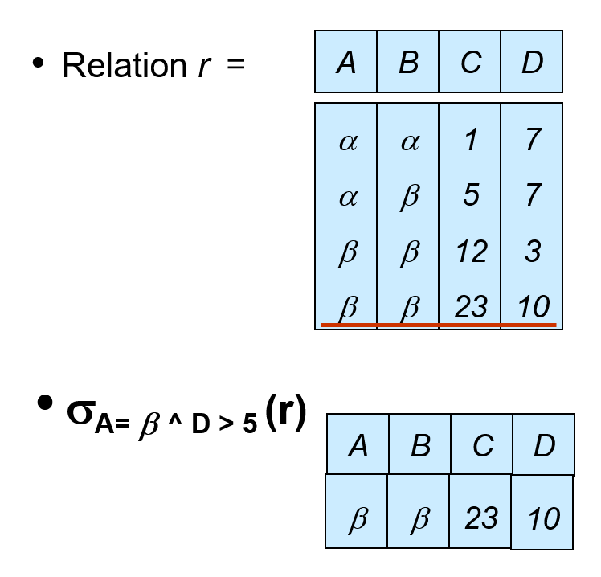
    

### Project

- 投影运算记作：$\prod_{A_1, A_2, \dots, A_k}(r)$，其中 $A_1, \dots, A_k$ 是属性名称
- 运算结果为包含指定的 $k$ 列关系，那些没有指定的列会被排除在外
- 由于返回的也是关系，所以投影结果中重复行会被自动删除
- 广义的(generalized)投影运算允许在投影列表中使用算术表达式，即 $\prod_{F_1, F_2, \dots, F_n}(E)$
    - 其中 $E$ 是关系代数表达式，$F_i$ 是一个包含常数和 $E$ 的模式中的属性的**算术表达式**

??? example "例子"

    === "例1"

        一般的投影运算：

        

            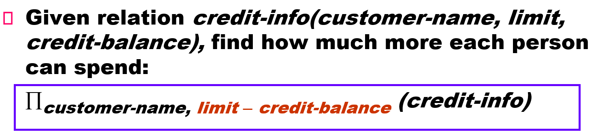
        

    === "例2"

        广义的投影运算：

        

            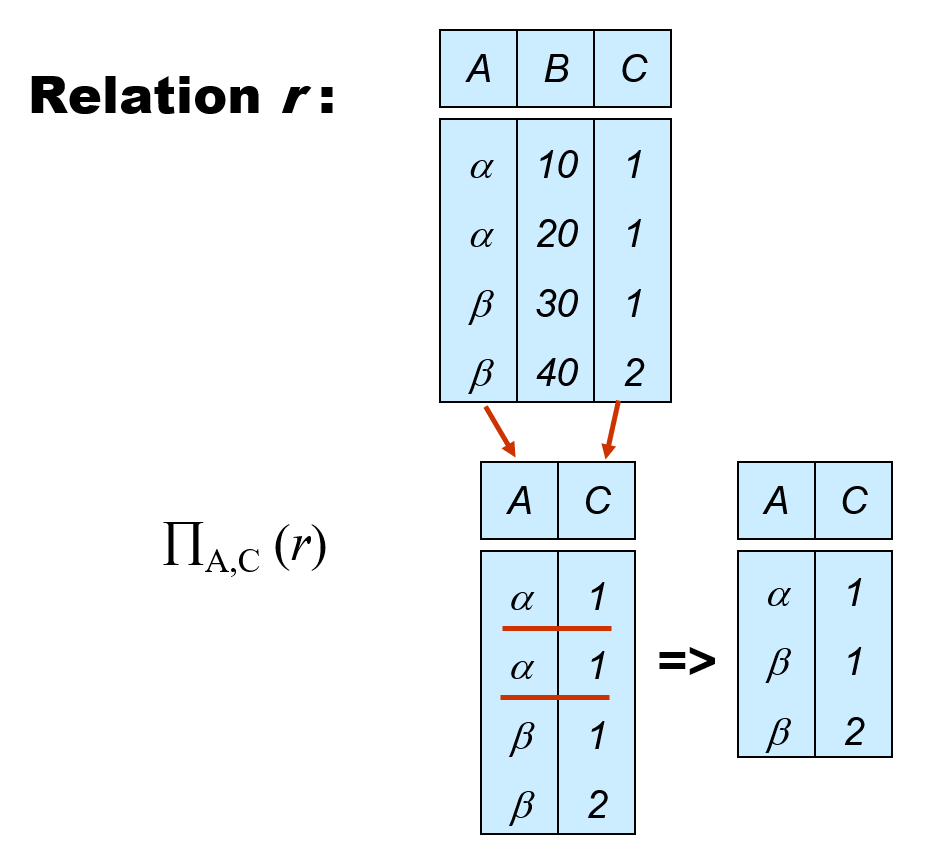
        

### Cartesian Product

- 笛卡尔积记作：$r \times s = \{\{t, q\}\ |\ t \in r \text{ and } q \in s\}$
- 若 $r, s$ 分别有 $n_1, n_2$ 的元组，那么它们的笛卡尔积有 $n_1 \cdot n_2$ 个元组 
- 若两个关系存在**同名**属性，那么需要将它们区分开来，可行的方法有：
    - 在名称前加上 `关系名.` 的前缀
    - 重命名（下面将会介绍）

??? example "例子"

    

        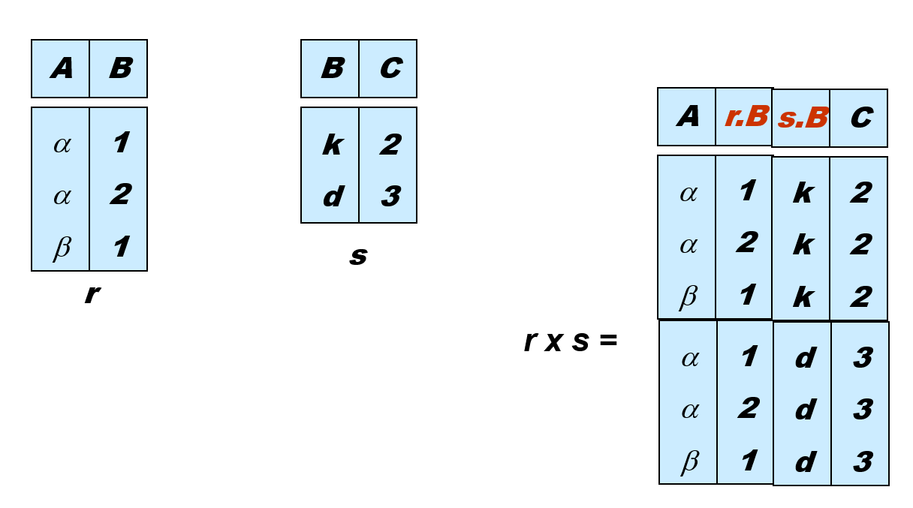
    

### Natural Join

- 自然连接记作：$r \bowtie s$
- 令 $r, s$ 的模式分别为 $R, S$，那么 $r \bowtie s$ 的结果为一个在模式 $R \cup S$ 上的关系，按照以下方法获得：
    - 考虑分别来自 $r, s$ 的每一对元组 $t_r, t_s$
    - 如果 $t_r, t_s$ 在 $R \cap S$ 的每个属性上的取值相同，则将元组 $t$ 加入到结果中，其中 $t$ 有与 $t_r$ 在 $r$ 上，以及 $t_s$ 在 $s$ 上相同的值

- $r, s$ 必须有共同属性（名称、域对应相同）
- 扩展：**Theta 连接**，记作：$r \bowtie_\theta = \sigma_\theta(r \times s)$，其中 $\theta$ 是关于模式上属性的谓词

??? example "例子"

    

        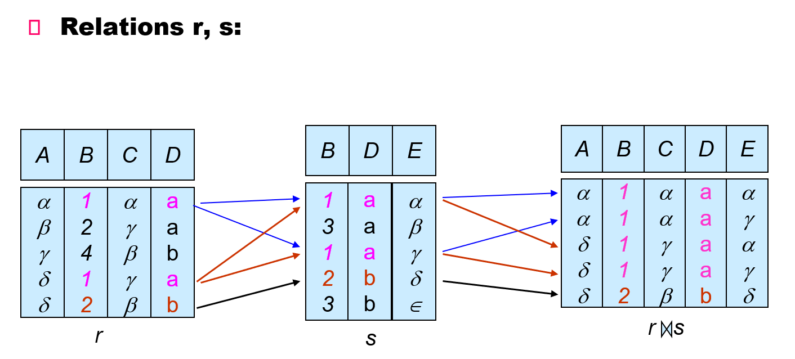
    

### Set Operations

要想正确执行集合运算，需要作为操作数的两个关系 $r, s$ 是**可兼容的**(compatible)，即

- $r, s$ 必须具备相同的**元数**(arity)（即相同数量的属性）
- 当属性有相关类型时，对每个 $i$ 而言，$r, s$ 的第 $i$ 个属性的类型必须相同

集合运算包括：**并**(union)、**交**(intersection)、**差**(set-difference)

#### Union

- 并运算记作：$r \cup s = \{t\ |\ t \in r \text{ or } t \in s\}$
- 上述运算的合法条件为：两个关系必须是可兼容的，具体指

??? example "例子"

    

        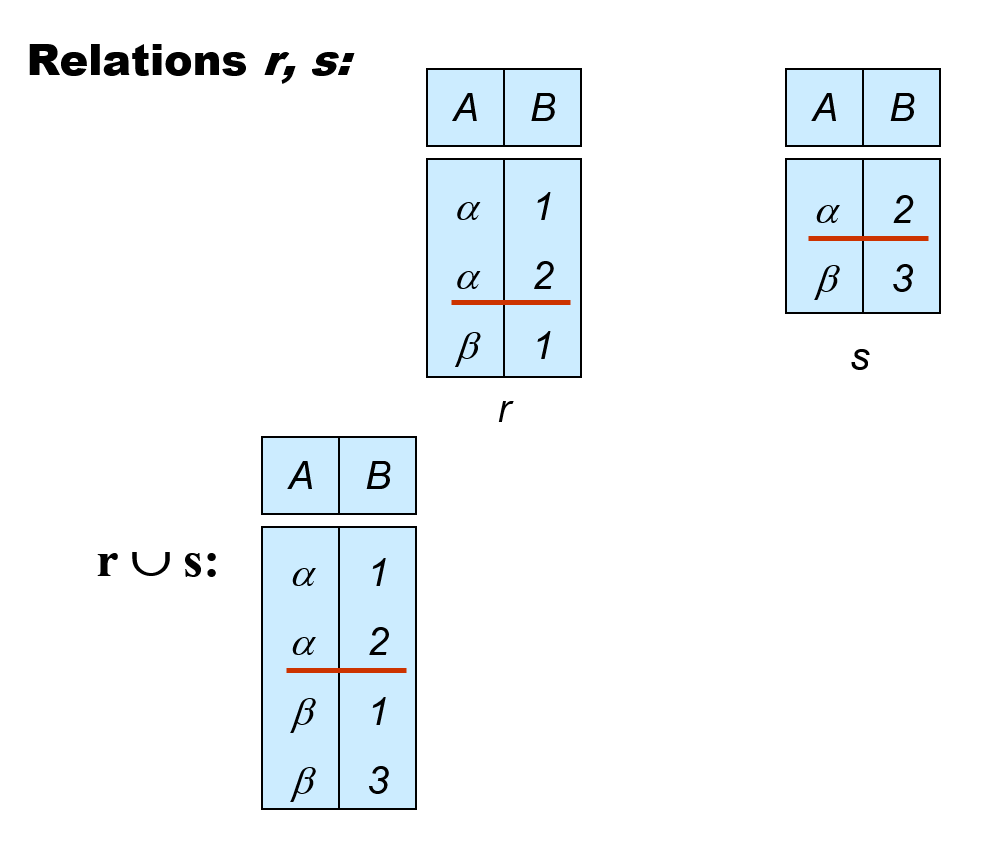
    

#### Intersection

- 交运算记作：$r \cap s = \{t\ |\ t \in r \text{ and } t \in s\}$
- $r \cap s = r - (r - s)$

??? example "例子"

    

        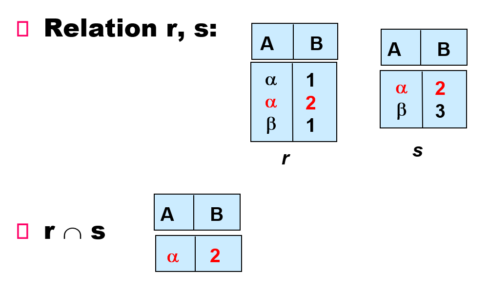
    

#### Set Difference

- 差运算记作：$r - s = \{t\ |\ t \in r \text{ and } t \notin s\}$

??? example "例子"

    

        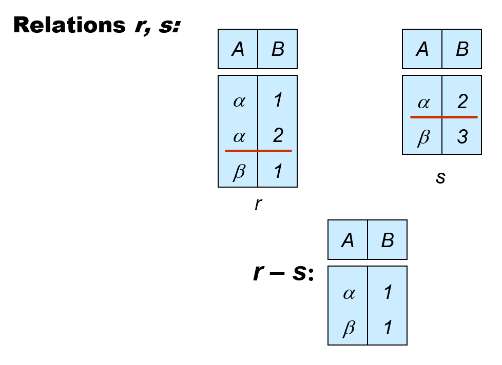
    

### Assignment

赋值运算符 $\leftarrow$ 提供了一种表达复杂查询的便捷方法

- 可以将查询写成一个顺序的程序，里面包含了一系列的赋值语句，随后跟上一个表达式，其值作为查询的结果
- 赋值必须用于临时的关系变量，因为如果用在永久变量上的话就是对数据库的修改

??? example "例子"

    

        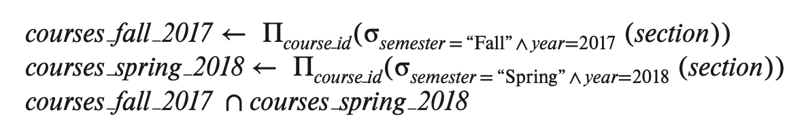
    

### Rename

- 命名运算记作：$\rho_X(E)$ 返回在名称 $X$ 下的表达式 $E$
- 如果 $E$ 的元数为 $n$，那么 $\rho_{X(A_1, A_2, \dots, A_n)}(E)$ 返回在名称 $X$ 下的表达式 $E$，并且属性名改为 $A_1, A_2, \dots, A_n$
- 虽然也可以使用位置序号来表示属性（比如 $\$1, \$2, \dots$），但这种方式很不方便，因为它无法直观反映属性的名称

??? example "例子"

    给定一家银行的数据库：

    

        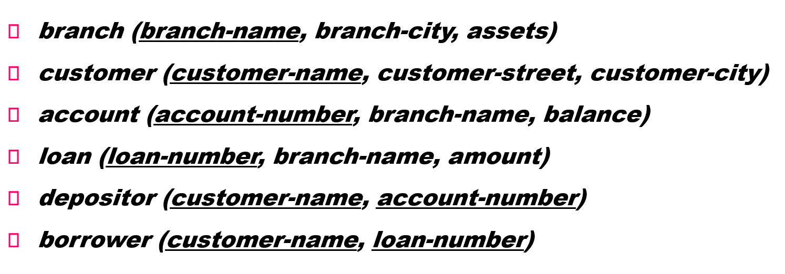
    

    问题：

    

        
    

## Extended Relational-Algebra-Operations

### Divide

- 除法运算记作：$r \div s$
- 性质：令 $q = r \div s$，那么 $q$ 是最大的关系，满足 $q \times s \subseteq r$
- 定义：$r \div s = \prod_{R - S}(r) - \prod_{R - S}((\prod_{R - S}(r) \times s) - \prod_{R - S, S}(r))$
- 解释：
    - $\prod_{R - S, S}(r)$ 仅重排了 $r$ 的属性
    - $\prod_{R - S}((\prod_{R - S}(r) \times s) - \prod_{R - S, S}(r))$ 找出 $\prod_{R - S}(r)$ 的 $t$，满足对于某些元组 $u \in s, tu \notin r$
- 另一种表述：$$r \div s = \{t\ |\ t \in \prod_{R - S}(r) \wedge \forall u \in s(tu \in r)\}$
- 商来自于 $\prod_{R-S}(r)$，并且其元组$t, s$ 所有元组的拼接被 $r$ 覆盖
- 该运算适用于带有 "for all" 字样的查询语句

??? example "例子"

    

        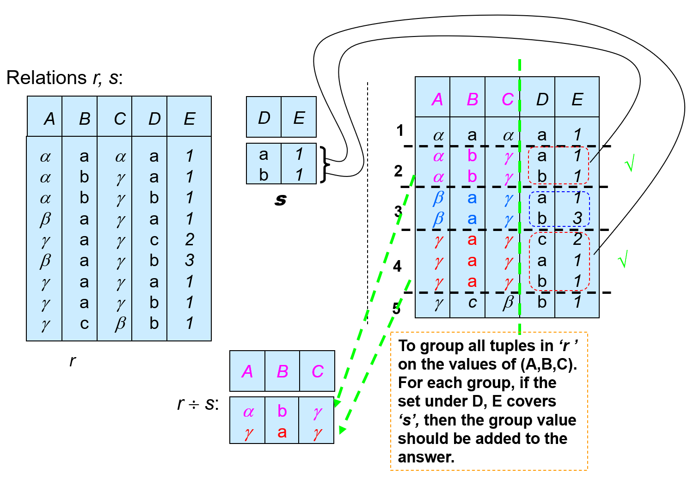
    

### Aggregate Functions and Operations

- **聚合函数**(aggregate function)：接受一组值，返回单个值，包括：
    - avg：平均值
    - min：最小值
    - max：最大值
    - sum：求和
    - count：计数
- **聚合运算**(aggregate operation)的格式为：

    $$
    _{G_1, G_2, \dots, G_n} {\Large g}_{F_1(A_1), F_2(A_2), \dots, F_n(A_n)}(E)
    $$

    其中：

    - $E$ 是任意的关系代数表达式
    - $G_1, G_2, \dots, G_n$ 为一组聚集在一起的属性（可以为空）
    - $F_i$：聚合函数
    - $A_i$：属性名

- 聚合的结果**没有**名称
    - 可以用重命名操作为结果赋予名称
    - 方便起见，我们将重命名作为聚合运算的一部分，如下面表达式中的 as 子句

    $$
    _{G_1, G_2, \dots, G_n} {\Large g}_{F_1(A_1), F_2(A_2), \dots, F_n(A_n) \text{ as new\_name}}(E)
    $$

??? example "例子"

    

        
    

### Outer Join

- **外连接**(outer join) ⟗ 是连接运算的扩展，用于避免信息的缺失
- 先计算连接，然后将来自一个关系中的，但没有与另一个关系有匹配的元组的元组加入到连接结果中

??? example "例子"

    

        
    

    

        
    

### Null Values

- 元组中可能存在空值，用 null 表示那些缺失的属性值
- null 表示值是**未知的**或**不存在**
- 任何包含 null 的算术表达式的结果为 null
- 聚合函数仅仅忽略 null 值，它也有可能返回 null。我们遵循 SQL 在处理 null 值的语义
- 对于重复的删除(elimination)和分组(grouping)，null 被看作一般的值，并且两个 null 被看作是相同的值
    - 也可以看作不同的值，但前者是 SQL 的规定，我们还是将它们看作相同的值
- 所有包含 null 的比较会返回一个特殊的真值 unknown（未知）
- 关于 unknown 的逻辑运算
    - OR
        - (unknown or true) = true
        - (unknown or false) = unknown
        - (unknown or unknown) = unknown
    - AND
        - (true and unknown) = unknown
        - (false and unknown) = false
        - (unknown and unknown) = unknown
    - NOT: (not unknown) = unknown
    - 当谓词求解得到 unknown，那么选择谓词的结果被看作 false

## Modification of the Database

可通过删除(deletion)、插入(insertion)和更新(updating)运算修改数据库的内容，这些运算都要用赋值运算符表示。

### Deletion

- 删除请求的表述与查询类似，除了将选择出来的元组展示给用户的操作，变为从数据库中移除这些元组
- 只能删除整一个元组，不能只删除元组中的部分属性
- 用关系代数表示删除：$r \leftarrow r - E$，其中 $r$ 为关系，$E$ 为关系代数查询
- 

??? example "例子"

    

        
    

### Insertion

- 要想在关系中插入数据，我们需要：
    - 指明被插入的元组
    - 编写一个查询，其结果是一组将被插入的元组

- 用关系代数表示插入：$r \leftarrow r \cup E$，其中 $r$ 为关系，$E$ 为关系代数表达式
- 插入单个元组时，$E$ 是一个仅包含一个元组的常量关系

??? example "例子"

    

        
    

### Updating

- 更新操作可仅改变元组中的某一个值，而无需改变整个元组的值
- 使用广义投影运算来实现：$r \leftarrow \prod_{F_1, F_2, \dots, F_n}(r)$
- 其中 $F_i$ 有两种表示的可能：
    -  $r$ 中没有更新的第 $i$ 个属性
    - 如果对应属性要更新，那么 $F_i$ 是一个包含常量和 $r$ 的属性的表达式，用于将新的值赋给属性

??? example "例子"

    

        
    
