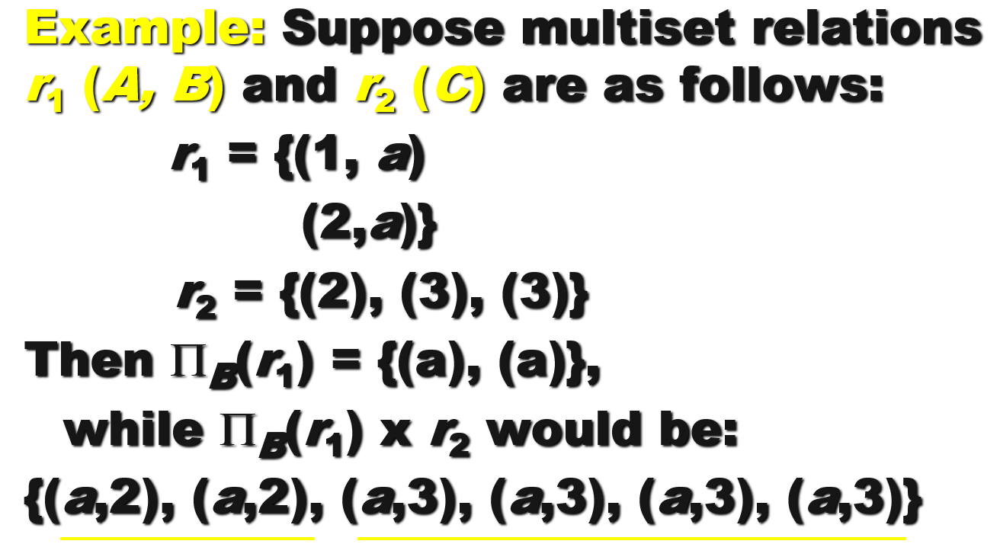

# Lec 3: Introduction to SQL

!!! warning "注"

    - 数据库系统笔记中出现的所有 SQL 关键字一律采用大写字母表示（SQL 关键字大小写不敏感），表示强调。
    - 所有的 SQL 语句都以分号 `;` 作为结尾

## Overview of the SQL Query Language

**SQL**（Structured Query Language，结构化查询语言）：一种被广泛使用的关系型数据库语言。

- 虽然它叫做“查询语言”，但是它的功能绝不仅限于查询数据库，还包括定义数据结构、修改数据库内的数据、指定安全约束等等。
- 不同的 SQL 实现会有一些细节上的不同，或者仅支持 SQL 的部分子集功能
- SQL 分为以下几部分：
    - **DDL**（data-definition language，数据定义语言）：提供定义关系模式、删除关系和修改关系模式的命令
    - **DML**（data-manipulation language，数据操纵语言）：提供了从数据库获取信息、以及对数据库内的元组增删改等能力
    - **完整性**：DDL 提供了指定完整性约束的命令
    - **视图定义**：DDL 提供定义视图的命令
    - **事务控制**：指定事务起始点和终点的命令
    - **嵌入式 SQL** 和**动态 SQL**：定义如何将 SQL 语句嵌入于通用目的的编程语言中
    - **授权**：指定访问关系和视图的权限的命令


## SQL Data Definition

SQL DDL 指定以下的信息：

- 每个关系的**模式**
- 关联每个属性的类型值
- **完整性约束**
- 用于维护关系的**索引**
- 每个关系的**安全**和**授权**信息
- 每个关系在硬盘上的物理**存储**结构


### Basic Types

SQL 标准支持很多内建类型，包括：

- `char(n)`：定长字符串，由用户指定长度 `n`
    - 当比较两个 `char` 类型的值时，如果它们的长度不同，那么会给短的那个加上额外的空格，使得它们一样长
- `varchar(n)`：变长字符串，由用户指定最大长度 `n`
    - 当比较 `char` 类型和 `varchar` 类型时，有可能会在 `varchar` 值上添加额外的空格，但也有可能不会，这取决于系统。因此即使用 `char` 和 `varchar` 表示两个相同的字符串，比较结果也有可能是 `false`。建议一直使用相同类型的值比较
    - SQL 还提供了 `nvarchar` 类型以表示 Unicode 编码的多语言数据，但是很多数据库支持用 `varchar` 表示 Unicode 编码（尤其是 UTF-8）的字符
- `int`：整数（实际上是依赖于机器的整数的有限子集）
- `smallint`：较小的整数（实际上是依赖于机器的整数的有限子集）
- `numeric(p, d)`：定点(fixed point)数，由用户指定位数 `p`（包括符号位）以及十进制小数点右侧的位数 `d`
- `real` / `double precision`：分别对应单精度浮点数和双精度浮点数，其精度依赖于机器
- `float(n)`：浮点数，由用户指定最低精度位数 `n`
- `Null`：适用于所有数据类型。但可以在声明属性时禁用 Null 值
- `date`：日期，包含年（4位数字）月日，比如 `2025-02-25`
- `time`：时间，包含时分秒，比如 `10:47:20`、`10:47:20.75`
- `timestamp`：时间戳，即日期 + 时间，比如 `2025-02-25 10:47:20.75`
    - 在 SQL Server 2000 里，这个类型被称为 `datetime`

SQL中有许多函数，用于处理各种类型的数据及其**类型转换**，但各数据库系统中函数的标准化程度不高。

- 不同的函数：
    - SQL Server：`char(65)`, `substring(s, start, length)`, `getdate()`, `datalength('abc')`, 
    - Oracle：`chr(65)`, `substr(s, start, length)`, `sysdate`, `length('abc')`
- 相同的函数：`abs()`、`exp()`、`round()`、`sin()`、`cos()`


### Basic Schema Definition


- 用 `CREATE TABLE` 语句定义 SQL 关系：

    ```sql
    CREATE TABLE r
        (A1 D1, 
        A2 D2, 
        ..., 
        An Dn,
        <integrity constraints_1>,
        ...,
        <integrity constraints_k>);
    ```

    - `r` 是关系的名称
    - `Ai` 是关系 `r` 的模式中的一个属性名，而 `Di` 是 属性 `Ai` 值域的数据类型
    - 可用的完整性约束有（SQL 会阻止不满足完整性约束的更新）：
        - `PRIMARY KEY(A_j1, A_j2, ..., A_jm)`
            - 为属性声明主键后，该属性自动被规定为非空和唯一
            - 虽然是可选的，但建议每个关系都要加一个主键
        - `FOREIGN KEY(A_k1, A_k2, ..., A_kn) REFERENCES s`
            - 外键从关系 `s` 中参考而来
        - `NOT NULL`：不允许属性出现空值

- 用 `DROP TABLE` 语句从 SQL 数据库中删除关系

    ```sql
    DROP TABLE r;
    ```

    - 另一种类似的方法是使用 `DELETE FROM r;`，该语句的结果是删除 `r` 内的所有元组，即清空关系 `r` 的内容，但不删除 `r` 本身；而前者会直接删掉 `r` 本身

- 用 `ALTER TABLE` 已有关系中的属性
    - 增加属性：`#!sql ALTER TABLE r ADD A D;`
    - 删除属性：`#!sql ALTER TABLE r DROP A;`
        - 很多数据库系统不支持删除属性的操作，尽管它们会支持删除整个表的操作


## Basic Structure of Selection

一条典型的 SQL 查询语句格式为：

```sql
SELECT A1, A2, ..., An
FROM r1, r2, ..., rm
WHERE P
```

- 它等价于以下关系代数表达式：

    $$
    \prod_{A_1, A_2, \dots, A_n} (\sigma_P(r_1 \times r_2 \dots \times r_m))
    $$

- 查询结果也是一个关系
- 查询语句的运算顺序为：`FROM`（笛卡尔积） -> `WHERE`（选择谓词） -> `SELECT`（指定属性）
    - SQL 的实际实现不会遵循上述方式，为了优化求解过程而仅生成满足 `WHERE` 子句谓词的笛卡尔积的元素


### SELECT Clause

- 需要注意的是，SQL 语句不允许名称中出现 `-` 字符，请用 `_` 替代
- 并且 SQL 对名称**大小写不敏感**(case insensitive)，也就是说 SQL 将同一字符的大小写形式看作是同一个字符
- SQL 允许关系和查询结果中出现**重复**记录(duplicates)（默认使用 `ALL` 关键字，因为消除重复记录太耗费时间了）。要想强制消除重复记录，可以在 `SELECT` 后使用 `DISTINCT` 关键字，即 `SELECT DISTINCT ...`
- 使用 `*` 表示选择所有属性，比如 `#!sql SELECT * FROM r` 表示选择 `r` 中的所有属性
- SQL 允许查询语句中对常量或属性使用简单的算术表达式，包括加减乘除，对应关系代数的**广义投影**(generalized projection)
    - 比如 `#!sql SELECT ID, name, salary * 1.05 FROM instructor;`


### WHERE Clause

- `WHERE` 从句指定结果必须要满足的条件，对应于关系代数的**选择谓词**(selection predicate)
- 在 `WHERE` 从句的比较表达式内，可以使用逻辑连接词 `AND`、`OR`、`NOT` 以及 `BETWEEN`（用于指定范围）

??? example "例子"

    寻找工资在 $90,000 到 $100,000 之间（闭区间）的讲师

    ```sql
    SELECT name FROM instructor
    WHERE salary BETWEEN 90000 AND 100000;
    ```


### FROM Clause

- `FROM` 从句列出包含在查询语句内的关系，对应于关系代数的**笛卡尔积**(Cartesian product)（如果指定多个关系的话）
- 如果查询语句的多个关系中有相同的属性名，且都要在查询语句中用到，那么在属性名前需要加上关系名和点号作为前缀，比如：

```sql
SELECT name, course_id
FROM instructor, teaches
WHERE instructor.ID = teaches.ID;
```


### Rename Operations

- 对于列名，可以使用 `AS` 子句为查询结果中某（些）列修改列名
    - 在 SQL Server 中，允许使用 `new-name = column-expression` 修改列名，比如：

    ```sql
    SELECT name, course_id
    FROM instructor, teaches
    WHERE instructor.ID = teaches.ID and dept_name = 'Biology';
    ```  

- 对于关系名，可以在 `FROM` 子句中使用 `AS` 子句，为关系声明元组变量。这样做的好处是：
    - 既能使关系名的表达更为简洁，比如：

        ```sql
        SELECT T.name, S.course_id
        FROM instructor as T, teaches as S
        WHERE T.ID = S.ID;
        ```

    - 也便于区分名称（可以为相同的关系赋予不同的名称，从而做到比较同一张表内的记录），比如：

        ```sql
        SELECT DISTINCT T.name
        FROM instructor as T, instructor as S
        WHERE T.salary > S.salary and S.dept_name = 'Biology';
        ```


### String Operations

在字符串的比较中，SQL 包含了一种**字符串匹配运算符**(string-matching operator)。我们可以使用**通配符**(wildcards)来描述字符串的模式(pattern)，以实现模糊匹配（置于 `WHERE` 子句中，且必须与 `LIKE` 子句连用），包括：

- `%`：匹配任意字符串（类似文件系统的 `*`）
- `_`：匹配任意单个字符（类似文件系统的 `?`）

??? example "例子"

    寻找建筑物名称带子字符串 "Waston" 的部门：

    ```sql
    SELECT dept_name
    FROM department
    WHERE building LIKE '%Watson%';
    ```

如果希望字符串模式中支持匹配这些通配符，需要加上 `\` 转义符，使其成为一般字符。

SQL 还支持以下字符串操作：

- **拼接**(concatenation)：运算符为 `||`
    - 举例：`#!sql SELECT ‘教师名=’ || name FROM instructor WHERE ...;`
- 大小写转换，有函数 `lower()`、`upper()`
- 获取字符串长度，提取子字符串，有函数 `len()`、`substr()`


### Ordering

- 在 SQL 查询语句中，可以使用 `ORDER BY` 子句为查询结果排序
- 使用关键字 `desc`、`asc` 分别指定降序和升序排序，默认使用升序

??? example "例子"

    ```sql
    SELECT * 
    FROM instructor  	
    ORDER BY salary desc, name asc;
    ```


### Duplicates

虽然在传统的关系理论中，不会出现重复数据，但是在实践中，有时我们需要重复的数据。因此，这里引入**多重集**(multiset)的概念：给定多重集关系 $r_1, r_2$，

- $\sigma_\theta(r_1)$：如果 $r_1$ 中有 $c_1$ 份元组 $t_1$ 个副本，且 $t_1$ 满足选择 $\sigma_\theta$，那么结果就会包含这 $c_1$ 个副本
- $\prod_A(r)$：对于 $r_1$ 中元组 $t_1$ 的每个副本，那么在 $\prod_A(r_1)$ 内存在一个元组 $\prod_A(t_1)$ 的副本，其中 $\prod_A(t_1)$ 表示单个元组 $t_1$ 的投影
- $r_1 \times r_2$：如果在 $r_1$ 有 $c_1$ 个副本的元组 $t_1$，在 $r_2$ 有 $c_2$ 个副本的元组 $t_2$，那么在 $r_1 \times r_2$ 中就有 $c_1 \cdot c_2$ 个元组 $t_1 t_2$ 的副本

??? example "例子"

    <div style="text-align: center">
        
    </div>

SQL 的查询语句默认支持上述多重集的运算符。如果不希望出现重复记录，则添加 `DISTINCT` 关键字


## Set Operations

- SQL 支持关系代数中的集合运算符 $\cup, \cap, \bar{ }$，分别用 `UNION`、`INTERSECT`、`EXCEPT` 表示
- 使用这些运算符后会自动消除重复记录（因为集合不允许存在重复记录）
- 如果想要保留重复记录，需要在集合运算关键字后加上 `ALL` 关键字，即 `UNION ALL`、`INTERSECT ALL`、`EXCEPT ALL`。假如有一个元组，在关系 r, s 内分别出现了 m, n 次，那么该元组在
    - 关系 `r UNION ALL s` 中出现 m + n 次
    - 关系 `r INTERSECT ALL s` 中出现 min(m, n) 次
    - 关系 `r EXCPET ALL s` 中出现 max(0, m - n) 次

- 在 Oracle 中，可以使用 `UNION`、`UNION ALL`、`INTERSECT`、`MINUS`，但是没有 `INTERSECT ALL` 和 `MINUS ALL`
- 在 SQL Server 2000 中，仅支持 `UNION` 和 `UNION ALL`


## Null Values

- 元组的某些属性可能是空值，记作 null
- null 表示未知值或不存在的值
- 任何包含 null 的算术表达式的结果为 null
- 任何包含 null 的比较结果为 unknown
- SQL 的逻辑表达式的结果有 3 种：true、unknown、false
    - OR
        - (unknown or true) = true
        - (unknown or false) = unknown
        - (unknown or unknown) = unknown
    - AND
        - (unknown and true) = unknown
        - (unknown and false) = false
        - (unknown and unknown) = unknown
    - NOT
        - (not unknown) = unknown

- 如果 `WHERE` 子句的谓词的求解结果为 unknown，SQL 会看作 false
- 使用谓词 `IS NULL` 和 `IS NOT NULL` 来检查空值
    - 不能使用 `... = NULL` 比较，因为这样的比较结果恒为 null，没有任何意义

- 如果谓词 P 的求解结果为 unknown，那么 `P IS UNKNOWN` 的求解结果为 true
- 除了 count(*) 之外的聚合函数会忽略属性中存在 null 值的记录
- 如果聚合函数的参数包含的记录均为空值，那么返回 null


## Aggregate Functions

**聚合函数**(aggregate functions)一般作用在关系中的某列的一组值上，然后返回一个值。有以下几种聚合函数：

- `avg(col)`：平均值
- `min(col)`：最小值
- `max(col)`：最大值
- `sum(col)`：求和
- `count(col)`：计数（值的个数）

聚合函数除了可以紧跟 `SELECT` 之后（类似列名），也可以放在 `HAVING` 子句之后，作为筛选条件（类似 `WHERE` 子句）。

!!! note "注"

    - 在 `SELECT` 子句中，但是不在聚合函数内的属性必须出出现在 `GROUP BY` 分组列表中
    - 在 `HAVING` 子句中，但是不在聚合函数内的属性必须出出现在 `GROUP BY` 分组列表中

??? example "例子"

    TBD

!!! abstract "总结"

    - 完整的查询语句格式为：

        ```sql
        SELECT <[DISTINCT] c1, c2, ...> FROM <r1, ...>
        [WHERE <condition>]
        [GROUP BY <c1, c2, ...> [HAVING <condition2>]]
        [ORDER BY <c1 [DESC][, c2[DESC|ASC], ...]>]
        ```

    - 查询语句的执行顺序为：`FROM` -> `WHERE` -> `GROUP`（聚合函数）-> `HAVING` -> `SELECT` -> `ORDER BY`
    - 在 `HAVING` 子句内的谓词会在分组(groups)形成**后**应用，但是在 `WHERE` 子句内的谓词会在分组形成**前**应用
    - 聚合函数不能直接用在 `WHERE` 子句内


## Nested Subqueries

SQL 提供了一个嵌套子查询(nested subqueries)的机制。**子查询**(subquery)是指嵌套在其他查询语句中的查询语句，语法大致为：

```sql
SELECT ... FROM ... WHERE ...
                   IN (SELECT ... FROM ... WHERE ...)
```


### Set Comparison

下面介绍一些与集合比较相关的 SQL 子句：

- `SOME` 子句：
    - 格式：`C <comp> some r`，其中 `<comp>` 是比较运算符
    - 等价于：$\exists/ t \in r (C <comp> r)$
    - `= some` $\equiv$ `in`，但 `!= some` $\not \equiv$ `not in`

- `ALL` 子句：
    - 格式：`C <comp> ALL r`
    - 等价于：$\forall t \in r (C <comp> t)$
    - `!= ALL` $\equiv$ `not in`，但 `= ALL` $\not \equiv$ `in`

??? example "例子"

    === "例1"

        寻找工资大于至少一位来自生物学院的老师的所有老师名字：

        ```sql
        select name
        from instructor
        where salary > some(
                                select salary
                                from instructor
                                where dept_name = 'Biology'
                           );

        ```

    === "例2"

        寻找工资大于所有来自生物学院的老师的所有老师名字：

        ```sql
        select name
        from instructor
        where salary > ALL(
                                select salary
                                from instructor
                                where dept_name = 'Biology'
                           );

        ```  

### Empty Relation Testing

`EXISTS` 构造器会在子查询返回结果非空时返回 true，否则返回 false。而 `NOT EXISTS` 构造器的结果相反。

??? example "例子"

    寻找选上生物学院提供的所有课程的学生。

    ```sql
    select DISTINCT S.ID, S.name
    from student as S
    where not exists(
                        (
                            select course_id
                            from course
                            where dept_name = ’Biology’
                        )
                        except
                        (
                            select T.course_id
                            from takes as T
                            where S.ID = T.ID
                        )
                    );

    ```


### Absent Duplicate Tuples Testing

`UNIQUE` 构造器用于检验子查询的结果是否存在重复的元组，若不存在重复元组则返回 true，否则返回 false，可作为 `WHERE` 子句的判断条件。而 `NOT UNIQUE` 构造器的行为与之相反。

不过，这两类构造器在 Oracle 8 和 SQL Server 7 中不支持。


## Modification of the Database
