# Lec 3: Introduction to SQL

??? abstract "核心知识"

    - 表级的 SQL 操作（创建、删除、修改）
    - SQL **查询**语句的各个部分，包括：`SELECT`、`FROM`、`WHERE`、`ORDER BY`、`GROUP BY` 等等
    - 关于 NULL 值
    - 聚合函数
    - 嵌套子查询
    - 记录级的 SQL 操作（插入、更新、删除）

!!! warning "注"

    - 数据库系统笔记中出现的所有 SQL 关键字一律采用大写字母表示（SQL 关键字大小写不敏感），表示强调。
    - 所有的 SQL 语句都以分号 `;` 作为结尾
    - SQL 的注释语句为：`#!sql /* comment1 */` 或 `#!sql -- comment2`
    - SQL 的不等号为 `!=` 或 `<>`

??? info "SQL 历史（摘自 CMU 15-445/645 Fall 2024 的课件）"

    <div style="text-align: center">
        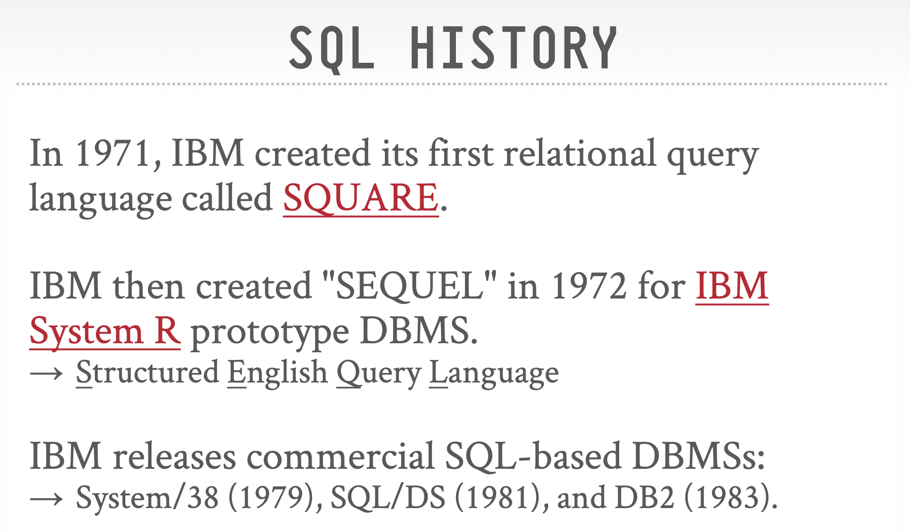
    </div>

    <div style="text-align: center">
        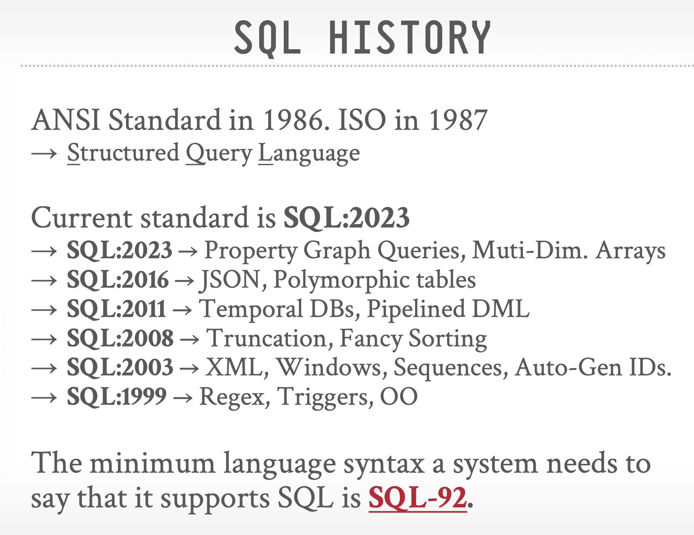
    </div>


## Overview of the SQL Query Language

**SQL**（Structured Query Language，结构化查询语言）：一种被广泛使用的关系型数据库语言。

- 虽然它叫做“查询语言”，但是它的功能绝不仅限于查询数据库，还包括定义数据结构、修改数据库内的数据、指定安全约束等等。
- 不同的 SQL 实现会有一些细节上的不同，或者仅支持 SQL 的部分子集功能
- SQL 分为以下几部分：
    - **DDL**（data-definition language，数据定义语言）：提供定义关系模式、删除关系和修改关系模式的命令
    - **DML**（data-manipulation language，数据操纵语言）：提供了从数据库获取信息、以及对数据库内的元组增删改等能力
    - **完整性**：DDL 提供了指定完整性约束的命令
    - **视图定义**：DDL 提供定义视图的命令
    - **事务控制**：指定事务起始点和终点的命令
    - **嵌入式 SQL** 和**动态 SQL**：定义如何将 SQL 语句嵌入于通用目的的编程语言中
    - **授权**：指定访问关系和视图的权限的命令


## SQL Data Definition

SQL DDL 指定以下信息：

- 每个关系的**模式**
- 每个属性的**值域**
- **完整性约束**
- 用于维护关系的**索引**
- 每个关系的**安全**和**授权**信息
- 每个关系在硬盘上的物理**存储**结构


### Basic Types

SQL 标准支持很多内建类型，包括：

- `char(n)`：定长字符串，由用户指定长度 `n`
    - 当比较两个 `char` 类型的值时，如果它们的长度不同，那么会给短的那个加上额外的空格，使得它们一样长
- `varchar(n)`：变长字符串，由用户指定最大长度 `n`
    - 当比较 `char` 类型和 `varchar` 类型时，有可能会在 `varchar` 值上添加额外的空格，但也有可能不会，这取决于系统。因此即使用 `char` 和 `varchar` 表示两个相同的字符串，比较结果也有可能是 `false`。建议一直使用相同类型的值比较
    - SQL 还提供了 `nvarchar` 类型以表示 Unicode 编码的多语言数据，但是很多数据库支持用 `varchar` 表示 Unicode 编码（尤其是 UTF-8）的字符
- `int`：整数（实际上是依赖于机器的整数的有限子集）
- `smallint`：较小的整数（实际上是依赖于机器的整数的有限子集）
- `numeric(p, d)`：定点(fixed point)数，由用户指定位数 `p`（包括符号位）以及十进制小数点右侧的位数 `d`
- `real` / `double precision`：分别对应单精度浮点数和双精度浮点数，其精度依赖于机器
- `float(n)`：浮点数，由用户指定最低精度位数 `n`
- `Null`：适用于所有数据类型。但可以在声明属性时禁用 Null 值
- `date`：日期，包含年（4位数字）月日，比如 `2025-02-25`
- `time`：时间，包含时分秒，比如 `10:47:20`、`10:47:20.75`
- `timestamp`：时间戳，即日期 + 时间，比如 `2025-02-25 10:47:20.75`
    - 在 SQL Server 2000 里，这个类型被称为 `datetime`

SQL中有许多函数，用于处理各种类型的数据及其**类型转换**，但各数据库系统中函数的标准化程度不高。

- 不同的函数：
    - SQL Server：`char(65)`, `substring(s, start, length)`, `getdate()`, `datalength('abc')`, 
    - Oracle：`chr(65)`, `substr(s, start, length)`, `sysdate`, `length('abc')`
- 相同的函数：`abs()`、`exp()`、`round()`、`sin()`、`cos()`


### Basic Schema Definition


- 用 `CREATE TABLE` 语句定义 SQL 关系：

    ```sql
    CREATE TABLE r
        (A1 D1, 
        A2 D2, 
        ..., 
        An Dn,
        <integrity constraints_1>,
        ...,
        <integrity constraints_k>);
    ```

    - `r` 是关系的名称
    - `Ai` 是关系 `r` 的模式中的一个属性名，而 `Di` 是 属性 `Ai` 值域的数据类型
    - 可用的完整性约束有（SQL 会阻止不满足完整性约束的更新）：
        - `PRIMARY KEY(A_j1, A_j2, ..., A_jm)`
            - 为属性声明主键后，该属性自动被规定为非空和唯一
            - 虽然是可选的，但建议每个关系都要加一个主键
        - `FOREIGN KEY(A_k1, A_k2, ..., A_kn) REFERENCES s`
            - 外键从关系 `s` 中参考而来
        - `NOT NULL`：不允许属性出现空值

- 用 `DROP TABLE` 语句从 SQL 数据库中删除关系

    ```sql
    DROP TABLE r;
    ```

    - 另一种类似的方法是使用 `DELETE FROM r;`，该语句的结果是删除 `r` 内的所有元组，即清空关系 `r` 的内容，但不删除 `r` 本身；而前者会直接删掉 `r` 本身

- 用 `ALTER TABLE` 已有关系中的属性
    - 增加属性：`#!sql ALTER TABLE r ADD A D;`
    - 删除属性：`#!sql ALTER TABLE r DROP A;`
        - 很多数据库系统不支持删除属性的操作


## Basic Structure of Selection

一条典型的 SQL 查询语句格式为：

```sql
SELECT A1, A2, ..., An
FROM r1, r2, ..., rm
WHERE P;
```

- 它等价于以下关系代数表达式：

    $$
    \Pi_{A_1, A_2, \dots, A_n}(\sigma_P(r_1 \times r_2 \dots \times r_m))
    $$

- 查询结果也是一个关系
- 查询语句的**运算顺序**为：`FROM`（笛卡尔积） -> `WHERE`（选择谓词） -> `SELECT`（指定属性（投影））
    - SQL 的实际实现不会遵循上述方式，为了优化求解过程而仅生成满足 `WHERE` 子句谓词的笛卡尔积的元素（具体可见“[查询优化](12.md)”一讲）


### SELECT Clause

!!! note "注"

    - 需要注意的是，SQL 语句不允许名称中出现 `-` 字符，请用 `_` 替代
    - 并且 SQL 对关键字**大小写不敏感**(case insensitive)，也就是说 SQL 将同一字符的大小写形式看作是同一个字符
    - SQL 允许关系和查询结果中出现**重复**记录(duplicates)（默认使用 `ALL` 关键字，因为消除重复记录太耗费时间了）。要想强制消除重复记录，可以在 `SELECT` 后使用 `DISTINCT` 关键字，即 `SELECT DISTINCT ...`
    - 使用 `*` 表示选择所有属性，比如 `#!sql SELECT * FROM r` 表示选择 `r` 中的所有属性
    - SQL 允许查询语句中对常量或属性使用简单的算术表达式，包括加减乘除，对应关系代数的**广义投影**(generalized projection)
        - 比如 `#!sql SELECT ID, name, salary * 1.05 FROM instructor;`


### WHERE Clause

- `WHERE` 从句指定结果必须要满足的条件，对应于关系代数的**选择谓词**(selection predicate)
- 在 `WHERE` 从句的比较表达式内，可以使用逻辑连接词 `AND`、`OR`、`NOT` 以及 `BETWEEN`
    - 其中 `BETWEEN` 用于指定一个值的**闭区间**范围，也就是说 `#!sql WHERE x BETWEEN a AND b` 就是 a <= x <= b。
    - 对应地有 `NOT BETWEEN`（但是**开区间**）：`#!sql WHERE x NOT BETWEEN a AND b` 对应 x < a 或 x > b

    ???+ example "例子"

        寻找工资在 $90,000 到 $100,000 之间（闭区间）的讲师

        ```sql
        SELECT name FROM instructor
        WHERE salary BETWEEN 90000 AND 100000;
        ```

- 在比较表达式中，可以使用**行构造器**(row constructor)，同时进行多个属性（位于同一个元组中）的比较，比较顺序按**词典序**(lexicographically)排序。但一些 SQL 实现（比如 Oracle）不支持这一语法

    ???+ example "例子"

        ```sql
        SELECT name, course_id
        FROM instructor, teaches
        WHERE instructor.ID = teaches.ID AND dept_name = 'Biology';
        ```

        可以被重写为：

        ```sql
        SELECT name, course_id
        FROM instructor, teaches
        WHERE (instructor.ID, dept_name) = (teaches.ID, 'Biology');
        ```


### FROM Clause

- `FROM` 从句列出包含在查询语句内的关系，对应于关系代数的**笛卡尔积**(Cartesian product)（如果指定多个关系的话）
- 如果查询语句的多个关系中有相同的属性名，且都要在查询语句中用到，那么在属性名前需要加上关系名和点号作为前缀，比如：

    ```sql
    SELECT name, course_id
    FROM instructor, teaches
    WHERE instructor.ID = teaches.ID;
    ```


### Rename Operations

- 可以在 `SELECT` 或 `FROM` 子句中使用 `AS` 子句为属性重命名，语法为：`#!sql old_name AS new_name;`

    ???+ example "例子"

        ```sql
        SELECT name AS instructor_name, course_id
        FROM instructor, teaches
        WHERE instructor.ID = teaches.ID;
        ```  

- 适用场景：
    - 两个在 `FROM` 子句里的关系具有同名属性，这样的话查询结果就可能包含重复的属性名
    - 如果在 `SELECT` 子句中使用算术表达式，计算结果需要被赋予一个新名称
    - 有时我们有手动改变结果属性名称的需求，比如：
        - 缩短过长的属性名（~~偷懒小妙招~~）

            ```sql
            SELECT T.name, S.course_id
            FROM instructor AS T, teaches AS S
            WHERE T.ID = S.ID;
            ```

        - 比较相同关系中的元组

            ```sql
            SELECT DISTINCT T.name
            FROM instructor AS T, instructor AS S
            WHERE T.salary > S.salary AND S.dept_name = 'Biology';
            ```

            在这里，`T` 和 `S` 都可以看作是关系 `instructor` 的**别名**(alias)或**相关名称**(correlational name)。


### String Operations

- SQL 的字符串要用**单引号** `'` 包裹。如果要把单引号看作是普通字符的话，那就用双引号将其包裹
- 字符串比较是**大小写敏感**的，但在有些数据库系统中，大小写是不敏感的，比如 MySQL 和 SQL Server

    !!! warning "注意"

        SQL 中列名和表名是**大小写不敏感**的，不要搞错了！

- SQL 支持以下字符串函数（但是不同的数据库系统有不同的实现）：
    - 拼接(concatenation)：运算符为 `||`
    - 获取字符串长度
    - 提取子字符串
    - 将字符串转化为大写/小写（分别对应 `UPPER(s)` 和 `LOWER(s)`）
    - 移除字符串末尾的空格：`TRIM(s)`
    - ...

    ??? example "例子"

        <div style="text-align: center">
            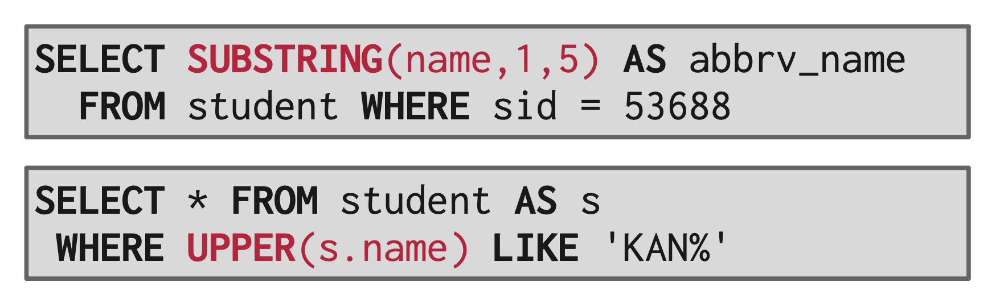
        </div>

        <div style="text-align: center">
            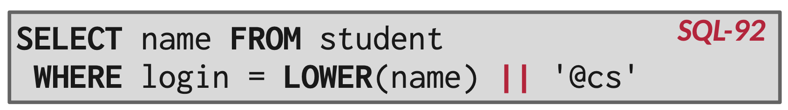
        </div>


- SQL 支持**模式匹配**(pattern matching)（或者叫模糊匹配），用到运算符 `LIKE`。我们可以使用以下两个特殊字符来描述字符串的模式：
    - `%`：匹配任意字符串（类似文件系统的 `*`）
    - `_`：匹配任意单个字符（类似文件系统的 `?`）

    ???+ example "例子"

        寻找建筑物名称带子字符串 "Waston" 的部门：

        ```sql
        SELECT dept_name
        FROM department
        WHERE building LIKE '%Watson%';
        ```

    - 若希望将这些特殊字符视为一般字符，则需要用 `ESCAPE` 关键字，在特殊字符前加上**转义字符**(escape character)，一般用反斜杠 `\` 作为转义字符

        ???+ example "例子"

            - `#!sql LIKE 'ab\%cd%' ESCAPE '\'` 匹配所有以 `'ab%cd'` 开头的字符串
            - `#!sql LIKE 'ab\\cd%' ESCAPE '\'` 匹配所有以 `'ab\cd'` 开头的字符串

    - 可以用 `NOT LIKE` 来查找不匹配的字符串
    - 有些实现会提供类似 `LIKE` 的运算，但是不区分大小写
    - PostgreSQL 提供的 `SIMILAR TO` 运算支持更为强大的模式匹配，它用到了 Unix 的正则表达式


### Ordering

- 在 SQL 查询语句中，可以使用 `ORDER BY` 子句为查询结果排序
- 使用关键字 `DESC`、`ASC` 分别指定**降序**和**升序**排序，默认使用升序

??? example "例子"

    ```sql
    SELECT * 
    FROM instructor  	
    ORDER BY salary DESC, name ASC;
    ```

### LIMIT Clause

!!! warning "注"

    这部分是教材没有涉及到的。

`LIMIT` 子句用于限制结果元组的个数，比如：

```sql
SELECT sid, name FROM student WHERE login LIKE'%@cs'
LIMIT 10;
```

规定输出元组个数不超过10个。

此外，结合 `OFFSET` 关键字还可以指定返回某个范围内的元组：

```sql
SELECT sid, name FROM student WHERE login LIKE'%@cs'
LIMIT 20 OFFSET 10;
```

这样返回结果就是从第10个元组开始的至多后20个元组。


### Duplicates

虽然在传统的关系理论中，不会出现重复数据，但是在实践中，有时我们需要重复的数据。因此，这里引入**多重集**(multiset)的概念：给定多重集关系 $r_1, r_2$，

- $\sigma_\theta(r_1)$：如果 $r_1$ 中有 $c_1$ 份元组 $t_1$ 个副本，且 $t_1$ 满足选择 $\sigma_\theta$，那么结果就会包含这 $c_1$ 个副本
- $\prod_A(r)$：对于 $r_1$ 中元组 $t_1$ 的每个副本，那么在 $\prod_A(r_1)$ 内存在一个元组 $\prod_A(t_1)$ 的副本，其中 $\prod_A(t_1)$ 表示单个元组 $t_1$ 的投影
- $r_1 \times r_2$：如果在 $r_1$ 有 $c_1$ 个副本的元组 $t_1$，在 $r_2$ 有 $c_2$ 个副本的元组 $t_2$，那么在 $r_1 \times r_2$ 中就有 $c_1 \cdot c_2$ 个元组 $t_1 t_2$ 的副本

SQL 的查询语句默认支持上述多重集的运算符。如果不希望出现重复记录，则添加 `DISTINCT` 关键字


## Set Operations

- SQL 支持关系代数中的集合运算符 $\cup,\ \cap,\ \bar{\ \ }$，分别用 `UNION`、`INTERSECT`、`EXCEPT` 表示
- 使用这些运算符后会**自动消除重复记录**（因为集合不允许存在重复记录）
- 如果想要保留重复记录，需要在集合运算关键字后加上 `ALL` 关键字，即 `UNION ALL`、`INTERSECT ALL`、`EXCEPT ALL`。假如有一个元组，在关系 r, s 内分别出现了 m, n 次，那么该元组在
    - 关系 `r UNION ALL s` 中出现 m + n 次
    - 关系 `r INTERSECT ALL s` 中出现 min(m, n) 次
    - 关系 `r EXCPET ALL s` 中出现 max(0, m - n) 次

- 有时关系 `r, s` 可能会比较复杂，所以建议用括号包起来（尽管这是可选的），增强可读性

- 数据库系统对集合运算的实现：
    - 在 Oracle 中，可以使用 `UNION`、`UNION ALL`、`INTERSECT`、`MINUS`，但是没有 `INTERSECT ALL` 和 `MINUS ALL`
    - 在 SQL Server 2000 中，仅支持 `UNION` 和 `UNION ALL`
    - MySQL 不支持 `INTERSECT`


## Null Values

- 元组的某些属性可能是空值，记作 null，表示**未知值**或**不存在的值**
- 任何包含 null 的算术表达式的结果为 null
- 任何包含 null 的比较结果为 unknown（除了 `IS NULL` 和 `IS NOT NULL`）
- SQL 的逻辑表达式的结果有 3 种：true、unknown、false
    - OR
        - (unknown OR true) = true
        - (unknown OR false) = unknown
        - (unknown OR unknown) = unknown
    - AND
        - (unknown AND true) = unknown
        - (unknown AND false) = false
        - (unknown AND unknown) = unknown
    - NOT
        - (NOT unknown) = unknown

- 如果 `WHERE` 子句的谓词的求解结果为 unknown，则会其视为 false
- 使用谓词 `IS NULL` 和 `IS NOT NULL` 来检查是空值或不是空值
    - 不能使用 `... = NULL` 比较，因为这样的比较结果恒为 null，没有任何意义

- 在 `SELECT DISTINCT` 子句中，重复记录被消除的时候，如果两个元组的相同属性都包含 null，会认为它们是**相同的**（这和 `WHERE` 子句的理解不同）
- 有些数据库系统实现支持 `IS UNKNOWN` 和 `IS NOT UNKNOWN`
- 除了 count(*) 之外的聚合函数会忽略属性中存在 null 值的记录
- 如果聚合函数的参数包含的记录均为空值，那么返回 null


## Aggregate Functions

**聚合函数**(aggregate functions)将一组（集合/多重集）值作为输入，然后返回单个值。SQL 提供以下五种标准的内建聚合函数：

- `AVG(col)`：平均值
- `MIN(col)`：最小值
- `MAX(col)`：最大值
- `SUM(col)`：求和
- `COUNT(col)`：计数（值的个数）

!!! note "注"

    - 聚合函数一般只用在 `SELECT` 语句中，作为输出
    - 其中 `SUM` 和 `AVG` 要求输入值必须是数值类型，其余运算符可以在非数值类型上操作。
    - 聚合函数返回的单个值实际上是一个仅包含一个属性、一个元组的关系，并且 SQL 赋给这个属性的名称不太好看，因此建议在聚合函数上使用 `AS` 子句为其重命名

        ???+ example "例子"

            ```sql
            SELECT AVG(salary) AS avg_salary
            FROM instructor
            WHERE dept_name = 'Comp.Sci';
            ```

    - 可以在 `MAX`、`MIN`、`COUNT` 函数的括号内使用 `DISTINCT` 为输入去重（~~尽管这样对求最大最小没有帮助~~），但是在使用 `COUNT(*)` 时就没法使用 `DISTINCT`
    - 除了 `COUNT(*)` 外，聚合函数在计算时会忽略 null 值
    - 关于布尔类型的聚合函数：`SOME` 和 `EVERY`，它们分别计算析取(disjunction, OR)与合取(conjunction, AND)值
    - 其他在聚合函数外的列是未定义的，比如：

        ???+ example "例子"

            <div style="text-align: center">
                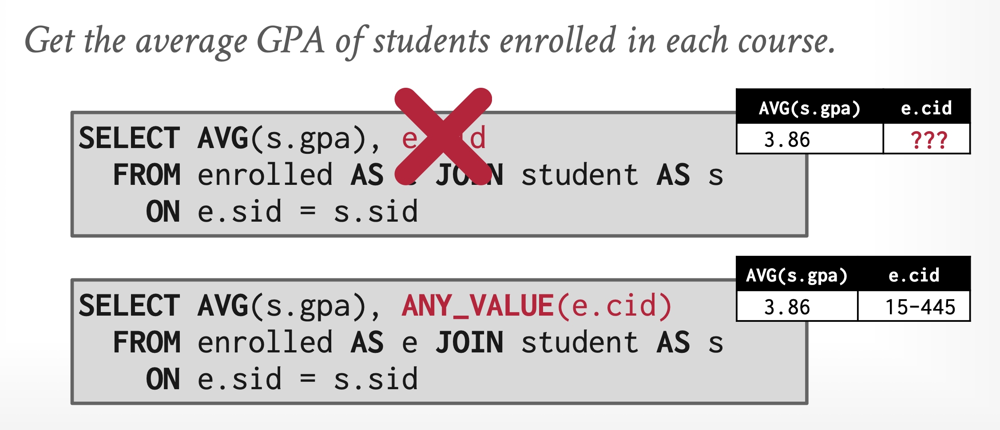
            </div>

            >注：`ANY_VALUE()` 函数是 SQL:2023 标准提供的，由于太新了所以考试的时候不要用这种函数。


### Grouping

`GROUP BY` 运算能够将元组投影到一组子集中，并且对每个子集计算聚合函数。

- 紧跟 `GROUP BY` 子句之后的属性作为分组的依据，在这些指定属性上有相同值的元组会被划分到同一个组内

    ???+ example "例子"

        <div style="text-align: center">
            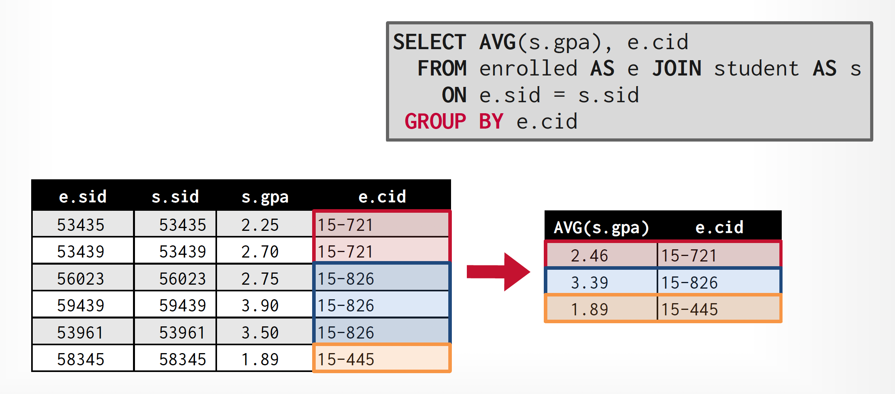
        </div>

- 在 `SELECT` 子句中，但是不在聚合函数内的属性必须出出现在 `GROUP BY` 分组列表中，否则这个查询就是错误的

    ???+ example "例子"

        === "错误表示"

            标红的 `s.name` 就是违背上述规则的属性。

            <div style="text-align: center">
                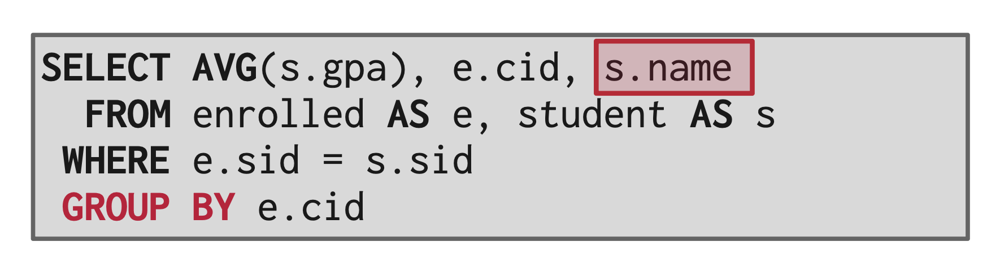
            </div>

        === "正确表示"

            <div style="text-align: center">
                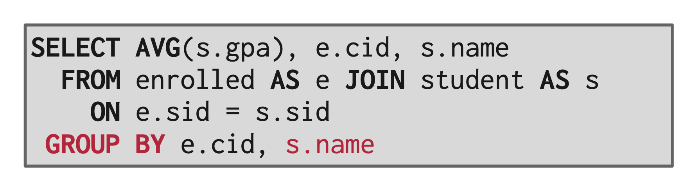
            </div>


### The Having Clause

而 `HAVING` 子句则根据聚合函数的计算结果过滤查询结果，类似 `WHERE` 子句。

- 在 `HAVING` 子句中，但是不在聚合函数内的属性必须出出现在 `GROUP BY` 分组列表中，否则这个查询就是错误的（与 `SELECT` 子句类似）

???+ example "例子"

    === "错误表示"

        以下两种表述都是错误的：

        <div style="text-align: center">
            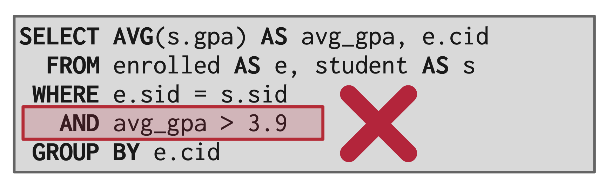
        </div>

        <div style="text-align: center">
            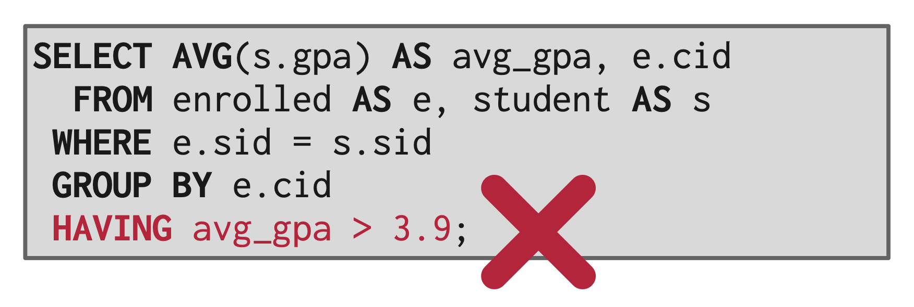
        </div>

    === "正确表示"

        <div style="text-align: center">
            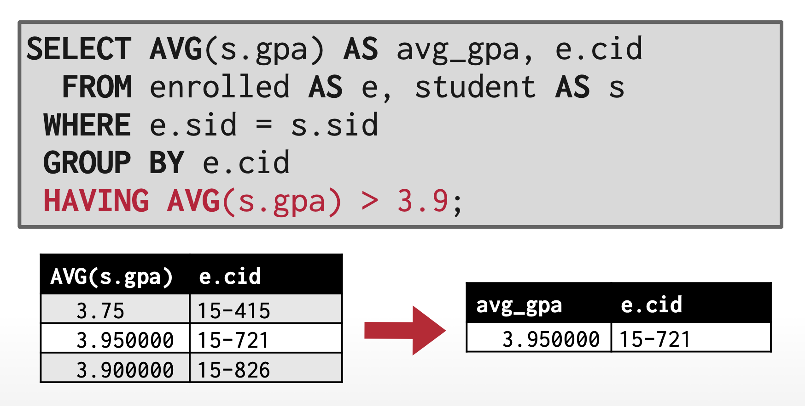
        </div>


!!! abstract "总结"

    - 完整的查询语句格式为：

        ```sql
        SELECT <[DISTINCT] c1, c2, ...> FROM <r1, ...>
        [WHERE <condition>]
        [GROUP BY <c1, c2, ...> [HAVING <condition2>]]
        [ORDER BY <c1 [DESC][, c2[DESC|ASC], ...]>]
        ```

    - 查询语句的执行顺序为：`FROM` -> `WHERE` -> `GROUP` -> `HAVING` -> `SELECT` -> `ORDER BY`
    - 在 `HAVING` 子句内的谓词会在分组形成**后**应用，但是在 `WHERE` 子句内的谓词会在分组形成**前**应用
    - 聚合函数不能直接用在 `WHERE` 子句内


## Nested Subqueries

- **子查询**(subquery)是指嵌套在其他查询语句中的查询语句。
- **相关子查询**(correlated subquery)：使用来自外部查询的**相关名称**的子查询
    - 在子查询中，可以使用定义在其自身，或者使用该子查询的查询中的相关名称
    - 如果相关名称同时定义在子查询中（局部），以及包含该子查询的查询中（全局），那么使用的是子查询中的相关名称

- 子查询的常见用途有：
    - 检测集合成员关系
    - 集合比较
    - 确定集合基数(cardinality)
    - ...

    下面会逐一介绍。


### Set Membership

- SQL 使用连接符 `IN` 来检测元组是不是在某一关系内的成员(membership)
    - SQL 还提供了 `ANY()` 函数，`=ANY()` 等价于 `IN` 运算

    ???+ example "例子"

        ```sql
        SELECT DISTINCT course_id
        FROM section
        WHERE semester = 'Fall' AND year = 2017 AND course_id IN (
            SELECT course_id
            FROM section
            WHERE semester = 'Spring' AND year = 2018        
        );
        ```

- 也可以使用 `NOT IN` 检测元组是不是**不**在某一关系内
- 实际上也可以用其他 SQL 语句实现等价的效果，但是用 `IN` 会更自然，更灵活，这里体现了 SQL 语法冗余性带来的好处
- `IN` 和 `NOT IN` 也可用于枚举集合(enumerated set)中

    ???+ example "例子"

        ```sql
        SELECT DISTINCT name
        FROM instructor
        WHERE name NOT IN ('Mozart', 'Einstein')
        ```

- 也可以搭配[行构造器](#where-clause)(row constructor)食用

    ???+ example "例子"

        ```sql
        SELECT COUNT(DISTINCT ID)
        FROM takes
        WHERE (course_id, sec_id, semester, year) IN (
            SELECT course_id, sec_id, semester, year
            FROM teaches
            WHERE teaches.ID >= '10101'
        );
        ```


### Set Comparison

下面介绍一些与集合比较相关的 SQL 子句（返回结果为布尔值）：

- `SOME` 子句：
    - 格式：`C <comp> SOME r`，其中 `<comp>` 是比较运算符
    - 等价于：$\exists\ t \in r (C\ \langle comp \rangle\ r)$
    - `= SOME` $\equiv$ `IN`，但 `!= SOME` $\not \equiv$ `NOT IN`
    - `SOME` 关键字还有一个同义关键字 `ANY`

    ???+ example "例子"

        ```sql
        SELECT name
        FROM instructor
        WHERE salary > SOME(
            SELECT salary
            FROM instructor
            WHERE dept_name = 'Biology'
        );
        ```

- `ALL` 子句：
    - 格式：`C <comp> ALL r`
    - 等价于：$\forall\ t \in r (C\ \langle comp \rangle\ r)$
    - `!= ALL` $\equiv$ `NOT IN`，但 `= ALL` $\not \equiv$ `IN`

    ???+ example "例子"

        ```sql
        SELECT dept_name
        FROM instructor
        GROUP BY dept_name
        HAVING AVG(salary) >= ALL(
            SELECT AVG(salary)
            FROM instructor
            GROUP BY dept_name
        );
        ```


### Empty Relation Test

- 当子查询返回结果为非空时，`EXISTS` 构造器返回 true，否则返回 false
- 而 `NOT EXISTS` 构造器的返回结果与之相反

???+ example "例子"

    ```sql
    SELECT course_id
    FROM section AS S
    WHERE semester = 'Fall' AND year = 2017 AND EXISTS (
        SELECT *
        FROM section AS T
        WHERE semester = 'Spring' AND year = 2018 AND S.course_id = T.course_id
    );
    ```


### Absent Duplicate Tuples Test

- `UNIQUE` 构造器用于检验子查询的结果是否存在重复的元组，若不存在重复元组则返回 true，否则返回 false
- 常作为 `WHERE` 子句的判断条件
- 如果关系是空的，那么  `UNIQUE` 会返回 true
- 而 `NOT UNIQUE` 构造器的行为与之相反
- 这些构造器还没有被广泛实现

???+ example "例子"

    ```sql
    SELECT T.course_id
    FROM course AS T
    WHERE UNIQUE (
        SELECT R.course_id
        FROM section AS R
        WHERE T.course_id = R.course_id AND R.year = 2017
    );
    ```


### Subqueries in the From Clause

- 可以看到，前面介绍的子查询基本都是用在 `WHERE` 子句上的。事实上，`FROM` 子句也支持子查询，因为所有的查询语句返回的都是一个关系
- 并不是所有的 SQL 实现都支持这一语法
- 可以为子查询返回的关系和属性重命名

    ???+ example "例子"

        ```sql
        SELECT dept_name, avg_salary
        FROM (
            SELECT dept_name, AVG(salary)
            FROM instructor
            GROUP BY dept_name
        )
        AS dept_avg(dept_name, avg_salary)
        WHERE avg_salary > 42000;
        ```

- 在 `FROM` 语句中的嵌套子查询不能使用来自其他关系中相同的 `FROM` 子句的相关变量
    - 从 SQL:2003 标准开始支持 `LATERAL` 关键字，用在 `FROM` 子查询前面，使得子查询可以访问位于同一 `FROM` 子句下的之前的表格或子查询内的属性


### Common Table Expressions

**公共表格表达式**(common table expressions, CTE)是一种在复杂情况下嵌套子查询的替代方案，为大型查询提供了一个辅助语句，我们可以把它看作某个查询里面的一张**临时表格**。而 `WITH` 子句就是用于这一目的的——它将内层查询的输出结果绑定到同名的临时表格中。

???+ example "例子"

    ```sql
    WITH max_budget(value) AS (
            SELECT MAX(budget)
            FROM department
    )
    SELECT budget
    FROM department, max_budget
    WHERE department.budget = max_budget.value;
    ```

在 `WITH` 后使用 `RECURSIVE` 关键字能够让 CTE 参照自身，从而实现了 SQL 查询的递归实现。

??? example "例子"

    打印1到10之间的数字序列：

    ```sql
    WITH RECURSIVE cteSource (counter) AS (
        ( SELECT 1 )
        UNION
        ( SELECT counter + 1 FROM cteSource
        WHERE counter < 10 )
    )
    SELECT * FROM cteSource;
    ```


### Scalar Subqueries

- **标量子查询**(scalar subqueries)：仅返回单个值（一个元组、一个属性）的子查询（但本质上返回结果还是一个关系）
- 标量子查询可以位于 `SELECT`、`WHERE` 和 `HAVING` 子句中

???+ example "例子"

    ```sql
    SELECT dept_name, (
        SELECT COUNT(*)
        FROM instructor
        WHERE department.dept_name = instructor.dept_name
    ) AS num_instructors
    FROM department;
    ```


### Scalar without a From Clause

- 某些特定的查询可能有一些包含 `FROM` 子句的子查询，但是顶层查询不需要 `FROM` 子句，比如：

    ```sql
    (SELECT COUNT(*) FROM teaches) / (SELECT COUNT(*) FROM instructor);
    ```

- 在某次系统下，上述语法可能会报错
- 上述查询是一个整数除法，要转化成浮点数除法的话，需要再乘上 1.0


## Modification of the Database

### Deletion

- 删除语句的语法与查询语句类似：

    ```sql
    DELETE FROM r
    WHERE P;
    ```

- 只能删除完整的一个元组，不能删除特定的属性
- 如果省略 `WHERE` 子句，那么就会删除关系中的所有元组
- 一条删除语句只能针对一个关系
- 尽管如此，我们可以在 `WHERE` 子句中嵌套子查询，所以实际上还是可以参照多个关系的

???+ example "例子"

    ```sql
    DELETE FROM instructor
    WHERE salary < (
        SELECT AVG(salary)
        FROM instructor
    );
    ```


### Insertion

- 请确保插入元组的属性数量与关系对得上，且确保值在属性域内
- 语法：
    - 按属性顺序插入元组：

        ```sql
        INSERT INTO course
        VALUES ('CS-437', 'Database System', 'Comp. Sci.', 4);
        ```

    - 也可以指定属性顺序插入：

        ```sql
        INSERT INTO course(title, course_id, credits, dept_name)
        VALUES ('Database System', 'CS-437',  4, 'Comp. Sci.');
        ```

    - 还可以插入查询结果：

        ```sql
        INSERT INTO instrutor
            SELECT ID, name, dept_name, 18000
            FROM student
            WHERE dept_name = 'Music' AND tot_cred > 144;
        ```

- 可以仅插入部分属性，这样的话剩余的属性就会被赋予 null 值
- 很多数据库系统提供了一种特殊的“**批量加载器**(bulk loader)”功能，支持一次插入大量元组。大量的数据从格式化的文本文件中读取，执行速度比等价的 `INSERT` 语句更快


### Updates

- `UPDATE` 子句可以仅改变元组中的部分值
- `UPDATE` 的 `WHERE` 子句和 `SET` 子句也支持嵌套子查询

    ???+ example "例子"

        === "`WHERE` 子句"

            ```sql
            UPDATE instructor
            SET salary = salary * 1.05
            WHERE salary < (
                SELECT AVG(salary)
                FROM instructor
            );
            ```

        === "`SET` 子句"

            ```sql
            UPDATE student
            SET tot_cred = (
                SELECT SUM(credits)
                FROM takes, course
                WHERE student.ID = takes.ID AND
                    takes.course.id = course.course_id AND
                    takes.grade <> 'F' AND
                    takes.graede IS NOT NULL
            );
            ```


- `CASE` 子句支持在同一条 `UPDATE` 语句中，分情况执行不同的更新操作，语法为：

    ```sql
    CASE 
        WHEN pred1 THEN result1
        WHEN pred2 THEN result2
        ...
        WHEN predn THEN resultn
        ELSE result0
    END
    ```

    ???+ example "例子"

        ```sql
        UPDATE instructor
        SET salary = CASE
            WHEN salary <= 100000 THEN salary * 1.05
            ELSE salary * 1.03
        END;
        ```

    - 可以利用这条语句为属性自定义默认值（而不是默认的 null）。但更方便的做法是使用数据库里的 `COALESCE` 函数（Lec 4 会讲到）


## Supplements

!!! warning "注"

    如果你是出于期末复习的目的来看本笔记的话，那就请跳过本节，因为下面介绍的东西是 SQL 标准中有的，但是教材和课件里都没有涉及到的内容。但我觉得蛮有意思的，所以就整理下来了（主要根据 CMU 数据库系统课程的 note 整理的）。


### Output Redirection

除了让查询结果在终端中显示外（假如你是在 CLI 上操纵数据库的），我们还可以将结果存储在另一个表格中，之后可以通过查询这个表格来访问结果数据。具体来说有以下几种途径：

- 创建新的表格：`#!sql SELECT DISTINCT cid INTO CourseIds FROM enrolled;`
- 利用已有表格，前提是该表格的列数和列的类型和查询结果一致，但列名并不要求必须一致：

    ```sql
    INSERT INTO CourseIds (SELECT DISTINCT cid FROM enrolled);
    ```


### Window Functions

**窗口函数**(window functions)在一组有关联的元组上执行“滑动”的计算，它和聚合函数很像，但是不会将所有元组合并成一个单独的输出元组。对于绝大多数的窗口函数而言，它们的执行过程为：

1. 划分表格
2. 对每个划分进行排序
3. 对于每条记录，创建一个跨越多个记录的窗口
4. 为每个窗口计算输出

前面介绍过的聚合函数都属于窗口函数，此外还有一些特殊的窗口函数：

- `ROW_NUMBER`：当前行的编号（排序前完成计算）
- `RANK`：当前行的**顺序**位置（排序后完成计算）

??? example "例子"

    找到每门课成绩第二高的学生：

    ```sql
    SELECT * FROM (
        SELECT *, RANK() OVER (PARTITION BY cid
            ORDER BY grade ASC) AS rank
        FROM enrolled) AS ranking
    WHERE ranking.rank = 2;
    ```

---
窗口函数常常和 `OVER` 子句搭配使用——在计算窗口函数时，该子句实现对元组的分组。关键字 `PARTITION BY` 用于指明具体的组。下面是采用上述语法的例子：

```sql
SELECT cid, sid, ROW_NUMBER() OVER (PARTITION BY cid)
FROM enrolled ORDER BY cid;
```

此外，`OVER` 子句内还可以使用 `ORDER BY`，指定结果的顺序：

```sql
SELECT *, ROW_NUMBER() OVER (ORDER BY cid)
FROM enrolled ORDER BY cid;
```


### Lateral Joins

>注：在看这部分之前，你得需要了解[嵌套子查询](#nested-subqueries)和[连接运算](4.md#join-expressions)的概念。

`LATERAL` 运算符允许某个嵌套子查询参照先于它的嵌套子查询的属性。我们可以把它看作一个 `for` 循环，在里面我们可以为关系内的每个元组进行一次查询。

??? example "例子"

    <div style="text-align: center">
        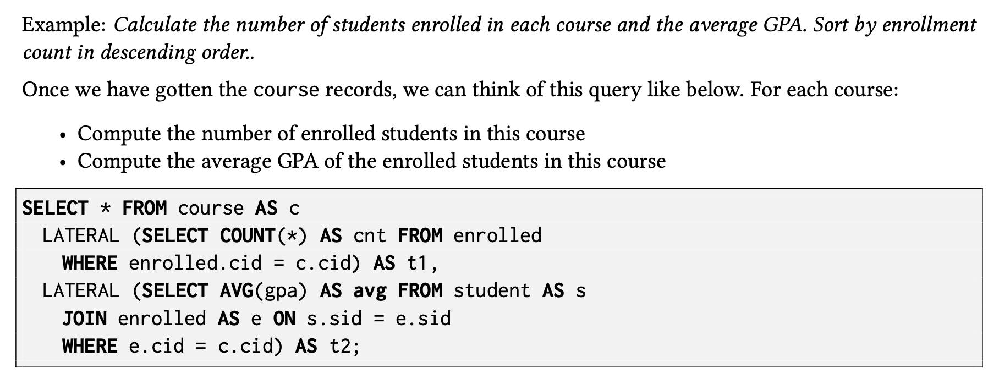
    </div>