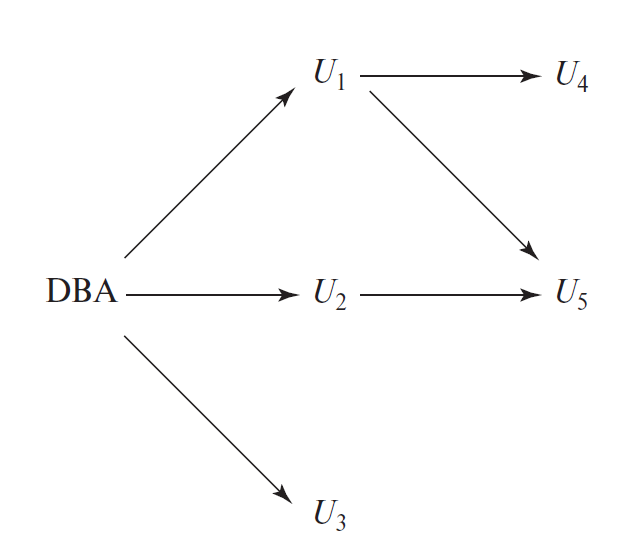

# Lec 4: Intermediate SQL

## Join Expressions

### The Natural Join

在查询语句中，我们通常会遇到一种情况：查询语句内的匹配条件要求不同关系中的同名属性值相等。虽然可以用 `WHERE` 子句实现，但 SQL 提供了一种更为方便且自然的方法——**自然连接**(natural join)。

- 对应运算符为 `NATURAL JOIN`，一般用于 `FROM` 子句中
- 它会将两个关系中的**所有同名属性值相等**的元组拼接起来（仅保留同名属性中的一个），构成一个新的关系
- 这个新关系的元组中，首先列出两个关系的共同属性，然后列出独属于第一个关系的属性，最后列出独属于第二个关系的属性
- `FROM` 子句获得的是求解好后的新关系，因此有些实现不支持再用原来的关系名访问原属性
- 可以用多个 `NATURAL JOIN` 来连接多个关系

    ```sql
    SELECT A1, A2, ..., An
    FROM r1 NATURAL JOIN r2 NATURAL JOIN ... NATURAL JOIN rm
    WHERE P;
    ```

- 另外，使用 `JOIN ... USING` 子句可以从两个关系的同名属性中选择指定的属性，作为连接的依据，更加灵活

    ???+ example "例子"

        ```sql
        SELECT name, title
        FROM (student NATURAL JOIN takes) JOIN course USING (course_id);
        ```


### Join Conditions

除了 `JOIN ... USING` 外，还有更加通用的 `JOIN ... ON` 运算。只要 `WHERE` 支持的谓词，`ON` 条件均支持，因此能够表达更为丰富的连接条件。

- 虽然用其他 SQL 语句（比如 `WHERE` 子句）也能实现这个功能，但这种语法更加直接自然，因此这是 SQL 的一个冗余功能
- 然而，在外连接（接下来马上讲到）中，`ON` 和 `WHERE` 之间有一些小区别

???+ example "例子"

    ```sql
    SELECT *
    FROM student JOIN takes ON student.ID = takes.ID;
    ```


### Outer Joins

!!! failure "自然连接的问题"

    自然连接仅保留那些同名属性值相等的元组，那些不相等的元组都会被抛弃，但有时我们需要保留这些不相等的元组。这个时候，就需要用到**外连接**(outer joins)了。

外连接的作用类似自然连接，区别在于它会保留那些两个关系的同名属性值不相等的元组，将其放入新的关系中，并将其未被拼接的属性设为 null。SQL 提供了以下三种形式的外连接：

- **左外连接**(left outer join)：使用 `LEFT OUTER JOIN` 运算符，仅保留第一个关系的所有元组
- **右外连接**(right outer join)：使用 `RIGHT OUTER JOIN` 运算符，仅保留第二个关系的所有元组
- **全外连接**(full outer join)：使用 `FULL OUTER JOIN` 运算符，保留所有关系的元组
    - 可以把它的返回结果看作是左外连接和右外连接结果的并集
    - 有些数据库系统不支持全外连接（比如 MySQL）

对应地，前面介绍的那些没有保留不匹配元组的连接方式称为**内连接**(inner join)。

- 在 SQL 语法中可以显式指出 `INNER JOIN`，但可以省略 `INNER`，因为 `JOIN` 子句默认是内连接的

在外连接中，`ON` 和 `WHERE` 子句的区别在于：

- `ON` 子句会保留那些不符合条件的元组
- 而 `WHERE` 子句会丢掉那些不符合条件的元组

???+ example "例子"

    ```sql
    SELECT *
    FROM (
        SELECT *
        FROM student
        WHERE dept_name = 'Comp. Sci.'
    ) NATURAL FULL OUTER JOIN (
        SELECT *
        FROM takes
        WHERE semester = 'Spring' AND year = 2017
    );
    ```


## SQL and Multiset Relational Algebra

SQL 与一般的关系代数之间最大的区别在于 SQL 支持重复记录，但是关系代数不支持。为了能描述 SQL 的这种行为，我们可以使用**多重集关系代数**，它的数学基础——**多重集**(multiset)能够表示重复记录。下面给出一些关于多重集关系代数的基本运算：

- 如果在 $r_1$ 中 $c_1$ 份元组 $t_1$ 的拷贝，且 $t_1$ 满足选择 $\sigma_\theta$，那么 $\sigma_\theta(r_1)$ 中就有 $c_1$ 份元组 $t_1$ 的拷贝
- 对于 $r_1$ 中元组 $t_1$ 的每一份拷贝，都有对应的在 $\prod_A(r_1)$ 中的元组 $\prod_A(t_1)$ 的拷贝，其中 $\prod_A(t_1)$ 表示的是单个元组 $t_1$ 的投影
- 如果在 $r_1$ 中 $c_1$ 份元组 $t_1$ 的拷贝，在 $r_2$ 中 $c_2$ 份元组 $t_2$ 的拷贝，那么在 $r_1 \times r_2$ 中 $c_1 \cdot c_2$ 份元组 $t_1\ .\ t_2$ 的拷贝

因此 SQL 查询：

```sql
SELECT A1, A2, ..., An
FROM r1, r2, ..., rm
WHERE P;
```

在多重集关系代数中可以被表示为：

$$
\prod_{A_1, A_2, \dots, A_n}(\sigma_P(r_1 \times r_2 \times \dots \times r_m))
$$

---
在多重集关系代数中，用 $\gamma$ 表示聚合函数运算，比如 $_{dept\_name} {\Large \gamma}_{\mathbf{average}(salary)}(instructor)$

更复杂的 SQL 查询：

```sql
SELECT A1, A2, SUM(A3)
FROM r1, r2, ..., rm
WHERE P
GROUP BY A1, A2 HAVING COUNT(A4) > 2;
```

等价于：

$$
\begin{align}
& t1 \leftarrow \sigma_P(r_1 \times r_2 \times \dots \times r_m) \notag \\
& \Pi_{A_1, A_2, SumA3(\sigma_{countA4 > 2}( _{A_1, A_2} {\Large \gamma}_{sum(A_3)\ \mathbf{as}\ SumA3,\ \mathbf{count}(A_4)\ \mathbf{as}\ countA4}}(t1))) \notag
\end{align}
$$

不过 SQL 的子查询无法用关系代数表示，因为没有等价的语法。

---
多重集关系代数还提供了两种运算：

- **半连接**(semijoin) $\ltimes$：$r \ltimes_{r.A = s.B} s$ 输出满足在 $s$ 中至少有一个元组满足 $r.A = s.B$ 的所有 $r$ 里的元组，类似 SQL 的 `EXISTS` 子句
- **反连接**(antijoin) $\overline{\ltimes}$（有时也用 $\triangleright$ 表示）：$r \overline{\ltimes}_{r.A = s.B} s$ 输出满足在 $s$ 中没有一个元组满足 $r.A = s.B$ 的所有 $r$ 里的元组，类似 SQL 的 `NOT EXISTS` 子句

---
关系代数中的连接：

- 左外连接 ⟕$_\theta$
- 右外连接 ⟖$_\theta$
- 全外连接 	⟗$_\theta$
- 自然连接 $\bowtie$


## Views

!!! question "问题"

    有时候，我们希望将查询结果保存下来，用于特定的情景或者留到之后使用。然而，如果查询结果对应的关系发生了改动的话，被保存下来的查询结果不会随之更新，这会带来不小的麻烦。

好在，SQL 提供了**虚拟关系**(virtual relations)的概念——它能够记录查询，但不是通过预计算(precompute)和保存的形式，而是在使用虚拟关系的时候再计算查询结果，这样的话就能做到随时更新了。这样的虚拟关系需要通过定义**视图**(view)来创建。


### View Definition and Usages

创建视图的语法为：

```sql
CREATE VIEW v AS <query expression>;
```

???+ example "例子"

    ```sql
    CREATE VIEW faculty AS
        SELECT ID, name, dept_name
        FROM instructor;
    ```

- 虽然看起来与 `WITH` 子句很像，但 `WITH` 子句创建的只是临时的关系，而 `CREATE VIEW` 创建的视图可以在后面一直使用，直到被手动销毁或程序中止
- 使用视图就像使用一般的关系一样，没有特别的语法
- 创建视图时还可以指定属性名：

    ???+ example "例子"

        ```sql
        CREATE VIEW departments_total_salary(dept_name, total_salary) AS
            SELECT dept_name, SUM(salary)
            FROM instructor
            GROUP BY dept_name;
        ```

- 定义视图时，数据库系统只存储视图自身的定义，而不会存储查询表达式的求解结果。当视图关系出现在其他查询语句时就会被替换为被存储的查询表达式
- 可以用视图定义其他视图


### Materialized Views

有些数据库系统允许存储视图关系，且仍然确保视图保持更新的特点，这样的视图称为**实体化视图**(materialized views)。

- 由于结果被存储在数据库中，不需要重新计算，因此使用此类视图的查询语句的运行速度可能会更快，适用于需要快速响应的情景
- 但如果实体化视图对应的关系发生改动，视图里的内容必须被更新
- 保持实体化视图更新的过程称为**实体化视图维护**(materialized view maintenance)
    - 一般情况下当对应的关系更新时，实体化视图会马上更新
    - 但是有些数据库系统采取“懒维护”策略：周期性地更新视图，所以在某些时间段内视图里的内容可能不是最新的，因此不该被使用
    - 有些数据库允许数据库管理员决定采取何种更新策略

- 实体化视图的优点需要与其存储成本和额外更新开销的缺点做好权衡


### Update of a View

对视图的修改是一件很麻烦的事，因为对数据库视图的修改必须被翻译为对位于数据库逻辑模型中的真实关系的修改。

以对视图的插入操作为例，如果视图仅包含原关系中的部分属性，那么有以下两种较为合理的处理方案：

- 拒绝插入操作，并向用户反悔错误信息
- 对于没有涉及到的属性，为其插入 null 值

更麻烦的情况是：如果创建的视图涉及到多个关系，并且还用 `WHERE` 子句指定一些条件，那么插入语句很有可能无法满足 `WHERE` 给出的条件而无法达到预期效果。

综上，除了以下列出的有限情况，通常不允许对视图关系进行修改：

- `FROM` 子句仅包含一个数据库关系
- `SELECT` 子句仅包含来自这个关系的属性名，并且不允许出现任何表达式、聚合函数或者 `DISTINCT` 约束
- 任何没有出现在 `SELECT` 子句的属性会被设为 null，因此也不允许使用 `NOT NULL` 或 `PRIMARY KEY` 约束
- 查询语句不能有 `GROUP BY` 或 `HAVING` 子句

我们称满足这些情况的视图是**可更新的**(updatable)。

???+ example "可更新视图的一个例子"

    ```sql
    CREATE VIEW history_instructors AS
    SELECT *
    FROM instructor
    WHERE dept_name = 'History';
    ```

即使视图是可更新的，仍然有一个问题：在使用关于视图的 `INSERT` 语句时，可能因为不满足视图里的查询语句条件，无法将数据插入到视图中，但此时原关系会接受这个新插入的数据。

- 默认情况下，SQL 会接受这种更新
- 也可以在视图定义的末尾使用 `WITH CHECK OPTION` 子句，用于拒绝这样的插入操作

之后介绍的**触发器**(trigger)也能实现对视图的修改。


## Transactions

**事务**(transaction)：一个查询/更新语句的序列。当 SQL 语句被执行的时候，我们就开启了一个事务。用以下 SQL 语句之一作为事务的结束：

- `COMMIT WORK`：**提交**(commit)当前事务，也就是说，它让由事务实现的更新操作变为对数据库的永久修改。事务提交之后，新的事务就开始了。
    - 就是保存对被编辑文档的更改
- `ROLLBACK WORK`：**回滚**(rollback)当前事务，也就是说，它撤销所有先前由事务内的 SQL 语句执行的更新。因此，数据库的状态就会恢复到事务的第一条语句被执行之前的状态。
    - 就是退出编辑会话，并且不保存更改
    - 一旦事务被提交之后，该事务就无法被回滚

>关键词 `WORK` 是可选的。

- 数据库系统保证在遇到故障时（比如 SQL 语句的错误、断电、系统崩溃等）如果没有执行提交操作，事务会被自动回滚，起到保护数据库的作用。
- 事务的提交和回滚操作体现了数据库的一种抽象——**原子性**(atomicity)，即不可分割的意思
    - 比如对于事务内的一组更新语句，如果执行其中一条语句时发生错误，那么就会撤销前面语句的所有更新效果，这样保证数据库不会处于部分更新状态

- 在很多 SQL 实现中（包括 MySQL、PostgreSQL 等），默认情况下单个的 SQL 语句会被视为一个事务，当语句被执行时，该事务就被提交了
    - 如果需要让多条 SQL 语句构成一个事务的话，需要关闭这种对于单个 SQL 语句的**自动提交**(automatic commit)。关闭操作取决于具体的 SQL 实现，但大多数数据库支持 `SET AUTOCOMMIT OFF` 命令
    - 更好的替代方法时将这些语句放在关键字 `BEGIN ATOMIC ... END` 之中，此时这些语句会被视为一个事务。但只有部分数据库支持这一语法；其他数据库可能用 `COMMIT WORK` 或 `ROLLBACK WORK` 替代 `END` 语句
    - Oracle 并没有把自动提交设为默认情况，因此每次更新数据时需要记得使用 `COMMIT` 命令


## Integrity Constraints

**完整性约束**(integrity constraints)确保授权用户对数据库的改变不会破坏数据一致性。

- 因此，完整性约束保护数据库免受意外损害；与之相对的**安全性约束**(security constraints)是用来保护数据库不被未授权用户访问
- 通常，完整性约束作为数据库模式设计的一部分，也就是作为 `CREATE TABLE` 命令的一部分
- 不过完整性约束也可以用在现有的关系中，通过 `#!sql ALTER TABLE table-name ADD constraint` 实现。然而，如果关系中原有的数据无法满足新增的约束，那么该命令就会被拒绝

除了上一讲提到的 `PRIMARY KEY` 约束外，下面会介绍更多的约束。


### Not Null Constraint

由于 null 值是所有域的成员，因此默认情况下 null 值在每个属性中都是合法值。但是在某些场合下，不应该出现包含 null 值的元组，那么此时就可以使用 `NOT NULL` 约束来禁止 null 值的出现。

- 这是**域约束**(domain constraints)的一种情况
- 任何导致向被声明为 `NOT NULL` 的属性插入 null 值的修改均会报错
- `PRIMARY KEY` 约束自动带有这一约束，所以此时无需显式指出 `NOT NULL`


### Unique Constraint

`UNIQUE` 约束的语法为：`#!sql UNIQUE(A_j1, A_j2, ..., A_jm)`，这会让属性 $A_{j_1}, A_{j_2}, \dots, A_{j_m}$ 构成一个**超键**（即在同一关系中，对于列出来的属性，没有两个元组的值是相等的）。

- `UNIQUE` 约束允许 null 的存在（注意 null 值和任何值都不相等，包括其自身）


### The Check Clause

在关系声明时使用 `CHECK(P)` 子句，让关系中的每个元组必须满足谓词 P 的条件。

- 可用于构建强大的类型系统
- 它可以让属性限制在自定义的域内，相比大多数编程语言的类型系统更为强大
- 只要不是 false，`CHECK` 子句的条件就会成立，因此 null 值可以顺利通过检查（除非有 `NOT NULL` 的约束）
- `CHECK` 可以单独出现，也可以紧跟在属性后面。一般情况下，对于单个属性的检查，采用后者的方式；而对于更为复杂的检查，则采用前者的方式
- 在 SQL 标准中，`CHECK` 可以接受任意谓词，包括**子查询**。但并不是所有的数据库系统都支持子查询作为谓词


### Referential Integrity

**参照完整性约束**(referential integrity constraints)：对于某个关系（称为**参照关系**(referencing relation)）的指定属性值也要出现在另一个关系（称为**被参照关系**(referenced relation)）的对应属性中。

在 SQL 中，参照完整性约束由外键实现，语法为：`#!sql FOREIGN KEY (dept_name) REFERENCES department`

- 默认情况下，外键会参照被参照关系中的主键
- 外键允许被设为 null，除非有 `NOT NULL` 约束
- SQL 也支持参照被参照关系的指定属性表中的属性，语法为：`#!sql FOREIGN KEY (dept_name) REFERENCES department(dept_name)`
    - 这个指定属性表必须被声明为被参照关系的超键，可通过 `PRIMARY KEY` 或 `UNIQUE` 约束实现

- 外键必须参照的是可兼容的一组属性，即要求属性数量和具体属性都对应得上
- 执行违反参照完整性约束的语句时会被拒绝。然而，对于在被参照关系上的更新和删除行为，如果违反约束，系统必须采取行动来改变参照关系的元组，以恢复约束。对于以下语句：

    ```sql
    CREATE TABLE course (
        FOREIGN KEY (dept_name) REFERENCES department
        ON DELETE CASCADE
        ON UPDATE CASCADE
        ...
    );
    ```

    以删除操作为例，如果要删除 `department` 里的元组，那么就会违背参照完整性约束，不过系统不会拒绝这个操作，而是通过级联(cascade)删除的方式删除在 `course` 中参照在 `department` 中被删除元组的元组。更新操作与之同理

- 除了 `CASCADE` 关键字外，还可以设置 `SET NULL` 或 `SET DEFAULT`，当违反约束时会触发这些操作
- 如果在多个关系中有链式的外键依赖关系的话，对链条中其中一个关系的删除或更新会在整个链条上传播
- 如果级联更新或删除造成了无法被更远的级联运算处理的约束违背，那么系统就会中止这个事务


### Assigning Names to Constraints

使用关键字 `CONSTRAINT` 为约束赋予名称，这样便于之后使用或删除约束。比如：

```sql
-- Assignment
...
salary NUMERIC(8, 2), CONSTRAINT minsalary CHECK(salary > 29000),
...

-- Deletion
ALTER TABLE instructor DROP CONSTRAINT minsalary;
```

如果缺少名称，我们可能需要使用由系统赋予该约束的名称，但并不是所有数据库系统都支持。


### Integrity Constraint Violation During a Transaction

- 事务由一些步骤构成，在某些步骤中可能暂时违背完整性约束，但是在之后的步骤中又不违背了
- 为了避免一遇到违背完整性时就中止事务的情况出现，可以在约束说明后面添加 `INITIALLY DEFERRED` 子句，指定在事务结束前才对该约束进行检查，而不是立即检查
- 也可以使用 `DEFERRABLE`，默认是立即检查的，但是当需要的时候也可以延迟检查。对于声明了 `DEFERRABLE` 的约束，当在事务中执行 `#!sql SET CONSTRAINTS constraint-list DEFERRED` 时，该约束就会在事务的最后检查
- 但是很多数据库实现并不支持这种延迟约束检查


### Complex Check Conditions and Assertions

前面提到过，`CHECK` 子句支持复杂的子查询，比如：

```sql
-- A referential-integrity constraint on the relation "section"
CHECK(time_slot_id IN (SELECT time_slot_id FROM time_slot))
```

此时，无论是在向关系 `section` 插入或修改元组时，还是当 `time_slot` 改变时，上述条件都会被检查。因此，复杂的检查条件虽然有用，但是测试成本有些高。

---
**断言**(assertion)是表达一种希望数据库一直满足的条件的一种谓词。创建断言的语法为：

```sql
CREATE ASSERTION <assertion-name> CHECK <predicate>;
```

???+ example "例子"

    ```sql
    CREATE ASSERTION credits_earned_constraint CHECK (
        NOT EXISTS (
            SELECT ID
            FROM student
            WHERE tot_cred <> (
                SELECT COALESCE(SUM(credits), 0)
                FROM takes NATURAL JOIN course
                WHERE student.ID = takes.ID AND grade IS NOT NULL AND grade <> 'F'
            )
        )
    );
    ```

    因为 SQL 不提供一种 `for all X, P(X)` 的构造，因此只能用 `not exists X such that not P(X)` 这一等价形式表示。

- 当断言合法时，之后对数据库的任何改动都被允许
- 由于断言的测试会带来很大的开销，因此使用断言时需要当心。而在实际中，这样的高开销通常会让一些系统开发者忽视对断言的支持，或提供更易于测试的特殊断言形式
- 

## SQL Data Types and Schemas

### Date and Time Types

SQL 标准支持以下关于日期和时间的数据类型：

- `DATE`：日期，包含年月日
- `TIME`：时间，包含时分秒
    - `TIME(p)`：能够指定秒的小数位数
    - `TIME WITH TIMEZONE`：还可以存储时间的时区信息
- `TIMESTAMP`：时间戳，结合了 `DATE` 和 `TIME`
    - `TIMESTAMP(p)`：能够指定秒的小数位数
    - 也可以用 `WITH TIMEZONE` 存储时区

???+ example "例子"

    ```sql
    DATE '2025-03-06'
    TIME '18:54:00'
    TIMESTAMP '2025-03-06 18:54:00.45'
    ```
- 很多数据库系统默认支持字符串与日期时间之间的转换
- 可以使用 `EXTRACT (field FROM d)` 来提取 `DATE` 或 `TIME` 类的值 `d` 里面的字段，其中 `field` 可以是 `YEAR`、`MONTH`、`DAY`、`HOUR`、`MINUTE` 或 `SECOND` 类的数值，还可以用 `TIMEZONE_HOUR` 和 `TIMEZONE_MINUTE` 提取时区信息
- SQL 还提供了获取当前日期和时间信息的函数
    - `CURRENT_DATE`：当前日期
    - `CURRENT_TIME`：当前时间
    - `LOCALTIME`：当前本地时间（不包括时区）
    - `CURRENT_TIMESTAMP`：当前时间戳（包括时区）
    - `LOCALTIMESTAMP`：当前时间戳（不包括时区）

- 有些数据库系统还提供了 `DATETIME` 数据类型表示不可调整时区的时间
- SQL 允许上述所有类型的比较，并且允许它们与数值类型的变量进行算术运算和比较
- SQL 还提供了 `INTERVAL` 数据类型，允许在日期、时间和区间上进行计算


### Type Conversion and Formatting Functions

虽然数据库系统支持部分数据类型的自动**转换**(conversion)，但有时我们需要显式转换，此时我们就可以使用表达式 `#!sql CAST (e AS t)`，将表达式 `e` 转换为类型 `t`

应用：执行特定的运算，或者强制实行某种特定的排序

---
数据库系统提供了许多**格式化函数**(formatting functions)，但是不同的系统之间会提供不同的实现，比如：

- MySQL：`FORMAT` 函数
- Oracle、PostgreSQL：`TO_CHAR`、`TO_NUMBER`、`TO_DATE` 函数
- SQL Server：`CONVERT` 函数

除了用格式化函数来规范显式结果外，另一个需要解决的问题是处理空值。SQL 提供了 `COALESCE` 函数，用于控制 null 在查询结果的输出。它接受任意数量的参数，但必须都是相同类型的，然后返回第一个非空参数。

???+ example "例子"

    ```sql
    SELECT ID, COALESCE(salary, 0) AS salary
    FROM instrutor;
    ```

该函数的局限在于所有参数都是相同类型的，而 Oracle 的 `DECODE` 函数提供了更为灵活的变换，它的语法为：

```sql
DECODE(value, match-1, replacement-1, match-2, replacement-2, ...
    match-N, replacement-N, default-replacement);
```

该函数会比较 `value` 与按顺序比较各个匹配值，如果匹配到其中一个值，那么该属性就会被替换值给替换掉。

???+ example "例子"

    ```sql
    SELECT ID, DECODE(salary, null, 'N/A', salary) AS salary
    FROM instructor;
    ```


### Default Values

在 `CREATE TABLE` 中，可以为指定属性赋予**默认值**，比如：

```sql
CREATE TABLE student (
    ID          VARCHAR(5),
    name        VARCHAR(20) NOT NULL,
    dept_name   VARCHAR(20),
    tot_cred    NUMERIC(3, 0) DEFAULT 0,
    PRIMARY KEY (ID)
);
```

如果没有为 `tot_cred` 赋值的话，会被默认赋予 0


### Large-Object Types

很多数据库系统需要存储包含大数据项的属性，比如照片、高分辨率的图像或视频等。因此 SQL 为字符数据（`CLOB`）和二进制数据（`BLOB`）提供了**大对象数据类型**(large-object data types)。

???+ example "例子"

    ```sql
    book_review CLOB(10KB)
    image BLOB(10MB)
    movie BLOB(2GB)
    ```

对于包含大对象的结果元组，在内存中检索完整的大对象是很低效且不切实际的，因此应用会使用 SQL 查询来检索大对象的**定位器**(locator)，然后用宿主语言（也是编写应用用到的语言）使用定位器来实现对对象的操纵。


### User-Defined Types

SQL 支持两种形式的用户**定义数据类型**(user-defined data types)。

- **区分类型**(distinct types)：接下来介绍的类型
- **结构化数据类型**(structured data types)：复杂的数据类型，包括嵌套记录结构、数组、多重集

不同的属性可能有相同的类型，但有时我们希望讲这些属性的类型区分开来，这时就可以用到 `CREATE TYPE` 子句来定义新的类型（称为区分类型）。

???+ example "例子"

    ```sql
    CREATE TYPE Dollars AS NUMERIC(12, 2) FINAL;
    CREATE TYPE Pounds AS NUMERIC(12, 2) FINAL;
    ```

    用户定义的这两个类型 `Dollars` 和 `Pounds`，虽然底层类型相同，但会被视为不同的类型。因此这两种类型不能直接进行运算，甚至不能与 `NUMERIC` 类型运算，这时就需要用 `CAST` 子句进行强制类型转换。

SQL 还提供了 `DROP TYPE` 和 `ALTER TYPE` 子句分别来删除或改变之前创建的类型。

在用户定义类型的概念出现之前，SQL 的 `DOMAIN` 关键字提供了类似的功能，用于为底层类型添加完整性约束。

???+ example "例子"

    ```sql
    CREATE DOMAIN DDollars AS NUMERIC(12, 2) NOT NULL;
    ```

    还可以使用 `CHECK`：

    ```sql
    CREATE DOMAIN YearlySalary NUMERIC(8, 2)
        CONSTRAINT salary_value_test CHECK(VALUE >= 29000.00);
    ```

`TYPE` 和 `DOMAIN` 之间的区别为：

- 域可以有约束，并且可以使用域类型的默认值
- 域并没有强制的类型要求。因此，只要底层类型是可兼容的，在某个域的值就可以被赋予另一个域类型的值


### Generating Unique Key Values

- 数据库系统提供对唯一键值生成的自动管理，但是该功能仅对数值数据类型有效
- 声明语法为：`#!sql ID NUMBER(5) GENERATED ALWAYS AS IDENTITY`
- 当 `ALWAYS` 选项被使用时，任何 `INSERT` 语句都必须避免为自动生成的键手动设定值，比如：

    ```sql
    -- Don't specify the value of ID
    INSERT INTO instructor(name, dept_name, salary)
    VALUES ('Newprof', 'Comp. Sci.' 100000);
    ```

- 如果用的是 `BY DEFAULT` 而不是 `ALWAYS`，那我们就可以为自动生成的键手动设定值
- 不同的数据库系统对上述功能的实现细节不同
    - PostgreSQL：`SERIAL` 用于自动生成标识符(idendifiers)
    - MySQL：`AUTO_INCREMENT` 代替 `GENERATED ALWAYS AS IDENTITY`
    - SQL Server：`IDENTITY` 同 MySQL

- 还可以为 `IDENTITY` 设置其他选项，比如设置最小值和最大值，选择起始值，递增值等等
- 此外，很多数据库系统支持 `CREATE SEQUENCE` 语句，用于创造与关系独立的计数器对象序列，允许 SQL 查询语句获取序列中下一个值


### Create Table Extension

- 应用程序经常需要创建使用相同模式的表格，这是通过 SQL 的 `CREATE TABLE LIKE` 语句实现的

    ???+ example "例子"

        ```sql
        CREATE TABLE temp_instructor LIKE instructor;
        ```

        创建的新表 `temp_instructor` 的模式与表 `instructor` 一致。

- 书写复杂查询时，有时需要将查询结果保存在表内，而这张表通常是临时的，这里就要用到 `CREATE TABLE AS` 语句

    ???+ example "例子"

        ```sql
        CREATE TABLE t1 AS (
            SELECT *
            FROM instructor
            WHERE dept_name = 'Music'
        ) WITH DATA;
        ```
    
    - 默认情况下，列的名称和数据类型可以从查询结果中推断得来；也可以在关系后添加名称列表来为显式指出列名
    - 虽然 SQL:2003 标准指出，没有 `WITH DATA` 子句的话就不会保存数据，但是大多实现都会默认保存数据，即使省略 `WITH DATA` 子句

- 在不同的实现中，上述两类语句的细节可能有一些差异


### Schemas, Catalogs and Environments

现在的数据库为命名关系提供了三种层级：

- 顶层由**目录**(catalogs)构成
- 每个目录包含**模式**(schemas)
- 而模式包含了**关系**和**视图**

要在数据库中执行操作，用户或程序首先必须建立起与数据库的**连接**。用户必须提供用户名以及密码，以验证用户身份。每个用户都有一个默认的目录和模式，对每位用户提供了这两者唯一的一个组合；连接到数据库时，默认的目录和模式也已经安装好了。

为了识别唯一的关系，可能需要用三级名称，比如：`catalog4.univ_schema.course`。

- 通常会省略目录的部分（即最左边那部分），因为目录名称被认为是此次连接的默认目录
- 如果需要访问非默认模式下的关系，那就需要指出模式的名称，否则的话可以省略
- 通过这种方式，用户可以独立工作，无需担心名称冲突的问题；而且相同应用的多个版本也可以用同一个数据库系统管理

默认的目录和模式是 **SQL 环境**(environment)的一部分，它在连接时被建立。此外，环境还包括用户标识符（也称为授权标识符）。

我们可以创建或删除模式，分别通过 `CREATE SCHEMA` 和 `DROP SCHEMA` 实现。大多数数据库系统重，当用户创建连接时，模式也会被自动创建，其名称为用户的账户名，该模式就是用户的默认模式。

然而，创建和删除目录是和具体实现相关的，不在 SQL 标准范围内。


## Index Definition in SQL

- 在关系中，某个属性的**索引**(index)是指一种能让数据库系统高效寻找具有特定属性值的元组的数据结构，无需遍历关系内的所有元组。
- 索引可以建立在多个属性之上
- 索引并不要求具有正确性，因为它们是冗余的数据结构，是数据库物理模式的一部分，而非逻辑模式
- 然而，索引在高效处理事务、强制执行完整性约束（比如主键和外键约束）等方面起到重要作用
- 原则上来说，数据库系统能够自动决定创建什么样的索引。然而，因为索引的空间成本，以及索引对更新处理的影响，它并不一定能够自动选择正确的索引
- 所以大多数 SQL 实现都将创建和删除索引的控制权交给程序员，通过数据定义语言命令实现，但它们不是 SQL 标准的一部分。具体语法为：
    - 创建索引：`#!sql CREATE INDEX <index-name> ON <relation-name> (<attribute-list>);`
        - 如果希望这个作为搜索的键（即被赋予索引的属性）是一个候选键，那么可以加上 `UNIQUE` 关键字，比如：

            ```sql
            CREATE UNIQUE INDEX dept_index ON instructor(dept_name);
            ```
    
    - 删除索引：`#!sql DROP INDEX <index-name>`

- 在数据库系统内部，一般用 B+ 树或哈希表存储索引


## Authorization

对**数据**的**授权**(authorization)分为以下几类：

- 读取数据的授权
- 插入新数据的授权
- 更新数据的授权
- 删除数据的授权

上述授权的每一类都被称为**特权**(privilege)，我们可能会为用户授予对数据库特定部分（比如一个关系或视图）的所有特权，或不授予特权，或仅授予部分特权。

在用户发起查询或更新时，SQL 实现首先要做的就是检查用户是否被授予查询或更新的特权，如果没有的话，查询或更新操作就会被拒绝。

此外，用户还可以被授予对数据库**模式**的特权，允许创建/修改/删除关系。有时，获取某些特权的用户可以将特权**授予**(grant)其他用户，也可以**撤回**(revoke)其他用户的这一特权。

当然，数据库最大的权威还是数据库管理员，他们具有为新用户授权、重构数据库等权利，类似操作系统的超级用户。


### Granting and Revoking of Privileges

在 SQL 中，授予特权的语法为：

```sql
GRANT <privilige list>
ON <relation name or view name>
TO <user/role list>;
```

其中：

- 特权表(privilige list)可以包含以下特权中的一个或多个：`SELECT`、`INSERT`、`UPDATE`、`DELETE`
    - 如果要授予全部特权的话，可以用关键字 `ALL PRIVILEGES` 表示
    - `SELECT` 特权允许用户读取关系中的元组
    - `UPDATE` 特权允许用户更新关系。默认可以更新所有属性；如果仅允许用户更新部分属性的话，需要在 `UPDATE` 关键字后紧跟用圆括号包裹的属性列表
    - `INSERT` 特权允许用户向关系插入元组。语法要求与 `UPDATE` 类似。但如果只允许用户插入部分属性，那么剩下那些不被允许插入的属性就会被设为 null 值
    - `DELETE` 特权允许用户向关系删除元组

    ??? example "例子"

        ```sql
        -- SELECT
        GRANT SELECT ON department TO Amit, Satoshi;

        -- UPDATE
        GRANT UPDATE(budget) ON department TO Amit, Satoshi;
        ```

- 用户/角色表(user/role list)
    - 用户名 `PUBLIC` 指代全体用户，包括将来使用数据库系统的用户
    - 默认情况下，用户无法向其他用户授予自己已有的特权。但是 SQL 有支持这一“特权”的语法，下面会介绍

---
撤回特权的语法与授予特权的语法基本一致：

```sql
REVOKE <privilige list>
ON <relation name or view name>
TO <user/role list>;
```

在撤回特权的时候可能会遇到一个问题：如果被撤回的特权已经被该用户授予给其他用户，那么该如何处理其他用户的这一特权呢？这个问题的解决方案也会在后面给出。


### Roles

如果只能按用户来授予特权的话，会带来一定的不便。因此 SQL 支持按**角色**(roles)授予特权的功能，使得授予特权这件事变得更加方便灵活。所谓“角色”，可以类比 Linux 系统的用户组，每个用户可以同时有不同的角色，而每个角色对应不同的特权。

- 创建角色：`#!sql CREATE ROLE instructor;`
- 为角色授予特权：`#!sql GRANT SELECT ON takes TO instructor;`
- 为用户或其他角色授予某个角色：

    ```sql
    CREATE ROLE dean;
    GRANT instructor TO dean;
    GRANT dean TO Satoshi;
    ```

    因此，角色和用户、角色与角色之间是一个链式的关系

- 当用户登录到数据库系统后，所有与用户直接相关的特权，以及该用户所属角色的特权会被授予给用户


### Authorization on Views

- 创建视图的用户不一定享有对该视图的所有特权，比如没有被授予更新特权的用户创建了一个视图后，他之后就无法对该视图进行更新

---
- 对于函数或过程而言，还有一种特权 `EXECUTE`，可以让用户执行函数或过程
- 默认情况下，函数和过程具备创建者所具有的全部特权，因此函数或过程的执行就好像是创建者调用了它们
- 但这种行为并不一定合适，因此从 SQL:2003 开始，如果在函数定义中提供了额外的子句 `SQL SECURITY INVOKER`，那么它会具备函数调用者所具备的特权，而非定义者的特权


### Authorization on Schema

SQL 的 `REFERENCE` 特权支持用户在创建关系时声明外键，语法上与 `UPDATE` 特权类似，比如：

```sql
-- Allows user Mariano to create relations that reference 
-- the key dept_name of the department relation as a foreign key
GRANT REFERENCES(dept_name) ON department TO Mariano;
```


### Transfer of Privleges

虽然默认情况下，获取某些特权的用户不可以将特权授予其他用户，但只要在授予特权语句的末尾附加 `WITH GRANT OPTION` 子句，那么用户就有这一传递特权的特权了。

???+ example "例子"

    ```sql
    GRANT SELECT ON department TO Amit WITH GRANT OPTION;
    ```

特定授权在用户之间的传递关系可以用**授权图**(authorization graph)来表示。当且仅当在授权图中有一条从根节点到用户的路径时，该用户才具备特定的授权。

???+ example "例子"

    <div style="text-align: center">
        
    </div>


### Revoking of Privileges

观察上面的例子：

- 假如撤回 U1 的特权，那么 U4 的特权也会被撤回，但是 U5 的不会，因为 U2 也给予 U5 特权
- 如果 U1、U2 的特权均被撤回的话，那么 U5 的特权也会被撤回

为了打破撤回特权的规则，有些恶意用户可能会这样做：假设用户 U2 获取了来自数据库管理员的特权，他将该特权授予 U3，然后 U3 将这一特权又授予 U2。这样的话即使 U2 的特权被撤回，由于 U3 给予 U2 这一特权，所以 U2 的特权无法被真正撤回。但事实上，这种“左脚踩右脚上天”的行为是不存在的，因为一旦 U2 的特权被撤回，U3 的特权也会被一起撤回，这样确保不会出现上述的问题。

在大多数数据库系统中，默认情况下，撤回某个用户的特权后，该用户授予其他用户的特权也会被一并撤回，这种行为称为**级联撤回**(cascade revocation)。在不少情况下，级联撤回的行为并不合适，此时我们可以使用 `RESTRICT` 关键字来阻止级联撤回，比如：

```sql
REVOKE SELECT ON department FROM Amit, Satoshi RESTRICT;
```

这样的话，当级联撤回发生时，系统就会报错，撤回操作被拒绝。

当然，也可以用 `CASCADE` 关键字取代 `RESTRICT`，显式指出级联撤回。实际上不用写出这一关键字，毕竟这是默认行为。

也可以用 `REVOKE` 语句撤回授权的特权，而不是整个特权，比如：

```sql
REVOKE GRANT OPTION FOR SELECT ON department FROM Amit;
```

`#!sql SET ROLE role_name`

`#!sql GRANTED BY CURRENT_ROLE`


### Row-Level Authorization

