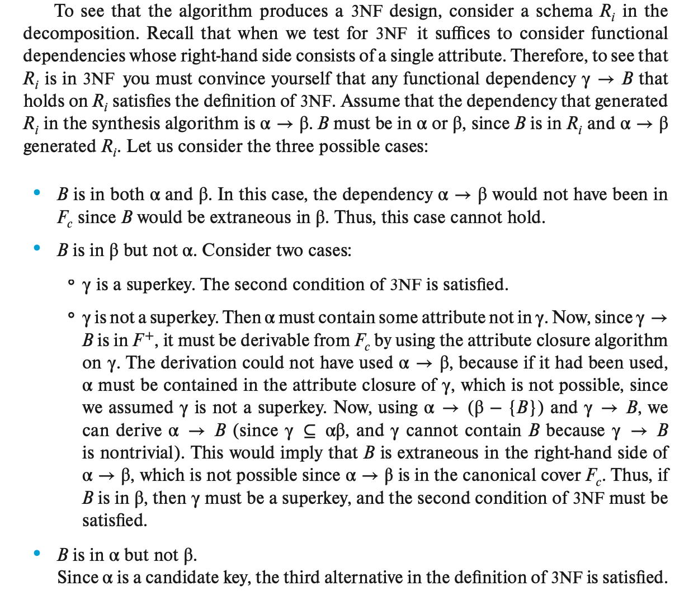
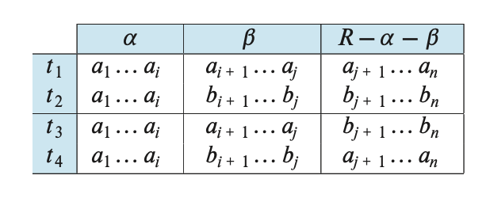

# Lec 7: Relational Database Design

<!-- head 元素一定要放在一级标题下面，不然标题就显示不出来了 -->
<head>
    <script src="https://cdnjs.cloudflare.com/ajax/libs/KaTeX/0.16.7/katex.min.js"
            integrity="sha512-EKW5YvKU3hpyyOcN6jQnAxO/L8gts+YdYV6Yymtl8pk9YlYFtqJgihORuRoBXK8/cOIlappdU6Ms8KdK6yBCgA=="
            crossorigin="anonymous" referrerpolicy="no-referrer">
    </script>
    <link rel="stylesheet" href="https://cdn.jsdelivr.net/npm/pseudocode@latest/build/pseudocode.min.css">
    <script src="https://cdn.jsdelivr.net/npm/pseudocode@latest/build/pseudocode.min.js">
    </script>
</head>

!!! info "注"

    可以看到，我的笔记里有很多的 TBD——是的，这章内容太 abstract 了，我实在学不进去力，所以打算期末的时候重新再学了，到时候会填上这些坑的～


## Introduction

总的来说，**关系数据库**(relational database)的设计目的是得到一组关系模式(relational schema)，用来存放无重复的信息，并便于我们检索这些信息。要做到这点，在设计的时候需要遵循合适的**范式**(normal form)，而挑选范式的时候需要同时考虑现实问题和 E-R 图的设计。

然而，在设计关系模式的过程中，我们可能经常会遇到模式中包含冗余信息的情况，由于这样会带来数据不一致(inconsistent)的问题，所以需要尽可能避免。下面介绍其中一种解决方案——**分解**包含冗余信息的关系模式。


### Decomposition

**分解**(decomposition)就是将一个（往往包含冗余信息的）模式拆分成几个更小的模式。我们希望通过这样的分解，将一个包含冗余信息的模式分为多个没有冗余信息的小模式。但这个过程并不总是一帆风顺的——

- 有时经过一次乃至多次分解后，得到的模式可能还是包含冗余信息的；
- 即使分解得到的模式都是不冗余的，但通过自然连接将它们拼好得到的模式包含了更多冗余的，甚至是没有意义的信息。我们称这样的分解为**有损分解**(lossy decomposition)，相对应的就是**无损分解**(lossless decomposition)。

用形式化的语言解释无损分解：令 $R$ 为一个关系模式，$R_1, R_2$ 是 分解 $R$ 得到的模式，也就是说 $R = R_1 \cup R_2$。如果用 $R_1, R_2$ 替代 $R$ 后没有出现信息的损失，那么这种分解称为无损分解。更精确的说法是：对于所有**合法的**(legal)数据库实例[^1]，关系 $r$ 包含和下列 SQL 查询结果相同的一组元组：

[^1]: 关系中满足现实问题中的所有约束条件的实例被称为**合法实例**(legal instance)

```sql
SELECT *
FROM (
    SELECT R_1 FROM r
) NATURAL JOIN (
    SELECT R_2 FROM r
)
```

上述 SQL 语句等价于关系代数：$\prod_{R_1}(r) \bowtie \prod_{R_2}(r) = r$。

对应的，如果是有损分解，那么这个自然连接就是原始关系的超集，用关系代数表述为：$r \subset \prod_{R_1}(r) \bowtie \prod_{R_2}(r) $。


### Normalization Theory

设计关系数据库时用于避免重复信息问题的方法论被称为**规范化**(normalization)，具体来说：

- 该方法能够用来确定一个关系模式是否“形式良好”，这里就涉及到各种不同的形式（称为**范式**），后面会详细讲解
- 如果一个关系模式的形式不好，那么就要对其进行分解，得到的每个关系模式应该遵循某种合适的范式；且这样的分解必须是无损分解

在正式介绍范式前，我们需要先了解一下**函数依赖**的概念，它是建立范式的基础。


## Functional Dependencies

??? info "记号约定"

    - 希腊字母（$\alpha, \beta, \gamma, \delta, \dots$）表示**一组属性**，而 $\alpha \beta = \alpha \cup \beta$
    - $R$ 表示关系模式
    - $K$ 表示超键
    - 小写字母表示关系
    - $r(R)$ 同时表示关系模式和关系


### Keys and Functional Dependencies

先回顾**超键**(superkey)的概念：它是用于识别关系中唯一元组的**一组属性**，具体定义为：$K$ 是 $R$ 的子集，在所有 $r(R)$ 中的合法实例，对于所有的元组对 $t_1, t_2$，当 $t_1 \ne t_2$ 时 $t_1[K] \ne t_2[K]$，那么 $K$ 就是 $r(R)$ 的超键。

对应地，**函数依赖**(functional dependencies)是用于识别关系中唯一特定属性值的**一组约束**。对于关系模式 $r(R)$ 及其属性 $\alpha, \beta \subseteq R$，

- 对于 $r(R)$ 的一个实例，如果对于其所有的元组对 $t_1, t_2$，当 $t_1[\alpha] = t_2[\alpha]$ 时，$t_1[\beta] = t_2[\beta]$，那么称该实例满足函数依赖 $\alpha \rightarrow \beta$
- 若 $r(R)$ 上所有的实例均满足函数依赖 $\alpha \rightarrow \beta$，那么称该依赖在 $r(R)$ 上**有效**(hold)
    - 所以可能会存在某个实例满足一些不在整个关系模式中有效的函数依赖的情况

我们可以用函数依赖的概念重新定义超键：如果 $K \rightarrow R$ 在 $r(R)$ 上有效，那么 $K$ 就是 $r(R)$ 的超键。

函数依赖的用途：

- 检验关系实例是否满足某个给定的函数依赖 $F$
- 为某组合法关系指明约束，这样我们仅需考虑那些满足函数依赖的关系实例即可

对于某个函数依赖 $\alpha \rightarrow \beta$，如果 $\beta \subseteq \alpha$，那么这个函数依赖是**平凡的**(trivial)。

!!! note "闭包(closure)"

    对于函数依赖 $F$（集合），它的**闭包**记作 $F^+$，包含了所有从 $F$ 中推出来的（，以及 $F$ 自身的）函数依赖


### Lossless Decomposition and Functional Dependencies

现在我们用函数依赖来定义无损分解：当满足至少一项下面来自 $F^+$ 的函数依赖时，$R_1, R_2$ 为 $R$ 的无损分解：

- $R_1 \cap R_2 \rightarrow R_1$
- $R_1 \cap R_2 \rightarrow R_2$

换句话说，如果 $R_1 \cap R_2$ 是 $R_1$ 或 $R_2$ 的超键时，这个分解就是无损分解。

假如将关系模式 $r(R)$ 分解为 $r_1(R_1), r_2(R_2)$，其中 $R_1 \cap R_2 \rightarrow R_1$，那么必须得向分解得到的模式添加以下 SQL 约束，以确保它们的内容和原始模式的一致性：

- $R_1 \cap R_2$ 是 $r_1$ 的主键
- $R_1 \cap R_2$ 是参照 $r_1$ 的 $r_2$ 的外键，确保 $r_2$ 的每个元组都能与 $r_1$ 的元组匹配

如果 $r_1, r_2$ 进一步分解，只要分解能够确保 $R_1 \cap R_2$ 的所有属性能在一个关系中，那么 $r_1$ 或 $r_2$ 的主键或外键约束会被那个关系继承下来。


## Normal Forms

### Boyce-Codd Normal Form

**Boyce-Codd 范式**(Boyce-Codd normal form，以下简称 **BCNF**)能够基于函数依赖消除全部的冗余。关于函数依赖集合 $F$ 的关系 $R$ ，对于所有的在 $F^+$ 的函数依赖 $\alpha \rightarrow \beta$，其中 $\alpha \subseteq R, \beta \subseteq R$，至少满足以下条件之一时，称 $R$ 遵循 BCNF：

- $\alpha \rightarrow \beta$ 是一个平凡的函数依赖
- $\alpha$ 是模式 $R$ 的超键

!!! note "注"

    任何只有两个属性的模式都遵守 BCNF（诸位可自行证明）。

对于不遵守 BCNF 的模式（即至少有一个非平凡的函数依赖 $\alpha \rightarrow \beta$，$\alpha$ 不是 $R$ 的超键），我们需要对其进行分解为：

- $(\alpha \cup \beta)$
- $(R - (\beta - \alpha))$

当然，可能分解一次还是会出现不遵守 BCNF 的模式，那就对其再次分解，直到结果都遵循 BCNF 为止。

---
前面我们已经了解了一些表达数据库一致性约束的方法，比如主键约束、函数依赖、`CHECK` 约束、断言、触发器等等。但每次更新数据库时检验这些约束的成本较高，因此我们需要一种更高效的检验方法——只检验其中一个关系。然而在某些情况下，分解得到一些遵守 BCNF 的模式反而会阻止我们对特定函数依赖的高效检验，比如下面这个例子：

??? example "例子"


从这个例子中可以看到，分解后的模式没有保持原有的函数依赖，即没有做到**依赖保持**(dependency preserving)，而通常依赖保持是很重要的，因此我们需要采取另一种比 BCNF 更弱的范式来允许我们保持依赖，这就是下面即将介绍的**第三范式**。


### Third Normal Form

关于函数依赖集合 $F$ 的关系 $R$ ，对于所有的在 $F^+$ 的函数依赖 $\alpha \rightarrow \beta$，其中 $\alpha \subseteq R, \beta \subseteq R$，至少满足以下条件之一时，称 $R$ 遵循**第三范式**(third normal form，以下简称 **3NF**)：

- $\alpha \rightarrow \beta$ 是一个平凡的函数依赖
- $\alpha$ 是模式 $R$ 的超键
- 在 $\beta - \alpha$ 内的每个属性 $A$ 是 $R$ 的（可能是不同的）候选键的一个成员

可以看到，3NF 的前两个条件和 BCNF 相同，只是新增了第3个条件，可以让那些左侧不是超键的非平凡函数依赖也有机会符合这个范式。这个更为松弛的条件使得 3NF 能够确保模式分解时仍然保留了原有的依赖。

对比 BCNF，3NF 的优劣有：

- 优点：可以让关系模式在不牺牲无损或依赖保留的情况下遵循 3NF
- 缺点：可能会带来 null 值，说明存在信息重复的问题

---
综上，在带有函数依赖的数据库设计中，我们希望达到以下目标：

- **BNCF**
- **无损性**
- **依赖保留**

---
值得注意的是，SQL 并没有提供一种指明函数依赖的方式，当然你也可以尝试用 `PRIMARY KEY` 或 `UNIQUE` 约束来声明超键，或者用一个复杂的断言来表述函数依赖，但断言的检验成本过高。所以即使我们有了一种依赖保留的分解，如果仅使用 SQL 语句的话，那么也只能快速检验那些左侧是键的函数依赖。

当分解无法保留依赖的话，就需要将函数依赖连接(join)起来，如果数据库系统支持对**实体化视图**使用 `PRIMARY KEY` 或 `UNIQUE` 约束的话，那么我们可以通过将连接后的结果存到实体化视图的方式来降低检验函数依赖的成本。这种方法的缺点是需要额外的时间空间来维护一个实体化视图，但优点是让数据库系统来帮我们维护实体化视图，我们就无需操心每次数据库更新时还要对视图进行同步更新的事情。但不幸的是，大多数数据库并没有对实体化视图支持约束，甚至不支持实体化视图。

所以，如果 BNCF 和依赖保留不能做到“鱼和熊掌同时兼得”的话，那么还是优先考虑 BCNF，因为可以看到在 SQL 中实现依赖保留还是很困难的。


### More Normal Forms

- 4NF：见[下面](#fourth-normal-form)，但最好按顺序往下阅读。
- 5NF：基于一种泛化的[多值依赖](#multivalued-dependencies)——**连接依赖**(join dependencies)，又称为**投影-连接范式**(project-join normal form, PJNF)
    - 这种范式的缺点在于不仅难以推理，而且它的推理规则不具备合理性和完整性
- 2NF：一般不会关心这个范式（查了资料发现 2NF 的问题可以用 3NF 解决）
- 1NF：下面马上介绍


### Atomic Domains and First Normal Form

对于关系模式 $R$，如果它所有属性的域具备**原子性**(atomic)（即无法被分割为更小的单元），那么 $R$ 遵守**第一范式**(first normal form)。

!!! warning "注意"

    对于关系数据库而言，所有的关系都必须遵守 1NF！

显然，复合属性的域就不具备原子性；而我们一般假设整数具备原子性，但整个整数集构成的域就不具备原子性了。所以关键不域本来是什么样子的，而是我们该如何使用域里面的元素。

非原子性带来的问题包括：复杂的存储，带来冗余数据，复杂的查询等。

下面给出一些处理非原子性的属性值的方式：

- 对于复合属性：直接使用其组件属性
- 对于多值属性：多字段/单独用一张表/单个字段

但有时不具备原子性的属性值还是有用武之地的，比如对复合属性就很有用。因此，当实体是一个复杂的结构时，立马使用 1NF 反而形成不必要的负担（转换为原子性的属性，而且这种转换会产生额外的时间开销）。


## Functional-Dependency Theory

### Closure of Functional Dependencies

对于给定的关系模式 $r(R)$，如果其中的每个满足函数依赖集合 $F$ 的实例也同样满足函数依赖 $f$，那么称在 $R$ 上的 $f$ 由 $F$ **逻辑蕴含**(logically implied)。

再次回顾[**闭包**](#keys-and-functional-dependencies)(closure)的概念。

我们可以通过*重复*运用下面的三条规则，来寻找所有逻辑蕴含的函数依赖，而这些规则称为**阿姆斯特朗公理**(Armstrong's axioms)：

- **自反律**(reflexivity rule)：如果 $\alpha$ 是一组属性，且 $\beta \subseteq \alpha$，那么 $\alpha \rightarrow \beta$ 有效
- **增广律**(augmentation rule)：如果 $\alpha \rightarrow \beta$ 有效，且 $\gamma$ 是一组属性，那么 $\gamma \alpha \rightarrow \gamma \beta$ 有效
- **传递律**(transitivity rule)：如果 $\alpha \rightarrow \beta, \beta \rightarrow \gamma$ 均有效，那么 $\alpha \rightarrow \gamma$ 有效

阿姆斯特朗公理具有两个特点：

- **合理性**(soundness)：不产生任何错误的函数依赖
- **完整性**(completeness)：对于给定的函数依赖 $F$，总能够生成完整的 $F^+$

但如果只有上述规则的话，计算 $F^+$ 就比较麻烦了，因此下面再给出3条额外的规则，读者可以使用上述规则推导得到：

- **合并律**(union rule)：如果 $\alpha \rightarrow \beta, \alpha \rightarrow \gamma$ 有效，那么 $\alpha \rightarrow \beta \gamma$ 有效
- **分解律**(decomposition rule)：如果 $\alpha \rightarrow \beta \gamma$ 有效，那么 $\alpha \rightarrow \beta, \alpha \rightarrow \gamma$ 有效
- **伪传递律**(pseudotransitivity rule)：如果 $\alpha \rightarrow \beta, \gamma \beta \rightarrow \delta$ 有效，那么 $\alpha \gamma \rightarrow \delta$ 有效

通过阿姆斯特朗公理，可以得到以下计算闭包 $F^+$ 的流程：

<pre class="pseudocode" lineNumber="true">
\begin{algorithm}
\caption{A procedure to compute $F^+$}
\begin{algorithmic}
\STATE $F^+ = F$
\STATE apply the reflexivity rule
\COMMENT{Generates all trivial dependencies}
\REPEAT
    \FORALL{functional dependency $f$ in $F^+$}
        \STATE apply the augmentation rule on $f$
        \STATE add the resulting functional dependencies to $F^+$
    \ENDFOR
    \FORALL{pair of functional dependencies $f_1$ and $f_2$ in $F^+$}
        \IF{$f_1$ and $f_2$ can be combined using transitivity}
            \STATE add the resulting functional dependency to $F^+$
        \ENDIF
    \ENDFOR
\UNTIL{$F^+$ does not change any further}
\end{algorithmic}
\end{algorithm}
</pre>

一个函数依赖的左右两侧都是关系模式 $R$ 的子集，若 $R$ 有 $n$ 个属性，那么就有 $2^n$ 个子集，因此产生总共 $2^{2n}$ 种可能的函数依赖，所以上述过程的时间复杂度是指数级的。


### Closure of Attribute Sets

对于属性 $B$ 和某组属性 $\alpha$，如果满足 $\alpha \rightarrow B$，那么 $B$ 是被 $\alpha$ **按功能确定的**(functionally determined)。为了检验 $\alpha$ 是否为超键，我们要设计一个算法来计算由 $\alpha$ 按功能确定的属性。一种方法是计算闭包 $F^+$，但显然计算成本太大不合适。所以我们采取另一种算法——直接计算 $\alpha$ 的闭包 $\alpha^+$（即属性闭包），它包含了在一组函数依赖 $F$ 下 $\alpha$ 能够按功能确定的所有属性。下面给出伪代码：

<pre class="pseudocode" lineNumber="true">
\begin{algorithm}
\caption{A algorithm to compute $\alpha^+$, the closure of $\alpha$ under $F$}
\begin{algorithmic}
\STATE $result := \alpha;$
\REPEAT
    \FORALL{functional dependency $\beta \rightarrow \gamma$ in $F$}
        \IF{$\beta \subseteq result$}
            \STATE $result := result \cup \gamma;$
        \ENDIF
    \ENDFOR
\UNTIL{($result$ does not change)}
\end{algorithmic}
\end{algorithm}
</pre>

??? proof "正确性证明"

    TBD

在最坏情况下，属性闭包算法的时间复杂度是 $F$ 大小的二次方，通常会比直接计算 $F^+$ 更快。该算法有以下几种用途：

- 检验 $\alpha$ 是否为超键：计算 $\alpha^+$，然后看它是否包含了 $R$ 的所有属性
- 检验函数依赖 $\alpha \rightarrow \beta$ 是否有效：通过检查 $\beta \subseteq \alpha^+$ 实现
- 提供另一种计算 $F^+$ 的方法：$\forall \gamma \subseteq R$，找到其闭包 $\gamma^+$，然后 $\forall S \subseteq \gamma^+$，得到函数依赖 $\gamma \rightarrow S$
 

### Canonical Cover

假设某个关系模式有一组函数依赖 $F$，如果某次对关系的更新破坏了已有的函数依赖，那么数据库系统必须回滚这次更新，所以每次更新的时候都要进行一次检查，这样花费的成本较高。一种降低成本的方法是检查一个简化版的函数依赖集合，这个集合的闭包和原函数依赖集合的闭包是一样的，但是检查这个简化版的集合更加容易。在介绍如何构造这样的集合前，先来了解什么是**多余的**(extraneous)属性：被移除后不回改变函数依赖闭包内容的属性。

- 移除函数依赖**左侧**的属性将形成一个**更强**的约束
    - 举例：TBD
- 移除函数依赖**右侧**的属性将形成一个**更弱**的约束
    - 举例：TBD

**多余属性**的正式定义为：考虑函数依赖集合 $F$ 以及其中的一个函数依赖 $\alpha \rightarrow \beta$

- **左侧**属性的移除：对于属性 $A \in \alpha$，当 $F$ 逻辑蕴含 $(F - \{\alpha \rightarrow \beta\}) \cup \{(\alpha - A) \rightarrow \beta\}$ 时，$A$ 是 $\alpha$ 内多余的属性。
- **右侧**属性的移除：对于属性 $A \in \beta$，当$(F - \{\alpha \rightarrow \beta\}) \cup \{(\alpha \rightarrow (\beta - A))\}$ 逻辑蕴含 $F$ 时，$A$ 是 $\beta$ 内多余的属性。

>注：即使上述关于逻辑蕴含的语句倒过来表述也是对的（根据自反律）。

!!! note "具体判断多余属性的方法"

    >和定义相同的前提。

    - 如果 $A \in \beta$，考虑集合 $F' = (F - \{\alpha \rightarrow \beta\}) \cup \{(\alpha \rightarrow (\beta - A))\}$，然后检查 $\alpha \rightarrow A$ 是否能从 $F'$ 中推断得到。具体来说，计算 $F'$ 下的 $\alpha^+$，若 $\alpha^+$ 包含属性 $A$，那么 $A$ 是 $\beta$ 内多余的属性。
    - 如果 $A \in \alpha$，令 $\gamma = \alpha - \{A\}$，检查 $\gamma \rightarrow \beta$ 是否能从 $F$ 中推断得到。具体来说，计算 $F$ 下的 $\gamma^+$，若 $\alpha^+$ 包含 $\beta$ 内的所有属性，那么 $A$ 是 $\alpha$ 内多余的属性。

---
有了多余属性的概念后，接下来我们就着手构造这个简化版的函数依赖集合，一般称之为**正则覆盖**(canonical cover)，记作 $F_c$，它既能够逻辑蕴含 $F$ 的所有依赖，又能被 $F$ 逻辑蕴含其所有的依赖，并且还具备以下性质：

- $F_c$ 的函数依赖**不包含多余属性**
- $F_c$ 的函数依赖的**左侧是唯一的**，也就是说不存在两个依赖 $\alpha_1 \rightarrow \beta_1, \alpha_2 \rightarrow \beta_2$ 使得 $\alpha_1 = \alpha_2$

计算正则覆盖的算法如下所示：

<pre class="pseudocode" lineNumber="true">
\begin{algorithm}
\caption{Computing canonical cover}
\begin{algorithmic}
    \STATE $F_c = F$
    \REPEAT
        \STATE Use the union rule to repalce any dependencies in $F_c$ of the form
            \STATE $\quad \quad \alpha_1 \rightarrow \beta_1$ and $\alpha_1 \rightarrow \beta_2$ with $\alpha_1 \rightarrow \beta_1 \beta_2$
        \STATE Find a functional dependency $\alpha \rightarrow \beta$ in $F_c$ with an extraneous
            \STATE $\quad \quad$ attribute either in $\alpha$ or $\beta$
        
        \COMMENT{Note: the test for extraneous attributes is done using $F_c$, not $F$}
        \IF{an extraneous attribute is found}
            \STATE delete it from $\alpha \rightarrow \beta$ in $F_c$
        \ENDIF
    \UNTIL{($F_c$ does not change)}
\end{algorithmic}
\end{algorithm}
</pre>

因为该算法允许选择任意的多余属性，因此可能会得到多种正则覆盖，而这些正则覆盖都是等价的。

??? example "例子"

    TBD


### Dependency Preservation

令 $F$ 为模式 $R$ 的一个函数依赖集合，$R_1, R_2, \dots, R_n$ 为 $R$ 的一个分解，那么针对 $R_i$ 的 $F$ 的**限制**(restriction) $F_i$ 是一个来自 $F^+$ 的集合，但仅包含 $R_i$ 中出现的属性。检查这些限制集合 $F_1, F_2, \dots, F_n$ 相比检查 $F$ 会更高效。令 $F' = F_1 \cup F_2 \cup \dots \cup F_n$，通常来说 $F' \ne F$，但即便确实如此，也很有可能满足 $F'^+ = F^+$，那么此时在 $F$ 中的每个依赖都被 $F'$ 逻辑蕴含，所以验证 $F'$ 就相当于验证 $F$ 了。我们称具备这种性质的分解为**依赖保留分解**(dependency-preserving decomposition)。

下面给出一种检验依赖保留的算法：

<pre class="pseudocode" lineNumber="true">
\begin{algorithm}
\caption{Computing canonical cover}
\begin{algorithmic}
    \STATE compute $F^+$
    \FORALL{schema $R_1$ in $D$}
        \STATE $F_i$ := the restriction of $F^+$ to $R_1$; 
    \ENDFOR
    \STATE $F' := \emptyset$
    \FORALL{restriction $F_i$}
        \STATE $F' = F' \cup F_1$
    \ENDFOR
    \STATE compute $F'+$;
    \IF{($F'^+ = F^+$)}
        \RETURN \TRUE
    \ELSE
        \RETURN \FALSE
    \ENDIF
\end{algorithmic}
\end{algorithm}
</pre>

该算法计算了 $F^+$，计算成本显然很大，因此这并不是一个好方法。下面给出两种解决方案：

- 如果 $F$ 内的每个成员能够在分解中的某个关系上被检查，那么说明这个分解保留了依赖。但这种方法并不总是有效，因为即使分解是依赖保留的，但是可能会出现仅看其中的一个关系无法检测依赖的情况。所以这个方法只是一个充分条件
- 对于 $F$ 中的每个依赖 $\alpha \rightarrow \beta$，执行以下过程：

    <pre class="pseudocode" lineNumber="true">
    \begin{algorithm}
    \caption{Alternative test for dependency preservation}
    \begin{algorithmic}
        \STATE $result = \alpha$
        \REPEAT
            \FORALL{$R_i$ in the decomposition}
                \STATE $t = (result \cap R_i)^+ \cap R_i$
                \STATE $result = result \cap t$
            \ENDFOR
        \UNTIL{($result$ does not change)}
    \end{algorithmic}
    \end{algorithm}
    </pre>

    如果 $result$ 包含了 $\beta$ 中的所有属性，那么函数依赖 $\alpha \rightarrow \beta$ 就会被保留。当且仅当通过上述过程，证明 $F$ 中的所有依赖都能被保留时，该分解就是依赖保留的。上述过程体现了两个思想：

    - 检验 $F$ 中的每个函数依赖，来看它是否在 $F'$（在 Algorithm 4 里给出定义）中被保留
    - 使用属性闭包算法的变形来计算 $F'$ 下的闭包，但不需要真的将 $F'$ 算出来

    上述算法的时间复杂度时多项式时间的。


## Algorithms for Decomposition Using Functional Dependencies

### BCNF Decomposition

虽然可以直接根据定义检验一个关系是否符合 BCNF 的，但由于计算 $F^+$ 太麻烦，所以我们简化了这个检验过程：

- 要检查一个非平凡依赖 $\alpha \rightarrow \beta$ 是否违背了 BCNF，就要计算 $\alpha^+$，然后检验它包含 $R$ 的所有属性，也就是说它是 $R$ 的一个超键
- 要检查一个关系模式 $R$ 是否符合 BCNF 的，只要找到 $F$ 中的违反 BCNF 的依赖即可，无需检查 $F^+$ 中的所有依赖。如果 $F$ 中没有依赖违反 BCNF，那么也可以说明 $F^+$ 中没有依赖违反 BCNF
    - 然而，对于分解得到的关系模式，该方法就失效了，因为用 $F$ 检验从 $R$ 中分解而来的模式 $R_i$ 是不充分的。所以改进方法为：对于 $R_i$ 的每个子集 $\alpha$，检查闭包 $\alpha^+$ 是否不包含属性 $R_i - \alpha$，或者包含 $R_i$ 的全部属性。如果某些 $\alpha$ 不满足条件，考虑以下函数依赖：$\alpha \rightarrow (\alpha^+ - \alpha) \cap R_i$，该依赖表明 $R_i$ 违反了 BCNF

---
下面给出 **BCNF 分解算法**：

<pre class="pseudocode" lineNumber="true">
\begin{algorithm}
\caption{BCNF decomposition algorithm}
\begin{algorithmic}
    \STATE $result := \{R\}$;
    \STATE $done := $ \FALSE;
    \WHILE{\NOT $done$}
        \IF{(there is a schema $R_i$ in $result$ that is not in BCNF)}
            \STATE let $\alpha \rightarrow \beta$ be a nontrivial functional dependency that holds
            \STATE on $R_i$ such that $\alpha^+$ does not contain $R_i$ and $\alpha \cap \beta = \emptyset$
            \STATE $result := (result - R_i) \cup (R_i - \beta) \cup (\alpha, \beta)$
        \ELSE
            \STATE $done :=$ \TRUE;
        \ENDIF
    \ENDWHILE
\end{algorithmic}
\end{algorithm}
</pre>

上述分解不仅保证是遵守 BCNF 的，还能保证是无损的，原因是：

>TBD

该算法的时间复杂度是指数级的。当然也存在多项式时间复杂度的算法，但是这样的算法会有“过规范化(overnormalize)”的问题，即会进行不必要的分解操作。

??? example "例子"

    TBD


### 3NF Decomposition

下面给出 3NF 下的依赖保留的无损分解的算法：

<pre class="pseudocode" lineNumber="true">
\begin{algorithm}
\caption{3NF decomposition algorithm}
\begin{algorithmic}
    \STATE $F_c$ be a canonical cover for $F$;
    \STATE $i := 0;$
    \FORALL{functional dependency $\alpha \rightarrow \beta$ in $F_c$}
        \STATE $i := i + 1;$
        \STATE $R_i := \alpha \beta;$
    \ENDFOR
    \IF{none of the schemas $R_j, j = 1, 2, \dots, i$ contains a candidate key for $R$}
        \STATE $i := i + 1;$
        \STATE $R_i :=$ any candidate key for $R$;
        \COMMENT{Optionally, remove redundant relations}
    \ENDIF
    \REPEAT
        \IF{any schema $R_j$ is contained in another schema $R_k$}
            \COMMENT{Delete $R_j$}
            \STATE $R_j := R_i;$
            \STATE $i := i - 1;$
        \ENDIF
    \UNTIL{no more $R_j$s can be deleted}
    \RETURN ($R_1, R_2, \dots, R_i$)
\end{algorithmic}
\end{algorithm}
</pre>

借助该算法，我们还可以重新设计 BCNF 分解算法：首先使用 3NF 算法，然后对于分解中不是 BCNF 的模式再次使用 BCNF 算法，如果得到的结果没能保留依赖，那就回退到 3NF 的设计。

3NF 算法得到的结果是不唯一的，因为一个函数依赖集合里面可能包含多个正则覆盖。而且该算法可能会分解那些已经遵守 3NF 的关系，但它能够保证分解的结果还是遵守 3NF 的。

虽然检验一个给定模式是否遵守 3NF 是一个 NP-hard 问题，但是 3NF 分解算法的时间复杂度是多项式级的。

??? proof "3NF 算法的正确性证明"

    <div style="text-align: center">
        
    </div>


## Decomposition Using Multivalued Dependencies

### Multivalued Dependencies

函数依赖会排除一些特定的元组，比如对于函数依赖 $A \rightarrow B$，我们就要去掉那些 $A$ 相同但 $B$ 不同的元组。但对于**多值依赖**(multivalued dependency)而言，我们不会排除这样的元组。因此，函数依赖有时被称作**等价生成依赖**(equality-generating dependencies)，而多值依赖则称作**元组生成依赖**(tuple-generating dependencies)。

下面给出多值依赖的正式定义：令 $r(R)$ 为一个关系模式，$\alpha \subseteq R$ 且 $\beta \subseteq R$，当对于 $r(R)$ 中任意合法实例 $r$，对其中任意一对元组 $t_1, t_2$，满足 $t_1[\alpha] = t_2[\alpha]$，在 $r$ 中存在元组 $t_3, t_4$，使得：

$$
t_1[\alpha] = t_2[\alpha] = t_3[\alpha] = t_4[\alpha] \\
t_3[\beta] = t_1[\beta] \\
t_3[R - \beta] = t_2[R - \beta] \\
t_4[\beta] = t_2[\beta] \\
t_4[R - \beta] = t_1[R - \beta]
$$

那么在 $R$ 上的多值依赖 $\alpha \twoheadrightarrow \beta$ 有效。下面用表格来表示上述五个等式：

<div style="text-align: center">
    
</div>

多值依赖  $\alpha \twoheadrightarrow \beta$ 表明，$\alpha, \beta$ 之间的联系和 $\alpha, R - \beta$ 的联系是独立的。如果在 $R$ 上的所有关系都满足 $\alpha \twoheadrightarrow \beta$ 的话，那么 $\alpha \twoheadrightarrow \beta$ 是 $R$ 上的**平凡**(trivial)多值依赖，即当 $\beta \subseteq \alpha$ 或 $\beta \cup \alpha = R$ 时，$\alpha \twoheadrightarrow \beta$ 是平凡的。

多值依赖的用途有：

- 检验在给定的一组函数依赖和多值依赖下的关系是否合法
- 指明一组合法关系的约束，这样的话我们就仅需考虑那些满足给定的函数依赖和多值依赖下的关系

如果关系 $r$ 不满足给定的多值依赖，我们可以通过向 $r$ 增加元组来构造一个关系 $r'$，使得 $r'$ 满足多值依赖。

令 $D$ 为函数依赖和多值依赖的一个集合，它的闭包 $D^+$ 就是所有被 $D$ 逻辑蕴含的函数依赖和多值依赖的集合，可通过函数依赖和多值依赖的定义计算出来。

根据多值依赖的定义，我们可以得到以下规律（$\alpha, \beta \subseteq R$）：

- 如果 $\alpha \rightarrow \beta$，那么 $\alpha \twoheadrightarrow \beta$，也就是说所有的函数依赖都是多值依赖
- 如果 $\alpha \twoheadrightarrow \beta$，那么 $\alpha \twoheadrightarrow R - \alpha - \beta$


### Fourth Normal Form

关于函数依赖和多值依赖的集合 $D$ 的关系 $R$ ，对于所有的在 $D^+$ 的多值依赖 $\alpha \twoheadrightarrow \beta$，其中 $\alpha \subseteq R, \beta \subseteq R$，至少满足以下条件之一时，称 $R$ 遵循**第四范式**(fourth normal form，以下简称 **4NF**)：

- $\alpha \twoheadrightarrow \beta$ 是平凡多值依赖
- $\alpha$ 是 $R$ 的超键

可以看到，和 BCNF 最大的区别在于第一个条件用到的是多值依赖。再结合上面的两条规律，可以发现每个遵守 4NF 的模式同样遵守 BCNF。

令 $R_1, R_2, \dots, R_n$ 为 $R$ 的一个分解，要检查每个关系模式 $R_i$ 是否遵循 4NF，我们要找到在 $R_i$ 上有效的多值依赖。对于函数依赖和多值依赖的集合 $D$，针对 $R_i$ 的 $D$ 的**限制**(restriction) $D_i$ 包括：

- 所有仅包含 $R_i$ 具有的属性的位于 $D^+$ 的函数依赖
- 所有形如 $\alpha \twoheadrightarrow \beta \cap R_i$ 的多值依赖，其中 $\alpha \subseteq R_i$ 且 $\alpha \twoheadrightarrow \beta$ 在 $D^+$ 内


### 4NF Decomposition

下面给出 4NF 分解算法，它同时也保证分解是无损的，但无法保证保留依赖：

<pre class="pseudocode" lineNumber="true">
\begin{algorithm}
\caption{4NF decomposition algorithm}
\begin{algorithmic}
    \STATE $result := \{R\};$
    \STATE $done := $ \FALSE;
    \STATE compute $D^+$; Given schema $R_i$, let $D_i$ denote the restriction of $D^+$ to $R_i$
    \WHILE{(\NOT $done$)}
        \IF{(there is a schema $R_i$ in $result$ that is not in 4NF w.r.t. $D_i$)}
            \STATE let $\alpha \twoheadrightarrow \beta$ be a nontrivial multivalued dependency that holds
            \STATE on $R_i$ such that $\alpha \rightarrow R_i$ is not in $D_i$, and $\alpha \cap \beta = \emptyset$;
            \STATE $result := (result - R_i) \cup (R_i - \beta) \cup (\alpha, \beta);$
        \ELSE
            \STATE $done :=$ \TRUE;
        \ENDIF
    \ENDWHILE
\end{algorithmic}
\end{algorithm}
</pre>


## Database-Design Process

有以下几种设计关系模式 $r(R)$ 的方法：

- 将 E-R 图转换为一组关系模式（上一章所学内容）
- $r(R)$ 可以先是单个的一个关系模式，里面包含了所有感兴趣的属性，之后通过规范化过程将其分解为更小的模式（也就是本章所需的内容）
- 使用你的独门秘籍得到想要的关系模式 $r(R)$，然后检验它是否满足所需的范式

接下来我们检验这几种方法带来的影响，以及在数据库设计中的一些不良实践。


### E-R Model and Normalization

在定义 E-R 图中，可能会有以下问题：

- 实体集内部的属性存在函数依赖
- 对于包含多于两个实体集的联系集，转换得到的关系模式可能不遵守所需的范式
- ...

所以在 E-R 设计过程中，我们可以利用已知的函数依赖来发现这些潜在的不良设计，并进行规范化处理。

创建 E-R 设计的时候会倾向于生成遵守 4NF 的设计。如果多值依赖有效，且不被对应的函数依赖蕴含的话，那么它通常会有以下来源：

- 多对多的联系集
- 实体集的多值属性


### Naming of Attributes and Relationship

数据库设计的一个理想特征是**唯一角色假设**(unique-role assumption)，即每个属性名在数据库中只有一个意思。

- 如果属性在不同的关系中有相同的含义，那么可以使用相同的属性名来表示
- 尽管技术上来说属性名的顺序并不重要，但是习惯上我们会将主键放在最前面，这样会让我们阅读默认输出（`SELECT *` 的结果）更加方便
- 在大型数据库模式中，联系集经常会以其名称拼接对应实体集的方式来命名，中间用连字符（`-`）或下划线（`_`）连接。但有时这种命名方式意义不明，根据具体情况来具体设计
- 不同的组织会有各自的命名习惯。但不管怎样，随着数据库模式规模的扩大，采用一致的命名规则会为数据库设计者和应用程序开发者带来便利


### Denormalization for Performance

有时，数据库设计者反而更青睐带有冗余信息，即不规范的模式，因为在某些应用中，冗余带来了性能的提升，即便需要付出维护重复数据一致的代价。而让规范化数据非规范化的过程称为**反规范化**(denormalization)。


### Other Design Issues

**列联表**(crosstab)


<script>
    pseudocode.renderClass("pseudocode");
</script>