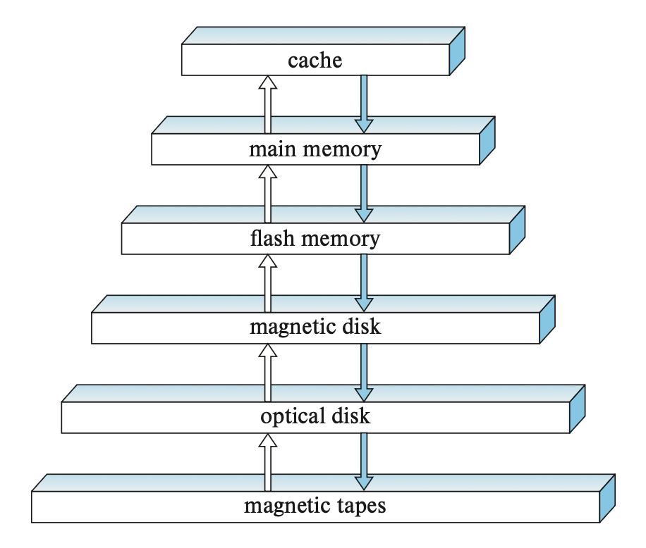
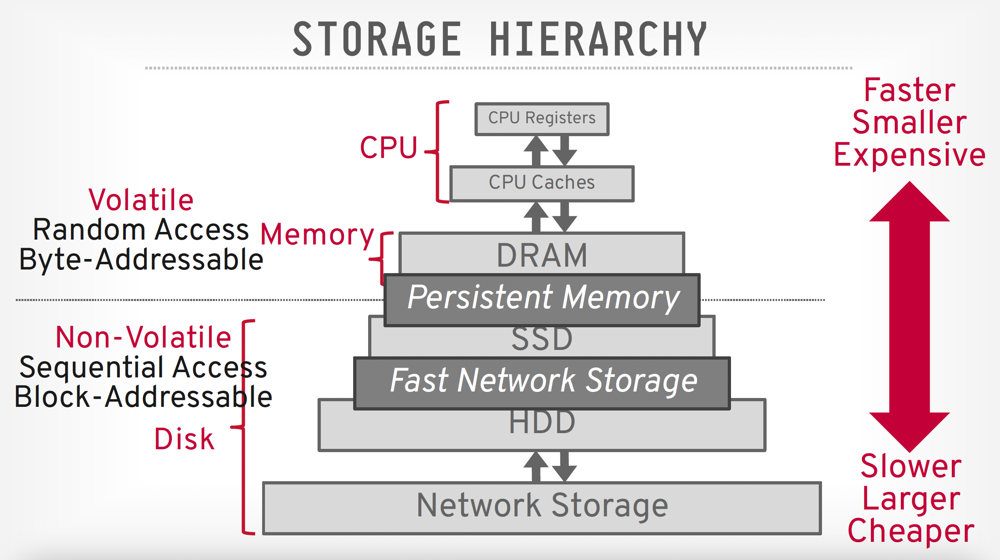
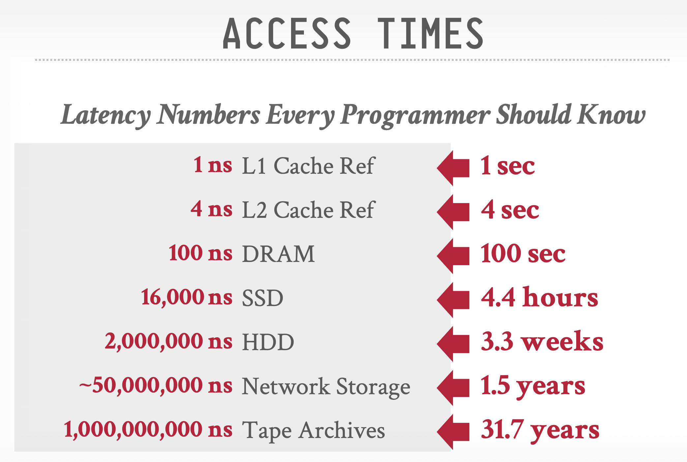
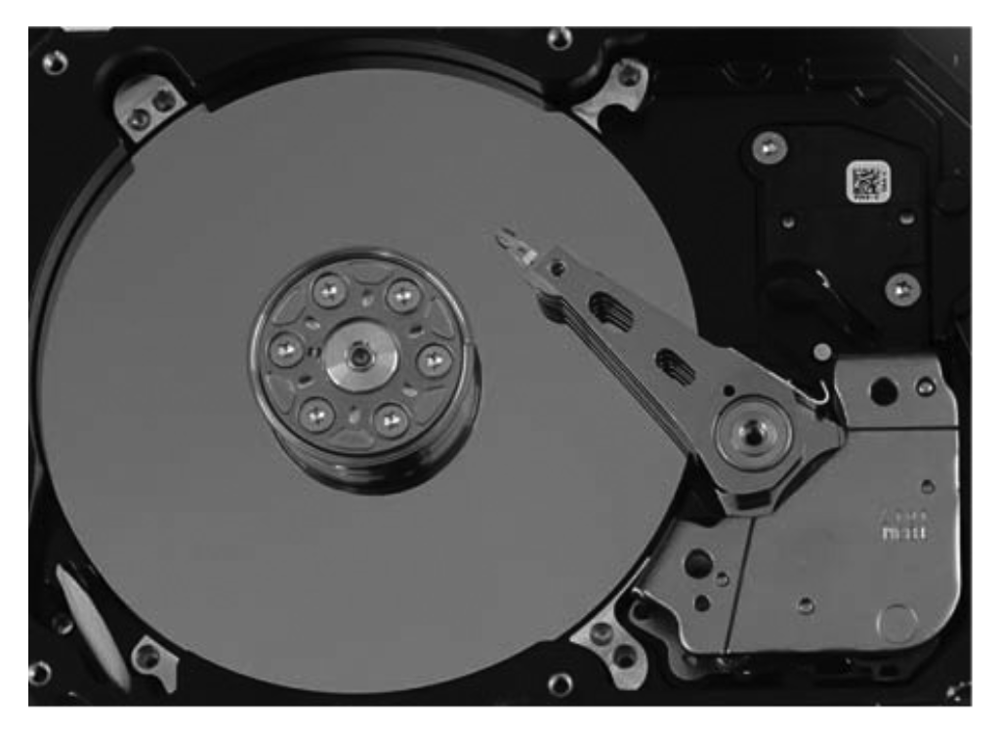
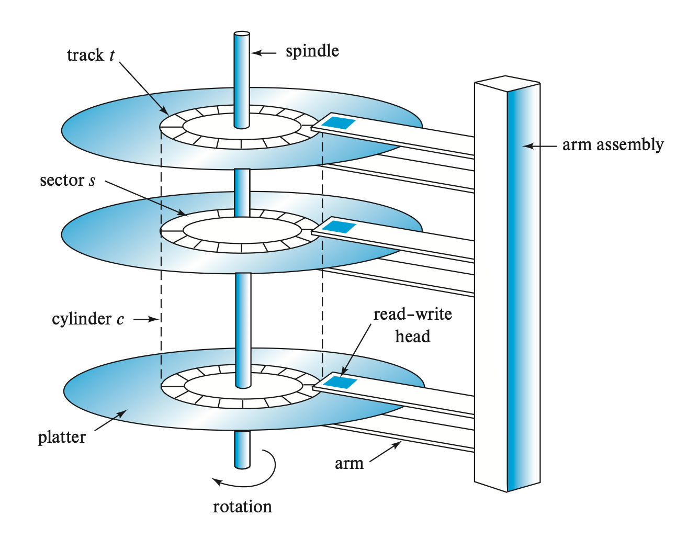
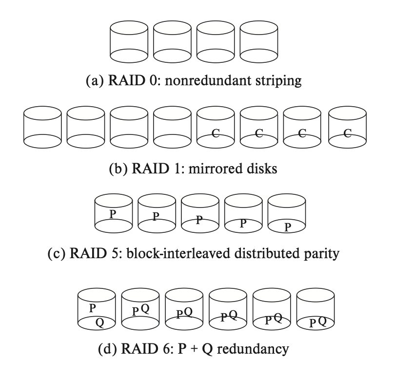
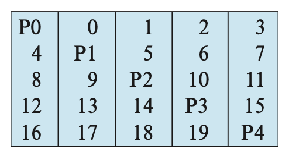

# Lec 8: Physical Storage Systems

!!! info "引入"

    从这一讲开始，我们进入到 DB 课程下半部分的学习了。回忆一下，在上半部分，我们主要介绍的是数据库的应用，比如关系代数、SQL 语法等等，这些知识都是数据库中面向用户的高层级的逻辑部分；而在下半部分，我们将学习“数据库系统”中的“系统”部分（~~所以读者会发现里面的部分内容会和 CO 或 OS 课程重叠，但没有学过的话问题也不大~~）。首先我们来看一下数据库系统中底层的物理存储系统～

## Overview of Physical Storage Media

先给出一张和数据库相关的存储设备层级图：

    

>和计组学过的存储器层级几乎一样hh

- **高速缓存**(cache)
    - 速度最快，但成本也是最贵的
    - 在数据库系统中，我们一般不会考虑高速缓存的选择。但是在设计和查询处理相关的数据结构和算法时，还是得要注意高速缓存的影响
- **主存**(main memory)
    - 和数据相关的操作（由机器指令执行）都是在主存上进行的
    - 一般情况下，对于超大的数据库，主存肯定是放不下的；但有些中小型的数据库是可以直接放在主存中的
    - 主存具有**易失性**(volatile)——当断电或系统崩溃时，主存里的内容就会丢失
- **闪存**(flash memory)
    - 闪存具有**非易失性**(non-volatile)——断电或故障不会导致数据的丢失
    - 常用于相机、智能手机等设备中
    - 基于闪存实现的存储器：U盘、**固态硬盘**(solid-state disk, SSD)（提供和磁盘类似的接口，使得数据可以被按块存储或检索，因而称为**面向块的接口**(block-oriented interface)）
- **磁盘**(magnetic-disk storage)
    - 同样具备非易失性
    - 要访问磁盘的数据比较麻烦：首先系统要将数据从磁盘移到主存上能被访问的地方；当系统执行完指定操作后，修改后的数据必须写回到磁盘中
    - 磁盘的容量正不断扩大，且成本也在逐年降低
- **光学存储器**(optical storage)
    - 包括：DVD(digital video disk)、蓝光(blu-ray) DVD
    - 有些 DVD 仅支持读取；而有些 DVD 可以支持写一次，但之后就不得覆写了（称为**写一次，读多次**(write-once, read-many, WORM)磁盘）；而有些可以支持多次重写
    - **光驱**(optical disk jukebox)
- **磁带存储器**(tape storage)
    - 一般用于备份和存储归档数据(arcival data)（通常基于一些合法的理由，必须在长时间内被安全存储的数据）
    - 最便宜的存储器类型
    - 但由于是按**顺序访问**(sequential-access)数据的，所以访问速度超慢。而前面介绍的磁盘和 SSD 都支持**随机访问**(random-access)，即可以读取任意位置上的数据
    - 磁带的容量可以很大（高达几 TB）

根据这些存储器的速度、成本、可靠性等指标，我们可以将它们分为以下几类：

- **一级存储器**(primary storage)：高速缓存、主存
- **二级存储器**(secondary storage)/**在线存储器**(online storage)：闪存、磁盘
- **三级存储器**(teriary storage)/**离线存储器**(offline storage)：光学存储器、磁带

??? note "更现代的存储层级划分（推荐阅读）"

    

        
    

    - 易失性设备：断电后数据丢失
        - 支持字节可寻址位置，实现快速随机访问，也就是说程序可以跳转到任何字节地址上面读取数据
        - 为了便于讨论，我们一般将其指代为“内存”
    - 非易失性设备：无论有没有断电，数据都会被保留下来
        - 它是块/页可寻址的。为了读取特定偏移量上的值，程序必须先将 4KB 的页加载到内存中，然后保存程序需要读取的值
        - 它在顺序访问中表现更好
        - 为了便于讨论，我们一般将其指代为“硬盘”，且不会区分 SSD 和 HDD(spinning hard drives)

    可以看到，有一类称为持久内存的特殊存储设备，它既具备 DRAM 的速度，也有硬盘的持久性。但在课程中，我们不会考虑这种存储设备。它的典型代表是 Intel 的 Optane（~~但在 2022 年停产了~~）

??? info "各种存储设备的访问时间比较"

    

        
    

## Storage Interfaces

- [串行 ATA](https://en.wikipedia.org/wiki/SATA) (Serial ATA, SATA)
- [串行连接 SCSI](https://en.wikipedia.org/wiki/Serial_Attached_SCSI) (Serial Attached SCSI, SAS)
- [非易失性内存主机控制器接口规范](https://en.wikipedia.org/wiki/NVM_Express) (Non-Volatile Memory Express, NVMe)
- [存储区域网络](https://en.wikipedia.org/wiki/Storage_area_network) (storage area network, SAN)
- [网络附属存储](https://en.wikipedia.org/wiki/Network-attached_storage) (Network attached storage, NAS)
- [云存储](https://en.wikipedia.org/wiki/Cloud_storage) (cloud storage)

>对我来说就是一堆乱七八糟的名词——除了最后一个外，一个都没见过🤓☝️，所以不想整理了...

## Magnetic Disks

磁盘实物图：

    

### Physical Characteristics

磁盘的模型图如下所示：

    

磁盘由以下几部分组成：

- 一组**盘片**(platters)。每张盘片用刚性金属或玻璃制成，且两面都有磁性材料，用于记录信息
- 驱动器马达和转轴(spindle)
- 逻辑上，磁盘表面被划分为多个**磁道**(track)，磁道又被划分为多个**扇区**(sector)，而扇区是磁盘读写信的最小信息单元
    - 内圈磁道的长度比外圈更短，因而外圈磁道包含更多的扇区

- 每个盘片的表面上方都有一个**读写头**(read-write head)，可以在不同磁道上移动
    - 而读写头被安装在**磁盘臂**(disk arm)上
    - 读写头离表面越近，记录密度就会越大
    - 有时可能因为读写头的故障导致整个磁盘的损毁，比如读写头刮坏盘片表面，破坏了其中的数据等等

- 因为所有盘片上的读写头是一起移动的，也就是说当某个盘片上的读写头移到第 i 个磁道上的时候，其他读写头也会在各自盘片的第 i 个磁道上，因而称所有盘片的第 i 个磁道为第 i 个**柱面**(cylinder)
- **磁盘控制器**(disk controller)连接了计算机系统和磁盘驱动器，它接受对某个扇区的读/写命令，然后发起操作（比如让磁盘臂移动到指定的磁道上等等）
    - 此外，控制器还会向扇区写入**校验和**(checksum)，由于检查数据有无损毁。如果发现错误的话，控制器会尝试重新读取；如果多次无效后，则发出读取失败的信号
    - 控制器还负责将坏掉的扇区重新映射，即从逻辑层面上将坏掉的扇区映射到不同的物理位置上（通常是空闲的扇区）

### Performance Measures

要判断一个磁盘的性能，我们主要会衡量容量、访问时间、数据传输率和可靠性这些指标。

- **访问时间**：从发起读/写请求，到数据传输开始的这段时间，包括以下两部分：
    - **寻道时间**：寻找指定磁道所需的时间（重新定位磁盘臂的时间）
        - **平均寻道时间**：如果假设所有磁道的扇区数相等，那么平均寻道时间 = 1/3 * 最坏情况下的寻道时间
    - **旋转时延**：等待读写头找到指定扇区的时间
        - **平均时延**：一般情况下等于旋转半圈所需的时间
- **数据传输率**：数据被检索或被存储时的速率
    - 磁盘 I/O 的请求通常由文件系统，或直接由数据库系统发起。请求中会包含需要被引用的地址，即**块号**(block number)（“**块**”(block)即为存储分配和检索的逻辑单元）。
    - 请求可以分为顺序访问模式和随机访问模式
        - **顺序访问**(sequential access)：连续的请求针对连续的块号，通常在相同或邻近磁道上。所以对于这样的请求，我们只考虑寻找第一块时的寻道时间，之后就不用考虑了；自然，数据传输率也很高
        - **随机访问**(random access)：连续的请求针对随机的块号，所以对每个请求都要计算寻道时间，所以速度上肯定不如前者
            - 可以用**每秒 I/O 运算数**(I/O operations per second, IOPS)来衡量表现，它取决于访问时间、块的大小和数据传输率
- **平均无故障时间**(mean time to failure, MTTF)：系统能够连续运行，不发生故障的平均时间，用于衡量磁盘的可靠性
    - 不少商家会用新产的磁盘来虚标 MTTF，实际上磁盘用的越久，越容易出故障

## Flash Memory

闪存分为两类：NOR 闪存和 NAND 闪存，通常用的是后者。

读取闪存数据时需要读取一整个**页**(page)（通常是 4 KB），页的概念和磁盘中的扇区比较类似。

**固态硬盘**(SSD)基于 NAND 闪存构建，并提供了和磁盘相同的面向块的接口。相比磁盘而言，SSD 的随机访问速度更快，数据传输率更高（但受连接技术的限制），且功耗更低。

闪存的写操作相对比较复杂。一旦执行子鹅操作，一整个页的数据都不能被直接覆写，而是需要先擦除(erase)，再重写，而且这个擦除操作需要在多个页上同时进行（这些页称为**擦除块**(erase block)）。每个闪存页的擦除次数有一个上限，超过这个上限后就没法用这个页存储数据了。

闪存的性能除了受限于较慢的擦除速度外，还受限于将逻辑页号映射到物理页号的更新速度。当逻辑页更新时，它会被映射到任意被擦除的物理页上，且它的原始位置在随后会被擦除，并被标记为删除。为了更快的访问，这种逻辑页到物理页的映射还会在内存中复制一份，称为**转换表**(translation table)（类比虚拟内存中的 TLB）。

为了让闪存用的更久，闪存会采取一种**磨损均衡**(wear leveling)的机制：对于被擦除多次的物理页，它会被赋予一个“冷数据”，即不怎么更新的数据；而对于擦除次数不多的物理页，则被赋予一个“热数据”，即更新频繁的数据。这样就可以实现闪存页擦除操作的分摊了。

上述操作均由一个称为**闪存转换层**(flash translation layer)的软件层实现，它使得从文件系统和数据库系统的视角来看闪存时，和硬盘几乎一模一样，除了速度更快些。

---
闪存的性能通常用以下指标衡量：

- **每秒随机读取块数**(number of random block reads per second)
    - 不同于磁盘，SSD 支持并行的多次随机访问请求，一般支持 32 个并行请求（QD-32）
- 顺序读/写的**数据传输率**(data transfer rate)
- **每秒随机写入块数**(number of random block writes per second)

---
有一类叫做**混合硬盘驱动器**(hybrid disk drive)的硬盘系统，将磁盘和 少量的 SSD（作为缓存）结合起来，其中被频繁访问，且不怎么更新的数据放在 SSD 里。

## RAID

某些应用程序对数据存储的要求很高，不仅要存储大量数据，还要确保高效的数据读写速度以及可靠性。这时，我们就要用到一种名为**独立硬盘冗余阵列**(redundant arrays of independent disks, RAID)的硬盘组织技术，它能够实现上述目标。

### Improvement of Reliability via Redundancy

先来考虑 RAID 对**可靠性**(reliability)的提升——通过**冗余**(redundancy)，即存储一般情况下用不到的，但会在硬盘故障后恢复损失信息时用到的冗余信息。这样即使某个硬盘发生故障，数据也不会丢失，从而提升了 MTTF。

最简单的实现方法是复制每一个硬盘，这种技术称为**镜像**(mirroring/shadowing)。此时，一个逻辑硬盘包括了两个物理硬盘，每次写入数据时都要同时写到两个硬盘上。如果有一个硬盘出故障了，那么就会从另一个硬盘中读取数据。只有当第二个硬盘在第一个出故障的硬盘被修复前出故障时，数据才会丢失。

对于镜像硬盘，MTTF 除了取决于单个硬盘的 MTTF 外，还要考虑**平均修复时间**(mean time to repair)，即恢复故障硬盘内的数据所需的时间。此外，我们还会考虑一个叫做**平均数据无损失时间**(mean time to data loss)的指标。

但这种方法还是没法应对断电或自然灾害这些问题，并且随着硬盘老化；出故障的概率会更大。现在我们来考虑断电的情况：在向镜像硬盘写入数据的过程中发生断电的话，那么可能会导致两个硬盘的相同块数据之间的不一致。解决方法是先写入一份拷贝，再写入另一份拷贝，这样两份拷贝中的一份一定是一致的（？没看懂）。

### Improvement in Performance via Parallelism

再来考虑 RAID 对**性能**的提升——支持对多个硬盘的**并行**(parallel)访问。此外，RAID 采用**数据分条**(striping data)的方法来提升传输速率。

- 最简单的形式是**位级分条**(bit-level striping)：将多个硬盘的字节数据划分为位(bit)
    - 举例：假如有八个硬盘，我们将字节中的第i位写入到第i个硬盘上，这样的话每次访问数据需要八个硬盘同时参与。相比单个硬盘，在访问次数不变的情况下，这种方法可以读取八倍的数据。
- 更常用的形式是**块级分条**(block-level striping)：将一组硬盘看作单个的大硬盘，且为每个块赋予一个逻辑编号（从0开始）。第i号逻辑块会被放在第 (i mod n) + 1 号硬盘上的第 $\lfloor \dfrac{i}{n} \rfloor$ 个物理块上。
    - 相比位级分条，块级分条的优势是支持每秒更大块数的读取，以及更低的时延，因此位级分块几乎在实践中不会被用到

总结一下，硬盘系统的并行实现了以下两个主要目标：

- 实现多次小型数据访问的加载平衡，从而提升访问的吞吐量
- 将大型数据访问并行化，从而降低响应时间

### RAID Lavels

镜像虽然可靠，但成本昂贵；分条虽然提供更高的数据传输速率，但没有提升可靠性。因而产生了一种替代方案：结合硬盘分条和**奇偶校验块**(parity block)。具体来说，将 RAID 系统里的块划分为多个组，每个组都有一个奇偶校验块，它的第 i 位即组内所有块的第 i 位进行 XOR 运算的结果。如果组内的某个块因为故障而丢失数据的话，那么可以通过对剩余块 + 奇偶校验块的 XOR 运算来回复这个块的数据。当任何块的数据被更新时，就必须要重新计算奇偶校验位，并将结果写入到奇偶校验块中。

根据上述介绍的技术，我们将其分为多个 RAID 等级：

    

!!! warning "注意"

    由于 RAID 2, 3, 4 这三种技术一般不会出现在实际应用中，故这里不会介绍。

- 0级 RAID：块级分条
- 1级 RAID：硬盘镜像 + 块级分条
    - 有些商家会用 RAID 1+0 或 RAID 10 来指代这种技术，而 RAID 1 则表示没有块级分条的硬盘镜像技术
- 5级 RAID：**块级交错分布奇偶校验**(block-interleaved distributed parity)。数据和奇偶校验被划分到 N + 1 个硬盘上，对于每组的 N 个逻辑块，其中一个硬盘用于存储奇偶校验块，剩下 N 个硬盘存储数据块。这样的话，奇偶校验块会被存储在不同组的不同硬盘上，因而所有的硬盘都要参与到读取请求
    - 上图中，P 表示奇偶校验块。假如有 5 个硬盘，奇偶校验块 Pk 来自于逻辑块 4k, 4k+1, 4k+2, 4k+3 上。下图展示了前20个块的分布：

    

        
    

- 6级 RAID：P + Q 冗余。类似 RAID 5，但是会多用一个硬盘存储额外的冗余信息，计算的不是奇偶校验位，而是**纠错码**(error-correcting codes)，可以容忍两个硬盘的故障。

### Hardware Issues

前面介绍的 RAID 技术属于硬件 RAID，实际上也有软件 RAID，但相比硬件 RAID 更麻烦，因为它在出故障前需要一些额外的检测工作，比如对所有磁盘进行扫描等。

但硬件 RAID 在使用过程中也会有不少问题，比如：即使正确完成写入数据的操作，但之后可能就没发在这个扇区中读取数据了，这样导致的数据损失称为**潜在故障**(latent failure)或**比特腐烂**(bit rot)。如果这种故障被及时检测到的话，那么还能从其余硬盘中恢复数据；如果未能及时检测到，那么数据就真的丢掉了。

为了减少这样的损失，一种解决方案是执行**擦洗**(scrubing)操作，即当硬盘空闲时，读取每个硬盘的每个扇区，如果发现有扇区无法被读取，那么就从其余硬盘中恢复数据，然后写回到这个扇区上；如果扇区出现物理损坏的话，还需要将逻辑扇区地址重新映射到不同的物理扇区上。

一些硬件还支持**热交换**(hot swapping)，就是在不断电的情况下，移除出故障的硬盘，并用新的来替代，从而减少了平均修复时间。

电力供应、硬盘控制器，乃至 RAID 系统连接都可能成为 RAID 系统单点故障的来源。为了避免这些问题，好的 RAID 实现会采用多个备用电源，多个硬盘接口和连接等措施。

### Choice of RAID Level

挑选 RAID 等级时需要考虑以下因素：

- 额外硬盘存储需求的金钱成本
- 关于每秒 I/O 操作数的性能需求
- 硬盘故障时的性能
- 重构数据（将数据从故障硬盘上重构到新的硬盘上）时的性能
    - 在高性能的数据库系统中，当数据需要连续的可用性时，**重构性能**(rebuild performance)是一个重要的考虑因素。同时，因为重构对修复时间有很大的影响，因此重构性能也会影响到数据无损失的时间
    - 1级 RAID 的实现最为简单

下面简单讲一下不同等级的 RAID 的适用情况：

- 0级 RAID：当数据安全不那么关键，且需要高性能的少数场景
- 1级 RAID：适用于存储日志文件的应用（因为它的写操作性能最好），以及对随机 I/O 的高需求
- 5级 RAID：数据需要频繁读取，但写入较少的情况
- 6级 RAID：可靠性最佳，因而适用于数据安全非常重要的情况下

## Disk-Block Access

我们知道，一般情况下都是以**块**(block)为单位来访问硬盘内的数据。下面介绍一些通过减少（随机）访问次数来提升访问速度的技术：

- **缓冲区**(buffering)：从硬盘中读取的数据块会被临时存在内存的缓冲区中，以满足未来的访问需求。缓冲区由操作系统和数据库系统同时实现。
- **超前读取**(read-ahead)：访问磁盘中某个数据块时，会将位于同一磁道上的连续的一组块同时读到缓冲区中，即使这些块之后不会被读到。这种方法在顺序访问时非常有用，因为需要读取的块已经位于内存中了，这样就减少了寻道时间和旋转时延。但是在随机访问时就没什么作用了。
- **调度**(scheduling)：这里主要讲的是**磁盘臂调度算法**(disk-arm scheduling algorithm)——尝试将所有访问按照磁道顺序排序（磁盘臂从内圈开始向外移动，访问到最外圈后就按反方向回到最内圈），这样就能增大能够被处理的访问次数。
    - 磁盘控制器实现了对访问请求的重新排序，它会将请求放在一个队列中，返回结果的顺序可能和队列顺序不同
    - 这种算法类似**电梯算法**(elavator algorithm)。
- **文件组织**(file organization)：将硬盘中的块按照我们期望访问的情况来组织
    - **分段**(fragmented)：数据块分散在多个硬盘中。为了减少分段的出现次数，系统需要为数据备份，并将数据恢复到整个硬盘上
- **非易失性写缓冲区**(non-volatile write buffers)：
    - 使用**非易失性随机访问内存**(non-volatile random-access memory, NVRAM)加速硬盘写操作
    - 当数据库系统/操作系统发起向磁盘写入块的请求时，磁盘控制器向非易失性写缓冲区写入块，并立即告诉操作系统完成了写操作；之后磁盘控制器将用一种最小化磁盘臂移动的方式向磁盘写入数据
