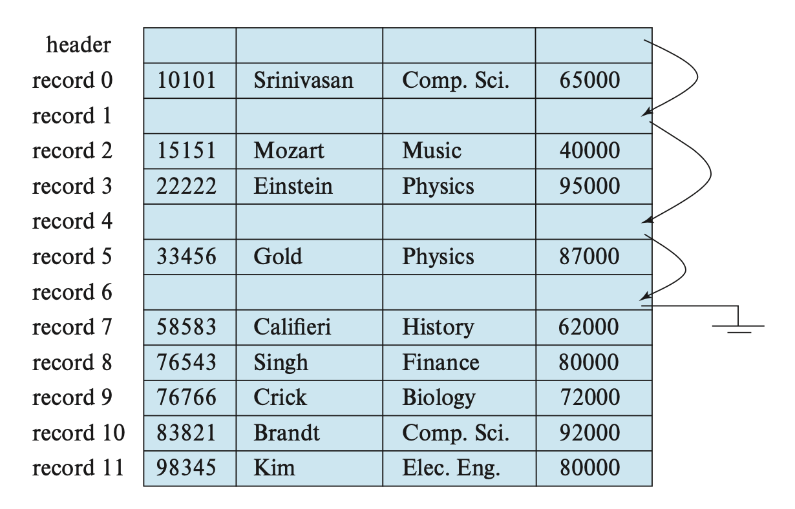
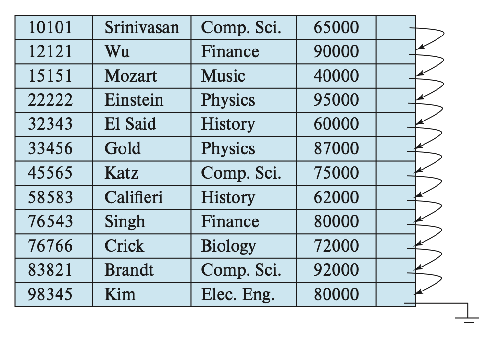
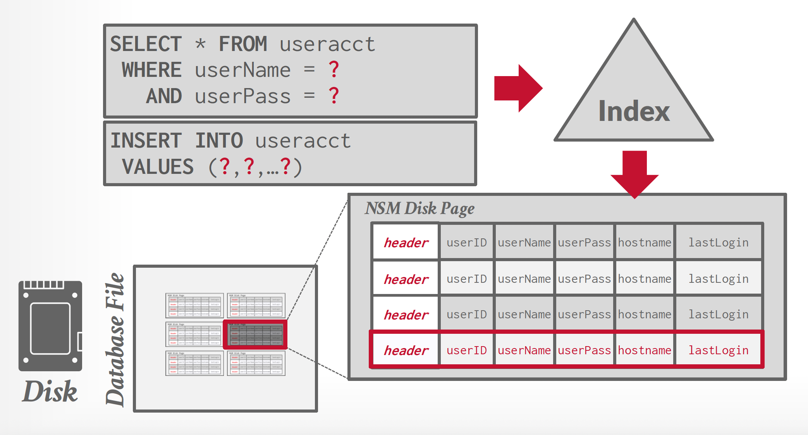

# Lec 9: Database Storage Structures

在本章，我们着重探讨位于底层存储器的数据组织，以及数据的访问方式。

!!! abstract "面向硬盘的 DBMS"

    <div style="text-align: center">
        
    </div>

    - 数据库存储在硬盘上，数据库文件里的数据以页的形式被组织起来，其中第一页作为目录页
    - 要想在某一数据进行操作，DBMS 首先要将数据带到内存上
        - 这一步涉及到一个叫做**缓存池**(buffer pool)的部件，它负责管理数据在硬盘和内存之间的来回移动
        - 此外 DBMS 还有一个**执行引擎**(execution engine)，用于执行查询，它会向缓存池请求一个具体的页，然后缓存池会把这个页放到内存中，并向执行引擎返回这个页在内存中的指针
        - 缓存池管理器会确保执行引擎在内存执行操作时，所需要的页已经在内存中了
    - 我们的优化目标是
        - 空间控制：尽量将经常一起使用的页面在硬盘上放置得尽可能靠近，这可能会帮助预取和其他优化
        - 时间控制：最小化从硬盘中读取数据所需的停顿次数

??? info "存储管理器(storage manager)"

    - OS 不知道数据库文件里的东西是什么，只有 DBMS 才能解密其中的内容，因为这些内容都是针对 DBMS 编码的
    - DBMS 的存储管理器负责对数据库文件的管理。它用一组页来表示文件，并追踪页里面的读写情况和空闲空间


## File Organization

通常，一个数据库会被映射到多个不同的**文件**(files)上，这些文件由底层的操作系统来维护，并永久存储在硬盘上。一份文件包含了数据库的一个记录序列，而这些记录会被映射到硬盘**块**(blocks)（或**页**(pages)）上，作为存储分配和数据传输的基本单位。为了便于后续讨论，我们约定：

- 一个记录不得大于一个硬盘块的大小（而一个硬盘块可能包含多个记录）
- 每个记录只能被包含在一个硬盘块上


### Pages

!!! warning "注意"

    这是我额外补充的内容。

- 页里面可以包含不同类型的数据（元组、索引等等），但大多数系统不允许单个页里面混杂多种类型的数据。
- 每个页都有一个唯一的标识符（称为页 ID）。如果数据库是单个文件的话，那么页 ID 就是文件的偏移量。在每个 DBMS 实例，每个数据库或每个元组中，页 ID 是唯一的。大多数 DBMS 提供了一个间接层，将页 ID 映射到文件路径和偏移量上，由存储管理器负责这个转化。
- 大多数 DBMS 采用固定的页大小，以避免额外的工程开销。
- 一般有以下三类页大小：
    - 硬件页：一般是 4KB
    - OS 页：4KB
    - 数据库页：1-16KB

    只读的 DBMS 可以有更大的页大小。

- 存储设备保证一次原子写(atomic write)的大小为硬件页的大小。


### Records

在前面几章的学习中，我们知道记录的长度可以是固定的（比如 `INT`、`CHAR` 类型等），也可以是变化的（比如 `VARCHAR`、`NUMERIC` 类型，或者数组等），因而我们需要考虑这些不同情况下的文件组织方式。

???+ example "例子"

    下面的讲解中，我们将拿一个名为 `record` 的记录作为例子，它的定义为：

    ```sql
    TYPE instructor = RECORD
                          ID VARCHAR(5);
                          name VARCHAR(20);
                          dept_name VARCHAR(20);
                          salary NUMERIC(8, 2);
                      END
    ```

    下面给出一个关于这类记录的文件：

    <div style="text-align: center">
        
    </div>


#### Fixed-Length Records

一个很简单的方法是：直接为变长类型赋予最大字节数的空间。因此每个 `instructor` 记录就要占据 53 个字节的空间。但这种方法会带来以下问题：

- 除非块的大小正好是 53 的倍数（通常不太可能），否则有些记录可能会跨过块的边界，即某些记录会位于两个块内。访问这样的记录就需要两次读/写操作了。
    - 解决方案：为每个块仅分配能够完全容纳得下的记录，多出来的小空间直接忽略掉。
- 同时，我们很难删除这样的记录，因为删除记录后需要用其他记录填补这块空间，或者直接忽视这块空间。

对于记录的删除问题（假设删除第3条记录），有以下几种解决思路：

- 将被删除记录后面的所有记录向前移动，填补被删除记录所在的空间。这种方法需要移动大量的记录，效率不高。

    <div style="text-align: center">
        
    </div>

- 或者直接拿最后一条记录填补被删除的记录所在空间，但这样做会导致额外的块访问。

    <div style="text-align: center">
        
    </div>

- 因为通常插入操作比删除操作更频繁，所以就暂且先让被删除记录所在的空间是开放的，然后等待之后的插入。
    - 在文件开头，我们会分配一些特定的字节作为**文件头**(file header)，里面包含关于文件的信息，这里我们只关心第一个被删除记录（空间空出来了）的地址信息。在这个记录上，我们记录第二个被删除的空余记录，以此类推。所以这些被删除的记录构成了一个链表，通常称为**空表**(free table)。

    <div style="text-align: center">
        
    </div>

    - 当插入新记录时，我们将这个记录放在文件头所指的记录上，然后让文件头指向下一个空闲的记录。如果没有空闲空间的话，就讲记录插在文件末尾。


#### Variable-Length Records

在处理变长记录时，需要解决以下问题：

- 如何表示单个的记录，使得提取单个属性较为容易，即便这个属性是变长类型的
- 如何在一个块内存储变长记录，使得从块中提取记录较为容易

先来看第一个问题——通常，变长属性被表示为两部分：定长的信息（偏移量（数据起始位置） + 长度（变长属性的大小）），以及变长属性值。`instructor` 记录的结构图如下所示：

<div style="text-align: center">
    
</div>

可以看到，这个记录先存的是三个变长属性的定长信息，然后是一个定长属性值，最后是变长属性值。而在定长属性值和变长属性值之间有一组0，称为**空位图**(null bitmap)，用于记录属性值是否为空。在这个例子中，由于一条记录有4个属性，因此用4个0来分别表示每个属性值的情况。假如 `salary` 为空，那么空位图的第4位就会被设为1。有些情况下，空位图会被放在记录的开头位置，这样做可以节省空间（因为一旦空位图全为1，后面就不需要存数据了），但代价是需要先从记录中提取属性。这种方式对于具有大量字段，且大多数为空值的记录而言很有用。

---
>每个页都有一个头，包含了和页的内容相关的元数据，包括：页的大小、校验和、DBMS 版本等。

再来看第二个问题——一般情况下，我们用**槽式页结构**(slotted-page structure)来组织在块内的记录，如下图所示：

<div style="text-align: center">
    
</div>

在槽式页结构中，每个块的开头都有一个头(header)，包含以下信息：

- 头里面的记录数量
- 块内空余空间(free space)的结束位置
- 一个包含每个记录的位置和大小的数组

在块内，记录被分配到的空间是连续的。而空余空间从头数组的末尾，到第一个记录之间的空间也是连续的。

- 当插入记录时，会为其分配空余空间末尾的一处空间，并且这个记录的位置和大小将会被记在头上。
- 当删除记录时，会释放它所占据的空间，并且对应的头数组被标记为删除状态（比如将大小设为-1）。另外，在这个被删除记录之前的记录都需要被移动，这样才能为空余空间腾出这个记录的同等大小的空间。移动的成本不是很大，因为块的大小被限制在一定范围内

这种槽式页结构要求指针不得直接指向记录上，而必须指向对应头数组的元素上，该元素包含了记录的位置。这种间接的方式可以避免块内的分段现象。

!!! bug "缺陷"

    - 页内的分段问题：删除某些记录会导致页内部空间的空缺
    - 无用的硬盘 I/O：由于非易失性存储器面向块的特质，要更新记录的话就要拿取整个块
    - 随机的硬盘 I/O：更新多个元组的话可能需要在不同地方之间跳转，这会让 I/O 速度非常慢


### Data

!!! warning "注意"

    这也是我额外补充的内容。

前面提到过，元组/记录中的数据本质上就是一个字节序列，并且包含了一个记录元数据的头。DBMS 负责追踪并解释这些字节为属性，它想要确保元组是**按字对齐的**(word-aligned)，确保 CPU 访问数据时不会发生异常行为或干额外的活。有两种方法可以做到这一点：

- **填充**(padding)：在属性后添加空位，确保元组是按字对齐的

    <div style="text-align: center">
        
    </div>

- **重排**(reordering)：改变物理布局中的属性顺序，确保他们是对齐的

    <div style="text-align: center">
        
    </div>

    <div style="text-align: center">
        
    </div>

我们可以将元组中的数据类型分为：

- 整数：和 C/C++ 里的整数相同
- 变精度数(variable precision numbers)：遵循 [IEEE-754 标准](https://en.wikipedia.org/wiki/IEEE_754)
- 定点精度数(fixed-point precision numbers)
- 变长数据(variable-length data)
- 日期和时间


## Organization of Records in Files

??? note "元组的布局"

    元组本质上就是一个字节序列（可以不连续）。DBMS 需要将这个序列解释为属性和相应的值。

    - 元组头（即元组的元数据）
        - 关于 DBMS 并发控制协议的可见信息
        - NULL 值的位图
        - 这里不会存储数据库的模式
    - 元组数据：关于属性的真实数据
        - 一般按创建表时声明的顺序来存储属性
        - 大多数 DBMS 不允许一个元组超过一个页的大小
    - 唯一标识符：
        - 数据库的每个元组被赋予了一个唯一标识符，大多为 `page_id + (offset or slot)`
        - 应用程序不得依赖这些 id

现在我们来看一下文件内记录的组织方式：

- **堆**(heap)文件组织：任何记录可以放在文件的任何地方，无需考虑顺序。一个关系可以存放在一个或多个文件中。
- **顺序**(sequential)文件组织：根据每个记录的“**搜索键**(search key)”的值，按顺序存储记录
- **多表聚集**(mutlitable clustering)文件组织：来自不同关系的记录被存储在相同的文件内，以减少连接运算的成本
- **B+树**文件组织：即便在插入、删除和更新操作改变记录顺序的情况下，也能保持记录的顺序。这块内容将在下一讲介绍。
- **哈希**文件组织：根据一些属性计算哈希函数，用于指明哪个块上放哪个记录

下面将会详细介绍前三种文件组织。


### Heap File Organization

在堆文件组织中，一个记录可以被放在文件的任意位置上。但一旦确定位置后，一般不能再去移动这个记录了。

向文件**插入**记录时，可以采取始终加在文件末尾的策略。然而，对于记录的**删除**，我们需要考虑利用删除记录释放的空间，用于存储新记录，以最大化利用空间。大多数数据库会采用一种称为**空余空间图**(free-space map)的数据结构，用于高效寻找空余空间。这个数据结构通常用一个数组表示，每个元素对应一个块，其值表示对应块的空余空间比例。为了找到能够存储新记录的块，数据库需要扫描空余空间图，来找到有足够空间存储记录的块。如果没有这样的块，那么需要为这个关系赋予一个新的块。

???+ example "例子"

    假如空余空间图的每个元素的大小为3位，当某个元素为7时，表明对应块内至少有 7/8 的空间是空余的。

    <div style="text-align: center">
        
    </div>

对于大型文件，这样的扫描还是太耗时了，此时我们可以创建一个第二级的空余空间图，其元素对应主（第一级）空余空间图中 100 个元素的最大值。对于更大的文件，也可以创建更多层级的空余空间图。

???+ example "例子"

    接着上面的例子，假如第二级空余空间图中的一个元素对应第一级的4个元素，那么其里面的内容为：

    <div style="text-align: center">
        
    </div>

如果每次更新就要向硬盘写入空余空间图的话，那么成本太昂贵。所以一般会周期性地写入空余空间图，但这样做硬盘里的空余空间图可能会过时，访问这样的空余空间图就会引发错误。

??? note "页的定位方式"

    根据给定的 `page_id`，DBMS 可以采用以下方法来定位一个页：

    - **链表**(linked list)：头页(header page)包含指向空闲页和数据页的指针。如果 DBMS 需要寻找特定的页，就必须在数据页列表上进行顺序扫描，直到找到它所需的页

        <div style="text-align: center">
            
        </div>

    - **页目录**(page directory)：DBMS 维护一个特殊的页称为页目录，以跟踪数据页的位置、每个页的空闲空间量、空闲/空页的列表以及页的类型。每个数据库对象在页目录上有一个对应项。

        <div style="text-align: center">
            
        </div>


### Sequential File Organization

**顺序文件**(sequential file)用于高效处理有序的记录，它基于**搜索键**(search key)实现。这个搜索键包含了任意的属性，不必是主键或超键。为了更快地检索记录，我们用指针将这些记录连接起来。并且为了最小化块的访问次数，我们将记录按搜索键顺序进行物理存储。下图展示了包含了 `instrutor` 记录的顺序文件：

<div style="text-align: center">
    
</div>

顺序文件组织的好处是让我们能够有序读取记录，这对显示记录，以及某种查询处理算法而言很有用。但维护记录在物理层面上的顺序比较困难，因为记录随时会被插入和删除。

- 对于删除，通过移动指针就能解决。
- 对于插入，需要遵循以下规则：
    - 在记录按搜索键插入之前，找到这个记录在文件中的位置。
    - 如果存在空余记录，且位于和该记录相同的块上，则直接将新记录放在这个空余记录上。否则的话，将新记录插入到**溢出块**(overflow block)。上述两种情况下都需要调整相应的指针，以保持搜索键的顺序。

下图展示了插入一条记录后的顺序文件：

<div style="text-align: center">
    
</div>

如果溢出块内的记录不多，那么上述插入策略表现较好。但随着时间的流逝，搜索键顺序和物理顺序之间的关联会逐渐丢失，那样的话顺序处理就变得不那么有效了。此时我们需要**重新组织**(reorganize)文件，但这样的操作成本较大，必须在系统负载较低的情况下进行。重新组织的频率取决于插入记录的频率。

B+树的文件组织是这种组织的上位替代，我们将在下一讲介绍。


### Multitable Clustering File Organization

大多数关系数据库系统会将每个关系放在单独的一个或一组文件里。然而，在有些情况下，将多个关系的记录存在单个块内会更加有用，下面的例子证明了这一点：

???+ example "例子"

    假如执行以下查询语句：

    ```sql
    SELECT dept_name, building, budget, ID, name, salary
    FROM department NATURAL JOIN instructor;
    ```

    这条语句将两个关系连接在一起，因此对于 `department` 中的每个元组，系统必须找到 `dept_name` 值相同的 `instructor` 的元组。如果这些关系放在单独的文件上，那么在最坏的情况下，每条记录都位于不同的块，那么这个访问速度就特别地慢了。

    下面先给出这两个具体的关系：

    <div style="text-align: center">
        
        
    </div>

    然后我们将这两个关系自然连接的结果放在一个文件内，如下所示：

    <div style="text-align: center">
        
    </div>

    这两个关系通过键 `dept_name` 聚集在一个文件内。这样的文件结构提升了处理连接操作的效率。

**多表聚集文件组织**(multitable clustering file organization)是一种将多个关系中有关联的记录存储在一个块内的文件组织。而**聚集键**(clustering key)是用于定义哪些记录存储在一起的属性。

尽管这种文件组织加快了特定的连接查询操作，但是它会影响到处理其他类型的查询的表现，所以请小心使用。


### Partitioning

很多数据库允许将一个关系内的记录**划分**(partition)为多个小的关系，并将其单独存储起来，通过减小关系的大小来降低某些运算的开销。

我们还可以将关系划分为多个部分，并将不同的部分存储在不同的存储设备上，比如将经常用到的部分放在 SSD，不怎么用到的就放在磁盘上。


## Data-Dictionary Storage

前面我们只考虑了如何表示关系里的内容，而没有考虑如何维护关于关系的数据，比如关系模式等。我们一般称这种“数据的数据”为**元数据**(metadata)。像这些元数据会被存在一个称为**数据字典**(data dictionary)或**系统目录**(system catalog)的结构内。系统必须存储以下元数据：

- 关系的名称
- 每个关系的属性名
- 属性的值域和长度
- 视图的名称和定义
- 完整性约束

此外，很多系统还会保存关于用户的数据，包括：用户名，用户默认的模式，授权用户的密码以及其他信息等等。还有一些数据库可能会存储关于关系和属性的统计和描述数据，比如每个关系的元组数，每个属性不同值的数量等。

数据字典可能还会记下关系的存储组织（堆、顺序、哈希等），以及关系存储的位置——如果关系被存储在操作系统文件中，字典会记下包含这些关系的文件名；如果数据库将所有关系存储在单个文件中，那么字典就会用链表之类的数据结构记下每个关系的记录所在的块。

实际上，我们还要存储和索引相关的信息（下一讲会详细介绍），包括：索引名、被索引的关系名、定义索引的属性、索引构成的类型。

这些元数据信息实际上构成了一个微型的数据库，所以我们可以将其存储在数据库的某个关系内，这样就可以简化系统的整体结构，并且利用到数据库快速访问的优势。下图就是一个小型的例子：

<div style="text-align: center">
    
</div>

通常，存储数据字典的关系是非规范化的，以确保更快的访问。当数据库系统需要从某个关系中检索数据时，它必须首先查询这个叫做 `Relation_metadata` 的关系，找到这个关系的位置和存储组织，然后才能获取记录。因为这些系统元数据会被经常访问，因此大多数数据库将其读入到一个位于内存的数据结构内，以便高效访问，而这一步会作为数据库启动的一部分。


## Database Buffer

因为访问硬盘内的数据会比在内存访问慢很多，因此数据库系统的一大目标是最小化硬盘和内存之间的数据块传输次数。一种方法是让主存保存尽可能多的数据块，但显然无法让主存保存所有的数据块，因此我们需要管理主存中的可用空间，而**缓冲区**(buffer)就是主存中用于存储硬盘块拷贝的部分空间，而缓冲区的空间分配则由**缓冲区管理器**(buffer manager)负责。


### Buffer Manager

当数据库系统内的程序需要来自硬盘的数据块时，就会向缓冲区管理器发起请求。

- 如果缓冲区里已经有数据块了，那么缓冲区管理器就会将这个块在主存中的地址发送给请求者
- 如果没有的话，缓冲区管理器首先在缓冲区上为这个块分配空间。如有必要会扔掉一些已有的块，但如果这些即将被扔掉的块相比上次从硬盘中写到主存时有过修改的话，就要将这些块先写回到硬盘中。然后缓冲区管理器从硬盘中将所需的块读到主存中，并将主存地址发送给请求者

>和虚拟内存的机制十分相似！

???+ note "缓存池(buffer pool)"

    >注：教材没有明确介绍这个知识点，但我觉得还是挺有必要了解的。

    - **缓存池**是内存与硬盘之间用于缓存页的内存区域，实质上是数据库内部分配的一大块内存空间，用于临时存储数据页。它由一组固定大小的**帧**(frame)阵列构成。当 DBMS 请求某个页时，缓冲区管理器首先检查该页面是否已存在于内存帧中；若未找到，则从磁盘读取/复制该页面至空闲帧。
    - 缓冲区管理器执行**写回**(write-back)策略，即被修改的脏页会暂存于缓冲区而非立即写入硬盘。
    - 缓存池可用作：
        - 元组存储和索引
        - 排序和连接缓存区
        - 查询和字典缓存
        - 维护和日志缓存
    - 缓存池必须维护一些元数据，以确保其高效和正确的执行。
        - **页表**(page table)是一个在内存中的哈希表，用于跟踪当前位于内存的页。它将页 ID 映射到缓存池中的帧位置。由于缓存池中的页顺序不一定反映其在硬盘上的顺序，这个额外的间接层允许识别缓存池中页的位置。
        - **脏标志**(dirty flag)由线程在修改页时设置。存储管理器在驱逐设置脏标志的页之前会将其写入硬盘中
        - **钉/引用计数器**(pin/reference counter)：下面会马上介绍它的作用，这里就不讲了

        <div style="text-align: center">
            
        </div>

??? question "为什么不直接用 OS，而要搞一个缓冲区管理器出来？"

    可以用 OS 内存映射（`mmap`）将文件内容存储到程序的地址空间上。OS 负责将文件页在内存的移进移出，此时 DBMS 无需对此关心。但要是 DBMS 允许多个线程访问 `mmap` 文件来隐藏页错误停顿的话，就会产生以下问题：

    <div style="text-align: center">
        
    </div>

    - 事务安全：OS 可以在任何时间清除脏页
    - I/O 停顿：DBMS 无法得知哪个页是在内存里的，而 OS 一旦发现页错误就会停顿线程
    - 错误处理：验证一个页很难。任何页的访问都会发出一个 `SIGBUS` 信号，需要 DBMS 处理
    - 性能问题：内部的 OS 数据结构竞争。TLB 射击。

    所以 OS 不是我们的好朋友。由 DBMS 自己来控制的效果往往比 OS 更好，具体表现在：

    - 按正确顺序将脏页清除到硬盘上
    - 专门的预取操作
    - 缓冲区替换机制
    - 线程/进程调度

如果缓冲区没有多余空间的话，那么就需要**驱逐**(evict)某个数据块，即在读入新数据块之前，将这个数据块移除掉。具体的移除策略将在下一小节介绍。

---
有时会遇到这种情况：在主存读取/写入某个数据块时，另一个并发的进程驱逐了这个数据块，并且用不同的数据块来替代它，这样就会导致读到错误的数据，或者破坏数据。因此，有必要在缓冲区中读取数据之前，确保数据块不会被驱逐，具体来说进程会对数据块采取一种**钉住**(pin)操作，不让缓冲区管理器驱逐这个数据块。当完成读取操作后，进程就会执行**解钉**(unpin)操作，允许数据块被驱逐。在设计数据库时，确保不要对太多的块采取钉住操作，否则这个数据库就没法正常处理了。

如果有多个进程同时读取缓冲区的某个数据块，那么每个进程都会执行钉住和解钉操作，且只有当所有进程执行解钉操作后，该数据块才可以被驱逐。一种简单的方法是保留一个**钉计数**(pin count)，每个钉住操作就会让这个数+1，每个解钉操作就会让这个数-1，只有当这个数等于0时才能被驱逐。

---
向数据块添加或删除某个元组的进程可能需要移动数据块的内容，在这段时间内，不应该有其他进程读取数据块的内容，否则就会导致数据的不一致。为了做到这一点，缓冲区管理器提供了一种锁系统，允许数据库进程在访问数据块前对这个块上一个共享锁或排外锁；当访问完成时，就会释放这个锁。具体的规则如下：

- 任何数量的进程可同时对同一个块上一个共享锁。
- 某个时间点内，只有一个进程被允许对数据块上排外锁，且当某个进程上了排外锁后，其他进程就不得使用共享锁，因此只有当其他进程没有对数据块上锁时，才能赋予某个进程上排外锁的权利。
- 如果某个进程对一个已经被上了共享锁或排外锁的数据块发起排外锁请求，那么这个请求将会一直等到所有先前的锁都被释放时才生效。
- 当某个数据块没有被上锁，或者已经上了共享锁时，那么某个进程的共享锁请求会被接受；但如果这个数据块上了排外锁的话，就要等这个锁被释放后才能接受请求。

上锁的具体操作为：

- 在对数据块执行任何操作前，进程必须先对该数据块进行钉住操作，然后就会对其上锁，这个锁会在解钉操作执行前被释放。
- 在读取某个数据块前，进程必须提供一个共享锁。当读取完成时，进程必须释放该锁。
- 在更新某个数据块前，进程必须提供一个排外锁。当更新完成时，进程必须释放该锁。

上述规则确保了缓冲区访问的安全性，但对于数据库系统的并发访问还是不太够的，这点会在之后的章节中介绍。

---
有时需要将缓冲区的数据块写回到硬盘中，以确保硬盘中特定数据的一致性，这种写操作被称为**强制输出**(forced output)。


### Buffer-Replacement Strategies

替换策略的目标是最小化对硬盘的访问。在操作系统中，我们会假设最近被引用的数据块可能在将来不久后会被再次引用。因此，如果要替换某个数据块的话，那就替换最久没有被引用的数据块，这种方法称为**最近最少使用**(least recently used, LRU)。

<div style="text-align: center">
    
</div>

由于 LRU 的实现相对复杂，因此有一种近似的 LRU 实现，称为**时钟**(clock)。此时无需为每个页单独记录一个时间戳，而用一个**引用位**(reference bit)来替代；当某个页被访问时，其引用位置1。然后我们将这些页放在一个“环形(circular)”缓冲区内，然后用一个“时钟指针(clock hand)”按顺序扫过这些页：检查指针所指的页的引用位是否为1，如果是的话则置0，否则的话就讲这个页驱逐出去。

<div style="text-align: center">
    
</div>

相比操作系统，数据库系统可以更精确地预测未来的访问模式。一个用户对数据库系统的请求包含多个步骤，数据库系统可以阅读这些步骤来提前决定哪些数据块要被用到。所以数据库系统可能会采取比 LRU 更好的替换策略。来看下面的例子：

???+ example "例子"

    对于以下查询语句：

    ```sql
    SELECT *
    FROM instructor NATURAL JOIN department;
    ```

    不难发现，一旦 `instructor` 的某个元组被处理过，这个元组就不会再被用到。因此，一旦处理完某个包含 `instructor` 元组的数据块后，主存就不再需要这个块了，即便它是最近被用到的。当数据块内最后的元组被处理过后，缓冲区管理器就会释放这个块占据的空间。这样的策略称为**立即抛出**(toss-immediate)策略。

    再来考虑包含 `department` 元组的数据块。对于 `instructor` 关系内的每个元组，都要检验包含 `department` 元组的每个数据块。当处理完一个 `department` 块后，可以发现这个块不会被再次访问，直到所有的块都被处理过了。因此，最近最多使用的块将会成为最后被再次引问的块，而最少最近使用的块却是下一个被引用的块。所以我们要采取和 LRU 相反的策略——**最近最多使用**(most recently used, MRU)策略。

    为了让 MRU 正确工作，系统必须钉住正在处理的 `department` 块；当最后一个元组被处理过后，解钉这个块，这个块就是最近最多使用的块。

理想的数据库替换策略需要知道和数据库操作相关的信息，包括正在执行的以及将来执行的。但没有一个已知的策略能够应对所有情况。事实上，大多数数据库系统采用的是 LRU，尽管这个策略也有些问题。

??? note "LRU 的问题和一些替代方案"

    === "问题"

        LRU 和时钟这两种替换策略容易收到顺序洪水(sequential flooding)的影响（即执行需要读取每个页的顺序扫描的查询），它会使缓存池被那些仅读取一次的页给污染了。

        LRU 和时钟的局限之处在于它们只记录了上一次访问页的情况，没有记录页被访问的频率。

    === "替代方案"

        - **LRU-K**：追踪前 K 次引用（作为时间戳）的历史，并计算之后访问的间隔。这个历史用于预测某个页下一次被访问的时间。但这种方式会带来更高的存储开销。另外需要为最近被驱逐的页维护一个在内存中的高速缓存，防止这些页总是被驱逐
            - **LRU-2**：采用一个链表，但是有两个头指针，其中一个作为较新链表的开始，另一个作为较老链表的开始。新的页总是被插入到较老链表的开头位置上。如果较老链表中的页被再次访问，那么将其插入到较新链表的开头位置上。

                ??? play "动画演示"

                    <div style="text-align: center">
                        
                    </div>

        - **局部化**(localization)：DBMS 基于单个的查询或事务来选择驱逐哪个页，从而最小化每个查询对缓存区的污染
        - **优先提示**(priority hints)：缓存区可以从事务中，基于每个页在查询执行的上下文，知道哪个页是重要的


### Reordering of Writes and Recovery

数据库缓冲区允许在主存执行完写操作后，过一段时间再输出到硬盘上，这样可能导致输出到硬盘的顺序不同于写操作的执行顺序。而且，文件系统也可能会为写操作重新排序，但这样会导致在系统崩溃时硬盘数据的不一致性。

为了应对上述问题，早期的文件系统会在系统重启时执行**文件系统一致性检查**(file system consistency check)，确保数据结构的一致性；如果发现不一致的情况，就需要采取额外的步骤来恢复一致性。但这些检查会带来很长的时延，而且对于大容量的硬盘系统而言，这个时延会变得更加糟糕。

如果文件系统能够以一个精心挑选的顺序向元数据写入更新的话，就能避免很多情况下的不一致性。但这样做会让一些优化策略失效，比如磁盘臂调度，从而影响到更新效率。

现代的文件系统会用一个硬盘来存放按执行顺序排序的写操作日志，这样的硬盘称为**日志硬盘**(log disk)。所有对日志硬盘的访问都是顺序的，这样就能消除寻道时间，而且一些连续的块能被一次写入，这样比随机写操作快好几倍。如果在向硬盘执行写操作时发生崩溃，那么系统会读取日志硬盘的内容，找到未完成的写操作并再次执行。当写操作完成后，记录将会从日志硬盘中删除。

支持日志硬盘的文件系统称为**日志文件系统**(journaling file system)，这种系统允许数据和日志保存在相同的硬盘上，从而降低成本，但代价是降低性能。因为无需进行一致性检查，所以它能让系统重启更快。

??? note "缓存池的优化方法"

    - **多缓存池**(multiple buffer pool)：DBMS 能够维护用于不同目的的缓存池，这些缓存池可以根据存储的数据采取定制化的策略，以降低锁存竞争(latch contention)并提升局部性。**对象 ID** 和**哈希**是两种常用的将页映射到指定缓存池的方法：
        - 对象 ID：从记录 ID 中扩展得来，通过这些 ID 来维护映射，实现对缓存池分配的精细控制，但会带来额外的存储开销
        - 哈希：DBMS 将页 ID 哈希，选择指定的缓存池

        <div style="text-align: center">
            
            
        </div>

    - **预取**(pre-fetching)：当处理好第一组页时，第二组也可以被预取到缓存池内。
        - 当遇到顺序扫描，连续访问多个页时，DBMS 会采用这种方法。
        - 但对索引扫描而言可能不是那么有用。
    
            <div style="text-align: center">
                
            </div>

            <div style="text-align: center">
                
            </div>

    - **扫描共享（同步扫描）**(scan sharing/sychronized scans)：查询游标(cursor)能够重用检索自存储区或运算中得到的数据。这样就可以让多个查询共用一个扫描表格的游标。如果某个查询开始执行时，已经有另一个正在活跃的扫描，那么 DBMS 就直接将第二个查询的游标移到已存在的游标上。DBMS 会跟踪第二个查询与第一个查询的连接位置，以便在到达数据结构末尾时完成扫描。该方法适用于经常被扫描的表格。

        ???+ play "动画演示"

            <div style="text-align: center">
                
            </div>

    - **缓存池旁路**(buffer pool bypass)：顺序扫描操作符（或读取一大段连续存储的页时）不会将获取到的页存储在缓存池中，以避免开销。相反，内存对于正在运行的查询而言是局部的。该方法也适用于临时数据（排序、连接运算时可能会用到）。


## Column-Oriented Storage

通常数据库系统会将元组中的所有属性放在一条记录里，这样的存储布局称为**面向行的存储**(row-oriented storage)。相对应的也有**面向列的存储**(column-oriented storage)，它的做法是单独存储关系中的每个属性，一组连续元组的某个属性值被放在文件中的连续位置上，如下所示：

<div style="text-align: center">
    
</div>

在最简单的面向列的存储形式中，每个属性被存在单独的文件中，并且通过压缩文件来减小文件大小。

这种面向列的存储适用于数据分析查询——需要处理关系中的多个行，但通常只访问部分属性。推荐理由如下：

- 减小 I/O 次数：如果是面向行的存储的话，就需要从硬盘中获取不相干的属性；而面向列的存储只会获取要用到的属性，这会降低 I/O 次数，从而降低了执行查询的开销。
- 提升了 CPU 高速缓存的性能：当查询处理器获取特定属性的内容时，由于现代 CPU 的架构，会将多个连续字节（称为一个高速缓存行）从内存拿到 CPU 的高速缓存上。面向列的存储能充分利用这个特点。
- 提升压缩能力：压缩能够显著降低从硬盘中检索数据的时间，这通常是查询中最花时间的操作。对于面向列的存储，存储的是相同类型的值，这能够有效提升压缩的效率。
- 向量处理：很多现代 CPU 架构支持向量处理，即允许 CPU 对数组中的一些元素进行并行运算。按列存储的方式能够利用到向量处理的优势，比如比较一个属性和一个常量，聚合运算等等。

面向列的存储也有以下缺点，这使得它尤其没法用在事务处理上：

- 元组重构的成本：从一组单独的列中重构一个元组的成本是很高的，可能会抵消掉面向列的存储带来的好处。

    ??? info "元组重构的方法"

        - 定长偏移量：我们将某一列中的值和同一偏移量另一列中的值放在同一个元组里。因此，列中的每个单独的值都必须具有相同的长度。
        - 嵌入式元组 id：对于每一列中的属性，DBMS 会存储一个元组 ID 与之关联。此外系统还会存储一个映射，以告知它如何跳转到具有该 ID 的每个属性。由于这种方法有较大的存储开销（要为每个属性条目存储一个元组ID），因此不推荐使用。

        <div style="text-align: center">
            
        </div>

- 元组删除和更新的成本：删除或更新一个被压缩的元组需要重写所有被压缩在一起的元组序列，所以成本很高。
- 解压的成本：从压缩形式中获取数据时需要解压。对于最简单的压缩形式，解压要求读取从文件开头读取所有数据，但很多记录实际上是不需要的。

ORC 和 Parquet 是在很多大数据处理应用中用到的列文件表示。其中 ORC 会将占据几百 MB 的元组序列划分为一种称为**条**(stripe)的列表示，而一个 ORC 文件会包含多个这样的条，下图展示了 ORC 文件格式的一些细节：

<div style="text-align: center">
    
</div>

- 每个条包含了一个索引数据、行数据和条尾，ORC 文件还有一个文件尾，这两个“尾”我们不去考虑
- 行数据包含了各个列的压缩后的序列值
- 索引数据用于快速访问所需的元组

??? info "（补充）其他存储模型"

    - **N 元存储模型**(N-ary storage model, NSM)：等价于面向行的存储，适用于写操作较多，或者访问内容多为独立实体的情况
        - 优点：
            - 快速的插入、更新和删除操作
            - 对需要整个元组的查询
            - 可以使用面向索引的物理存储来聚集
        - 缺点：
            - 在扫描大部分表格内容和/或属性的子集时效率低下
            - 较差的内存局部性
            - 难以使用压缩，因为多个值域位于同一个页内

        <div style="text-align: center">
            
        </div>

        <div style="text-align: center">
            
        </div>

    - **分解存储模型**(decomposition storage model, DSM)：等价于面向列的存储

        <div style="text-align: center">
            
        </div>

        <div style="text-align: center">
            
        </div>

    - **跨分区属性**(partition attributes across, PAX)：DBMS 从竖直方向上将属性划分为一个个数据库的页，并且从水平方向上将行划分为多组行，这样能确保兼具列存储的快速处理和行存储的空间局部性。
        - PAX 文件包含一个全局头，里面包含指向文件行组的偏移目录；并且每个行组都维护自己的头，里面包含关于其内容的元数据。

        <div style="text-align: center">
            
        </div>

??? info "（补充）关于数据库的压缩"

    通过前面的学习，我们了解到 I/O 是 DBMS 从硬盘获取数据的主要性能瓶颈。通过压缩，DBMS 可以提升数据的利用率，从而降低 I/O 次数。压缩需要具备以下性质：

    - 必须产生定长的值（除非对于存储在不同地方的变长数据）
    - 在查询执行期间，尽可能延后解压过程
    - 必须是无损压缩（有损压缩必须由应用负责）

    根据压缩颗粒度的不同，我们将压缩分为以下四级：

    - 块级：压缩同一张表内的元组块
        - 举例：MySQL InnoDB 压缩

            <div style="text-align: center">
                
                
                
            </div>

    - 元组级：压缩整个元组的内容
    - 属性级：压缩一个元组内的单个或多个属性
    - 列级：压缩存储在多个元组中的单个或多个属性值，具体有以下方法
        - **游程编码**(run-length encoding, RLE)：将某个列值相同的一组连续实例压缩成三元组，包括：属性值、偏移量和长度

            <div style="text-align: center">
                
            </div>

        - **位打包编码**(bin-packing encoding)：当一个属性的值都小于该值声明的最大大小时，用更少的位存储它们

            <div style="text-align: center">
                
                
            </div>

        - 主要（？）编码(mostly encoding)：位打包编码的一种变体，使用特殊标记来指示超过最大值的值，并维护一个查找表来存储这些值（适用于大部分值是小于最大值，只要少部分超过最大值的情况）

            <div style="text-align: center">
                
            </div>

        - [**位图编码**](10.md#bitmap-indices)(bitmap encoding)
        - **Delta 编码**：不直接存储精确数值，而是记录同一列中相邻数值之间的差值。基准值可以内联存储，也可以存放在单独的查找表中
            - 我们还可以对存储的差值应用游程编码（RLE），以进一步提升压缩率

            <div style="text-align: center">
                
            </div>

        - **字典编码**：将频繁出现的值替换为较短且固定长度的编码，随后维护一个从这些编码到原始值的映射（字典）
            - 一个属性值对应一个编码
            - 该编码方式被大多数 DBMS 采用
            - 理想的字典方案应支持针对点查询和范围查询的快速编码（定位）与解码（提取）

            <div style="text-align: center">
                
            </div>


## Storage Organization in Main-Memory Databases

**主存数据库**(main-memory database)是指所有数据都存在内存中的数据库，用于优化性能。主存数据库可能会为内存中的记录保留一个直接指向它们的指针，这样的话访问一条记录就是一趟指针遍历，而这个操作十分高效。


如果主存使用面向列的存储方式，那么某个列的所有值被存储在连续的内存位置上。然而，如果发生了向关系附加记录的情况，为了确保连续的空间分配，需要重新分配已经存在的数据的空间。为了避免这一开销，某个列的逻辑数组会被划分为多个物理数组，并且用一个间接表来存储指向所有物理数组的指针，如下所示：

<div style="text-align: center">
    
</div>