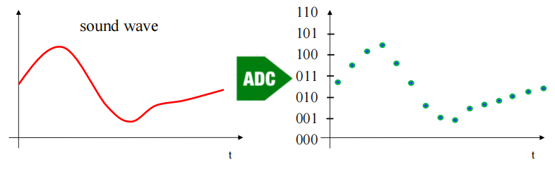
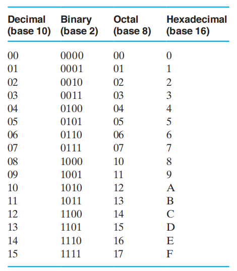
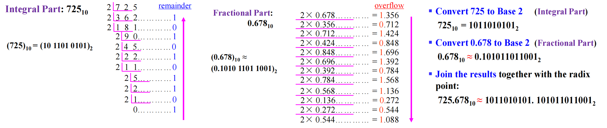
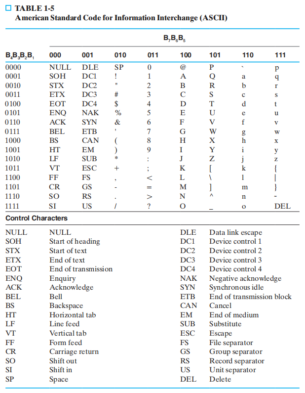
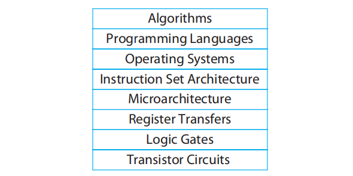
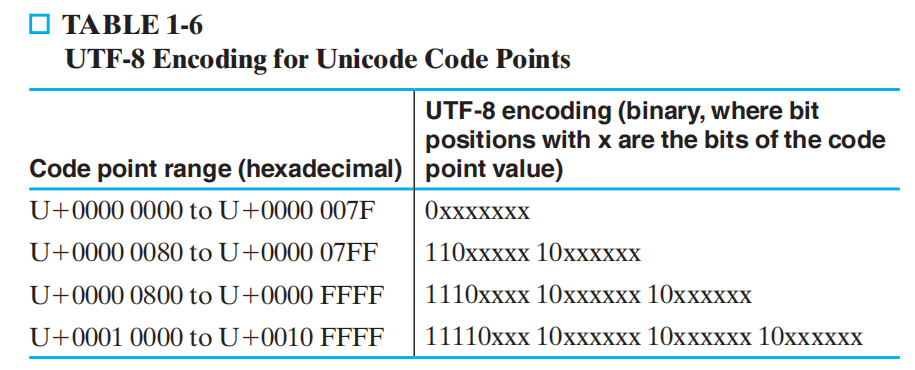

# Chap 1: Digital Systems and Information

??? abstract "核心知识"

	+ 进制转化
	+ 编码
		+ BCD码
	 	+ ASCII码
		+ 格雷码

## Information Representation

+ **模拟信号(analog signals)**：在值和时间上都是*连续(continuous)* 的信号
+ **数字信号(digital signals)**：在值和时间上都是*离散(discrete)* 的信号

### Digital System

**数字系统(digital system)**：获得一组*离散*的信息**输入**和*离散*的内部信息输入(**系统状态(system state)**)，产生一组*离散*的信息**输出**。

用框图表示：

---
**模数转换器(Analog-to-Digital Converters, ADC)**：将模拟信号转换为数字信号，为模拟世界的传感器和数字世界的信号处理搭起了桥梁。

??? example "温度测量和显示"

	

	
	

### Signals

在现实世界中，信息变量由物理量表示；而在数字系统中，我们往往取这些变量的离散值——而**二进制(binary)** 值是最流行的表示方法，它可以表示物理量的值或值的范围。它通常被表示为：

+ 数字0和1
+ 符号False(F)和True(T)
+ 符号Low(L)和High(H)
+ Off和On
>注：这里我们用到的是**正逻辑(positive logic)**，即用0表示F、L和Off，用1表示T、H和On

之所以使用二进制，包括以下原因：

+ 电子元件的本质——两种状态：比如开关的断开(0)和闭合(1)，晶体管的导通(1)和不导通(0)
+ 最少数量的必要电路：使得空间、能耗、成本也达到最小

???+ example "1位信号——电压"

	

	
	

	>左图中间白色的区域被称为**临界区域(threshold region)**

	+ 落在临界区域上的电压是*未定义的*，其结果为非法的状态，这通常表示为*浮动(floating)*。如果输出引脚处在浮动状态，由于它的值可能在HIGH和LOW之间任意跳跃，所以无法确定它的输出信号
	+ 可以发现，输入和输出的**电压容差(voltage tolerance)**(蓝色区域)是不同的，而且输入宽度大于输出，这是为了确保电路在电压变化及不期望的“噪音”电压中能够正常工作。这种输入和输出范围的不同被称为**噪音容限(noise margin)**

## Number Systems

以$r$为**基底(base/radix)** 的数可以被表示成

+ 由数字组成的字符串：
$$
A_{n-1}A_{n-2}\dots A_1A_0.A_{-1}A_{-2}\dots A_{-m+1}A_{-m},  \quad 0 \le A_i < r
$$
> 注："."被称为*分隔符(radix point)*，$A_{n - 1}$被称为**最高位(most significant digit, msd)**，$A_{-m}$被称为**最低位(least significant digit, lsd)**

+ 幂级数

$$
\text{(Number)}_r = \underbrace{(\sum\limits_{i = 0}^{n - 1} A_i \cdot r^i)}_{\text{Integer Portion}} + \underbrace{(\sum\limits_{j = -m}^{-1} A_j \cdot r^j)}_{\text{Fraction Portion}}
$$

特殊的2次幂：

+ $2^{10}$：K(Kilo)
+ $2^{20}$：M(Mega)
+ $2^{30}$：G(Giga)
+ $2^{40}$：T(Tera)

## Arithmetic Operations

### Binary Arithmetic

>加、减、乘法的详细内容略过，因为这些东西已经讲了无数遍了......
#### Addition

注意*进位(carry)* 问题

#### Subtraction

注意*借位(borrow)* 问题

#### Multiplication

不同基底对应的值

>注：如果感觉$r(r \ne 10)$进制计算很别扭的话，可以先将所有数字都转化为十进制，然后将计算后的结果转化回$r$进制

### Conversion

+ 二进制 $\rightarrow$ 十进制：$\sum(\text{digit} \times \text{respective power of 2})$

+ 十进制 $\rightarrow$ 二进制

	+ 法一

		+ 原数减去最大的2次幂，使得剩余部分仍为正数，并记录该幂
		+ 重复上述步骤，记录所有减过的幂，直到剩余部分为0
		+ 将“1”放在减过的幂的对应位置上，其他位置放“0”
		
	+ 法二（通法）

		+ 转换*整数部分*：重复用新的基底**除**该数，并**保存余数**。该数转化为新基底的形式即为刚才所得余数的**逆序**。如果新的基底大于10，将大于10的余数用A, B等表示
		+ 转换*小数部分*：重复用新的基底**乘**该数，并**保存整数部分**。该数转化为新基底的形式即为刚才所得余数的**顺序**。如果新的基底大于10，将大于10的余数用A, B等表示
		+ 用*分隔符(小数点)* 将前面的结果结合起来

🌰：将$(725.678)_{10}$用二进制表示

关于小数部分的转换
通过重复的乘法，小数部分会出现以下结果：

+ 变成0(精确值)
+ **出现重复的数字**(不准确值)

解决方法：具体说明保留多少位或截断数字

??? info "补充阅读"

	为什么十进制小数无法被精确编码为二进制？
	
	——通过求解*丢番图方程(Diophantine equation)* 解释

	

	
	

+ 八进制(Octal) $\leftrightarrow$ 二进制：1位八进制 = **3**位二进制
+ 十六进制(Hexadecimal) $\leftrightarrow$ 二进制：1为十六进制 = **4**位二进制
>注：二进制转八/十六进制的时候可能需要在二进制数里*填充0*

+ 八进制 $\leftrightarrow$ 十六进制：将**二进制**作为过渡的平台

## Decimal Codes

### Binary Numbers and Binary Coding

信息类型：

+ 数字：用来表示需要的数据范围，进行简单直接的计算（比如算术运算），与二进制数联系紧密
+ 非数字：更大的灵活性(无需算术运算)，不与二进制紧密联系。因此，我们可以用任意二进制的组合(被称为编码)，使任意的数据得到唯一的编码。
 
给定$n$位二进制数(被称为*位*)，**二进制编码(binary code)** 是从一组要被表示的元素到$2^n$个二进制数的子集的**映射(mapping)**

给定$M$个需要用二进制数编码的元素，*最小数量位*$n$满足$2^{n - 1} < M \le 2^n$，因此$n = \lceil \log_2 M \rceil$

拓展到基底为$r$的情况，$n$为$r$进制数可以表示$r^n$个不同的元素，因此可以表示$M < r^n$个元素

常见的编码方式

>补充：**独热码(one-hot code)**，一种只用1位表示每个状态的编码，比如4位二进制数可以表示四种状态：0001,0010,0100,1000

### Binary Coded Decimal(BCD)

BCD码又称**8421码**(8, 4, 2, 1是权重)，因此BCD是**权重码(weighted code)**。它是最简单的，最直接的关于十进制数的二进制编码，使用与二进制数相同的幂，但它只使用前10个数字(0-9)。

!!! warning "不要搞混<u>转换</u>和<u>编码</u>！"

算术运算（这里只讨论加法）：还是要注意**进位**问题

🌰：

### Excess 3 Code and 8, 4, -2, -1 Code

注意到：

+ Excess 3 = BCD + 3
+ Excess 3 码与8,4,-2,-1码是**互补码(complement code)**

## Alphanumeric Codes

**ASCII(American Standard Code for Information Interchange)** 字符码：用7位表示字符数据，包括：

+ 94个图形打印字符
+ 34个非打印字符：分为3类

	+ *格式控制字符(format effector)*
	+ *信息分隔字符(information separators)*
	+ *通信控制字符(communication control characters)*
>ASCII码的第8位（最高位）用来表示**奇偶(parity)校验码**

性质：

+ *字符*0-9的十六进制值对应十六进制的$(30)_{16}-(39)_{16}$
+ 大写字母A-Z对应$(41)_{16}-(5A)_{16}$
+ 小写字母a-z对应$(61)_{16}-(7A)_{16}$
>因此，大小写字母的ASCII码转换只需 ==翻转第5位==

### Error-Detection

**错误侦测(error detection)** 通常用于**通道编码(channel coding)** 中

>拓展知识：**[Shannon Capacity Theorem/Limit](https://en.wikipedia.org/wiki/Shannon%E2%80%93Hartley_theorem)**

错误侦测的方法：

+ **冗余(redundancy)**(比如多余信息)由额外的位构成，可以被并入到二进制码中，以此来侦测和纠正错误，比如*循环冗余校验(Cyclic Redundancy Check, CRC)*
+ **奇偶校验位(parity)** 是添加在编码单词上的额外的位，使得整个编码包含1的个数是奇数或者偶数。它能够侦测所有单个位的错误和一些多位错误

	+ **偶校验(even parity)**：整个编码包含1的个数是偶数
	+ **奇校验(odd parity)**：整个编码包含1的个数是奇数

🌰：

+ **校验和(Checksum)**

## Gray Codes

>注：**格雷码(Gray code)** 的特殊之处在于：**相邻**的两个数只有**1位**的差异。观察表格发现，格雷码的前半部分和后半部分有*反射(翻转)(reflection)* 的关系

🌰光轴编码器(Optical Shaft Encoder)

如果光线经过红色虚线(边界)处，左边用二进制码表示的情况就会出现问题（被称为*偏斜(skew)*）,下图所示红色部分的数字都有可能是最终的输出结果：

而格雷码就可以避免这种错误的输出可能

二进制转格雷码：

+ 用`1`表示最高位，索引值越大表示位数越低
+ $g(i)$表示索引为$i$的格雷码对应的数字， $b(i)$表示索引为$i$的二进制码对应的数字

$$
g(i) = \begin{cases}b(i) + b(i - 1) & \text{if } i \ne 1 \\ b(i) & \text{if } i = 1\end{cases}
$$

🌰：

## Appendix

### The Digital Computer 

+ **内存(memory)**：存储程序的输入、输出和中间数据
+ **中央处理器(central processing unit, CPU)**

	+ **数据通路(datapath)**：执行由程序指定的算术和其他数据处理运算
	+ **控制单元(control unit)**：监督在各种单元间的信息流

+ **输入设备(input device)**：将由用户提供的程序和数据传输到内存的设备
+ **输出设备(output device)**：将计算结果呈现给用户的设备

### Embedded System

### More on Generic Computer

**处理器(processor)** 的类型：

+ 中央处理器(CPU)
+ 浮点处理单元(floating-point unit, FPU)：执行浮点计算，可以用来处理很大或很小的数字
+ 存储管理单元(memory management unit, MMU)：使得对于CPU的可用内存比RAM的实际内存更大
+ 内部缓存(internal cache)

### Abstration Layers in Computer System Design

这体现了“**自顶向下(top down)**”的设计思想，即从较高的层次来说明整个系统，然后它的设计被分解为连续的更小的块，直到这些块简单到可以直接运行的程度。最后连接这些块，形成整个系统。

这种分层抽象隐藏了系统中各个元件的执行细节，这样设计者可以专注于用来解决问题的那部分元件；而且低层抽象的改变不会影响高层的抽象（比如你写的c代码放到别的电脑也能跑）。

高层抽象的提升空间往往高于低层抽象

### Unicode

>注：具体内容见[wikipedia](https://en.wikipedia.org/wiki/Unicode)
