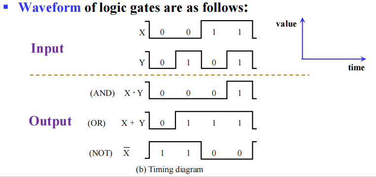
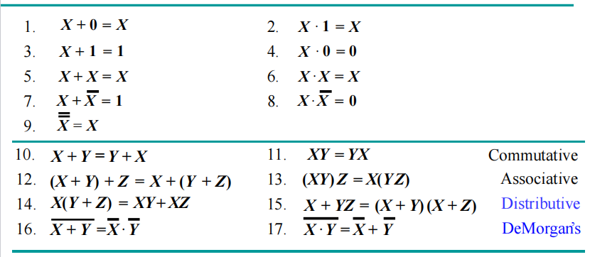
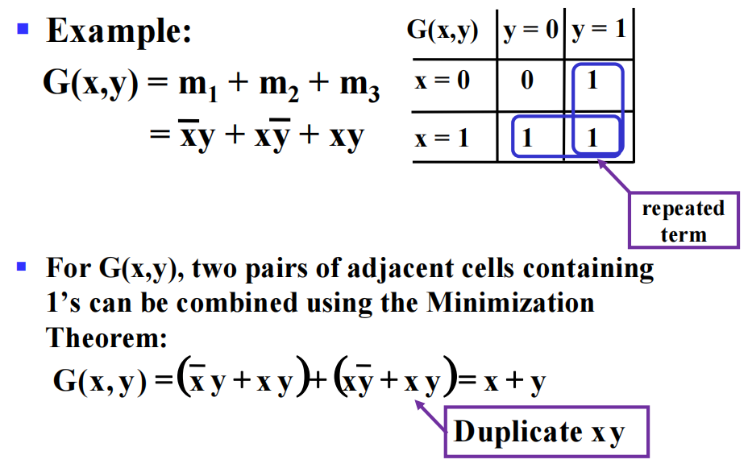
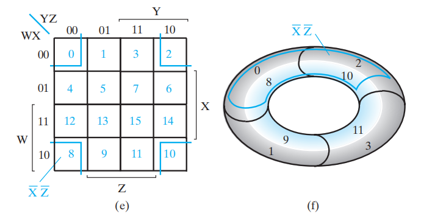
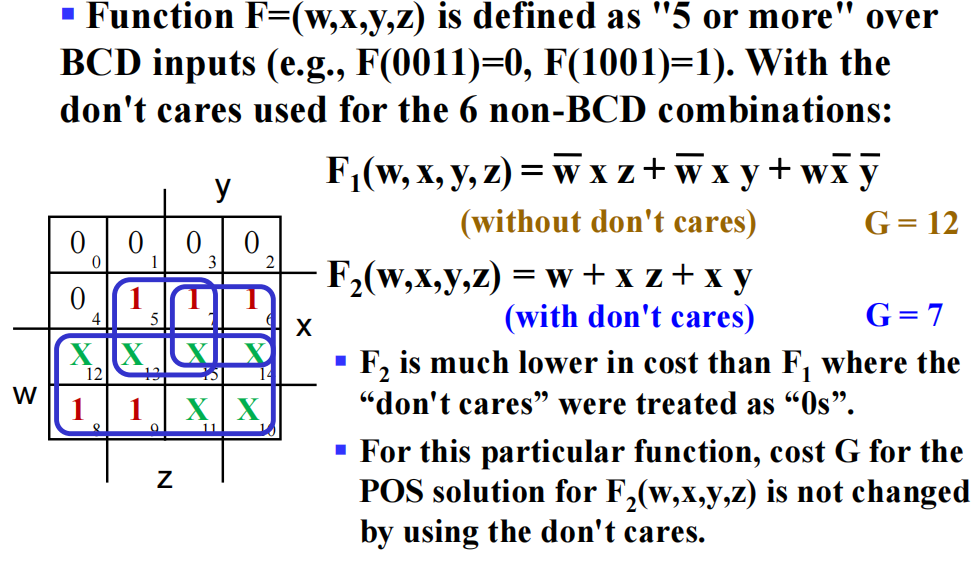
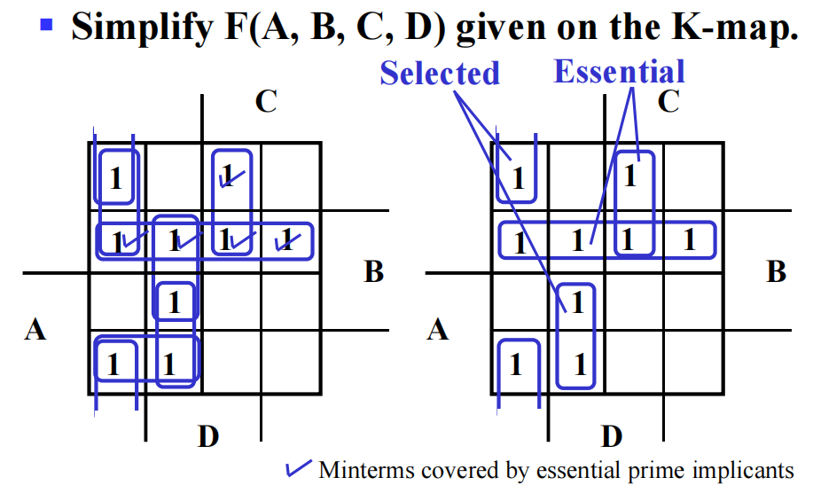
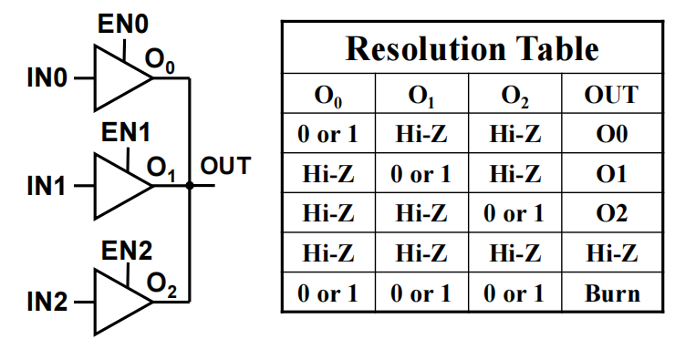
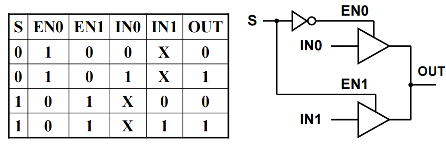
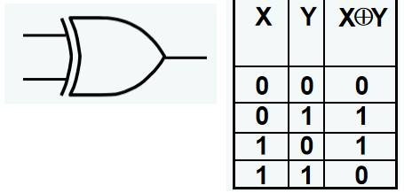
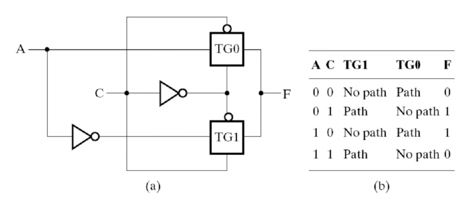

# Chap 2: Combinational Logic Circuit

??? abstract "核心知识"

	+ 逻辑门：与、或、非、与非、或非、异或、三态门等
	+ 布尔函数和布尔方程，关于它们的一些恒等式，比如分配律、德摩根定理等
	+ 标准形式
		+ SOM和POM
		+ SOP和POS
	+ 门成本计算
	+ **卡诺图**
		+ 蕴含项、主蕴含项、质主蕴含项
		+ Don't Care

## Gate Circuit and Boolean Equations

### Binary Logic and Gates

+ **二进制变量(binary variables)** 取`0`和`1`中任意一个值，可以用单个字符表示，也可以用有意义的单词表示

+ **逻辑运算符(logical operators)** 在二进制值和二进制变量上运算。基本的逻辑运算符包括逻辑**与(AND)**，**或(OR)** 和**非(NOT)**
	+ **AND**：记作($\cdot$)或($\times$)
	+ **OR**：记作($+$)
	+ **NOT(inverter)**，记作($\overline{X}$)(上面的短横)，($'$)(用在后面)或($\sim$)(用在前面)

+ **真值表(truth tables)**：一张列出函数所有可能的参数组合的值的表格

### Logic Gates

**逻辑门(logic gates)**：执行逻辑函数

??? info "背景"

	+ 在早期的计算机中，开关的开闭通过由**中继器(relay)** 通电的线圈产生的磁场实现。这些开关轮流开闭电路。
	+ 之后，**真空管(vacuum tubes)** 通过电子方式的开闭，取代了中继器
	+ 现在，**晶体管(transistors)** 用来作为电子开关。逻辑门通过双极晶体管(bi-polar junction transistors, BJT)实现

	

	
	

逻辑门的类型：

#### Basic Logic Gates

基本逻辑门的符号表示：

*时序图(timing diagram)* 表示：

逻辑门可以有不止两个的输入脚：

#### Universal Logic Gates

一种能够实现所有可能的布尔函数的门类型被称为**通用门(universal gate)**，这种门是*功能完全的(functionally complete)*。上面的*与非门(NAND)* 和*或非门(NOR)* 便是通用门。

:chestnut:：

#### Other Logic Gates

>注：具体内容[戳这](#exclusive-or-operator-and-gates)

---
逻辑图和表达式的类型：

+ 真值表
+ 布尔方程
+ 逻辑图
+ 波形图

>注：
>
>+ 这4种方法可以用相同的布尔函数表示
>+ 真值表和波形图是唯一的，而布尔方程和逻辑图并不是唯一的，这为实现函数提供一定的灵活性
---

### Boolean Algebra

**代数结构(algebraic structure)**由两个元素的集合$B = \{0, 1\}$，以及三种运算符(与、或、非)构成。它满足下列基本恒等式

🌟

>重点记住**蓝字**那两行，它们很有用但不好记

**相等**——对于$F_1 = f_1(X_1, X_2, \dots, X_n)$ 和 $F_2 = f_2(X_1, X_2, \dots, X_n)$，如果任何输入值能产生相同的输出$F_1$和$F_2$，那么我们可以说布尔函数$F_1 = F_2$​

#### Precedence

1. 括号
2. NOT
3. AND
4. OR

#### Duality Rules

布尔代数表达式的**对偶(dual)** 可以通过以下步骤得到：

+ AND $\Leftrightarrow$ OR(互换)
+ $0 \Leftrightarrow 1$(互换)
+ 变量保持不变

除非出现**自对偶(self-dual)**，一个表达式的对偶 $\ne$ 它自身

---
🌰：$F = (A + \overline{C}) \cdot B + 0$ 的对偶为 $(A \cdot \overline{C} + B) \cdot 1$

---
性质：

+ 如果$G$是$F$的对偶，反之亦然，即$F' = G, G' = F$
+ 如果两个函数相等，即$F = G$，则它们的对偶函数也相等，即$F' = G'$

#### Complementing Functions

对于逻辑函数$F$，通过以下步骤得到它的**反函数(inverse function)**$\overline{F}$：

+ AND $\Leftrightarrow$ OR(互换)
+ 对每一个**常变量**和**字面量**取补

我们通常使用**德摩根定理(DeMorgan's Theorem)**来实现上述步骤

#### Substitution Rules

对于布尔方程中的某个变量$A$，如果用别的逻辑函数$F$来代替所有的$A$，则该布尔方程依然成立

#### Useful Theorems

+ 最小化：$x \cdot y + \overline{x} \cdot y = y \quad (x + y)(\overline{x} + y) = y$
+ 吸收：$x + x \cdot y = x \quad x \cdot (x + y) = x$
+ 简化：$x + \overline{x} \cdot y = x + y \quad x \cdot (\overline{x} + y) = x \cdot y$
+ **一致性(consensus)定理**：

$$
\begin{align}
x \cdot y + \overline{x} \cdot z + y \cdot z  & = x \cdot y + \overline{x} \cdot z \notag \\
(x + y)\cdot(\overline{x} + z) \cdot (y + z) & = (x + y)\cdot (\overline{x} + z) \notag
\end{align}
$$

!!! info "常见题型"

	+ 证明恒等式
	+ 简化布尔方程：使得字面量(包括所有未取补和取补的)的数量最小

### Standard Forms

!!! question "运算布尔函数时遇到的问题"

	+ 证明布尔函数：布尔函数不是唯一的
	+ 表达式的简化：可能要用到的恒等式或定理太多了，需要掌握一些技巧

解决方案：

流程图中的中间步骤用到了**范式(canonical form)**，它具有以下优点：

+ 与真值表直接对应
+ 容易比较布尔函数的等价关系
+ 为函数的优化提供良好开端
两种常见类型：

+ **最小项之和(sum of minterms, SOM)** 
+ **最大项之积(product of maxterms, POM)**

#### Minterms and Maxterms

+ **最小项(minterms)** 是所有变量(不论是本身$X$还是取补$\overline{X}$)的<u>乘积项</u>
	+ 如果有n个变量，则有$2^n$个最小项
	+ 对于每个最小项，只有一种输入使得它的值为1，其余输入对应的输出均为0
	+ 一般用$m_i$表示最小项，其中$i$指的是第$i$种输入组合
	

	
	

	
+ **最大项(maxterms)** 是所有变量(不论是本身$X$还是取补$\overline{X}$)的<u>和项</u>
	+ 如果有n个变量，则有$2^n$个最大项
	+ 对于每个最大项，只有一种输入使得它的值为0，其余输入对应的输出均为1
	+ 一般用$M_i$表示最大项，其中$i$指的是第$i$种输入组合
	

	
	

!!! note "注"

	+ 最小项和最大项的**下标(subscript)** 表示一种二进制的排序方式，它能够反映在*标准顺序(standard order)*(通常是按字母表顺序)下的某种输入组合
	+ 最小项和最大项的**索引(index)** 用二进制数0和1表示，它能够反映每个变量在最小/大项中是以正常形式$X$还是以补形式$\overline{X}$存在

		+ 最小项：‘1’表示不取补，‘0’表示取补
		+ 最大项：‘0’表示不取补，‘1’表示取补
	🌰：当索引 = 6时，$m_6 = XY\overline{Z},\ M_6 = (\overline{X} + \overline{Y} + Z)$

最大项与最小项之间的关系：$M_i$和$m_i$互为对方的**补**，即$M_i = \overline{m_i}$ 且 $m_i = \overline{M_i}$

#### SOM and POM

根据最小项和最大项的第2条特点，我们可以得到：

+ 任何函数都可以用 ==值为1的最小项的或(和)== 来表示，这种函数被称为**最小项函数(minterm function)**
+ 任何函数都可以用 ==值为0的最大项的与(积)== 来表示，这种函数被称为**最大项函数(maxterm function)**

因此，我们可以分别得到两种范式：**最小项之和(SOM)**与**最大项之积(POM)**

一般函数 $\Rightarrow$ SOM：将原来函数中所有的项扩展至包含全部变量的项，即：对于某个项，只要它缺少某个变量$v$，就将$(v + \overline{v})$和该项进行**与**运算。

🌰：

$$
\begin{align}
F(A,B,C) &= A + \overline{B}C \notag \\
& = A(B + \overline{B})(C + \overline{C}) + (A + \overline{A})\overline{B}C \notag \\
& = \dots \notag \\
& = ABC + AB\overline{C} + A\overline{B}C + A\overline{BC} + \overline{AB}C \notag \\
& = m_7 + m_6 + m_5 + m_4 + m_1 \notag \\
& = \sum m(1,4,5,6,7) \notag 
\end{align}
$$
---
一般函数 $\Rightarrow$ POM：将原来函数中所有的项扩展至包含全部变量的项

+ 先使用第二条**分配律**：$X + YZ = (X + Y)(X + Z)$
+ 对于该项，只要它缺少某个变量$v$，就将$v \cdot \overline{v}$和该项进行**或**运算
+ 然后再用分配律化简

🌰：

$$
\begin{align}
F(A, B, C) & = A\overline{C} + BC + \overline{AB} \notag \\ 
& = (A\overline{C} + BC + \overline{A})(A\overline{C} + BC + \overline{B}) \notag \\
& = (\overline{C} + BC + \overline{A})(A\overline{C} + C + \overline{B}) \notag \\
& = (\overline{C} + B + \overline{A})(A + C + \overline{B}) \notag \\
& = \prod M(2, 5) \notag 
\end{align}
$$

SOM或POM可以通过**两级逻辑(two-level logic)**来实现。对于$n$个变量的SOM，第1级采用$n$输入与门，第2级采用一个或门

>注：我们**一般使用SOM**，POM很少使用

#### Conversion

如何得到(SOM形式的)函数$F$的补$\overline{F}$：

+ 挑选最小项为0的项(即$F$中未出现的最小项)，取它们的SOM
+ 或者挑选最小项为1的项(即$F$中出现过的最小项)，取它们的POM

🌰：$F = \sum m(1, 3, 5, 7), \quad \overline{F} = \sum m(0, 2, 4, 6) = \prod M(1, 3, 5, 7)$

SOM $\Leftrightarrow$ POM：取两次补函数。以SOM形式的函数为例，第一次取补改变最小项的下标(取补方法1)，第二次取补改变为POM的形式(取补方法2)，因此
$$
F(x_1,\dots,x_n) = \sum\limits_{0 \le i \le 2^n - 1} m_i = \prod_{0 \le j \ne i\le 2^n - 1} M_j
$$

#### Standard Forms

范式虽然基本且容易得到，但它不常用，因为每个最小项和最大项都需要包含所有$n$个变量，这在实际运用中不太现实，因此我们采用另一种方法——**标准形式(standard form)**，它的每一项可以包含一个或多个变量。它具有以下形式：

+ **标准积之和(standard sum-of-products, SOP)**：与项的或(和)
+ **标准和之积(standard product-of-sums, POS)**：或项的与(积)

!!! example "辨别"

	+ SOP：$ABC +\overline{AB}C + B$
	+ POS：$(A + B) \cdot (A + \overline{B} + \overline{C}) \cdot C$
	+ 两者都不是：$(AB + C)(A + C),\ AB\overline{C} + AC(A + B)$

根据*SOM & POM*这一小节的[第一个例子](#som-and-pom)，将化简过程倒过来便是函数(SOM)转化为SOP的形式的步骤(利用上面给出的公式，用提取公因式、合并等方法化简)。观察发现，我们大幅简化了布尔函数，而且实现上也变得更加简单：

## Circuit Optimization

:dart:：得到对于某个给定函数的最简实现

??? info "Big Picture of Boolean Function Optimization"

	

	
	

### Tow-Level Optimization

#### Cost Criteria

从*布尔方程*的角度看：

+ **字面量成本(literal costs)**：所有字面量出现的次数(相同的字面量出现$n$次，计算时加上重数$n$)
>注：**字面量(literal)** 指*单个变量*(不论有没有取反)
+ **门输入成本(gate input costs)**，包括：
	
	+ 直接来自于字面量输入的那些引脚
	+ 字面量做运算后得到的结果作为输入传入下一级逻辑门的引脚

分类：

+ G：不计算非门
+ GN：计算**非门**

>注：由于门输入成本与所用晶体管和导线数量成正比，因此它是一种很好的测量方式

从*门电路实现*的角度看：

+ 字面量L：计算所有与门的输入和或门中单变量输入的个数
+ G：加上剩余的或门输入
+ GN：加上非门的输入

特殊情况：

+ **三态门**：有**两个**输入脚
+ **传输门**：看似有多个脚，实则只计算**一个脚**

!!! example "例题"

	=== "例1"

		

		
		

	=== "例2"

		[戳这](#multiple-level-circuit-optimization)

### Map Manipulation

**卡诺图(Karnaugh maps, K-map)** 由一组方块构成：

+ 每个方块代表**最小/大项**
+ 布尔函数的结果从真值表转移到一张二维的K-map上
+ <u>相邻的方块仅相差一个变量</u>（方块按照**格雷码**的顺序排列）
+ 通过识别方块的图案，将布尔函数转化为另一种形式的等价函数

优点：简单不易错，不用记那些繁琐的定理来化简，相较于代数方法化简所需步骤更少

缺点：仅限于少量变量(2-5个)，结果不唯一

应用：

+ 找到最优或近似最优解
+ 将简化布尔表达式的过程可视化
+ 在计算机辅助设计(CAD)用于化简大型电路

:star: 使用K-map简化的步骤：

+ 找到最小或最大项
+ 用最小/大项填充K-map，其中最小项填1，最大项填0
+ 用矩形圈出包括<u>2的次幂个</u>全都是1(SOP)的方块（相当于SOP中的积项），且确保矩形**尽可能的大**，矩形之间可以重叠
>POS则找全都是0的方块(和项)
+ 从这些圈中得到简化的表达式。

	+ SOP：找到乘积项并将它们相加
	+ POS：找到和项并将它们相乘

!!! example 

	=== "双变量"

		

		
		

	=== "三变量"

		观察到K-map的方块通过格雷码编址

		

		
		

		+ 一个方块代表三个变量的最小项
		+ 两个相邻方块代表两个变量构成的积项
		+ 四个相邻方块代表一个变量
		+ 八个方块 = 1
		
		有些方块看似不相邻，但如果采用“按对相邻环(pairwise adjacent ring)”的概念，将K-map“**卷**”起来，形成一个圆柱，那么两边的方块就会形成相邻的关系。这样的相邻也可以用来化简。
		
		

		
		

		
		🌰：

		

		
		

		
	=== "四变量"

		

		
		

		+ 1个方块 = 4变量积项(最小项)
		+ 2个方块 = 3变量积项
		+ 4个方块 = 2变量积项
		+ 8个方块 = 1变量积项
		+ 16个方块 = 1
		
		四变量K-map的两侧和上下也认为是“相邻”的，因此可以将K-map弯曲成一个甜甜圈状的物体：

		

		
		

	=== "五变量"

		

		
		

#### Don't-Care

有时某个函数出现这样的情况：

+ 最小项对应的输入从未出现过
+ 最小项对应的输出从未用过

这样的输出值我们并不关心，因此用$\times$代表**don't-Cares**，既可以把它看作`1`，也可以把它看作`0`。在SOP化简中，我们可以把$\times$看作`1`，这样可以形成更大面积的[主蕴含项](#systematic-simplication)，有助于化简，降低逻辑电路成本。

所有don't care项可以用$\sum d(j_1, \dots, j_m)$表示，其中$j_k(k = 1, \dots, m)$表示索引

!!! example "一些例子"

	=== "BCD码"

		我们只用到0-9十个数字，1010-1111不会被用到，因此这6个数在K-map上对应的输出我们用$\times$表示

	=== "具体的例子"

		

		
		

	=== "独热码"

		

		
		

#### Systematic Simplication

+ **蕴含项(implicant)**：SOP的积项或POS的和项，包含$2^k(k \in [0, n])$个相邻方块
+ **主蕴含项(prime implicant)**：结合尽可能多的$2^k(k \in [0, n])$个相邻方块的积项
+ **质主蕴含项(essential prime implicant)**：至少包含1个<u>没有被其他主蕴含项包括在内的最小项</u>的主蕴含项

>注：对于*周期布尔函数(cyclic Boolean function)*，它的K-map是没有质主蕴含项的
>
>

>
>

!!! note "解题技巧"

	+ 以$n$变量卡诺图为例，先找包含$2^{n - 1}$项的主蕴含项，再找包含$2^{n - 2}$项的主蕴含项，以此类推
	+ 先（用*不同颜色的笔*）**框出**所有的主蕴含项，然后再**找变量化简**为布尔函数

???+ example "例题"

	=== "例一"

		

		
		

	=== "例二"

		

		
		

### Multiple-Level Circuit Optimization

多级电路相较于两级电路(SOP 和 POS)，它减少了输入的成本

:chestnut:：

## Additional Gates and Circuit

### Other Gate Types
🌟简单门电路表

注：

+ 比较**与门**和**三态门(3-State Buffer)**：与门的输出F不能与其他门的输出相连，而三态缓冲器可以
+ **Hi-Z**意思是**高阻抗**的状态，此时既非高电平，亦非低电平
+ **缓冲器(Buffer)**看起来只起到连接作用，实际上它起到提升电压，增加电路运算的速度的作用

#### NAND and NOR Gates

**与非门(NAND Gate)**：

$$
F = \overline{XYZ} = \overline{X} + \overline{Y} + \overline{Z}
$$

**或非门(NOR Gate)**：

$$
F = \overline{X + Y +Z} = \overline{X} \cdot \overline{Y} \cdot \overline{Z}
$$

与非门、或非门都是一种*通用门(Universal gate)*，即可以用来执行任何布尔函数的门。通过[CMOS技术](5.md#cmos-circuit-technology)很自然地实现与非门的功能。

复杂门电路表

#### Buffer

**缓冲器(buffer)** 是一个电子放大器，用来提高电压、提升电路运行的速度，它的函数为$F = X$

#### 3-State Buffer

**三态门(3-state buffer)** 提供了第三个逻辑值：**高阻抗(Hi-impedance)** 输出**Hi-Z**，即输入和输出之间处于**断路**状态，因此高阻抗状态的门输出可以连在一起。

符号及真值表：

+ IN：数据输入
+ **EN：使能控制输入**
+ OUT：数据输出

+ EN = 0 $\rightarrow$ OUT = Hi-Z
+ EN = 1 $\rightarrow$ OUT = IN

三个三态门连在一起：

!!! warning "警告"

	+ 除了三态门外，多个门的输出**不能**用线连在一起!!!
	+ 同一时间<u>最多只有一个</u>三态门处于**使能**状态，否则电路就会被烧坏掉

🌰：数据选择电路

+ S = 0 $\rightarrow$ OUT = IN0
+ S = 1 $\rightarrow$ OUT = IN1

>注：不难发现，当一个三态门处于使能状态时，另一个一定处于高阻抗状态，所以不用担心烧坏的情况发生(实际上这是一个 2-1 MUX，Chap 3会讲到)

### Exclusive-OR Operator and Gates

**XOR(异或门)** $X \oplus Y = X \overline{Y} + \overline{X}Y$

**XNOR(同或门)** $\overline{X \oplus Y} = XY + \overline{XY}$

> 注：XNOR函数即为等价函数，记作$\equiv$

!!! note "XOR的电路实现"

	=== "法一"

		

		
		

	=== "法二"

		只用**与非门**构建的异或门电路

		

		
		

应用：加/减/乘法器、计数器、递增器、递减器、奇偶生成器/校验器等

>注：严格来说，XOR和XNOR门不能具有<u>两个以上的输入</u>，如果存在这种情况，则它们被称为**奇函数**和**偶函数**。

!!! note "一些关于异或的恒等式"

	$$
	X \oplus 0 = X \quad X \oplus 1 = \overline{X}  & \quad X \oplus X = 0 \quad X \oplus \overline{X} = 1
	$$

	$$
	X \oplus Y = Y \oplus X \quad (X \oplus Y) \oplus Z = X \oplus (Y \oplus Z) & = X \oplus Y \oplus Z 
	$$

#### Odd and Even Functions

三个变量以上的异或函数被称为**奇函数(odd function)**：

$$X \oplus Y \oplus Z = \overline{XY}Z + \overline{X}Y\overline{Z} + X \overline{YZ} + XYZ$$

奇函数的补为**偶函数(even function)**

奇函数和偶函数在K-map上的布局呈棋盘布局

不难看出：

+ **奇函数**的1出现在对应拥有**奇数个1的索引**的最小项上
+ **偶函数**的1出现在对应拥有**偶数个1的索引**的最小项上

对于多个变量的异或，我们采用**树状结构(tree)**，将几个异或门连在一起。之所以可以这样做，是因为异或满足结合律

#### Parity Generators and Checkers

>知识回顾：[奇偶校验位](1.md#error-detection)

大致原理：

+ 偶校验码：使用奇函数生成，偶函数校验
+ 奇校验码：使用偶函数生成，奇函数校验 

3位码偶校验生成器+检查器

## Gate Propagation Delay

### Gate Delay

在实际的物理门中，当提供输入时，输出不会立马随之发生改变，这说明输入的变化和输出的变化之间存在延迟，这被称为**门延迟(gate delay)**，具体内容见[Chap 3](3.md#technology-parameters)

## Appendix

### Shannon Formula

$$
\begin{align}
\text{Extension of }X \cdot \bar{X} & \text{ and } X \cdot \bar{X} = X \notag \\
x \cdot f(x, \bar{x}, y, \dots, z) & = x \cdot f(1, 0, y, \dots, z) \notag \\
\bar{x} \cdot f(x, \bar{x}, y, \dots, z) & = \bar{x} \cdot f(0, 1, y, \dots, z)
\notag \\
\text{Extension of }A + \bar{A} = 1 \text{ ,}A +A\bar{B} & = A + B \text{ and } A + AB = A
\notag \\
x + f(x, \bar{x}, y, \dots, z) & = x + f(0, 1, y, \dots, z) 
\notag \\
\bar{x} + f(x, \bar{x}, y, \dots, z) & = \bar{x} + f(1, 0, y, \dots, z) \notag 
\end{align} 
$$

Shannon Expansion:
$$
\text{These formulas are derived from four formulas above}
$$
$$
f(x, \bar{x}, y, \dots, z) = xf(1, 0, y, \dots, z) +\bar{x}f(0, 1, y, \dots, z) 
$$
$$
f(x, \bar{x}, y, \dots, z) = [x +f(0, 1, y, \dots, z)]\cdot [\bar{x} + f(1, 0, y, \dots, z)]
$$

### Transmission Gate

**传输门(transmission)**的内部结构：

>其实在三态门的应用中我们提到过这个例子，其实就是一个传输门的构建

符号及真值表：

