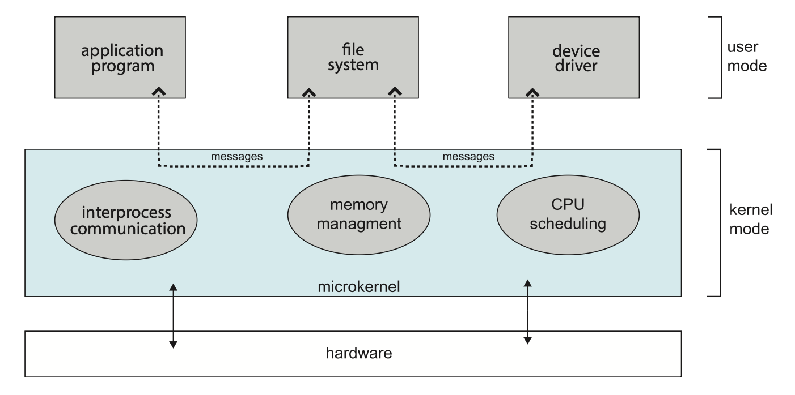

# Operating-System Structures

## Operating-System Services

尽管不同的 OS 提供的具体服务也各不相同，但我们还是能够找到所有 OS 都有的一些服务。下面将分别从用户和系统角度简要介绍这些共同的服务：

    

- 用户：
    - **用户接口**(user interface)：
        - **图形用户界面**(graphic user interface, **GUI**)
        - **触摸屏界面**(touch-screen interface)
        - **命令行界面**(command-line interface, **CLI**)
    - **程序执行**(program execution)：加载到内存、运行、（正常/异常）退出
    - **I/O 操作**(I/O operations)：文件或 I/O 设备需要
    - **文件系统操纵**(file-system manipulation)：
        - 读写文件/目录
        - 创建/删除/查找/罗列文件
        - 权限管理
      - **通信**(communication)：
        - 包括同一计算机内不同进程的通信，以及不同计算机系统下通过网络连接的进程之间的通信
        - 实现技术：**共享内存**(shared memory)、**消息传递**(message passing)
    - **错误检测**(error detection)：
        - 错误既可能在硬件（CPU、内存、I/O 设备）发生，也可能在软件发生
        - 解决：纠正或终止，有时会返回一个错误码(error code)
  
- 系统：
    - **资源分配**(resource allocation)：
      - 一些资源可能有特殊的分配码(allocation code)，另一些资源可能有更通用的请求码(request code)和释放码(release code)
    - **日志**(logging)：使用统计，追踪计算资源的使用，便于管理者配置
    - **保护和安全**(protection and security)：
        - 保护：当多个进程并发运行时，进程间不得相互干扰，这就要确保所有对系统资源的访问是受控的
        - 安全：要求用户验证身份

## User and Operating-System Interface

接下来详细介绍目前操作系统的一些主流用户界面。

### Command Interpreters

相比“**命令行解释器**(command interpreters)”这个术语，我们可能更熟悉 "**shell**" 这个名词，两者大致是等价的。在 Unix 和 Linux 系统中，目前常见的 shell 有 bash(Bourne-Again shell), zsh(Z shell), fish 等（像 C Shell, Korn Shell 已经很少有人用了）。读者可用 `#!sh echo $0` 命令查看当前使用的 shell。为便于后续说明，下面还是用“命令行解释器”这个词而不是 "shell"。

正如其字面意思，命令行解释器的主要功能是<u>获取并执行用户指定的下一条命令</u>。这些命令的实现大致有以下方式：

- 命令行解释器本身包含执行命令的代码
- 通过系统程序实现大多数的命令（UNIX 正是这样做的）

### Graphic User Interface

现在绝大多数用户接触电脑的第一个方式可能就是 GUI。现在主流的操作系统都有自己的 GUI，即便是程序员常用的 Linux，也有 KDE, GNOME 之类的开源的桌面环境。所以这里没什么好说的。

>冷知识：第一个带 GUI 的计算机是施乐(Xerox)推出的 Xerox Alto，但可惜的是没有很好地实现商业化。~~后来就被 Steve Jobs 抄到 Macintosh 上了，接着 Bill Gates 又把它抄到 Windows 上了。~~

### Touch-Screen Interface

现在的智能手机、平板基本上都用触摸屏界面。然后也没什么好说的...

### Choice of Interface

界面的选择取决于个人偏好：

- 如果是系统管理员或资深用户可能更偏好 CLI，因为
    - 更高效
    - 一些任务可能只能在 CLI 上完成（反过来不太可能）
    - 更容易完成重复性的工作，比如可通过 shell 脚本编程来完成重复的任务
- 对于大多数一般的用户，GUI 毫无疑问是第一选择

## System Calls

**系统调用**(system calls)提供了访问 OS 服务的一种接口，这些调用通常是用 C 和 C++ 编写的函数，但部分底层任务可能必须使用汇编语言指令编写。

### Application Programming Interface

实际上即便是一个很简单的程序也会大量使用 OS，并且 OS 通常每秒执行上千次的系统调用。大多数开发者不会看到这种底层细节，因为他们在设计程序时用的是**应用程序接口**(application programming interface, **API**)，比如 Windows API, POSIX API, Java API 等。程序员通过 OS 提供的代码库访问 API，例如在用 C 语言编写的 UNIX 和 Linux 系统中，库叫做 `libc`。在幕后，构成 API 的函数通常会代表应用程序员调用实际的系统调用。

程序员之所以更喜欢基于 API 编程而非直接调用系统调用，是因为使用 API 有以下好处：

- 程序的**可移植性**(portablity)
    - 用同一套 API 编写的程序可以在有相同 API 的系统上编译运行
    - 相比 API，系统调用更复杂且更难运作
- **运行时环境**(runtime environment, **RTE**)：一整套用于执行用给定编程语言编写的程序的软件，包括了编译器、解释器、库、加载器等
    - RTE 提供了**系统调用接口**(system-call interface)，作为 OS 提供的系统调用的链接。
    - 通常，每个系统调用都与一个数字相关联，系统调用接口根据这些数字维护一个表。然后它在操作系统内核中调用预期的系统调用，并返回系统调用的状态
    - 操作系统界面的大多数细节都被 API 隐藏起来，由 RTE 管理

下图展示了 API，系统调用接口和 OS 的关系：

    

OS 传参的通用方法：

- 用**寄存器**传参
- 参数以块或表的形式存储在**内存**中，块的地址作为参数传到寄存器里

    

        
    

- 参数压入(push)一个**栈**(stack)内，或从栈内弹出(pop)

### Types of System Calls

- **进程控制**(process control)
    - 创建/终止进程
    - 加载/执行
    - 获取/设置进程属性
    - 等待事件/发送事件信号
    - 分配/释放内存

    ??? example "例子"

        === "例1：Arduino（一个单任务系统）"

            

                
            

        === "例2：FreeBSD（一个多任务系统）"

            

                
            

- **文件管理**(file management)
    - 创建/删除文件
    - 打开/关闭
    - 读/写/重定位(reposition)
    - 获取/设置文件属性
- **设备管理**(device management)
    - 请求/释放设备
    - 读/写/重定位
    - 获取/设置设备属性
    - 逻辑上连接或断开设备
- **信息维护**(information maintenance)
    - 获取/设置时间/日期
    - 获取/设置系统数据
    - 获取进程/文件/设备属性
    - 设置进程/文件/设备属性
- **通信**(communication)
    - 创建/删除通信连接
    - 发送/接收消息
    - 传递状态信息
    - 连接/断开远程设备
- **保护**(protection)
    - 获取/设置权限

## System Services

**系统服务**(system services)（又称**系统实用程序**(system utilities)），为程序的开发与执行提供了一个便利的环境。其中一些仅仅是系统调用的用户接口，而另一些则复杂得多。它们可分为以下几类：

- **文件管理**(file management)：创建/删除/拷贝/重命名/打印/罗列，以及一般的对文件/目录的访问和操纵
- **状态信息**(status information)：
    - 日期、时间、可用内存或磁盘空间、用户数量，或更复杂的详细的性能、日志和调试信息
    - 一些系统还支持**注册表**(registry)，用于存储和检索配置信息
- **文件修改**(file modification)：
    - 文本编辑器
    - 用于搜索文件内容或对文本进行转换的特殊命令
- **编程语言支持**(programming-language support)：编译器(compiler)、汇编器(assembler)、调试器(debugger)、解释器(interpreter)等
- **程序加载和执行**(program loading and execution)：
    - 一旦程序被汇编或编译，就必须将其加载到内存中才能执行。系统可能提供绝对加载器、可重定位加载器、链接编辑器和覆盖加载器
    - 同时还需要为高级语言或机器语言提供调试系统
- **通信**(communication)：提供了在进程、用户和计算机系统之间创建虚拟连接的机制
- **后台服务**(background services)：
    - 持续运行的系统程序进程被称为服务、**子系统**(subsystem)或**守护进程**(daemon)
    - 一般系统拥有数十个守护进程
    - 在用户上下文而非内核上下文中运行重要活动的 OS 可能会使用守护进程来执行这些活动

## Linkers and Loaders

通常，程序作为一个二进制文件（比如 a.out 或 prog.exe）被存储在磁盘中。要想让程序在 CPU 上运行，程序必须先被加载到内存里，并放置在一个进程的上下文中。本节就来详细介绍这一流程，而下图概括了即将要介绍的内容：

    

- 源文件被编译成可被加载到任何物理内存位置的目标文件，这种格式被称为**可重定位目标文件**(relocatable object files)
- 接下来，**链接器**(linker)将这些可重定位目标文件组合成一个单一的二进制**可执行文件**(binary executable files)
    - 在链接阶段，还可能包含其他目标文件或库（使用标志 `-lm` 指定）
- **加载器**(loader)用于将二进制可执行文件加载到内存中，使其可以在 CPU 核心上运行
- 与链接和加载相关联的活动是**重定位**(relocation)，它为程序部分分配最终地址，并调整程序中的代码和数据以匹配这些地址

要运行加载器，只需在命令行中输入可执行文件的名称。当在命令行键入程序名称时（比如 `./main`），

- shell 首先通过 `fork()` 系统调用创建一个新的进程来运行程序
- 然后，shell 使用 `exec()` 系统调用调用加载器，并将可执行文件的名称传递给 `exec()`
- 加载器随后使用新创建的进程的地址空间将指定的程序加载到内存中

到目前为止，我们假定所有库都已链接到可执行文件并加载到内存中。实际上，大多数系统允许程序在加载时动态地链接到库上，比如 Windows 支持**动态链接库**(dynamically linked libraries, **DLL**)。这种方法的优点是避免了将可能最终未被使用的库链接和加载到可执行文件中（从而减少额外的开销），因为库是条件链接的，并在程序运行时需要时才加载。之所以能这样，是因为链接器插入了重定位信息，允许库在程序加载时动态链接和加载。

目标文件和可执行文件通常具有标准格式，包括编译后的机器代码，以及包含关于程序中引用函数和变量的元数据的符号表。对于 UNIX 和 Linux 系统，这种标准格式被称为 **ELF**（可执行和链接格式(executable and linkable format)）。

- 对于可重定位和可执行文件，有单独的 ELF 格式
- 可执行文件的 ELF 文件的一项信息是程序的**入口点**(entry point)，它包含程序运行时第一条要执行的指令的地址

## Why Applications Are Operating-System Specific

要让一个应用程序在多个 OS 上都能运行，有以下几种方式：

- 用解释型语言编写应用程序，并且解释器在多个 OS 上是可用的（比如 Python, Ruby）
- 用一种包含运行中应用的虚拟机的语言编写应用程序（比如 Java）
- 应用程序开发者可以使用标准语言或 API，编译器会生成特定于机器和操作系统的二进制代码（比如 POSIX API）

理论上这些方法为在不同 OS 上运行应用程序提供解决方案，但实现起来困难重重，原因有：

- 应用程序层面：OS 提供的库包含 API，以提供诸如 GUI 界面等功能，而调用这些 API 的应用程序将无法在未提供这些 API 的 OS 上运行
- 系统层面：
    - 每个 OS 都有为应用程序指定的**二进制格式**，该格式决定了头部、指令和变量的布局，这些组件需要在可执行文件中特定结构中的特定位置，以便操作系统可以打开文件并加载应用程序以正确执行
        - UNIX 和 Linux 都采用了 **ELF** 格式作为二进制可执行文件的标准，不过这种格式并不绑定于任何特定的计算机架构，因此它并不能保证一个可执行文件能在不同的硬件平台上运行
    - CPU 具有不同的**指令集**，只有包含适当指令的应用程序才能正确执行
    - OS 提供的**系统调用**在许多方面有所不同，包括使用的特定操作数和操作数顺序、应用程序如何调用系统调用等

类似 API 在应用程序层面指定具体的函数，在架构层面有一种叫做 **ABI**（应用二进制接口(application binary interface)）的东西，它定义了不同二进制代码组件如何与特定架构上的特定 OS 交互。ABI 指明了底层细节，包括地址宽度，向系统调用传参的方法，运行时栈的组织，系统库的二进制格式，以及数据类型的大小等。所以如果一个二进制可执行文件是按照特定的 ABI 编译和链接的，它应该能够在支持该 ABI 的不同系统上运行。然而，由于特定的 ABI 是为在给定架构上运行的特定操作系统定义的，ABI 在提供跨平台兼容性方面作用有限。

## Operating-System Design and Implementation

### Design Goals

略

### Mechanisms and Policies

一个重要原则是划分**策略**(policy)和**机制**(mechanism)。机制决定如何做事，而策略决定要做什么事。这种分离对灵活性至关重要——一种通用的，并且足够灵活，以适用于多种策略的机制是更可取的。

（~~看不懂自己在写什么...~~）

### Implementation

早年的 OS 是用汇编语言写的，而现在大多数 OS 都是用高级语言编写的，比如 C 或 C++，只有少数系统是用汇编写的。使用高级语言来实现 OS 的优势有：

- 与将其用于应用程序开发时获得的益处相同：代码编写速度更快、结构更紧凑、且更易于理解和调试
- 此外，编译器技术的进步提升了生成整个 OS 代码的质量（通过简单的重新编译）
- 最后，若用高级语言编写 OS，将其移植到其他硬件平台会容易得多，这对于要运行于多种不同硬件系统上的 OS 尤为重要

采用高级语言实现 OS 的唯一潜在缺点可能是运行速度的降低和存储需求的增加。然而对现在而言，这并非主要问题。尽管汇编语言专家能够编写出高效的小型例程，但对于大型程序而言，现代编译器能进行复杂的分析并能应用精妙的优化技术，从而生成卓越的代码。另外，现代处理器具备深度流水线和多功能单元，它们处理复杂依赖关系细节的能力远超人脑所能及。

## Operating-System Structure

一个规模庞大且如现代 OS 复杂的系统，若要确保其正常运行并易于修改，就必须精心设计。通常的做法是将任务分解为小型组件或模块，而非构建单一整体系统。每个模块应是系统中定义明确的部分，具备清晰界定的接口与功能。下面将探讨 OS 的常见组件是如何相互连接并结合成一个内核的。

### Monolithic Structure

组织操作系统的最简单的结构就是没有结构，也就是说将所有内核功能都放入一个单一的、静态的二进制文件中，运行在单一地址空间内。这种方法被称为**单体结构**(monolithic structure)，是设计操作系统的常用技术。

一个典型的例子是最开始的 UNIX 操作系统，它由两个部分组成：**内核**和**系统程序**。内核进一步分为一系列接口和设备驱动程序，它们随着 UNIX 的发展多年来不断被添加和扩展。我们可以将传统的 UNIX 操作系统视为在一定程度上分层的，如下图所示。

    

{ align=right width=25% }

系统调用接口以下、物理硬件以上的所有内容都是内核。内核通过系统调用提供文件系统、CPU调度、内存管理以及其他操作系统功能。总之，大量功能被整合进了一个单一的地址空间内。

Linux 操作系统基于 UNIX 并具有类似的结构，如右图所示。应用程序通常使用 `glibc` 标准 C 库与系统调用接口进行通信以访问内核。Linux内核是单体的，因为它完全在内核模式下运行于单一地址空间中。但后面我们会提到，它还具有模块化设计，允许在内核运行时对其进行修改。

尽管单体内核足够**简单**，但它们**难以实现和扩展**。然而，这种结构有一个显著的性能优势是**系统调用接口的开销很小，并且内核内通信很快**。因此尽管有着种种缺点，现在仍有不少 OS 采用这种结构。

### Layered Approach

{ align=right width=30% }

单体架构通常被称为**紧耦合**(tightly coupled)系统，因为系统中某一部分的更改可能会对其他部分产生广泛的影响。另一种选择是设计一个**松耦合**(loosely coupled)系统。这种系统被划分为独立的、功能具体且有限的小型组件，所有这些组件共同构成内核。采用**模块化方法**的优势在于，对某一组件的修改仅影响该组件本身，而不会波及其他部分，从而为系统实现者在创建和更改系统的内部工作机制时提供了更大的自由度。

实现系统模块化的方式多种多样。其中一种方法是**分层法**(layered approach)，也就是将 OS 分解为若干层（级别）。最底层（第 0 层）是硬件，最高层（第 N 层）为用户界面，如右图所示。

OS 的一个层级是对由数据及可操作这些数据的运算所构成的抽象对象的实现。一个典型的 OS 层级——例如 M 层——包含数据结构以及一组可供更高层调用的函数集。相应地，M 层可以调用更低层的操作。

分层法的主要优势是**让构建和调试变得简单**：第一层可以在无需考虑系统其余部分的情况下进行调试，因为根据定义，它仅使用基础硬件（假设其正确无误）来实现功能。一旦第一层调试完成，就可以在调试第二层时假定其运行正常，以此类推。如果在特定层的调试过程中发现错误，那么错误必定存在于该层中，因为其下方的各层已经过调试。这样一来，系统的设计与实现便得以简化，并且每一层都向更高层级隐藏了某些数据结构、操作和硬件的存在。

分层系统已在计算机网络（如 TCP/IP）和 Web 应用中得到成功运用。然而，采用纯粹分层方法的 OS 相对较少，原因包括：

- **难以恰当定义每一层的功能**
- 用户程序需要穿越多个层次才能获得 OS 服务，这会带来不少**开销**
 

### Microkernels

**微内核**(microkernel)方法通过移除内核中所有不必要的组件，将其作为用户级程序并放在分离的地址空间内实现来构建 OS。这样的结果是得到了一个更小的内核。关于哪些服务应保留在内核中，哪些应在用户空间实现，目前几乎没有共识。不过可以肯定的是，微内核仅提供最基本的进程和内存管理功能，以及通信机制。下图展示了典型的微内核架构：

    

微内核的主要功能是<u>提供客户端程序与同样运行在用户空间的各种服务之间的通信</u>，这种通信通过消息传递实现。例如，如果客户端程序希望访问文件，它必须与文件服务器进行交互。客户端程序和服务从不直接互动，而是通过与微内核交换消息来间接沟通。

采用微内核方法的好处有：

- **扩展 OS 更为容易**：所有新服务都被添加到用户空间，因此无需修改内核。当确实需要修改内核时，由于微内核本身较小，所需的改动也相对较少。由此产生的 OS 更容易从一个硬件设计移植到另一个硬件设计上。
- 此外，由于大多数服务是以用户进程而非内核进程的形式运行，微内核还提供了**更高的安全性和可靠性**。即使某个服务失败，OS 的其余部分也不会受到影响。

然而，微内核的性能可能因系统功能开销增加而受到影响。当两个用户级服务需要通信时，消息必须在这些位于不同地址空间的服务之间进行复制。此外，OS 可能需要在进程间切换以交换信息。因此**消息复制**和**进程切换**所带来的开销一直是阻碍基于微内核的 OS 发展的最大障碍。

### Modules

当前 OS 设计的最佳方法或许在于采用**可加载内核模块**(loadable kernel modules, LKM)。在这种设计中，内核包含一组核心组件，并能在启动时或运行时通过模块链接额外的服务。这种设计模式在现代 UNIX 实现中十分常见。

该设计的核心理念是让内核提供基础服务，而其他功能则在内核运行期间动态加载。相较于直接向内核添加新功能（每次修改都需重新编译内核），动态链接服务更为可取。例如，我们可以将 CPU 调度和内存管理算法直接构建进内核，然后通过可加载模块为不同文件系统添加支持。

- 整体架构类似于**分层系统**：每个内核部分都有明确且受保护的接口；但它比分层系统更灵活，因为任何模块都能调用其他模块。
- 这种方法也与**微内核架构**有相似之处：主模块仅包含核心功能及加载并与其他模块通信的机制；但其效率更高，因为模块间无需通过消息传递进行通信。

Linux 主要利用 LKM 来支持设备驱动和文件系统。LKM 可以在系统启动时或运行时被"插入"内核。若 Linux 内核缺少所需驱动，可进行动态加载。同时 LKM 也能在运行时从内核移除。对 Linux 而言，LKM 在在保持单体系统性能优势的同时实现了动态化、模块化的内核设计。

### Hybrid Systems

实际上，很少有 OS 采用单一、严格定义的结构——它们往往结合了不同的结构，形成了**混合系统**(hybrid systems)，以解决性能、安全性和可用性问题。比如：

- Linux 是单体的，因为将 OS 置于单个地址空间内能提供非常高效的性能；但同时它也是模块化的，以便新功能可以动态地添加到内核中。
- Windows 在很大程度上同样是单体结构（同样主要出于性能考虑），但它保留了微内核系统的某些典型行为，包括支持作为用户模式进程运行的独立子系统。Windows 系统还支持动态可加载的内核模块。

## Building and Booting an Operating System

### Operating-System Generation

从头开始生成（或构建）一个 OS 的步骤：

1. 编写操作系统源代码（或获取先前编写的源代码）
2. 为将要运行的操作系统配置目标系统
3. 编译操作系统
4. 安装操作系统
5. 启动计算机及其新操作系统

### System Boot

大多数系统的启动进程按如下步骤进行：

1. 一段名为**引导程序**(bootstrap program)或**引导加载器**(boot loader)的代码，用于定位内核
2. 内核被加载到内存并启动
3. 内核初始化硬件
4. 根文件系统被挂载

某些计算机系统采用多阶段启动流程：当计算机首次通电时，会运行一个位于非易失性固件（称为 **BIOS**）中的小型引导加载程序。这个初始引导加载程序通常仅负责加载第二个引导加载程序，后者位于硬盘固定位置，即所谓的**启动块**(boot block)。存储在启动块中的程序可能足够复杂，能够将整个 OS 载入内存并开始执行；但更常见的是它只是简单的代码（因为它必须容纳在单个磁盘块内），仅知晓磁盘上剩余引导程序的地址和长度。

许多现代计算机系统已用 **UEFI**（统一可扩展固件接口(unified extensible firmware interface)）取代了基于 BIOS 的启动过程。相较于 BIOS，UEFI 具有多项优势，包括对 64 位系统和更大容量硬盘的更好支持，但最大的优点在于它是一个独立完整的启动管理器，因此比多阶段的 BIOS 启动过程更为迅速。

无论是通过 BIOS 还是 UEFI 启动，引导程序都能执行多种任务。除了将包含内核程序的文件载入内存外，它还会运行**诊断**以检测机器状态，例如检查内存、CPU以及识别设备。若诊断通过，程序将继续后续启动步骤。引导程序还能初始化系统的各个方面，从 CPU 寄存器到设备控制器及主存内容均在其列。最终它会启动操作系统并挂载根文件系统系统——只有到达这一时刻，系统才被视为正式运行起来。

为了节省空间并缩短启动时间，Linux 内核映像是一个压缩文件，在加载到内存后进行解压。在启动过程中，引导加载程序通常会创建一个临时的 RAM 文件系统，称为 `initramfs`。该文件系统包含必要的驱动程序和内核模块，这些必须被安装以支持实际的根文件系统（它不在主存中）。一旦内核启动且所需驱动程序安装完毕，内核会将根文件系统从临时 RAM 位置切换到适当的根文件系统位置。最后，Linux 创建 `systemd` 进程（系统中的初始进程），然后启动其他服务。最终系统将向用户呈现登录提示。

## Operating-System Debugging

广义上讲，**调试**(debugging)是在系统中（包括硬件和软件）查找并修复错误的活动。性能问题也被视为缺陷，因此调试也可以包含**性能调优**(performance tuning)，即通过消除处理瓶颈来提升性能。本节将探讨调试过程以及内核错误与性能问题，但硬件调试不在本文讨论范围之内。

### Failure Analysis

若进程发生故障，大多数 OS 会将错误信息写入**日志文件**(log files)，以警示系统管理员或用户问题已发生。OS 还可进行**核心转储**(core dump)，即捕获进程的内存内容，并将其存储于文件中供后续分析。运行中的程序及核心转储可由调试器探查，使程序员能在故障发生时深入检查进程的代码与内存。

调试用户级进程代码已经够困难了，但 OS 内核调试会更加复杂，原因在于内核规模庞大、结构复杂、控制着硬件资源且缺乏用户级调试工具。内核中的故障称为**崩溃**(crash)。当崩溃发生时，错误信息会被保存至日志文件，同时内存状态会存入**崩溃转储**(crash dump)文件。

由于任务性质迥异，OS 调试与进程调试常采用不同的工具和技术。一种常见技术是将内核的内存状态保存到磁盘中专为此目的预留的、不含文件系统的区域中。若内核检测到不可恢复的错误，便将全部内存内容（或至少是系统内存中由内核占用的部分）写入该磁盘区域。待系统重启后，一个进程会运行起来收集该区域的数据，并写入位于某个文件系统中的崩溃转储文件以供分析。显然对于普通用户级级进程的调试而言，此类策略并无必要。

### Performance Monitoring and Tuning

为了识别性能调优中存在的瓶颈，我们必须能够监控系统性能。因此，OS 必须具备计算和展示系统行为指标的方法。工具可以分为提供**进程级**(per-process)或**系统级**(system-wide)的观察功能。为实现这些观察，工具可采用两种方法之一——**计数器**(counters)或**追踪**(tracing)技术，接下来就逐一探讨这两种方法。

#### Counters

Linux 中用到计数器的工具：

进程级：

- `ps`：报告单个或选定进程的信息  
- `top`：报告当前进程的实时统计信息  

系统级：

- `vmstat`：报告内存使用统计信息  
- `netstat`：报告网络接口的统计信息  
- `iostat`：报告磁盘 I/O 使用情况

Linux 系统中大多数基于计数器的工具从 `/proc` 文件系统读取统计信息。它是一个“伪”文件系统，仅存在于内核内存中，主要用于查询各种进程级及内核统计数据。该文件系统以目录层次结构组织，每个进程（被分配的唯一整数值）在 `/proc` 下显示为一个子目录。例如目录项 `/proc/2155` 将包含 ID 为 2155 的进程的统计信息。

#### Tracing

追踪工具收集特定事件的数据，例如系统调用执行过程中的各个步骤。以下是用于追踪事件的 Linux 工具示例：

进程级：

- `strace`：追踪进程调用的系统调用
- `gdb`：源代码级调试器

系统级：

- `perf`：Linux 性能工具的集合
- `tcpdump`：收集网络数据包