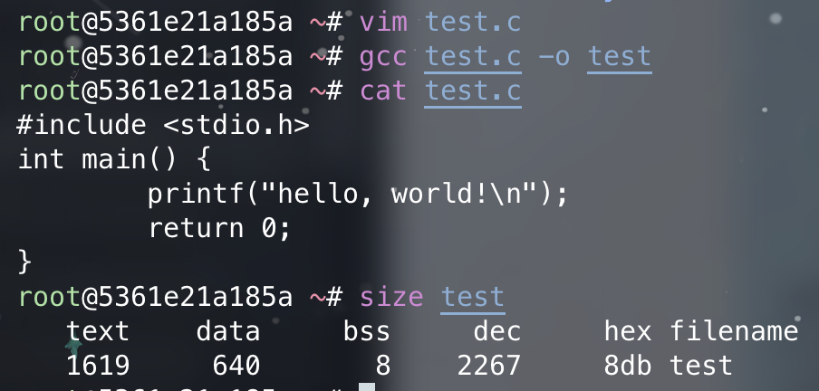

# Processes

## Concept

{ align=right width=20% }

我们可以简单地将**进程**(process)看作<u>执行中的程序</u>。进程的当前活动状态由**程序计数器**(program counter)的值和处理器寄存器的内容表示。而一个进程的内存布局被划分为多个段，包括：

- **文本段**(text section)：可执行的代码
- **数据段**(data section)：全局变量
- **堆段**(heap section)：在程序运行时动态分配的内存
- **栈段**(stack section)：调用函数时的临时数据存储（比如函数参数、返回地址、局部变量等）

??? info "补充：C 程序的内存布局"

    大体上和前面介绍的类似，但还是略有一些不同的：

    <div style="text-align: center">
        
    </div>

    - 全局数据段被细分为两个段，分别放置初始化过的数据和未初始化的数据
    - 单独为传到 `main` 函数的参数 `argc` 和 `argv` 提供一个段

    可以用 GNU `size` 命令查看 C 程序各个段的大小。

    <div style="text-align: center">
        
    </div>

要注意的是，文本段和数据段的大小是固定的，因为它们的大小没法在程序运行时改变；而堆段和栈段的大小可在程序执行时动态伸缩。尽管栈段和堆段的扩张方向是朝向对方的，但 OS 会确保两者不会重叠。

再次强调：程序本身不是进程！

- 程序只是一个**被动实体**(passive entity)（比如包含指令列表，存储在磁盘中的文件，即**可执行文件**(executable file)）
- 相对地，进程是一个**主动实体**(active entity)，包含（指明下一条待执行指令的）程序计数器和一套计算资源

当可执行文件被加载到内存时，程序就成为了进程。

尽管两个或多个进程可能关联到同一个程序，但我们得将它们看成单独的执行序列，因为尽管文本段是一样的，但其他段都各不相同。

另外，进程自身可以是其他代码的执行环境，比如 JVM。


### Process State

进程可能处在以下状态之一：

- **新建**(new)：正在创建进程
- **运行中**(running)：正在执行指令
- **等待中**(waiting)：进程正在等待某些事件的发生
- **就绪**(ready)：进程正在等待被赋予一个处理器执行
- **已终止**(terminated)：进程已完成执行

上述状态名称可以是任意的，不同的 OS 可能有不同的名称，不过这些状态内容可以在所有的 OS 中找到。需要注意的是一个处理器核心在任意时刻只能运行一个进程，所以很多进程会处于就绪或等待状态。下图展示了对应的状态图：

<div style="text-align: center">
    
</div>


### Process Control Block

{ align=right width=20% }

在 OS 中，每个进程会被用一个叫做**进程控制块**(process control block, **PCB**)（又称任务控制块(task control block)）的东西表示，如右图所示。PCB 内含了很多关于特定进程的信息片段，包括：

- **进程状态**(process state)：包括但不局限于前面提到的那些状态
- **程序计数器**(program counter)：表示该进程下一条要执行的指令的地址
- **CPU 寄存器**(CPU registers)：
    - 在数量和类型上随 CPU 架构各不相同
    - 包括累加器、索引寄存器、栈指针、通用目的寄存器，以及任何的状态编码信息
    - 当中断发生时，必须保存好 CPU 寄存器内的信息，以便之后能够继续执行该进程
- **CPU 调度信息**(CPU-scheduling information)：包括进程优先级、指向调度队列的指针，以及其他任何调度参数
- **内存管理信息**(memory-management information)：包括基址和界限寄存器(base and limit registers)的值、页表(page table)或段表(segment table)等项，具体取决于 OS 所使用的内存系统
- **会计信息**(accounting information)：包括使用的 CPU 和实际时间、账户号码、作业或进程号等
- **I/O 状态信息**(I/O status information)：分配到进程中的 I/O 设备列表、打开文件列表等

??? info "补充：Linux 中的进程表示"

    Linux 用 C 结构体 `task_struct` 表示进程控制块，位于 `#!c <include/linux/sched.h>` 中。该结构体的部分字段如下：

    ```c
    long state;                       /* state of the process */
    struct sched_entity se;           /* scheduling information */
    struct task_struct *parent;       /* this process's parent */
    struct list_head children;        /* this process's children */
    struct files_struct *files;       /* list of open files */
    struct mm_struct *mm;             /* address space */
    ```


### Threads

上述讨论的进程模型只考虑了执行单一**线程**(threads)的情况，但一个线程使得进程在同一时间内只能执行一个任务。所以大多数现代 OS 早已将进程概念扩展到让一个进程拥有多个执行线程，从而能够同时执行多个任务。这一特性在多核系统中尤其有用，因为多个线程可以并行运行。


## Process Scheduling

**进程调度器**(process scheduler)从一组可用的进程中挑选一个进程，放在某个处理器核心上执行。而 CPU 在一段时间内只能执行一个进程。若进程数多于核心数，多出来的继承需要等到核心空闲后才能被重新调度。当前在内存中的进程数被称为**多道程序的度**(degree of multiprogramming)。

一般来说，大多数进程可以被分为：

- **I/O 密集型进程**(I/O-bound process)：相比在计算上的时间，花在 I/O 上的时间更多
- **CPU 密集型进程**(CPU-bound process)：生成 I/O 请求的频率较低，并且将更多时间花在计算上


### Scheduling Queues

当进程进入系统时，它们会被放在**就绪队列**(ready queue)中，这些进程都处在就绪状态，等待被 CPU 核心执行。队列以**链表**形式存储：队列的头包含列表中指向第一个 PCB 的指针，且每个 PCB 都包含一个指向下一个 PCB 的指针。

假设进程向磁盘等设备发起 I/O 请求，由于设备运行速度远慢于处理器，所以进程将不得不等待 I/O 变得空闲。于是这些等待特定事件发生的进程将被放入**等待队列**(wait queue)内。

下面两张图分别展示了就绪队列和等待队列的结构：

<div style="text-align: center">
    
</div>

进程调度的常用表示形式是**队列图**(queueing diagram)，并且该图包含了上述的两种队列（就绪队列和等待队列）。图中的圆形表示硬件资源，而箭头表示系统中的进程流。

<div style="text-align: center">
    
</div>

起初，新的进程会被放入就绪队列中，然后一直等待直到被选中（或者叫**分派**(dispatch)）执行。一旦进程被分配到 CPU 核心上执行时，以下事件中的一种将会发生：

- 进程发起 I/O 请求，然后被放在 I/O 等待队列中
- 进程创建一个新的子进程，然后被放在等待队列中，直到子进程终止
- 进程可能因为中断或时间片(time slice)到期而被强制从核心中移除，并被放回到就绪队列中

在前两种情况，进程最终从等待状态切换至就绪状态，随后被放在就绪队列中。接下来就继续执行这个循环直到终止，此时该进程会从所有的队列中被移除，且它的 PCB 和资源都会被释放。


### CPU Scheduling

一个进程在其生命周期内在就绪队列和各种等待队列之间迁移。**CPU 调度器**(CPU scheduler)的作用就是在就绪队列中的进程中做出选择，并为其中一个进程分配 CPU 核心。它必须为 CPU 频繁选择一个新的进程。因此尽管 CPU 密集型进程可能要花更长的时间来占用 CPU 核心，但调度器不会长时间地将核心分配给一个进程，更可能的情况是：强制从 CPU 中移除该进程，并安排另一个进程运行。

一些 OS 有一种中间形式的调度，叫做**交换**(swapping)。它的大致思路是将进程从内存（以及 CPU 的活跃竞争中）中移除，以降低多道程序的度。随后进程可被重新引入到内存中，并且可以从上次离开的地方继续执行。交换技术仅在内存被过分占用且必须释放的场景下使用。


### Context Switch

前面提到过，中断会使得 OS 将 CPU 核心从执行当前任务转向运行内核例程，而这样的操作在通用目的的系统中经常发生。中断发生时，系统需要保存当前在和核心上执行的进程的上下文信息（**状态保存**(state save)），以便之后恢复这个被暂停的进程并继续执行下去（**状态恢复**(state restore)）。进程的 PCB 能够表示上下文信息，包括 CPU 寄存器、进程状态等。

上述过程被称为**上下文切换**(context switch)，其图示如下：

<div style="text-align: center">
    
</div>

上下文切换时间纯粹是一笔开销，因为在切换时系统在做无用功。切换的速度取决于内存速度、需要被拷贝的寄存器个数、特殊指令（比如是否有能一次性加载和保存所有寄存器的指令）的存在等。因此上下文切换高度依赖于硬件支持。


## Operations on Processes

进程的创建和删除是系统中常见的操作，下面就来详细探讨其背后的机制。


### Process Creation

在执行过程中，一个进程可能会创建多个新的进程。这个创建进程的进程就是父进程，而这些新创建的进程就是该进程的孩子，它们也能创建新的进程，因而能形成一棵**树**(tree)。另外，大多数 OS 用一个唯一的**进程标识符**(process identifier, **pid**)（通常是一个整数）识别进程，可作为访问各种内核进程属性的索引。下图展示了 Linux 典型的进程树。

<div style="text-align: center">
    
</div>

- `systemd` 进程作为所有用户进程的根进程，并且是系统启动时的第一个进程
- 一旦系统启动，`systemd` 进程就会创建其他进程，比如 `ssh`，`logind` 等
- `logind` 进程负责管理直接登录到系统的客户端，客户端登录后就要用到 `bash`，对应地创建了这样的子进程
- 在 `bash` 的 CLI 界面，用户会创建 `ps` 和 `vim` 进程
- `sshd` 进程负责管理通过 `ssh` 连接到系统的客户端

在 UNIX 和 Linux 系统中，可通过 `ps` 命令查看进程列表。

<div style="text-align: center">
    
</div>

另外 Linux 还提供了 `pstree` 命令，以树状形式呈现所有进程。

<div style="text-align: center">
    
</div>

通常来说，当一个进程创建子进程时，该子进程需要一定的资源来完成任务。子进程可以直接从 OS 中获取这些资源，也可能被限制为只能使用父进程资源的一部分。父进程可能需要在多个子进程之间分配其资源，或者能够与部分子进程共享某些资源。将子进程的资源限定在父进程资源的某个范围内，可以防止任何因创建过多子进程而导致系统过载的情况发生。

除了提供各种物理和逻辑资源外，父进程还可能将初始化数据（输入）传递给子进程。

当某个进程创建一个新进程时，存在以下两种执行的可能性：

- 父进程与子进程继续并发执行
- 父进程等待，直到部分子进程终止

新进程也有以下两种地址空间的可能性：

- 子进程是父进程的副本（程序和数据都和父进程一样）
- 子进程对应一个新加载进来的程序

在 UNIX 系统中，新进程是通过 `fork()` 系统调用创建的。新进程包含了原进程地址空间的一个副本。这种机制使得父进程轻松地与其子进程通信。这两个进程（父进程和子进程）在 `fork()` 之后的指令处继续执行，但有一个区别：对子进程而言，`fork()` 的返回码是0，而子进程的（非零）进程标识符被返回给父进程。

在 `fork()` 系统调用之后，两个进程之一通常使用 `exec()` 系统调用，以新程序替换进程的内存空间。`exec()` 系统调用将二进制文件加载到内存中，随后执行。通过这种方式，两个进程能够进行通信且能各自运行。因为 `exec()` 调用将进程的地址空间覆盖为新程序，所以除非发生错误，否则 `exec()` 不会返回控制权。

下面展示了用 C 程序编写的 UNIX `fork()` 系统调用（用于创建一个单独进程）。

??? code "代码实现"

    ```c
    #include <sys/types.h>
    #include <stdio.h>
    #include <unistd.h>
    int main() {
        pid_t pid;
        /* fork a child process */
        pid = fork();

        if (pid < O) { /* error occurred */
            fprintf(stderr, "Fork Failed");
            return 1;
        }
        else if (pid == 0) {/* child process */
            /* execlp() is a version of the exec() system call */
            /* overlays address space with /bin/ls (used to get a directory listing) */
            execlp("/bin/ls", "ls", NULL);
        }
        else { /* parent process */
            /* parent will wait for the child to complete */
            wait(NULL);
            printf("Child Complete");
        }
        return 0;
    }
    ```

用图示展示使用 `fork()` 系统调用创建进程的流程：

<div style="text-align: center">
    
</div>


### Process Termination

当进程完成执行最后一条语句时，进程终止，并通过使用 `exit()` 系统调用让 OS 将其删除。此时进程可能会返回一个状态值（整数）给等待中的父进程（通过 `wait()` 系统调用，参数为子进程的退出状态，返回值为终止子进程的 pid），且进程用到的资源都会被 OS 释放和回收。

进程终止也可能发生在其他情况，比如一个进程可通过系统调用终止另外的进程。而通常此类系统调用只能由要终止的进程的父进程调用，否则就会出现用户或行为不当的应用随意杀死其他用户进程的情况。需要注意的是，如果父进程要终止其子进程，它需要知道子进程的 id。因此，当一个进程创建一个新的进程时，新创建的进程的 id 会被传递给父进程。

下面总结一些父进程要终止子进程的可能原因：

- 子进程对资源的使用超过了本应分配给它的限制（要确定是否发生这种情况，父进程必须有检查子进程状态的机制）
- 赋予子进程的任务不再需要处理
- 父进程退出，且 OS 不允许在父进程终止的情况下继续执行子进程
    - 这种现象成为**级联终止**(cascading termination)

当进程终止时，虽然其资源会被 OS 立即回收，但它在进程表中的条目必须保留至父进程调用 `wait()` 之后，因为该表记录了进程的退出状态。我们称那些已经终止，但父进程尚未调用 `wait()` 的进程被称为**僵尸进程**(zombie process)。所有进程在结束时都会经历这一状态，不过它们通常仅短暂地以僵尸形式存在。一旦父进程调用了 `wait()`，僵尸进程的标识符及其在进程表中的条目便会被释放。

假如父进程不调用 `wait()` 而是直接终止，这就回导致其子进程成为**孤儿进程**(orphans)。UNIX 系统的解决方案是：将 `init` 进程指定为这些孤儿进程的新父进程。`init` 周期性地执行 `wait()` 调用，从而能够收集任何孤儿进程的退出状态，并释放孤儿的进程标识符和其在进程表中的条目。而在 Linux，`systemd` 扮演了 `init` 的角色。


## Interprocess Communication

### Shared Memory

### Message Passing