# Git

!!! info "动机"

    其实早在大一开学没多久就已接触到 Git，但是由于缺乏实践的磨炼（还没有上到很需要 Git 的课），所以我只记得一些最简单的用法，足够我平时更新自己的笔记本和博客仓库。然而，我想更深入地了解 Git 的用法，或者更进一步悟得「Git 之禅」，让我不至于只会用一些 `git add`、`git commit -m "xxx"`、`git push origin main` 之类简单的命令，或者看到报错不知所措。所以我用这篇笔记记录我第二次学习 Git 的过程。

!!! warning "注意"

    最好用白天模式阅读本文档，因为我的误操作，不小心将很多图片给删了，而且只备份了亮色的图片，用夜间模式很难看清这些图片（~~两天的努力白费了~~），请见谅！

## 开始

### 为什么用 Git

（~~因为大家都在用 Git~~）

设想一下，你和小组成员要完成一个大作业，必然会有不同的分工。假设你要完成 A 部分，另一位同学要完成 B 部分（A 部分与 B 部分有依赖关系），你们通过 vx 或者 qq 等通讯工具交流。那么在完成作业的过程中，你们的聊天记录中势必会有很多份不同版本的作业，而系统应该会自动为同名文件加“（数字）”，并偷偷将所有的版本保存到本地设备中。如果出现以下情况，阁下该如何应对？

- 你改了半天的文件，发现越改越不对劲，于是想要拿回原来的文件，结果你前不久刚清理了系统缓存，而且你的小组成员已经在原来文件的基础上修改了他自己的一部分，已经找不回原来的版本了（悲）。
- 有一天，你们的工作效率突然提高，短短几小时内交上了多个版本的文件，可由于系统该死的命名规则 + 你没有仔细看上传时间，一不小心在过旧版本的基础上修改文件，而且你和队友都没发现，结果到“完工”的时候发现整个程序无法运行......
- 在大作业的后期（代码量已经很大了），你的 A 部分和队友的 B 部分都做了一次大修改，而且由于相互依赖关系，在合并的时候遇到了大麻烦，而你们只能用肉眼检查两份版本的不同，花费了很多的时间。
- ...

Git 的出现解决了上述问题——它是一个开源、成熟、现代的版本控制工具，有许多项目都是由 Git 进行管理的，虽然学习曲线有些陡峭，但一旦熟练掌握后它将称为开发人员的一大利器。在之后的学习中，我们将会看到上面的问题是如何通过 Git 轻松解决的。

### 安装

!!! abstract "注"

    笔者的本地环境是 vscode + WSL 2（Ubuntu 24.04 LTS）。

``` bash
# 检查更新
$ sudo apt update
# 安装 Git
$ sudo apt install git

# 检查安装是否成功
$ git --version
git version 2.43.0

# 配置用户名和邮箱（替换为自己的用户名和邮箱）
$ git config --global user.name "Nought"
$ git config --global user.email "haha@hehe.xyz"
```

## 基础操作

### 新建本地仓库

- 法一：切换到想要作为仓库的目录下，不带额外参数

``` shell
$ cd /path/to/the/repository 
$ git init
```

- 法二：在当前所在目录新建名为 "new_repo" 的仓库

``` shell
$ git init new_repo
```

### 克隆远程仓库至本地

基础命令：
``` shell
$ git clone <repo_url>
```
其中 `<repo_url>` 既可以是 HTTPS URL，也可以是 SSH URL，以笔者 Github 上的某个<u>曾经存在</u>的仓库为例：

- HTTPS：`https://github.com/NoughtQ/blog.git`
- SSH：`git@github.com:NoughtQ/blog.git`

HTTPS 较为简单，这里稍微介绍一下 Git SSH URL。它的一般格式是：`git@HOSTNAME:USERNAME/REPONAME.git`，在上例中，主机名为`github.com`，用户名为`NoughtQ`，仓库名为`blog`。

!!! info "注"

    无论是 `git init` 还是 `git clone`，都会生成一个名为 .git 的隐藏目录，它保存了与 Git 相关的重要信息（也包含一些个人隐私信息），请不要随便乱动！所有的项目文件应该与 `.git` 位于同一目录下。

### 保存变更

假如新增文件 hello.txt，现在我想保存这一变更，
<div style="text-align: left">
    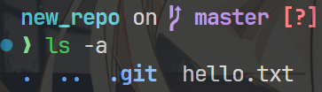
</div>

那么可以执行以下命令：
``` shell
$ git add hello.txt
$ git commit -m "Add hello.txt to the repo"
```

- 执行 `git add <list of filenames>` 命令可将文件上传至暂存区。平时我喜欢使用 `git add .`，简单粗暴地将当前目录下所有文件（不管有没有更新）全部放到暂存区内，如果文件不多且简单的话可以这样偷懒，否则出什么意外我不敢保证。
- 可以用 `git status` 查看暂存区的情况。
<div style="text-align: center">
    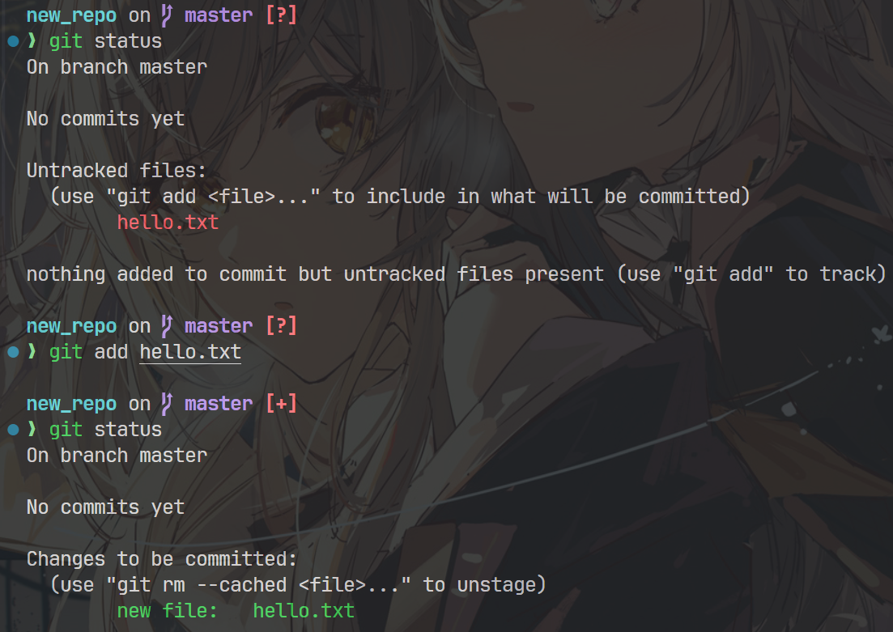
</div>

- 使用 `git reset` 可以清除暂存区内所有的文件，也就是撤销 `git add` 命令

- 执行 `git commit -m "some message"` 提交暂存区内的文件，创建了一个包含消息的新提交（也可以认为是一份「快照」或「存档」），此时本地仓库中便有了这份提交的记录，并且会对它进行跟踪。
- 可用 `git log` 查看提交日志。
<div style="text-align: center">
    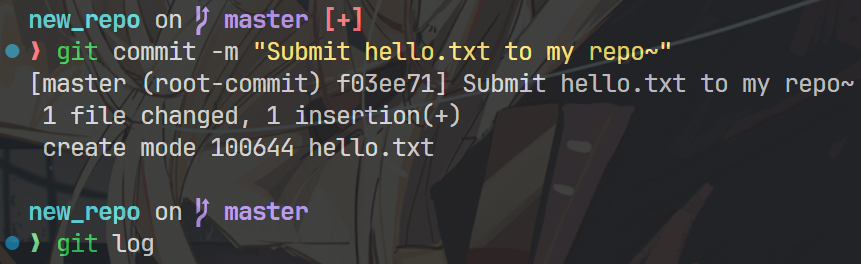
</div>
<div style="text-align: center">
    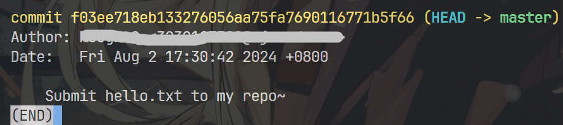
</div>

### 查看变更信息

前面稍微讲到点 `git status` 和 `git log` 命令，这里稍微展开讲讲。

#### git status

该命令可以显示工作目录和暂存区域的状态，观察哪些变更**已暂存**，哪些尚**未暂存**，以及哪些文件**未被 Git 跟踪**。下面的例子包含了这三类状态：

```
$ git status

On branch main
Changes to be committed:
(use "git reset HEAD <file>..." to unstage)

modified: hello.py

Changes not staged for commit:
(use "git add <file>..." to update what will be committed)
(use "git checkout -- <file>..." to discard changes in working directory)

modified: main.py

Untracked files:
(use "git add <file>..." to include in what will be committed)

hello.pyc
```

其中未跟踪的文件可以分为两类，要么是 `git add` 命令后用户新增的文件，要么是编译后的二进制文件，但后者往往不需要用 Git 上传，可以通过编辑 .gitignore 文件来忽略这些文件（见后面[忽略特殊文件](#忽略特殊文件)一节）。

#### git log

`git log` 用来显示已提交的快照（或者说历史记录），下面是一些关于 `git log` 的命令：

``` bash
# 使用默认格式显示整个提交历史记录，默认查看器的使用类似 vim，需要按 q 退出
$ git log
```
某条记录：
<div style="text-align: center">
    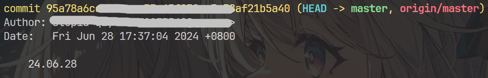
</div>

``` bash
# 按 <limit> 限制显示的提交个数
$ git log -n <limit>
```

``` bash
# 将每个提交信息压缩成一行，只显示前几位哈希值和提交信息
$ git log --oneline
```
某条记录：
<div style="text-align: center">
    
</div>

``` bash
# 除了普通的 git log 信息外，还有各种文件的修改信息，比如增减的行数等
$ git log --stat
```

某条记录：
<div style="text-align: center">
    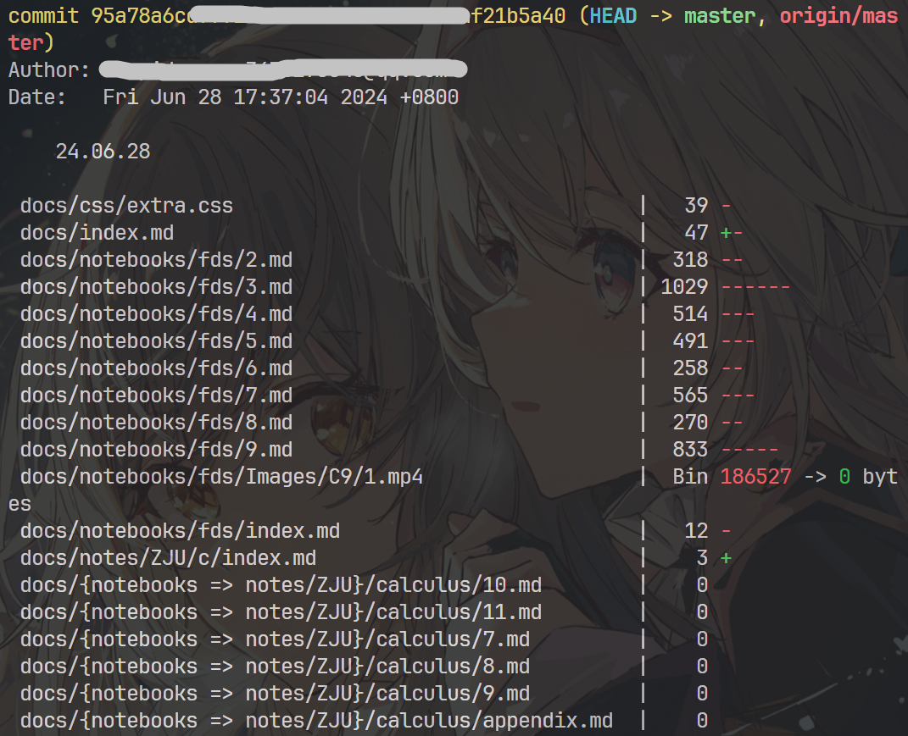
</div>

``` bash
# 可以理解为 git log --stat 的 plus 版，将每份文件的内容都用 diff 比对
$ git log -p
```

某条记录：
<div style="text-align: center">
    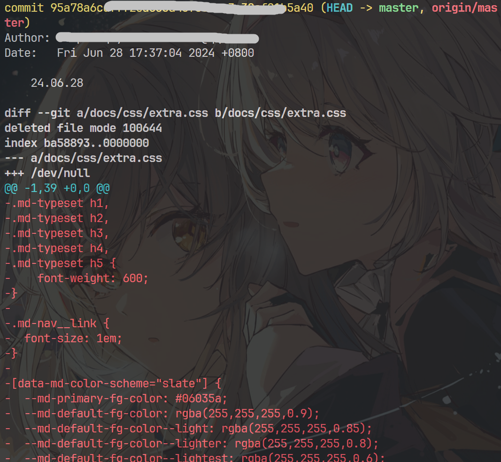
</div>

``` bash
# 找到指定用户的提交
$ git log --author="<name>"

# 找到包含指定信息的提交
$ git log --grep="<pattern>"

# 仅显示从 <since> 到 <until> 之间发生的提交。这两个参数可以是提交的哈希值、分支名称等其他类型的修订版本引用。
$ git log <since>..<until>

# 仅显示包含指定文件的提交
$ git log <file>
```

``` bash
# 查看所有分支的提交信息（git log 只能查看当前分支的提交）
$ git log --branches=*
```

部分结果（这里运行的是 `git log --branches=* --oneline`）：
<div style="text-align: center">
    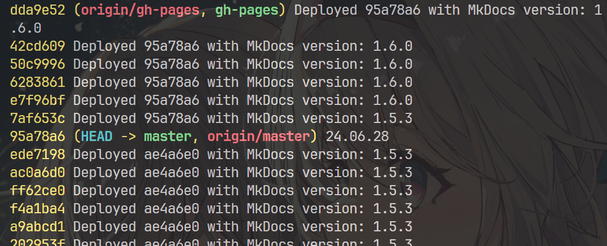
</div>

``` bash
# 显示提交记录的图画形式（用 * 表示一次提交）
$ git log --graph --decorate --oneline
```

结果（由于这个仓库没有进行过多分支合并等操作，所以只有一条线）：

<div style="text-align: center">
    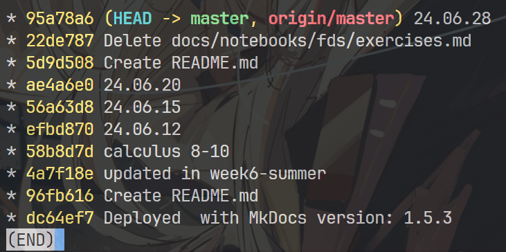
</div>

#### git show

``` bash
# 列出提交中涉及的所有文件
$ git show --pretty="" --name-only <hash_id>

# 显示文件的特定版本（若省略哈希值则显示最近提交的文件内容）
$ git show <hash_id>:path/to/file

# 显示特定 tag 和特定哈希值的提交
$ git show <tag> <hash_id>

# 显示介于<commitA>与<commitB>之间的提交
$ git show <commitA>...<commitB>

```

### 向远程仓库上传变更

!!! info "前提"

    要么用 `git clone` 获取远程仓库（此时已自动将本地仓库与远程仓库连接），要么手动连接远程仓库。

    手动连接远程仓库（`git clone`得到的仓库无需此步骤）：
    ``` shell
    $ git remote add <remote_name> <remote_repo_url>
    ```
    其中 `<remote_name>` 可以随便起，但是要记住你取的名字。

``` shell
$ git push <remote_name> <local_branch_name>
```
这条命令会将当前跟踪的记录上传至远程仓库（`<remote_name>`，如果是 `git clone` 下来的仓库默认名为 origin）的某一指定分支上（`<local_branch_name>`），这中间往往会出（~~我曾遇到过的~~）各种各样的问题：

- SSH 配置错误（后面会讲到）
- 网络连接问题：需要挂梯子，~~或者重启电脑试试？~~
- 上传文件内容过大（比如单个文件不得超过 100 M 等）

!!! summary "总结"

    >图可能画的不对，若有问题请指出

    <figure style=" width: 80%" markdown="span">
        
        
        <figcaption></figcaption>
    </figure>

### 连接远程仓库

上一小节中我们简单提到了 `git remote` 命令，通过该命令可以创建、查看和删除与其他存储库的远程连接。注意这里所谓的“连接”并不会让信息在仓库之间来回传递，只有用户手动推送本地提交（commit）才会改变远程仓库的内容。

下面介绍一些常用命令：

``` shell
# 列出和其他仓库的远程连接
$ git remote

# 与上一条命令类似，但是会列出仓库名称和 url
$ git remote -v

# 只列出指定仓库的 url
$ git remote get-url <name>
# 参数 --push 查看 push url 而非 fetch url
# 参数 --all 列出远程仓库的所有 url

# 列出仓库的详细信息
$ git remote show <name>

# 创建与远程仓库的连接（前面讲过了）
$ git remote add <remote_name> <remote_repo_url>

# 移除与远程仓库的连接
$ git remote rm <remote_name>

# 重命名远程仓库
$ git remote rename <old_name> <new_name>

# 删除远程仓库中不存在的所有本地分支
$ git remote prune <name>
# 参数 --dry-run 会列出会被删掉的分支，但实际上不会删掉它们
```

## 进阶操作

### 撤销、更改历史提交

- 执行 `git checkout <hash_id>` 命令回到哈希值为 `<hash_id>` 的提交记录，可以查看、编译、运行甚至编辑该记录的文件，无需担心目前状态下文件的丢失问题（可以使用`git checkout <current_branch_name>` 命令回到当前状态（最新的提交））。

    !!! warning "注意：使用该命令前确保本地仓库的文件已提交，否则无法执行。"

    执行此命令后会使仓库处于“脱离头指针（HEAD）”的状态，也就是说现在的工作不在任何一条分支上。如果回到已存在的分支后，执行那条命令后的任何提交都会被孤立掉，这些孤立的提交最后会被扔掉，永久损毁。若要避免这种情况，可以建立新的分支来保存这些提交，但是这种做法对其他提交具有一定破坏性，不推荐这么做。

- 一种比较好的做法是使用 `git revert HEAD`，这样就能撤销最近的一次提交，而且保证仍然在当前分支上，缺点是 Git 仍旧保留了被撤销了的提交记录和撤销操作的记录，看着有些繁琐。

- 如果想要有一个干净的提交记录，`git reset --hard <hash_id>` 就派上用场了，它可以将不想要的提交撤销地干干净净，不留痕迹。但它会影响到和远程仓库的交互，比如我撤销了某个最新的提交，如果此时 `git push`，Git 就会认为我推送的分支不是最新的，这就比较麻烦了。而 `git revert` 就不会有这种麻烦了，因此还是上一种撤销策略更合适。

!!! summary "总结"

    `git revert` 适用于撤销公共变更（远程仓库），而 `git reset` 适用于撤销私有变更（本地仓库）。

- `git clean`：暂时略过

- `git commit --amend` 可以用来修改最近一次的提交。比如你一顿 `git add xxx`、`git commit -m "xxx"` 操作后发现漏了几个文件没提交，这时可以先 `git add <forgotten_files>`，再 `git commit --amend`，就可以补上漏掉的文件而无需新开一个提交。但实际上，修补过的提交将完全取代原来最新的提交，对于 Git 来说这是一次全新的提交。
    - `git commit --amend -m "xxx"` 可以修改最近一次的提交信息（不会改变提交内容）
    - `git commit --amend --no-edit` 可以在不更改提交信息的情况下修改提交内容

- `git reflog` 命令显示引用日志（reference logs），它是 Git 用来记录应用到分支节点的更新（对某个提交的各种操作都会被记录）和其他提交引用的一种机制。引用日志允许我们回到指定的提交记录，即使它们没有被任何分支或标签引用。每次分支节点由于任何原因进行更新时（通过切换分支、拉入新的变更、重写历史记录或简单地添加新的提交），一个新的条目将被添加到引用日志内。
    - `git reflog`：显示本地仓库的引用日志。
    <div style="text-align: center">
        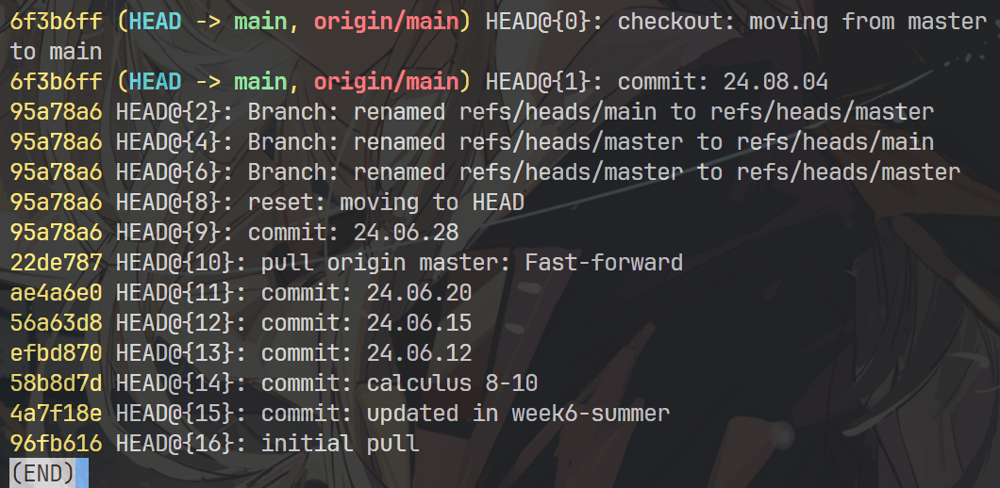
    </div>

    - `git reflog --relative-date`：额外显示相对日期，注意引用日志默认只保存 90 天内的记录。
    <div style="text-align: center">
        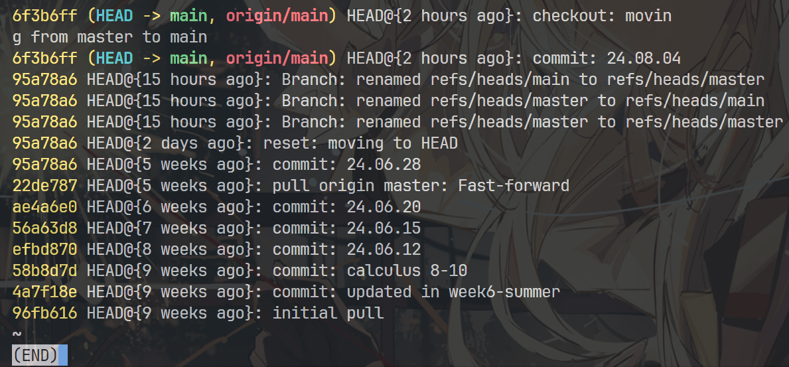
    </div>

    - 利用这条命令，我们可以精确定位到需要修改的提交，然后用前面提到的 `git reset` 等命令回到该提交，随后进行修改操作。

- `git cherry-pick <hash_id>` 命令可以将选定任意 Git 提交并将其附加到当前工作的 HEAD 指针中，是一个很便利的工具。

    示意图（将这里的字母看作哈希值）：

    <figure style=" width: 70%" markdown="span">
        
        
        <figcaption></figcaption>
    </figure>

    参数列表：

    - `--edit`：让 Git 在 `cherry-pick` 操作前提示输入提交信息
    - `--no-commit`：执行 `cherry pick` 但不会进行新的提交，而是将提交内容移动到当前分支的工作目录中
    - `--signoff`：在提交消息末尾添加一个签名行

!!! note "总结：git checkout、git reset、git revert"

    === "提交级（commit-level）的操作"

        - `git checkout`：在分支间切换，或者查看旧的提交记录

            <div style="text-align: center">
                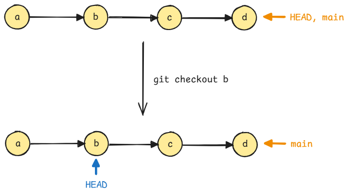
            </div>

            <div style="text-align: center">
                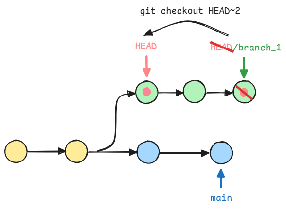
            </div>

        - `git reset`：扔掉私有分支的提交或者未提交的变更

            <div style="text-align: center">
                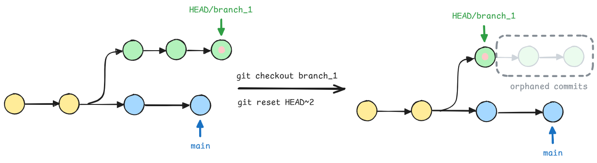
            </div>

            有以下三种可选参数：

            - --soft – 暂存快照和工作目录不会以任何方式更改。
            - --mixed – 更新暂存的快照以匹配指定的提交，但工作目录不受影响。这是默认选项。
            - --hard – 暂存的快照和工作目录都已更新以匹配指定的提交。

        - `git revert`：撤销公共分支中的提交

            <div style="text-align: center">
                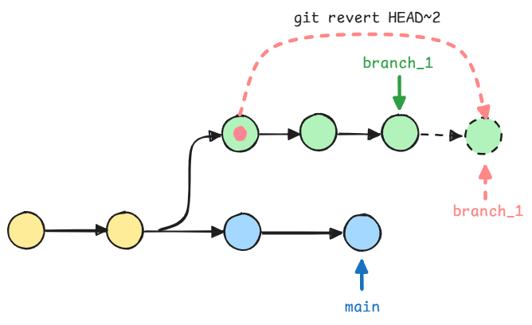
            </div>

    === "文件级（file-level）操作"

        - `git checkout`：撤销工作目录的变更，将文件还原到之前提交的版本

            <div style="text-align: center">
                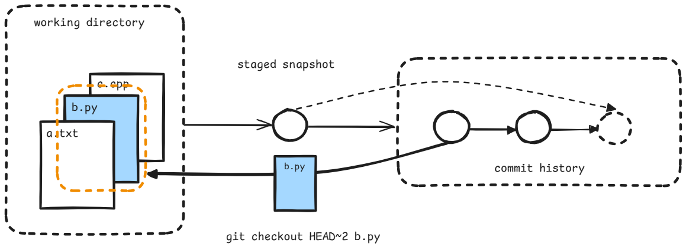
            </div>

        - `git reset`：取消暂存文件，将暂存文件设为之前提交的版本

            <div style="text-align: center">
                
            </div>

        没有文件级的 `git revert`！

### Git 分支

分支的形象化表示：

<figure style=" width: 80%" markdown="span">
    
    
    <figcaption></figcaption>
</figure>

``` bash
# 列出本地仓库所有分支，同 git branch --list
$ git branch

# 创建名为 <name> 的新分支
$ git branch <name>

# 在远程仓库 origin 创建名为 <name> 的新分支
$ git push origin <name>

# 安全删除名为 <name> 的分支
$ git branch -d <name>

# 强制删除名为 <name> 的分支
$ git branch -D <name>

# 删除名为 <name> 的远程仓库 origin 的分支
$ git push origin --delete <name>
# or 
$ git push origin :<name>

# 修改分支名字
$ git branch -m <old_name> <new_name>

# 列出本地仓库和远程仓库的所有分支
$ git branch -a
```

### 合并、变基

#### 合并

假设提交记录如下所示：

    <div style="text-align: center">
        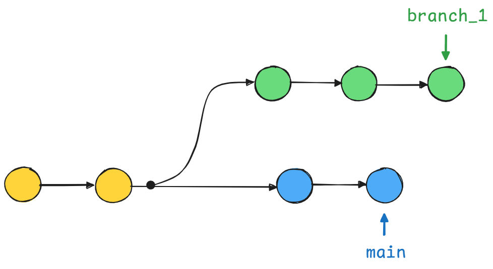
    </div>

现在需要将 main 分支合并到 branch_1 上，只需输入以下命令即可：

``` bash
# 切换到 branch_1 分支上
$ git checkout branch_1
# 合并 main 分支
$ git merge main
```

更快速的写法：`git merge branch_1 main`

结果：

<div style="text-align: center">
    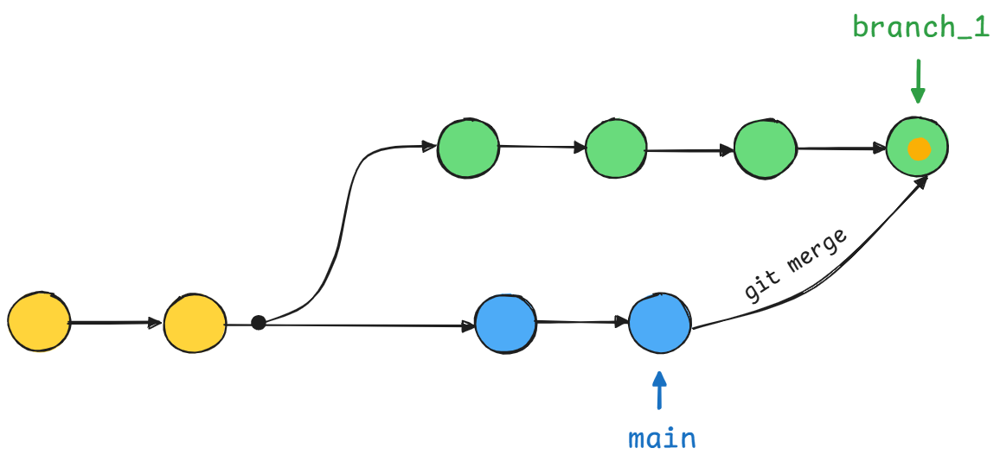
</div>

- 优点：合并是一种非破坏性的操作，不会更改现有分支，这避免了变基操作带来的隐患。
- 缺点：如果被合并的分支（main）之后还有修改的话，就会影响到合并分支（branch_1）的历史记录，令开发者难以理解。


#### 变基

在多人协作完成一个项目时，总会出现很多条分支，因此当你打算 push 一份提交时，如果有组员已经先行上传提交，那么你得先 `git pull` 再 `git push`，这样的结果是这些提交记录将更加地凌乱。

这里可以用到`git rebase` 变基命令，它的作用简单来说就是将分叉的本地历史提交记录整理成一条直线，看起来更加干净。下面将 branch_1 分支变基到 main 分支：

``` bash
$ git checkout feature
$ git rebase main
```

然而，在使用该命令时务必遵守一条黄金法则：当有人需要用到某条分支的当前历史提交记录时，千万不要对这条分支进行变基操作，可另外尝试非破坏性的方法进行变更（比如 `gir revert` 命令）；如果没人需要方可使用。

!!! info "补充"

    如果需要强制将本地变基后的分支上传到远程仓库，使用 `git push --force` 强制上传，这会用变基后的本地分支覆盖原来的远程分支。当然，在执行该命令前请确保无人在用变基前原始版本的分支。

执行 `git rebase -i <branch_name>` 命令可进行交互式变基操作，此时会打开一个文本编辑器，列出所有即将移动的提交，它准确表示执行变基后分支的样子。通过更改 pick 命令和/或重新排序条目可以调整历史提交记录。例如，如果第二次提交修复了第一次提交中的一个小问题，则可以使用 fixup 命令将它们压缩为一次提交，结果如下所示。

``` bash
pick 33d5b7a Message for commit #1
fixup 9480b3d Message for commit #2
pick 5c67e61 Message for commit #3
```

!!! summary "git rebase 示意图"

    <div style="text-align: center">
        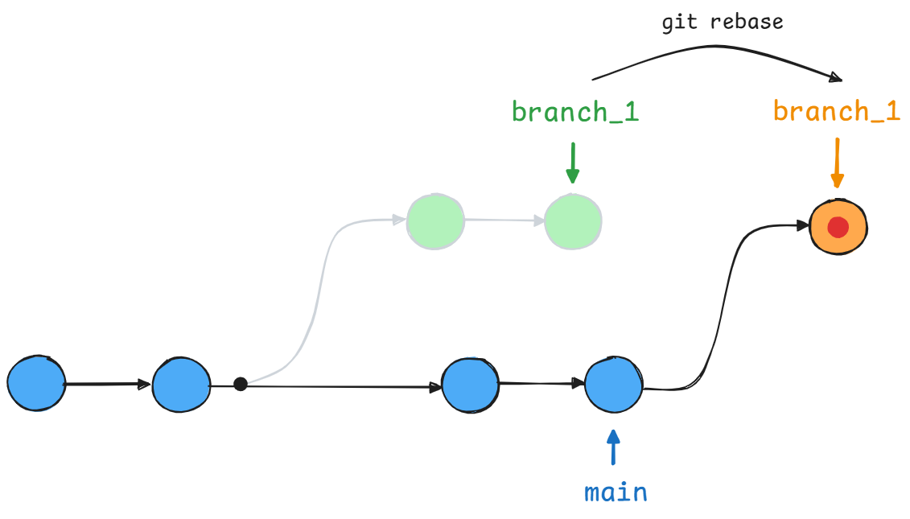
    </div>

---
通过定期执行交互式变基，我们可以清理本地某一条分支的历史提交记录，使得该分支的每一次提交都是集中且有意义的。执行以下命令可以仅对最新的3个提交进行交互式变基：

``` bash
$ git checkout <branch_name> 
$ git rebase -i HEAD~3
```

示意图：

<div style="text-align: center">
    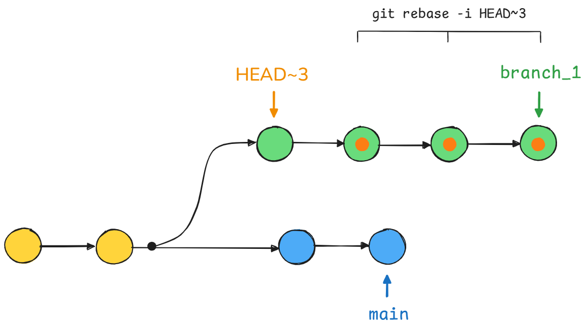
</div>

如果想要对整条分支进行无害的变基操作，我们得先找到这条分支的“起源”，或者说刚刚分叉的地方，使用下面的命令可以找到分支 A 和 分支 B 的祖先（交点）的哈希值：

``` bash
$ git merge-base A B
```

然后将该哈希值代入 `git rebase` 命令即可。


### 拉取请求

#### 功能分支工作流

功能分支工作流使用共享的 Bitbucket 仓库来管理协作，开发者在隔离的分支中创建功能。在合并到主分支之前，开发者需要发起一个拉取请求（pull request），与项目维护者讨论并决定是否合并到主分支，之后项目维护者可以关闭 pr 。这样的 pr 中源仓库和目标仓库是同一个仓库。

除此之外，开发者还可以通过 pr 一份功能不完整的提交，向其他开发者获取建议和帮助；其他开发者利用讨论功能提建议，或者直接另外提交一份来解决问题。

#### 使用拉取请求拷贝工作流程

开发者可以先拷贝（fork）一份项目维护者的共享仓库，然后将功能完善过的文件推送到刚拷贝下来的仓库。之后提出 pr ，让项目维护者进行审查。这种 pr 的源仓库和目标仓库不是同一个仓库了，前者是自己拷贝下来的公共仓库，而后者才是项目维护者自己的仓库。

就我个人感觉，这种方法对项目维护者来说可能更加“干净”一些：前面的「功能分支工作流」会让主仓库开出很多分支，有些凌乱；而 fork 项目维护者的仓库下来不会对主仓库有什么很大的影响。所以我更喜欢这种方法。


## 拓展

>注：可能不是那么重要的内容，或者扩展性的内容

### 配置仓库

用到 `git config` 命令

``` shell
# 设置当前系统（全局）用户名
$ git config --global user.name <name>

# 设置当前仓库（本地）用户的邮箱
$ git config --local user.email <email>

# 为 git 命令设置别名，提高敲命令的效率
$ git config --global alias.<alias-name> <git-command>
# 比如：
$ git config --global alias.ci commit
$ git config --global alias.st status 
$ git config --global alias.co checkout 
$ git config --global alias.br branch 
$ git config --global alias.up rebase 

# 选定编辑器，比如 vi
$ git config --system core.editor <editor>

# 打开全局配置文件并手动编辑
$ git config --global --edit
```

### 忽略特殊文件

!!! question "问题"

    你可能为这样一件事犯愁：为了方便管理，你将某些重要文件放在本地仓库下，但是它们不应该传到远程仓库上。每次当你用 `git status` 查看时，就会看到这些标红的文件，心里总感觉不舒服。

`.gitignore` 文件可以根据我们设定的内容，自动忽略仓库下指定的文件，从而为我们带来了便利和安全。该文件通常放在仓库的根目录下。

首先了解一下忽略文件的原则（by [廖雪峰](https://liaoxuefeng.com/books/git/customize/ignore/)）：

- 忽略**操作系统自动生成的文件**，比如缩略图等
- 忽略**编译生成的中间文件、可执行文件**等，比如Java编译产生的.class文件等
- 忽略**带有敏感信息的配置文件**，比如存放口令的配置文件等

基本语法：

- 规范起见，每行只写一个文件名
- '#' 开头表示注释
- 直接写完整的文件名/目录名，Git 就会自动忽略该文件/目录
- 写 `*.<extension>` 可忽略所有文件扩展名为`<extension>`的文件
- 若想忽略某一类文件，但是又不想忽略一个属于该类的文件，那么可以使用`!<filename>` 表示将该文件排除于 .gitignore 的规则之外

命令相关：

- 符合 .gitignore 名单的所有文件均无法直接进行 `git add` 操作,但是可以使用 `git add -f <file>` 强制将文件传入暂存区，忽略 .gitignore 的规则
- 可用 `git check-ignore -v <file>` 检查该文件是否在 .gitignore 的规则下，并在控制台上打印结果

### Git SSH 密钥配置

SSH 密钥是 SSH（Secure Shell，安全外壳）网络协议的访问凭证，这种协议用于不安全开放网络上计算机之间的远程通信，包括远程文件传输、网络管理和远程操作系统访问等。

密钥包含公钥和私钥，公钥可以放在公共场合下，而私钥必须由个人安全保管。可以将公钥理解为「锁」:lock:，私钥理解为「钥匙」:key:。密钥通过公钥加密算法生成，比如 RSA 算法等，它能确保公钥能从私钥中产生，但反之不行。

下面介绍在 Linux 上生成 SSH 密钥，并且在 Github 上添加 SSH 密钥（默认已注册 Github 账号）：

- 创建密钥

    ``` bash
    $ ssh-keygen -t ed25519 -b 4096 -C "your_email@example.com"
    ```

    >注：我这里使用 ed25519 加密算法，它比 常用的 rsa 算法更加安全。

- 系统将提示输入要保存密钥的文件，既可以指定文件位置，也可以按回车键接受默认文件位置（这里选择后者）
- 系统接下来提示输入口令，这样每当使用 SSH 密钥时都需要口令，提供了额外的一层防护

结果：

<div style="text-align: center">
    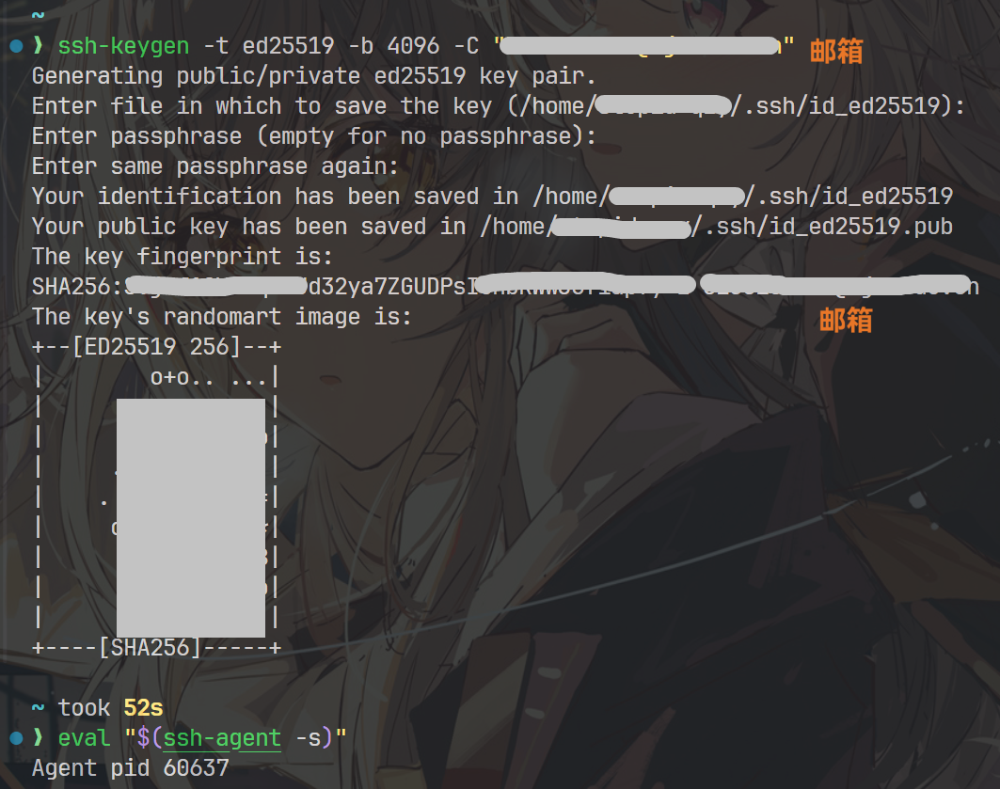
</div>

- 将新的 SSH 密钥添加到 ssh-agent

    - 先检查 ssh-agent 是否正常运行：
    
    ``` bash
    $ eval "$(ssh-agent -s)"
    ```
    如果显示 pid，说明是正常运行的

    - 若正常运行，将新的 SSH 密钥添加到本地 SSH 代理：
    ``` bash
    ssh-add /Users/you/.ssh/id_ed25519
    ```

    还要输入一遍刚刚设定的口令才能完成添加。

结果：

<div style="text-align: center">
    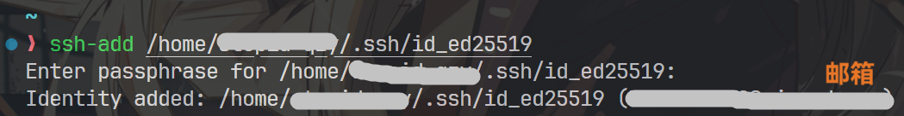
</div>

- 进入 Github [官网](https://github.com)，点击右侧用户头像，在弹出的列表中找到 Settings，点击进入后在左侧列表中的 Access 区域中找到 SSH and GPG keys，点击后再点击右侧 New SSH key，开始新建 SSH 密钥。

- 取好标题，并将公钥内容复制到 Key 一栏，如图所示：

<div style="text-align: center">
    
    
</div>

- 点击 Add SSH key 后完成创建，可以在 SSH keys 一栏查看结果

<div style="text-align: center">
    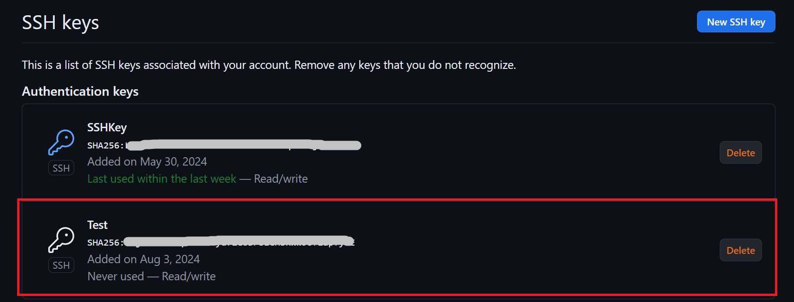
</div>

这样的话 Linux 本地环境就可以与自己 Github 账户上的远程仓库进行连接了。

### Git Hook

#### 预提交 Hook

Git 在执行 `git commit` 命令前会先执行预提交（pre-commit）脚本，开发者可以在脚本写一些自动化测试的代码，来检查即将提交的快照，确保该提交不具备破坏性。没有向预提交脚本传递参数，或者以非 0 状态退出均会导致提交终止。

下面来看看内置的预提交脚本（简化版），如果此脚本发现任何空格错误，则中止提交。

``` bash
#!/bin/sh

# Check if this is the initial commit
if git rev-parse --verify HEAD >/dev/null 2>&1
then
    echo "pre-commit: About to create a new commit..."
    against=HEAD
else
    echo "pre-commit: About to create the first commit..."
    against=4b825dc642cb6eb9a060e54bf8d69288fbee4904
fi

# Use git diff-index to check for whitespace errors
echo "pre-commit: Testing for whitespace errors..."
if ! git diff-index --check --cached $against
then
    echo "pre-commit: Aborting commit due to whitespace errors"
    exit 1
else
    echo "pre-commit: No whitespace errors :)"
    exit 0
fi

```

在预处理脚本中，除了调用 Git 命令外，还可以执行其他脚本、运行第三方测试套件或使用 Lint 检查代码风格等。