# 数据库基础

!!! abstrct "参考资料"

    - [HobbitQia 的数据库系统笔记](https://note.hobbitqia.cc/DB/)
    - [MySQL Tutorial](https://www.w3schools.com/mysql/default.asp)
    - [菜鸟教程：MySQL](https://www.runoob.com/mysql/mysql-tutorial.html)
    - [阮一峰：ORM 实例教程](https://www.ruanyifeng.com/blog/2019/02/orm-tutorial.html)
    

!!! info "阅读前须知"

    这份笔记是我暑假匆匆学习 DB 留下的「草稿」，仅供本人参考（~~我要完成两个小的 Project，有 ddl（悲）~~），没什么价值。之后系统学习 DB 的时候会有一系列更完善的笔记（~~等 2025 年春夏~~）。

什么是数据库？

>数据库是结构化信息或数据的有序集合，一般以电子形式存储在计算机系统中。通常由数据库管理系统 (DBMS) 来控制。在现实中，数据、DBMS 及关联应用一起被称为数据库系统，通常简称为数据库。
><div style="text-align: right">by Oracle</div>

分类：

- :star:关系型数据库（比如 mysql 等）：建立在关系模型基础上的数据库，借助于关系代数等数学概念和方法来处理数据库中的数据。
- 非关系型数据库

>下面主要介绍的是关系型数据库

## 关系模型

- 关系(relation)的概念：$R = (A_1, A_2, \dots, A_n)$ 被称为关系模式(relation schema)，其中 $A_1, A_2, A_n$ 被称为属性(attributes)
    - 人话：数据库的表对应「关系」，表的字段对应「属性」，表中的每一行数据形成了一个「元组」(tuple)（或者说「记录」(record)）
- 键(key)
    - 超键(super key)：由一个或多个属性组成，用来确定唯一的元组
    - 候选键(candidate key)：最小的超键
        - 候选键的子集不应该是候选键，否则就不是候选键
        - 可能有不止一个候选键
    - 主键(primary key)：由开发者选定的唯一的候选键
    - 外键(foreign key)：用于保证数据在两个表间的一致性
        - 外键依照另一张表的主键建立，外键和该主键的数据类型相同
        - 其中拥有外键的表被称为子表，提供主键的表被称为父表
            - 若从父表中删除的数据与子表有关联，则会报错
            - 向子表插入数据时，确保外键的值对应父表中的主键值是存在的或者为空
- 查询(query)操作
    - 选择(SELECT)：$\sigma_{p}(r) = \{t\ |\ t \in r \wedge p(t) \}$，从关系 r 中找出符合条件 p 的元组
    <div style="text-align: center">
        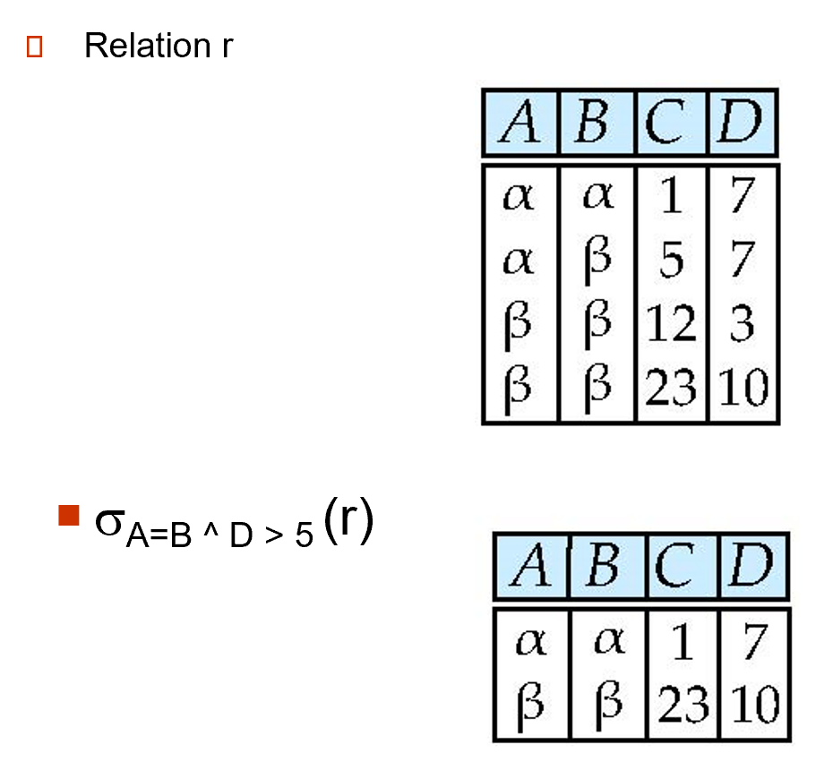
    </div>

    - 投影(project)：$\Pi_{A_1, A_2, \dots, A_k}(r)$，挑出关系 r 中的指定属性 $A_1, A_2, \dots, A_k(k \le n)$，形成一个新的关系
        - 结果可能会出现重复的元组，需要去重
    <div style="text-align: center">
        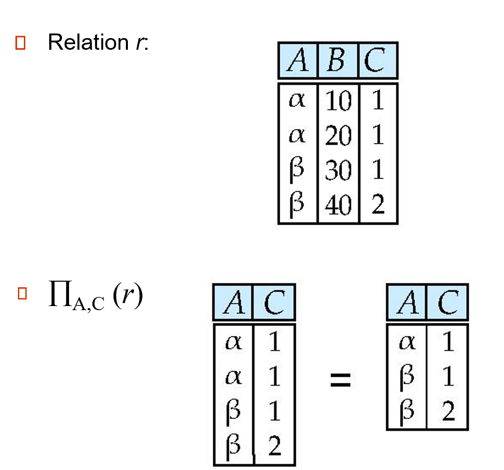
    </div>

    - 并(union)：$r \cup s = \{t\ |\ t \in r \vee t \in s\}$，取两个关系的并集
    <div style="text-align: center">
        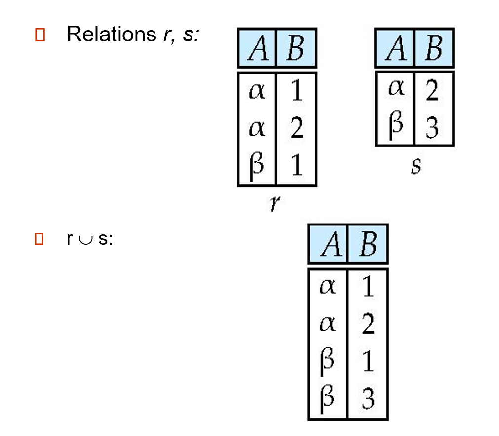
    </div>

    - 差(difference)：$r - s = \{t\ |\ t \in r \wedge t \notin s\}$，取两个关系的差集
    <div style="text-align: center">
        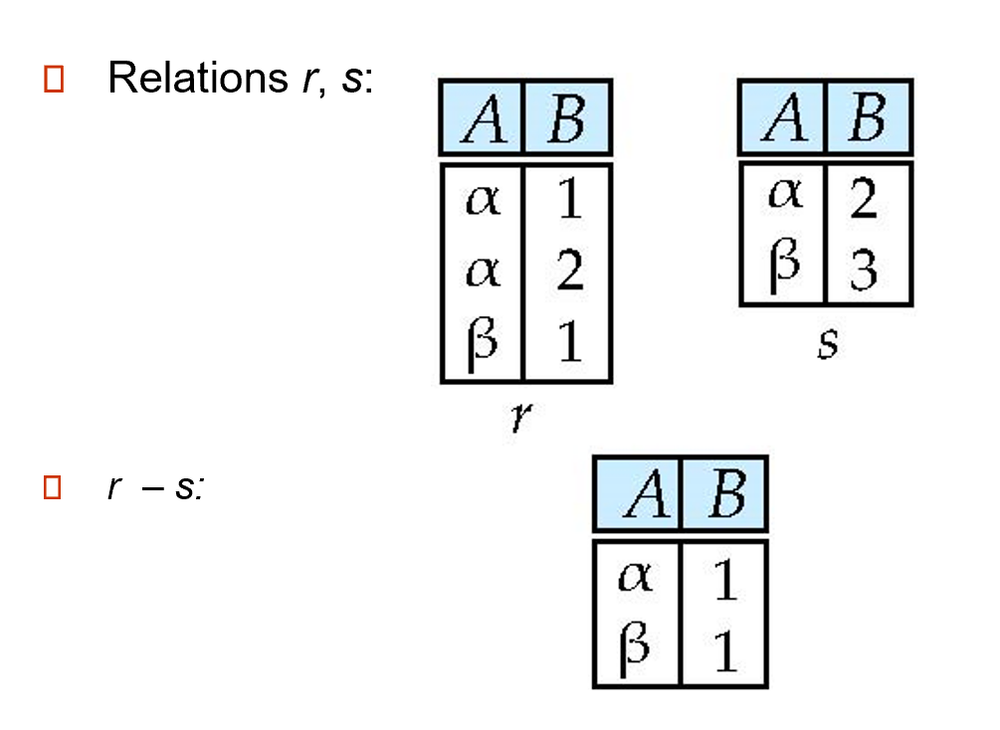
    </div>

    - 笛卡尔积：$r \times s = \{\{t, q\}\ |\ t \in r \wedge q \in s\}$
    <div style="text-align: center">
        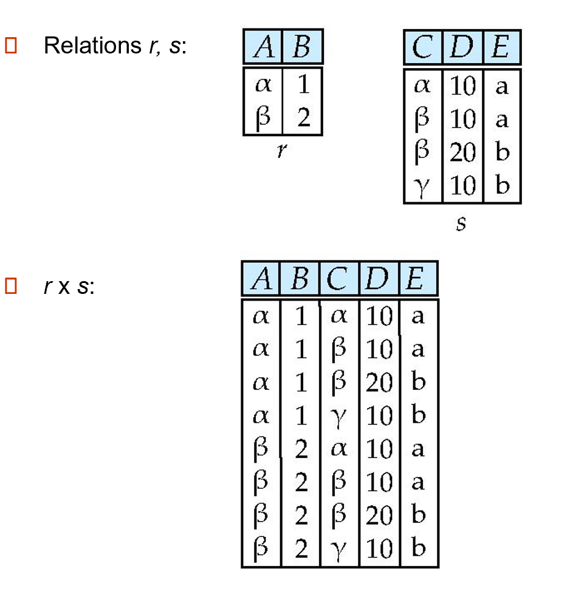
    </div>

    - 其他操作
        - 交(intersection)：$r \cap s$，取两个关系的交集
        <div style="text-align: center">
            
        </div>

        - 自然连接(natural JOIN)：$r \bowtie s$，两个关系的元组中若有部分相同的属性值，保留这相同的部分，对于不同的属性值取笛卡尔积，形成一个新的关系（包含两个关系的所有属性）
        <div style="text-align: center">
            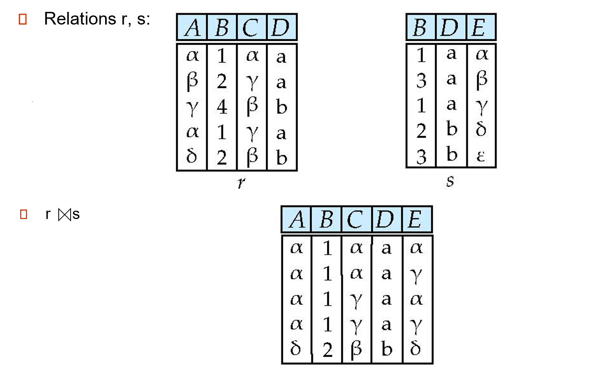
        </div>

        - 内部连接(inner JOIN)：$r \mathop{\bowtie}\limits_{condition} s$，先 $r \times s$，后根据条件选择元组，形成新的关系
        - 外部连接(outer JOIN)
            - 左连接：$r \ltimes s = (r \bowtie s) \cup \{null, \dots, null\} \times (s - \bigcap\limits_R(r \bowtie s))$
            - 右连接：$r \rtimes s = (r \bowtie s) \cup (r - \bigcap\limits_R(r \bowtie s)) \times \{null, \dots, null\}$
            - 全连接：$r$⟗$s = (r \bowtie s) \cup (r - \bigcap\limits_R(r \bowtie s)) \times \{null, \dots, null\} \cup \{null, \dots, null\} \times (s - \bigcap\limits_R(r \bowtie s))$
        <div style="text-align: center">
            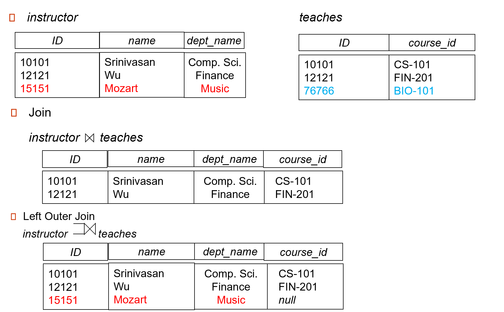
            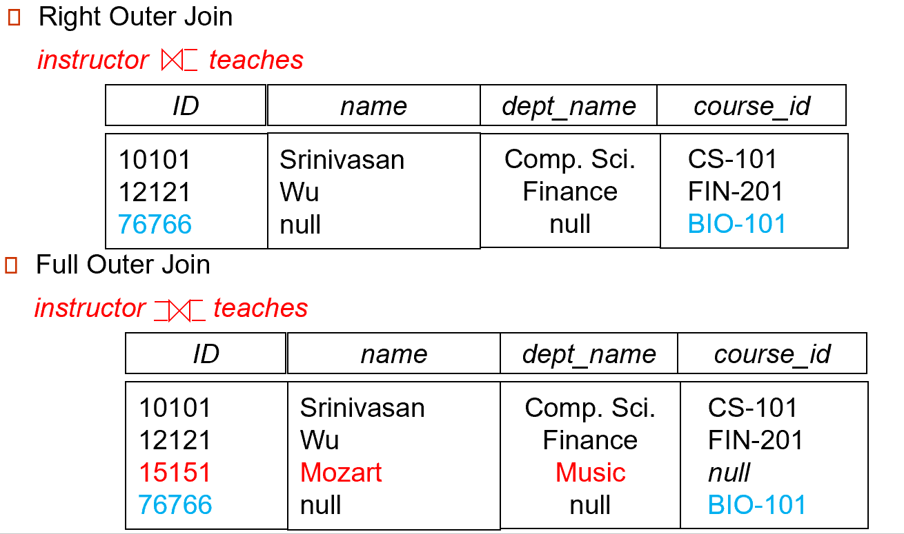
        </div>

        - 半连接(semi JOIN)：$r \ltimes_{\theta} s$，保留 $r$ 能与 $s$ 相连的元组
        <div style="text-align: center">
            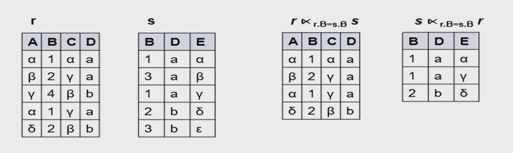
        </div>

        - 除法(division)：$r \div s$
        <div style="text-align: center">
            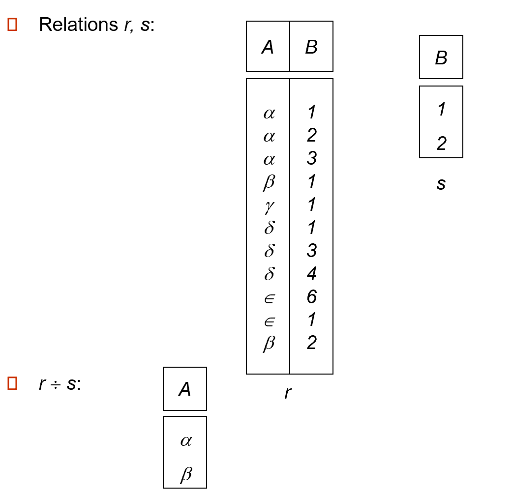
            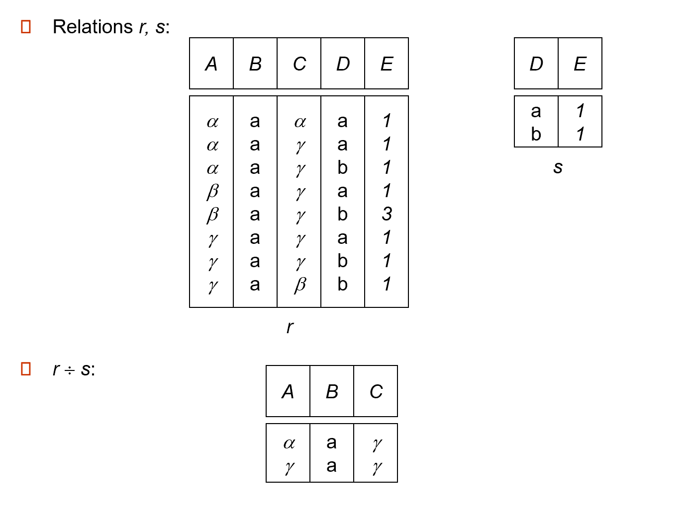
        </div>


## MySQL 语法

!!! warning "注意"

    - 一条完整的 MySQL 语句以分号结尾
    - 书写习惯：关键词一般用大写表示
    - 方括号表示可选参数
    - 如果一条 MySQL 语句太长，可以适当地换行（第二行开始前面都会有 `->` 符号，表示新的一行，但还是在同一条语句内）

??? success "推荐 MySQL 插件：MyCLI"

    [MyCLI](https://www.mycli.net/) 在 MySQL 的基础上支持了语法高亮、代码补全等功能，总之用起来比原版更加舒服，推荐一试！

    安装：

    ``` sh
    $ pip install mycli
    ```

### 连接

要使用 MySQL，需要先输入以下命令进入 MySQL 命令行界面：

``` sh
$ mysql -u your_username -p
```

- `-u`：指定用户名
- `-p`：需要输入密码

>注：如果安装了 MyCLI，输入 `mycli` 也可以达到同样效果。

---
退出连接：

``` sh
$ quit

# 或者
$ exit

# 或者 Ctrl + D
```

### 数据类型

- 字符串
    - `CHAR(size)`：定长的字符串（`size` 为字符个数在 0-255 之间，默认为1）
    - `VARCHAR(size)`：变长的字符串（`size` 为字符个数，在 0-65535 B 之间）
    - `BINARY(size)`：类似 `CHAR()`，但存储的是二进制字符串
    - `TEXT(size)`：存储最大长度为 65535 B 的字符串
    - `BLOB(size)`：二进制形式的长文本数据（`size` 范围为 0-65535 B）
- 数值
    - `BOOL/BOOLEAN`：零值表示 `false`，非零值表示 `true`
    - `INT/INTEGER(size)`：介于 $-(2^{31}) \sim 2^{31}+1$ 的整数（`size` 指定最大显示宽度）
    - `FLOAT/DOUBLE(size, d)`：单精度/双精度浮点数（`size` 表示总位数，`d` 表示小数位数）（之后的版本会逐渐废除这个类型，用 `DOUBLE` 替代）
    - `FLOAT(p)`：如果 `p` 位于 0-24 之间，数据类型为 `FLOAT()`；如果 `p` 位于 25-53 之间，数据类型为 `DOUBLE()`
    - `DECIMAL(size, d)`：定点数，格式同浮点数
- 日期、事件
    - `DATE`：日期格式为 YYYY-MM-DD
    - `TIME`：日期格式为：HH:MM:SS
    - `DATETIME`：日期-时间格式为 YYYY-MM-DD hh\:mm\:ss
    - `TIMESTAMP`：时间戳，格式同 `DATETIME`
    - `YEAR`：日期格式为：YYYY


### 数据库命令

- 创建新的数据库：

    ``` sql
    CREATE DATABASE [IF NOT EXISTS] database_name [CHARACTER SET charset_name] [COLLACT collation_name];
    ```

    - `IF NOT EXISTS`：避免数据库的重复创建（重复创建会报错）
    - `CHARACTER SET charset_name`：指定字符集
    - `COLLACT collation_name`：指定排序规则

- 选择指定数据库（之后的 SQL 操作都在该数据库上进行）：

    ``` sql
    USE database_name;
    ```

    或者在进入 MySQL 时直接选定数据库


    ``` sh
    $ mysql -u your_username -p D database_name
    ```

- 列出所有数据库：

    ``` sql
    SHOW DATABASES;
    ```

- 删除指定数据库：

    ``` sql
    DROP DATABASE [IF EXISTS] database_name;
    ```

    - `IF EXISTS`：避免删除不存在的数据库（会报错）


### 数据表命令

- 查看数据表：

    ``` sql
    SHOW TABLES;
    ```

- 创建数据表：

    ``` sql
    CREATE TABLE table_name (
        column1 type1,
        column2 type2,
        column3 type3,
        ...,
    );
    ```

    - `columnx` 表示字段名，`typex` 表示对应的数据类型
    - 用于字段的特殊关键字：
        - `AUTO_INCREMENT`：用于创建一个自增的列（一般用于主键）
        - `PRIMARY KEY`：指定某列为主键（可一次指定多列，用逗号间隔）
        ``` sql
        -- 指定 id 列为主键
        id INT PRIMARY KEY

        -- 或者
        PRIMARY KEY (id)
        ```

        - `NOT NULL`：确保字段不为空（如附上该关键字，字段为空会报错）

    - 可以像创建数据库一样在后面跟上 `CHARACTER SET` 和 `COLLATE` 子句
    - 还可以跟上 `ENGINE` 子句，指定存储引擎

- 删除数据表：

    ``` sql
    DROP TABLE [IF EXISTS] table_name;
    ```

    - `IF EXISTS`：避免删除不存在的数据表（会报错）
    - 如果想要仅删除数据而保留整个数据表的结构，可使用下面的语句：

    ``` sql
    TRUNCATE TABLE table_name;
    ```

    - 删除数据表前需要考虑**外键约束**的问题

### CRUD

所谓 CRUD，指的是 MySQL 中最基本的「增删查改」操作：create、retrieve、update、delete。

- 插入数据：

    ``` sql
    INSERT INTO table_name (column1, column2, column3, ...)
    VALUES (value1, value2, value3, ...);
    ```

    - 如果要向所有列插入数据，可以省略列名
    - 如果某列带有 `AUTO_INCREMENT` 关键字，那么该列对应的值可设为 `NULL`（作为占位符），MySQL 会自动设置它的值
    - 插入多行数据：
    
    ``` sql
    INSERT INTO table_name (column1, column2, column3, ...)
    VALUES 
        (value1_1, value1_2, value1_3, ...),
        (value2_1, value2_2, value2_3, ...),
        (value3_1, value3_2, value3_3, ...);    
    ```

- 查询数据：

    ``` sql
    SELECT column1, column2, ...
    FROM table_name
    [WHERE condition]
    [ORDER BY column_name1 [ASC | DESC], column_name2 [ASC | DESC], ...]
    [LIMIT number];
    ```

    - `WHERE condition` 子句用于指定过滤条件（一般使用主键，使查询更加高效），MySQL 只返回符合条件的数据。`condition` 可以包含以下内容：
        - 比较运算：`=`（等号）、`!=`、`<>`（均表示不等号）、`<`、`<=`、`>`、`>=`
        - 逻辑运算：`AND`、`OR`、`NOT`
        - 模糊匹配：`LIKE`（默认不区分大小写）

            ``` sql
            SELECT column1, column2, ...
            FROM table_name
            WHERE column_name LIKE pattern;
            ```

            `pattern` 表示匹配模式，通常要用到以下符号：

            - `%`：类似正则表达式的 `*`，表示任意字符（比如 `'q%'` 表示以 `'q'` 开头的任意字符串）
            - `_`：占位符，表示一个字符（比如 `'_q%'` 表示第二个字符为 `'q'` 的任意字符串）

        - `IS NULL`、`IS NOT NULL`
        - `IN`
        - `BETWEEN`
    - `ORDER BY column_name1 [ASC | DESC], column_name2 [ASC | DESC], ...`：根据某（些）列进行排序（默认为升序 `ASC`，降序用 `DESC` 表示）
        - 如果指定多列，则按照顺序先按第一个指定列排序，再按第二个排序，以此类推
        - 列名可以用对应的位次替代（整数，从 `1` 开始）
        - 关键字 `NULLS FIRST` 和 `NULLS LAST` 分别指定将某个字段为 `NULL` 的数据行放在前面或者后面
        ``` sql
        SELECT product_name, price
        FROM products
        ORDER BY price DESC NULLS FIRST;
        ```

    - `LIMIT number`：限制返回的数据行数
    - 可以一次性查询多张表，用逗号间隔表名
    
- 更新数据

    ``` sql
    UPDATE table_name
    SET column1 = value1, column2 = value2, ...
    WHERE condition;
    ```

    - `valuex` 可以是一个表达式，也可以是 `SELECT` 语句的返回值
    - 请小心：如果没有 `WHERE` 从句，将会更新所有的数据行！

- 删除数据：

    ``` sql
    DELETE FROM table_name
    WHERE condition;
    ```

    - 如果缺少 `WHERE` 从句，会删除数据表内的所有数据

### NULL 处理

- 检查数据是否为 `NULL`
    - `IS NULL`：值为 `NULL` 返回 `true`
    - `IS NOT NULL`：值不为 `NULL` 返回 `true`
- `COALESCE` 函数和 `IFNULL` 函数（MySQL 特有）：它们语法类似，用于替换值为 `NULL` 的数据为指定值

``` sql
-- 如果 stock_quantity 字段的值为 NULL，则该字段将会返回 0
SELECT product_name, COALESCE(stock_quantity, 0) AS actual_quantity
FROM products;

-- 或者
SELECT product_name, IFNULL(stock_quantity, 0) AS actual_quantity
FROM products;
```

- `NULL` 排序：`NULLS FIRST`、`NULLS LAST`，前面已经介绍过了，用在 `ORDER` 从句，控制带 `NULL` 数据的顺序
- `<=>` 运算符：如果两个值相等或都为 `NULL` 则返回 `true`（`=` 和 `!=` 用于带 `NULL` 值的比较，结果均返回 `NULL`）
- 聚合函数会忽略 `NULL` 值，因此可能会产生非预期结果

### 其他语句

- 别名(alias)：从句 `AS` 可为结果集合及其列设置别名（直接跟在列名或表名后面）

- 并操作(UNION)：连接多个 `SELECT` 语句，将结果组合成一张新的结果集合，并去重

    ``` sql
    /* (s) 表示可以选择多列，(ALL) 参数可选，表示不去重 */
    SELECT column1_1, column1_2, ... 
    FROM table1 
    WHERE condition1
    UNION [ALL]
    SELECT column2_1, column2_2, ...
    FROM table2
    WHERE condition2
    [ORDER BY column1, column2, ...];
    ```

    - 每张表选择的列数和对应字段的类型应一致
    - `UNION ALL` 表示不去重 

- 分组(GROUP BY)：根据一列或多列对结果集进行分组，有时会用到聚合函数(aggregate functions)

``` sql
SELECT column1, column2, aggregate_function(column3)
FROM table_name
WHERE condition
GROUP BY column1. column2;
```

- 聚合(aggregation)函数：用于计算和统计表格数据，聚合函数之间不得嵌套（`distinct` 用于去重）

    - `SUM()`：求和
    ``` sql
    SELECT SUM([distinct] column_name) FROM table_name;
    ```

    - `AVG()`：求平均值
    ``` sql
    SELECT AVG([distinct] column_name) FROM table_name;
    ```

    - `MIN()/MAX()`：求最小/大值
    ``` sql
    SELECT MIN([distinct] column_name) FROM table_name;
    SELECT MAX([distinct] column_name) FROM table_name;
    ```

    - `COUNT()`：统计数据行数
    ``` sql
    SELECT COUNT([distinct | *] column_name) FROM table_name;
    ```

- 连接(JOIN)
    - 内连接：返回两个或多个表中满足连接条件的匹配数据行

    ``` sql
    SELECT table1.column1, table2.column2, ...
    FROM table1
    INNER JOIN table2 ON table1.column_name1 = table2.column_name1
    INNER JOIN table3 ON table1.column_name2 = table3.column_name2
    ...
    [WHERE condition];
    ```

    - 左连接：返回左表中所有的数据行，包括右表中匹配的数据行，若右表没有匹配的数据行则返回 `NULL`

    ``` sql
    SELECT column1, column2, ... 
    FROM table1
    LEFT JOIN table2 ON table1.column_name1 = table2.column_name1
    LEFT JOIN table3 ON table1.column_name2 = table3.column_name2
    ...
    [WHERE condition];
    ```

    - 右连接：返回右表中所有的数据行，包括左表中匹配的数据行，若左表没有匹配的数据行则返回 `NULL`

    ``` sql
    SELECT column1, column2, ... 
    FROM table1
    RIGHT JOIN table2 ON table1.column_name1 = table2.column_name1
    RIGHT JOIN table3 ON table1.column_name2 = table3.column_name2
    ...
    [WHERE condition];
    ```

    >注：左连接和右连接是对称的，所以交换左连接的两张表的位置，就可以实现右连接了

- 修改数据表及其字段(ALTER)
    - 添加列：

    ``` sql
    ALTER TABLE table_name
    ADD new_column_name datatype;
    ```

    - 修改列的数据类型：

    ``` sql
    ALTER TABLE table_name
    MODIFY COLUMN column_name new_datatype;
    ```

    - 修改列名：

    ``` sql
    ALTER TABLE table_name
    CHANGE COLUMN old_column_name new_column_name datatype;
    ```

    - 删除列：

    ``` sql
    ALTER TABLE table_name
    DROP COLUMN column_name;
    ```

    - 添加主键：

    ``` sql
    ALTER TABLE table_name
    ADD PRIMARY KEY (column_name);
    ```

    - 添加外键：

    ``` sql
    ALTER TABLE child_table
    ADD CONSTRAINT fk_name
    FOREIGN KEY (column_name)
    REFERENCES parent_table (column_name);
    ```

    - 修改表名：

    ``` sql
    ALTER TABLE old_table_name
    RENAME TO new_table_name;
    ```
    


- `UNIQUE`：确保数据的指定字段值互不相同；如果指定多个属性，则确保这些字段的值不会同时相同
``` sql 
CREATE TABLE Person (
    /* 字段同上 */
    UNIQUE (ID)
);

/* 指定多列约束（使用 CONSTRAINT）*/
CREATE TABLE Person (
    /* 字段同上 */
    CONSTRAINT unique_person UNIQUE(ID, LastName)
);
```

- `PRIMARY KEY`：主键
    - 每个表只有一个主键
    - 作为主键的字段自带 `UNIQUE`
    ``` sql
    CREATE TABLE Person (
        /* 字段同上 */
        PRIMARY KEY (ID)
    );
    ```

- `FOREIGH KEY`：外键

    ``` sql
    CREATE TABLE AnotherPersonInfo (
        /* 省略部分字段 */
        FOREIGN KEY (PersonID) REFERENCES Person(ID)
    )
    ``` 

### 函数

有很多[函数](https://www.runoob.com/mysql/mysql-functions.html)，目前这里就不列出来了，如果之后经常用的话再记一下。

### 事务

事务(transaction)：由一组 SQL 语句构成的单独的工作单元，用于处理操作量大、复杂度高的数据

- 如果事务的某条语句执行失败或出现问题，那么数据库会回到未执行该事务前的状态，从而有效保护数据库
- 属性：原子性、一致性、隔离性、持久性
- 语法：
    - `BEGIN;` 或 `START TRANSACTION;`：开始事务
    - `COMMIT;`：提交事务（将所有的修改保存到数据库内）
    - `ROLLBACK;`：回滚事务（撤销自上次提交以来的所有修改）
    - 回滚标记点：SQL 允许回滚一部分事务，而非整个事务（`ROLLBACK;` 默认回滚整个事务）
        - 设置标记点：`SAVEPOINT point_name;`
        - 回滚到指定标记点：`ROLLBACK TO SAVEPOINT point_name;`

## 关系型数据库设计

[《如何看懂 ER 图》](https://zq99299.github.io/mysql-tutorial/ali-new-retail/03/02.html#%E5%A6%82%E4%BD%95%E7%9C%8B%E6%87%82-er-%E5%9B%BE)

## ORM

**对象关系映射**(Object Relational Mapping, ORM)：简单来说，就是将数据库映射成对象。

- 数据库的表 <-> 类(class)
- 记录 <-> 对象(object)
- 字段 <-> 对象的属性(attribute)

优缺点分析（大部分摘自阮一峰的博客）：

- 优点：
    - 数据模型都在一个地方定义，易于更新、维护和重用代码
    - ORM 有现成的工具，能够自动完成很多功能
    - 基于 ORM 的业务代码比较简单，代码量少、语义性好，容易理解
    - 避免直接的字符串拼接，防止 SQL 注入攻击
    - 不必编写 SQL
- 缺点：
    - 需要花精力学习和设置 ORM
    - 对于复杂查询，要么无法表达，要么性能较差（多了一些编译优化的过程）
    - ORM 抽象去掉了数据库层，开发者无法了解底层数据库操作，也无法指定一些特殊的 SQL

常见的 ORM：

- Python
    - Django ORM
    - SQLAlchemy
    - Peewee
- JavaScript/TypeScript
    - Sequelize
    - TypeORM
- Java
    - Hibernate
    - EclipseLink
    - MyBatis
- C#(.NET)
    - Entity Framework
    - Dapper
- Go
    - [**GORM**](go/gorm.md)
    - ent

