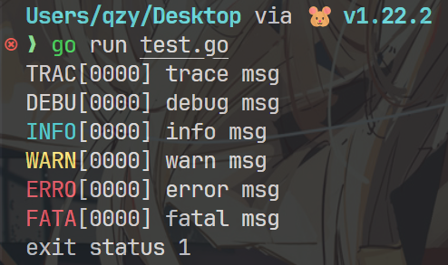
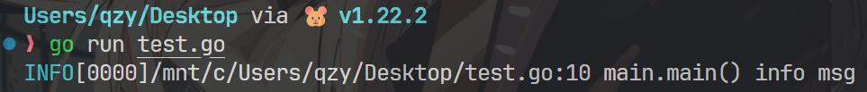
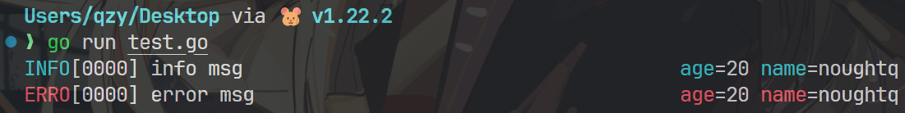
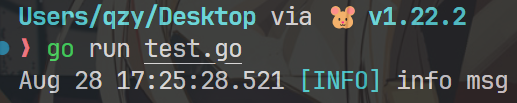
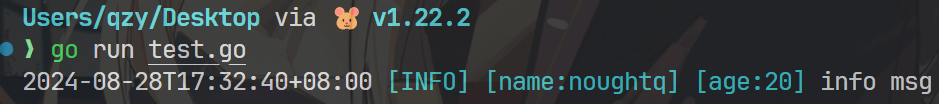
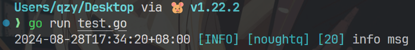
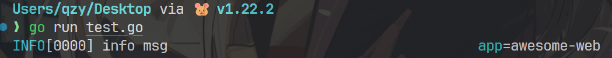

# Logrus 库

!!! abstract "参考资料"

    - [GitHub 官方仓库](https://github.com/sirupsen/logrus)
    - [Go 每日一库之 logrus](https://darjun.github.io/2020/02/07/godailylib/logrus/) - by 大俊（本笔记基于这篇博客撰写）

Logrus 库应该是 Go 最著名的日志库，它提供了强大的日志工具，方便我们用来调试程序（原生的标准库仅提供 `print`、`fatal` 和 `panic` 三种函数来打印日志，有一定局限性）。下面介绍它的一些功能。

## 基础部分

安装：

``` sh
$ go get github.com/sirupsen/logrus
```

代码部分：

``` go title="main.go"
package main

// 导入 Logrus 库
import (
  "github.com/sirupsen/logrus"
)

func main() {
  logrus.SetLevel(logrus.TraceLevel)

  logrus.Trace("trace msg")
  logrus.Debug("debug msg")
  logrus.Info("info msg")
  logrus.Warn("warn msg")
  logrus.Error("error msg")
  logrus.Fatal("fatal msg")
  logrus.Panic("panic msg")
}
```

输出结果：

<div>
    
</div>

可以看到，Logrus 库支持多种日志级别，分别为（从上往下，级别由高到低）：

- `Trace`：细节信息（一般不用）
- `Debug`：调试信息
- `Info`：关键操作，核心流程的日志
- `Warn`：警告信息
- `Error`：错误信息
- `Fatal`：致命错误，输出日志后程序退出
- `Panic`：记录日志，然后返回异常

>由于默认情况下高级别的日志不会输出，因此前面设置日志级别为 `TraceLevel`，这样就可以显示 `Trace` 和 `Debug` 日志了（默认日志级别为 `InfoLevel`）。

而输出结果分为两部分：日志级别（比如 `INFO[0000]`）和日志信息（比如 `info msg`）。

## 打印路径和函数信息

方法：`logrus.SetReportCaller(true)`

??? example "例子"

    ``` go
    package main

    import (
        "github.com/sirupsen/logrus"
    )

    func main() {
        logrus.SetReportCaller(true)

        logrus.Info("info msg")
    }
    ```

    输出结果：

    <div>
        
    </div>

## 添加字段

方法：`logrus.WithField/logrus.WithFields`。前者仅添加一个字段，后者可添加多个字段，因此一般直接用后者。后者接受一个 `logrus.Fields` 类型的参数，它的底层类型为 `map[string]interface{}`。

该方法返回一个 `logrus.Entry` 类型的值，包含了 `logrus.Logger` 和之前设置的 `logrus.Fields`，因此打印 `logrus.Entry` 值的同时也会打印 `logrus.Fields` 的值。

??? example "例子"

    ``` go
    package main

    import (
        "github.com/sirupsen/logrus"
    )

    func main() {
        requestLogger := logrus.WithFields(logrus.Fields{
            "name": "noughtq",
            "age": 20,
        })

        requestLogger.Info("info msg")
        requestLogger.Error("error msg")
    }
    ```

    输出结果：

    <div>
        
    </div>


## 重定向输出

除了默认将日志写入 `io.Stderr` 中，我们还可以利用 `logrus.SetOutput` 方法，将日志写到我们指定的地方，比如标准输出（`io.Stdout`）、缓存区（`bytes.Buffer`）、文件等等。

该方法接受 `io.Writer` 类型的参数，里面包含我们指定的输出位置，也可以使用 `io.MultiWriter` 类型，将日志同时输出到多个位置上。

??? example "例子"

    ``` go
    package main

    import (
        "bytes"
        "io"
        "log"
        "os"

        "github.com/sirupsen/logrus"
    )

    func main() {
        writer1 := &bytes.Buffer{}
        writer2 := os.Stdout
        writer3, err := os.OpenFile("log.txt", os.O_WRONLY|os.O_CREATE, 0755)
        if err != nil {
            log.Fatalf("create file log.txt failed: %v", err)
        }

        logrus.SetOutput(io.MultiWriter(writer1, writer2, writer3))
        logrus.Info("info msg")
        // 运行该脚本，日志信息将会被写入缓存区、标准输出和文件 log.txt 中
    }
    ```


## 自定义

事实上，Logrus 库的方法都作用于一个默认的 `Logger` 对象上（可以将前面的 `logrus` 视为一个对象，我们调用了它的方法来实现各种日志功能）。

我们也可以自己创建一个 `Logger` 对象，它可以使用这篇笔记涉及到的所有方法。

``` go
log := logrus.New()

log.SetLevel(logrus.InfoLevel)
log.Info("info msg")
```


## 日志格式

`logrus` 内置的日志格式有文本和 JSON，默认使用文本格式。方法 `logrus.SetFormatter` 用于设置日志格式。

??? example "例子"

    ``` go
    package main

    import (
        "github.com/sirupsen/logrus"
    )

    func main() {
        logrus.SetLevel(logrus.TraceLevel)
        logrus.SetFormatter(&logrus.JSONFormatter{})

        logrus.Trace("trace msg")
        logrus.Debug("debug msg")
        logrus.Info("info msg")
        logrus.Warn("warn msg")
        logrus.Error("error msg")
        logrus.Fatal("fatal msg")
        logrus.Panic("panic msg")
    }
    ```

    输出结果：

    <div>
        
    </div>

---
除了内置格式外，我们还可以使用第三方的格式，比如 [nested-logrus-formatter](https://github.com/antonfisher/nested-logrus-formatter)、[caption-json-formatter](https://github.com/nolleh/caption_json_formatter) 等等，这里仅介绍前者。

安装：

``` sh
$ go get github.com/antonfisher/nested-logrus-formatter
```

代码部分：

``` go
package main

import (
  nested "github.com/antonfisher/nested-logrus-formatter"
  "github.com/sirupsen/logrus"
)

func main() {
  logrus.SetFormatter(&nested.Formatter{
    HideKeys:    true,
    FieldsOrder: []string{"component", "category"},
  })

  logrus.Info("info msg")
}
```

输出结果：

<div>
    
</div>

`nested.Formatter` 提供了以下用于控制格式的字段：

``` go
type Formatter struct {
    // 确定输出字段顺序（默认按词典序）
    FieldsOrder     []string
    // 设置日期格式
    TimestampFormat string  
    // 是否隐藏键（默认以键值对的形式输出字段）
    HideKeys        bool
    // 文字颜色相关    
    NoColors        bool    
    NoFieldsColors  bool    
    ShowFullLevel   bool    
    TrimMessages    bool    
}
```

??? example "例子"

    ``` go
    package main

    import (
        "time"

        nested "github.com/antonfisher/nested-logrus-formatter"
        "github.com/sirupsen/logrus"
    )

    func main() {
        logrus.SetFormatter(&nested.Formatter{
            // HideKeys:        true,
            TimestampFormat: time.RFC3339,
            FieldsOrder:     []string{"name", "age"},
        })

        logrus.WithFields(logrus.Fields{
            "name": "noughtq",
            "age":  20,
        }).Info("info msg")
    }
    ```

    === "显示键"

        <div>
            
        </div>

    === "隐藏键"

        <div>
            
        </div>

---
自定义格式：`logrus.Formatter`

``` go
type Formatter interface {
    Format(*Entry) ([]byte, error)
}
```


## 钩子

Logrus 库的钩子(hook)会在日志输出时执行特定的方法。钩子需要实现 `logrus.Hook` 接口：

``` go
type Hook interface {
    Levels() []Level
    Fire(*Entry) error
}
```

- `Levels()` ：该方法返回我们关心的日志级别
- `Fire()`：日志输出前调用的钩子方法

??? example "例子"

    ``` go
    package main

    import (
        "github.com/sirupsen/logrus"
    )

    type AppHook struct {
        AppName string
    }

    func (h *AppHook) Levels() []logrus.Level {
        return logrus.AllLevels
    }

    func (h *AppHook) Fire(entry *logrus.Entry) error {
        entry.Data["app"] = h.AppName
        return nil
    }

    func main() {
        h := &AppHook{AppName: "awesome-web"}
        logrus.AddHook(h)

        logrus.Info("info msg")
    }
    ```

    输出结果：

    <div>
        
    </div>


第三方钩子：

- [logrus-amqp](https://github.com/vladoatanasov/logrus_amqp)：将日志发送到 ActiveMQ。
- [logrus-redis-hook](https://github.com/rogierlommers/logrus-redis-hook)：将日志发送到 redis
- [mgorus](https://github.com/weekface/mgorus)：将日志发送到 mongodb

>注：由于这些东西我都没碰过，所以就不介绍它们的用法了，感兴趣的读者可以到官方仓库看使用说明。