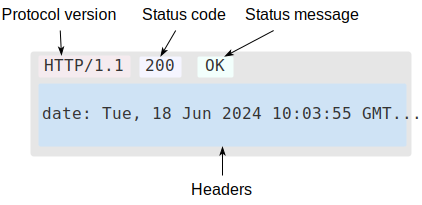
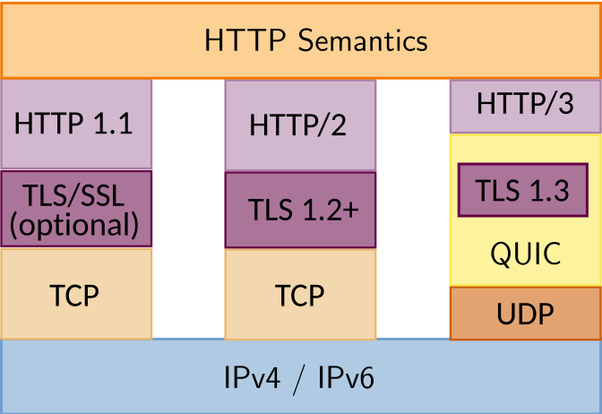
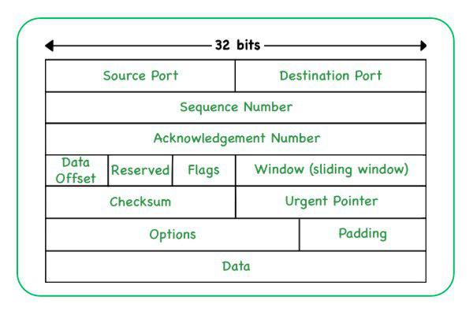
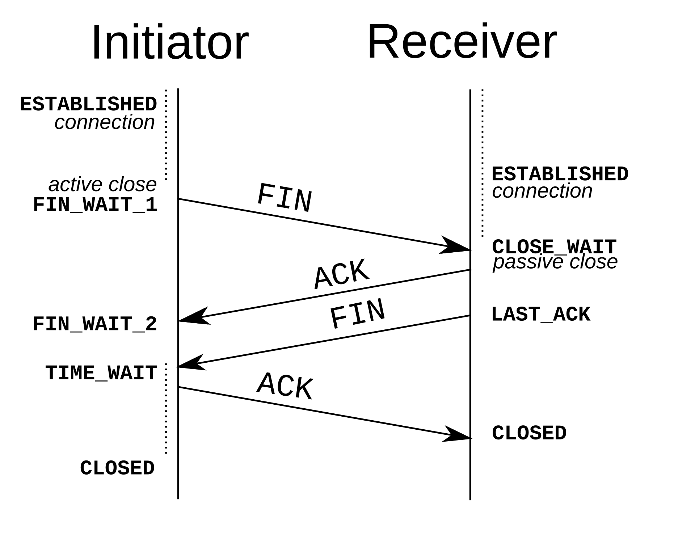
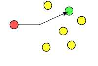
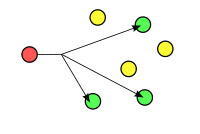
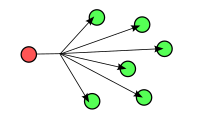
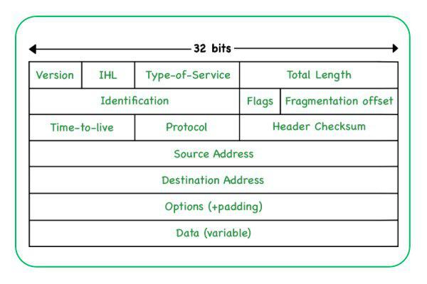
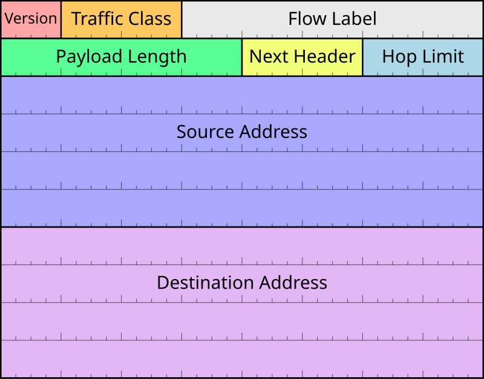

# 网络基础

!!! abstract "参考资料"

    - [MDN：HTTP 概述](https://developer.mozilla.org/zh-CN/docs/Web/HTTP/Overview)
    - [MDN：什么是域名](https://developer.mozilla.org/zh-CN/docs/Learn/Common_questions/Web_mechanics/What_is_a_domain_name) 
    - [「实用技能拾遗」Lec 6](https://slides.tonycrane.cc/PracticalSkillsTutorial/2023-fall-ckc/lec6/#/)
    - 一堆维基百科的资料


先放上最经典的 OSI 七层模型和 TCP/IP 四层模型：

<figure style=" width: 70%" markdown="span">
    
    
    <figcaption></figcaption>
</figure>

下面主要按 TCP/IP 模型简单介绍各层的作用。

## 应用层

应用层（application layer）位于 TCP/IP 模型的顶层，它指定了通信网络中主机使用的共享通信协议和应用程序接口方法，并提供常见的网路应用服务。

接下来展开介绍 HTTP 和 DNS。

### HTTP

超文本传输协议（HTTP）是一种基于文本的协议，用于在 Web 客户端与 Wen 服务器之间传输网页，因此它还是一种客户端 - 服务器（client-server）架构的协议。

!!! note "客户端 - 服务器架构（C/S）"

    - 任何一台计算机都可以作为客户端或服务器
    - 由客户端（或者称为用户代理（user agent））发起连接请求（request），服务器接受连接并进行响应（response）（它不能主动发起请求），且可以同时处理多个客户端的连接

    !!! warning "Dos 攻击：通过大量的无效请求占用服务器资源，使得合法请求无法被处理（DDoS 攻击：分布式拒绝服务攻击）"

HTTP 的基本特征：

- HTTP 是简约的：HTTP 报文简单易读
- HTTP 是可扩展的：HTTP 标头让协议变得易于扩展
- HTTP 无状态，但并非无会话：「无状态」是指同一个连接中，两个执行成功的请求之间没有关系。通过 HTTP Cookie 使得每个请求都能共享相同的上下文信息或相同的状态，从而使用户在同一个网站进行连贯的交互
- HTTP 和连接：连接由传输层实现，目前开发者正不断设计更加匹配 HTTP 的传输协议。

HTTP 能控制什么：

- 缓存（caching）
- 开放[同源限制](https://en.wikipedia.org/wiki/Same-origin_policy)（relaxing the origin constraint）
- 认证（authentication）：控制访问权限
- 代理服务器和隧道（proxy and tunneling）：访问内网
- 会话（sessions）：HTTP Cookie 将不同请求联系在一起

???+ info "统一资源定位符（uniform resource locator, URL）"

    URL 俗称网址，用于定位互联网上的资源，可以看作互联网世界的“门牌”。

    URL 的格式如下，重要性从左往右递减：

    <div style="text-align: center">
        
    </div>

    这是一个 URL：https://www.example.com:443/path/to/resource?query=1#frag，其中：

    - 协议：https
    - 主机：www.example.com
    - 端口：443
    - 路径：/path/to/resource
    - 查询：query=1
    - 片段：frag

    注意，URL 只能包含 ASCII 字符，转义字符需要用由[百分号编码](https://developer.mozilla.org/zh-CN/docs/Glossary/Percent-encoding)定义的字符集表示，比如空格是 %20。

#### HTTP 的工作流程

-  打开一个 TCP 连接：TCP 连接被用来送一条或多条请求，以及接受响应消息
-  发送一个 HTTP 报文，比如：

``` http
GET / HTTP/1.1
Host: note.noughtq.top
Accept-Language: zh
```

- 读取服务器返回的报文信息，比如：

``` http
HTTP/1.1 200 OK
Date: Mon, 05 Aug 2024 03:14:00 GMT
Server: cloudflare
...
ETag: W/"6a972de44d8302d82c08a01fdd10cdf0"
...
Content-Type: text/css; charset=utf-8

<!DOCTYPE html>...（此处是所请求网页的内容）
```

- 关闭连接或为后续请求重用连接

#### HTTP 报文

**请求报文**

<div style="text-align: center">
    
</div>

请求报文包含以下信息：

- [HTTP 方法](https://developer.mozilla.org/zh-CN/docs/Web/HTTP/Methods)：定义客户端执行的动作，以下是一些常见方法：
    - GET：最常用，用于获取资源，不能有请求体
    - POST：用于提交数据（比如表单）
    - PUT：更新资源
    - DELETE：删除资源
    - HEAD：获取资源的头部信息
    - ...
- 路径
- HTTP 版本号
- 可选标头
- 请求体

**响应报文**

<div style="text-align: center">
    
</div>

响应报文包含以下信息：

- HTTP 版本号
- [状态码](https://developer.mozilla.org/zh-CN/docs/Web/HTTP/Status)：指明请求是否成功，以及不成功时相应的原因
- 状态信息
- HTTP 标头（header）：由键值对（冒号分隔键值，换行区分不同键值对）组成的文本，用于描述请求或响应的属性
- （可选，上图没有显示）一个包含被获取资源的主体，与标头之间有一个空行

??? info "扩展：HTTP/1.1、HTTP/2 和 HTTP/3"

    <div style="text-align: center">
        
    </div>

    - HTTP/1.1 是基于 TCP 的文本协议。该协议下，一个连接只能处理一个请求；请求和响应是串行的。由于受到 TCP 的慢启动、阻塞等机制的影响，所以工作效率相对较低。
    - HTTP/2 是基于 TCP 的二进制协议，HTTP 报文内容不再人类可读。它通过压缩标头、多路复用等机制提高性能，而且多个请求可以在一个连接上并行处理。目前已经被广泛使用。
    - HTTP/3 基于 QUIC 协议。QUIC 抛弃 TCP，建立在 UDP 之上，它通过其他手段克服 UDP 的不可靠性。

#### Cookie

HTTP Cookie 是服务器发送到浏览器并保存在本地的一小块数据，浏览器会存储 Cookie 并在下次向同一服务器再发起请求时携带并发送到服务器上，用于告知服务端两个请求是否来自同一浏览器——如保持用户的登录状态。Cookie 使无状态的 HTTP 协议记录稳定的状态信息成为了可能。具体来说，Cookie 可以保存用户的访问记录，保存的偏好设置等等。

Cookie 以键值对的形式表示：`<name>=<value>`，允许重名。

---
服务器使用 `Set-Cookie` 响应头部向用户代理（一般是浏览器）发送 Cookie 信息，比如这里设置了两个 Cookie：

``` http
HTTP/1.0 200 OK
Content-type: text/html
Set-Cookie: yummy_cookie=choco
Set-Cookie: tasty_cookie=strawberry

...

```

之后若再对该服务器发起请求，浏览器都会将之前保存的 Cookie 信息通过 Cookie 请求头部再发送给服务器，比如这个 HTTP 请求。

``` http
GET /sample_page.html HTTP/1.1
Host: www.example.org
Cookie: yummy_cookie=choco; tasty_cookie=strawberry
```

虽然浏览器自动管理 Cookie，但是我们还可以主动访问并设置 Cookie，因此为了确保 Cookie 的安全，浏览器使用 `HttpOnly` 和 `Secure` 限制了对 Cookie 访问途径。

- `Secure` 属性可以限制只有使用 HTTPS 协议的请求可以携带或设置 Cookie，尽可能地避免 Cookie 在传输过程中的泄露。但它不会阻止对 Cookie 中敏感信息的访问。
- `HttpOnly` 属性能够限制了 JS `Document.cookie` API 对 Cookie 的访问，但也仅仅限制了部分接口，所以无法确保绝对的安全。

---
有以下几种不同类型的 Cookie：

- 持久型 Cookie：由 `ExpiredAt`（绝对时间） 和 `MaxAge`（时间 + 偏移量）两个属性控制 token 的过期时间。若同时启用，优先使用后者。可以通过给 MaxAge 一个非正数的值来删除 Cookie。
- 会话型 Cookie：没有上述属性的 Cookie 归为此类，它会被保留于整个会话内，直至会话结束后被删除。不同浏览器对会话的定义不同，可能会影响 Cookie 的关闭。
- 第三方 Cookie：由第三方安装，收集用户信息，通常用于广告商的营销中
- Flash Cookie：独立于浏览器，永久存储于计算机上，即使删去浏览器所有的 Cookie 也仍然保留这类 Cookie
- 僵尸 Cookie：一种 Flash Cookie，删掉后会自动重新创建，难以管理，用于游戏防作弊系统，或者用在恶意软件上
- 安全 Cookie：带有加密数据的 Cookie，用于电子商务、网上银行等网站


---
Cookie 的作用范围由 `Domain` 和 `Path` 属性限制：

- `Domain` 属性限制 Cookie 所属的域名，浏览器默认匹配所有的子域名。如果不设置该属性，浏览器会将请求目标作为 `Domain` 属性的值，而不匹配子域名，实际上限制更加严格了。
- `Path` 属性限制 Cookie 所属的子路径，默认为根目录 `/`，设置与否都会匹配所有的子路径

上面说 Cookie 可以重名，但需要确保重名的 Cookie 的 Domain 和 Path 属性不完全相同（即在不同的作用范围内）。

---
**跨站请求伪造**（cross-site request forgery, CSRF）是一种常见的 Web 攻击方式。简单来说就是恶意网站设法伪造，获取正确 Cookie 的 HTTP 请求。比如用户访问 A 网站，服务器给了一个包含隐私信息的 Cookie，然后该用户又访问 B 网站，B 网站诱使用户进行一些泄露 Cookie 信息的操作（比如向 A 网站发消息等），这样 B 网站的维护者（攻击者）就可以以该用户的身份访问 A 网站，而 A 网站认为这是正常的访问，从而带来严重后果。

???+ info "站（site） & 域（origin）"

    - 站：URL 的二级域名相同即为“同站”（有时还要求协议相同，但这不在讨论范围内）
    - 域：URL 的 schema、host 和 port 均相同才是“同域”的

    比如：http://example.com 和 http://www.example.com 以及 https://example.com 同站不同域，而 http://example.com:80/ha 与 http://example.com 同站、同域

假设同站的网站的管理员为同一人，那么它们之间不会互相攻击，因此浏览器对 Cookie 做了站级的限制 —— `SameSite` 属性，它可以杜绝 CSRF 攻击。它有下列三个可选值：

- `Strict`：限制最为严格，会完全禁止第三方 Cookie，跨站时不会发送任何 Cookie。由于过于严格，导致用户的体验很糟，比如每次访问网页都要重新登录。
- `Lax`：限制稍微放宽，多数情况下仍禁止第三方 Cookie，除非导航到目标网址的 GET 请求（包括链接、预加载和 GET 表单）。
    - 链接：`<a href="..."></a>`
    - 预加载：`<link rel="prerender" href="...">`
    - GET 表单：`<form method="GET" action="...">`
- `None`：用来关闭 `SameSite` 属性，前提是必须设置 `Secure` 属性才能成功关闭

格式：

``` http
Set-Cookie: <name>=<value>; SameSite=<option>
```


### DNS 

#### 域名

任何连上互联网的电脑都可以通过一个公共 IP 地址（IPv4，IPv6）访问各种网站。计算机很容易处理这些 IP 地址，但是人类却很难记住这些数字串，而且 IP 地址有可能会变化，因此用域名（domain）来表示人类可读的地址，从而解决上述问题。

格式：由一串用 . 分隔的字符串组成，比如 www.example.com

- 顶级域名（top-level domain，TLD）：最右侧的子字符串，常见的有：
    - 表示目的：.com、.org、.net、.gov、.edu
    - 地区：.cn、.us
- 从右往左接下来是二级域名，三级域名等，它们由由 1 到 63 个大小写不敏感的字符组成（数字、字母、'-'）

可以在域名注册商处购买域名，比如阿里云、腾讯云、Cloudflare 等。买来的域名往往包含顶级和二级域名，可以根据自己需要设置更多的子域名。

#### DNS 记录

- 主机（A）记录：将域名映射到 IPv4 地址
- 别名（CNAME）记录：将某个别名指向某个 A 记录
- IPv6 主机（AAAA）记录：将域名映射到 IPv6 地址
- 域名服务器（NS）记录：指定进行解析的 DNS 服务器
- 邮箱（MX）记录
- 文本信息（TXT）记录
- ...

#### DNS 工作流程

- 在浏览器地址栏输入 URL，浏览器会先询问本地计算机是否已经识别此域名对应的 IP 地址（使用本地 DNS 缓存），若是则转换为 IP 地址，然后浏览器与 Web 服务器协商内容。结束。
- 若不知道域名对应的 IP 地址，询问 DNS 服务器，它会告诉计算机域名所匹配的 IP 地址，然后浏览器与 Web 服务器协商内容。结束。
- DNS 服务器有可能继续向其他 DNS 服务器查询，直到找到所需的记录为止。一般来说，DNS 服务器会缓存查询结果，以减少查询时间（TTL）。


### 其他协议

!!! abstract "说明"

    以下内容因时间原因不再详细展开，之后学计网的时候会补上的。

- 远程登录主机：[Telnet](https://en.wikipedia.org/wiki/Telnet)、[Secure Shell（SSH）](https://en.wikipedia.org/wiki/Secure_Shell)
- 文件传输：[文件传输协议（FTP）](https://en.wikipedia.org/wiki/File_Transfer_Protocol)、[简单文件传输协议（TFTP）](https://en.wikipedia.org/wiki/Trivial_File_Transfer_Protocol)
- 电子邮件传输：[简单邮件传输协议（SMTP）](https://en.wikipedia.org/wiki/Simple_Mail_Transfer_Protocol)
- ...

## 传输层

传输层（transport layer）协议为应用进程提供端到端的通信服务，比如面向连接的数据流支持、可靠性、流量控制、多路复用等服务。常用的协议有 TCP、UDP等。

### TCP

传输控制协议（transport control protocol, TCP）是面向连接的协议，它通过复杂的握手、确认、重传等机制保证数据的顺序和可靠性。


TCP 数据包：

<div style="text-align: center">
    
</div>

简单介绍 TCP 数据包的报头部分：

- 源端口（16 bit）：发送端
- 目的端口（16 bit）：接收端
- 序列号码（32 bit）
- 确认号码（32 bit）
- 数据偏移（4 bit）
- 保留（3 bit）：000
- 标志（9 bit）：每一位都有不同的作用，比如 ACK、SYN、FIN 等
- 窗口（16 bit）：用于流量控制
- 校验和（16 bit）：保证数据包的完整性和正确性
- 紧急指针（16 bit）
- 选项（$\ge$ 40 bit）

---
工作机制：

- 连接建立（“三次握手”）

<div style="text-align: center">
    
</div>

- 数据传输，有多种确保可靠传输的机制：
    - 基于重复累计确认的重传和超时重传
    - 校验和
    - 流量控制
    - 拥塞控制

- 连接终止（“四次握手”）

<div style="text-align: center">
    
</div>


### UDP

用户数据报协议（user datagram protocol, UDP）是无连接的协议，它的特点是单向传输，不保证顺序，不保证可靠性，因此相比 TCP 更简单且快速。

UDP 报头：

<div style="text-align: center">
    
</div>

组成部分：

- 源端口（16 bit）
- 目的端口（16 bit）
- 报文长度（16 bit）
- 校验和（16 bit）


??? info "TCP 和 UDP 的区别"

    <div style="text-align: center">
        
    </div>

## 网络层

网络层（network layer）有以下两个主要功能：

- 寻址：依靠 IP 地址进行相互通信
- 路由：是一种使用一些预定规则选取最佳路径的程序。同一网络下由链路层完成通信，不同网络下需要借助路由器等设备实现相互通信，常见的路由形式有单播（unicast）、组播（multicast）、广播（broadcast）等（图片从左往右）。

<div style="text-align: center">
    
    
    
</div>

??? info "广域网与局域网"

    - 广域网（wide area network）：大范围的网络，如互联网
    - 局域网（local area network）：小范围的网路，如家庭、学校、公司内部的网络。局域网内的主机可以互相访问，但是需要路由器才能访问互联网

??? info "网关"

    网关（gateway）是一种将不同网络连接起来的设备，比如连接局域网和互联网的路由器。一般来说，局域网内的主机的网关是路由器的 IP 地址。

### IPv4

IPv4 地址是一个 32 位整数值的形式，通常被写作点分十进制的形式，中间用点分隔，例如：192.0.2.235。

通常分为 A、B、C、D、E 五类地址，还有一些特殊用处的地址，比如 127.0.0.0/8 作为环回地址，以0或255结尾的地址作为广播地址等等。

!!! note "子网掩码"

    子网掩码（subnet mask）是一种用来指明一个 IP 地址的哪些位标识的是主机所在的网络地址以及哪些位标识的是主机地址的位掩码，可用于判断两个 IP 地址是否在同一个子网内。

    下面是 A、B、C 三类地址对应的子网掩码：

    |类别|起始位|开始|结束|子网掩码|
    |:-|:-|:-|:-|:-|
    |A|0|0.0.0.0|127.0.0.0|255.0.0.0|
    |B|10|128.0.0.0|191.255.0.0|255.255.0.0|
    |C|110|192.0.0.0|223.255.255.0|255.255.255.0|

    将 IP 地址与子网掩码进行按位与操作，得到的位串即为网络位，而原 IP 地址剩下的位为主机位。

---
IPv4 数据包：

<div style="text-align: center">
    
</div>

数据包首部有以下组成部分：

- 版本（4 bit）：IPv4
- 首部长度（4 bit）
- 服务类型（8 bit）
    - 区分服务（DS）（6 bit）
    - 显示拥塞通知（ECN）（2 bit）
- 全长（16 bit）
- 标识符（16 bit）
- 标志（3 bit）
- 分片偏移（13 bit）
- 存活时间（8 bit）：避免报文卡死
- 协议（8 bit）
- 首部校验和（16 bit）
- 源地址（32 bit）
- 目的地址（32 bit）
- 选项

---
由于 IPv4 只能提供 40 亿个地址，互联网的迅速发展加速 IPv4 地址的枯竭，有以下技术应对 IPv4 地址的耗尽：

- 网络地址转换（NAT）：用于将局域网内的多个主机共享一个公网 IP 地址，它通过修改 IP 数据包的源地址和目的地址来实现这一功能。虽然部署方便，但是这让通信变得复杂，因而导致通信效率的降低。
- 动态主机设置协议（DHCP）：使用 UDP 协议工作，它的作用是为用户自动分配 IP 地址
- 专用网络的使用
- ...

### IPv6

IPv6 诞生的直接原因便是 IPv4 地址的耗尽，虽然 IPv4 仍占主要地位，但未来 IPv6 会逐渐取代 IPv4。

IPv6 是一个 128 bit 的二进制位串，一般以 16 位为一组，每组以冒号分隔，分为 8 组，每组用 4 位十六进制数表示，比如：2001:0db8:86a3:08d3:1319:8a2e:0370:7344。IPv6 有一些简记法，比如每组连续的前导 0 可以省略，中间多个0可以用双冒号 :: 表示等。

IPv6 数据包

<div style="text-align: center">
    
</div>

数据包首部有以下组成部分：

- 版本（4 bit）
- 通信类别（8 bit）
- 流标记（20 bit）：服务质量（QoS）控制
- 分组长度（16 bit）
- 下一个首部（8 bit）
- 跳段数限制（8 bit）：等价于 IPv4 TTL
- 源地址（128 bit）
- 目标地址（128 bit）

## 链路层

链路层（link layer）是一组仅限于主机物理连接线路的方法和通信协议。链路是用于网络中的主机或节点的物理和逻辑网络组件，链路协议是一套仅在网段的相邻网络节点之间运行的方法和标准。

- MAC（medium access control，介质访问控制）：链路层的下层部分，提供寻址（MAC 地址，每张网卡的 MAC 地址是唯一的）及媒体访问的控制方式，使得不同设备或网络上的节点可以在多点的网络上通信，而不会互相冲突。
- ARP（address resolution protocol，地址解析协议）：通过解析网络层地址（IP 地址）来找寻数据链路层地址（MAC 地址）的网络传输协议
- NDP（neighbor dicovery protocol，邻居发现协议）：简单理解为 ARP 的 IPv6 版本

---
- 以太网：有线局域网技术
- Wi-Fi：无线局域网技术

## 常用命令

- `nc <ip> <port>`：设置路由器
- `nslookup <domain_name>`：查询 DNS 相关信息，比如 DNS 记录、IP 地址等
- `ping <ip/domain_name>`：检测与另一个主机之间的网络连接
- `curl` 命令：向 Web 服务器发起请求
    - `curl <url>`：默认进行 GET 请求
    - `curl -i <url>`：显示响应头
    - `curl -v -X <method> <url> -d <request_body>`：`-v` 显示详细信息，`-X` 指定请求方法，`-d` 指定请求体
- `ipconfig`：显示本机 TCP/IP 网络配置信息
