# 期末速通（？）

!!! warning "注意"

    ~~整理完笔记后，发现速通是不可能的了☠️~~

    笔者在复习过程中会对笔记进一步删改，~~尽量做到保留下来的都是精华~~

## 概述

### Internet

- **网络**(network)：由若干链路(links)和节点(nodes)互连形成

    

        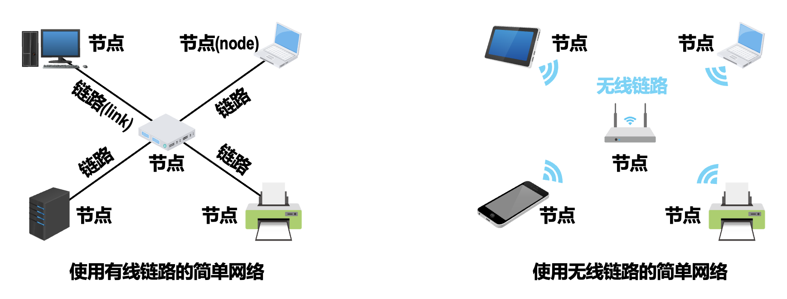
    

- **互联网**(internet)：若干网络通过路由器互连形成，网络的网络

    

        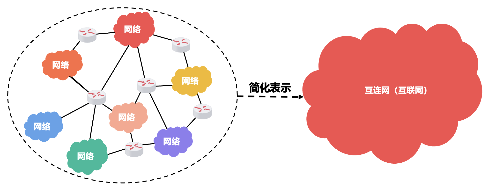
    

- **因特网**(Internet)是世界上最大的互联网。
- **因特网服务提供者**(Internet Service Provider, **ISP**)
- 因特网已发展成为基于 ISP 的多层次结构的互连网络

    

        
    

### 电路交换、分组交换和报文交换

- **电路交换**(circuit switching)：

    

        
    

    - 计算机之间的数据传送是**突发式**的，当使用电路交换来传送计算机数据时，其**线路的传输效率一般都会很低**，线路上真正用来传送数据的时间往往不到 10% 甚至 1%。

- **分组交换**(packet switching)：

    

        
    

    - **发送方**：构造并发送分组(packets)
    - **交换节点**：缓存并转发分组
    - **接收方**：接受分组，还原报文
    - 优点：
        - 没有建立连接和释放连接的过程
        - 分组传输过程中逐段占用通信链路，有较高的通信线路利用率
        - 交换节点可以为每一个分组独立选择转发路由，使得网络有很好的生存性
    - 缺点：
        - 分组首部带来了额外的传输开销
        - 交换节点存储转发分组会造成一定的时延
        - 无法确保通信时端到端通信资源全部可用，在通信量较大时可能造成网络拥塞
        - 分组可能会出现失序和丢失等问题

- **报文交换**(message switching)：
    - 分组交换的前身
    - **报文被整个地发送**，而不是拆分成若干个分组进行发送
    - 交换节点将报文**整体接收完成后**才能查找转发表，将整个报文转发到下一个节点
    - 因此相比分组交换带来的**转发时延要长很多**，需要交换节点具有的**缓存空间也大很多**

三种交换方式的对比：

    

- 若要连续传送大量的数据，并且数据传送时间远大于建立连接的时间，则使用**电路交换**可以有较高的传输效率；然而计算机的数据传送往往是突发式的，采用电路交换时通信线路的利用率会很低
- **报文交换**和**分组交换**都不需要建立连接（即预先分配通信资源），在传送计算机的突发数据时可以提高通信线路的利用率
- 将报文构造成若干个更小的分组进行**分组交换**，比将整个报文进行报文交换的时延要小，并且还可以避免太长的报文长时间占用链路，有利于差错控制，同时具有更好的灵活性

### 定义和分类

现阶段对「**计算机网络**」的一个较好的定义：计算机网络主要是由一些通用的、**可编程的硬件**互连而成的，而这些硬件并非专门用来实现某一特定目的（例如，传送数据或视频信号）。这些可编程的硬件能够用来传送多种不同类型的数据，并能支持广泛的和日益增长的**应用**。

- 可编程的硬件：不限于计算机，而是包括了智能手机、具有网络功能的传感器以及智能家电等智能硬件，这些硬件一定包含有 CPU
- 各类应用：基于数据传送实现各种各样的应用，包括今后可能出现的各种应用

分类：

- 交换方式：电路/报文/分组交换（见[前一节](#电路交换分组交换和报文交换)）
- 使用者：
    - 公用网：因特网
    - 专用网：军队、铁路、电力、银行
- 传输介质：

    

        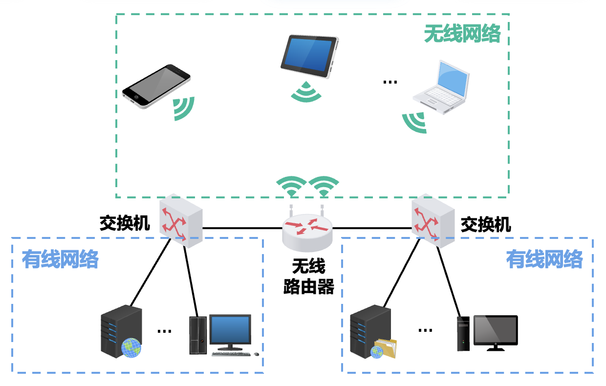
    

- 覆盖范围：
    - 广域网（WAN）：几十到几千千米
    - 城域网（MAN）：5-50 km
    - 局域网（LAN）：~1 km
    - 个域网（PAN）10 m

- 拓扑结构：
    - 总线型

        

            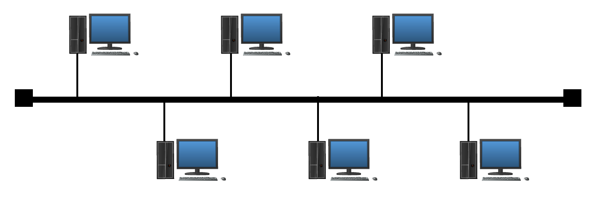
        

    - 星型

        

            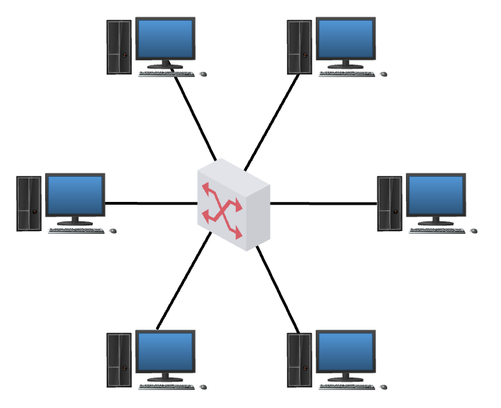
        

    - 环型

        

            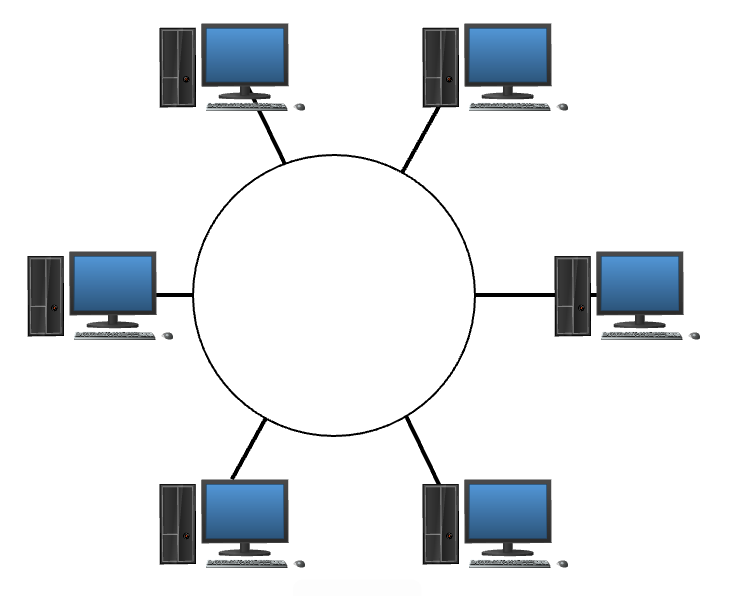
        

    - 网状型

        

            
        

### 性能指标

- **速率**(rate)：数据的传送速率（即每秒传送多少个比特），也称为**数据率**(data rate)或**比特率**(bit rate)
    - 基本单位是**比特/秒**（bit/s，可简记为 b/s，有时也记为 bps (bit per second)）
    - 常用单位：
        - 千比特/秒（kb/s 或 kbps）= 10^3^ bps
        - 兆比特/秒（Mb/s 或 Mbps）= 10^6^ bps
        - 吉比特/秒（Gb/s 或 Gbps）= 10^9^ bps
        - 太比特/秒（Tb/s 或 Tbps）= 10^12^ bps

- **带宽**(bandwidth)：表示网络的通信线路所能传送数据的能力，即在单位时间内从网络中的某一点到另一点所能通过的**最高数据率**
    - 单位：同「速率」
    - 数据传送速率 = min[主机接口速率，线路带宽，交换机或路由器的接口速率]（短板效应）

        

            
        

- **吞吐量**(throughput)：在单位时间内通过某个网络或接口的**实际数据量**，常被用于对实际网络的测量，以便获知到底有多少数据量通过了网络
    - **受网络带宽的限制**

        

            
        

- **时延**(delay/latency)：数据从网络的一端传送到另一端所耗费的时间，也称为延迟或迟延
    - 数据可由一个或多个分组、甚至是一个比特构成
    - **发送时延**(transmission latency) = 分组长度（b）/ 发送速率（b/s）（发送速率公式见「带宽」部分）
    - **传播时延**(propagation latency) = 信道长度（m）/ 信号传播速率（m/s）
    - 排队时延和处理时延不方便计算

        

            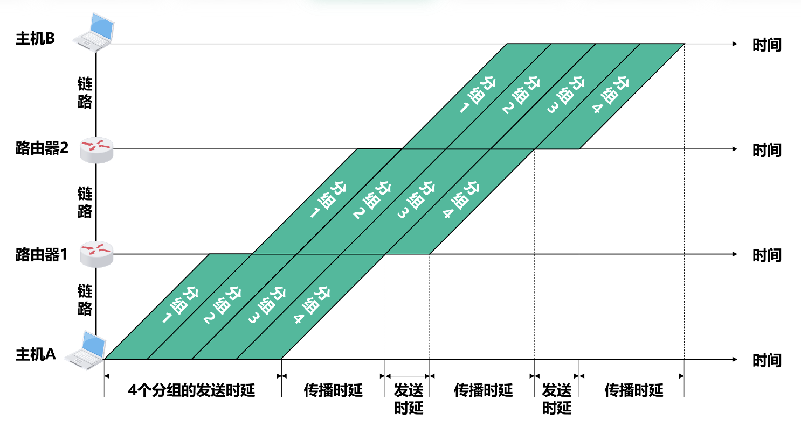
        

- **时延带宽积** = 传播时延 * 带宽
    - 也称为**以比特为单位的链路长度**，这对我们以后理解以太网的最短帧长是非常有帮助的

- **往返时间**(round-trip time, **RTT**)：从发送端发送数据分组开始，到发送端收到接收端发来的相应确认分组为止，总共耗费的时间

    

        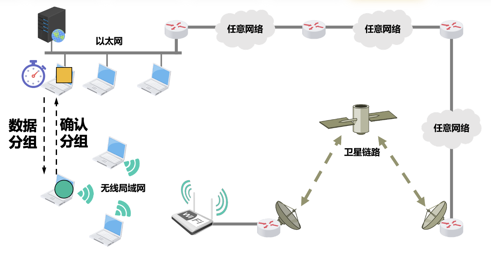
    

    - 可使用 `ping` 命令查看（`time` 字段值）

        

            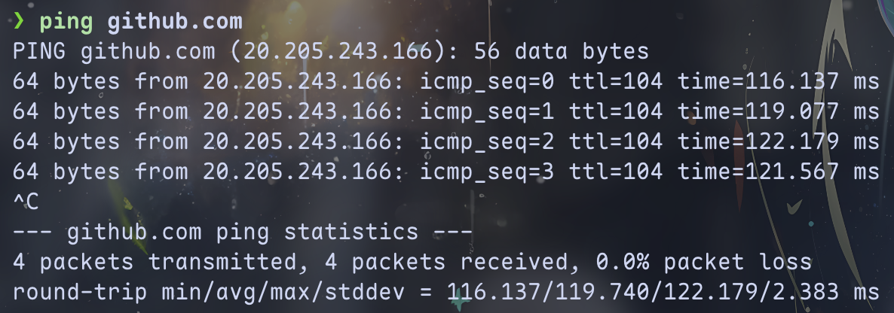
        

- **利用率**(utilization)
    - **链路利用率**：某条链路有百分之几的时间是被利用的（即有数据通过）；完全空闲的链路的利用率为零
    - **网络利用率**：网络中所有链路的链路利用率的加权平均
    - 根据排队论可知，当某链路的**利用率增大**时，该链路引起的**时延就会迅速增加**
    - 当网络的通信量较少时，产生的时延并不大，但在网络通信量不断增大时，分组在交换节点（路由器或交换机）中的排队时延会随之增大，因此网络引起的时延就会增大
    - 令 $D_0$ 表示网络空闲时的时延，$D$ 表示网络当前的时延，那么在理想的假定条件下，可用下式来表示 $D, D_0$ 和网络利用率 $U$ 之间的关系：

        $$
        D = \frac{D_0}{1 - U}
        $$
    
        

            
        

    - 一些大型 ISP 往往会控制信道利用率不超过 50%；如果超过了就要进行扩容，增大线路的带宽

- **丢包率**：在一定的时间范围内，传输过程中丢失的分组数量与总分组数量的比率
    - 分为接口/节点/链路/路径/网络丢包率
    - 分组丢失主要有以下两种情况：
        - 分组在传输过程中出现**误码**，被传输路径中的节点交换机（例如路由器）或目的主机检测出误码而丢弃
        - 节点交换机根据**丢弃策略**主动丢弃分组

    - 丢包率可以反映网络的拥塞情况：
        - 无拥塞时路径丢包率为 0
        - 轻度拥塞时路径丢包率为 1%~4%
        - 严重拥塞时路径丢包率为 5%~15%
        

### 体系结构

两种通信模式：

- **无连接服务**(connectionless service)：无需提前建立连接
- **面向连接服务**(connection-oriented service)：也称为虚电路服务(virtual circuit service)，通信前需建立虚电路

    

- **OSI**(open system interconnection)模型允许网络层支持两种模式：无连接（IP）+ 面向连接（X.25 等协议）
- **TCP/IP** 模型中，网络层（IP 层）是无连接的，面向连接的功能由传输层（TCP）实现

TCP/IP 体系结构：

    

    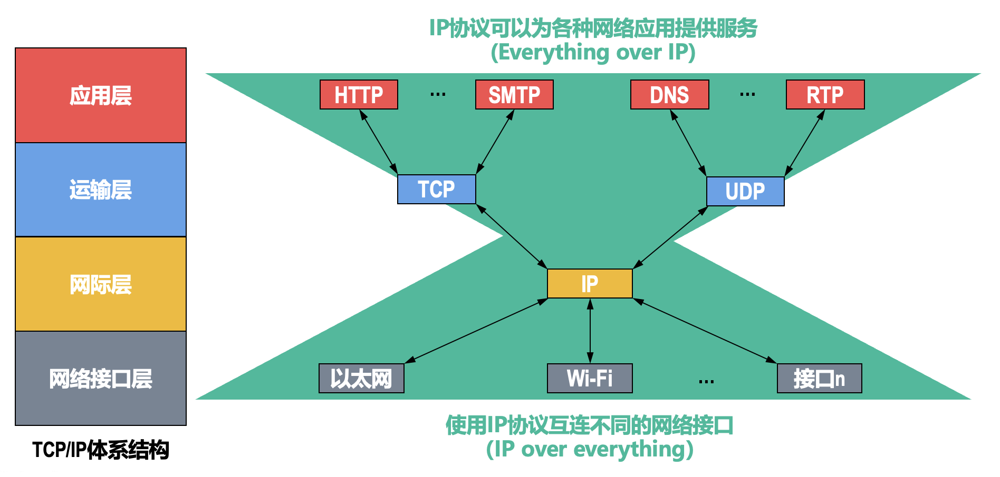

???+ note "体系结构分层的必要性"

    计算机网络是个非常复杂的系统，“分层”可将庞大复杂的问题转化为若干较小的局部问题（高内聚低耦合）。

    >以下内容可看作计网的学习大纲。

    - 物理层：
        - 采用什么**传输介质**（物理层之下）
        - 采用什么**物理接口**
        - 采用什么**信号**表示比特 0 和 1
        
    - 数据链路层：
        - 标识网络中各主机（**主机编址**，例如 MAC 地址）
        - 从比特流中区分出地址和数据（**数据封装格式**）
        - 协调各主机争用总线（**介质接入控制**）
        - 以太网交换机的实现（**自学习和转发帧**）
        - 检测数据是否误码（**差错检测**）
        - 出现传输差错如何处理（**可靠传输和不可靠传输**）
        - 接收方控制发送方注入网络的数据量（**流量控制**）

    - 网络层：
        - 标识网络和网络中的各主机（**网络和主机共同编址**，例如 IP 地址）
        - 路由器转发分组（**路由选择协议、路由表和转发表**）

    - 运输层：
        - 进程之间基于网络的通信（**进程的标识**，例如端口号）
        - 出现传输差错如何处理（**可靠传输和不可靠传输**）

    - 应用层：
        - 通过应用进程间的交互来完成特定的网络应用
        - 进行会话管理和数据表示

专业术语：

- **实体**：解决通过应用进程的交互来实现特定网络应用的问题
    - **对等实体**：通信双方相同层次中的实体

    

        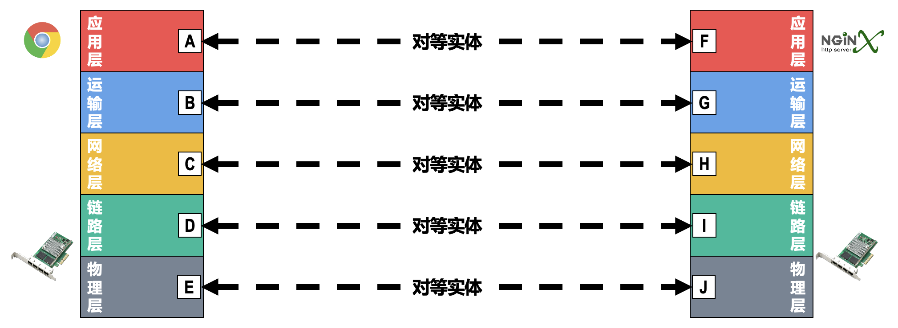
    

- **协议**：控制两个对等实体在“水平方向” 进行“逻辑通信”的规则的集合
    - 协议三要素：
        - 语法：定义所交换信息的**格式**
        - 语义：定义通信双方所要完成的**操作**
        - 同步：定义通信双方的**时序**关系
    
    - 对等层次之间传送的数据包称为该层的**协议数据单元**(protocol data unit，**PDU**)

- **服务**：
    - 协议是“水平”的，而服务是“垂直”的
    - 实体看得见下层提供的服务，但并不知道实现该服务的具体协议；下层的协议对上层的实体是“透明”的
    - 在同一系统中相邻两层的实体交换信息的逻辑接口称为**服务访问点**（SAP），它被用于区分不同的服务类型
    - 帧的“类型”字段、IP 数据报的“协议”字段，TCP 报文段或 UDP 用户数据报的“端口号”字段都是 SAP
    - 上层要使用下层所提供的服务，必须通过与下层交换一些命令，这些命令称为服务原语
    - 同一系统内层与层之间交换的数据包称为**服务数据单元**(service data unit，**SDU**)

    

        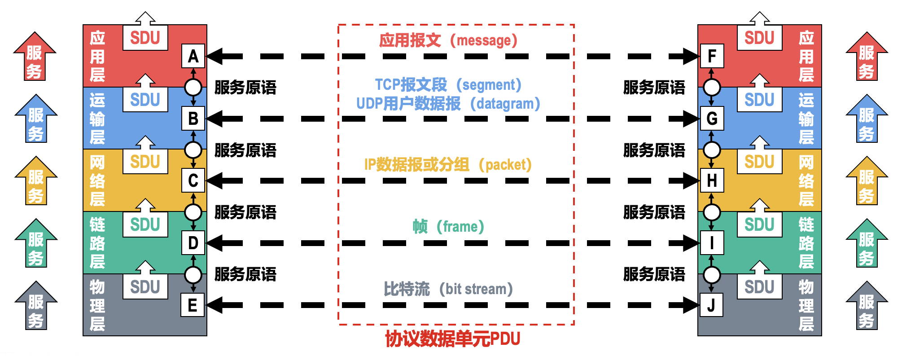
    

## 物理层

物理层接口有以下特性：

- **机械**特性：
    - 形状和尺寸
    - 引脚数目和排列
    - 固定和锁定装置

- **电气**特性：
    - 信号电压的范围
    - 阻抗匹配的情况
    - 传输速率
    - 距离限制

- **功能**特性：规定接口电缆的各条信号线的作用
- **过程**特性：规定在信号线上传输比特流的一组操作过程，包括各信号间的时序关系

### 传输介质

**传输介质**(transimission media)：计算机网络设备之间的物理通路，不包含在计算机网络体系结构中（物理层之下）。

    

#### 导向性传输介质

- **同轴电缆**(coaxial cable)

    

        
    

    - 分类：
        - 基带同轴电缆（50 Ω）：用于数字传输，在早期局域网中广泛使用
        - 宽带同轴电缆（75 Ω）：用于模拟传输，目前主要用于有线电视的入户线

    - 同轴电缆价格较贵且布线不够灵活和方便；随着技术的发展和集线器的出现，在局域网领域基本上都采用双绞线作为传输介质

- **双绞线**(twisted pair)

    

        
    

    - 绞合的作用：
        - 减少相邻导线间的电磁干扰
        - 抵御部分来自外界的电磁干扰

- **光纤**(fiber optics)
    - 利用光脉冲在光纤中的传递来进行通信
    - 由于可见光的频率非常高（约为 108MHz 量级），因此一个光纤通信系统的传输带宽远大于目前其他各种传输介质的带宽
    
    

        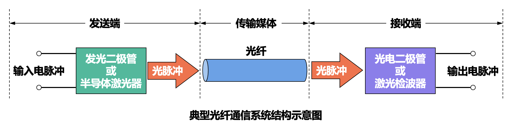
    

    - 分类：

        

            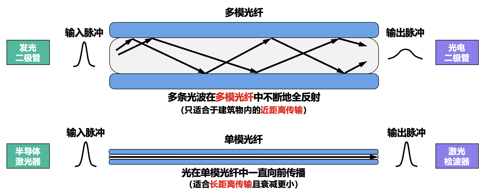
        

        - **单模光纤**(multi-mode fiber)
        - **多模光纤**(single-mode fiber)

#### 非导向性传输介质

    

- 无线电波

    

        
    

- 微波

    

        
    

    

        
        
    

- 红外线
    - 设备：电视/空调遥控器
    - 红外通信已被淘汰

- 激光
- 可见光

### 传输方式

#### 串行传输和并行传输

    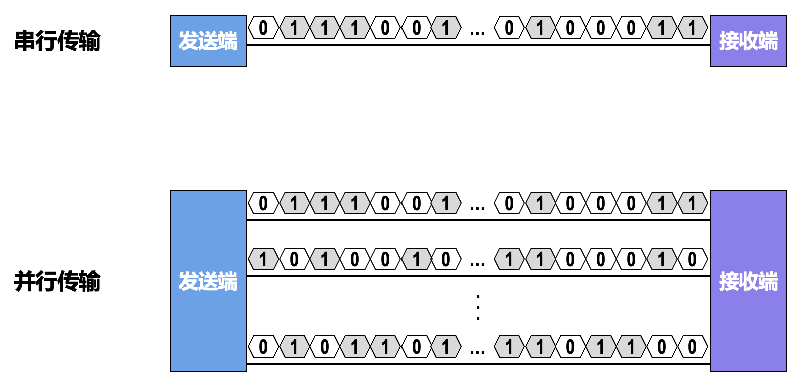

    

#### 同步传输和异步传输

- **同步**传输

    

        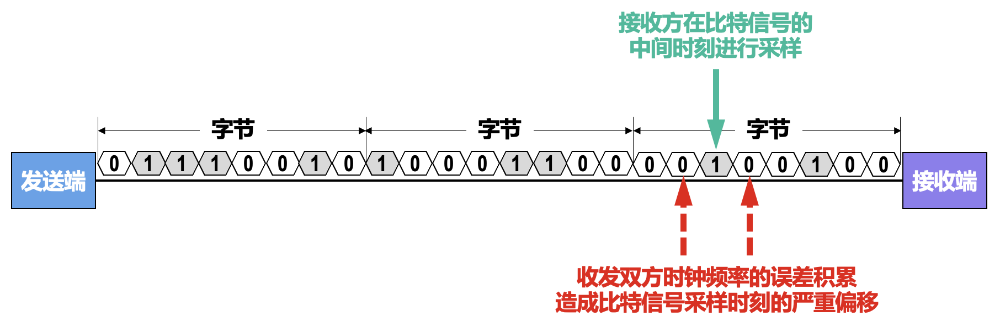
    

    收发双方时钟同步的方法：

    - **外同步**：在收发双方之间增加一条时钟信号线
    - **内同步**：发送端将时钟信号编码到发送数据中一起发送（例如曼彻斯特编码）

- **异步**传输

    

        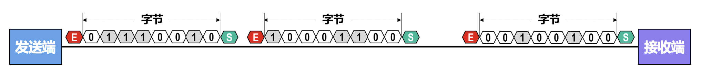
    

    - 字节之间异步，即字节之间的时间间隔不固定
    - 字节中的每个比特仍然要同步，即各比特的持续时间是相同的

#### 单工、半双工和全双工

    

### 编码与调制

#### 基本概念

    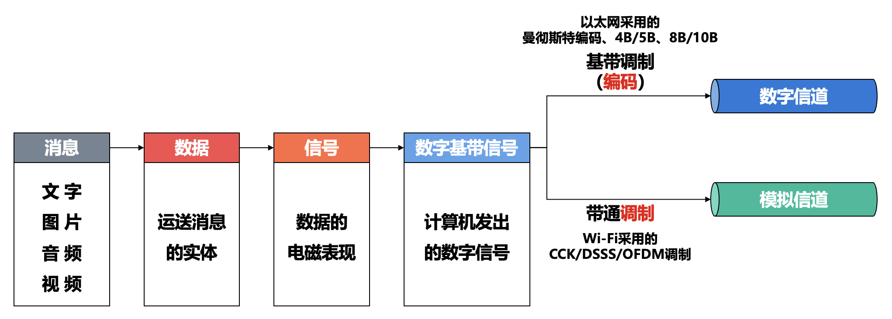

**码元**(symbol)：在使用时间域的波形表示信号时，代表不同离散数值的基本波形。

    

#### 常用编码方式

- **双极性不归零编码**（NRZ）：编码效率高，但存在**同步**问题

    

        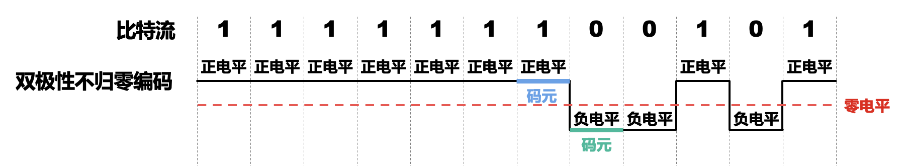
    

    接收方如何判断码元？

    - 需要给收发双方再添加一条**时钟信号线**
    - 发送方通过数据信号线给接收方发送数据的同时，还通过时钟信号线给接收方发送时钟信号
    - 接收方按照接收到的时钟信号的节拍，对数据信号线上的信号进行采样
    - 对于计算机网络，宁愿利用这根传输线传输数据信号，而不是传输时钟信号

- **双极性归零编码**：

    

        
    

    - 在每个码元的中间时刻信号**都会回归到零电平**
    - 接收方只要在信号归零后采样即可
    - 归零编码相当于将时钟信号用归零方式编码在了数据之内，这称为「**自同步**」信号
    - 然而，归零编码中大部分的数据**带宽**，都用来传输归零而**浪费**掉了

- NRZI
    - TBD

- **曼彻斯特编码**：

    

        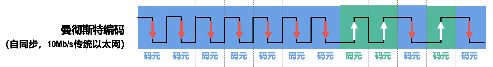
    

    - 码元中间时刻的**电平跳变**既表示时钟信号，也表示数据
    - 正跳变表示 1 还是 0，负跳变表示 0 还是 1，可以自行定义
    - 问题：**带宽**开销增大了一倍

- **差分曼彻斯特编码**：

    

        
    

    - 码元中间时刻的电平跳变仅表示时钟信号，而不表示数据
    - 数据的表示在于**每一个码元开始处是否有电平跳变**：无跳变表示 1，有跳变表示 0
    - 在传输大量连续 1 或连续 0 的情况下，差分曼彻斯特编码信号比曼彻斯特编码信号的变化少
    - 在噪声干扰环境下，检测有无跳变比检测跳变方向更不容易出错，因此差分曼彻斯特编码信号比曼彻斯特编码信号更易于检测
    - 在传输介质接线错误导致高低电平翻转的情况下，差分曼彻斯特编码仍然有效

- **4B/5B 编码**：
    - 确保足够的信号转换，以便接收器保持同步，减少时间误差
    - 相比于曼彻斯特（以太网的编码方式）编码效率更高

    | 数据（4B） | 码字（5B）| 数据（4B） | 码字（5B）|
    | :--- | :--- | :--- | :--- |
    | 0000 | 11110 | 1000 | 10010 |
    | 0001 | 01001 | 1001 | 10011 |
    | 0010 | 10100 | 1010 | 10110 |
    | 0011 | 10101 | 1011 | 10111 |
    | 0100 | 01010 | 1100 | 11010 |
    | 0101 | 01011 | 1101 | 11011 |
    | 0110 | 01110 | 1110 | 11100 |
    | 0111 | 01111 | 1111 | 11101 |

#### 基本的带通调制方法和混合调制方法

基本的带通调制(modulation)方法：

    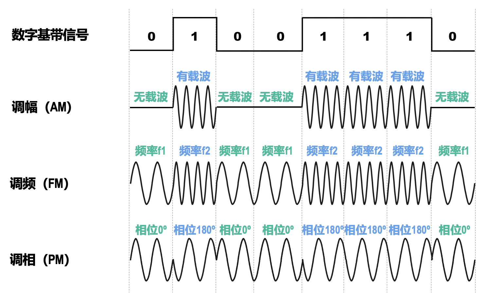

混合调制方法： 通常情况下，载波的**相位**和**振幅**可以结合起来一起调制，例如**正交振幅调制 QAM-16**：

- 12 种相位
- 每种相位有 1 或 2 种振幅可选
- 可以调制出 16 种码元（波形），每种码元可以对应表示 4 个比特（$\log_2 16=4$）
- 每个码元与 4 个比特的对应关系采用**格雷码**(Gray code)，即任意两个相邻码元只有 1 个比特不同

    

>注：星座图(constellation diagram)

### 信道的极限容量

#### 造成信号失真的主要因素

- 码元的传输速率：传输速率越高，信号经过传输后的失真就越严重
- 信号的传输距离：传输距离越远，信号经过传输后的失真就越严重
- 噪声干扰：噪声干扰越大，信号经过传输后的失真就越严重
- 传输介质的质量：传输介质质量越差，信号经过传输后的失真就越严重

---
- 信道上传输的**数字信号**，可以看做是多个频率的模拟信号进行多次叠加后形成的方波

    

        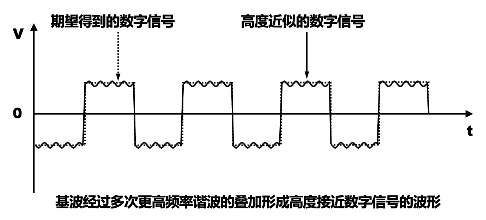
    

- 如果数字信号中的高频分量在传输时受到衰减甚至不能通过信道，则接收端接收到的波形前沿和后沿就变得不那么陡峭，每一个码元所占的时间界限也不再明确。这样，在接收端接收到的信号波形就失去了码元之间的清晰界限，这种现象称为**码间串扰**
- 如果信道的频带越宽，则能够通过的信号的高频分量就越多，那么码元的传输速率就可以更高，而不会导致码间串扰
- 然而，信道的频率带宽是有上限的，不可能无限大，因此码元的传输速率也有上限

#### 奈氏准则

!!! theorem "奈氏准则(Nyquist's Theorem)"

    **理想**低通信道的**最高码元传输速率** = 2W Baud = 2W 码元/秒

    - W：信道的**频率带宽**（单位为 Hz）
    - Baud：波特，即码元/秒

- 使用奈氏准则给出的公式，就可以根据信道的频率带宽，计算出信道的**最高码元传输速率**（**调制速度**）
- 只要码元传输速率不超过根据奈氏准则计算出的上限，就可以**避免码间串扰**
- 奈氏准则给出的是理想低通信道的最高码元传输速率，它和实际信道有较大的差别；因此，一个**实际**的信道所能传输的最高码元传输速率，要**明显低于奈氏准则给出的上限值**
- 奈氏准则**适用于所有的传输介质**

波特率与比特率的关系：

- 当 1 个码元只携带 1 比特的信息量时，波特率与比特率在数值上是相等的
- 当 1 个码元携带 n 比特的信息量时，波特率转换成比特率时，数值要乘以 n

不可以无限制地提高信息的传输速率，因为在实际的信道中会有**噪声**。噪声是随机产生的，其瞬时值有时会很大，这会影响接收端对码元的识别，并且噪声功率相对于信号功率越大，影响就越大。

#### 香农公式

!!! theorem "香农公式(Shannon's Theorem)"

    带宽受限且有高斯白噪声干扰的信道的极限信息传输速率为：
    $$
    C = W \log_2 (1 + \frac{S}{N})
    $$

    - $C$：信道的极**限信息传输速率**（单位为 b/s）
    - $W$：信道的频率带宽（单位为 Hz）
    - $S$：信道内所传**信号的平均功率**
    - $N$：信道内的**高斯噪声功率**
    - $S/N$：信噪比，使用分贝（dB）作为度量单位 = $10 \log_{10} \left( \dfrac{S}{N} \right)$

- 信道的频率带宽 $W$ 或信道中的信噪比 $S/N$ 越大，信道的极限信息传输速率 $C$ 就越高
- 实际信道不可能无限制地提高频率带宽 $W$ 或信道中的信噪比 $S/N$
- 实际信道中能够达到的信息传输速率，要比香农公式给出的极限传输速率低不少，这是因为在实际信道中，信号还要受到其他一些损伤，例如各种脉冲干扰和信号衰减等，这些因素在香农公式中并未考虑

??? question "例题"

    >来自作业题

    === "题目"

        If a binary signal is sent over a 3-kHz channel whose signal-to-noise radio is 20dB, what is the maximum achievable data rate?

    === "解答"

        Use the Shannon–Hartley theorem: $C = B \log_2 (1 + S / N)$, where

        - $B = 3000\text{Hz}$
        - $S / N = 20\text{dB} = 10^{20 / 10} = 100$

        Consequently, $C = \min(2 \times 3000, 3000 \times \log_2(1 + 100)) \approx 6000\ \text{bps}$

???+ abstract "总结"

    在信道的频率带宽 $W$ 一定的情况下，根据奈氏准则和香农公式，要想提高信息的传输速率，就必须采用**多元制**（更复杂的调制技术），并努力**提高信道中的信噪比**。
        
    自从香农公式发表后，各种新的信号处理和调制方法就不断出现，其目的都是为了**使码元可以携带更多个比特**，进而可以尽可能地接近香农公式给出的传输速率极限。

### 信道复用技术

#### 基本原理

- **复用**(multiplexing)：在一条传输介质上同时传输多路用户的信号
- 当一条传输介质的传输容量大于多条信道传输的总容量时，就可以通过复用技术，在这条传输介质上建立多条通信信道(channel)，以便充分利用传输介质的带宽
- 尽管实现信道复用会增加通信成本（需要复用器、分用器以及费用较高的大容量共享信道），但如果复用的信道数量较大，还是比较划算的

    

#### 常用技术

- **频分复用**(frequency division multiplexing, **FDM**)：所有用户同时占用不同的频带资源并行通信

    

        
    

- **时分复用**(time division multiplexing, **TDM**)：所有用户在不同的时间占用同样的频带

    

        
    

- **波分复用**(wavelength division multiplexing, **WDM**)
    - 根据频分复用的设计思想，可在一根光纤上**同时传输多个频率（波长）相近的光载波信号**，实现基于光纤的频分复用技术
    - 目前可以在一根光纤上复用 80 路或更多路的光载波信号，因此这种复用技术也称为**密集波分复用 DWDM**
    - 铺设光缆的工程耗资巨大，应尽量在一根光缆中放入尽可能多的光纤，然后对每一根光纤使用密集波分复用技术

    

        
    

- **码分复用**(code division multiplexing, **CDM**)
    - 常称为码分多址(code division multiple access, **CDMA**)，它是在扩频通信技术的基础上发展起来的一种无线通信技术
    - 每个用户**可以在相同的时间使用相同的频带进行通信**
    - 将每个比特时间划分为 m 个更短的时间片，称为**码片**(chip)；m 的取值通常为 64 或 128（为了简单起见，在后续的举例中假设 m 的取值为 8）
    - CDMA 中的每个站点都被指派一个唯一的 m 比特码片序列
        - 某个站要发送**比特 1**，则发送它自己的 **m 比特码片序列**
        - 某个站要发送**比特 0**，则发送它自己的 m 比特码片序列的**反码**

    - 如果有两个或多个站同时发送数据，则信道中的信号就是这些站各自所发送一系列码片序列或码片序列反码的**叠加**
    - 为了从信道中**分离**出每个站的信号，给每个站指派码片序列时，必须遵循以下规则：
        - 分配给每个站的码片序列必须**各不相同**，实际常采用**伪随机码序列**
        - 分配给每个站的码片序列必须**相互正交**，即各码片序列相应的码片向量之间的**归一化内积为 0**
            - 令向量 A 表示站 A 的码片向量，向量 B 表示站 B 的码片向量；两个不同站 A 和 B 的码片序列相互正交，就是向量 A 与向量 B 的归一化內积为 0，即：

                $$
                A \cdot B = \frac{1}{m} \sum_{i=1}^m A_i B_i = 0
                $$
    
    ??? example "例子"

        === "例1"

            

                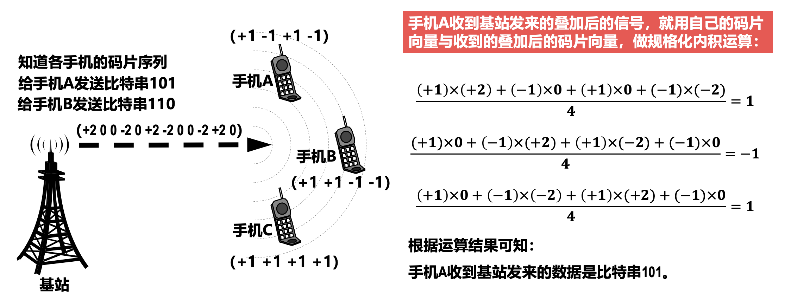
            

        === "例2"

            >来自作业题

            === "题目"

                { align=right width=20% }

                Suppose that A, B, and C are simultaneously transmitting 0 bits, using a CDMA system with the chip sequences of Fig.(a). What is the resulting chip sequence?

            === "解答"

                Bit 0 is sent as the negative of the user's code, so the received chips are (-A) + (-B) +  (-C) = -(A+B+C): (3, 1, 1, -1, -3, -1, -1, 1)

## 数据链路层

- **链路**(link)：从一个节点到相邻节点的一段物理线路（有线或无线），中间没有任何其他的交换节点
- **数据链路**(data link)：当在一条链路上传送数据时，除需要链路本身，还需要一些必要的通信协议来控制这些数据的传输，把**实现这些协议的硬件和软件加到链路上**，就构成了数据链路
    - 计算机中的**网络适配器**（俗称**网卡**）和其相应的**软件驱动程序**就实现了这些协议；一般的网络适配器都包含了物理层和数据链路层这两层的功能

    

        
    

- **帧**(frame)：**数据链路层**对等实体之间在水平方向进行逻辑通信的 **PDU**

???+ note "数据链路层提供的服务"

    - **无确认无连接服务**(unacknowledged connectionless)：接收方不对收到的帧进行确认
        - 适用场景：误码率低的可靠信道、实时通信
        - 网络实例：以太网
    - **有确认无连接服务**(acknowledged connectionless)：每一帧都得到单独的确认
        - 适用场景：不可靠的信道（无线信道）
        - 网络实例：802.11
    - **有确认有连接服务**(acknowledged connection-oriented)
        - 适用场景：长延迟的不可靠信道

### 三个问题

#### 封装成帧和透明传输

- **封装成帧**：数据链路层为上层交付下来的 PDU **添加帧首部和帧尾部**，使之成为帧

    

        
    

    - 帧首部和帧尾部包含有一些**重要的控制信息**
    - 帧首部和帧尾部另一个作用是**帧定界**，但并不是每一种数据链路层协议的帧都包含有帧定界标志（比如以太网 V2 的 MAC 帧）
    - 为了提高传输帧的效率，应当使**帧的数据载荷的长度尽可能地大于首部和尾部的长度**
    - 考虑到对缓存空间的需求以及差错控制等诸多因素，每一种数据链路层协议都规定了帧的数据载荷的长度上限，即**最大传送单元**(maximum transfer unit，**MTU**)

- **透明传输**：使数据链路层对上层交付的 PDU 的**内容没有任何限制**，就好像数据链路层不存在一样
    - 面向字节的物理链路使用**字节填充**的方法实现透明传输
    - 面向比特的物理链路使用**比特填充**的方法实现透明传输

#### 差错检测

帧在传输的过程中可能出现**误码**。

- 比特在传输过程中可能会产生差错（称为**比特差错**），比特 1 可能变成比特 0，反之也有可能
- 在一段时间内，传输错误的比特数量占所传输比特总数的比率称为**误码率**(bit error rate，**BER**)
- **提高链路的[信噪比](#香农公式)**，可以降低误码率；但在实际的通信链路上，不可能使误码率下降为零

接收方根据发送方添加在帧尾部中的**检错码**，可以检测出帧是否出现了误码。常用校验方法有：

- **奇偶校验**：
    - 奇校验是在待发送的数据后面添加 1 个校验位，使得添加该校验位后的整个数据中比特 1 的个数为奇数
    - 偶校验是在待发送的数据后面添加 1 个校验位，使得添加该校验位后的整个数据中比特 1 的个数为偶数
    - 在所传输的数据中，如果有**奇数个位发生误码**，则所包含比特1的数量的奇偶性会发生改变，**可以检测出误码**
    - 在所传输的数据中，如果有**偶数个位发生误码**，则所包含比特1的数量的奇偶性不会发生改变，**无法检测出误码（漏检）**
    - 在实际使用时，奇偶校验又可分为垂直奇偶校验、水平奇偶校验以及水平垂直奇偶校验

    

        
    

    

        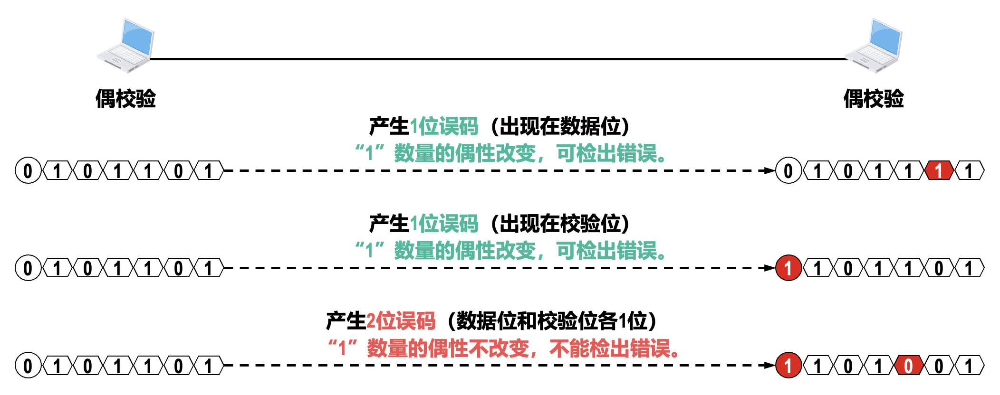
    

- **循环冗余校验**(cyclic redundancy check，**CRC**)：
    - 数据链路层广泛使用这一漏检率极低的技术，因为虽然计算比较复杂，但非常易于用硬件实现
    - 基本思想：
        - 收发双方约定好一个**生成多项式** $G(X)$

            

                
            

        - 发送方基于待发送的数据和 $G(X)$，计算出差错检测码（**冗余码**，长度为生成多项式的最高次数），将冗余码添加到待发送数据的后面一起传输

            

                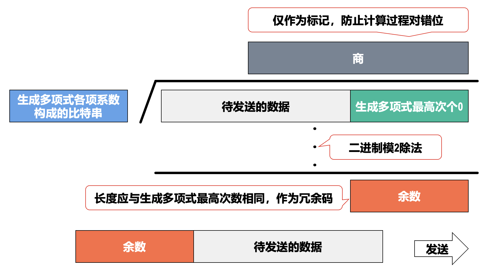
            

            冗余码计算步骤：

            1. 构造被除数：待发送数据后面添加生成多项式最高次数个 0 
            2. 构造除数：生成多项式各项系数构成的比特串作为除数
            3. 做二进制模 2 除法：相当于对应位进行逻辑异或运算
            4. 检查余数：余数的位数应与生成多项式最高次数相同，如果位数不够，则在余数前补 0 来凑足位数

        - 接收方收到数据和冗余码后，通过 $G(X)$ 来计算收到的数据和冗余码是否产生了误码

            

                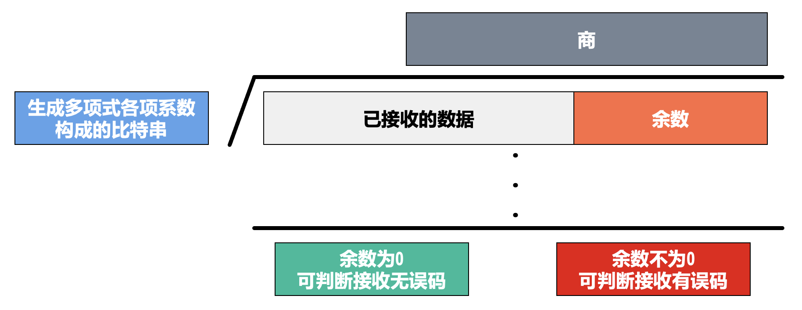
            

            具体步骤：

            1. 构造被除数：接收到的信息作为被除数
            2. 构造除数：生成多项式各项系数构成的比特串作为除数
            3. 做二进制模 2 除法：相当于对应位进行逻辑异或运算
            4. 检查余数：余数为 0，可认为传输过程无误码；余数不为 0，可认为传输过程产生了误码

    ??? example "例子"

        

            
        

        

            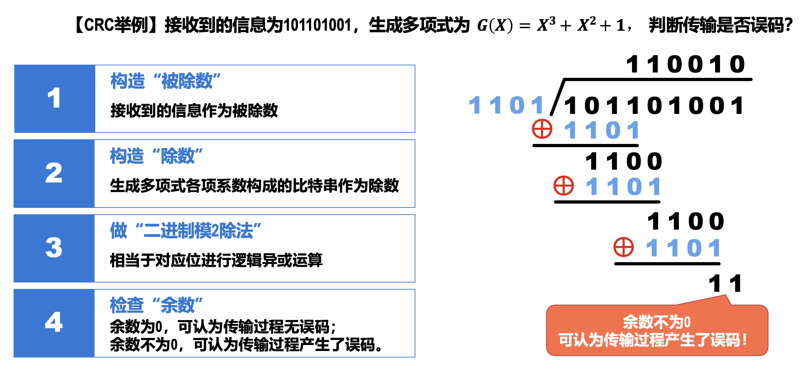
        

奇偶校验、循环冗余校验等差错检测技术，**只能检测**出传输过程中出现了差错，但并不能定位错误，因此**无法纠正错误**。要想纠正传输中的差错，可以使用冗余信息更多的纠错码（例如**海明码**）进行前向纠错。但纠错码的开销比较大，在计算机网络中较少使用。

在计算机网络中，通常采用之后介绍的**检错重传**方式来纠正传输中的差错，或者仅仅**丢弃**检测到差错的帧，这取决于数据链路层向其上层提供的是可靠传输服务还是不可靠传输服务。

???+ note "海明码"

    - **码字**(code word)：一个包含 m 个数据位和 r 个校验位的 n 位单元，描述为 (n, m) 码，n=m+r
    - **码率**(code rate)：码字中不含冗余部分所占的比例，可以用 m/n 表示
    - **海明距离**(Hamming distance)：两个码字之间不同对应比特的数目
        - 例：0000000000 与 0000011111 的海明距离为 5
        - 如果两个码字的海明距离为 d，则需要 d 个单比特纠错就可以把一个码字转换成另一个码字

    - **最小海明距离**(minimum Hamming distance)所有码字对中最小的海明距离 $d_{\min}$
        - 能够检测最多 $d_{\min} - 1$ 个错误
        - 能够纠正最多 $\lfloor \dfrac{d_{\min} - 1}{2} \rfloor$ 个错误

    ---
    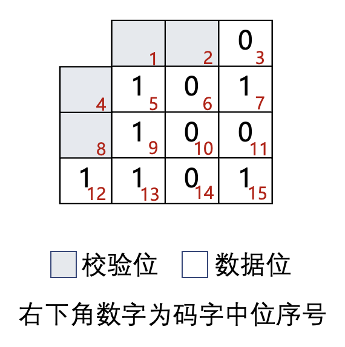{ align=right width=20% }

    目标：以**奇偶校验**为基础，如何找到出错位置，提供 **1 位纠错能力**。

    下面以 (15, 11) 海明码为例来理解海明码的编码过程：

    - 假设有一个 11 比特的数据 01011001101（如右图所示），将其按顺序放入数据位
    - **校验位**为 2 的幂次方位（记为 p1, p2, p4, p8）；每个校验位对数据位的子集做校验，缩小定位错误的范围
    - 子集的选择与校验位计算

        

            
        

        - 海明码缺省为偶校验（也可以使用奇校验）

    - 定位错误与纠正（假如第 7 位出错）
        - 组 1 和组 2 的校验结果可以定位错误所在的列
        
            

                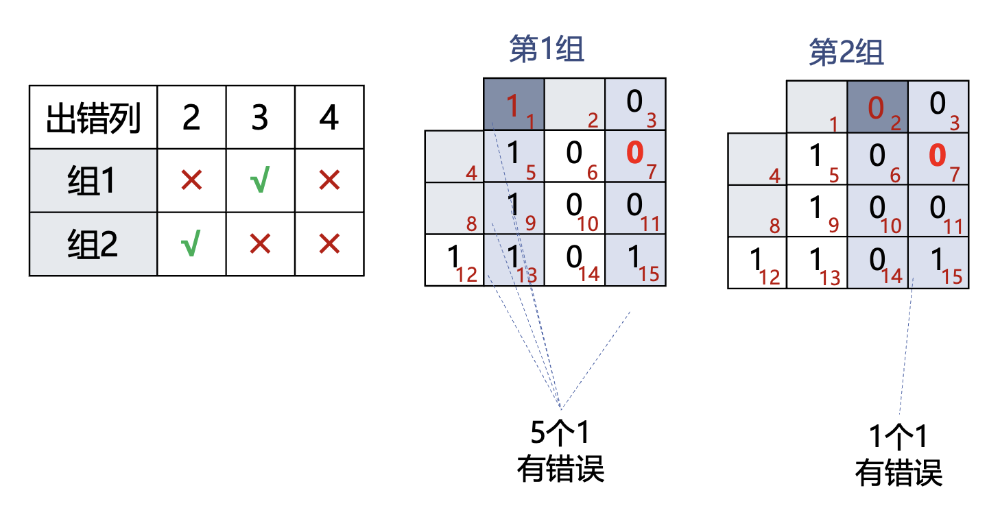
            

            
        - 组 3 和组 4 的校验结果可以定位错误所在的行

            

                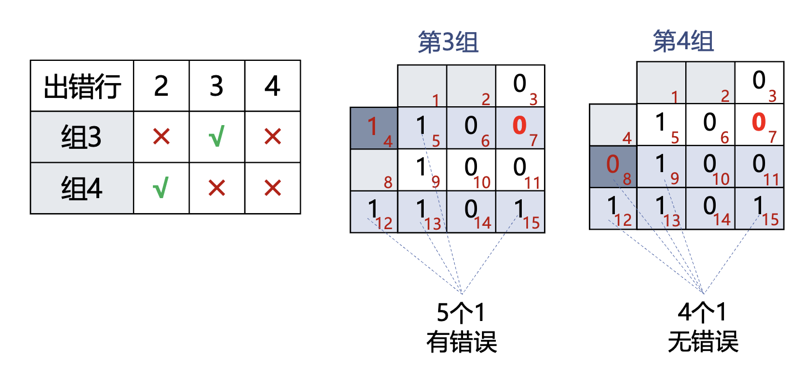
            

#### 可靠传输

- **不可靠传输服务**：**仅仅丢弃有误码的帧**，其他什么也不做
- **可靠传输服务**：实现发送方发送什么，接收方**最终都能正确收到**
- 一般情况下，**有线链路**的误码率比较低，因此为了减小开销，并**不要求**数据链路层向其上层提供可靠传输服务；即使出现了误码，可靠传输的问题由其上层处理
- **无线链路**易受干扰，误码率比较高，因此要求数据链路层**必须**向其上层提供可靠传输服务
- 传输差错（前面三种情况出现在数据链路层的上层，最后一种出现在数据链路层及其下层）：
    - **误码**（比特差错）：前面刚介绍过
    - **分组丢失**：输入队列快满了，主动丢弃收到的分组
    - **分组失序**：分组到达顺序与发送顺序不同
    - **分组重复**：路由器繁忙，分组在输入队列中等待较长时间，导致发送端超时重发，最终接收端收到多个相同分组

- 可靠传输服务并不局限于数据链路层，其他各层均可选择实现可靠传输
- 可靠传输的实现比较复杂，开销比较大，是否使用可靠传输取决于应用需求

    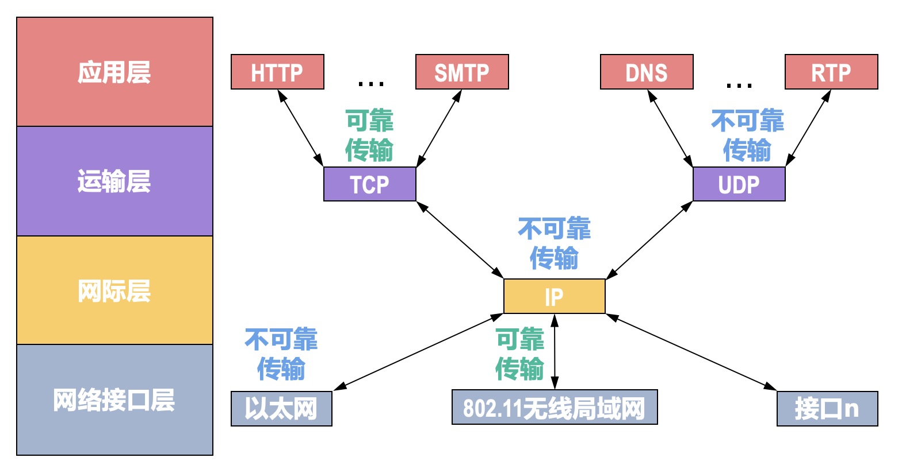

##### 停止-等待协议

**停止-等待协议**(stop-and-wait protocol)：

- 实现原理：

    

        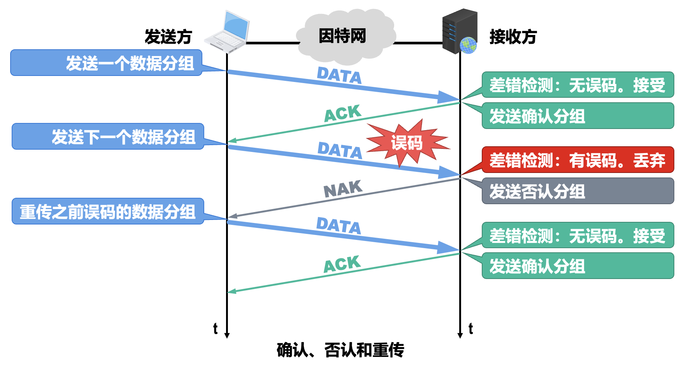
    

    - 接收方收不到数据分组，就不会发送相应的 ACK 或 NAK；如果不采取措施，发送方就会一直处于等待接收方 ACK 或 NAK 的状态
    - 为解决上述问题，发送方可在每发送完一个数据分组时就启动一个**超时计时器**(timeout timer)
    - 若到了超时计时器所设置的**超时重传时间**(retransmission time-out，**RTO**)，但发送方仍未收到接收方的 ACK 或 NAK，就**重传**之前已发送过的数据分组；一般可将 RTO 设置为略大于收发双方的平均往返时间 RTT
    
    

        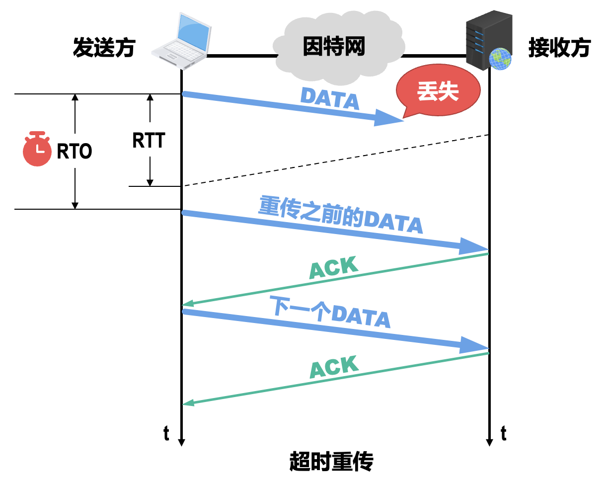
    

    - 为了避免分组重复这种传输错误，必须给每个分组带上**序号**；对于停止-等待协议，由于每发送一个数据分组就停止等待，只要保证每发送一个新的数据分组，其序号与上次发送的数据分组的序号不同就可以了，因此用**一个比特**来编号就够了（0/1）
    - 若接收方收到重复的数据分组，则将其丢弃，并再发送一个确认分组；其中确认分组需要编号，避免发送方搞错确认分组对应的数据分组，所用比特数量与数据分组所用比特数量一样
        
    

        
    

    ???+ warning "注意事项"

        - 使用超时重传机制后，就可以不使用**否认机制**了，这样可使协议实现起来更加简单；但如果点对点链路的误码率较高，使用否认机制可以使发送方在超时计时器超时前就尽快重传
        - 停止-等待协议属于**自动请求重传**(automatic repeat request，ARQ)协议，即重传的请求是**发送方自动进行的**，而不是接收方请求发送方重传某个误码的数据分组
    
- 信道利用率：

    

        
    

    

        
    
 

    - 若出现超时重传，对于传送有用的数据信息来说，信道利用率还要降低
    - 在 **RTT 相对较大**的情况下，为了提高信道利用率，收发双方不适合采用停止-等待协议，而可以选择使用**回退 N 帧（GBN）协议**或**选择重传（SR）协议**

    ??? question "例题"

        >来自作业题

        === "题目"

            A channel has a bit rate of 4 kbps and a propagation delay of 20 msec. For what range of frame sizes does stop-and-wait give an efficiency of at least 50 percent?

        === "解答"

            Given:

            - Bit rate $R = 4 \text{ kbps} = 4000 \text{ bps}$
            - Propagation delay $t_p = 20 \text{ ms} = 0.02 \text{ s}$
            - Efficiency $\eta = \frac{t_f}{t_f + 2t_p} \ge 0.5 $, where $t_f = \frac{L}{R}$

            So,

            $$
            \frac{t_f}{t_f + 2t_p} \ge 0.5 \Rightarrow t_f \ge 0.04 \text{ s} \\
            L = R \times t_f = 4000 \times 0.04 = 160 \text{ bits}
            $$

            Frame size $\ge$ 160 bits for efficiency $\ge$ 50%.

##### 回退 N 帧协议 (Go-Back-N, GBN)

    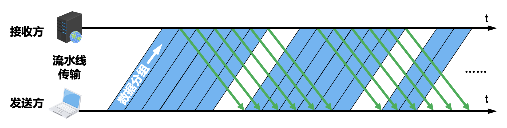

 

- 采用**流水线**传输可以显著提高信道利用率
- 此时发送方不能无限制地连续发送数据分组，否则可能会导致网络中的路由器或接收方来不及处理这些数据分组，进而导致数据分组的丢失，这实际上是对网络资源的浪费
- 因此回退 N 帧协议除了采用流水线传输方式，还利用**发送窗口**来限制发送方连续发送数据分组的数量，这属于**连续 ARQ 协议**
- 采用 $n$ 个比特给分组编序号，序号范围是 $0 \sim (2^n - 1)$（本例假设采用 3 个比特给分组编序号）
- 发送方需要维护一个**发送窗口** $W_T$（范围为 $1 < W_T \le (2^n - 1)$），在未收到接收方确认分组的情况下，发送方可将序号落入 $W_T$ 内的所有数据分组连续发送出去（下面取 $W_T = 5$）
- 接收方需要维护一个**接收窗口** $W_R$，只有正确到达接收方（无误码）且序号落入 $W_R$ 内的数据分组才被接收方接收；$W_R$ 的**取值只能是 1**，这一点与停止-等待协议是相同的
- **接收方**每正确收到一个序号落入接收窗口的数据分组，就将接收窗口向前滑动一个位置，这样就有一个新的序号落入接收窗口；与此同时，接收方还要给发送方发送针对该数据分组的**确认分组**
- **发送方**每收到一个按序确认的确认分组，就将发送窗口向前滑动一个位置，这样就有一个新的序号落入发送窗口，序号落入发送窗口内的数据分组可继续被发送
- 在回退 N 帧协议的工作过程中，发送方的发送窗口和接收方的接收窗口按上述规则不断向前滑动（因该类协议又称为**滑动窗口协议**）

    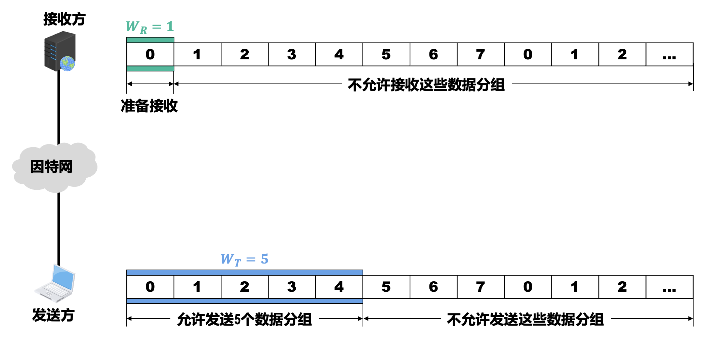

 

=== "无差错的情况"

    

        
    
 

    在无传输差错的情况下，回退 N 帧协议的信道利用率比停止-等待协议的信道利用率有显著提高；提高的程度取决于发送窗口的大小。

=== "超时重传、回退 N 帧的情况"

    

        
    
 

    - 一个数据分组的差错就可能引起大量数据分组的重传
    - 在信道质量较差（容易出现误码）的情况下，回退 N 帧协议的信道利用率并不比停止-等待协议的信道利用率高

接收方采用**累积确认**的方式：

- 接收方不必对收到的每一个数据分组都发送一个确认分组，而是可以在收到几个序号连续的数据分组后，对按序到达的最后一个数据分组发送确认分组
- 接收方何时发送累积确认分组，由具体实现决定
- 确认分组 ACKn 表明序号为 n 及之前的所有数据分组都已正确接收

    

- 优点：
    - 减少向网络中注入确认分组的数量
    - 即使确认分组丢失，也可能不必重传数据分组

- 缺点：不能向发送方及时准确地反映出接收方已正确接收的所有数据分组的数量

???+ bug "问题"

    若 $W_T$ 超过取值范围（例如 $W_T = 8$），会出现什么情况？

    

        
    

##### 选择重传协议 (Selective Repeat, SR)

用 $n\ (n > 1)$ 个比特给分组编号

$$
\left.
\begin{aligned}
&1 < W_R \le W_T \\
&W_T + W_R \le 2^n
\end{aligned}
\right\} 1 < W_R \le 2^{(n-1)}
$$

- $W_R$ 超过 $W_T$ 没有任何意义
- 确保接收窗口向前滑动后，落入接收窗口内的新序号与之前的旧序号没有重叠，避免无法分辨新旧数据分组

- 发送方：
    - 可在未收到接收方确认分组的情况下，将序号落入发送窗口内的多个数据分组全部发送出去
    - 只有按序收到对已发送数据分组的确认分组时，发送窗口才能向前滑动到相应位置
    - 如果收到未按序到达的确认分组，应对其进行记录，以防止其相应数据分组的超时重发，但发送窗口不能向前滑动
- 接收方：
    - 可接收未按序到达但没有误码并且序号落入接收窗口内的数据分组
    - 为了使发送方仅重传出现差错的分组，接收方不再采用累积确认，而需要对每一个正确接收到的数据分组进行**逐一确认**
    - 只有在按序接收数据分组后，接收窗口才能向前滑动到相应位置

???+ example "例子"

    === "例1"

        本例假设采用 3 个比特给分组编序号，则序号范围是 $0 \sim (2^3 - 1)$。

        - 接收窗口 $W_R$ 取最大值 $2^{3-1} = 4$
        - 发送窗口 $W_T$ 能取到的最大值也为 $4$

        

            
        

    === "例2"

        故意取 $W_T = 5$，此时接收方将无法分辨新旧数据分组。

        

            
        

### 点对点协议

**点对点协议**(point-to-point protocol，**PPP**)是目前使用最广泛的点对点数据链路层协议。

两种应用：

    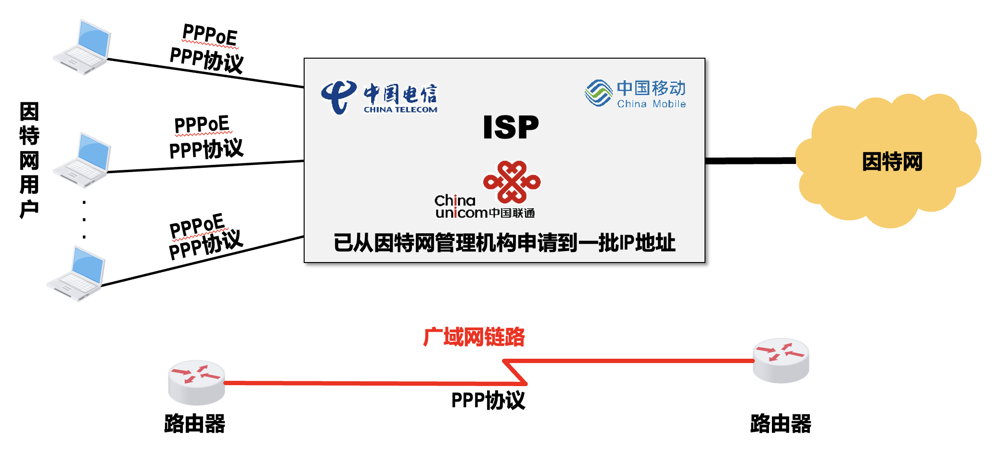

#### 帧格式

    

- **标志**(flag)字段：PPP 帧的定界符，取值为 0x7E
- **地址**(address)字段：取值为 OxFF，保留
- **控制**(control)字段：取值为 0x03，保留
- **协议**(protocol)字段：其值用来指明帧的数据载荷应向上交付给哪个协议处理
- **帧检验序列**(frame check sequence, **FCS**)字段：其值为使用 CRC 计算出的检错码
- 可能的 PDU 有：IP 数据报 / LCP 分组 / NCP 分组

#### 透明传输

面向字节的**异步**链路使用**字节填充**来实现透明传输。具体来说，帧的数据载荷中有若干**标志**(flag)字段，和 PPP 帧的定界符取值相等，为 0x7E。

    

- 发送方的处理：
    - 将数据载荷中出现的每一个 **0x7E** 减去 0x20（相当于异或 0x20），然后在其前面插入转义字符 Ox7D
    - 若数据载荷中原来就含有 **0x7D**，则把每一个 0x7D 减去 0x20，然后在其前面插入转义字符 0x7D
    - 将数据载荷中出现的每一个 ASCII 码**控制字符**（即数值小于 0x20 的字符），加上 0x20（相当于异或 0x20，将其转换成非控制字符），然后在其前面插入转义字符 0x7D
- 接收方的处理：进行与发送方相反的变换，就可以正确地恢复出未经过字节填充的原始数据载荷

---
面向比特的**同步**链路使用**零比特填充**来实现透明传输。

    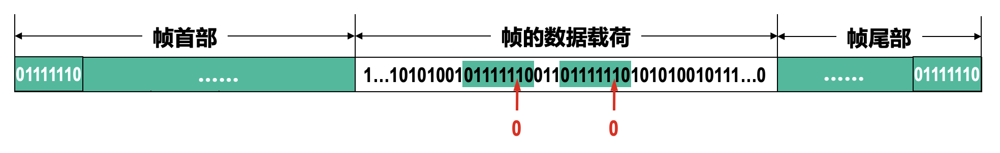

- 发送方的处理：对帧的数据载荷进行扫描（一般由硬件完成），**每出现 5 个连续的比特 1，则在其后填充一个比特 0**
- 接收方的处理：对帧的数据载荷进行扫描，**每出现 5 个连续的比特 1 时，就把其后的一个比特 0 删除**

#### 差错检测

- 利用帧中的 **FCS 字段**实现差错检测
- 该字段所采用的 **CRC 算法**的生成多项式为：$\text{CRC-CCITT} = x^{16} + x^{12} + x^5 + 1$。
- 接收方每收到一个 PPP 帧，就进行 CRC 检验；若 CRC 检验正确，就收下这个帧，否则就丢弃这个帧
- 因此使用 PPP 的数据链路层，向上提供的是**不可靠**数据传输服务

#### 工作状态

以用户主机拨号接入 ISP 的拨号服务器的过程为例：

    

### 共享式以太网

**以太网**(Ethernet)以曾经被假想的电磁波传播介质「以太」(Ether)来命名。

??? info "历史"

    

        
    

#### 网络适配器和 MAC 地址

要将计算机连接到以太网，需要使用相应的**网络适配器**(adapter)，网络适配器一般简称为「**网卡**」。网卡结构如下：

    

- 在计算机内部，网卡与 **CPU** 之间的通信，一般是通过计算机主板上的 I/O 总线以**并行传输**方式进行
- 网卡与**外部以太网**（局域网）之间的通信，一般是通过传输介质（同轴电缆、双绞线电缆、光纤）以**串行**方式进行的

    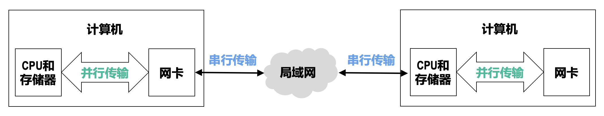

- 网卡除要实现**物理层**和**数据链路层**功能，其另外一个重要功能就是要进行**并行传输和串行传输的转换**
- 由于网络的传输速率和计算机内部总线上的传输速率并不相同，因此在网卡的核心芯片中都会包含**用于缓存数据的存储器**
- 在确保网卡硬件正确的情况下，为了使网卡正常工作，还必须要在计算机的操作系统中为网卡安装相应的**设备驱动程序**，它负责驱动网卡发送和接收帧

---
在点对点信道中，数据链路层不需要地址；但是在广播信道中，数据链路层必须使用地址作为唯一标识来区分各主机。在每个主机发送的帧的首部中，都携带有发送主机（源主机）和接收主机（目的主机）的**数据链路层地址**。由于这类地址是用于**介质访问控制**(medium access control，**MAC**)的，因此被称为 **MAC 地址**。

    

MAC 地址一般被固化在网卡的电可擦可编程只读存储器（**EEPROM**）中，因此 MAC 地址也被称为**硬件地址**或**物理地址**（跟“物理层”的“物理”没有任何关系）。

一般情况下，普通用户计算机中往往会包含两块网卡，一块是用于接入有线局域网的**以太网卡**，另一块是用于接入无线局域网的 **Wi-Fi 网卡**。每块网卡都有一个**全球唯一的 MAC 地址**。**交换机**和**路由器**往往具有更多的网络接口，所以会拥有更多的 MAC 地址。所以严格来说，MAC 地址是对网络上**各接口**的唯一标识，而不是对网络上各设备的唯一标识。

IEEE 802 局域网的 MAC 地址格式：

    

    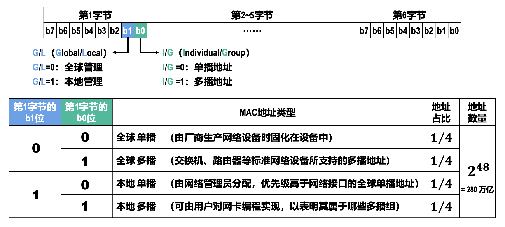

MAC 地址发送顺序：

- 字节发送顺序：第 1 字节 -> 第 6 字节
- 比特发送顺序：b0 -> b7

???+ example "例子"

    === "单播"

        

            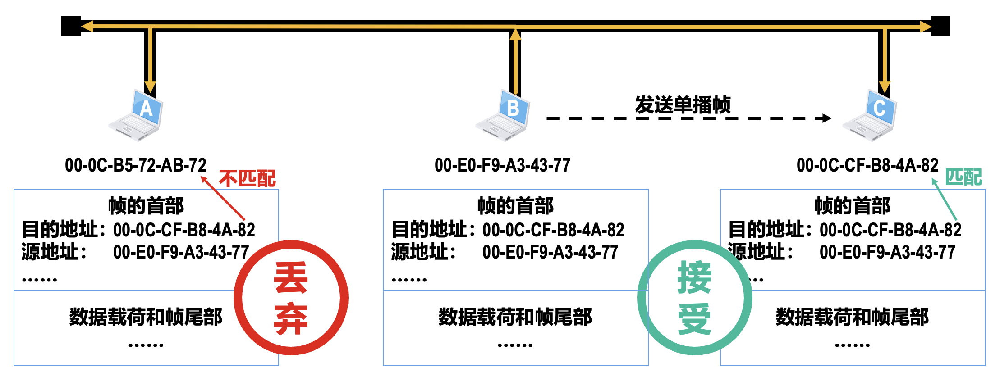
        

    === "广播"

        

            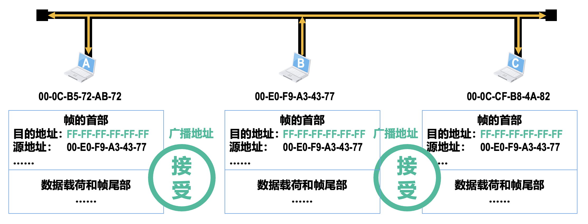
        

    === "多播"

        

            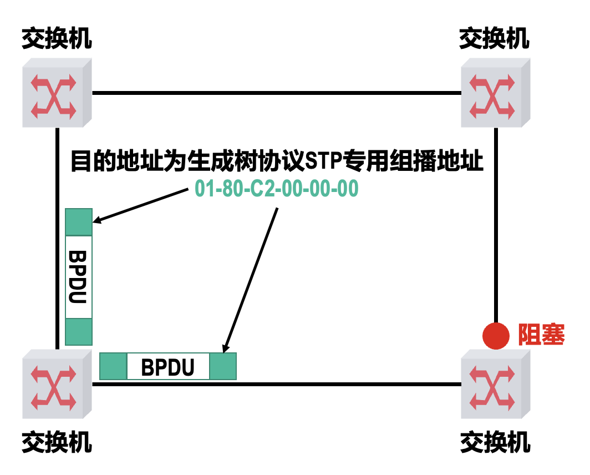
        

网卡从网络上每收到一个帧，就检查帧首部中的目的 MAC 地址，按以下情况处理：

1. 如果目的 MAC 地址是**广播**地址（`FF-FF-FF-FF-FF-FF`），则接受该帧
2. 如果目的 MAC 地址与网卡上固化的全球**单播** MAC 地址相同，则接受该帧
3. 如果目的 MAC 地址是网卡支持的**多播**地址，则接受该帧
4. 若不在上述三种情况中，则丢弃该帧

网卡还可被设置为一种特殊的工作方式：**混杂方式**(promiscuous mode)。工作在混杂方式的网卡，只要收到共享介质上传来的帧就会收下，而不管帧的目的 MAC 地址是什么。

- 对于网络维护和管理人员，这种方式可以监视和分析局域网上的流量，以便找出提高网络性能的具体措施
- **嗅探器**(sniffer)就是一种工作在混杂方式的网卡，再配合相应的工具软件（WireShark），就可以作为一种非常有用的网络工具来学习和分析网络
- 混杂方式就像一把“双刃剑”，黑客常利用这种方式非法获取网络用户的口令

全球单播 MAC 地址就如同身份证上的身份证号码，具有唯一性，它往往与用户个人信息绑定在一起。因此，用户应尽量确保自己拥有的全球单播 MAC 地址不被泄露。

为了避免用户设备连接 Wi-Fi 热点时 MAC 地址泄露的安全问题，目前大多数移动设备都已经采用了**随机 MAC 地址技术**。

???+ note "多路访问协议"

    - **随机访问协议**(random access protocol)：冲突不可避免
        - ALOHA
            - **纯 ALOHA**(additive links on-line Hawaii area)

                

                    
                

                >从咸鱼暄老师那[偷的图](https://www.yuque.com/xianyuxuan/coding/gez9yl#SDsAP)。

                - 原理：想发就发
                - 特点
                    - **冲突**：两个或以上的帧
                    - **随时**可能冲突
                    - 冲突的帧完全**破坏**
                    - 破坏了的帧要**重传**

            - **分隙 ALOHA**
                
                

                    
                

                - 把时间分成**时隙（时槽）**，时隙的长度对应一帧的传输时间
                - 帧的**发送**必须在时隙的**起点**
                - **冲突**只发生在时隙的**起点**

        - **CSMA**：「先听后发」
            - 非持续性 CSMA
                - 特点：
                    1. 经侦听，如果介质空闲，开始发送
                    2. 如果介质忙，则**等待一个随机分布的时间**，然后重复步骤 1

                - 好处：等待一个随机时间可以减少再次碰撞冲突的可能性
                - 缺点：**等待时间**内介质上如果没有数据传送，这段时间是浪费的

            - 持续性 CSMA
                - **1-持续性 CSMA**
                    - 特点
                        1. 经侦听，如介质空闲，则发送
                        2. 如介质忙，**持续侦听，一旦空闲立即发送**
                        3. 如果发生冲突，等待一个随机分布的时间再重复步骤 1

                    - 好处：持续式的延迟时间要少于非持续式
                    - 主要问题：如果两个以上的站等待发送，一旦介质空闲就一定会发生冲突
                    - **以太网的 CSMA/CD** 采用此方法

                - **p-持续性 CSMA**
                    - 特点：
                        1. 经侦听，如介质空闲，那么**以 p 的概率发送**，以 (1–p) 的概率延迟一个时间单元发送
                        2. 如介质忙，**持续侦听**，一旦空闲重复 1
                        3. 如果发送已推迟一个时间单元，再重复步骤 1 

                    - 1-持续式是 p-持续式的特例

    - **受控访问协议**(controlled access protocol)：克服了冲突
        - **位图协议**

            

                
            

            - 竞争期：在自己的时槽内发送竞争比特
                - **举手**示意
                - 资源预留
            - 传输期：按序**发送**
                - 明确的使用权，避免了冲突

        - **令牌传递**

            

                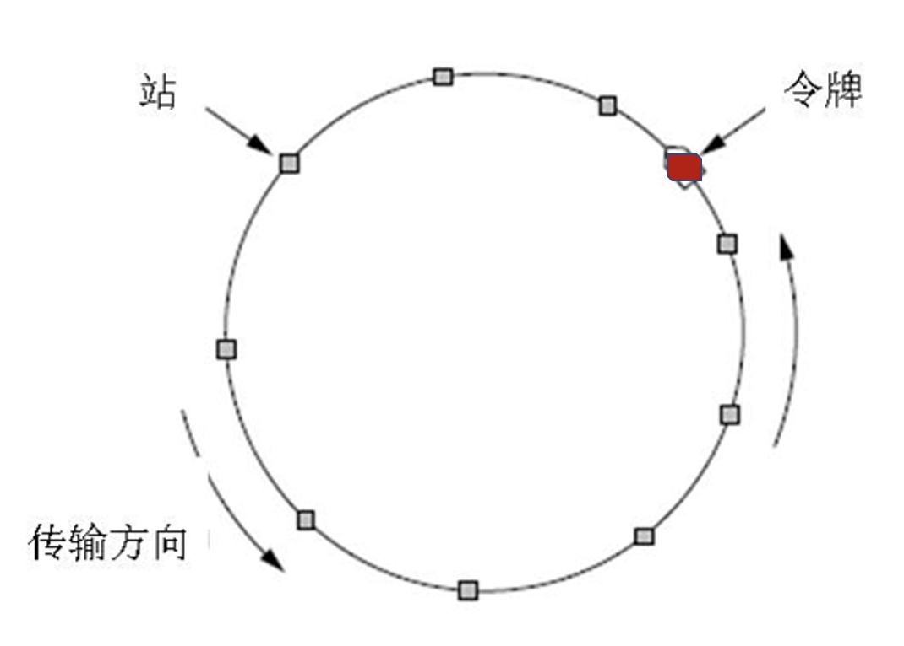
            

            - 令牌：发送权限
            - 令牌的运行：发送工作站去抓取，获得发送权
                - 除了**环**，令牌也可以运行在其它拓扑上，如**令牌总线**
            - 发送的帧需要目的站或发送站将其从共享信道上去除；防止无限循环
            - 缺点：令牌的维护代价

        - **二进制倒计数**

            

                
            

            - 站点：**编序号**，序号长度相同
            - 竞争期：有数据发送的站点从高序号到低序号排队，高者得到发送权
            - 特点：**高序号站点优先**

    - **有限竞争协议**(limited contention protocol)：利用上述二者的优势
        - **自适应树搜索协议**(adaptive tree walk protocol)

            

                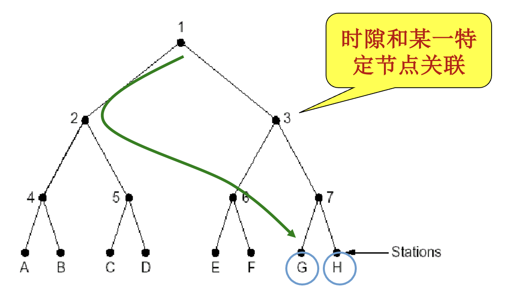
            

            - 在一次成功传输后的第一个竞争时隙，所有站点同时竞争
            - 如果只有一个站点申请，则获得信道
            - 否则在下一竞争时隙，有一半站点参与竞争（递归），下一时隙由另一半站点参与竞争
            - 即所有站点构成一棵**完全二叉树**（不是完美二叉树）

#### CSMA/CD 协议

??? info "历史背景"

    在以太网的发展初期，人们普遍认为“无源的电缆线比有源器件可靠”，因此将多个站点连接在一条总线上来构建**共享总线以太网**。它具有**天然的广播特性**，即使总线上某个站点给另一个站点发送单播帧，表示帧的信号也会沿着总线传播到总线上的其他各站点。

    

        
    

    当某个站点在总线上发送帧时，总线资源会被该站点独占。此时，如果总线上的其他站点也要在总线上发送帧，就会产生**信号碰撞**。所以共享总线以太网需要解决的一个重要问题是：如何协调总线上的各站点争用总线。

    

        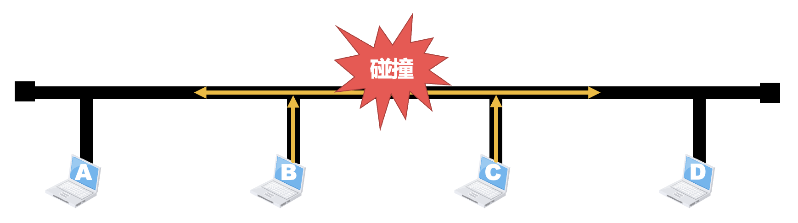
    

为了解决各站点争用总线的问题，共享总线以太网使用了一种专用协议 **CSMA/CD**（**载波监听多址接入/碰撞检测**(carrier sense multiple access / collision detection)）。该协议的基本原理为：

- **多址接入**（MA）：多个站点连接在一条总线上，竞争使用总线

    

        
    

- **载波监听**（CS）：每个站点在发送帧之前，先要检测一下总线上是否有其他站点在发送帧（“**先听后说**”）
    - 若检测到总线**空闲** 96 比特时间（发送 96 比特所耗费的时间，也称为**帧间最小间隔**），则发送这个帧
    - 若检测到总线**忙**，则继续检测并等待总线转为空闲 96 比特时间，然后发送这个帧

    

        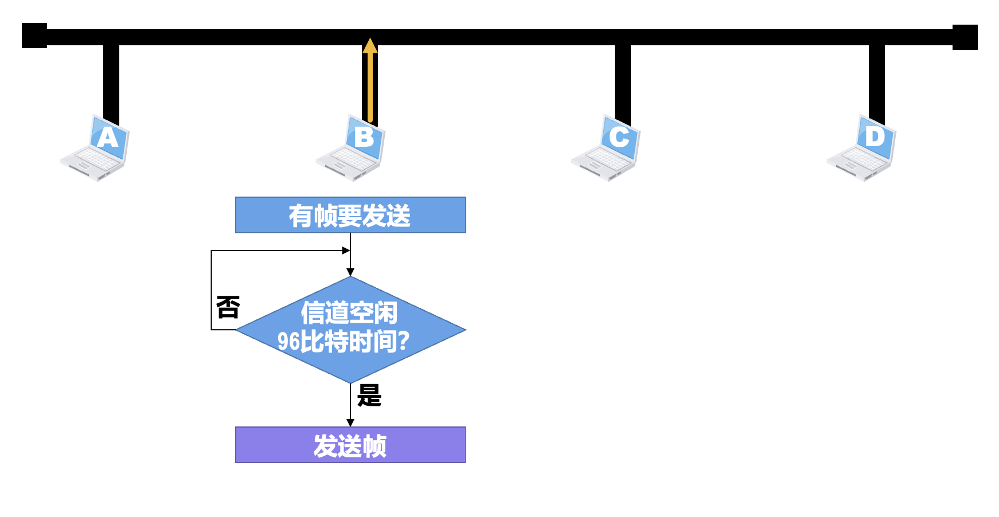
    

- **碰撞检测**（CD）：每个正在发送帧的站点边发送边检测碰撞（“**边说边听**”）
    - 一旦发现总线上出现碰撞，立即停止发送，**退避一段随机时间**后再次从载波监听开始进行发送

    

        
    

    - **强化碰撞**：发送帧的站点一旦检测到碰撞，除了立即停止发送帧外，还要再继续发送 32 比特或 48 比特的人为**干扰信号**(jamming signal)，以便有足够多的碰撞信号使所有站点都能检测出碰撞
    
!!! note "注"

    - 使用 CSMA/CD 协议的共享总线以太网上的各站点，只是尽量避免碰撞并在出现碰撞时做出退避后重发的处理，但**不能完全避免碰撞**
    - 在使用 CSMA/CD 协议时，由于正在发送帧的站点必须“边发送帧边检测碰撞”，因此站点不可能同时进行发送和接收，也就是不可能进行全双工通信，而只能进行**半双工通信**（双向交替通信）

---
使用 CSMA/CD 协议的共享总线以太网上的任意站点在发送帧的过程中都可能会遭遇碰撞。那么某个站点从发送帧开始，最长要经过多长时间，才能检测出自己发送的帧与其他站点发送的帧产生了碰撞？下面就来详细分析。

    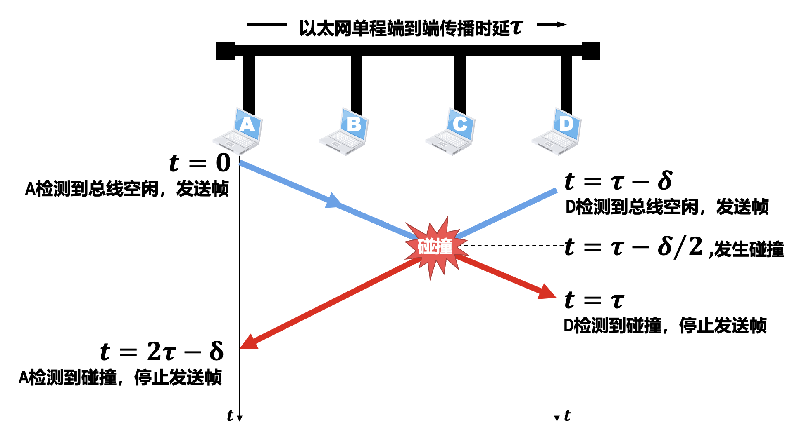

    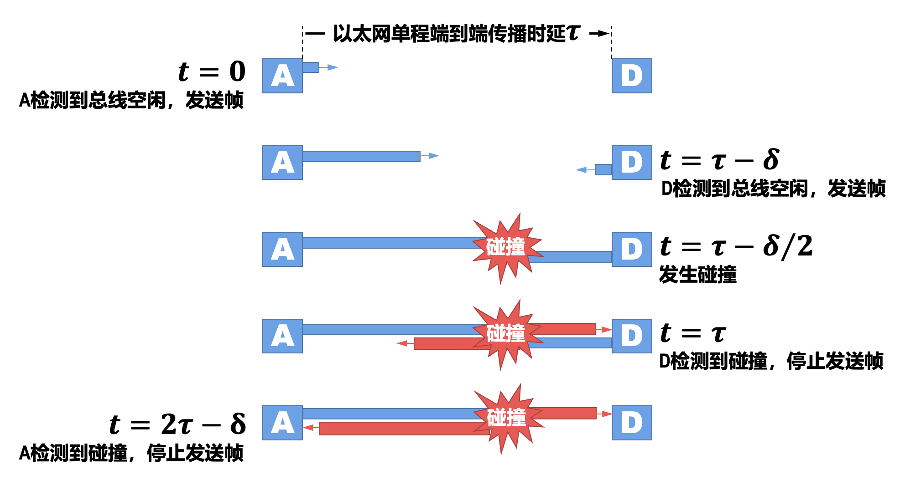

综上，站点从发送帧开始，最多经过时长 $2 \tau$（即 $\delta \rightarrow 0$）就可检测出所发送的帧是否遭遇了碰撞；这段端到端往返时间被称为**争用期**(contention period)或**碰撞窗口**(collision window)。站点从发送帧开始，经过争用期后还没有检测到碰撞，就可以肯定这次发送不会产生碰撞。

从争用期的概念可以看出，共享总线以太网上的每一个站点从发送帧开始，到之后的一小段时间内，都有可能遭遇碰撞，而这一小段时间的长短是不确定的，它取决于**另一个发送帧的站点与本站点的距离**，但不会超过总线的端到端往返传播时延，即一个争用期。很显然，**总线的长度越长**（单程端到端传播时延越大），**网络中站点数量越多**，发生碰撞的概率就越大。因此，共享以太网的总线长度不能太长，接入的站点数量也不能太多。

10 Mb/s 共享总线以太网（传统以太网）规定：争用期的值为 512 比特的发送时间，即 51.2 μs。

- 除考虑了信号传播时延外，还考虑到网络中可能存在转发器所带来的时延以及产生碰撞时继续发送 32 比特或 48 比特人为干扰信号所持续的时间等
- 共享总线以太网规定：总线长度不能超过 2500m

---
为了确保共享总线以太网上的每一个站点在发送完一个完整的帧之前，能够检测出是否产生了碰撞，**帧的发送时延就不能少于一个争用期**。对于 10 Mb/s 的共享总线以太网，其**最小帧长为 512b，即 64B**。

- 当某个站点在发送帧时，如果帧的前 64B 没有遭遇碰撞，那么帧的后续部分也就不会遭遇碰撞；也就是说，如果遭遇碰撞，就一定是在帧的前 64B 之内
- 由于发送帧的站点边发送帧边检测碰撞，一旦检测到碰撞就立即中止帧的发送，此时已发送的数据量一定小于 64B；因此，接收站点收到长度小于 64B 的帧，就可判定这是一个遭遇了碰撞而异常中止的无效帧，将其丢弃即可

一般来说，帧的数据载荷的长度应远大于帧首部和尾部的总长度，这样可以提高帧的传输效率。然而，如果不限制数据载荷的长度上限，就可能使得帧的长度太长，这会带来一些问题。

    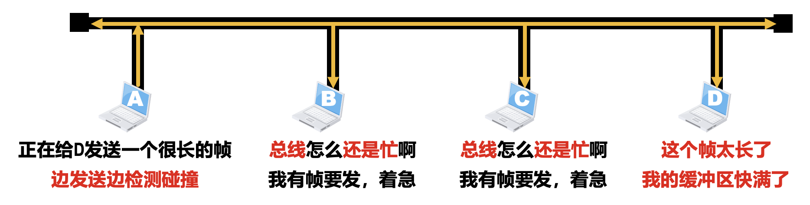

???+ example "例子"

    

        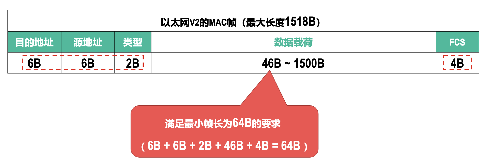
    

---
在使用 CSMA/CD 协议的共享总线以太网中，正在发送帧的站点一边发送帧一边检测碰撞，当检测到碰撞时就立即停止发送，**退避一段随机时间后**再重新发送。各站点采用**截断二进制指数退避**(truncated binary exponential backoff)算法来选择退避的随机时间。

    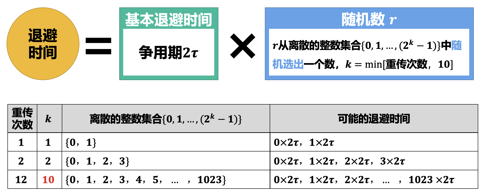

- 如果连续多次发送碰撞，就表明可能有较多的站点参与竞争信道。但使用上述退避算法可使重传需要推迟的平均时间随重传次数而增大（即**动态退避**），因而减小产生碰撞的概率
- 当重传达 16 次仍不能成功时，就表明同时打算发送帧的站点太多，以至于连续产生碰撞，此时应**放弃重传**并向高层报告

---

    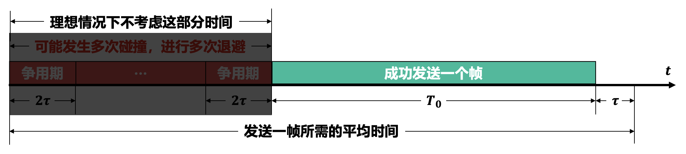

考虑以下这种理想情况：

- 总线一旦空闲就有某个站点立即发送帧
- 各站点发送帧都不会产生碰撞
- 发送一帧占用总线的时间为 $T_0 + \tau$，而帧本身的发送时间是 $T_0$

    

#### 使用集线器的共享式以太网

??? info "集线器"

    在早期，以太网使用一种以大规模集成电路来替代总线、并且可靠性非常高的设备，叫作**集线器**(hub)；站点连接到集线器的传输介质也转而使用更便宜、更灵活的**双绞线电缆**。

    

        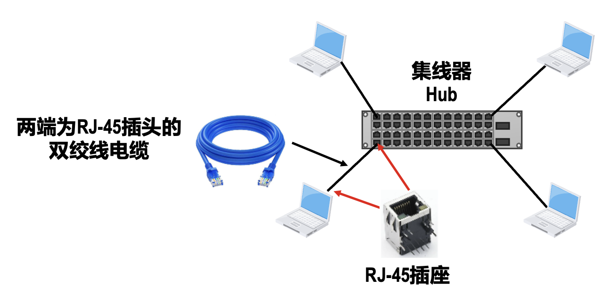
    

    集线器的特点：

    - 使用集线器的以太网虽然物理拓扑是星型的，但在逻辑上仍然是一个**总线**网；总线上的各站点共享总线资源，使用的还是 **CSMA/CD 协议**
    - 集线器**只工作在物理层**，它的每个接口仅简单地转发比特，并不进行碰撞检测；碰撞检测的任务由各站点中的网卡负责
    - 集线器一般都有**少量的容错能力和网络管理功能**；例如，若网络中某个站点的网卡出现了故障而不停地发送帧，集线器可以检测到这个问题，在内部断开与出故障网卡的连线，使整个以太网能正常工作

IEEE 于 1990 年制定了 **10BASE-T** 星型以太网的标准 **802.3i**，这种以太网是局域网发展史上的一座非常重要的里程碑，它为以太网在局域网中的统治地位奠定了牢固的基础。

    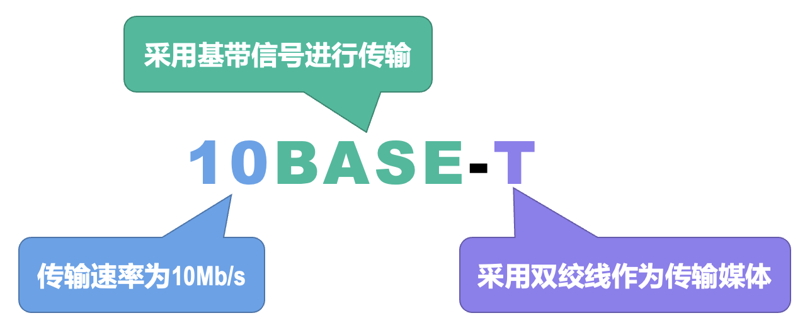

- 10BASE-T 以太网的通信距离较短，**每个站点到集线器的距离不能超过 100m**
- IEEE 802.3 以太网还可使用**光纤**作为传输介质，相应的标准为 **10BASE-F**，其中 "F" 表示光纤，主要用作集线器之间的远程连接

#### 在物理层扩展以太网

共享总线以太网中两站点之间的距离不能太远，否则它们之间所传输的信号就会衰减到使 CSMA/CD 协议无法正常工作。

在早期广泛使用粗同轴电缆或细同轴电缆共享总线以太网时，为了提高网络的地理覆盖范围，常用的是工作在物理层的**转发器**。IEEE 802.3 标准规定，两个网段可用一个转发器连接起来，任意两个站点之间最多可以经过三个网段。

    

随着使用双绞线和集线器的 10BASE-T 星型以太网成为以太网的主流类型，扩展网络覆盖范围就很少使用转发器了。

10BASE-T 星型以太网中，每个站点到集线器的距离不能超过 100m，因此两站点间的通信距离最大不能超过 200m。一般使用**光纤**和一对**光纤调制解调器**来扩展站点与集线器之间的距离。

- 这种扩展方法比较简单，但所需付出的代价是：为站点和集线器各增加一个用于电信号和光信号转换的光纤调制解调器，以及它们之间的一对通信光纤
- 由于信号在光纤中的衰减和失真很小，因此使用这种方法可以很简单地将站点与集线器之间的距离扩展到 1000m 以上

    

---
以太网集线器一般具有 8~32 个接口，如果要连接的站点数量超过了单个集线器能够提供的接口数量，就需要使用多个集线器，这样就可以连接成覆盖更大范围、连接更多站点的多级星型以太网。采用**多个集线器连接而成的多级星型以太网**，在扩展了网络覆盖范围和站点数量的同时，也带来了一些负面因素。

    

在物理层扩展的共享式以太网仍然是一个碰撞域，不能连接太多的站点，否则可能会出现大量的碰撞，导致平均吞吐量太低。

#### 在数据链路层扩展以太网

**网桥**(bridge)工作在数据链路层（包含其下的物理层），因此网桥具备属于**数据链路层**范畴的相关能力。

- 可以识别帧的结构
- 可以根据帧首部中的目的 MAC 地址和网桥自身的帧转发表来转发或丢弃所收到的帧

    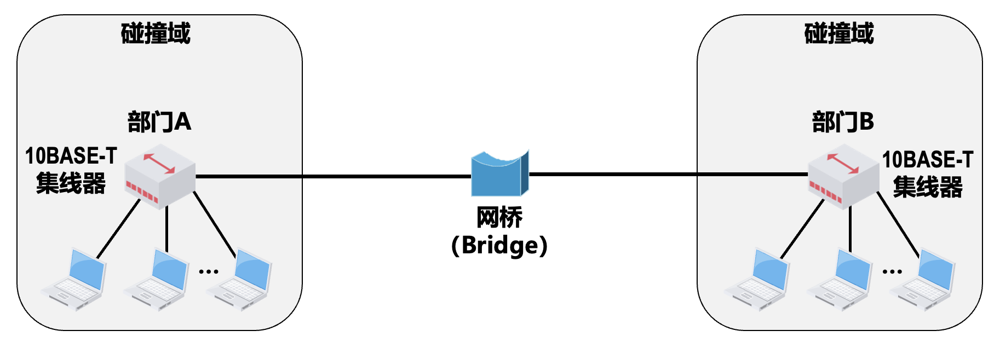

网桥的主要结构：

    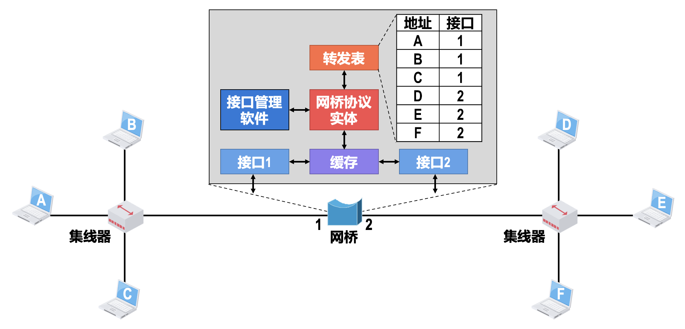

网桥的接口在向其连接的网段转发帧时，会执行相应的介质访问控制协议，对于共享式以太网就是 **CSMA/CD 协议**。

???+ example "例子"

    === "Case 1"

        

            
        

    === "Case 2"

        

            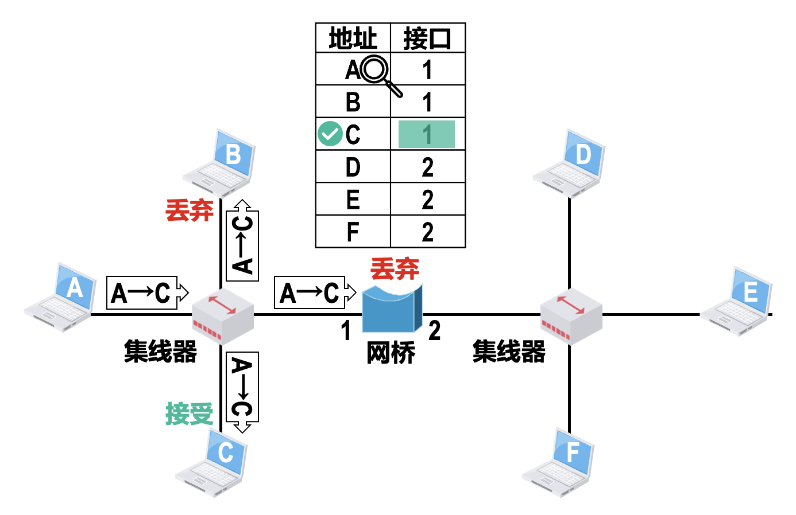
        

    === "Case 3"

        

            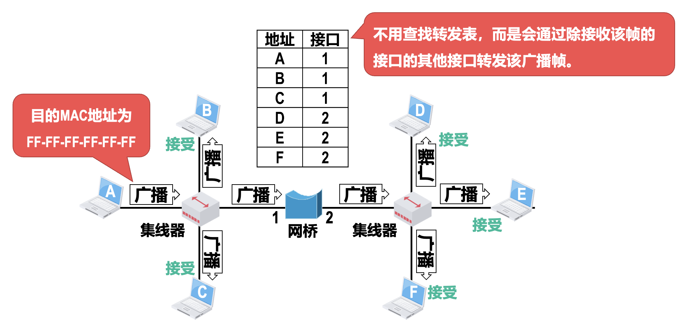
        

**透明网桥**(transparent bridge)通过**自学习算法**建立转发表。

- 透明网桥中的「**透明**」，是指以太网中的各站点并不知道自己所发送的帧将会经过哪些网桥的转发，最终到达目的站点；也就是说，**以太网中的各网桥对于各站点而言是看不见的**
- 透明网桥的标准是 **IEEE 802.1D**

具体流程为：

1. 网桥收到帧后进行**登记**（即**自学习**），登记的内容为帧的**源 MAC 地址**和进入网桥的**接口号**
2. 网桥根据帧的**目的 MAC 地址**和网桥的**转发表**对帧进行**转发**，包含以下三种情况：
    - **明确转发**：网桥知道应当从哪个接口转发帧
    - **盲目转发**：网桥不知道应当从哪个接口转发帧，只能将其通过除进入网桥的接口外的其他所有接口转发
    - **丢弃**：网桥知道不应该转发该帧，将其丢弃
    
!!! warning "注意"

    - 如果网桥收到有**误码的帧**则直接**丢弃**
    - 如果网桥收到一个无误码的**广播帧**，则不用进行查表，而是直接从除接收该广播帧的接口的**其他接口**转发该广播帧
    - 转发表中的每条记录都有其**有效时间**，**到期自动删除**，这是因为各站点的MAC地址与网桥接口的对应关系并不是永久性的
        - 例如某个站点更换了网卡，其 MAC 地址就会改变

??? example "例子"

    === "盲目转发"

        

            
        

    === "明确转发"

        

            
        

    === "丢弃"

        

            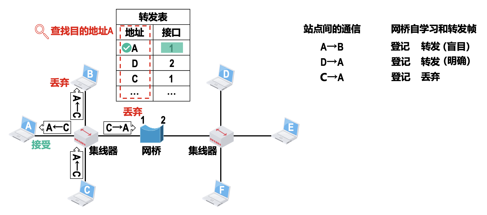
        

为了提高以太网的**可靠性**，有时需要在两个以太网之间使用多个透明网桥来提供**冗余链路**。但在增加冗余链路提高以太网可靠性的同时，却给网络引入了**环路**：网络中的广播帧将在环路中永久兜圈，造成广播帧充斥整个网络，网络资源被白白浪费，而网络中的主机之间无法正常通信。

    

为了避免这一问题，透明网桥使用**生成树协议**(spanning tree protocol, **STP**)，可以在增加冗余链路提高网络可靠性的同时，又避免环路带来的问题。

- 不管网桥之间连接成了怎样复杂的带环拓扑，网桥之间通过**交互网桥协议单元**(bridge protocol data unit，**BPDU**)，找出原网络拓扑的一个连通子集（即**生成树**），在这个子集里整个连通的网络中不存在环路
- 当首次连接网桥或网络拓扑发生变化时（人为改变或出现故障），网桥都会重新构造生成树，以确保网络的连通

    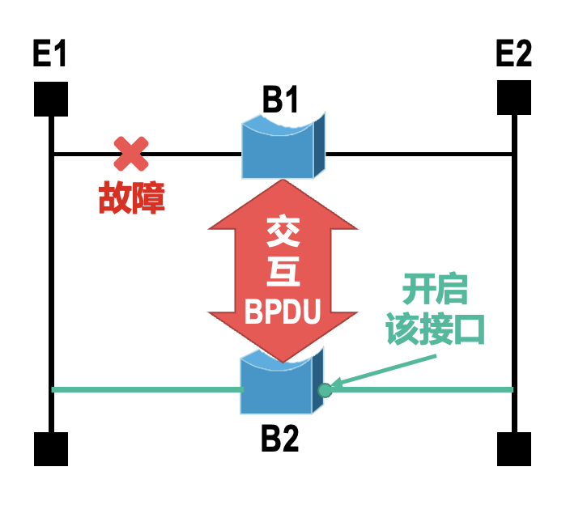

### 交换式以太网

网桥的接口数量很少，通常只有 2~4 个，一般只用来连接不同的网段。1990 年面世的**交换式集线器**(switching hub)，实质上是具有多个接口的网桥，常称为**以太网交换机**(switch)或二层交换机。

- “二层”是指以太网交换机工作在**数据链路层（包括物理层）**
- 与网桥相同，交换机内部的转发表也是通过**自学习算法**，基于网络中各主机间的通信，自动地逐步建立起来的
- 另外，交换机也使用 **STP**，来产生能够连通全网但不产生环路的通信路径

仅使用交换机（而不使用集线器）的以太网就是**交换式以太网**。

    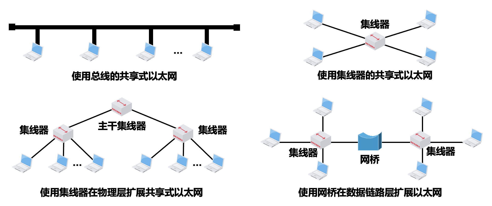

    

---
交换机的每个接口可以连接计算机，也可以连接集线器或另一个交换机。

- 当交换机的接口与**计算机**或**交换机**连接时，可以工作在**全双工**方式，并能在自身内部同时连通多对接口，使每一对相互通信的计算机都能像独占传输介质那样，无碰撞地传输数据，这样就**不需要使用 CSMA/CD 协议**了
- 当交换机的接口连接的是**集线器**时，该接口就只能使用 CSMA/CD 协议，并只能工作在**半双工**方式
- 现在的交换机和计算机中的网卡都能自动识别上述两种情况，并自动切换到相应的工作方式

    

交换机一般都具有多种速率的接口，例如 10Mb/s、100Mb/s、1Gb/s 甚至 10Gb/s 的接口，大部分接口支持多速率自适应。

- 一般的交换机都采用“**存储转发**”方式
- 为了减小交换机的转发时延，某些交换机采用了**直通**(cut-through)的交换方式
    - 这类交换机在接收帧的同时就立即按帧的目的 MAC 地址决定该帧的转发接口，然后通过其内部基于硬件的交叉矩阵进行转发，而不必把整个帧先缓存后再进行处理
    - 因此直通交换的**时延非常小**
    - 然而，由于**不检查差错**就直接将帧转发出去，有可能会将一些无效帧转发给其他主机

#### 共享式以太网 vs 交换式以太网

??? example "例子"

    === "Case 1"

        

            
        

    === "Case 2"

        

            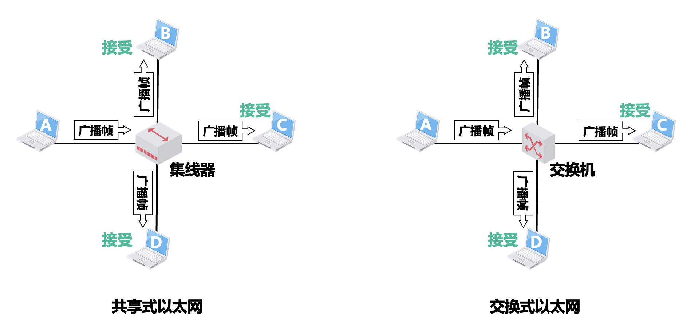
        

    === "Case 3"

        

            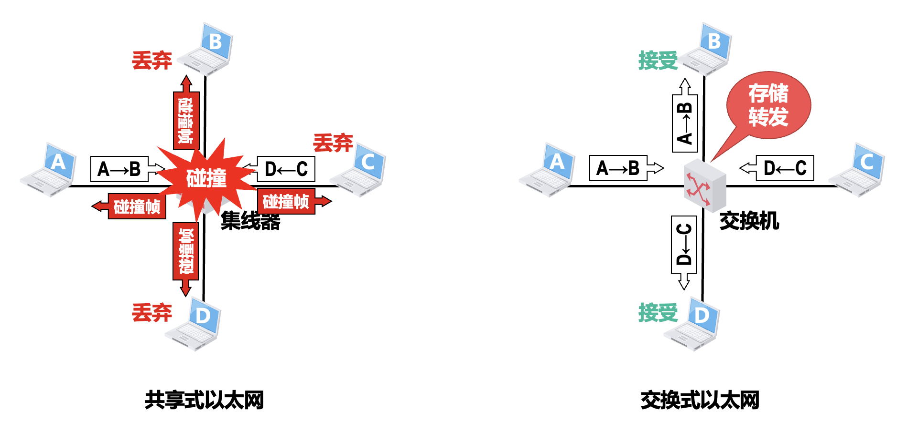
        

    

综上，**交换式以太网**的网络性能远高于共享式以太网，集线器早已被交换机取代。

### 以太网的 MAC 帧格式

    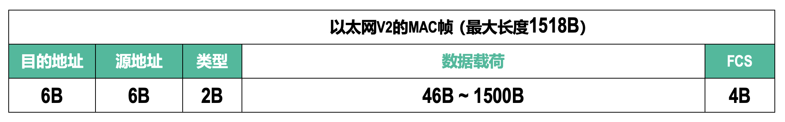

各字段含义：

- 目标地址/源地址：用来填入帧的目的 MAC 地址和源 MAC 地址
- 类型：其值用来指明**数据载荷**中的内容是由上一层的哪个**协议**封装的，以便将收到的 MAC 帧的数据载荷上交给上一层的这个协议
    - 0x0800：TCP/IP 网际层 IP 协议
    - 0x8137：Novell 网络层 IPX 协议

- FCS：使用 **CRC** 生成的帧检验序列 FCS，接收方的网卡通过 FCS 的内容就可检测出帧在传输过程中是否产生了误码
- 数据载荷：满足最小帧长为 64B 的要求，并且最大长度限制在 1500B

MAC 帧进入物理层后还会加一个 8 字节的前导码：

    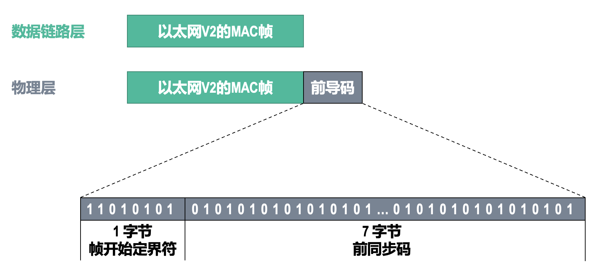

接收方可能收到的无效 MAC 帧包括以下几种：

- MAC 帧的长度不是整数个字节
- 通过 MAC 帧的 FCS 字段的值检测出帧有误码
- MAC 帧的长度不在 64~1518 字节之间

接收方收到无效的 MAC 帧时，就简单将其**丢弃**，因为以太网的数据链路层没有重传机制。

### 虚拟局域网

??? info "诞生背景"

    交换式以太网中的所有站点都属于同一个广播域。随着交换式以太网规模的扩大，广播域也相应扩大。但巨大的广播域会带来一系列问题。

    - 广播风暴：浪费网络资源和各主机的 CPU 资源
    - 难以管理和维护，带来潜在的安全问题

    

        
    

    - TCP/IP 协议栈中的很多协议都会使用广播：
        - 地址解析协议 ARP
        - 路由信息协议 RIPv1
        - 动态主机配置协议 DHCP

    - NetBEUI：Windows 下使用的广播型协议
    - IPX/SPX：Novell 网络的协议栈
    - Apple Talk：Apple 公司的网络协议栈

    解决方案是**分隔广域网**。一种方法是使用路由器可以隔离广播域，但成本太高。于是**虚拟局域网**技术应运而生。

**虚拟局域网**(virtual local area network，**VLAN**)是一种将局域网内的站点划分成**与物理位置无关的逻辑组**的技术，一个逻辑组就是一个 VLAN，VLAN 中的各站点具有某些共同的应用需求。

    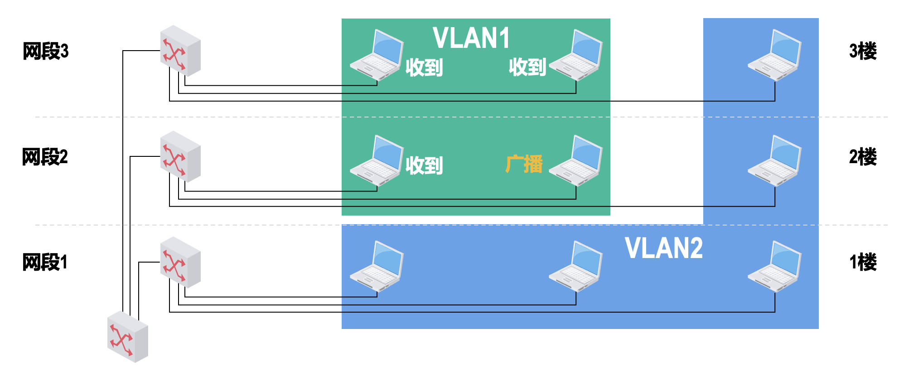

- 属于同一 VLAN 的站点之间可以直接进行通信，而不同 VLAN 中的站点之间不能直接通信
- 网络管理员可对局域网中的各交换机进行配置来建立多个逻辑上独立的 VLAN
- 连接在同一交换机上的多个站点可以属于不同的 VLAN，而属于同一 VLAN 的多个站点可以连接在不同的交换机上
- VLAN 并不是一种新型网络，它只是局域网能够提供给用户的一种服务

VLAN 的实现机制：最常见的就是**基于以太网交换机的接口**来实现 VLAN，这就需要以太网交换机能够实现以下两个功能：

- 能够处理带有VLAN标记的帧，也就是 **IEEE 802.1Q 帧**
    - 它对以太网 V2 的 MAC 帧格式进行了扩展：在源地址字段和类型字段之间插入了 4 字节的 **VLAN 标签**(tag)字段

        

            
        

        - **标签协议标识符（TPID）**：长度为 16 比特，其值固定为 0x8100，表示该帧是 IEEE 802.1Q 帧
        - **优先级（PRI）**：长度为 3 比特，取值范围是 0~7，值越大优先级越高；当网络阻塞时，设备优先发送优先级高的 802.1Q 帧
        - **规范格式指示符（CFI）**：长度为 1 比特，取值为 0 表示 MAC 地址以规范格式封装，取值为 1 表示 MAC 地址以非规范格式封装；对于以太网，CFI 的取值为0
        - **虚拟局域网标识符（VID）**：长度为 12 比特，取值范围是 0~4095，其中 0 和 4095 保留不使用
            - VID 是 802.1Q 帧所属 VLAN 的编号，设备利用 VID 来识别帧所属的 VLAN
            - 广播帧只在同一 VLAN 内转发，这样就**将广播域限制在了一个 VLAN 内**

    - 802.1Q 帧一般不由用户主机处理，而是由**以太网交换机**来处理：
        - 当交换机收到普通的以太网 MAC 帧时，会给其插入 4 字节的 VLAN 标签使之成为 802.1Q 帧，该处理简称为“**打标签**”
        - 当交换机转发 802.1Q 帧时，**可能**会删除其 4 字节的 VLAN 标签使之成为普通的以太网 MAC 帧，该处理简称为“**去标签**”；交换机转发 802.1Q 帧时也有可能不进行“去标签”处理，是否进行“去标签”处理取决于交换机的接口类型
    
- 交换机的各接口可以支持**不同的接口类型**，不同接口类型的接口对帧的处理方式有所不同
    - 根据接口在接收帧和发送帧时对帧的处理方式的不同，以及接口连接对象的不同，以太网交换机的接口类型一般分为 **Access** 和 **Trunk** 两种
    - 当以太网交换机上电启动后，若之前未对其各接口进行过 VLAN 的相关设置，则各接口的接口类型**默认为 Access**，并且各接口的缺省 VLAN ID 为 1，即各接口**默认属于 VLAN1**
        - 对于思科交换机，接口的缺省 VLAN ID 称为**本征 VLAN**(native VLAN)
        - 对于华为交换机，接口的缺省 VLAN ID 称为**端口 VLAN ID**，简记为 **PVID**；交换机的每个接口有且仅有一个 PVID

    - **Access 接口**：一般用于连接用户**计算机**
        - 由于其只能属于一个 VLAN，因此其 PVID 值与其所属 VLAN 的 ID 相同，其默认值为 1
        - **接收**处理：一般只接受“未打标签”的**普通以太网 MAC 帧**，根据接收帧的接口的 PVID 给帧“**打标签**”，即插入 4 字节的 VLAN 标签字段，VLAN 标签字段中的 VID 取值就是接口的 PVID 值
        - **转发**处理：若帧中的 VID 值与接口的 PVID 值相等，则给帧“**去标签**”后再进行转发，否则不转发帧。因此，从 Access 接口转发出的帧，是不带 VLAN 标签的普通以太网 MAC 帧

    - **Trunk 接口**：一般用于**交换机**之间的互连
        - 该接口可以属于多个 VLAN，即可以通过属于不同 VLAN 的帧
        - 默认 PVID 值为 1，一般不建议用户修改；若互连的 Trunk 接口的 PVID 值不相等，则可能出现转发错误
        - **接收**处理：既可以接收“未打标签”的**普通以太网 MAC 帧**，也可以接收“已打标签”的 **802.1Q 帧**；若接收到普通以太网 MAC 帧时，根据接收帧的接口的 PVID 给帧“**打标签**”，这与 Access 接口的处理相同
        - **转发**处理：对于帧的 VID 值等于接口的 PVID 值的 802.1Q 帧，将其“**去标签**”转发；对于帧的 VID 值不等于接口的 PVID 值 802.1Q 帧，将其**直接转发**。因此，从 Trunk 接口转发出的帧，可能是普通以太网 MAC 帧，也可能是 802.1Q 帧
        
    - **Hybrid 接口**：华为交换机私有的接口类型
        - 既可以用于交换机之间的互连（与 Trunk 接口相同），也可用于交换机与用户计算机之间的互连（与 Access 接口相同）
        - 除此之外，Hybrid 接口的绝大部分功能与 Trunk 接口相同，不同点在于 Hybrid 接口的转发处理：Hybrid 接口会查看帧的 VID 值是否在接口的“去标签”列表中，若存在则“去标签”后转发，若不存在则直接转发

??? example "例子"

    === "例 1"

        一个交换机上不进行人为的 VLAN 划分，交换机各接口默认属于 VLAN1 且类型为 Access 的情况。

        

            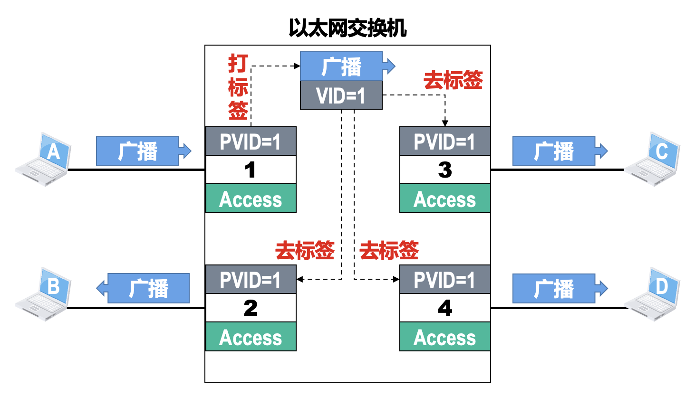
        

    === "例 2"

        在一个交换机上划分两个不同 VLAN 的情况。对交换机进行配置（通过界面或配置命令）：

        - 创建 VLAN2 和 VLAN3

            

                
            

        - 将接口 1 和 2 划归到 VLAN2，接口 3 和 4 划归到 VLAN3

            

                
            

    === "例 3"

        两个交换机通过 Trunk 类型的接口互连，Trunk 接口将 802.1Q 帧直接转发的情况。

        

            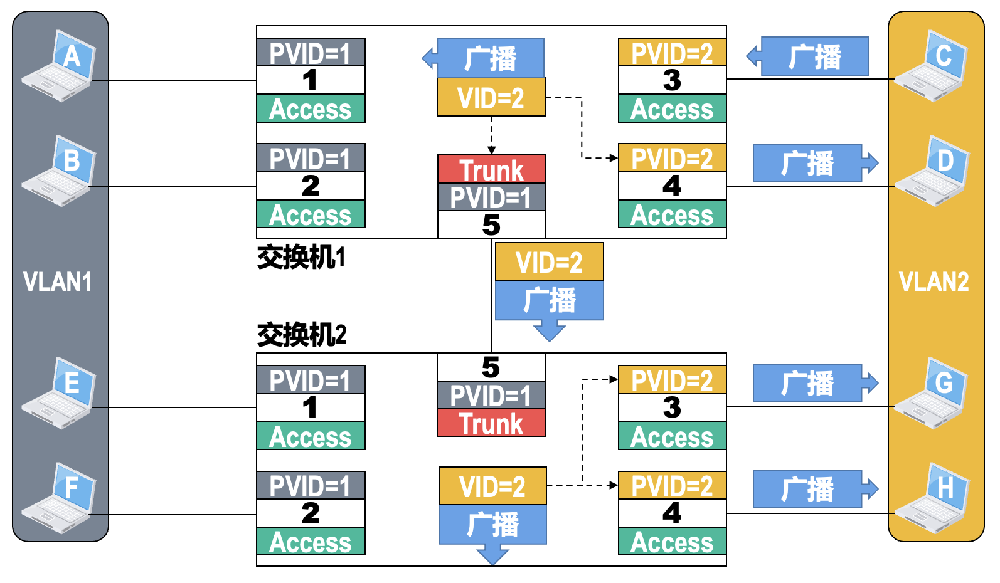
        

### 以太网的发展

略

### 802.11 无线局域网

#### 组成

随着移动通信技术的发展，**无线局域网**(wireless local area network，**WLAN**)自 20 世纪 80 年代末以来逐步进入市场。IEEE 于 1997 年制定出了无线局域网的协议标准 **802.11**。这是目前应用最广泛的无线局域网之一，人们更多地将其简称为 **Wi-Fi**（wireless fidelity，无线保真度）。

???+ info "固定基础设施"

    - 预先建立的、能够覆盖一定地理范围的、多个固定的通信基站
    - 802.11 无线局域网使用最多的是它的固定基础设施的组网方式

802.11 无线局域网可分为以下两类：

- 有固定基础设施的
    - **基本服务集**（BSS）

        

            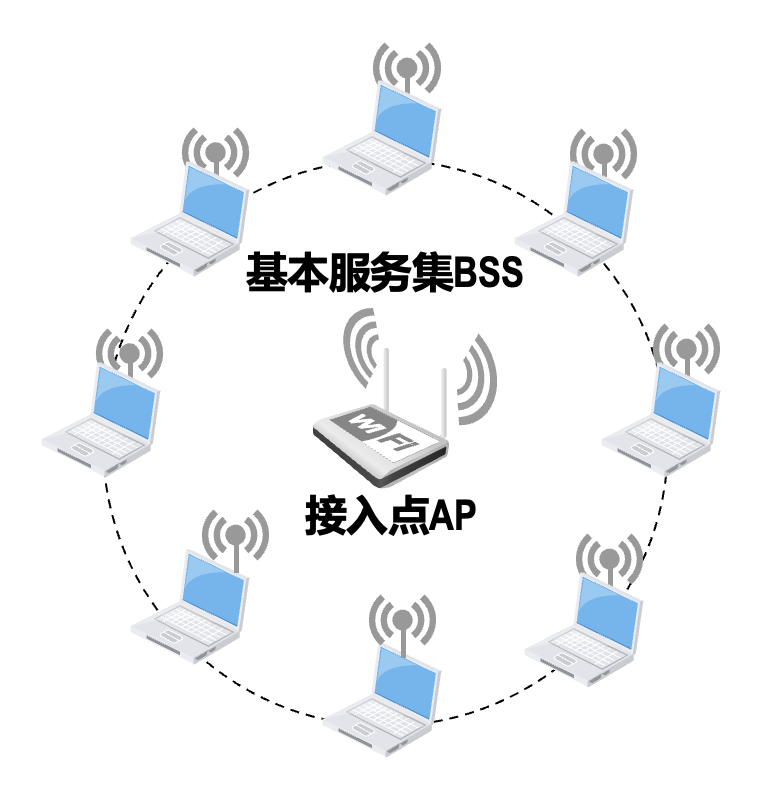
        

        - BSS 内各站点之间的通信以及与 BSS 外的站点之间的通信，都必须经过 BSS 内的接入点(access point, **AP**)进行转发
        - 网络管理员需要为 AP 分配一个最大 32 字节的**服务集标识符**(service set identifier，**SSID**)和一个**无线通信信道**；SSID 实际上就是使用该 AP 的 802.11 无线局域网的名字
    
    - **扩展服务集**（ESS）

        

            
        

    - 802.11标准并没有定义实现漫游的具体方法，仅定义了以下一些基本服务
        - **关联**(association)服务：移动站与 AP 建立关联的方法有**被动扫描**和**主动扫描**两种

            

                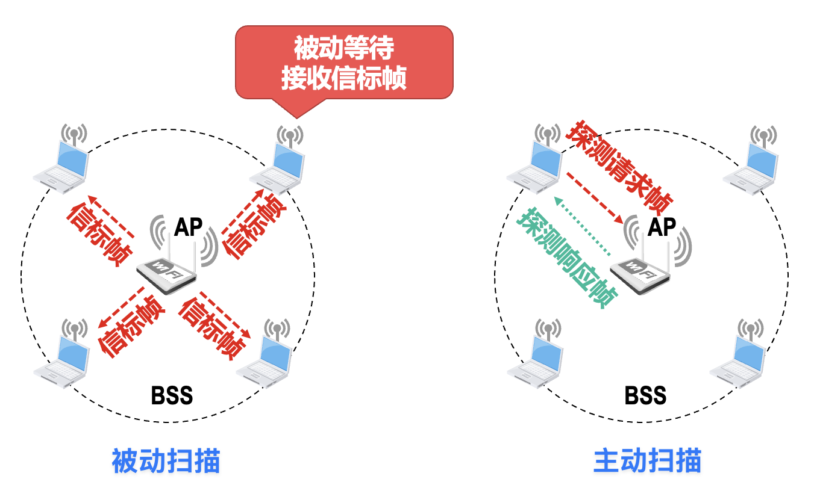
            

            - **信标帧**(beacon frame)：包含 SSID、AP 的 MAC 地址、支持速率、加密算法和安全配置等参数
            
        - **重建关联**(reassociation)服务和**分离**(dissociation)服务：
            - 如果一个移动站要把与某个 AP 的关联转移到另一个 AP，就可以使用重建关联服务
            - 若要终止关联服务，就应使用分离服务
        
- 无固定基础设施的：**自组织网络**(ad hoc network)

    

        
    

    - **转发站**需要具备**路由**功能
    - 自组织网络组网方便，不需要基站，并且具有非常好的生存性，这使得自组织网络在军用和民用领域都有很好的应用前景
    - 802.11 无线局域网的 ad hoc 模式允许网络中的各站点在其通信范围内直接通信，也就是支持站点间的**单跳**通信，而标准中并没有包括多跳路由功能，因此该模式应用较少

#### 物理层

- 802.11 无线局域网的物理层非常复杂，依据工作频段、调制方式、传输速率等，可将其分为多种物理层标准
- 802.11 无线网卡一般会被做成**多模的**，以便能适应多种不同的物理层标准
- 无线局域网最初还使用**红外技术**(infrared，IR)和**跳频扩频**(frequency hopping spread spectrum，FHSS)技术，但目前已经很少使用了

#### CSMA/CA 协议

无线局域网采用了另一种称为 **CSMA/CA** 的协议，即**载波监听多址接入/碰撞避免**(carrier sense multiple access/collision avoidance)。相比 CSMA/CD 协议仅将碰撞检测改成了碰撞避免；但实际上并不能避免所有的碰撞，而是尽量减少碰撞发生的概率。

???+ info "不采用碰撞检测的原因"

    - 由于无线信道的传输环境复杂且信号强度的动态范围非常大，在 802.11 无线网卡上接收到的信号强度一般都远远小于发送信号的强度，信号强度甚至相差百万倍；因此，如果要在 802.11 无线网卡上实现碰撞检测，**对硬件的要求非常高**
    - 即使能够在硬件上实现碰撞检测功能，但由于无线电波传播的特殊性（存在**隐蔽站问题**），还会出现无法检测到碰撞的情况，因此实现碰撞检测并没有意义

        

            
        

CSMA/CA 协议的基本工作原理：

    

- **DCF**（**分布式协调功能**(distributed coordination function)）
    - 帧间间隔 **DIFS** 的长度为 128 μs，用来发送数据帧和管理帧
    - 在 DCF 方式下，没有中心控制站点，每个站点使用 CSMA/CA 协议**通过争用信道来获取发送权**
    - 它是 802.11 定义的**默认**方式（必须实现）
    - 等待 DIFS 间隔是考虑到可能有其他的站有高优先级的帧要发送

- **虚拟载波监听**(virtual carrier sense)机制
    - 帧**首部中的“持续时间”字段**的值指出了源站要占用信道的时间（包括目的站发回确认帧所需的时间）
    - 当某个站检测到正在信道中传送的帧首部中的“持续时间”字段时，就调整自己的**网络分配向量**(network allocation vector，**NAV**)；NAV 指出了完成这次帧的传送且信道转入空闲状态所需的时间

- **短帧间间隔**(short interframe space，**SIFS**)的长度为 28 μs，它是最短的帧间间隔，用来分隔开属于一次对话的各帧
    - 一个站点应当能够在这段时间内从发送方式切换到接收方式
    - 使用 SIFS 的帧类型有 ACK 帧、CTS 帧等

- 由于无线信道的误码率较高，CSMA/CA 协议还需要使用**停止-等待**的确认机制来实现可靠传输（这与使用 CSMA/CD 协议的共享式以太网不同）
- **退避算法**：

    

        
    

    - 当某个站要发送数据帧时，仅在这种情况下才不使用退避算法：检测到信道空闲，并且该数据帧不是成功发送完上一个数据帧之后立即连续发送的数据帧
    - 除此之外的以下情况，都必须使用退避算法：
        - 在发送帧之前检测到信道处于**忙态**
        - 在每一次**重传**一个帧时
        - 在每一次成功发送帧后要**连续发送**下一个帧时
    
    - 在执行退避算法时，站点为退避计时器**设置一个随机的退避时间**：
        - 当**退避计时器**的时间减小到零时，就开始发送数据
        - 当退避计时器的时间还未减小到零时而信道又转变为忙状态，这时就**冻结**退避计时器的数值，重新等待信道变为空闲，再经过 DIFS 后，继续启动退避计时器

    - 在进行第 $i$ 次退避时，退避时间在**时隙编号** $\{0, 1, \dots, 2^{2+i} - 1\}$ 中随机选择一个，然后乘以**基本退避时间**（也就是一个时隙的长度）就可以得到随机的退避时间；当时隙编号达到 255 时（对应于第 6 次退避）就不再增加了

- 为了进一步降低发生碰撞的概率，802.11无线局域网允许源站对信道进行**预约**

    

        
    

    - **RTS**(request to send)帧是短的控制帧，它包括源地址、目的地址和本次通信（包括目的站发回确认帧所需的时间）所需的持续时间
    - **CTS**(clear to send)帧是短的响应控制帧，它也包括本次通信所需的持续时间（从 RTS 帧中将此持续时间复制到 CTS 帧中）
    - 除源站和目的站的其他各站，在收到 CTS 帧或数据帧后就**推迟**访问信道，这样就确保了源站和目的站之间的通信不会受到其他站的干扰
    - 若 RTS 帧发生碰撞，源站就不可能收到 CTS 帧，源站会执行**退避算法**重传 RTS 
    - 使用 RTS 帧和 CTS 帧进行信道预约会带来**额外的开销**；但由于 RTS 帧和 CTS 帧都很短，发生碰撞的概率、碰撞产生的开销以及本身的开销都很小
        - 对于一般的数据帧，其发送时延往往远大于传播时延（因为是局域网），碰撞的概率很大，且一旦发生碰撞而导致数据帧重发，则浪费的时间就很多，因此用很小的代价对信道进行预约往往是值得的
    
    - 尽管如此，802.11 无线局域网仍为用户提供了以下三种选择：
        - 使用 RTS 帧和 CTS 帧
        - 只有当数据帧的长度超过某个数值时才使用 RTS 帧和 CTS 帧
        - 不使用 RTS 帧和 CTS 帧

    - 由于 RTS 帧和 CTS 帧都会携带通信需要持续的时间，这与之前介绍过的数据帧可以携带通信所需持续时间的虚拟载波监听机制是一样的，因此使用 RTS 帧和 CTS 帧进行信道预约，也属于**虚拟载波监听机制**
        - 利用虚拟载波监听机制，站点只要监听到数据帧、RTS 帧或 CTS 帧中的任何一个，就能知道信道将被占用的持续时间，而不需要真正监听到信道上的信号，因此虚拟载波监听机制能减少隐蔽站带来的碰撞问题

#### MAC 帧

MAC 帧分为：

- **数据帧**：用于在站点间传输数据
- **控制帧**：通常与数据帧搭配使用，负责区域的清空、虚拟载波监听的维护以及信道的接入，并于收到数据帧时予以确认
    - **ACK 帧**、**RTS 帧**以及 **CTS 帧**等都属于控制帧
- **管理帧**：用于加入或退出无线网络，以及处理 AP 之间连接的转移事宜
    - **信标帧**、**关联请求帧**以及**身份认证帧**等都属于管理帧

数据帧格式：

    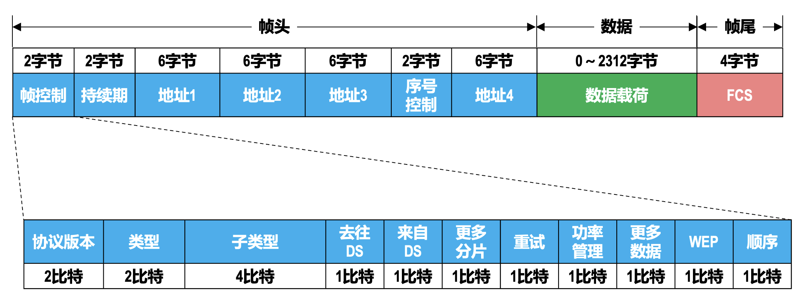

- **持续期**：用于实现 CSMA/CA 的虚拟载波监听和信道预约机制；在数据帧、RTS 帧和 CTS 帧中用该字段指出将要持续占用信道的时长
- **序号控制**：用来实现 802.11 的可靠传输，对数据帧进行编号
- **4 个地址字段**取决于帧控制字段中的“去往 DS”（到分配系统）和“来自 DS”（分配系统）这两个字段的值

    

        
    

## 网络层

网络层的主要任务就是将分组从源主机经过多个网络和多段链路传输到目的主机，可以将该任务划分为**分组转发**和**路由选择**两种重要的功能。

    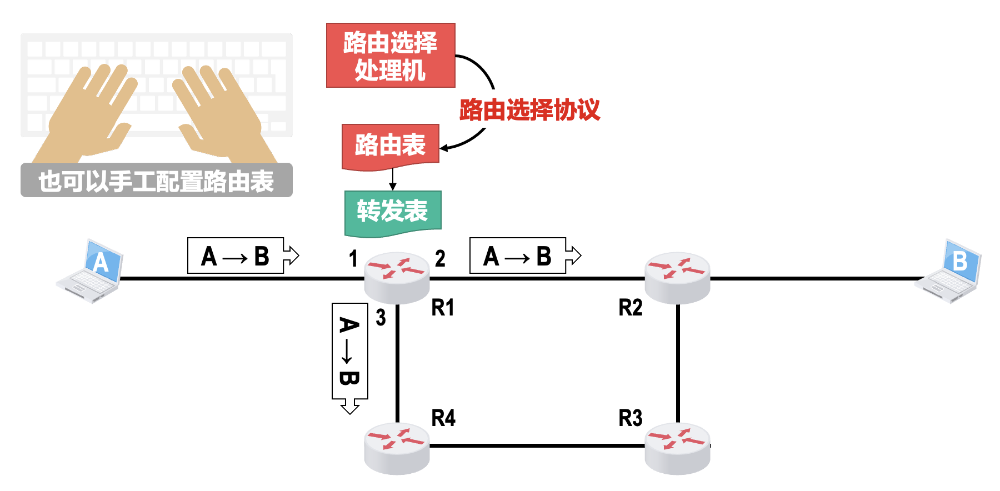

网络层向上层提供的两种服务：

- 面向连接的虚电路服务

    

        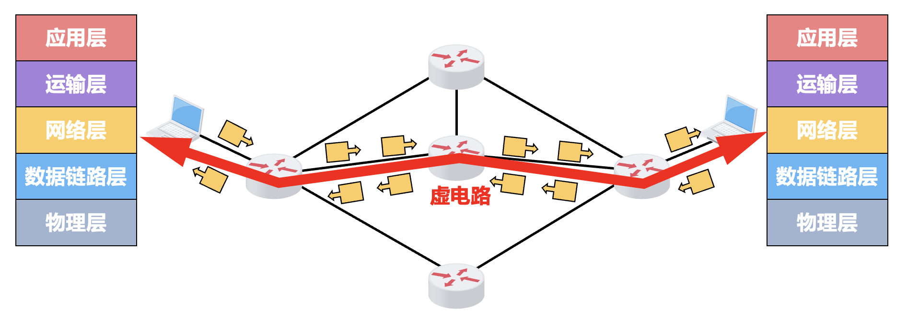
    

    - 核心思想是“可靠通信应由**网络自身**来保证”
    - 必须首先建立网络层连接——**虚电路**(virtual circuit，VC)，以保证通信双方所需的一切网络资源
    - 通信双方沿着已建立的虚电路发送分组
        - 虚电路表示这是一条逻辑上的连接，分组沿着这条逻辑连接按照存储转发方式传送，而不是真正建立了一条物理连接
        - 分组的首部仅在连接建立阶段使用完整的目的主机地址，之后每个分组的首部只需要携带一条虚电路编号即可
    - 通信结束后，需要释放之前所建立的虚电路
    - 这种通信方式如果再使用可靠传输的网络协议，就可使所发送的分组最终正确（无差错按序到达、不丢失、不重复）到达接收方
    - 很多广域分组交换网都使用面向连接的虚电路服务，但因特网的先驱者并没有采用这种设计思想，而是采用了无连接的数据报服务

- 无连接的数据报服务

    

        
    

    - 核心思想是“可靠通信应由**用户主机**来保证”
    - **不需要建立网络层连接**
    - 每个分组可走不同的路径，因此每个分组的首部都必须携带目的主机的完整地址
    - 通信结束后，没有需要释放的连接
    - 这种通信方式所传送的分组可能误码、丢失、重复和失序
    - 由于网络自身不提供端到端的可靠传输服务，这就使得网络中的路由器可以做得比较简单，大大降低了网络造价
    - 另外，这种设计思想的运行方式灵活、能够适应多种应用。因特网能够发展到今日的规模，充分证明了当初采取这种设计思想的正确性
    

### 网际协议

**网际协议**(internet protocol，**IP**)是 TCP/IP 体系结构网际层中的核心协议。

#### 异构网络连接

要将众多的异构型网络都互连起来，并且能够互相通信，则会面临许多需要解决的问题。

- 不同的网络接入机制
- 不同的差错恢复方法
- 不同的路由选择技术
- 不同的寻址方案
- 不同的最大分组长度
- 不同的服务（面向连接服务和无连接服务）

这些网络的拓扑、性能以及所使用的网络协议都不尽相同，这是由用户需求的多样性造成的，没有一种单一的网络能够适应所有用户的需求。

当 IP 网上的主机进行通信时，就好像在一个单个网络上通信一样，它们看不见互连的各网络的具体异构细节。

    

#### IPv4 地址及其编址方法

**IPv4 地址**是给 Internet 上的每一个主机（或路由器）的每一个接口分配的一个在全世界范围内唯一的 32 比特的标识符，由因特网名字和数字分配机构(Internet Corporation for Assigned Names and Numbers，**ICANN**)进行分配。

- 我国用户可向亚太网络信息中心(Asia Pacific Network Information Center，**APNIC**)申请 IP 地址，需要缴纳相应的费用，一般不接受个人申请
- 2011 年，IPv4 地址已经分配完毕

IPv4 地址采用**点分十进制**表示方法以方便用户使用。

    

---
一开始采用的编址方法是**分类编址法**。IPv4 地址可拆分为两部分：

- **网络号**：
    - 标志主机（或路由器）的接口所连接到的**网络**
    - **同一个网络**中，不同主机（或路由器）的接口的 IPv4 地址的网络号必须**相同**，表示它们属于同一个网络
- **主机号**：
    - 标志主机（或路由器）的**接口**
    - 同一个网络中，**不同主机**（或路由器）的接口的 IPv4 地址的主机号必须**各不相同**，以便区分各主机（或路由器）的接口

IPv4 地址共有 5 类：

    

- A 类、B 类和 C 类地址都是**单播地址**，只有单播地址可以分配给网络中的主机（或路由器）的各接口
- 主机号为全 0 的地址是**网络地址**，不能分配给主机（或路由器）的各接口
- 主机号为全 1 的地址是**广播地址**，不能分配给主机（或路由器）的各接口

A 类地址：

- 最小网络号为 `0`，表示**本网络**，不能指派
- 最小可指派的网络号为 `1`，网络地址为 `1.0.0.0`
- 最大网络号为 `127`，作为**本地环回测试地址**，不能指派
    - 最小的本地环回测试地址为 `127.0.0.1`
    - 最大的本地环回测试地址为 `127.255.255.254`
- 最大可指派的网络号为 `126`，网络地址为 `126.0.0.0`
- 因此可指派的 A 类网络数量为 2^(8-1)^ - 2 = 126
- 每个A类网络中可分配的地址数量为 2^24^ - 2 = 16777214（减 2 是去掉主机号为全 0 的网络地址和全 1 的广播地址）

B 类地址：

- 最小可指派的网络号为 `128.0`，网络地址为 `128.0.0.0`
- 最大可指派的网络号为 `191.255`，网络地址为 `191.255.0.0`
- 可指派的 B 类网络数量为 2^(16-2)^ = 16384
- 每个B类网络中可分配的地址数量为 2^16^-2 = 65534

C 类地址：

- 最小可指派的网络号为 `192.0.0`，网络地址为 `192.0.0.0`
- 最大可指派的网络号为 `223.255.255`，网络地址为 `223.255.255.0`
- 可指派的 C 类网络数量为 2^(24-3)^ = 2097152
- 每个C类网络中可分配的地址数量为 2^8^ - 2 = 254

???+ abstract "总结"

    

        
    

---
随着更多的中小网络加入因特网，IPv4 分类编址方法不够灵活、容易造成大量 IPv4 地址资源浪费的缺点就暴露出来了。于是引入**划分子网编址**方法对其进行改进。

    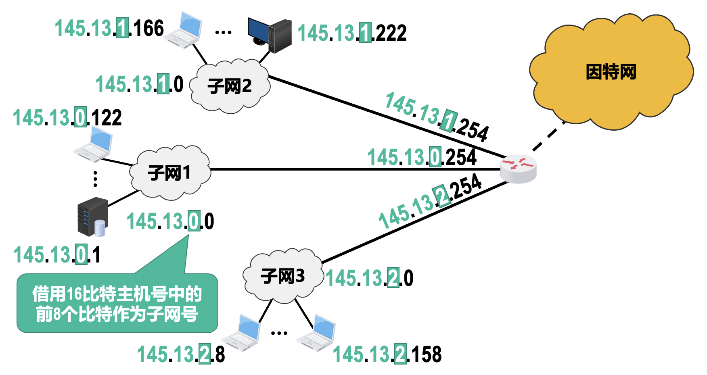

**子网掩码**可以表明分类 IPv4 地址的主机号部分被借用了几个比特作为子网号。与 IPv4 地址类似，子网掩码也是由 **32 比特**构成的。
    
- 用左起**多个连续的比特 1** 对应 IPv4 地址中的**网络号**和**子网号**
- 之后的**多个连续的比特 0** 对应 IPv4 地址中的**主机号**

将划分子网的 IPv4 地址与相应的子网掩码进行逐比特的**逻辑与**运算，就可得到该 IPv4 地址所在子网的网络地址。

    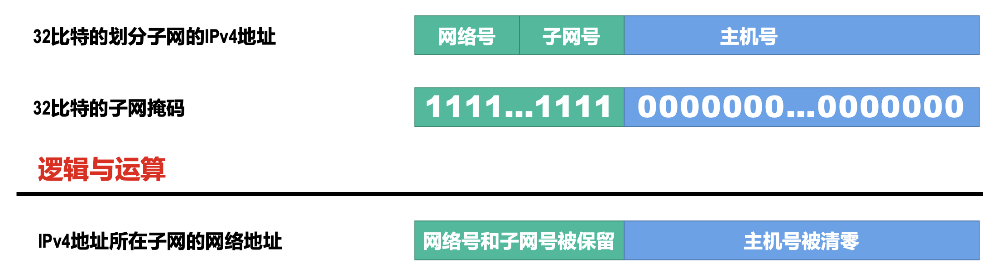

**默认子网掩码**是指在未划分子网的情况下使用的子网掩码。

    

---
IPv4 地址的划分子网编址方法在一定程度上缓解了因特网在发展中遇到的困难，但是数量巨大的 C 类网由于其每个网络所包含的地址数量太小，因此并没有得到充分使用，而因特网的 IPv4 地址仍在加速消耗，整个 IPv4 地址空间面临全部耗尽的威胁。

为此，因特网工程任务组 IETF 又提出了采用**无分类编址**的方法，来解决 IPv4 地址资源紧张的问题，同时还专门成立 IPv6 工作组负责研究新版本的 IP，以彻底解决 IPv4 地址耗尽问题。

1993 年，IETF 发布了**无分类域间路由选择**(classless inter-domain routing，**CIDR**)的 RFC 文档[RFC1517~1519，RFC1520]。它消除了传统 A 类、B 类和 C 类地址以及划分子网的概念，可以更加有效地分配 IPv4 地址资源，并且可以在 IPv6 使用之前允许因特网的规模继续增长。

无分类编址方法使用的**地址掩码**与划分子网使用的子网掩码类似，由 32 比特构成。

- 用左起多个连续的比特 1 对应 IPv4 地址中的**网络前缀**
- 之后的多个连续的比特 0 对应 IPv4 地址中的**主机号**

为了简便起见，可以在无分类编址地址后面加上斜线 `/`，在斜线之后写上**网络前缀**所占的比特数量，这种记法称为**斜线记法**。

实际上，CIDR 是将网络前缀都相同的、连续的多个无分类 IPv4 地址，组成一个 **CIDR 地址块**，只要知道其中的任何一个地址，就可以知道该地址块的以下全部细节：

- 地址块中的**最小地址**
- 地址块中的**最大地址**
- 地址块中的**地址数量**
- 地址块中**聚合某类网络（A类、B类、C类）的数量**
- **地址掩码**

使用无分类编址方法，可以根据客户的需要分配适当大小的 CIDR 地址块，因此可以更加有效地分配 IPv4 的地址空间。

    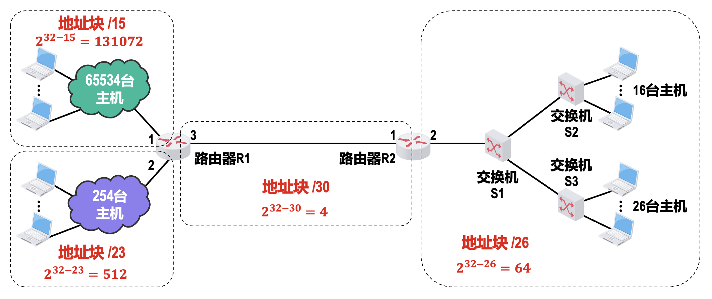

使用无分类编址方法的另一个好处是**路由聚合**（也称为构造**超网**）。

    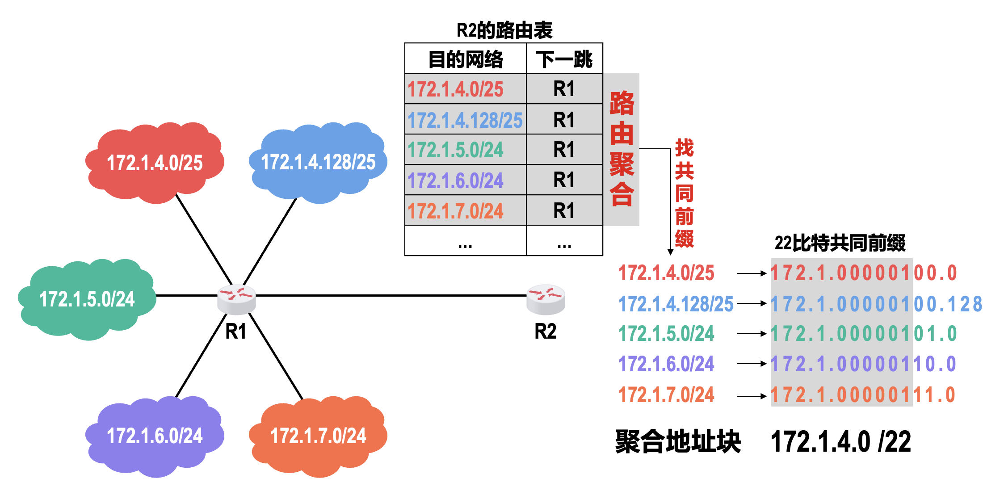

- 网络前缀越长，地址块越小，路由越具体
- 若路由器查表转发分组时发现有多条路由条目匹配，则选择网络前缀最长的那条路由条目，这称为**最长前缀匹配**，因为这样的路由更具体

#### IPv4 的应用规划

IPv4 地址的应用规划是指将给定的 IPv4 地址块（或分类网络）划分成若干个更小的地址块（或子网），并将这些地址块（或子网）分配给互联网中的不同网络，进而可以给各网络中的主机和路由器的接口分配 IPv4 地址。具体方法有：

- 使用**定长子网掩码**（FLSM）划分子网
    - 所划分出的每一个子网都使用同一个子网掩码
    - 每个子网所分配的 IP 地址数量相同，容易造成地址资源的浪费

    ???+ example "例子"

        

            
        

- 使用**变长子网掩码**（VLSM）划分子网
    - 所划分出的每一个子网可以使用不同的子网掩码
    - 每个子网所分配的 IP 地址数量可以不同，尽可能减少对地址资源的浪费
    - 在地址块中选取子块的原则：每个子块的起点位置不能随便选取，只能选取主机号部分是块大小整数倍的地址作为起点；建议先为大的子块选取

    ???+ example "例子"

        

            
        

#### IPv4 地址与 MAC 地址

IPv4 地址与 MAC 地址的封装位置：

    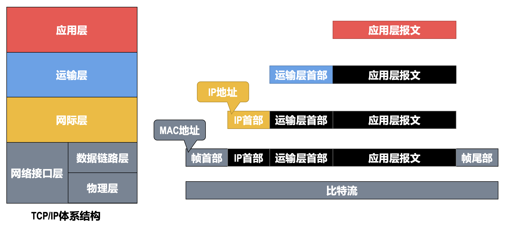

数据报传送过程中 IPv4  地址与 MAC 地址的变化情况：

- 在数据包的传送过程中，数据包的源 IP 地址和目的 IP 地址保持不变
- 在数据包的传送过程中，数据包的源 MAC 地址和目的 MAC 地址逐链路（或逐网络）改变

    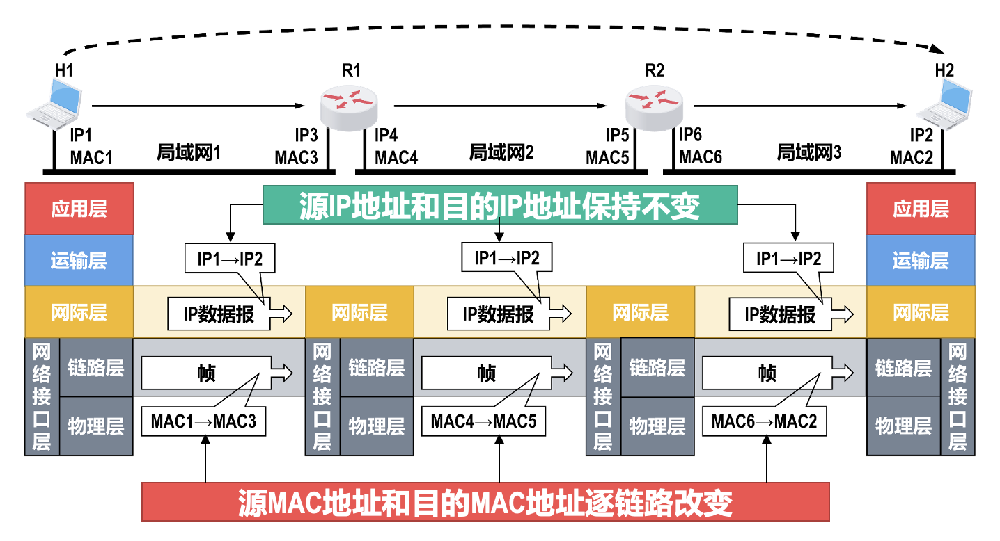

IPv4 地址与 MAC 地址的关系：

- 如果**仅使用 MAC 地址进行通信**，则会出现以下主要问题：
    - 因特网中的每台路由器的路由表中就必须记录因特网上所有主机和路由器各接口的 MAC 地址
    - 手工给各路由器配置路由表几乎是不可能完成的任务，即使使用路由协议让路由器通过相互交换路由信息来自动构建路由表，也会因为路由信息需要包含海量的 MAC 地址信息而**严重占用通信资源**
    - 另外需要路由器具备**极大的存储空间**，并且会给分组的**查表转发带来非常大的时延**
    
- 因特网的网际层使用 IP 地址进行寻址，就可使因特网中各路由器的路由表中的路由记录的数量大大减少，因为只需记录部分网络的网络地址，而不是记录每个网络中各通信设备的各接口的 MAC 地址
    - 路由器收到 IP 数据报后，根据其首部中的目的 IP 地址的网络号部分，基于自己的路由表进行查表转发

查表转发的结果可以指明 IP 数据报的下一跳路由器的 IP 地址，但无法指明该 IP 地址所对应的 MAC 地址。因此，在数据链路层封装该 IP 数据报成为帧时，帧首部中的目的 MAC 地址字段就无法填写，该问题需要使用网际层中的**地址解析协议**（**ARP**）来解决。

#### 地址解析协议（ARP）

???+ example "例子"

    情境：A 想要向 B 发送分组。

    === "Step 1"

        

            
        

    === "Step 2"

        

            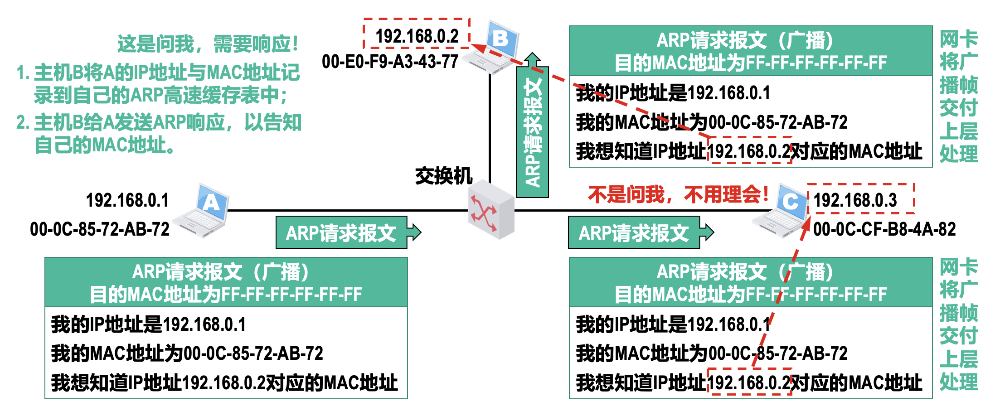
        

    === "Step 3"

        

            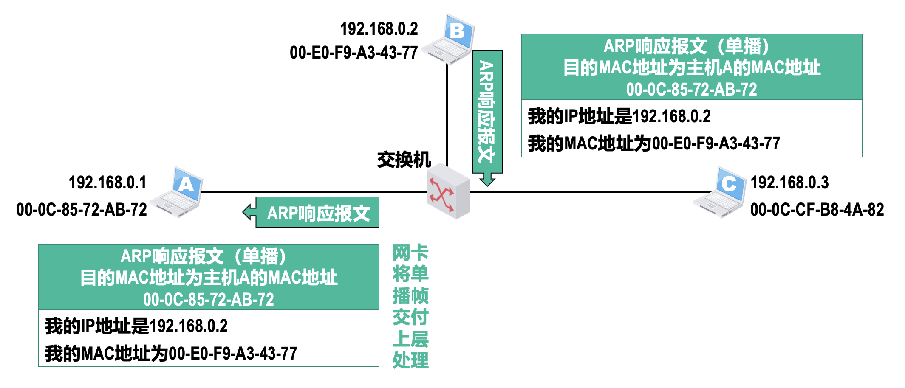
        

    === "Step 4"

        

            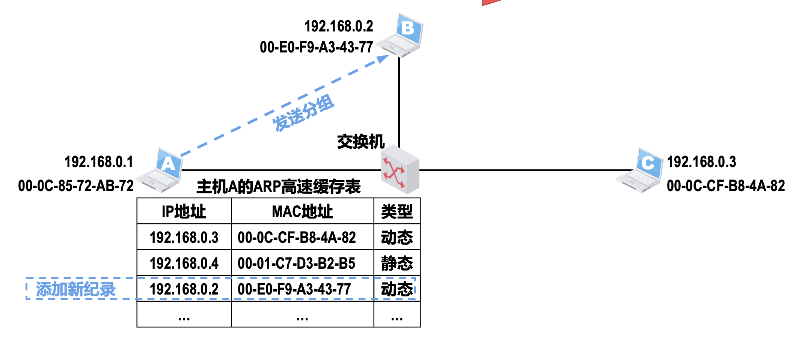
        

- ARP 高速缓存表的记录类型分为：
    - 动态：通过 ARP 自动获取，生命周期默认为两分钟
    - 静态：手工配置，不同操作系统下的生命周期不同，例如系统重启后不存在或系统重启后依然有效
- ARP 高速缓存表中的 IP 地址与 MAC 地址的对应关系也并不是永久不变的，例如主机更换了一块新网卡
- 不能跨网络使用 ARP
- 注意事项：
    - 由于 ARP 协议的主要用途是从网际层使用的 IP 地址解析出在数据链路层使用的 MAC 地址，因此有的教材将 ARP 协议划归在**网际层**，而有的教材将 ARP 协议划归在**数据链路层**，这两种做法都是可以的
    - 除了本节课介绍的 ARP **请求报文**和**响应报文**，ARP 协议还有其他类型的报文，例如用于检查 IP 地址冲突的**无故 ARP**(gratuitous ARP)
    - 由于 ARP 协议很早就制定出来了（1982 年 11 月），当时并没有考虑网络安全问题，因此 ARP 协议**没有安全验证机制**，存在 ARP 欺骗和攻击等问题

#### IP 数据报的发送和转发流程

IP 数据报的发送和转发过程包含以下两个过程：

- **主机**发送 IP 数据报
    - 源主机判断出目的主机是否与自己在同一个网络中的方法：

        

            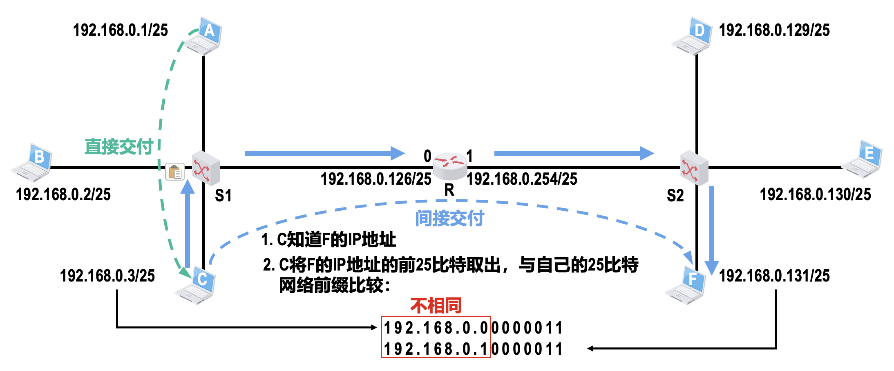
        

- **路由器**转发 IP 数据报
    - 一般步骤
        1. 检查收到的 IP 数据报是否正确：生存时间是否结束，首部是否误码；若不正确，则丢弃该 IP 数据报，并向发送该 IP 数据报的源主机发送差错报告
        2. 基于 IP 数据报首部中的目的 IP 地址在路由表中进行查找：若找到匹配的路由条目，则按该路由条目的指示进行转发，否则丢弃该 IP 数据报，并向发送该IP数据报的源主机发送差错报告

        

            
        

        在路由器的实际研发过程中，需要设计很好的数据结构（甚至是专用硬件）以便提高查找速度。

    - 广播：路由器不转发广播 IP 数据报，即**路由器隔离广播域**
        - 因为如果因特网中数量巨大的路由器收到广播 IP 数据报后都进行转发，则会造成巨大的广播风暴，严重浪费因特网资源
    
        

            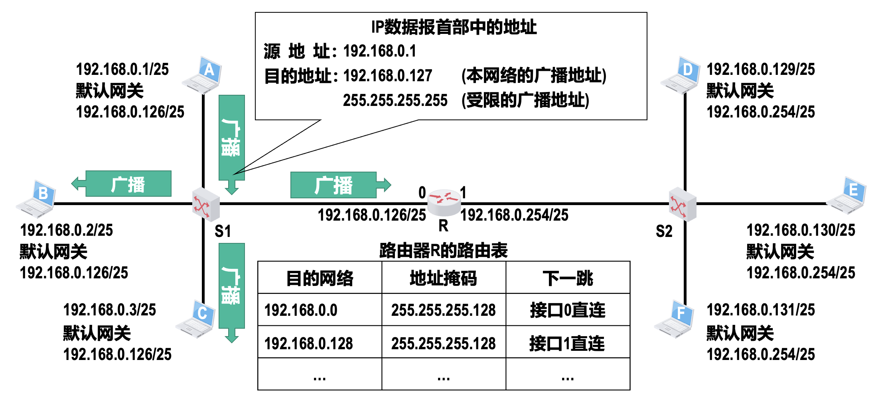
        

#### IPv4 数据报的首部格式

- IPv4 数据报的首部格式及其内容是实现 IPv4 协议各种功能的基础
- 在 TCP/IP 标准中，各种数据格式常常以 **32 比特**（即 4 字节）为单位来描述
- **固定部分**是指每个 IPv4 数据报都必须要包含的部分
- 某些 IPv4 数据报的首部，除了包含 20 字节的固定部分，还包含一些可选的字段来增加 IPv4 数据报的功能
- IPv4 数据报首部中的各字段或某些字段的组合，用来表达 IPv4 协议的相关功能

    

        
    

    - 版本：长度为 4 个比特，用来表示 IP 协议的版本
        - 通信双方使用的 IP 协议的版本必须一致。目前广泛使用的 IP 协议的版本号为 4（即 IPv4）

    - 首部长度：
        - 长度为 4 个比特，该字段的取值以 4 字节为单位，用来表示 IPv4 数据报的首部长度
        - 最小取值为二进制的 0101，即十进制的 5，再乘以 4 字节单位，表示 IPv4 数据报首部只有 20 字节固定部分
        - 最大取值为二进制的 1111，即十进制的 15，再乘以 4 字节单位，表示 IPv4 数据报首部包含 20 字节固定部分和最大 40 字节可变部分

    - 可选字段：
        - 长度从 1 字节到 40 字节不等，用来支持排错、测量以及安全措施等功能
        - 虽然可选字段增加了 IPv4 数据报的功能，但这同时也使得 IPv4 数据报的首部长度成为可变的，这就增加了因特网中每一个路由器处理 IPv4 数据报的开销
        - 实际上，可选字段很少被使用

    - 填充：
        - 用来确保 IPv4 数据报的首部长度是 4 字节的整数倍，使用全 0 进行填充
        - 当首部长度（20 字节固定部分+可变部分）的长度不是 4 字节整数倍时，填充相应数量的全 0 字节，以确保 IPv4 数据报的首部长度是 4 字节的整数倍

    - 区分服务：
        - 长度为 8 个比特，利用该字段的不同取值可提供不同等级的服务质量
        - 该字段在旧标准中叫作服务类型，但实际上一直没有被使用过；1998 年，IETF 把这个字段改名为区分服务
        - 只有在使用区分服务时该字段才起作用，一般情况下都不使用该字段

    - 总长度：
        - 长度为 16 个比特，该字段的取值以字节为单位，用来表示 **IPv4 数据报的长度**（首部长度 + 数据载荷长度）
        - 最大取值为二进制的 16 个比特 1，即十进制的 65535（很少传输这么长的 IPv4 数据报）

    - IPv4 数据报分片：当 IPv4 数据报长度超过 MTU （最大传送单元）时，无法封装成帧，需要将原 IPv4 数据报分片为若干个更小的 IPv4 数据报
        - 标识
            - 长度为 16 个比特，属于同一个 IPv4 数据报的各分片数据报应该具有相同的标识
            - IP 软件会维持一个计数器，每产生一个 IPv4 数据报，计数器值就加 1，并将此值赋给标识字段
            
        - 标志
            - 最低位(more fragment, MF)
                - MF=1 表示本分片后面还有分片
                - MF=0 表示本分片后面没有分片
            
            - 中间位(don't fragment, DF)
                - DF=1 表示不允许分片
                - DF=0 表示允许分片
            
            - 最高位为保留位，必须设置为 0

        - 片偏移：长度为 13 个比特，该字段的取值
        以 8 字节为单位，用来指出分片 IPv4 数据报的数据载荷偏移其在原 IPv4 数据报的位置有多远
        
    - 生存时间(time to live, TTL)
        - 长度为 8 个比特，取值最初以秒为单位，因此 IPv4 数据报的最大生存时间最初为 255s；路由器转发 IPv4 数据报时，将其首部中该字段的值减去该数据报在路由器上所耗费的时间，若结果不为 0 就转发，否则就丢弃
        - 后来改为以**跳数**为单位
        - 作用：防止被错误路由的 IPv4 数据报无限制地在因特网中兜圈

        

            
        

    - 协议：长度为 8 个比特，用来指明 IPv4 数据报的数据载荷是何种 PDU
    - 首部校验和：
        - 长度为 16 个比特，用于检测 IPv4 数据报在传输过程中其首部是否出现了差错
        - IPv4 数据报每经过一个路由器，其首部中的某些字段的值（例如 TTL、标志以及片偏移等）都可能发生变化，因此路由器都要重新计算一下首部检验和
        - 计算方法：

            

                
            

            上述检验和的计算方法不仅用于 IP 协议，还用于运输层的 UDP 和 TCP，常被称为**因特网检验和**(Internet checksum)；这种检验和的检错性能虽然不如 CRC，但更易用软件实现

    - 源 IP 地址：长度为 32 个比特，用来填写发送 IPv4 数据报的源主机的 IPv4 地址
    - 目标 IP 地址：长度为 32 个比特，用来填写接收 IPv4 数据报的目的主机的 IPv4 地址

### 静态路由配置

**静态路由配置**是指用户或网络运维人员使用路由器的相关命令给路由器**人工配置路由表**。这种做法简单、开销小、但不能及时适应网络状态（流量、拓扑等）的变化，一般只在**小规模网络**中采用。

=== "一般情况"

    

        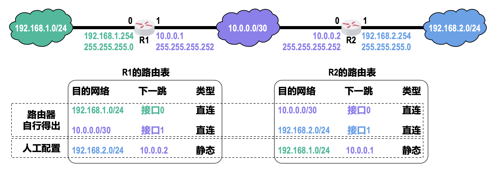
    

=== "默认路由"

    

        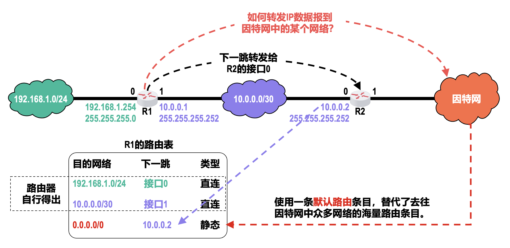
    

    默认路由条目中的目的网络 `0.0.0.0/0`，其中 `0.0.0.0` 表示任意网络，而网络前缀 `/0`（相应的地址掩码为0.0.0.0）是最短的网络前缀。

    路由器在查找转发表转发 IP 数据报时，遵循**最长前缀匹配**的原则，因此**默认路由条目的匹配优先级最低**。

=== "特定主机路由"

    出于某种安全问题的考虑，同时为了使网络运维人员更方便地控制网络和测试网络，特别是在对网络的连接或路由表进行排错时，指明到某一台主机的特定主机路由是十分有用的。

    

        
    

    - 特定主机路由条目中的目的网络 `192.168.2.1/32`，其中 `192.168.2.1` 是特定主机的 IP 地址，而网络前缀 `/32` 是最长的网络前缀
    - 路由器在查找转发表转发IP数据报时，遵循**最长前缀匹配**的原则，因此**特定主机路由条目的匹配优先级最高**
    - 在查表转发去往 `192.168.2.1` 这台特定主机的 IP 数据报时，两个静态类型的路由条目都可以匹配，遵循最长前缀匹配的原则，按照匹配优先级最高的特定主机路由条目进行转发

---
进行静态路由配置需要认真考虑和谨慎操作，否则可能出现以下问题：

- 路由条目配置错误，甚至导致出现**路由环路**
- 聚合路由条目时可能**引入不存在的网络**

### 因特网的路由选择协议

#### 路由选择分类

- [**静态**路由选择](#静态路由配置)（前面已详细介绍）
- **动态**路由选择
    - 路由器通过路由选择协议自动获取路由信息
    - 动态路由选择比较复杂、开销比较大，但能较好地适应网络状态的变化
    - 动态路由选择适用于大规模网络

#### 分层次的路由选择协议

因特网是全球最大的互联网，它所采取的路由选择协议具有以下三个主要特点：

- **自适应**：因特网采用**动态路由**选择，能较好地适应网络状态的变化
- **分布式**：因特网中的各路由器通过相互间的信息交互，共同完成路由信息的获取和更新
- **分层次**：
    - 将整个因特网划分为许多较小的**自治系统**(autonomous system，**AS**)
    - 在自治系统内部和外部采用不同类别的路由选择协议，分别进行路由选择

    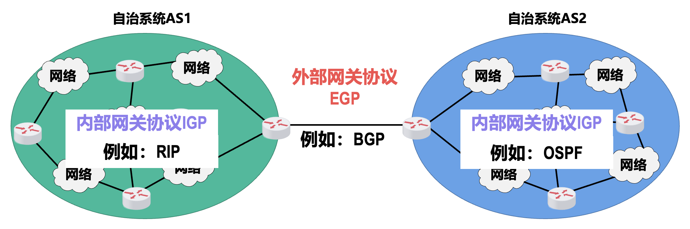

???+ warning "注意"

    - **外部网关协议**（EGP）**和内部网关协议**（IGP）只是路由选择协议的分类名称，而不是具体的路由选择协议
    - 外部网关协议和内部网关协议名称中使用的是“网关”这个名词，是因为在因特网早期的 RFC 文档中，没有使用“路由器”而使用的是“网关”这一名词

#### 路由信息协议

**路由信息协议**(routing information protocol，**RIP**)是内部网关协议中最先得到广泛使用的协议之一，其相关标准文档为 [RFC 1058]。

- 要求 AS 内的每一个路由器，都要维护从它自己到 AS 内其他每一个网络的距离记录，这组距离称为**距离向量**(distance-vector，**D-V**)
- 使用**跳数**(hop count)作为度量来衡量到达目的网络的距离
    - 将路由器到直连网络的距离定义为 1
    - 将路由器到非直连网络的距离定义为所经过的路由器数加 1
    - 允许一条路径最多只能包含 15 个路由器，距离等于 16 时相当于不可达，因此 RIP 只适用于小型互联网

    

        
    

- RIP 认为好的路由就是“距离短”的路由，也就是**通过路由器数量最少的路由**
- 当到达同一目的网络有多条 RIP 距离相等的路由时，可以进行**等价负载均衡**，也就是将通信量均衡地分布到多条等价的路径上
- 三个重要特点：
    - 仅和**相邻路由器**交换信息
    - 交换路由器自己的**路由表**，即本路由器到所在 AS 中各网络的最短 RIP 距离，以及到各网络应经过的下一跳路由器
    - 周期性交换：为了加快 RIP 的收敛速度，当网络拓扑发生变化时，路由器要及时向相邻路由器通告拓扑变化后的路由信息，这称为触发更新

- 基本工作过程：

    

        
    

    1. 路由器刚开始工作时，只知道自己到直连网络的 RIP 距离为 1
    2. 每个路由器仅和相邻路由器周期性地交换并更新路由信息
    3. 若干次交换和更新后，每个路由器都知道到达本 AS 内各网络的最短距离和下一跳路由器，称为**收敛**

- 距离向量算法：

    === "D 修改 C 的路由表"

        

            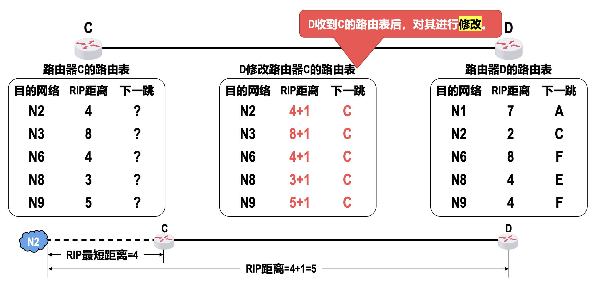
        

    === "更新 D 的路由表"

        

            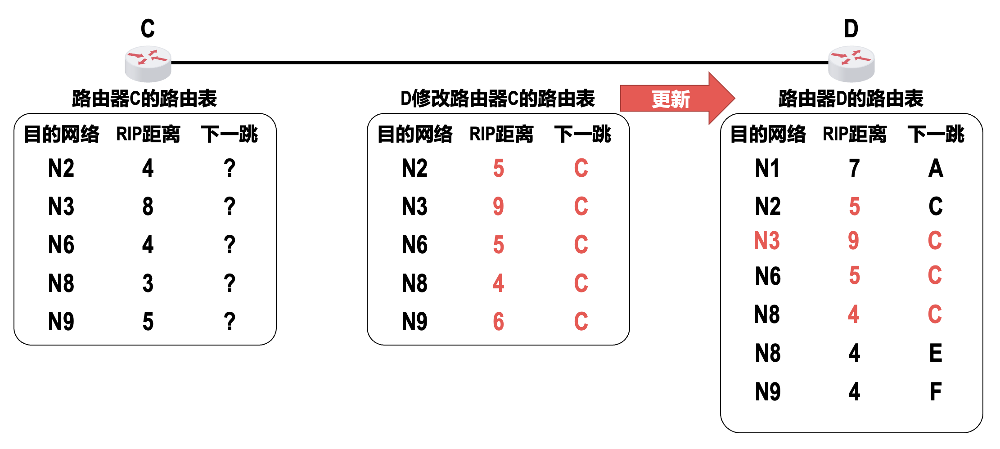
        

        更新/不更新理由：

        - N2：到达目的网络，相同的下一跳，最新消息，要更新
        - N3：发现了新的网络，添加
        - N6：到达目的网络，不同的下一跳，新路由优势，要更新
        - N8：到达目的网络，不同的下一跳，RIP距离相等，可以等价负载均衡，添加
        - N9：到达目的网络，不同的下一跳，新路由劣势，不更新

    - 除了上述 RIP 路由条目更新规则，在 RIP 的距离向量算法中还包含以下一些时间参数：
        - 路由器每隔**大约 30 秒**向其所有相邻路由器发送路由更新报文。
        - 若 **180 秒**（默认）没有收到某条路由条目的更新报文，则把该路由条目标记为无效（即把 RIP 距离设置为 16，表示不可达），若再过一段时间（如 120 秒），还没有收到该路由条目的更新报文，则将该路由条目从路由表中删除

- 问题：**坏消息传播慢**，又被称为路由环路或 **RIP 距离无穷计数**问题

    

        
    

    - 减小该问题带来的危害的措施：
        - 限制**最大 RIP 距离为 15**（16 表示不可达）
        - 当路由表发生变化时就立即发送路由更新报文（即**触发更新**），而不仅是周期性发送
        - 让路由器记录收到某个特定路由信息的接口，而不让同一路由信息再通过此接口向反方向传送（即**水平分割**）

- 现在较新的 RIP 版本是 1998 年 11 月公布的 RIP2 [RFC 2453]，已经成为因特网标准协议
    - 与 RIP1 相比，RIP2 可以支持**变长子网掩码**和 **CIDR**
    - 还提供简单的鉴别过程并支持**多播**

- RIP 相关报文使用运输层的 **UDP** 进行封装，使用的 UDP 端口号为 **520**
    - 从 RIP 报文封装的角度看，RIP 属于 TCP/IP 体系结构的应用层。
    - 但 RIP 的核心功能是路由选择，这属于 TCP/IP 体系结构的网际层

- 优点：
    - 实现简单，路由器开销小
    - 如果一个路由器发现了RIP距离更短的路由，那么这种更新信息就传播得很快，即“好消息传播得快”

- 缺点：
    - 限制了最大 RIP 距离为 15，这就限制了使用 RIP 的 AS 规模
    - 相邻路由器之间交换的路由信息是路由器中的完整路由表，因而随着网络规模的扩大，开销也随之增大
    - 坏消息传播得慢使更新过程的收敛时间过长。因此，对于规模较大的自治系统AS，应当使用OSPF协议。

#### 开放最短路径优先协议

**开放最短路径优先**(open shortest path first，**OSPF**)协议是为了克服 RIP 的缺点开发出来的。

- “开放”表明 OSPF 协议不是受某一厂商控制，而是公开发表的
- “最短路径优先”是因为使用了 Dijkstra 提出的**最短路径算法**
- 另外 OSPF 是基于**链路状态**的，和最短路径算法一起保证了**不会产生路由环路**
    - 链路状态(link state)：本路由器都和哪些路由器相邻，以及相应链路的代价(cost)（表示费用、距离、时延和带宽等，由网络管理人员来决定）
- 不限制网络规模，更新效率高，收敛速度快
- 相邻路由器之间通过交互**问候**(hello)**分组**来建立和维护邻居关系
    - 问候分组封装在 IP 数据报中，发往**组播地址 `224.0.0.5`**；IP 数据报首部中的协议号字段的取值为 89，表明 IP 数据报的数据载荷为 OSPF 分组
    - 问候分组发送周期为 10 秒
    - 若 40s 未收到来自邻居路由器的问候分组，则认为邻居路由器不可达
    - 每个路由器都会建立一张**邻居表**
        
        

            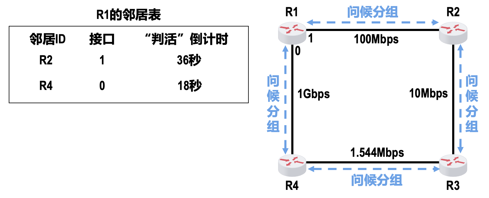
        

- 使用 OSPF 的每个路由器都会产生**链路状态通告**(link state advertisement, **LSA**)，它包含以下两类信息：
    - **直连网络**的链路状态信息
    - **邻居路由器**的链路状态信息

- LSA 被封装在**链路状态更新**(link state update, **LSU**)分组中，采用**可靠的洪泛法**(flooding)进行发送
    - 洪泛法的要点是路由器**向自己所有的邻居路由器发送链路状态更新分组**，收到该分组的各路由器又将该分组转发给自己所有的邻居路由器（但其上游路由器除外），以此类推
    - 可靠是指收到链路状态更新分组后要发送确认，**收到重复的更新分组无需再次转发**，但要发送一次确认

- 使用 OSPF 的每一个路由器都有一个**链路状态数据库**(link state database，**LSDB**)，用于 LSA
    - 通过各路由器洪泛发送封装有各自 LSA 的 LSU 分组，各路由器的 LSDB 最终将达到一致

    

        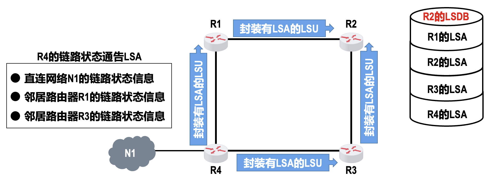
    

- 使用 OSPF 的各路由器，基于 LSDB 进行最短路径优先计算，构建出各自到达其他各路由器的最短路径，即构建各自的路由表

    

        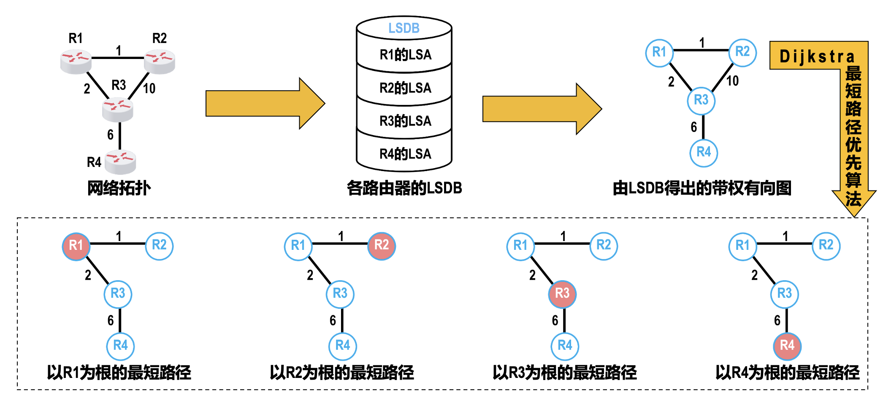
    

- 分组类型：
    - **问候**(hello)：用来发现和维护邻居路由器的可达性
    - **数据库描述**(database description)：用来向邻居路由器给出自己的链路状态数据库中的所有链路状态项目的摘要信息
    - **链路状态请求**(link state request)：用来向邻居路由器请求发送某些链路状态项目的详细信息
    - **链路状态更新**(link state update)：路由器使用链路状态更新分组将其链路状态信息进行洪泛发送，即用洪泛法对整个系统更新链路状态
    - **链路状态确认**(link state acknowledgement)：对链路状态更新分组的确认分组

- 基本工作过程：

    

        
    

- 多点接入网络中的 OSPF 路由器
    - 邻居关系的建立：每个路由器需要向其他 n-1 个路由器发送问候分组和链路状态更新分组
    - 为了减少洪泛发送问候分组和链路状态更新分组的数量，OSPF 采用以下措施：
        - 选举**指定路由器**(designated router, **DR**)和**备用的指定路由器**(backup designated router, **BDR**)
        - 所有的非 DR/BDR 只与 DR/BDR 建立邻居关系，非 DR/BDR 之间通过 DR/BDR 交换信息
        
    

        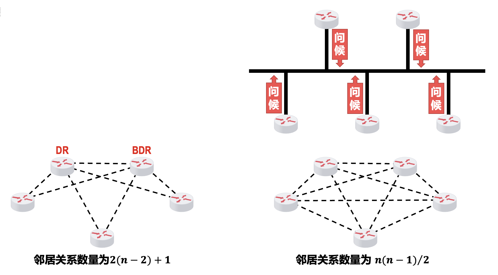
    

- 为了使 OSPF 协议能够用于规模很大的网络，OSPF 把一个 AS 再划分为若干个更小的范围，称为**区域**(area)
    - 划分区域的好处就是把利用洪泛法交换链路状态信息的范围局限于每一个区域，而不是整个 AS，这样就减少了整个网络上的通信量
    - 每个区域的规模不应太大，一般所包含的路由器不应超过 200 个
    - 采用划分区域的方法，虽然使交换信息的种类增多了，同时也使 OSPF 协议更加复杂了，但这样做能使每一个区域内部交换路由信息的通信量大大减小，因而使 OSPF 协议能够用于规模更大的 AS
    
    

        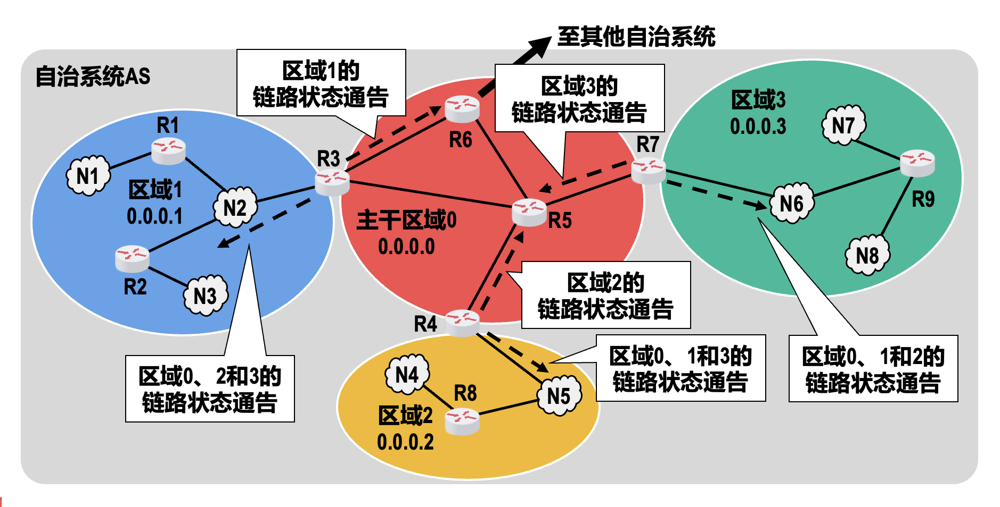
    

    - 路由器分类：
        - 自治系统边界路由器(AS border router, ASBR)：R6
        - 主干路由器(backbone router，BBR)：R3、R4、R5、R6 和 R7
        - 区域内路由器(internal router，IR)：区域 1 内的 R1 和 R2，区域 2 内的 R8，区域 3 内的 R9
        - 区域边界路由器(area border router，ABR)：R3、R4 和 R7

#### 边界网关协议

**边界网关协议**(border gateway protocol，**BGP**)属于 EGP 这个类别，用于 AS 之间的路由选择协议。

- 由于在不同 AS 内度量路由的代价可能不同，因此对于 AS 之间的路由选择，使用统一的代价作为度量来寻找最佳路由是不行的
- AS 之间的路由选择还必须考虑相关**策略**（政治、经济、安全等），它们都是由网络管理人员对每一个路由器进行设置的；但这些策略并不是路由选择协议本身
- BGP 只能是力求寻找一条能够到达目的网络且比较好的路由（即不能兜圈子），而并非要寻找一条最佳路由
- 在配置 BGP 时，每个 AS 的管理员要选择至少一个路由器作为该 AS 的 **BGP 发言人**
- 一般来说，两个 BGP 发言人都是通过一个共享网络连接在一起的，而 BGP 发言人往往就是 **BGP 边界路由器**
- 使用 TCP 连接交换路由信息的两个 BGP 发言人，彼此称为对方的**邻站**(neighbor)或**对等站**(peer)
- BGP 发言人除了运行 BGP 协议外，还必须运行自己所在 AS 所使用的 IGP，例如 RIP 或 OSPF
- BGP 发言人交换网络可达性的信息，也就是要到达某个网络所要经过的一系列自治系统
- 当 BGP 发言人相互交换了网络可达性的信息后，各 BGP 发言人就根据所采用的策略，从收到的路由信息中找出到达各自治系统的较好的路由，也就是构造出树形结构且不存在环路的自治系统连通图

    

- BGP 适用于多级结构的因特网

    

        
    

- **BGP-4** 是目前使用得最多的版本，在 [RFC 4271] 中规定了 BGP-4 的四种报文：
    - **打开**(open)：用来与相邻的另一个 BGP 发言人建立关系，使通信初始化
    - **保活**(keepalive)：用来周期性地证实邻站的连通性
    - **更新**(update)：用来通告某一条路由的信息，以及列出要撤销的多条路由
    - **通知**(notification)：用来发送检测到的差错

#### 路由器的基本工作原理

**路由器**是一种具有多个输入端口和输出端口的**专用计算机**，其任务是**转发分组**。

    

- 路由表
    - 一般仅包含从目的网络到下一跳的映射
    - 需要对网络拓扑变化的计算最优化
- 转发表
    - 是从路由表得出的
    - 应当使查找过程最优化

- 交换结构的速率对于路由器的性能是至关重要的，因此人们对交换结构进行了大量研究，以提高路由器的转发速率
- 实现交换结构的三种基本方式是：通过**存储器**、通过**总线**以及通过**互连网络**；这三种交换结构可实现的路由器转发速率依次提高

### 网际控制报文协议

为了更有效地转发 IP 数据报以及提高 IP 数据报交付成功的机会，TCP/IP 体系结构的网际层使用了**网际控制报文协议**(internet control message protocol，**ICMP**) [RFC 792]。

- 主机或路由器使用 ICMP 来发送差错报告报文和询问报文
- ICMP 报文被封装在 IP 数据报中发送

    

        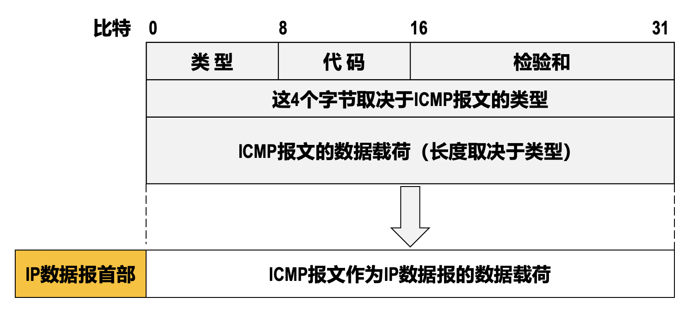
    

#### 报文类型

- **差错报告报文**：用来向主机或路由器报告差错情况
    - **终点不可达**：当路由器或主机不能交付 IP 数据报时，就向源点发送重点不可达报文
        - 具体可再根据 ICMP 的代码字段细分为目的网络不可达、目的主机不可达、目的协议不可达、目的端口不可达、目的网络未知、目的主机未知等 13 种
    
        

            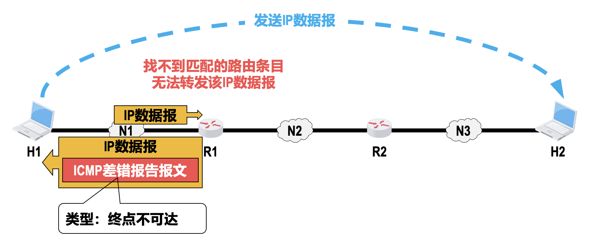
        

    - **源点抑制**：当路由器或主机由于拥塞而丢弃IP数据报时，就向发送该IP数据报的源点发送源点抑制报文，使源点知道应当把IP数据报的发送速率放慢
    
        

            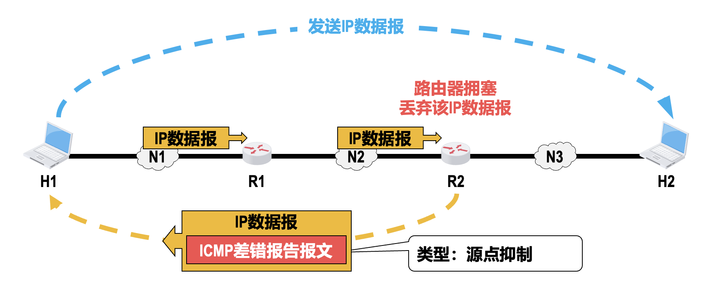
        

    - **超时**：当路由器收到一个目的 IP 地址不是自己的 IP 数据报时，会将其首部中 TTL 字段的值减 1
        - 若结果不为 0，则路由器将该数据报转发出去
        - 若结果为 0，路由器不但要丢弃该数据报，还要向发送该 IP 数据报的源点发送超时报文
        - 另外，当终点在预先规定的时间内未能收到一个数据报的全部数据报分片时，就把已收到的数据报片都丢弃，也会向源点发送超时报文
        
        

            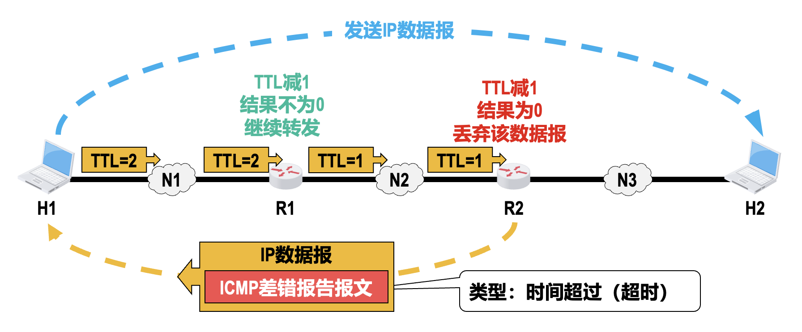
        

    - **参数问题**：当路由器或目的主机收到 IP 数据报后，根据其首部中的检验和字段的值发现首部在传送过程中出现了误码，就丢弃该数据报，并向发送该数据报的源点发送参数问题报文

        

            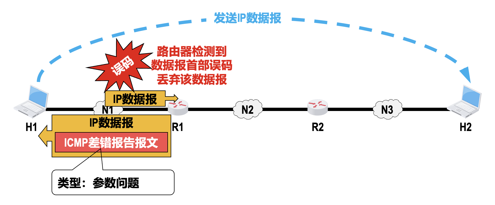
        

    - **改变路由**（重定向）：路由器把改变路由报文发送给主机，让主机知道下次应将 IP 数据报发送给另外的路由器，这样可以通过更好的路由到达目的主机

        

            
        

    - 以下情况不应发送 ICMP 差错报告报文：
        - 对 ICMP 差错报告报文不再发送 ICMP 差错报告报文
        - 对第一个分片的 IP 数据报片的所有后续数据报片都不发送 ICMP 差错报告报文
        - 对具有多播地址的 IP 数据报都不发送 ICMP 差错报告报文
        - 对具有特殊地址（例如 `127.0.0.0` 或 `0.0.0.0`）的 IP 数据报不发送 ICMP 差错报告报文

- **询问报文**：用来向主机或路由器询问情况
    - **回送请求和回答**：
        - 由主机或路由器向一个特定的目的主机或路由器发出
        - 收到此报文的主机或路由器必须给发送该报文的源主机或路由器发送 ICMP 回送回答报文
        - 这种询问报文用来**测试目的站是否可达以及了解其有关状态**

    - **时间戳请求和回答**：
        - 用来请求某个主机或路由器回答当前的日期和时间。
        - 在 ICMP 时间戳回答报文中有一个 32 比特的字段，其中写入的整数代表从 1900 年 1 月 1 日起到当前时刻一共有多少秒
        - 这种询问报文用来进行**时钟同步**和**测量时间**

#### 典型应用

- **分组网间探测**(packet internet groper，**`PING`**)：测试主机或路由器之间的连通性
    - 是 TCP/IP 体系结构的应用层直接使用网际层 ICMP 的一个例子，它并不使用运输层的 TCP 或 UDP
    - 该应用所使用的 ICMP 报文类型为**回送请求和回答**
    - 某些主机或服务器为了防止恶意攻击，并会不理睬外界发来的 ICMP 回送请求报文
    

- **跟踪路由**(**`traceroute`**)：探测 IP 数据报从源主机到达目的主机要经过哪些路由器；在不同操作系统中，该应用的命令和实现机制有所不同：
    - 在 UNIX 版本中，具体命令为 `traceroute`，其在运输层使用 UDP 协议，在网络层使用 ICMP 报文类型只有**差错报告报文**
    - 在 Windows 版本中，具体命令为 `tracert`，其应用层直接使用网际层的 ICMP 协议，所使用的 ICMP 报文类型有**回送请求和回答报文**以及**差错报告报文**
    
???+ example "例子"

    === "Hop 1"

        

            
        

    === "Hop 2"

        

            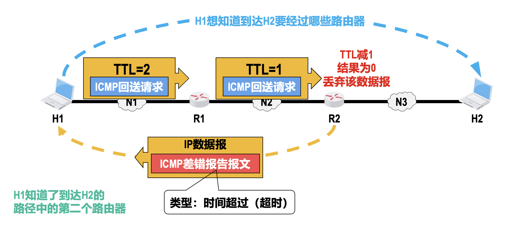
        

    === "Hop 3"

        

            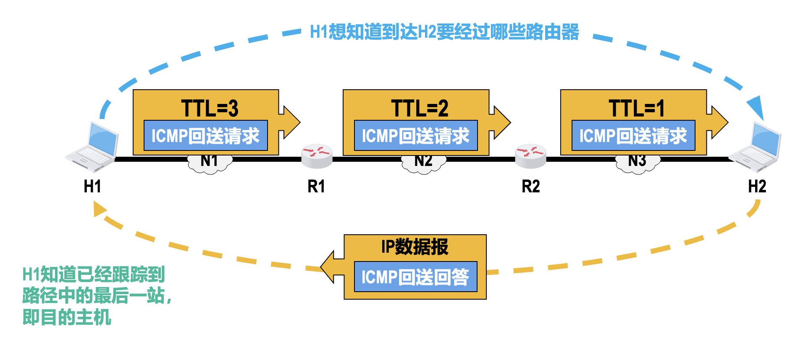
        

### 虚拟专用网和网络地址转换

#### 虚拟专用网

**虚拟专用网**(virtual private network, **VPN**)：利用公用的因特网作为本机构各专用网之间的通信载体。

- 出于安全考虑，专用网内的各主机并不应该直接“暴露”于公用的因特网上，因此给专用网内各主机配置的 IP 地址应使各主机在专用网内可以相互通信，而不能直接与公用的因特网通信
- 给专用网内各主机配置的 IP 地址应该是该专用网所在机构可以自行分配的 IP 地址，这类 IP 地址仅在机构内部有效，称为**专用地址**(private address)，不需要向因特网的管理机构申请
- [RFC 1918] 规定了以下三个 CIDR 地址块中的地址作为专用地址：
    - `10.0.0.0`~`10.255.255.255`（CIDR 地址块 `10/8`）
    - `172.16.0.0`~`172.31.255.255`（CIDR 地址块 `172.16/12`）
    - `192.168.0.0`~`192.168.255.255`（CIDR 地址块 `192.168/16`）

- 很显然，全世界可能有很多不同机构的专用网具有相同的专用 IP 地址，但这并不会引起麻烦，因为这些专用地址仅在机构内部使用
- 在因特网中的所有路由器，对目的地址是专用地址的 IP 数据报一律不进行转发，这需要由 ISP 对其拥有的因特网路由器进行设置来实现
- 虽然两个专用网内的主机间发送的数据报是通过公用的因特网传送的，但从效果上就好像是本机构的专用网上传送一样，这也是虚拟专用网中“虚拟”的含义
- IP 数据报在因特网中可能要经过多个网络和路由器，但从逻辑上看，路由器之间好像是一条直通的点对点链路，因此也被称为 **IP 隧道技术**
- **内联网 VPN**：同一机构内不同部门的内部网络所构成的 VPN
- **外联网 VPN**：外部机构（通常是合作伙伴）参加一个机构的 VPN
- **远程接入 VPN**：在外地工作的员工需要访问公司内部的专用网时，只要在任何地点接入因特网，运行驻留在员工 PC 中的 VPN 软件，在员工的 PC 和公司的主机之间建立 VPN 隧道，就可以访问专用网中的资源

??? example "例子"

    

        
    

#### 网络地址转换

尽管因特网采用了无分类编址方法来减缓 IPv4 地址空间耗尽的速度，但由于因特网用户数量的急剧增长，特别是大量小型办公室和家庭网络接入因特网的需求不断增加，IPv4 地址空间即将耗尽的危险然仍没有解除（实际上，IANN 于 2011 年宣布 IPv4 地址已经分配完毕）。

**网络地址转换**(network address translation，**NAT**)技术于 1994 年被提出，用来缓解 IPv4 地址空间即将耗尽的问题。

- NAT 能使大量使用内部专用地址的专用网络用户共享少量外部全球地址来访问因特网上的主机和资源
- 这种方法需要在专用网络连接到因特网的路由器上**安装 NAT 软件**
    - 装有 NAT 软件的路由器称为 NAT 路由器，它至少要有一个有效的外部全球地址 IP~G~
    - 这样，所有使用内部专用地址的主机在和外部因特网通信时，都要在 NAT 路由器上将其内部专用地址转换成 IP~G~

- 缺点：如果 NAT 路由器拥有 n（n 比较小）个全球 IP 地址，那么专用网内最多可以同时有 n 台主机接入因特网；若专用网内的主机数量大于 n，则需要轮流使用 NAT 路由器中数量较少的全球 IP 地址

    

---
将 NAT 和运输层端口号结合使用的技术称为**网络地址与端口号转换**(network address and port translation, **NAPT**)

- 这样就可以使内部专用网中使用专用地址的大量主机，共用 NAT 路由器上的 1 个全球 IP 地址，因而可以同时与因特网中的不同主机进行通信
- 现在很多家用路由器将家中各种智能设备接入因特网，这种路由器实际上就是一个 NAPT 路由器，但往往并不运行路由选择协议

    

    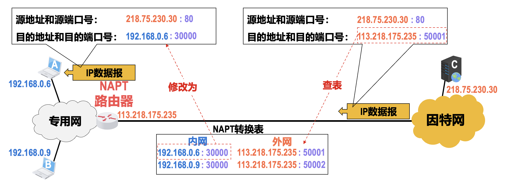

- 尽管 NAT（和 NAPT）的出现在很大程度上缓解了 IPv4 地址资源紧张的局面，但 NAT（和 NAPT）**对网络应用并不完全透明**，会对某些网络应用产生影响
- NAT（和 NAPT）的一个重要特点就是通信必须由专用网内部发起，因此拥有内部专用地址的主机不能直接充当因特网中的服务器
- 对于目前 P2P 这类需要外网主机主动与内网主机进行通信的网络应用，在通过 NAT 时会遇到问题，需要网络应用自身使用一些特殊的 **NAT 穿透技术**来解决

### IP 多播

**多播**(multicast)也称为组播，是一种实现“一对多”通信的技术，与传统单播“一对一”通信相比，多播可以极大地节省网络资源。而在因特网上进行的多播称为 **IP 多播**。

当多播组的成员数量很大时，采用多播方式可以显著地减少网络中各种资源的消耗。

    

#### IP 多播地址和多播组

在 IPv4 中，**D 类地址**被作为**多播地址**。

- 这类地址只能用作**目的地址**，而不能用作源地址
- 用每一个 D 类地址来标识一个多播组，使用同一个 IP 多播地址接收 IP 多播数据报的所有主机就构成了一个多播组
    
    

        
    

    - 每个多播组的成员是可以随时变动的，一台主机可以随时加入或离开多播组
    - 多播组成员的数量和所在的地理位置也不受限制，一台主机可以属于几个多播组
- 非多播组成员也可以向多播组发送 IP 多播数据报
- 与 IP 数据报相同，IP 多播数据报也是**尽最大努力交付**，不保证一定能够交付给多播组内的所有成员
- IPv4 多播地址又可分为**预留的多播地址**（永久多播地址）、**全球范围可用的多播地址**以及**本地管理的多播地址**（[RFC 3330]）

    

        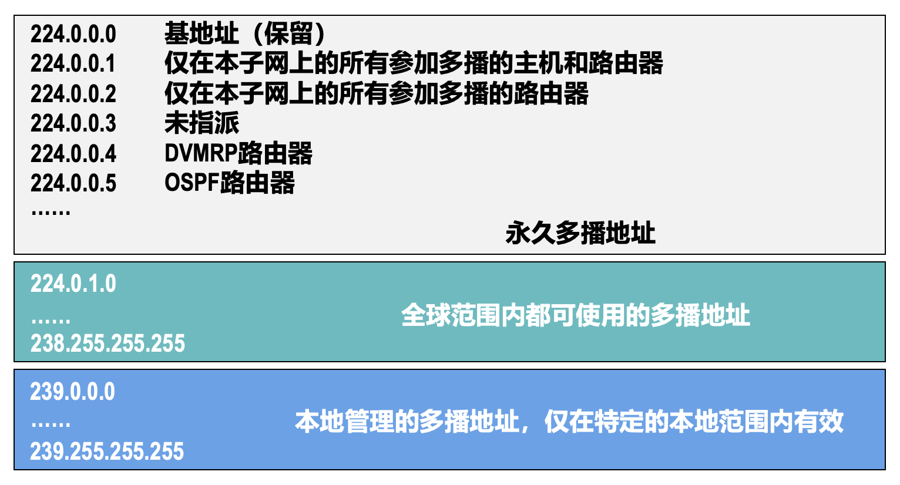
    

- IP 多播可以分为以下两种：
    - 只在本**局域网**上进行的硬件多播
    - 在**因特网**上进行的多播

- 目前大部分主机都是通过局域网接入因特网的，因此在因特网上进行多播的最后阶段，还是要把 IP 多播数据报在局域网上用硬件多播交付给多播组的所有成员

#### 在局域网上进行硬件多播

由于 MAC 地址有多播 MAC 地址这种类型，因此只要**把 IPv4 多播地址映射成多播 MAC 地址**，即可将 IP 多播数据报封装在局域网的 MAC 帧中，而 MAC 帧首部中的目的 MAC 地址字段的值，就设置为由 IPv4 多播地址映射成的多播 MAC 地址。这样，可以很方便地**利用硬件多播来实现局域网内的 IP 多播**。

当给某个多播组的成员主机配置其所属多播组的 IP 多播地址时，系统就会根据映射规则从该 IP 多播地址生成相应的局域网多播 MAC 地址。

    

IANA 将自己从 IEEE 注册管理机构申请到的以太网 MAC 地址块中从 `01-00-5E-00-00-00` 到 `01-00-5E-7F-FF-FF` 的多播 MAC 地址，用于映射 IPv4 多播地址。这些多播 MAC 地址的左起前 25 个比特都是相同的，剩余 23 个比特可以任意变化，因此共有 2^23^ 个。

    

由于 IP 多播地址可变化的 28 比特的前 5 个比特无法映射到 MAC 多播地址，这会造成 IP 多播地址与多播 MAC 地址的**映射关系并不是唯一的**。

    

由于映射关系不唯一，收到 IP 多播数据报的主机还要**在网际层利用软件进行过滤**，把不是主机要接收的 IP 多播数据报丢弃。

    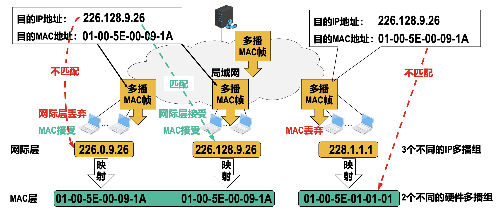

#### IP 多播相关的协议

要在因特网上进行 IP 多播，就必须要考虑 IP 多播数据报经过多个多播路由器进行转发的问题。**多播路由器**必须根据 IP 多播数据报首部中的 IP 多播地址，将其转发到有该多播组成员的局域网。

- **网际组管理协议**(internet group management protocol，**IGMP**)：TCP/IP 体系结构网际层中的协议，其作用是让连接在本地局域网上的多播路由器知道本局域网上是否有主机（实际上是主机中的某个进程）加入或退出了某个多播组
    - IGMP 仅在本网络有效，使用 IGMP 并不能知道多播组所包含的成员数量，也不能知道多播组的成员都分布在哪些网络中

- **多播路由选择协议**的主要任务是：在多播路由器之间为每个多播组建立一个**多播转发树**
    - 多播转发树连接多播源和所有拥有该多播组成员的路由器
    - IP 多播数据报只要沿着多播转发树进行**洪泛**，就能被传送到所有拥有该多播组成员的多播路由器
    - 之后，在多播路由器所直连的局域网内，多播路由器通过**硬件多播**，将 IP 多播数据报发送给该多播组的所有成员
    - 针对不同的多播组需要维护不同的多播转发树，而且必须动态地适应多播组成员的变化，但此时网络拓扑并不一定发生变化，因此多播路由选择协议要比单播路由选择协议（例如 RIP、OSPF 等）复杂得多
    - 即使某个主机不是任何多播组的成员，它也可以向任何多播组发送多播数据报
    - 为了覆盖多播组的所有成员，多播转发树可能要经过一些没有多播组成员的路由器（例如下图中的R2）

    

        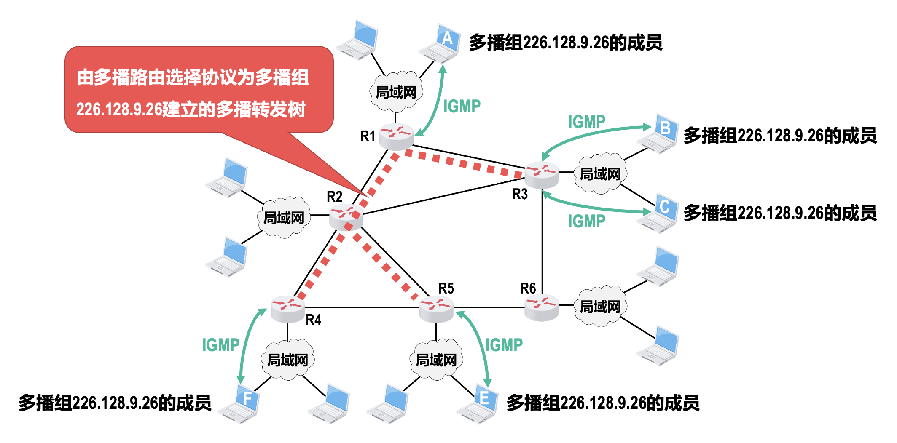
    

#### 网际组管理协议

IGMP 有三种报文类型：

- 成员报告报文
- 成员查询报文
- 离开组报文

IGMP 报文被封装在 IP 数据报中传送。

    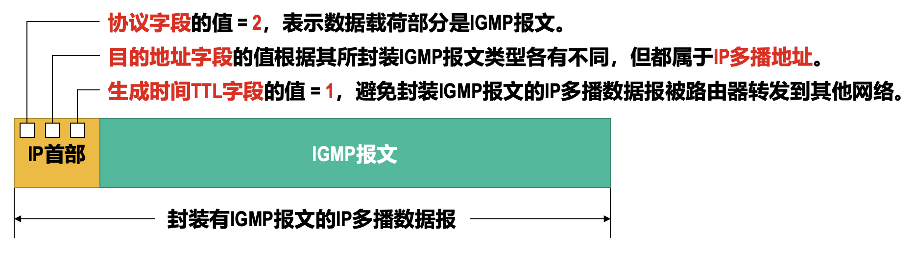

基本工作原理：

- 加入多播组

    === "MAC 地址不相同"

        

            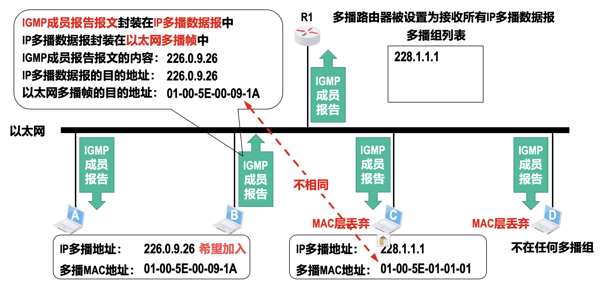
        

    === "MAC 地址相同"

        

            
        

        

            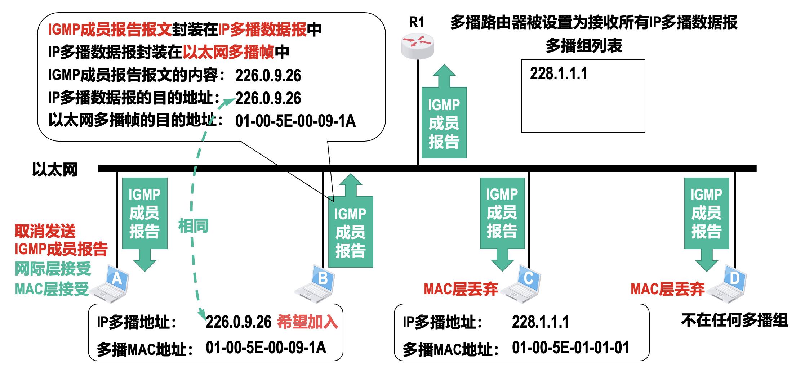
        

        

            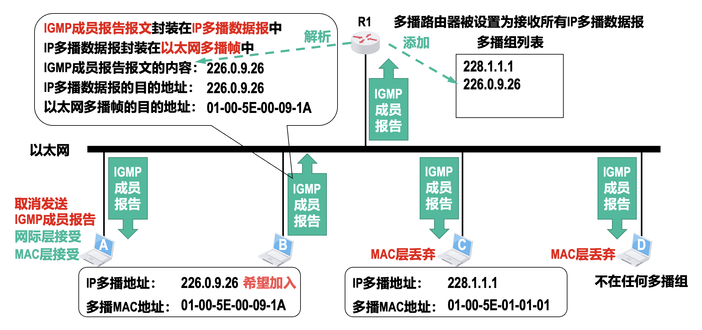
        

- 监视多播组的成员变化
    
    

        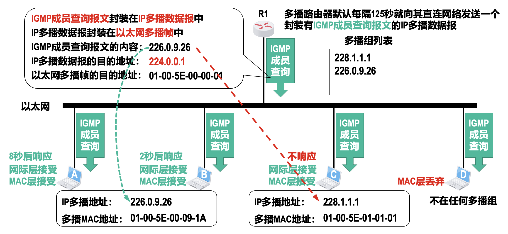
    

    

        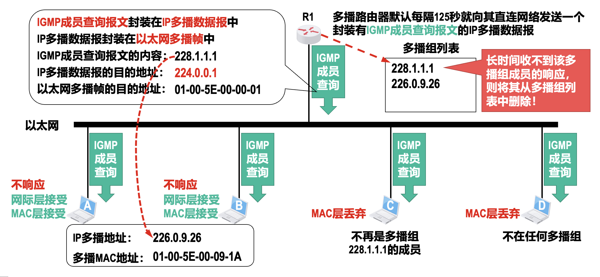
    

    - 同一网络中的多播路由器可能不止一个，但 没有必要每个多播路由器都周期性地发送 IGMP 成员查询报文
    - 只要在这些多播路由器中选择一个作为**查询路由器**，由查询路由器发送 IGMP 成员查询报文，而其他的多播路由器仅被动接收响应并更新自己的多播组列表即可
    - 选择查询路由器的方法：
        - 每个多播路由器若监听到源 IP 地址比自己的 IP 地址小的 IGMP 成员查询报文则退出选举
        - 最后，网络中只有 **IP 地址最小的多播路由器成为查询路由器**

- 退出多播组
    - IGMPv2 在 IGMPv1 的基础上增加了一个可选项：当主机要退出某个多播组时，可主动发送一个**离开组报文**而不必等待多播路由器的查询，这样可使多播路由器能够更快地发现某个组有成员离开

    

        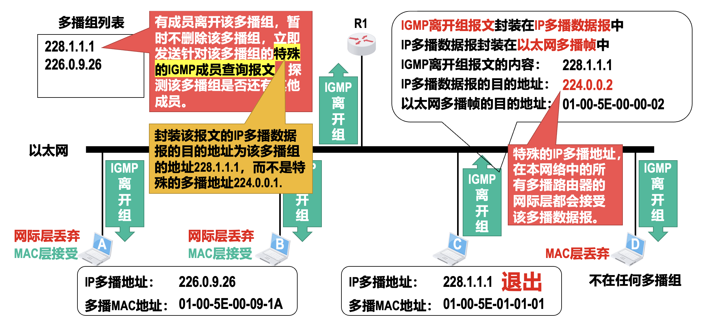
    

#### 多播路由选择协议

多播路由选择协议的主要任务是：在多播路由器之间为每个多播组建立一个**多播转发树**。多播转发树连接多播源和所拥有该多播组成员的路由器。目前有以下两种方法来构建多播转发树：

- **基于源树**(source-base tree)多播路由选择
    - 最典型算法是**反向路径多播**(reverse path multicasting, **RPM**)算法，包含以下两个步骤：
        1. 利用**反向路径广播**(reverse path broadcasting，**RPB**)算法建立一个广播转发树
            - “反向路径”的意思是在计算最短路径时把源点当作终点
        2. 利用**剪枝**(pruning)算法，剪除广播转发树中的下游非成员路由器，获得一个多播转发树
        
    - 要建立广播转发树，可以使用**洪泛**(flooding)法

        

            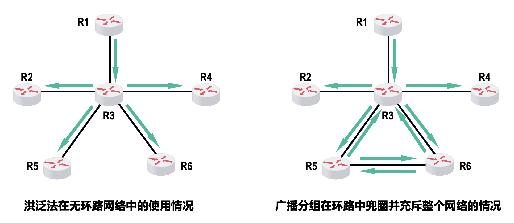
        

    - 利用 RPB 算法生成的广播转发树，**不会存在环路**，因此可以避免广播分组在环路中兜圈
    - RPB 算法的要点是：每一台路由器在收到一个广播分组时，先检查该广播分组是否是从源点经最短路径传送来的
        - 若是，本路由器就从自己除刚才接收该广播分组的接口的所有其他接口转发该广播分组
        - 否则，丢弃该广播分组
        - 如果本路由器有好几个邻居路由器都处在到源点的最短路径上，也就是存在好几条同样长度的最短路径，那么只能选取一条最短路径。选取的规则是这几条最短路径中的邻居路由器的 IP 地址最小的那条最短路径

    ??? example "例子"

        

            
        

- **组共享树**(group-shared tree)多播路由选择
    - 选择采用**基于核心的分布式生成树算法**来建立共享树；该方法在每个多播组中指定一个**核心**(core)**路由器**，以该路由器为**根**，建立一棵连接多播组的所有成员路由器的生成树，作为多播转发树
    - 每个多播组中除了核心路由器，其他所有成员路由器都会向自己多播组中的核心路由器单播加入报文
        - 加入报文通过单播朝着核心路由器转发，直到它到达已经属于该多播生成树的某个节点或者直接到达该核心路由器
        - 加入报文所经过的路径，就确定了一条从单播该报文的边缘节点到核心路由器之间的分支，而这个新分支就被嫁接到现有的多播转发树上

    

        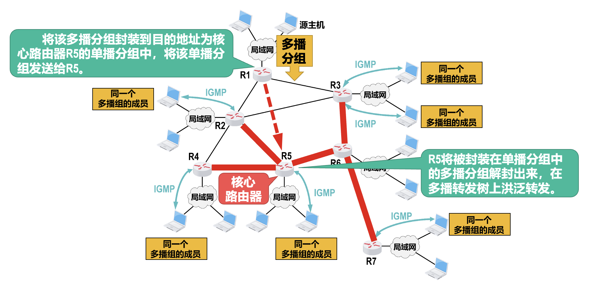
    

---
目前还没有在整个因特网范围使用的多播路由选择协议。下面是一些建议使用的多播路由选择协议：

- 距离向量多播路由选择协议(distance vector multicast routing protocol, DVMRP) [RFC 1075]
- 开放最短路径优先的多播扩展(multicast extensions to OSPF, MOSPF) [RFC 1585]
- 协议无关多播-稀疏方式(protocol independent multicast-sparse mode, PIM-SM) [RFC 2362]
- 协议无关多播-密集方式(protocol independent multicast-dense mode, PIM-DM) [RFC 3973]
- 基于核心的转发树(core based tree, CBT) [RFC 2189]

尽管 IETF 努力推动着因特网上的**全球多播主干网**(multicast backbone on the Internet，**MBONE**)的建设，但至今在因特网上的 IP 多播还没有得到大规模的应用。

- 主要原因是：改变一个已成功运行且广泛部署的网络层协议是一件及其困难的事情
- 目前 IP 多播主要应用在一些局部的园区网络、专用网络或者虚拟专用网中

另外，**P2P 技术**的广泛应用推动了**应用层多播**技术的发展，许多视频流公司和内容分发公司，通过构建自己的应用层多播覆盖网络来分发它们的内容。但上述多播路由选择协议的算法思想在应用层多播中依然适用。

### 移动 IP 技术

**移动 IP**(mobile IP)是 IETF 开发的一种技术（[RFC 3344]）。该技术使得移动主机在各网络之间漫游时，仍然能够保持其原来的 IP 地址不变。移动 IP 技术还为因特网中的非移动主机提供了相应机制，使得它们能够将 IP 数据报正确发送到移动主机。基本概念有：

- 每个移动主机都有一个默认连接的网络或初始申请接入的网络，称为**归属网络**(home network)
- 移动主机在归属网络中的 IP 地址在其整个移动通信过程中是始终不变的，因此称为永久地址(permanent address)或**归属地址**(home address)
- 在归属网络中，代表移动主机执行移动管理功能的实体称为**归属代理**(home agent)；它通常就是连接在归属网络上的路由器，然而它作为代理的特定功能则是在网络层完成的
- 移动主机当前漫游所在的网络称为**外地网络**(foreign network)或被访网络(visited network)
- 在外地网络中，帮助移动主机执行移动管理功能的实体称为**外地代理**(foreign agent)；它通常就是连接在外地网络上的路由器
- 外地代理会为移动主机提供一个临时使用的属于外地网络的**转交地址**(care-of address)

基本工作原理：

- 代理发现与注册

    

        
    

    - 移动主机 A 通过自己的代理发现协议，与外地代理建立联系，并从外地代理获得一个属于该外地网络的转交地址，同时向外地代理注册自己的永久地址和归属代理地址
    - 将移动主机 A 的永久地址记录在自己的注册表中，并向移动主机的归属代理注册该移动主机的转交地址（也可由移动主机直接进行注册）
    - 归属代理会将移动主机 A 的转交地址记录下来，此后归属代理会代替移动主机接收所有发送给该移动主机的 IP 数据报，并利用 **IP 隧道技术**将这些数据报转发给外地网络中的移动主机
    - 当移动主机不在归属网络时，归属代理会以自己的 MAC 地址应答所有对该移动主机的 ARP 请求，即归属代理采用 ARP 代理技术
    - 为了使归属网络中其他各主机和路由器能够尽快更新各自的 ARP 高速缓存，归属代理还会主动发送 ARP 广播，并声称自己是该移动主机，这样所有发送给该移动主机的 IP 数据报都会发送给归属代理

- 固定主机向移动主机发送 IP 数据报

    

        
    

    - 当外地代理和移动主机不是同一台设备时，转交地址实际上是外地代理的地址而不是移动主机的地址，转交地址既不会作为移动主机发送 IP 数据报的源地址，也不会作为移动主机所接收的 IP 数据报的目的地址
    - 转交地址仅仅是归属代理到外地代理的 IP 隧道的出口地址
    - 所有使用同一外地代理的移动主机都可以共享同一个转交地址
    - 当外地代理从 IP 隧道中收到并解封出原 IP 数据报时，会在自己的代理注册表中查找移动主机的永久地址所对应的 MAC 地址，并将该数据报封装到目的地址为该 MAC 地址的帧中发送给移动主机

- 移动主机向固定主机发送 IP 数据报

    

        
    

    - IP 数据报被移动主机 A 按照正常的发送流程发送出去即可
    - 由于 IP 路由器并不关心 IP 数据报的源地址，因此该 IP 数据报被直接路由到固定主机 B，而无须再通过归属代理进行转发
    - 为此，移动主机可以将外地代理作为自己的默认路由器，也可以通过代理发现协议从外地代理获取外地网络中其他路由器的地址，并将其设置为自己的默认路由器

- **同址转交地址**方式

    

        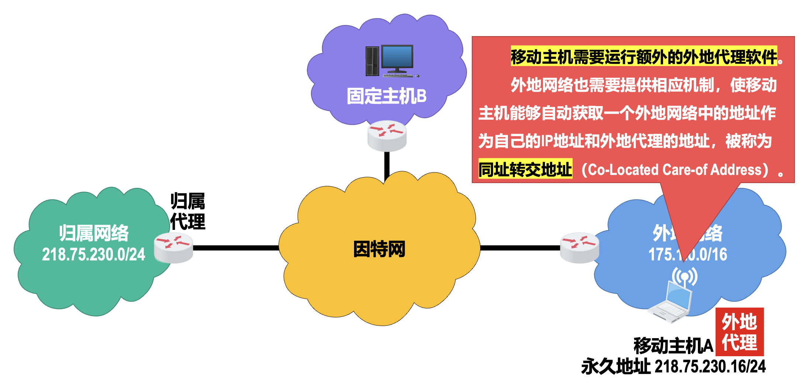
    

- **三角形路由问题**

    

        
    

    - 即使在固定主机与移动主机之间存在一条更有效的路径，发往移动主机的 IP 数据报也要先发送给归属代理，造成 IP 数据报转发的低效
    - 解决三角形路由问题的一种方法：
        - 给固定主机配置一个**通信代理**，固定主机发送给移动主机的 IP 数据报，都要通过该通信代理转发
        - 通信代理先从归属代理获取移动主机的转交地址，之后所有发送给移动主机的 IP 数据报，都利用转交地址直接通过 IP 隧道发送给移动主机的外地代理，而无须再通过移动主机的归属代理进行转发
        - 这种方法以增加复杂性为代价，并要求固定主机也要配置通信代理，也就是对固定主机不再透明

### IPv6

IETF 早在 1992 年就提出要制定下一代的 IP，即 IPng(IP Next Generation)，现在正式称为 **IPv6**。但到目前为止，IPv6 还只是草案标准阶段。

IPv6 引进的主要变化：

- 更大的地址空间：IPv6 将 IPv4 的 32 比特地址空间增大到了 **128 比特**，在采用合理编址方法的情况下，在可预见的
未来是不会用完的
- 扩展的地址层次结构：可划分为更多的层次，这样可以更好地反映出因特网的拓扑结构，使得对寻址和路由层次的设计更具有灵活性。
- 灵活的首部格式：与 IPv4 首部并不兼容；IPv6 定义了许多**可选的的扩展首部**，不仅可提供比 IPv4 更多的功能，而且还可以提高路由器的处理效率，因为路由器对逐跳扩展首部外的其他扩展首部都不进行处理
- 改进的选项：IPv6 允许分组包含有选项的控制信息，因而可以包含一些新的选项；而 IPv4 规定的选项却是固定不变的
- 允许协议继续扩充：这一点很重要，因为技术总是在不断地发展，而新的应用也会层出不穷；而 IPv4 的功能却是固定不变的
- 支持即插即用（即自动配置）：IPv6 支持主机或路由器自动配置 IPv6 地址及其他网络配置参数，因此**不需要使用 DHCP**
- 支持资源的预分配：IPv6 能为实时音视频等要求保证一定带宽和时延的应用，提供更好的服务质量保证

#### 数据报首部

    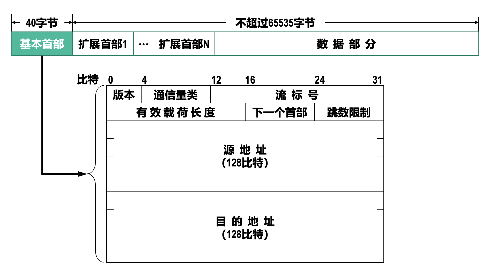

>注：所有的扩展首部并不属于 IPv6 数据报的首部，它们与其后面的数据部分合起来构成有效载荷(payload)（也称为净负荷）。

比较 IPv4 数据报首部和 IPv6 数据报基本首部：

- IPv6 将 IPv4 数据报首部中不必要的功能取消了，这使得 IPv6 数据报基本首部中的字段数量减少到只有 8 个
    - 但由于 IPv6 地址的长度扩展到了 128 比特，因此使得 IPv6 数据报基本首部的长度反而增大到了 40 字节，比 IPv4 数据报首部固定部分的长度增大了 20 字节

- 取消的字段有：
    - 首部长度字段：因为 IPv6 数据报的首部长度是固定的 40 字节
    - 区分服务（服务类型）字段：因为 IPv6 数据报首部中的通信量类和流标号字段实现了区分服务字段的功能
    - 总长度字段：改用有效载荷长度字段；这是因为 IPv6 数据报的首部长度是固定的 40 字节，只有其后面的有效载荷长度是可变的
    - 标识、标志和片偏移字段：因为这些功能已包含在 IPv6 数据报的分片扩展首部中
    - TTL 字段：改称为跳数限制字段，这样名称与作用更加一致
    - 协议字段：改用下一个首部字段
    - 首部检验和字段：可以加快路由器处理 IPv6 数据报的速度
    - 可选字段：改用扩展首部来实现可选功能
    
IPv6 数据报基本首部的字段有：

- 版本：长度为 4 比特，用来表示 IP 协议的版本。对于 IPv6 该字段的值是 6
- 通信量类：长度为 8 比特，该字段用来区分不同的 IPv6 数据报的类别或优先级；目前正在进行不同的通信量类性能的实验
- 流标号：长度为 20 比特
    - IPv6 提出了「**流**」的抽象概念，它是指因特网上从特定源点到特定终点（单播或多播）的一系列 IPv6数 据报（如实时音视频数据的传送），而在这个「流」所经过的路径上的所有路由器都保证指明的服务质量
    - 所有属于同一个流的 IPv6 数据报都具有同样的流标号；换句话说，流标号用于**资源分配**
    - 流标号对于**实时音视频数据**的传送特别有用，但对于传统的非实时数据，流标号则没有用处，把流标号字段的值置为 0 即可

- 有效载荷长度：长度为 16 比特，指明 IPv6 数据报基本首部后面的有效载荷（包括扩展首部和数据部分）的字节数量
    - 该字段以字节为单位，最大取值为 65535，因此 IPv6 数据报基本首部后面的有效载荷的最大长度为 65535 字节

- 下一个首部：长度为 8 比特，相当于 IPv4 数据报首部中的协议字段或可选字段
    - 当 IPv6 数据报**没有扩展首部**时，该字段的作用与 IPv4 的协议字段一样，它的值指出了 IPv6 数据报基本首部后面的数据是何种 PDU
        - 6：TCP 报文段
        - 17：UDP 用户数据报

    - 当 IPv6 数据报基本首部后面带**有扩展首部**时，该字段的值就标识后面第一个扩展首部的类型

        

            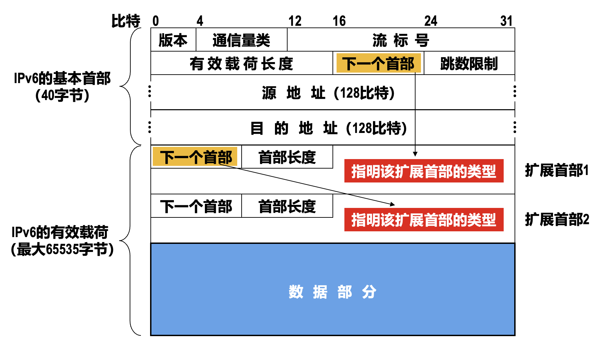
        

- 跳数限制：长度为 8 比特，用来防止 IPv6 数据报在因特网中永久兜圈
    - 源点在每个 IPv6 数据报发出时即设定某个跳数限制（最大 255 跳）
    - 每个路由器在转发 IPv6 数据报时，要先把跳数限制字段中的值减 1。当跳数限制的值为 0 时，就把这个 IPv6 数据报**丢弃**（即不转发）
    - 与 IPv4 数据报首部中的 TTL 字段完全一样；IPv6 将名称改为跳数限制后，可使名称与作用更加一致

- 源地址和目的地址：长度都为 128 比特，分别用来填写 IPv6 数据报的发送端的 IPv6 地址和接收端的 IPv6 地址

---
为了提高路由器对数据包的处理效率，IPv6 把原来 IPv4 首部中的选项字段都放在了**扩展首部**中，由路径两端的源点和终点的主机来处理，而数据报传送路径中的所有路由器都不处理这些扩展首部（除逐跳选项扩展首部）。

在 [RFC 2460] 中定义了以下六种扩展首部：

- 逐跳选项
- 路由选择
- 分片
- 鉴别
- 封装安全有效载荷
- 目的站选项

每一个扩展首部都由若干个字段组成，它们的长度也各不相同。所有扩展首部中的第一个字段都是 8 比特的下一个首部字段。该字段的值指出在该扩展首部后面是何种扩展首部。当使用多个扩展首部时，应按以上的先后顺序出现。

#### IPv6 地址

IPv6 地址表示方法：

- 在 IPv6 地址的**冒号十六进制记法**的基础上，再使用左侧零省略和连续零压缩，可使 IPv6 地址的表示更加简洁
    - **左侧零省略**是指两个冒号间的十六进制数中最前面的一串 0 可以省略不写
    - **连续零压缩**是指一连串连续的 0 可以用一对冒号取代

    ??? example "例子"

        

            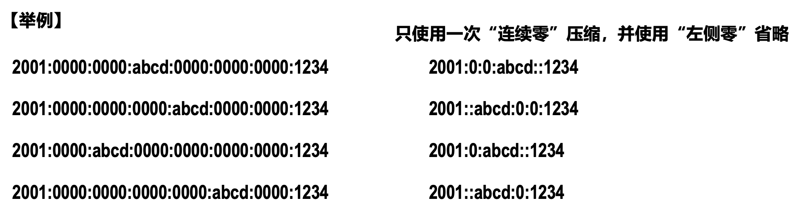
        

- 在一个 IPv6 地址中**只能使用一次连续零压缩**，否则会导致歧义
- 冒号十六进制记法还可结合**点分十进制的后缀**，这在 IPv4 向 IPv6 过渡阶段非常有用

    

        
    

- **CIDR 的斜线表示法**在 IPv6 中仍然可用

    

        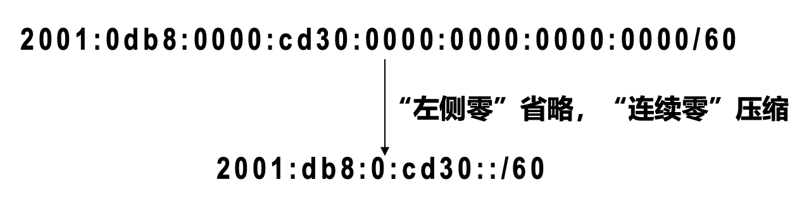
    

IPv6 数据报的**目的地址**有三种基本类型：

- **单播**(unicast)：传统的点对点通信
- **多播**(multicast)：一点对多点的通信，数据报发送到一组计算机中的每一个；IPv6 没有采用广播的术语，而将广播看作多播的一个特例
- **任播**(anycast)：这是 IPv6 新增的一种类型；任播终点是一组计算机，但数据报只交付其中的一个，通常是按照路由算法得出的距离最近的一个

[RFC 4291] 对 IPv6 地址进行了分类：

- **未指明地址**：
    - 128 个比特为全 0 的地址，可缩写为两个冒号 `::`。
    - 该地址不能用作目的地址，只能用于还没有配置到一个标准 IPv6 地址的主机用作源地址
    - 仅有一个
- **环回地址**：
    - 最低比特为 1，其余 127 个比特为全 0，即`0:0:0:0:0:0:0:1`，可缩写为 `::1`
    - 作用与 IPv4 的环回地址相同
    - 只有一个

- **多播地址**：
    - 最高 8 比特为全 1 的地址，可记为 `FF00::/8`
    - 功能与 IPv4 多播地址相同
    - 这类地址占 IPv6 地址空间的 1/256

- **本地链路单播地址**：
    - 最高 10 比特为 1111111010 的地址，可记为 `FE80::/10`
    - 即使用户网络没有连接到因特网，但仍然可以使用 TCP/IP 协议；连接在这种网络上的主机都可以使用本地链路单播地址进行通信，但不能和因特网上的其他主机通信
    - 这类地址占 IPv6 地址空间的 1/1024

- **全球单播地址**：
    - 使用得最多的一类地址
    - IPv6 全球单播地址采用三级结构，这是为了使路由器可以更快地查找路由
    
    

        
    

#### 从 IPv4 向 IPv6 过渡

因特网上使用 IPv4 的路由器的数量太大，要让所有路由器都改用 IPv6 并不能一蹴而就。因此，从 IPv4 转变到 IPv6 只能采用逐步演进的办法。另外，新部署的 IPv6 系统必须能够**向后兼容**，也就是 IPv6 系统必须能够接收和转发 IPv4 数据报，并且能够为 IPv4 数据报选择路由。

下面介绍两种由 IPv4 向 IPv6 过渡的策略：

- **双协议栈**(dual stack)：在完全过渡到 IPv6 之前，使一部分主机或路由器装有 IPv4 和 IPv6 两套协议栈
    - 双协议栈主机或路由器既可以和 IPv6 系统通信，又可以和 IPv4 系统通信
    - 双协议栈主机或路由器记为 IPv6/IPv4，表明它具有一个 IPv6 地址和一个 IPv4 地址
    - 双协议栈主机通过 DNS 查询目的主机采用的 IP 地址：
        - 若 DNS 返回的是 IPv4 地址，则双协议栈的源主机就使用 IPv4 地址
        - 若 DNS 返回的是 IPv6 地址，则双协议栈的源主机就使用 IPv6 地址

    

        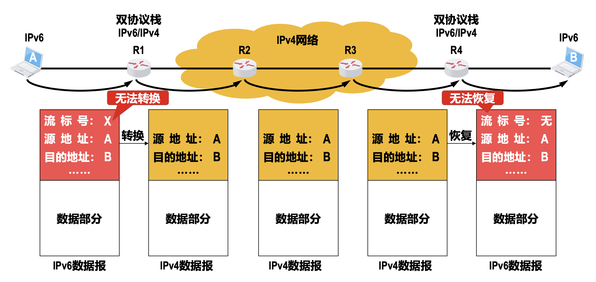
    

- **隧道技术**(tunneling)：
    - 当 IPv6 数据报要进入 IPv4 网络时，将 IPv6 数据报重新封装成 IPv4 数据报，即整个 IPv6 数据报成为 IPv4 数据报的数据载荷
    - 封装有 IPv6 数据报的 IPv4 数据报在 IPv4 网络中传输
    - 当 IPv4 数据报要离开 IPv4 网络时，再将其数据载荷（即原来的 IPv6 数据报）取出并转发到 IPv6 网络

    

        
    

#### 网际控制报文协议 ICMPv6

由于 IPv6 与 IPv4 一样，都不确保数据报的可靠交付，因此 IPv6 也需要使用网际控制报文协议（ICMP）来向发送 IPv6 数据报的源主机反馈一些差错信息，相应的 ICMP 版本为 **ICMPv6**。ICMPv6 比 ICMPv4 要复杂得多，它合并了原来的 ARP 和 IGMP 的功能，因此与 IPv6 配套使用的网际层协议就只有 ICMPv6 这一个协议。

ICMPv6 报文需要封装成 IPv6 数据报进行发送。

    
    

ICMPv6 报文可被用来报告差错、获取信息、探测邻站或管理多播通信。在对 ICMPv6 报文进行分类时，不同的 RFC 文档使用了不同的策略：

- 在 [RFC 2463] 中定义了六种类型的 ICMPv6 报文
- 在 [RFC 2461] 中定义了五种类型的 ICMPv6 报文
- 在 [RFC 2710] 中定义了三种类型的 ICMPv6 报文

    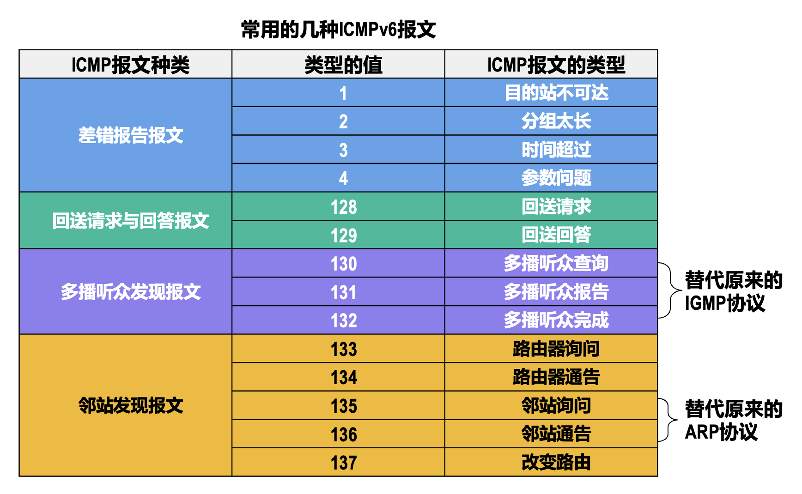

### 软件定义网络

**软件定义网络**(software defined network, SDN)的概念最早由斯坦福大学的 Nick McKeown 教授于 2009 年提出，最初只是学术界讨论的一种新型网络体系结构。

- 成功案例：Google 于 2010~2012 年间建立的数据中心网络 B4
- SDN 是当前网络领域最热门和最具发展前途的技术之一，成为近年来的研究热点

#### 网络层的数据层面和控制层面

路由器的功能：

- 为主机间的通信提供**转发**服务
- **路由选择**

路由器之间传送的信息：

- 主机间的分组
- 路由信息

在 SDN 体系结构中，路由器中的路由软件都不存在了。因此，路由器之间不再交换路由信息。在**控制层面**中，有一个在逻辑上集中的**远程控制器**；它在物理上可由不同地点的多个服务器组成。它的功能包括：

- 掌握各主机和整个网络的状态
- 能够为每一个分组计算出最佳的路由
- 为每一个路由器生成其正确的转发表

    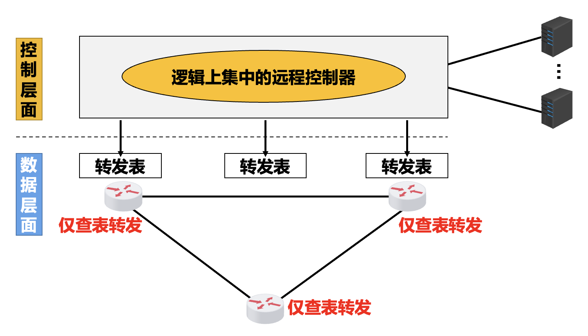

SDN 的核心思想：把网络的控制层面和数据层面分离，而让控制层面利用软件来控制数据层面中的许多设备。

!!! info "注"

    SDN 并非现在就要把整个因特网都改造成集中控制模式，因为这显然是不现实的。但在某些具体条件下，尤其是一些大型数据中心之间的广域网，如果采用 SDN 模式来建造，就可以提高网络的运行效率，还可以获得更好的经济效益。

## 运输层

### 概述

#### 进程间基于网络的通信

前面介绍的物理层、数据链路层和网络层共同解决了将主机通过异构网络互联起来所面临的问题，实现了主机到主机的通信。然而，在计算机网络中，实际进行通信的**真正实体**，是位于通信两端主机中的**进程**。如何为运行在不同主机上的应用进程提供直接的逻辑通信服务，就是**运输层**的主要任务。运输层协议又称为端到端协议。

    

运输层向应用层实体屏蔽了下面网络核心的细节（例如网络拓扑、所采用的路由选择协议等），它使应用进程看见的就好像是在两个运输层实体之间有一条端到端的逻辑通信信道。

#### 两个重要协议

- **传输控制协议**(transmission control protocol, **TCP**)
    - 为上层提供的是**面向连接**的**可靠**的数据传输服务
    - 使用 TCP 通信的双方，在传送数据之前必须首先**建立 TCP 连接**（逻辑连接，而非物理连接）；数据传输结束后必须要**释放 TCP 连接**
    - 为了实现可靠传输，必须使用很多措施，例如 TCP 连接管理、确认机制、超时重传、流量控制以及拥塞控制等
    - 实现复杂，TCP 报文段的首部比较大，占用处理机资源比较多

- **用户数据报协议**(user datagram protocol, **UDP**)
    - 为上层提供的是**无连接**的**不可靠**的数据传输服务
    - 使用 UDP 通信的双方，在传送数据之前不需要建立连接
    - 由于不需要实现可靠传输，因此不需要使用实现可靠传输的各种机制
    - 实现简单，UDP 用户数据报的首部比较小

??? example "例子"

    因特网中的一些典型应用所使用的 TCP/IP 应用层协议和相应的运输层协议。

    

        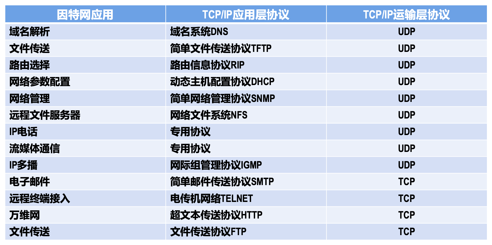
    

#### 运输层端口号

运行在计算机上的进程是使用**进程标识符**(process identification, **PID**)来标识的。

- 然而，因特网上的计算机并不是使用统一的操作系统，而不同操作系统又使用不同格式的进程标识符
- 为了使运行不同操作系统的计算机的应用进程之间能够基于网络进行通信，就必须使用**统一**的方法对 TCP/IP 体系的应用进程进行标识

TCP/IP 体系结构的运输层使用**端口号**来标识和区分应用层的不同应用进程。端口号的长度为 16 比特，取值范围是 0~65535。

    

- 常见的熟知端口号：
    - FTP：21/20
    - SMTP：25
    - DNS：53
    - DHCP：67/68
    - HTTP：80
    - BGP：179
    - HTTPS：443
    - RIP：520
- 端口号**只具有本地意义**，即端口号只是为了标识本计算机网络协议栈应用层中的各应用进程；在因特网中，不同计算机中的相同端口号是没有关系的，即相互独立
- 另外，TCP 和 UDP 端口号之间也是没有关系的

#### 发送方复用和接收方分用

    

    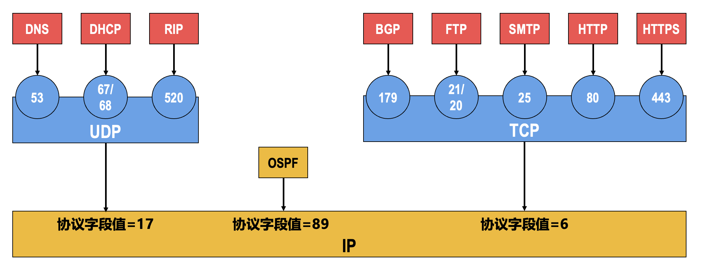

??? example "例子"

    ???+ info "说明"

        - 对于本应用实例，应将重点放在端口号、TCP/IP 应用层常用协议所使用的运输层协议（UDP 和 TCP）和熟知端口号上
        - 为了简单起见，在本应用实例中省略了很多相关过程，例如之前曾介绍过的 ARP，以及后续将介绍的 TCP 连接管理、相关应用层协议的工作原理等

    

        
    

### UDP 和 TCP 的对比

    

#### 对单播、多播和广播的支持情况

    

#### 对应用层报文的处理

    

#### 对数据传输可靠性的支持情况

    

#### 首部对比

    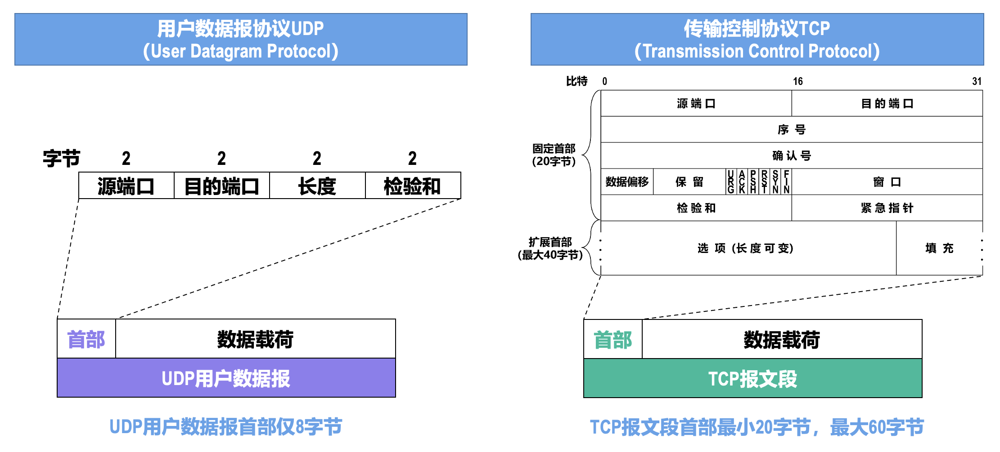

### 传输控制协议

#### 报文段首部格式

    

- **序号**：
    - 占 32 比特，取值范围 0~2^32^-1
    - 当序号增加到最后一个时，下一个序号又回到 0
    - 用来指出本 TCP 报文段数据载荷的第一个字节的序号

- **确认号**：
    - 占 32 比特，取值范围0~2^32^-1
    - 当确认号增加到最后一个时，下一个确认号又回到 0
    - 用来指出期望收到对方下一个 TCP 报文段的数据载荷的第一个字节的序号，同时也是对之前收到的所有数据的确认

- 确认标志位 **ACK**：
    - 只有当 ACK 取值为 1 时，确认号字段才有效；取值为 0 时，确认号字段无效
    - TCP 规定：在 TCP 连接建立后，所有传送的 TCP 报文段都必须把 ACK 置 1

>注：以上三个字段是 TCP 实现**可靠传输**的相关字段。

- **数据偏移**
    - 占 4 比特，该字段的取值**以 4 字节为单位**
    - 指出 TCP 报文段的数据载荷部分的起始处距离 TCP 报文段的起始处有多远，这实际上指出了 TCP 报文段的**首部长度**

    

        
    

- **保留**
    - 占 6 比特
    - 保留为今后使用
    - 目前应置为 0

- **窗口**
    - 占 16 比特，该字段的取值**以字节为单位**
    - 指出发送本报文段的一方的**接收窗口的大小**，即接收缓存的可用空间大小，这用来表征接收方的接收能力
    - 在计算机网络中，经常用接收方的接收能力的大小来控制发送方的数据发送量，这就是所谓的**流量控制**

- 检验和
    - 占 16 比特
    - 用来检查整个 TCP 报文段在传输过程中是否出现了误码

    

        
    

    - **发送方**检验和计算方法：
        1. 将 TCP 首部中检验和字段的值置为 0
        2. 将伪首部、TCP 首部以及数据载荷这三部分划分成**若干个 2 字节的字**；若伪首部、TCP 首部以及数据载荷这三部分的总长度不是偶数个字节，则在最后添加 1 个全 0 字节
        3. 对划分出的全部 2 字节的字进行**反码算术运算求和**，并将求和结果**取反码**
        4. 将步骤 c 得到的结果写入 TCP 首部中的检验和字段

    - **接收方**通过检验和字段的值判断 TCP 报文段在传输过程中是否误码的方法：
        1. 给接收到的 TCP 报文段前面添加一个 12 字节的伪首部
        2. 将伪首部、TCP 首部以及数据载荷这三部分划分成若干个 2 字节的字
        3. 对划分出的全部 2 字节的字进行反码算数运算求和，并将求和结果取反码
        4. 若步骤 c 得到的结果为 0，则表示 TCP 报文段在传输过程中没有误码，否则表示出现了误码

- 同步标志位 **SYN**
    - 用于 TCP 三报文握手**建立连接**
    - 当 SYN=1 且 ACK=0 时，表明这是一个 **TCP 连接请求报文段**
    - 对方若同意建立连接，则应在**响应的 TCP 报文段**的首部中使 SYN=1 且 ACK=1
    - 综上所述，SYN 为 1 的 TCP 报文段要么是一个连接请求报文段，要么是一个连接响应报文段

- 终止标志位 **FIN**
    - 用于 TCP 四报文挥手**释放连接**
    - 当 FIN=1 时，表明此 TCP 报文段的发送方已经将全部数据发送完毕，现在要求释放 TCP 连接

- 复位标志位 **RST**
    - 用于**复位 TCP 连接**
    - 当 RST=1 时，表明 TCP 连接中出现**严重差错**，必须释放连接，然后再重新建立连接
    - RST 置 1 还用来拒绝一个非法的 TCP 报文段或拒绝打开一个 TCP 连接

- 推送标志位 **PSH**
    - **发送方** TCP 把 PSH 置 1，并立即创建一个 TCP 报文段发送出去，而不需要积累到足够多的数据再发送
    - **接收方** TCP 收到 PSH 为 1 的 TCP 报文段，就尽快地交付给应用进程，而不再等到接收到足够多的数据才向上交付

    ???+ info "说明"

        - 出于效率的考虑，TCP 的发送方可能会**延迟发送数据**，而 TCP 的接收方可能会延迟向应用进程交付数据，这样可以一次处理更多的数据。
        - 但是当两个应用进程进行交互式通信时，有时在一端的应用进程希望在键入一个命令后立即就能够收到对方的响应。在这种情况下，应用进程可以通知 TCP 使用**推送**（PUSH）操作

- 紧急标志位 **URG**
    - 当 URG=1 时，紧急指针字段有效
    - 当 URG=0 时，紧急指针字段无效

- **紧急指针**
    - 占 16 比特，以字节为单位，用来指明**紧急数据的长度**
    - 当**发送方**有紧急数据时，可将紧急数据**插队**到发送缓存的最前面，并立刻封装到一个 TCP 报文段中进行发送。紧急指针会指出本报文段数据载荷部分包含了多长的紧急数据，紧急数据之后是普通数据
    - **接收方**收到紧急标志位为 1 的 TCP 报文段，会按照紧急指针字段的值从报文段数据载荷中取出紧急数据并直接上交应用进程，而不必在接收缓存中排队

- 选项（长度可变，最大 40 字节）
    - 最大报文段长度（MSS）选项：指出 TCP 报文段数据载荷部分的最大长度，而不是整个 TCP 报文段的长度
    - 窗口扩大选项：用来扩大窗口，提高吞吐率
    - 时间戳选项：
        - 用于计算往返时间（RTT）
        - 用于处理序号超范围的情况，又称为防止序号绕回（PAWS）
    - 选择确认选项：用来实现选择确认功能

- 填充：若选项字段的长度加上 20 字节固定首部的长度不能被 4 字节整除时，需要填充相应数量的比特 0，以确保首部长度能被 4 字节整除
    - 与 IPv4 数据报首部中的填充字段作用一样
    

#### 运输连接管理

TCP 运输连接有以下三个阶段：

1. 通过**三报文握手**来**建立** TCP 连接
2. 基于已建立的 TCP 连接进行可靠的数据传输
3. 在数据传输结束后，还要通过**四报文挥手**来**释放** TCP 连接

---
三报文握手建立 TCP 连接的目的在于解决以下三个主要问题：

- 使 TCP 双方能够确知对方的存在
- 使 TCP 双方能够协商一些参数（例如最大报文段长度、最大窗口大小、时间戳选项等）
- 使 TCP 双方能够对运输实体资源进行分配和初始化
    - 运输实体资源包括缓存大小、各状态变量、连接表中的项目等

三报文握手建立 TCP 连接的过程如下：

    

- **传输控制块**（TCB）包括 TCP 连接表、指向发送和接收缓存的指针、指向重传队列的指针、当前的发送和接收序号等
- TCP 连接请求报文段和 TCP 连接请求确认报文段首部中的 **SYN 的值必须设置为 1**
- seq 字段被设置了一个初始值 x，作为 TCP **客户进程**所选择的初始序号
    - TCP 规定 SYN 被设置为 1 的报文段不能携带数据，但要消耗掉一个序号
    - 对于本例，就要消耗掉序号 x，因此，TCP 客户进程下一次发送的 TCP 报文段的数据载荷的第一个字节的序号为 x+1

- seq 字段被设置了一个初始值 y，作为 TCP **服务器进程**所选择的初始序号
- ack 字段的值被设置为 x+1，这是对 TCP 客户进程所选择的初始序号 x 的确认
- 因为 TCP 客户进程之前发送的 TCP 连接请求报文段的序号为 x，该报文段虽然不能携带数据，但要消耗掉一个序号，因此 TCP 客户进程发送的第二个报文段的序号为 x+1
    - TCP 规定普通的 TCP 确认报文段可以携带数据，但如果不携带数据，则不消耗序号
    - 如果该报文段不携带数据，则 TCP 客户进程要发送的下一个数据报文段的序号仍为 x+1

- ack 字段的值被设置为 y+1，这是对 TCP 服务器进程所选择的初始序号 y 的确认

采用三报文握手而不是两报文握手来建立 TCP 连接，是为了防止已失效的 TCP 连接请求报文段突然又传送到了 TCP 服务器进程，因而导致错误。

    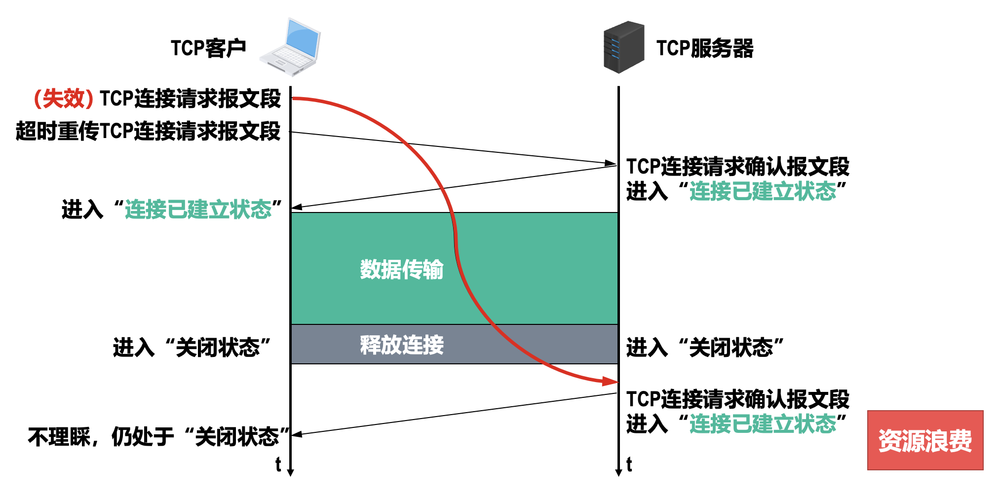

---
四报文挥手释放 TCP 连接的过程如下：

    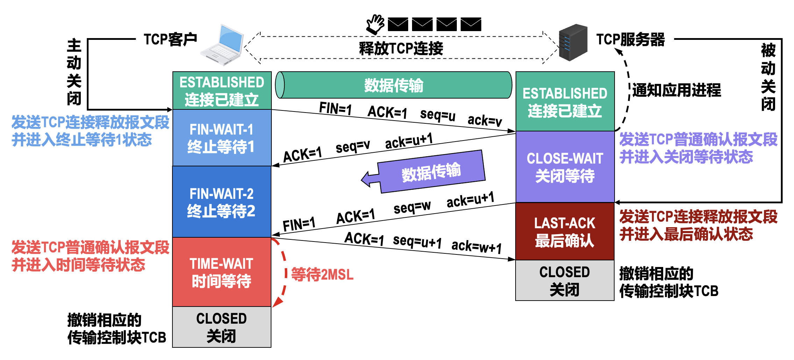

- TCP 连接释放报文段首部中的 FIN 和 ACK 的值都被设置为 1，表明这是一个 TCP 连接释放报文段，同时也对之前收到的 TCP 报文段进行确认
- seq 字段的值设置为 u，它等于 TCP 客户进程之前已经传送过的数据的最后一个字节的序号加 1
- TCP 规定 FIN=1 的 TCP 报文段即使不携带数据，也要消耗掉一个序号
- ack 字段的值设置为 v，它等于 TCP 客户进程之前已收到的数据的最后一个字节的序号加 1
- seq 字段的值设置为 v，它等于 TCP 服务器进程之前已传送过的数据的最后一个字节的序号加 1，这也与之前收到的 TCP 连接释放报文段中的确认号 v 匹配
- ack 字段的值设置为 u+1，这是对 TCP 连接释放报文段的确认
- TCP 服务器进入关闭等待状态意味着此时的 TCP 连接属于半关闭状态：从 TCP 客户进程到 TCP 服务器进程这个方向的连接就释放了
    - TCP 客户进程已经没有数据要发送了，但 TCP 服务器进程如果还有数据要发送，TCP 客户进程仍要接收，也就是从 TCP 服务器进程到 TCP 客户进程这个方向的连接并未关闭
    - 半关闭状态可能会持续一段时间
    
- seq 字段的值假定被设置为 w，这是因为在半关闭状态下 TCP 服务器进程可能又发送了一些数据
- ack 字段的值被设置为 u+1，这是对之前收到的 TCP 连接释放报文段的重复确认
- seq 字段的值设置为 u+1，这是因为 TCP 客户进程之前发送的 TCP 连接释放报文段虽然不携带数据，但要消耗掉一个序号
- ack 字段的值设置为 w+1，这是对所收到的 TCP 连接释放报文段的确认
- **最长报文段寿命**(maximum segment lifetime, MSL)：[RFC793] 建议为 2 分钟；也就是说，TCP 客户进程进入时间等待（TIME-WAIT）状态后，还要经过 4 分钟才能进入关闭（CLOSED）状态
    - 这完全是从工程上来考虑的；对于现在的网络，MSL 取为 2 分钟可能太长了，因此 TCP 允许不同的实现可根据具体情况使用更小的 MSL 值

    

- 处于时间等待（TIME-WAIT）状态后要经过 2MSL 时长，可以确保 TCP 服务器进程能够收到最后一个 TCP 确认报文段而进入关闭（CLOSED）状态
- 另外，TCP 客户进程在发送完最后一个 TCP 确认报文段后，再经过 2MSL 时长，就可以使本次连接持续时间内所产生的的所有报文段都从网络中消失，这样就可以使下一个新的 TCP 连接中不会出现旧连接中的报文段

TCP 保活计时器的作用：

    

#### 流量控制

TCP 为应用程序提供了**流量控制**(flow control)机制，以解决因发送方发送数据太快而导致接收方来不及接收，造成接收方的接收缓存溢出的问题。

    

???+ example "例子"

    

        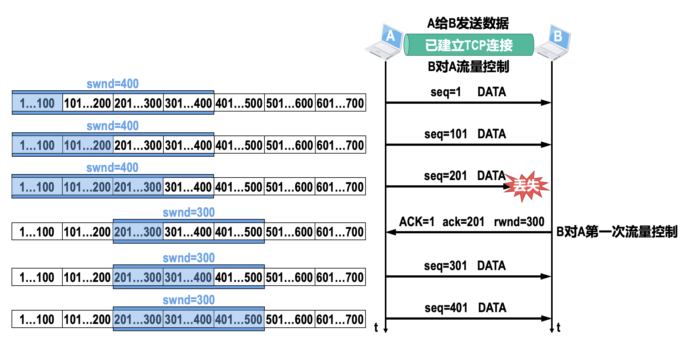
    

    

        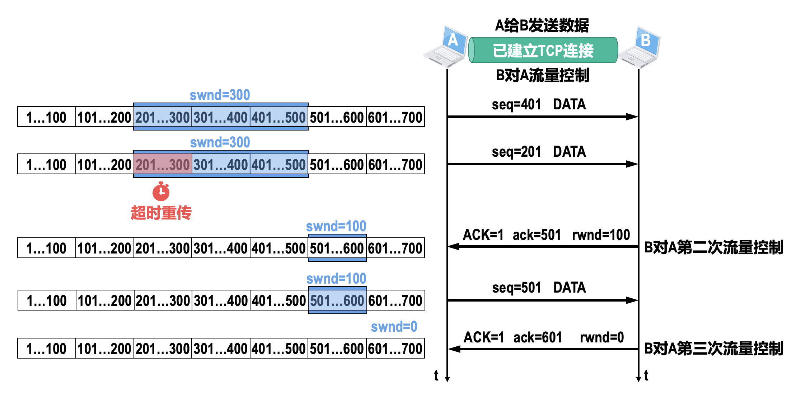
    

    

        
    

为了打破由于非零窗口通知报文段丢失而引起的双方互相等待的死锁局面，TCP 为每一个连接都设有一个**持续计时器**。

- 只要 TCP 连接的一方收到对方的零窗口通知，就启动持续计时器
- 当持续计时器**超时**时，就发送一个**零窗口探测报文段**，仅携带 1 字节的数据
- 对方在确认这个零窗口探测报文段时，给出自己现在的**接收窗口值**
- 如果接收窗口值仍然是 0，那么收到这个报文段的一方就**重新启动**持续计时器
- 如果接收窗口值不是 0，那么死锁的局面就可以被打破了
- TCP 规定：即使接收窗口值为 0，也必须接受零窗口探测报文段、确认报文段以及携带有紧急数据的报文段
- 如果零窗口探测报文段丢失了，也能打破死锁局面，因为零窗口探测报文段也有重传计时器；当重传计时器超时后，零窗口探测报文段会被重传

???+ example "例子"

    

        
    

#### 拥塞控制

在某段时间，若对网络中某一资源的需求超过了该资源所能提供的可用部分，网络性能就要变坏，这种情况就叫作**拥塞**(congestion)。若出现拥塞而不进行控制，整个网络的吞吐量将随输入负荷的增大而下降。

    

??? info "流量控制 vs 拥塞控制"

    - 流量控制：以**接收方的接收能力**控制发送方（源点）的发送速率，只与特定的点对点通信的发送方和接收方之间的流量有关
    - 拥塞控制：源点根据**各方面因素**，按拥塞控制算法自行控制发送速率全局性问题，涉及网络中所有的主机、路由器等

拥塞控制可分为：

- **开环**控制
    - 试图用良好的设计来解决问题
    - 从一开始就保证问题不会发生
    - 一旦系统启动并运行起来，就不需要中途修正
    - 当网络的流量特征可以**准确规定**且性能要求可以**事先获得**时，适合使用开环控制
    
- **闭环**控制
    - 基于反馈的控制方法，包括以下三个部分：
        - 监测网络拥塞在何时、何地发生
        - 把拥塞发生的相关信息传送到可以采取行动的地方
        - 调整网络的运行以解决拥塞问题

    - 当网络的流量特征**不能准确描述**或者当网络**不提供资源预留**时，适合使用闭环控制
    - **因特网**采用的就是闭环控制方法

衡量网络拥塞的指标：

- 由于缓存溢出而丢弃的分组的百分比
- 路由器的平均队列长度
- 超时重传的分组数量
- 平均分组时延和分组时延的标准差
- ...

根据拥塞信息的反馈形式，可将闭环拥塞控制算法分为：

- **显式**反馈算法：从**拥塞节点**（即**路由器**）向源点提供关于网络中拥塞状态的显式反馈信息
- **隐式**反馈算法：**源点自身**通过对网络行为的观察（例如超时重传或往返时间RTT）来推断网络是否发生了拥塞
    - **TCP** 采用的就是隐式反馈算法

拥塞控制并不仅仅是运输层要考虑的问题；**显式**反馈算法就必须涉及**网络层**。虽然一些网络体系结构（如 ATM 网络）主要在网络层实现拥塞控制，但**因特网**主要利用**隐式**反馈在运输层实现拥塞控制。

进行拥塞控制是需要付出代价的：

- 可能需要在节点之间**交换信息和各种命令**，以便选择拥塞控制的策略井实施控制，这样会产生额外开销
- 可能需要**预留一些资源**用于特殊用户或特殊情况，这样就降低了网络资源的共享程度

然而，为了确保网络性能的稳定，不会因为输入负载的增长而导致网络性能的恶化甚至出现崩溃，使用拥塞控制而付出一定的代价是值得的。

---
???+ info "说明"

    为了集中精力讨论拥塞控制算法的基本原理，假定如下条件：

    - **数据是单方向传送的**，而另一个方向只传送确认
    - 接收方总是有足够大的接收缓存空间，因而发送方的发送窗口的大小仅由网络的拥塞程度来决定，也就是**不考虑接收方对发送方的流量控制**
    - 以 **TCP 最大报文段（MSS）**（即 TCP 报文段的数据载荷部分）的个数作为讨论问题的单位，而不是以字节为单位（尽管 TCP 是面向字节流的）

    

    

TCP 的几种拥塞控制算法包括：

- **慢开始**(slow-start) + **拥塞避免**(congestion avoidance)
    - 慢开始：一开始向网络注入的报文段少，而并不是指拥塞窗口 cwnd 的值增长速度慢
    - 拥塞避免：并非指完全能够避免拥塞，而是指在拥塞避免阶段将 cwnd 值控制为按线性规律增长，使网络比较不容易出现拥塞

    

        
    

    ???+ example "例子"

        === "Stage 1"

            

                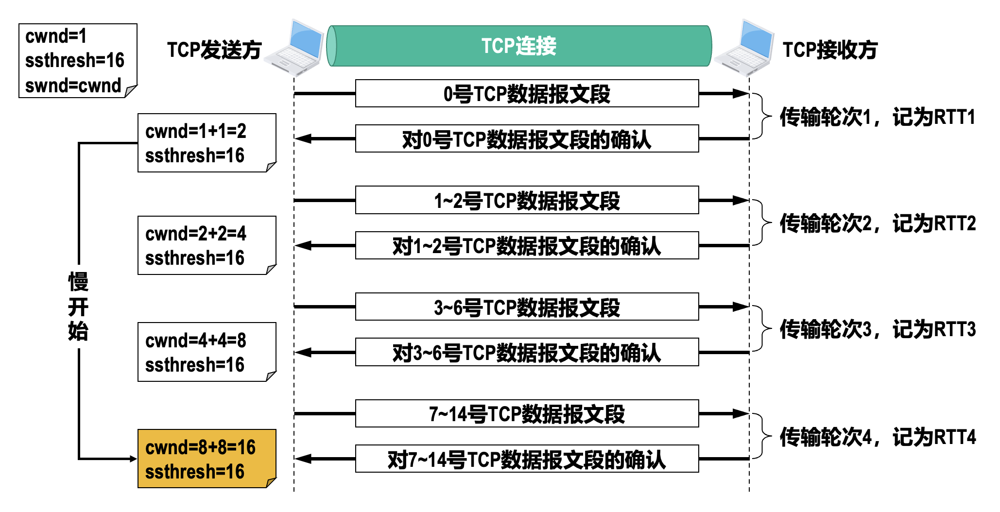
            

        === "Stage 2"

            

                
            

        === "Stage 3"

            

                
            

        === "Stage 4"

            

                
            

        === "Stage 5"

            

                
            

- **快重传**(fast retransmit) + **快恢复**(fast recovery)
    - 采用快重传算法可以让发送方尽早知道发生了个别 TCP 报文段的丢失
    - “快重传”是指使发送方尽快（尽早）进行重传，而不是等重传计时器超时再重传
        - 这就要求接收方不要等待自己发送数据时才进行捎带确认，而是要立即发送确认，即使收到了失序的报文段也要立即发出对已收到的报文段的重复确认
        - 发送方一旦收到 3 个连续的重复确认，就将相应的报文段立即重传，而不是等该报文段的重传计时器超时再重传

    - 对于个别丢失的报文段，发送方不会出现超时重传，也就不会误认为出现了拥塞而错误地把拥塞窗口 cwnd 的值减为 1。实践证明，使用快重传可以使整个网络的吞吐量提高约 20%

    ???+ example "例子"

        

            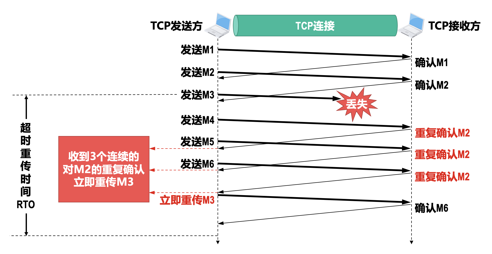
        

    - 与快重传算法配合使用的是快恢复算法，发送方一旦收到 3 个重复确认，就知道现在只是丢失了个别的报文段，于是不启动慢开始算法，而是执行快恢复算法
        - 发送方将慢开始门限 ssthresh 的值和拥塞窗口 cwnd 的值都调整为当前 cwnd 值的一半，并开始执行拥塞避免算法
        - 也有的快恢复实现是把快恢复开始时的 cwnd 值再增大一些，即 cwnd = 新ssthresh + 3
            - 既然发送方收到了 3 个重复的确认，就表明有 3 个数据报文段已经离开了网络
            - 这 3 个报文段不再消耗网络资源而是停留在接收方的接收缓存中
            - 可见现在网络中不是堆积了报文段而是减少了 3 个报文段，因此可以适当把 cwnd 值增大一些

    

        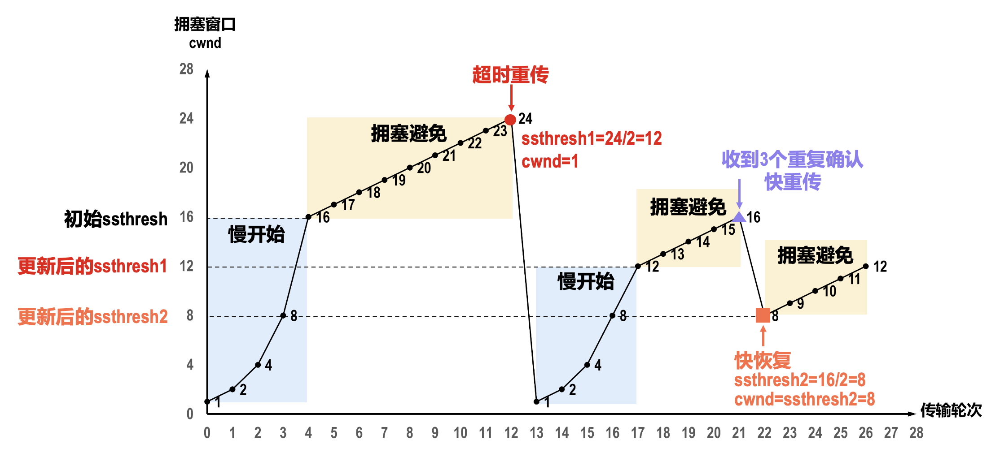
    

---
TCP 拥塞控制与网际层拥塞控制的关系

路由器的输入缓存（可看作缓存队列，以下简称为队列）通常都按照**先进先出（FIFO）**的规则来处理到达的 IP 数据报。由于队列长度总是有限的，因此当队列已满时，之后再到达的所有 IP 数据报都将被丢弃，这就叫作**尾部丢弃策略**。

    

为了避免网络中出现全局同步问题，在 1998 年提出了**主动队列管理**(active queue management, **AQM**)：

- 所谓“主动”，就是在路由器的队列长度达到某个阈值但还未满时就主动丢弃 IP 数据报，而不是要等到路由器的队列已满时才不得不丢弃后面到达的 IP 数据报，这样就太被动了
- 应当在路由器队列长度达到某个值得警惕的数值时，也就是网络出现了某些拥塞征兆时，就主动丢弃到达的 IP 数据报来造成发送方的超时重传，进而降低发送方的发送速率，因而有可能减轻网络的拥塞程度，甚至不出现网络拥塞

AQM 可以有不同的实现方法，其中曾流行多年的就是**随机早期检测**(random early detection，**RED**)（也称为随机早期丢弃(random early drop/discard)）。路由器需要维护两个参数来实现 RED：**队列长度最小门限和最大门限**。当每一个 IP 数据报到达路由器时，RED 就按照规定的算法计算出当前的平均队列长度。

- 若平均队列长度小于最小门限，则把新到达的 IP 数据报存入队列进行排队
- 若平均队列长度大于最大门限，则把新到达的 IP 数据报丢弃
- 若平均队列长度在最小门限和最大门限之间，则按照某一丢弃概率 p 把新到达的 IP 数据报丢弃（这体现了丢弃 IP 数据报的随机性）

???+ warning "注意"

    IETF 曾经推荐在因特网中的路由器使用 RED 机制 [RFC 2309]。但多年的实践证明，RED 的使用效果并不理想。因此，在 2015 年公布的 [RFC 7567] 已经把 [RFC 2309] 列为“陈旧的”，并且不**再推荐使用 RED**。
    
    然而，**对路由器进行 AQM 仍然是必要的**。现在已经有几种不同的算法来代替旧的 RED，但都还在实验阶段。目前还没有一种算法能够成为 IETF 的标准，对此感兴趣的读者可以注意这方面的进展。

#### 可靠传输的表现

???+ example "例子"

    === "Stage 1"

        

            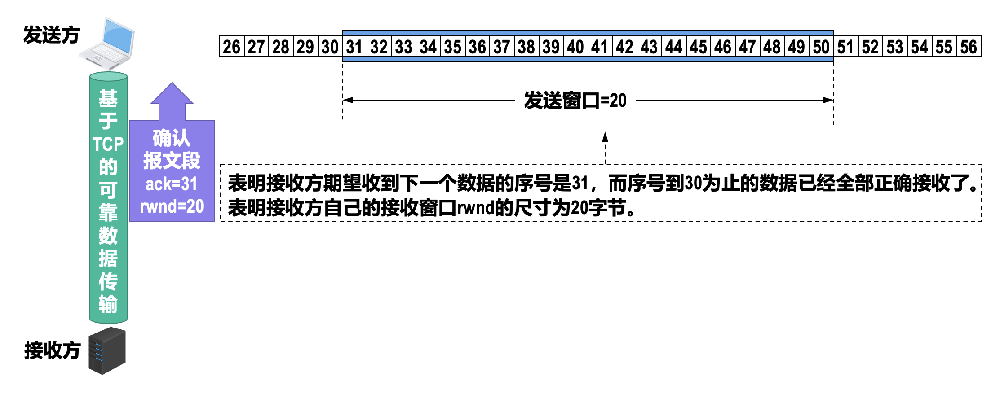
        

        - 注意：ack~n~ 在选择重传协议与 TCP 协议中并不完全相同
            - 在选择重传协议中， ack~n~ 表明序号到 n 为止的数据已正确接收，现在期望收到序号为 n+1 的数据
            - 在 TCP 协议中， ack~n~ 表明序号到 n-1 为止的数据已正确接收，现在期望收到序号为 n 的数据

        - 为了简单起见，假定网络不存在拥塞问题，也就是发送方在构造自己的发送窗口 swnd 时，仅考虑接收方的接收窗口 rwnd，而不考虑发送方自己的拥塞窗口 cwnd
        - 由于本例中接收方告诉发送方自己的接收窗口 rwnd 的值为 20，因此发送方将自己的发送窗口 swnd 的值也设置为 20
        - 发送方在没有收到接收方确认的情况下，可以把序号落入发送窗口内的数据依次全部发送出去
        - 凡是已经发送过的数据，在未收到确认之前都必须暂时保留，以便在超时重传时使用

    === "Stage 2"

        

            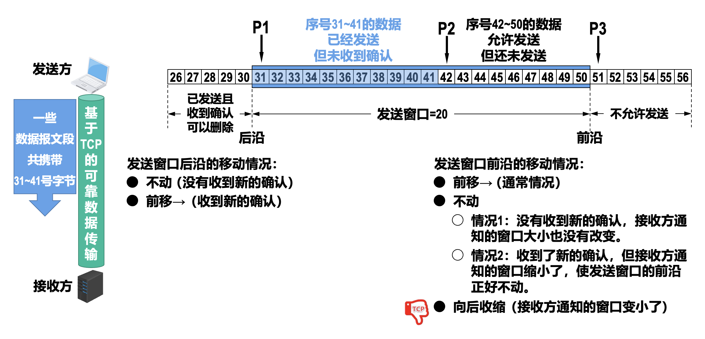
        

        使用三个指针 P1、P2、P3 分别指向相应的字节序号：

        - P1 指向发送窗口内已发送但还未收到确认的第一个数据的序号
        - P2 指向发送窗口内还未发送的第一个数据的序号
        - P3 指向发送窗口前沿外的第一个数据的序号

        这样就可以用这三个指针来描述发送窗口的相关信息：

        - 小于 P1 的就是已发送并已收到确认的部分
        - 大于等于 P3 的就是不允许发送的部分
        - P3 - P1 = 发送窗口尺寸
        - P2 - P1 = 已发送但还未收到确认的字节数量
        - P3 - P2 = 允许发送但当前还未发送的字节数量（又称为可用窗口或有效窗口）

    === "Stage 3"

        

            
        

        

            
        

        

            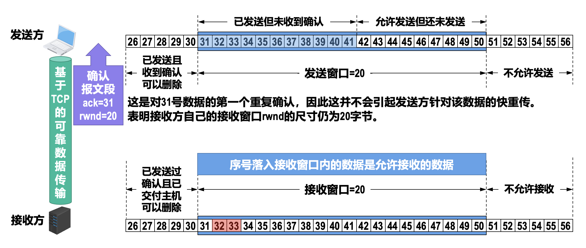
        

    === "Stage 4"

        

            
        

        

            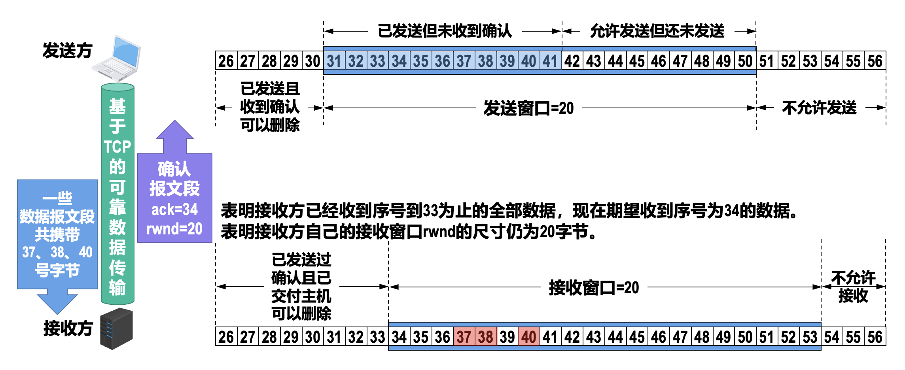
        

    === "Stage 5"

        

            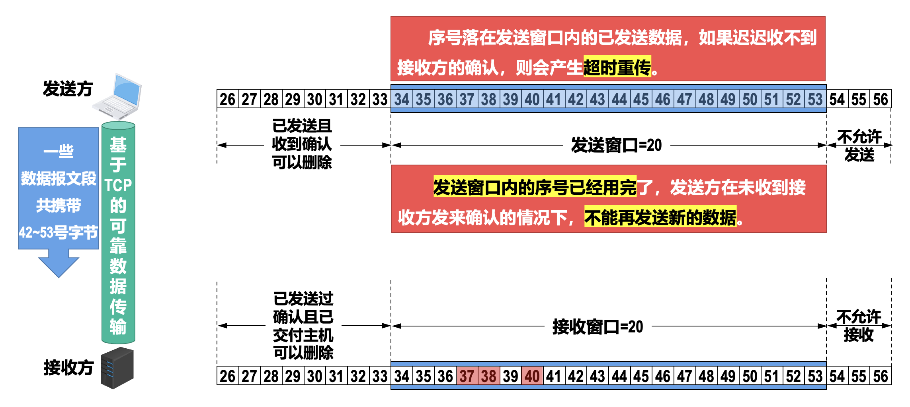
        

- 虽然发送方的发送窗口是根据接收方的接收窗口设置的，但在同一时刻，**发送方的发送窗口并不总是和接收方的接收窗口一样大**，这是因为：
    - 网络传送窗口值需要经历一定的时间滞后，并且这个时间还是不确定的
    - 发送方还可能根据网络当时的拥塞情况适当减小自己的发送窗口尺寸

- **对于不按序到达的数据应如何处理，TCP 并无明确规定**
    - 如果接收方把不按序到达的数据一律丢弃，那么接收窗口的管理将会比较简单，但这样做对网络资源的利用不利，因为发送方会重复传送较多的数据
    - TCP 通常对不按序到达的数据先临时存放在接收窗口中，等到字节流中所缺少的字节收到后，再按序交付上层的应用进程

- TCP 要求接收方必须有**累积确认**（这一点与选择重传协议不同）和**捎带确认**机制，这样可以减小传输开销；接收方可以在合适的时候发送确认，也可以在自己有数据要发送时把确认信息顺便捎带上
    - **接收方不应过分推迟发送确认**，否则会导致发送方不必要的超时重传，这反而浪费了网络资源
    - TCP 标准规定，确认推迟的时间不应超过 0.5 秒；若收到一连串具有最大长度的报文段，则必须每隔一个报文段就发送一个确认（[RFC 1122]）
    - 捎带确认实际上并不经常发生，因为大多数应用程序很少同时在两个方向上发送数据

- TCP 的通信是**全双工通信**：通信中的每一方都在发送和接收报文段
    - 因此，每一方都有自己的发送窗口和接收窗口；在读到这些窗口时，一定要弄清楚是哪一方的窗口

#### 超时重传时间的选择

TCP 超时重传时间（RTO）的选择是 TCP 最复杂的问题之一。

    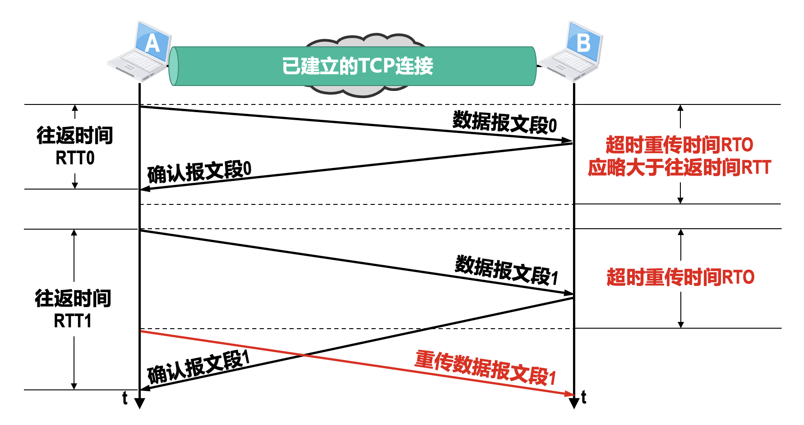

- 不能直接使用略大于某次测量得到的往返时间（RTT）样本的值作为 RTO，但是可以利用每次测量得到的 RTT 样本计算加权平均往返时间 RTTs，这样可以得到比较平滑的往返时间，即：

    $$
    \begin{aligned}
    & \text{RTT}_{S1} = \text{RTT}_1 \\
    & \text{New RTT}_S = (1 - \alpha) \times \text{Old RTT}_S + \alpha \times \text{New sample of RTT}
    \end{aligned}
    $$

    在上式中，$0 \le \alpha < 1$

    - 若 $\alpha$ 很接近于 0，则新 RTT 样本对 RTTs 的影响不大
    - 若 $\alpha$ 很接近于 1，则新 RTT 样本对 RTTs 的影响较大
    - 已成为建议标准的 [RFC 6298] 推荐的 $\alpha$ 值为 1/8

- 显然，RTO 的值应略大于加权平均 RTTs 的值（而不是某个 RTT 样本的值）
- [RFC 6298] 建议使用下式来计算 RTO：

    $$
    \text{RTO} = \text{RTT}_S + 4 \times \text{RTT}_D
    $$

    - 加权平均往返时间 $\text{RTT}_S$（公式见上面）
    - RTT 偏差的加权平均 $\text{RTT}_D$

        $$
        \begin{aligned}
        & \text{RTT}_{D1} = \text{RTT}_1 \div 2 \\
        & \text{New RTT}_D = (1 - \beta) \times \text{Old RTT}_D + \beta \times |\text{RTT}_S - \text{New sample of RTT}|
        \end{aligned}
        $$

        在上式中，$0 \le \beta < 1$；已成为建议标准的 [RFC 6298] 推荐的 $\beta$ 值为 1/4

    

通过上述两个例子可以看出：当发送方出现超时重传后，收到确认报文段时是无法判断出该确认到底是对原数据报文段的确认还是对重传数据报文段的确认，也就是无法准确测量出 RTT，进而无法正确计算 RTO。

解决方法——**Karn 算法**：在计算加权平均 RTTs 时，只要报文段重传了，就不采用其 RTT 样本。换句话说，出现重传时，不重新计算RTTs，进而 RTO 也不会重新计算。

但采用这种算法会引入新的问题。设想出现这样的情况：报文段的时延突然增大很多，并且之后很长一段时间都会保持这种时延（这可能是因为网络拓扑发生了变化）。因此在原来得出的 RTO 内，不会收到确认报文段，于是就重传报文段。但根据 Karn 算法，不考虑重传的报文段的 RTT 样本，因此 RTO 就无法更新，这会导致报文段反复被重传。

修正措施为：报文段每重传一次，就把 RTO 增大一些。典型的做法是将新 RTO 的值取为旧 RTO 的 2 倍。 

#### 选择确认

在之前介绍 TCP 的快重传和可靠传输时，TCP 接收方只能对按序收到的数据中的最高序号给出确认。当发送方超时重传时，接收方之前已收到的未按序到达的数据也会被重传。

TCP 可以使用**选择确认**(selective ACK, **SACK**)只传送缺少的数据而不重传已经正确到达、只是未按序到达的数据。

    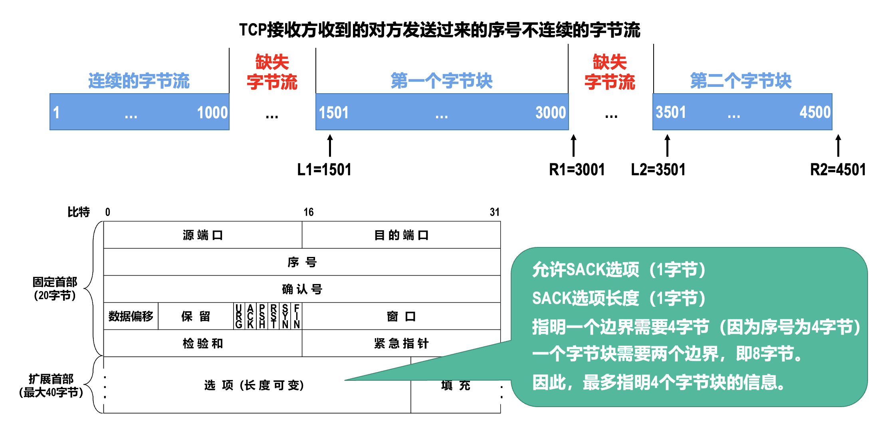

SACK 相关文档并没有指明发送方应当怎样响应 SACK，因此大多数的 TCP 实现还是重传所有未被确认的数据块。

## 应用层

**应用层**是计算机网络体系结构的最顶层，是设计和建立计算机网络的最终目的，也是计算机网络中发展最快的部分。

- 早期基于文本的应用（电子邮件、远程登录、文件传输、新闻组）
- 20 世纪 90 年代将因特网带入干家万户的万维网
- 当今流行的即时通信、P2P 文件共享及各种音视频应用
- 计算设备的小型化和“无处不在”，宽带住宅接入和无线接入的日益普及和迅速发展，为未来更多的新型应用提供了广阔的舞台

### 客户/服务器方式和对等方式

开发一种新的网络应用，首先要考虑的问题就是网络应用程序在各种端系统上的组织方式和它们之间的关系。目前流行的主要有以下两种：

- **客户/服务器**(client/server, **C/S**)方式

    

        
    

    - 客户和服务器是指通信中所涉及的两个应用进程
    - 客户/服务器方式所描述的是进程之间服务和被服务的关系
    - 客户是服务请求方，服务器是服务提供方
    - 服务器总是处于运行状态，并等待客户的服务请求
    - 服务器具有固定端口号（例如 HTTP 服务器的默认端口号为 80），而运行服务器的主机也具有固定的 IP 地址
    - 它是因特网上传统的、同时也是最成熟的方式，很多我们熟悉的网络应用采用的都是该方式，包括万维网、电子邮件、文件传输协议等
    - 基于 C/S 方式的应用服务通常是**服务集中型**的，即应用服务集中在网络中比客户计算机少得多的服务器计算机上
        - 由于一台服务器计算机要为多个客户机提供服务，在 CIS 应用中，常会出现服务器计算机跟不上众多客户机请求的情况
        - 为此，在 C/S 应用中，常用**计算机集群**（或服务器场）构建一个强大的**虚拟服务器**

- **对等**(peer-to-peer, **P2P**)方式

    

        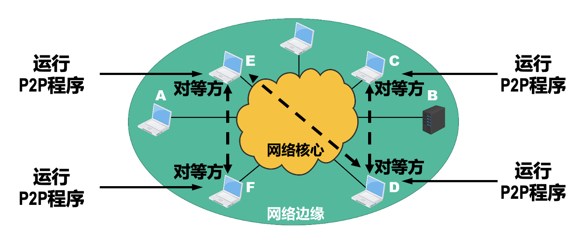
    

    - 没有固定的服务请求者和服务提供者，分布在网络边缘各端系统中的应用进程是对等的，被称为**对等方**
    - 对等方相互之间**直接通信**，每个对等方既是服务的请求者，又是服务的提供者
    - 目前，在因特网上流行的 P2P 应用主要包括 P2P 文件共享、即时通信、P2P 流介质、分布式存储等
    - 基于 P2P 的应用是**服务分散型**的，因为服务不是集中在少数几个服务器计算机中，而是分散在大量对等计算机中，这些计算机并不为服务提供商所有，而是为个人控制的桌面计算机和笔记本电脑，它们通常位于住宅、校园和办公室中
    - 最突出特性之一就是它的**可扩展性**，因为系统每增加一个对等方，不仅增加的是服务的请求者，同时也增加了服务的提供者，系统性能不会因规模的增大而降低
    - 该方式**具有成本上的优势**，因为它通常不需要庞大的服务器设置和服务器带宽；为了降低成本，服务提供商对于将 P2P 方式用于应用的兴趣越来越大

### 动态主机配置协议

**动态主机配置协议**（**DHCP**）可为计算机自动配置网络参数，使得计算机“即插即联网”(plug-and-play networking)。

    

DHCP 的基本工作过程如下：

=== "Stage 1"

    

        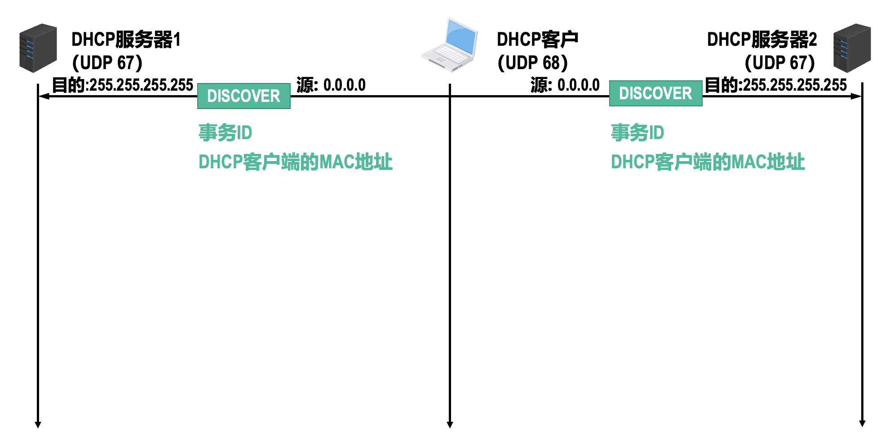
    

=== "Stage 2"

    

        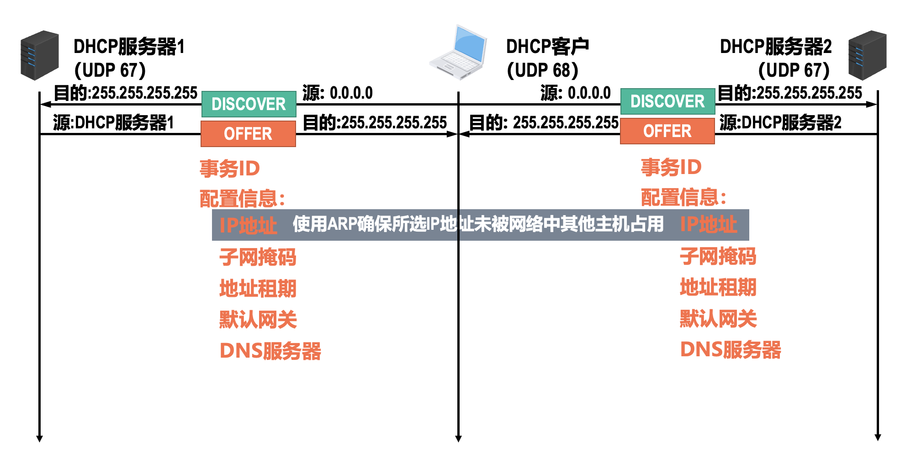
    

=== "Stage 3"

    

        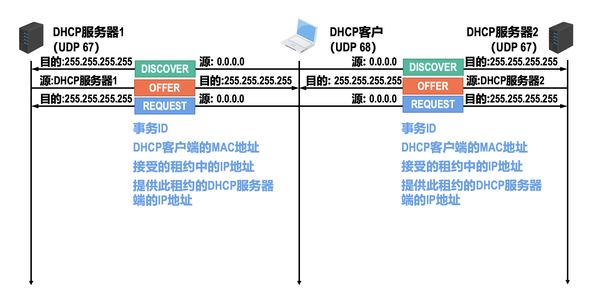
    

=== "Stage 4"

    

        
    

=== "Stage 5"

    

        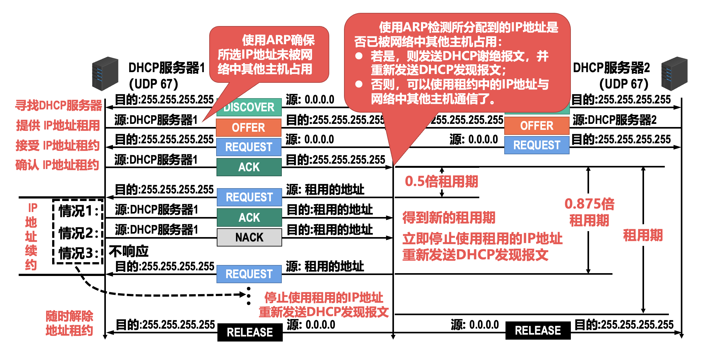
    

DHCP 中继代理：

    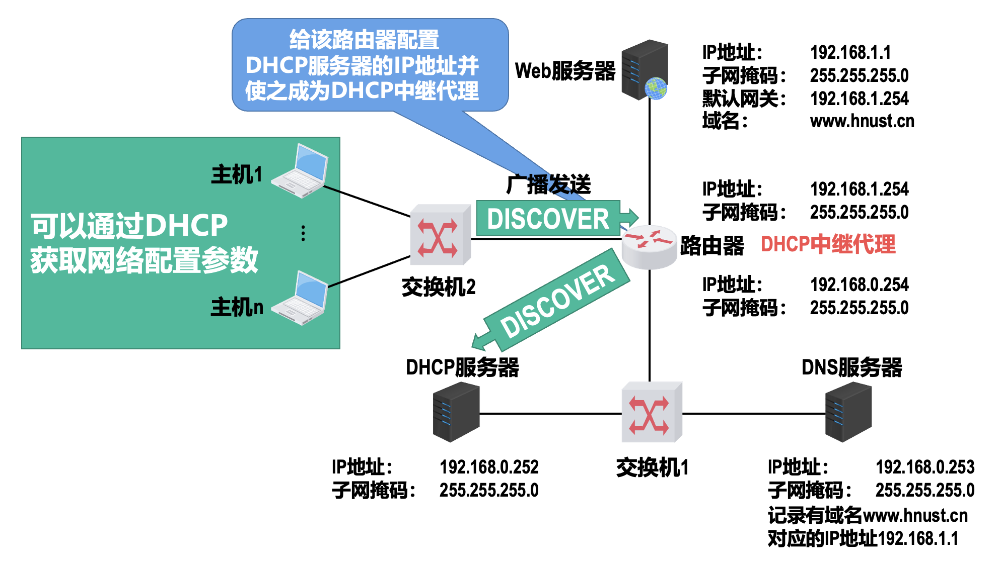

### 域名系统

早在 1983 年，因特网就开始采用层次结构的命名树作为主机的名字（即域名），并使用分布式的**域名系统**（**DNS**）。

- DNS 使大多数域名都在**本地解析**，仅少量解析需要在因特网上通信，因此系统效率很高
- 由于 DNS 是**分布式系统**，即使单个计算机出了故障，也不会妨碍整个系统的正常运行

#### 域名结构

- 因特网采用**层次树状结构**的域名结构

    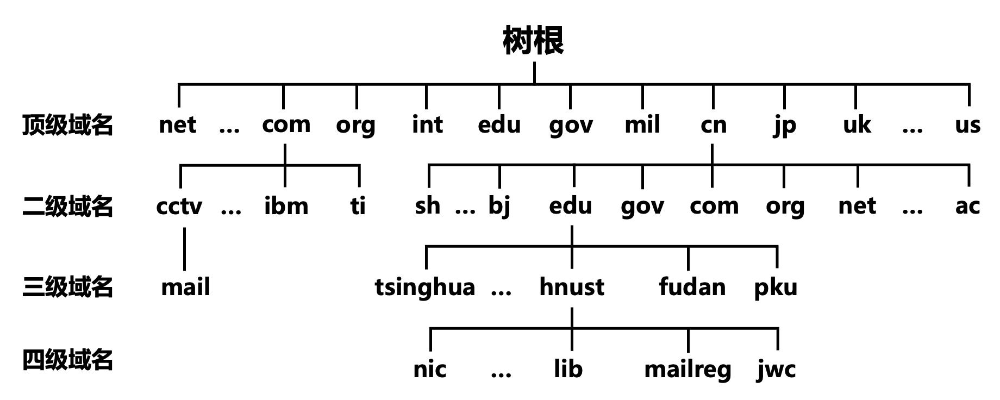

- 域名的结构由若干个分量组成，各分量之间用点隔开，分别代表不同级别的域名

    

    ... .三级域名.二级域名.顶级域名
    

    - 每一级的域名都由英文字母和数字组成，不超过 63 个字符，不区分大小写字母
    - 级别最低的域名写在最左边，而级别最高的顶级域名写在最右边
    - 完整的域名不超过 255 个字符

- 域名系统既不规定一个域名需要包含多少个下级域名，也不规定每一级的域名代表什么意思
- 各级域名由其上一级的域名管理机构管理，而最高的顶级域名则由 ICANN 进行管理
- **顶级域名**(top level domain，**TLD**)分为以下三类：
    - **国家**顶级域名（nTLD）：采用 ISO 3166 的规定。如 cn 表示中国，us 表示美国，uk 表示英国等等
    - **通用**顶级域名（gTLD）：最常见的通用顶级域名有七个，即：com（公司企业）、net（网络服务机构）、org（非营利性组织）、int（国际组织）、edu（教育机构）、gov（政府部门）、mil（军事部门）
    - **反向域**（arpa）：用于反向域名解析，即 IP 地址反向解析为域名

- **在国家顶级域名下注册的二级域名均由该国家自行确定**
    - 例如，顶级域名为 jp 的日本，将其教育和企业机构的二级域名定为 ac 和 co，而不用 edu 和 com

- **我国**则将二级域名划分为以下两类：
    - **类别**域名：共七个：ac（科研机构）、com（工、商、金融等企业）、edu（教育机构）、gov（政府部门）、net（提供网络服务的机构）、mil（军事机构）和 org（非营利性组织）
    
    - **行政区**域名：共 34 个，适用于我国的各省、自治区、直辖市，例如：bj 为北京市，sh 为上海市，js 为江苏省等等

#### 域名服务器

域名和 IP 地址的映射关系必须保存在域名服务器中，供所有其他应用查询。显然不能将所有信息都储存在一台域名服务器中。DNS 使用**分布在各地的域名服务器**来实现域名到 IP 地址的转换。

- **根域名服务器**
    - 最高层次的域名服务器
    - 每个根域名服务器都知道所有的顶级域名服务器的域名及其 IP 地址
    - 尽算我们将 **13 个**根域名服务器中的每一个都视为单个的服务器，但每台服务实际上是由许多分布在世界各地的计算机构成的**服务器集群**
        - 当本地域名服务器向根域名服务器发出查询请求时，路由器就把查询请求报文转发到离这个 DNS 客户最近的一个根域名服务器
        - 这就加快了 DNS 的查询过程，同时也更合理地利用了因特网的资源；根域名服务器通常并不直接对域名进行解析，而是返回该域名所属顶级域名的顶级域名服务器的 IP 地址

- **顶级域名服务器**
    - 负责管理在该顶级域名服务器注册的所有**二级域名**
    - 当收到 DNS 查询请求时就给出相应的回答，可能是最后的结果，也可能是下一级权限域名服务器的IP地址

- **权限域名服务器**
    - 负责管理**某个区的域名**
    - 每一个主机的域名都必须在某个权限域名服务器处注册登记，因此权限域名服务器知道其管辖的域名与 IP 地址的映射关系
    - 另外，权限域名服务器还知道其下级域名服务器的地址

- **本地域名服务器**（有时也称为默认域名服务器）
    - **不属于**上述的域名服务器的等级结构
    - 当一个主机发出 DNS 请求报文时，这个报文就首先被送往该主机的本地域名服务器
    - 本地域名服务器起着**代理**的作用，会将该报文转发到上述的域名服务器的等级结构中
    - 每一个 ISP，一个大学，甚至一个大学里的学院，都可以拥有一个本地域名服务器
    - 本地域名服务器离用户较近，一般不超过几个路由器的距离，也有可能就在同一个局域网中。本地域名服务器的 IP 地址需要直接配置在需要域名解析的主机中

#### 域名解析过程

- **递归查询**

    

        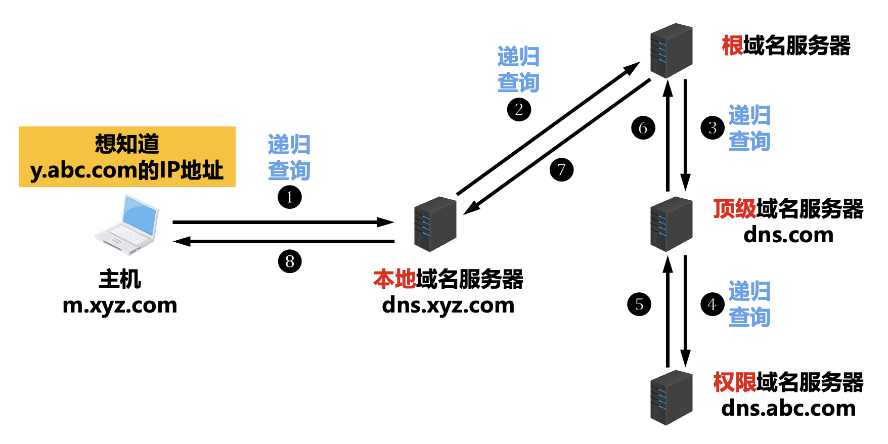
    

- **迭代查询**

    

        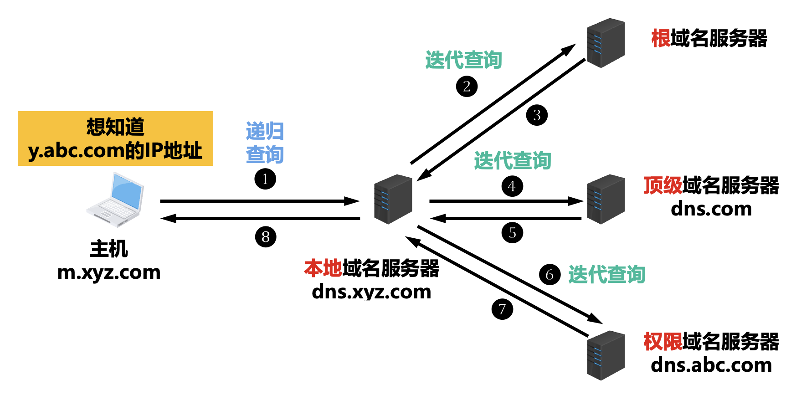
    

由于递归查询对于被查询的域名服务器负担太大，通常采用以下模式：

- 从请求主机到本地域名服务器的查询是**递归查询**
- 而其余的查询是**迭代查询**

为了提高 DNS 的查询效率，并减轻根域名服务器的负荷和减少因特网上的 DNS 查询报文数量，在域名服务器中广泛地使用了**高速缓存**，用来存放最近查询过的域名以及从何处获得域名映射信息的记录。

- 由于域名到 IP 地址的映射关系并不是永久不变，为保持高速缓存中的内容正确，域名服务器**应为每项内容设置计时器并删除超过合理时间的项**（比如每个项只存放两天）
- 不但在本地域名服务器中需要高速缓存，在**用户主机**中也很需要：许多用户主机在启动时从本地域名服务器下载域名和 IP 地址的全部数据库，维护存放自己最近使用的域名的高速缓存，并且只在从缓存中找不到域名时才向域名服务器查询；同理，主机也需要保持高速缓存中内容的正确性

    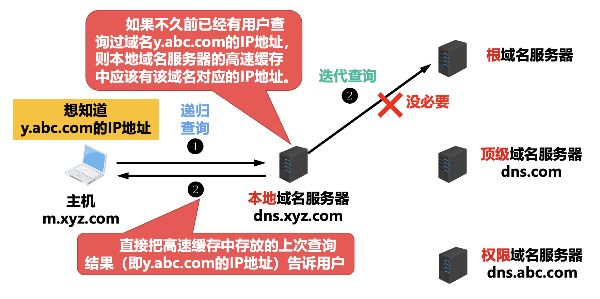

### 文件传输协议

将某台计算机中的文件通过网络传送到可能相距很远的另一台计算机中，是一项基本的网络应用，即文件传输。**文件传输协议**(file transfer protocol，**FTP**)是因特网上使用得最广泛的文件传送协议。

- 提供**交互式的访问**，允许客户指明文件的类型与格式，并允许文件具有存取权限（如访问文件的用户必须经过授权，并输入有效的口令）
- **屏蔽了各计算机系统的细节**，因而适合于在**异构网络**中任意计算机之间传送文件
- 根据应用需求的不同，FTP 服务器可能需要一台高性能和高可靠性的服务器计算机，也可能只需要一台普通的个人计算机即可
- 常见用途是在计算机之间传输文件，尤其是用于批量传输文件；另一个常见用途是让网站设计者将构成网站内容的大量文件批量上传到他们的 Web 服务器

FTP 的基本工作原理：

- **主动模式**：建立数据通道时，FTP 服务器主动连接 FTP 客户

    

        
    

- **被动模式**：建立数据通道时，FTP 服务器被动等待 FTP 客户的连接

    

        
    

### 电子邮件

**电子邮件**(e-mail)是因特网上最早流行的一种应用，并且仍然是当今因特网上最重要、最实用的应用之一。

- 电子邮件与邮政系统的寄信相似：
    1. 发件人将邮件发送到自己使用的邮件服务器
    2. 发件人的邮件服务器将收到的邮件按其目的地址转发到收件人邮件服务器中的收件人邮箱
    3. 收件人在方便的时候访问收件人邮件服务器中自己的邮箱，获取收到的电子邮件

- 电子邮件使用方便、传递迅速而且费用低廉；它不仅可以传送文字信息，而且还可附上声音和图像
- 电子邮件系统采用**客户/服务器方式**
- 三个主要组成构件：
    - **用户代理**：用户与电子邮件系统的接口，又称为电子邮件客户端软件
    - **邮件服务器**：电子邮件系统的基础设施；因特网上所有的 ISP 都有邮件服务器，其功能是发送和接收邮件，同时还要负责维护用户的邮箱
    - 电子邮件所需的**协议**：邮件**发送协议**（例如 SMTP）和邮件**读取协议**（例如 POP3, IMAP）

    

#### SMTP 的基本工作过程

**简单邮件传输协议**(simple mail transfer protocol, **SMTP**)的基本工作过程如下图所示：

    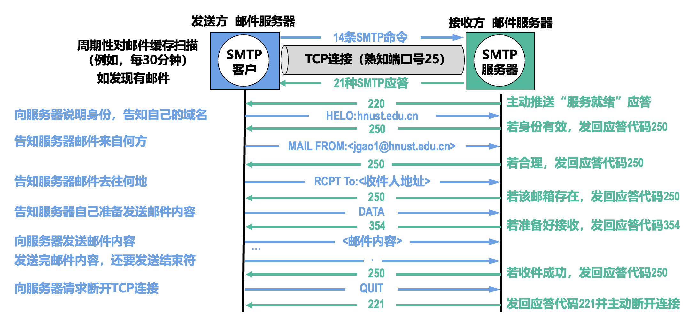

???+ info "注"

    - 为了简单起见，省略了认证过程
    - 应答代码后面一般都跟有简单的描述信息
    - 不同的 SMTP 服务器给出的相同应答代码的描述信息可能不同

#### 电子邮件的信息格式

电子邮件的信息格式并不是由 SMTP 定义的，而是在 [RFC 822] 中单独定义的。这个 RFC 文档已在 2008 年更新为 [RFC 5322]。一个电子邮件有**信封**和**内容**两部分。而内容又由**首部**和**主体**两部分构成。

    

#### 多用途因特网邮件扩展

???+ bug "SMTP 的问题"

    - SMTP 协议只能传送 **ASCII 码文本数据**，不能传送可执行文件或其他的二进制对象
    - SMTP 不能满足传送多媒体邮件（例如带有图片、音频或视频数据）的需要，并且许多其他非英语国家的文字（例如中文、俄文、甚至带有重音符号的法文或德文）也无法用 SMTP 传送

为解决 SMTP 传送非 ASCII 码文本的问题，提出了**多用途因特网邮件扩展**(multipurpose Internet mail
extensions, MIME)。

    

- 增加了 5 个新的邮件首部字段，这些字段提供了有关邮件主体的信息
- 定义了许多邮件内容的格式，对多媒体电子邮件的表示方法进行了标准化
- 定义了传送编码，可对任何内容格式进行转换，而不会被邮件系统改变

实际上，MIME 不仅仅用于 SMTP，也用于后来的同样面向 ASCII 字符的 HTTP。

#### 常用的邮件读取协议

- **邮局协议**(post office protocol, POP)（端口号为 110）
    - POP3 是其第三个版本，是因特网正式标准
    - 非常简单、功能有限的邮件读取协议
    - 用户只能以**下载并删除**方式或**下载并保留**方式从邮件服务器下载邮件到用户方计算机
    - 不允许用户在邮件服务器上管理自己的邮件（例如创建文件夹，对邮件进行分类管理等）

- **因特网邮件访问协议**(Internet message access protocol)（端口号为 143）
    - IMAP4 是其第四个版本，是因特网建议标准
    - 功能比 POP3 强大的邮件读取协议
    - 用户在自己的计算机上就可以操控邮件服务器中的邮箱，就像在本地操控一样，因此 IMAP 是一个**联机协议**

这两种协议都是采用基于 TCP 连接的客户/服务器方式。

#### 基于万维网的电子邮件

通过浏览器登录（提供用户名和口令）**邮件服务器万维网网站**就可以撰写、收发、阅读和管理电子邮件。这种工作模式与 IMAP 很类似，不同的是用户计算机**无需安装专门的用户代理程序**，只需要使用通用的万维网浏览器。

邮件服务器网站通常都提供非常强大和方便的邮件管理功能，用户可以在邮件服务器网站上管理和处理自己的邮件，而不需要将邮件下载到本地进行管理。

    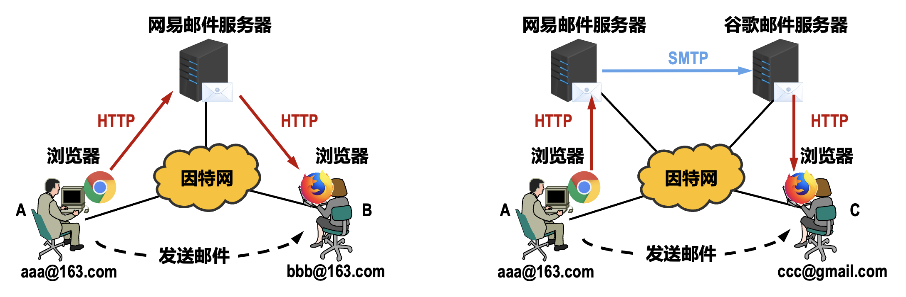

### 万维网

**万维网**(world wide web, WWW)并非某种特殊的计算机网络。它是一个大规模的、联机式的信息储藏所，是运行在因特网上的一个分布式应用。它利用网页之间的**超链接**将不同网站的网页链接成一张逻辑上的信息网。欧洲粒子物理实验室的 Tim Berners-Lee 最初于 1989 年 3 月提出万维网。

- 1993 年 2 月，第一个图形界面的浏览器 Mosaic
- 1995 年著名的 Netscape Navigator 浏览器上市
- 目前比较流行的浏览器有 Chrome, Firefox, Safari, Opera 等
- 浏览器最重要的部分是**渲染引擎**，也就是**浏览器内核**，负责对网页内容进行解析和显示
    - 不同的浏览器内核对网页内容的解析也有不同，因此同一网页在不同内核的浏览器里的显示效果可能不同
    - 网页编写者需要在不同内核的浏览器中测试网页显示效果

#### 统一资源定位符

为了方便地访问在世界范围的文档，万维网使用**统一资源定位符**（**URL**）来指明因特网上任何种类资源的位置。URL 一般由以下四个部分组成：

<协议>://<主机>:<端口>/<路径>

#### 万维网文档

- **HTML**（超文本标记语言(hypertext markup language)）：使用多种**标签**来描述网页的**结构和内容**

    

        
    

- **CSS**（层叠样式表(cascading style sheet)）：从审美的角度来描述网页的**样式**

    

        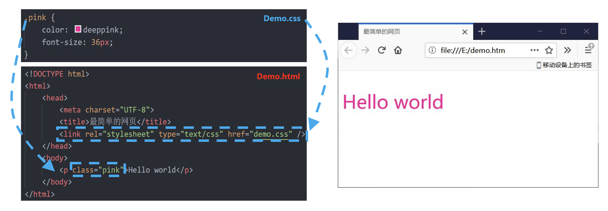
    

- **JavaScript**：一种脚本语言（和 Java 没有任何关系），控制网页的**行为**

    

        
    

#### 超文本传输协议

**超文本传输协议**(hypertext transfer protocol, HTTP)：

- 定义了浏览器（即万维网客户进程）怎样向万维网服务器请求万维网文档，以及万维网服务器怎样把万维网文档传送给浏览器
- **HTTP/1.0** 采用**非持续连接方式**：在该方式下，每次浏览器要请求一个文件都要与服务器建立 TCP 连接，当收到响应后就立即关闭连接
    - **每请求一个文档就要有两倍的 RTT 的开销**；若一个网页上有很多引用对象（例如图片等），那么请求每一个对象都需要花费 2RTT 的时间
    - 为了减小时延，浏览器通常会建立**多个并行的 TCP 连接同**时请求多个对象，但这会大量占用万维网服务器的资源，特别是万维网服务器往往要同时服务于大量客户的请求，这会使其负担很重

    

        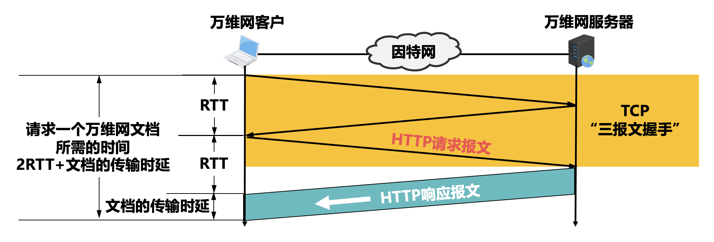
    

- **HTTP/1.1** 采用**持续连接方式**：在该方式下，万维网服务器在发送响应后仍然保持这条连接，使同一个客户（浏览器）和该服务器可以继续在这条连接上传送后续的 HTTP 请求报文和响应报文；这并不局限于传送同一个页面上引用的对象，而是只要这些文档都在同一个服务器上就行
    - 为了进一步提高效率，HTTP/1.1 的持续连接还可以使用**流水线**方式工作，即浏览器在收到 HTTP 的响应报文之前就能够连续发送多个请求报文，这样的一个接一个的请求报文到达服务器后，服务器就发回一个接一个的响应报文，能够节省了很多个RTT时间，使 TCP 连接中的空闲时间减少，提高了下载文档的效率

- HTTP 的报文格式：HTTP 是面向文本的，其报文中的每一个字段都是一些 **ASCII 码串**，并且每个字段的**长度**都是**不确定**的
    - 请求报文：

        

            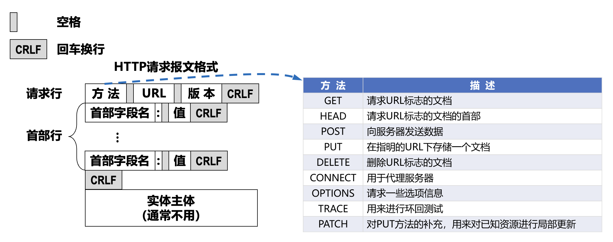
        

        ??? example "例子"

            

                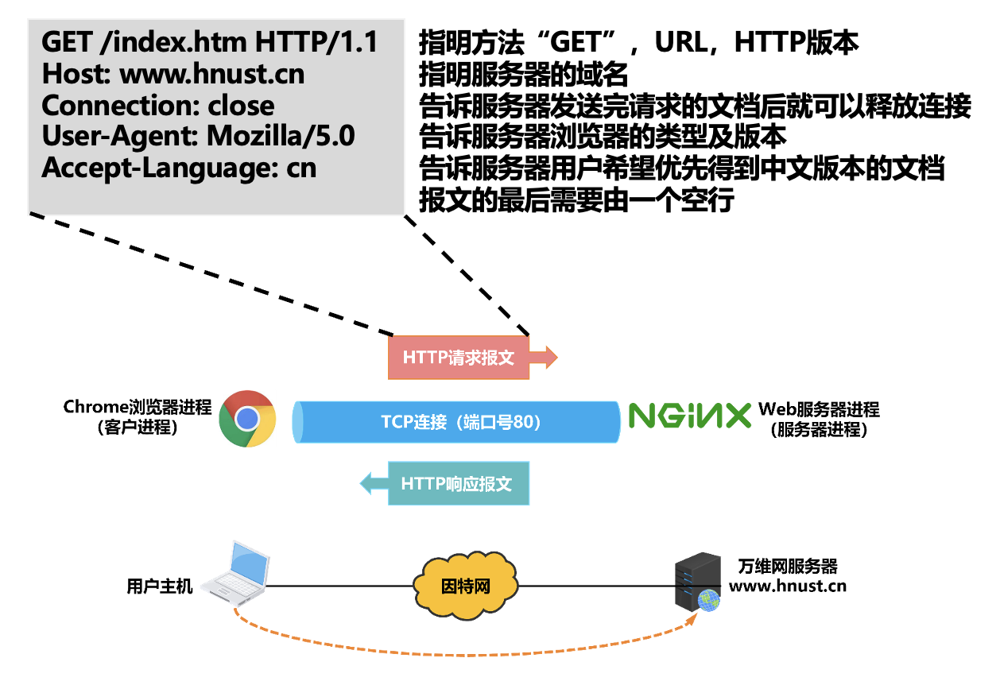
            

    - 响应报文：

        

            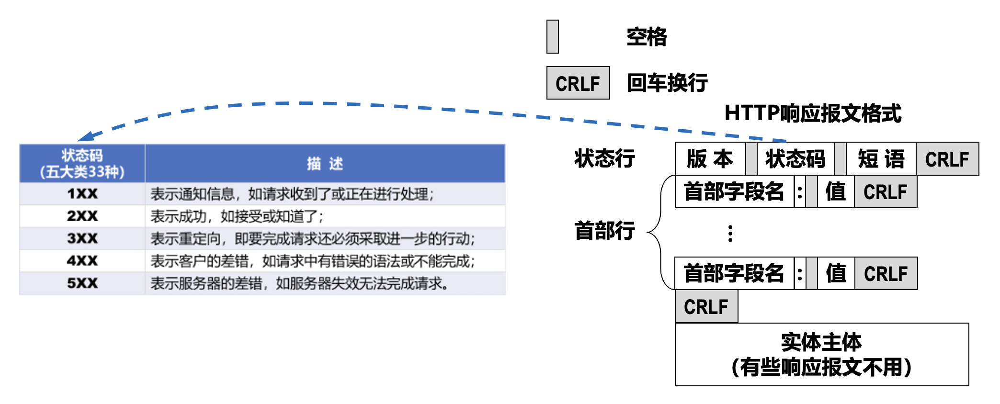
        

        - 响应报文中常见的状态行：
            - HTTP/1.1 202 Accepted -> 接受请求
            - HTTP/1.1 400 Bad Request -> 错误的请求
            - HTTP/1.1 404 Not Found -> 找不到页面

#### 使用 Cookie 在服务器上记录信息

- 早期的万维网应用非常简单，仅仅是用户查看存放在不同服务器上的各种静态的文档，因此 HTTP 被设计为一种**无状态**的协议，这样可以简化服务器的设计
- 现在，用户可以通过万维网进行各种复杂的应用，如网上购物、电子商务等，这些应用往往需要万维网服务器能够识别用户
- **Cookie** 提供了一种机制使得万维网服务器能够记住用户，而无需用户主动提供用户标识信息，也就是说这是一种对无状态的 HTTP 进行**状态化**的技术

    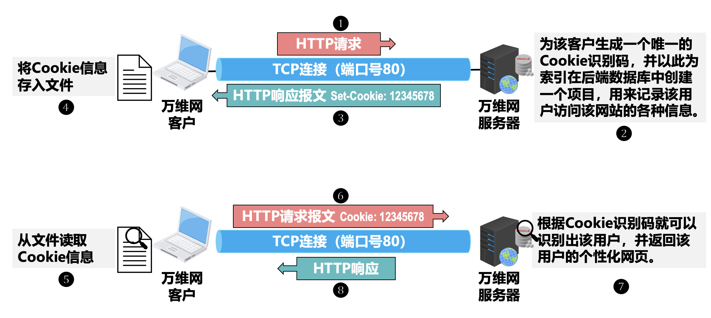

#### 万维网缓存与代理服务器

- 在万维网中还可以使用**缓存机制**以提高万维网的效率
- 万维网缓存又称为 **Web 缓存**(Web cache)，可位于客户机，也可位于中间系统上
    - 位于中间系统上的 Web 缓存又称为**代理服务器**(proxy server)
    - Web 缓存把最近的一些请求和响应暂存在本地磁盘中；当新请求到达时，若发现这个请求与暂时存放的请求相同，就返回暂存的响应，而不需要按 URL 的地址再次去因特网访问该资源
    - 若 Web 缓存的命中率比较高，那将大大减少了该链路上的通信量，因而减少了访问因特网的时延

    

    

    

