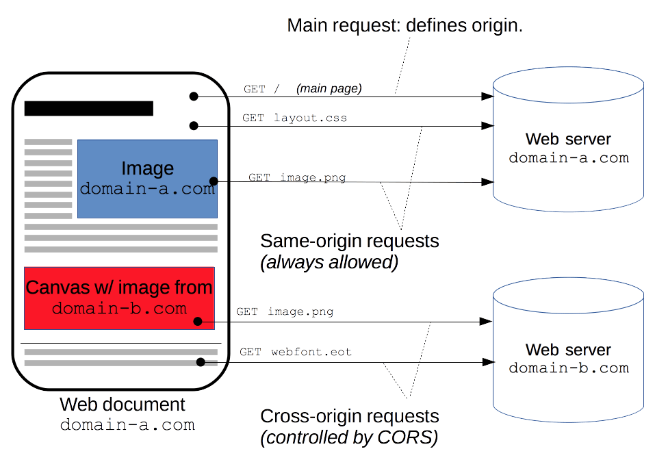
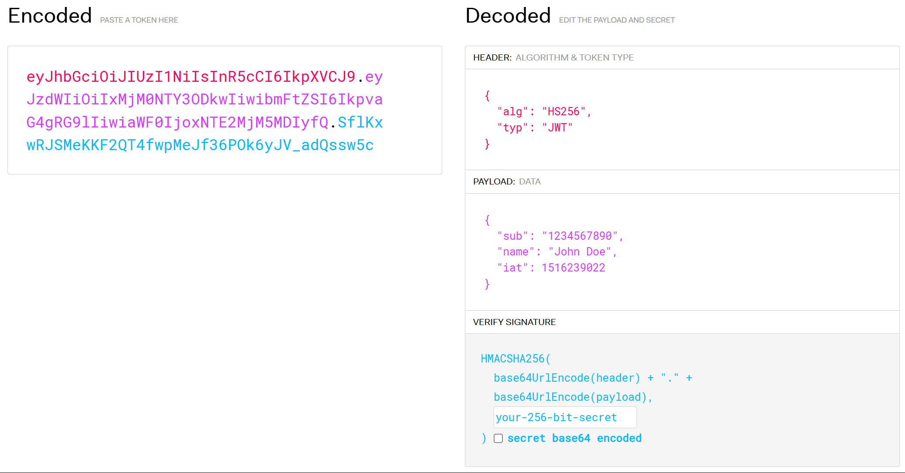
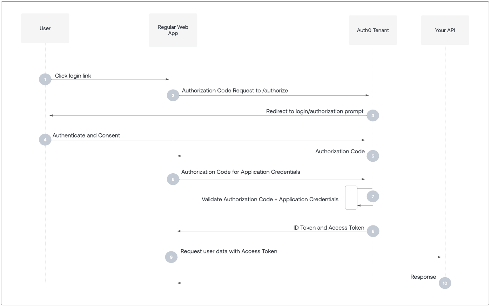

# HTTP 安全相关知识

!!! abstract "参考资料"

    - [维基百科：CORS](https://zh.wikipedia.org/wiki/%E8%B7%A8%E4%BE%86%E6%BA%90%E8%B3%87%E6%BA%90%E5%85%B1%E4%BA%AB)
    - [MDN：CORS](https://developer.mozilla.org/zh-CN/docs/Web/HTTP/CORS)
    - [阮一峰的网络日志：跨域资源共享 CORS 详解](https://www.ruanyifeng.com/blog/2016/04/cors.html)
    - [Fetch: 跨源请求](https://zh.javascript.info/fetch-crossorigin)
    - 密码学基础知识主要参考维基百科

## CORS

??? question "何时用到 CORS 请求？"

    <div style="text-align: center">
        
    </div>


跨域资源共享（cross-origin resource sharing，CORS）允许服务器标示除了它自己以外的其他源（域、协议或端口），使得浏览器允许这些源访问加载自己的资源，这一过程有浏览器自动完成。比起严格的同源请求，这提供了更多自由度和功能性，也比直接允许所有的跨源请求更为安全。


### 实现流程

浏览器将 CORS 请求分为简单请求（simple request）和非简单请求（non-simple request）。只要满足下面两个条件即为简单请求，否则为非简单请求。

- 请求方法为三者之一：`HEAD`、`GET`、`POST`
- HTTP 报头信息不超出以下几种字段：
    - `Accept`
    - `Accept-Language`
    - `Content-Language`
    - `Last-Event-ID`
    - `Content-Type`：值为三者之一 `application/x-www-form-urlencoded`、`multipart/form-data`、`text/plain`

??? info "注"

    - 这里的划分依据来自阮一峰的博客，与 [MDN 文档](https://developer.mozilla.org/zh-CN/docs/Web/HTTP/CORS#%E7%AE%80%E5%8D%95%E8%AF%B7%E6%B1%82)上的略有出入
    - 这只是简单的划分依据，实际上是根据请求是否有**副作用**来区分简单请求和非简单请求，以防副作用对服务器造成的影响。

#### 简单请求

简单请求中，浏览器会在 HTTP 报头添上一个 `Origin` 字段作为 CORS 请求，该字段的值为请求的源地址（协议 + 域名 + 端口），服务器根据此值决定是否同意这次请求。

``` http
GET /cors HTTP/1.1
Origin: http://www.example.com
Host: api.alice.com
Accept-Language: en-US
Connection: keep-alive
User-Agent: Mozilla/5.0...
```

- 若同意，服务器的响应报头会多出一些字段：
    - `Access-Control-Allow-Origin`：（必须）其值要么是 `Origin` 的值，要么是 `*`，表示接受所有域名
    - `Access-Control-Allow-Credentials`：（可选）表示是否允许发送 Cookie，其值为布尔型，只能为 `true`，想要禁掉的话直接删掉该字段（CORS 请求默认是不发送 Cookie 的）
        - 如果要发送 Cookie，除了将值设为 `true` 外，还得在 AJAX 请求中进行如下设置，否则浏览器不会发送或设置 Cookie。此外，`Access-Control-Allow-Origin` 必须设置明确的域名，不能设为 `*`，否则也无法上传
        
        ``` js
        var xhr = new XMLHttpRequest();
        xhr.withCredentials = true;
        ```

        - 有时即使删掉这个字段，浏览器还是会发送 Cookie，这时需要显式关闭 `withCredentials`

        ``` js
        xhr.withCredentials = false;
        ```
        
    - `Access-Control-Expose-Headers`：（可选）用来设置 `XMLHttpRequest` 对象的`getResponseHeader()` 方法额外获取的响应头字段（往往是不太安全的字段）（比如下面的例子表明会调用`getResponseHeader('Content-Length')`，返回 `Content-Length` 字段的值）

    ``` http
    Access-Control-Allow-Origin: http://www.example.com
    Access-Control-Allow-Credentials: true
    Access-Control-Expose-Headers: Content-Length
    Content-Type: text/html; charset=utf-8
    ```

    ???+ info "默认可以访问的响应头字段"

        - `Cache-Control`
        - `Content-Language`
        - `Content-Type`
        - `Expires`
        - `Last-Modified`
        - `Pragma`

        这些字段无需用 `Access-Control-Expose-Headers` 设置，它们时安全的响应头字段。

- 若不同意，服务器会返回一个正常的 HTTP 响应，它的报头没有包含 `Access-Control-Allow-Origin` 字段，并给出错误消息（无法根据状态码判断，因为有可能显示 200），被 `XMLHttpRequest` 的 `onerror` 回调函数捕获。

#### 非简单请求

非简单请求的 CORS 请求会先进行一次「**预检**」（preflight）请求后再进行正式的 HTTP 请求。这个预检请求，就是浏览器先询问服务器当前所在域名是否在许可名单内，以及可以使用哪些 HTTP 动词和头信息字段。若浏览器得到肯定的回应，那么会发出正式的 `XMLHttpRequest` 请求，否则报错。下面是一个预检请求的 HTTP 报头：

``` http
OPTIONS /cors HTTP/1.1
Origin: http://api.user.com
Access-Control-Request-Method: PUT
Access-Control-Request-Headers: X-Custom-Header
Host: api.admin.com
Accept-Language: en-US
Connection: keep-alive
User-Agent: Mozilla/5.0...
```

- `OPTIONS`：预检请求的方法，表示该请求用于询问
- `Origin` ：表示请求来自哪个源
- `Access-Control-Request-Method`：列出 CORS 请求用到的 HTTP 方法
- `Access-Control-Request-Headers`：指定 CORS 请求额外发送的头信息字段

---
下面是服务器对该预检请求的 HTTP 响应报头：

``` http
HTTP/1.1 200 OK
Date: Mon, 05 Aug 2024 13:21:56 GMT
Server: Apache/2.0.61 (Unix)
Access-Control-Allow-Origin: http://api.user.com
Access-Control-Allow-Methods: GET, POST, PUT
Access-Control-Allow-Headers: X-Custom-Header
Content-Type: text/html; charset=utf-8
Content-Encoding: gzip
Content-Length: 0
Keep-Alive: timeout=2, max=100
Connection: Keep-Alive
Content-Type: text/plain
```

- `Access-Control-Allow-Origin`：表示允许发起请求的域名（可以有多个），`*` 表示同意任意跨源访问。若服务器否定预检请求，处理方式几乎同上面的[简单请求](#简单请求)，控制台会打印如下报错信息：

    ```
    XMLHttpRequest cannot load http://api.admin.com.
    Origin http://api.user.com is not allowed by Access-Control-Allow-Origin.
    ```

- `Access-Control-Allow-Methods`：（必须）列出**服务器**支持的所有跨域请求的方法，所以是浏览器请求方法的超集
- `Access-Control-Allow-Headers`：（若请求中有该字段时则必须）表明服务器支持的所有头信息字段，也是浏览器请求中同名字段的超集
- `Access-Control-Allow-Credentials`：（可选）同[简单请求](#简单请求)
- `Access-Control-Max-Age`：（可选）指定预检请求的有效期（缓存时间），是一个整数值，单位为秒

!!! info "注"

    - 当 `Access-Control-Allow-Origin: *` 时，`Access-Control-Allow-Credentials` 的值默认为 `false`，不能设为 `true`
    - `Access-Control-Allow-Methods` 和 `Access-Control-Allow-Headers` 的值也可以设为 `*`，但是对于附带身份凭证的请求，包括 `Access-Control-Allow-Origin` 的这三个字段的值不能设为 `*`，必须指定具体的值


若预检请求通过，之后浏览器发送的 CORS 请求与简单请求相同，也会自动添加一个 `Origin` 字段，而且服务器的响应报头中也会有 `Access-Control-Allow-Origin` 字段。

### 实际使用上的细节

- 所有的 CORS 限制都是由请求方（浏览器提供的 API，比如 `FetchAPI` 和 `XMLHttpRequest`）完成的，所有的验证由请求方负责。
- 所以，可以通过避免使用这些 API 来绕过 CORS。比如微信小程序开发中 `request API` 没有实现 CORS、普通浏览器中一些没有 CORS 的请求方法等等。
- 服务器在 CORS 流程仅仅发了个响应，这一工作可以在路由部分完成。

## 登录、鉴权

### 密码学基础知识

- 散列函数：将数据打乱混合，重新创建一个叫做散列值的指纹，具有不可逆性。用于加密数据库中的密码字符串、错误校正、语音识别等场景，常用算法有 [SHA-2](https://en.wikipedia.org/wiki/SHA-2) 等。
- 对称加密：加密和解密时使用相同的密钥，常用算法有 AES 等。
- 非对称加密：用到公钥（用于加密，看作:lock:，可公开）和私钥（解密，看作:key:，必须保密），是两个不同的密钥，只要没有获得私钥就无法破解密文。常见算法有 RSA、ed25519 等。
- 对称 + 非对称加密：先用**非对称加密**加密<u>对称加密的密钥</u>，再用**对称加密**加密明文。
- 盐：当散列函数生成值的范围过小时，可用暴力枚举的方法得到散列函数的反函数表（称为彩虹表）来破解密文。所以在使用散列函数前需要在明文的任意固定位置插入特定的（可以是随机的）字符串，这种方法称为「加盐」，可以有效阻止彩虹表攻击。
- 签名：一种防止公开消息（比如软件作者等）被篡改的方法。常用方法有 MAC，可理解为一种带密码的散列函数，只有带正确密钥的人才能得到相同的值。还可以用非对称加密，只要将私钥用于加密，公钥用于解密即可，这样的话只有私钥所有者才能发布信息。
- 传输层安全性协议（transport layer security, TLS）：用于保证 HTTPS 的安全性，由上面的对称 + 非对称加密方法传递信息，加上数字证书验证服务器身份的过程。

### 一个反面教材

<figure style=" width: 90%" markdown="span">
    
    
    <figcaption></figcaption>
</figure>

有以下几个问题：

- 这里采取直接传递密码的方式，攻击者可以中途拦截信息，造成密码泄露。而且攻击者可以在尚未破解密码的情况下，直接将原请求发送给服务器，这种攻击方式称为「中间人攻击」。
- 即使传输过程是安全的，但如果请求中包含密码，且请求次数较多，攻击者可能还有机会从请求信息中破解密码。
- 如果数据库直接存储密码本身，那么攻击者可以通过注入攻击的方法获取密码。

可以分别通过以下方法解决它们：

- 造成中间者攻击可行的原因是缺乏身份验证，服务器无法确认信息发送者的身份。所以需要用到 HTTPS 协议，它可以确认发送者的身份，而且能确保传输过程的安全。
- 第二个问题的解决方法是将权限认证分为登录和鉴权两步：
    - 登录时需要用密码或其他认证方式证明身份；
    - 登录后的其他请求无需再次认证，这就需要用到一些鉴权方式来实现，下面马上会将到。
- 让数据库存储「加盐」后的密码，这样即使泄露了数据库的“密码”问题也不是很大，同时也能让服务器不知道真正的密码，更加安全。

### 一些常见的鉴权实现

Token 是最常见的一种鉴权实现，以下token 鉴权的流程：

- 用户登录后，服务器生成一个代表用户身份的令牌，即 token，并发送给客户端
- 之后的请求中，客户端需携带 token 发起请求，服务器根据 token 验证身份

token 的安全问题来自客户端，它存储的数据不一定能保证安全，因此通过 token 过期来提高安全性，可根据安全性和用户体验设置合理的过期时间。

常见的 token 有 Session、API key、Bearer Token、Basic Auth 等等，下面对一些典型的 Token 展开介绍：

- Session 是最简单的一种 token，它的使用流程类似上面提到的 token 鉴权流程，但其中的 token 是 sessionID。这样，服务器可以管理每个登录会话的状态了。

- [Json Web Token（JWT）](https://jwt.io/)是 token 的一种特殊实现。
    - 它的特点是在 token 中携带一些用户信息（不能是敏感信息，因为信息未被加密），生成时会使用一个密钥，对整个 token 用 HMAC 加密，防止被篡改。因为 JWT 自带用户信息，所以无需像普通 token 一样拿着这个 token 查找用户信息，从而减小鉴权压力，同时无需考虑数据同步的问题。
    - JWT 内还包含用户权限的范围，这样通过解析 JWT 来直接确定用户权限，无需查找数据库
    - JWT 是无状态的（context-less），缺点是无法像会话那样强制注销
    - 格式：

    <div style="text-align: center">
        
    </div>

- [Oauth2](https://auth0.com/docs/authenticate/protocols/oauth) 规范是一种用于第三方授权的鉴权方式，其核心内容是“如何让用户经由一个**权限管理中心**来赋予客户端权限”，共有四种方式（鉴权码流程、表单提交的隐式流程、资源所有者口令流程、客户端证书流程）。下面以第一种方式为例讲解：

    <div style="text-align: center">
        
    </div>

    其中，Regular Web App 是应用程序，Auth Tenant 是“权限管理中心”，API 负责管理资源，应用需要请求 API 获取用户能获得的资源。

    - 用户登录时，应用程序会向权限管理中心发送授权请求，然后权限管理中心将请求重定向至它提供的授权界面，用户在该页面登录即可。
    - 登录成功后，权限管理中心携带授权信息，重定向到应用程序定好的地址上，完成授权。
    - 之后的操作视情况而定：有的应用程序需要去全向管理中心进一步获取 access token，以请求 API 资源；有的应用程序只需获取必要的用户授权信息即可。

    :chestnut:：[飞书](https://open.feishu.cn/document/client-docs/h5/development-guide/step-3)、[Google](https://developers.google.com/identity/protocols/oauth2/javascript-implicit-flow?hl=zh-cn#obtainingaccesstokens)